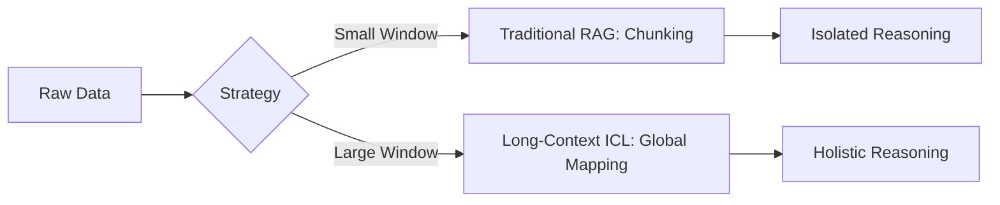

In the early days of the Generative AI revolution, the industry was obsessed with "Parameters." We measured progress by the billions, then trillions, of weights packed into a model's neural architecture. But by 2026, the consensus has shifted. As we stand in the era of Gemini 3.0 and Claude 4, we’ve realized that raw intelligence is useless without a high-fidelity, low-latency "Working Memory." 

Welcome to the age of **Context Engineering**. If the LLM is the CPU, context is the RAM. And just as in traditional computing, the way we manage this RAM defines the ceiling of what the system can actually accomplish.

<!--truncate-->

## Introduction: Context as the Bottleneck for Intelligence

For years, we treated the context window as a "junk drawer." If a model supported 128K tokens, we tried to cram 128K tokens of raw text into it and hoped for the best. The results were often underwhelming: hallucinations, ignored instructions, and "memory lapses."

The "Bitter Lesson" of 2025 taught us that intelligence is not just a function of model scale, but of **Information Density**. A model with 2M tokens of context is not "smarter" if it has to sift through 1.9M tokens of noise. Context Engineering is the discipline of surgically assembling the optimal prompt state to maximize the model's reasoning capabilities. It is the transition from "Retrieval-Augmented Generation" (RAG) to "Context-Optimized Reasoning." In this new paradigm, we prioritize the *signal-to-noise ratio* (SNR) of the prompt, recognizing that every irrelevant token is a tax on the model's cognitive bandwidth.

## Beyond RAG: The Rise of Long-Context ICL

In 2024, Retrieval-Augmented Generation (RAG) was the king. We broke documents into 500-token chunks, stored them in vector databases, and retrieved the top 5 matches. This was a necessity born of small context windows (8K to 32K tokens). 

However, the rise of **Long-Context In-Context Learning (ICL)**, pioneered by Google’s Gemini 1.5 Pro and perfected in the 2M+ token windows of Gemini 2.0 and 3.0, has changed the game. When you can fit an entire repository of 50,000 files into a single prompt, the traditional RAG "chunking" strategy actually becomes a liability. Chunking destroys the structural relationships between files; it loses the "connective tissue" of codebases.

**The 2026 Perspective:** We no longer "retrieve chunks"; we "curate environments." Long-context models allow for global reasoning that RAG could never achieve. For example, a model can now identify a subtle architectural inconsistency between a frontend React component and a backend Go service because it "sees" both simultaneously, rather than seeing them as isolated fragments. This enables what we call **"Holistic Debugging,"** where the model traces data flow across the entire stack in one single inference pass.



## The "Lost in the Middle" Problem: Attention Decay Analysis

Despite the massive windows of 2026, the fundamental physics of the Transformer architecture remain: **Attention is a finite resource.**

Research from Anthropic (Claude 4) and Google (Gemini 3) confirms that models still exhibit a "U-shaped" performance curve. Information placed at the very beginning (System Prompt) and the very end (User Query) of the context is handled with high precision. However, information buried in the middle often suffers from **Attention Decay**.

Analytically, this is due to the softmax normalization in the attention mechanism. In a 1-million-token sequence, a single relevant token in the middle must compete with 999,999 other tokens for a slice of the attention probability. Furthermore, the **Key-Value (KV) Cache**—the memory structure that stores the attention states—becomes increasingly "noisy" as sequence length grows. Long-range dependencies must traverse hundreds of layers of self-attention, and without explicit reinforcement, the signal often dissipates.

**Engineering Solution:** We now use **Attention-Aware Ranking**. We don't just provide relevant info; we place the most critical "reasoning anchors"—such as core API definitions or critical constraints—at the periphery of the context window. By sandwiching the "heavy" data between high-importance anchors at the start and end, we exploit the natural architectural bias of the model to maintain focus where it matters most.

## Context Pruning: Algorithmic Token Reduction and Noise Filtering

If context is RAM, then **Context Pruning** is our garbage collector. In 2026, we no longer send raw files to the model. We use "Pruner Agents"—lightweight models (like Gemini Nano or specialized BERT-based scorers)—to filter noise before the expensive reasoning model sees it.

Common Pruning Techniques include:
1. **Semantic Compression:** Replacing verbose logs, repetitive boilerplate, or redundant unit tests with high-level semantic descriptions. We've found that describing a 100-line log as "Standard OAuth2 success flow with no errors" saves 95% of tokens while retaining 100% of the useful signal.
2. **H2O (Heavy Hitter Oracle):** This algorithm identifies "Heavy Hitter" tokens—those that consistently receive high attention scores across multiple layers. By keeping only these "architectural" tokens and pruning the "filler," we can compress sequences by 5x with minimal loss in reasoning accuracy.
3. **StreamingLLM Patterns:** For long-running conversations, we use rolling KV-cache windows that preserve "anchor tokens" (the first few tokens of the prompt) and the most recent N tokens, ensuring the model never loses its foundational instructions or immediate context.
4. **Delta-Contextualization:** Instead of sending a whole file, we only send the "diffs" relative to a version already cached. This is akin to video compression (P-frames vs. I-frames), drastically reducing the ingress token cost.

## Hierarchical Summarization: Representing Libraries and Codebases

How do you represent a 1-million-line codebase without blowing the context budget? The answer is **Hierarchical Summarization**.

In the AiDIY project, we implement a "Tree-of-Summaries" approach that provides "progressive disclosure" of information:
- **L0 (Root):** A 100-token architectural manifesto describing the project's tech stack and core design patterns.
- **L1 (Module):** A 500-token summary of each major module's responsibility and its public API surface.
- **L2 (File):** Extracted "Skeletons"—function signatures, class definitions, and docstrings—without the implementation details.
- **L3 (Local):** Raw, high-fidelity code for the specific file or block being actively modified.

This allows the agent to have "Global Awareness" via L0-L2, while maintaining "Local Precision" via L3. This hierarchy mirrors how human engineers navigate code—we don't memorize every line; we navigate a mental map. When the agent needs more detail on a specific L1 module, it "drills down," swapping L2 skeletons for L3 code on demand.

## State Management: Persistent Context Caches across Agent Turns

The most significant infrastructure shift in 2026 is **Prompt Caching**. Anthropic's early experiments in 2024 have evolved into a standard "KV-Cache as a Service" across all major providers.

In multi-agent workflows, "Context Handovers" used to be the primary source of latency and cost. Agent A would finish its task, and we’d have to resend the entire 500K token history to Agent B. Today, we use **Persistent Context Handles**. When Agent A completes a turn, its KV-cache state is persisted on the provider's edge. Agent B then resumes by simply referencing the `context_handle_id`.

```text
Turn 1: User -> [System + Codebase (Cached/Static)] -> Agent A
Turn 2: Agent A -> [Result + History (Delta-Appended to Cache)] -> Agent B
Turn 3: Agent B -> [Refined Solution] -> User
```

By keeping the "heavy" part of the context (documentation, codebase maps) in a persistent cache, we reduce the "Time to First Token" (TTFT) from 10 seconds to 200 milliseconds. The "Strategic RAM" is now persistent, allowing for long-running agentic "sessions" that can span days of work without losing their "train of thought."

## Safety & Isolation: Preventing Context Poisoning

With larger windows comes a new threat: **Context Poisoning**. If an agent retrieves a malicious third-party README or a poisoned StackOverflow snippet into its long-context window, that snippet can contain "Indirect Prompt Injections."

In 2026, we solve this through **Namespace Isolation and Attention Masking**. Context is partitioned into "Trusted" (internal code, user instructions) and "Untrusted" (web search results, third-party docs) segments. We use specialized **"Guardrail Wrappers"** that wrap untrusted text in XML-like tags. The model is fine-tuned to recognize these tags as "Passive Data"—it can read them, but it is architecturally prevented from treating any imperative command within them as an instruction. This creates a "Sandbox for Data" within the context window itself.

## Conclusion: The Bitter Lesson in Context Management

Rich Sutton’s "Bitter Lesson" stated that "general purpose methods that leverage computation are the most effective." In the context of 2026, the updated lesson is that **general purpose models that leverage curated, engineered context are the most effective.**

Context Engineering is no longer a "nice-to-have" optimization; it is the core architectural layer of the modern AI stack. By mastering Long-Context ICL, Attention-Aware Ranking, and Hierarchical Summarization, we transform LLMs from talented but forgetful "stochastic parrots" into reliable, professional-grade engineering partners. 

As we look toward 2027 and the arrival of Gemini 4, the frontier is no longer about how many tokens we can *fit*, but how many tokens we can *ignore* without losing the signal. The future of AI isn't just about building bigger brains—it's about building better, more efficient memories.

---

### References

1. **Google DeepMind (2025).** *Gemini 2.5: Scaling Law of Long-Context Reasoning*. [https://deepmind.google/research/gemini-2-5](https://deepmind.google/research/gemini-2-5)
2. **Anthropic Research (2026).** *Claude 4: Attention Anchoring and the U-Curve Problem*. [https://anthropic.com/research/claude-4-attention](https://anthropic.com/research/claude-4-attention)
3. **LangChain AI (2026).** *The State of Context: From RAG to Persistent KV-Caching*. [https://blog.langchain.dev/state-of-context-2026](https://blog.langchain.dev/state-of-context-2026)
4. **Sutton, R. (2019).** *The Bitter Lesson*. [http://www.incompleteideas.net/IncIdeas/BitterLesson.html](http://www.incompleteideas.net/IncIdeas/BitterLesson.html)
5. **Zhang et al. (2024).** *H2O: Heavy Hitter Oracle for Efficient Generative Inference*. [https://arxiv.org/abs/2306.14048](https://arxiv.org/abs/2306.14048)
