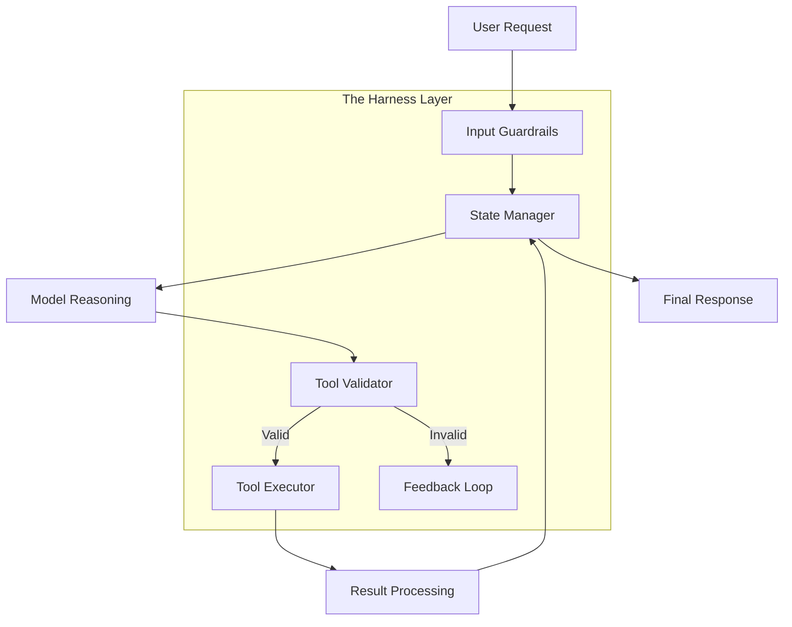

# Harness Engineering: The Orchestration & Safety Layer

In the early days of the Generative AI explosion, the industry was obsessed with the "Brain"—the Large Language Model (LLM) itself. We measured success by parameter counts, context window sizes, and benchmark scores like MMLU or HumanEval. However, as we cross into 2026, the narrative has shifted fundamentally. We have realized a hard truth: **The model is not the product.**

A raw model, no matter how intelligent, is like a powerful engine without a chassis, steering wheel, or brakes. In a production environment, an engine alone is a liability. The "Product" is the entire system that ensures the engine moves the vehicle safely to its destination. This realization has given birth to the discipline of **Harness Engineering**—the orchestration, safety, and observability layer that transforms a probabilistic model into a deterministic agentic system.

In this deep dive, we explore why the harness has become the "OS" for the agentic era and how it defines the boundary between a "cool demo" and a "reliable production system."

---

## The Anatomy of a Harness: Control Loops and State Machines

At its core, a harness is a sophisticated control system. While a simple LLM call is stateless and linear (Input → Output), an agentic harness is stateful and cyclic. It implements what we call the **OODA Loop** (Observe, Orient, Decide, Act) at a system level.

### The Control Loop
In a modern harness, the "Decision" (the model's output) is just one step. The harness surrounds this decision with validation and feedback loops. 

1.  **Validation**: Before a tool is even executed, the harness validates the model's intent. Does the tool exist? Are the parameters within the expected range?
2.  **State Management**: Using frameworks like **LangGraph**, the harness maintains a robust state machine. It tracks the "history of intent" versus the "history of action." If an agent decides to search a database but the database returns an error, the harness updates the state so the agent "knows" it failed and can try a different path.

Without this structure, agents suffer from "context drift," where the reasoning loop loses track of the original goal amidst tool errors and hallucinations.

---

## Self-Healing Systems: The Era of Trace-Driven Recovery

In 2026, we no longer accept "Internal Server Error" as a final state for an agent. Modern harnesses are **Self-Healing**. This is achieved by moving beyond simple logging to **Granular Tracing**.

When a tool failure occurs—be it a timeout, a malformed JSON, or a permission error—the harness captures the entire execution trace. Using tools like **AgentOps**, this trace is immediately analyzed by a lightweight "Correction Model" or a heuristic-based repair agent.

### Example: The Malformed Query Repair
Imagine an agent generating a SQL query that fails due to a syntax error. 
*   **Traditional Approach**: The system logs the error and returns a failure message to the user.
*   **Harness Approach**: The harness catches the `SQLException`, packages the failed query, the error message, and the schema context into a new prompt. It asks the model to "Fix the syntax error and try again." This happens invisibly to the user, resulting in a successful outcome where a raw model would have stalled.

This "Self-Healing" capability effectively increases the reliability of agentic workflows by orders of magnitude, turning a 70% success rate model into a 99% success rate product.

---

## Observability: Implementing Granular Tracing for Agent Reasoning

Observability in the age of agents is not just about CPU usage or latency; it's about **Reasoning Traces**. We need to see *why* an agent made a decision, not just *what* it did.

### The "Thought" vs. The "Act"
A production harness separates the "Chain of Thought" (CoT) from the "Tool Call." This allows developers to monitor the internal logic of the agent. By implementing granular tracing, we can identify patterns of failure:
*   **Logical Loops**: Where the agent keeps trying the same failing tool.
*   **Reasoning Hallucinations**: Where the agent's internal monologue claims it did something it didn't actually do.

By exposing these traces to observability platforms, teams can set up alerts not just for "errors," but for "logic deviations." For instance, an alert might trigger if an agent spends more than 5 reasoning cycles without making progress on a task.

---

## Durability Testing: Moving from Benchmarks to "Golden Set" Evaluations

As agents become more complex, traditional unit tests become insufficient. You cannot unit test a probabilistic system. Instead, we have moved toward **Durability Testing** using **"Golden Sets."**

A Golden Set is a curated collection of 100+ complex, multi-step tasks with known "good" outcomes. Durability testing involves running the agent against this set repeatedly.

### The Evolution of Metrics
We no longer care about the "MMLU Score" of the underlying model. Instead, we measure:
*   **Task Success Rate (TSR)**: What percentage of complex tasks were completed successfully?
*   **Tool Efficiency**: How many tool calls were required per task? (Lower is usually better).
*   **Resilience Score**: How many failures did the harness successfully "self-heal"?

By using **LLM-as-a-Judge** (often a more powerful model like GPT-5 or Claude 4) to evaluate the outcomes of the agent's work, we create a continuous integration (CI) pipeline for agentic behavior.

---

## Safety & Sandboxing: The Permissioned Agent

Security is the biggest hurdle for agent adoption. If an agent has the "power" to delete files or move money, it must be governed by a rigorous safety layer.

### Secure Tool Execution
In a well-engineered harness, tools do not run in the same environment as the application. They are **Sandboxed**. 
*   **Dockerized Execution**: Every file-system or code-execution tool runs in a disposable Docker container.
*   **Permission Scoping**: We apply the "Principle of Least Privilege" to agents. An agent doesn't get a "Global Admin" token; it gets an OAuth scope specifically for the task at hand.

### Input/Output Guardrails
The harness acts as a bidirectional firewall. It inspects user input for **Prompt Injection** attacks and inspects model output for **Data Leakage** or toxic content. If the model accidentally includes a secret key in its response, the harness redacts it before it reaches the UI.

---

## The "Build to Delete" Philosophy: Modular Harness Design

The AI field moves at a breakneck pace. A model that is "state of the art" today will be obsolete in six months. This brings us to the **"Build to Delete"** philosophy.

A production harness must be model-agnostic. The logic of "how to handle a database error" or "how to validate a shipping address" should not be embedded in the model's prompt. Instead, it should be part of the **Modular Harness Architecture**.

### Decoupling Reasoning from Execution
By decoupling the reasoning engine (the model) from the execution environment (the harness), we can swap models in minutes. When OpenAI releases a faster model or Anthropic releases a more steerable one, we simply update the "Reasoning Provider" in our harness. The safety guards, state machines, and self-healing logic remain untouched. This modularity is what makes an AI application "future-proof."

---

## Conclusion: The Harness as the Agent OS

In 2026, we view the harness not as a "wrapper," but as the **Operating System of the Agent.** It provides the fundamental services—memory, file system access, safety, and process management—that allow the "Application" (the agent's reasoning) to run reliably.

As we move forward, the competitive advantage in AI will not belong to those with the largest models, but to those with the most robust harnesses. It is the layer where intelligence meets engineering, where probability meets reliability, and where the "Model" finally becomes a "Product."

---

## References

1.  **LangChain (LangGraph)**: *Stateful Multi-Agent Orchestration*. [https://blog.langchain.dev/langgraph](https://blog.langchain.dev/langgraph)
2.  **AgentOps**: *Observability and Tracing for Autonomous Agents*. [https://www.agentops.ai/docs](https://www.agentops.ai/docs)
3.  **OpenAI**: *The Agentic Era: Building Reliable Systems with GPT-4o*. [https://openai.com/index/gpt-4o-and-more-capable-models](https://openai.com/index/gpt-4o-and-more-capable-models)
4.  **Anthropic**: *Constitutional AI and Safety Layering*. [https://www.anthropic.com/news/constitutional-ai-harmlessness-from-ai-feedback](https://www.anthropic.com/news/constitutional-ai-harmlessness-from-ai-feedback)
5.  **AiDIY Documentation**: *Harness Engineering Fundamentals*. [/docs/ai/harness-engineering/](/docs/ai/harness-engineering/)
