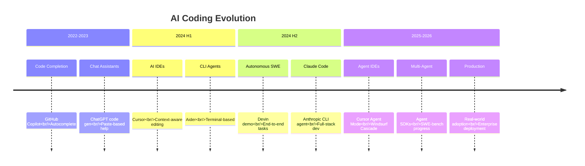
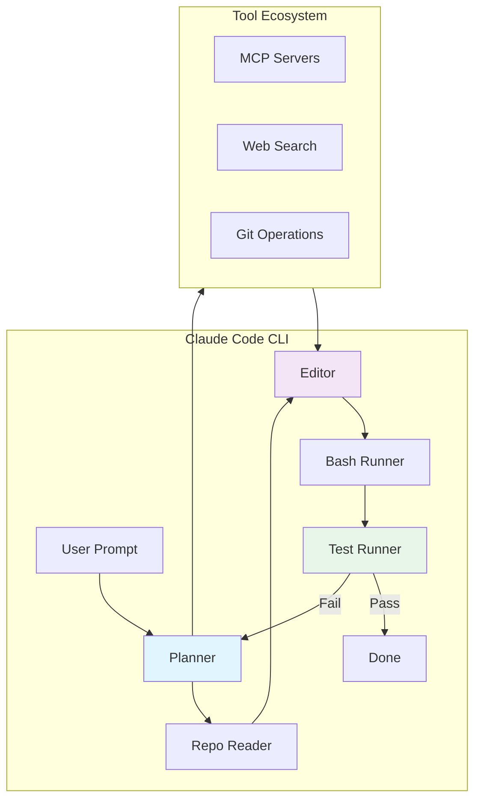
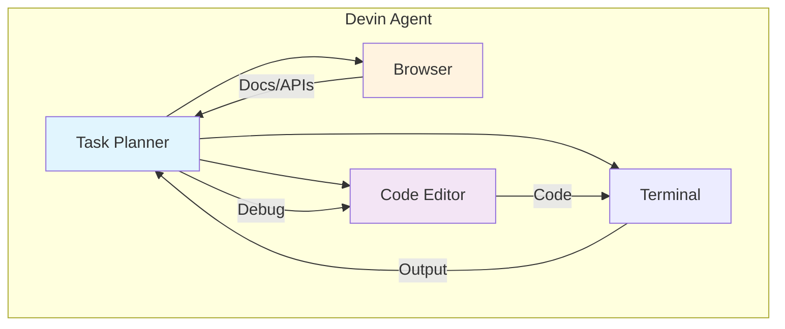
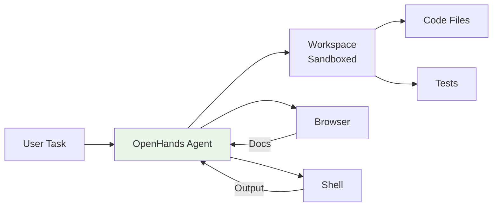
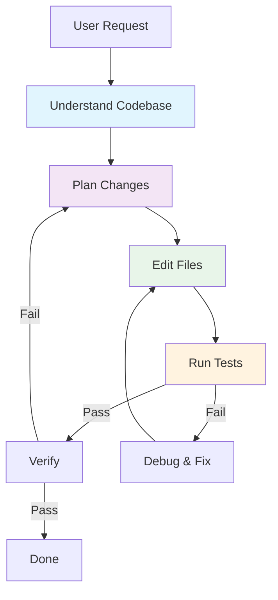
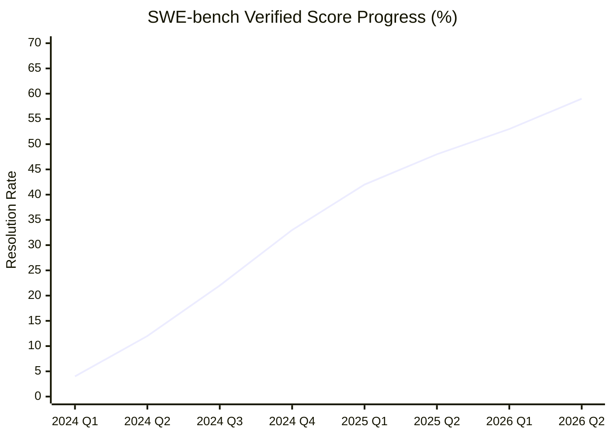
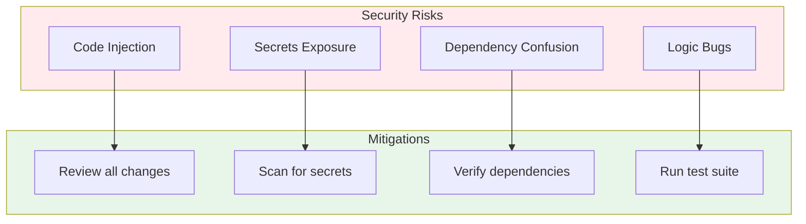

# 5. Coding Agents

Coding Agents represent one of the most impactful applications of AI agent technology — autonomous systems that can understand codebases, plan modifications, write code, run tests, and iterate until tasks are complete.

---

## 5.1 Evolution of AI-Assisted Coding



### The Coding Agent Spectrum

```
Autocomplete → Chat Assist → Inline Edit → Agent Mode → Autonomous SWE
     ↓              ↓             ↓             ↓              ↓
  Copilot      ChatGPT       Cursor       Claude Code      Devin
```

---

## 5.2 Major Coding Agents

### Claude Code (Anthropic, 2025)

Anthropic's CLI-based coding agent, deeply integrated with the development workflow.

**Key Features**:
- **Agentic coding**: Plans, reads, writes, and tests code autonomously
- **Context awareness**: Understands full codebase structure
- **Tool ecosystem**: Built-in file editing, bash execution, web search
- **MCP integration**: Extends capabilities via Model Context Protocol
- **Multi-model**: Supports Claude Opus, Sonnet, and Haiku

**Architecture**:



**Usage**:

```bash
# Install
npm install -g @anthropic-ai/claude-code

# Interactive mode
claude

# One-shot command
claude "Refactor the authentication module to use JWT"

# With specific model
claude --model claude-opus-4-7 "Design a caching layer for the API"
```

### Devin (Cognition, 2024)

The first autonomous AI software engineer, designed to handle full software engineering tasks end-to-end.

**Key Features**:
- **Autonomous execution**: Plans and completes tasks without human intervention
- **Browser access**: Can research documentation and APIs
- **Code execution**: Writes, runs, and debugs code in a sandboxed environment
- **Collaboration**: Can work alongside human engineers

**Architecture**:



**Limitations**:
- Higher cost per task compared to assisted coding
- Performance varies significantly by task complexity
- Requires clear task specifications
- Still evolving — early versions showed mixed results

### AI-Powered IDEs (2025-2026)

#### Cursor

AI-native code editor built on VS Code, with deep codebase understanding.

| Feature | Description |
|---------|-------------|
| **Tab Completion** | Context-aware multi-line completions |
| **Cmd+K** | Inline code generation and editing |
| **Chat** | Codebase-aware chat with file references |
| **Agent Mode** (2025) | Autonomous multi-file editing and terminal operations |
| **Composer** | Multi-file generation with project context |

#### Windsurf (Codeium)

AI-native IDE with Cascade reasoning engine.

**Key Features**:
- **Cascade**: Multi-step reasoning for complex tasks
- **Flow**: Real-time awareness of developer actions
- **Context Engine**: Deep codebase understanding
- **Multi-file Edit**: Coordinated changes across files

#### Augment

Enterprise-focused AI coding assistant.

- Deep codebase understanding for large repos
- Team knowledge sharing
- Enterprise security and compliance
- Integration with existing workflows

### Code with Claude 活动（2026 年 5 月）

Anthropic 于 2026 年 5 月举办了 Code with Claude 开发者大会（旧金山、伦敦、东京三城联动），集中展示了 AI 编程的最新进展：

- **Claude Code 自主编程能力**：现场演示了从需求理解到代码生成、测试、调试的全流程自动化
- **Managed Agents**：Claude Managed Agents 正式发布，支持构建生产级自主编程代理
- **MCP 工具生态扩展**：更多工具通过 MCP 协议接入，降低 Agent 与外部系统集成门槛
- **行业趋势**：MIT Technology Review 评论指出，随着 Claude Code 等工具日趋成熟，越来越多开发者愿意将编程任务交给 AI，软件构建方式已发生根本性变化

> 来源：[MIT Technology Review: Anthropic's Code with Claude showed off coding's future](https://www.technologyreview.com/2026/05/21/1137735/anthropics-code-with-claude-showed-off-codings-future-whether-you-like-it-or-not/)（2026-05-21）

### Open Source Coding Agents

#### OpenHands (formerly OpenDevin)

Open-source platform for AI software development agents.



**Features**:
- Sandbox environment for safe code execution
- Multiple LLM backend support
- Web browsing for documentation
- Action-based architecture

#### SWE-Agent (Princeton)

Research-focused agent for automated software engineering.

- Turns LLMs into software engineering agents
- Agent-computer interface (ACI) design
- Strong performance on SWE-bench benchmarks
- Research-oriented, open-source

#### Aider

CLI-based AI pair programming tool.

```bash
# Install
pip install aider-chat

# Use with a repo
cd my-project
aider main.py utils.py

# Ask for changes
aider "Add error handling to all API endpoints"
```

**Features**:
- Git-integrated workflow
- Multiple model support
- Repository map for context
- Auto-commit changes

### Docker Agent Fleet（2026）

Docker 的 Coding Agent Sandboxes（sbx）团队展示了一种全新的 Agent 使用模式——**"虚拟 Agent 团队"**：使用 Claude Code 的 Skills（Markdown 文件）定义 7 个不同的 Agent 角色，形成一个自治的 Fleet，负责测试产品、分流问题、发布笔记和修复 Bug。

**设计原则**："Local First, CI Second"——每个 Skill 先在本地运行验证，再接入 CI 流水线。

**7 个 Agent 角色**：
| 角色 | 职责 |
|------|------|
| `/build-engineer` | 构建和部署自动化 |
| `/project-manager` | 项目管理和任务分配 |
| `/product-owner` | 产品决策和优先级 |
| `/cli-tester` | 52+ 测试场景，覆盖 14 个层级 |
| 其他 3 个角色 | 各司其职的自治 Agent |

**关键启示**：
- Agent 不再是单个工具，而是**团队化的自治系统**
- Claude Code Skills 提供了一种轻量级的 Agent 角色定义方式
- 20 个 Skills 中有 7 个是自治 Fleet 角色，其余是辅助功能
- "Local First" 策略确保 Agent 行为可预测后再接入 CI

> 来源：[Docker Blog](https://www.docker.com/blog/a-virtual-agent-team-at-docker-how-the-coding-agent-sandboxes-team-uses-a-fleet-of-agents-to-ship-faster/)（2026-05-01）

### DeepSeek Reasonix（2026）

Reasonix 是一个开源的、专为 DeepSeek API 设计的终端 Coding Agent。其核心创新在于**针对 DeepSeek 的字节稳定前缀缓存**进行了工程优化——循环采用 append-only 模式（不重排序、不压缩），使长会话中缓存命中率达到 94%+，输入 token 成本降至约 1/5。

**核心设计**：
- **Cache-First Loop**：append-only 消息循环，缓存前缀在每次工具调用后仍然存活
- **Thought Harvest**：推理链复用，自动从 DeepSeek 的推理过程中提取可复用内容
- **Tool-Call Repair**：工具调用失败时自动修复而非重试整个请求

**技术特性**：
- V4 两层模型策略：默认 Flash（廉价迭代），`/pro` 切换到 Pro
- MCP 一级支持：`--mcp "name=cmd args"` 一行挂载外部工具服务器
- 沙盒 + Plan Gate：所有内置工具限制在启动目录；`/plan` 模式下只读审核
- 可组合 Skills：Markdown 文件定义可复用 Playbook，支持 `runAs: subagent`
- 事件回放：每个事件落盘，支持统计 token/缓存/成本

**定价**：$0.07/Mtok 输入，$0.014/Mtok 缓存（DeepSeek API 价格）

> 来源：[Reasonix GitHub](https://github.com/esengine/DeepSeek-Reasonix)（2026-05）

### Constraint Decay：后端代码生成中的脆弱性（2026）

论文 [Constraint Decay](https://arxiv.org/abs/2605.06445) 揭示了 LLM Coding Agent 在后端代码生成中的一个系统性问题——**约束衰减**：Agent 在多轮工具调用中逐渐丢失或忽略最初的需求约束，导致生成的代码偏离规范。

**关键发现**：
- 约束遗忘随工具调用轮次增加而加剧
- 后端代码（涉及数据库、API 规范、权限）比前端代码更容易出现约束衰减
- 复杂任务中 Agent 的约束遵守率从第 1 轮的 ~90% 降至第 5 轮的 ~60%

**启示**：Coding Agent 在后端工程中仍需人类审核，尤其是涉及安全约束和 API 规范的场景。

> 来源：[arXiv:2605.06445](https://arxiv.org/abs/2605.06445)（2026-05）

---

## 5.3 How Coding Agents Work

### Core Workflow



### Key Capabilities

| Capability | Description | Importance |
|------------|-------------|------------|
| **Repo Map** | Build mental model of codebase structure | Critical |
| **Multi-file Edit** | Coordinate changes across multiple files | High |
| **Test Execution** | Run tests and interpret results | High |
| **Error Recovery** | Debug and fix issues autonomously | High |
| **Context Management** | Manage token budget for large codebases | Medium |
| **Git Operations** | Commit, branch, resolve conflicts | Medium |

### Repo Map / Codebase Understanding

Coding agents build an internal representation of the codebase:

```
Repository Map:
├── src/
│   ├── controllers/
│   │   ├── auth.ts      ← handles login/register
│   │   └── api.ts       ← REST endpoints
│   ├── services/
│   │   ├── auth.ts      ← JWT validation
│   │   └── database.ts  ← PostgreSQL connection
│   └── utils/
│       └── helpers.ts   ← shared utilities
├── tests/
│   └── auth.test.ts     ← auth tests
└── package.json         ← dependencies
```

This allows agents to:
1. **Navigate** to relevant files without reading everything
2. **Understand dependencies** between modules
3. **Plan changes** that affect multiple files
4. **Avoid breaking** existing functionality

---

## 5.4 Benchmarks & Evaluation

### SWE-bench

The primary benchmark for evaluating coding agents on real-world software engineering tasks.

**What it measures**:
- Given a GitHub issue, can the agent produce a patch that resolves it?
- Evaluated against real issues from popular open-source projects

| Metric | Description |
|--------|-------------|
| **SWE-bench Lite** | 300 issues, simplified evaluation |
| **SWE-bench Verified** | Human-verified subset for reliable evaluation |
| **SWE-bench Full** | 2,294 issues from 12 popular Python repos |

### Leaderboard (2025-2026 Progress)



| Agent | SWE-bench Verified | Type |
|-------|-------------------|------|
| **GPT-5.5** (含 Codex 能力) | ~59% | Cloud API |
| **Claude Code** | ~45% | CLI Agent |
| **Kimi K2.6** (开源) | ~58.6% | Open Weight |
| **Devin** | ~40% | Autonomous |
| **SWE-Agent + GPT-4** | ~33% | Open Source |
| **Aider** | ~30% | CLI Tool |
| **AutoCodeRover** | ~28% | Research |

:::info Benchmark Context
SWE-bench scores improve rapidly。GPT-5.5（2026年4月23日）在 SWE-Bench Pro 上达到 58.6%，在 Terminal-Bench 2.0 上达到 82.7%，创下 Agentic Coding 新 SOTA。值得注意的是，OpenAI 从 GPT-5.4 起已将独立的 Codex 编程模型合并入主模型，不再维护单独的编程产品线。Moonshot AI 的开源模型 Kimi K2.6 也以 58.6% 的成绩追平 GPT-5.5。以上数据为近似快照，请查看 [官方排行榜](https://www.swebench.com/) 获取最新结果。

**2026年5月动态：**
- **Cursor Composer 2.5**（May 18）: 基于 Kimi K2.5（Moonshot AI）训练，在 25 倍合成任务量上完成训练。SWE-Bench Multilingual 达到 79.8%，CursorBench v3.1 达到 63.2%，与 Opus 4.7 和 GPT-5.5 持平，但定价仅 $0.50/$2.50 每百万 token，成本优势显著。训练创新包括：**Targeted RL with Textual Feedback**（在长 rollout 中对特定错误提供本地化文本反馈，而非仅依赖全局奖励）、**25 倍合成任务量**（含特征删除等新颖方法）、**Sharded Muon 优化器** + HSDP 并行。此外 Cursor 宣布与 SpaceXAI 合作训练全新大模型，使用 Colossus 2 百万 H100 等效算力
- **Docker: Coding Agent 安全危机**（May 18）: Docker 发布深度报告揭示 AI Coding Agent 的安全风险——包括代码注入、依赖混淆、密钥泄露等攻击向量，强调沙箱隔离和安全审查的重要性
- **Zerostack**（May 17）: 受 Unix 哲学启发的纯 Rust 编码 Agent，以可组合、最小化为设计理念，在 HN 上获得 518 点关注，是轻量级 Agent 架构的代表
- **OpenAI 产品重组**（May 17）: Greg Brockman 接管产品策略，计划将 Codex、ChatGPT 和 Atlas 浏览器整合为"超级应用"，编程 Agent 正从工具走向平台化
- **Semble**（May 17）: 专为 AI Agent 设计的代码搜索工具，比 grep 减少 98% 的 token 消耗，优化了 Agent 在大型代码库中的上下文效率
- **Qwen3.7-Max**（May 19）: 阿里巴巴通义千问团队发布 "Agent Frontier" 模型，在多个 Coding Agent 基准上达到 SOTA：Terminal-Bench 2.0-Terminus 69.7%、SWE-Pro 60.6%、SWE-Multilingual 78.3%、SciCode 53.5%。该模型还展示了跨 Agent 框架的通用能力，在 Claude Code、OpenClaw、Qwen Code 等多种 scaffold 上表现一致。曾完成 35 小时、超过 1000 次工具调用的全自主内核优化任务
- **Docker Gordon**（May 19）: Docker 发布 GA 的 AI Agent，集成于 Docker Desktop 4.74+ 和 CLI。Gordon 拥有 shell 访问、文件系统操作、Docker CLI、文档知识库和网络访问能力。它能读取运行中容器的日志、镜像、compose 文件和工作目录，提供上下文感知的调试、容器化、优化和管理功能。与 Cursor/Copilot/Claude Code 的关键区别：Gordon 理解你的实际容器环境而非仅依赖粘贴的内容
- **Anthropic Code with Claude 2026**（May 6 SF / May 19 London / June 10 Tokyo）: Anthropic 第二届开发者大会，未发布新模型，聚焦 Agent 基础设施。五大发布：**Dreaming**（跨会话记忆调度，在会话间自动提取模式并优化 Agent 记忆）、**Outcomes**（独立评分 Agent 对输出质量把关，PPT 质量提升 10.1%）、**Multi-Agent Orchestration**（Lead Agent + 专家子 Agent 并行协作）、**Claude Finance**（10 个预构建金融 Agent）、**Add-ins**（Claude 直接嵌入 Word 等生产力软件内部工作）。Boris Cherny（Claude Code 创始人）透露 Anthropic 内部已无手动编写代码。需求在 2026 年已增长 80 倍，与 SpaceX 签署算力协议。上下文窗口仍约 100 万 token，短期内无突破。缓存命中率需达 80%+，Cursor/Replit/Claude Code 均在 90%+。瓶颈已从编码转移到审查、验证和跨团队协调
- **Runtime（YC P26）**（May 21）: Y Combinator P26 批次推出的沙箱化 Coding Agent 平台，支持 Claude Code、Cursor、Codex、Copilot、Gemini CLI 等多种 Agent 可互换。核心能力：预构建沙箱环境、可标记团队 Agent、实时协作、治理与可观测性（工具调用追踪、成本追踪、限额与审批）。支持 Slack/Linear/GitHub/Jira 集成，可自托管（MIT/Apache 2.0/AGPL v3 混合许可）
- **Google I/O 2026 — Gemini 3.5 Flash**（May 20）: Google 发布 Gemini 3.5 Flash，号称迄今最强 Agentic/Coding 模型，比部分竞品快约 4 倍。Gemini 3.5 Pro 预计下月发布。同期推出 **Gemini Spark** 云端 AI Agent（后台持续运行、Chrome 集成）、**Gemini Omni** 视频生成模型、Android XR 智能眼镜（与 Samsung/Warby Parker 合作）。Gemini 月活用户从 4 亿增至 9 亿+，搜索 AI 模式用户超 10 亿月活
:::

---

## 5.5 Production Use Cases

### When Coding Agents Excel

| Use Case | Description | Best Agent |
|----------|-------------|------------|
| **Bug Fixes** | Locate and fix bugs with tests | Claude Code, Aider |
| **Refactoring** | Large-scale code restructuring | Claude Code, Cursor |
| **Documentation** | Generate docs from code | Any agent |
| **Test Writing** | Generate comprehensive tests | Claude Code, Cursor |
| **Code Review** | Review PRs for issues | Claude Code |
| **Migration** | Framework/library upgrades | Claude Code, Devin |

### When to Be Cautious

- **Security-critical code**: Always review agent-generated auth/crypto code
- **Performance-sensitive paths**: Agent may not understand all constraints
- **Novel architectures**: Agents work best with familiar patterns
- **Large legacy codebases**: Context limits may miss important constraints

---

## 5.6 Best Practices

### Effective Agent Usage

1. **Clear Instructions**: Provide specific, detailed requirements
2. **Incremental Tasks**: Break large tasks into smaller, reviewable chunks
3. **Verify Output**: Always review and test agent-generated code
4. **Provide Context**: Share relevant files, docs, and constraints
5. **Use Version Control**: Commit before agent modifications for easy rollback

### Security Considerations



### Cost Optimization

| Strategy | Description | Savings |
|----------|-------------|---------|
| **Smaller Models** | Use Haiku for simple tasks | 3-5x cheaper |
| **Targeted Context** | Only include relevant files | 2-3x fewer tokens |
| **Caching** | Reuse previous completions | Variable |
| **Batch Tasks** | Group similar operations | Moderate |

### Uber 的 Tokenmaxxing 警示：4 个月烧光全年 AI 预算（2026）

Forbes 报道 [Uber 在 4 个月内耗尽了 2026 年全年 AI 编码预算](https://www.forbes.com/sites/janakirammsv/2026/05/17/uber-burns-its-2026-ai-budget-in-four-months-on-claude-code/)，罪魁祸首是 Claude Code 的大规模内部部署。Uber COO Andrew Macdonald 公开表示"越来越难以 justify AI token 支出"，因为"没有看到与增加 AI 成比例的生产力提升"。

**关键数据**：
- AI coding agent 的 token 消耗远超传统 API 调用——一个 Agent 会话可能消耗数百万 token
- $200/月的 per-seat 定价在数千名开发者的规模下迅速失控
- Token 价格的线性增长 vs 生产力提升的非线性关系成为企业级难题

**启示**：Coding Agent 的企业级部署需要严格的预算治理和 ROI 度量，"让所有人用上最强 Agent"的策略在经济上不可持续。

### Claude Code Dynamic Workflows：大规模并行 Agent 编排（2026-05-28）

Anthropic 为 Claude Code 引入 **Dynamic Workflows** 功能，让 Claude 能够处理此前无法完成的超大规模工程任务。核心机制是让 Claude **动态编写编排脚本**，在单次会话中运行数十到数百个并行 subagent，并在提交结果前进行自验证。

**关键能力**：

- **代码库级审计**：并行 bug 搜索、性能优化、安全加固（如检查整个仓库的认证和输入验证）
- **大规模迁移**：框架替换、API 废弃、语言移植，可跨数千文件并行执行
- **对抗性验证**：独立子 agent 从不同角度解决问题，其他 agent 尝试反驳结果，直到答案收敛
- **持久化**：工作流可持续数小时甚至数天，自动保存进度，中断后可恢复

**典型案例**：Bun 作者 Jarred Sumner 利用 Dynamic Workflows 将 **Bun 从 Zig 移植到 Rust**，约 75 万行 Rust 代码，99.8% 测试通过率，从首个 commit 到合并仅用 **11 天**。

**可用性**：Max、Team 和 API 用户默认开启；Enterprise 需管理员启用；同时支持 Amazon Bedrock、Vertex AI 和 Microsoft Foundry。

> ⚠️ Dynamic Workflows 消耗的 token 远超普通会话，建议从限定范围的任务开始。

> 来源：[Anthropic Blog](https://claude.com/blog/introducing-dynamic-workflows-in-claude-code)（2026-05-28）

### Coding Agent 的产品市场契合与定价模型转变（2026-05）

Simon Willison 在个人博客发表深度分析，认为 **Anthropic 和 OpenAI 已经通过 Coding Agent 找到了产品市场契合（Product-Market Fit）**：

**定价模型转变**：
- **Anthropic**：Enterprise 方案从原来的"Claude seats 包含足够日常使用量"转变为 $20/seat/月 + API token 按用量计费
- **OpenAI**：2026年4月2日更新 Codex 定价，从 per-message 转向 API token 计费；4月23日扩展至所有 Enterprise 方案
- 企业用户账单因此暴涨——有公司对 LLM 账单感到震惊

**经济学分析**：
- 个人用户 $200/月的订阅（Anthropic Max + OpenAI Pro）可获得约 $2,000+ 的 API token 价值，对重度用户极其划算
- 但企业级 API 按量计费在规模化部署时成本迅速失控（参见 Uber 案例）
- Anthropic 传闻即将实现**首次盈利季度**

> 这标志着 AI Coding Agent 从"尝鲜阶段"进入"价值验证阶段"——PMF 已确认，但可持续的企业级定价模型仍在探索中。

> 来源：[Simon Willison](https://simonwillison.net/2026/May/27/product-market-fit/)（2026-05-27）

> 来源：[Forbes](https://www.forbes.com/sites/janakirammsv/2026/05/17/uber-burns-its-2026-ai-budget-in-four-months-on-claude-code/)、[Business Insider](https://www.businessinsider.com/uber-coo-andrew-macdonald-ai-token-spending-harder-justify-2026-5)（2026-05）

### Cloudflare AI Code Review：生产级多 Agent 代码审查（2026-05）

Cloudflare 公开了其 **AI Code Review 系统**的架构设计，这是一个基于 OpenCode（开源编码 Agent）构建的 CI 原生编排系统，展示了 Coding Agent 在企业级代码审查场景的实践：

**核心架构**：
- **Coordinator Agent + 多个专业 Reviewer Agent**：每次 MR 最多启动 **7 个专业 AI Reviewer**，由 Coordinator 去重、判定严重性并生成单一结构化审查评论
- **可插拔 Plugin 架构**：每个插件实现 `ReviewPlugin` 接口，包含 Bootstrap（并发）、Configure（串行）、postConfigure（异步）三个生命周期阶段
- **专业角色分工**：安全审查、代码质量、性能分析、文档检查、合规检查等，每个 Agent 有明确的"该报告什么/不该报告什么"边界定义

**模型分层策略**：

| 等级 | 模型 | 角色 |
|------|------|------|
| 顶层 | Claude Opus 4.7, GPT-5.4 | Review Coordinator——最高推理能力做去重/判定 |
| 标准 | Claude Sonnet 4.6, GPT-5.3 Codex | 代码质量、安全、性能子审查 |
| 轻量 | Kimi K2.5 | 文档、Release、AGENTS.md 审查 |

**工程亮点**：
- 使用 JSONL 结构化日志，每 100 行或 50ms 刷新一次
- 输出截断自动重试（`reason: "length"`）
- 30 秒心跳日志——几乎消除了"Agent 卡住了"的误报
- 2.5 GB 堆内存上限防止 OOM

> 来源：[Cloudflare Blog](https://blog.cloudflare.com/ai-code-review/)（2026-04-20）

### 企业 AI 支出失控案例：单月 $5 亿 Claude 账单（2026-05）

Axios 报道一家未具名企业因**未设置 Claude 使用限额**，在单月内产生 **5 亿美元**的 AI 使用费。该案例凸显了企业 AI 部署中的成本治理问题：

- **根本原因**：企业版 AI 模型通常以固定费率吸引企业，但这些方案通常按请求数设限。未设限的情况下，无控制的 Agent 工作流可快速产生天价账单
- **滥用模式**：有 CTO 反映员工用 AI 系统查天气——功能可行但成本远超常规搜索
- **专家建议**：企业需要真正懂 AI 的"Agent 编排者"角色；最大成本驱动因素是**误用**（缺乏上下文工程导致无限膨胀的上下文窗口）和**模型选择不当**（用昂贵大模型处理简单任务）

> 来源：[Axios](https://www.axios.com/2026/05/28/ai-spending-roi-enterprise-costs)（2026-05-28）

### Claude Code 登录 Web 端：从终端走向全平台（2026-05）

Claude Code 正式从终端独占工具扩展到 **Web 浏览器和 iPhone**，开发者无需笔记本即可在任意设备上运行 Agent 编码工作流。与此同时，Claude 记忆功能实现跨平台同步——对话可在 Claude、ChatGPT 和 Gemini Pro 之间无缝切换，保留完整的个性化设置和上下文历史。

这一扩展标志着 AI 编码 Agent 从开发者专用工具向全平台生产力基础设施的转变。Tom's Guide 评价其"即将改变 vibe coding 的方式"。同一周，OpenAI Codex 也新增了控制锁定 Mac 的能力，两大 AI 编码平台的竞争从功能扩展到平台覆盖。

> 来源：[Build Fast with AI](https://www.buildfastwithai.com/blogs/ai-news-today-may-26-2026)（2026-05-26）

### "Did Claude increase bugs in rsync?"：AI 编码质量反思（2026-06）

Hacker News 上的一篇分析文章（103 分）引发了对 AI 编码质量的热议。作者分析了 rsync 项目中使用 Claude 辅助编写的代码，发现 AI 辅助引入的 bug 数量令人关注。社区讨论围绕几个核心问题展开：

- **代码审查不可替代**：AI 生成的代码同样需要严格的 human review
- **上下文理解仍是短板**：AI 在理解遗留代码库的隐式约定方面仍有不足
- **回归测试的重要性**：AI 修改应在完整测试套件保护下进行

这篇文章是对 AI 编码乐观主义的重要平衡——编码 Agent 提高了效率，但并不意味着代码质量的自动保证。

> 来源：[Hacker News](https://news.ycombinator.com/)（2026-06-05）

### Code2LoRA：超网络生成代码模型适配器（2026-06）

arXiv 论文 [Code2LoRA](https://arxiv.org/abs/2606.06492)（Hotsko 等）提出了一种新颖的超网络框架，可以为特定代码仓库自动生成 LoRA 适配器，**无需额外的推理 token 开销**即可注入仓库级知识。该框架支持两种场景：

- **Code2LoRA-Static**：将仓库快照转换为适配器，适合稳定代码库理解
- **Code2LoRA-Evo**：基于 GRU 隐状态按代码 diff 更新适配器，适合活跃开发中的代码库

在 RepoPeftBench（604 个 Python 仓库）上的评估显示，静态模式达到 66.2% 的精确匹配率（接近每仓库独立 LoRA 的上界），进化模式在跨仓库场景下比共享 LoRA 提升 5.2 个百分点。

> 来源：[arXiv:2606.06492](https://arxiv.org/abs/2606.06492)（2026-06-04）

### xAI 使用 Claude 输出训练编码模型引发伦理争议（2026-06）

据 The Information 报道，Elon Musk 旗下的 xAI 在数月内使用 Anthropic Claude 的输出来训练其编码模型，直到被 Anthropic 切断访问。这一事件暴露了 AI 行业在训练数据来源和知识产权方面的灰色地带：

- **模型输出的版权归属**：AI 生成的代码是否受版权保护？能否被其他公司用于训练？
- **竞争伦理**：直接使用竞争对手的产品输出来训练自己的模型，是否构成不正当竞争？
- **数据来源透明度**：AI 公司是否应披露其训练数据来源？

这一争议可能推动行业建立训练数据使用的规范和标准。

> 来源：[The Decoder](https://the-decoder.com/)（2026-06-06）

### NVIDIA Agent Toolkit：面向 Agent 的全栈运行时（2026-06）

NVIDIA 在 GTC Taipei 上发布 **Agent Toolkit**，提供构建、部署和安全运行自主 Agent 的全栈运行时。该工具包集成 LLM 推理、Agent 框架和企业级运行环境，并通过 CUDA-X 库提供 Agent Skills（cuDF、cuOpt、AI-Q、NeMo、PhysicsNeMo、CUDA-Q）。

Cadence-NVIDIA 合作推出的验证 Agent 已在 EDA 领域取得突破：自动编排 RTL 生成、测试平台创建、回归测试和调试，将芯片验证周期加速 **40 倍以上**。NVIDIA 将 Agent 描述为"未来十年的计算模式"。

> 来源：[NVIDIA Blog](https://blogs.nvidia.com/blog/nvidia-gtc-taipei-computex-2026-news/)（2026-06-01）

---

## 5.7 Key Takeaways

1. **Coding agents are production-ready** for many software engineering tasks
2. **Claude Code leads** for developer-integrated agentic coding
3. **SWE-bench progress** shows rapid improvement in autonomous capabilities
4. **Human review remains essential** — especially for security-critical code
5. **The field evolves fast** — new agents and capabilities emerge monthly

---

:::tip Try It Yourself
Start with **Claude Code** for an integrated CLI coding agent experience, or **Cursor** for an AI-native IDE. Both offer free tiers to get started.
:::

:::info Open Source Options
For self-hosted or research use, **OpenHands** and **SWE-Agent** provide fully open-source coding agent platforms.
:::
