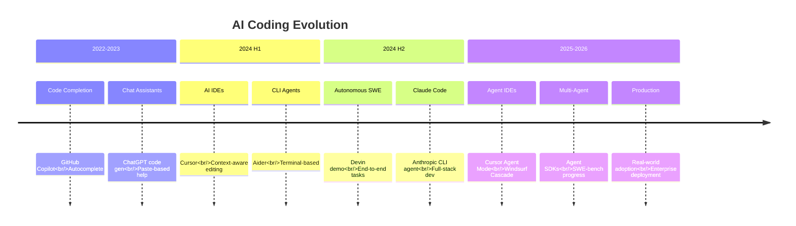
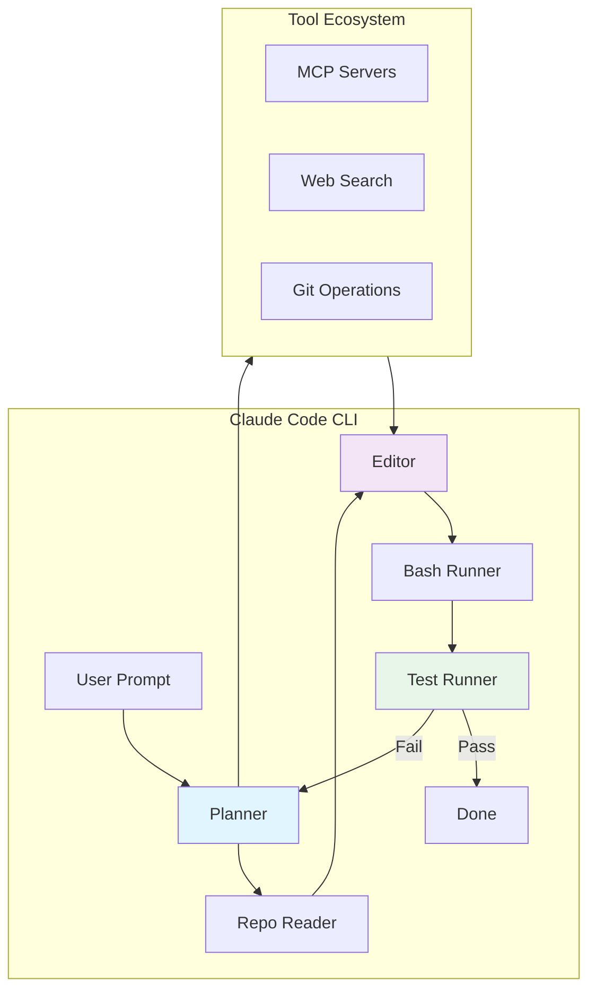
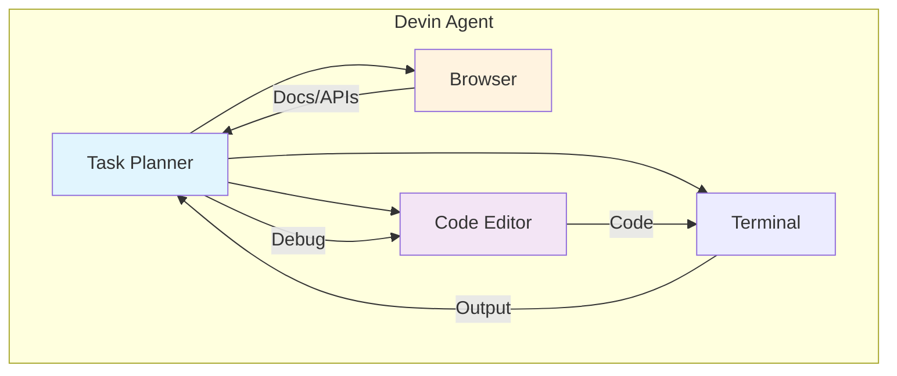
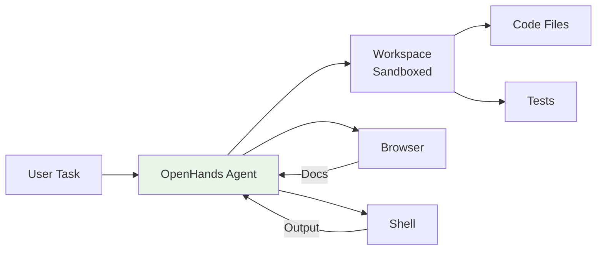
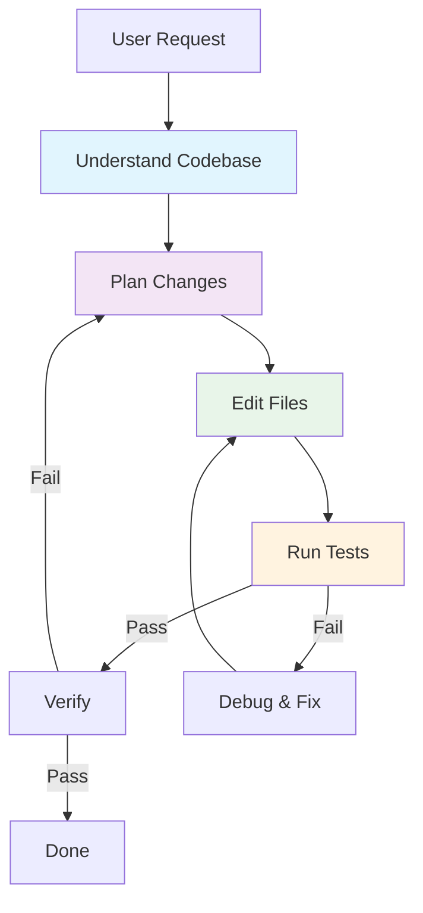
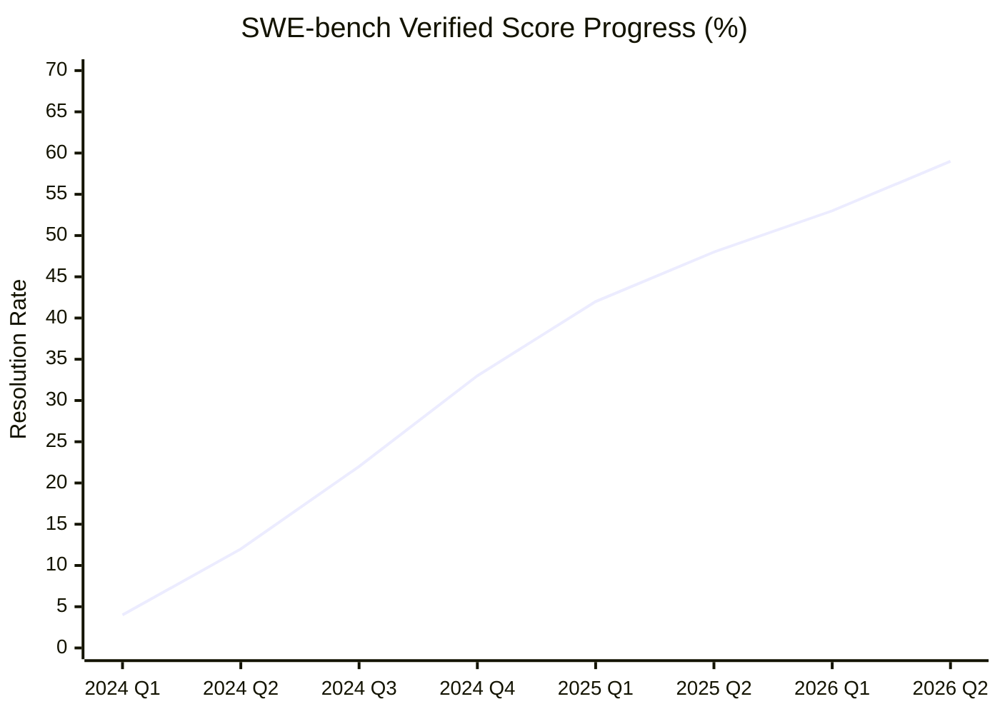
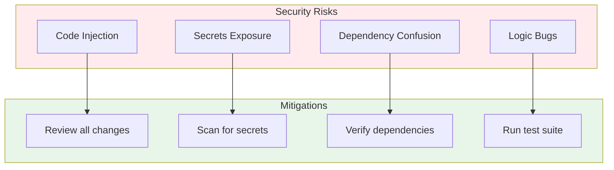

# 5. Coding Agents

Coding Agents represent one of the most impactful applications of AI agent technology — autonomous systems that can understand codebases, plan modifications, write code, run tests, and iterate until tasks are complete.

---

## 5.1 Evolution of AI-Assisted Coding



### The Coding Agent Spectrum

```
Autocomplete → Chat Assist → Inline Edit → Agent Mode → Autonomous SWE
     ↓              ↓             ↓             ↓              ↓
  Copilot      ChatGPT       Cursor       Claude Code      Devin
```

---

## 5.2 Major Coding Agents

### Claude Code (Anthropic, 2025)

Anthropic's CLI-based coding agent, deeply integrated with the development workflow.

**Key Features**:
- **Agentic coding**: Plans, reads, writes, and tests code autonomously
- **Context awareness**: Understands full codebase structure
- **Tool ecosystem**: Built-in file editing, bash execution, web search
- **MCP integration**: Extends capabilities via Model Context Protocol
- **Multi-model**: Supports Claude Opus, Sonnet, and Haiku

**Architecture**:



**Usage**:

```bash
# Install
npm install -g @anthropic-ai/claude-code

# Interactive mode
claude

# One-shot command
claude "Refactor the authentication module to use JWT"

# With specific model
claude --model claude-opus-4-7 "Design a caching layer for the API"
```

### Devin (Cognition, 2024)

The first autonomous AI software engineer, designed to handle full software engineering tasks end-to-end.

**Key Features**:
- **Autonomous execution**: Plans and completes tasks without human intervention
- **Browser access**: Can research documentation and APIs
- **Code execution**: Writes, runs, and debugs code in a sandboxed environment
- **Collaboration**: Can work alongside human engineers

**Architecture**:



**Limitations**:
- Higher cost per task compared to assisted coding
- Performance varies significantly by task complexity
- Requires clear task specifications
- Still evolving — early versions showed mixed results

### AI-Powered IDEs (2025-2026)

#### Cursor

AI-native code editor built on VS Code, with deep codebase understanding.

| Feature | Description |
|---------|-------------|
| **Tab Completion** | Context-aware multi-line completions |
| **Cmd+K** | Inline code generation and editing |
| **Chat** | Codebase-aware chat with file references |
| **Agent Mode** (2025) | Autonomous multi-file editing and terminal operations |
| **Composer** | Multi-file generation with project context |

#### Windsurf (Codeium)

AI-native IDE with Cascade reasoning engine.

**Key Features**:
- **Cascade**: Multi-step reasoning for complex tasks
- **Flow**: Real-time awareness of developer actions
- **Context Engine**: Deep codebase understanding
- **Multi-file Edit**: Coordinated changes across files

#### Augment

Enterprise-focused AI coding assistant.

- Deep codebase understanding for large repos
- Team knowledge sharing
- Enterprise security and compliance
- Integration with existing workflows

### Open Source Coding Agents

#### OpenHands (formerly OpenDevin)

Open-source platform for AI software development agents.



**Features**:
- Sandbox environment for safe code execution
- Multiple LLM backend support
- Web browsing for documentation
- Action-based architecture

#### SWE-Agent (Princeton)

Research-focused agent for automated software engineering.

- Turns LLMs into software engineering agents
- Agent-computer interface (ACI) design
- Strong performance on SWE-bench benchmarks
- Research-oriented, open-source

#### Aider

CLI-based AI pair programming tool.

```bash
# Install
pip install aider-chat

# Use with a repo
cd my-project
aider main.py utils.py

# Ask for changes
aider "Add error handling to all API endpoints"
```

**Features**:
- Git-integrated workflow
- Multiple model support
- Repository map for context
- Auto-commit changes

### Docker Agent Fleet（2026）

Docker 的 Coding Agent Sandboxes（sbx）团队展示了一种全新的 Agent 使用模式——**"虚拟 Agent 团队"**：使用 Claude Code 的 Skills（Markdown 文件）定义 7 个不同的 Agent 角色，形成一个自治的 Fleet，负责测试产品、分流问题、发布笔记和修复 Bug。

**设计原则**："Local First, CI Second"——每个 Skill 先在本地运行验证，再接入 CI 流水线。

**7 个 Agent 角色**：
| 角色 | 职责 |
|------|------|
| `/build-engineer` | 构建和部署自动化 |
| `/project-manager` | 项目管理和任务分配 |
| `/product-owner` | 产品决策和优先级 |
| `/cli-tester` | 52+ 测试场景，覆盖 14 个层级 |
| 其他 3 个角色 | 各司其职的自治 Agent |

**关键启示**：
- Agent 不再是单个工具，而是**团队化的自治系统**
- Claude Code Skills 提供了一种轻量级的 Agent 角色定义方式
- 20 个 Skills 中有 7 个是自治 Fleet 角色，其余是辅助功能
- "Local First" 策略确保 Agent 行为可预测后再接入 CI

> 来源：[Docker Blog](https://www.docker.com/blog/a-virtual-agent-team-at-docker-how-the-coding-agent-sandboxes-team-uses-a-fleet-of-agents-to-ship-faster/)（2026-05-01）

---

## 5.3 How Coding Agents Work

### Core Workflow



### Key Capabilities

| Capability | Description | Importance |
|------------|-------------|------------|
| **Repo Map** | Build mental model of codebase structure | Critical |
| **Multi-file Edit** | Coordinate changes across multiple files | High |
| **Test Execution** | Run tests and interpret results | High |
| **Error Recovery** | Debug and fix issues autonomously | High |
| **Context Management** | Manage token budget for large codebases | Medium |
| **Git Operations** | Commit, branch, resolve conflicts | Medium |

### Repo Map / Codebase Understanding

Coding agents build an internal representation of the codebase:

```
Repository Map:
├── src/
│   ├── controllers/
│   │   ├── auth.ts      ← handles login/register
│   │   └── api.ts       ← REST endpoints
│   ├── services/
│   │   ├── auth.ts      ← JWT validation
│   │   └── database.ts  ← PostgreSQL connection
│   └── utils/
│       └── helpers.ts   ← shared utilities
├── tests/
│   └── auth.test.ts     ← auth tests
└── package.json         ← dependencies
```

This allows agents to:
1. **Navigate** to relevant files without reading everything
2. **Understand dependencies** between modules
3. **Plan changes** that affect multiple files
4. **Avoid breaking** existing functionality

---

## 5.4 Benchmarks & Evaluation

### SWE-bench

The primary benchmark for evaluating coding agents on real-world software engineering tasks.

**What it measures**:
- Given a GitHub issue, can the agent produce a patch that resolves it?
- Evaluated against real issues from popular open-source projects

| Metric | Description |
|--------|-------------|
| **SWE-bench Lite** | 300 issues, simplified evaluation |
| **SWE-bench Verified** | Human-verified subset for reliable evaluation |
| **SWE-bench Full** | 2,294 issues from 12 popular Python repos |

### Leaderboard (2025-2026 Progress)



| Agent | SWE-bench Verified | Type |
|-------|-------------------|------|
| **GPT-5.5** (含 Codex 能力) | ~59% | Cloud API |
| **Claude Code** | ~45% | CLI Agent |
| **Kimi K2.6** (开源) | ~58.6% | Open Weight |
| **Devin** | ~40% | Autonomous |
| **SWE-Agent + GPT-4** | ~33% | Open Source |
| **Aider** | ~30% | CLI Tool |
| **AutoCodeRover** | ~28% | Research |

:::info Benchmark Context
SWE-bench scores improve rapidly。GPT-5.5（2026年4月23日）在 SWE-Bench Pro 上达到 58.6%，在 Terminal-Bench 2.0 上达到 82.7%，创下 Agentic Coding 新 SOTA。值得注意的是，OpenAI 从 GPT-5.4 起已将独立的 Codex 编程模型合并入主模型，不再维护单独的编程产品线。Moonshot AI 的开源模型 Kimi K2.6 也以 58.6% 的成绩追平 GPT-5.5。以上数据为近似快照，请查看 [官方排行榜](https://www.swebench.com/) 获取最新结果。

**2026年5月动态：**
- **Cursor Composer 2.5**（May 18）: 基于 Kimi K2.5（Moonshot AI）训练，在 25 倍合成任务量上完成训练。SWE-Bench Multilingual 达到 79.8%，CursorBench v3.1 达到 63.2%，与 Opus 4.7 和 GPT-5.5 持平，但定价仅 $0.50/$2.50 每百万 token，成本优势显著
- **Docker: Coding Agent 安全危机**（May 18）: Docker 发布深度报告揭示 AI Coding Agent 的安全风险——包括代码注入、依赖混淆、密钥泄露等攻击向量，强调沙箱隔离和安全审查的重要性
- **Zerostack**（May 17）: 受 Unix 哲学启发的纯 Rust 编码 Agent，以可组合、最小化为设计理念，在 HN 上获得 518 点关注，是轻量级 Agent 架构的代表
- **OpenAI 产品重组**（May 17）: Greg Brockman 接管产品策略，计划将 Codex、ChatGPT 和 Atlas 浏览器整合为"超级应用"，编程 Agent 正从工具走向平台化
- **Semble**（May 17）: 专为 AI Agent 设计的代码搜索工具，比 grep 减少 98% 的 token 消耗，优化了 Agent 在大型代码库中的上下文效率
:::

---

## 5.5 Production Use Cases

### When Coding Agents Excel

| Use Case | Description | Best Agent |
|----------|-------------|------------|
| **Bug Fixes** | Locate and fix bugs with tests | Claude Code, Aider |
| **Refactoring** | Large-scale code restructuring | Claude Code, Cursor |
| **Documentation** | Generate docs from code | Any agent |
| **Test Writing** | Generate comprehensive tests | Claude Code, Cursor |
| **Code Review** | Review PRs for issues | Claude Code |
| **Migration** | Framework/library upgrades | Claude Code, Devin |

### When to Be Cautious

- **Security-critical code**: Always review agent-generated auth/crypto code
- **Performance-sensitive paths**: Agent may not understand all constraints
- **Novel architectures**: Agents work best with familiar patterns
- **Large legacy codebases**: Context limits may miss important constraints

---

## 5.6 Best Practices

### Effective Agent Usage

1. **Clear Instructions**: Provide specific, detailed requirements
2. **Incremental Tasks**: Break large tasks into smaller, reviewable chunks
3. **Verify Output**: Always review and test agent-generated code
4. **Provide Context**: Share relevant files, docs, and constraints
5. **Use Version Control**: Commit before agent modifications for easy rollback

### Security Considerations



### Cost Optimization

| Strategy | Description | Savings |
|----------|-------------|---------|
| **Smaller Models** | Use Haiku for simple tasks | 3-5x cheaper |
| **Targeted Context** | Only include relevant files | 2-3x fewer tokens |
| **Caching** | Reuse previous completions | Variable |
| **Batch Tasks** | Group similar operations | Moderate |

---

## 5.7 Key Takeaways

1. **Coding agents are production-ready** for many software engineering tasks
2. **Claude Code leads** for developer-integrated agentic coding
3. **SWE-bench progress** shows rapid improvement in autonomous capabilities
4. **Human review remains essential** — especially for security-critical code
5. **The field evolves fast** — new agents and capabilities emerge monthly

---

:::tip Try It Yourself
Start with **Claude Code** for an integrated CLI coding agent experience, or **Cursor** for an AI-native IDE. Both offer free tiers to get started.
:::

:::info Open Source Options
For self-hosted or research use, **OpenHands** and **SWE-Agent** provide fully open-source coding agent platforms.
:::
