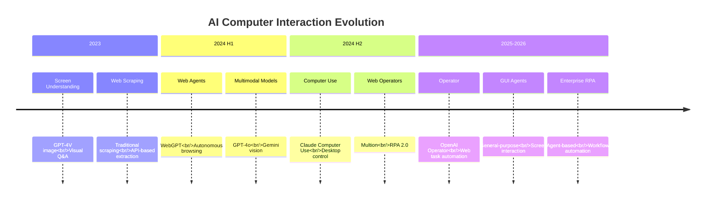
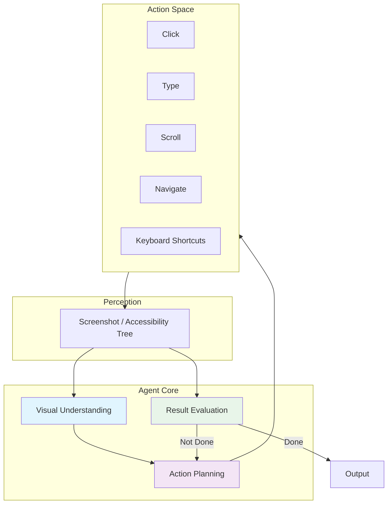
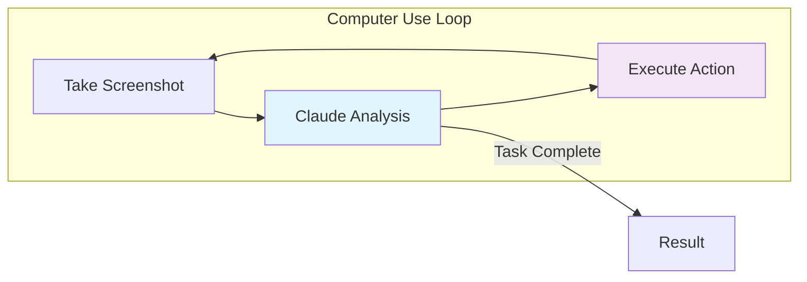
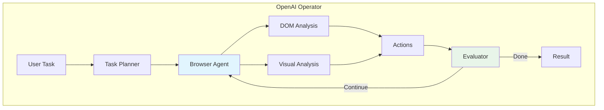
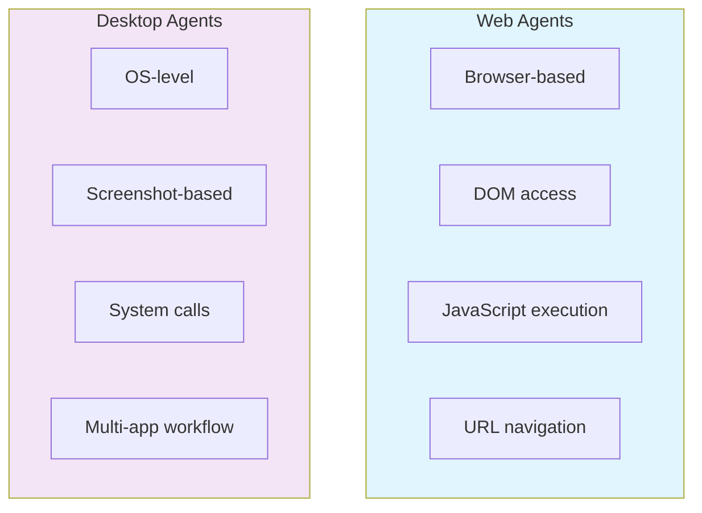
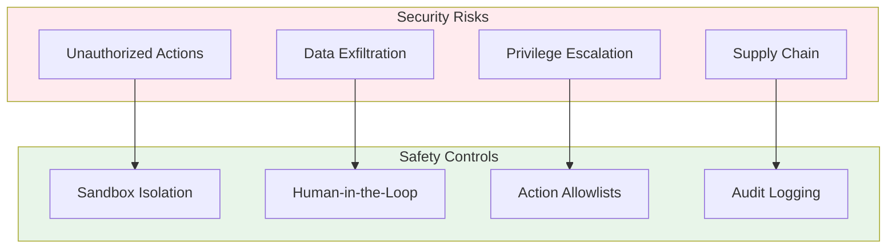
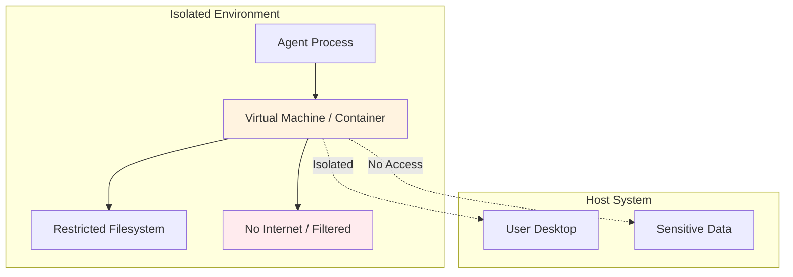

# 6. Computer Use & GUI Agents

Computer Use agents interact with graphical user interfaces (GUIs) the same way humans do — by seeing screens, clicking buttons, typing text, and navigating applications. This represents a fundamental shift from API-based interaction to visual interaction.

---

## 6.1 Evolution of Computer Interaction



### Interaction Spectrum

```
API Call → Web Scraping → Browser Automation → GUI Agent → Desktop Control
    ↓           ↓               ↓                  ↓             ↓
  Direct     Parsed HTML     Playwright        Operator     Computer Use
```

---

## 6.2 How GUI Agents Work

### Core Architecture



### Perception Methods

| Method | Description | Pros | Cons |
|--------|-------------|------|------|
| **Screenshot** | Raw pixel analysis via VLM | Works with any app | Expensive, imprecise |
| **Accessibility Tree** | OS-provided UI element structure | Precise, fast | Not always available |
| **DOM Analysis** | Web page structure extraction | Reliable for web | Web-only |
| **Hybrid** | Combine screenshot + accessibility | Best of both | Complex |

### Action Space

GUI agents typically support these actions:

```typescript
type GUIAction =
  | { type: "click"; x: number; y: number; button?: "left" | "right" }
  | { type: "type"; text: string }
  | { type: "scroll"; direction: "up" | "down"; amount?: number }
  | { type: "keypress"; key: string; modifiers?: string[] }
  | { type: "navigate"; url: string }
  | { type: "wait"; duration: number }
  | { type: "screenshot" }
  | { type: "done"; result: string };
```

---

## 6.3 Major Computer Use Agents

### Claude Computer Use (Anthropic, 2024.10)

Anthropic's capability for Claude to interact with desktop applications through screenshots and actions.

**How it works**:



**Key Features**:
- Desktop-level interaction (not just browser)
- Screenshot-based perception
- Multi-application workflows
- Sandboxed execution environment

**Safety Mechanisms**:
- Runs in isolated container/VM
- No internet access by default
- Human approval for sensitive actions
- Screenshots logged for audit

### OpenAI Operator (2025)

OpenAI's web-based agent for autonomous task execution through a browser.

**Capabilities**:
- Web browsing and form filling
- Online shopping and booking
- Information retrieval and research
- Multi-step web workflows

**Architecture**:



### Google Mariner (2025)

Google's experimental web agent integrated into Chrome.

- Native Chrome integration
- Google account context
- Web task automation
- Integrated with Gemini models

### Other Notable Agents

| Agent | Type | Description |
|-------|------|-------------|
| **Multion** | Web Agent | Browser extension for web tasks |
| **Browser Use** | Open Source | Python library for browser automation |
| **LaVague** | Open Source | Web agent framework |
| **Skyvern** | Enterprise | Workflow automation with vision |

---

## 6.4 Web Agents vs Desktop Agents

### Comparison



| Aspect | Web Agent | Desktop Agent |
|--------|-----------|---------------|
| **Environment** | Browser | Full OS |
| **Perception** | DOM + visual | Screenshot + accessibility |
| **Precision** | High (DOM elements) | Medium (pixel coordinates) |
| **Scope** | Web applications only | Any desktop application |
| **Setup** | Simple (browser) | Complex (VM/container) |
| **Safety** | Browser sandbox | OS-level sandbox |

---

## 6.5 Safety & Security

### Risk Model



### Sandbox Architecture



### Best Practices

1. **Always sandbox**: Never run GUI agents on bare metal
2. **Audit actions**: Log every action for review
3. **Human approval**: Require confirmation for financial/data operations
4. **Scope limits**: Restrict which applications and URLs agents can access
5. **Rate limiting**: Prevent rapid-fire actions that could cause damage
6. **Credential isolation**: Use separate accounts for agent operations

---

## 6.6 Evaluation Benchmarks

### Key Benchmarks

| Benchmark | Focus | Tasks | Year |
|-----------|-------|-------|------|
| **WebArena** | Web interaction | 812 tasks | 2023 |
| **OSWorld** | Desktop OS tasks | 369 tasks | 2024 |
| **VisualWebArena** | Visual web tasks | 910 tasks | 2023 |
| **WebShop** | Shopping tasks | 100+ products | 2022 |
| **Mind2Web** | Web tasks from mind | 2000+ tasks | 2023 |

### Performance Progress

| Benchmark | Best Score (2024) | Best Score (2025) | Human Baseline |
|-----------|-------------------|-------------------|----------------|
| **WebArena** | ~35% | ~48% | ~78% |
| **OSWorld** | ~12% | ~22% | ~72% |
| **VisualWebArena** | ~28% | ~40% | ~88% |

:::info Gap Analysis
There remains a significant gap between agent and human performance on GUI tasks, especially for desktop applications. This is an active area of research.
:::

---

## 6.7 Use Cases

### Enterprise RPA 2.0

Traditional RPA (Robotic Process Automation) is being transformed by GUI agents:

| Traditional RPA | Agent-Based RPA |
|----------------|-----------------|
| Scripted, brittle | Adaptive, resilient |
| Requires exact UI | Handles UI changes |
| High maintenance | Self-healing |
| Fixed workflows | Dynamic task handling |
| Developer-built | Natural language instruction |

### Practical Applications

- **Data Entry**: Fill forms from documents automatically
- **Report Generation**: Navigate apps, collect data, compile reports
- **Testing**: Automated UI/UX testing across applications
- **Customer Support**: Interact with internal tools to resolve issues
- **Migration**: Transfer data between systems through UI

---

## 6.8 Key Takeaways

1. **GUI agents bridge the last mile** — interacting with applications without APIs
2. **Claude Computer Use leads** for desktop-level interaction
3. **OpenAI Operator leads** for web-based task automation
4. **Safety is paramount** — always sandbox and audit agent actions
5. **Performance gap remains** — desktop agents are still early-stage

---

:::tip Getting Started
For web automation, try **OpenAI Operator** or open-source **Browser Use**. For desktop interaction, explore **Claude Computer Use** in a sandboxed environment.
:::

:::caution Safety First
Never run GUI agents with access to sensitive systems without proper sandboxing and human oversight. Always review actions before they execute on production systems.
:::
