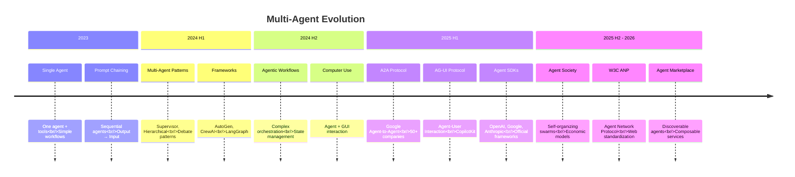
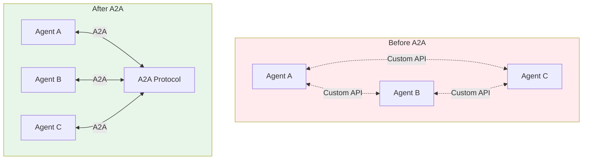
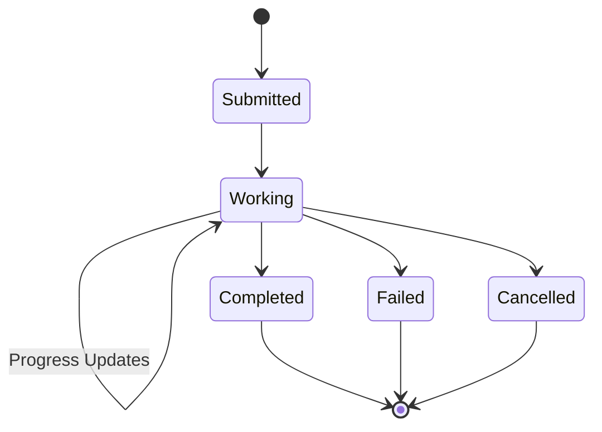
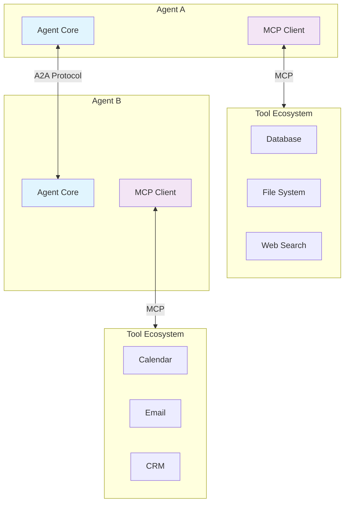
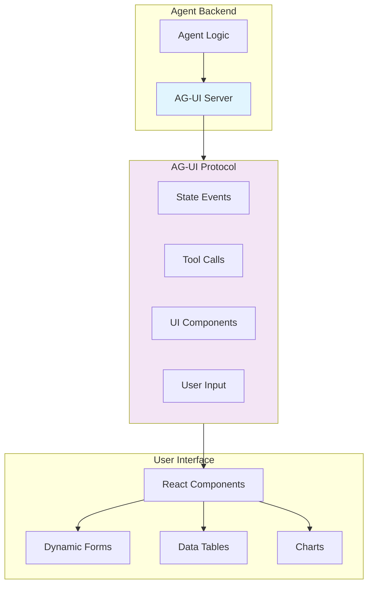
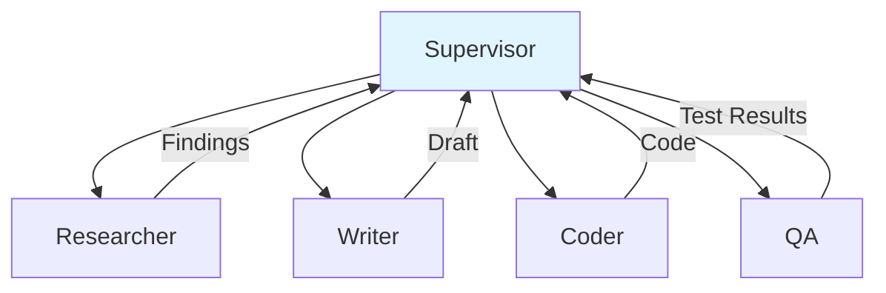
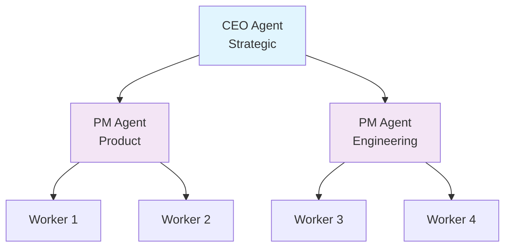
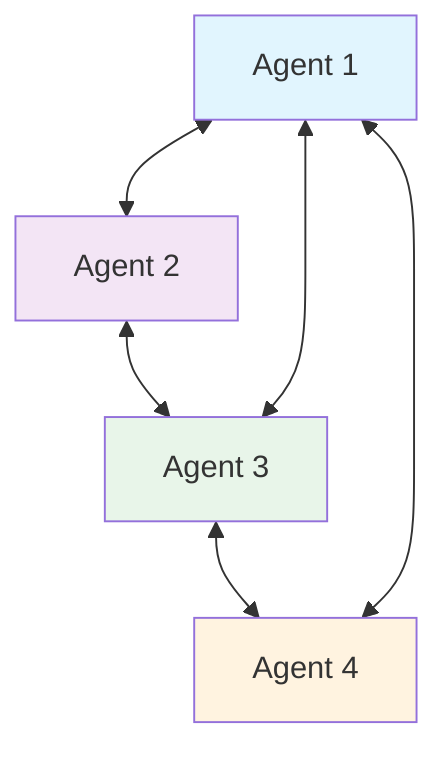
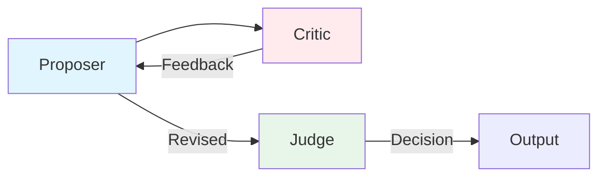
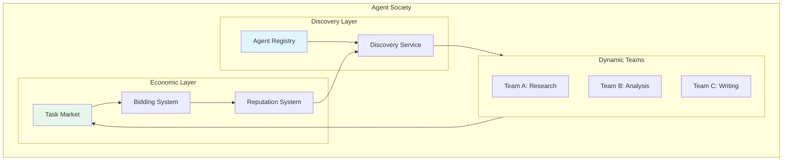

# 7. Multi-Agent & A2A

As individual agents mature, the frontier shifts to **agent collaboration** — how agents communicate, coordinate, and form societies. 2025 saw major standardization efforts with Google's A2A Protocol and the AG-UI Protocol for agent-user interaction.

---

## 7.1 Evolution of Multi-Agent Systems



---

## 7.2 A2A Protocol (Google, 2025.4)

The **Agent-to-Agent (A2A) Protocol** is Google's open standard for inter-agent communication, announced in April 2025 with support from 50+ companies.

### Why A2A Matters



| Problem Without A2A | Solution With A2A |
|---------------------|-------------------|
| Custom integration per agent pair | Standard protocol for all |
| Vendor lock-in | Open, interoperable |
| No discovery mechanism | Agent Cards for capability discovery |
| Proprietary message formats | Standard JSON-RPC messages |
| No task lifecycle management | Standardized task states |

### Core Concepts

| Concept | Description |
|---------|-------------|
| **Agent Card** | JSON metadata describing an agent's capabilities, endpoints, and authentication |
| **Task** | A unit of work sent from one agent to another with lifecycle management |
| **Message** | Communication within a task (text, files, forms) |
| **Part** | Individual content pieces (text, file, data) within a message |
| **Push Notification** | Async notification for long-running tasks |

### Agent Card Example

```json
{
  "name": "Research Agent",
  "description": "Performs web research and synthesizes findings",
  "url": "https://research-agent.example.com/a2a",
  "capabilities": {
    "streaming": true,
    "pushNotifications": true
  },
  "skills": [
    {
      "id": "web-research",
      "name": "Web Research",
      "description": "Search and synthesize information from the web"
    },
    {
      "id": "data-analysis",
      "name": "Data Analysis",
      "description": "Analyze datasets and generate reports"
    }
  ],
  "authentication": {
    "schemes": ["bearer"]
  }
}
```

### Task Lifecycle



### A2A vs MCP

| Aspect | MCP (Model Context Protocol) | A2A (Agent-to-Agent) |
|--------|------------------------------|----------------------|
| **Purpose** | Agent-to-Tool communication | Agent-to-Agent communication |
| **Analogy** | USB for connecting peripherals | HTTP for connecting services |
| **Scope** | Single agent's tool ecosystem | Multi-agent collaboration |
| **Transport** | stdio / SSE | HTTP / JSON-RPC |
| **Discovery** | Server-configured | Agent Cards |
| **Created by** | Anthropic (2024) | Google (2025) |
| **Relationship** | Complementary | Complementary |



---

## 7.3 AG-UI Protocol (CopilotKit, 2025)

The **Agent-User Interaction Protocol (AG-UI)** standardizes how agents interact with human users through UI components.

### Why AG-UI Matters

Traditional agents return text. AG-UI enables agents to:
- Render rich UI components (forms, tables, charts)
- Stream real-time progress indicators
- Request structured user input
- Display interactive elements

### Architecture



### Event Types

| Event Type | Direction | Description |
|------------|-----------|-------------|
| **TextMessageStart/Content/End** | Agent → UI | Streaming text output |
| **StateSnapshot / StateDelta** | Agent → UI | Agent state updates |
| **ToolCallStart/Args/End** | Agent → UI | Tool execution progress |
| **ToolCallResult** | Agent → UI | Tool results |
| **RunStarted / RunFinished** | Agent → UI | Lifecycle events |

---

## 7.4 Real-World Case Study: Docker Agent Fleet (2026)

Docker 团队在其 Coding Agent Sandboxes（sbx）项目中构建了一个由 7 个 AI Agent 角色组成的 "虚拟团队"，用于自动化 CI/CD 流程。这是多 Agent 协作在工程生产中的一个典型落地案例。

### 核心设计理念

- **角色而非脚本**：每个 Agent 是一个 SKILL.md 文件，定义角色（persona）、职责和可用工具，而非固定的执行步骤
- **本地优先，CI 其次**：所有 Skill 先在开发者本地验证，确认行为正确后再接入 CI
- **同一套 Skill，两个运行时**：本地终端和 CI 环境运行完全相同的 Skill 文件

### 七个 Agent 角色

| 角色 | 职责 |
|------|------|
| `/build-engineer` | 构建二进制文件、容器模板、平台特定构建标志 |
| `/project-manager` | 去重发现结果、管理 GitHub Projects、自动化 Triage |
| `/product-owner` | 将 commit 翻译为人类可读的发布说明 |
| `/cli-tester` | 探索性测试，52+ 测试场景，14 个测试层级 |
| `/performance-tester` | 生命周期耐久性测试、I/O 性能基准 |
| `/upgrade-tester` | 四阶段升级回归测试 |
| `/software-engineer` | 响应 GitHub issue 标签，自动修复 Bug |

### 关键创新

1. **PR 自动审查**：当有人在 PR 中评论 `/cli-tester-review`，CI 在 MacOS、Linux、Windows 三个平台上并行运行探索性测试，结果直接作为 PR 评论发布
2. **去重机制**：project-manager 在创建 issue 前会通过 GraphQL 分页扫描整个项目板，避免重复
3. **渐进式自主性**：本地运行时交互式提问，CI 中完全自动模式

> 来源：[Docker Blog - A Virtual Agent team at Docker](https://www.docker.com/blog/a-virtual-agent-team-at-docker-how-the-coding-agent-sandboxes-team-uses-a-fleet-of-agents-to-ship-faster/)（2026-05-01）

---

## 7.5 Multi-Agent Patterns

### Common Orchestration Patterns

#### 1. Supervisor Pattern

A central supervisor agent delegates tasks to specialized workers.



#### 2. Hierarchical Pattern

Multi-level management with strategic and tactical planning.



#### 3. Mesh / Peer-to-Peer Pattern

Agents communicate directly without a central coordinator.



#### 4. Debate Pattern

Multiple agents discuss and reach consensus through structured debate.



### Pattern Comparison

| Pattern | Complexity | Scalability | Best For |
|---------|-----------|-------------|----------|
| **Supervisor** | Low | Medium | Task delegation |
| **Hierarchical** | Medium | High | Large organizations |
| **Mesh** | High | Medium | Creative collaboration |
| **Debate** | Medium | Low | Quality improvement |

---

## 7.5 Agent Society & Swarms

### Self-Organizing Agents

Agents that dynamically form teams based on task requirements.



### Key Concepts

| Concept | Description |
|---------|-------------|
| **Agent Registry** | Directory of available agents and their capabilities |
| **Dynamic Team Formation** | Agents self-organize based on task requirements |
| **Task Market** | Tasks are posted and agents bid to complete them |
| **Reputation System** | Track agent performance and reliability |
| **Economic Model** | Token-based compensation for agent services |

---

## 7.6 W3C ANP (Agent Network Protocol)

The W3C is working on standardizing agent networking through the **Agent Network Protocol (ANP)**.

### Goals

1. **Interoperability**: Agents from different vendors can communicate
2. **Discovery**: Standard mechanism for finding agents
3. **Trust**: Verification and reputation systems
4. **Privacy**: Data sharing controls
5. **Security**: Authentication and authorization

### Relationship to Other Standards

```
W3C ANP (Agent Network Protocol)
  ├── Builds on: A2A Protocol (Google)
  ├── Complements: MCP (Anthropic)
  ├── Inspired by: AG-UI (CopilotKit)
  └── Aligns with: Web Standards (HTTP, JSON-LD)
```

---

## 7.7 Implementation with Agent SDKs

### OpenAI Agents SDK — Multi-Agent Handoff

```python
from agents import Agent, Runner

researcher = Agent(
    name="Researcher",
    instructions="You research topics thoroughly.",
)

writer = Agent(
    name="Writer",
    instructions="You write clear, engaging content.",
)

coordinator = Agent(
    name="Coordinator",
    instructions="Route tasks to the right specialist.",
    handoffs=[researcher, writer],
)

result = Runner.run_sync(coordinator, "Write a report on quantum computing")
```

### LangGraph — Supervisor Pattern

```python
from langgraph.graph import StateGraph, END
from typing import TypedDict, Annotated
import operator

class State(TypedDict):
    messages: Annotated[list, operator.add]
    next: str

def supervisor(state: State):
    # Decide next agent
    return {"next": "researcher"}

def researcher(state: State):
    # Research and return findings
    return {"messages": ["Research findings..."]}

workflow = StateGraph(State)
workflow.add_node("supervisor", supervisor)
workflow.add_node("researcher", researcher)
workflow.add_conditional_edges("supervisor", lambda s: s["next"])
workflow.add_edge("researcher", "supervisor")
workflow.set_entry_point("supervisor")

app = workflow.compile()
```

---

## 7.8 Multi-Agent 安全与基础设施

### LCGuard：多 Agent 潜在通信安全（2026）

论文 [LCGuard](https://arxiv.org/abs/2605.22786) 关注 LLM 多 Agent 系统中一个新兴的安全问题：当 Agent 之间通过 KV Cache（而非自然语言）共享中间状态时，可能产生**潜在信道泄露**。

**核心问题**：
- 多 Agent 系统中，为提高效率开始使用共享 KV Cache 进行通信
- KV Cache 中可能编码了敏感信息（用户隐私、内部推理过程）
- 恶意 Agent 可以通过分析 KV Cache 的统计特征推断其他 Agent 的输入

**LCGuard 方案**：通过在 KV 共享层添加潜在的通信守卫，过滤敏感信息的同时保持协作效率。

> 来源：[arXiv:2605.22786](https://arxiv.org/abs/2605.22786)（2026-05）

### DeltaBox：毫秒级沙盒检查点/回滚（2026）

论文 [DeltaBox](https://arxiv.org/abs/2605.22781) 解决了 LLM Agent 高频状态探索的基础设施问题——为 AI Agent 提供毫秒级的完整沙盒状态检查点和回滚能力。

**应用场景**：
- 测试时树搜索（test-time tree search）
- 强化学习训练中的 episode 回滚
- Agent 错误恢复和状态探索

**技术亮点**：基于增量的 C/R 机制，避免了传统虚拟机快照的巨大开销，使 Agent 可以在毫秒级保存和恢复完整的文件系统 + 进程状态。

> 来源：[arXiv:2605.22781](https://arxiv.org/abs/2605.22781)（2026-05）

---

## 7.9 Key Takeaways

1. **A2A Protocol** is becoming the standard for inter-agent communication
2. **AG-UI Protocol** bridges the gap between agents and rich user interfaces
3. **MCP + A2A** are complementary — tools vs. agent collaboration
4. **Multi-agent patterns** (Supervisor, Hierarchical, Mesh) solve different coordination needs
5. **Agent societies** represent the frontier — self-organizing, economic systems

---

:::tip Start with Patterns
Before building multi-agent systems, master the **Supervisor pattern** — it's the most practical for most use cases. Use **LangGraph** or **OpenAI Agents SDK** for implementation.
:::

:::info Protocol Selection
- Need agent-to-tool communication? Use **MCP**
- Need agent-to-agent communication? Use **A2A**
- Need agent-to-user rich interaction? Use **AG-UI**
:::
