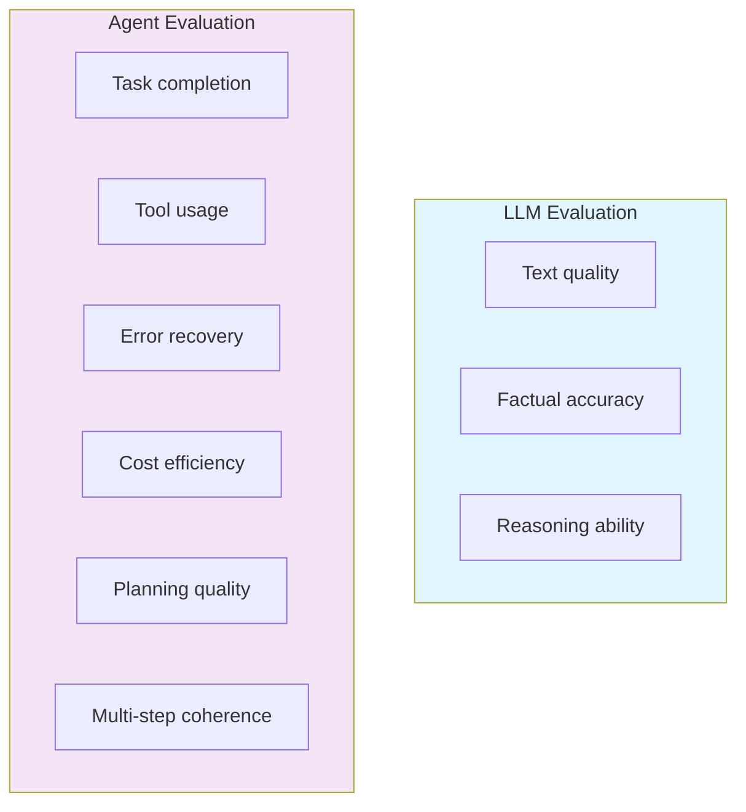
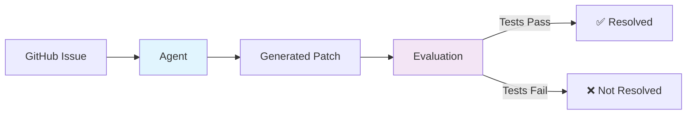
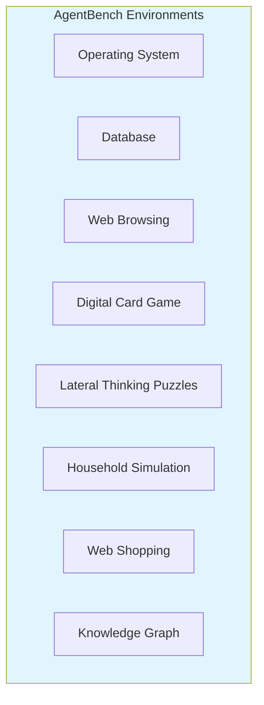
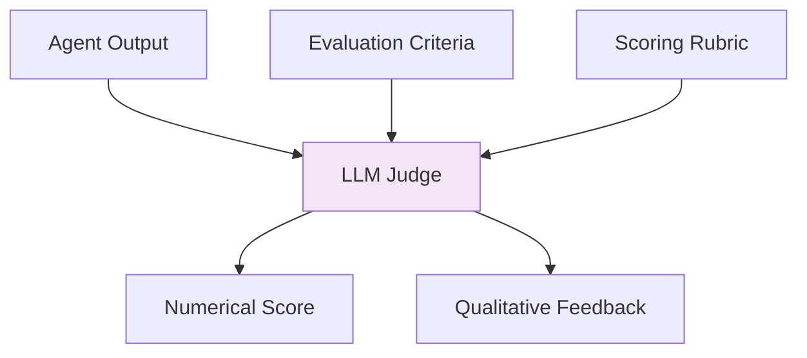
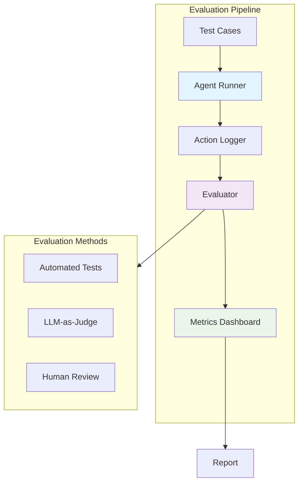

# 8. Evaluation & Benchmarks

Evaluating AI agents is fundamentally different from evaluating static LLMs. Agents must be assessed on their ability to reason, plan, use tools, recover from errors, and complete multi-step tasks — not just generate text.

---

## 8.1 Why Agent Evaluation Matters



### Key Metrics

| Metric | Description | How to Measure |
|--------|-------------|----------------|
| **Success Rate** | Percentage of tasks completed correctly | Ground truth comparison |
| **Token Cost** | Total tokens consumed per task | Token counting |
| **Latency** | Time to complete a task | Wall-clock timing |
| **Tool Accuracy** | Correct tool selection and usage | Action log analysis |
| **Error Recovery** | Ability to recover from failures | Injected failure tests |
| **Planning Quality** | Efficiency of task decomposition | Expert evaluation |

---

## 8.2 SWE-bench

The primary benchmark for software engineering agents.

### Overview

**SWE-bench** evaluates an agent's ability to resolve real GitHub issues by generating patches.



### Variants

| Variant | Issues | Description |
|---------|--------|-------------|
| **SWE-bench Full** | 2,294 | Complete benchmark from 12 Python repos |
| **SWE-bench Lite** | 300 | Curated subset for faster evaluation |
| **SWE-bench Verified** | 500 | Human-verified for reliable evaluation |

### Evaluation Process

1. **Input**: Agent receives a GitHub issue (description + repo state)
2. **Execution**: Agent explores codebase, identifies bug, generates patch
3. **Evaluation**: Patch applied, test suite run
4. **Result**: Pass if all relevant tests pass

### Progress Over Time

| Period | Top Score (Verified) | Key Agent |
|--------|---------------------|-----------|
| 2024 Q1 | ~4% | Early SWE-Agent |
| 2024 Q2 | ~12% | SWE-Agent + GPT-4 |
| 2024 Q3 | ~22% | Agentless, AutoCodeRover |
| 2024 Q4 | ~33% | OpenAI, Anthropic agents |
| 2025 Q1 | ~42% | Claude Code, Codex |
| 2025 Q2 | ~48% | Multi-agent approaches |
| 2026 Q1 | ~53% | Continued improvement |

:::info Official Leaderboard
For the latest scores, see [swebench.com](https://www.swebench.com/)
:::

---

## 8.3 WebArena & OSWorld

### WebArena

Evaluates agents on realistic web interaction tasks.

**Key Features**:
- 812 web tasks across 5 web applications
- Tasks include: information retrieval, form filling, navigation
- Fully reproducible web environment
- Realistic, open-ended tasks

| Category | Example Tasks |
|----------|---------------|
| **Information Finding** | "Find the cheapest 4-star hotel in NYC" |
| **Form Filling** | "Submit an expense report for $50 lunch" |
| **Navigation** | "Go to Settings → Privacy → Change to Friends Only" |
| **Data Entry** | "Create a new contact with the following details" |

### OSWorld

Evaluates agents on real desktop OS tasks.

**Key Features**:
- 369 tasks across Ubuntu, Windows, macOS
- Real operating system environments
- Multi-application workflows
- File, application, and system operations

| Metric | WebArena (2025) | OSWorld (2025) |
|--------|-----------------|-----------------|
| **Top Agent Score** | ~48% | ~22% |
| **Human Baseline** | ~78% | ~72% |
| **Gap** | 30% | 50% |

---

## 8.4 General Agent Benchmarks

### GAIA (General AI Assistants)

Evaluates general AI assistant capabilities across difficulty levels.

| Level | Tasks | Description |
|-------|-------|-------------|
| **Level 1** | 153 | Straightforward, single-step |
| **Level 2** | 251 | Multi-step reasoning, tool use |
| **Level 3** | 96 | Complex, multi-modal, long-horizon |

### AgentBench

Multi-dimensional agent evaluation across 8 environments.



### τ-bench

Evaluates agents on realistic customer service tasks with policy compliance.

- Tests following complex policies
- Evaluates tool usage accuracy
- Measures conversation quality
- Includes adversarial user scenarios

---

## 8.5 LLM-as-a-Judge

Using LLMs to evaluate agent outputs when human evaluation is impractical.

### How It Works



### Evaluation Approaches

| Approach | Description | Best For |
|----------|-------------|----------|
| **Single Score** | Rate output on 1-5 scale | Quick assessment |
| **Pairwise Comparison** | Compare two outputs | Relative ranking |
| **Reference-Based** | Compare to ground truth | Task completion |
| **Multi-Criteria** | Score on multiple dimensions | Detailed analysis |
| **Chain-of-Thought Judge** | Judge explains reasoning | Reliability |

### Best Practices

1. **Use strong models as judges** (GPT-4o, Claude Opus)
2. **Provide clear rubrics** with specific criteria
3. **Calibrate with human evaluation** on a subset
4. **Use multiple judges** for high-stakes evaluation
5. **Randomize presentation order** for pairwise comparisons
6. **Track inter-annotator agreement** between LLM and human judges

### Example Judge Prompt

```
You are evaluating an AI agent's response.

Task: {original_task}
Agent Response: {agent_response}

Evaluate on these criteria (1-5 scale each):
1. Task Completion: Did the agent fully complete the task?
2. Accuracy: Is the information correct?
3. Tool Usage: Were tools used appropriately?
4. Efficiency: Was the approach efficient?
5. Clarity: Is the response clear and well-structured?

Provide a score for each criterion and overall assessment.
```

---

## 8.6 Building an Evaluation Pipeline

### Architecture



### Implementation Checklist

- [ ] Define clear success criteria for each task type
- [ ] Create diverse test set covering edge cases
- [ ] Implement action logging for all agent steps
- [ ] Set up automated evaluation with ground truth
- [ ] Add LLM-as-Judge for qualitative assessment
- [ ] Establish baseline with human performance
- [ ] Track metrics over time (regression testing)
- [ ] Include cost and latency metrics
- [ ] Regular calibration with human evaluators

---

## 8.7 Evaluation Frameworks & Tools

| Tool | Type | Description |
|------|------|-------------|
| **LangSmith** | Platform | Tracing, evaluation, and testing for LangChain |
| **Promptfoo** | CLI | Prompt evaluation and comparison |
| **Ragas** | Library | RAG-specific evaluation metrics |
| **DeepEval** | Library | LLM evaluation framework |
| **Arize Phoenix** | Platform | LLM observability and evaluation |
| **Braintrust** | Platform | Evaluation and experiment tracking |

---

## 8.8 Key Takeaways

1. **Agent evaluation is multi-dimensional** — not just text quality
2. **SWE-bench** is the standard for coding agent evaluation
3. **WebArena and OSWorld** test GUI interaction capabilities
4. **LLM-as-a-Judge** enables scalable but approximate evaluation
5. **Always combine automated + human evaluation** for reliable results
6. **Track cost and latency** alongside quality metrics

---

:::tip Start Simple
Begin with **task completion rate** as your primary metric. Add more dimensions (cost, latency, tool accuracy) as your evaluation matures.
:::

:::info Benchmark Selection
Choose benchmarks that match your use case:
- Coding agents → **SWE-bench**
- Web agents → **WebArena**
- Desktop agents → **OSWorld**
- General agents → **GAIA / AgentBench**
:::
