# 10. Frontier Trends & Future Directions

AI agent technology is evolving rapidly. This section explores cutting-edge research, emerging trends, and the future trajectory of agentic AI systems.

---

## 10.1 Agentic V2: The Next Generation

### Evolution from Tool Use to Autonomy

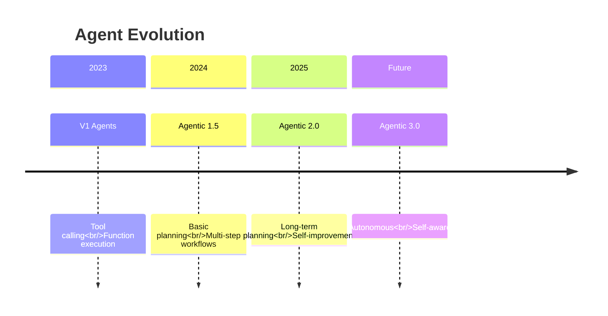

### V2 Capabilities

| Capability | V1 (Current) | V2 (Emerging) |
|------------|-------------|---------------|
| **Planning Horizon** | Immediate steps | Long-term strategies |
| **Learning** | Fixed prompts | Self-improving |
| **Collaboration** | Structured patterns | Dynamic teaming |
| **Memory** | Context window | Persistent learning |
| **Reliability** | ~80% success | >95% success |
| **Autonomy** | Human-guided | Semi-autonomous |

---

## 10.2 Long-Term Planning

### Hierarchical Task Networks

Breaking down complex goals across multiple time horizons.

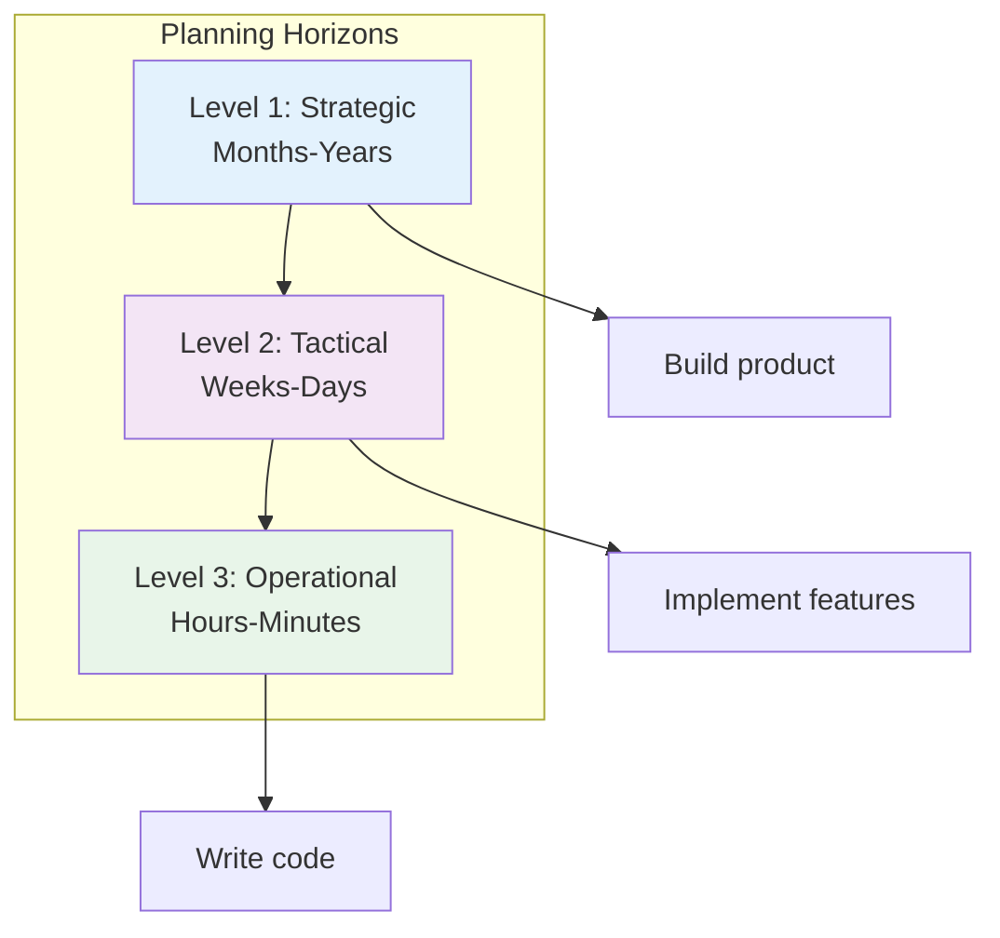

### Implementation Concept

```java
// Concept: Hierarchical Planning Agent
public interface HierarchicalPlanner {

    Plan createStrategicPlan(Goal goal);
    Plan createTacticalPlan(StrategicPlan strategic);
    Plan createOperationalPlan(TacticalPlan tactical);

    default Plan execute(Goal goal) {
        // Multi-level planning
        Plan strategic = createStrategicPlan(goal);
        Plan tactical = createTacticalPlan(strategic);
        Plan operational = createOperationalPlan(tactical);

        // Execute with continuous replanning
        while (!operational.isComplete()) {
            executeStep(operational.nextStep());

            if (shouldReplan()) {
                operational = createOperationalPlan(tactical);
            }
        }

        return operational;
    }
}
```

---

## 10.3 Self-Improving Agents

### Learning from Experience

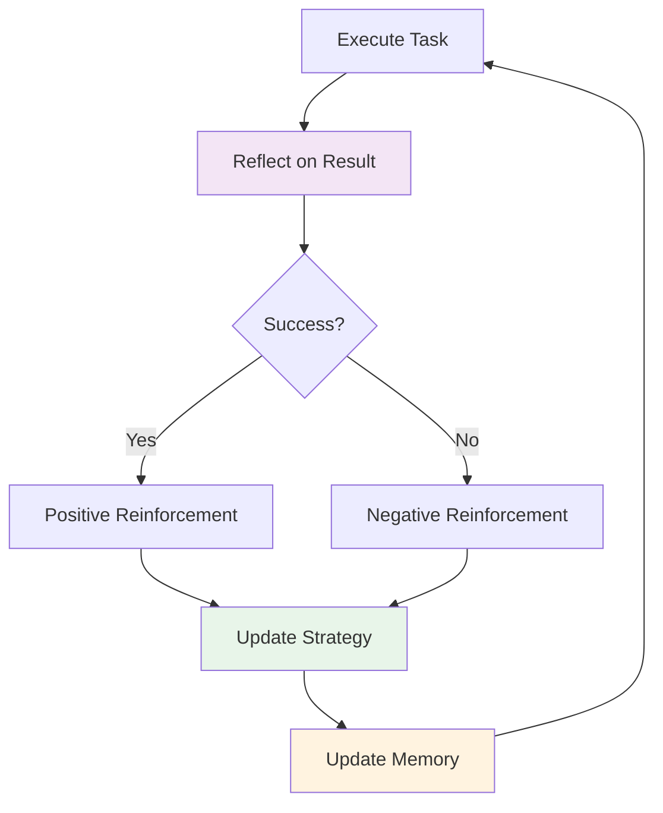

### Self-Improvement Techniques

| Technique | Description | Maturity |
|-----------|-------------|----------|
| **Reflection** | Critique and improve own outputs | Production-ready |
| **Experience Replay** | Learn from past episodes | Research |
| **Meta-Learning** | Learn how to learn | Research |
| **Self-Play** | Improve through practice | Emerging |
| **Evolutionary** | Optimize through selection | Research |

---

## 10.4 Multi-Agent Research Frontiers

### MetaGPT: Software Company Simulation

MetaGPT assigns roles to agents simulating a software company.

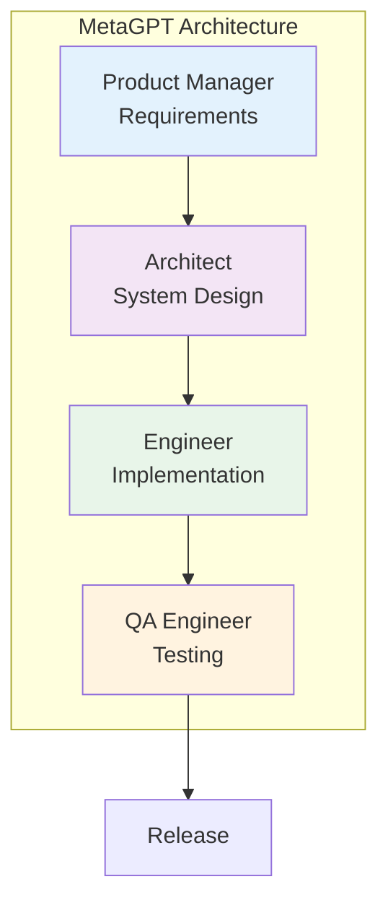

**Key Innovation**: Standard Operating Procedures (SOPs)
- Defines clear workflows for each role
- Enforces communication protocols
- Reduces coordination overhead

### ChatDev: Software Development

ChatDev specializes in automated software development.

**Phases**:
1. **Design**: Architecture and requirements
2. **Coding**: Implementation with best practices
3. **Testing**: Automated test generation
4. **Documentation**: Auto-generated docs

**Benefits**:
- Faster development cycles
- Consistent code quality
- Reduced human oversight

### AgentVerse: Interactive Agent Environment

Creates virtual environments where agents interact and collaborate.

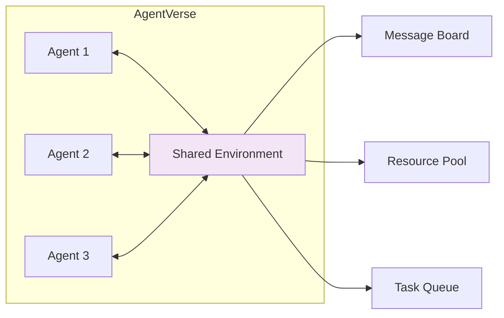

---

## 10.5 Emerging Directions

### GUI Agents

Agents that directly interact with graphical user interfaces.

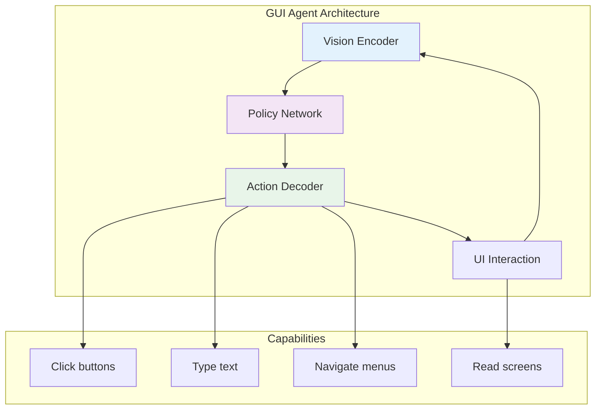

**Examples**:
- **Anthropic's Computer Use**: Claude controlling desktop
- **Multion**: AI assistant for web tasks
- **Rabbit R1**: Purpose-built device for autonomous actions

:::caution Rabbit R1 Market Update (2025)
Despite initial hype, the Rabbit R1 struggled with market adoption due to limited functionality and performance issues. More successful GUI Agent implementations include **Anthropic's Computer Use** (integrated into Claude) and **OpenAI Operator**, which leverage existing devices rather than dedicated hardware.
:::

**Challenges**:
- UI understanding and robustness
- Error recovery
- Security and permission models

### Embodied Agents

Agents that interact with the physical world through robots.

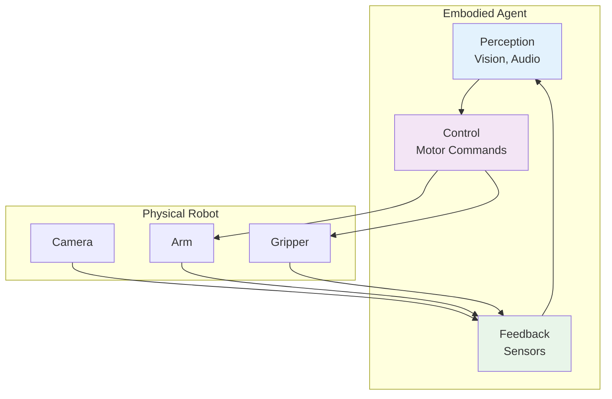

**Applications**:
- Home robotics (cleaning, cooking)
- Industrial automation
- Healthcare assistance
- Exploration (space, underwater)

**Key Research**:
- **RT-2**: Robotic Transformer 2 (Google DeepMind)
- **Gemini Robotics-ER 1.6**（2026年4月）: Google 增强空间推理能力，新增多视角理解、任务规划和仪器读数能力（与 Boston Dynamics 合作开发），被称为 Google "最安全的机器人模型"
- **VoxPoser**: LLM for robot manipulation
- **Hello Robot**: Stretch for home tasks

> 💡 **行业数据**：2025 年人形机器人领域投资达 $61 亿，是 2024 年的 4 倍。机器人学习正从规则驱动转向数据驱动的 AI 模型——通过传感器数据预测下一步动作。（来源：MIT Technology Review, 2026年4月）

### Agent Societies

Multi-agent systems with social structures and economics.

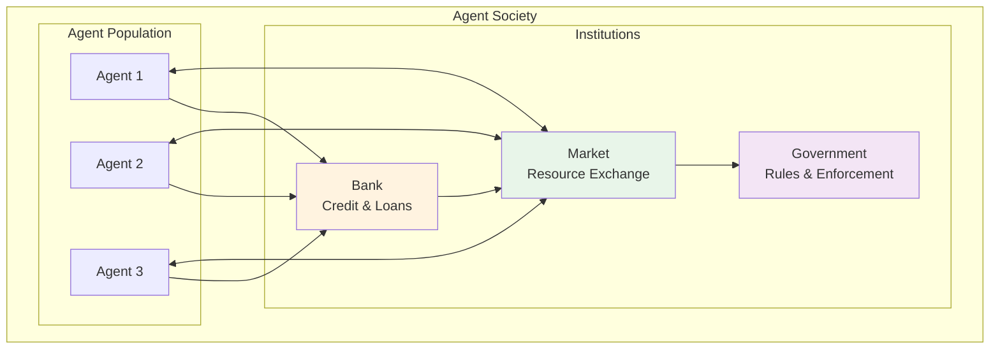

**Research Areas**:
- **Economic Models**: Token economies, incentive design
- **Governance**: Voting, consensus, rule-making
- **Social Dynamics**: Cooperation, competition, emergence
- **Ethics**: Moral frameworks, value alignment

### Agentic Coding (2025)

AI 辅助编程成为 2025 年最重要的 Agent 应用趋势之一：

- **Claude Code**: Anthropic 的命令行 AI 编程助手，支持全栈开发
- **Cursor Agent**: 集成 AI 的代码编辑器，支持多文件编辑和终端操作
- **Windsurf (Codeium)**: AI-native IDE，具备 Cascade 多步推理能力
- **Devin**: Cognition Labs 的自主 AI 软件工程师
- **OpenHands**: 开源 AI 软件开发 Agent 平台

核心特征：理解代码库上下文 → 制定修改计划 → 多文件并行编辑 → 自动测试验证 → 迭代修复

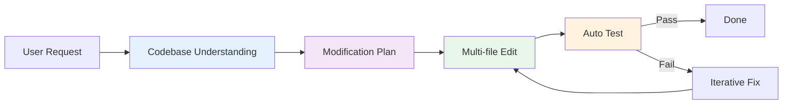

---

## 10.6 Technical Frontiers

### 1. RecG Agents: Recursive Critic and Generator

Agents that generate and critique their own outputs recursively.

```
For i in 1...N:
    Output_i = Generator(Feedback_{i-1})
    Critique_i = Critic(Output_i)
    Feedback_i = Refine(Critique_i)

Return Output_N
```

**Benefits**:
- Self-improving quality
- Reduced human oversight
- Handles complex criteria

### 2. Chain of Abstraction

Reasoning at different levels of abstraction.

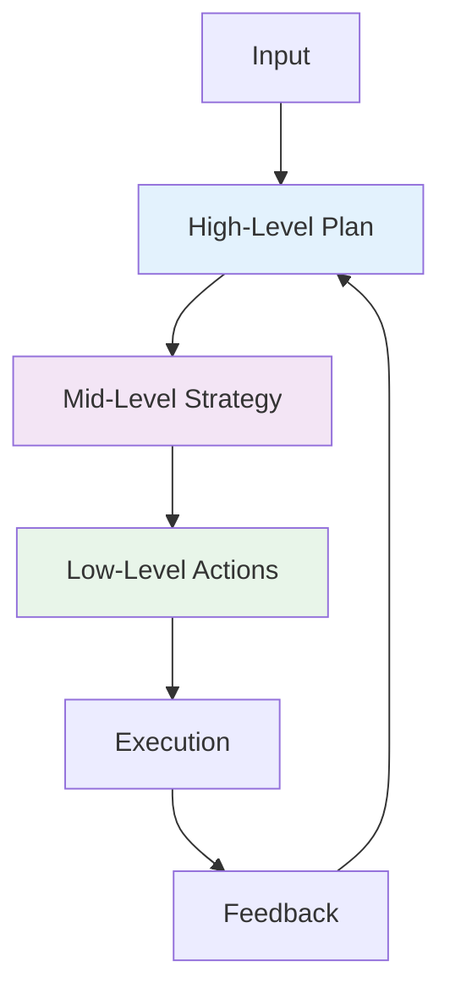

### 3. Tree of Thoughts

Exploring multiple reasoning paths in parallel.

```
Root (Question)
├── Branch 1: Approach A
│   ├── Sub-branch 1.1
│   └── Sub-branch 1.2
├── Branch 2: Approach B
│   ├── Sub-branch 2.1
│   └── Sub-branch 2.2
└── Branch 3: Approach C
    ├── Sub-branch 3.1
    └── Sub-branch 3.2

Evaluate all branches and select best.
```

---

## 10.7 Emerging Paradigms (2025–2026)

### Agent Economy

AI Agents are beginning to participate in economic activities autonomously — hiring services, purchasing data, and negotiating contracts.

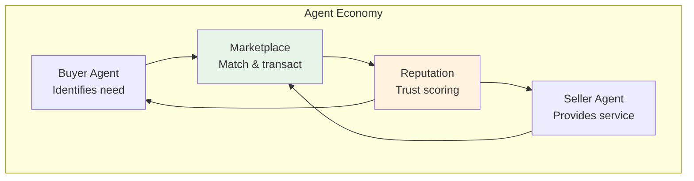

| Component | Description | Status |
|-----------|-------------|--------|
| **Agent Wallets** | Crypto/fiat wallets for autonomous transactions | Early prototypes |
| **Agent Marketplaces** | Platforms where agents list and discover services | Emerging |
| **Reputation Systems** | Trust scores based on transaction history | Research |
| **Smart Contracts** | Automated enforcement of agent agreements | Active development |
| **Pricing Protocols** | Dynamic negotiation between agents | Research |

### Agent-Native Applications

A new generation of applications designed from the ground up for agent interaction, replacing human-centric UIs.

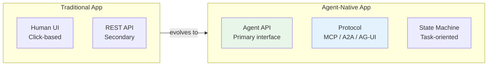

**Characteristics of Agent-Native Apps**:
- **Protocol-first**: Expose capabilities via MCP/A2A rather than REST
- **Task-oriented**: Accept high-level goals, not step-by-step instructions
- **Stateful**: Maintain conversation and task context across interactions
- **Streaming**: Provide real-time progress updates via SSE/WebSocket
- **Composable**: Designed to be chained with other agent services

**Examples (2025–2026)**:
- **Vercel v0**: Agent-native UI generation
- **Replit Agent**: Agent-native development environment
- **Linear**: Agent-native project management via MCP

### Self-Evolving Agents

Agents that can modify their own behavior, prompts, and tool configurations based on experience.

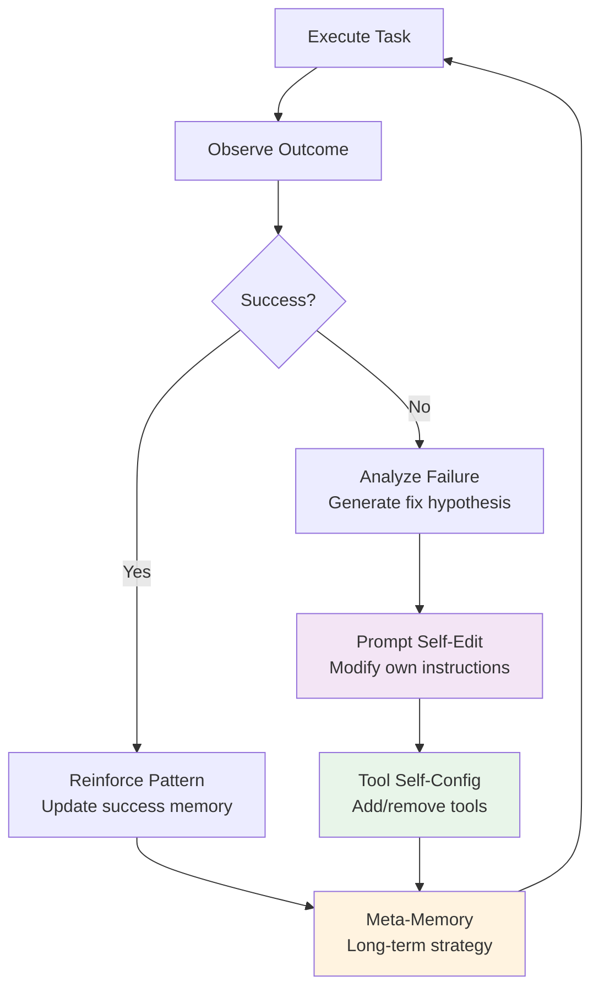

**Approaches**:
- **Prompt Optimization**: Agents rewrite their own system prompts (e.g., DSPy, OPRO)
- **Tool Synthesis**: Agents create new tools from combinations of existing ones
- **Experience Replay**: Agents review past executions to extract heuristics
- **Constitutional Self-Modification**: Agents follow meta-rules governing what they can change about themselves

> **Safety Note**: Self-evolving agents require strict guardrails. Changes to behavior should be logged, reversible, and bounded by a constitution that prevents self-modification of safety constraints.

---

## 10.8 Challenges & Open Problems

### Technical Challenges

| Challenge | Description | Current Status |
|-----------|-------------|----------------|
| **Long-term Memory** | Persistent, scalable memory | Partial solutions |
| **Causal Reasoning** | Understanding cause-effect | Research stage |
| **Transfer Learning** | Applying knowledge to new domains | Early progress |
| **Explainability** | Understanding agent decisions | Active research |
| **Safety Assurance** | Formal guarantees of behavior | Major open problem |

### Societal Challenges

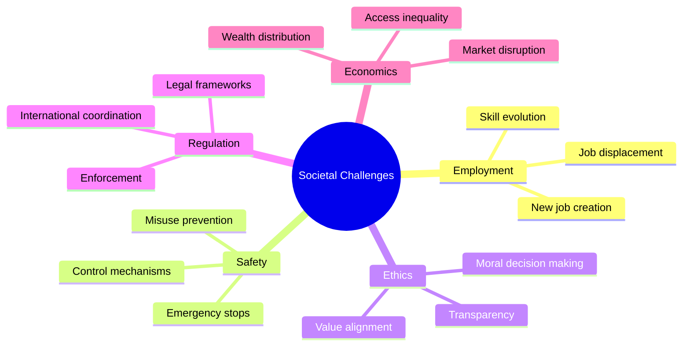

---

## 10.9 Predictions: 2025-2030

### Near-Term (2025-2026)

**2025 Actual Events (已发生)**:

- **DeepSeek R1 开源推理模型发布**（2025年1月）：中国团队发布的开源推理模型，以极低成本实现接近 OpenAI o1 的性能，震惊业界
- **OpenAI Agents SDK 发布**（2025年2月）：OpenAI 发布官方 Agent 框架，提供 Agents、Handoffs、Guardrails、Tracing 等核心概念
- **MCP 协议被 OpenAI 采纳**（2025年3月）：OpenAI 宣布在其产品和 API 中支持 MCP 协议，标志着 MCP 从 Anthropic 主导走向全行业标准
- **Google A2A 协议发布**（2025年4月）：Google 发布 Agent-to-Agent 通信协议，解决 Agent 之间的协作问题，与 MCP 互补

**Near-Term Predictions**:

- **V2 Agents**: Long-term planning becomes common
- **Self-Improvement**: Agents learn from feedback
- **Multi-Agent Standard**: Common patterns emerge (MCP + A2A)
- **GUI Agents**: Web task automation matures

### Mid-Term (2027-2028)

- **Embodied Agents**: Home robots become practical
- **Agent Societies**: Economic systems emerge
- **Regulation**: First agent-specific laws passed
- **Safety Standards**: Industry-wide protocols

### Long-Term (2029-2030)

- **Semi-Autonomous**: Agents operate with minimal oversight
- **Recursive Improvement**: Agents improve other agents
- **General Purpose**: Agents handle diverse tasks
- **Human-Agent Collaboration**: Seamless teamwork

---

## 10.10 How to Stay Current

### Research Sources

| Source | Type | Update Frequency |
|--------|------|------------------|
| **arXiv** | Preprints | Daily |
| **Papers With Code** | Implementations | Weekly |
| **LangChain Blog** | Industry insights | Monthly |
| **Anthropic/Google Blogs** | Company research | Irregular |
| **Agent Workshops** | Academic conferences | Quarterly |

### Key Conferences

- **ICML**: International Conference on Machine Learning
- **NeurIPS**: Neural Information Processing Systems
- **ICLR**: International Conference on Learning Representations
- **AAAI**: Association for Advancement of AI
- **Agent Workshops**: Specialized agent conferences

### Open Source Projects

- **LangChain/LangGraph**: Rapidly evolving frameworks
- **Microsoft Agent Framework**: Unified LTS SDK (replaces AutoGen + Semantic Kernel)
- **CrewAI**: Role-playing agents
- **MetaGPT**: Software company simulation

### 2026 年 4月前沿研究动态

#### 上周重点（4月19日）

| 方向 | 论文 | 关键发现 |
|------|------|----------|
| **LLM 评估可靠性** | [Diagnosing LLM Judge Reliability](https://arxiv.org/abs/2604.15302) | 揭示 LLM-as-Judge 在逐输入评估中存在广泛不一致性 |
| **多 Agent 合作** | [CoopEval](https://arxiv.org/abs/2604.15267) | 推理能力更强的 LLM 在社会困境中反而更不合作 |
| **推理加速** | [Verification-Aware Speculative Decoding](https://arxiv.org/abs/2604.15244) | 从 Token 级推测解码升级到步骤级，防止多步推理中的错误传播 |
| **测试时计算扩展** | [Looped Transformers](https://arxiv.org/abs/2604.15259) | 研究循环式 Transformer 的固定点框架，分析哪些架构能真正泛化 |
| **医疗 Agent** | [RadAgent](https://arxiv.org/abs/2604.15231) | 使用 VLM + 工具调用的可解释胸部 CT 分析 Agent |
| **Agentic RAG** | [CorpusGraph](https://arxiv.org/abs/2604.14572) | 从被动检索转向 Agent 主动导航企业知识图谱 |

#### 本周新增（4月20日）

| 方向 | 论文 | 关键发现 |
|------|------|----------|
| **AI 安全审计** | [ASMR-Bench](https://arxiv.org/abs/2604.16286) | 首个评估审计员检测自主研究中恶意缺陷能力的基准，针对 AI 自主研究安全性 |
| **RL 奖励作弊检测** | [Gradient Fingerprints](https://arxiv.org/abs/2604.16242) | 提出梯度指纹方法检测和抑制 RLVR 中的奖励作弊（reward hacking）行为 |
| **VLM 推理质疑** | [Do VLMs Truly Reason?](https://arxiv.org/abs/2604.16256) | 质疑视觉语言模型是否真正进行视觉推理，还是依赖语言先验 |
| **RL 与 Agent 演化** | [Beyond Distribution Sharpening](https://arxiv.org/abs/2604.16259) | 研究 RL 是否真正改善推理能力，以及任务奖励如何驱动模型从推理器进化为智能 Agent |
| **定理证明** | [Learning to Reason with Insight](https://arxiv.org/abs/2604.16278) | 识别"洞察力缺失"为 LLM 非形式化定理证明的主要瓶颈 |

#### 本周新增（4月22–23日）— 行业重大事件

##### Google Cloud Next '26：全面拥抱 Agentic 架构

Google 在 Cloud Next '26 大会上宣布了一系列重大更新：

- **Gemini Enterprise Agent Platform**：将 Vertex AI 重新品牌为企业级 Agent 平台，集成 Agent Designer（可视化工作流）、Agent Engine（会话与记忆）、Agent Garden（预构建 Agent 模板）和 Express 免费层。支持 Gemini 3.1 Pro/Flash、Anthropic Claude 和 Llama 等 200+ 模型。
- **Workspace Studio**：无代码 Agent 构建工具，业务用户可用自然语言在 Gmail、Docs、Sheets 等中创建自动化 Agent，支持 Jira、Salesforce 等第三方集成。
- **TPU 第八代（TPU 8t / 8i）**：两款专用芯片——TPU 8t 用于训练（~3x 性能提升，121 ExaFlops），TPU 8i 用于推理（高内存带宽、低延迟），专为 Agentic AI 工作负载设计。
- **Deep Research / Deep Research Max**：基于 Gemini 3.1 Pro 的自主研究 Agent，支持 MCP 协议、原生数据可视化和文件上传。Max 版本使用扩展推理时间计算，适用于金融、生命科学等深度分析场景。
- **A2A 协议扩展**：Agent-to-Agent 协议已在 150+ 组织中部署。
- **Gemini Embedding 2 GA**：首个原生多模态嵌入模型正式发布。

##### Anthropic Project Glasswing：AI 驱动的网络安全防御

Anthropic 发布 [Project Glasswing](https://www.anthropic.com/glasswing)，联合 AWS、Apple、Google、Microsoft、NVIDIA 等 40+ 组织，使用 AI 进行防御性网络安全研究：

- **Claude Mythos**：未发布的通用前沿模型，展现了突破性的漏洞发现能力——发现数千个高严重性漏洞，包括 OpenBSD 27 年老漏洞、Linux 内核和所有主流浏览器中的问题。
- Mythos **不会公开发布**，仅通过安全验证程序提供给安全专业人员。
- 核心洞察：AI 网络安全能力是"锯齿状"的——不随模型大小平滑缩放，而是依赖系统设计和领域专业知识。

##### Gemma 4：Apache 2.0 开源模型

Google DeepMind 发布 [Gemma 4](https://blog.google/innovation-and-ai/technology/developers-tools/gemma-4/) 系列开源模型（Apache 2.0 许可）：

| 模型 | 架构 | 活跃参数 | 上下文窗口 |
|------|------|---------|-----------|
| **E2B** | Dense | ~2B | 128K |
| **E4B** | Dense | ~4B | 128K |
| **26B MoE** | Mixture of Experts | 3.8B active | 256K |
| **31B Dense** | Dense | 31B | 256K |

31B 模型在 Arena AI 排行榜位列全球开源模型第 3 名。全部模型支持原生函数调用、结构化 JSON 输出、视觉/音频理解，训练覆盖 140+ 语言。

##### Kubernetes v1.36 "Haru" 发布

[Kubernetes v1.36](https://kubernetes.io/blog/2026/04/22/kubernetes-v1-36-release/) 于 4 月 22 日发布，包含 70 项增强：
- **GA**：细粒度 Kubelet API 授权、Linux User Namespaces
- **Beta**：Resource Health Status（硬件健康状态报告）
- **Alpha**：Workload Aware Scheduling（工作负载感知调度）

##### Docker Hub 供应链攻击：KICS 事件

继 3 月 Trivy 供应链攻击后，[Checkmarx KICS Docker 镜像被入侵](https://www.docker.com/blog/trivy-kics-and-the-shape-of-supply-chain-attacks-so-far-in-2026/)（4 月 22 日），攻击者使用窃取的发布者凭据推送恶意镜像，将扫描结果加密外传至攻击者控制的基础设施。Docker 基础设施本身未被入侵，但这凸显了供应链安全的严峻挑战。
| **机器人导航 Agent** | [FineCog-Nav](https://arxiv.org/abs/2604.16298) | 集成细粒度认知模块实现零样本 UAV 视觉语言导航 |

#### 本周新增（4月21日）

| 方向 | 论文 | 关键发现 |
|------|------|----------|
| **数学推理基准** | [MathNet](https://arxiv.org/abs/2604.18584) | 全球多模态数学推理与检索基准，覆盖 Olympiad 级别题目 |
| **序列模型架构** | [Sessa: Selective State Space Attention](https://arxiv.org/abs/2604.18580) | 在注意力扩散场景下用选择性状态空间替代自注意力，Transformer 新替代方案 |
| **RL 优化** | [Bounded Ratio RL](https://arxiv.org/abs/2604.18578) | 弥合 PPO 裁剪启发式与信任区域理论基础之间的差距 |
| **Agentic 预测** | [BLF: Bayesian Linguistic Forecaster](https://arxiv.org/abs/2604.18576) | Agentic 系统在 ForecastBench 上达到 SOTA，结合贝叶斯语言信念状态 |
| **弱监督推理** | [RLVR with Weak Supervision](https://arxiv.org/abs/2604.18574) | 研究 RLVR 在弱监督信号下何时能有效提升推理能力 |
| **推理纠错** | [Latent Phase-Shift Rollback](https://arxiv.org/abs/2604.18567) | 监控残差流并在推理错误时回滚 KV-Cache，实现推理时自动纠错 |
| **多模态医疗** | [Apollo](https://arxiv.org/abs/2604.18570) | 多模态时序基础模型，整合 30 年临床记录构建统一患者表征 |

#### 本周新增（4月24–27日）— 行业生态深化

##### Anthropic 与 AWS 深化合作（4月27日）

Anthropic 与 AWS 联合宣布一系列重大合作进展：

- **Claude 在 AWS Trainium 上训练**：Anthropic 现在在 AWS Trainium 和 Graviton 基础设施上训练其最先进的基础模型，与 Annapurna Labs 在芯片层面进行联合工程优化
- **Claude Cowork**：正式上线 Amazon Bedrock，支持团队在现有 Bedrock 环境中与 Claude 协作，数据安全保留在 AWS 内
- **Claude Platform on AWS**（即将推出）：统一的开发者体验，无需离开 AWS 即可构建、部署和扩展 Claude 驱动的应用
- **Bedrock AgentCore CLI**：支持通过 AWS CDK 以 IaC 治理方式部署 Agent（Terraform 支持即将推出），14 个 AWS 区域可用
- **Bedrock AgentCore Managed Harness**（预览）：只需定义模型 + Prompt + 工具即可创建 Agent，无需编写编排代码

##### Meta 部署数千万 AWS Graviton 核心

Meta 与 AWS 签署大规模协议，部署数千万个 Graviton 核心，用于驱动 CPU 密集型 Agentic AI 工作负载，包括实时推理、代码生成、搜索和多步任务编排。

##### OpenAI 开源 Privacy Filter（4月27日）

OpenAI 发布 1.5B 参数（50M 活跃）的开源 PII 检测器（Apache 2.0），可在单次 128K 上下文前向传播中检测 8 类个人身份信息。附带三个 Gradio 演示应用：Document Privacy Explorer、Image Anonymizer 和 SmartRedact Paste。

##### arXiv 前沿论文

| 方向 | 论文 | 关键发现 |
|------|------|----------|
| **Agentic World Model** | [Agentic World Modeling](https://arxiv.org/abs/2604.22748) | 综合 400+ 工作的综述，提出"能力等级 x 治理法则"分类框架（L1 Predictor → L2 Simulator → L3 Evolver），覆盖物理/数字/社会/科学四个领域 |
| **Agent Token 经济学** | [Token Consumption in Agentic Coding](https://arxiv.org/abs/2604.22750) | Agentic 任务消耗 1000x 于代码推理的 token，同一任务 token 用量可差 30x，更多 token 不等于更高准确率。Kimi-K2 和 Claude Sonnet 4.5 比 GPT-5 平均多消耗 150 万 token |
| **RAG 检索优化** | [Aligning Dense Retrievers with LLM Utility](https://arxiv.org/abs/2604.22722) | 通过蒸馏将 LLM 重排序效用对齐到密集检索器，减少 RAG 推理开销 |
| **高效推理** | [Thinking Without Words](https://arxiv.org/abs/2604.22709) | 抽象思维链（Abstract CoT）实现非语言推理，在更短生成长度下保持性能 |

**行业关键指标**（Stanford 2026 AI Index）：
- Agent 任务成功率：**12% → 66%**（年同比大幅提升）
- AI Agent 网络流量增长：**+7,851%**（年同比）
- 预计年底 **40%** 企业应用将集成 Agent 能力

**2026 年 4月模型发布格局**：
- **GLM-5.1**（Zhipu AI）：744B MoE，40B 活跃参数，MIT 许可，据称在 SWE-Bench Pro 上超越 Claude Opus 4.6 和 GPT-5.4
- **Gemma 4**（Google）：全系列开放（27B Dense / 26B MoE / E4B / E2B），Apache 2.0，统一多模态（文本+图像+音频）
- **Qwen 3.6-Plus**（Alibaba）：1M token 上下文，为自主编码优化，~$0.28/M tokens
- **Claude Mythos**（Anthropic）：仅限 ~50 个合作组织访问，专注网络安全防御，$25/$125/M tokens
- **Bonsai 8B**（PrismML）：1-bit 量化，14x 压缩，可在树莓派上运行
- **Kimi K2.6**（Moonshot AI）：~1T MoE（32B active），262K 上下文，原生多模态（视觉+文本），开源 SOTA 编码能力，已上线 Cloudflare Workers AI 和 Microsoft Foundry
- **Granite 4.1**（IBM）：3B/8B/30B dense，Apache 2.0，5 阶段渐进式预训练，512K 上下文，8B 匹配 32B MoE 性能

##### OpenAI 与 Microsoft 结束独家合作（4月28日）

OpenAI 与 Microsoft 宣布修改合作协议，结束多年来的独家合作关系：
- Microsoft 对 OpenAI IP 的许可证变为**非独占**，有效期至 2032 年
- OpenAI 现可**在所有云平台**（包括 AWS、Google Cloud）提供服务
- Microsoft 不再向 OpenAI 支付收入分成；OpenAI 向 Microsoft 的收入分成持续至 2030 年，设有总额上限
- Azure 仍为 OpenAI 的**主要云合作伙伴**，产品优先在 Azure 上线

这一变化意味着 OpenAI 从 Microsoft 的"独占资产"走向了更加开放的生态布局，也标志着 AI 行业从独家绑定走向多云竞争。

##### IBM Granite 4.1 开源发布（4月29日）

IBM 发布 **Granite 4.1** 系列开源 LLM（Apache 2.0 许可），主打"数据质量优于数量"的训练哲学：

- **模型系列**：3B / 8B / 30B 三个 dense 模型，基于 ~15T tokens 的 5 阶段渐进式预训练
- **关键成果**：8B dense instruct 模型匹配甚至超越上一代 Granite 4.0-H-Small（32B-A9B MoE）
- **长上下文**：分阶段扩展 4K → 32K → 128K → 512K tokens，每阶段使用模型合并保持短上下文性能
- **RL 训练**：4 阶段序列——Multi-Domain RL → RLHF → Identity/Knowledge Calibration → Math RL，使用 On-policy GRPO + DAPO loss
- **SFT 质量控制**：LLM-as-Judge 框架，6 维加权评估（指令遵循、正确性、完整性、简洁性、自然性、校准度）
- **技术栈**：GQA + RoPE + SwiGLU + RMSNorm + shared embeddings

> 💡 **行业意义**：Granite 4.1 证明了精心设计的渐进式预训练流程可以让小模型（8B）匹配更大 MoE 模型的性能。Apache 2.0 许可使其成为企业级自托管场景的优质选择。

##### AI 评估成本成为新瓶颈（4月29日）

Hugging Face 的 EvalEval 联盟发布深度报告，揭示 AI 评估成本已达到**与训练成本相当甚至更高**的水平：

- **HAL（Holistic Agent Leaderboard）**：21,730 个 Agent rollout 花费 ~$40,000
- **GAIA 单次运行**：在前沿模型上花费 $2,829（缓存前）
- **MLE-Bench**：75 个 Kaggle 竞赛 × 24h × 3 seeds × 6 模型 ≈ $100,000
- **关键发现**：更高花费 ≠ 更好结果——在 Online Mind2Web 上，$1,577 方案仅获 40% 准确率，而 $171 方案获 42%
- **压缩困境**：静态基准可压缩 100-200×，但 Agent 基准仅能压缩 2-3.5×——长轨迹是不可压缩的成本对象
- **建议**：行业需要类似 NAS-Bench-101 的"评估评估"基础设施，降低评估门槛

> ⚠️ **影响**：评估成本高企将评估能力集中在少数资金充足的实验室，削弱了开源社区的竞争力。

##### NVIDIA Nemotron 3 Nano Omni 开源发布（4月28日）

NVIDIA 发布 **Nemotron 3 Nano Omni**，一个统一视觉、音频和语言的开源多模态模型：
- **架构**：30B 总参数，A3B（3B 活跃）混合 MoE 设计，集成视觉和音频编码器
- **性能**：在六个文档智能、视频和音频理解排行榜上夺冠
- **效率**：比同类开放全模态模型吞吐量高 **9 倍**
- **原生分辨率**：1920×1080，专为 Computer Use Agent 优化
- **开放权重**：Hugging Face、OpenRouter、NVIDIA NIM 均可获取
- Nemotron 3 系列过去一年下载量超 **5000 万次**

##### Google 捐赠 Agent Payments Protocol 给 FIDO Alliance（4月28日）

Google 将 **Agent Payments Protocol (AP2)** 捐赠给 FIDO Alliance，推动 AI Agent 支付安全标准化。该协议结合现代区块链（如 Sui）与开放协议（A2A、MCP），为 Agent 驱动的商业活动建立安全、可验证的支付框架。Mastercard 也宣布与 Google 合作将 Passkeys 作为 AI 支付的核心验证机制。

##### Musk v. Altman 庭审开始（4月27日）

Elon Musk 诉 Sam Altman 一案在加州奥克兰联邦法院开庭，9 人陪审团已组建完毕。本案核心争议为 OpenAI 是否背离了其最初的非营利使命。多位科技界重量级人物预计将出庭作证。

#### 本周新增（5月5–6日）— 算力扩张与商业化加速

##### Anthropic 接管 SpaceX Colossus-1 数据中心（5月6日）

Anthropic 宣布接管 SpaceX 的 **Colossus-1** 数据中心全部算力，规模惊人：

- **GPU 规模**：超过 220,000 块 NVIDIA GPU
- **电力容量**：超过 300 兆瓦
- **上线时间**：预计一个月内投入使用
- **配套措施**：Claude Code 速率限制翻倍，Opus 模型 API 限制大幅提升

> 💡 **行业意义**：这是 AI 行业有史以来最大规模的单一算力协议之一。Anthropic 正在从"模型公司"转型为"基础设施巨头"，与 OpenAI 的 Stargate 项目和 xAI 的 Colossus 集群形成三足鼎立的算力竞赛格局。

> 来源：[The Decoder](https://the-decoder.com/anthropic-taps-spacexs-colossus-1-data-center-for-220000-gpus-to-power-claude/)

##### OpenAI ChatGPT 广告平台向中小企业开放（5月6日）

OpenAI 正式将 ChatGPT 广告业务扩展至中小企业，构建全自助广告平台。这标志着 ChatGPT 从纯订阅制向广告+订阅混合商业模式的转型加速。

##### arXiv 前沿论文（5月5–6日）

| 方向 | 论文 | 关键发现 |
|------|------|----------|
| **搜索 Agent** | [OpenSeeker-v2](https://arxiv.org/abs/2605.04036) | 开源深度搜索 Agent 训练流程，用高难度轨迹数据挑战工业界的搜索 Agent 构建范式 |
| **RAG 检索优化** | [Agent-Oriented Pluggable Experience-RAG](https://arxiv.org/abs/2605.03989) | 面向 Agent 的插件式 Experience-RAG，按任务类型（事实问答、多跳推理、科学验证）自适应调整检索策略 |
| **推理密集检索** | [Rethinking Reasoning-Intensive Retrieval](https://arxiv.org/abs/2605.04018) | 重新思考 Agentic 搜索系统中检索器的角色——需要提供跨迭代搜索的互补证据，而非仅做主题匹配 |
| **AI 安全** | [Redefining AI Red Teaming in the Agentic Era](https://arxiv.org/abs/2605.04019) | 将 AI 红队测试从数周手工流程压缩到数小时，面向医疗、金融和国防领域的 Agentic AI |
| **临床 LLM** | [Safety and Accuracy Follow Different Scaling Laws](https://arxiv.org/abs/2605.04039) | 临床 LLM 的安全性与准确性遵循不同的缩放定律——扩大模型规模不一定提升安全性 |
| **多 Agent 工作流** | [From Intent to Execution](https://arxiv.org/abs/2605.03986) | 自动化多 Agent 系统组合——从手动选择 Agent 和创建计划，到自动化编排 |
| **制造业 Agent** | [Physics-Grounded Multi-Agent Architecture](https://arxiv.org/abs/2605.04003) | 面向航空航天 CNC 加工的物理约束多 Agent 架构，支持风险约束的多步数值工作流 |

**关键趋势**：
1. **Agentic RAG 快速兴起** — 多篇论文从被动检索转向 Agent 主动导航、查询改写、证据整合
2. **LLM-as-Judge 可靠性受质疑** — 社区正在重新审视自动化评估的可信度
3. **推理能力与合作性负相关** — 更强的模型在社会困境中更不合作，引发多 Agent 部署安全担忧
4. **AI 安全审计需求紧迫** — ASMR-Bench 等工作凸显自主研究 Agent 的安全验证缺口
5. **RL 奖励作弊成为焦点** — 梯度指纹方法为 RLVR 训练提供作弊检测手段
6. **开源模型追平闭源** — GLM-5.1 在特定基准上超越 GPT-5.4，"开源落后6个月"叙事已终结
7. **认知密度取代参数规模** — 行业从追求最大模型转向在更小、更高效的模型中实现更强推理能力
8. **MCP 成为 AI 工具标配** — 2026 Q2 所有主流 AI 工具的 MCP 支持成为"必须项"
9. **AI 行业从独家绑定走向多云开放** — OpenAI 结束与 Microsoft 的独家合作，Google 捐赠 AP2 协议给标准组织
10. **算力军备竞赛白热化** — Anthropic 接管 SpaceX 220K GPU 集群，算力成为 AI 竞争的核心壁垒

#### 本周新增（5月19日）— Google I/O 2026：Agentic Gemini 时代

##### Google I/O 2026 主题演讲：全面进入 Agentic Gemini 时代

Google CEO Sundar Pichai 在 I/O 2026 上宣布了一系列重大更新，主题为"Welcome to the Agentic Gemini era"：

- **Token 规模**：月处理量从去年的 480 万亿增长 7 倍至 **3.2 千万亿（quadrillion）**，API 每分钟处理约 190 亿 token
- **开发者生态**：超过 **850 万开发者** 月活使用 Google 模型构建应用
- **企业采用**：超过 **375 个 Google Cloud 客户** 在过去 12 个月中各处理超 1 万亿 token

##### Gemini 3.5：前沿智能与行动能力

Google 发布 **Gemini 3.5** 模型家族，首发版本为 **3.5 Flash**：

- **性能突破**：在 Terminal-Bench 2.1 达 76.2%、GDPval-AA 达 1656 Elo、MCP Atlas 达 83.6%，在 Agent 和编码任务上超越 Gemini 3.1 Pro
- **多模态理解**：CharXiv Reasoning 达 84.2%，领先竞品
- **速度优势**：输出 token 速度是其他前沿模型的 **4 倍**
- **可用性**：已通过 Gemini App、AI Mode（Google Search）、Google AI Studio、Android Studio、Gemini Enterprise 等面向全球数十亿用户开放
- **3.5 Pro**：已在内部使用，预计下月推出

> 来源：[Gemini 3.5: frontier intelligence with action](https://blog.google/innovation-and-ai/models-and-research/gemini-models/gemini-3-5/)（2026年5月19日）

##### Gemini Omni：任意输入生成任意输出

Google 发布 **Gemini Omni Flash**，一个统一多模态生成模型：

- 支持"从任意输入创建任意内容"——文本、图像、音频、视频的统一生成
- 可与多模态生成模型 Veo、Lyria 等配合使用

> 来源：[Introducing Gemini Omni](https://blog.google/innovation-and-ai/models-and-research/gemini-models/gemini-omni/)（2026年5月19日）

##### Managed Agents in the Gemini API

Google 推出 **Managed Agents**，将 Agent 运行时集成到 Gemini API 中：

- 开发者可在 Google Antigravity 平台上定义、部署和管理 Agent
- 支持 MCP 协议、工具调用和长期记忆
- 与 Gemini Enterprise Agent Platform 深度整合

> 来源：[Introducing Managed Agents in the Gemini API](https://blog.google/innovation-and-ai/technology/developers-tools/managed-agents-gemini-api/)（2026年5月19日）

##### Google Search 的 AI Mode 革命

TechCrunch 报道称 "Google Search as you know it is over"——Google 正在将 AI Mode 从实验功能转变为核心搜索体验。AI Mode 改变了人们搜索的方式，从关键词匹配转向对话式、Agent 驱动的搜索流程。

> 来源：[Google Search as you know it is over](https://techcrunch.com/2026/05/19/google-search-as-you-know-it-is-over/)（2026年5月19日）

##### Andrej Karpathy 加入 Anthropic

前 Tesla AI 总监、OpenAI 联合创始人 **Andrej Karpathy** 宣布加入 Anthropic。这一消息在 Hacker News 上引发巨大关注（814 点），成为当日最高热度 AI 话题。Karpathy 此前创办了 AI 教育公司 Eureka Labs。

##### Musk v. Altman 案判决：Musk 败诉

经过三周庭审，9 人陪审团一致裁定 Elon Musk 对 OpenAI 的诉讼超过诉讼时效，Musk 败诉。法官 Yvonne Gonzalez Rogers 当庭接受该裁决。Musk 宣布将上诉，称"法官和陪审团从未对案件实质作出裁决，只是基于日历技术性问题"。

> 来源：[Here's why Elon Musk lost his suit against OpenAI](https://www.technologyreview.com/2026/05/18/1137488/elon-musk-suit-openai-verdict/)（2026年5月19日）

##### Cursor Composer 2.5 发布

Cursor 发布 **Composer 2.5**，基于 Kimi K2.5 开源检查点训练：

- **Targeted RL with Textual Feedback**：创新的 RL 训练方法，在长 rollout 中对特定错误提供本地化反馈，而非仅依赖全局奖励信号
- **25 倍合成任务量**：相比 Composer 2 大幅增加训练数据，包括特征删除等新颖的合成任务生成方法
- **Sharded Muon 优化器**：结合 HSDP（Hybrid Sharded Data Parallel）实现大规模训练
- 与 SpaceXAI 合作训练全新大模型，使用 **10 倍计算量**（基于 Colossus 2 的百万 H100 等效算力）

> 来源：[Introducing Composer 2.5](https://cursor.com/blog/composer-2-5)（2026年5月18日）

##### HuggingFace 新发布

- **OlmoEarth v1.1**（Allen AI）：更高效的多模态地球观测模型家族，应用于红树林变化追踪、森林损失分类、国家尺度作物制图等场景
- **Ettin Reranker Family**：基于 Ettin ModernBERT 编码器的 6 个新 CrossEncoder 重排序器，在各尺寸上达到 SOTA 水平，附带完整训练配方和数据集

##### Simon Willison：过去六个月 LLM 回顾

Simon Willison 在 PyCon US 2026 上发表闪电演讲，总结了 2025 年 11 月至今的 LLM 发展。他称之为"2025年11月拐点"——编码模型"最佳"称号在三大厂商之间五次易手：Claude Sonnet 4.5 → GPT-5.1 → Gemini 3 → GPT-5.1 Codex Max → Claude Opus 4.5。演讲使用他标志性的"鹈鹕骑自行车"SVG 生成测试来对比各模型能力。

> 来源：[The last six months in LLMs in five minutes](https://simonwillison.net/2026/May/19/5-minute-llms/)（2026年5月19日）

##### arXiv 前沿论文（5月18日）

| 方向 | 论文 | 关键发现 |
|------|------|----------|
| **稀疏注意力** | [DashAttention](https://arxiv.org/abs/2605.18753) | 使用 α-entmax 实现自适应稀疏分层注意力，替代固定 top-k 块选择 |
| **Agent 基础设施** | [Code as Agent Harness](https://arxiv.org/abs/2605.18747) | 将代码作为 Agent 操作基板——推理、执行、环境建模和验证 |
| **具身智能** | [ESI-Bench](https://arxiv.org/abs/2605.18746) | 具身空间智能基准，10 个任务类别，将观察者转为主动执行者 |
| **视频编辑 Agent** | [Aurora](https://arxiv.org/abs/2605.18748) | 工具增强 VLM Agent + 统一视频扩散 Transformer 的灵活视频编辑 |
| **工具使用 RL** | [EnvFactory](https://arxiv.org/abs/2605.18703) | 通过合成可执行环境扩展工具使用 Agent 的 RL 训练规模 |
| **Agent 技能生成** | [SkillGenBench](https://arxiv.org/abs/2605.18693) | 评估 LLM Agent 技能生成管道的基准（正确、可复用、可执行的技能） |
| **偏好优化** | [General Preference RL](https://arxiv.org/abs/2605.18721) | 使用多维度质量替代标量奖励，桥接在线 RL 和偏好优化 |

**关键趋势更新**：
11. **Google 全面押注 Agentic 架构** — Gemini 3.5 + Managed Agents + AI Mode 构成完整的 Agent 生态
12. **Karpathy 加盟 Anthropic 标志人才战升级** — 顶级 AI 研究者成为巨头争夺核心
13. **Musk v. Altman 案落幕** — OpenAI 非营利转型争议暂时画上句号
14. **Cursor 自研模型加速** — 与 SpaceXAI 合作训练独立大模型，编码 Agent 进入\"模型自研\"阶段

---

#### 本周新增（5月20日）— Agent 时代加速：Qwen3.7-Max 与 Docker Gordon

##### Qwen3.7-Max：Agent 前沿模型

阿里巴巴通义千问团队发布 **Qwen3.7-Max**，定位为 "The Agent Frontier"——专为 Agent 时代设计的前沿模型：

**核心亮点**：
- **Coding Agent SOTA**：Terminal-Bench 2.0-Terminus 69.7%（超越 Opus-4.6 Max 65.4%）、SWE-Pro 60.6%、SWE-Multilingual 78.3%、SciCode 53.5%
- **通用 Agent 能力**：Qwenclaw 65.5%（第二）、CoWorkBench 68.2%（领先）、Skillsbench 59.2%（领先）、MCP-Mark 60.8%（领先）
- **跨框架通用**：在 Claude Code、OpenClaw、Qwen Code 等多种 Agent scaffold 上表现一致
- **长时自主执行**：完成 35 小时、超过 1000 次工具调用的全自主 Linux 内核优化任务
- **MCP 集成**：通过 MCP 实现办公自动化和多 Agent 协调

**模型对比（关键基准）**：

| 基准 | Qwen3.7-Max | Opus-4.6 Max | K2.6 Thinking | DS-V4-Pro Max |
|------|-------------|--------------|---------------|---------------|
| Terminal-Bench 2.0 | **69.7** | 65.4 | 66.7 | 67.9 |
| SWE-Pro | **60.6** | 57.3 | 59.5 | 59.0 |
| SWE-Multilingual | **78.3** | 77.5 | 76.7 | 76.2 |
| Skillsbench | **59.2** | — | 56.2 | 52.3 |
| MCP-Mark | **60.8** | 56.7 | 55.9 | 57.1 |

> 来源：[Qwen3.7: The Agent Frontier](https://qwen.ai/blog?id=qwen3.7)（2026年5月19日）

##### Docker Gordon：容器工作流 AI Agent

Docker 正式发布 **Gordon**，一个集成于 Docker Desktop 4.74+ 和 CLI 的 AI Agent，现已 GA：

**核心能力**：
- **环境感知**：读取运行中容器的日志、镜像、compose 文件和工作目录
- **全功能操作**：shell 访问、文件系统操作、Docker CLI、文档知识库和网络访问
- **上下文感知调试**：理解实际容器环境，而非仅依赖用户粘贴内容
- **安全控制**：每个操作都需明确批准，权限每次会话重置

**关键区别**：与 Cursor/Copilot/Claude Code 等 Agent 不同，Gordon 直接理解 Docker 容器环境，能进行容器化、调试、优化和管理，对 DevOps 工作流有独特价值。

> 来源：[Meet Gordon: Docker's AI Agent For Your Entire Container Workflow](https://www.docker.com/blog/meet-gordon-dockers-ai-agent-for-your-entire-container-workflow/)（2026年5月19日）

##### Google DeepMind Running Guide Agent：无障碍多 Agent 系统

Google DeepMind 推出 **Running Guide Agent**，帮助盲人和低视力跑者独立导航：

**技术架构**：
- **混合双路径架构**：(1) Pixel 10 Pro 设备端分割模型，超低延迟安全警报；(2) **Gemma 4 E4B** 多模态模型进行高级场景理解
- **多 Agent 框架**：Planner Agent（天气/地图/目标）、Coach Agent（DANGER/WARNING/NOTICE 层次）、Break Agent
- **无物理束缚**：跑者无需引导员或物理连接即可独立跑步

> 来源：[Running Guide agent: A step towards running unbounded](https://blog.google/innovation-and-ai/models-and-research/google-deepmind/running-guide-agent/)（2026年5月20日）

##### Stable Audio 3：音频生成新突破

Stability AI 发布 **Stable Audio 3**，新一代音频生成模型。论文在 HN 上获得 56 点关注。

> 来源：[Stable Audio 3](https://arxiv.org/abs/2605.17991)（2026年5月19日）

##### ByteDance Lance：统一图像视频生成与理解

ByteDance 发布 **Lance**，一个将图像/视频生成与理解统一在同一模型中的系统。

> 来源：[Lance - GitHub](https://github.com/bytedance/Lance)（2026年5月）

##### Google AI 搜索对抗操纵

BBC 报道 Google 正在应对 AI 搜索结果被恶意操纵的问题，搜索巨头正悄悄展开反击。HN 上获得 178 点关注。

> 来源：[Google's AI is being manipulated](https://www.bbc.com/future/article/20260519/google-tackles-attempts-to-hack-its-ai-results)（2026年5月19日）

##### arXiv 前沿论文（5月19日）

| 方向 | 论文 | 关键发现 |
|------|------|----------|
| **MoE 推理优化** | [TIDE](https://arxiv.org/abs/2605.20179) | 高效无损的 MoE Diffusion LLM 推理，I/O 感知专家卸载 |
| **视觉语言模型** | [From Seeing to Thinking](https://arxiv.org/abs/2605.20177) | 解耦感知与推理可提升 VLM 后训练效果 |
| **Agent 架构** | [Runtime Architecture Patterns](https://arxiv.org/abs/2605.20173) | 生产级 LLM Agent 的运行时架构模式选择与组合方法论 |
| **知识表示** | [KoRe](https://arxiv.org/abs/2605.20170) | LLM 的紧凑知识表示，提升推理效率 |
| **RLVR 奖励** | [Policy-Aware Rubric Rewards](https://arxiv.org/abs/2605.20164) | 并非所有评分标准教学效果相同，策略感知的评分奖励提升 RLVR |
| **进化编码 Agent** | [What Do Evolutionary Coding Agents Evolve?](https://arxiv.org/abs/2605.20086) | 研究进化搜索+LLM 的编码 Agent 实际进化了什么 |
| **Agentic 推理** | [CopT](https://arxiv.org/abs/2605.20075) | 对比式在线思考，连续空间中的通用和 Agent 推理 |
| **具身 LLM** | [Probing Embodied LLMs](https://arxiv.org/abs/2605.20072) | 更高观察保真度有时反而损害具身 LLM 问题解决 |
| **代码清洁度** | [Code Cleanliness vs Coding Agents](https://arxiv.org/abs/2605.20049) | 控制实验研究代码清洁度对编码 Agent 的影响 |
| **形式化验证** | [Formal Verification Gates for AI Coding Loops](https://reubenbrooks.dev/blog/structural-backpressure-beats-smarter-agents/) | 结构化背压比更聪明的 Agent 更有效，形式化验证门控 AI 编码循环 |

**关键趋势更新**：
15. **Qwen3.7-Max 定义 Agent 基准新高度** — 在多个 Coding 和通用 Agent 基准上超越 Opus-4.6 Max，跨 scaffold 通用性成为新竞争维度
16. **Docker Gordon 标志 DevOps Agent 进入主流** — 容器原生 AI Agent GA，从编码扩展到运维全链路
17. **多 Agent 系统走向无障碍应用** — Google Running Guide 展示 Agent 技术的社会价值
18. **Agent 安全与可靠性成研究热点** — 形式化验证、代码清洁度、基础设施漏洞检测等方向并行推进
19. **从模型扩展到系统扩展** — arXiv:2605.26112 提出以系统扩展（Harness 设计）而非仅模型扩展作为 Agentic AI 的下一个瓶颈，强调可审计、持久化、模块化的架构
20. **企业 Agentic AI 转型需系统级重构** — MIT Tech Review 联合 Ema 提出"Agentic Business Transformation"（ABT）框架，85% 组织期望三年内实现 Agentic，但 76% 表示现有基础设施无法支撑
21. **外包+本地 AI 的经济学模型** — SignalBloom 分析指出，外包简单任务+本地 AI 处理敏感任务的组合将比纯前沿模型 API 更经济
22. **Anthropic 和 OpenAI 的 Coding Agent 找到产品市场契合** — Simon Willison 分析指出两家公司从 per-seat 定价转向 API token 定价，企业用户账单暴涨，Anthropic 传闻即将实现首次盈利季度
23. **ITBench-AA 揭示企业 IT Agent 仍远未成熟** — 所有前沿模型在 SRE 任务上得分低于 50%，Claude Opus 4.7 领先仅 47%
24. **HuggingFace 发布 Agent 术语表** — 规范 Harness、Scaffold 等核心 Agent 概念，为行业建立统一语言
25. **SIA：自改进 AI 的 Harness + 权重更新范式** — arXiv:2605.27276 提出结合 Harness 改进和模型权重更新的自改进 AI 框架
26. **Nemotron-Labs 扩散语言模型追求光速文本生成** — NVIDIA 的扩散 LM 方法挑战自回归解码的速度瓶颈

---

#### 本周新增（5月28-29日）— Claude Opus 4.8、Mistral 战略与 AI 推理突破

##### Mistral AI Now Summit：从模型公司到全栈 AI 供应商

Mistral AI 在巴黎举办 AI Now Summit，传递出明确的战略转向信号——**Mistral 不再只是模型公司，而是构建全栈 AI 生态**：

**战略定位**：
- **自有算力**：巴黎 40MW 数据中心，更多数据中心规划中（包括瑞典）
- **垂直整合**：从计算基础设施到模型、平台和咨询服务全覆盖
- **差异化竞争**：主打高效、开放、可定制的模型，支持客户自有化部署——这是相对于 Anthropic/OpenAI 的核心卖点

**核心产品线**：
- **Vibe for Work**：类似 Claude for Work 的企业级产品
- **Document AI**：用于大规模 OCR（欧盟专利局客户）
- **Voxtral**：多语言语音模型（为 Amazon Alexa+ 欧洲版提供支持）
- **Robostral**：工业机器人模型（与 ASML 合作）
- **Codestral 微调**：奥地利科学院用于解读古埃及纸草文献——帮助 18 万份千年文献实现 AI 辅助翻译

**关键洞察**：峰会强调在 Agentic 应用中，**Harness（编排层）比模型本身更重要**。推理能力让系统能够回溯、从错误中恢复并保持透明。Skills（技能）是组织捕获最佳实践的方式。

> 来源：[Mistral AI Now Summit Notes](https://koenvangilst.nl/lab/mistral-ai-now-summit)（2026-05-28）

##### Kog AI：标准数据中心 GPU 上的实时 LLM 推理

Kog AI 展示了在标准数据中心 GPU（8× AMD MI300X）上实现 **3,000 tokens/s/请求** 的推理速度，通过**架构/引擎/内核协同设计**匹配了专用推理硬件的性能：

**核心洞察**：
- **Agent 工作流是串行的**：inspect → plan → edit → test → revise，生成密集步骤决定循环速率
- 如果 Agent 需生成 50,000 tokens，100 tokens/s 需约 8 分钟，3,000 tokens/s 仅需不到 20 秒
- **生产力前沿从"智能 × 速度"扩展到"智能 × 迭代速度"**

**关键技术创新**：
- **Monokernel Runtime**：单一持久 GPU 程序执行整个解码路径，消除所有内核边界和 CPU 调度
- **KCCL 自定义通信层**：AllReduce < 3µs（vs 厂商库 ~8µs）
- **不依赖第三方框架**：热路径使用 CUDA/HIP + PTX/CDNA ISA 内联汇编，完全跳过 PyTorch、Triton、CUTLASS、NCCL

**性能分析**：
- 在 3,000 tokens/s 下，每个 token 的预算仅 **333µs**，25 层模型每层额外 1µs = 7.5% 预算损失
- 标准推理栈的内核启动开销即耗尽预算——10 kernels/layer × 25 layers = 1,125µs 仅开销，上限 ~890 tokens/s

> 来源：[Kog AI Blog](https://blog.kog.ai/real-time-llm-inference-on-standard-gpus-3-000-tokens-s-per-request/)（2026-05）

##### "Code as Agent Harness"综述论文：代码是 Agent 的思维基础

来自 Meta、Stanford 和 UIUC 的综述论文 [arXiv:2605.18747](https://arxiv.org/abs/2605.18747) 提出，代码不仅是 AI Agent **生产的产物**，更是 Agent **思考和行动的基础**：

**核心公式**：*Model + Harness = AI Agent*

**三层组织架构**：
1. **模型↔环境桥接层**：Program-of-Thoughts / Chain-of-Code 将计算卸载到可执行程序
2. **跨步骤可靠性层**：Plan-Execute-Verify 循环，四个构建块——静态分析、沙盒执行、确定性验证、权限化状态转换
3. **多 Agent 协调层**：代码集合、测试和执行日志形成共享工作空间

**生产系统案例**：
- **Claude Code**：绑定本地终端 + 开发环境 + 浏览器，Agent 编辑文件、运行命令、遵循权限规则
- **Cloudflare AI Code Review**：Coordinator + 7 个专业 Reviewer Agent 的 CI 原生编排系统
- **Deepseek Code**：在北京组建专门的 Harness 团队

**关键警告**：
> "Harness 可能滋生虚假信心——因为它提供可见反馈，但绿色勾号不代表代码安全。"

**自优化 Harness**：AutoHarness（自动生成过滤未授权操作的代码）、Meta-Harness（搜索更好的 Harness 变体）、Meta Hyperagents（任务解决 + 自修改的可编辑程序）

> 来源：[arXiv:2605.18747](https://arxiv.org/abs/2605.18747)（2026-05）

##### Vicki Boykis：我们应该比模型更累

前 Uber ML 工程师 Vicki Boykis 发表文章反思 Agentic Coding 对开发者技能保持的影响：

**核心问题**：使用 Agentic Code Generation 后，获得了编写代码的外在表现，但缺少了手工编码时大脑中发生的内部认知过程——短期记忆、工作记忆和长期记忆的协同工作。

**已验证的减速策略**：
- 自己写初始实现，让 Agent 审查，然后逐条手动应用修改
- 用 Agent 提问不理解的部分，而非直接生成
- 让 Agent 思考两种实现方案并选择
- 在开始使用 Agent 前，先花 20 分钟独立思考问题
- 回去读书和学术论文，重新实现基础数据结构

> 核心原则："We should be more tired than the model."

> 来源：[Vicki Boykis](https://vickiboykis.com/2026/05/28/we-should-be-more-tired-than-the-model/)（2026-05-28）

##### OpenAI 调整产品线：GPT-5.5 Instant 更新、o3 与 GPT-4.5 退役

OpenAI 宣布多项产品变更：
- **GPT-5.5 Instant** 获得可读性升级：回复更自然、结构更好、更少长列表
- **Canvas 功能从 GPT-5.5 Instant 和 Thinking 中移除**，写作和编码任务改为在聊天中直接处理
- **o3 模型**将于 2026 年 8 月 26 日从 ChatGPT 退役（90 天过渡期），API 暂时保留
- **GPT-4.5** 将于 2026 年 6 月 27 日从 ChatGPT 退役（30 天过渡期），API 此前已下线

> 来源：[OpenAI Help](https://help.openai.com/en/articles/6825453-chatgpt-release-notes)（2026-05-29）

##### Google Gemini 修复用量限制 Bug

Google VP Josh Woodward 宣布修复多个 Gemini 用量限制问题：
- **Omni 视频 Bug**：1-2 个 Omni 视频即消耗全部配额——已修复，Ultra 会员 Omni 视频生成量翻倍
- **大文件复杂请求**：3.1 Pro 模型处理大文件时过度消耗配额——现已设上限，但请求仍正常运行
- **其他改进**：失败请求不再收费、Flash Lite 请求免费、Deep Research 显示详细消耗信息

> 来源：[Josh Woodward via X](https://x.com/joshwoodward/status/2060171610922058142)（2026-05-29）

##### Anthropic 发布 Claude Opus 4.8（5月28日）

Anthropic 发布 [Claude Opus 4.8](https://www.anthropic.com/news/claude-opus-4-8)，距 Opus 4.7 仅 **41 天**——远快于常规迭代周期（Sonnet 和 Haiku 分别为 3 个月和 7 个月）。此次快速迭代被认为与 Opus 4.7 发布后用户反馈不佳以及 OpenAI Codex、Google Gemini Flash 的竞争压力有关。

**核心改进**：
- **编码**：比 Opus 4.7 减少约 4 倍的"漏检代码缺陷"（uncaught flaws），更主动标记不确定性
- **Agentic 任务**：更可靠的工具调用效率，在 Super-Agent benchmark 上成为**唯一完成所有端到端测试的模型**
- **计算机使用/浏览器 Agent**：Online-Mind2Web 得分 **84%**，显著超越 Opus 4.7 和 GPT-5.5
- **多模态**：直接处理 PDF、图表等非结构化内容，token 成本比 Opus 4.7 **降低 61%**

**新功能**：
- **Dynamic Workflows**（研究预览）：Claude Code 中支持数百个并行 subagent 编排
- **Effort Control**：新的 UI 控件，用户可选择 default/high/xhigh/max 四档思考深度
- **System Entries in Messages Array**（API）：允许开发者在任务执行中途更新 Claude 的系统指令

**定价**：与 Opus 4.7 相同（$5/$25M tokens），Fast mode 降为原来的 1/3。

**Mythos 模型进展**：Anthropic 最强大的 Mythos 模型仍因网络安全担忧而受限访问，但公司表示"数周内"将向所有客户开放 Mythos 级别的模型。

> 来源：[Anthropic Blog](https://www.anthropic.com/news/claude-opus-4-8)、[TechCrunch](https://techcrunch.com/2026/05/28/anthropic-releases-opus-4-8-with-new-dynamic-workflow-tool/)（2026-05-28）

##### Anthropic 完成 $650 亿融资，估值 $965B（5月28日）

Anthropic 完成 **Series H 融资**，规模 **$650 亿**，投后估值达 **$9650 亿**，超越 OpenAI 成为全球最有价值的 AI 公司。

**投资者阵容**：Altimeter Capital、Dragoneer、Greenoaks、Sequoia Capital 领投；Samsung、SK Hynix、Micron 作为芯片供应链伙伴参与；Amazon 承诺 $50 亿。据报道有机构投资者支付 **$50 亿**仅为了获得与 CFO 会面的机会。

**财务数据**：
- 年化收入（Run rate）突破 **$470 亿**（2026 年 5 月）
- 预计收入增长 130% 后达到首次运营盈利
- 增长主要由企业客户使用 Claude Code 驱动

这很可能是 Anthropic IPO 前的最后一轮私人融资。

> 来源：[TechCrunch](https://techcrunch.com/2026/05/28/anthropic-releases-opus-4-8-with-new-dynamic-workflow-tool/)、[Bloomberg](https://www.bloomberg.com/news/articles/2026-05-28/anthropic-unveils-new-flagship-ai-model-that-s-better-at-coding)（2026-05-28）

##### BadHost 漏洞（CVE-2026-48710）：Starlette 框架危及数百万 AI Agent

安全研究机构 X41 D-Sec 披露了一个影响深远的漏洞 [BadHost](https://arstechnica.com/information-technology/2026/05/millions-of-ai-agents-imperiled-by-critical-vulnerability-in-open-source-package/)（CVE-2026-48710），存在于 Python Web 框架 **Starlette**（每周下载量 3.25 亿）中。

**漏洞原理**：攻击者通过在 HTTP Host header 中注入**单个字符**，即可绕过 Starlette 的路径授权机制。根因是 Starlette 的路由算法依赖实际 HTTP path，但 `request.url.path` 属性基于重建 URL——两者可能不一致。

**影响范围**：FastAPI、vLLM、LiteLLM、MCP 服务器、Agent 编排框架等大量 Python AI 基础设施受影响。互联网扫描已发现暴露的生物医药 AI 临床试验数据库、身份验证系统、IoT/工业控制系统等敏感数据。

**修复**：升级至 Starlette 1.0.1+。

**MCP 服务器风险尤其高**：它们集中存储用户数据库、邮箱账户等凭证，是攻击者的高价值目标。

> 来源：[Ars Technica](https://arstechnica.com/information-technology/2026/05/millions-of-ai-agents-imperiled-by-critical-vulnerability-in-open-source-package/)（2026-05）

##### Meta RADAR：大规模自动化低风险代码审查

Meta 发表论文 [Automating Low-Risk Code Review at Meta](https://arxiv.org/abs/2605.30208)，介绍了其生产环境中的 AI 自动化代码审查系统 RADAR。

**背景数据**：Meta 的 AI 辅助编码工具使人均 diff 量增长 51%，其中 agentic AI 贡献了超过 80% 的增长。但 diff 审查的及时率却在下降——RADAR 正是为此而生。

**核心架构**：RADAR 由 ACR（Automated Code Review）和 DCR（Dynamic Code Review）组成，通过**风险校准**（Risk Calibration）自动判定哪些 diff 可以跳过人工审查：
- **低风险 diff**：AI 自动审查通过后直接合入
- **高风险 diff**：仍需人工审查

**效果**：中位关闭时间减少 **330%**，中位 diff 审查耗时减少 **35%**。

**关键洞察**：风险感知的分层自动化可以实质性地提高代码审查效率，而不牺牲质量。这预示着企业级代码审查的范式转变——从"全部人工"到"AI 筛选 + 人工聚焦"。

> 来源：[arXiv:2605.30208](https://arxiv.org/abs/2605.30208)（2026-05-28）

##### 学术前沿：LLM 工作记忆与推理

多篇值得关注的新论文：

- **[Unlocking the Working Memory of LLMs for Latent Reasoning](https://arxiv.org/abs/2605.30343)**（Aichberger & Hochreiter, 2026-05-28）：提出将推理过程与自回归生成分离的方法，通过 LLM 的"工作记忆"实现**潜在推理**（Latent Reasoning），不再需要显式的 CoT token 输出——这可能是推理范式的根本性转变。

- **[Diagnosing Harmful Continuation in Answer-Correct Long-CoT Training Traces](https://arxiv.org/abs/2605.29288)**（2026-05-28）：发现长 CoT 训练数据中，即使最终答案正确，答案出现后的"有害续写"（Harmful Continuation）也会显著影响 SFT 效果。这为推理模型训练数据的质量控制提供了新视角。

- **[TRACE: Toulmin-based Reasoning Assessment for LLM CoT Evaluation](https://arxiv.org/abs/2605.29656)**（2026-05-28）：基于图尔敏论证模型，提出评估 LLM 推理过程（而非仅最终答案）的框架，解决了"正确答案但错误推理"的评估盲区。

- **[Reliable Reasoning via Preference-Based Maximum Satisfiability](https://arxiv.org/abs/2605.29687)**（2026-05-28）：将 LLM 推理与 MaxSAT 求解器结合，通过外部化约束满足来提升多约束优化任务的可靠性——展示了 LLM + 形式化方法的混合推理路径。

> 来源：[arXiv](https://arxiv.org/)（2026-05-28）

##### 企业 AI 成本危机

2026 年 5 月下旬，多条证据表明企业 AI 使用成本已成为结构性问题：

- **Microsoft 取消 Claude Code 许可**：Experiences & Devices 部门（Windows、Microsoft 365、Teams 等）5,000 名工程师中 84-95% 使用 Claude Code，但每人每月成本高达 $500-$2,000，单一部门年化成本达 $150-600 万。Microsoft 将工程师转向 GitHub Copilot CLI。
- **Uber 四个月耗尽 $34 亿 AI 预算**：广泛部署 Claude Code 并设立内部使用排行榜激励 AI 工具使用，但 COO 承认"AI 投入与可衡量产出之间的关联尚未建立"。
- **NVIDIA VP Bryan Catanzaro 公开表示**："对我团队来说，算力成本远超人力成本。"这来自全球最大 AI 芯片公司的高管，信号意义不言自明。

**结构性问题**：按量计费 + 高采用率 + 开放式策略 = 成本增速超过生产力回报。Y Combinator 旗下用 AI 替代人力的初创企业显示正向单位经济模型，但"在现有人力上叠加 AI"的企业普遍超支。

> 来源：[Build Fast with AI](https://www.buildfastwithai.com/blogs/ai-news-today-may-29-2026)、[The Verge](https://www.theverge.com/)（2026-05-29）

##### AI 就业冲击预言的集体修正

Sam Altman 和 Dario Amodei 在各自公司 IPO 前后不约而同地修正了此前激进的就业冲击预测：

- **Sam Altman**（2026-05-26，Commonwealth Bank of Australia 会议）："我原以为入门级白领岗位受到的冲击会比实际发生的更大。"（2025 年 6 月他曾预测 12 个月内入门级白领岗位面临严重风险。）OpenAI 于 5 月 22 日提交了保密 IPO 注册。
- **Dario Amodei** 此前预测 AI 可能消除 50% 白领工作，现称自动化可能"扩展"工作。Anthropic 的企业信息现在将 Claude 定位为"生产力放大器"而非替代者。
- **现实数据**：2026 年前 5 个月科技行业裁员约 115,000 人（Meta 8K、Snap 1K、Intuit 3K），但 Yale Budget Lab 认为这些并非 AI 独特驱动的。

> 来源：[Build Fast with AI](https://www.buildfastwithai.com/blogs/ai-news-today-may-29-2026)、[Fortune](https://fortune.com/)（2026-05-29）

##### DeepSeek V4-Pro 永久降价与中国编码模型崛起

DeepSeek 于 5 月 22 日将 V4-Pro 的 75% 折扣永久化：输入 $0.435/M tokens，输出 $0.87/M tokens——约为 Claude Opus 4.7 的 1/11，但在编码基准上得分相当。

同期，四个中国实验室在 12 天内密集发布开源编码模型：Z.ai 的 GLM-5.1、MiniMax M2.7、Moonshot 的 Kimi K2.6、DeepSeek V4。没有一个的成本超过 Claude Opus 4.7 的三分之一。"中国在编码任务上落后 6-9 个月"的叙事已经过时。

> 来源：[Air Street Press - State of AI May 2026](https://press.airstreet.com/p/state-of-ai-may-2026)、[Codersera](https://codersera.com/blog/deepseek-v4-pro-permanent-price-cut-may-2026/)（2026-05）

##### SpecBench：软件工程 Agent 的规格级推理评估

[SpecBench](https://arxiv.org/abs/2605.30314)（Hamblin et al., 2026-05-28）提出从"代码生成"到"规格设计"的评估范式转变。SWE Agent 正在从代码生成走向完整软件开发生命周期自动化——而规格设计（将初始提案转化为审慎的需求）是其中最关键的阶段。现有基准如 SWE-bench 只测试代码实现，SpecBench 填补了上游规格推理的评估空白。

> 来源：[arXiv:2605.30314](https://arxiv.org/abs/2605.30314)（2026-05-28）

##### GenClaw：代码驱动的 Agent 图像生成

[GenClaw](https://arxiv.org/abs/2605.30248)（Ye et al., 2026-05-28）提出将图像生成从"提示-生成-评估-重试"循环中解放出来，转而用代码驱动 Agent 式图像生成——通过编写和执行代码来精确控制图像生成过程，而非被动依赖黑盒模型的输出质量。这是 Agent 技术向创意生成领域渗透的典型案例。

> 来源：[arXiv:2605.30248](https://arxiv.org/abs/2605.30248)（2026-05-28）

**关键趋势更新**：
27. **Mistral 从模型供应商转型全栈 AI 公司** — 自有算力+开放模型+本地部署的差异化路线，瞄准欧洲受监管行业
28. **LLM 推理速度成为 Agent 生产力的关键瓶颈** — Kog 展示架构/引擎/内核协同设计可在标准 GPU 上实现 3,000 tokens/s
29. **企业 AI 成本治理成为紧迫议题** — $5 亿月度账单案例、Microsoft 削减 Claude Code 许可、Uber 公开质疑 ROI
30. **AI 编码引发技能保持反思** — "比模型更累"原则呼吁在效率与深度理解之间寻求平衡
31. **Anthropic 发布 Opus 4.8 并完成 $9650 亿估值融资** — 模型迭代加速、超越 OpenAI 成为最有价值 AI 公司
32. **AI Agent 基础设施安全漏洞敲响警钟** — BadHost CVE 影响 Starlette/FastAPI 生态数百万 AI Agent 部署
33. **Meta RADAR 验证企业级自动化代码审查可行** — 风险感知分层策略将审查效率提升 3-4 倍
34. **LLM 推理研究从显式 CoT 转向潜在推理** — 工作记忆机制可能从根本上改变推理范式
35. **AI 行业领袖集体收回就业冲击预言** — Sam Altman 和 Dario Amodei 在各自 IPO 进程中承认短期内白领就业冲击不及预期
36. **企业 AI 使用成本结构不可持续** — Microsoft 取消 Claude Code 许可、Uber 四个月耗尽 $34 亿 AI 预算、NVIDIA VP 承认算力成本超过人力成本
37. **DeepSeek V4-Pro 永久降价 75%** — 中国开源编码模型在成本效益上超越西方前沿模型 11 倍，价格战进入新阶段
38. **中国开源编码模型集体崛起** — GLM-5.1、MiniMax M2.7、Kimi K2.6、DeepSeek V4 在 12 天内密集发布，编码能力接近西方前沿水平
39. **AI Agent 在对抗性环境中表现不佳** — KellyBench 测试显示 24 个模型中 21 个在投注场景中亏损，Agent 在非平稳环境中仍脆弱

---

## 10.11 Key Takeaways

### The Frontier is Moving Fast

1. **V2 Agents**: From tool use to autonomous planning
2. **Self-Improvement**: Agents learning from experience
3. **Multi-Agent**: Rich collaboration patterns
4. **New Modalities**: GUI, embodied, social agents

### Challenges Remain

1. **Reliability**: >95% success rate needed
2. **Safety**: Formal guarantees lacking
3. **Alignment**: Value alignment unsolved
4. **Control**: Emergency stop mechanisms needed

### Prepare for the Future

1. **Learn Fundamentals**: V1 patterns apply to V2
2. **Experiment**: Build with new frameworks
3. **Follow Research**: Stay current with papers
4. **Think Ethically**: Consider societal impact

---

## 10.12 Learning Path Complete

You've completed the AI Agent journey:

✅ **1. Core Concepts**: Understanding agents
✅ **2. Architecture**: Building blocks
✅ **3. Design Patterns**: Proven solutions
✅ **4. Frameworks & SDK**: Implementation tools
✅ **5. Coding Agents**: AI-powered software development
✅ **6. Computer Use**: GUI automation agents
✅ **7. Multi-Agent & A2A**: Agent collaboration protocols
✅ **8. Evaluation**: Benchmarks and reliability
✅ **9. Engineering**: Production readiness
✅ **10. Frontier**: Future directions

### Next Steps

1. **Build Something**: Create your own agent
2. **Join Community**: Contribute to open source
3. **Share Knowledge**: Write and teach others
4. **Stay Curious**: Keep learning and exploring

---

:::tip The Best Time to Start
The field is moving fast, but the fundamentals you've learned will remain relevant. Start building agents today, and evolve with the technology.
:::

:::info Keep Exploring
This is just the beginning. The frontier of AI agents is expanding every day. Stay curious, keep building, and help shape the future of autonomous AI systems.
:::
