# 10. Frontier Trends & Future Directions

AI agent technology is evolving rapidly. This section explores cutting-edge research, emerging trends, and the future trajectory of agentic AI systems.

---

## 10.1 Agentic V2: The Next Generation

### Evolution from Tool Use to Autonomy

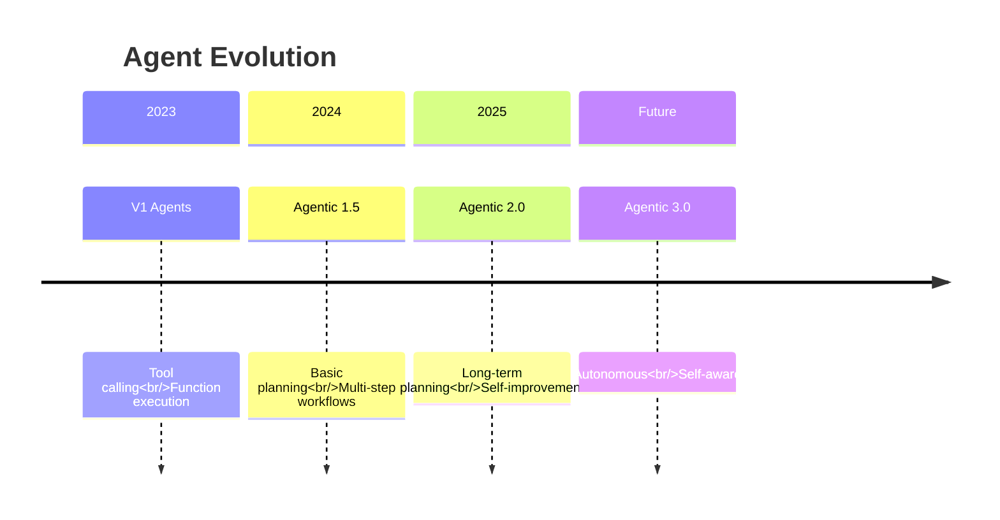

### V2 Capabilities

| Capability | V1 (Current) | V2 (Emerging) |
|------------|-------------|---------------|
| **Planning Horizon** | Immediate steps | Long-term strategies |
| **Learning** | Fixed prompts | Self-improving |
| **Collaboration** | Structured patterns | Dynamic teaming |
| **Memory** | Context window | Persistent learning |
| **Reliability** | ~80% success | >95% success |
| **Autonomy** | Human-guided | Semi-autonomous |

---

## 10.2 Long-Term Planning

### Hierarchical Task Networks

Breaking down complex goals across multiple time horizons.

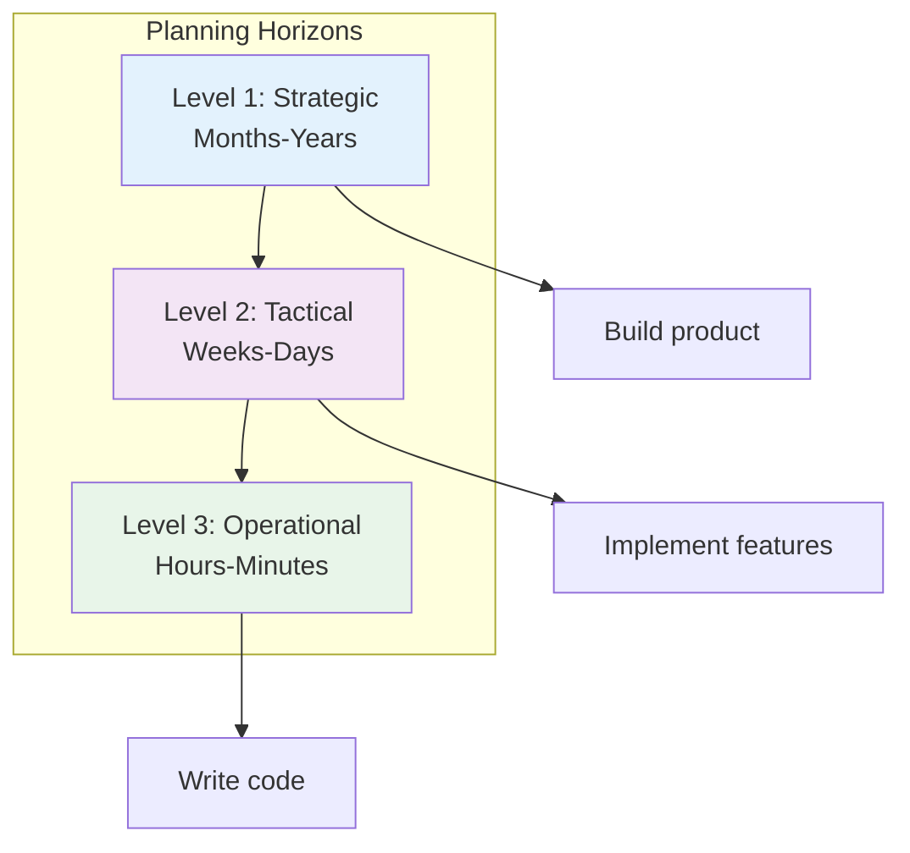

### Implementation Concept

```java
// Concept: Hierarchical Planning Agent
public interface HierarchicalPlanner {

    Plan createStrategicPlan(Goal goal);
    Plan createTacticalPlan(StrategicPlan strategic);
    Plan createOperationalPlan(TacticalPlan tactical);

    default Plan execute(Goal goal) {
        // Multi-level planning
        Plan strategic = createStrategicPlan(goal);
        Plan tactical = createTacticalPlan(strategic);
        Plan operational = createOperationalPlan(tactical);

        // Execute with continuous replanning
        while (!operational.isComplete()) {
            executeStep(operational.nextStep());

            if (shouldReplan()) {
                operational = createOperationalPlan(tactical);
            }
        }

        return operational;
    }
}
```

---

## 10.3 Self-Improving Agents

### Learning from Experience

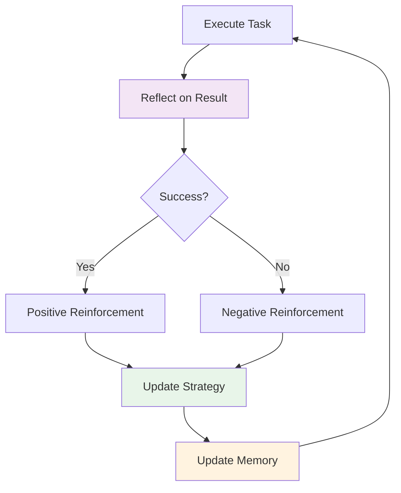

### Self-Improvement Techniques

| Technique | Description | Maturity |
|-----------|-------------|----------|
| **Reflection** | Critique and improve own outputs | Production-ready |
| **Experience Replay** | Learn from past episodes | Research |
| **Meta-Learning** | Learn how to learn | Research |
| **Self-Play** | Improve through practice | Emerging |
| **Evolutionary** | Optimize through selection | Research |

---

## 10.4 Multi-Agent Research Frontiers

### MetaGPT: Software Company Simulation

MetaGPT assigns roles to agents simulating a software company.

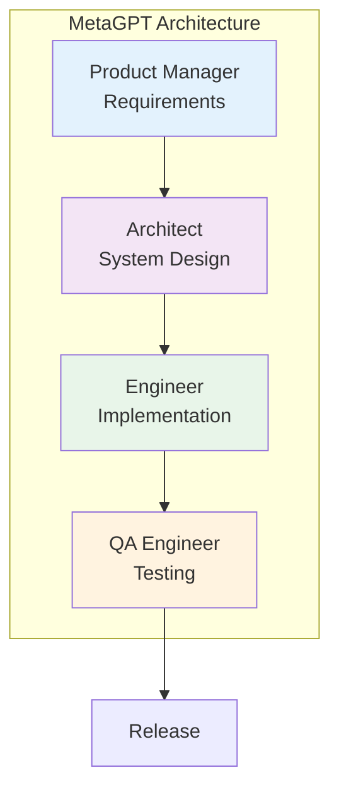

**Key Innovation**: Standard Operating Procedures (SOPs)
- Defines clear workflows for each role
- Enforces communication protocols
- Reduces coordination overhead

### ChatDev: Software Development

ChatDev specializes in automated software development.

**Phases**:
1. **Design**: Architecture and requirements
2. **Coding**: Implementation with best practices
3. **Testing**: Automated test generation
4. **Documentation**: Auto-generated docs

**Benefits**:
- Faster development cycles
- Consistent code quality
- Reduced human oversight

### AgentVerse: Interactive Agent Environment

Creates virtual environments where agents interact and collaborate.

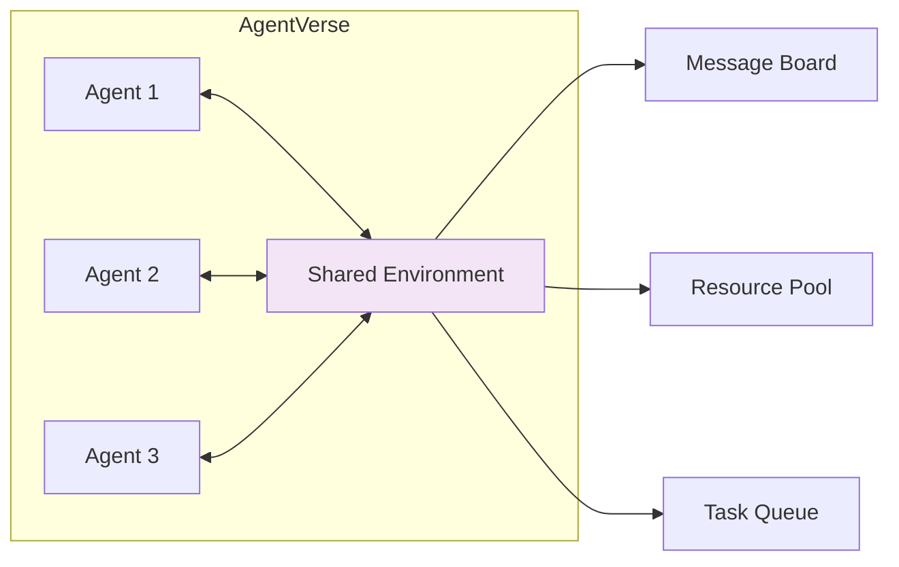

---

## 10.5 Emerging Directions

### GUI Agents

Agents that directly interact with graphical user interfaces.

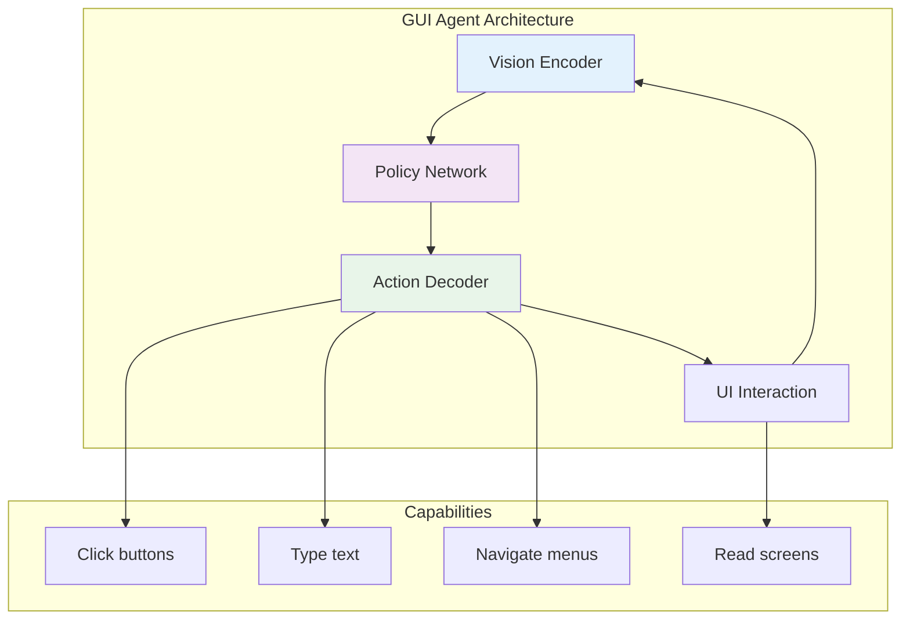

**Examples**:
- **Anthropic's Computer Use**: Claude controlling desktop
- **Multion**: AI assistant for web tasks
- **Rabbit R1**: Purpose-built device for autonomous actions

:::caution Rabbit R1 Market Update (2025)
Despite initial hype, the Rabbit R1 struggled with market adoption due to limited functionality and performance issues. More successful GUI Agent implementations include **Anthropic's Computer Use** (integrated into Claude) and **OpenAI Operator**, which leverage existing devices rather than dedicated hardware.
:::

**Challenges**:
- UI understanding and robustness
- Error recovery
- Security and permission models

### Embodied Agents

Agents that interact with the physical world through robots.

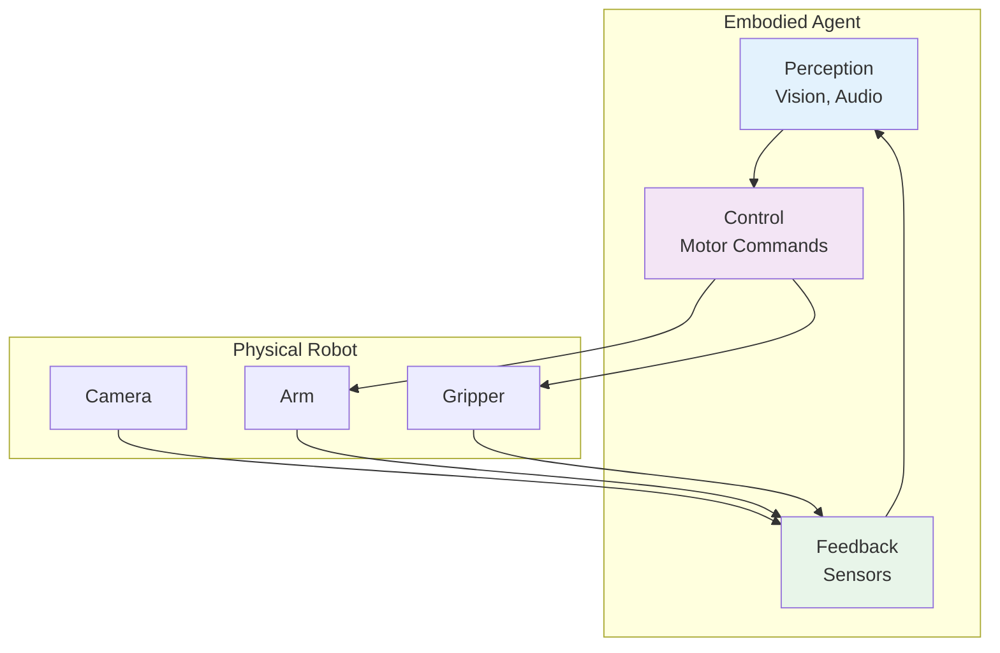

**Applications**:
- Home robotics (cleaning, cooking)
- Industrial automation
- Healthcare assistance
- Exploration (space, underwater)

**Key Research**:
- **RT-2**: Robotic Transformer 2 (Google DeepMind)
- **Gemini Robotics-ER 1.6**（2026年4月）: Google 增强空间推理能力，新增多视角理解、任务规划和仪器读数能力（与 Boston Dynamics 合作开发），被称为 Google "最安全的机器人模型"
- **VoxPoser**: LLM for robot manipulation
- **Hello Robot**: Stretch for home tasks

> 💡 **行业数据**：2025 年人形机器人领域投资达 $61 亿，是 2024 年的 4 倍。机器人学习正从规则驱动转向数据驱动的 AI 模型——通过传感器数据预测下一步动作。（来源：MIT Technology Review, 2026年4月）

### Agent Societies

Multi-agent systems with social structures and economics.

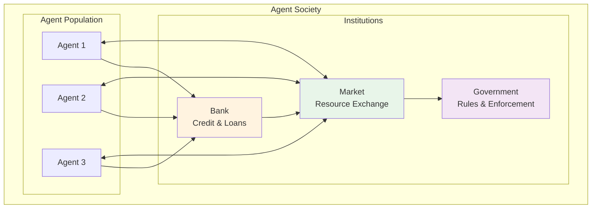

**Research Areas**:
- **Economic Models**: Token economies, incentive design
- **Governance**: Voting, consensus, rule-making
- **Social Dynamics**: Cooperation, competition, emergence
- **Ethics**: Moral frameworks, value alignment

### Agentic Coding (2025)

AI 辅助编程成为 2025 年最重要的 Agent 应用趋势之一：

- **Claude Code**: Anthropic 的命令行 AI 编程助手，支持全栈开发
- **Cursor Agent**: 集成 AI 的代码编辑器，支持多文件编辑和终端操作
- **Windsurf (Codeium)**: AI-native IDE，具备 Cascade 多步推理能力
- **Devin**: Cognition Labs 的自主 AI 软件工程师
- **OpenHands**: 开源 AI 软件开发 Agent 平台

核心特征：理解代码库上下文 → 制定修改计划 → 多文件并行编辑 → 自动测试验证 → 迭代修复

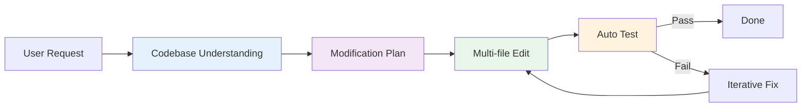

---

## 10.6 Technical Frontiers

### 1. RecG Agents: Recursive Critic and Generator

Agents that generate and critique their own outputs recursively.

```
For i in 1...N:
    Output_i = Generator(Feedback_{i-1})
    Critique_i = Critic(Output_i)
    Feedback_i = Refine(Critique_i)

Return Output_N
```

**Benefits**:
- Self-improving quality
- Reduced human oversight
- Handles complex criteria

### 2. Chain of Abstraction

Reasoning at different levels of abstraction.

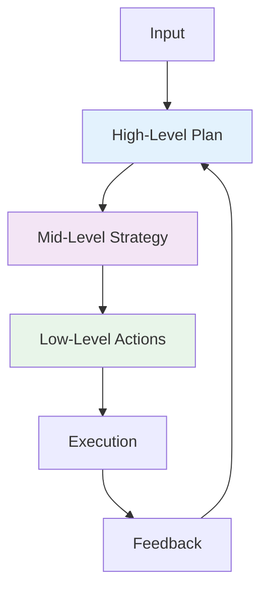

### 3. Tree of Thoughts

Exploring multiple reasoning paths in parallel.

```
Root (Question)
├── Branch 1: Approach A
│   ├── Sub-branch 1.1
│   └── Sub-branch 1.2
├── Branch 2: Approach B
│   ├── Sub-branch 2.1
│   └── Sub-branch 2.2
└── Branch 3: Approach C
    ├── Sub-branch 3.1
    └── Sub-branch 3.2

Evaluate all branches and select best.
```

---

## 10.7 Emerging Paradigms (2025–2026)

### Agent Economy

AI Agents are beginning to participate in economic activities autonomously — hiring services, purchasing data, and negotiating contracts.

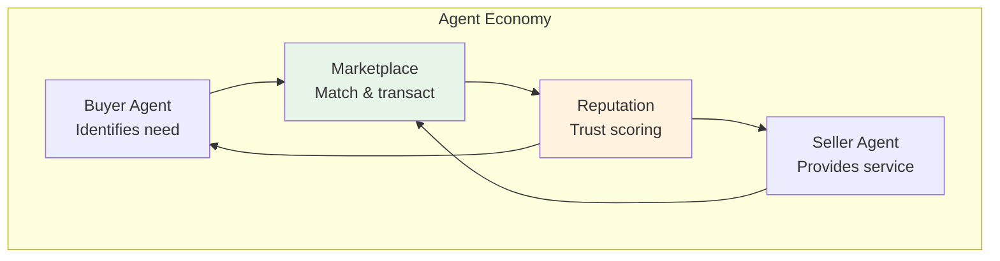

| Component | Description | Status |
|-----------|-------------|--------|
| **Agent Wallets** | Crypto/fiat wallets for autonomous transactions | Early prototypes |
| **Agent Marketplaces** | Platforms where agents list and discover services | Emerging |
| **Reputation Systems** | Trust scores based on transaction history | Research |
| **Smart Contracts** | Automated enforcement of agent agreements | Active development |
| **Pricing Protocols** | Dynamic negotiation between agents | Research |

### Agent-Native Applications

A new generation of applications designed from the ground up for agent interaction, replacing human-centric UIs.

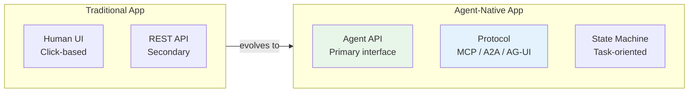

**Characteristics of Agent-Native Apps**:
- **Protocol-first**: Expose capabilities via MCP/A2A rather than REST
- **Task-oriented**: Accept high-level goals, not step-by-step instructions
- **Stateful**: Maintain conversation and task context across interactions
- **Streaming**: Provide real-time progress updates via SSE/WebSocket
- **Composable**: Designed to be chained with other agent services

**Examples (2025–2026)**:
- **Vercel v0**: Agent-native UI generation
- **Replit Agent**: Agent-native development environment
- **Linear**: Agent-native project management via MCP

### Self-Evolving Agents

Agents that can modify their own behavior, prompts, and tool configurations based on experience.

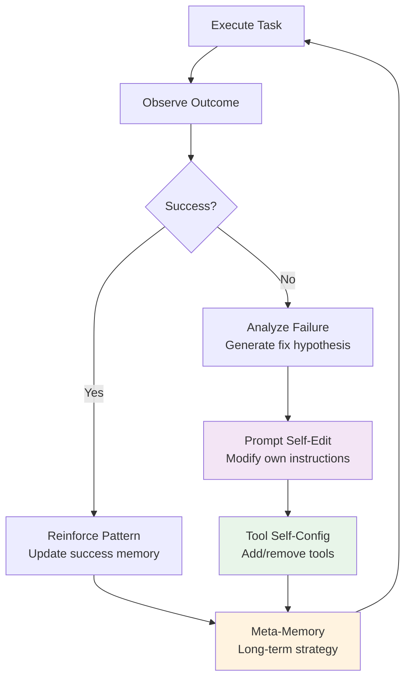

**Approaches**:
- **Prompt Optimization**: Agents rewrite their own system prompts (e.g., DSPy, OPRO)
- **Tool Synthesis**: Agents create new tools from combinations of existing ones
- **Experience Replay**: Agents review past executions to extract heuristics
- **Constitutional Self-Modification**: Agents follow meta-rules governing what they can change about themselves

> **Safety Note**: Self-evolving agents require strict guardrails. Changes to behavior should be logged, reversible, and bounded by a constitution that prevents self-modification of safety constraints.

---

## 10.8 Challenges & Open Problems

### Technical Challenges

| Challenge | Description | Current Status |
|-----------|-------------|----------------|
| **Long-term Memory** | Persistent, scalable memory | Partial solutions |
| **Causal Reasoning** | Understanding cause-effect | Research stage |
| **Transfer Learning** | Applying knowledge to new domains | Early progress |
| **Explainability** | Understanding agent decisions | Active research |
| **Safety Assurance** | Formal guarantees of behavior | Major open problem |

### Societal Challenges

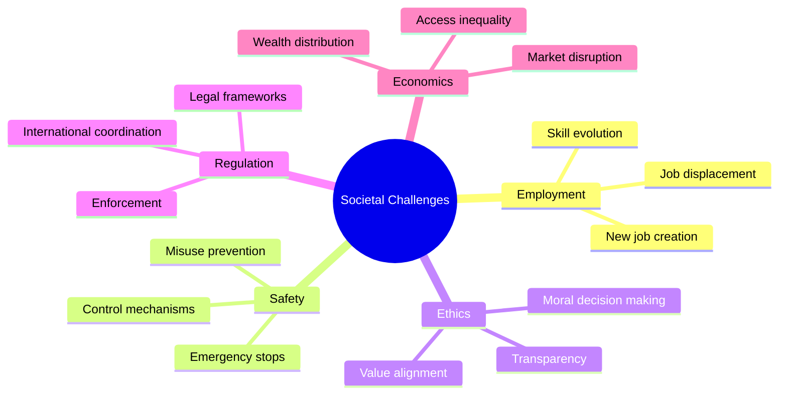

---

## 10.9 Predictions: 2025-2030

### Near-Term (2025-2026)

**2025 Actual Events (已发生)**:

- **DeepSeek R1 开源推理模型发布**（2025年1月）：中国团队发布的开源推理模型，以极低成本实现接近 OpenAI o1 的性能，震惊业界
- **OpenAI Agents SDK 发布**（2025年2月）：OpenAI 发布官方 Agent 框架，提供 Agents、Handoffs、Guardrails、Tracing 等核心概念
- **MCP 协议被 OpenAI 采纳**（2025年3月）：OpenAI 宣布在其产品和 API 中支持 MCP 协议，标志着 MCP 从 Anthropic 主导走向全行业标准
- **Google A2A 协议发布**（2025年4月）：Google 发布 Agent-to-Agent 通信协议，解决 Agent 之间的协作问题，与 MCP 互补

**Near-Term Predictions**:

- **V2 Agents**: Long-term planning becomes common
- **Self-Improvement**: Agents learn from feedback
- **Multi-Agent Standard**: Common patterns emerge (MCP + A2A)
- **GUI Agents**: Web task automation matures

### Mid-Term (2027-2028)

- **Embodied Agents**: Home robots become practical
- **Agent Societies**: Economic systems emerge
- **Regulation**: First agent-specific laws passed
- **Safety Standards**: Industry-wide protocols

### Long-Term (2029-2030)

- **Semi-Autonomous**: Agents operate with minimal oversight
- **Recursive Improvement**: Agents improve other agents
- **General Purpose**: Agents handle diverse tasks
- **Human-Agent Collaboration**: Seamless teamwork

---

## 10.10 How to Stay Current

### Research Sources

| Source | Type | Update Frequency |
|--------|------|------------------|
| **arXiv** | Preprints | Daily |
| **Papers With Code** | Implementations | Weekly |
| **LangChain Blog** | Industry insights | Monthly |
| **Anthropic/Google Blogs** | Company research | Irregular |
| **Agent Workshops** | Academic conferences | Quarterly |

### Key Conferences

- **ICML**: International Conference on Machine Learning
- **NeurIPS**: Neural Information Processing Systems
- **ICLR**: International Conference on Learning Representations
- **AAAI**: Association for Advancement of AI
- **Agent Workshops**: Specialized agent conferences

### Open Source Projects

- **LangChain/LangGraph**: Rapidly evolving frameworks
- **Microsoft Agent Framework**: Unified LTS SDK (replaces AutoGen + Semantic Kernel)
- **CrewAI**: Role-playing agents
- **MetaGPT**: Software company simulation

### 2026 年 4月前沿研究动态

#### 上周重点（4月19日）

| 方向 | 论文 | 关键发现 |
|------|------|----------|
| **LLM 评估可靠性** | [Diagnosing LLM Judge Reliability](https://arxiv.org/abs/2604.15302) | 揭示 LLM-as-Judge 在逐输入评估中存在广泛不一致性 |
| **多 Agent 合作** | [CoopEval](https://arxiv.org/abs/2604.15267) | 推理能力更强的 LLM 在社会困境中反而更不合作 |
| **推理加速** | [Verification-Aware Speculative Decoding](https://arxiv.org/abs/2604.15244) | 从 Token 级推测解码升级到步骤级，防止多步推理中的错误传播 |
| **测试时计算扩展** | [Looped Transformers](https://arxiv.org/abs/2604.15259) | 研究循环式 Transformer 的固定点框架，分析哪些架构能真正泛化 |
| **医疗 Agent** | [RadAgent](https://arxiv.org/abs/2604.15231) | 使用 VLM + 工具调用的可解释胸部 CT 分析 Agent |
| **Agentic RAG** | [CorpusGraph](https://arxiv.org/abs/2604.14572) | 从被动检索转向 Agent 主动导航企业知识图谱 |

#### 本周新增（4月20日）

| 方向 | 论文 | 关键发现 |
|------|------|----------|
| **AI 安全审计** | [ASMR-Bench](https://arxiv.org/abs/2604.16286) | 首个评估审计员检测自主研究中恶意缺陷能力的基准，针对 AI 自主研究安全性 |
| **RL 奖励作弊检测** | [Gradient Fingerprints](https://arxiv.org/abs/2604.16242) | 提出梯度指纹方法检测和抑制 RLVR 中的奖励作弊（reward hacking）行为 |
| **VLM 推理质疑** | [Do VLMs Truly Reason?](https://arxiv.org/abs/2604.16256) | 质疑视觉语言模型是否真正进行视觉推理，还是依赖语言先验 |
| **RL 与 Agent 演化** | [Beyond Distribution Sharpening](https://arxiv.org/abs/2604.16259) | 研究 RL 是否真正改善推理能力，以及任务奖励如何驱动模型从推理器进化为智能 Agent |
| **定理证明** | [Learning to Reason with Insight](https://arxiv.org/abs/2604.16278) | 识别"洞察力缺失"为 LLM 非形式化定理证明的主要瓶颈 |

#### 本周新增（4月22–23日）— 行业重大事件

##### Google Cloud Next '26：全面拥抱 Agentic 架构

Google 在 Cloud Next '26 大会上宣布了一系列重大更新：

- **Gemini Enterprise Agent Platform**：将 Vertex AI 重新品牌为企业级 Agent 平台，集成 Agent Designer（可视化工作流）、Agent Engine（会话与记忆）、Agent Garden（预构建 Agent 模板）和 Express 免费层。支持 Gemini 3.1 Pro/Flash、Anthropic Claude 和 Llama 等 200+ 模型。
- **Workspace Studio**：无代码 Agent 构建工具，业务用户可用自然语言在 Gmail、Docs、Sheets 等中创建自动化 Agent，支持 Jira、Salesforce 等第三方集成。
- **TPU 第八代（TPU 8t / 8i）**：两款专用芯片——TPU 8t 用于训练（~3x 性能提升，121 ExaFlops），TPU 8i 用于推理（高内存带宽、低延迟），专为 Agentic AI 工作负载设计。
- **Deep Research / Deep Research Max**：基于 Gemini 3.1 Pro 的自主研究 Agent，支持 MCP 协议、原生数据可视化和文件上传。Max 版本使用扩展推理时间计算，适用于金融、生命科学等深度分析场景。
- **A2A 协议扩展**：Agent-to-Agent 协议已在 150+ 组织中部署。
- **Gemini Embedding 2 GA**：首个原生多模态嵌入模型正式发布。

##### Anthropic Project Glasswing：AI 驱动的网络安全防御

Anthropic 发布 [Project Glasswing](https://www.anthropic.com/glasswing)，联合 AWS、Apple、Google、Microsoft、NVIDIA 等 40+ 组织，使用 AI 进行防御性网络安全研究：

- **Claude Mythos**：未发布的通用前沿模型，展现了突破性的漏洞发现能力——发现数千个高严重性漏洞，包括 OpenBSD 27 年老漏洞、Linux 内核和所有主流浏览器中的问题。
- Mythos **不会公开发布**，仅通过安全验证程序提供给安全专业人员。
- 核心洞察：AI 网络安全能力是"锯齿状"的——不随模型大小平滑缩放，而是依赖系统设计和领域专业知识。

##### Gemma 4：Apache 2.0 开源模型

Google DeepMind 发布 [Gemma 4](https://blog.google/innovation-and-ai/technology/developers-tools/gemma-4/) 系列开源模型（Apache 2.0 许可）：

| 模型 | 架构 | 活跃参数 | 上下文窗口 |
|------|------|---------|-----------|
| **E2B** | Dense | ~2B | 128K |
| **E4B** | Dense | ~4B | 128K |
| **26B MoE** | Mixture of Experts | 3.8B active | 256K |
| **31B Dense** | Dense | 31B | 256K |

31B 模型在 Arena AI 排行榜位列全球开源模型第 3 名。全部模型支持原生函数调用、结构化 JSON 输出、视觉/音频理解，训练覆盖 140+ 语言。

##### Kubernetes v1.36 "Haru" 发布

[Kubernetes v1.36](https://kubernetes.io/blog/2026/04/22/kubernetes-v1-36-release/) 于 4 月 22 日发布，包含 70 项增强：
- **GA**：细粒度 Kubelet API 授权、Linux User Namespaces
- **Beta**：Resource Health Status（硬件健康状态报告）
- **Alpha**：Workload Aware Scheduling（工作负载感知调度）

##### Docker Hub 供应链攻击：KICS 事件

继 3 月 Trivy 供应链攻击后，[Checkmarx KICS Docker 镜像被入侵](https://www.docker.com/blog/trivy-kics-and-the-shape-of-supply-chain-attacks-so-far-in-2026/)（4 月 22 日），攻击者使用窃取的发布者凭据推送恶意镜像，将扫描结果加密外传至攻击者控制的基础设施。Docker 基础设施本身未被入侵，但这凸显了供应链安全的严峻挑战。
| **机器人导航 Agent** | [FineCog-Nav](https://arxiv.org/abs/2604.16298) | 集成细粒度认知模块实现零样本 UAV 视觉语言导航 |

#### 本周新增（4月21日）

| 方向 | 论文 | 关键发现 |
|------|------|----------|
| **数学推理基准** | [MathNet](https://arxiv.org/abs/2604.18584) | 全球多模态数学推理与检索基准，覆盖 Olympiad 级别题目 |
| **序列模型架构** | [Sessa: Selective State Space Attention](https://arxiv.org/abs/2604.18580) | 在注意力扩散场景下用选择性状态空间替代自注意力，Transformer 新替代方案 |
| **RL 优化** | [Bounded Ratio RL](https://arxiv.org/abs/2604.18578) | 弥合 PPO 裁剪启发式与信任区域理论基础之间的差距 |
| **Agentic 预测** | [BLF: Bayesian Linguistic Forecaster](https://arxiv.org/abs/2604.18576) | Agentic 系统在 ForecastBench 上达到 SOTA，结合贝叶斯语言信念状态 |
| **弱监督推理** | [RLVR with Weak Supervision](https://arxiv.org/abs/2604.18574) | 研究 RLVR 在弱监督信号下何时能有效提升推理能力 |
| **推理纠错** | [Latent Phase-Shift Rollback](https://arxiv.org/abs/2604.18567) | 监控残差流并在推理错误时回滚 KV-Cache，实现推理时自动纠错 |
| **多模态医疗** | [Apollo](https://arxiv.org/abs/2604.18570) | 多模态时序基础模型，整合 30 年临床记录构建统一患者表征 |

#### 本周新增（4月24–27日）— 行业生态深化

##### Anthropic 与 AWS 深化合作（4月27日）

Anthropic 与 AWS 联合宣布一系列重大合作进展：

- **Claude 在 AWS Trainium 上训练**：Anthropic 现在在 AWS Trainium 和 Graviton 基础设施上训练其最先进的基础模型，与 Annapurna Labs 在芯片层面进行联合工程优化
- **Claude Cowork**：正式上线 Amazon Bedrock，支持团队在现有 Bedrock 环境中与 Claude 协作，数据安全保留在 AWS 内
- **Claude Platform on AWS**（即将推出）：统一的开发者体验，无需离开 AWS 即可构建、部署和扩展 Claude 驱动的应用
- **Bedrock AgentCore CLI**：支持通过 AWS CDK 以 IaC 治理方式部署 Agent（Terraform 支持即将推出），14 个 AWS 区域可用
- **Bedrock AgentCore Managed Harness**（预览）：只需定义模型 + Prompt + 工具即可创建 Agent，无需编写编排代码

##### Meta 部署数千万 AWS Graviton 核心

Meta 与 AWS 签署大规模协议，部署数千万个 Graviton 核心，用于驱动 CPU 密集型 Agentic AI 工作负载，包括实时推理、代码生成、搜索和多步任务编排。

##### OpenAI 开源 Privacy Filter（4月27日）

OpenAI 发布 1.5B 参数（50M 活跃）的开源 PII 检测器（Apache 2.0），可在单次 128K 上下文前向传播中检测 8 类个人身份信息。附带三个 Gradio 演示应用：Document Privacy Explorer、Image Anonymizer 和 SmartRedact Paste。

##### arXiv 前沿论文

| 方向 | 论文 | 关键发现 |
|------|------|----------|
| **Agentic World Model** | [Agentic World Modeling](https://arxiv.org/abs/2604.22748) | 综合 400+ 工作的综述，提出"能力等级 x 治理法则"分类框架（L1 Predictor → L2 Simulator → L3 Evolver），覆盖物理/数字/社会/科学四个领域 |
| **Agent Token 经济学** | [Token Consumption in Agentic Coding](https://arxiv.org/abs/2604.22750) | Agentic 任务消耗 1000x 于代码推理的 token，同一任务 token 用量可差 30x，更多 token 不等于更高准确率。Kimi-K2 和 Claude Sonnet 4.5 比 GPT-5 平均多消耗 150 万 token |
| **RAG 检索优化** | [Aligning Dense Retrievers with LLM Utility](https://arxiv.org/abs/2604.22722) | 通过蒸馏将 LLM 重排序效用对齐到密集检索器，减少 RAG 推理开销 |
| **高效推理** | [Thinking Without Words](https://arxiv.org/abs/2604.22709) | 抽象思维链（Abstract CoT）实现非语言推理，在更短生成长度下保持性能 |

**行业关键指标**（Stanford 2026 AI Index）：
- Agent 任务成功率：**12% → 66%**（年同比大幅提升）
- AI Agent 网络流量增长：**+7,851%**（年同比）
- 预计年底 **40%** 企业应用将集成 Agent 能力

**2026 年 4月模型发布格局**：
- **GLM-5.1**（Zhipu AI）：744B MoE，40B 活跃参数，MIT 许可，据称在 SWE-Bench Pro 上超越 Claude Opus 4.6 和 GPT-5.4
- **Gemma 4**（Google）：全系列开放（27B Dense / 26B MoE / E4B / E2B），Apache 2.0，统一多模态（文本+图像+音频）
- **Qwen 3.6-Plus**（Alibaba）：1M token 上下文，为自主编码优化，~$0.28/M tokens
- **Claude Mythos**（Anthropic）：仅限 ~50 个合作组织访问，专注网络安全防御，$25/$125/M tokens
- **Bonsai 8B**（PrismML）：1-bit 量化，14x 压缩，可在树莓派上运行

**关键趋势**：
1. **Agentic RAG 快速兴起** — 多篇论文从被动检索转向 Agent 主动导航、查询改写、证据整合
2. **LLM-as-Judge 可靠性受质疑** — 社区正在重新审视自动化评估的可信度
3. **推理能力与合作性负相关** — 更强的模型在社会困境中更不合作，引发多 Agent 部署安全担忧
4. **AI 安全审计需求紧迫** — ASMR-Bench 等工作凸显自主研究 Agent 的安全验证缺口
5. **RL 奖励作弊成为焦点** — 梯度指纹方法为 RLVR 训练提供作弊检测手段
6. **开源模型追平闭源** — GLM-5.1 在特定基准上超越 GPT-5.4，"开源落后6个月"叙事已终结
7. **认知密度取代参数规模** — 行业从追求最大模型转向在更小、更高效的模型中实现更强推理能力
8. **MCP 成为 AI 工具标配** — 2026 Q2 所有主流 AI 工具的 MCP 支持成为"必须项"
---

## 10.11 Key Takeaways

### The Frontier is Moving Fast

1. **V2 Agents**: From tool use to autonomous planning
2. **Self-Improvement**: Agents learning from experience
3. **Multi-Agent**: Rich collaboration patterns
4. **New Modalities**: GUI, embodied, social agents

### Challenges Remain

1. **Reliability**: >95% success rate needed
2. **Safety**: Formal guarantees lacking
3. **Alignment**: Value alignment unsolved
4. **Control**: Emergency stop mechanisms needed

### Prepare for the Future

1. **Learn Fundamentals**: V1 patterns apply to V2
2. **Experiment**: Build with new frameworks
3. **Follow Research**: Stay current with papers
4. **Think Ethically**: Consider societal impact

---

## 10.12 Learning Path Complete

You've completed the AI Agent journey:

✅ **1. Core Concepts**: Understanding agents
✅ **2. Architecture**: Building blocks
✅ **3. Design Patterns**: Proven solutions
✅ **4. Frameworks & SDK**: Implementation tools
✅ **5. Coding Agents**: AI-powered software development
✅ **6. Computer Use**: GUI automation agents
✅ **7. Multi-Agent & A2A**: Agent collaboration protocols
✅ **8. Evaluation**: Benchmarks and reliability
✅ **9. Engineering**: Production readiness
✅ **10. Frontier**: Future directions

### Next Steps

1. **Build Something**: Create your own agent
2. **Join Community**: Contribute to open source
3. **Share Knowledge**: Write and teach others
4. **Stay Curious**: Keep learning and exploring

---

:::tip The Best Time to Start
The field is moving fast, but the fundamentals you've learned will remain relevant. Start building agents today, and evolve with the technology.
:::

:::info Keep Exploring
This is just the beginning. The frontier of AI agents is expanding every day. Stay curious, keep building, and help shape the future of autonomous AI systems.
:::
