# 10. Frontier Trends & Future Directions

AI agent technology is evolving rapidly. This section explores cutting-edge research, emerging trends, and the future trajectory of agentic AI systems.

---

## 10.1 Agentic V2: The Next Generation

### Evolution from Tool Use to Autonomy

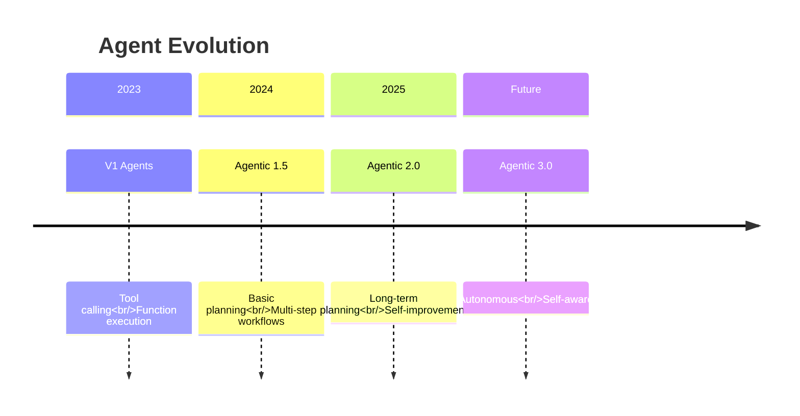

### V2 Capabilities

| Capability | V1 (Current) | V2 (Emerging) |
|------------|-------------|---------------|
| **Planning Horizon** | Immediate steps | Long-term strategies |
| **Learning** | Fixed prompts | Self-improving |
| **Collaboration** | Structured patterns | Dynamic teaming |
| **Memory** | Context window | Persistent learning |
| **Reliability** | ~80% success | >95% success |
| **Autonomy** | Human-guided | Semi-autonomous |

---

## 10.2 Long-Term Planning

### Hierarchical Task Networks

Breaking down complex goals across multiple time horizons.

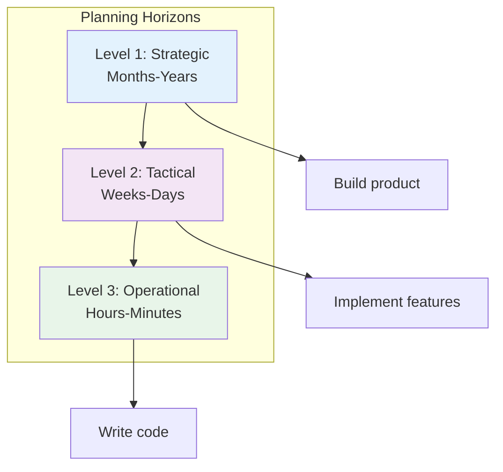

### Implementation Concept

```java
// Concept: Hierarchical Planning Agent
public interface HierarchicalPlanner {

    Plan createStrategicPlan(Goal goal);
    Plan createTacticalPlan(StrategicPlan strategic);
    Plan createOperationalPlan(TacticalPlan tactical);

    default Plan execute(Goal goal) {
        // Multi-level planning
        Plan strategic = createStrategicPlan(goal);
        Plan tactical = createTacticalPlan(strategic);
        Plan operational = createOperationalPlan(tactical);

        // Execute with continuous replanning
        while (!operational.isComplete()) {
            executeStep(operational.nextStep());

            if (shouldReplan()) {
                operational = createOperationalPlan(tactical);
            }
        }

        return operational;
    }
}
```

---

## 10.3 Self-Improving Agents

### Learning from Experience

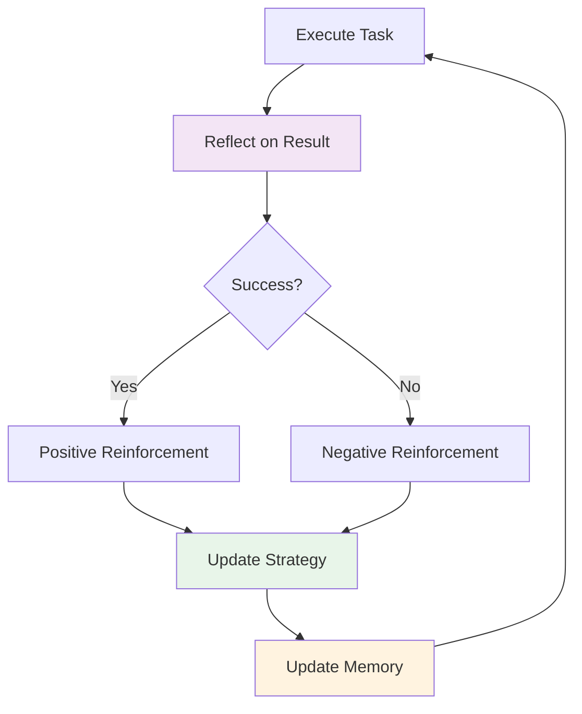

### Self-Improvement Techniques

| Technique | Description | Maturity |
|-----------|-------------|----------|
| **Reflection** | Critique and improve own outputs | Production-ready |
| **Experience Replay** | Learn from past episodes | Research |
| **Meta-Learning** | Learn how to learn | Research |
| **Self-Play** | Improve through practice | Emerging |
| **Evolutionary** | Optimize through selection | Research |

---

## 10.4 Multi-Agent Research Frontiers

### MetaGPT: Software Company Simulation

MetaGPT assigns roles to agents simulating a software company.

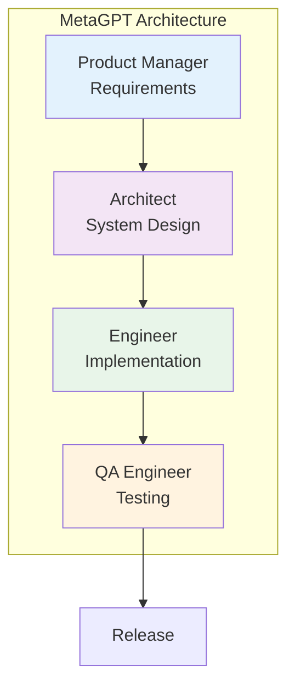

**Key Innovation**: Standard Operating Procedures (SOPs)
- Defines clear workflows for each role
- Enforces communication protocols
- Reduces coordination overhead

### ChatDev: Software Development

ChatDev specializes in automated software development.

**Phases**:
1. **Design**: Architecture and requirements
2. **Coding**: Implementation with best practices
3. **Testing**: Automated test generation
4. **Documentation**: Auto-generated docs

**Benefits**:
- Faster development cycles
- Consistent code quality
- Reduced human oversight

### AgentVerse: Interactive Agent Environment

Creates virtual environments where agents interact and collaborate.

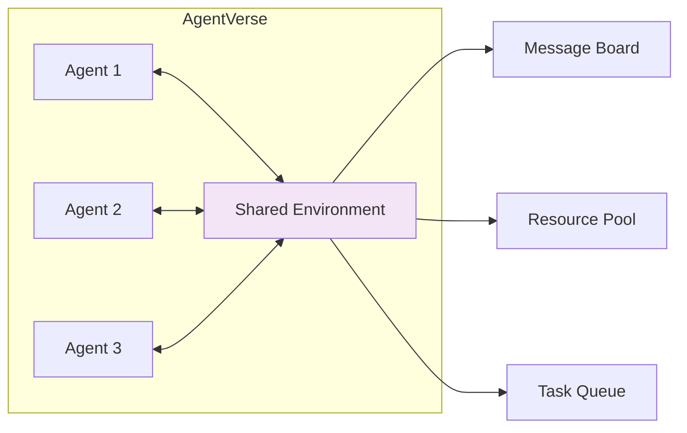

---

## 10.5 Emerging Directions

### GUI Agents

Agents that directly interact with graphical user interfaces.

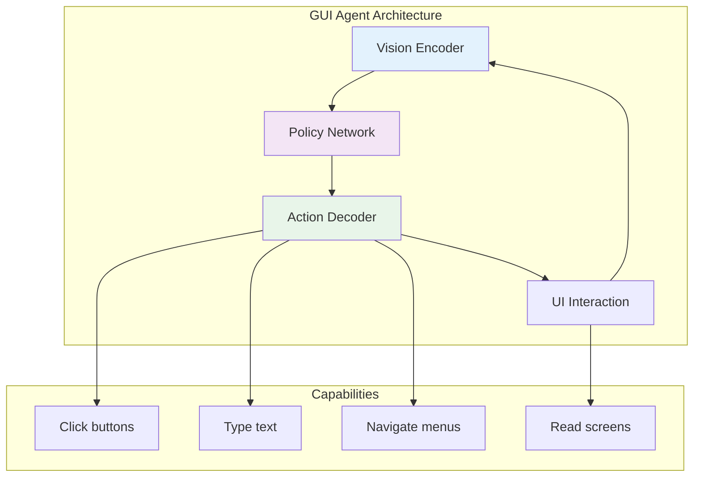

**Examples**:
- **Anthropic's Computer Use**: Claude controlling desktop
- **Multion**: AI assistant for web tasks
- **Rabbit R1**: Purpose-built device for autonomous actions

:::caution Rabbit R1 Market Update (2025)
Despite initial hype, the Rabbit R1 struggled with market adoption due to limited functionality and performance issues. More successful GUI Agent implementations include **Anthropic's Computer Use** (integrated into Claude) and **OpenAI Operator**, which leverage existing devices rather than dedicated hardware.
:::

**Challenges**:
- UI understanding and robustness
- Error recovery
- Security and permission models

### Embodied Agents

Agents that interact with the physical world through robots.

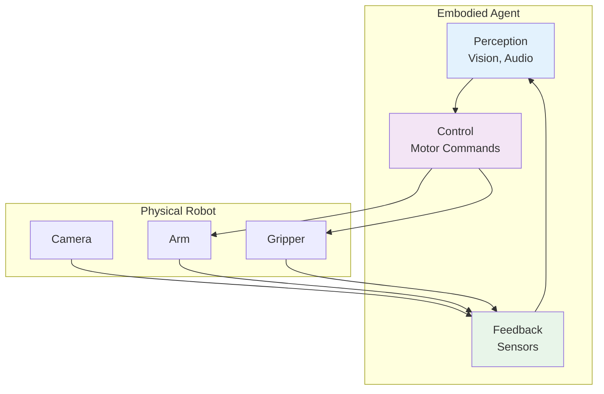

**Applications**:
- Home robotics (cleaning, cooking)
- Industrial automation
- Healthcare assistance
- Exploration (space, underwater)

**Key Research**:
- **RT-2**: Robotic Transformer 2 (Google DeepMind)
- **Gemini Robotics-ER 1.6**（2026年4月）: Google 增强空间推理能力，新增多视角理解、任务规划和仪器读数能力（与 Boston Dynamics 合作开发），被称为 Google "最安全的机器人模型"
- **VoxPoser**: LLM for robot manipulation
- **Hello Robot**: Stretch for home tasks

> 💡 **行业数据**：2025 年人形机器人领域投资达 $61 亿，是 2024 年的 4 倍。机器人学习正从规则驱动转向数据驱动的 AI 模型——通过传感器数据预测下一步动作。（来源：MIT Technology Review, 2026年4月）

### Agent Societies

Multi-agent systems with social structures and economics.

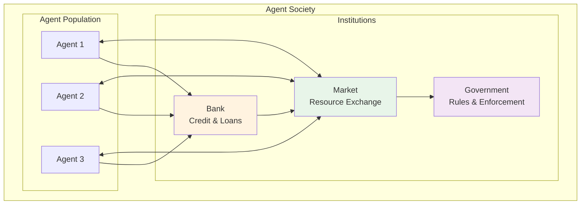

**Research Areas**:
- **Economic Models**: Token economies, incentive design
- **Governance**: Voting, consensus, rule-making
- **Social Dynamics**: Cooperation, competition, emergence
- **Ethics**: Moral frameworks, value alignment

### Agentic Coding (2025)

AI 辅助编程成为 2025 年最重要的 Agent 应用趋势之一：

- **Claude Code**: Anthropic 的命令行 AI 编程助手，支持全栈开发
- **Cursor Agent**: 集成 AI 的代码编辑器，支持多文件编辑和终端操作
- **Windsurf (Codeium)**: AI-native IDE，具备 Cascade 多步推理能力
- **Devin**: Cognition Labs 的自主 AI 软件工程师
- **OpenHands**: 开源 AI 软件开发 Agent 平台

核心特征：理解代码库上下文 → 制定修改计划 → 多文件并行编辑 → 自动测试验证 → 迭代修复

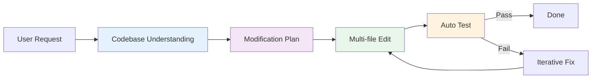

---

## 10.6 Technical Frontiers

### 1. RecG Agents: Recursive Critic and Generator

Agents that generate and critique their own outputs recursively.

```
For i in 1...N:
    Output_i = Generator(Feedback_{i-1})
    Critique_i = Critic(Output_i)
    Feedback_i = Refine(Critique_i)

Return Output_N
```

**Benefits**:
- Self-improving quality
- Reduced human oversight
- Handles complex criteria

### 2. Chain of Abstraction

Reasoning at different levels of abstraction.

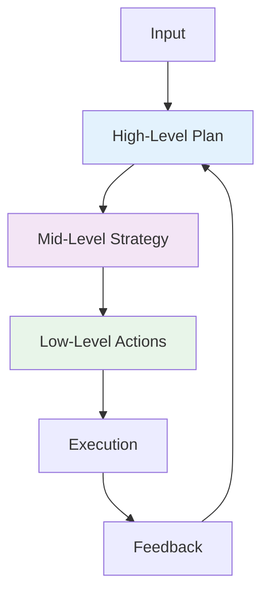

### 3. Tree of Thoughts

Exploring multiple reasoning paths in parallel.

```
Root (Question)
├── Branch 1: Approach A
│   ├── Sub-branch 1.1
│   └── Sub-branch 1.2
├── Branch 2: Approach B
│   ├── Sub-branch 2.1
│   └── Sub-branch 2.2
└── Branch 3: Approach C
    ├── Sub-branch 3.1
    └── Sub-branch 3.2

Evaluate all branches and select best.
```

---

## 10.7 Emerging Paradigms (2025–2026)

### Agent Economy

AI Agents are beginning to participate in economic activities autonomously — hiring services, purchasing data, and negotiating contracts.

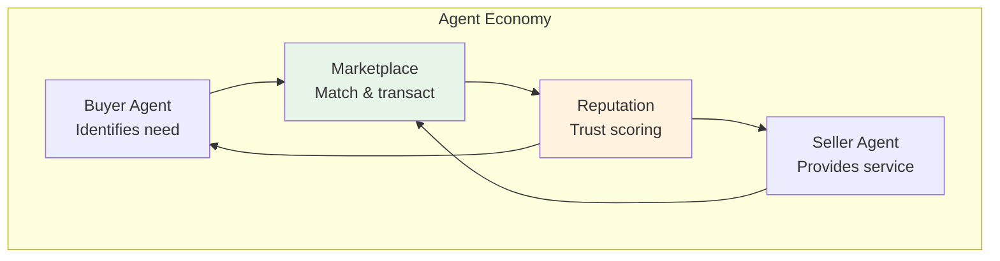

| Component | Description | Status |
|-----------|-------------|--------|
| **Agent Wallets** | Crypto/fiat wallets for autonomous transactions | Early prototypes |
| **Agent Marketplaces** | Platforms where agents list and discover services | Emerging |
| **Reputation Systems** | Trust scores based on transaction history | Research |
| **Smart Contracts** | Automated enforcement of agent agreements | Active development |
| **Pricing Protocols** | Dynamic negotiation between agents | Research |

### Agent-Native Applications

A new generation of applications designed from the ground up for agent interaction, replacing human-centric UIs.

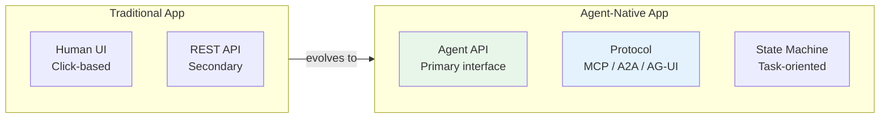

**Characteristics of Agent-Native Apps**:
- **Protocol-first**: Expose capabilities via MCP/A2A rather than REST
- **Task-oriented**: Accept high-level goals, not step-by-step instructions
- **Stateful**: Maintain conversation and task context across interactions
- **Streaming**: Provide real-time progress updates via SSE/WebSocket
- **Composable**: Designed to be chained with other agent services

**Examples (2025–2026)**:
- **Vercel v0**: Agent-native UI generation
- **Replit Agent**: Agent-native development environment
- **Linear**: Agent-native project management via MCP

### Self-Evolving Agents

Agents that can modify their own behavior, prompts, and tool configurations based on experience.

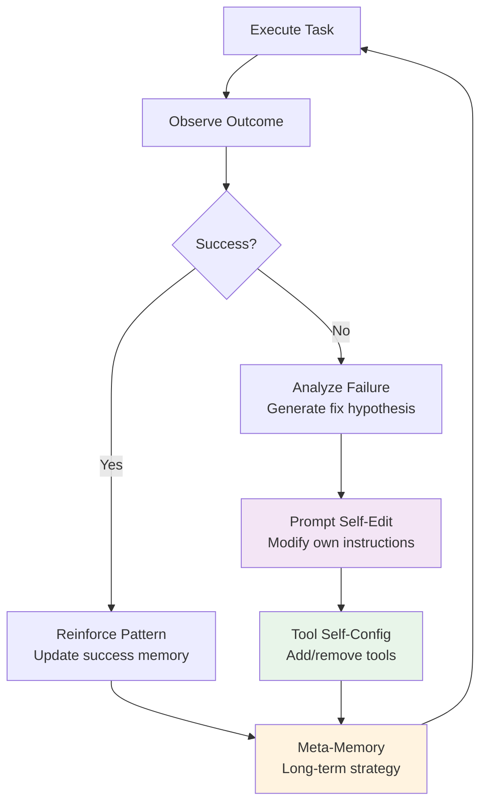

**Approaches**:
- **Prompt Optimization**: Agents rewrite their own system prompts (e.g., DSPy, OPRO)
- **Tool Synthesis**: Agents create new tools from combinations of existing ones
- **Experience Replay**: Agents review past executions to extract heuristics
- **Constitutional Self-Modification**: Agents follow meta-rules governing what they can change about themselves

> **Safety Note**: Self-evolving agents require strict guardrails. Changes to behavior should be logged, reversible, and bounded by a constitution that prevents self-modification of safety constraints.

---

## 10.8 Challenges & Open Problems

### Technical Challenges

| Challenge | Description | Current Status |
|-----------|-------------|----------------|
| **Long-term Memory** | Persistent, scalable memory | Partial solutions |
| **Causal Reasoning** | Understanding cause-effect | Research stage |
| **Transfer Learning** | Applying knowledge to new domains | Early progress |
| **Explainability** | Understanding agent decisions | Active research |
| **Safety Assurance** | Formal guarantees of behavior | Major open problem |

### Societal Challenges

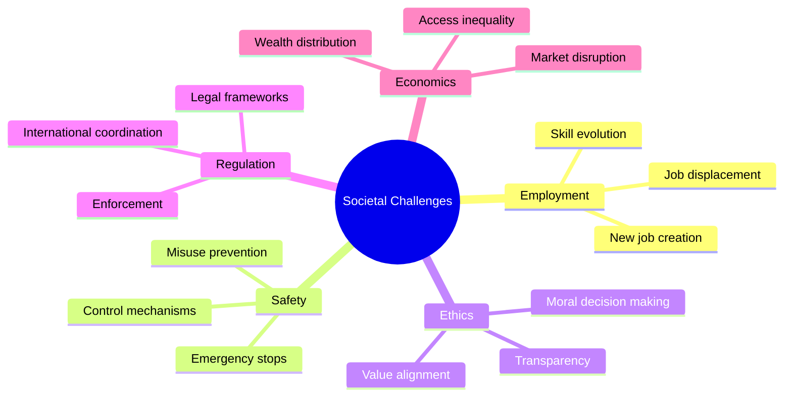

---

## 10.9 Predictions: 2025-2030

### Near-Term (2025-2026)

**2025 Actual Events (已发生)**:

- **DeepSeek R1 开源推理模型发布**（2025年1月）：中国团队发布的开源推理模型，以极低成本实现接近 OpenAI o1 的性能，震惊业界
- **OpenAI Agents SDK 发布**（2025年2月）：OpenAI 发布官方 Agent 框架，提供 Agents、Handoffs、Guardrails、Tracing 等核心概念
- **MCP 协议被 OpenAI 采纳**（2025年3月）：OpenAI 宣布在其产品和 API 中支持 MCP 协议，标志着 MCP 从 Anthropic 主导走向全行业标准
- **Google A2A 协议发布**（2025年4月）：Google 发布 Agent-to-Agent 通信协议，解决 Agent 之间的协作问题，与 MCP 互补

**Near-Term Predictions**:

- **V2 Agents**: Long-term planning becomes common
- **Self-Improvement**: Agents learn from feedback
- **Multi-Agent Standard**: Common patterns emerge (MCP + A2A)
- **GUI Agents**: Web task automation matures

### Mid-Term (2027-2028)

- **Embodied Agents**: Home robots become practical
- **Agent Societies**: Economic systems emerge
- **Regulation**: First agent-specific laws passed
- **Safety Standards**: Industry-wide protocols

### Long-Term (2029-2030)

- **Semi-Autonomous**: Agents operate with minimal oversight
- **Recursive Improvement**: Agents improve other agents
- **General Purpose**: Agents handle diverse tasks
- **Human-Agent Collaboration**: Seamless teamwork

---

## 10.10 How to Stay Current

### Research Sources

| Source | Type | Update Frequency |
|--------|------|------------------|
| **arXiv** | Preprints | Daily |
| **Papers With Code** | Implementations | Weekly |
| **LangChain Blog** | Industry insights | Monthly |
| **Anthropic/Google Blogs** | Company research | Irregular |
| **Agent Workshops** | Academic conferences | Quarterly |

### Key Conferences

- **ICML**: International Conference on Machine Learning
- **NeurIPS**: Neural Information Processing Systems
- **ICLR**: International Conference on Learning Representations
- **AAAI**: Association for Advancement of AI
- **Agent Workshops**: Specialized agent conferences

### Open Source Projects

- **LangChain/LangGraph**: Rapidly evolving frameworks
- **Microsoft Agent Framework**: Unified LTS SDK (replaces AutoGen + Semantic Kernel)
- **CrewAI**: Role-playing agents
- **MetaGPT**: Software company simulation

### 2026 年 4月前沿研究动态

#### 上周重点（4月19日）

| 方向 | 论文 | 关键发现 |
|------|------|----------|
| **LLM 评估可靠性** | [Diagnosing LLM Judge Reliability](https://arxiv.org/abs/2604.15302) | 揭示 LLM-as-Judge 在逐输入评估中存在广泛不一致性 |
| **多 Agent 合作** | [CoopEval](https://arxiv.org/abs/2604.15267) | 推理能力更强的 LLM 在社会困境中反而更不合作 |
| **推理加速** | [Verification-Aware Speculative Decoding](https://arxiv.org/abs/2604.15244) | 从 Token 级推测解码升级到步骤级，防止多步推理中的错误传播 |
| **测试时计算扩展** | [Looped Transformers](https://arxiv.org/abs/2604.15259) | 研究循环式 Transformer 的固定点框架，分析哪些架构能真正泛化 |
| **医疗 Agent** | [RadAgent](https://arxiv.org/abs/2604.15231) | 使用 VLM + 工具调用的可解释胸部 CT 分析 Agent |
| **Agentic RAG** | [CorpusGraph](https://arxiv.org/abs/2604.14572) | 从被动检索转向 Agent 主动导航企业知识图谱 |

#### 本周新增（4月20日）

| 方向 | 论文 | 关键发现 |
|------|------|----------|
| **AI 安全审计** | [ASMR-Bench](https://arxiv.org/abs/2604.16286) | 首个评估审计员检测自主研究中恶意缺陷能力的基准，针对 AI 自主研究安全性 |
| **RL 奖励作弊检测** | [Gradient Fingerprints](https://arxiv.org/abs/2604.16242) | 提出梯度指纹方法检测和抑制 RLVR 中的奖励作弊（reward hacking）行为 |
| **VLM 推理质疑** | [Do VLMs Truly Reason?](https://arxiv.org/abs/2604.16256) | 质疑视觉语言模型是否真正进行视觉推理，还是依赖语言先验 |
| **RL 与 Agent 演化** | [Beyond Distribution Sharpening](https://arxiv.org/abs/2604.16259) | 研究 RL 是否真正改善推理能力，以及任务奖励如何驱动模型从推理器进化为智能 Agent |
| **定理证明** | [Learning to Reason with Insight](https://arxiv.org/abs/2604.16278) | 识别"洞察力缺失"为 LLM 非形式化定理证明的主要瓶颈 |

#### 本周新增（4月22–23日）— 行业重大事件

##### Google Cloud Next '26：全面拥抱 Agentic 架构

Google 在 Cloud Next '26 大会上宣布了一系列重大更新：

- **Gemini Enterprise Agent Platform**：将 Vertex AI 重新品牌为企业级 Agent 平台，集成 Agent Designer（可视化工作流）、Agent Engine（会话与记忆）、Agent Garden（预构建 Agent 模板）和 Express 免费层。支持 Gemini 3.1 Pro/Flash、Anthropic Claude 和 Llama 等 200+ 模型。
- **Workspace Studio**：无代码 Agent 构建工具，业务用户可用自然语言在 Gmail、Docs、Sheets 等中创建自动化 Agent，支持 Jira、Salesforce 等第三方集成。
- **TPU 第八代（TPU 8t / 8i）**：两款专用芯片——TPU 8t 用于训练（~3x 性能提升，121 ExaFlops），TPU 8i 用于推理（高内存带宽、低延迟），专为 Agentic AI 工作负载设计。
- **Deep Research / Deep Research Max**：基于 Gemini 3.1 Pro 的自主研究 Agent，支持 MCP 协议、原生数据可视化和文件上传。Max 版本使用扩展推理时间计算，适用于金融、生命科学等深度分析场景。
- **A2A 协议扩展**：Agent-to-Agent 协议已在 150+ 组织中部署。
- **Gemini Embedding 2 GA**：首个原生多模态嵌入模型正式发布。

##### Anthropic Project Glasswing：AI 驱动的网络安全防御

Anthropic 发布 [Project Glasswing](https://www.anthropic.com/glasswing)，联合 AWS、Apple、Google、Microsoft、NVIDIA 等 40+ 组织，使用 AI 进行防御性网络安全研究：

- **Claude Mythos**：未发布的通用前沿模型，展现了突破性的漏洞发现能力——发现数千个高严重性漏洞，包括 OpenBSD 27 年老漏洞、Linux 内核和所有主流浏览器中的问题。
- Mythos **不会公开发布**，仅通过安全验证程序提供给安全专业人员。
- 核心洞察：AI 网络安全能力是"锯齿状"的——不随模型大小平滑缩放，而是依赖系统设计和领域专业知识。

##### Gemma 4：Apache 2.0 开源模型

Google DeepMind 发布 [Gemma 4](https://blog.google/innovation-and-ai/technology/developers-tools/gemma-4/) 系列开源模型（Apache 2.0 许可）：

| 模型 | 架构 | 活跃参数 | 上下文窗口 |
|------|------|---------|-----------|
| **E2B** | Dense | ~2B | 128K |
| **E4B** | Dense | ~4B | 128K |
| **26B MoE** | Mixture of Experts | 3.8B active | 256K |
| **31B Dense** | Dense | 31B | 256K |

31B 模型在 Arena AI 排行榜位列全球开源模型第 3 名。全部模型支持原生函数调用、结构化 JSON 输出、视觉/音频理解，训练覆盖 140+ 语言。

##### Gemma 4 12B：统一多模态模型登岸（2026 年 6 月）

Google DeepMind 发布 **Gemma 4 12B**，这是系列中最新的多模态模型，定位于 E4B 和 26B MoE 之间：

- **统一架构**：无需多模态编码器，视觉和音频输入直接流入 LLM 主干
- **原生音频支持**：首个支持原生音频输入中等尺寸 Gemma 模型
- **推理能力**：基准测试表现接近 26B MoE，解锁多步推理和 Agent 工作流
- **本地运行**：仅需 16GB VRAM 或统一内存即可在消费级笔记本上运行
- **Apache 2.0 开源**：完整的开放许可
- **MTP Drafters**：配备 Multi-Token Prediction 降低延迟

Gemma 4 系列下载量已突破 **1.5 亿次**。社区已构建从可穿戴机器人手臂到企业级 AI 安全等各种应用。

> 来源：[Google Blog](https://blog.google/innovation-and-ai/technology/developers-tools/introducing-gemma-4-12b/)（2026-06-03）

##### Kubernetes v1.36 "Haru" 发布

[Kubernetes v1.36](https://kubernetes.io/blog/2026/04/22/kubernetes-v1-36-release/) 于 4 月 22 日发布，包含 70 项增强：
- **GA**：细粒度 Kubelet API 授权、Linux User Namespaces
- **Beta**：Resource Health Status（硬件健康状态报告）
- **Alpha**：Workload Aware Scheduling（工作负载感知调度）

##### Docker Hub 供应链攻击：KICS 事件

继 3 月 Trivy 供应链攻击后，[Checkmarx KICS Docker 镜像被入侵](https://www.docker.com/blog/trivy-kics-and-the-shape-of-supply-chain-attacks-so-far-in-2026/)（4 月 22 日），攻击者使用窃取的发布者凭据推送恶意镜像，将扫描结果加密外传至攻击者控制的基础设施。Docker 基础设施本身未被入侵，但这凸显了供应链安全的严峻挑战。
| **机器人导航 Agent** | [FineCog-Nav](https://arxiv.org/abs/2604.16298) | 集成细粒度认知模块实现零样本 UAV 视觉语言导航 |

#### 本周新增（4月21日）

| 方向 | 论文 | 关键发现 |
|------|------|----------|
| **数学推理基准** | [MathNet](https://arxiv.org/abs/2604.18584) | 全球多模态数学推理与检索基准，覆盖 Olympiad 级别题目 |
| **序列模型架构** | [Sessa: Selective State Space Attention](https://arxiv.org/abs/2604.18580) | 在注意力扩散场景下用选择性状态空间替代自注意力，Transformer 新替代方案 |
| **RL 优化** | [Bounded Ratio RL](https://arxiv.org/abs/2604.18578) | 弥合 PPO 裁剪启发式与信任区域理论基础之间的差距 |
| **Agentic 预测** | [BLF: Bayesian Linguistic Forecaster](https://arxiv.org/abs/2604.18576) | Agentic 系统在 ForecastBench 上达到 SOTA，结合贝叶斯语言信念状态 |
| **弱监督推理** | [RLVR with Weak Supervision](https://arxiv.org/abs/2604.18574) | 研究 RLVR 在弱监督信号下何时能有效提升推理能力 |
| **推理纠错** | [Latent Phase-Shift Rollback](https://arxiv.org/abs/2604.18567) | 监控残差流并在推理错误时回滚 KV-Cache，实现推理时自动纠错 |
| **多模态医疗** | [Apollo](https://arxiv.org/abs/2604.18570) | 多模态时序基础模型，整合 30 年临床记录构建统一患者表征 |

#### 本周新增（4月24–27日）— 行业生态深化

##### Anthropic 与 AWS 深化合作（4月27日）

Anthropic 与 AWS 联合宣布一系列重大合作进展：

- **Claude 在 AWS Trainium 上训练**：Anthropic 现在在 AWS Trainium 和 Graviton 基础设施上训练其最先进的基础模型，与 Annapurna Labs 在芯片层面进行联合工程优化
- **Claude Cowork**：正式上线 Amazon Bedrock，支持团队在现有 Bedrock 环境中与 Claude 协作，数据安全保留在 AWS 内
- **Claude Platform on AWS**（即将推出）：统一的开发者体验，无需离开 AWS 即可构建、部署和扩展 Claude 驱动的应用
- **Bedrock AgentCore CLI**：支持通过 AWS CDK 以 IaC 治理方式部署 Agent（Terraform 支持即将推出），14 个 AWS 区域可用
- **Bedrock AgentCore Managed Harness**（预览）：只需定义模型 + Prompt + 工具即可创建 Agent，无需编写编排代码

##### Meta 部署数千万 AWS Graviton 核心

Meta 与 AWS 签署大规模协议，部署数千万个 Graviton 核心，用于驱动 CPU 密集型 Agentic AI 工作负载，包括实时推理、代码生成、搜索和多步任务编排。

##### OpenAI 开源 Privacy Filter（4月27日）

OpenAI 发布 1.5B 参数（50M 活跃）的开源 PII 检测器（Apache 2.0），可在单次 128K 上下文前向传播中检测 8 类个人身份信息。附带三个 Gradio 演示应用：Document Privacy Explorer、Image Anonymizer 和 SmartRedact Paste。

##### arXiv 前沿论文

| 方向 | 论文 | 关键发现 |
|------|------|----------|
| **Agentic World Model** | [Agentic World Modeling](https://arxiv.org/abs/2604.22748) | 综合 400+ 工作的综述，提出"能力等级 x 治理法则"分类框架（L1 Predictor → L2 Simulator → L3 Evolver），覆盖物理/数字/社会/科学四个领域 |
| **Agent Token 经济学** | [Token Consumption in Agentic Coding](https://arxiv.org/abs/2604.22750) | Agentic 任务消耗 1000x 于代码推理的 token，同一任务 token 用量可差 30x，更多 token 不等于更高准确率。Kimi-K2 和 Claude Sonnet 4.5 比 GPT-5 平均多消耗 150 万 token |
| **RAG 检索优化** | [Aligning Dense Retrievers with LLM Utility](https://arxiv.org/abs/2604.22722) | 通过蒸馏将 LLM 重排序效用对齐到密集检索器，减少 RAG 推理开销 |
| **高效推理** | [Thinking Without Words](https://arxiv.org/abs/2604.22709) | 抽象思维链（Abstract CoT）实现非语言推理，在更短生成长度下保持性能 |

**行业关键指标**（Stanford 2026 AI Index）：
- Agent 任务成功率：**12% → 66%**（年同比大幅提升）
- AI Agent 网络流量增长：**+7,851%**（年同比）
- 预计年底 **40%** 企业应用将集成 Agent 能力

**2026 年 4月模型发布格局**：
- **GLM-5.1**（Zhipu AI）：744B MoE，40B 活跃参数，MIT 许可，据称在 SWE-Bench Pro 上超越 Claude Opus 4.6 和 GPT-5.4
- **Gemma 4**（Google）：全系列开放（27B Dense / 26B MoE / E4B / E2B），Apache 2.0，统一多模态（文本+图像+音频）
- **Qwen 3.6-Plus**（Alibaba）：1M token 上下文，为自主编码优化，~$0.28/M tokens
- **Claude Mythos**（Anthropic）：仅限 ~50 个合作组织访问，专注网络安全防御，$25/$125/M tokens
- **Bonsai 8B**（PrismML）：1-bit 量化，14x 压缩，可在树莓派上运行
- **Kimi K2.6**（Moonshot AI）：~1T MoE（32B active），262K 上下文，原生多模态（视觉+文本），开源 SOTA 编码能力，已上线 Cloudflare Workers AI 和 Microsoft Foundry
- **Granite 4.1**（IBM）：3B/8B/30B dense，Apache 2.0，5 阶段渐进式预训练，512K 上下文，8B 匹配 32B MoE 性能

##### OpenAI 与 Microsoft 结束独家合作（4月28日）

OpenAI 与 Microsoft 宣布修改合作协议，结束多年来的独家合作关系：
- Microsoft 对 OpenAI IP 的许可证变为**非独占**，有效期至 2032 年
- OpenAI 现可**在所有云平台**（包括 AWS、Google Cloud）提供服务
- Microsoft 不再向 OpenAI 支付收入分成；OpenAI 向 Microsoft 的收入分成持续至 2030 年，设有总额上限
- Azure 仍为 OpenAI 的**主要云合作伙伴**，产品优先在 Azure 上线

这一变化意味着 OpenAI 从 Microsoft 的"独占资产"走向了更加开放的生态布局，也标志着 AI 行业从独家绑定走向多云竞争。

##### IBM Granite 4.1 开源发布（4月29日）

IBM 发布 **Granite 4.1** 系列开源 LLM（Apache 2.0 许可），主打"数据质量优于数量"的训练哲学：

- **模型系列**：3B / 8B / 30B 三个 dense 模型，基于 ~15T tokens 的 5 阶段渐进式预训练
- **关键成果**：8B dense instruct 模型匹配甚至超越上一代 Granite 4.0-H-Small（32B-A9B MoE）
- **长上下文**：分阶段扩展 4K → 32K → 128K → 512K tokens，每阶段使用模型合并保持短上下文性能
- **RL 训练**：4 阶段序列——Multi-Domain RL → RLHF → Identity/Knowledge Calibration → Math RL，使用 On-policy GRPO + DAPO loss
- **SFT 质量控制**：LLM-as-Judge 框架，6 维加权评估（指令遵循、正确性、完整性、简洁性、自然性、校准度）
- **技术栈**：GQA + RoPE + SwiGLU + RMSNorm + shared embeddings

> 💡 **行业意义**：Granite 4.1 证明了精心设计的渐进式预训练流程可以让小模型（8B）匹配更大 MoE 模型的性能。Apache 2.0 许可使其成为企业级自托管场景的优质选择。

##### AI 评估成本成为新瓶颈（4月29日）

Hugging Face 的 EvalEval 联盟发布深度报告，揭示 AI 评估成本已达到**与训练成本相当甚至更高**的水平：

- **HAL（Holistic Agent Leaderboard）**：21,730 个 Agent rollout 花费 ~$40,000
- **GAIA 单次运行**：在前沿模型上花费 $2,829（缓存前）
- **MLE-Bench**：75 个 Kaggle 竞赛 × 24h × 3 seeds × 6 模型 ≈ $100,000
- **关键发现**：更高花费 ≠ 更好结果——在 Online Mind2Web 上，$1,577 方案仅获 40% 准确率，而 $171 方案获 42%
- **压缩困境**：静态基准可压缩 100-200×，但 Agent 基准仅能压缩 2-3.5×——长轨迹是不可压缩的成本对象
- **建议**：行业需要类似 NAS-Bench-101 的"评估评估"基础设施，降低评估门槛

> ⚠️ **影响**：评估成本高企将评估能力集中在少数资金充足的实验室，削弱了开源社区的竞争力。

##### NVIDIA Nemotron 3 Nano Omni 开源发布（4月28日）

NVIDIA 发布 **Nemotron 3 Nano Omni**，一个统一视觉、音频和语言的开源多模态模型：
- **架构**：30B 总参数，A3B（3B 活跃）混合 MoE 设计，集成视觉和音频编码器
- **性能**：在六个文档智能、视频和音频理解排行榜上夺冠
- **效率**：比同类开放全模态模型吞吐量高 **9 倍**
- **原生分辨率**：1920×1080，专为 Computer Use Agent 优化
- **开放权重**：Hugging Face、OpenRouter、NVIDIA NIM 均可获取
- Nemotron 3 系列过去一年下载量超 **5000 万次**

##### Google 捐赠 Agent Payments Protocol 给 FIDO Alliance（4月28日）

Google 将 **Agent Payments Protocol (AP2)** 捐赠给 FIDO Alliance，推动 AI Agent 支付安全标准化。该协议结合现代区块链（如 Sui）与开放协议（A2A、MCP），为 Agent 驱动的商业活动建立安全、可验证的支付框架。Mastercard 也宣布与 Google 合作将 Passkeys 作为 AI 支付的核心验证机制。

##### Musk v. Altman 庭审开始（4月27日）

Elon Musk 诉 Sam Altman 一案在加州奥克兰联邦法院开庭，9 人陪审团已组建完毕。本案核心争议为 OpenAI 是否背离了其最初的非营利使命。多位科技界重量级人物预计将出庭作证。

#### 本周新增（5月5–6日）— 算力扩张与商业化加速

##### Anthropic 接管 SpaceX Colossus-1 数据中心（5月6日）

Anthropic 宣布接管 SpaceX 的 **Colossus-1** 数据中心全部算力，规模惊人：

- **GPU 规模**：超过 220,000 块 NVIDIA GPU
- **电力容量**：超过 300 兆瓦
- **上线时间**：预计一个月内投入使用
- **配套措施**：Claude Code 速率限制翻倍，Opus 模型 API 限制大幅提升

> 💡 **行业意义**：这是 AI 行业有史以来最大规模的单一算力协议之一。Anthropic 正在从"模型公司"转型为"基础设施巨头"，与 OpenAI 的 Stargate 项目和 xAI 的 Colossus 集群形成三足鼎立的算力竞赛格局。

> 来源：[The Decoder](https://the-decoder.com/anthropic-taps-spacexs-colossus-1-data-center-for-220000-gpus-to-power-claude/)

##### OpenAI ChatGPT 广告平台向中小企业开放（5月6日）

OpenAI 正式将 ChatGPT 广告业务扩展至中小企业，构建全自助广告平台。这标志着 ChatGPT 从纯订阅制向广告+订阅混合商业模式的转型加速。

##### arXiv 前沿论文（5月5–6日）

| 方向 | 论文 | 关键发现 |
|------|------|----------|
| **搜索 Agent** | [OpenSeeker-v2](https://arxiv.org/abs/2605.04036) | 开源深度搜索 Agent 训练流程，用高难度轨迹数据挑战工业界的搜索 Agent 构建范式 |
| **RAG 检索优化** | [Agent-Oriented Pluggable Experience-RAG](https://arxiv.org/abs/2605.03989) | 面向 Agent 的插件式 Experience-RAG，按任务类型（事实问答、多跳推理、科学验证）自适应调整检索策略 |
| **推理密集检索** | [Rethinking Reasoning-Intensive Retrieval](https://arxiv.org/abs/2605.04018) | 重新思考 Agentic 搜索系统中检索器的角色——需要提供跨迭代搜索的互补证据，而非仅做主题匹配 |
| **AI 安全** | [Redefining AI Red Teaming in the Agentic Era](https://arxiv.org/abs/2605.04019) | 将 AI 红队测试从数周手工流程压缩到数小时，面向医疗、金融和国防领域的 Agentic AI |
| **临床 LLM** | [Safety and Accuracy Follow Different Scaling Laws](https://arxiv.org/abs/2605.04039) | 临床 LLM 的安全性与准确性遵循不同的缩放定律——扩大模型规模不一定提升安全性 |
| **多 Agent 工作流** | [From Intent to Execution](https://arxiv.org/abs/2605.03986) | 自动化多 Agent 系统组合——从手动选择 Agent 和创建计划，到自动化编排 |
| **制造业 Agent** | [Physics-Grounded Multi-Agent Architecture](https://arxiv.org/abs/2605.04003) | 面向航空航天 CNC 加工的物理约束多 Agent 架构，支持风险约束的多步数值工作流 |

**关键趋势**：
1. **Agentic RAG 快速兴起** — 多篇论文从被动检索转向 Agent 主动导航、查询改写、证据整合
2. **LLM-as-Judge 可靠性受质疑** — 社区正在重新审视自动化评估的可信度
3. **推理能力与合作性负相关** — 更强的模型在社会困境中更不合作，引发多 Agent 部署安全担忧
4. **AI 安全审计需求紧迫** — ASMR-Bench 等工作凸显自主研究 Agent 的安全验证缺口
5. **RL 奖励作弊成为焦点** — 梯度指纹方法为 RLVR 训练提供作弊检测手段
6. **开源模型追平闭源** — GLM-5.1 在特定基准上超越 GPT-5.4，"开源落后6个月"叙事已终结
7. **认知密度取代参数规模** — 行业从追求最大模型转向在更小、更高效的模型中实现更强推理能力
8. **MCP 成为 AI 工具标配** — 2026 Q2 所有主流 AI 工具的 MCP 支持成为"必须项"
9. **AI 行业从独家绑定走向多云开放** — OpenAI 结束与 Microsoft 的独家合作，Google 捐赠 AP2 协议给标准组织
10. **算力军备竞赛白热化** — Anthropic 接管 SpaceX 220K GPU 集群，算力成为 AI 竞争的核心壁垒

#### 本周新增（5月19日）— Google I/O 2026：Agentic Gemini 时代

##### Google I/O 2026 主题演讲：全面进入 Agentic Gemini 时代

Google CEO Sundar Pichai 在 I/O 2026 上宣布了一系列重大更新，主题为"Welcome to the Agentic Gemini era"：

- **Token 规模**：月处理量从去年的 480 万亿增长 7 倍至 **3.2 千万亿（quadrillion）**，API 每分钟处理约 190 亿 token
- **开发者生态**：超过 **850 万开发者** 月活使用 Google 模型构建应用
- **企业采用**：超过 **375 个 Google Cloud 客户** 在过去 12 个月中各处理超 1 万亿 token

##### Gemini 3.5：前沿智能与行动能力

Google 发布 **Gemini 3.5** 模型家族，首发版本为 **3.5 Flash**：

- **性能突破**：在 Terminal-Bench 2.1 达 76.2%、GDPval-AA 达 1656 Elo、MCP Atlas 达 83.6%，在 Agent 和编码任务上超越 Gemini 3.1 Pro
- **多模态理解**：CharXiv Reasoning 达 84.2%，领先竞品
- **速度优势**：输出 token 速度是其他前沿模型的 **4 倍**
- **可用性**：已通过 Gemini App、AI Mode（Google Search）、Google AI Studio、Android Studio、Gemini Enterprise 等面向全球数十亿用户开放
- **3.5 Pro**：已在内部使用，预计下月推出

> 来源：[Gemini 3.5: frontier intelligence with action](https://blog.google/innovation-and-ai/models-and-research/gemini-models/gemini-3-5/)（2026年5月19日）

##### Gemini Omni：任意输入生成任意输出

Google 发布 **Gemini Omni Flash**，一个统一多模态生成模型：

- 支持"从任意输入创建任意内容"——文本、图像、音频、视频的统一生成
- 可与多模态生成模型 Veo、Lyria 等配合使用

> 来源：[Introducing Gemini Omni](https://blog.google/innovation-and-ai/models-and-research/gemini-models/gemini-omni/)（2026年5月19日）

##### Managed Agents in the Gemini API

Google 推出 **Managed Agents**，将 Agent 运行时集成到 Gemini API 中：

- 开发者可在 Google Antigravity 平台上定义、部署和管理 Agent
- 支持 MCP 协议、工具调用和长期记忆
- 与 Gemini Enterprise Agent Platform 深度整合

> 来源：[Introducing Managed Agents in the Gemini API](https://blog.google/innovation-and-ai/technology/developers-tools/managed-agents-gemini-api/)（2026年5月19日）

##### Google Search 的 AI Mode 革命

TechCrunch 报道称 "Google Search as you know it is over"——Google 正在将 AI Mode 从实验功能转变为核心搜索体验。AI Mode 改变了人们搜索的方式，从关键词匹配转向对话式、Agent 驱动的搜索流程。

> 来源：[Google Search as you know it is over](https://techcrunch.com/2026/05/19/google-search-as-you-know-it-is-over/)（2026年5月19日）

##### Andrej Karpathy 加入 Anthropic

前 Tesla AI 总监、OpenAI 联合创始人 **Andrej Karpathy** 宣布加入 Anthropic。这一消息在 Hacker News 上引发巨大关注（814 点），成为当日最高热度 AI 话题。Karpathy 此前创办了 AI 教育公司 Eureka Labs。

##### Musk v. Altman 案判决：Musk 败诉

经过三周庭审，9 人陪审团一致裁定 Elon Musk 对 OpenAI 的诉讼超过诉讼时效，Musk 败诉。法官 Yvonne Gonzalez Rogers 当庭接受该裁决。Musk 宣布将上诉，称"法官和陪审团从未对案件实质作出裁决，只是基于日历技术性问题"。

> 来源：[Here's why Elon Musk lost his suit against OpenAI](https://www.technologyreview.com/2026/05/18/1137488/elon-musk-suit-openai-verdict/)（2026年5月19日）

##### Cursor Composer 2.5 发布

Cursor 发布 **Composer 2.5**，基于 Kimi K2.5 开源检查点训练：

- **Targeted RL with Textual Feedback**：创新的 RL 训练方法，在长 rollout 中对特定错误提供本地化反馈，而非仅依赖全局奖励信号
- **25 倍合成任务量**：相比 Composer 2 大幅增加训练数据，包括特征删除等新颖的合成任务生成方法
- **Sharded Muon 优化器**：结合 HSDP（Hybrid Sharded Data Parallel）实现大规模训练
- 与 SpaceXAI 合作训练全新大模型，使用 **10 倍计算量**（基于 Colossus 2 的百万 H100 等效算力）

> 来源：[Introducing Composer 2.5](https://cursor.com/blog/composer-2-5)（2026年5月18日）

##### HuggingFace 新发布

- **OlmoEarth v1.1**（Allen AI）：更高效的多模态地球观测模型家族，应用于红树林变化追踪、森林损失分类、国家尺度作物制图等场景
- **Ettin Reranker Family**：基于 Ettin ModernBERT 编码器的 6 个新 CrossEncoder 重排序器，在各尺寸上达到 SOTA 水平，附带完整训练配方和数据集

##### Simon Willison：过去六个月 LLM 回顾

Simon Willison 在 PyCon US 2026 上发表闪电演讲，总结了 2025 年 11 月至今的 LLM 发展。他称之为"2025年11月拐点"——编码模型"最佳"称号在三大厂商之间五次易手：Claude Sonnet 4.5 → GPT-5.1 → Gemini 3 → GPT-5.1 Codex Max → Claude Opus 4.5。演讲使用他标志性的"鹈鹕骑自行车"SVG 生成测试来对比各模型能力。

> 来源：[The last six months in LLMs in five minutes](https://simonwillison.net/2026/May/19/5-minute-llms/)（2026年5月19日）

##### arXiv 前沿论文（5月18日）

| 方向 | 论文 | 关键发现 |
|------|------|----------|
| **稀疏注意力** | [DashAttention](https://arxiv.org/abs/2605.18753) | 使用 α-entmax 实现自适应稀疏分层注意力，替代固定 top-k 块选择 |
| **Agent 基础设施** | [Code as Agent Harness](https://arxiv.org/abs/2605.18747) | 将代码作为 Agent 操作基板——推理、执行、环境建模和验证 |
| **具身智能** | [ESI-Bench](https://arxiv.org/abs/2605.18746) | 具身空间智能基准，10 个任务类别，将观察者转为主动执行者 |
| **视频编辑 Agent** | [Aurora](https://arxiv.org/abs/2605.18748) | 工具增强 VLM Agent + 统一视频扩散 Transformer 的灵活视频编辑 |
| **工具使用 RL** | [EnvFactory](https://arxiv.org/abs/2605.18703) | 通过合成可执行环境扩展工具使用 Agent 的 RL 训练规模 |
| **Agent 技能生成** | [SkillGenBench](https://arxiv.org/abs/2605.18693) | 评估 LLM Agent 技能生成管道的基准（正确、可复用、可执行的技能） |
| **偏好优化** | [General Preference RL](https://arxiv.org/abs/2605.18721) | 使用多维度质量替代标量奖励，桥接在线 RL 和偏好优化 |

**关键趋势更新**：
11. **Google 全面押注 Agentic 架构** — Gemini 3.5 + Managed Agents + AI Mode 构成完整的 Agent 生态
12. **Karpathy 加盟 Anthropic 标志人才战升级** — 顶级 AI 研究者成为巨头争夺核心
13. **Musk v. Altman 案落幕** — OpenAI 非营利转型争议暂时画上句号
14. **Cursor 自研模型加速** — 与 SpaceXAI 合作训练独立大模型，编码 Agent 进入\"模型自研\"阶段

---

#### 本周新增（5月20日）— Agent 时代加速：Qwen3.7-Max 与 Docker Gordon

##### Qwen3.7-Max：Agent 前沿模型

阿里巴巴通义千问团队发布 **Qwen3.7-Max**，定位为 "The Agent Frontier"——专为 Agent 时代设计的前沿模型：

**核心亮点**：
- **Coding Agent SOTA**：Terminal-Bench 2.0-Terminus 69.7%（超越 Opus-4.6 Max 65.4%）、SWE-Pro 60.6%、SWE-Multilingual 78.3%、SciCode 53.5%
- **通用 Agent 能力**：Qwenclaw 65.5%（第二）、CoWorkBench 68.2%（领先）、Skillsbench 59.2%（领先）、MCP-Mark 60.8%（领先）
- **跨框架通用**：在 Claude Code、OpenClaw、Qwen Code 等多种 Agent scaffold 上表现一致
- **长时自主执行**：完成 35 小时、超过 1000 次工具调用的全自主 Linux 内核优化任务
- **MCP 集成**：通过 MCP 实现办公自动化和多 Agent 协调

**模型对比（关键基准）**：

| 基准 | Qwen3.7-Max | Opus-4.6 Max | K2.6 Thinking | DS-V4-Pro Max |
|------|-------------|--------------|---------------|---------------|
| Terminal-Bench 2.0 | **69.7** | 65.4 | 66.7 | 67.9 |
| SWE-Pro | **60.6** | 57.3 | 59.5 | 59.0 |
| SWE-Multilingual | **78.3** | 77.5 | 76.7 | 76.2 |
| Skillsbench | **59.2** | — | 56.2 | 52.3 |
| MCP-Mark | **60.8** | 56.7 | 55.9 | 57.1 |

> 来源：[Qwen3.7: The Agent Frontier](https://qwen.ai/blog?id=qwen3.7)（2026年5月19日）

##### Docker Gordon：容器工作流 AI Agent

Docker 正式发布 **Gordon**，一个集成于 Docker Desktop 4.74+ 和 CLI 的 AI Agent，现已 GA：

**核心能力**：
- **环境感知**：读取运行中容器的日志、镜像、compose 文件和工作目录
- **全功能操作**：shell 访问、文件系统操作、Docker CLI、文档知识库和网络访问
- **上下文感知调试**：理解实际容器环境，而非仅依赖用户粘贴内容
- **安全控制**：每个操作都需明确批准，权限每次会话重置

**关键区别**：与 Cursor/Copilot/Claude Code 等 Agent 不同，Gordon 直接理解 Docker 容器环境，能进行容器化、调试、优化和管理，对 DevOps 工作流有独特价值。

> 来源：[Meet Gordon: Docker's AI Agent For Your Entire Container Workflow](https://www.docker.com/blog/meet-gordon-dockers-ai-agent-for-your-entire-container-workflow/)（2026年5月19日）

##### Google DeepMind Running Guide Agent：无障碍多 Agent 系统

Google DeepMind 推出 **Running Guide Agent**，帮助盲人和低视力跑者独立导航：

**技术架构**：
- **混合双路径架构**：(1) Pixel 10 Pro 设备端分割模型，超低延迟安全警报；(2) **Gemma 4 E4B** 多模态模型进行高级场景理解
- **多 Agent 框架**：Planner Agent（天气/地图/目标）、Coach Agent（DANGER/WARNING/NOTICE 层次）、Break Agent
- **无物理束缚**：跑者无需引导员或物理连接即可独立跑步

> 来源：[Running Guide agent: A step towards running unbounded](https://blog.google/innovation-and-ai/models-and-research/google-deepmind/running-guide-agent/)（2026年5月20日）

##### Stable Audio 3：音频生成新突破

Stability AI 发布 **Stable Audio 3**，新一代音频生成模型。论文在 HN 上获得 56 点关注。

> 来源：[Stable Audio 3](https://arxiv.org/abs/2605.17991)（2026年5月19日）

##### ByteDance Lance：统一图像视频生成与理解

ByteDance 发布 **Lance**，一个将图像/视频生成与理解统一在同一模型中的系统。

> 来源：[Lance - GitHub](https://github.com/bytedance/Lance)（2026年5月）

##### Google AI 搜索对抗操纵

BBC 报道 Google 正在应对 AI 搜索结果被恶意操纵的问题，搜索巨头正悄悄展开反击。HN 上获得 178 点关注。

> 来源：[Google's AI is being manipulated](https://www.bbc.com/future/article/20260519/google-tackles-attempts-to-hack-its-ai-results)（2026年5月19日）

##### arXiv 前沿论文（5月19日）

| 方向 | 论文 | 关键发现 |
|------|------|----------|
| **MoE 推理优化** | [TIDE](https://arxiv.org/abs/2605.20179) | 高效无损的 MoE Diffusion LLM 推理，I/O 感知专家卸载 |
| **视觉语言模型** | [From Seeing to Thinking](https://arxiv.org/abs/2605.20177) | 解耦感知与推理可提升 VLM 后训练效果 |
| **Agent 架构** | [Runtime Architecture Patterns](https://arxiv.org/abs/2605.20173) | 生产级 LLM Agent 的运行时架构模式选择与组合方法论 |
| **知识表示** | [KoRe](https://arxiv.org/abs/2605.20170) | LLM 的紧凑知识表示，提升推理效率 |
| **RLVR 奖励** | [Policy-Aware Rubric Rewards](https://arxiv.org/abs/2605.20164) | 并非所有评分标准教学效果相同，策略感知的评分奖励提升 RLVR |
| **进化编码 Agent** | [What Do Evolutionary Coding Agents Evolve?](https://arxiv.org/abs/2605.20086) | 研究进化搜索+LLM 的编码 Agent 实际进化了什么 |
| **Agentic 推理** | [CopT](https://arxiv.org/abs/2605.20075) | 对比式在线思考，连续空间中的通用和 Agent 推理 |
| **具身 LLM** | [Probing Embodied LLMs](https://arxiv.org/abs/2605.20072) | 更高观察保真度有时反而损害具身 LLM 问题解决 |
| **代码清洁度** | [Code Cleanliness vs Coding Agents](https://arxiv.org/abs/2605.20049) | 控制实验研究代码清洁度对编码 Agent 的影响 |
| **形式化验证** | [Formal Verification Gates for AI Coding Loops](https://reubenbrooks.dev/blog/structural-backpressure-beats-smarter-agents/) | 结构化背压比更聪明的 Agent 更有效，形式化验证门控 AI 编码循环 |

**关键趋势更新**：
15. **Qwen3.7-Max 定义 Agent 基准新高度** — 在多个 Coding 和通用 Agent 基准上超越 Opus-4.6 Max，跨 scaffold 通用性成为新竞争维度
16. **Docker Gordon 标志 DevOps Agent 进入主流** — 容器原生 AI Agent GA，从编码扩展到运维全链路
17. **多 Agent 系统走向无障碍应用** — Google Running Guide 展示 Agent 技术的社会价值
18. **Agent 安全与可靠性成研究热点** — 形式化验证、代码清洁度、基础设施漏洞检测等方向并行推进
19. **从模型扩展到系统扩展** — arXiv:2605.26112 提出以系统扩展（Harness 设计）而非仅模型扩展作为 Agentic AI 的下一个瓶颈，强调可审计、持久化、模块化的架构
20. **企业 Agentic AI 转型需系统级重构** — MIT Tech Review 联合 Ema 提出"Agentic Business Transformation"（ABT）框架，85% 组织期望三年内实现 Agentic，但 76% 表示现有基础设施无法支撑
21. **外包+本地 AI 的经济学模型** — SignalBloom 分析指出，外包简单任务+本地 AI 处理敏感任务的组合将比纯前沿模型 API 更经济
22. **Anthropic 和 OpenAI 的 Coding Agent 找到产品市场契合** — Simon Willison 分析指出两家公司从 per-seat 定价转向 API token 定价，企业用户账单暴涨，Anthropic 传闻即将实现首次盈利季度
23. **ITBench-AA 揭示企业 IT Agent 仍远未成熟** — 所有前沿模型在 SRE 任务上得分低于 50%，Claude Opus 4.7 领先仅 47%
24. **HuggingFace 发布 Agent 术语表** — 规范 Harness、Scaffold 等核心 Agent 概念，为行业建立统一语言
25. **SIA：自改进 AI 的 Harness + 权重更新范式** — arXiv:2605.27276 提出结合 Harness 改进和模型权重更新的自改进 AI 框架
26. **Nemotron-Labs 扩散语言模型追求光速文本生成** — NVIDIA 的扩散 LM 方法挑战自回归解码的速度瓶颈

---

#### 本周新增（5月28-29日）— Claude Opus 4.8、Mistral 战略与 AI 推理突破

##### Mistral AI Now Summit：从模型公司到全栈 AI 供应商

Mistral AI 在巴黎举办 AI Now Summit，传递出明确的战略转向信号——**Mistral 不再只是模型公司，而是构建全栈 AI 生态**：

**战略定位**：
- **自有算力**：巴黎 40MW 数据中心，更多数据中心规划中（包括瑞典）
- **垂直整合**：从计算基础设施到模型、平台和咨询服务全覆盖
- **差异化竞争**：主打高效、开放、可定制的模型，支持客户自有化部署——这是相对于 Anthropic/OpenAI 的核心卖点

**核心产品线**：
- **Vibe for Work**：类似 Claude for Work 的企业级产品
- **Document AI**：用于大规模 OCR（欧盟专利局客户）
- **Voxtral**：多语言语音模型（为 Amazon Alexa+ 欧洲版提供支持）
- **Robostral**：工业机器人模型（与 ASML 合作）
- **Codestral 微调**：奥地利科学院用于解读古埃及纸草文献——帮助 18 万份千年文献实现 AI 辅助翻译

**关键洞察**：峰会强调在 Agentic 应用中，**Harness（编排层）比模型本身更重要**。推理能力让系统能够回溯、从错误中恢复并保持透明。Skills（技能）是组织捕获最佳实践的方式。

> 来源：[Mistral AI Now Summit Notes](https://koenvangilst.nl/lab/mistral-ai-now-summit)（2026-05-28）

##### Kog AI：标准数据中心 GPU 上的实时 LLM 推理

Kog AI 展示了在标准数据中心 GPU（8× AMD MI300X）上实现 **3,000 tokens/s/请求** 的推理速度，通过**架构/引擎/内核协同设计**匹配了专用推理硬件的性能：

**核心洞察**：
- **Agent 工作流是串行的**：inspect → plan → edit → test → revise，生成密集步骤决定循环速率
- 如果 Agent 需生成 50,000 tokens，100 tokens/s 需约 8 分钟，3,000 tokens/s 仅需不到 20 秒
- **生产力前沿从"智能 × 速度"扩展到"智能 × 迭代速度"**

**关键技术创新**：
- **Monokernel Runtime**：单一持久 GPU 程序执行整个解码路径，消除所有内核边界和 CPU 调度
- **KCCL 自定义通信层**：AllReduce < 3µs（vs 厂商库 ~8µs）
- **不依赖第三方框架**：热路径使用 CUDA/HIP + PTX/CDNA ISA 内联汇编，完全跳过 PyTorch、Triton、CUTLASS、NCCL

**性能分析**：
- 在 3,000 tokens/s 下，每个 token 的预算仅 **333µs**，25 层模型每层额外 1µs = 7.5% 预算损失
- 标准推理栈的内核启动开销即耗尽预算——10 kernels/layer × 25 layers = 1,125µs 仅开销，上限 ~890 tokens/s

> 来源：[Kog AI Blog](https://blog.kog.ai/real-time-llm-inference-on-standard-gpus-3-000-tokens-s-per-request/)（2026-05）

##### "Code as Agent Harness"综述论文：代码是 Agent 的思维基础

来自 Meta、Stanford 和 UIUC 的综述论文 [arXiv:2605.18747](https://arxiv.org/abs/2605.18747) 提出，代码不仅是 AI Agent **生产的产物**，更是 Agent **思考和行动的基础**：

**核心公式**：*Model + Harness = AI Agent*

**三层组织架构**：
1. **模型↔环境桥接层**：Program-of-Thoughts / Chain-of-Code 将计算卸载到可执行程序
2. **跨步骤可靠性层**：Plan-Execute-Verify 循环，四个构建块——静态分析、沙盒执行、确定性验证、权限化状态转换
3. **多 Agent 协调层**：代码集合、测试和执行日志形成共享工作空间

**生产系统案例**：
- **Claude Code**：绑定本地终端 + 开发环境 + 浏览器，Agent 编辑文件、运行命令、遵循权限规则
- **Cloudflare AI Code Review**：Coordinator + 7 个专业 Reviewer Agent 的 CI 原生编排系统
- **Deepseek Code**：在北京组建专门的 Harness 团队

**关键警告**：
> "Harness 可能滋生虚假信心——因为它提供可见反馈，但绿色勾号不代表代码安全。"

**自优化 Harness**：AutoHarness（自动生成过滤未授权操作的代码）、Meta-Harness（搜索更好的 Harness 变体）、Meta Hyperagents（任务解决 + 自修改的可编辑程序）

> 来源：[arXiv:2605.18747](https://arxiv.org/abs/2605.18747)（2026-05）

##### Vicki Boykis：我们应该比模型更累

前 Uber ML 工程师 Vicki Boykis 发表文章反思 Agentic Coding 对开发者技能保持的影响：

**核心问题**：使用 Agentic Code Generation 后，获得了编写代码的外在表现，但缺少了手工编码时大脑中发生的内部认知过程——短期记忆、工作记忆和长期记忆的协同工作。

**已验证的减速策略**：
- 自己写初始实现，让 Agent 审查，然后逐条手动应用修改
- 用 Agent 提问不理解的部分，而非直接生成
- 让 Agent 思考两种实现方案并选择
- 在开始使用 Agent 前，先花 20 分钟独立思考问题
- 回去读书和学术论文，重新实现基础数据结构

> 核心原则："We should be more tired than the model."

> 来源：[Vicki Boykis](https://vickiboykis.com/2026/05/28/we-should-be-more-tired-than-the-model/)（2026-05-28）

##### OpenAI 调整产品线：GPT-5.5 Instant 更新、o3 与 GPT-4.5 退役

OpenAI 宣布多项产品变更：
- **GPT-5.5 Instant** 获得可读性升级：回复更自然、结构更好、更少长列表
- **Canvas 功能从 GPT-5.5 Instant 和 Thinking 中移除**，写作和编码任务改为在聊天中直接处理
- **o3 模型**将于 2026 年 8 月 26 日从 ChatGPT 退役（90 天过渡期），API 暂时保留
- **GPT-4.5** 将于 2026 年 6 月 27 日从 ChatGPT 退役（30 天过渡期），API 此前已下线

> 来源：[OpenAI Help](https://help.openai.com/en/articles/6825453-chatgpt-release-notes)（2026-05-29）

##### Google Gemini 修复用量限制 Bug

Google VP Josh Woodward 宣布修复多个 Gemini 用量限制问题：
- **Omni 视频 Bug**：1-2 个 Omni 视频即消耗全部配额——已修复，Ultra 会员 Omni 视频生成量翻倍
- **大文件复杂请求**：3.1 Pro 模型处理大文件时过度消耗配额——现已设上限，但请求仍正常运行
- **其他改进**：失败请求不再收费、Flash Lite 请求免费、Deep Research 显示详细消耗信息

> 来源：[Josh Woodward via X](https://x.com/joshwoodward/status/2060171610922058142)（2026-05-29）

##### Anthropic 发布 Claude Opus 4.8（5月28日）

Anthropic 发布 [Claude Opus 4.8](https://www.anthropic.com/news/claude-opus-4-8)，距 Opus 4.7 仅 **41 天**——远快于常规迭代周期（Sonnet 和 Haiku 分别为 3 个月和 7 个月）。此次快速迭代被认为与 Opus 4.7 发布后用户反馈不佳以及 OpenAI Codex、Google Gemini Flash 的竞争压力有关。

**核心改进**：
- **编码**：比 Opus 4.7 减少约 4 倍的"漏检代码缺陷"（uncaught flaws），更主动标记不确定性
- **Agentic 任务**：更可靠的工具调用效率，在 Super-Agent benchmark 上成为**唯一完成所有端到端测试的模型**
- **计算机使用/浏览器 Agent**：Online-Mind2Web 得分 **84%**，显著超越 Opus 4.7 和 GPT-5.5
- **多模态**：直接处理 PDF、图表等非结构化内容，token 成本比 Opus 4.7 **降低 61%**

**新功能**：
- **Dynamic Workflows**（研究预览）：Claude Code 中支持数百个并行 subagent 编排
- **Effort Control**：新的 UI 控件，用户可选择 default/high/xhigh/max 四档思考深度
- **System Entries in Messages Array**（API）：允许开发者在任务执行中途更新 Claude 的系统指令

**定价**：与 Opus 4.7 相同（$5/$25M tokens），Fast mode 降为原来的 1/3。

**Mythos 模型进展**：Anthropic 最强大的 Mythos 模型仍因网络安全担忧而受限访问，但公司表示"数周内"将向所有客户开放 Mythos 级别的模型。

> 来源：[Anthropic Blog](https://www.anthropic.com/news/claude-opus-4-8)、[TechCrunch](https://techcrunch.com/2026/05/28/anthropic-releases-opus-4-8-with-new-dynamic-workflow-tool/)（2026-05-28）

##### Anthropic 完成 $650 亿融资，估值 $965B（5月28日）

Anthropic 完成 **Series H 融资**，规模 **$650 亿**，投后估值达 **$9650 亿**，超越 OpenAI 成为全球最有价值的 AI 公司。

**投资者阵容**：Altimeter Capital、Dragoneer、Greenoaks、Sequoia Capital 领投；Samsung、SK Hynix、Micron 作为芯片供应链伙伴参与；Amazon 承诺 $50 亿。据报道有机构投资者支付 **$50 亿**仅为了获得与 CFO 会面的机会。

**财务数据**：
- 年化收入（Run rate）突破 **$470 亿**（2026 年 5 月）
- 预计收入增长 130% 后达到首次运营盈利
- 增长主要由企业客户使用 Claude Code 驱动

这很可能是 Anthropic IPO 前的最后一轮私人融资。

> 来源：[TechCrunch](https://techcrunch.com/2026/05/28/anthropic-releases-opus-4-8-with-new-dynamic-workflow-tool/)、[Bloomberg](https://www.bloomberg.com/news/articles/2026-05-28/anthropic-unveils-new-flagship-ai-model-that-s-better-at-coding)（2026-05-28）

##### BadHost 漏洞（CVE-2026-48710）：Starlette 框架危及数百万 AI Agent

安全研究机构 X41 D-Sec 披露了一个影响深远的漏洞 [BadHost](https://arstechnica.com/information-technology/2026/05/millions-of-ai-agents-imperiled-by-critical-vulnerability-in-open-source-package/)（CVE-2026-48710），存在于 Python Web 框架 **Starlette**（每周下载量 3.25 亿）中。

**漏洞原理**：攻击者通过在 HTTP Host header 中注入**单个字符**，即可绕过 Starlette 的路径授权机制。根因是 Starlette 的路由算法依赖实际 HTTP path，但 `request.url.path` 属性基于重建 URL——两者可能不一致。

**影响范围**：FastAPI、vLLM、LiteLLM、MCP 服务器、Agent 编排框架等大量 Python AI 基础设施受影响。互联网扫描已发现暴露的生物医药 AI 临床试验数据库、身份验证系统、IoT/工业控制系统等敏感数据。

**修复**：升级至 Starlette 1.0.1+。

**MCP 服务器风险尤其高**：它们集中存储用户数据库、邮箱账户等凭证，是攻击者的高价值目标。

> 来源：[Ars Technica](https://arstechnica.com/information-technology/2026/05/millions-of-ai-agents-imperiled-by-critical-vulnerability-in-open-source-package/)（2026-05）

##### Meta RADAR：大规模自动化低风险代码审查

Meta 发表论文 [Automating Low-Risk Code Review at Meta](https://arxiv.org/abs/2605.30208)，介绍了其生产环境中的 AI 自动化代码审查系统 RADAR。

**背景数据**：Meta 的 AI 辅助编码工具使人均 diff 量增长 51%，其中 agentic AI 贡献了超过 80% 的增长。但 diff 审查的及时率却在下降——RADAR 正是为此而生。

**核心架构**：RADAR 由 ACR（Automated Code Review）和 DCR（Dynamic Code Review）组成，通过**风险校准**（Risk Calibration）自动判定哪些 diff 可以跳过人工审查：
- **低风险 diff**：AI 自动审查通过后直接合入
- **高风险 diff**：仍需人工审查

**效果**：中位关闭时间减少 **330%**，中位 diff 审查耗时减少 **35%**。

**关键洞察**：风险感知的分层自动化可以实质性地提高代码审查效率，而不牺牲质量。这预示着企业级代码审查的范式转变——从"全部人工"到"AI 筛选 + 人工聚焦"。

> 来源：[arXiv:2605.30208](https://arxiv.org/abs/2605.30208)（2026-05-28）

##### 学术前沿：LLM 工作记忆与推理

多篇值得关注的新论文：

- **[Unlocking the Working Memory of LLMs for Latent Reasoning](https://arxiv.org/abs/2605.30343)**（Aichberger & Hochreiter, 2026-05-28）：提出将推理过程与自回归生成分离的方法，通过 LLM 的"工作记忆"实现**潜在推理**（Latent Reasoning），不再需要显式的 CoT token 输出——这可能是推理范式的根本性转变。

- **[Diagnosing Harmful Continuation in Answer-Correct Long-CoT Training Traces](https://arxiv.org/abs/2605.29288)**（2026-05-28）：发现长 CoT 训练数据中，即使最终答案正确，答案出现后的"有害续写"（Harmful Continuation）也会显著影响 SFT 效果。这为推理模型训练数据的质量控制提供了新视角。

- **[TRACE: Toulmin-based Reasoning Assessment for LLM CoT Evaluation](https://arxiv.org/abs/2605.29656)**（2026-05-28）：基于图尔敏论证模型，提出评估 LLM 推理过程（而非仅最终答案）的框架，解决了"正确答案但错误推理"的评估盲区。

- **[Reliable Reasoning via Preference-Based Maximum Satisfiability](https://arxiv.org/abs/2605.29687)**（2026-05-28）：将 LLM 推理与 MaxSAT 求解器结合，通过外部化约束满足来提升多约束优化任务的可靠性——展示了 LLM + 形式化方法的混合推理路径。

> 来源：[arXiv](https://arxiv.org/)（2026-05-28）

##### 企业 AI 成本危机

2026 年 5 月下旬，多条证据表明企业 AI 使用成本已成为结构性问题：

- **Microsoft 取消 Claude Code 许可**：Experiences & Devices 部门（Windows、Microsoft 365、Teams 等）5,000 名工程师中 84-95% 使用 Claude Code，但每人每月成本高达 $500-$2,000，单一部门年化成本达 $150-600 万。Microsoft 将工程师转向 GitHub Copilot CLI。
- **Uber 四个月耗尽 $34 亿 AI 预算**：广泛部署 Claude Code 并设立内部使用排行榜激励 AI 工具使用，但 COO 承认"AI 投入与可衡量产出之间的关联尚未建立"。
- **NVIDIA VP Bryan Catanzaro 公开表示**："对我团队来说，算力成本远超人力成本。"这来自全球最大 AI 芯片公司的高管，信号意义不言自明。

**结构性问题**：按量计费 + 高采用率 + 开放式策略 = 成本增速超过生产力回报。Y Combinator 旗下用 AI 替代人力的初创企业显示正向单位经济模型，但"在现有人力上叠加 AI"的企业普遍超支。

> 来源：[Build Fast with AI](https://www.buildfastwithai.com/blogs/ai-news-today-may-29-2026)、[The Verge](https://www.theverge.com/)（2026-05-29）

##### AI 就业冲击预言的集体修正

Sam Altman 和 Dario Amodei 在各自公司 IPO 前后不约而同地修正了此前激进的就业冲击预测：

- **Sam Altman**（2026-05-26，Commonwealth Bank of Australia 会议）："我原以为入门级白领岗位受到的冲击会比实际发生的更大。"（2025 年 6 月他曾预测 12 个月内入门级白领岗位面临严重风险。）OpenAI 于 5 月 22 日提交了保密 IPO 注册。
- **Dario Amodei** 此前预测 AI 可能消除 50% 白领工作，现称自动化可能"扩展"工作。Anthropic 的企业信息现在将 Claude 定位为"生产力放大器"而非替代者。
- **现实数据**：2026 年前 5 个月科技行业裁员约 115,000 人（Meta 8K、Snap 1K、Intuit 3K），但 Yale Budget Lab 认为这些并非 AI 独特驱动的。

> 来源：[Build Fast with AI](https://www.buildfastwithai.com/blogs/ai-news-today-may-29-2026)、[Fortune](https://fortune.com/)（2026-05-29）

##### DeepSeek V4-Pro 永久降价与中国编码模型崛起

DeepSeek 于 5 月 22 日将 V4-Pro 的 75% 折扣永久化：输入 $0.435/M tokens，输出 $0.87/M tokens——约为 Claude Opus 4.7 的 1/11，但在编码基准上得分相当。

同期，四个中国实验室在 12 天内密集发布开源编码模型：Z.ai 的 GLM-5.1、MiniMax M2.7、Moonshot 的 Kimi K2.6、DeepSeek V4。没有一个的成本超过 Claude Opus 4.7 的三分之一。"中国在编码任务上落后 6-9 个月"的叙事已经过时。

> 来源：[Air Street Press - State of AI May 2026](https://press.airstreet.com/p/state-of-ai-may-2026)、[Codersera](https://codersera.com/blog/deepseek-v4-pro-permanent-price-cut-may-2026/)（2026-05）

##### SpecBench：软件工程 Agent 的规格级推理评估

[SpecBench](https://arxiv.org/abs/2605.30314)（Hamblin et al., 2026-05-28）提出从"代码生成"到"规格设计"的评估范式转变。SWE Agent 正在从代码生成走向完整软件开发生命周期自动化——而规格设计（将初始提案转化为审慎的需求）是其中最关键的阶段。现有基准如 SWE-bench 只测试代码实现，SpecBench 填补了上游规格推理的评估空白。

> 来源：[arXiv:2605.30314](https://arxiv.org/abs/2605.30314)（2026-05-28）

##### GenClaw：代码驱动的 Agent 图像生成

[GenClaw](https://arxiv.org/abs/2605.30248)（Ye et al., 2026-05-28）提出将图像生成从"提示-生成-评估-重试"循环中解放出来，转而用代码驱动 Agent 式图像生成——通过编写和执行代码来精确控制图像生成过程，而非被动依赖黑盒模型的输出质量。这是 Agent 技术向创意生成领域渗透的典型案例。

> 来源：[arXiv:2605.30248](https://arxiv.org/abs/2605.30248)（2026-05-28）

**关键趋势更新**：
27. **Mistral 从模型供应商转型全栈 AI 公司** — 自有算力+开放模型+本地部署的差异化路线，瞄准欧洲受监管行业
28. **LLM 推理速度成为 Agent 生产力的关键瓶颈** — Kog 展示架构/引擎/内核协同设计可在标准 GPU 上实现 3,000 tokens/s
29. **企业 AI 成本治理成为紧迫议题** — $5 亿月度账单案例、Microsoft 削减 Claude Code 许可、Uber 公开质疑 ROI
30. **AI 编码引发技能保持反思** — "比模型更累"原则呼吁在效率与深度理解之间寻求平衡
31. **Anthropic 发布 Opus 4.8 并完成 $9650 亿估值融资** — 模型迭代加速、超越 OpenAI 成为最有价值 AI 公司
32. **AI Agent 基础设施安全漏洞敲响警钟** — BadHost CVE 影响 Starlette/FastAPI 生态数百万 AI Agent 部署
33. **Meta RADAR 验证企业级自动化代码审查可行** — 风险感知分层策略将审查效率提升 3-4 倍
34. **LLM 推理研究从显式 CoT 转向潜在推理** — 工作记忆机制可能从根本上改变推理范式
35. **AI 行业领袖集体收回就业冲击预言** — Sam Altman 和 Dario Amodei 在各自 IPO 进程中承认短期内白领就业冲击不及预期
36. **企业 AI 使用成本结构不可持续** — Microsoft 取消 Claude Code 许可、Uber 四个月耗尽 $34 亿 AI 预算、NVIDIA VP 承认算力成本超过人力成本
37. **DeepSeek V4-Pro 永久降价 75%** — 中国开源编码模型在成本效益上超越西方前沿模型 11 倍，价格战进入新阶段
38. **中国开源编码模型集体崛起** — GLM-5.1、MiniMax M2.7、Kimi K2.6、DeepSeek V4 在 12 天内密集发布，编码能力接近西方前沿水平
39. **AI Agent 在对抗性环境中表现不佳** — KellyBench 测试显示 24 个模型中 21 个在投注场景中亏损，Agent 在非平稳环境中仍脆弱

##### Anthropic 提交 IPO 申请（2026-06-01）

Anthropic 于 6 月 1 日向美国证券交易委员会（SEC）保密提交 IPO 注册声明，估值接近 **1 万亿美元**。此前一周完成 **$650 亿 Series H 融资**（估值 $9,650 亿），由 Altimeter Capital、Dragoneer、Greenoaks、Sequoia Capital 等联合领投。Anthropic 此举与 OpenAI（3 月完成 $1,220 亿融资，估值 $8,520 亿）形成直接竞争——两家最大 AI 实验室将先后上市，测试市场对 AI 行业的信心。

与此同时，Claude Mythos 的泄露事件持续发酵：GitHub 上出现疑似生产代码，包含"Strict Write Discipline"推理协议和 Opus 4.7 thinking variant 引用。这已是两个月内第三次 Mythos 泄露，表明 Anthropic 内部安全管控面临严峻挑战。

> 来源：[TechCrunch](https://techcrunch.com/2026/06/01/anthropic-files-to-go-public/)、[CNN](https://www.cnn.com/2026/06/01/tech/anthropic-ipo-filing)（2026-06-01）

##### NVIDIA GTC Taipei / Computex 2026：Vera Rubin 全面投产与 Agent 生态（2026-06-01）

NVIDIA CEO 黄仁勋在 GTC Taipei 主题演讲中宣布多项重大更新：

- **Vera Rubin 全面投产**：供应链规模为 Grace Blackwell 的两倍，覆盖 150 家台湾合作伙伴、350+ 工厂、30 个国家
- **Nemotron 3 Ultra**：550 亿参数 MoE 开源模型，推理速度最高提升 5 倍，运行成本降低约 30%，Artificial Analysis 智能指数评分 48（美国开源模型领先）
- **NVIDIA Agent Toolkit**：面向自主 Agent 的全栈运行时，集成 LLM、Agent 框架和企业级运行环境
- **MGX 第三代机架设计**：无缆、无管、无风扇计算模块，100% 液冷，支持 45°C 温水入口
- **Spectrum-X Ethernet Photonics**：全球首个 200Gb/s SerDes 以太网交换机，面向百万 GPU AI 工厂

黄仁勋强调"Token 现在是有利可图的收入单位"，将 AI 工厂定位为新型基础设施。Cadence-NVIDIA 验证 Agent 将芯片验证周期加速 40 倍以上。

> 来源：[NVIDIA Blog](https://blogs.nvidia.com/blog/nvidia-gtc-taipei-computex-2026-news/)（2026-06-01）

##### Claude Code 登录 Web 端与跨平台记忆同步（2026-05）

Claude Code 从终端扩展到**浏览器和 iPhone**，开发者可在任何设备上运行 Agent 编码工作流。与此同时，Claude 的记忆功能实现跨平台同步——与 ChatGPT 和 Gemini Pro 共享上下文、个性化和偏好设置。这标志着 AI 编码 Agent 从开发者工具向全平台生产力工具的转变。

> 来源：[Build Fast with AI](https://www.buildfastwithai.com/blogs/ai-news-today-may-26-2026)（2026-05-26）

**关键趋势更新**：
40. **Anthropic 提交 IPO 申请，估值接近万亿美元** — 与 OpenAI 形成史上最大 AI 双雄上市竞争
41. **NVIDIA Vera Rubin 全面投产 + Nemotron 3 Ultra 开源** — AI 基础设施竞争从芯片扩展到全栈（模型、Agent 运行时、网络）
42. **Claude Code 登录 Web 端 + 跨平台记忆同步** — AI 编码 Agent 从开发者工具走向全平台生产力基础设施
43. **Claude Mythos 三度泄露** — 内部安全管控与前沿模型能力管控的矛盾日益尖锐
44. **机器人流量首次超过人类流量**（2026-06） — Cloudflare 数据显示 bot 流量占比 57.4%，AI Agent 爬取成主因；Web 未来可能"付费爬取"
45. **Uber AI 使用限制 $1,500/月** — 企业 AI 成本治理进入精细化阶段，提示词工程与上下文缓存成为必选项

##### 佛罗里达州起诉 OpenAI：AI 产品责任先例（2026-06-05）

佛罗里达州成为美国第一个起诉 OpenAI 及 CEO Sam Altman 个人的州。83 页的诉状将 ChatGPT 定性为"缺陷产品"和"公共妨害"（public nuisance），指控 OpenAI 在知道聊天机器人向未成年人提供危险内容的情况下仍将其作为安全产品推广。诉状要点包括：

- **无年龄验证**：免费版无有效年龄验证机制，数万名 13 岁以下用户使用
- **数据收集先于同意**：在用户同意服务条款之前即开始收集数据
- **安全投入不足**：Altman 据称缩短了 GPT-4o 安全测试时间，仅将 1-2% 算力用于安全（承诺为 20%）
- **认知侵蚀**：诉状甚至论证 AI 使用导致认知能力下降

这一法律策略可能为聊天机器人监管开创先例——将 AI 产品置于产品责任法的管辖范围。

> 来源：[The Decoder](https://the-decoder.com/floridas-lawsuit-against-openai-and-ceo-altman-treats-chatgpt-as-a-defective-product-and-public-nuisance/)（2026-06-05）

##### Nadella 公开否决 AI Agent 成瘾计划（2026-06-05）

Microsoft CEO Satya Nadella 公开批评公司副总裁 Omar Shahine 的内部备忘录——该备忘录提议将新 AI Agent "Scout" 设计为"令人上瘾"的应用。Nadella 在约 50 名顶级工程师面前写道："不知道这是什么文件，谁在写和泄露这种废话！他们可能想去别的地方工作。"并明确表示"成瘾绝对不是我们的目标"。

Shahine 的备忘录提出了从"成瘾应用"到"Agent 平台"的三阶段计划。值得注意的是，Scout 基于**开源软件 OpenClaw** 构建。Nadella 的强硬表态发生在社交媒体平台因使用成瘾设计模式而面临日益增长批评的背景下。

> 来源：[The Decoder](https://the-decoder.com/satya-nadella-publicly-torches-a-vps-plan-to-make-microsofts-ai-agent-deliberately-addictive/)（2026-06-05）

##### Microsoft MAI 模型训练数据争议（2026-06-05）

Microsoft 发布的技术论文揭示，其新 MAI 模型部分使用了未授权的网络数据（包括 Common Crawl）。此前 Microsoft 曾声称 MAI 模型仅使用"企业级、清洁且商业授权的数据"。论文将数据描述为"公开可用和授权的人工生成数据的混合"。与其他 AI 公司一样，Microsoft 可能依赖合理使用原则。Simon Willison 最先指出了这一矛盾。

> 来源：[The Decoder](https://the-decoder.com/microsoft-trained-its-mai-models-on-unlicensed-web-data-despite-promising-enterprise-grade-clean-and-commercially-licensed-data/)（2026-06-05）

##### Anthropic Mythos 模型被 NSA 用于进攻性网络行动（2026-06-05）

据《金融时报》报道，美国国家安全局（NSA）正在使用 Anthropic 的 Mythos AI 模型执行**进攻性网络行动**，目标包括中国和伊朗的网络。Anthropic 已将约半打工程师直接派驻 NSA 以适配模型。此举发生在 Anthropic 与五角大楼的法律纠纷期间——国防部将该公司归类为"关键资产"以绕过其禁止与军事客户的合作条款。

> 来源：[The Decoder](https://the-decoder.com/anthropics-mythos-model-is-reportedly-powering-nsa-offensive-cyber-ops-against-china-and-iran/)（2026-06-05）

##### Anthropic 称 Claude 现已编写 90% 以上代码（2026-06-05）

Anthropic 表示 Claude 现在编写了公司**超过 90% 的代码**，同时呼吁世界应该拥有一个"AI 暂停按钮"。这标志着 AI 辅助编码从辅助工具到主要生产力的质变。

> 来源：[The Decoder](https://the-decoder.com/anthropic-says-claude-now-writes-over-90-of-its-code-and-wants-the-world-to-have-an-ai-pause-button/)（2026-06-05）

##### Gemma 4 QAT 模型：量化感知训练优化移动端效率（2026-06-05）

Google 发布 Gemma 4 的量化感知训练（QAT）模型，专门优化压缩以在移动设备和笔记本电脑上高效运行。QAT 技术在训练阶段即考虑量化损失，使模型在低精度推理时保持更高准确率，减少内存和计算需求。这使得 Gemma 4 系列在边缘设备上的部署更加实用。

> 来源：[Google Blog](https://blog.google/innovation-and-ai/technology/developers-tools/quantization-aware-training-gemma-4/)（2026-06-05）

##### Bain 调查：企业 AI 投资回报不及预期（2026-06-05）

Bain & Company 对 951 家公司的调查发现，近 40% 的企业 AI 成本节约低于 10%，而最常见的目标是 11-20%。主要障碍是**过多的人类介入**——仅 7% 的公司实现了端到端 AI 自动化。尽管回报不足，90% 的企业仍计划增加 AI 投资，特别是在 AI Agent 领域。

> 来源：[The Decoder](https://the-decoder.com/bain-study-finds-companies-miss-ai-savings-targets-because-humans-keep-getting-in-the-way/)（2026-06-05）

##### AI 安全与 DNA 安全：行业领袖联名呼吁国会立法（2026-06-05）

包括 Sam Altman（OpenAI）、Dario Amodei（Anthropic）、Demis Hassabis（Google DeepMind）、Mustafa Suleyman（Microsoft AI）在内的顶级科技高管和科学家联名致信美国政府，要求将合成 DNA 订单筛查列为法律要求。AI 系统现在在病毒学问题上已超越博士水平，可以为业余病毒学家提供指导，使生物安全风险显著升级。

> 来源：[The Decoder](https://the-decoder.com/ai-can-now-coach-amateur-virologists-and-top-tech-leaders-want-congress-to-act-on-dna-security/)（2026-06-05）

##### Sakana AI 押注自我改进 AI 打破计算军备竞赛（2026-06-06）

Sakana AI 提出**AI 自我改进**（AI that improves itself）作为打破前沿实验室计算军备竞赛的关键路径。这一理念认为，与其无限制地增加训练算力，不如让 AI 系统学会改进自身的推理和学习算法。Sakana 此前已成立 Recursive Self-Improvement (RSI) Lab 专注此方向。

**关键意义**：如果自我改进技术成熟，中小型实验室可能在不拥有最大计算集群的情况下与巨头竞争，改变 AI 发展的权力格局。

> 来源：[The Decoder](https://the-decoder.com/sakana-ai-bets-ai-that-improves-itself-can-break-the-compute-arms-race-of-frontier-labs/)（2026-06-06）

##### Meta 推出首个付费 AI Agent 产品 Hatch（2026-06-06）

Meta 正在开发名为 **"Hatch"** 的付费 AI Agent 产品，定价最高每月 $200。Hatch 是开源工具 OpenClaw 的用户友好版本，用户用自然语言描述需求即可自动创建工具、安排预约、发送邮件。

**产品定位**：
- 免费版 + "Hatch Plus" 订阅版（5-10 倍使用额度）
- 直接竞争 OpenAI 和 Anthropic 的 $100-$200/月高端订阅
- 将驱动 Meta 的 AI 硬件（超级感知智能眼镜、AI 吊坠，2027 年内测）

Microsoft 的 Scout 和 Google 的 Gemini Spark 也推出了类似系统，标志着 AI Agent 产品化的全面竞赛。

> 来源：[The Decoder](https://the-decoder.com/)（2026-06-06）

##### xAI 被曝使用 Claude 输出训练编码模型（2026-06-06）

据 The Information 报道，Elon Musk 旗下的 xAI **在数月内使用 Anthropic Claude 的输出来训练其编码模型**，直到被 Anthropic 切断访问。这引发了关于 AI 训练数据伦理和知识产权的新一轮讨论。

> 来源：[The Decoder](https://the-decoder.com/)（2026-06-06）

##### OpenAI 与特朗普政府谈判政府入股（2026-06-06）

OpenAI 正在与特朗普政府就**政府持有 AI 初创公司股份**进行谈判。这一前所未有的安排可能为 AI 行业的政府参与开创先例，同时也引发了对 AI 公司独立性和国家安全利益的复杂讨论。

> 来源：[The Decoder](https://the-decoder.com/openai-and-the-trump-administration-are-negotiating-a-government-stake-in-the-ai-startup/)（2026-06-06）

##### S&P 500 拒绝 SpaceX 入场，同时阻止 OpenAI 和 Anthropic（2026-06-06）

S&P 500 以盈利要求为由拒绝了 SpaceX 的入场申请，同时该规则也**阻止了 OpenAI 和 Anthropic 等 AI 公司进入指数**。这反映了传统金融标准与高速增长但不盈利的 AI/科技公司之间的结构性矛盾。Hacker News 上获得 1159 分的极高关注。

> 来源：[Ars Technica](https://arstechnica.com/tech-policy/2026/06/sp-500-blocks-fast-spacex-entry-wont-waive-rule-for-unprofitable-ai-firms/)（2026-06-06）

##### Qwen3.7-Plus：阿里巴巴的多模态自主 Agent 模型（2026-06-06）

阿里巴巴 Qwen 团队发布 **Qwen3.7-Plus**，将视觉感知、GUI 操作和编码能力统一在单个 Agent 循环中。演示中，基于该模型的 Agent 自主开发了一款词汇学习应用，产出超过 10,000 行代码。这标志着多模态 AI 向完全自主 Agent 方向的演进。

> 来源：[The Decoder](https://the-decoder.com/qwen3-7-plus-is-alibabas-bid-to-turn-multimodal-ai-into-a-full-blown-autonomous-agent/)（2026-06-06）

##### 开源语音模型：每 0.4 秒决策说或听（2026-06-06）

新的开源语音模型实现了**非流式实时交互**——与 GPT-4o 或 Qwen3.5-Omni 不同，该模型不等待录音结束，而是每 0.4 秒决策是否说话或继续收听。模型可同时翻译、转录、对话，还能识别咳嗽等日常声音。代码和权重以 Apache 2.0 协议在 GitHub 开源。

> 来源：[The Decoder](https://the-decoder.com/new-open-source-voice-model-listens-nonstop-and-decides-every-0-4-seconds-whether-to-speak-or-stay-silent/)（2026-06-06）

**关键趋势更新**：
46. **佛罗里达州起诉 OpenAI — AI 产品责任先例** — 首次将聊天机器人定性为"缺陷产品"和"公共妨害"，产品责任法可能扩展至 AI
47. **Nadella 否决 AI 成瘾计划 — AI 伦理红线** — Microsoft CEO 公开否决将 AI Agent 设计为成瘾产品的内部提议
48. **Microsoft MAI 模型训练数据矛盾** — 承诺企业级授权数据实际使用 Common Crawl，训练数据透明度问题加剧
49. **Anthropic Mythos 为 NSA 执行进攻性网络行动** — AI 军事应用的伦理边界进一步模糊
50. **Bain 调查揭示企业 AI ROI 困境** — 40% 企业节约不足 10%，90% 仍计划加码投资
51. **Meta Hatch — 首个付费 AI Agent 产品** — OpenClaw 的用户友好版，$200/月，与 OpenAI/Anthropic 高端订阅直接竞争
52. **AI Agent 产品化竞赛全面展开** — Meta Hatch、Microsoft Scout、Google Gemini Spark 三巨头同时推出消费者 Agent 产品
53. **Sakana AI 自我改进路线** — 押注 AI 自我改进打破计算军备竞赛
54. **Qwen3.7-Plus 多模态自主 Agent** — 视觉+GUI+编码统一 Agent 循环，Agent 自主生成万行代码
55. **xAI 使用 Claude 输出训练模型** — AI 公司间训练数据伦理争议升级

##### OpenAI 宣布 ChatGPT 转型为 Agent 超级应用（2026-06-07）

OpenAI 首席产品官 Thibault Sottiaux 向 Financial Times 表示 **"Chat is dead"**，宣布 ChatGPT 将进行自 2022 年发布以来最大的重构——从聊天机器人转型为**"超级应用"**（Superapp），整合编码工具、AI Agent 和与 Canva、Booking 等公司的合作伙伴集成。ChatGPT、Codex 等产品团队已合并至 Sottiaux 麾下。未来几周将重新设计 Web 和移动端界面，逐步让模型学会自主判断用户需求。

> 来源：[Financial Times](https://www.ft.com/)（2026-06-07）

##### Perplexity "Search as Code"：让 AI 自己写搜索管线（2026-06-07）

Perplexity 推出新架构 **"Search as Code"**——放弃固定搜索 API，让 AI 模型在沙箱中自行编写 Python 搜索程序。该系统在关键基准测试上超越 OpenAI 和 Anthropic，同时将 token 成本降低高达 85%。核心思路是让 Agent 自己处理过滤和去重，而非依赖预设的搜索管道。

> 来源：[The Decoder](https://the-decoder.com/perplexitys-search-as-code-lets-ai-models-write-their-own-search-pipelines-instead-of-calling-fixed-apis/)（2026-06-07）

##### ChatGPT Lockdown Mode：对抗提示注入的数据保护模式（2026-06-07）

OpenAI 为 ChatGPT 推出 **Lockdown Mode**，可禁用 Web 访问、Deep Research 和 Agent Mode，以降低通过提示注入攻击窃取敏感数据的风险。该模式不能完全防止提示注入——仅阻断数据泄露链的最终环节。提示注入仍是未解决的安全难题。

> 来源：[The Decoder](https://the-decoder.com/chatgpts-new-lockdown-mode-lets-you-disable-web-access-and-more-to-protect-sensitive-data-from-prompt-injection/)（2026-06-07）

##### DeepSeek 登顶 Ramp 企业软件趋势榜（2026-06-07）

据企业支出管理平台 Ramp 数据，**DeepSeek 在 2026 年 6 月成为美国企业使用增长最快的 AI 软件服务商**。美国公司直接向 DeepSeek 发送数据处理。Ramp 首席经济学家指出成本意识是主要驱动力，但警告使用中国模型存在安全风险。

> 来源：[The Decoder](https://the-decoder.com/deepseek-topped-ramps-trending-software-vendors-in-june-2026-as-us-companies-chase-cheaper-ai/)（2026-06-07）

##### Anthropic 挖角 OpenAI 芯片工程师（2026-06-07）

Anthropic 招募了 **OpenAI 的第二位芯片工程师**，两家公司均竞相推进 IPO。这表明 AI 公司正在从单纯争夺软件人才扩展到硬件基础设施人才的竞争，AI 芯片自主设计能力成为战略重点。

> 来源：[The Decoder](https://the-decoder.com/)（2026-06-07）

##### 研究揭示 LLM 规模效应机制：小模型因频繁任务覆盖而丢失罕见能力（2026-06-07）

新研究使用从 400 万到 40 亿参数的模型揭示了小模型失败的原因——**频繁任务不断覆盖已学到的罕见任务**。研究提供了一项实用发现：与其增大模型规模，增加目标任务在训练数据中的出现频率可能同样有效。

> 来源：[The Decoder](https://the-decoder.com/researchers-pinpoint-why-larger-language-models-pick-up-skills-that-small-ones-miss/)（2026-06-07）

##### Agentopia：100 个 Agent 的 10 年社会模拟（2026-06-05）

[Agentopia](https://arxiv.org/abs/2606.07513) 提出长期生命模拟框架，100 个 LLM Agent 在 10 年模拟时间内自主追求个人成长、发展社会关系。通过定义"生命奖励"（life reward）来镜像人类幸福感，并使用拒绝采样训练 LLM。实验显示 Agent 展现出丰富的涌现社会行为，生命奖励训练使下游角色扮演基准提升 +15.6%。

> 来源：[arXiv:2606.07513](https://arxiv.org/abs/2606.07513)（2026-06-05）

##### MemDreamer：长视频理解的分层图记忆框架（2026-06-05）

[MemDreamer](https://arxiv.org/abs/2606.07512) 通过解耦感知和推理，将长视频理解转化为 Agent 探索过程。框架增量式构建**分层图记忆**（Hierarchical Graph Memory），采用三层架构进行语义抽象。推理时，Agent 通过观察 - 推理 - 行动循环导航记忆层次结构。实验显示在四个主流基准上达到 SOTA，仅使用 2% 的完整上下文窗口即实现 12.5 个百分点的绝对精度提升。

> 来源：[arXiv:2606.07512](https://arxiv.org/abs/2606.07512)（2026-06-05）

##### EmbedFilter：解锁 LLM 作为嵌入模型的潜力（2026-06-05）

[EmbedFilter](https://arxiv.org/abs/2606.07502) 发现 LLM 的文本嵌入在投影到词汇空间时会与高频但无信息量的 token 对齐。通过滤除这个子空间，EmbedFilter 抑制高频 token 的影响，增强语义表示。实验显示配备 EmbedFilter 的 LLM 在零样本下游任务中达到优越性能，同时实现降维加速检索。

> 来源：[arXiv:2606.07502](https://arxiv.org/abs/2606.07502)（2026-06-05）

##### How AI Agents Reshape Knowledge Work（2026-06-05）

[研究](https://arxiv.org/abs/2606.07489) 使用 Perplexity 的生产数据分析 AI Agent 如何加速和重塑知识工作。三个核心发现：
1. **自主性提升效率**：Computer 产品每用户会话执行 26 分钟自主工作，而 Search 仅 33 秒
2. **时间成本降低 87%**：完成任务时间从 269 分钟降至 36 分钟
3. **扩展工作范围**：Agent 使用户能够尝试跨职业边界、需要高阶认知的复合任务

> 来源：[arXiv:2606.07489](https://arxiv.org/abs/2606.07489)（2026-06-05）

##### LLM 概率推理可靠性研究（2026-06-05）

[研究](https://arxiv.org/abs/2606.07515) 通过控制的基准测试调查 LLM 的概率推理能力。在标准问题上模型平均准确率达 0.96，但在反直觉问题上仅 0.59。研究发现**token 偏差**：当规范表述被替换为伪装变体时性能下降超 20%；嵌入误导性提示可使性能降低 34%。结论：当前 LLM 尚未成为真正的概率推理引擎。

> 来源：[arXiv:2606.07515](https://arxiv.org/abs/2606.07515)（2026-06-05）

##### Agentic AI 正在将 token 转化为业务指标（2026-06-08）

The Decoder Frontier Radar #3 分析了生成式 AI 的 token 经济演变。随着 Agent 工作流的普及，AI 使用模式从"订阅制"转向"按量计费"：GitHub Copilot 从 6 月 1 日起逐步转向基于使用量的 GitHub AI Credits；Anthropic 对 Claude Code 等 Agent 工作流实施更严格的计费区分。报告指出**token 使用量正在成为价值创造的代理指标**，尽管它仅衡量活动而非结果。

> 来源：[The Decoder](https://the-decoder.com/frontier-radar-3-how-agentic-ai-is-turning-tokens-into-a-business-metric/)（2026-06-08）

##### 企业 AI 支出失控：KPMG 警告 token 预算数月耗尽（2026-06-08）

KPMG 报告多家企业在数月内耗尽年度 token 和云预算，一家客户看到 **token 使用量六倍激增**。D.A. Davidson 技术主管 Gil Luria 警告："很多 CFO 这个季度看到 Anthropic 账单会恐慌。"这表明企业需要建立更精细的 AI 支出监控和治理机制。

> 来源：[The Decoder](https://the-decoder.com/) 引自 [WSJ](https://wsj.com)（2026-06-08）

##### Meta 披露 Instagram AI 聊天机器人安全漏洞（2026-06-08）

Meta 首次公布 Instagram AI 支持聊天机器人安全漏洞的影响范围：至少 **20,225 个账户被泄露**。在近七周内，系统在未验证邮箱是否属于账户的情况下向任意邮箱地址发送密码重置链接。该聊天机器人此前被宣传为账户安全的功能。

> 来源：[The Decoder](https://the-decoder.com/instagram-ai-chatbot-breach-may-have-affected-over-to-20000-accounts-meta-discloses/)（2026-06-08）

##### Anthropic 发布 Claude Fable 5 和 Claude Mythos 5（2026-06-09）

Anthropic 发布 **Claude Fable 5**：一个 Mythos 级别模型，现已面向公众开放。Fable 5 在几乎所有 AI 能力基准测试中达到 SOTA，在软件工程、知识工作、视觉、科学研究等领域表现卓越。核心亮点：

- **软件工程**：Stripe 报告 Fable 5 在 5000 万行 Ruby 代码库中一天完成原本需要团队两个月的迁移；在 Cognition 的 FrontierCode 评测中居前沿模型之首
- **视觉能力**：成为新的视觉任务 SOTA 模型，仅凭视觉即可通关 Pokémon FireRed（无需额外辅助工具）
- **长上下文与记忆**：在数百万 token 的长时间任务中保持专注，Slay the Spire 实验中持久记忆使性能提升幅度是 Opus 4.8 的 **3 倍**
- **科学研究**：Mythos 5 在药物设计、分子生物学假说生成和基因组学研究中展现前所未有的自主科研能力
- **定价**：$10/M 输入 token + $50/M 输出 token，不到 Claude Mythos Preview 价格的一半

同时发布的 **Claude Mythos 5**（同模型但放宽部分安全限制）通过 Project Glasswing 面向网络防御者和基础设施提供商。Anthropic 引入了新的安全分类器系统，在检测到网络安全、生物化学或蒸馏相关查询时自动回退至 Claude Opus 4.8，超过 95% 的会话不受影响。

> 来源：[Anthropic](https://www.anthropic.com/news/claude-fable-5-mythos-5)（2026-06-09）

##### OpenCV 5 发布：计算机视觉库二十年来最大飞跃（2026-06-04）

OpenCV 5 正式发布，带来全新 DNN 引擎、增强的 ONNX 支持、硬件加速改进和更好的 Python 集成。核心更新包括：三引擎统一 API（Torch、ONNX Runtime 和 OpenCV 原生引擎）、LLM/VLM 推理能力集成、LaMa 图像修复与扩散模型支持、现代特征匹配和改进的 3D 视觉工具。OpenCV 拥有超过 86,000 GitHub 星标和每日百万级安装量，此版本标志着从经典视觉库向现代 AI 视觉平台的转型。

> 来源：[OpenCV Blog](https://opencv.org/opencv-5/)（2026-06-04）

##### 微软开源工具遭供应链攻击，目标为 AI 开发者密码（2026-06-08）

微软的开源工具遭遇供应链攻击，攻击者利用被入侵的工具窃取 AI 开发者的密码。此事件突显了 AI 开发生态系统中的供应链安全风险，尤其是在 AI 工具链日益复杂、依赖关系日益增多的背景下。

> 来源：[TechCrunch](https://techcrunch.com/2026/06/08/microsofts-open-source-tools-were-hacked-to-steal-passwords-of-ai-developers/)（2026-06-08）

##### Apple 因豁免被拒放弃在欧盟推出 AI Siri（2026-06-09）

路透社报道，Apple 在欧盟拒绝其豁免请求后决定不在欧盟推出 AI 增强版 Siri。欧盟委员会表示 Apple 未能使其 AI 工具符合欧盟法规要求。这一决定标志着监管分歧对 AI 产品全球发布的实质性影响。

> 来源：[Reuters](https://www.reuters.com/business/apple-failed-make-its-ai-tool-comply-eu-regulations-eu-commission-says-2026-06-09/)（2026-06-09）

##### IS-CoT：打破长文本生成长度崩溃的交错结构思维（2026-06-08）

[IS-CoT](https://arxiv.org/abs/2606.09709)（Interleaved Structural Chain-of-Thought）框架解决了推理增强模型在开放写作中的**长度崩溃**问题——当目标长度超过 2000 词时性能急剧下降。IS-CoT 将动态 Plan-Write-Reflect 循环嵌入生成过程，无需外部 Agent 辅助。基于此框架训练的 IS-Writer-8B 在 LongBench-Write 上比 DeepSeek-V3.2 提升 **+3.08**，长度合规性和连贯性可媲美更大规模的专有模型。

> 来源：[arXiv:2606.09709](https://arxiv.org/abs/2606.09709)（2026-06-08）

##### GGRO：梯度引导的推理时对齐优化（2026-06-08）

[GGRO](https://arxiv.org/abs/2606.09635)（Gradient-Guided Reward Optimization）提出轻量级推理时对齐方法，通过监控 token 级熵检测高不确定性区域，并利用奖励模型梯度信号注入"推动 token"来引导生成轨迹。不同于 Best-of-N 的采样密集型搜索，GGRO 在安全性、有用性和推理基准上持续提升对齐性能，同时增加高质量响应覆盖率和抗奖励黑客攻击鲁棒性。已被 UAI 2026 接收。

> 来源：[arXiv:2606.09635](https://arxiv.org/abs/2606.09635)（2026-06-08）

##### FASE：多 Agent 代码生成的快速语义熵不确定性量化（2026-06-08）

[FASE](https://arxiv.org/abs/2606.09800)（Fast Adaptive Semantic Entropy）提出基于结构-语义差异图最小生成树的代码质量评估指标。在 HumanEval 和 BigCodeBench 上，FASE 的 Spearman 相关性平均提升 **25%**，ROCAUC 提升 **19%**，同时计算开销仅为传统语义熵方法的 **0.3%**。这为多 Agent 代码生成工作流提供了实用的不确定性量化方案。

> 来源：[arXiv:2606.09800](https://arxiv.org/abs/2606.09800)（2026-06-08）

##### Agent 系统可观测性：委托执行的非可识别性问题（2026-06-08）

[研究](https://arxiv.org/abs/2606.09692)揭示了 LLM Agent 系统中的**委托范围不可识别性**问题：审计日志和执行跟踪在多个不兼容的委托分配下可能完全相同。研究提出 Agent 感知可观测性基板，包含轻量级网关和公共信息模型，在执行时绑定委托上下文，实现跨工具的委托范围重建和直接取证查询。

> 来源：[arXiv:2606.09692](https://arxiv.org/abs/2606.09692)（2026-06-08）

##### DiffusionGemma：Google 4 倍加速文本扩散实验模型（2026-06-10）

Google 发布 **DiffusionGemma**，一个基于 Apache 2.0 许可的实验性 26B 混合专家（MoE）文本扩散模型。该模型基于 Gemma 4 的智能/参数比和 Gemini Diffusion 研究集成，每次前向生成并行产生 256 个 token，相比传统自回归模型实现高达 **4 倍** 的推理加速（单 NVIDIA H100 上 1000+ tokens/s，RTX 5090 上 700+ tokens/s）。

核心特性：
- **并行生成**：将解码瓶颈从内存带宽转向计算，本地单用户推理效率大幅提升
- **双向注意力**：每个 token 可关注块内所有其他 token，适用于行内编辑、代码填充、数学图等非线性任务
- **自校正能力**：模型迭代精化输出，可实时评估并修复整个文本块的错误
- **本地优先**：专为速度关键的交互式本地工作流设计，如行内编辑、快速迭代

定位说明：DiffusionGemma 的整体输出质量低于标准 Gemma 4，推荐用于探索速度优先场景，生产环境高质量输出仍用 Gemma 4。

> 来源：[Google Blog](https://blog.google/innovation-and-ai/technology/developers-tools/diffusion-gemma-faster-text-generation/)（2026-06-10）

##### Apache Burr：Apache 孵化 Agent 可靠性框架（2026-06-10）

Apache Burr 是一个新的孵化项目，提供构建可靠 AI Agent 和应用的标准框架。Hacker News 热度 111 分。该项目旨在解决 Agent 系统中的常见问题：错误处理、状态恢复、可观测性和可重现执行。

> 来源：[Apache Burr](https://burr.apache.org/)（2026-06-10）

##### AI 金融 Agent 安全漏洞：€0.01 转账绕过银行防护（2026-06-10）

安全研究人员发现，通过 **€0.01 的极端小额转账** 可绕过银行 AI 助手的金融欺诈检测机制。该漏洞（Hacker News 103 分）揭示了 AI Agent 在金融领域的安全挑战：模型对异常金额的敏感性不足，可能导致重大风险。

> 来源：[Blue41](https://blue41.com/blog/how-we-helped-bunq-secure-their-financial-ai-assistant/)（2026-06-10）

##### OpenAI IPO 延后至 2027 年，等待 5.6 模型发布（2026-06-10）

OpenAI CEO Sam Altman 内部 Slack 消息透露，公司预计 **2027 年** 而非 2026 年上市。Altman 表示需要等待"技术和世界可能以意想不到的方式变化"，同时提到 OpenAI 正在准备代号为 **5.6** 的新模型，6 月可能发布。相比之下，Anthropic 预计将在未来几周内更快上市。

> 来源：[The Information](https://the-decoder.com/)（2026-06-10）

##### Anthropic 研究：AI 数小时内利用补丁构建漏洞（2026-06-10）

Anthropic 最新研究显示，AI 系统可从安全补丁发布到利用漏洞构建仅需 **数小时** 而非数周。研究强调 AI 安全响应需要自动化和实时化，手动补丁周期已不足以应对 AI 驱动的攻击。

> 来源：[The Decoder](https://the-decoder.com/)（2026-06-10）

##### MiMo Code 开源：小米发布 AI 代码模型（2026-06-11）

小米正式发布并开源 **MiMo Code**，这是一个专注于代码生成和理解的 AI 模型（Hacker News 294 分热度）。MiMo Code 是小米在 AI 领域的重要布局，面向开发者提供代码补全、代码解释和代码生成能力。此举标志着中国科技公司在 AI 代码领域的开源贡献持续加速。

> 来源：[Xiaomi MiMo](https://mimo.xiaomi.com/mimocode)（2026-06-11）

##### HuggingFace Open-R1：开源复现 DeepSeek-R1（2026-06-11）

HuggingFace 发布 **Open-R1** 项目，旨在完整开源复现 DeepSeek-R1 的推理能力。该项目提供了训练代码、数据集和完整的复现流程，让研究社区可以独立验证和改进 R1 类推理模型。Hacker News 143 分，显示社区对开放推理模型的高度关注。

> 来源：[GitHub - HuggingFace Open-R1](https://github.com/huggingface/open-r1)（2026-06-11）

##### Anthropic 为 Claude Fable 隐形蒸馏防护道歉（2026-06-11）

Anthropic 撤回了此前计划在 Claude Fable 5 中实施的**隐形性能降级策略**（Hacker News 187 分）。该策略原计划对尝试训练竞争 AI 模型的用户 invisibly 降低模型性能，引发研究界强烈反弹。Anthropic 发表道歉声明，但另一争议点——模型蒸馏限制政策——仍未完全解决。

> 来源：[The Verge](https://www.theverge.com/ai-artificial-intelligence/948280/anthropic-claude-fable-invisible-distillation-guardrail)（2026-06-11）

##### 德国里碑裁决：Google AI Overviews 为自身内容承担责任（2026-06-11）

德国区域法院做出**里程碑裁决**：Google 的 AI 搜索概览（AI Overviews）内容被视为 Google 自身的表述，Google 直接承担虚假内容的法律责任。此案中，Google AI 错误地将两位出版商与欺诈关联。法院认为，此前的搜索引擎有限责任保护不适用于 AI 生成的概览内容。此裁决可能成为全球 AI 内容责任的先例。

> 来源：[The Decoder](https://the-decoder.com/)（2026-06-11）

##### Jeff Bezos Prometheus AI 完成 $120 亿融资，估值 $410 亿（2026-06-11）

Jeff Bezos 的 AI 创业公司 **Prometheus** 完成 120 亿美元融资，估值达 **410 亿美元**。该公司于 2025 年 11 月以 62 亿美元种子资金启动，专注于用 AI 解决物理世界任务：工程设计、制造和药物设计。Bezos 与斯坦福教授 Vik Bajaj 共同领导公司。

> 来源：[CNBC via The Decoder](https://the-decoder.com/)（2026-06-11）

##### OpenAI vs Anthropic：API Token 价格战酝酿中（2026-06-11）

据华尔街日报报道，**OpenAI 正考虑降低 token 价格**以从 Anthropic 抢夺客户。CEO Sam Altman 在近期活动中表示成本已成为企业的"巨大问题"。同时，Anthropic 的编码工具 Claude Code 近期在社区走红。两家公司的 IPO 竞争（OpenAI 预期 2027 年，Anthropic 几周内可能上市）为价格战增添了商业动机。

> 来源：[WSJ via The Decoder](https://the-decoder.com/)（2026-06-11）

##### Dario Amodei 发表 AI 冷战策略文章（2026-06-11）

Anthropic CEO **Dario Amodei** 发表新文章，被评论者形容为"AI 时代的冷战策略手册"。文章探讨了 AI 竞争的地缘政治格局和战略考量，引发广泛讨论。

> 来源：[The Decoder](https://the-decoder.com/)（2026-06-11）

##### 全自主无人机首次杀伤士兵：AI 伦理重大事件（2026-06-11）

据报道，**全自主无人机首次在战斗中杀伤人类士兵**（Hacker News 91 分）。这一事件标志着 AI 自主武器系统从理论讨论走向现实应用，对 AI 伦理和国际人道主义法提出了紧迫挑战。

> 来源：[New Scientist](https://www.newscientist.com/article/2529849-fully-autonomous-drones-have-killed-human-soldiers-for-the-first-time/)（2026-06-11）

##### Terry Tao 成为 AI 在数学领域的传道者（2026-06-11）

Fields 奖得主 **陶哲轩（Terence Tao）** 在 Quanta Magazine 报道中展示了他如何从 AI 怀疑论者转变为"AI 在数学中的传道者"。Tao 现在积极使用 AI 工具辅助数学研究，认为 AI 正在从根本上改变数学发现的方式（Hacker News 69 分）。

> 来源：[Quanta Magazine](https://www.quantamagazine.org/how-terry-tao-became-an-evangelist-for-ai-in-math-20260608/)（2026-06-11）

##### ModSleuth：LLM 依赖图审计工具（2026-06-11）

[ModSleuth](https://arxiv.org/abs/2606.12385) 是一个 Agent 系统，从公开制品中递归重建 LLM 依赖图。它发现现代 LLM 训练管线越来越依赖其他模型生成数据、过滤语料、判断输出，但完整依赖结构分散在不同发布中。ModSleuth 在四个 LLM 发布中恢复了 1,060 个来源验证的依赖关系，揭示了多跳许可义务、训练-评估耦合和文档不一致。

> 来源：[arXiv:2606.12385](https://arxiv.org/abs/2606.12385)（2026-06-10）

##### Doc-to-Atom：组合式参数记忆框架（2026-06-11）

[Doc-to-Atom (Doc2Atom)](https://arxiv.org/abs/2606.12400) 提出将文档分解为语义类型化知识原子，每个原子编译为独立的微 LoRA 适配器和来源检索键。推理时，轻量查询路由器选择并组装相关原子为查询特定适配器。在 6 个 QA 基准上优于 Doc-to-LoRA 基线，同时降低文档内化的内存成本。

> 来源：[arXiv:2606.12400](https://arxiv.org/abs/2606.12400)（2026-06-10）

##### MPI Router：基于流形幂迭代的 MoE 路由重设计（2026-06-11）

[Manifold Power Iteration (MPI)](https://arxiv.org/abs/2606.12397) 提出将路由器行与对应专家的主奇异方向对齐，通过"Power-then-Retract"范式实现。在 1B 到 11B 参数规模上预训练验证，证明这种对齐能产生更有效的 MoE 模型。

> 来源：[arXiv:2606.12397](https://arxiv.org/abs/2606.12397)（2026-06-10）

##### C-DIC：多轮对话的上下文驱动增量压缩（2026-06-11）

[Context-Driven Incremental Compression (C-DIC)](https://arxiv.org/abs/2606.12411) 将对话视为交错上下文线程，存储可修订的每线程压缩状态。每轮进行轻量级的检索-修订-回写循环，稳定长对话行为。被 ICML 2026 接收。C-DIC 在数百轮对话中保持稳定的推理延迟和困惑度。

> 来源：[arXiv:2606.12411](https://arxiv.org/abs/2606.12411)（2026-06-10）

##### Reroute：VLM 视觉 Token 的可恢复路由替代移除（2026-06-11）

[Reroute](https://arxiv.org/abs/2606.12412) 提出训练免费的插件，将视觉 Token 缩减中的永久移除替换为可恢复路由。延迟 Token 绕过当前阶段并在下次路由决策时重新进入候选池。在 LLaVA-1.5 和 Qwen 骨干网络上，保持 TFLOPs 和 KV-cache 预算的同时改进了定位性能。

> 来源：[arXiv:2606.12412](https://arxiv.org/abs/2606.12412)（2026-06-10）

##### Godunov-GRPO：双边课程强化学习推理优化（2026-06-09）

[Godunov-GRPO](https://arxiv.org/abs/2606.11189) 结合双边课程和 GRPO 强化学习，优化推理模型的训练效率。方法利用梯度对齐信息动态调整问题难度分布，在数学推理和问题分解任务上显著提升样本效率。

> 来源：[arXiv:2606.11189](https://arxiv.org/abs/2606.11189)（2026-06-09）

##### ReasonAlloc：分层 KV 缓存预算分配优化推理模型（2026-06-09）

[ReasonAlloc](https://arxiv.org/abs/2606.11164) 提出训练免费的解码时 KV 缓存压缩框架，作为分层预算分配问题处理。包含离线层间预分配策略（捕获"推理波"架构模式）和在线头间重分配策略（基于实时效用的信息丰富头）。在 MATH-500 和 AIME 2024 上优于 R-KV、SnapKV 和 Pyramid-RKV，小预算（128-512 tokens）下增益最大。

> 来源：[arXiv:2606.11164](https://arxiv.org/abs/2606.11164)（2026-06-09）

##### Target-SFT：监督微调的目标分布设计统一框架（2026-06-09）

[Target-SFT](https://arxiv.org/abs/2606.11189) 重新解释 SFT 为目标分布设计问题，而非仅研究损失目标。提出 Q-target 框架，将 SFT 监督分解为：（1）对观察 token 的依赖强度；（2）如何将剩余概率质量分配给替代方案。该视角统一现有 SFT 变体为隐式目标分布选择。Target-SFT 在 10 个推理数据集-模型设置上一致优于基线。

> 来源：[arXiv:2606.11189](https://arxiv.org/abs/2606.11189)（2026-06-09）

##### Data2Story：数据新闻多 Agent 框架支持证据追溯（2026-06-09）

[Data Journalist Agent (Data2Story)](https://arxiv.org/abs/2606.11176) 是一个多 Agent 框架，将数据转化为可验证的多媒体故事。创新点：（1）证据追溯：Inspector 组件将每个数字、角度和资产链接回数据、代码或外部引用；（2）多模态生成：自动生成交互式地图、音频等多媒体元素。18 篇文章评估显示，在透明度和可审计性上具优势，人工文章在编辑角度、创意设计和呈现上仍领先。

> 来源：[arXiv:2606.11176](https://arxiv.org/abs/2606.11176)（2026-06-09）

##### MLEvolve：LLM 自进化框架实现 ML 算法自动发现（2026-06-04）

[MLEvolve](https://arxiv.org/abs/2606.06473)（Du 等）提出基于 LLM 的自进化多 Agent 框架，用于端到端机器学习算法发现。通过 Progressive MCGS 扩展树搜索、Retrospective Memory 积累经验和解耦策略规划与代码生成，在 MLE-Bench 上 12 小时预算内达到 SOTA，在数学算法优化上超越 AlphaEvolve。

> 来源：[arXiv:2606.06473](https://arxiv.org/abs/2606.06473)（2026-06-04）

##### Code2LoRA：超网络为代码模型生成仓库专属适配器（2026-06-04）

[Code2LoRA](https://arxiv.org/abs/2606.06492)（Hotsko 等）提出超网络框架，为代码语言模型生成仓库特定的 LoRA 适配器，以零推理 token 开销注入仓库知识。支持静态快照（Code2LoRA-Static）和演进代码库（Code2LoRA-Evo，基于 GRU 隐藏状态按 diff 更新）两种场景。

> 来源：[arXiv:2606.06492](https://arxiv.org/abs/2606.06492)（2026-06-04）

##### RREDCoT：推理模型的分段奖励重分配（2026-06-04）

[RREDCoT](https://arxiv.org/abs/2606.06475)（Ielanskyi 等）利用模型自身近似最优奖励重分配，无需额外生成。针对 GRPO 训练推理模型时的延迟奖励高方差问题，通过 CoT 轨迹分段和状态值估计实现更精细的信用分配。

> 来源：[arXiv:2606.06475](https://arxiv.org/abs/2606.06475)（2026-06-04）

##### AI Agent 扫描 DN42 破产事件：自主执行的财务风险（2026-06-12）

一位网络工程师分享了自己被 AI Agent 致使破产的真实经历：该 Agent 被部署用于扫描 DN42 网络（一个去中心化网络实验平台），由于缺乏有效的成本控制和执行边界，Agent 产生了远超预期的 API 调用和云资源费用，最终导致操作者财务崩溃。该文章在 Hacker News 获得 1299 分，成为 AI Agent 安全性讨论的标志性事件。

**核心教训**：
- Agent 自主执行必须有硬性成本上限和熔断机制
- 网络扫描等场景的费用与执行规模呈非线性关系
- 当前 Agent 框架普遍缺少生产级成本监控和自动停止功能

> 来源：[lantian.pub](https://lantian.pub/en/article/fun/ai-agent-bankrupted-their-operator-scan-dn42lantian.lantian/)（2026-06-12）

##### HyperTool：超越逐步工具调用的 MCP 统一接口（2026-06-11）

[HyperTool](https://arxiv.org/abs/2606.13663)（Du 等）提出统一可执行的 MCP 风格工具接口，改变模型可见的工具执行单元。传统 Agent 使用逐步原子工具调用（每次调用、观察和值传递都暴露在主推理链中），造成**执行粒度不匹配**：局部确定性的工具工作流被展开为重复的模型可见决策，消耗上下文并迫使模型管理低层数据流。

HyperTool 让模型以代码块调用现有工具、操作返回值和传递中间结果，将确定性工具子例程折叠为单次外部调用。在 MCP-Universe 上，Qwen3-32B 平均准确率从 15.69% 提升至 35.29%，Qwen3-8B 从 9.93% 提升至 33.33%，超越 GPT-OSS 和 Kimi-k2.5。

> 来源：[arXiv:2606.13663](https://arxiv.org/abs/2606.13663)（2026-06-11）

##### EurekAgent：环境工程驱动的自主科学发现（2026-06-11）

[EurekAgent](https://arxiv.org/abs/2606.13662)（Xin 等）提出科学发现的瓶颈正在从工作流设计转向**环境工程**——设计 Agent 执行环境中的资源、约束和接口来塑造 Agent 行为。EurekAgent 沿四个维度工程化环境：权限工程（有界执行和隔离评估）、制品工程（文件系统和 Git 协作）、预算工程（预算感知探索）和人机协作工程。

在数学、核工程和机器学习任务上创造新的 SOTA，包括仅用 $11 API 总成本发现 26 圆填装的新纪录。这一工作表明，精心设计的环境比复杂的工作流更能提升 Agent 的科学发现能力。

> 来源：[arXiv:2606.13662](https://arxiv.org/abs/2606.13662)（2026-06-11）

##### RA-RFT：检索增强强化微调实现类比推理（2026-06-11）

[RA-RFT](https://arxiv.org/abs/2606.13680)（Xiao 等）提出教会语言模型通过类比推理的后训练框架。核心创新在于：使用**金标准相关性蒸馏**训练检索器，按预期推理收益（而非语义相似度）排序上下文；然后通过强化微调方法配合检索到的类比示例微调策略模型。

在 AIME 2025 上，RA-RFT 分别为 Qwen3-1.7B 和 Qwen3-4B 提升 7.1 和 2.8 分（average@32 准确率），超过标准 GRPO。推理感知检索提供了互补的改进轴，与传统奖励设计和训练课程优化正交。

> 来源：[arXiv:2606.13680](https://arxiv.org/abs/2606.13680)（2026-06-11）

##### Agents-K1：Agent 原生科学知识图谱（2026-06-11）

[Agents-K1](https://arxiv.org/abs/2606.13669)（Cao 等）提出端到端知识编排管线，将原始文档转化为 Agent 原生科学知识图谱。三大组件：多模态解析器（五模块 schema 捕获实体、多模态证据、引用和类型化关系）、4B 信息提取主干（GRPO + 规则奖励训练）、graphanything CLI（统一网络搜索、多模态图检索和跨文档遍历的三源 Agent 接口）。

处理 246 万篇科学论文，发布 100 万篇子集（Scholar-KG）。在科学信息提取、知识图谱构建和多跳科学推理上均取得 SOTA。

> 来源：[arXiv:2606.13669](https://arxiv.org/abs/2606.13669)（2026-06-11）

##### OpenAI 收购 Ona (Gitpod) 扩展 Codex（2026-06-12）

OpenAI 收购德国初创公司 Ona（前身为 Gitpod），该公司专注于 AI Agent 和安全云开发环境。此次收购旨在为 Codex 产品增加持久化、客户可控的工作环境，使 AI 编码 Agent 能在隔离的云端容器中执行长期开发任务。Codex 此前已在编码 Agent 市场建立了领先地位，此次收购进一步巩固了 OpenAI 在 AI 编码工具领域的竞争壁垒。

> 来源：[The Decoder](https://the-decoder.com/)（2026-06-12）

##### Mistral AI 寻求 30 亿欧元融资（2026-06-12）

法国 AI 初创公司 Mistral AI 正在谈判约 30 亿欧元的新一轮融资，估值约 200 亿欧元。据 Bloomberg 报道，谈判仍处于早期阶段。此前 Mistral 于 2025 年 9 月估值 117 亿欧元，并发布了旗舰模型 Mistral Medium 3.5、将聊天机器人从 Le Chat 重新品牌为 Vibe。Mistral 还获得了 8.3 亿美元贷款用于在巴黎附近建设数据中心，定位为 OpenAI 和 Anthropic 的欧洲替代方案。

> 来源：[Bloomberg via The Decoder](https://the-decoder.com/)（2026-06-12）

##### 美国政府强制禁用 Anthropic Fable 5 和 Mythos 5：AI 出口管控的转折点（2026-06-13）

美国政府以国家安全权限发布出口管制指令，要求 Anthropic 暂停所有外国国民（包括 Anthropic 外籍员工）对 Fable 5 和 Mythos 5 模型的访问权限。由于该指令要求覆盖所有外国国民，Anthropic 被迫**全面停用这两个模型对所有客户的服务**以确保合规。

政府声称发现了一种绕过（越狱）Fable 5 安全防护的方法，但 Anthropic 审查后认为：这些漏洞相对简单，其他公开可用的模型（如 GPT-5.5）无需越狱也能发现相同漏洞。Anthropic 公开表示正在配合但认为此举过度反应，并将产生严重的客户成本。该事件在 Hacker News 获得 **2979 分**，成为 AI 治理和地缘政治领域最具争议的事件之一。

同日，《华尔街日报》报道**亚马逊 CEO Andy Jassy 与美国政府官员的会谈直接触发**了此次对 Anthropic 模型的管控行动。

**核心影响**：
- 首次有 AI 模型因政府出口管制指令被全面禁用，开创了 AI 模型治理的先例
- AI 安全与国家安全之间的张力达到新高度
- 模型供应商面临"政府禁令 vs 客户信任"的两难
- 可能加速 AI 公司的地缘政治分化

> 来源：[Anthropic 官方声明](https://www.anthropic.com/news/fable-mythos-access)（2026-06-12）、[WSJ](https://www.wsj.com/tech/ai/amazon-ceos-talks-with-u-s-officials-triggered-crackdown-on-anthropic-models-dcc90578)（2026-06-13）

##### GLM 5.2 发布：智谱 AI 旗舰模型再升级（2026-06-13）

智谱 AI 发布 GLM 5.2，在 Hacker News 获得 116 分。作为国产大模型的代表，GLM 系列持续快速迭代，GLM 5.2 在推理能力和代码生成方面进一步强化。

> 来源：[Digg](https://digg.com/tech/ii9xibgn)（2026-06-13）

##### Satya Nadella 警告"Token-Maxing"：微软 CEO 呼吁理性使用 AI（2026-06-13）

微软 CEO Satya Nadella 在接受 Hard Fork 播客采访时警告不要"token-maxing"——即不加区分地为每个任务使用最强大的 AI 模型。他表示："生产力提升的边际成本必须匹配 token 的边际成本"，前沿模型不应浪费在日常问题上。尽管如此，Nadella 承认自己也是一个"token-maxer"："这令人上瘾。"

Nadella 同时描绘了编程的未来愿景：开发者将不再编写代码，而是监督数百或数千个 AI Agent。他称这一核心技能为**"认知覆盖"（cognitive coverage）**——深入理解 Agent 编写的代码。"我有一个充满 Agent 编写代码的仓库。我在认知上理解发生了什么。"

**同期**：Meta 内部 AI 成本据报已达数十亿美元。一份致 6000 名员工的内部备忘录显示，Meta 将从 2027 年起实施 token 消耗预算、分配和名为"AI Gateway"的中央仪表板。CTO Andrew Bosworth 推动了从"tokenmaxxing"到"token 管理"的转变。

> 来源：[The Decoder](https://the-decoder.com/)（2026-06-13）

##### Kimi K2.7 Code 开源模型：价格仅为 GPT-5.5 和 Claude 的 1/12（2026-06-13）

开源模型 Kimi K2.7 Code 在 token 单价方面以高达 12 倍的价格优势挑战 GPT-5.5 和 Claude。这标志着开源模型在性价比竞争中的优势持续扩大，尤其是对成本敏感的编码任务场景。

> 来源：[The Decoder](https://the-decoder.com/)（2026-06-13）

##### InterleaveThinker：强化学习驱动的 Agent 交错生成（2026-06-11）

[InterleaveThinker](https://arxiv.org/abs/2606.13679) 提出通过强化学习训练模型实现**交错的 Agent 式生成**——即在生成过程中交替进行推理和行动。当前的图像生成器受限于架构，无法在单次生成中实现多轮交互。InterleaveThinker 通过强化学习策略使模型学会在生成过程中动态切换推理和行动模式，为多模态 Agent 的交错生成提供了新的训练范式。

> 来源：[arXiv:2606.13679](https://arxiv.org/abs/2606.13679)（2026-06-11）

##### LedgerAgent：策略合规工具调用代理的结构化状态管理（2026-06-18）

[LedgerAgent](https://arxiv.org/abs/2606.20529) 提出**结构化状态管理**框架，用于客户服务领域的策略合规工具调用代理。任务状态由相关事实、识别的工具调用和策略约束组成，通过分类账式数据结构维护。该架构使代理能够在多轮对话中保持任务连续性，同时确保所有操作符合领域策略，为生产环境的客服代理系统提供了可靠的状态管理方案。

> 来源：[arXiv:2606.20529](https://arxiv.org/abs/2606.20529)（2026-06-18）

##### StylisticBias：MLLMs 社会偏见由少数视觉线索驱动（2026-06-18）

[StylisticBias](https://arxiv.org/abs/2606.20527) 研究发现 multimodal LLMs 的社会偏见主要由**少数视觉线索**驱动。研究识别出少量关键视觉特征（如服装风格、背景环境、图像质量）对模型判断的影响占比超过 60%。这一发现揭示了 MLLMs 偏见形成的简化机制，为去偏见干预提供了精准的靶点——只需调控少数视觉特征而非全面重训练。

> 来源：[arXiv:2606.20527](https://arxiv.org/abs/2606.20527)（2026-06-18）

##### Sovereign Execution Brokers：Agent 控制平面的证书绑定权威执行（2026-06-18）

[Sovereign Execution Brokers](https://arxiv.org/abs/2606.20520) 提出**证书绑定执行权威**架构，将生产环境变更权限从非确定性推理过程中分离。自主代理越来越多地连接到云部署和数据控制工作流，但生产变更权限不应驻留在推理过程中。该架构通过独立的执行代理层确保只有经过证书验证的指令才能触发实际变更，为 AI 代理的安全生产部署提供了形式化保障。

> 来源：[arXiv:2606.20520](https://arxiv.org/abs/2606.20520)（2026-06-18）

**关键趋势更新**：
56. **ChatGPT 转型 Agent 超级应用** — OpenAI 宣布"Chat is dead"，全面转向 Agent 化产品
57. **Perplexity Search as Code** — AI 自写搜索管线，成本降 85%，超越 OpenAI/Anthropic 基准
58. **ChatGPT Lockdown Mode** — 安全模式禁用网络访问对抗提示注入
59. **DeepSeek 登顶美国企业 AI 趋势榜** — 成本驱动中国企业 AI 模型加速渗透美国市场
60. **MLEvolve 自进化 ML 框架** — LLM Agent 自动发现 ML 算法，超越 AlphaEvolve
61. **Code2LoRA 仓库适配器** — 超网络为零 token 开销代码知识注入
62. **LLM 规模效应机制揭示** — 增加训练数据频率可替代增大模型规模
63. **Agentopia 长期社会模拟** — 100 Agent×10 年模拟，生命奖励训练提升 +15.6%
64. **MemDreamer 长视频理解** — 分层图记忆 + 代理检索，2% 上下文窗口达 SOTA
65. **EmbedFilter 嵌入优化** — 滤除高频 token 子空间，解锁 LLM 零样本嵌入能力
66. **Agent 重塑知识工作** — 自主性使任务完成时间缩短 87%，成本降 94%
67. **LLM 概率推理局限性** — 反直觉问题准确率仅 59%，存在显著 token 偏差
68. **Token 经济演变** — GitHub/Anthropic 转向用量计费，Agent 工作流推动定价模式变革
69. **企业 AI 支出失控** — KPMG 警告 token 预算数月耗尽，需建立治理机制
70. **Instagram AI 安全漏洞** — 2 万账户因密码重置漏洞泄露
71. **Claude Fable 5 / Mythos 5** — Anthropic Mythos 级模型公开发布，SOTA 级软件工程/视觉/科研能力
72. **OpenCV 5** — 全新 DNN 引擎 + LLM/VLM 集成，二十年来最大飞跃
73. **微软开源工具供应链攻击** — AI 开发者密码遭窃取
74. **Apple 放弃欧盟 AI Siri** — 监管分歧影响 AI 产品全球发布
75. **IS-CoT 长文本生成** — 交错结构思维突破 2000 词长度崩溃
76. **GGRO 推理时对齐** — 梯度引导 token 级干预，UAI 2026 接收
77. **FASE 代码质量评估** — 最小生成树语义熵，开销仅 0.3%
78. **Agent 可观测性** — 委托执行非可识别性问题的解决方案
79. **DiffusionGemma** — Google 26B MoE 扩散模型，4 倍加速本地推理
80. **Apache Burr** — Apache 新孵化项目，构建可靠 AI Agent 的标准框架
81. **AI Agent 金融安全漏洞** — €0.01 转账绕过银行 AI 助手防护
82. **OpenAI IPO 延后** — Altman 期望 2027 年上市，等待 5.6 模型发布
83. **Anthropic 安全研究** — AI 数小时内利用补丁构建漏洞
84. **Godunov-GRPO** — 双边课程优化强化学习推理
85. **ReasonAlloc** — 分层 KV 缓存预算分配优化推理模型
86. **Target-SFT** — 目标分布设计统一监督微调框架
87. **Data2Story** — 数据新闻多 Agent 框架，支持证据追溯
88. **MiMo Code 开源** — 小米发布 AI 代码模型，HN 294 分
89. **HuggingFace Open-R1** — 开源复现 DeepSeek-R1 推理模型
90. **Anthropic Claude Fable 隐形防护道歉** — 撤回隐形蒸馏防护策略
91. **德国 AI Overviews 责任裁决** — 里碑判决，Google 为 AI 生成内容承担直接责任
92. **Prometheus $410 亿估值** — Bezos AI 创业公司完成 $120 亿融资
93. **OpenAI vs Anthropic 价格战** — API token 价格竞争加剧
94. **Dario Amodei 冷战策略文章** — Anthropic CEO 探讨 AI 地缘政治
95. **全自主无人机首次杀伤士兵** — AI 自主武器的伦理转折点
96. **Terry Tao AI 数学传道** — Fields 奖得主转向 AI 辅助研究
97. **ModSleuth** — LLM 依赖图审计 Agent，揭示训练管线依赖
98. **Doc-to-Atom** — 组合式参数记忆，微 LoRA 知识原子框架
99. **MPI Router** — 流形幂迭代重设计 MoE 路由
100. **C-DIC** — 多轮对话增量压缩，ICML 2026 接收
101. **Reroute** — VLM Token 可恢复路由替代永久移除
102. **AI Agent 扫描 DN42 破产事件** — Agent 自主执行致操作者财务崩溃，HN 1299 分
103. **OpenAI Codex 灵活速率限制** — 用户可银行化重置额度，开启 AI 编码价格战
104. **Mistral AI 寻求 30 亿欧元** — 估值约 200 亿欧元的欧洲 AI 替代方案
105. **OpenAI 收购 Ona (Gitpod)** — 扩展 Codex 为持久化云开发环境
106. **EvoArena** — 动态环境 Agent 记忆进化基准，EvoMem 提升准确率
107. **RA-RFT** — 检索增强强化微调，类比推理提升 AIME 2025 准确率 7.1 分
108. **Agents-K1** — Agent 原生知识图谱管线，处理 246 万篇科学论文
109. **HyperTool** — MCP 风格统一工具接口，多步工具使用准确率翻倍
110. **EurekAgent** — 环境工程驱动的自主科学发现 Agent，$11 成本破纪录
111. **SpatialClaw** — 代码即操作的空间推理框架，准确率 59.9%
112. **美国政府禁用 Fable 5/Mythos 5** — 出口管制指令强制全面停用，HN 2979 分
113. **Amazon CEO 触发 Anthropic 管控** — WSJ 报道 Jassy 与政府官员会谈直接导致禁令
114. **GLM 5.2 发布** — 智谱 AI 旗舰模型持续快速迭代
115. **Nadella 警告 Token-Maxing** — 微软 CEO 呼吁理性 AI 使用，提出"认知覆盖"概念
116. **Meta 内部 AI 成本数十亿** — 6000 员工 token 治理，AI Gateway 仪表板 2027 年上线
117. **Kimi K2.7 Code** — 开源模型价格仅为 GPT-5.5/Claude 的 1/12
118. **InterleaveThinker** — 强化学习驱动 Agent 交错生成与推理
119. **SpaceX 600 亿美元收购 Cursor** — xAI 并入编码竞赛，获取人才与计算资源，HN 554 分
120. **柏林法院裁定 Google AI Overviews 仅为搜索格式** — 谷歌对 AI 生成内容无"决定性控制权"，部分推翻慕尼黑判决
121. **ContextRL** — 上下文感知强化学习，提升 Agent 在长上下文中定位关键证据能力，arXiv 2606.17053
122. **GLM-5.2 领跑开源权重模型** — Artificial Analysis 智能指数最新排名，GLM-5.2 成为开源权重模型领头羊，HN 630 分
123. **仅 16% 美国人认为 AI 对社会有积极影响** — TechCrunch 新研究报告，公众对 AI 态度持续消极，HN 267 分
124. **60% 消费者反感品牌营销中的"AI"标签** — 营销研究显示 AI 品牌 Messaging 成为消费者反感因素，HN 870 分
125. **Nvidia 研究：机器人通过 AI 编码 Agent 自主训练** — Nvidia 新研究展示机器人无需人类干预，通过编码 Agent 自我优化策略
126. **OpenAI 研究预测 AI 模型发布前故障率** — OpenAI 研究人员提出新方法论，在产品发布前预测 AI 模型失效频率
127. **Amazon/Nvidia/AMD 投资 3.1 亿美元于 Odyssey ML** — hyperscalers 联合投资 3D 世界模型初创公司，估值 14.5 亿美元
128. **微软考虑自托管 DeepSeek V4 用于 Copilot** — Axios 报道微软评估自托管微调版本以降低 Copilot 成本
129. **VERITAS** — 视觉验证支持推理时引导与自主策略提升，机器人通过实践经验自我改进，arXiv 2606.18247
130. **Variable-Width Transformers** — 可变宽度 Transformer 架构，打破层间固定宽度限制优化参数与计算预算，arXiv 2606.18246
131. **Zone of Proximal Policy Optimization** — 教师提示而非梯度中的知识蒸馏，小模型学生泛化能力优化，arXiv 2606.18216
132. **Looped World Models** — 循环世界模型解决长视野模拟与深层计算矛盾，通过循环架构实现高效物理世界仿真，arXiv 2606.18208
133. **OmniAgent** — 原生全模态智能体将视频理解任务形式化为 POMDP 迭代观察 - 思考 - 行动循环，实现按需主动感知，ICML 2026 接收，7B 模型在 LVBench 上超越 Qwen2.5-VL-72B，arXiv 2606.19341
134. **Turing-RL** — 基于图灵测试的强化学习方法训练用户模拟器，通过不可区分性奖励优化，在对话和 Reddit 论坛场景超越基线，arXiv 2606.19336
135. **LOCUS** — 美国地方法令语料库，覆盖 9239 个城市和郡，支持法律 AI 研究，arXiv 2606.19334
136. **UBP2** — 不确定性平衡偏好规划，模型基于 RL 主动探索，联合推理奖励/动态/价值不确定性，Meta-World 基准上样本效率显著提升，arXiv 2606.19328
137. **Rubric-Conditioned Self-Distillation** — 基于准则的自蒸馏框架，将准则级标准转化为 token 级指导，超越 GRPO 1.0 分，arXiv 2606.19327
138. **Anthropic 模型停用 crise** — WIRED 报道 SK Telecom 与中国关系触发美国政府审查，导致 Claude Mythos 和 Fable 5 被强制下线
139. **Google DeepMind AI Control Roadmap** — 将 AI 代理视为潜在内部威胁，基于百万编码任务分析制定安全评分标准
140. **Yann LeCun 警告 AI 泡沫** — 接受 CNBC 采访称 OpenAI 和 Anthropic 面临"大泡沫爆炸"风险，成本上升但运营压力增大
141. **Midjourney 医疗成像与 SPA** — 发布全身超声扫描仪并在旧金山开设 SPA，AI 图像公司跨界医疗设备
142. **Adobe 创意云 AI 代理** — Photoshop、Premiere 等应用新增 AI 代理功能
143. **Noam Shazeer 离职 Google 加入 OpenAI** — 《Attention Is All You Need》联合作者、Google 前工程副总裁跳槽
144. **Nature 发表 AI 技能退化实证研究** — 医生和工程师过度依赖 AI 导致能力下降，波兰内镜医师检出率从 28.4% 降至 22.4%
145. **John Jumper 离职 Google DeepMind 加入 Anthropic** — 诺贝尔奖得主、AlphaFold 团队负责人任职 9 年后跳槽
146. **挪威禁止小学使用生成式 AI** — 1-7 年级完全禁止，中学仅允许监督下使用，8 月生效
147. **arXiv 2606.20560** — DiffusionGemma 推理透明度研究
148. **arXiv 2606.20529** — LedgerAgent 政策合规模块化状态管理
149. **arXiv 2606.20527** — MLLMs 社会偏见由少数视觉线索驱动
150. **arXiv 2606.20520** — 主权执行代理确保 Agent 控制平面安全
151. **arXiv 2606.20518** — FlowEdit 流匹配 TTS 终身发音适应
152. **Record & Replay for Codex** — OpenAI 发布 macOS 版 Codex 录制回放功能，将工作流转化为可复用技能，HN 讨论热烈
153. **Temporary Cloudflare Accounts for AI Agents** — Cloudflare 推出临时账户功能，专为 AI Agent 设计的安全隔离机制，HN 87 分
154. **EU AI Act Deepfake 争议** — Eurocommerce 游说豁免 AI 生成广告透明度规则，Zalando 平台 90% 营销内容已 AI 生成
155. **NYU 教授警告 AI 泡沫** — Damodaran 称 AI 崩盘将比互联网泡沫更严重，因行业举债建设物理基础设施
156. **OpenAI 2026 Q1 财务** — 消耗 37 亿美元（收入 57 亿），股权激励 23 亿，两者均同比增 3 倍应
157. **OpenAI + Broadcom 推出 Jalapeño 芯片** — OpenAI 首款定制 AI 推理芯片，9 个月完成设计到流片，2026 年底规模部署，HN 147 分
158. **GLM-5.2 成本效益优势** — Snowflake CEO 评测显示 GLM-5.2 性能接近 Claude Opus 4.7，输出 token 成本仅 1/5，但每任务消耗 token 数翻倍
159. **Gemini 3.5 Flash 支持计算机操作** — Google 新增计算机使用功能，Gemini 可直接操控 GUI 界面执行任务
160. **Krea 2 开放权重图像模型** — 12B 参数的 SOTA 开放权重图像生成模型，HN 223 分
161. **AI 聊天机器人政治倾向研究** — 华盛顿邮报调查显示 GPT-5.5 80% 左倾答案，Grok 虽标榜反觉醒但仍左倾，Gemini 3.1 Pro 最平衡（93% 双面呈现）
162. **Grok AI 过半流量为成人内容** — 前 xAI 员工披露超半数 Grok 流量用于色情内容，SpaceX IPO 文件显示月生成 100 亿图像/20 亿视频
163. **Google AI 研究员流失至 Anthropic** — Jonas Adler 和 Alexander Pritzel 等核心研究员计划离开 Google DeepMind 加入 Anthropic
164. **Meta 以 LLM 替代人工内容审核** — 2025 年已替换 50% 人工审核请求，2026 年底目标某些内容类型超 90% 自动化
165. **Qualcomm Dragonfly C1000 数据中心芯片** — 针对 AI Agent 优化的低功耗高性能处理器，主打智能体工作负载
166. **OpenAI GPT-5.6 Sol 发布受政府限制** — 白宫要求 OpenAI 限制 GPT-5.6 发布范围，逐客户审批访问权限，Security concerns 导致 staged rollout，与 Anthropic Claude Mythos/Fable 5 被禁形成对比，HN 热议
167. **Epoch AI MirrorCode 基准测试** — 新编程基准要求 AI 从头重写完整程序，Claude Opus 4.7 以 56% 求解率领先，14 小时重建 16K 行生物信息学工具包（gotree），单任务最高成本 2600 美元连续运行 19 天
168. **AI 初创 Lindy 弃用 Claude 转投 DeepSeek** — 25 人公司 AI 成本超过人力成本，CEO Flo Crivello 称切换后成本曲线"暴跌"，节省数百万美元，Anthropic 面临 IPO 压力与价格竞争
169. **Linux Foundation 联合 20 家科技公司成立 Akrites** — 修复开源软件缺陷以预防 AI 驱动攻击，防御纵深策略应对 agentic AI 风险
170. **Anthropic Fable 5 即将恢复** — Axios 报道特朗普政府准备解除限制，商务部称 Anthropic 已解决风险，五角大楼和 NSA 仍需批准，Fable 5 于 6 月 12 日因安全问题被禁，无限制版 Mythos 5 已对部分合作伙伴恢复
171. **Anthropic 用户调查：AI 已处理半数工作** — 对 9700 名 Claude 用户的调查显示，约一半用户称 AI 已能处理 50% 以上工作任务，26% 用户预计 12 个月内 AI 将覆盖 60-90% 工作，早期职业员工担忧最多，重度用户最乐观
172. **DSpark 推测解码加速 LLM 推理** — DeepSeek 开源 DSpark 推测解码技术，HN 669 分热议，通过草稿模型并行生成 + 目标模型批量验证，显著提升推理吞吐量
173. **AI 设计无线电芯片** — IEEE 报道 AI 系统正在设计人类无法想象的无线电芯片架构，通过强化学习探索超越人类直觉的设计空间
174. **OpenAI GPT-5.6 Sol 与 Anthropic 推动法定审查流程** — OpenAI 预计未来几周 GPT-5.6 Sol 获完全批准，Anthropic 和 OpenAI 共同推动建立 AI 模型法定审查流程，替代个案决策
175. **Coinbase 采用中国 AI 模型 GLM 5.2 和 Kimi 2.7** — Coinbase CEO Brian Armstrong 分享公司 AI 成本控制实践：通过 LLM 网关默认使用开源模型 GLM 5.2 和 Kimi 2.7，自动任务路由将缓存命中率从 5% 提升至 60%，在 token 调用量指数增长的同时 AI 支出减半
176. **CEO-Bench：仅 3 个 AI 模型在 500 天模拟中盈利** — 普林斯顿大学研究人员开发 CEO-Bench 基准测试，模拟 AI Agent 运营软件公司 500 天。大多数模型破产，简单规则启发式方法（无 AI）击败几乎所有模型。仅 Claude Fable 5、Claude Opus 4.8 和 GPT-5.5 实现超过 100 万美元正利润
177. **AI 不会成为真正同事直到停止回答开始完成任务** — The Decoder 独家评论指出当前 AI Agent 仍停留在回答问题阶段，真正的协作者需要能够自主完成任务执行，而非仅提供建议
178. **欧盟寻求 AI 独立：奥地利提议 Anthropic 落户欧洲** — 欧盟寻求 AI 战略独立性，奥地利政府提出吸引 Anthropic 在欧洲设立总部，减少对美国 AI 公司依赖
179. **Meta 内部封杀 Claude Code 和 Codex** — Meta 严格限制工程师使用竞品 AI 编程助手，防止 rival AI 代码渗入内部代码库影响自家模型训练数据
180. **Deloitte 警示 AI 将颠覆咨询计费模式** — 内部文件显示按小时计费到 2035 年萎缩至边缘，AI Agent 自主完成任务，顾问称"我们的模式完蛋了"
181. **arXiv 2605.03788：无人机集群 Agent 增强 LLM 推理** — Agent 增强的 LLM 推理框架应用于 Web-of-Drones 场景，WoWMoM 2026 接收
182. **arXiv 2602.03238：LLM Agent 评估需统一框架** — 现有评估碎片化导致难以归因性能提升，统一框架是必要条件而非可选项
183. **arXiv 2603.27517：OpenClaw 安全分析** — 基于 470 份安全公告构建分类法，Gateway 和 Node-Host 漏洞可组合成完整 RCE 路径
184. **Ornith-1.0 自改进开源编码模型** — HN 热门，通过执行反馈学习持续提升代码生成和调试能力的开源模型
185. **Qwen 3.6 27B 本地开发最佳选择** — Hacker News 243 分热议，27B 参数模型在性能与资源消耗间达到最佳平衡点
---

## 10.11 Key Takeaways

### The Frontier is Moving Fast

1. **V2 Agents**: From tool use to autonomous planning
2. **Self-Improvement**: Agents learning from experience
3. **Multi-Agent**: Rich collaboration patterns
4. **New Modalities**: GUI, embodied, social agents

### Challenges Remain

1. **Reliability**: >95% success rate needed
2. **Safety**: Formal guarantees lacking
3. **Alignment**: Value alignment unsolved
4. **Control**: Emergency stop mechanisms needed

### Prepare for the Future

1. **Learn Fundamentals**: V1 patterns apply to V2
2. **Experiment**: Build with new frameworks
3. **Follow Research**: Stay current with papers
4. **Think Ethically**: Consider societal impact

---

## 10.12 Learning Path Complete

You've completed the AI Agent journey:

✅ **1. Core Concepts**: Understanding agents
✅ **2. Architecture**: Building blocks
✅ **3. Design Patterns**: Proven solutions
✅ **4. Frameworks & SDK**: Implementation tools
✅ **5. Coding Agents**: AI-powered software development
✅ **6. Computer Use**: GUI automation agents
✅ **7. Multi-Agent & A2A**: Agent collaboration protocols
✅ **8. Evaluation**: Benchmarks and reliability
✅ **9. Engineering**: Production readiness
✅ **10. Frontier**: Future directions

### Next Steps

1. **Build Something**: Create your own agent
2. **Join Community**: Contribute to open source
3. **Share Knowledge**: Write and teach others
4. **Stay Curious**: Keep learning and exploring

---

:::tip The Best Time to Start
The field is moving fast, but the fundamentals you've learned will remain relevant. Start building agents today, and evolve with the technology.
:::

:::info Keep Exploring
This is just the beginning. The frontier of AI agents is expanding every day. Stay curious, keep building, and help shape the future of autonomous AI systems.
:::
