# 3. Agent Design Patterns

Building effective agents requires proven patterns that structure how agents think, act, and collaborate. This section covers the most important design patterns, from single-agent architectures to sophisticated multi-agent systems.

---

## What Are Agentic Systems?

At its core, an **agentic system** is a computational entity designed to:

1. **Perceive** its environment (both digital and potentially physical)
2. **Reason** and make informed decisions based on those perceptions and predefined or learned goals
3. **Act** autonomously to achieve those goals

Unlike traditional software that follows rigid, step-by-step instructions, agents exhibit flexibility and initiative.

**Traditional Software vs. Agentic Systems**

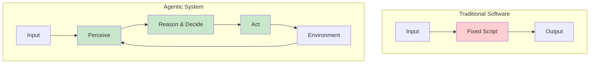

**Example: Customer Inquiry Management**

| Traditional System | Agentic System |
|-------------------|----------------|
| Follows fixed script | Perceives query nuances |
| Linear path | Accesses knowledge bases dynamically |
| Cannot adapt | Interacts with other systems (order management) |
| Passive responses | Asks clarifying questions proactively |
| Reactive | Anticipates future needs |

**Core Characteristics of Agentic Systems**

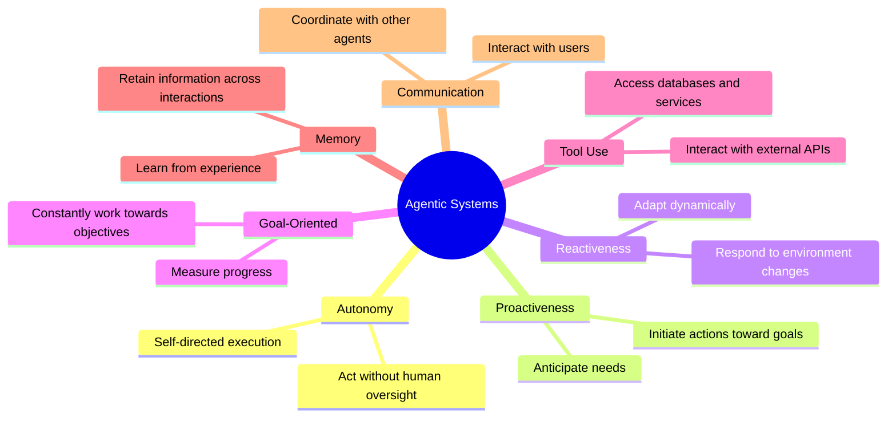

**The "Canvas" Metaphor**

Agentic systems operate on the canvas of your application's infrastructure, utilizing available services and data.

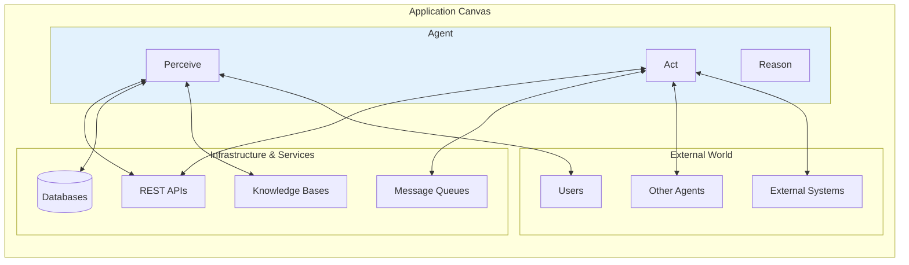

**Complexity Challenges**

Effectively realizing these characteristics introduces significant complexity:

| Challenge | Question to Address |
|-----------|---------------------|
| **State Management** | How does the agent maintain state across multiple steps? |
| **Tool Selection** | How does it decide when and how to use a tool? |
| **Agent Communication** | How is communication between different agents managed? |
| **Resilience** | How do you handle unexpected outcomes or errors? |
| **Goal Achievement** | How does the agent know when it has succeeded? |

---

## Why Patterns Matter in Agent Development

This complexity is precisely why **agentic design patterns** are indispensable.

**What Are Design Patterns?**

Design patterns are **not rigid rules**. Rather, they are battle-tested templates or blueprints that offer proven approaches to standard design and implementation challenges in the agentic domain.

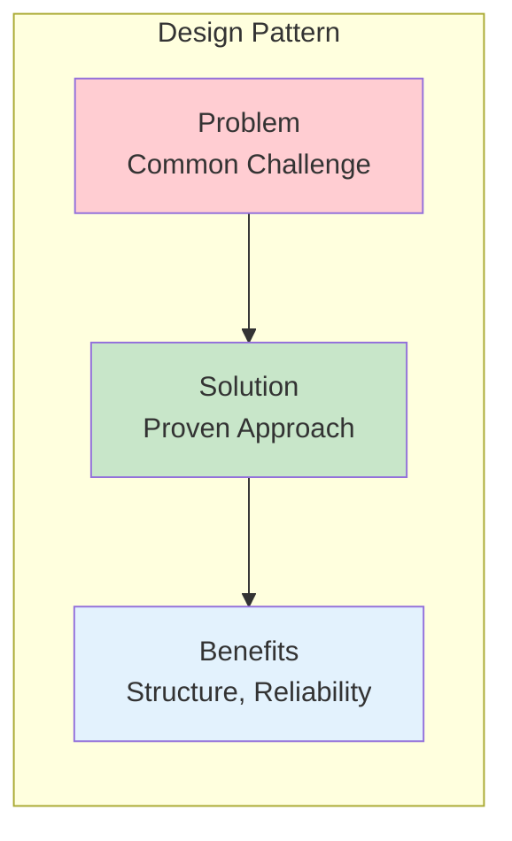

**Key Benefits**

| Benefit | Impact on Your Agents |
|---------|----------------------|
| **Proven Solutions** | Avoid reinventing fundamental approaches |
| **Common Language** | Clearer communication with your team |
| **Structure & Clarity** | Easier to understand and maintain |
| **Reliability** | Battle-tested error handling and state management |
| **Development Speed** | Focus on unique aspects, not foundational mechanics |
| **Maintainability** | Established patterns others can recognize |

**The Pattern Advantage**

**Without Patterns:**
```
Every agent = Custom implementation
├── Different state management approaches
├── Inconsistent error handling
├── Unique communication protocols
└── Hard to maintain and scale
```

**With Patterns:**
```
All agents = Consistent foundation
├── Standardized patterns for common problems
├── Predictable behavior
├── Easy to extend and modify
└── Scalable architecture
```

**This Chapter's Patterns**

This chapter covers **10 fundamental design patterns** that represent the core building blocks for constructing sophisticated agents:

**Single-Agent Patterns:**
1. Prompt Chaining (Pipeline)
2. ReAct (Reasoning + Acting)
3. Plan-and-Solve
4. Reflection
5. Self-Consistency

**Multi-Agent Patterns:**
6. Supervisor
7. Hierarchical
8. Sequential
9. Debate

**Coordination Patterns:**
10. Query Router

### Why Multi-Agent Systems?

Single-agent systems have limitations when dealing with complex, multifaceted problems:

**Single-Agent Limitations:**
- **Cognitive Overload**: One agent trying to handle all aspects of a complex task
- **Lack of Specialization**: General-purpose agents may lack deep domain expertise
- **No Collaboration**: Can't leverage multiple perspectives or approaches
- **Sequential Bottleneck**: Tasks must wait for previous ones to complete
- **Single Point of Failure**: If the agent fails, the entire system fails

**Multi-Agent Advantages:**

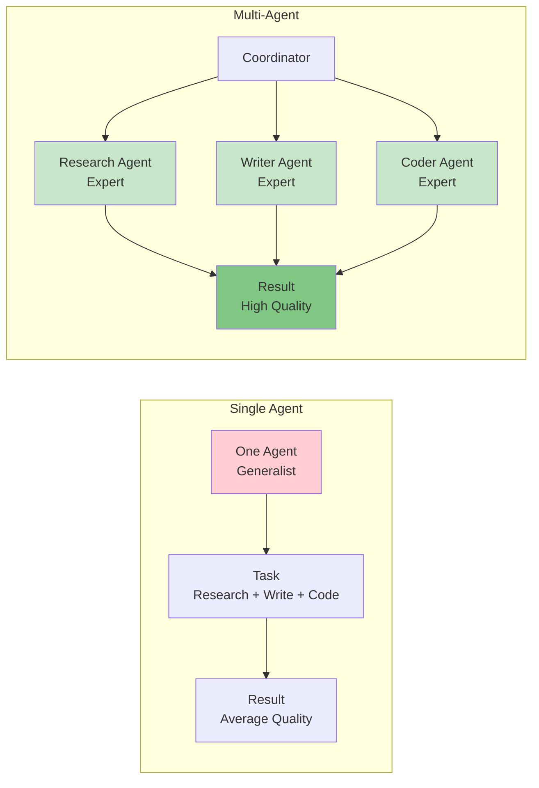

| Benefit | Single-Agent | Multi-Agent |
|---------|--------------|-------------|
| **Specialization** | ❌ General knowledge | ✅ Deep domain expertise |
| **Parallelization** | ❌ Sequential only | ✅ Concurrent execution |
| **Quality** | ⚠️ Variable | ✅ Higher quality |
| **Reliability** | ❌ Single failure point | ✅ Fault tolerance |
| **Scalability** | ⚠️ Limited | ✅ Easily scales |
| **Complexity** | ✅ Simple | ⚠️ Harder to coordinate |

### Multi-Agent Architecture Patterns

Multi-agent systems can be organized in several ways:

**1. Flat Coordination**

All agents are peers, coordinated by a central supervisor:

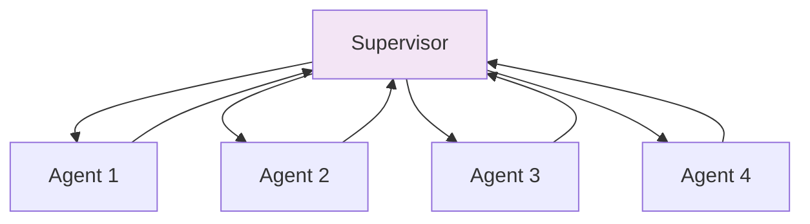

**2. Hierarchical Organization**

Agents are organized in levels, with managers at each level:

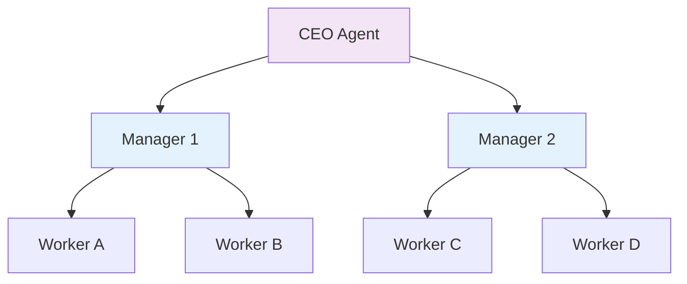

**3. Sequential Pipeline**

Agents pass work in a pipeline:

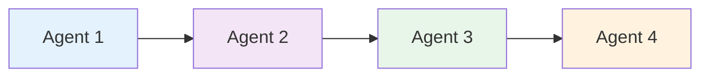

**4. Debate/Deliberation**

Agents discuss and vote on decisions:

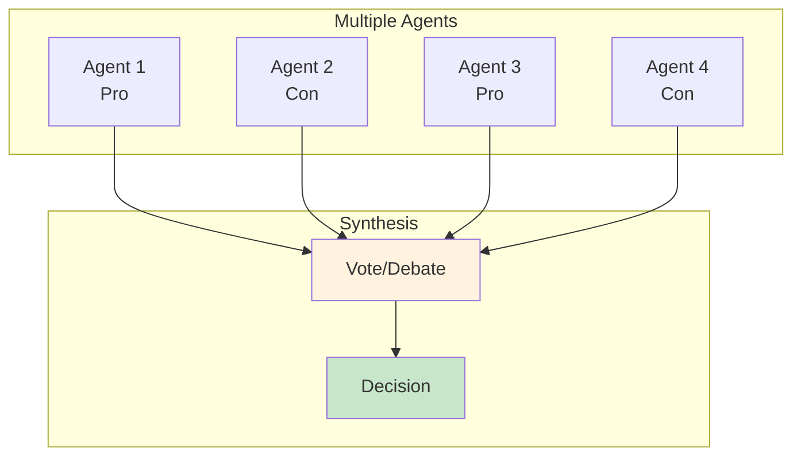

### Key Multi-Agent Concepts

**1. Agent Roles**

Specialized agents have specific responsibilities:
- **Researcher**: Information gathering and analysis
- **Writer**: Content creation and drafting
- **Coder**: Programming and technical implementation
- **Reviewer**: Quality assurance and validation
- **Planner**: Task decomposition and scheduling
- **Critic**: Evaluation and feedback

**2. Communication Patterns**

How agents exchange information:
- **Direct Messaging**: Point-to-point communication
- **Broadcast**: One-to-many announcements
- **Shared Memory**: Common knowledge base
- **Message Queues**: Asynchronous communication
- **Blackboard**: Shared workspace

**3. Coordination Mechanisms**

How agents work together:
- **Centralized**: Supervisor makes all decisions
- **Decentralized**: Agents negotiate among themselves
- **Hierarchical**: Chain of command with multiple levels
- **Peer-to-Peer**: Flat organization with voting/consensus

**4. Synchronization Strategies**

How agents coordinate their actions:
- **Sequential**: One agent at a time
- **Parallel**: Independent agents work simultaneously
- **Pipeline**: Each agent does its part then passes to next
- **Adaptive**: Dynamic allocation based on workload

### When to Use Multi-Agent Systems

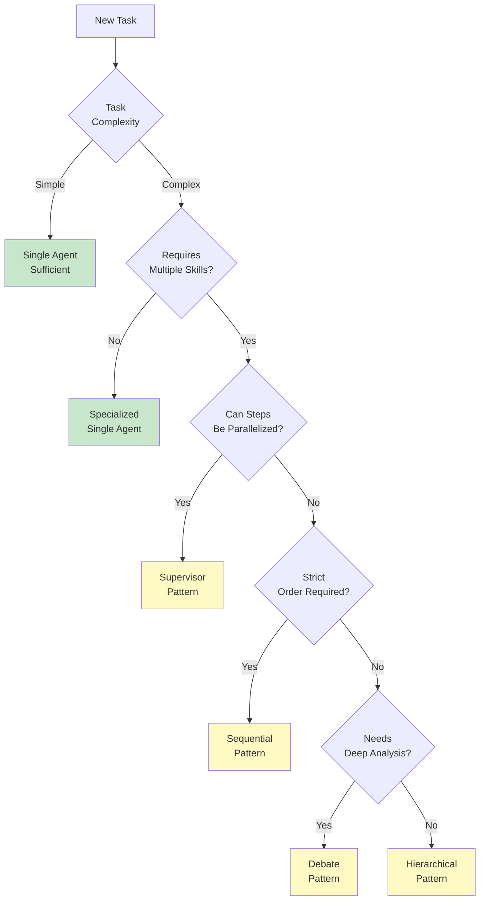

**Use Multi-Agent Systems When:**
- ✅ Task requires multiple distinct skills (research + writing + coding)
- ✅ Subtasks can be parallelized for performance
- ✅ Quality benefits from multiple perspectives
- ✅ System needs fault tolerance and redundancy
- ✅ Task is too complex for one agent to handle well
- ✅ You need specialized domain expertise

**Stick with Single-Agent When:**
- ❌ Task is simple and straightforward
- ❌ Coordination overhead isn't justified
- ❌ Budget constraints favor minimal LLM calls
- ❌ Task requires tight, immediate integration between steps
- ❌ Speed is more important than quality

These patterns provide a toolkit for building agents that can:
- Process complex multi-step tasks
- Coordinate with other agents
- Maintain context across interactions
- Handle errors gracefully
- Scale from simple to complex workflows

---

## Pattern Selection Quick Reference

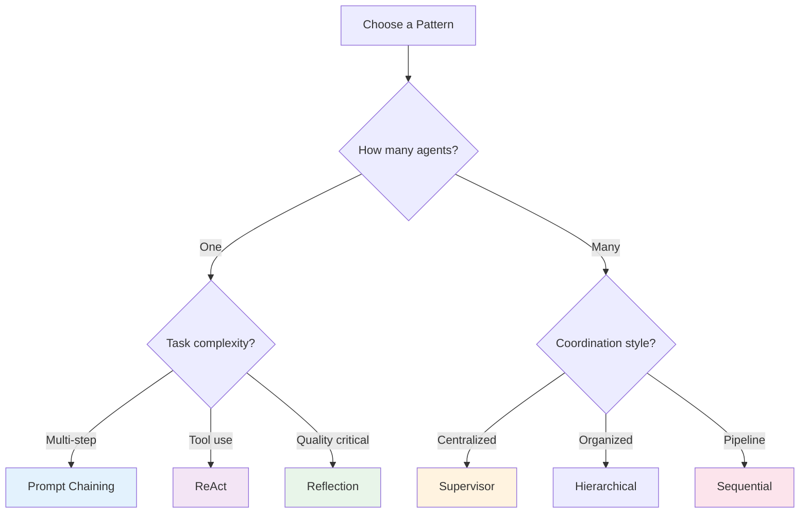

**Pattern Complexity Guide**

| Pattern | Complexity | Best For | Learning Curve |
|---------|-----------|----------|----------------|
| **Prompt Chaining** | ⭐ | Multi-step workflows | Low |
| **ReAct** | ⭐ | Tool-using agents | Low |
| **Sequential** | ⭐ | Pipelines | Low |
| **Reflection** | ⭐⭐ | Quality improvement | Medium |
| **Plan-and-Solve** | ⭐⭐ | Well-defined goals | Medium |
| **Router** | ⭐⭐ | Query classification | Medium |
| **Self-Consistency** | ⭐⭐ | Reducing randomness | Medium |
| **Supervisor** | ⭐⭐⭐ | Complex workflows | High |
| **Debate** | ⭐⭐⭐ | Decision making | High |
| **Hierarchical** | ⭐⭐⭐⭐ | Large systems | Very High |

---

**Now let's dive into the patterns, starting with foundational single-agent approaches.**

---

## 3.1 Single-Agent Patterns

### Pattern 1: Prompt Chaining (Pipeline Pattern)

By deconstructing complex problems into a sequence of simpler, more manageable sub-tasks, prompt chaining provides a robust framework for guiding large language models. This "divide-and-conquer" strategy significantly enhances the reliability and control of the output by focusing the model on one specific operation at a time.

#### What is Prompt Chaining?

Prompt chaining, sometimes referred to as the **Pipeline pattern**, represents a powerful paradigm for handling intricate tasks when leveraging large language models (LLMs). Rather than expecting an LLM to solve a complex problem in a single, monolithic step, prompt chaining advocates for a divide-and-conquer strategy.

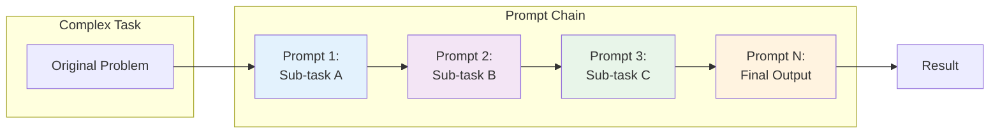

**The Core Idea:**
- Break down the original, daunting problem into a sequence of smaller, more manageable sub-problems
- Each sub-problem is addressed individually through a specifically designed prompt
- The output generated from one prompt is strategically fed as input into the subsequent prompt in the chain
- This establishes a dependency chain where context and results of previous operations guide subsequent processing

#### Why Use It? (Problems with Single Prompts)

For multifaceted tasks, using a single, complex prompt for an LLM can be inefficient and unreliable:

| Issue | Description | Example |
|-------|-------------|---------|
| **Instruction Neglect** | Model overlooks parts of the prompt | "Summarize AND extract data AND draft email" - model may only summarize |
| **Contextual Drift** | Model loses track of initial context | Long prompts cause the model to forget early instructions |
| **Error Propagation** | Early errors amplify through the response | Wrong analysis in step 1 affects all subsequent steps |
| **Context Window Limits** | Insufficient information for complex tasks | Can't fit all requirements in one prompt |
| **Increased Hallucination** | Higher cognitive load = more errors | Complex multi-step requests generate incorrect information |

**Example Failure Scenario:**
```
Query: "Analyze this market research report, summarize findings,
identify trends with data points, and draft an email to the marketing team."

Likely Result: Model summarizes well but fails to extract specific
data or drafts a poor email because the cognitive load is too high.
```

#### Enhanced Reliability Through Sequential Decomposition

Prompt chaining addresses these challenges by breaking the complex task into a focused, sequential workflow:

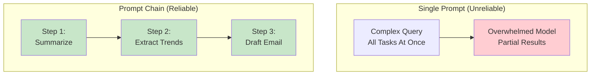

**Example Chained Approach:**

**Step 1: Summarization**
```
Prompt: "Summarize the key findings of the following market research report: [text]"
Focus: Summarization only
```

**Step 2: Trend Identification**
```
Prompt: "Using the summary, identify the top three emerging trends and
extract the specific data points that support each trend: [output from step 1]"
Focus: Data extraction
```

**Step 3: Email Composition**
```
Prompt: "Draft a concise email to the marketing team that outlines
the following trends and their supporting data: [output from step 2]"
Focus: Communication
```

#### Key Mechanisms

##### 1. Role Assignment at Each Stage

Assign distinct roles to every stage for improved focus:

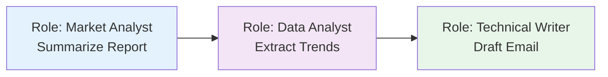

##### 2. Structured Output

The reliability of a prompt chain is highly dependent on the integrity of the data passed between steps. **Specifying a structured output format** (JSON, XML) is crucial.

```java
// Example: Structured output for trend identification
public record TrendData(
    String trendName,
    String supportingData
) {}

// Output format
TrendData[] trends = {
    new TrendData(
        "AI-Powered Personalization",
        "73% of consumers prefer brands that use personal information for relevant shopping"
    ),
    new TrendData(
        "Sustainable Brands",
        "ESG product sales grew 28% vs 20% for products without ESG claims"
    )
};
```

This structured format ensures that the data is machine-readable and can be precisely parsed and inserted into the next prompt without ambiguity.

#### Practical Applications & Use Cases

##### 1. Information Processing Workflows

```
Prompt 1: Extract text content from a document
    ↓
Prompt 2: Summarize the cleaned text
    ↓
Prompt 3: Extract specific entities (names, dates, locations)
    ↓
Prompt 4: Use entities to search knowledge base
    ↓
Prompt 5: Generate final report
```

**Applications**: Automated content analysis, AI research assistants, complex report generation

##### 2. Complex Query Answering

Question: *"What were the main causes of the 1929 stock market crash, and how did government policy respond?"*

```
Prompt 1: Identify core sub-questions (causes, government response)
    ↓
Prompt 2: Research causes of the crash
    ↓
Prompt 3: Research government policy response
    ↓
Prompt 4: Synthesize information into coherent answer
```

##### 3. Data Extraction and Transformation

```
Prompt 1: Extract fields from invoice (name, address, amount)
    ↓
Processing: Validate all required fields present
    ↓
Prompt 2 (Conditional): If missing/malformed, retry with specific focus
    ↓
Processing: Validate results again
    ↓
Output: Structured, validated data
```

**Applications**: OCR processing, form data extraction, invoice processing

##### 4. Content Generation Workflows

```
Prompt 1: Generate 5 topic ideas
    ↓
Processing: User selects best idea
    ↓
Prompt 2: Generate detailed outline
    ↓
Prompt 3-N: Write each section (with context from previous sections)
    ↓
Final Prompt: Review and refine for coherence and tone
```

**Applications**: Creative writing, technical documentation, blog generation

##### 5. Conversational Agents with State

```
Prompt 1: Process user utterance, identify intent and entities
    ↓
Processing: Update conversation state
    ↓
Prompt 2: Based on state, generate response and identify next needed info
    ↓
Repeat for subsequent turns...
```

##### 6. Code Generation and Refinement

```
Prompt 1: Generate pseudocode/outline
    ↓
Prompt 2: Write initial code draft
    ↓
Prompt 3: Identify errors and improvements
    ↓
Prompt 4: Refine code based on issues
    ↓
Prompt 5: Add documentation and tests
```

##### Implementation: Spring AI Example

```java
@Service
public class PromptChainingService {

    @Autowired
    private ChatClient chatClient;

    /**
     * Chain: Extract → Transform to JSON → Validate
     */
    public String processTechnicalSpecs(String inputText) {
        // Step 1: Extract Information
        String extracted = extractSpecs(inputText);
        log.info("Step 1 - Extracted: {}", extracted);

        // Step 2: Transform to JSON
        String json = transformToJson(extracted);
        log.info("Step 2 - JSON: {}", json);

        // Step 3: Validate
        boolean isValid = validateJson(json);
        if (!isValid) {
            // Retry with refinement
            json = refineJson(extracted);
        }

        return json;
    }

    private String extractSpecs(String text) {
        return chatClient.prompt()
            .system("You are a technical specification extractor.")
            .user("Extract the technical specifications from: {text}")
            .param("text", text)
            .call()
            .content();
    }

    private String transformToJson(String specs) {
        return chatClient.prompt()
            .system("You are a data formatter. Always return valid JSON.")
            .user("""
                Transform these specifications into a JSON object with
                'cpu', 'memory', and 'storage' as keys:

                {specs}

                Return ONLY the JSON object, no additional text.
                """.formatted(specs))
            .call()
            .content();
    }

    private boolean validateJson(String json) {
        try {
            ObjectMapper mapper = new ObjectMapper();
            mapper.readTree(json);
            return true;
        } catch (Exception e) {
            return false;
        }
    }

    private String refineJson(String specs) {
        return chatClient.prompt()
            .system("You are a JSON expert. Fix invalid JSON.")
            .user("""
                The following output was not valid JSON. Please fix it:

                {specs}

                Return ONLY valid JSON.
                """.formatted(specs))
            .call()
            .content();
    }
}
```

#### Advanced Pattern: Parallel + Sequential

Complex operations often combine parallel processing for independent tasks with prompt chaining for dependent steps:

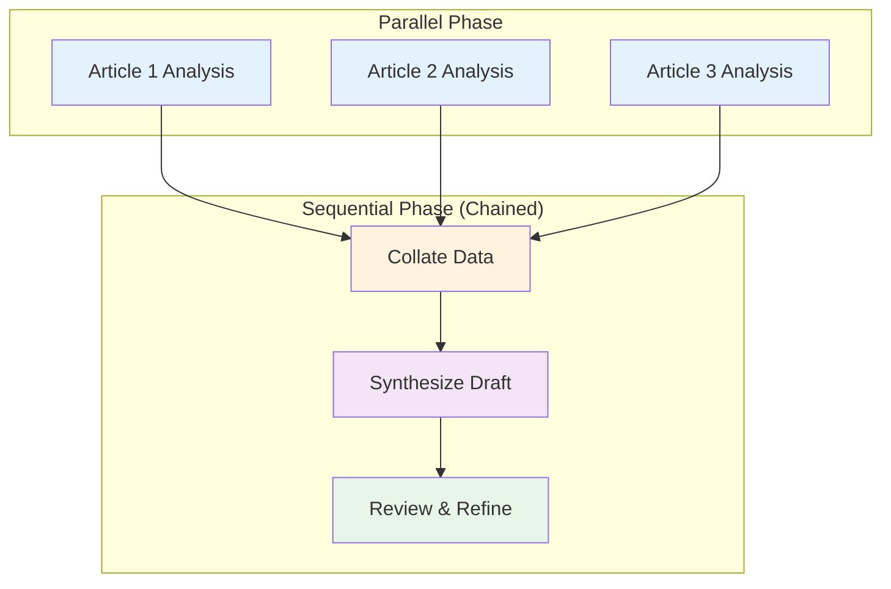

**Example Implementation**:

```java
@Service
public class ParallelSequentialService {

    @Autowired
    private ChatClient chatClient;

    public String generateComprehensiveReport(List<String> articleUrls) {
        // Parallel Phase: Extract info from all articles concurrently
        List<CompletableFuture<ArticleInfo>> futures = articleUrls.stream()
            .map(url -> CompletableFuture.supplyAsync(
                () -> extractArticleInfo(url), executor))
            .toList();

        // Wait for all parallel extractions
        List<ArticleInfo> infos = futures.stream()
            .map(CompletableFuture::join)
            .toList();

        // Sequential Phase: Chain of dependent operations
        String collated = collateData(infos);
        String draft = synthesizeDraft(collated);
        String refined = reviewAndRefine(draft);

        return refined;
    }

    private String collateData(List<ArticleInfo> infos) {
        // Step 1 in sequential chain
        return chatClient.prompt()
            .user("Collate these article extracts into organized notes: {infos}")
            .param("infos", infos.toString())
            .call()
            .content();
    }

    private String synthesizeDraft(String collated) {
        // Step 2: Uses output from step 1
        return chatClient.prompt()
            .user("Write a comprehensive report based on: {collated}")
            .param("collated", collated)
            .call()
            .content();
    }

    private String reviewAndRefine(String draft) {
        // Step 3: Uses output from step 2
        return chatClient.prompt()
            .user("Review and improve this report for clarity and accuracy: {draft}")
            .param("draft", draft)
            .call()
            .content();
    }
}
```

#### Limitations

| Limitation | Description | Mitigation |
|-----------|-------------|------------|
| **Latency** | Multiple sequential LLM calls = slower | Parallelize independent steps where possible |
| **Cost** | Each step consumes tokens | Use smaller models for intermediate steps |
| **Error Accumulation** | Errors in early steps affect later steps | Add validation and retry logic between steps |
| **Complexity** | More moving parts to manage | Use frameworks (LangChain, LangGraph) for orchestration |
| **State Management** | Passing state between steps can be complex | Use structured formats and define clear contracts |

#### Relationship to Context Engineering

Prompt chaining is a foundational technique that enables **Context Engineering** - the systematic discipline of designing and delivering a complete informational environment to AI models.

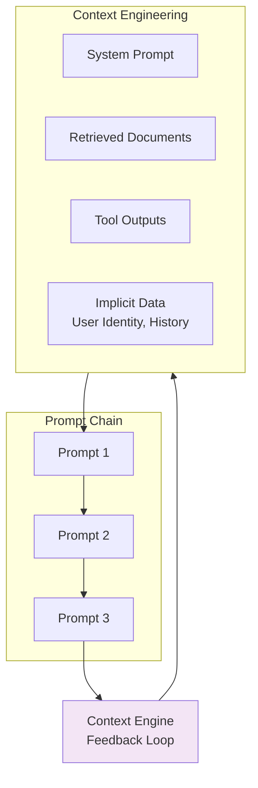

**Context Engineering Components**:
- **System Prompt**: Foundational instructions (e.g., "You are a technical writer")
- **Retrieved Documents**: Fetched from knowledge base
- **Tool Outputs**: Results from API calls or database queries
- **Implicit Data**: User identity, interaction history, environmental state

Prompt chaining enables the iterative refinement of this context, creating a feedback loop where each step enriches the informational environment for the next.

#### When to Use Prompt Chaining

| Scenario | Use Chaining? | Reason |
|----------|--------------|--------|
| **Simple Q&A** | ❌ No | Single prompt sufficient |
| **Multi-step reasoning** | ✅ Yes | Each step needs dedicated focus |
| **External tool integration** | ✅ Yes | Need to process tool outputs |
| **Content generation pipeline** | ✅ Yes | Natural progression (outline → draft → refine) |
| **Data extraction** | ✅ Yes | May need validation and retry |
| **Real-time requirements** | ❌ Maybe | Consider latency impact |

##### Best Practices

1. **Design Backwards**: Start with the final output format and work backwards
2. **Validate Between Steps**: Check outputs before passing to next prompt
3. **Use Structured Formats**: JSON/XML for machine-readable intermediate outputs
4. **Assign Clear Roles**: Different system prompts for each stage
5. **Handle Failures Gracefully**: Implement retry logic for individual steps
6. **Monitor Token Usage**: Chain length can quickly increase costs
7. **Log Intermediate Outputs**: Essential for debugging and optimization

---

### Pattern 2: ReAct Agent

The foundational pattern for tool-using agents.

#### How It Works

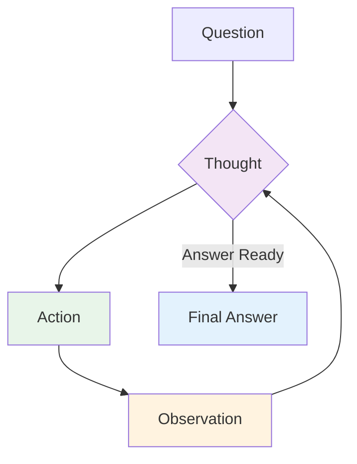

#### Implementation Steps

1. **Thought**: Agent reasons about what to do
2. **Action**: Agent executes a tool
3. **Observation**: Agent observes the result
4. **Iterate**: Repeat until goal is achieved

#### Example: Research Agent

```java
// Spring AI: ReAct Agent
@Service
public class ReactAgent {

    @Autowired
    private ChatClient chatClient;

    @Autowired
    private ToolService toolService;

    public String execute(String query, int maxIterations) {
        String context = query;
        String thought;
        String action;
        String observation;

        for (int i = 0; i < maxIterations; i++) {
            // Think
            thought = chatClient.prompt()
                .user(u -> u.text(
                    "Question: " + context + "\n" +
                    "Thought: Let me think about this step by step."
                ))
                .call()
                .content();

            // Decide on action
            if (shouldAnswerDirectly(thought)) {
                return extractAnswer(thought);
            }

            // Act
            action = extractAction(thought);
            observation = toolService.execute(action);

            // Observe and continue
            context = String.format(
                "Question: %s\nThought: %s\nAction: %s\nObservation: %s",
                query, thought, action, observation
            );
        }

        return "Max iterations reached";
    }
}
```

##### Best Practices

- **Clear Thoughts**: Explicit reasoning helps debugging
- **Specific Actions**: Tools should have clear purposes
- **Rich Observations**: Return detailed tool outputs
- **Iteration Limit**: Prevent infinite loops

---

### Pattern 3: Tool Use Pattern (Function Calling)

The **Tool Use Pattern** (also known as **Function Calling**) is the foundational pattern that enables LLMs to interact with external systems, overcoming their inherent limitations of static knowledge and inability to perform actions. This pattern is critical for building practical AI agents that can operate in real-world environments.

#### Core Concepts: Why Do Agents Need Tools?

**LLM Limitations**

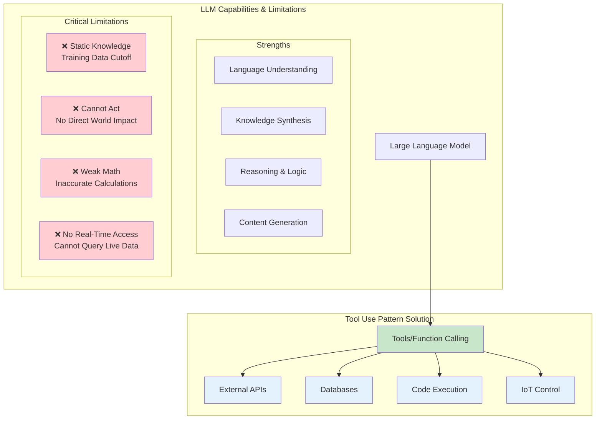

**The Two Fundamental Problems**

| Problem | Description | Example |
|---------|-------------|---------|
| **Knowledge Stagnation** | Training data has a cutoff date; LLMs cannot know events after training | "What's the weather today?" → LLM doesn't know today's weather |
| **Inability to Act** | LLMs generate text but cannot directly affect the world | "Send an email to John" → LLM can only write the email text, not send it |
| **Weak Math** | LLMs struggle with precise calculations | "Calculate √234.567" → May produce approximation |
| **No Real-Time Access** | Cannot fetch live information | "What's Apple's stock price?" → Cannot access live markets |

**Tool Use as the Solution**

The Tool Use pattern gives the LLM "hands and eyes" by:
- **Connecting to external APIs**: Real-time data access
- **Executing actions**: Modifying databases, sending messages, controlling devices
- **Precise computation**: Using calculators, Python, or specialized tools
- **Code execution**: Running code in sandboxed environments

**Tool Use Analogy**

```
┌─────────────────────────────────────────────────────────────┐
│  Without Tools: With Tools:                              │
│                                                             │
│    ┌─────────┐    ┌────────────┐                           │
│    │   LLM    │    │    LLM     │                           │
│    │  (Brain)  │    │   (Brain)   │                           │
│    └────┬────┘    └─────┬──────┘                           │
│         │               │                                     │
│         │               ▼                                     │
│         │        ┌────────────┐                              │
│         │        │  Tool Use  │                              │
│         │        │  Mechanism  │                              │
│         │        └──────┬──────┘                              │
│         │               │                                     │
│         ▼               ▼                                     │
│    [Generate Text]  [┌──────┐ ┌─────┐ ┌──────┐]      │
│                    │Weather│ │ DB  │ │Email │       │
│                    │   API │ │ API │ │ API │       │
│                    └──────┘ └─────┘ └──────┘       │
└─────────────────────────────────────────────────────────────┘
```

#### The 6-Step Workflow

Tool Use follows a structured loop that transforms natural language requests into concrete actions:

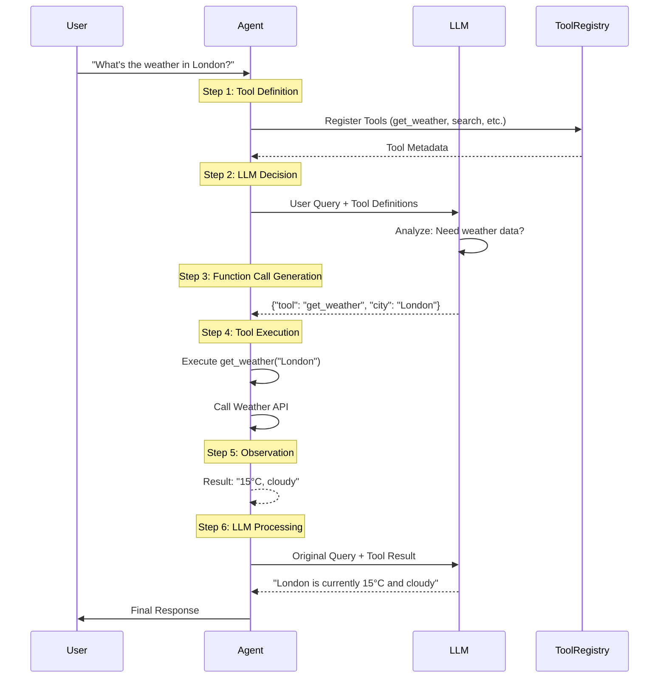

**Detailed Step-by-Step Breakdown**

##### Step 1: Tool Definition

Developers pre-define tools with structured metadata:

```java
@Component
public class WeatherTool {

    // Tool definition with metadata
    @FunctionDescription(
        name = "get_weather",
        description = "Get current weather for a location",
        parameters = {
            @FunctionParameter(
                name = "location",
                type = "string",
                description = "City name, e.g., London, Tokyo"
            ),
            @FunctionParameter(
                name = "unit",
                type = "string",
                description = "Temperature unit (celsius or fahrenheit)",
                required = false
            )
        }
    )
    public String getWeather(
            String location,
            @DefaultValue("celsius") String unit) {
        // Actual implementation
        WeatherService weatherService = new WeatherService();
        return weatherService.getCurrentWeather(location, unit);
    }
}
```

**Best Practice: Tool Metadata Quality**

Good tool descriptions are crucial for LLM understanding:

```java
// ❌ Bad: Vague description
@FunctionDescription(
    name = "get_data",
    description = "Get some data"  // Too ambiguous
)

// ✅ Good: Specific description
@FunctionDescription(
    name = "get_weather",
    description = """
        Get current weather conditions including temperature,
        humidity, wind speed, and weather description for a
        specific location. Returns real-time data from weather
        sensors.
        """,
    parameters = {
        @FunctionParameter(
            name = "location",
            type = "string",
            description = """
                City name in format "City, Country" or "City, State".
                Examples: "London, UK", "New York, NY", "Tokyo, Japan"
                """
        )
    }
)
```

##### Step 2: LLM Decision-Making

The LLM analyzes the user query and decides whether to use tools:

```java
@Service
public class ToolDecisionAgent {

    @Autowired
    private ChatClient chatClient;

    public ChatResponse decideAndRespond(String userQuery) {
        return chatClient.prompt()
            .user(userQuery)
            .functions(getAvailableTools())  // Provide tool definitions
            .call();
    }

    private List<FunctionCallback> getAvailableTools() {
        return List.of(
            FunctionCallback.builder()
                .function("get_weather", this::getWeather)
                .description("Get current weather")
                .inputType(JsonObjectSchema.builder()
                    .addProperty("location", JsonStringSchema.builder().description("City name").build())
                    .build())
                .build(),
            FunctionCallback.builder()
                .function("search_database", this::searchDatabase)
                .description("Search product database")
                .inputType(JsonObjectSchema.builder()
                    .addProperty("query", JsonStringSchema.builder().description("Search query").build())
                    .build())
                .build()
        );
    }
}
```

##### Step 3: Function Call Generation

When the LLM decides to use a tool, it generates structured output (typically JSON):

```java
// LLM generates structured function call
{
  "tool": "get_weather",
  "city": "London",
  "unit": "celsius"
}
```

##### Step 4: Tool Execution

The Agent framework intercepts and executes the function:

```java
@Service
public class ToolExecutor {

    @Autowired
    private ApplicationContext applicationContext;

    public ToolExecutionResult execute(FunctionCall call) {
        try {
            // Find the tool bean
            Object toolBean = applicationContext.getBean(call.toolName());

            // Use reflection to invoke the method
            Method method = findMethod(toolBean.getClass(), call.toolName());

            // Execute with parameters
            Object result = method.invoke(toolBean, call.parameters());

            return ToolExecutionResult.success(result);

        } catch (Exception e) {
            return ToolExecutionResult.failure(e.getMessage());
        }
    }
}
```

##### Step 5: Observation

Tool results are fed back to the LLM as observations:

```java
public record ToolObservation(
    String toolName,
    Map<String, Object> input,
    Object output,
    long executionTimeMs,
    boolean success
) {}
```

##### Step 6: LLM Final Response

The LLM generates the final natural language response:

```java
// Final LLM prompt includes:
// - Original user query
// - Tool call made
// - Tool observation result

LLM Prompt:
"""
User Query: What's the weather in London?

Tool Call: get_weather(location="London")

Observation: 15°C, cloudy, humidity 65%

Response:
"""
```

#### Real-World Use Cases

##### Use Case 1: Real-Time Information Retrieval

**Scenario**: Weather Agent

```java
@RestController
@RequestMapping("/api/v1/weather")
public class WeatherAgentController {

    @Autowired
    private ChatClient chatClient;

    @PostMapping("/chat")
    public String chatWeather(@RequestBody String userMessage) {
        return chatClient.prompt()
            .user(userMessage)
            .functions(getWeatherTools())
            .call()
            .content();
    }

    private List<FunctionCallback> getWeatherTools() {
        return List.of(
            FunctionCallback.builder()
                .function("get_current_weather", this::getCurrentWeather)
                .description("Get current weather for a location")
                .inputType(currentWeatherSchema())
                .build(),
            FunctionCallback.builder()
                .function("get_forecast", this::getForecast)
                .description("Get weather forecast for next 5 days")
                .inputType(forecastSchema())
                .build()
        );
    }

    private String getCurrentWeather(String location) {
        // Call OpenWeatherMap API
        RestTemplate restTemplate = new RestTemplate();
        String url = String.format(
            "https://api.openweathermap.org/data/2.5/weather?q=%s&appid=%s&units=metric",
            location,
            weatherApiKey
        );
        return restTemplate.getForObject(url, String.class);
    }

    private String getForecast(String location) {
        // Call forecast API
        RestTemplate restTemplate = new RestTemplate();
        String url = String.format(
            "https://api.openweathermap.org/data/2.5/forecast?q=%s&appid=%s&units=metric",
            location,
            weatherApiKey
        );
        return restTemplate.getForObject(url, String.class);
    }
}
```

**User Experience Flow**:

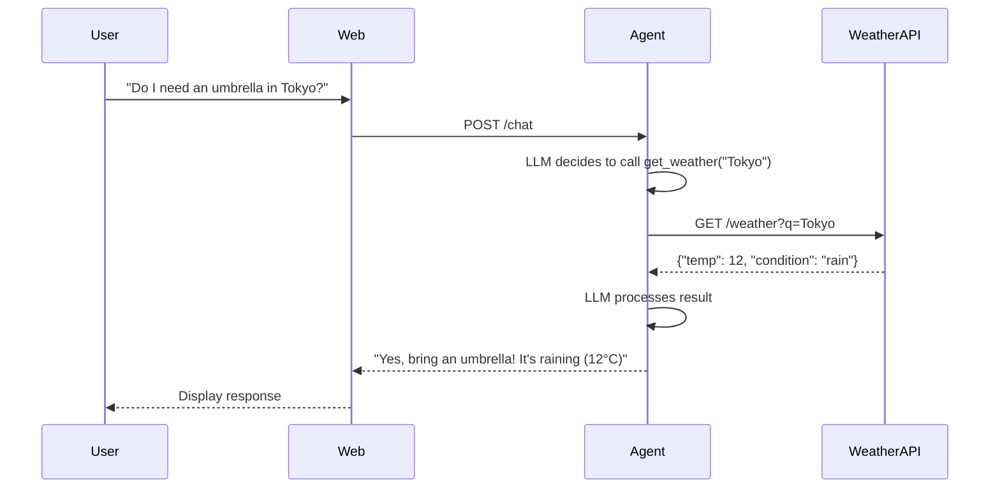

##### Use Case 2: Database/API Interaction

**Scenario**: E-commerce Order Status Agent

```java
@Service
public class OrderManagementAgent {

    @Autowired
    private ChatClient chatClient;

    @Autowired
    private OrderRepository orderRepository;

    public String handleOrderQuery(String userMessage, Long userId) {
        return chatClient.prompt()
            .system("""
                You are a customer service agent. Help users check order status,
                cancel orders, or request refunds. Always verify the user owns the order first.
                """)
            .user(userMessage)
            .functions(orderFunctions(userId))
            .call()
            .content();
    }

    private List<FunctionCallback> orderFunctions(Long userId) {
        return List.of(
            FunctionCallback.builder()
                .function("check_order_status", order -> checkOrderStatus(order.orderId(), userId))
                .description("Check the status of an order")
                .inputType(JsonObjectSchema.builder()
                    .addProperty("orderId", JsonStringSchema.builder().description("Order ID").build())
                    .build())
                .build(),
            FunctionCallback.builder()
                .function("cancel_order", order -> cancelOrder(order.orderId(), userId))
                .description("Cancel a pending order")
                .inputType(JsonObjectSchema.builder()
                    .addProperty("orderId", JsonStringSchema.builder().description("Order ID").build())
                    .build())
                .build(),
            FunctionCallback.builder()
                .function("request_refund", refund -> requestRefund(refund.orderId(), userId))
                .description("Request refund for a delivered order")
                .inputType(JsonObjectSchema.builder()
                    .addProperty("orderId", JsonStringSchema.builder().description("Order ID").build())
                    .addProperty("reason", JsonStringSchema.builder().description("Reason for refund").build())
                    .build())
                .build()
        );
    }

    private OrderStatus checkOrderStatus(String orderId, Long userId) {
        Order order = orderRepository.findByIdAndUserId(Long.parseLong(orderId), userId)
            .orElseThrow(() -> new OrderNotFoundException(orderId));

        return new OrderStatus(
            order.getId(),
            order.getStatus(),
            order.getEstimatedDelivery(),
            order.getItems()
        );
    }

    private boolean cancelOrder(String orderId, Long userId) {
        Order order = orderRepository.findByIdAndUserId(Long.parseLong(orderId), userId)
            .orElseThrow(() -> new OrderNotFoundException(orderId));

        if (!order.getStatus().canCancel()) {
            throw new OrderCannotBeCancelledException(order.getStatus());
        }

        order.setStatus(OrderStatus.CANCELLED);
        orderRepository.save(order);
        return true;
    }

    private String requestRefund(String orderId, Long userId, String reason) {
        // Process refund logic
        RefundResult refund = refundService.processRefund(Long.parseLong(orderId), reason);
        return refund.getReferenceNumber();
    }
}
```

##### Use Case 3: Computation & Analysis

**Scenario**: Financial Analysis Agent with Python

```java
@Service
public class FinancialAnalysisAgent {

    @Autowired
    private ChatClient chatClient;

    public String analyzeInvestment(String analysisRequest) {
        return chatClient.prompt()
            .system("""
                You are a financial analyst. Use the Python calculator tool
                for precise computations. Always explain your calculations.
                """)
            .user(analysisRequest)
            .functions(List.of(
                FunctionCallback.builder()
                    .function("python_calculator", this::executePython)
                    .description("Execute Python code for calculations")
                    .inputType(JsonObjectSchema.builder()
                        .addProperty("code", JsonStringSchema.builder().description("Python code to execute").build())
                        .build())
                    .build()
            ))
            .call()
            .content();
    }

    private String executePython(String code) {
        PythonExecutionResult result = pythonExecutor.execute(code);
        return result.getOutput();
    }

    public record PythonExecutionResult(
        String output,
        String error,
        long executionTimeMs
    ) {}
}
```

##### Use Case 4: Communication

**Scenario**: Email Agent

```java
@Service
public class EmailAgent {

    @Autowired
    private ChatClient chatClient;

    @Autowired
    private JavaMailSender mailSender;

    public String handleEmailRequest(String request, String senderEmail) {
        return chatClient.prompt()
            .user(request)
            .functions(List.of(
                FunctionCallback.builder()
                    .function("send_email", email -> sendEmail(
                        email.to(),
                        email.subject(),
                        email.body(),
                        senderEmail
                    ))
                    .description("Send an email to a recipient")
                    .inputType(JsonObjectSchema.builder()
                        .addProperty("to", JsonStringSchema.builder().description("Recipient email").build())
                        .addProperty("subject", JsonStringSchema.builder().description("Email subject").build())
                        .addProperty("body", JsonStringSchema.builder().description("Email body").build())
                        .build())
                    .build()
            ))
            .call()
            .content();
    }

    private String sendEmail(String to, String subject, String body, String from) {
        try {
            MimeMessage message = mailSender.createMimeMessage();
            message.setFrom(from);
            message.setRecipients(Message.RecipientType.TO, to);
            message.setSubject(subject);
            message.setText(body);

            mailSender.send(message);

            return "Email sent successfully to " + to;

        } catch (MessagingException e) {
            return "Failed to send email: " + e.getMessage();
        }
    }
}
```

##### Use Case 5: IoT Control

**Scenario**: Smart Home Agent

```java
@Service
public class SmartHomeAgent {

    @Autowired
    private ChatClient chatClient;

    @Autowired
    private IoTDeviceController deviceController;

    public String controlHome(String voiceCommand) {
        return chatClient.prompt()
            .user(voiceCommand)
            .functions(homeAutomationFunctions())
            .call()
            .content();
    }

    private List<FunctionCallback> homeAutomationFunctions() {
        return List.of(
            FunctionCallback.builder()
                .function("turn_off_light", cmd -> deviceController.execute(
                    "light",
                    cmd.deviceId(),
                    "turnOff"
                ))
                .description("Turn off a light")
                .inputType(JsonObjectSchema.builder()
                    .addProperty("deviceId", JsonStringSchema.builder().description("Light device ID").build())
                    .build())
                .build(),
            FunctionCallback.builder()
                .function("set_temperature", temp -> deviceController.execute(
                    "thermostat",
                    temp.deviceId(),
                    "setTemperature",
                    Map.of("target", temp.temperature())
                ))
                .description("Set thermostat temperature")
                .inputType(JsonObjectSchema.builder()
                    .addProperty("deviceId", JsonStringSchema.builder().description("Thermostat ID").build())
                    .addProperty("temperature", JsonNumberSchema.builder().description("Target temperature").build())
                    .build())
                .build()
        );
    }

    public record IoTDeviceController(
        String room,
        String action,
        Map<String, Object> parameters
    ) {}
}
```

#### Production Implementation: Spring AI

Complete Spring AI setup for Tool Use:

```java
@Configuration
class ToolConfiguration {

    @Bean
    public ChatClient chatClient(ChatModel chatModel) {
        return ChatClient.builder(chatModel)
            .defaultFunctions(getAllToolFunctions())
            .build();
    }

    @Bean
    public List<FunctionCallback> getAllToolFunctions() {
        return List.of(
            // Weather tools
            weatherFunctions(),
            // Database tools
            databaseFunctions(),
            // Communication tools
            communicationTools(),
            // Computation tools
            computationTools()
        ).stream()
            .flatMap(List::stream)
            .collect(Collectors.toList());
    }

    private List<FunctionCallback> weatherFunctions() {
        return List.of(
            FunctionCallback.builder("get_weather")
                .description("Get current weather")
                .inputType(schema -> schema.string("location"))
                .builder()
                .method(this::getWeather)
        );
    }
}

@Service
public class ToolUseOrchestrator {

    private final ChatClient chatClient;

    public String processWithTools(String userQuery) {
        // Single call with automatic tool execution
        return chatClient.prompt()
            .user(userQuery)
            .functions()  // Automatic function calling
            .call()
            .content();
    }

    // Streaming with tool use
    public Flux<String> processWithToolsStreaming(String userQuery) {
        return chatClient.prompt()
            .user(userQuery)
            .functions()
            .stream()
            .content();
    }
}
```

#### Advanced Tool Use Patterns

##### Pattern 1: Tool Chaining

Execute multiple tools in sequence where output feeds into next:

```java
@Service
public class ToolChainingAgent {

    public String chainTools(String researchQuery) {
        // Step 1: Search for information
        String searchResults = executeTool("search", Map.of("query", researchQuery));

        // Step 2: Extract entities from search results
        String entities = executeTool("extract_entities", Map.of("text", searchResults));

        // Step 3: Enrich with database lookup
        String enriched = executeTool("database_lookup", Map.of("entities", entities));

        // Step 4: Generate summary
        return generateSummary(researchQuery, searchResults, enriched);
    }
}
```

##### Pattern 2: Parallel Tool Execution

Execute multiple independent tools simultaneously:

```java
@Service
public class ParallelToolAgent {

    @Autowired
    private ExecutorService executor;

    public Map<String, Object> parallelToolExecution(String task) {
        // Identify required tools
        List<String> requiredTools = identifyTools(task);

        // Execute all tools in parallel
        Map<String, CompletableFuture<Object>> futures = requiredTools.stream()
            .collect(Collectors.toMap(
                tool -> tool,
                tool -> CompletableFuture.supplyAsync(
                    () -> executeTool(tool, extractParams(task, tool)),
                    executor
                )
            ));

        // Wait for all to complete
        CompletableFuture.allOf(futures.values().toArray(new CompletableFuture[0])).join();

        // Collect results
        return futures.entrySet().stream()
            .collect(Collectors.toMap(
                Map.Entry::getKey,
                entry -> entry.getValue().join()
            ));
    }
}
```

##### Pattern 3: Dynamic Tool Selection

LLM decides which tools to use dynamically:

```java
@Service
public class DynamicToolAgent {

    public String executeWithDynamicTools(String userQuery) {
        // Let LLM decide which tools to use
        ToolSelection selection = chatClient.prompt()
            .system("""
                Analyze the user query and determine which tools are needed.
                Available tools: search, calculator, database, email
                Return JSON with selected tools and parameters.
                """)
            .user("Query: " + userQuery)
            .call()
            .entity(ToolSelection.class);

        // Execute selected tools
        Map<String, Object> results = new HashMap<>();
        for (ToolCall toolCall : selection.tools()) {
            Object result = executeTool(toolCall.name(), toolCall.parameters());
            results.put(toolCall.name(), result);
        }

        // Generate final response
        return chatClient.prompt()
            .user(userQuery)
            .user("Tool results: " + results)
            .call()
            .content();
    }
}
```

#### Best Practices

##### 1. Tool Design Principles

```java
// ✅ Good: Single-purpose tools
@FunctionDescription("get_weather")
public String getWeather(String location) { }

// ✅ Good: Clear, specific parameters
@FunctionDescription("search_products")
public List<Product> searchProducts(
    @JsonProperty("query") String query,
    @JsonProperty("category") String category,
    @JsonProperty("limit") @DefaultValue("10") int limit
) { }

// ❌ Bad: Overly complex tool
@FunctionDescription("do_everything")
public String doEverything(Object... params) { }
```

##### 2. Error Handling

```java
@Service
public class SafeToolExecutor {

    public ToolResult executeToolSafely(String toolName, Map<String, Object> params) {
        try {
            Object result = executeTool(toolName, params);
            return ToolResult.success(result);

        } catch (ToolNotFoundException e) {
            return ToolResult.error("Tool not found: " + toolName);

        } catch (ToolExecutionException e) {
            return ToolResult.error("Execution failed: " + e.getMessage());

        } catch (Exception e) {
            return ToolResult.error("Unexpected error: " + e.getMessage());
        }
    }

    public record ToolResult(
        boolean success,
        Object data,
        String error
    ) {
        public static ToolResult success(Object data) {
            return new ToolResult(true, data, null);
        }

        public static ToolResult error(String error) {
            return new ToolResult(false, null, error);
        }
    }
}
```

##### 3. Tool Result Validation

```java
@Component
public class ToolResultValidator {

    public <T> T validateToolResult(
            Object rawResult,
            Class<T> expectedType,
            String toolName) {

        if (rawResult == null) {
            throw new ToolExecutionException(
                toolName + " returned null result"
            );
        }

        try {
            // Validate type
            if (!expectedType.isInstance(rawResult)) {
                throw new ToolExecutionException(
                    toolName + " returned wrong type: " + rawResult.getClass()
                );
            }

            return expectedType.cast(rawResult);

        } catch (Exception e) {
            throw new ToolExecutionException(
                "Failed to validate tool result: " + e.getMessage()
            );
        }
    }
}
```

#### Monitoring & Observability

```java
@Component
public class ToolMetrics {

    private final MeterRegistry meterRegistry;

    public void recordToolExecution(
            String toolName,
            long durationMs,
            boolean success) {

        // Execution duration
        meterRegistry.timer("agent.tool.duration",
            "tool", toolName,
            "success", String.valueOf(success)
        ).record(durationMs, TimeUnit.MILLISECONDS);

        // Success rate
        meterRegistry.counter("agent.tool.calls",
            "tool", toolName,
            "status", success ? "success" : "failure"
        ).increment();
    }

    public void recordToolError(String toolName, String errorType) {
        meterRegistry.counter("agent.tool.errors",
            "tool", toolName,
            "error_type", errorType
        ).increment();
    }
}
```

#### Key Takeaways

1. **Tools Enable Real-World Interaction**: Transform LLMs from text generators into action-capable agents
2. **6-Step Loop**: Definition → Decision → Call → Execute → Observe → Response
3. **Structured Metadata**: Tool descriptions are critical for LLM understanding
4. **Error Handling**: Always implement robust error handling and validation
5. **Parallel Execution**: Use concurrent tool execution for independent operations
6. **Security**: Validate tool inputs and sanitize outputs to prevent injection attacks
7. **Observability**: Monitor tool usage, performance, and error rates

---

### Pattern 4: Planning Pattern

The **Planning Pattern** enables agents to break down complex tasks into structured, multi-step plans before execution. Instead of jumping directly into solving, the agent first generates a comprehensive plan, then executes each step systematically. This approach dramatically improves reasoning quality, error handling, and transparency for complex problem-solving.

#### What is Planning?

Planning in agentic systems refers to the process where an agent:
1. **Analyzes** the task to understand requirements and constraints
2. **Decomposes** the problem into manageable sub-tasks
3. **Sequences** steps in logical order with dependencies
4. **Executes** each step systematically
5. **Adapts** the plan based on intermediate results

```mermaid
flowchart TB
    subgraph Input["Task Input"]
        T[User Query / Goal]
    end

    subgraph Planning["Planning Phase"]
        A[Analyze Task] --> D[Decompose Problem]
        D --> S[Sequence Steps]
        S --> P[Finalize Plan]
    end

    subgraph Execution["Execution Phase"]
        P --> E1[Execute Step 1]
        E1 --> E2[Execute Step 2]
        E2 --> E3[Execute Step N]
        E3 --> F[Synthesize Results]
    end

    subgraph Adaptation["Adaptive Loop"]
        E2 -->|Error/Feedback| R[Revise Plan]
        R --> P
    end

    T --> A
    F --> O[Final Output]

    style P fill:#f3e5f5
    style E1 fill:#e8f5e9
    style E2 fill:#e8f5e9
    style E3 fill:#e8f5e9
    style R fill:#fff3e0
```

#### Why Use Planning?

Traditional direct-execute agents often struggle with complex tasks because:
- **Cognitive Overload**: Trying to solve everything at once leads to missed details
- **Error Cascades**: Early mistakes propagate through the entire solution
- **Poor Reasoning**: Without structure, chains of thought become chaotic
- **No Recovery**: When execution fails, there's no fallback strategy
- **Lack of Transparency**: Users can't see the agent's reasoning process

Planning solves these issues by:
- ✅ **Systematic Decomposition**: Breaking complex problems into solvable chunks
- ✅ **Clear Dependencies**: Understanding what must happen before what
- ✅ **Error Isolation**: Failures are contained to specific steps
- ✅ **Adaptability**: Plans can be revised when unexpected issues arise
- ✅ **Explainability**: The plan itself is a form of explanation

#### Key Components

**1. Planner Component**

Responsible for generating the initial plan:
- **Task Analysis**: Understands goals, constraints, resources
- **Decomposition**: Breaks down into sub-tasks
- **Sequencing**: Orders steps with dependency awareness
- **Resource Allocation**: Assigns tools/time to each step

**2. Executor Component**

Executes the planned steps:
- **Step Execution**: Carries out individual steps
- **State Management**: Tracks progress and intermediate results
- **Error Handling**: Deals with failures gracefully
- **Logging**: Records execution details for transparency

**3. Critic Component** (Optional)

Evaluates and refines the plan:
- **Plan Quality**: Assesses completeness and feasibility
- **Gap Detection**: Identifies missing steps or dependencies
- **Optimization**: Suggests improvements or shortcuts
- **Risk Assessment**: Flags potential failure points

#### Single-Agent vs Multi-Agent Planning

There are two main architectural approaches:

**Single-Agent Planning (Plan-and-Solve)**

One agent handles both planning and execution:
- ✅ **Simpler**: Easier to implement and debug
- ✅ **Faster**: No inter-agent communication overhead
- ✅ **Coherent**: Single reasoning thread throughout
- ⚠️ **Bias**: Same perspective for planning and execution
- ⚠️ **Validation**: Less critical evaluation of the plan

```mermaid
flowchart LR
    A[Single Agent] --> P[Plan]
    P --> E[Execute]
    E --> R[Reflect]
    R -->|Needs Revision| P
    R -->|Satisfied| F[Final Answer]

    style A fill:#e3f2fd
```

**Multi-Agent Planning (Planner + Executor)**

Separate agents for planning and execution:
- ✅ **Separation of Concerns**: Specialized roles
- ✅ **Critical Evaluation**: Executor can validate planner's work
- ✅ **Robustness**: Different perspectives reduce bias
- ⚠️ **Complexity**: More components to coordinate
- ⚠️ **Latency**: Additional communication overhead
- ⚠️ **Cost**: Multiple LLM calls per operation

```mermaid
flowchart TB
    subgraph Agents["Two Specialized Agents"]
        PL[Planner Agent]
        EX[Executor Agent]
        CR[Critic Agent - Optional]
    end

    subgraph Workflow["Planning Workflow"]
        T[Task] --> PL
        PL --> P[Plan]
        P --> CR
        CR -->|Approve| EX
        CR -->|Revise| PL
        EX --> E[Execute Steps]
        E --> R[Results]
    end

    style PL fill:#e3f2fd
    style EX fill:#e8f5e9
    style CR fill:#f3e5f5
```

**Decision Framework**

```mermaid
flowchart TD
    A[Need Planning?] --> B{Task<br/>Complexity}
    B -->|Simple| C[No Planning<br/>Direct Execute]
    B -->|Medium| D{Cost<br/>Sensitivity}
    B -->|Complex| E{Quality<br/>Criticality}

    D -->|Cost Sensitive| F[Single-Agent<br/>Plan-and-Solve]
    D -->|Quality Focused| G[Multi-Agent<br/>Planning]

    E -->|Critical| G
    E -->|Non-Critical| F

    style F fill:#e8f5e9
    style G fill:#f3e5f5
```

#### How Planning Works: Step-by-Step

**Step 1: Task Analysis**

The agent analyzes the request to understand:
- **Goal**: What are we trying to achieve?
- **Constraints**: Time, resources, limitations
- **Context**: Background information and prerequisites

**Step 2: Plan Generation**

The agent creates a structured plan:
- **Decomposition**: Break down into 3-7 sub-tasks (optimal cognitive load)
- **Dependencies**: Identify which steps must precede others
- **Parallelization**: Spot independent steps that can run concurrently
- **Resource Needs**: Determine tools/APIs required for each step

**Step 3: Plan Validation** (Optional with Critic)

A critic agent evaluates the plan:
- **Completeness**: Are all necessary steps included?
- **Logical Flow**: Does the sequence make sense?
- **Feasibility**: Can each step actually be executed?
- **Risks**: What could go wrong?

**Step 4: Execution**

Execute each step systematically:
- **Sequential Execution**: Follow dependencies in order
- **Parallel Execution**: Run independent steps concurrently
- **State Tracking**: Store intermediate results
- **Error Handling**: Deal with failures without losing progress

**Step 5: Adaptation**

Revise plan based on execution feedback:
- **Unexpected Results**: Adjust later steps based on earlier outcomes
- **Failures**: Modify approach when steps fail
- **Optimizations**: Skip unnecessary steps if goals are met early
- **New Information**: Incorporate insights discovered during execution

**Step 6: Synthesis**

Combine results into final output:
- **Integration**: Merge results from all steps
- **Quality Check**: Ensure the final answer meets requirements
- **Explanation**: Provide transparent reasoning chain

#### Real-World Use Cases

##### Use Case 1: Travel Planning

**Task**: "Plan a 7-day trip to Japan in November with a budget of $3000"

**Without Planning**: Agent might book everything at once and miss important details like visa requirements, weather-appropriate clothing, or optimal travel routes.

**With Planning**:

```mermaid
flowchart TD
    A[Japan Trip Request] --> B[Research Seasonality<br/>November Weather]
    B --> C[Check Visa Requirements<br/>for Your Nationality]
    C --> D[Estimate Budget Breakdown<br/>Flights, Accommodation, Food, Activities]
    D --> E[Select Cities to Visit<br/>Tokyo, Kyoto, Osaka]
    E --> F[Plan Daily Itineraries<br/>3 days Tokyo, 2 days Kyoto, 2 days Osaka]
    F --> G[Book Flights<br/>Find Best Deals]
    G --> H[Reserve Accommodations<br/>Hotels/Ryokans]
    H --> I[Research Transportation<br/>JR Pass, Local Transit]
    I --> J[Identify Key Attractions<br/>Temples, Museums, Shopping]
    J --> K[Plan Restaurant Options<br/>Mix of Budget and Mid-range]
    K --> L[Compile Final<br/>Itinerary & Budget]

    style B fill:#e3f2fd
    style D fill:#e8f5e9
    style F fill:#f3e5f5
    style L fill:#c8e6c9
```

**Generated Plan**:
1. Research November weather patterns in Japan
2. Check visa and entry requirements
3. Determine optimal cities to visit
4. Create budget breakdown (flights, accommodation, food, activities)
5. Research and compare flight options
6. Book accommodations within budget
7. Plan inter-city transportation (JR Pass vs individual tickets)
8. Create daily itineraries for each city
9. Research and list must-see attractions
10. Identify restaurant options and reservations needed
11. Compile packing list based on weather
12. Finalize comprehensive itinerary with contact information

##### Use Case 2: Complex Research Task

**Task**: "Research the impact of AI on healthcare, focusing on diagnostic accuracy, patient privacy, and cost-effectiveness"

**Planning Approach**:

```java
@Service
public class ResearchPlanningAgent {

    @Autowired
    private ChatClient chatClient;

    public String conductResearch(String topic) {
        // Step 1: Generate Research Plan
        String plan = chatClient.prompt()
            .system("""
                You are a research planner. Break down research topics into
                systematic, logical steps that ensure comprehensive coverage.
                """)
            .user("""
                Research Topic: {topic}

                Create a detailed research plan with:
                1. Key research questions to address
                2. Data sources and search queries
                3. Analysis methodology
                4. Validation strategies
                5. Synthesis approach

                Format as numbered list with dependencies noted.
                """)
            .param("topic", topic)
            .call()
            .content();

        log.info("Generated Research Plan:\n{}", plan);

        // Step 2: Parse and Execute Plan
        List<ResearchStep> steps = parseResearchSteps(plan);
        Map<String, Object> researchData = new HashMap<>();

        for (ResearchStep step : steps) {
            log.info("Executing step {}: {}", step.getNumber(), step.getDescription());

            // Execute step (e.g., search, analyze, validate)
            String stepResult = executeResearchStep(step);
            researchData.put(step.getKey(), stepResult);

            // Adapt plan if needed based on results
            if (stepRequiresAdaptation(stepResult)) {
                plan = adaptPlan(plan, stepResult);
                log.info("Adapted plan based on findings");
            }
        }

        // Step 3: Synthesize Findings
        String synthesis = chatClient.prompt()
            .system("""
                You are a research synthesizer. Combine findings from multiple
                research steps into a coherent, well-structured report.
                """)
            .user("""
                Original Topic: {topic}

                Research Plan:
                {plan}

                Findings:
                {findings}

                Create a comprehensive research report with:
                1. Executive Summary
                2. Detailed Findings by Category
                3. Data-Backed Conclusions
                4. Limitations and Future Research
                """)
            .param("topic", topic)
            .param("plan", plan)
            .param("findings", researchData.toString())
            .call()
            .content();

        return synthesis;
    }

    private record ResearchStep(
        int number,
        String description,
        String key,
        List<String> dependencies
    ) {}
}
```

##### Use Case 3: Software Architecture Design

**Task**: "Design a microservices architecture for an e-commerce platform handling 1M daily active users"

**Planning-Generated Architecture**:

```java
@Service
public class ArchitecturePlanningAgent {

    public String designArchitecture(String requirements) {
        // Phase 1: Planning
        ArchitecturePlan plan = generateArchitecturePlan(requirements);

        // Phase 2: Execution (each step designs a component)
        Map<String, ComponentDesign> designs = new HashMap<>();

        for (PlanningStep step : plan.getSteps()) {
            ComponentDesign design = designComponent(step, designs);
            designs.put(step.getComponentName(), design);
        }

        // Phase 3: Integration & Validation
        ArchitectureBlueprint blueprint = integrateComponents(designs);
        validateBlueprint(blueprint, requirements);

        return blueprint.toDocumentation();
    }

    private ArchitecturePlan generateArchitecturePlan(String requirements) {
        return chatClient.prompt()
            .system("""
                You are a solutions architect. Create detailed architecture plans
                following microservices best practices.

                Your plan should include:
                1. Service decomposition (bounded contexts)
                2. Data flow and communication patterns
                3. Infrastructure requirements
                4. Scalability strategies
                5. Security considerations
                """)
            .user("""
                Requirements: {requirements}

                Generate a comprehensive architecture plan.
                Format as JSON with steps, dependencies, and priorities.
                """)
            .call()
            .entity(ArchitecturePlan.class);
    }
}
```

#### Production Implementation: Spring AI

##### Single-Agent Plan-and-Solve

```java
@Service
@Slf4j
public class PlanAndSolveAgent {

    private final ChatClient chatClient;
    private final ExecutorService executor;

    public PlanAndSolveAgent(ChatClient chatClient) {
        this.chatClient = chatClient;
        this.executor = Executors.newVirtualThreadPerTaskExecutor();
    }

    public String solveWithPlan(String task) {
        // ========== Phase 1: Planning ==========
        log.info("Starting planning phase for task: {}", task);

        String plan = chatClient.prompt()
            .system("""
                You are an expert planner. Break down complex tasks into clear,
                executable steps.

                Guidelines:
                - Create 3-7 steps (optimal for execution)
                - Order steps logically with dependencies
                - Make each step specific and actionable
                - Note which steps can run in parallel
                """)
            .user("""
                Task: {task}

                Create a detailed step-by-step plan.
                Format as:
                1. [Step description]
                   - Dependencies: none/step X
                   - Can parallelize: yes/no

                Be specific about what each step should accomplish.
                """)
            .param("task", task)
            .call()
            .content();

        log.info("Generated plan:\n{}", plan);

        // ========== Phase 2: Parse Plan ==========
        List<PlanStep> steps = parsePlan(plan);
        log.info("Parsed {} steps from plan", steps.size());

        // ========== Phase 3: Execute Steps ==========
        Map<String, String> results = new LinkedHashMap<>();

        for (PlanStep step : steps) {
            log.info("Executing step {}: {}", step.getNumber(), step.getDescription());

            // Check dependencies
            if (!dependenciesSatisfied(step, results)) {
                log.warn("Dependencies not met for step {}, skipping", step.getNumber());
                continue;
            }

            // Execute step
            String result = executeStep(step, results);
            results.put(step.getStepId(), result);

            log.info("Step {} completed: {}",
                step.getNumber(),
                result.substring(0, Math.min(100, result.length())) + "...");
        }

        // ========== Phase 4: Synthesize ==========
        String finalAnswer = chatClient.prompt()
            .system("""
                You are a synthesis specialist. Combine results from multiple
                execution steps into a coherent final answer.

                The final answer should:
                - Directly address the original task
                - Incorporate insights from all steps
                - Be well-structured and clear
                - Acknowledge any limitations or gaps
                """)
            .user("""
                Original Task: {task}

                Plan:
                {plan}

                Execution Results:
                {results}

                Provide a comprehensive final answer.
                """)
            .param("task", task)
            .param("plan", plan)
            .param("results", results.entrySet().stream()
                .map(e -> e.getKey() + ": " + e.getValue())
                .collect(Collectors.joining("\n\n")))
            .call()
            .content();

        log.info("Task completed successfully");
        return finalAnswer;
    }

    private String executeStep(PlanStep step, Map<String, String> context) {
        return chatClient.prompt()
            .system("""
                You are a task executor. Execute the given step precisely
                using available context from previous steps.

                Focus on quality and completeness.
                """)
            .user("""
                Step: {step}

                Context from previous steps:
                {context}

                Execute this step and provide detailed results.
                """)
            .param("step", step.getDescription())
            .param("context", context.toString())
            .call()
            .content();
    }

    private List<PlanStep> parsePlan(String plan) {
        // Parse plan into structured steps
        // Implementation depends on plan format
        return List.of(
            new PlanStep(1, "Research topic background", Map.of()),
            new PlanStep(2, "Analyze key factors", Map.of("dependsOn", List.of(1))),
            new PlanStep(3, "Synthesize findings", Map.of("dependsOn", List.of(1, 2)))
        );
    }

    private boolean dependenciesSatisfied(PlanStep step, Map<String, String> results) {
        List<Integer> dependencies = step.getDependencies();
        return results.keySet().containsAll(
            dependencies.stream()
                .map(d -> "step-" + d)
                .collect(Collectors.toList())
        );
    }

    private record PlanStep(
        int number,
        String description,
        Map<String, Object> metadata
    ) {
        String getStepId() {
            return "step-" + number;
        }

        @SuppressWarnings("unchecked")
        List<Integer> getDependencies() {
            return (List<Integer>) metadata.getOrDefault("dependsOn", List.of());
        }
    }
}
```

##### Multi-Agent Planning (Planner + Executor + Critic)

```java
@Service
@Slf4j
public class MultiAgentPlanningSystem {

    private final ChatClient chatClient;
    private final ChatClient plannerClient;
    private final ChatClient executorClient;
    private final ChatClient criticClient;

    public MultiAgentPlanningSystem(ChatClient.Builder chatClientBuilder) {
        // Create specialized clients with different system prompts
        this.plannerClient = chatClientBuilder
            .defaultSystem("""
                You are a strategic planner. Your role is to create comprehensive,
                well-structured plans for complex tasks.

                Strengths:
                - Break down complex problems
                - Identify dependencies and constraints
                - Optimize for efficiency and feasibility

                Focus on creating clear, executable plans.
                """)
            .build();

        this.executorClient = chatClientBuilder
            .defaultSystem("""
                You are a meticulous executor. Your role is to carry out planned
                steps with precision and attention to detail.

                Strengths:
                - Execute steps faithfully
                - Handle errors gracefully
                - Provide detailed results

                Focus on execution quality and completeness.
                """)
            .build();

        this.criticClient = chatClientBuilder
            .defaultSystem("""
                You are a critical evaluator. Your role is to assess plans and
                execution results objectively.

                Strengths:
                - Identify gaps and risks
                - Validate completeness
                - Suggest improvements

                Be thorough but constructive in your feedback.
                """)
            .build();

        this.chatClient = chatClientBuilder.build();
    }

    public String executeWithMultiAgentPlanning(String task) {
        // ========== Step 1: Planner creates initial plan ==========
        log.info("=== Planning Phase ===");

        String plan = plannerClient.prompt()
            .user("""
                Task: {task}

                Create a comprehensive execution plan with:
                1. Step-by-step breakdown
                2. Dependencies between steps
                3. Potential risks and mitigations
                4. Success criteria

                Format as structured plan.
                """)
            .param("task", task)
            .call()
            .content();

        log.info("Initial plan created:\n{}", plan);

        // ========== Step 2: Critic evaluates the plan ==========
        log.info("=== Plan Evaluation Phase ===");

        String critique = criticClient.prompt()
            .user("""
                Task: {task}

                Proposed Plan:
                {plan}

                Evaluate this plan on:
                1. Completeness: Are all necessary steps included?
                2. Logical Flow: Does the sequence make sense?
                3. Feasibility: Can each step be executed successfully?
                4. Risks: What could go wrong?

                Provide specific feedback and suggestions.
                """)
            .param("task", task)
            .param("plan", plan)
            .call()
            .content();

        log.info("Plan critique:\n{}", critique);

        // ========== Step 3: Planner refines based on critique ==========
        if (needsRefinement(critique)) {
            log.info("Refining plan based on critique...");
            plan = plannerClient.prompt()
                .user("""
                    Original Task: {task}

                    Initial Plan:
                    {plan}

                    Critique:
                    {critique}

                    Refine the plan addressing the critique.
                    Mark changes clearly.
                    """)
                .param("task", task)
                .param("plan", plan)
                .param("critique", critique)
                .call()
                .content();

            log.info("Refined plan:\n{}", plan);
        }

        // ========== Step 4: Executor executes the plan ==========
        log.info("=== Execution Phase ===");

        List<PlanStep> steps = parsePlan(plan);
        Map<String, ExecutionResult> results = new LinkedHashMap<>();

        for (PlanStep step : steps) {
            log.info("Executing step {}: {}", step.getNumber(), step.getDescription());

            ExecutionResult result = executeStepWithRetry(step, results);
            results.put(step.getStepId(), result);

            // ========== Step 5: Critic evaluates execution ==========
            if (!result.isSuccess()) {
                log.warn("Step {} failed, requesting revision...", step.getNumber());

                String revisionRequest = criticClient.prompt()
                    .user("""
                        Step that Failed:
                        {step}

                        Result:
                        {result}

                        Context from completed steps:
                        {context}

                        Analyze why this step failed and suggest:
                        1. Root cause
                        2. Recovery strategy
                        3. Plan adjustments needed
                        """)
                    .param("step", step.getDescription())
                    .param("result", result.getOutput())
                    .param("context", results.toString())
                    .call()
                    .content();

                log.info("Revision suggestions:\n{}", revisionRequest);

                // Revise and retry
                revisePlanForStep(step, revisionRequest);
                result = executeStepWithRetry(step, results);
                results.put(step.getStepId(), result);
            }
        }

        // ========== Step 6: Synthesize final answer ==========
        log.info("=== Synthesis Phase ===");

        String finalAnswer = chatClient.prompt()
            .system("""
                You are a synthesis specialist. Combine multi-agent execution
                results into a coherent final response.

                Include:
                1. Direct answer to the task
                2. Key insights from each step
                3. How the plan evolved (if revised)
                4. Any limitations encountered
                """)
            .user("""
                Original Task: {task}

                Final Plan:
                {plan}

                Execution Results:
                {results}

                Provide comprehensive final answer.
                """)
            .param("task", task)
            .param("plan", plan)
            .param("results", results.toString())
            .call()
            .content();

        log.info("Multi-agent planning completed successfully");
        return finalAnswer;
    }

    private ExecutionResult executeStepWithRetry(
            PlanStep step,
            Map<String, ExecutionResult> context) {

        for (int attempt = 1; attempt <= 3; attempt++) {
            try {
                String result = executorClient.prompt()
                    .user("""
                        Step to Execute:
                        {step}

                        Context from Previous Steps:
                        {context}

                        Execute this step and provide detailed results.
                        """)
                    .param("step", step.getDescription())
                    .param("context", context.values().toString())
                    .call()
                    .content();

                return new ExecutionResult(true, result, null);

            } catch (Exception e) {
                log.warn("Attempt {} failed for step: {}", attempt, step.getNumber(), e);

                if (attempt == 3) {
                    return new ExecutionResult(false, null, e.getMessage());
                }
            }
        }

        return new ExecutionResult(false, null, "Max retries exceeded");
    }

    private boolean needsRefinement(String critique) {
        // Check if critique identifies significant issues
        return critique.toLowerCase().contains("missing") ||
               critique.toLowerCase().contains("incomplete") ||
               critique.toLowerCase().contains("risk") ||
               critique.contains("⚠️");
    }

    private void revisePlanForStep(PlanStep step, String revision) {
        // Update plan based on revision suggestions
        log.info("Revising plan for step {} based on: {}", step.getNumber(), revision);
    }

    private record ExecutionResult(
        boolean success,
        String output,
        String error
    ) {}
}
```

#### Best Practices

##### 1. Optimal Plan Granularity

**Too Coarse** (2-3 steps):
```java
// ❌ Bad: Too vague
1. "Research the topic"
2. "Write a report"
```

**Too Fine** (20+ steps):
```java
// ❌ Bad: Overwhelming
1. "Open browser"
2. "Navigate to Google"
3. "Type search query"
...
```

**Just Right** (5-7 steps):
```java
// ✅ Good: Balanced granularity
1. "Research topic background and key concepts"
2. "Identify primary data sources and search queries"
3. "Analyze and synthesize findings from multiple sources"
4. "Validate conclusions with cross-references"
5. "Draft comprehensive report with citations"
```

##### 2. Dependency Management

```java
public class DependencyAwareExecutor {

    public void executeWithDependencies(List<PlanStep> steps) {
        Map<String, String> completedSteps = new HashMap<>();
        Set<String> inProgress = new HashSet<>();

        while (completedSteps.size() < steps.size()) {
            for (PlanStep step : steps) {
                if (completedSteps.containsKey(step.getId())) {
                    continue; // Already done
                }

                if (inProgress.contains(step.getId())) {
                    continue; // Currently running
                }

                // Check if dependencies are satisfied
                if (dependenciesSatisfied(step, completedSteps)) {
                    inProgress.add(step.getId());

                    // Execute asynchronously
                    CompletableFuture.supplyAsync(() -> executeStep(step))
                        .thenAccept(result -> {
                            completedSteps.put(step.getId(), result);
                            inProgress.remove(step.getId());
                        });
                }
            }

            // Wait for some progress
            Thread.sleep(100);
        }
    }
}
```

##### 3. Plan Adaptation Strategies

```java
@Service
public class AdaptivePlanningAgent {

    public String executeWithAdaptation(String task) {
        String plan = createPlan(task);
        List<PlanStep> steps = parsePlan(plan);
        Map<String, String> results = new HashMap<>();

        for (int i = 0; i < steps.size(); i++) {
            PlanStep step = steps.get(i);

            // Execute step
            String result = executeStep(step, results);
            results.put(step.getId(), result);

            // Adapt subsequent steps based on result
            if (shouldAdapt(result)) {
                log.info("Adapting remaining plan based on step {} result", i + 1);

                // Regenerate plan for remaining steps
                String remainingPlan = chatClient.prompt()
                    .user("""
                        Original Task: {task}

                        Completed Steps:
                        {completed}

                        Remaining Steps:
                        {remaining}

                        Latest Result:
                        {latestResult}

                        The latest result reveals new information. Adapt the
                        remaining plan to incorporate this insight.
                        Mark what changed and why.
                        """)
                    .param("task", task)
                    .param("completed", results.entrySet().stream()
                        .limit(i + 1)
                        .map(e -> e.getKey() + ": " + e.getValue())
                        .collect(Collectors.joining("\n")))
                    .param("remaining", steps.stream()
                        .skip(i + 1)
                        .map(PlanStep::getDescription)
                        .collect(Collectors.joining("\n")))
                    .param("latestResult", result)
                    .call()
                    .content();

                // Update remaining steps
                List<PlanStep> adaptedSteps = parsePlan(remainingPlan);
                steps = adaptPlan(steps, i + 1, adaptedSteps);

                log.info("Plan adapted. New remaining steps: {}",
                    adaptedSteps.stream()
                        .map(PlanStep::getDescription)
                        .collect(Collectors.joining(", ")));
            }
        }

        return synthesize(results);
    }

    private boolean shouldAdapt(String result) {
        // Check if result contains unexpected information
        return result.toLowerCase().contains("unexpected") ||
               result.toLowerCase().contains("however") ||
               result.toLowerCase().contains("surprisingly") ||
               result.contains("⚠️");
    }
}
```

##### 4. Cost Optimization

```java
@Service
public class CostOptimizedPlanningAgent {

    // Use cheaper model for planning, expensive for execution
    private static final String PLANNING_MODEL = "gpt-3.5-turbo";
    private static final String EXECUTION_MODEL = "gpt-4";

    public String planCostOptimized(String task) {
        // Plan with cheaper model
        String plan = chatClient.prompt()
            .model(ChatModelBuilder.builder()
                .model(PLANNING_MODEL)
                .build())
            .user("Create a plan for: " + task)
            .call()
            .content();

        // Execute with better model
        List<PlanStep> steps = parsePlan(plan);
        Map<String, String> results = new HashMap<>();

        for (PlanStep step : steps) {
            String result = chatClient.prompt()
                .model(ChatModelBuilder.builder()
                    .model(EXECUTION_MODEL)
                    .build())
                .user(step.getDescription())
                .call()
                .content();

            results.put(step.getId(), result);
        }

        return synthesize(results);
    }
}
```

#### Challenges and Limitations

| Challenge | Description | Mitigation |
|-----------|-------------|------------|
| **Computational Cost** | Extra LLM calls for planning | Use cheaper models for planning, cache similar plans |
| **Plan Quality** | Poor plans lead to poor execution | Add critic agent, validate before execution |
| **Inflexibility** | Rigid plans can't adapt | Build in revision checkpoints, adaptive planning |
| **Token Limits** | Long plans consume context | Summarize intermediate results, use hierarchical planning |
| **Error Cascades** | Early plan errors affect everything | Validate each step, build recovery mechanisms |
| **Overhead** | Not worth it for simple tasks | Use threshold to decide when to plan |
| **Evaluation Difficulty** | Hard to assess plan quality | Define clear success criteria, use critic feedback |

#### When to Use Planning

```mermaid
flowchart TD
    A[New Task] --> B{Task<br/>Complexity}
    B -->|Simple<br/>&lt;2 steps| C[No Planning<br/>Direct Execute]
    B -->|Medium<br/>2-5 steps| D{Task Novelty}
    B -->|Complex<br/>&gt;5 steps| E[Use Planning]

    D -->|Seen Before| F[Cached Plan]
    D -->|New Task| G[Single-Agent<br/>Plan-and-Solve]

    E --> H{Quality<br/>Critical?}
    H -->|Yes| I[Multi-Agent<br/>Planning]
    H -->|No| G

    style C fill:#c8e6c9
    style G fill:#fff9c4
    style I fill:#f3e5f5
    style F fill:#e1f5fe
```

**Use Planning When**:
- ✅ Task requires 5+ logical steps
- ✅ Steps have clear dependencies
- ✅ Task is novel (no cached solution)
- ✅ Quality is more important than speed
- ✅ Transparency/explainability is required
- ✅ Budget allows for extra LLM calls

**Skip Planning When**:
- ❌ Task is simple (1-2 steps)
- ❌ Time is critical (rapid response needed)
- ❌ Task is well-understood (cached approach exists)
- ❌ Cost is a major constraint
- ❌ Task requires improvisation (can't be pre-planned)

---

### Pattern 4: Reflection Agent

The **Reflection Pattern** enables agents to critique their own outputs and iteratively improve them through self-evaluation and revision. This meta-cognitive approach significantly enhances output quality by introducing a feedback loop.

#### What is Reflection?

Reflection in agentic systems refers to the process where an agent:
1. **Generates** an initial output
2. **Observes** its own output objectively
3. **Critiques** identifies flaws and areas for improvement
4. **Revises** based on the critique
5. **Repeats** until satisfactory quality is achieved

```mermaid
flowchart TB
    subgraph Generation["Phase 1: Generation"]
        T[Task/Goal] --> G[Generate Initial Output]
    end

    subgraph Reflection["Phase 2: Reflection Loop"]
        G --> E{Evaluate Quality}
        E -->|Flaws Found| C[Critique & Identify Issues]
        E -->|Satisfactory| F[Final Output]
        C --> R[Revise & Improve]
        R --> E
    end

    style G fill:#e3f2fd
    style C fill:#f3e5f5
    style R fill:#e8f5e9
    style F fill:#c8e6c9
```

#### Core Components

**1. Initial Generation**

Produce a first draft without self-censorship:
- Focus on getting ideas down
- Don't worry about perfection
- Establishes baseline quality

**2. Reflection Mechanism**

The agent steps back and objectively evaluates:
- **Accuracy**: Is the information correct?
- **Completeness**: Did I address all requirements?
- **Clarity**: Is the explanation clear?
- **Quality**: Does it meet standards?

**3. Revision Process**

Improve based on reflection:
- Fix identified issues
- Enhance weak areas
- Add missing components
- Refine style and presentation

#### Why Use Reflection?

| Benefit | Description | Example |
|---------|-------------|---------|
| **Quality Improvement** | Iterative refinement produces better results | Code with fewer bugs |
| **Error Reduction** | Self-correction catches mistakes | Accurate factual claims |
| **Consistency** | Ensures coherence throughout | Aligned arguments |
| **Adaptability** | Adjusts approach based on feedback | Better meets requirements |
| **Confidence Assessment** | Know when quality is sufficient | Prevents premature submission |

#### Advanced Reflection Patterns

##### Pattern 1: Reflexion Pattern (Memory-Based)

Agent maintains a memory of past reflections to avoid repeating mistakes:

```mermaid
flowchart LR
    subgraph Initial["Initial Attempt"]
        G1[Generate Action 1]
    end

    subgraph Memory["Reflection Memory"]
        M[Store Failure]
    end

    subgraph Retry["Refined Attempt"]
        G2[Generate Action 2<br/>Informed by Memory]
    end

    G1 --> E{Execute}
    E -->|Failure| M
    E -->|Success| DONE[Complete]
    M --> G2
    G2 --> DONE

    style M fill:#fff3e0
    style G2 fill:#c8e6c9
```

```java
@Service
public class ReflexionAgent {

    @Autowired
    private ChatClient chatClient;

    @Autowired
    private ReflectionMemory memory;

    public String executeWithReflection(String task, int maxAttempts) {
        for (int attempt = 1; attempt <= maxAttempts; attempt++) {
            // Generate action
            String action = generateAction(task);

            // Execute action
            ActionResult result = execute(action);

            if (result.success()) {
                return action;
            }

            // Reflect on failure
            ReflectionObservation observation = reflect(action, result);
            memory.store(observation);

            // Use memory to inform next attempt
            task = updateTaskBasedOnMemory(task, observation);
        }

        throw new MaxAttemptsExceededException();
    }

    private ReflectionObservation reflect(String action, ActionResult result) {
        String reflection = chatClient.prompt()
            .system("""
                You are a reflective agent. Analyze why this action failed
                and provide insights for improvement.
                """)
            .user("""
                Action: {action}
                Result: {result}

                Provide:
                1. Root cause of failure
                2. What to avoid in next attempt
                3. Suggested improvement strategy
                """)
            .call()
            .content();

        return parseReflection(reflection);
    }

    public record ReflectionObservation(
        String rootCause,
        String avoidanceStrategy,
        String improvementPlan
    ) {}
}

// Memory implementation
@Component
class ReflectionMemory {
    private final List<ReflectionObservation> observations = new ArrayList<>();

    public void store(ReflectionObservation observation) {
        observations.add(observation);
    }

    public List<ReflectionObservation> getRelevantObservations(String context) {
        return observations.stream()
            .filter(obs -> isRelevant(obs, context))
            .toList();
    }
}
```

##### Pattern 2: Self-Reflection with Grades

Assign grades to own work and iterate until passing:

```java
@Service
public class GradedReflectionAgent {

    @Autowired
    private ChatClient chatClient;

    public String executeWithGrading(String task) {
        String output;
        int grade;

        do {
            // Generate
            output = generateOutput(task);

            // Self-grade
            GradeResult grading = gradeWork(output, task);
            grade = grading.numericGrade();

            if (grade >= 8) {
                // Add explanation
                output += "\n\nSelf-Reflection: " + grading.explanation();
                break;
            }

            // Improve
            task = "Original task: " + task + "\nPrevious attempt: " + output +
                   "\nGrading feedback: " + grading.feedback();

        } while (grade < 8 && attemptCount++ < MAX_ATTEMPTS);

        return output;
    }

    private GradeResult gradeWork(String output, String task) {
        String grading = chatClient.prompt()
            .system("""
                Grade this work honestly on a scale of 1-10.
                Be critical but fair.
                """)
            .user("""
                Task: {task}
                Output: {output}

                Provide JSON:
                {
                    "numericGrade": 1-10,
                    "feedback": "specific feedback",
                    "explanation": "why this grade"
                }
                """)
            .call()
            .content();

        return parseGrading(grading);
    }

    public record GradeResult(
        int numericGrade,
        String feedback,
        String explanation
    ) {}
}
```

##### Pattern 3: Two-Agent Reflection

Separate generator and critic agents for more objective evaluation:

```mermaid
flowchart TB
    subgraph Actors["Two Agents"]
        GEN[Generator Agent]
        CRIT[Critic Agent]
    end

    subgraph Loop["Reflection Loop"]
        G[Generate]
        E[Evaluate]
        R[Revise]
    end

    subgraph Decision["Quality Gate"]
        Q{Quality<br/>Satisfactory?}
        Q -->|No| R
        Q -->|Yes| DONE[Final Output]
        R --> G
    end

    GEN --> Loop
    CRIT --> Loop
    G --> E
    E --> Q

    style GEN fill:#e3f2fd
    style CRIT fill:#f3e5f5
    style Q fill:#fff3e0
```

```java
@Service
public class TwoAgentReflectionSystem {

    @Autowired
    private ChatClient chatClient;

    public String reflectWithTwoAgents(String task) {
        // Separate agents with different system prompts
        String generatorSystem = "You are a content generator. Create high-quality content.";
        String criticSystem = "You are a critical evaluator. Identify flaws objectively.";

        String output = chatClient.prompt()
            .system(generatorSystem)
            .user(task)
            .call()
            .content();

        for (int i = 0; i < MAX_ITERATIONS; i++) {
            // Critic evaluates
            Evaluation eval = evaluate(output, task, criticSystem);

            if (eval.passes()) {
                break;
            }

            // Generator revises based on critique
            output = revise(output, eval, task, generatorSystem);
        }

        return output;
    }

    private Evaluation evaluate(String output, String task, String criticSystem) {
        String critique = chatClient.prompt()
            .system(criticSystem)
            .user("""
                Task: {task}
                Output: {output}

                Evaluate:
                1. Accuracy (1-10)
                2. Completeness (1-10)
                3. Quality (1-10)
                4. Specific issues to fix
                5. Pass/Fail (threshold: 7/10)

                Return JSON format.
                """)
            .call()
            .content();

        return parseEvaluation(critique);
    }

    private String revise(String output, Evaluation eval, String task, String generatorSystem) {
        return chatClient.prompt()
            .system(generatorSystem)
            .user("""
                Original task: {task}
                Previous output: {output}
                Evaluation feedback: {eval}

                Revise the output addressing all feedback. Provide improved version only.
                """)
            .call()
            .content();
    }

    public record Evaluation(
        int accuracy,
        int completeness,
        int quality,
        List<String> issues,
        boolean passes
    ) {}
}
```

##### Pattern 4: Multi-Criteria Reflection

Evaluate across multiple dimensions simultaneously:

```java
@Service
public class MultiCriteriaReflectionAgent {

    @Autowired
    private ChatClient chatClient;

    public String reflectMultiCriteria(String task) {
        String output = generateInitial(task);

        for (int iteration = 0; iteration < MAX_ITERATIONS; iteration++) {
            // Parallel evaluation across multiple criteria
            CompletableFuture<CriteriaScore> accuracy = CompletableFuture.supplyAsync(
                () -> evaluateCriteria(output, task, "accuracy"));
            CompletableFuture<CriteriaScore> clarity = CompletableFuture.supplyAsync(
                () -> evaluateCriteria(output, task, "clarity"));
            CompletableFuture<CriteriaScore> completeness = CompletableFuture.supplyAsync(
                () -> evaluateCriteria(output, task, "completeness"));
            CompletableFuture<CriteriaScore> style = CompletableFuture.supplyAsync(
                -> evaluateCriteria(output, task, "style"));

            // Wait for all evaluations
            CompletableFuture.allOf(accuracy, clarity, completeness, style).join();

            List<CriteriaScore> scores = List.of(
                accuracy.join(),
                clarity.join(),
                completeness.join(),
                style.join()
            );

            // Check if all pass threshold
            boolean allPass = scores.stream().allMatch(s -> s.score() >= 7);

            if (allPass) {
                return output;
            }

            // Revise based on feedback
            output = reviseBasedOnScores(output, scores, task);
        }

        return output;
    }

    private CriteriaScore evaluateCriteria(String output, String task, String criteria) {
        String evaluation = chatClient.prompt()
            .system("Evaluate output based on " + criteria + " (1-10).")
            .user("""
                Task: {task}
                Output: {output}

                Return JSON with score and specific feedback.
                """)
            .call()
            .content();

        return parseCriteriaScore(evaluation);
    }

    public record CriteriaScore(
        String criteria,
        int score,
        String feedback
    ) {}
}
```

#### Advanced Features

##### 1. Contextual Reflection

Reflect with awareness of context and constraints:

```java
public String contextualReflection(String task, ReflectionContext context) {
    String output = generate(task);

    for (int i = 0; i < MAX_REFLECTIONS; i++) {
        // Context-aware critique
        String critique = chatClient.prompt()
            .system("""
                You are a context-aware critic. Consider:
                - Target audience: {audience}
                - Time constraints: {deadline}
                - Quality standards: {standards}
                - Budget constraints: {budget}
                """)
            .user("Output: " + output)
            .call()
            .content();

        if (isSatisfactory(critique)) {
            break;
        }

        output = reviseWithContext(output, critique, context);
    }

    return output;
}
```

##### 2. Comparative Reflection

Compare against multiple reference examples:

```java
public String comparativeReflection(String task, List<Example> examples) {
    String output = generate(task);

    // Compare against best examples
    String comparison = chatClient.prompt()
        .system("""
            Compare the output against these example outputs and identify gaps.
            """)
        .user("""
            Task: {task}

            Our Output:
            {output}

            Example Outputs:
            {examples}

            Identify:
            1. What examples do better
            2. What our output is missing
            3. Concrete improvement suggestions
            """)
        .call()
        .content();

    return improveBasedOnComparison(output, comparison);
}
```

##### 3. Hierarchical Reflection

Reflect at multiple levels of granularity:

```mermaid
flowchart TB
    subgraph Levels["Reflection Levels"]
        L1[Level 1: High-Level<br/>Structure & Logic]
        L2[Level 2: Mid-Level<br/>Content & Details]
        L3[Level 3: Low-Level<br/>Style & Formatting]
    end

    O[Output] --> L1
    L1 --> L2
    L2 --> L3
    L3 --> R[Revised Output]

    style L1 fill:#e3f2fd
    style L2 fill:#f3e5f5
    style L3 fill:#e8f5e9
```

```java
public String hierarchicalReflection(String task) {
    String output = generate(task);

    // Level 1: Structure
    StructureCritique structureCritique = critiqueStructure(output);
    if (!structureCritique.passes()) {
        output = improveStructure(output, structureCritique);
    }

    // Level 2: Content
    ContentCritique contentCritique = critiqueContent(output);
    if (!contentCritique.passes()) {
        output = improveContent(output, contentCritique);
    }

    // Level 3: Style
    StyleCritique styleCritique = critiqueStyle(output);
    if (!styleCritique.passes()) {
        output = improveStyle(output, styleCritique);
    }

    return output;
}
```

#### Real-World Applications

##### 1. Code Generation with Self-Review

```java
@Service
public class SelfReviewingCodeGenerator {

    public String generateAndReviewCode(String specification) {
        String code;
        Review review;

        do {
            // Generate code
            code = generateCode(specification);

            // Self-review
            review = reviewCode(code, specification);

            if (review.hasIssues()) {
                // Fix issues
                code = fixIssues(code, review.issues());
            }

        } while (review.hasIssues() && attemptCount++ < MAX_ATTEMPTS);

        return code;
    }

    private Review reviewCode(String code, String spec) {
        return chatClient.prompt()
            .system("""
                You are a code reviewer. Check for:
                1. Bugs and errors
                2. Security vulnerabilities
                3. Performance issues
                4. Code style violations
                5. Edge cases not handled
                """)
            .user("""
                Specification: {spec}
                Code: {code}

                Return JSON with:
                - hasIssues: boolean
                - issues: list of problems
                - severity: high/medium/low for each
                """)
            .call()
            .entity(Review.class);
    }

    private String fixIssues(String code, List<Issue> issues) {
        return chatClient.prompt()
            .system("You are a code fixer. Fix all identified issues.")
            .user("""
                Code:
                {code}

                Issues to fix:
                {issues}

                Return fixed code only.
                """)
            .call()
            .content();
    }
}
```

##### 2. Writing with Draft Evolution

```java
@Service
public class DraftEvolutionWriter {

    public String writeWithEvolution(String prompt) {
        List<Draft> drafts = new ArrayList<>();

        // Draft 1: Outline
        drafts.add(createDraft("outline", prompt));

        // Draft 2: Rough draft
        drafts.add(createDraft("rough", prompt));

        // Draft 3: Polished
        drafts.add(createDraft("polished", prompt));

        // Final: Refine based on all drafts
        return refineDrafts(drafts);
    }

    private String refineDrafts(List<Draft> drafts) {
        return chatClient.prompt()
            .system("You are an editor. Create final version incorporating best elements from all drafts.")
            .user("""
                Original prompt: {prompt}

                Drafts:
                {drafts}

                Create final, polished version.
                """)
            .call()
            .content();
    }
}
```

##### 3. Research Verification

```java
@Service
public class ResearchVerificationAgent {

    public String generateAndVerify(String researchTopic) {
        String content;

        do {
            // Generate research content
            content = generateResearch(researchTopic);

            // Verify claims
            VerificationResult verification = verifyClaims(content);

            if (verification.passes()) {
                break;
            }

            // Flag issues
            content = flagAndFixIssues(content, verification);

        } while (hasIssues(content) && attemptCount++ < MAX_ATTEMPTS);

        return content;
    }

    private VerificationResult verifyClaims(String content) {
        // Extract claims
        List<Claim> claims = extractClaims(content);

        // Verify each claim
        List<ClaimStatus> statuses = claims.parallelStream()
            .map(this::verifySingleClaim)
            .toList();

        return new VerificationResult(statuses);
    }

    private ClaimStatus verifySingleClaim(Claim claim) {
        String verification = chatClient.prompt()
            .system("Verify if this claim is accurate and provide evidence.")
            .user("""
                Claim: {claim}
                Source: {claim.source}

                Return:
                - accurate: boolean
                - evidence: supporting or refuting
                """)
            .call()
            .content();

        return parseClaimStatus(verification);
    }
}
```

#### Best Practices

##### 1. Clear Success Criteria

Define measurable quality thresholds:

```java
public class QualityThreshold {

    public boolean meetsThreshold(String output) {
        Evaluation eval = evaluate(output);
        return eval.accuracy() >= 0.8 &&
               eval.completeness() >= 0.9 &&
               eval.clarity() >= 0.7;
    }
}
```

##### 2. Avoid Infinite Loops

Set maximum iterations:

```java
public class ReflectionConfig {

    private static final int MAX_REFLECTIONS = 3;
    private static final double SATISFACTION_THRESHOLD = 0.8;

    public boolean shouldContinue(int iterations, double satisfaction) {
        return iterations < MAX_REFLECTIONS &&
               satisfaction < SATISFACTION_THRESHOLD;
    }
}
```

##### 3. Structured Feedback

Use structured evaluation for consistent reflection:

```java
public record ReflectionFeedback(
    int overallScore,          // 1-10
    List<String> strengths,     // What worked well
    List<String> weaknesses,    // What needs improvement
    List<String> suggestions,   // How to improve
    String nextSteps            // Actionable recommendations
) {}
```

##### 4. Progress Tracking

Monitor improvement across iterations:

```java
public class ReflectionTracker {

    public List<IterationResult> trackIterations(String task) {
        List<IterationResult> results = new ArrayList<>();

        String currentOutput = null;
        for (int i = 0; i < MAX_REFLECTIONS; i++) {
            String output = (i == 0) ? generate(task) : reflect(currentOutput);

            Evaluation eval = evaluate(output);
            results.add(new IterationResult(i + 1, eval.score(), eval.feedback()));

            if (eval.passes()) break;

            currentOutput = output;
        }

        return results;
    }

    public record IterationResult(
        int iteration,
        int score,
        String feedback
    ) {}
}
```

#### Production-Ready Reflection

##### 1. Cost-Aware Reflection

Optimize token usage while maintaining quality:

```java
@Service
public class CostAwareReflectionAgent {

    @Autowired
    private ChatClient chatClient;

    // Use smaller model for reflection
    private static final String REFLECTION_MODEL = "gpt-3.5-turbo";
    private static final String GENERATION_MODEL = "gpt-4";

    public String reflectCostOptimized(String task) {
        String output = generateWithModel(task, GENERATION_MODEL);

        for (int i = 0; i < MAX_ITERATIONS; i++) {
            // Quick evaluation with cheaper model
            QuickEval quickEval = quickEvaluate(output, REFLECTION_MODEL);

            if (quickEval.score >= 8) {
                // Full evaluation only if quick check passes
                FullEval fullEval = fullEvaluate(output, GENERATION_MODEL);
                if (fullEval.score >= 8) {
                    break;
                }
            }

            output = refine(output, quickEval.feedback, REFLECTION_MODEL);
        }

        return output;
    }

    private QuickEval quickEvaluate(String output, String model) {
        // Structured evaluation for consistency
        return chatClient.prompt()
            .model(ChatModelBuilder.builder()
                .model(model)
                .responseFormat(ResponseFormat.JSON)
                .build())
            .system("""
                Quick evaluation (1-10):
                - accuracy: factual correctness
                - completeness: addresses all requirements
                - clarity: easy to understand

                Return JSON: {"accuracy": N, "completeness": N, "clarity": N}
                """)
            .user("Output: " + output)
            .call()
            .entity(QuickEval.class);
    }

    public record QuickEval(int accuracy, int completeness, int clarity) {
        public int score() {
            return (accuracy + completeness + clarity) / 3;
        }
    }
}
```

##### 2. Adaptive Reflection

Dynamically adjust reflection depth based on task complexity:

```java
@Service
public class AdaptiveReflectionAgent {

    public String reflectAdaptive(String task) {
        // Assess complexity first
        TaskComplexity complexity = assessComplexity(task);

        // Adjust iterations based on complexity
        int maxIterations = switch (complexity.level()) {
            case "simple" -> 1;
            case "moderate" -> 2;
            case "complex" -> 3;
            default -> 2;
        };

        return reflectWithIterations(task, maxIterations);
    }

    private TaskComplexity assessComplexity(String task) {
        return chatClient.prompt()
            .system("""
                Assess task complexity based on:
                - Domain knowledge required
                - Reasoning depth needed
                - Output length expected
                - Technical specificity

                Return JSON: {"level": "simple|moderate|complex", "reasoning": "..."}
                """)
            .user("Task: " + task)
            .call()
            .entity(TaskComplexity.class);
    }

    public record TaskComplexity(String level, String reasoning) {}
}
```

##### 3. Cached Reflection Patterns

Reuse reflection insights for similar tasks:

```java
@Service
public class CachedReflectionAgent {

    @Autowired
    private RedisTemplate<String, ReflectionInsight> redisTemplate;

    public String reflectWithCache(String task) {
        String taskHash = hashTask(task);

        // Check for similar past reflections
        ReflectionInsight cached = redisTemplate.opsForValue()
            .get("reflection:" + taskHash);

        if (cached != null && isRecent(cached.timestamp())) {
            // Apply cached insights
            return generateWithInsights(task, cached);
        }

        // Perform reflection and cache insights
        String output = standardReflect(task);
        ReflectionInsight insight = extractInsights(output);
        redisTemplate.opsForValue().set(
            "reflection:" + taskHash,
            insight,
            Duration.ofHours(24)
        );

        return output;
    }

    private ReflectionInsight extractInsights(String output) {
        return chatClient.prompt()
            .system("""
                Extract general reflection insights from this evaluation:
                - Common mistake patterns
                - Quality criteria
                - Improvement strategies

                Return structured insights for reuse.
                """)
            .user("Output: " + output)
            .call()
            .entity(ReflectionInsight.class);
    }

    public record ReflectionInsight(
        List<String> mistakePatterns,
        List<String> qualityCriteria,
        List<String> improvementStrategies,
        Instant timestamp
    ) {}
}
```

#### Advanced Reflection Patterns

##### Pattern 5: Reflection with External Tools

Incorporate external validation tools:

```java
@Service
public class ToolEnhancedReflectionAgent {

    @Autowired
    private ChatClient chatClient;

    @Autowired
    private CodeAnalyzer codeAnalyzer;  // External tool

    @Autowired
    private TestRunner testRunner;      // External tool

    public String reflectWithTools(String codingTask) {
        String code = generateCode(codingTask);

        for (int i = 0; i < MAX_ITERATIONS; i++) {
            // LLM self-evaluation
            LLMReflection llmReflection = llmReflect(code);

            // Static analysis
            AnalysisReport staticAnalysis = codeAnalyzer.analyze(code);

            // Test execution
            TestResults testResults = testRunner.runTests(code);

            // Combine all feedback
            CombinedFeedback feedback = combineFeedback(
                llmReflection,
                staticAnalysis,
                testResults
            );

            if (feedback.isSatisfactory()) {
                break;
            }

            code = refineWithFeedback(code, feedback);
        }

        return code;
    }

    private CombinedFeedback combineFeedback(
            LLMReflection llm,
            AnalysisReport static,
            TestResults tests) {

        // Weight different feedback sources
        double overallScore =
            llm.score() * 0.4 +
            static.score() * 0.3 +
            tests.score() * 0.3;

        List<String> allIssues = new ArrayList<>();
        allIssues.addAll(llm.issues());
        allIssues.addAll(static.issues());
        allIssues.addAll(tests.failures());

        return new CombinedFeedback(overallScore, allIssues);
    }

    public record CombinedFeedback(
        double score,
        List<String> issues
    ) {
        public boolean isSatisfactory() {
            return score >= 7.0 && issues.isEmpty();
        }
    }
}
```

##### Pattern 6: Collaborative Reflection

Multiple agents reflect together:

```java
@Service
public class CollaborativeReflectionAgent {

    @Autowired
    private ChatClient chatClient;

    public String collaborativeReflect(String task) {
        String output = generateInitial(task);

        for (int round = 0; round < MAX_ROUNDS; round++) {
            // Parallel reflection from multiple perspectives
            CompletableFuture<ExpertFeedback> domain =
                reflectAsync(output, task, "domain_expert");

            CompletableFuture<ExpertFeedback> quality =
                reflectAsync(output, task, "quality_assurance");

            CompletableFuture<ExpertFeedback> user =
                reflectAsync(output, task, "user_advocate");

            // Wait for all perspectives
            CompletableFuture.allOf(domain, quality, user).join();

            List<ExpertFeedback> feedbacks = List.of(
                domain.join(),
                quality.join(),
                user.join()
            );

            // Synthesize feedback
            SynthesizedFeedback synthesized = synthesizeFeedback(feedbacks);

            if (synthesized.isSatisfactory()) {
                break;
            }

            output = improve(output, synthesized);
        }

        return output;
    }

    private CompletableFuture<ExpertFeedback> reflectAsync(
            String output, String task, String role) {
        return CompletableFuture.supplyAsync(() ->
            chatClient.prompt()
                .system(getSystemPrompt(role))
                .user("""
                    Task: {task}
                    Output: {output}

                    Provide feedback from your perspective as {role}.
                    """)
                .call()
                .entity(ExpertFeedback.class)
        );
    }

    private String getSystemPrompt(String role) {
        return switch (role) {
            case "domain_expert" ->
                "You are a domain expert. Evaluate technical accuracy.";
            case "quality_assurance" ->
                "You are a QA specialist. Focus on completeness and edge cases.";
            case "user_advocate" ->
                "You are a user advocate. Ensure usability and clarity.";
            default -> "Provide constructive feedback.";
        };
    }
}
```

##### Pattern 7: Reflection with RAG

Ground reflection in domain knowledge:

```java
@Service
public class RAGReflectionAgent {

    @Autowired
    private ChatClient chatClient;

    @Autowired
    private VectorStore vectorStore;

    public String reflectWithRAG(String task, String domain) {
        String output = generate(task);

        for (int i = 0; i < MAX_ITERATIONS; i++) {
            // Retrieve relevant domain examples
            List<Document> examples = vectorStore.similaritySearch(
                output,  // Use output as query
                5,        // Top 5
                domain    // Domain filter
            );

            // Reflect against domain knowledge
            RAGReflection reflection = reflectWithKnowledge(
                output,
                examples
            );

            if (reflection.isAccurate()) {
                break;
            }

            output = refine(output, reflection, examples);
        }

        return output;
    }

    private RAGReflection reflectWithKnowledge(
            String output,
            List<Document> examples) {

        return chatClient.prompt()
            .system("""
                Evaluate this output against domain knowledge examples.
                Identify:
                1. Misconceptions or errors
                2. Missing best practices
                3. Alignment with domain standards

                Ground your feedback in the provided examples.
                """)
            .user("""
                Output to Evaluate:
                {output}

                Domain Knowledge Examples:
                {examples}

                Return structured feedback.
                """)
            .call()
            .entity(RAGReflection.class);
    }

    public record RAGReflection(
        boolean isAccurate,
        List<String> misconceptions,
        List<String> missingPractices,
        List<String> alignmentIssues
    ) {}
}
```

#### Performance Optimization

##### 1. Early Termination Strategies

```java
@Service
public class SmartReflectionAgent {

    private static final double CONFIDENCE_THRESHOLD = 0.9;

    public String reflectSmart(String task) {
        String output = generate(task);
        double confidence = 0.0;

        for (int i = 0; i < MAX_ITERATIONS; i++) {
            Evaluation eval = evaluate(output);
            confidence = eval.confidence();

            // Early termination if highly confident
            if (confidence >= CONFIDENCE_THRESHOLD) {
                log.info("Early termination at iteration {} with confidence: {}",
                    i + 1, confidence);
                break;
            }

            // Skip iteration if improvement is marginal
            if (i > 0 && improvementIsMarginal(eval, previousEval)) {
                log.info("Marginal improvement detected, stopping at iteration {}", i + 1);
                break;
            }

            previousEval = eval;
            output = refine(output, eval);
        }

        return output;
    }

    private boolean improvementIsMarginal(Evaluation current, Evaluation previous) {
        double improvement = current.score() - previous.score();
        return improvement < 0.1;  // Less than 10% improvement
    }
}
```

##### 2. Parallel Multi-Dimensional Evaluation

```java
@Service
public class ParallelReflectionAgent {

    @Autowired
    private ExecutorService executor;

    public String reflectParallel(String task) {
        String output = generate(task);

        for (int iteration = 0; iteration < MAX_ITERATIONS; iteration++) {
            // Parallel evaluation across dimensions
            Map<String, CompletableFuture<DimensionScore>> scores = Map.of(
                "accuracy", evaluateDimensionAsync(output, task, "accuracy"),
                "completeness", evaluateDimensionAsync(output, task, "completeness"),
                "clarity", evaluateDimensionAsync(output, task, "clarity"),
                "style", evaluateDimensionAsync(output, task, "style"),
                "safety", evaluateDimensionAsync(output, task, "safety")
            );

            // Wait for all evaluations
            CompletableFuture.allOf(
                scores.values().toArray(new CompletableFuture[0])
            ).join();

            // Calculate aggregate score
            double aggregateScore = scores.values().stream()
                .mapToDouble(future -> future.join().score())
                .average()
                .orElse(0.0);

            if (aggregateScore >= THRESHOLD) {
                break;
            }

            // Refine based on all feedback
            Map<String, DimensionScore> allScores = scores.entrySet().stream()
                .collect(Collectors.toMap(
                    Map.Entry::getKey,
                    e -> e.getValue().join()
                ));

            output = refineWithAllScores(output, allScores);
        }

        return output;
    }

    private CompletableFuture<DimensionScore> evaluateDimensionAsync(
            String output, String task, String dimension) {
        return CompletableFuture.supplyAsync(() ->
            chatClient.prompt()
                .system("Evaluate " + dimension + " (1-10)")
                .user("""
                    Task: {task}
                    Output: {output}

                    Return JSON with score and reasoning.
                    """)
                .call()
                .entity(DimensionScore.class),
            executor
        );
    }

    public record DimensionScore(double score, String reasoning) {}
}
```

#### Anti-Patterns and Common Pitfalls

##### 1. Infinite Reflection Loop

**Problem**: Agent never satisfied, keeps refining forever

```java
// ❌ Bad: No clear stopping criteria
while (true) {
    output = reflect(output);
    // Never exits!
}

// ✅ Good: Multiple stopping conditions
int iterations = 0;
double satisfaction = 0.0;

while (iterations < MAX_ITERATIONS &&
       satisfaction < SATISFACTION_THRESHOLD &&
       !userApproved(output)) {
    output = reflect(output);
    iterations++;
    satisfaction = evaluate(output);
}
```

##### 2. Reflection Cost Overhead

**Problem**: Reflection becomes more expensive than generation

```java
// ❌ Bad: Reflection costs more than original generation
String reflect(String task) {
    String output = generate(task);           // 1000 tokens
    Evaluation eval = deepEvaluate(output);    // 2000 tokens!
    String refined = extensiveRefine(output);   // 1500 tokens
    return refined;                             // Total: 4500 tokens
}

// ✅ Good: Lightweight reflection
String reflectEfficient(String task) {
    String output = generate(task);                  // 1000 tokens
    QuickScore score = quickScore(output);           // 200 tokens
    if (score >= 8.0) return output;                  // Early exit!
    return lightRefine(output, score.feedback);      // 500 tokens
}
```

##### 3. Reflection Subjectivity Bias

**Problem**: Self-reflection may be overly lenient

```java
// ❌ Bad: Self-evaluation alone
boolean isGoodEnough(String output) {
    return selfEvaluate(output).score() >= 7.0;
}

// ✅ Good: External validation
boolean isGoodEnough(String output) {
    SelfEvaluation self = selfEvaluate(output);
    ExternalEvaluation external = externalEvaluate(output);

    // Require both to pass, with external validation weighted higher
    return self.score() >= 7.0 && external.score() >= 8.0;
}
```

##### 4. Over-Polishing

**Problem**: Diminishing returns, unnecessary iterations

```java
// ❌ Bad: Fixed high iteration count
for (int i = 0; i < 10; i++) {  // Always 10 iterations!
    output = reflect(output);
}

// ✅ Good: Adaptive iteration count
int optimalIterations = determineOptimalIterations(task);
for (int i = 0; i < optimalIterations; i++) {
    double prevScore = evaluate(output);
    output = reflect(output);
    double newScore = evaluate(output);

    // Stop if improvement is marginal
    if (newScore - prevScore < 0.05) {
        break;
    }
}
```

#### Monitoring and Observability

##### Reflection Metrics Dashboard

```java
@Component
public class ReflectionMetrics {

    private final MeterRegistry registry;

    public void recordReflectionIteration(
            String taskType,
            int iteration,
            double score,
            long durationMs) {

        // Iteration count distribution
        registry.counter("agent.reflection.iterations",
            "task_type", taskType,
            "iteration", String.valueOf(iteration)
        ).increment();

        // Score distribution
        registry.gauge("agent.reflection.score", score,
            "task_type", taskType,
            "iteration", String.valueOf(iteration)
        );

        // Duration tracking
        registry.timer("agent.reflection.duration",
            "task_type", taskType
        ).record(durationMs, TimeUnit.MILLISECONDS);
    }

    public void recordEarlyTermination(
            String taskType,
            String reason,
            int iteration) {

        registry.counter("agent.reflection.early_termination",
            "task_type", taskType,
            "reason", reason,
            "iteration", String.valueOf(iteration)
        ).increment();
    }
}
```

#### Comparison with Related Patterns

| Pattern | Primary Goal | Method | Iterations |
|---------|--------------|--------|------------|
| **Reflection** | Self-improvement | Self-evaluation | Until satisfied |
| **Self-Consistency** | Reduce randomness | Multiple generations | Fixed N |
| **Chain-of-Thought** | Better reasoning | Step-by-step | Single pass |
| **Plan-and-Solve** | Task completion | Plan then execute | Plan + 1 |

#### Advantages & Limitations

| Advantage | Description |
|-----------|-------------|
| **Quality Boost** | Significantly improves output quality |
| **Error Detection** | Catches mistakes agent makes |
| **Adaptive** | Adjusts to specific requirements |
| **Confidence** | Knows when quality is sufficient |

| Limitation | Mitigation |
|-----------|------------|
| **Latency** | Multiple iterations increase time | Set max iterations |
| **Cost** | Each reflection consumes tokens | Use smaller models for reflection |
| **Subjectivity** | Self-evaluation may be biased | Use external critic agent |
| **Over-refinement** | Can get stuck in loops | Clear stopping criteria |

#### Key Takeaways

1. **Iterative Improvement**: Multiple reflection cycles significantly boost quality
2. **Structured Feedback**: Clear evaluation criteria guide improvements
3. **Memory Integration**: Learn from past reflections to avoid repeating mistakes
4. **Balanced Approach**: Know when quality is "good enough" to avoid over-refinement
5. **Multi-Dimensional**: Evaluate across accuracy, completeness, clarity, and style
6. **Tool Support**: Use external critics for objective evaluation when possible

---

### Pattern 5: Self-Consistency Agent

Generate multiple solutions and select the best one.

#### How It Works

```mermaid
flowchart TB
    T[Task] --> G1[Generation 1]
    T --> G2[Generation 2]
    T --> G3[Generation 3]
    T --> G4[Generation N]

    G1 --> V[Vote/Select]
    G2 --> V
    G3 --> V
    G4 --> V

    V --> B[Best Solution]

    style V fill:#f3e5f5
    style B fill:#e3f2fd
```

#### Implementation

```java
// Spring AI: Self-Consistency Agent
public String selfConsistent(String task, int n) {
    // Generate N solutions
    List<String> solutions = new ArrayList<>();
    for (int i = 0; i < n; i++) {
        String solution = chatClient.prompt()
            .user(task)
            .call()
            .content();
        solutions.add(solution);
    }

    // Select best
    String best = chatClient.prompt()
        .system("You are a judge. Select the best solution.")
        .user("Task: " + task + "\n\nSolutions:\n" +
              String.join("\n\n---\n\n", solutions) +
              "\n\nSelect the best one and explain why.")
        .call()
        .content();

    return extractSolution(best);
}
```

#### Advantages

- **Quality**: Multiple attempts increase quality
- **Reliability**: Reduces randomness
- **Robustness**: Handles edge cases better

#### Disadvantages

- **Cost**: N× token usage
- **Latency**: N× slower
- **Selection**: Need good voting mechanism

---

### Pattern 5a: Parallelization Pattern

The **Parallelization Pattern** enables agents to process multiple inputs concurrently, significantly improving efficiency and reducing latency for tasks that can be executed independently.

#### What is Parallelization?

Parallelization in agentic systems refers to the ability to execute multiple LLM calls or agent operations simultaneously, rather than sequentially. This pattern is particularly valuable when:

- Processing multiple independent inputs
- Executing redundant tasks for reliability
- Generating diverse solutions simultaneously
- Reducing overall response time

```mermaid
flowchart TB
    subgraph Input["Multiple Independent Inputs"]
        I1[Input 1]
        I2[Input 2]
        I3[Input 3]
        I4[Input N]
    end

    subgraph Parallel["Parallel Execution"]
        A1[Agent/LLM Call 1]
        A2[Agent/LLM Call 2]
        A3[Agent/LLM Call 3]
        A4[Agent/LLM Call N]
    end

    subgraph Output["Aggregated Results"]
        R[Combined Output]
    end

    I1 --> A1
    I2 --> A2
    I3 --> A3
    I4 --> A4

    A1 --> R
    A2 --> R
    A3 --> R
    A4 --> R

    style A1 fill:#e3f2fd
    style A2 fill:#e3f2fd
    style A3 fill:#e3f2fd
    style A4 fill:#e3f2fd
    style R fill:#c8e6c9
```

#### Core Concepts

**1. Independent Execution**

Multiple agents or LLM calls execute simultaneously without waiting for each other:

```mermaid
flowchart LR
    subgraph Sequential["Sequential Execution"]
        S1[Task 1<br/>2s] --> S2[Task 2<br/>2s] --> S3[Task 3<br/>2s]
        S3 --> ST[Total: 6s]
    end

    subgraph Parallel["Parallel Execution"]
        P1[Task 1<br/>2s]
        P2[Task 2<br/>2s]
        P3[Task 3<br/>2s]
        P1 --> PT[Total: 2s]
        P2 --> PT
        P3 --> PT
    end

    style ST fill:#ffcdd2
    style PT fill:#c8e6c9
```

**2. Result Aggregation**

After parallel execution completes, results are combined:
- **Concatenation**: Simple joining of results
- **Voting**: Selecting best result (as in Self-Consistency)
- **Synthesis**: Combining insights into coherent output
- **Filtering**: Selecting results that meet criteria

#### When to Use Parallelization

| Scenario | Use Parallelization | Benefit |
|----------|---------------------|---------|
| **Multiple Independent Queries** | ✅ Yes | 3-5× faster response time |
| **Batch Processing** | ✅ Yes | Process many items simultaneously |
| **Redundancy for Reliability** | ✅ Yes | Multiple attempts improve accuracy |
| **Diverse Solution Generation** | ✅ Yes | Explore different approaches simultaneously |
| **Sequential Dependencies** | ❌ No | Tasks must wait for previous results |
| **Resource Constraints** | ⚠️ Maybe | Limited by API rate limits |

#### Implementation Patterns

##### Pattern 1: Map-Reduce Parallelization

Process multiple items independently and aggregate results:

```java
@Service
public class ParallelProcessingService {

    @Autowired
    private ChatClient chatClient;

    @Autowired
    private TaskExecutor taskExecutor;

    /**
     * Process multiple documents in parallel
     */
    public List<DocumentSummary> summarizeDocuments(List<String> documents) {
        // Create parallel tasks
        List<CompletableFuture<DocumentSummary>> futures = documents.stream()
            .map(doc -> CompletableFuture.supplyAsync(
                () -> summarizeDocument(doc),
                taskExecutor
            ))
            .toList();

        // Wait for all to complete and collect results
        return futures.stream()
            .map(CompletableFuture::join)
            .toList();
    }

    private DocumentSummary summarizeDocument(String document) {
        String summary = chatClient.prompt()
            .system("You are a document summarizer. Create concise summaries.")
            .user("Summarize the following document:\n\n" + document)
            .call()
            .content();

        return new DocumentSummary(summary, extractKeyPoints(summary));
    }

    public record DocumentSummary(
        String summary,
        List<String> keyPoints
    ) {}
}
```

**Use Cases:**
- Batch document processing
- Multi-file analysis
- Parallel web scraping
- Concurrent API calls

##### Pattern 2: Parallel Story Writing

Generate story components in parallel:

```mermaid
flowchart TB
    subgraph Inputs["Story Requirements"]
        R[Story Prompt]
    end

    subgraph Parallel["Parallel Generation"]
        C1[Character Development]
        C2[Plot Outline]
        C3[Setting Description]
        C4[Dialogue Samples]
    end

    subgraph Synthesize["Story Assembly"]
        S[Combine & Refine Story]
    end

    R --> C1
    R --> C2
    R --> C3
    R --> C4

    C1 --> S
    C2 --> S
    C3 --> S
    C4 --> S

    style C1 fill:#e3f2fd
    style C2 fill:#f3e5f5
    style C3 fill:#e8f5e9
    style C4 fill:#fff3e0
    style S fill:#c8e6c9
```

```java
@Service
public class StoryWritingService {

    @Autowired
    private ChatClient chatClient;

    @Autowired
    private TaskExecutor taskExecutor;

    public String writeStory(String prompt) {
        // Parallel component generation
        CompletableFuture<String> characters = CompletableFuture.supplyAsync(
            () -> generateCharacters(prompt), taskExecutor
        );

        CompletableFuture<String> plot = CompletableFuture.supplyAsync(
            () -> generatePlot(prompt), taskExecutor
        );

        CompletableFuture<String> setting = CompletableFuture.supplyAsync(
            () -> generateSetting(prompt), taskExecutor
        );

        CompletableFuture<String> dialogue = CompletableFuture.supplyAsync(
            () -> generateDialogue(prompt), taskExecutor
        );

        // Wait for all components
        CompletableFuture.allOf(characters, plot, setting, dialogue).join();

        // Synthesize story
        return chatClient.prompt()
            .system("You are a story writer. Weave together story components into a coherent narrative.")
            .user("""
                Story Prompt: {prompt}

                Characters:
                {characters}

                Plot:
                {plot}

                Setting:
                {setting}

                Sample Dialogue:
                {dialogue}

                Write a complete story that seamlessly integrates all these elements.
                """.formatted(
                    prompt,
                    characters.join(),
                    plot.join(),
                    setting.join(),
                    dialogue.join()
                ))
            .call()
            .content();
    }

    private String generateCharacters(String prompt) {
        return chatClient.prompt()
            .user("Create detailed characters for a story about: " + prompt)
            .call()
            .content();
    }

    private String generatePlot(String prompt) {
        return chatClient.prompt()
            .user("Create a plot outline for a story about: " + prompt)
            .call()
            .content();
    }

    private String generateSetting(String prompt) {
        return chatClient.prompt()
            .user("Describe the setting for a story about: " + prompt)
            .call()
            .content();
    }

    private String generateDialogue(String prompt) {
        return chatClient.prompt()
            .user("Write sample dialogue for a story about: " + prompt)
            .call()
            .content();
    }
}
```

##### Pattern 3: Parallel Resume Processing

Process multiple resumes simultaneously:

```java
@Service
public class ResumeProcessingService {

    @Autowired
    private ChatClient chatClient;

    @Autowired
    private TaskExecutor taskExecutor;

    /**
     * Evaluate multiple resumes in parallel
     */
    public ResumeEvaluationReport evaluateCandidates(
            List<Resume> resumes,
            JobDescription jobDescription) {

        // Process all resumes in parallel
        List<CompletableFuture<CandidateEvaluation>> futures = resumes.stream()
            .map(resume -> CompletableFuture.supplyAsync(
                () -> evaluateResume(resume, jobDescription),
                taskExecutor
            ))
            .toList();

        // Collect all evaluations
        List<CandidateEvaluation> evaluations = futures.stream()
            .map(CompletableFuture::join)
            .toList();

        // Rank and summarize
        return createReport(evaluations, jobDescription);
    }

    private CandidateEvaluation evaluateResume(Resume resume, JobDescription job) {
        String analysis = chatClient.prompt()
            .system("""
                You are an expert technical recruiter. Evaluate candidates against
                job requirements objectively and thoroughly.
                """)
            .user("""
                Job Description:
                {job}

                Resume:
                {resume}

                Evaluate:
                1. Technical skills match (0-100)
                2. Experience relevance (0-100)
                3. Education fit (0-100)
                4. Overall recommendation (Strong Yes/Yes/Maybe/No)
                5. Key strengths (3-5 points)
                6. Potential concerns (2-3 points)
                7. Interview questions to ask (3-5 questions)

                Respond in JSON format.
                """.formatted(
                    job.toString(),
                    resume.toString()
                ))
            .call()
            .content();

        return parseEvaluation(analysis);
    }

    private ResumeEvaluationReport createReport(
            List<CandidateEvaluation> evaluations,
            JobDescription job) {

        // Synthesize report
        String report = chatClient.prompt()
            .system("You are a hiring manager creating a comprehensive candidate evaluation report.")
            .user("""
                Job: {job}

                Evaluations:
                {evaluations}

                Create:
                1. Ranked list of top 5 candidates
                2. Summary of overall candidate pool quality
                3. Recommended interview approach
                4. Red flags to watch for
                """.formatted(
                    job.toString(),
                    evaluations.toString()
                ))
            .call()
            .content();

        return new ResumeEvaluationReport(report, evaluations);
    }

    public record CandidateEvaluation(
        String candidateName,
        int technicalScore,
        int experienceScore,
        int educationScore,
        String recommendation,
        List<String> strengths,
        List<String> concerns,
        List<String> interviewQuestions
    ) {}

    public record ResumeEvaluationReport(
        String summaryReport,
        List<CandidateEvaluation> detailedEvaluations
    ) {}
}
```

##### Pattern 4: Parallel Verification

Run multiple agents in parallel to verify the same result:

```mermaid
flowchart TB
    subgraph Input["Content to Verify"]
        C[Content]
    end

    subgraph Verifiers["Parallel Verification"]
        V1[Factual Accuracy<br/>Checker]
        V2[Logical<br/>Consistency Checker]
        V3[Style & Tone<br/>Checker]
        V4[Safety & Policy<br/>Checker]
    end

    subgraph Decision["Aggregation"]
        A[Aggregate Results]
        F{All Pass?}
    end

    C --> V1
    C --> V2
    C --> V3
    C --> V4

    V1 --> A
    V2 --> A
    V3 --> A
    V4 --> A

    A --> F
    F -->|Yes| APPROVE[Approve Content]
    F -->|No| REJECT[Flag for Review]

    style F fill:#f3e5f5
    style APPROVE fill:#c8e6c9
    style REJECT fill:#ffcdd2
```

```java
@Service
public class ContentVerificationService {

    @Autowired
    private ChatClient chatClient;

    @Autowired
    private TaskExecutor taskExecutor;

    public VerificationResult verifyContent(String content) {
        // Run all verifications in parallel
        CompletableFuture<FactCheckResult> factCheck = CompletableFuture.supplyAsync(
            () -> checkFacts(content), taskExecutor
        );

        CompletableFuture<ConsistencyResult> consistencyCheck = CompletableFuture.supplyAsync(
            () -> checkConsistency(content), taskExecutor
        );

        CompletableFuture<StyleResult> styleCheck = CompletableFuture.supplyAsync(
            () -> checkStyle(content), taskExecutor
        );

        CompletableFuture<SafetyResult> safetyCheck = CompletableFuture.supplyAsync(
            () -> checkSafety(content), taskExecutor
        );

        // Wait for all checks
        CompletableFuture.allOf(
            factCheck,
            consistencyCheck,
            styleCheck,
            safetyCheck
        ).join();

        // Aggregate results
        boolean allPassed = factCheck.join().passed() &&
                           consistencyCheck.join().passed() &&
                           styleCheck.join().passed() &&
                           safetyCheck.join().passed();

        List<String> issues = new ArrayList<>();
        if (!factCheck.join().passed()) issues.addAll(factCheck.join().issues());
        if (!consistencyCheck.join().passed()) issues.addAll(consistencyCheck.join().issues());
        if (!styleCheck.join().passed()) issues.addAll(styleCheck.join().issues());
        if (!safetyCheck.join().passed()) issues.addAll(safetyCheck.join().issues());

        return new VerificationResult(allPassed, issues);
    }

    private FactCheckResult checkFacts(String content) {
        String result = chatClient.prompt()
            .system("You are a fact-checker. Verify factual accuracy.")
            .user("""
                Content: {content}

                Identify any factual inaccuracies, hallucinations, or unverifiable claims.
                Return JSON with:
                - passed: boolean
                - issues: list of problems found
                """)
            .call()
            .content();

        return parseFactCheck(result);
    }

    // Similar methods for other checks...

    public record VerificationResult(
        boolean passed,
        List<String> issues
    ) {}
}
```

#### Advanced Parallelization Techniques

##### 1. Adaptive Parallelization

Adjust concurrency based on system conditions:

```java
@Service
public class AdaptiveParallelService {

    @Autowired
    private SystemMetricsService metricsService;

    @Autowired
    private ChatClient chatClient;

    public <T, R> List<R> processAdaptive(
            List<T> inputs,
            Function<T, R> processor) {

        // Determine optimal parallelism based on system state
        int optimalThreads = calculateOptimalConcurrency();

        // Create custom executor with optimal thread count
        ExecutorService executor = Executors.newFixedThreadPool(optimalThreads);

        try {
            List<CompletableFuture<R>> futures = inputs.stream()
                .map(input -> CompletableFuture.supplyAsync(
                    () -> processor.apply(input),
                    executor
                ))
                .toList();

            return futures.stream()
                .map(CompletableFuture::join)
                .toList();
        } finally {
            executor.shutdown();
        }
    }

    private int calculateOptimalConcurrency() {
        // Consider CPU cores
        int availableProcessors = Runtime.getRuntime().availableProcessors();

        // Consider API rate limits
        RateLimitStatus rateLimit = metricsService.getRateLimitStatus();

        // Consider current load
        SystemLoad load = metricsService.getCurrentLoad();

        // Calculate optimal
        return Math.min(
            availableProcessors * 2,
            rateLimit.remainingCapacity()
        );
    }
}
```

##### 2. Batching with Parallelization

Combine batching and parallelization for large datasets:

```java
@Service
public class BatchParallelService {

    private static final int BATCH_SIZE = 10;

    @Autowired
    private TaskExecutor taskExecutor;

    public <T, R> List<R> processBatchedParallel(
            List<T> items,
            Function<List<T>, R> batchProcessor) {

        // Split into batches
        List<List<T>> batches = partition(items, BATCH_SIZE);

        // Process batches in parallel
        List<CompletableFuture<R>> futures = batches.stream()
            .map(batch -> CompletableFuture.supplyAsync(
                () -> batchProcessor.apply(batch),
                taskExecutor
            ))
            .toList();

        // Collect results
        return futures.stream()
            .map(CompletableFuture::join)
            .toList();
    }

    private <T> List<List<T>> partition(List<T> list, int size) {
        List<List<T>> partitions = new ArrayList<>();
        for (int i = 0; i < list.size(); i += size) {
            partitions.add(list.subList(i, Math.min(i + size, list.size())));
        }
        return partitions;
    }
}
```

##### 3. Fault-Tolerant Parallelization

Handle failures gracefully in parallel execution:

```java
@Service
public class FaultTolerantParallelService {

    @Autowired
    private ChatClient chatClient;

    @Autowired
    private TaskExecutor taskExecutor;

    public <T> List<AttemptResult<T>> processWithRetry(
            List<T> inputs,
            Function<T, String> processor,
            int maxRetries) {

        List<CompletableFuture<AttemptResult<T>>> futures = inputs.stream()
            .map(input -> CompletableFuture.supplyAsync(
                () -> processWithRetries(input, processor, maxRetries),
                taskExecutor
            ))
            .toList();

        return futures.stream()
            .map(CompletableFuture::join)
            .toList();
    }

    private <T> AttemptResult<T> processWithRetries(
            T input,
            Function<T, String> processor,
            int maxRetries) {

        for (int attempt = 1; attempt <= maxRetries; attempt++) {
            try {
                String result = processor.apply(input);
                return new AttemptResult<>(input, result, true, attempt, null);
            } catch (Exception e) {
                if (attempt == maxRetries) {
                    return new AttemptResult<>(input, null, false, maxRetries, e);
                }
                // Exponential backoff
                try {
                    Thread.sleep(100L * (1L << attempt));
                } catch (InterruptedException ie) {
                    Thread.currentThread().interrupt();
                    return new AttemptResult<>(input, null, false, attempt, ie);
                }
            }
        }

        return new AttemptResult<>(input, null, false, maxRetries, null);
    }

    public record AttemptResult<T>(
        T input,
        String result,
        boolean success,
        int attempts,
        Exception error
    ) {}
}
```

#### Performance Considerations

##### 1. Cost vs. Speed Trade-off

```mermaid
flowchart TB
    subgraph Sequential["Sequential"]
        S1[Task 1<br/>$0.01] --> S2[Task 2<br/>$0.01] --> S3[Task 3<br/>$0.01]
        S3 --> ST[Cost: $0.03<br/>Time: 15s]
    end

    subgraph Parallel["Parallel"]
        P1[Task 1<br/>$0.01]
        P2[Task 2<br/>$0.01]
        P3[Task 3<br/>$0.01]
        P1 --> PT[Cost: $0.03<br/>Time: 5s]
        P2 --> PT
        P3 --> PT
    end

    style ST fill:#ffcdd2
    style PT fill:#c8e6c9
```

**Key Insight**: Parallelization reduces time significantly but may increase total cost if you're charged per request.

##### 2. Rate Limiting

Be aware of API rate limits when parallelizing:

```java
@Service
public class RateLimitedParallelService {

    @Autowired
    private RateLimiter rateLimiter;

    public <T, R> List<R> processWithRateLimit(
            List<T> inputs,
            Function<T, R> processor) {

        Semaphore semaphore = rateLimiter.acquireSemaphore(inputs.size());

        List<CompletableFuture<R>> futures = inputs.stream()
            .map(input -> CompletableFuture.supplyAsync(() -> {
                try {
                    semaphore.acquire();
                    return processor.apply(input);
                } catch (InterruptedException e) {
                    Thread.currentThread().interrupt();
                    throw new RuntimeException(e);
                } finally {
                    semaphore.release();
                }
            }))
            .toList();

        return futures.stream()
            .map(CompletableFuture::join)
            .toList();
    }
}
```

##### 3. Error Isolation

One failed parallel task shouldn't affect others:

```java
@Service
public class ErrorIsolatedParallelService {

    public <T> List<Result<T>> processIsolated(
            List<T> inputs,
            Function<T, String> processor) {

        List<CompletableFuture<Result<T>>> futures = inputs.stream()
            .map(input -> CompletableFuture.supplyAsync(() -> {
                try {
                    String result = processor.apply(input);
                    return Result.success(input, result);
                } catch (Exception e) {
                    return Result.failure(input, e);
                }
            }))
            .toList();

        return futures.stream()
            .map(CompletableFuture::join)
            .toList();
    }

    public record Result<T>(
        T input,
        String output,
        boolean success,
        Exception error
    ) {
        static <T> Result<T> success(T input, String output) {
            return new Result<>(input, output, true, null);
        }

        static <T> Result<T> failure(T input, Exception error) {
            return new Result<>(input, null, false, error);
        }
    }
}
```

#### Comparison: Sequential vs. Parallel

| Aspect | Sequential | Parallel |
|--------|-----------|----------|
| **Latency** | High (sum of all tasks) | Low (max of single task) |
| **Throughput** | Limited | High |
| **Cost** | Lower (shared context) | Higher (separate requests) |
| **Complexity** | Simple | Moderate |
| **Error Handling** | Straightforward | Requires aggregation |
| **Dependencies** | Supports all | Independent only |
| **Resource Usage** | Low | High |

#### Best Practices

##### 1. Identify Independence

Before parallelizing, verify tasks are truly independent:

```java
public boolean canParallelize(List<Task> tasks) {
    // Check for dependencies
    Set<Task> allDependencies = tasks.stream()
        .flatMap(task -> task.getDependencies().stream())
        .collect(Collectors.toSet());

    // If there are cross-task dependencies, cannot parallelize
    return tasks.stream()
        .noneMatch(task -> allDependencies.contains(task));
}
```

##### 2. Set Timeouts

Prevent hanging tasks:

```java
public <T> CompletableFuture<T> withTimeout(
        CompletableFuture<T> future,
        long timeout,
        TimeUnit unit) {

    return future.orTimeout(timeout, unit)
        .exceptionally(ex -> {
            log.error("Task timed out after {} {}", timeout, unit);
            throw new CompletionException(ex);
        });
}
```

##### 3. Monitor Performance

Track parallel execution metrics:

```java
@Service
public class ParallelExecutionMonitor {

    @Autowired
    private MeterRegistry meterRegistry;

    public <T> List<T> processAndMonitor(
            List<CompletableFuture<T>> futures,
            String operationName) {

        Timer.Sample sample = Timer.start(meterRegistry);

        List<T> results = futures.stream()
            .map(CompletableFuture::join)
            .toList();

        sample.stop(Timer.builder("parallel.execution")
            .tag("operation", operationName)
            .register(meterRegistry));

        return results;
    }
}
```

#### Common Pitfalls

| Pitfall | Description | Solution |
|---------|-------------|----------|
| **Hidden Dependencies** | Tasks that seem independent but aren't | Analyze data flow carefully |
| **Rate Limiting** | Too many parallel requests hit API limits | Implement adaptive throttling |
| **Memory Pressure** | Loading too much data in parallel | Process in batches |
| **Error Swallowing** | Failures in parallel tasks go unnoticed | Robust error aggregation |
| **Cost Overrun** | Parallel execution significantly increases cost | Monitor and set budgets |
| **Resource Contention** | Too much parallelization slows everything | Find optimal concurrency |

#### Real-World Applications

##### 1. E-commerce Product Analysis

```java
@Service
public class ProductAnalysisService {

    public List<ProductInsight> analyzeProducts(List<Product> products) {
        // Analyze multiple products in parallel
        return products.parallelStream()
            .map(this::analyzeProduct)
            .toList();
    }

    private ProductInsight analyzeProduct(Product product) {
        // Fetch reviews, analyze sentiment, compare prices, etc.
        return chatClient.prompt()
            .user("Analyze product: " + product)
            .call()
            .entity(ProductInsight.class);
    }
}
```

##### 2. Social Media Monitoring

```java
@Service
public class SocialMediaMonitoringService {

    public List<SentimentReport> analyzeBrands(List<String> brands) {
        // Monitor multiple brands simultaneously
        List<CompletableFuture<SentimentReport>> futures = brands.stream()
            .map(brand -> CompletableFuture.supplyAsync(
                () -> analyzeBrandSentiment(brand),
                executor
            ))
            .toList();

        return futures.stream()
            .map(CompletableFuture::join)
            .toList();
    }
}
```

##### 3. Code Review Automation

```java
@Service
public class ParallelCodeReviewService {

    public CodeReviewReport reviewPullRequest(PullRequest pr) {
        // Run multiple checks in parallel
        CompletableFuture<SecurityReview> security = reviewSecurity(pr);
        CompletableFuture<StyleReview> style = reviewStyle(pr);
        CompletableFuture<PerformanceReview> performance = reviewPerformance(pr);
        CompletableFuture<TestCoverageReview> tests = reviewTests(pr);

        // Combine results
        CompletableFuture.allOf(security, style, performance, tests).join();

        return new CodeReviewReport(
            security.join(),
            style.join(),
            performance.join(),
            tests.join()
        );
    }
}
```

#### When NOT to Use Parallelization

| Scenario | Reason |
|----------|--------|
| **Sequential Dependencies** | Task B needs Task A's output |
| **Shared Mutable State** | Race conditions and corruption |
| **Resource Constraints** | Limited memory/CPU/API quota |
| **Simple Tasks** | Overhead isn't justified |
| **Strong Ordering Requirements** | Results must be in specific order |
| **Cost-Sensitive Applications** | Parallel calls multiply costs |

#### Key Takeaways

1. **Independence is Key**: Only parallelize truly independent tasks
2. **Error Aggregation**: Collect and handle errors from all parallel tasks
3. **Rate Limiting**: Respect API limits and system constraints
4. **Monitor Performance**: Track latency, cost, and success rates
5. **Adaptive Concurrency**: Adjust parallelism based on conditions
6. **Graceful Degradation**: Fall back to sequential if parallel fails

---

## 3.2 Multi-Agent Patterns

### Pattern 6: Supervisor Pattern

The **Supervisor Pattern** uses a central coordinator agent that delegates tasks to specialized worker agents. The supervisor maintains overall context, decides which worker to call next, and synthesizes results into a coherent final output. This pattern is ideal for complex workflows requiring multiple distinct capabilities.

#### What is the Supervisor Pattern?

In this pattern:
- **Supervisor Agent**: Central coordinator that manages the workflow
- **Worker Agents**: Specialized agents that perform specific tasks
- **Delegation**: Supervisor assigns tasks to appropriate workers
- **Aggregation**: Supervisor combines worker results into final answer

```mermaid
sequenceDiagram
    participant User
    participant Super as Supervisor
    participant R as Researcher
    participant W as Writer
    participant C as Coder
    participant A as Analyst

    User->>Super: Complex task
    activate Super

    Super->>Super: Analyze requirements
    Super->>R: Research phase
    activate R
    R-->>Super: Research data
    deactivate R

    Super->>C: Implementation phase
    activate C
    C-->>Super: Code solution
    deactivate C

    Super->>A: Analysis phase
    activate A
    A-->>Super: Analysis report
    deactivate A

    Super->>W: Documentation phase
    activate W
    W-->>Super: Final document
    deactivate W

    Super->>Super: Synthesize results
    Super-->>User: Complete response
    deactivate Super
```

#### How It Works

**Step 1: Task Analysis**
Supervisor analyzes the request to understand:
- What skills are required?
- What's the optimal sequence?
- Which workers should be involved?

**Step 2: Worker Selection**
Supervisor chooses the appropriate worker based on:
- Current task requirements
- Worker specialization
- Dependencies and prerequisites

**Step 3: Delegation & Execution**
Selected worker performs its specialized task:
- Focuses on its domain expertise
- Reports results back to supervisor
- Provides structured output

**Step 4: State Update**
Supervisor updates context with:
- Worker's output
- Progress tracking
- Next action planning

**Step 5: Loop or Finish**
Supervisor decides whether to:
- Delegate to another worker
- Request revisions from current worker
- Synthesize final answer

#### Key Components

**1. Supervisor Agent**

The central coordinator that:
- Maintains global context and state
- Routes tasks to appropriate workers
- Monitors progress and handles errors
- Synthesizes final output

**2. Worker Registry**

Maps worker names to agent instances:
- Dynamic worker discovery
- Skill matching
- Load balancing

**3. State Management**

Tracks workflow progress:
- Conversation history
- Intermediate results
- Completion status

**4. Decision Logic**

Determines next actions:
- Which worker to call next
- When to terminate
- How to handle failures

#### Real-World Use Cases

##### Use Case 1: Content Production Pipeline

**Task**: "Create a technical blog post about microservices with code examples"

```java
@Service
@Slf4j
public class ContentProductionSupervisor {

    private final ChatClient supervisorClient;
    private final Map<String, WorkerAgent> workers;

    public ContentProductionSupervisor(ChatClient chatClient) {
        this.supervisorClient = chatClient;
        this.workers = Map.of(
            "researcher", new ResearcherAgent(chatClient),
            "writer", new WriterAgent(chatClient),
            "coder", new CoderAgent(chatClient),
            "reviewer", new ReviewerAgent(chatClient)
        );
    }

    public String produceContent(String request) {
        SupervisorState state = new SupervisorState(request);
        int maxIterations = 15;

        for (int iteration = 0; iteration < maxIterations; iteration++) {
            log.info("Iteration {}: Current state = {}", iteration, state.getStatus());

            // Supervisor decides next action
            SupervisorDecision decision = makeDecision(state);

            if (decision.isComplete()) {
                log.info("Task complete. Synthesizing final output...");
                return synthesizeFinal(state);
            }

            // Execute selected worker
            WorkerAgent worker = workers.get(decision.getWorkerName());
            WorkerResult result = worker.execute(decision.getTaskInput(), state);

            // Update state with worker output
            state.addWorkerResult(decision.getWorkerName(), result);

            // Check for errors and retry if needed
            if (result.hasError() && iteration < maxIterations - 1) {
                log.warn("Worker {} failed: {}. Retrying...",
                    decision.getWorkerName(), result.getError());
                continue;
            }
        }

        return synthesizeFinal(state);
    }

    private SupervisorDecision makeDecision(SupervisorState state) {
        String decision = supervisorClient.prompt()
            .system("""
                You are a content production supervisor. Coordinate workers to create
                high-quality technical content.

                Available workers:
                - researcher: Gathers information and research
                - writer: Creates and refines content
                - coder: Generates code examples
                - reviewer: Quality assurance and editing

                Decision process:
                1. Assess current state
                2. Identify next needed action
                3. Select appropriate worker
                4. Provide clear task instructions

                Respond in JSON format:
                {
                    "workerName": "researcher|writer|coder|reviewer",
                    "taskInput": "specific task for the worker",
                    "reasoning": "why this worker and task",
                    "isComplete": false,
                    "finalOutput": "null unless complete"
                }
                """)
            .user(state.toPrompt())
            .call()
            .content();

        return parseDecision(decision);
    }

    private String synthesizeFinal(SupervisorState state) {
        return supervisorClient.prompt()
            .system("""
                You are a content synthesizer. Combine all worker outputs into a
                polished, cohesive final piece.

                Ensure:
                - All sections flow logically
                - Code examples are properly integrated
                - Research insights support key points
                - Review feedback has been addressed
                """)
            .user("Original Request: " + state.getOriginalRequest() + "\n\n" +
                  "All Worker Outputs:\n" + state.getAllOutputs())
            .call()
            .content();
    }
}

// Worker interface
public interface WorkerAgent {
    WorkerResult execute(String taskInput, SupervisorState context);
}

// Researcher implementation
@Component
public class ResearcherAgent implements WorkerAgent {

    private final ChatClient chatClient;
    private final SearchService searchService;

    @Override
    public WorkerResult execute(String topic, SupervisorState context) {
        log.info("Researching topic: {}", topic);

        // Gather research data
        String research = searchService.search(topic);

        // Synthesize findings
        String summary = chatClient.prompt()
            .system("You are a research specialist. Summarize findings clearly.")
            .user("Topic: " + topic + "\n\nResearch data: " + research)
            .call()
            .content();

        return new WorkerResult("research", summary, null);
    }
}
```

##### Use Case 2: Software Development Workflow

**Task**: "Build a REST API for user authentication"

```java
@Service
public class SoftwareDevSupervisor {

    private final ChatClient supervisor;
    private final Map<String, DevWorker> workers;

    public String developSoftware(String requirements) {
        DevState state = new DevState(requirements);

        // Workflow: Requirements → Design → Code → Test → Review → Deploy
        while (!state.isComplete()) {
            // Supervisor decides next phase
            String nextPhase = supervisor.prompt()
                .system("""
                    You manage software development. Available workers:
                    - architect: System design
                    - frontend: React/Next.js implementation
                    - backend: Spring Boot API
                    - tester: Test cases and QA
                    - reviewer: Code review and optimization

                    Assess progress and assign next worker.
                    """)
                .user(state.toPrompt())
                .call()
                .content();

            String workerName = extractWorkerName(nextPhase);
            DevWorker worker = workers.get(workerName);

            // Execute worker
            PhaseResult result = worker.execute(state);

            // Update state
            state.addPhaseResult(workerName, result);
        }

        return state.getFinalOutput();
    }

    @Component("architect")
    public static class ArchitectWorker implements DevWorker {
        public PhaseResult execute(DevState state) {
            String design = chatClient.prompt()
                .system("You are a software architect. Design system architecture.")
                .user("Requirements: " + state.getRequirements())
                .call()
                .content();

            return new PhaseResult("architecture", design);
        }
    }

    @Component("backend")
    public static class BackendWorker implements DevWorker {
        public PhaseResult execute(DevState state) {
            String architecture = state.getPhaseResult("architecture").getOutput();

            String code = chatClient.prompt()
                .system("""
                    You are a backend developer. Generate Spring Boot code.
                    Include:
                    - Controller
                    - Service
                    - Repository
                    - DTOs
                    - Error handling
                    """)
                .user("Architecture:\n" + architecture + "\n\nRequirements: " + state.getRequirements())
                .call()
                .content();

            return new PhaseResult("backend", code);
        }
    }
}
```

#### Advanced Supervisor Features

**1. Parallel Worker Execution**

```java
@Service
public class ParallelSupervisor {

    private final ExecutorService executor;

    public SupervisorResult executeParallel(String task) {
        // Identify independent tasks
        List<WorkerTask> parallelTasks = identifyParallelizableTasks(task);

        // Execute in parallel
        List<CompletableFuture<WorkerResult>> futures = parallelTasks.stream()
            .map(workerTask -> CompletableFuture.supplyAsync(
                () -> executeWorker(workerTask),
                executor
            ))
            .toList();

        // Wait for all to complete
        CompletableFuture.allOf(futures.toArray(new CompletableFuture[0])).join();

        // Collect results
        List<WorkerResult> results = futures.stream()
            .map(CompletableFuture::join)
            .toList();

        return synthesize(results);
    }
}
```

**2. Error Recovery and Retry**

```java
@Service
public class ResilientSupervisor {

    private static final int MAX_RETRIES = 3;

    public WorkerResult executeWithRetry(String workerName, String task) {
        for (int attempt = 1; attempt <= MAX_RETRIES; attempt++) {
            try {
                WorkerResult result = executeWorker(workerName, task);

                if (result.isSuccess()) {
                    return result;
                }

                log.warn("Worker {} attempt {} failed: {}",
                    workerName, attempt, result.getError());

                if (attempt < MAX_RETRIES) {
                    // Adjust approach based on error
                    task = adjustTask(task, result.getError());
                }

            } catch (Exception e) {
                log.error("Worker {} threw exception on attempt {}", workerName, attempt, e);

                if (attempt == MAX_RETRIES) {
                    return WorkerResult.failure("Max retries exceeded: " + e.getMessage());
                }
            }
        }

        return WorkerResult.failure("All retry attempts failed");
    }

    private String adjustTask(String originalTask, String error) {
        return chatClient.prompt()
            .system("You are a task adjuster. Modify task based on previous failure.")
            .user("""
                Original task: {task}
                Error: {error}

                Provide adjusted task that avoids this error.
                """)
            .param("task", originalTask)
            .param("error", error)
            .call()
            .content();
    }
}
```

**3. Dynamic Worker Discovery**

```java
@Configuration
public class SupervisorConfig {

    @Bean
    public Map<String, WorkerAgent> workerRegistry(
            List<WorkerAgent> workerAgents) {

        return workerAgents.stream()
            .collect(Collectors.toMap(
                worker -> worker.getClass().getSimpleName()
                                    .replace("Agent", "")
                                    .toLowerCase(),
                Function.identity()
            ));
    }
}

@Service
public class DynamicSupervisor {

    private final Map<String, WorkerAgent> workers;

    @Autowired
    public DynamicSupervisor(Map<String, WorkerAgent> workers) {
        this.workers = workers;
        log.info("Discovered {} workers: {}",
            workers.size(), workers.keySet());
    }

    public String execute(String task) {
        // LLM selects from available workers dynamically
        String availableWorkers = String.join(", ", workers.keySet());

        String decision = supervisor.prompt()
            .user("""
                Task: {task}
                Available workers: {workers}

                Select the best worker for this task.
                Respond with worker name and reasoning.
                """)
            .param("task", task)
            .param("workers", availableWorkers)
            .call()
            .content();

        String selectedWorker = extractWorkerName(decision);

        if (!workers.containsKey(selectedWorker)) {
            throw new IllegalArgumentException(
                "Unknown worker: " + selectedWorker);
        }

        return workers.get(selectedWorker).execute(task);
    }
}
```

#### Best Practices

##### 1. Clear Worker Roles

Define specialized, non-overlapping responsibilities:

```java
// ❌ Bad: Overlapping responsibilities
@Component("creator")
public class GenericCreator {
    // Does everything - unclear purpose
}

// ✅ Good: Clear specialization
@Component("content-writer")
public class ContentWriter {
    // Focuses on writing
}

@Component("code-generator")
public class CodeGenerator {
    // Focuses on coding
}
```

##### 2. Structured Communication

Use structured data for supervisor-worker communication:

```java
public record SupervisorTask(
    String workerName,
    String taskDescription,
    Map<String, Object> context,
    List<String> dependencies
) {}

public record WorkerResult(
    String workerName,
    boolean success,
    String output,
    String error,
    Map<String, Object> metadata
) {}
```

##### 3. State Management

Maintain clear workflow state:

```java
public class SupervisorState {
    private final String originalRequest;
    private final Map<String, WorkerResult> completedWork;
    private final List<String> pendingTasks;
    private int currentIteration;

    public boolean isWorkerComplete(String workerName) {
        return completedWork.containsKey(workerName);
    }

    public String getWorkerOutput(String workerName) {
        return completedWork.get(workerName).getOutput();
    }

    public void addWorkerResult(String workerName, WorkerResult result) {
        completedWork.put(workerName, result);
    }
}
```

##### 4. Supervision Limits

Prevent infinite loops:

```java
@Service
public class BoundedSupervisor {

    private static final int MAX_ITERATIONS = 20;
    private static final Duration MAX_DURATION = Duration.ofMinutes(10);

    public String supervise(String task) {
        Instant startTime = Instant.now();

        for (int iteration = 0; iteration < MAX_ITERATIONS; iteration++) {
            // Check time limit
            if (Duration.between(startTime, Instant.now()).compareTo(MAX_DURATION) > 0) {
                log.warn("Time limit exceeded. Forcing completion.");
                return synthesizeWithWarning(state, "Time limit exceeded");
            }

            // Normal supervision logic
            ...
        }

        return synthesizeWithWarning(state, "Max iterations reached");
    }
}
```

#### Challenges and Solutions

| Challenge | Solution |
|-----------|----------|
| **Coordination Overhead** | Minimize supervisor LLM calls, batch related tasks |
| **Worker Selection** | Use structured decision criteria, train with examples |
| **Error Propagation** | Implement error boundaries per worker |
| **State Bloat** | Summarize intermediate results periodically |
| **Deadlock Detection** | Timeout mechanisms, max iteration limits |
| **Worker Starvation** | Fair scheduling, priority queues |
| **Result Quality** | Add reviewer worker for final validation |

#### When to Use Supervisor Pattern

✅ **Use When:**
- Task requires multiple distinct skills
- Subtasks have clear dependencies
- Workflow benefits from central coordination
- You can afford multiple LLM calls
- Quality is more important than speed

❌ **Avoid When:**
- Simple single-step tasks
- Tight budget constraints
- Tasks are tightly coupled (hard to parallelize)
- Low latency required
- Worker specializations aren't clear

---

### Pattern 7: Hierarchical Pattern

The **Hierarchical Pattern** organizes agents into multiple levels of authority, mirroring traditional organizational structures. High-level agents make strategic decisions and delegate to mid-level managers, who in turn coordinate worker agents. This pattern excels at large-scale, complex problems that benefit from clear chains of command and specialized domains.

#### What is the Hierarchical Pattern?

In this pattern:
- **Top-Level Agents**: Make strategic decisions and high-level plans
- **Mid-Level Managers**: Coordinate and delegate to specialized teams
- **Worker Agents**: Execute specific tasks within their domain
- **Clear Chain of Command**: Each level reports to the one above
- **Specialized Domains**: Each branch handles a specific area

```mermaid
sequenceDiagram
    participant User
    participant CEO as CEO Agent
    participant RM as Research Manager
    participant DM as Dev Manager
    participant WS1 as Web Searcher
    participant WS2 as Database Analyst
    participant Dev as Developer

    User->>CEO: Complex strategic goal
    activate CEO

    CEO->>CEO: Analyze requirements
    CEO->>RM: Research mandate
    CEO->>DM: Development mandate

    activate RM
    RM->>WS1: Search task
    WS1-->>RM: Search results
    RM->>WS2: Database query
    WS2-->>RM: Query results
    RM->>RM: Synthesize research
    RM-->>CEO: Research report
    deactivate RM

    activate DM
    DM->>Dev: Implementation task
    Dev-->>DM: Code implementation
    DM->>DM: Code review
    DM-->>CEO: Development report
    deactivate DM

    CEO->>CEO: Integrate all reports
    CEO-->>User: Strategic solution
    deactivate CEO
```

#### Hierarchy Levels

**Level 1: Strategic (CEO/Director)**
- Sets overall direction and goals
- Delegates to functional managers
- Synthesizes results from all branches
- Makes final decisions

**Level 2: Tactical (Managers)**
- Receives strategic mandates
- Plans functional approach
- Coordinates worker teams
- Reports progress upward

**Level 3: Operational (Workers)**
- Executes specific tasks
- Specialists in narrow domains
- Reports to managers
- No cross-functional coordination

#### How It Works

**Step 1: Strategic Planning**
Top-level agent breaks down the strategic objective:
- Identify major functional areas needed
- Assign managers to each area
- Set goals and constraints
- Establish coordination mechanisms

**Step 2: Tactical Delegation**
Each manager receives their mandate and:
- Plans their functional approach
- Identifies required worker skills
- Allocates tasks to workers
- Monitors progress

**Step 3: Operational Execution**
Workers execute their specialized tasks:
- Focus on narrow domain
- Execute efficiently
- Report to managers
- Don't see big picture

**Step 4: Vertical Integration**
Results flow up the hierarchy:
- Workers report to managers
- Managers synthesize worker outputs
- Managers report to CEO
- CEO integrates all functional areas

**Step 5: Strategic Synthesis**
Top-level combines everything:
- Reviews all functional reports
- Ensures coherence across domains
- Makes trade-offs if needed
- Produces final strategic output

#### Key Components

**1. Hierarchical Node Structure**

Each node in the hierarchy has:
- **Level**: Strategic, tactical, or operational
- **Domain**: Functional area (research, dev, marketing, etc.)
- **Parent**: Reporting line to higher level
- **Children**: Subordinates to delegate to

**2. Delegation Protocol**

How tasks flow down:
- **Clear Mandates**: Well-defined objectives for each level
- **Autonomy**: Each level has decision-making authority
- **Scope**: Boundaries of responsibility
- **Reporting**: Status updates flow upward

**3. Aggregation Strategy**

How results flow up:
- **Summarization**: Condense detailed results
- **Exception Reporting**: Flag issues upward
- **Synthesis**: Combine multiple inputs
- **Validation**: Quality gates at each level

**4. Cross-Level Communication**

How different levels interact:
- **Command Flow**: Top-down directives
- **Information Flow**: Bottom-up reporting
- **Exception Handling**: Escalation paths
- **Feedback Loops**: Correction mechanisms

#### Real-World Use Cases

##### Use Case 1: Enterprise Software Development

**Task**: "Build an e-commerce platform with 1M user capacity"

```java
@Service
@Slf4j
public class HierarchicalDevSystem {

    private final StrategicAgent cto;
    private final Map<String, TacticalAgent> managers;
    private final Map<String, List<WorkerAgent>> workers;

    public String buildPlatform(String requirements) {
        log.info("Starting hierarchical development for: {}", requirements);

        // Level 1: Strategic Planning
        StrategicPlan plan = cto.createStrategicPlan(requirements);
        log.info("Strategic plan created with {} functional areas", plan.getAreas().size());

        // Level 2: Tactical Execution (parallel)
        Map<String, TacticalResult> tacticalResults = new ConcurrentHashMap<>();

        plan.getAreas().parallelStream().forEach(area -> {
            TacticalAgent manager = managers.get(area.getManagerId());
            TacticalResult result = manager.execute(area.getMandate());
            tacticalResults.put(area.getAreaId(), result);
        });

        // Level 3: Strategic Synthesis
        String finalSolution = cto.synthesize(requirements, plan, tacticalResults);
        log.info("Hierarchical development complete");

        return finalSolution;
    }
}

// Strategic Level (CTO)
@Component
public class CTOAgent implements StrategicAgent {

    private final ChatClient chatClient;

    @Override
    public StrategicPlan createStrategicPlan(String requirements) {
        String planning = chatClient.prompt()
            .system("""
                You are a CTO. Break down requirements into functional areas.

                Identify areas like:
                - frontend: User interface
                - backend: API and services
                - database: Data storage
                - infrastructure: DevOps and deployment
                - security: Authentication and authorization

                For each area, provide:
                1. Area name
                2. Manager ID
                3. Strategic mandate
                4. Success criteria
                5. Dependencies with other areas

                Respond in JSON format.
                """)
            .user("Requirements: " + requirements)
            .call()
            .content();

        return parseStrategicPlan(planning);
    }

    @Override
    public String synthesize(String requirements,
                            StrategicPlan plan,
                            Map<String, TacticalResult> results) {

        return chatClient.prompt()
            .system("""
                You are a CTO synthesizing a complete software platform.

                Review all functional area outputs and ensure:
                - Architectural coherence
                - Proper integration between areas
                - All requirements met
                - Technical quality maintained

                Provide:
                1. Overall architecture description
                2. Integration points
                3. Deployment strategy
                4. Risk assessment
                5. Next steps
                """)
            .user(String.format("""
                Requirements: %s

                Strategic Plan:
                %s

                Functional Area Results:
                %s
                """, requirements, plan, formatResults(results)))
            .call()
            .content();
    }
}

// Tactical Level (Engineering Manager)
@Component("backend-manager")
public class BackendManager implements TacticalAgent {

    private final ChatClient chatClient;
    private final List<WorkerAgent> backendTeam;

    @Override
    public TacticalResult execute(String mandate) {
        log.info("Backend Manager executing mandate: {}", mandate);

        // Create tactical plan for backend
        BackendPlan plan = createBackendPlan(mandate);

        // Execute workers (potentially parallel)
        Map<String, WorkerResult> workerResults = new LinkedHashMap<>();

        for (BackendTask task : plan.getTasks()) {
            WorkerAgent worker = findBestWorker(task);
            WorkerResult result = worker.execute(task.getDescription(), plan.getContext());
            workerResults.put(task.getTaskId(), result);
        }

        // Synthesize backend deliverable
        String backendDeliverable = synthesizeBackend(plan, workerResults);

        return new TacticalResult("backend", backendDeliverable, workerResults);
    }

    private BackendPlan createBackendPlan(String mandate) {
        String planning = chatClient.prompt()
            .system("""
                You are a Backend Engineering Manager. Plan backend development.

                Available workers:
                - api-designer: API specification
                - service-dev: Business logic implementation
                - database-architect: Database schema
                - integration-specialist: External integrations

                Create a plan with:
                1. Task breakdown
                2. Worker assignments
                3. Dependencies
                4. Success criteria
                """)
            .user("Mandate: " + mandate)
            .call()
            .content();

        return parseBackendPlan(planning);
    }

    private String synthesizeBackend(BackendPlan plan,
                                     Map<String, WorkerResult> results) {
        return chatClient.prompt()
            .system("""
                You are a Backend Manager synthesizing backend deliverables.

                Combine all worker outputs into:
                - Complete backend system
                - API documentation
                - Database schemas
                - Integration guides
                """)
            .user(String.format("""
                Backend Plan:
                %s

                Worker Results:
                %s
                """, plan, formatWorkerResults(results)))
            .call()
            .content();
    }
}

// Operational Level (API Designer Worker)
@Component("api-designer")
public class ApiDesignerWorker implements WorkerAgent {

    private final ChatClient chatClient;

    @Override
    public WorkerResult execute(String task, Map<String, Object> context) {
        log.info("API Designer executing: {}", task);

        String apiSpec = chatClient.prompt()
            .system("""
                You are an API Designer. Create RESTful API specifications.

                Include:
                - Endpoint definitions
                - Request/response schemas
                - Authentication requirements
                - Error handling
                - Rate limiting considerations

                Use OpenAPI/Swagger format.
                """)
            .user(String.format("Task: %s\n\nContext: %s", task, context))
            .call()
            .content();

        return new WorkerResult("api-design", apiSpec, null);
    }
}
```

##### Use Case 2: Research Organization

**Task**: "Comprehensive market analysis for AI startup entry"

```java
@Service
public class HierarchicalResearchSystem {

    public String conductResearch(String researchTopic) {
        // Level 1: Research Director (Strategic)
        ResearchDirector director = new ResearchDirector();

        ResearchStrategy strategy = director.createStrategy(researchTopic);
        log.info("Research strategy created with {} streams", strategy.getStreams().size());

        // Level 2: Stream Leads (Tactical) - execute in parallel
        Map<String, StreamResult> streamResults = new ConcurrentHashMap<>();

        strategy.getStreams().parallelStream().forEach(stream -> {
            StreamLead lead = new StreamLead(stream.getStreamType());
            StreamResult result = lead.execute(stream.getMandate());
            streamResults.put(stream.getStreamId(), result);
        });

        // Level 3: Director synthesizes
        String finalReport = director.synthesizeResearch(researchTopic, strategy, streamResults);

        return finalReport;
    }
}

// Research Director (Strategic)
@Component
public class ResearchDirector {

    public ResearchStrategy createStrategy(String topic) {
        String planning = chatClient.prompt()
            .system("""
                You are a Research Director. Plan comprehensive market research.

                Identify research streams:
                - market-analysis: Market size, trends, competition
                - technology-assessment: Technical feasibility, state-of-art
                - customer-research: User needs, pain points, validation
                - financial-analysis: Funding, revenue models, unit economics

                For each stream, specify:
                1. Research questions
                2. Data sources needed
                3. Methodology
                4. Deliverables
                """)
            .user("Research Topic: " + topic)
            .call()
            .content();

        return parseStrategy(planning);
    }

    public String synthesizeResearch(String topic,
                                    ResearchStrategy strategy,
                                    Map<String, StreamResult> results) {

        return chatClient.prompt()
            .system("""
                You are a Research Director creating executive summary.

                Synthesize all research streams into:
                1. Executive Summary (2 pages)
                2. Key Findings (by stream)
                3. Market Opportunity Assessment
                4. Technical Feasibility Analysis
                5. Customer Validation Results
                6. Financial Projections
                7. Strategic Recommendations
                8. Risk Assessment
                """)
            .user(String.format("""
                Topic: %s

                Research Strategy:
                %s

                Stream Results:
                %s
                """, topic, strategy, formatStreamResults(results)))
            .call()
            .content();
    }
}

// Market Analysis Stream Lead (Tactical)
@Component
public class MarketAnalysisLead {

    private final List<ResearchWorker> workers;

    public StreamResult execute(String mandate) {
        log.info("Market Analysis stream executing: {}", mandate);

        // Plan market research
        MarketResearchPlan plan = createMarketPlan(mandate);

        // Execute research workers
        Map<String, WorkerResult> results = new LinkedHashMap<>();

        // Worker 1: Competitive analysis
        results.put("competitive", workers.get(0).execute(
            "Analyze top 5 competitors in the market", plan.getContext()));

        // Worker 2: Market sizing
        results.put("sizing", workers.get(1).execute(
            "Calculate TAM, SAM, SOM for this market", plan.getContext()));

        // Worker 3: Trend analysis
        results.put("trends", workers.get(2).execute(
            "Identify key market trends and predictions", plan.getContext()));

        // Synthesize stream results
        String streamReport = synthesizeMarketStream(plan, results);

        return new StreamResult("market-analysis", streamReport, results);
    }

    private String synthesizeMarketStream(MarketResearchPlan plan,
                                          Map<String, WorkerResult> results) {
        return chatClient.prompt()
            .system("""
                You are a Market Research Lead. Synthesize market analysis.

                Combine:
                - Competitive landscape
                - Market sizing and projections
                - Trend analysis and implications

                Provide actionable market insights.
                """)
            .user("Plan: " + plan + "\n\nResults: " + results)
            .call()
            .content();
    }
}
```

#### Advanced Hierarchy Features

**1. Dynamic Reconfiguration**

```java
@Service
public class AdaptiveHierarchy {

    public void reconfigure(HierarchicalContext context) {
        // Assess current workload
        HierarchyAssessment assessment = assessHierarchy(context);

        if (assessment.isOverloaded("backend-team")) {
            // Split backend team into sub-teams
            createSubTeam("backend-api", "backend-manager");
            createSubTeam("backend-services", "backend-manager");
            log.info("Reconfigured: Split backend team");
        }

        if (assessment.isUnderutilized("research-team")) {
            // Merge underutilized teams
            mergeTeams("market-research", "customer-research");
            log.info("Reconfigured: Merged research teams");
        }
    }
}
```

**2. Cross-Level Escalation**

```java
@Service
public class EscalationHierarchy {

    private final EscalationPath escalationPath;

    public String executeWithEscalation(String task) {
        int currentLevel = 0; // Start at worker level

        while (currentLevel < MAX_LEVEL) {
            try {
                Agent agent = getAgentAtLevel(currentLevel);
                String result = agent.execute(task);

                if (isSatisfactory(result)) {
                    return result;
                }

                // Escalate to next level
                task = formatEscalation(task, result, currentLevel);
                currentLevel++;

            } catch (Exception e) {
                log.warn("Level {} failed, escalating", currentLevel);
                currentLevel++;
            }
        }

        return fallbackExecution(task);
    }

    private String formatEscalation(String originalTask,
                                     String failedResult,
                                     int level) {
        return String.format("""
            Original task (attempted at level %d): %s

            Failed result: %s

            Please handle this escalation and resolve the issue.
            """, level, originalTask, failedResult);
    }
}
```

**3. Load Balancing Across Hierarchy**

```java
@Service
public class LoadBalancedHierarchy {

    private final Map<String, AgentPool> agentPools;

    public TacticalResult executeBalanced(String mandate) {
        // Find least loaded manager
        TacticalAgent manager = findLeastLoadedManager();

        // Check worker availability
        List<WorkerAgent> availableWorkers = findAvailableWorkers(manager);

        if (availableWorkers.size() < MIN_WORKERS) {
            // Request more workers from pool
            availableWorkers = provisionWorkers(manager, MIN_WORKERS);
        }

        return manager.executeWithWorkers(mandate, availableWorkers);
    }

    private TacticalAgent findLeastLoadedManager() {
        return agentPools.values().stream()
            .min(Comparator.comparingInt(AgentPool::getActiveTasks))
            .map(AgentPool::getManager)
            .orElseThrow(() -> new IllegalStateException("No managers available"));
    }
}
```

#### Best Practices

##### 1. Clear Level Separation

```java
// ❌ Bad: Blurred boundaries
public class GenericAgent {
    // Makes both strategic and tactical decisions
}

// ✅ Good: Clear level boundaries
public class StrategicAgent {
    // Only high-level planning and synthesis
}

public class TacticalAgent {
    // Only functional coordination
}

public class WorkerAgent {
    // Only task execution
}
```

##### 2. Appropriate Granularity

```java
// ❌ Bad: Too many levels (over-engineered)
CEO -> VP -> Director -> Manager -> Lead -> Senior -> Junior -> Worker

// ✅ Good: 3 levels is optimal
Strategic (CEO) -> Tactical (Managers) -> Operational (Workers)
```

##### 3. Proper Delegation

```java
public class DelegationProtocol {

    public Mandate delegateTo(String level, String task) {
        return switch (level) {
            case "tactical" -> new Mandate(
                task.getGoal(),           // What
                task.getConstraints(),    // Constraints
                task.getSuccessCriteria(),// Success metrics
                task.getBudget()          // Resources
            );
            case "operational" -> new Mandate(
                task.getSpecificTask(),   // Specific action
                task.getInputData(),      // Input
                task.getOutputFormat(),   // Expected output
                task.getDeadline()        // Timeline
            );
            default -> throw new IllegalArgumentException("Unknown level");
        };
    }
}
```

##### 4. Effective Communication

```java
public record HierarchicalMessage(
    String fromLevel,
    String toLevel,
    MessageType type,
    String content,
    Map<String, Object> metadata
) {
    enum MessageType {
        COMMAND,          // Top-down directive
        REPORT,           // Bottom-up status
        ESCALATION,       // Problem escalation
        FEEDBACK         // Two-way correction
    }
}

@Service
public class HierarchyCommunication {

    public void send(HierarchicalMessage message) {
        // Validate message flow
        validateDirection(message);

        // Route appropriately
        if (message.getType() == MessageType.ESCALATION) {
            // Fast-track to higher levels
            routeUrgent(message);
        } else {
            // Normal routing
            routeNormal(message);
        }

        // Log for audit
        logMessage(message);
    }
}
```

#### Challenges and Solutions

| Challenge | Solution |
|-----------|----------|
| **Communication Overhead** | Batch messages, summarize at boundaries |
| **Bottlenecks at Upper Levels** | Parallelize tactical branches, limit synthesis detail |
| **Loss of Detail** | Preserve key artifacts, provide references |
| **Slow Decision Making** | Empower lower levels, clarify escalation criteria |
| **Silo Formation** | Cross-functional coordination mechanisms |
| **Overspecialization** | Rotate workers, share best practices |
| **Coordination Complexity** | Clear interfaces, standardized protocols |

#### When to Use Hierarchical Pattern

✅ **Use When:**
- Large-scale complex problems (100+ worker tasks)
- Clear functional domains exist
- Organizational structure is hierarchical
- Strategic coherence is critical
- You have budget for multiple management layers
- Problem requires both breadth and depth

❌ **Avoid When:**
- Simple, focused problems
- Flat organization preferred
- Rapid iteration needed
- Budget constraints
- Cross-functional collaboration is primary
- All tasks are at same granularity

**Complexity Comparison:**

| Pattern | Levels | Coordination | Best For |
|---------|--------|--------------|----------|
| **Flat Supervisor** | 2 | Simple | Medium complexity |
| **Hierarchical** | 3+ | Complex | Large-scale systems |
| **Matrix** | Variable | Very Complex | Cross-functional needs |

---

### Pattern 8: Sequential Pattern

The **Sequential Pattern** organizes agents in a pipeline where each agent processes the output of the previous one. This assembly-line approach is ideal for workflows with clear stages, where each step builds upon the previous one. It's simple, efficient, and mirrors traditional manufacturing pipelines.

#### What is the Sequential Pattern?

In this pattern:
- **Linear Pipeline**: Agents arranged in a fixed sequence
- **Pass-Through**: Output of one agent becomes input to next
- **Stage Specialization**: Each agent handles one specific stage
- **Unidirectional Flow**: Data flows in one direction only
- **Cumulative Enhancement**: Each stage adds value to the output

```mermaid
sequenceDiagram
    participant User
    participant A1 as Agent 1<br/>(Researcher)
    participant A2 as Agent 2<br/>(Writer)
    participant A3 as Agent 3<br/>(Reviewer)
    participant A4 as Agent 4<br/>(Publisher)

    User->>A1: Raw task
    activate A1
    A1->>A1: Research & gather data
    A1-->>A2: Research findings
    deactivate A1

    activate A2
    A2->>A2: Write content
    A2-->>A3: Draft content
    deactivate A2

    activate A3
    A3->>A3: Review & improve
    A3-->>A4: Refined content
    deactivate A3

    activate A4
    A4->>A4: Format & publish
    A4-->>User: Final output
    deactivate A4
```

#### Pipeline Stages

Each stage in the pipeline:
1. **Receives** output from previous stage
2. **Processes** according to its specialization
3. **Enhances** or transforms the content
4. **Passes** to next stage in sequence

#### How It Works

**Step 1: Initial Input**
First agent receives the raw task or data:
- Understands requirements
- Sets up context
- Begins processing

**Step 2: Sequential Processing**
Each agent processes in order:
- Agent 1 processes input → Output 1
- Agent 2 processes Output 1 → Output 2
- Agent 3 processes Output 2 → Output 3
- And so on...

**Step 3: Final Output**
Last agent produces final deliverable:
- All stages have contributed
- Output is progressively enhanced
- Complete, polished result

#### Key Components

**1. Pipeline Definition**

The ordered list of agents:
- Fixed sequence
- Each agent has specific role
- Clear input/output contracts

**2. Stage Interface**

How agents connect:
- **Input Schema**: What each agent expects
- **Output Schema**: What each agent produces
- **Error Handling**: Fail-fast or error tolerance

**3. Data Flow**

How information moves:
- **Unidirectional**: Always forward
- **Accumulative**: Each stage adds to previous work
- **Stateless**: Agents don't remember previous inputs

**4. Pipeline Controller**

Orchestrates execution:
- **Execution Order**: Ensures correct sequence
- **Error Recovery**: Handle stage failures
- **Performance Monitoring**: Track stage timings

#### Real-World Use Cases

##### Use Case 1: Content Creation Pipeline

**Task**: "Create a comprehensive technical blog post"

```java
@Service
@Slf4j
public class ContentCreationPipeline {

    private final List<PipelineAgent> agents;

    public ContentCreationPipeline() {
        this.agents = List.of(
            new ResearcherAgent(),
            new OutlineAgent(),
            new DraftWriterAgent(),
            new TechnicalReviewerAgent(),
            new EditorAgent(),
            new SEOOptimizerAgent(),
            new PublisherAgent()
        );
    }

    public BlogPost createPost(String topic) {
        log.info("Starting content creation pipeline for topic: {}", topic);

        PipelineContext context = new PipelineContext(topic);

        // Execute pipeline sequentially
        for (int stage = 0; stage < agents.size(); stage++) {
            PipelineAgent agent = agents.get(stage);
            String stageName = agent.getStageName();

            log.info("Stage {}: {}", stage + 1, stageName);

            try {
                // Execute stage
                String output = agent.execute(context.getCurrentOutput(), context);
                context.setStageOutput(stageName, output);
                context.setCurrentOutput(output);

                log.info("Stage {} completed successfully", stageName);

            } catch (Exception e) {
                log.error("Stage {} failed: {}", stageName, e.getMessage());

                if (context.isFailFast()) {
                    throw new PipelineException("Pipeline failed at stage: " + stageName, e);
                } else {
                    // Continue with partial output
                    context.setCurrentOutput("[Stage " + stageName + " failed: " + e.getMessage() + "]\n" + context.getCurrentOutput());
                }
            }
        }

        return context.toFinalOutput();
    }
}

// Stage 1: Researcher
@Component
public class ResearcherAgent implements PipelineAgent {

    private final ChatClient chatClient;
    private final SearchService searchService;

    @Override
    public String execute(String input, PipelineContext context) {
        log.info("Researching topic: {}", input);

        // Gather research data
        String searchResults = searchService.comprehensiveSearch(input);

        // Synthesize research
        String research = chatClient.prompt()
            .system("""
                You are a research specialist. Gather and synthesize information.

                Provide:
                1. Key concepts and definitions
                2. Current state of the art
                3. Statistics and data points
                4. Expert opinions
                5. References and sources
                """)
            .user("Topic: " + input + "\n\nSearch Results: " + searchResults)
            .call()
            .content();

        context.setMetadata("sources", extractSources(research));
        return research;
    }

    @Override
    public String getStageName() {
        return "Researcher";
    }
}

// Stage 2: Outline Creator
@Component
public class OutlineAgent implements PipelineAgent {

    private final ChatClient chatClient;

    @Override
    public String execute(String research, PipelineContext context) {
        log.info("Creating outline from research");

        String outline = chatClient.prompt()
            .system("""
                You are a content strategist. Create detailed blog post outlines.

                Include:
                1. Compelling title options
                2. Section structure (with word counts)
                3. Key points for each section
                4. Call-to-action placement
                5. SEO keywords to target
                """)
            .user("Research:\n" + research)
            .call()
            .content();

        return outline;
    }

    @Override
    public String getStageName() {
        return "Outline";
    }
}

// Stage 3: Draft Writer
@Component
public class DraftWriterAgent implements PipelineAgent {

    private final ChatClient chatClient;

    @Override
    public String execute(String outline, PipelineContext context) {
        log.info("Writing first draft from outline");

        String draft = chatClient.prompt()
            .system("""
                You are a technical writer. Write engaging blog posts.

                Style guidelines:
                - Clear, conversational tone
                - Technical accuracy
                - Actionable examples
                - Code snippets where relevant
                - Smooth transitions between sections

                Follow the outline structure but be flexible if better flow emerges.
                """)
            .user("Outline:\n" + outline)
            .call()
            .content();

        return draft;
    }

    @Override
    public String getStageName() {
        return "Draft Writer";
    }
}

// Stage 4: Technical Reviewer
@Component
public class TechnicalReviewerAgent implements PipelineAgent {

    private final ChatClient chatClient;

    @Override
    public String execute(String draft, PipelineContext context) {
        log.info("Conducting technical review");

        String review = chatClient.prompt()
            .system("""
                You are a technical reviewer. Ensure content accuracy and quality.

                Check for:
                - Technical accuracy
                - Code correctness
                - Logical consistency
                - Completeness of coverage
                - Outdated information
                - Missing caveats or edge cases

                Provide specific feedback and corrections.
                """)
            .user("Draft:\n" + draft)
            .call()
            .content();

        return review;
    }

    @Override
    public String getStageName() {
        return "Technical Reviewer";
    }
}
```

##### Use Case 2: Data Processing Pipeline (ETL)

**Task**: "Process and analyze customer data from multiple sources"

```java
@Service
public class DataProcessingPipeline {

    public ProcessedData processRawData(RawDataSource sources) {
        PipelineContext context = new PipelineContext(sources);

        // Stage 1: Extract
        ExtractorAgent extractor = new ExtractorAgent();
        String extractedData = extractor.execute(sources.getRawData(), context);
        context.setStageOutput("extract", extractedData);

        // Stage 2: Transform
        TransformerAgent transformer = new TransformerAgent();
        String transformedData = transformer.execute(extractedData, context);
        context.setStageOutput("transform", transformedData);

        // Stage 3: Validate
        ValidatorAgent validator = new ValidatorAgent();
        String validationResult = validator.execute(transformedData, context);
        context.setStageOutput("validate", validationResult);

        // Stage 4: Analyze
        AnalyzerAgent analyzer = new AnalyzerAgent();
        String analysis = analyzer.execute(validationResult, context);
        context.setStageOutput("analyze", analysis);

        // Stage 5: Report
        ReportGeneratorAgent reporter = new ReportGeneratorAgent();
        String finalReport = reporter.execute(analysis, context);
        context.setStageOutput("report", finalReport);

        return context.toFinalOutput();
    }
}

// Extractor Stage
@Component
public class ExtractorAgent implements PipelineAgent {

    @Override
    public String execute(String rawData, PipelineContext context) {
        // Extract structured data from various sources
        String extracted = chatClient.prompt()
            .system("""
                You are a data extractor. Parse raw data into structured format.

                Extract:
                - Customer information
                - Transaction records
                - Product details
                - Timestamps and metadata

                Output as JSON.
                """)
            .user("Raw Data:\n" + rawData)
            .call()
            .content();

        return extracted;
    }
}
```

#### Advanced Pipeline Features

**1. Conditional Routing**

```java
@Service
public class ConditionalPipeline {

    public String executeWithRouting(String input) {
        String current = input;

        for (PipelineAgent agent : agents) {
            // Check if agent should run
            if (agent.shouldExecute(current)) {
                String previous = current;
                current = agent.execute(current, context);

                if (current == null || current.isEmpty()) {
                    // Agent didn't produce output, use previous
                    current = previous;
                }
            }
        }

        return current;
    }
}

interface PipelineAgent {
    String execute(String input, PipelineContext context);
    String getStageName();
    default boolean shouldExecute(String input) {
        return true;  // Default: always execute
    }
}
```

**2. Parallel Sub-Pipelines**

```java
@Service
public class HybridPipeline {

    private final List<PipelineAgent> mainPipeline;
    private final Map<String, List<PipelineAgent>> parallelStages;

    public String execute(String input) {
        String current = input;

        for (int i = 0; i < mainPipeline.size(); i++) {
            PipelineAgent agent = mainPipeline.get(i);

            if (parallelStages.containsKey(agent.getStageName())) {
                // Execute parallel sub-pipelines
                List<PipelineAgent> subPipelines = parallelStages.get(agent.getStageName());

                List<String> parallelResults = subPipelines.parallelStream()
                    .map(subAgent -> subAgent.execute(current, context))
                    .toList();

                // Merge parallel results
                current = mergeResults(parallelResults);
            } else {
                // Normal sequential execution
                current = agent.execute(current, context);
            }
        }

        return current;
    }
}
```

**3. Feedback Loops**

```java
@Service
public class IterativePipeline {

    private final int MAX_ITERATIONS = 3;

    public String executeWithFeedback(String input) {
        String current = input;
        String previous = null;
        int iterations = 0;

        for (PipelineAgent agent : agents) {
            iterations = 0;

            do {
                previous = current;
                current = agent.execute(current, context);

                // Check if quality improved
                if (isQualitySatisfactory(current)) {
                    break;
                }

                iterations++;

            } while (iterations < MAX_ITERATIONS && !current.equals(previous));
        }

        return current;
    }
}
```

**4. Stage Caching**

```java
@Service
public class CachedPipeline {

    private final Map<String, CachedStage> cache = new ConcurrentHashMap<>();

    public String execute(String input) {
        String current = input;
        String cacheKey = generateCacheKey(input);

        for (PipelineAgent agent : agents) {
            cacheKey = generateStageKey(cacheKey, agent.getStageName());

            // Check cache
            CachedStage cached = cache.get(cacheKey);
            if (cached != null && cached.isValid()) {
                log.info("Cache hit for stage: {}", agent.getStageName());
                current = cached.getOutput();
                continue;
            }

            // Execute stage
            String output = agent.execute(current, context);

            // Cache result
            cache.put(cacheKey, new CachedStage(agent.getStageName(), output));
            current = output;
        }

        return current;
    }
}
```

#### Best Practices

##### 1. Clear Stage Contracts

```java
// ✅ Good: Explicit input/output contracts
public interface PipelineAgent {
    @InputSchema(schema = "research-data")
    @OutputSchema(schema = "outline")
    String execute(String input, PipelineContext context);

    String getStageName();
}

// ❌ Bad: Implicit contracts
public interface PipelineAgent {
    Object process(Object input);  // What type? What structure?
}
```

##### 2. Error Resilience

```java
@Service
public class ResilientPipeline {

    public String executeWithErrorHandling(String input) {
        PipelineContext context = new PipelineContext(input);
        context.setErrorStrategy(ErrorStrategy.CONTINUE);

        for (PipelineAgent agent : agents) {
            try {
                String output = agent.execute(context.getCurrentOutput(), context);
                context.setCurrentOutput(output);

            } catch (Exception e) {
                log.error("Stage {} failed: {}", agent.getStageName(), e.getMessage());

                if (context.getErrorStrategy() == ErrorStrategy.FAIL_FAST) {
                    throw e;
                }

                // Record error but continue
                context.addError(agent.getStageName(), e);
                context.setCurrentOutput(
                    context.getCurrentOutput() + "\n\n[Error in " + agent.getStageName() + "]"
                );
            }
        }

        return context.getCurrentOutput();
    }
}
```

##### 3. Stage Idempotency

```java
@Component
public class IdempotentAgent implements PipelineAgent {

    private final Set<String> processed = ConcurrentHashMap.newKeySet();

    @Override
    public String execute(String input, PipelineContext context) {
        String stageId = context.getPipelineId() + "-" + context.getAttemptId();

        if (processed.contains(stageId)) {
            log.info("Stage already executed, skipping: {}", stageId);
            return context.getCurrentOutput();
        }

        processed.add(stageId);

        // Actual execution logic
        return doExecute(input, context);
    }
}
```

##### 4. Pipeline Monitoring

```java
@Service
public class MonitoredPipeline {

    private final MeterRegistry meterRegistry;

    public String execute(String input) {
        Timer.Sample overallTimer = Timer.start(meterRegistry);

        for (PipelineAgent agent : agents) {
            Timer.Sample stageTimer = Timer.start(meterRegistry);

            try {
                String output = agent.execute(context.getCurrentOutput(), context);
                context.setCurrentOutput(output);

                // Record success metrics
                meterRegistry.counter("pipeline.stage.success",
                    "stage", agent.getStageName()).increment();

            } catch (Exception e) {
                // Record failure metrics
                meterRegistry.counter("pipeline.stage.error",
                    "stage", agent.getStageName(),
                    "error", e.getClass().getSimpleName()).increment();
                throw e;

            } finally {
                stageTimer.stop(Timer.builder("pipeline.stage.duration")
                    .tag("stage", agent.getStageName())
                    .register(meterRegistry));
            }
        }

        overallTimer.stop(Timer.builder("pipeline.total.duration")
            .register(meterRegistry));

        return context.getCurrentOutput();
    }
}
```

#### Challenges and Solutions

| Challenge | Solution |
|-----------|----------|
| **Stage Bottlenecks** | Profile and optimize slow stages, parallelize if possible |
| **Error Cascading** | Error handling strategies, validation gates |
| **Data Format Mismatches** | Clear schemas, transformation adapters |
| **Pipeline Rigidity** | Conditional routing, dynamic pipeline construction |
| **Debugging Difficulty** | Extensive logging, stage-level inspection |
| **State Management** | Stateless design or explicit state passing |
| **Performance** | Stage caching, async stages where possible |

#### When to Use Sequential Pattern

✅ **Use When:**
- Clear linear workflow (Stage A → B → C → D)
- Each stage has distinct responsibility
- Output accumulates value progressively
- Simple orchestration needed
- Order matters significantly

❌ **Avoid When:**
- Stages can run in parallel
- Complex interdependencies
- Need back-and-forth iteration
- Conditional branching required
- All agents need full context

**Pattern Comparison:**

| Pattern | Coordination | Flexibility | Best For |
|---------|--------------|------------|----------|
| **Sequential** | Low | Low | Linear workflows |
| **Supervisor** | Medium | Medium | Complex coordination |
| **Hierarchical** | High | Low | Large-scale systems |
| **Dynamic** | High | High | Adaptive workflows |

---

### Pattern 9: Debate Pattern

The **Debate Pattern** engages multiple agents in structured discussion, each advocating different perspectives or solutions, then selects the best outcome through voting or evaluation. This pattern excels at problems requiring multiple viewpoints, risk assessment, and comprehensive analysis of alternatives.

#### What is the Debate Pattern?

In this pattern:
- **Multiple Perspectives**: Each agent represents a different viewpoint
- **Structured Discussion**: Agents engage in organized debate rounds
- **Iterative Refinement**: Positions evolve through rebuttals and counter-arguments
- **Decision Mechanism**: Voting or evaluation determines the winner
- **Synthesis**: Best elements from different positions can be combined

```mermaid
sequenceDiagram
    participant User
    participant M as Moderator
    participant A1 as Agent A<br/>(Proponent)
    participant A2 as Agent B<br/>(Opponent)
    participant A3 as Agent C<br/>(Synthesizer)

    User->>M: Complex question
    activate M

    M->>A1: Argue for position A
    M->>A2: Argue for position B

    par Initial Arguments
        A1->>A1: Develop position A
        A2->>A2: Develop position B
    end

    A1-->>M: Position A
    A2-->>M: Position B

    M->>A1: Rebuttal to B
    M->>A2: Rebuttal to A

    par Rebuttals
        A1->>A1: Counter B's argument
        A2->>2: Counter A's argument
    end

    A1-->>M: Rebuttal A
    A2-->>M: Rebuttal B

    M->>A3: Evaluate all positions
    activate A3
    A3->>A3: Analyze arguments
    A3-->>M: Decision
    deactivate A3

    M->>M: Synthesize best solution
    M-->>User: Best solution
    deactivate M
```

#### Debate Structure

**Round 1: Initial Positions**
Each agent presents their initial stance:
- Proponent agent presents supportive arguments
- Opponent agent presents critical arguments
- Neutral agent presents balanced analysis

**Round 2: Rebuttals**
Agents respond to each other:
- Address specific points from opponents
- Strengthen their own positions
- Identify weaknesses in opposing views

**Round 3: Final Arguments**
Last chance to persuade:
- Summarize key strengths of position
- Address remaining counterarguments
- Provide conclusive reasoning

**Decision Phase**
Synthesize and select:
- Moderator evaluates all positions
- Vote or select winner
- Extract best elements from all positions

#### How It Works

**Step 1: Agent Role Assignment**
Assign distinct perspectives to agents:
- **Proponent**: Advocates for specific approach
- **Opponent**: Challenges and critiques
- **Synthesizer**: Seeks balanced view
- **Specialist**: Domain-specific expertise

**Step 2: Initial Position Generation**
Each agent develops their view:
- Receives the problem statement
- Applies their perspective/filter
- Generates initial argument
- Provides supporting evidence

**Step 3: Debate Rounds**
Structured back-and-forth:
- Agents see all previous positions
- Construct targeted rebuttals
- Refine their arguments
- Adapt to opponent's points

**Step 4: Evaluation and Decision**
Determine the best outcome:
- Vote by agents (democratic)
- Judge evaluation (expert)
- Aggregated scoring
- Synthesis of best elements

**Step 5: Final Synthesis**
Produce final answer:
- Select winning position
- Or combine best elements
- Provide reasoning
- Include minority opinions

#### Key Components

**1. Debate Moderation**

Controls debate flow:
- **Round Management**: Coordinates discussion rounds
- **Time Management**: Enforces time limits
- **Topic Focus**: Keeps discussion on track
- **Fair Turn-Taking**: Ensures equal participation

**2. Voting Mechanisms**

How decisions are made:
- **Majority Vote**: Simple democratic selection
- **Weighted Vote**: Expertise-weighted voting
- **Consensus**: Continue until agreement
- **Judge Decision**: Expert makes final call

**3. Position Tracking**

Records argument evolution:
- **Initial Stance**: Starting position
- **Evolution**: How position changed
- **Final View**: Ending position
- **Reasoning Trail**: Why changes occurred

**4. Synthesis Strategy**

How final answer is created:
- **Winner Takes All**: Select best position
- **Best of Both**: Combine strong elements
- **Meta-Synthesis**: Create new hybrid solution
- **Confidence Scoring**: Probabilistic selection

#### Real-World Use Cases

##### Use Case 1: Strategic Decision Making

**Task**: "Should our company adopt remote work policy?"

```java
@Service
@Slf4j
public class StrategicDebateSystem {

    private final ChatClient moderator;
    private final Map<String, DebateAgent> agents;

    public StrategicDecision debateStrategy(String question) {
        log.info("Starting strategic debate on: {}", question);

        // Assign roles
        DebateAgent proAgent = agents.get("pro-remote");
        DebateAgent antiAgent = agents.get("anti-remote");
        DebateAgent neutralAgent = agents.get("neutral-analyst");

        // Round 1: Initial positions
        log.info("Round 1: Initial positions");
        Map<String, String> round1Positions = new LinkedHashMap<>();

        round1Positions.put("pro", proAgent.presentInitialPosition(question));
        round1Positions.put("anti", antiAgent.presentInitialPosition(question));
        round1Positions.put("neutral", neutralAgent.presentInitialPosition(question));

        // Round 2: Rebuttals
        log.info("Round 2: Rebuttals");
        Map<String, String> round2Rebuttals = new LinkedHashMap<>();

        round2Rebuttals.put("pro", proAgent.rebut(round1Positions, "pro"));
        round2Rebuttals.put("anti", antiAgent.rebut(round1Positions, "anti"));
        round2Rebuttals.put("neutral", neutralAgent.rebut(round1Positions, "neutral"));

        // Round 3: Final arguments
        log.info("Round 3: Final arguments");
        Map<String, String> round3Final = new LinkedHashMap<>();

        round3Final.put("pro", proAgent.finalArgument(round1Positions, round2Rebuttals));
        round3Final.put("anti", antiAgent.finalArgument(round1Positions, round2Rebuttals));
        round3Final.put("neutral", neutralAgent.finalArgument(round1Positions, round2Rebuttals));

        // Decision phase
        Decision decision = moderator.decide(question, round1Positions, round2Rebuttals, round3Final);

        return decision.toStrategicDecision();
    }
}

// Pro Remote Work Agent
@Component("pro-remote")
public class ProRemoteAgent implements DebateAgent {

    private final ChatClient chatClient;

    @Override
    public String presentInitialPosition(String question) {
        return chatClient.prompt()
            .system("""
                You are a pro-remote work advocate. Argue FOR remote work.

                Emphasize:
                - Talent access expansion
                - Cost savings (office, real estate)
                - Employee satisfaction and retention
                - Environmental benefits
                - Business continuity resilience

                Be specific but acknowledge potential challenges.
                """)
            .user("Question: " + question)
            .call()
            .content();
    }

    @Override
    public String rebut(Map<String, String> previousPositions, String myRole) {
        String opponentPosition = previousPositions.get(myRole.equals("pro") ? "anti" : "pro");

        return chatClient.prompt()
            .system("""
                You are a pro-remote advocate. Respond to anti-remote arguments.

                Common anti-remote concerns to address:
                - Collaboration challenges
                - Culture dilution
                - Management difficulties
                - Onboarding challenges
                - Security risks

                Provide evidence-based counterarguments.
                """)
            .user(String.format("Opponent's position:\n%s\n\nYour previous position:\n%s",
                opponentPosition, previousPositions.get(myRole)))
            .call()
            .content();
    }

    @Override
    public String finalArgument(Map<String, String> round1, Map<String, String> round2) {
        return chatClient.prompt()
            .system("""
                You are a pro-remote advocate. Make your final compelling case.

                Structure:
                1. Core thesis (why remote is superior)
                2. Response to key anti-remote arguments
                3. Evidence and examples
                4. Implementation recommendations
                5. Risk mitigation strategies

                Be persuasive but balanced.
                """)
            .user("Full debate history:\n" + formatDebate(round1, round2))
            .call()
            .content();
    }
}

// Moderator for decision making
@Component
public class DebateModerator {

    private final ChatClient chatClient;

    public Decision decide(String question,
                            Map<String, String> round1,
                            Map<String, String> round2,
                            Map<String, String> round3) {

        return chatClient.prompt()
            .system("""
                You are an impartial debate moderator. Evaluate the debate and decide.

                Evaluation criteria:
                1. Argument strength and logic
                2. Evidence quality and support
                3. Risk acknowledgment and mitigation
                4. Practical feasibility
                5. Overall persuasiveness

                Provide:
                1. Decision (pro/anti/neutral/hybrid)
                2. Rationale for decision
                3. Confidence level (1-10)
                4. Key arguments that influenced decision
                5. Implementation recommendations
                6. Risk considerations

                Format as JSON.
                """)
            .user(String.format("""
                Question: %s

                Round 1 - Initial Positions:
                %s

                Round 2 - Rebuttals:
                %s

                Round 3 - Final Arguments:
                %s
                """, question, formatMap(round1), formatMap(round2), formatMap(round3)))
            .call()
            .entity(Decision.class);
    }
}

// Decision record
public record Decision(
    String outcome,           // pro, anti, neutral, hybrid
    String rationale,
    int confidence,
    List<String> keyArguments,
    String recommendations,
    Map<String, String> risks
) {}
```

##### Use Case 2: Technical Architecture Decision

**Task**: "Choose between monolithic vs microservices for our system"

```java
@Service
public class ArchitectureDebate {

    public ArchitectureDecision debateArchitecture(String systemRequirements) {
        // Agents with different architectural perspectives
        DebateAgent monolithicAgent = new MonolithicAdvocate();
        DebateAgent microservicesAgent = new MicroservicesAdvocate();
        DebateAgent modularAgent = new ModularMonolithAdvocate();
        DebateAgent pragmaticAgent = new PragmatistArchitect();

        // Conduct debate
        return conductDebate(systemRequirements, List.of(
            monolithicAgent,
            microservicesAgent,
            modularAgent,
            pragmaticAgent
        ));
    }

    private ArchitectureDecision conductDebate(String requirements,
                                                   List<DebateAgent> agents) {

        // Collect initial positions
        Map<String, ArchitectureProposal> proposals = new HashMap<>();
        for (DebateAgent agent : agents) {
            ArchitectureProposal proposal = agent.proposeArchitecture(requirements);
            proposals.put(agent.getArchitecturalStyle(), proposal);
        }

        // Rebuttal rounds
        for (int round = 0; round < 2; round++) {
            Map<String, ArchitectureCritique> critiques = new HashMap<>();

            for (DebateAgent agent : agents) {
                ArchitectureCritique critique = agent.critiqueOtherProposals(proposals);
                critiques.put(agent.getArchitecturalStyle(), critique);
            }

            // Agents refine their proposals based on critiques
            for (DebateAgent agent : agents) {
                ArchitectureProposal refined = agent.refineProposal(proposals, critiques);
                proposals.put(agent.getArchitecturalStyle(), refined);
            }
        }

        // Final decision
        return selectBestArchitecture(proposals);
    }
}
```

#### Advanced Debate Features

**1. Weighted Voting**

```java
@Service
public class WeightedDebate {

    private final Map<String, Double> agentWeights;

    public String decideWithWeights(String question, List<DebateAgent> agents) {
        Map<String, String> positions = new HashMap<>();

        // Get all positions
        for (DebateAgent agent : agents) {
            String position = agent.presentPosition(question);
            positions.put(agent.getName(), position);
        }

        // Weighted voting
        Map<String, Double> scores = new HashMap<>();
        for (Map.Entry<String, String> entry : positions.entrySet()) {
            String agentName = entry.getKey();
            String position = entry.getValue();

            double score = evaluatePosition(position);
            double weight = agentWeights.getOrDefault(agentName, 1.0);

            scores.put(agentName, score * weight);
        }

        // Select highest scored position
        return scores.entrySet().stream()
            .max(Map.Entry.comparingByValue())
            .map(Map.Entry::getKey)
            .map(positions::get)
            .orElse(null);
    }
}
```

**2. Confidence-Based Consensus**

```java
@Service
public class ConsensusDebate {

    public String achieveConsensus(String question, List<DebateAgent> agents) {
        int maxRounds = 5;
        double consensusThreshold = 0.8;

        for (int round = 0; round < maxRounds; round++) {
            // Collect positions for this round
            List<String> positions = agents.stream()
                .map(agent -> agent.presentPosition(question))
                .toList();

            // Calculate agreement level
            double agreement = calculateAgreement(positions);

            if (agreement >= consensusThreshold) {
                log.info("Consensus reached in round {} with {}% agreement", round + 1, agreement * 100);
                return synthesizeConsensus(positions, agreement);
            }

            // Provide feedback and try again
            question = refineQuestionWithFeedback(question, positions, round);
        }

        // Fallback: Select most confident position
        return selectMostConfidentPosition(positions);
    }

    private double calculateAgreement(List<String> positions) {
        // Use embeddings to calculate semantic similarity
        // Return average pairwise similarity
        return 0.0; // Implementation details omitted
    }
}
```

**3. Multi-Criteria Evaluation**

```java
@Service
public class MultiCriteriaDebate {

    public Decision evaluateWithCriteria(String question, List<DebateAgent> agents) {
        Map<String, String> positions = new HashMap<>();

        for (DebateAgent agent : agents) {
            positions.put(agent.getName(), agent.presentPosition(question));
        }

        // Evaluate on multiple criteria
        Map<String, Map<String, Double>> scores = new HashMap<>();

        for (String agentName : positions.keySet()) {
            Map<String, Double> criteriaScores = new HashMap<>();

            String position = positions.get(agentName);

            criteriaScores.put("feasibility", evaluateFeasibility(position));
            criteriaScores.put("cost", evaluateCost(position));
            criteriaScores.put("time-to-implement", evaluateTime(position));
            criteriaScores.put("risk", evaluateRisk(position));
            criteriaScores.put("quality", evaluateQuality(position));

            scores.put(agentName, criteriaScores);
        }

        // Weighted scoring
        Map<String, Double> weightedScores = calculateWeightedScores(scores);

        return selectBestPosition(positions, weightedScores);
    }

    private double evaluateFeasibility(String position) {
        return chatClient.prompt()
            .system("Rate feasibility on scale 1-10")
            .user("Position: " + position)
            .call()
            .content()
            .trim();
    }
}
```

**4. Minority Opinion Preservation**

```java
@Service
public class InclusiveDebate {

    public Decision decideWithMinorityOpinion(String question, List<DebateAgent> agents) {
        Map<String, String> positions = new HashMap<>();
        Map<String, String> arguments = new HashMap<>();

        for (DebateAgent agent : agents) {
            String position = agent.presentPosition(question);
            String argument = agent.supportingArgument(question);

            positions.put(agent.getName(), position);
            arguments.put(agent.getName(), argument);
        }

        // Primary decision
        String winnerPosition = selectWinnerPosition(positions);
        String winnerName = findAgentByPosition(positions, winnerPosition);

        // Decision with minority opinions
        return new Decision(
            winnerPosition,                          // Primary choice
            winnerName,                             // Who proposed it
            extractMinorityOpinions(positions, winnerPosition),  // Alternative views
            arguments.get(winnerName),             // Main argument
            arguments                                // All arguments
        );
    }

    private List<MinorityOpinion> extractMinorityOpinions(
            Map<String, String> positions,
            String winnerPosition) {

        return positions.entrySet().stream()
            .filter(entry -> !entry.getValue().equals(winnerPosition))
            .map(entry -> new MinorityOpinion(
                entry.getKey(),
                entry.getValue(),
                calculateDissimilarity(entry.getValue(), winnerPosition)
            ))
            .sorted(Comparator.comparingDouble(MinorityOpinion::dissimilarity).reversed())
            .limit(2)  // Keep top 2 minority opinions
            .toList();
    }
}
```

#### Best Practices

##### 1. Diverse Agent Perspectives

```java
// ✅ Good: Complementary perspectives
List<DebateAgent> agents = List.of(
    new TechnOptimistAgent(),      // Tech-forward
    new CostConsciousAgent(),     // Budget-aware
    new RiskAverseAgent(),        // Conservative
    new PragmatistAgent()         // Balanced
);

// ❌ Bad: Similar perspectives
List<DebateAgent> agents = List.of(
    new TechnOptimistAgent(),
    new InnovationAgent(),
    new TechForwardAgent(),
    new FuturistAgent()
);
```

##### 2. Structured Debate Format

```java
public record DebateArgument(
    String position,
    List<String> keyPoints,
    List<String> evidence,
    List<String> assumptions,
    Map<String, Double> scores
) {}

public record DebateRound(
    int roundNumber,
    Map<String, DebateArgument> arguments,
    Map<String, List<String>> rebuttals
) {}
```

##### 3. Clear Decision Criteria

```java
@Service
public class ObjectiveDebate {

    public Decision makeObjectiveDecision(String question, List<DebateAgent> agents) {
        // Pre-define objective criteria
        Map<String, Function<String, Double>> criteria = Map.of(
            "feasibility", this::evaluateFeasibility,
            "cost", this::evaluateCost,
            "speed", this::evaluateSpeed,
            "quality", this::evaluateQuality
        );

        // Score each position against all criteria
        Map<String, Map<String, Double>> allScores = new HashMap<>();

        for (DebateAgent agent : agents) {
            String position = agent.presentPosition(question);

            Map<String, Double> scores = new HashMap<>();
            for (Map.Entry<String, Function<String, Double>> criterion : criteria.entrySet()) {
                double score = criterion.getValue().apply(position);
                scores.put(criterion.getKey(), score);
            }

            allScores.put(agent.getName(), scores);
        }

        // Select position with best aggregate score
        return selectByScores(allScores);
    }
}
```

##### 4. Transparency and Explainability

```java
@Service
public class ExplainableDebate {

    public DecisionReport explainDecision(String question, List<DebateAgent> agents) {
        DebateProcess process = conductDebate(question, agents);

        // Generate explanation
        String explanation = chatClient.prompt()
            .system("""
                You are a debate explainer. Create a transparent decision report.

                Include:
                1. Decision summary
                2. All positions considered
                3. Scoring breakdown
                4. Why winner was selected
                5. Key trade-offs
                6. Minority opinions and why they were rejected
                7. Risk factors
                8. Implementation recommendations
                """)
            .user(process.toDetailedString())
            .call()
            .content();

        return new DecisionReport(
            process.getDecision(),
            explanation,
            process.getAllPositions(),
            process.getScoringBreakdown()
        );
    }
}
```

#### Challenges and Solutions

| Challenge | Solution |
|-----------|----------|
| **Decision Deadlock** | Tie-breaking mechanisms, moderator authority |
| **Dominant Personality** | Equal time allocation, structured turns |
| **Confirmation Bias** | Devil's advocate agent, counter-evidence search |
| **Low Quality Arguments** | Quality scoring, minimum evidence requirements |
| **Tie Prevention** | Odd number of agents, weighted voting |
| **Complexity Management** | Round limits, structured formats |
| **Evaluation Bias** | Blind evaluation, remove agent identifiers |

#### When to Use Debate Pattern

✅ **Use When:**
- Multiple valid approaches exist
- Decision has significant consequences
- Risk assessment requires diverse views
- Stakeholder alignment needed
- Complex trade-offs to evaluate
- Controversial or polarizing topic

❌ **Avoid When:**
- One clearly correct answer exists
- Time-critical rapid decision needed
- Simple, straightforward choice
- Budget constraints prohibit multiple agents
- Limited expertise available for diverse views
- Decision requires domain expert, not generalist debate

**Decision-Making Comparison:**

| Pattern | Decision Speed | Quality | Best For |
|---------|---------------|--------|----------|
| **Debate** | Slow | High | Complex, high-stakes |
| **Sequential** | Medium | Medium | Incremental improvement |
| **Supervisor** | Medium | Medium | Coordinated effort |
| **Voting** | Fast | Low-Medium | Democratic decisions |

---

## 3.3 Router Pattern

### Pattern 10: Query Router

The **Routing Pattern** enables intelligent task delegation by classifying incoming requests and routing them to the most appropriate agent or service. It acts as a traffic controller or dispatcher within agentic systems.

#### What is the Routing Pattern?

The Routing Pattern is a fundamental architectural pattern that:

- **Centralizes entry points**: All requests go through a single router
- **Classifies intelligently**: Analyzes request intent, topic, complexity
- **Delegates appropriately**: Routes to specialized handlers
- **Optimizes efficiency**: Each task handled by the most suitable agent

```mermaid
flowchart LR
    subgraph Input["User Request"]
        U[Query/Task]
    end

    subgraph Router["Router Agent"]
        R1[Analyze Request]
        R2[Identify Intent]
        R3[Determine Type]
    end

    subgraph Routes["Specialized Handlers"]
        C[Code Agent]
        M[Math Agent]
        W[Writing Agent]
        RS[Research Agent]
        D[Default Agent]
    end

    subgraph Output["Execute & Respond"]
        O[Result]
    end

    U --> R1 --> R2 --> R3
    R3 --> C
    R3 --> M
    R3 --> W
    R3 --> RS
    R3 --> D
    C --> O
    M --> O
    W --> O
    RS --> O
    D --> O

    style R1 fill:#f3e5f5
    style R2 fill:#e3f2fd
    style R3 fill:#e8f5e9
    style C fill:#fff3e0
    style M fill:#fff3e0
    style W fill:#fff3e0
    style RS fill:#fff3e0
    style D fill:#fce4ec
```

#### Core Architecture Components

#### 1. Router Agent

The central component that:
- Receives all incoming requests
- Analyzes and classifies each request
- Determines the best handler for the task
- Routes the request to the appropriate agent
- Handles fallback and error cases

#### 2. Classification Strategies

| Method | Description | Example |
|--------|-------------|---------|
| **Intent Recognition** | Identify user's primary goal | "Fix bug" → Code Agent |
| **Topic Detection** | Categorize by subject matter | "Calculate sum" → Math Agent |
| **Complexity Analysis** | Assess difficulty level | Simple → Quick Agent, Complex → Expert Agent |
| **Capability Matching** | Match to required tools | Needs database → Data Agent |
| **Context Awareness** | Consider user history and preferences | Previous coding tasks → Code Agent |

#### 3. Specialized Agents

Each agent is optimized for specific types of tasks:

```mermaid
mindmap
  root((Router Pattern))
    Router Agent
      Central dispatcher
      Classification logic
    Specialized Agents
      Code Agent
        Programming
        Debugging
        Code review
      Research Agent
        Information retrieval
        Analysis
        Synthesis
      Writing Agent
        Content creation
        Editing
        Formatting
      Math Agent
        Calculations
        Problem-solving
        Analysis
      Default Agent
        General tasks
        Fallback handler
        Error recovery
```

#### When to Use the Routing Pattern

| Scenario | Use Routing When... | Example |
|----------|---------------------|---------|
| **Multiple Specialized Capabilities** | Different tasks require different expertise | Code, research, writing, math tasks |
| **Scalability Requirements** | Need to add new agent types without changing core logic | Adding new specialist agents over time |
| **Load Distribution** | Want to distribute work across specialized services | Balancing computational load |
| **Optimization** | Different agents optimized for specific task types | Faster processing with domain experts |
| **Flexibility** | Need to route to human experts or external systems | Escalation to human agents |
| **Clear Categorization** | Tasks can be reliably classified | Distinct query types |

#### Implementation: Spring AI

```java
@Service
public class RouterAgent {

    @Autowired
    private ChatClient chatClient;

    @Autowired
    private Map<String, Agent> agents;

    @Autowired
    private Agent defaultAgent;

    public String route(String query) {
        // Step 1: Classify query with confidence scoring
        ClassificationResult classification = classifyQuery(query);

        // Step 2: Check confidence threshold
        if (classification.confidence() < 0.7) {
            // Low confidence - use default agent
            return defaultAgent.execute(query);
        }

        // Step 3: Route to specialized agent
        String agentType = classification.type();
        Agent agent = agents.getOrDefault(agentType, defaultAgent);

        // Step 4: Execute and return
        return agent.execute(query);
    }

    private ClassificationResult classifyQuery(String query) {
        String response = chatClient.prompt()
            .system("""
                You are a query classifier. Analyze the user's query and determine
                which specialized agent should handle it.

                Available agents:
                - CODE: Programming, debugging, code review, software development
                - MATH: Calculations, mathematical analysis, statistics
                - WRITING: Content creation, editing, documentation
                - RESEARCH: Information retrieval, analysis, synthesis

                Respond in JSON format:
                {
                    "type": "CODE|MATH|WRITING|RESEARCH",
                    "confidence": 0.0-1.0,
                    "reasoning": "explanation"
                }
                """)
            .user("Query: " + query)
            .call()
            .content();

        return parseClassification(response);
    }

    private ClassificationResult parseClassification(String response) {
        try {
            ObjectMapper mapper = new ObjectMapper();
            return mapper.readValue(response, ClassificationResult.class);
        } catch (Exception e) {
            // Fallback to default if parsing fails
            return new ClassificationResult("GENERAL", 0.5, "Parsing failed");
        }
    }

    public record ClassificationResult(
        String type,
        double confidence,
        String reasoning
    ) {}
}
```

#### Advanced Features

#### 1. Multi-Stage Routing

Some implementations use multiple routing stages for precision:

```mermaid
flowchart LR
    A[Stage 1:<br/>Broad Category] --> B[Stage 2:<br/>Specific Task]
    B --> C[Stage 3:<br/>Agent Selection]

    style A fill:#e3f2fd
    style B fill:#f3e5f5
    style C fill:#e8f5e9
```

**Example:**
```
Stage 1: "This is a technical request" → Technical
Stage 2: "Involves code debugging" → Debugging
Stage 3: "Python-specific debugging" → Python Debugging Agent
```

#### 2. Context-Aware Routing

Router considers additional context:

```java
public class ContextAwareRouter {

    public String route(String query, RoutingContext context) {
        // Consider user preferences
        UserPreferences prefs = context.getUserPreferences();

        // Consider agent availability
        Map<String, Boolean> agentStatus = context.getAgentStatus();

        // Consider system load
        SystemMetrics metrics = context.getSystemMetrics();

        // Make routing decision
        if (prefs.preferredAgent() != null &&
            agentStatus.get(prefs.preferredAgent())) {
            return agents.get(prefs.preferredAgent()).execute(query);
        }

        // Route based on load balancing
        return routeToLeastLoadedAgent(query, agentStatus);
    }
}
```

#### 3. Adaptive Routing

Routes can change based on performance metrics:

```java
@Service
public class AdaptiveRouter {

    @Autowired
    private AgentPerformanceMonitor monitor;

    public String route(String query) {
        Map<String, Double> successRates = monitor.getSuccessRates();
        Map<String, Double> latencies = monitor.getAverageLatencies();

        // Select agent based on performance metrics
        String bestAgent = agents.keySet().stream()
            .filter(agent -> successRates.get(agent) > 0.8)
            .min(Comparator.comparingDouble(agent -> latencies.get(agent)))
            .orElse(defaultAgent);

        return agents.get(bestAgent).execute(query);
    }
}
```

#### 4. Dynamic Agent Discovery

Allow agents to register themselves dynamically:

```java
@Component
public class AgentRegistry {

    private final Map<String, Agent> agents = new ConcurrentHashMap<>();

    public void registerAgent(String type, Agent agent, AgentMetadata metadata) {
        agents.put(type, agent);
        // Health check
        if (!isHealthy(agent)) {
            log.warn("Agent {} failed health check on registration", type);
        }
    }

    public void unregisterAgent(String type) {
        agents.remove(type);
    }

    public Agent getAgent(String type) {
        return agents.get(type);
    }

    public List<String> getAvailableAgents() {
        return new ArrayList<>(agents.keySet());
    }
}
```

#### Real-World Applications

#### 1. Customer Support System

```mermaid
flowchart TB
    U[Customer Query] --> R[Router]

    subgraph Routes["Specialized Routes"]
        R -->|Billing| B[Billing Agent]
        R -->|Technical| T[Technical Support Agent]
        R -->|FAQ| F[FAQ Agent]
        R -->|Complex| H[Human Agent]
    end

    B --> O[Resolve Issue]
    T --> O
    F --> O
    H --> O

    style R fill:#f3e5f5
```

**Implementation:**
```java
public String supportRouting(String query, CustomerContext context) {
    // Check if VIP customer
    if (context.isVIP()) {
        return humanAgent.handle(query);
    }

    // Classify issue type
    String type = classifySupportQuery(query);

    return switch (type) {
        case "BILLING" -> billingAgent.handle(query, context);
        case "TECHNICAL" -> technicalAgent.handle(query, context);
        case "FAQ" -> faqAgent.handle(query, context);
        default -> humanAgent.handle(query, context);
    };
}
```

#### 2. Code Assistant Platform

```mermaid
flowchart TB
    U[Developer Request] --> R[Router]

    subgraph Routes["Development Routes"]
        R -->|Bug Fix| D1[Debugging Agent]
        R -->|New Feature| D2[Development Agent]
        R -->|Documentation| D3[Docs Agent]
        R -->|Review| D4[Review Agent]
    end

    D1 --> S[Solution]
    D2 --> S
    D3 --> S
    D4 --> S

    style R fill:#f3e5f5
```

#### 3. Research & Analysis Platform

```mermaid
flowchart TB
    U[Research Query] --> R[Router]

    subgraph Routes["Analysis Routes"]
        R -->|Web Search| W1[Search Agent]
        R -->|Database| W2[Data Agent]
        R -->|Analysis| W3[Analytics Agent]
        R -->|Report| W4[Writing Agent]
    end

    W1 --> P[Parallel Processing]
    W2 --> P
    W3 --> P
    W4 --> S[Synthesize Report]

    style R fill:#f3e5f5
    style S fill:#e8f5e9
```

#### Best Practices

#### 1. Clear Classification Criteria

```java
public enum RequestType {
    CODE_DEVELOPMENT("code", "Programming and software development"),
    RESEARCH("research", "Information gathering and analysis"),
    CONTENT_WRITING("writing", "Content creation and editing"),
    MATHEMATICS("math", "Calculations and problem-solving"),
    GENERAL("general", "General purpose tasks");

    private final String code;
    private final String description;
}
```

#### 2. Fallback Mechanism

```java
public class RouterWithFallback {

    private static final double CONFIDENCE_THRESHOLD = 0.7;

    public String routeWithFallback(String query) {
        ClassificationResult result = classify(query);

        if (result.confidence() < CONFIDENCE_THRESHOLD) {
            log.warn("Low confidence classification: {}, using default agent",
                result.type());
            return defaultAgent.execute(query);
        }

        try {
            return specializedAgent.execute(query);
        } catch (Exception e) {
            log.error("Specialized agent failed, falling back to default", e);
            return defaultAgent.execute(query);
        }
    }
}
```

#### 3. Monitoring and Metrics

```java
@Service
public class RouterMetrics {

    private final MeterRegistry meterRegistry;

    public void recordRouting(String fromType, String toAgent) {
        Counter.builder("routing.decisions")
            .tag("from_type", fromType)
            .tag("to_agent", toAgent)
            .register(meterRegistry)
            .increment();
    }

    public void recordClassificationAccuracy(boolean correct) {
        Gauge.builder("routing.accuracy")
            .register(meterRegistry, () -> calculateAccuracy());
    }
}
```

#### Advantages & Challenges

| Advantage | Description |
|-----------|-------------|
| **Specialization** | Each agent focuses on domain expertise |
| **Efficiency** | Tasks routed to most suitable handler |
| **Scalability** | Easy to add new specialized agents |
| **Maintainability** | Clear separation of concerns |
| **Performance** | Optimized handlers for specific tasks |
| **Flexibility** | Dynamic routing based on conditions |

| Challenge | Solution |
|-----------|----------|
| **Misclassification** | Implement confidence thresholds and fallback |
| **Router Bottleneck** | Optimize classification, use caching |
| **Agent Discovery** | Dynamic registration and health checks |
| **Error Handling** | Graceful degradation to default agents |
| **Monitoring** | Track routing accuracy and agent performance |
| **Cold Start** | Use few-shot examples in system prompt |

#### Comparison with Other Patterns

| Pattern | Primary Focus | Key Difference |
|---------|--------------|----------------|
| **Routing** | Classification and delegation | Decides WHERE to send task |
| **Supervisor** | Coordination and orchestration | Manages HOW task is completed |
| **Sequential** | Fixed pipeline | Routes through predetermined steps |
| **Debate** | Multiple perspectives | Routes to all agents, aggregates results |
| **Chaining** | Sequential processing | Chains outputs as inputs |

#### Key Takeaways

1. **Centralized Classification**: Router serves as the single entry point
2. **Specialized Handlers**: Each agent optimized for specific task types
3. **Dynamic Decision Making**: Router intelligently selects best handler
4. **Scalability Architecture**: New agents added without modifying core logic
5. **Performance Optimization**: Tasks handled by most efficient agents
6. **Resilience**: Fallback mechanisms ensure reliability

---

## 3.4 Case Studies

### Case Study 1: Code Review System

**Pattern**: Supervisor + Workers

```
Supervisor (Code Review Lead)
├── Security Agent (Checks for vulnerabilities)
├── Style Agent (Enforces code style)
├── Performance Agent (Identifies bottlenecks)
└── Documentation Agent (Checks documentation)

Flow:
1. Supervisor receives PR diff
2. Routes to specialist agents
3. Collects all feedback
4. Synthesizes comprehensive review
5. Posts review comments
```

### Case Study 2: Research Writing Flow

**Pattern**: Sequential + Supervisor

```
Flow:
1. Researcher Agent (Gather sources)
   ↓
2. Analyst Agent (Synthesize findings)
   ↓
3. Writer Agent (Draft article)
   ↓
4. Reviewer Agent (Quality check)
   ↓
5. Supervisor (Final approval)
```

### Case Study 3: Customer Support

**Pattern**: Router + Specialist Agents

```
Router Agent (Classify query)
├── Billing Agent (Payment issues)
├── Technical Agent (Technical problems)
├── FAQ Agent (Common questions)
└── Escalation Agent (Human handoff)

Benefits:
- Faster routing
- Specialized knowledge
- Consistent responses
```

---

## 3.5 Pattern Selection Guide

| Pattern | Complexity | Parallelism | Best For |
|---------|-----------|-------------|----------|
| **Prompt Chaining** | Low | No | Multi-step workflows, data pipelines |
| **ReAct** | Low | No | General tool use |
| **Plan-and-Solve** | Medium | Partial | Well-defined goals |
| **Reflection** | Medium | No | Quality-critical tasks |
| **Self-Consistency** | Medium | Yes | Reducing randomness |
| **Supervisor** | High | Yes | Complex workflows |
| **Hierarchical** | Very High | Yes | Large projects |
| **Sequential** | Low | No | Pipelines |
| **Debate** | High | Yes | Decision making |
| **Router** | Medium | Yes | Query classification |

---

## 3.6 Key Takeaways

### Single-Agent Patterns

1. **Prompt Chaining**: Foundation for multi-step workflows, breaks complex tasks into sequential steps
2. **ReAct**: Foundation of tool-using agents
3. **Plan-and-Solve**: Efficient but rigid
4. **Reflection**: Improves quality through iteration
5. **Self-Consistency**: Reduces randomness through voting

### Multi-Agent Patterns

1. **Supervisor**: Flexible coordination
2. **Hierarchical**: Scalable organization
3. **Sequential**: Clear pipeline flow
4. **Debate**: Consensus through discussion

### Design Principles

- **Start Simple**: Begin with ReAct, add complexity as needed
- **Clear Roles**: Each agent should have a specific purpose
- **Robust Communication**: Structured message passing
- **Error Handling**: Agents should fail gracefully

---

## 3.7 Next Steps

Now that you understand the patterns:

**For Implementation:**
- → **[4. Frameworks](./frameworks)** - Learn how to implement these patterns with Spring AI
- → **[5. Engineering](./engineering)** - Production deployment patterns

**For Advanced Topics:**
- → **[6. Frontier](./frontier)** - Emerging multi-agent research

---

:::tip Pattern Selection
Most applications can be served well with **ReAct** (simple) or **Supervisor** (complex) patterns. Start simple and add complexity only when needed.
:::

:::info Spring AI Examples
See **[4. Frameworks & Tech Stack](./frameworks)** for complete Spring AI implementations of all these patterns.
:::

---

## References

**Core Concepts & Foundations**

- [ReAct: Synergizing Reasoning and Acting in Language Models](https://arxiv.org/abs/2210.03629) - Yao, S., et al. (2022). *arXiv preprint arXiv:2210.03629*
- [Chain-of-Thought Prompting Elicits Reasoning in Large Language Models](https://arxiv.org/abs/2201.11903) - Wei, J., et al. (2022). *Advances in Neural Information Processing Systems 35*
- [Reflexion: Language Agents with Verbal Reinforcement Learning](https://arxiv.org/abs/2303.11366) - Shinn, N., et al. (2023). *arXiv preprint arXiv:2303.11366*
- [Self-Consistency Improves Chain of Thought Reasoning in Large Language Models](https://arxiv.org/abs/2203.11171) - Wang, X., et al. (2022). *ICLR 2023*
- [Tree of Thoughts: Deliberate Problem Solving with Large Language Models](https://arxiv.org/abs/2305.10601) - Yao, S., et al. (2023). *arXiv preprint arXiv:2305.10601*

**Multi-Agent Systems**

- [MetaGPT: Meta Programming for A Multi-Agent Collaborative Framework](https://arxiv.org/abs/2308.00313) - Wang, Z., et al. (2023). *ICLR 2024*
- [AutoGen: Enabling Next-Gen LLM Applications](https://microsoft.github.io/autogen/) - Microsoft Research (2023)
- [CrewAI: Framework for Orchestrating Role-Playing AI Agents](https://docs.crewai.com/) - João Paulo Gomes V. (2023)
- [ChatDev: Communicative Agents for Software Development](https://arxiv.org/abs/2306.02625) - Qiang, L., et al. (2023). *arXiv preprint arXiv:2306.02625*
- [AgentVerse: Facilitating Multi-Agent Collaboration in Complex Environments](https://arxiv.org/abs/2308.10848) - Chen, L., et al. (2023)

**Frameworks & Tools**

- [LangChain: Building Applications with LLMs](https://python.langchain.com/) - Harrison Chase (2022)
- [LangGraph: Building Stateful Agents with LangChain](https://langchain-ai.github.io/langgraph/) - LangChain Documentation
- [Spring AI: AI Application Framework for Spring Boot](https://spring.io/projects/spring-ai) - VMware (2023)
- [Semantic Kernel: Integrating LLMs with Software](https://learn.microsoft.com/en-us/semantic-kernel/) - Microsoft (2023)

**Prompt Engineering**

- [Prompt Engineering Guide](https://www.promptingguide.ai/) - Kamradt, M. (2023)
- [Prompt Chaining Techniques](https://www.promptingguide.ai/techniques/chaining) - PromptingGuide.ai
- [Chapter 1: Prompt Chaining](https://docs.google.com/document/d/1flxKGrbnF2g8yh3F-oVD5Xx7ZumId56HbFpIiPdkqLI/edit) - Google internal documentation (2024)

**Evaluation & Engineering**

- [LLM-as-a-Judge: Evaluating LLM Outputs with LLMs](https://arxiv.org/abs/2310.07891) - Gilardi, L., et al. (2023). *arXiv preprint arXiv:2310.07891*
- [Papers With Code: Browse State-of-the-Art Machine Learning Papers](https://paperswithcode.com/)
- [Arize Phoenix: Open Source LLM Observability](https://docs.arize.com/phoenix)

**Context Engineering & Memory**

- [Context Engineering: Building Rich Informational Environments for AI](https://cloud.google.com/discover/what-is-prompt-engineering) - Google AI for Developers
- [MemGPT: Towards LLMs as Operating Systems](https://arxiv.org/abs/2310.08560) - Mcilraith, S., et al. (2023). *arXiv preprint arXiv:2310.08560*

**Research Frontiers**

- [Towards a Unified View of Parameter-Efficient Transfer Learning](https://arxiv.org/abs/1810.04839) - Houlsby, N., et al. (2019). *NeurIPS 2019*
- [Sparks of Artificial General Intelligence: Early Experiments with GPT-4](https://arxiv.org/abs/2303.12712) - Bubeck, S., et al. (2023). *arXiv preprint arXiv:2303.12712*

**Industry Applications**

- [Customer Service Automation with AI Agents](https://www.mckinsey.com/capabilities/operations/our-insights/automating-customer-service-with-ai) - McKinsey & Company (2023)
- [AI Agents in Software Development](https://github.github/copilot-research) - GitHub Copilot Research
- [Kubernetes-Native AI: Deploying Agents at Scale](https://kubernetes.io/) - Kubernetes Documentation

---

**Additional Resources**

**Conferences & Workshops:**
- ICML (International Conference on Machine Learning)
- NeurIPS (Neural Information Processing Systems)
- ICLR (International Conference on Learning Representations)
- AAAI (Association for Advancement of Artificial Intelligence)
- Agent Workshops (specialized tracks at major conferences)

**Open Source Projects:**
- [LangChain GitHub](https://github.com/langchain-ai/langchain)
- [AutoGen GitHub](https://github.com/microsoft/autogen)
- [CrewAI GitHub](https://github.com/joaomdmoura/crewAI)
- [Spring AI GitHub](https://github.com/spring-projects/spring-ai)

**Learning Platforms:**
- [DeepLearning.AI](https://www.deeplearning.ai/)
- [Coursera - AI Agent Courses](https://www.coursera.org/learn/ai-agents)
- [Fast.ai - Practical Deep Learning](https://www.fast.ai/)
- [OpenAI Documentation](https://platform.openai.com/docs)

**Research Repositories:**
- [arXiv.org - AI Section](https://arxiv.org/list/cs.AI/recent)
- [Papers With Code](https://paperswithcode.com/)
- [Hugging Face Papers](https://huggingface.co/papers)

---

*Last Updated: January 2025*
*This reference list is continuously updated to reflect the latest research in agentic AI systems.*

