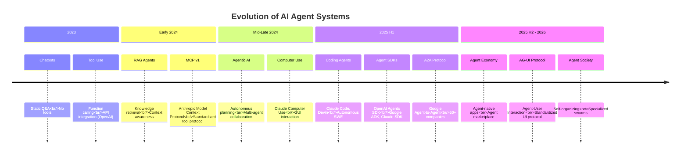
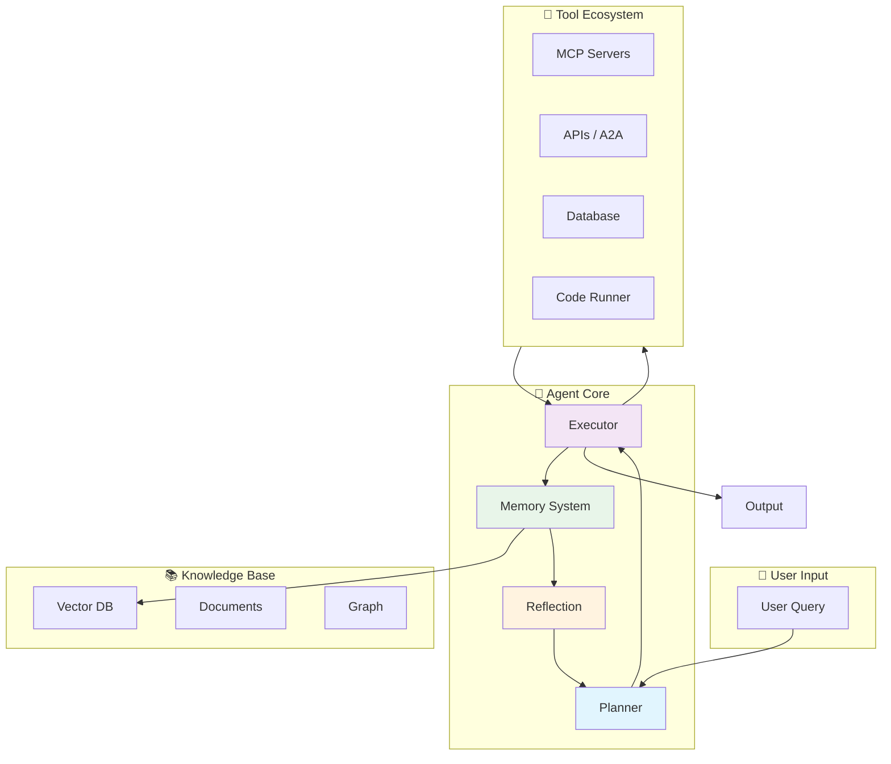

# AI Agent Systems

> **"The future of AI is not just conversation—it's action."**

AI Agents represent the evolution from passive chatbots to autonomous systems that can reason, plan, use tools, and complete complex multi-step tasks. This chapter covers everything from foundational concepts to production deployment, updated for 2025-2026 developments.

## What Are AI Agents?

| Component | Description | Example |
|-----------|-------------|---------|
| **Model (Brain)** | Core reasoning and decision-making engine | GPT-4o, Claude 4, Gemini 2.5 |
| **Prompt (Instruction)** | System behavior and task guidance | "You are a helpful research assistant..." |
| **Memory** | Context, history, and knowledge retrieval | Conversation history, RAG, Vector DB |
| **Tools** | Capabilities to interact with the world | MCP, APIs, databases, code execution |
| **Planning** | Breaking down complex tasks into steps | "Search → Analyze → Write → Review" |

### The Core Formula

```
Agent = Model (Brain) + Prompt (Instruction) + Memory (RAG/Context)
         + Tools (MCP) + Planning (Architecture)
```

### Why Agents Matter

| Traditional LLM | AI Agent |
|----------------|----------|
| **Passive** - Only generates text | **Active** - Takes actions in the world |
| **One-shot** - Single response | **Multi-step** - Plans and executes workflows |
| **Limited** - Training knowledge only | **Extended** - Real-time data via tools |
| **Static** - No state persistence | **Stateful** - Memory and learning |

---

## Evolution Timeline



### The Agentic Spectrum

```
Passive Chat → Tool-Using → Task-Planning → Coding Agent → Multi-Agent → Autonomous Society
     ↓             ↓              ↓              ↓             ↓              ↓
   Q&A Only     Functions     Workflows     SWE-bench     A2A/AG-UI    Self-Organizing
```

---

## Agent Architecture Overview



---

## Chapter Roadmap

This chapter is structured by the chronological evolution of agent technology:

### 1. [Core Concepts](/docs/ai/agents/01-introduction) - Foundations
- **What makes something an "Agent"?**
- The evolution from chatbots to autonomous systems
- Core capabilities: Perception, Reasoning, Action, Reflection
- When to use agents vs. traditional automation

### 2. [Architecture](/docs/ai/agents/02-architecture) - Building Blocks
- **The Agent Loop**: Observe → Reason → Act → Observe
- **Memory Systems**: Buffer, Summary, Vector, Entity, Episodic
- **Tool Systems**: MCP v2, Function Calling, Error Handling
- **Planning**: Task decomposition, Re-planning, Goal-directed

### 3. [Design Patterns](/docs/ai/agents/03-design-patterns) - Proven Solutions
- **Single-Agent Patterns**: ReAct, Reflection, Self-Consistency
- **Multi-Agent Patterns**: Supervisor, Hierarchical, Debate
- **Router Pattern**: Query classification and routing
- **Advanced Patterns**: Plan-and-Execute, LATS

### 4. [Frameworks & SDK](/docs/ai/agents/04-frameworks) - Tech Stack
- **Official SDKs**: OpenAI Agents SDK, Google ADK, Claude Agent SDK
- **Framework Comparison**: LangChain, LangGraph, Semantic Kernel, AutoGen
- **Spring AI**: Building production agents with Java
- **Developer Tools**: LangSmith, Arize Phoenix, PromptLayer

### 5. [Coding Agents](/docs/ai/agents/05-coding-agents) - Software Engineering Agents
- **Claude Code**: CLI-based coding agent (Anthropic)
- **Devin**: Autonomous AI software engineer (Cognition)
- **AI IDEs**: Cursor, Windsurf, Augment
- **Open Source**: OpenHands, SWE-Agent
- **Benchmarks**: SWE-bench, SWE-bench Verified

### 6. [Computer Use & GUI Agents](/docs/ai/agents/06-computer-use) - Screen Interaction
- **Claude Computer Use**: Anthropic's screen interaction agent
- **OpenAI Operator**: Web browsing agent
- **GUI Agent Architecture**: Screenshot → Accessibility Tree → Action
- **Safety & Sandbox**: Isolated execution environments

### 7. [Multi-Agent & A2A](/docs/ai/agents/07-multi-agent) - Agent Collaboration
- **A2A Protocol**: Google Agent-to-Agent (2025)
- **AG-UI Protocol**: Agent-User Interaction standard
- **Agent Society**: Self-organizing multi-agent systems
- **W3C ANP**: Agent Network Protocol standardization

### 8. [Evaluation & Benchmarks](/docs/ai/agents/08-evaluation) - Measuring Performance
- **SWE-bench**: Software engineering benchmarks
- **WebArena / OSWorld**: GUI and OS interaction benchmarks
- **GAIA / AgentBench**: General agent evaluation
- **LLM-as-a-Judge**: Automated quality assessment

### 9. [Engineering](/docs/ai/agents/09-engineering) - Production Readiness
- **Evaluation**: Metrics, testing frameworks
- **Challenges**: Hallucination, infinite loops, cost control
- **Security**: Prompt injection, access control, HITL
- **Deployment**: Docker, observability, A/B testing

### 10. [Frontier](/docs/ai/agents/10-frontier) - Future Trends
- **Agent Economy**: Agent-native applications
- **Self-Evolving Agents**: Long-term learning and adaptation
- **Emerging Directions**: Embodied agents, agent marketplace
- **Challenges & Opportunities**: The road ahead

---

## Key Technologies (2025-2026)

| Technology | Role | Status |
|------------|------|--------|
| **OpenAI Agents SDK** | Official Python agent framework | Released 2025 |
| **Google ADK** | Agent Development Kit | Released 2025 |
| **Claude Agent SDK** | Anthropic's agent framework | Released 2025 |
| **A2A Protocol** | Agent-to-Agent communication | Google, 2025 |
| **AG-UI Protocol** | Agent-User Interaction | CopilotKit, 2025 |
| **MCP v2** | Standardized tool protocol | Anthropic, 2025 |
| **Claude Code** | CLI coding agent | Anthropic, 2025 |
| **Spring AI** | Java framework for agents | Enterprise-ready |
| **Vector DB** | Semantic memory | Pinecone, Weaviate, pgvector |
| **LangGraph** | Multi-agent workflows | Stateful orchestration |

---

## When to Use Agents

### ✅ Good Use Cases

- **Research & Analysis**: Multi-step information gathering and synthesis
- **Content Creation**: Writing with research, review, and revision cycles
- **Code Tasks**: Debugging, refactoring, documentation generation
- **Data Operations**: ETL workflows, data analysis, reporting
- **Customer Service**: Complex queries requiring multiple systems

### ❌ Avoid Agents For

- **Simple CRUD**: Traditional APIs are faster and cheaper
- **Predictable Workflows**: Hard-coded logic is more reliable
- **Real-time Requirements**: LLM latency is too high
- **Strict Determinism**: Agents are non-deterministic by nature
- **Cost-Sensitive**: High token usage vs. simple scripts

---

## Prerequisites

Before diving into agents, make sure you're comfortable with:

1. **LLM Fundamentals** ([Module 01](/docs/ai/llm-fundamentals/))
   - Tokenization, embeddings, inference
   - Model capabilities and limitations

2. **Prompt Engineering** ([Module 02](/docs/ai/prompt-engineering/))
   - System prompts, few-shot learning
   - Structured output, reasoning patterns

3. **RAG** ([Module 03](/docs/ai/rag/))
   - Vector databases, retrieval strategies
   - Context management

4. **MCP** ([Module 05](/docs/ai/mcp/))
   - Tool protocol, server implementation
   - Resources, tools, and prompts

---

## Learning Paths

### For Java/Spring Boot Developers

**Path**: 01 → 02 → 04 (Spring AI focus) → 09

Focus on production-ready Spring Boot agents with MCP integration.

### For AI Engineers

**Path**: 01 → 03 (Design patterns) → 04 → 05 → 07 (Multi-Agent) → 08

Focus on multi-agent systems, evaluation, and advanced patterns.

### For Full-Stack Developers

**Path**: 01 → 04 (SDKs) → 05 (Coding Agents) → 06 (Computer Use) → 09

Focus on Agent SDKs, coding agents, and practical applications.

---

## Common Challenges

| Challenge | Solution | Covered In |
|-----------|----------|------------|
| **Hallucination** | RAG + Verification | Architecture, Engineering |
| **Infinite Loops** | Max iterations + HITL | Architecture |
| **High Cost** | Caching + smaller models | Engineering |
| **Poor Reliability** | Reflection + self-check | Design Patterns |
| **Security Risks** | Prompt injection defense | Engineering |
| **Debugging Difficulty** | Tracing + observability | Frameworks, Engineering |

---

## Production Checklist

Before deploying an agent to production:

- [ ] Clear success/failure criteria defined
- [ ] Comprehensive error handling
- [ ] Human-in-the-loop for sensitive operations
- [ ] Rate limiting and cost controls
- [ ] Audit logging enabled
- [ ] Monitoring and alerting configured
- [ ] Security review completed
- [ ] Load testing performed
- [ ] A/B testing framework ready
- [ ] Rollback plan documented

---

:::tip Get Started
New to agents? Start with **[01 Core Concepts](/docs/ai/agents/01-introduction)** to understand the fundamentals and evolution from chatbots to autonomous systems.
:::

:::info For Developers
Building with the latest SDKs? Jump to **[04 Frameworks & SDK](/docs/ai/agents/04-frameworks)** for OpenAI Agents SDK, Google ADK, and Claude Agent SDK guides.
:::

:::warning Production Readiness
Deploying agents to production requires careful planning. See **[09 Engineering](/docs/ai/agents/09-engineering)** for evaluation, security, and deployment best practices.
:::
