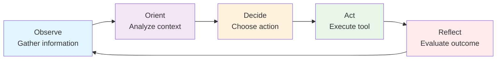
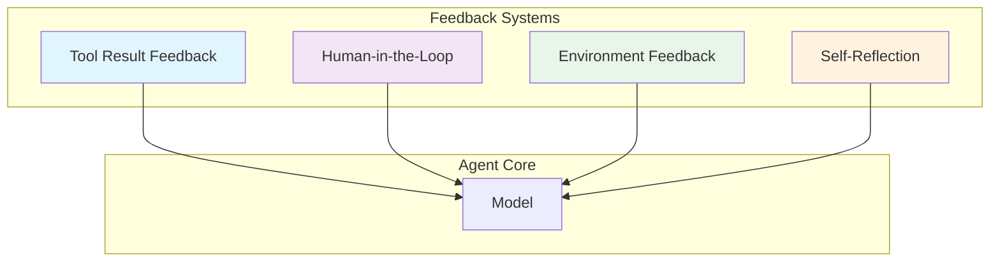
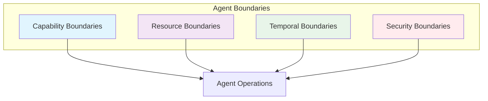

# 1. Core Concepts

> **"The difference between a toy agent and a production agent is the quality of its control systems."**

Harness engineering is built on three foundational concepts: **control loops**, **feedback systems**, and **agent boundaries**. These concepts work together to create reliable, predictable, and safe agent behavior.

---

## 1.1 Control Loops

### The OODA Loop for Agents

Control loops are the fundamental feedback mechanism that enables agents to operate autonomously while staying aligned with goals.



#### Observe (感知)

**What the agent perceives:**
- User input and intent
- Current task state
- Available tools and capabilities
- Environmental context (time, resources, constraints)

**Implementation:**

```java
@Service
public class ObservationService {

    @Autowired
    private ToolRegistry toolRegistry;

    public AgentObservation observe(AgentContext context) {
        return AgentObservation.builder()
            .userInput(context.getUserInput())
            .currentTask(context.getCurrentTask())
            .availableTools(toolRegistry.getAvailableTools())
            .resourceStatus(checkResources())
            .timeConstraints(getTimeConstraints())
            .build();
    }

    private ResourceStatus checkResources() {
        return ResourceStatus.builder()
            .tokensRemaining(quotas.getRemainingTokens())
            .apiLimits(quotas.getApiLimits())
            .toolAvailability(toolRegistry.checkAvailability())
            .build();
    }
}
```

#### Orient (定向)

**How the agent interprets observations:**
- Compare current state to goal state
- Identify gaps and obstacles
- Assess risks and constraints
- Prioritize next actions

**Implementation:**

```java
@Service
public class OrientationService {

    @Autowired
    private ChatClient chatClient;

    public Orientation orient(AgentObservation observation) {
        String analysis = chatClient.prompt()
            .system("""
                You are an agent orientation system.
                Analyze the current situation and provide:
                1. Current state assessment
                2. Gap analysis (current vs. goal)
                3. Identified obstacles
                4. Risk assessment
                5. Recommended focus areas
                """)
            .user("""
                User Input: {input}
                Current Task: {task}
                Available Tools: {tools}
                Resource Status: {resources}
                """.formatted(
                    observation.getUserInput(),
                    observation.getCurrentTask(),
                    observation.getAvailableTools(),
                    observation.getResourceStatus()
                ))
            .call()
            .content();

        return parseOrientation(analysis);
    }
}
```

#### Decide (决策)

**Choosing the next action:**
- Select appropriate tool(s)
- Plan execution order
- Allocate resources
- Set success criteria

**Implementation:**

```java
@Service
public class DecisionService {

    @Autowired
    private ChatClient chatClient;

    public AgentDecision decide(Orientation orientation) {
        String decision = chatClient.prompt()
            .system("""
                You are an agent decision system.
                Based on the orientation, decide:
                1. Which tool(s) to use
                2. Execution order (if multiple tools)
                3. Resource allocation
                4. Success criteria
                5. Fallback conditions
                """)
            .user("""
                Orientation: {orientation}
                Available Tools: {tools}
                """.formatted(
                    orientation,
                    orientation.getAvailableTools()
                ))
            .call()
            .content();

        return parseDecision(decision);
    }
}
```

#### Act (行动)

**Executing the decision:**
- Invoke selected tools
- Handle tool responses
- Update state
- Capture results

**Implementation:**

```java
@Service
public class ActionService {

    @Autowired
    private ToolExecutor toolExecutor;

    @Autowired
    private StateManager stateManager;

    public ActionResult act(AgentDecision decision) {
        List<ToolResult> results = new ArrayList<>();

        for (ToolCall call : decision.getToolCalls()) {
            try {
                ToolResult result = toolExecutor.execute(call);
                results.add(result);

                // Update state after each tool call
                stateManager.updateState(result);

            } catch (ToolExecutionException e) {
                return ActionResult.failed(results, e);
            }
        }

        return ActionResult.success(results);
    }
}
```

#### Reflect (反思)

**Evaluating the outcome:**
- Compare outcome to success criteria
- Identify errors or unexpected results
- Determine if goal is achieved
- Decide next iteration

**Implementation:**

```java
@Service
public class ReflectionService {

    @Autowired
    private ChatClient chatClient;

    public Reflection reflect(ActionResult result, AgentDecision decision) {
        String reflection = chatClient.prompt()
            .system("""
                You are an agent reflection system.
                Evaluate the action results:
                1. Did we achieve the success criteria?
                2. Are there any errors or unexpected results?
                3. Is the goal complete?
                4. What should we do next?
                """)
            .user("""
                Decision: {decision}
                Success Criteria: {criteria}
                Results: {results}
                """.formatted(
                    decision,
                    decision.getSuccessCriteria(),
                    result.getResults()
                ))
            .call()
            .content();

        return parseReflection(reflection);
    }
}
```

### The Complete Control Loop

```java
@Service
public class ControlLoopService {

    @Autowired
    private ObservationService observationService;

    @Autowired
    private OrientationService orientationService;

    @Autowired
    private DecisionService decisionService;

    @Autowired
    private ActionService actionService;

    @Autowired
    private ReflectionService reflectionService;

    private static final int MAX_ITERATIONS = 10;

    public AgentResult execute(AgentContext context) {
        for (int i = 0; i < MAX_ITERATIONS; i++) {
            // Observe
            AgentObservation observation = observationService.observe(context);

            // Orient
            Orientation orientation = orientationService.orient(observation);

            // Decide
            AgentDecision decision = decisionService.decide(orientation);

            // Act
            ActionResult result = actionService.act(decision);

            // Reflect
            Reflection reflection = reflectionService.reflect(result, decision);

            // Check if goal achieved
            if (reflection.isGoalAchieved()) {
                return AgentResult.success(result.getOutput());
            }

            // Update context for next iteration
            context = context.update(result);
        }

        return AgentResult.incomplete("Max iterations reached");
    }
}
```

---

## 1.2 Feedback Systems

Feedback systems provide the information agents need to correct course and improve performance.

### Types of Feedback



#### 1. Tool Result Feedback

**Immediate feedback from tool execution:**

| Feedback Type | Description | Agent Response |
|---------------|-------------|----------------|
| **Success** | Tool executed successfully | Use result in next step |
| **Partial Success** | Tool returned partial data | Decide if sufficient or retry |
| **Failure** | Tool error or timeout | Retry with fallback or skip |
| **Unexpected** | Unexpected result format | Re-interpret or ask for help |

**Implementation:**

```java
@Service
public class ToolFeedbackService {

    public ToolFeedback processFeedback(ToolResult result) {
        ToolFeedback feedback = ToolFeedback.builder()
            .status(result.getStatus())
            .data(result.getData())
            .errors(result.getErrors())
            .metadata(result.getMetadata())
            .build();

        // Analyze feedback quality
        if (feedback.hasErrors()) {
            feedback.setRecommendedAction(
                determineRecoveryAction(feedback)
            );
        }

        if (feedback.isPartial()) {
            feedback.setRecommendedAction(
                Action.RETRY_WITH_ADJUSTMENT
            );
        }

        return feedback;
    }

    private Action determineRecoveryAction(ToolFeedback feedback) {
        if (feedback.isTimeout()) {
            return Action.RETRY_WITH_LONGER_TIMEOUT;
        }

        if (feedback.isRateLimited()) {
            return Action.WAIT_AND_RETRY;
        }

        if (feedback.isAuthenticationError()) {
            return Action.REFRESH_CREDENTIALS;
        }

        return Action.SKIP_AND_CONTINUE;
    }
}
```

#### 2. Human-in-the-Loop Feedback

**Incorporating human guidance:**

```java
@Service
public class HumanFeedbackService {

    @Autowired
    private FeedbackQueue feedbackQueue;

    public Optional<HumanFeedback> requestFeedback(
        AgentContext context,
        FeedbackRequest request
    ) {
        // Check if human intervention is needed
        if (!requiresHumanFeedback(context, request)) {
            return Optional.empty();
        }

        // Submit feedback request
        String feedbackId = feedbackQueue.submit(request);

        // Wait for response (with timeout)
        return feedbackQueue.waitForResponse(feedbackId, Duration.ofMinutes(5));
    }

    private boolean requiresHumanFeedback(
        AgentContext context,
        FeedbackRequest request
    ) {
        // Require feedback for:
        // - Sensitive operations
        // - High-stakes decisions
        // - Ambiguous situations
        // - After N failures

        return context.getSensitivityLevel() == Sensitivity.HIGH
            || context.getFailureCount() >= 3
            || request.getAmbiguityScore() > 0.7;
    }
}
```

**Feedback Request UI:**

```typescript
// Next.js: Human Feedback Interface
interface FeedbackRequest {
  agentId: string;
  context: string;
  question: string;
  options?: string[];
  urgency: 'low' | 'medium' | 'high';
}

export function FeedbackPanel({ request }: { request: FeedbackRequest }) {
  const [response, setResponse] = useState<string>('');
  const [submitting, setSubmitting] = useState(false);

  const handleSubmit = async () => {
    setSubmitting(true);
    await fetch('/api/agent/feedback', {
      method: 'POST',
      body: JSON.stringify({
        requestId: request.id,
        response,
      }),
    });
    setSubmitting(false);
  };

  return (
    <div className="feedback-panel">
      <h3>Agent Needs Your Input</h3>
      <p>{request.question}</p>

      {request.options ? (
        <div className="feedback-options">
          {request.options.map(option => (
            <button
              key={option}
              onClick={() => setResponse(option)}
              className={response === option ? 'selected' : ''}
            >
              {option}
            </button>
          ))}
        </div>
      ) : (
        <textarea
          value={response}
          onChange={e => setResponse(e.target.value)}
          placeholder="Provide guidance..."
        />
      )}

      <button
        onClick={handleSubmit}
        disabled={submitting || !response}
      >
        {submitting ? 'Submitting...' : 'Submit Feedback'}
      </button>
    </div>
  );
}
```

#### 3. Environment Feedback

**Signals from the operational environment:**

```java
@Service
public class EnvironmentFeedbackService {

    public EnvironmentFeedback gatherFeedback() {
        return EnvironmentFeedback.builder()
            .systemLoad(getSystemLoad())
            .networkLatency(getNetworkLatency())
            .apiQuotas(getApiQuotas())
            .errorRates(getErrorRates())
            .costAccumulated(getCostAccumulated())
            .build();
    }

    public boolean shouldAdjustStrategy(EnvironmentFeedback feedback) {
        return feedback.getSystemLoad() > 0.8
            || feedback.getErrorRate() > 0.1
            || feedback.getCostAccumulated() > getBudgetThreshold();
    }
}
```

#### 4. Self-Reflection Feedback

**Agent's own assessment of its performance:**

```java
@Service
public class SelfReflectionService {

    @Autowired
    private ChatClient chatClient;

    public SelfReflection reflect(AgentContext context, ActionResult result) {
        String reflection = chatClient.prompt()
            .system("""
                You are a self-reflective agent.
                Analyze your performance:
                1. Did you achieve the goal?
                2. What worked well?
                3. What could be improved?
                4. What would you do differently?
                """)
            .user("""
                Goal: {goal}
                Actions Taken: {actions}
                Results: {results}
                """.formatted(
                    context.getGoal(),
                    context.getActionsTaken(),
                    result.getOutputs()
                ))
            .call()
            .content();

        return SelfReflection.builder()
            .goalAchieved(extractGoalAchieved(reflection))
            .whatWorked(extractWhatWorked(reflection))
            .whatCouldBeImproved(extractWhatCouldBeImproved(reflection))
            .alternativeApproach(extractAlternativeApproach(reflection))
            .build();
    }
}
```

---

## 1.3 Agent Boundaries

Boundaries define what agents can and cannot do, ensuring safe and predictable operation.

### Types of Boundaries



#### 1. Capability Boundaries

**Define what the agent can and cannot do:**

```java
@Service
public class CapabilityBoundaryService {

    private final Set<String> allowedTools;
    private final Set<String> allowedOperations;

    public CapabilityBoundaryService() {
        this.allowedTools = Set.of(
            "web_search",
            "database_query",
            "file_read",
            "file_write"
        );

        this.allowedOperations = Set.of(
            "read",
            "write",
            "search",
            "analyze"
        );
    }

    public boolean canExecuteTool(String toolName) {
        if (!allowedTools.contains(toolName)) {
            log.warn("Tool not in allowlist: {}", toolName);
            return false;
        }
        return true;
    }

    public boolean canPerformOperation(String operation) {
        if (!allowedOperations.contains(operation)) {
            log.warn("Operation not allowed: {}", operation);
            return false;
        }
        return true;
    }

    public void validateAction(ToolCall call) {
        if (!canExecuteTool(call.getToolName())) {
            throw new CapabilityBoundaryException(
                "Tool not allowed: " + call.getToolName()
            );
        }

        if (!canPerformOperation(call.getOperation())) {
            throw new CapabilityBoundaryException(
                "Operation not allowed: " + call.getOperation()
            );
        }
    }
}
```

#### 2. Resource Boundaries

**Limit resource consumption:**

```java
@Service
public class ResourceBoundaryService {

    private final int maxTokensPerTask;
    private final int maxToolCallsPerTask;
    private final Duration maxExecutionTime;
    private final BigDecimal maxCostPerTask;

    public ResourceBoundary checkLimits(AgentContext context) {
        ResourceBoundary boundary = ResourceBoundary.builder()
            .tokensRemaining(
                maxTokensPerTask - context.getTokensUsed()
            )
            .toolCallsRemaining(
                maxToolCallsPerTask - context.getToolCalls()
            )
            .timeRemaining(
                maxExecutionTime.minus(
                    Duration.between(
                        context.getStartTime(),
                        Instant.now()
                    )
                )
            )
            .costRemaining(
                maxCostPerTask.subtract(context.getCostIncurred())
            )
            .build();

        if (boundary.anyLimitExceeded()) {
            throw new ResourceBoundaryException(
                "Resource limit exceeded: " +
                boundary.getExceededLimits()
            );
        }

        return boundary;
    }
}
```

#### 3. Temporal Boundaries

**Control how long agents can run:**

```java
@Service
public class TemporalBoundaryService {

    private final Duration maxExecutionTime;
    private final Duration maxToolTimeout;
    private final LocalTime workingHoursStart;
    private final LocalTime workingHoursEnd;

    public boolean canExecute(AgentContext context) {
        // Check maximum execution time
        Duration elapsed = Duration.between(
            context.getStartTime(),
            Instant.now()
        );

        if (elapsed.compareTo(maxExecutionTime) > 0) {
            log.warn("Maximum execution time exceeded");
            return false;
        }

        // Check working hours (if configured)
        if (workingHoursStart != null && workingHoursEnd != null) {
            LocalTime now = LocalTime.now();
            if (now.isBefore(workingHoursStart) ||
                now.isAfter(workingHoursEnd)) {
                log.warn("Outside working hours");
                return false;
            }
        }

        return true;
    }

    public Duration getToolTimeout(String toolName) {
        // Tool-specific timeouts
        if (toolName.equals("web_search")) {
            return Duration.ofSeconds(30);
        } else if (toolName.equals("database_query")) {
            return Duration.ofSeconds(10);
        }
        return maxToolTimeout;
    }
}
```

#### 4. Security Boundaries

**Enforce security constraints:**

```java
@Service
public class SecurityBoundaryService {

    @Autowired
    private PermissionService permissionService;

    @Autowired
    private InputSanitizer inputSanitizer;

    public void validateToolCall(
        String userId,
        ToolCall call
    ) {
        // Check user permissions
        if (!permissionService.hasPermission(
            userId,
            call.getToolName()
        )) {
            throw new SecurityException(
                "User not authorized for tool: " +
                call.getToolName()
            );
        }

        // Sanitize inputs
        String sanitizedInput = inputSanitizer.sanitize(
            call.getInput()
        );

        if (sanitizedInput == null) {
            throw new SecurityException(
                "Input validation failed"
            );
        }

        // Check for sensitive operations
        if (call.isSensitive()) {
            requireApproval(userId, call);
        }
    }

    private void requireApproval(String userId, ToolCall call) {
        ApprovalRequest request = ApprovalRequest.builder()
            .userId(userId)
            .toolName(call.getToolName())
            .operation(call.getOperation())
            .build();

        approvalService.requestApproval(request);
    }
}
```

### Boundary Enforcement

```java
@Service
public class BoundaryEnforcementService {

    @Autowired
    private CapabilityBoundaryService capabilityBoundary;

    @Autowired
    private ResourceBoundaryService resourceBoundary;

    @Autowired
    private TemporalBoundaryService temporalBoundary;

    @Autowired
    private SecurityBoundaryService securityBoundary;

    public void enforceBoundaries(
        String userId,
        AgentContext context,
        ToolCall call
    ) {
        // Check all boundaries before execution

        // 1. Capability boundaries
        capabilityBoundary.validateAction(call);

        // 2. Resource boundaries
        resourceBoundary.checkLimits(context);

        // 3. Temporal boundaries
        if (!temporalBoundary.canExecute(context)) {
            throw new TemporalBoundaryException(
                "Temporal boundary exceeded"
            );
        }

        // 4. Security boundaries
        securityBoundary.validateToolCall(userId, call);
    }
}
```

---

## 1.4 Key Takeaways

### Control Loops

1. **OODA Loop**: Observe → Orient → Decide → Act → Reflect
2. **Continuous Feedback**: Each loop iteration improves decisions
3. **Self-Correction**: Reflection enables autonomous adjustment

### Feedback Systems

| Type | Source | Purpose |
|------|--------|---------|
| **Tool Result** | Tool execution | Immediate error correction |
| **Human-in-the-Loop** | Human guidance | Handle ambiguity |
| **Environment** | System signals | Adapt to conditions |
| **Self-Reflection** | Agent assessment | Improve performance |

### Agent Boundaries

- **Capability**: What the agent can do
- **Resource**: Limits on consumption
- **Temporal**: Time-based constraints
- **Security**: Access and approval controls

### Production Pattern

```java
// Complete control loop with boundaries
for (int i = 0; i < MAX_ITERATIONS; i++) {
    // Enforce boundaries
    boundaryEnforcement.enforceBoundaries(userId, context, action);

    // Execute control loop
    Observation observation = observe(context);
    Orientation orientation = orient(observation);
    Decision decision = decide(orientation);
    ActionResult result = act(decision);
    Reflection reflection = reflect(result, decision);

    // Check for completion
    if (reflection.isGoalAchieved()) {
        return result;
    }
}
```

---

## 1.5 Next Steps

**Continue your journey:**
- → **[2. Tool Orchestration](../orchestration)** - Managing tool execution at scale
- → **[3. State Management](../state-management)** - Persisting and recovering agent state

---

:::tip Control Loops Are Fundamental
Every production agent needs a control loop. Start with a simple ReAct loop, then add feedback and boundaries as needed.
:::

:::warning Don't Skip Boundaries
Without proper boundaries, agents will exceed budgets, get stuck in loops, and create security risks. Always implement boundaries before scaling.
:::

:::info Feedback Quality Matters
High-quality feedback enables better decisions. Invest in comprehensive tracing and logging to improve feedback signals.
:::
