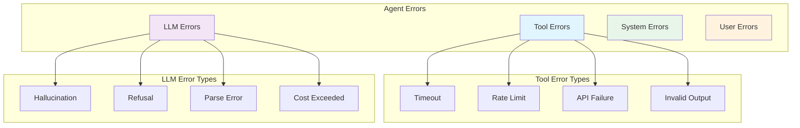

# 4. Error Handling & Recovery

> **"In production, errors are not exceptions—they're expected. The quality of error handling determines agent reliability."**

Error handling is the most critical aspect of harness engineering. Unlike traditional software where errors are exceptional, agent systems must handle errors as a normal part of operation. Tools fail, LLMs hallucinate, and networks timeout—your harness must handle all of these gracefully.

---

## 4.1 Error Classification

### Error Taxonomy



### Recoverable vs Non-Recoverable

```java
public enum ErrorRecoverability {
    RECOVERABLE,      // Can retry with same or modified input
    CONDITIONAL,      // Recoverable with changes
    FATAL            // Cannot recover, must fail
}

public enum ErrorCategory {
    TOOL_TIMEOUT(ErrorRecoverability.RECOVERABLE),
    TOOL_RATE_LIMIT(ErrorRecoverability.RECOVERABLE),
    TOOL_API_FAILURE(ErrorRecoverability.CONDITIONAL),
    TOOL_INVALID_OUTPUT(ErrorRecoverability.CONDITIONAL),

    LLM_HALLUCINATION(ErrorRecoverability.RECOVERABLE),
    LLM_REFUSAL(ErrorRecoverability.CONDITIONAL),
    LLM_PARSE_ERROR(ErrorRecoverability.RECOVERABLE),
    LLM_COST_EXCEEDED(ErrorRecoverability.FATAL),

    SYSTEM_OUT_OF_MEMORY(ErrorRecoverability.FATAL),
    SYSTEM_DISK_FULL(ErrorRecoverability.FATAL),

    USER_INVALID_INPUT(ErrorRecoverability.CONDITIONAL),
    USER_CANCELLED(ErrorRecoverability.FATAL);

    private final ErrorRecoverability recoverability;

    ErrorCategory(ErrorRecoverability recoverability) {
        this.recoverability = recoverability;
    }

    public ErrorRecoverability getRecoverability() {
        return recoverability;
    }
}
```

### Error Classification Service

```java
@Service
public class ErrorClassificationService {

    public ErrorClassification classify(Throwable error) {
        // Tool errors
        if (error instanceof ToolTimeoutException) {
            return ErrorClassification.builder()
                .category(ErrorCategory.TOOL_TIMEOUT)
                .recoverability(ErrorRecoverability.RECOVERABLE)
                .suggestedAction(ErrorAction.RETRY)
                .retryDelay(Duration.ofSeconds(5))
                .build();
        }

        if (error instanceof ToolRateLimitException) {
            return ErrorClassification.builder()
                .category(ErrorCategory.TOOL_RATE_LIMIT)
                .recoverability(ErrorRecoverability.RECOVERABLE)
                .suggestedAction(ErrorAction.WAIT_AND_RETRY)
                .retryDelay(Duration.ofMinutes(1))
                .build();
        }

        if (error instanceof ToolApiException) {
            ToolApiException apiError = (ToolApiException) error;

            if (apiError.getStatusCode() == 500) {
                return ErrorClassification.builder()
                    .category(ErrorCategory.TOOL_API_FAILURE)
                    .recoverability(ErrorRecoverability.RECOVERABLE)
                    .suggestedAction(ErrorAction.RETRY)
                    .retryDelay(Duration.ofSeconds(10))
                    .build();
            }

            if (apiError.getStatusCode() == 401) {
                return ErrorClassification.builder()
                    .category(ErrorCategory.TOOL_API_FAILURE)
                    .recoverability(ErrorRecoverability.FATAL)
                    .suggestedAction(ErrorAction.FAIL)
                    .message("Authentication failed, cannot recover")
                    .build();
            }
        }

        // LLM errors
        if (error instanceof LLMHallucinationException) {
            return ErrorClassification.builder()
                .category(ErrorCategory.LLM_HALLUCINATION)
                .recoverability(ErrorRecoverability.RECOVERABLE)
                .suggestedAction(ErrorAction.REFINE_AND_RETRY)
                .build();
        }

        if (error instanceof TokenLimitExceededException) {
            return ErrorClassification.builder()
                .category(ErrorCategory.LLM_COST_EXCEEDED)
                .recoverability(ErrorRecoverability.FATAL)
                .suggestedAction(ErrorAction.FAIL)
                .message("Token budget exceeded")
                .build();
        }

        // System errors
        if (error instanceof OutOfMemoryError) {
            return ErrorClassification.builder()
                .category(ErrorCategory.SYSTEM_OUT_OF_MEMORY)
                .recoverability(ErrorRecoverability.FATAL)
                .suggestedAction(ErrorAction.FAIL)
                .message("System out of memory")
                .build();
        }

        // Default
        return ErrorClassification.builder()
            .category(ErrorCategory.UNKNOWN)
            .recoverability(ErrorRecoverability.CONDITIONAL)
            .suggestedAction(ErrorAction.ESCALATE)
            .message("Unknown error type")
            .build();
    }
}
```

---

## 4.2 Recovery Strategies

### Retry with Backoff

```java
@Service
public class RetryWithBackoffService {

    private static final int MAX_RETRIES = 3;
    private static final Duration INITIAL_DELAY = Duration.ofSeconds(1);

    public <T> T executeWithRetry(
        Supplier<T> operation,
        ErrorClassification classification
    ) {
        int attempt = 0;
        Duration delay = INITIAL_DELAY;

        while (attempt < MAX_RETRIES) {
            try {
                return operation.get();

            } catch (Exception e) {
                attempt++;

                if (attempt >= MAX_RETRIES) {
                    throw new MaxRetriesExceededException(
                        "Max retries exceeded: " + MAX_RETRIES,
                        e
                    );
                }

                ErrorClassification errorClass = classify(e);

                if (errorClass.getRecoverability() ==
                    ErrorRecoverability.FATAL) {
                    throw e; // Don't retry fatal errors
                }

                log.warn(
                    "Operation failed (attempt {}/{}), retrying in {}: {}",
                    attempt,
                    MAX_RETRIES,
                    delay,
                    e.getMessage()
                );

                try {
                    Thread.sleep(delay.toMillis());
                } catch (InterruptedException ex) {
                    Thread.currentThread().interrupt();
                    throw new RuntimeException("Interrupted during retry delay", ex);
                }

                // Exponential backoff
                delay = delay.multipliedBy(2);
            }
        }

        throw new IllegalStateException("Should not reach here");
    }
}
```

### Fallback Mechanisms

```java
@Service
public class FallbackService {

    private final Map<String, List<Supplier<Object>>> fallbacks =
        new ConcurrentHashMap<>();

    public void registerFallback(
        String operation,
        List<Supplier<Object>> fallbackProviders
    ) {
        fallbacks.put(operation, fallbackProviders);
    }

    public <T> T executeWithFallback(
        String operation,
        Supplier<T> primary
    ) {
        try {
            return primary.get();

        } catch (Exception e) {
            log.warn("Primary operation failed: {}", operation);

            List<Supplier<Object>> providers =
                fallbacks.get(operation);

            if (providers == null || providers.isEmpty()) {
                throw e; // No fallback available
            }

            // Try each fallback in order
            for (Supplier<Object> fallback : providers) {
                try {
                    @SuppressWarnings("unchecked")
                    T result = (T) fallback.get();
                    log.info("Fallback succeeded for: {}", operation);
                    return result;

                } catch (Exception fallbackError) {
                    log.warn("Fallback failed: {}", operation, fallbackError);
                }
            }

            throw new AllFallbacksFailedException(
                "All fallbacks failed for: " + operation,
                e
            );
        }
    }

    // Example: Tool fallbacks
    @PostConstruct
    public void registerToolFallbacks() {
        // Web search fallbacks
        registerFallback("web_search", List.of(
            () -> searchWithBackupProvider(),
            () -> searchWithCachedResults(),
            () -> askUserForClarification()
        ));

        // Database fallbacks
        registerFallback("database_query", List.of(
            () -> queryWithReadReplica(),
            () -> queryWithCache(),
            () -> returnEmptyResult()
        ));
    }
}
```

### Graceful Degradation

```java
@Service
public class GracefulDegradationService {

    public <T> DegradedResult<T> executeWithDegradation(
        Supplier<T> fullOperation,
        Supplier<T> degradedOperation
    ) {
        try {
            // Try full operation
            T result = fullOperation.get();
            return DegradedResult.full(result);

        } catch (Exception e) {
            log.warn("Full operation failed, degrading: {}", e.getMessage());

            try {
                // Fall back to degraded operation
                T degradedResult = degradedOperation.get();
                return DegradedResult.degraded(degradedResult);

            } catch (Exception degradedError) {
                log.error("Degraded operation also failed", degradedError);
                return DegradedResult.failed(degradedError);
            }
        }
    }

    @Getter
    public static class DegradedResult<T> {
        private final T result;
        private final QualityLevel quality;
        private final Exception error;

        public enum QualityLevel {
            FULL,       // All features available
            DEGRADED,   // Reduced features
            FAILED      // Operation failed
        }

        private DegradedResult(T result, QualityLevel quality, Exception error) {
            this.result = result;
            this.quality = quality;
            this.error = error;
        }

        public static <T> DegradedResult<T> full(T result) {
            return new DegradedResult<>(result, QualityLevel.FULL, null);
        }

        public static <T> DegradedResult<T> degraded(T result) {
            return new DegradedResult<>(result, QualityLevel.DEGRADED, null);
        }

        public static <T> DegradedResult<T> failed(Exception error) {
            return new DegradedResult<>(null, QualityLevel.FAILED, error);
        }
    }
}
```

---

## 4.3 Loop Prevention

### Infinite Loop Detection

```java
@Service
public class LoopPreventionService {

    private static final int MAX_ITERATIONS = 10;
    private static final int MAX_REPEAT_ACTIONS = 3;

    public boolean isInLoop(
        AgentContext context,
        String currentAction
    ) {
        // Check iteration count
        if (context.getIterationCount() >= MAX_ITERATIONS) {
            log.warn("Max iterations exceeded: {}", MAX_ITERATIONS);
            return true;
        }

        // Check for repeated actions
        int repeatCount = countRecentOccurrences(
            context.getActionHistory(),
            currentAction,
            MAX_REPEAT_ACTIONS
        );

        if (repeatCount >= MAX_REPEAT_ACTIONS) {
            log.warn("Action repeated {} times: {}",
                repeatCount, currentAction);
            return true;
        }

        // Check for state cycles
        if (isInStateCycle(context)) {
            log.warn("State cycle detected");
            return true;
        }

        return false;
    }

    private int countRecentOccurrences(
        List<String> history,
        String action,
        int window
    ) {
        int count = 0;
        int start = Math.max(0, history.size() - window);

        for (int i = start; i < history.size(); i++) {
            if (history.get(i).equals(action)) {
                count++;
            }
        }

        return count;
    }

    private boolean isInStateCycle(AgentContext context) {
        List<String> recentStates = context.getStateHistory()
            .stream()
            .skip(Math.max(0, context.getStateHistory().size() - 5))
            .toList();

        // Check if we've seen this state pattern before
        return recentStates.size() >= 3 &&
               recentStates.get(recentStates.size() - 1)
                   .equals(recentStates.get(recentStates.size() - 3));
    }
}
```

### Loop Recovery

```java
@Service
public class LoopRecoveryService {

    @Autowired
    private ChatClient chatClient;

    public RecoveryPlan recoverFromLoop(
        AgentContext context,
        LoopDetection detection
    ) {
        // Ask LLM for recovery strategy
        String recovery = chatClient.prompt()
            .system("""
                You are a loop recovery specialist.
                The agent is stuck in a loop. Suggest a recovery strategy.

                Return JSON:
                {
                    "strategy": "change_goal | add_constraint | ask_help | abort",
                    "reasoning": "explanation",
                    "suggested_action": "what to do next"
                }
                """)
            .user("""
                Current Task: {task}
                Action History: {history}
                Loop Pattern: {pattern}
                """.formatted(
                    context.getCurrentTask(),
                    context.getActionHistory(),
                    detection.getPattern()
                ))
            .call()
            .content();

        return parseRecoveryPlan(recovery);
    }

    public void executeRecovery(
        AgentContext context,
        RecoveryPlan plan
    ) {
        switch (plan.getStrategy()) {
            case CHANGE_GOAL:
                context.setCurrentTask(plan.getSuggestedAction());
                break;

            case ADD_CONSTRAINT:
                context.addConstraint(plan.getSuggestedAction());
                break;

            case ASK_HELP:
                requestHumanAssistance(context, plan);
                break;

            case ABORT:
                context.abort("Loop detected, cannot recover");
                break;
        }
    }

    private void requestHumanAssistance(
        AgentContext context,
        RecoveryPlan plan
    ) {
        HumanInterventionRequest request =
            HumanInterventionRequest.builder()
                .agentId(context.getAgentId())
                .taskId(context.getTaskId())
                .reason("Agent stuck in loop")
                .context(context.getState())
                .suggestedActions(plan.getSuggestedAction())
                .build();

        humanFeedbackService.requestAssistance(request);
    }
}
```

---

## 4.4 Circuit Breakers

### Circuit Breaker Pattern

```java
@Service
public class CircuitBreakerService {

    private final Map<String, CircuitBreaker> breakers =
        new ConcurrentHashMap<>();

    public CircuitBreaker getBreaker(String name) {
        return breakers.computeIfAbsent(
            name,
            k -> new CircuitBreaker(
                threshold = 5,
                timeout = Duration.ofMinutes(1),
                halfOpenAttempts = 3
            )
        );
    }

    public <T> T execute(
        String operation,
        Supplier<T> supplier
    ) {
        CircuitBreaker breaker = getBreaker(operation);

        // Check if circuit is open
        if (breaker.isOpen()) {
            if (breaker.shouldAttemptReset()) {
                breaker.halfOpen();
            } else {
                throw new CircuitOpenException(
                    "Circuit breaker open for: " + operation
                );
            }
        }

        try {
            T result = supplier.get();
            breaker.recordSuccess();
            return result;

        } catch (Exception e) {
            breaker.recordFailure();

            if (breaker.shouldOpen()) {
                log.warn("Circuit breaker opened for: {}", operation);
            }

            throw e;
        }
    }

    @Data
    public static class CircuitBreaker {
        private final int threshold;
        private final Duration timeout;
        private final int halfOpenAttempts;

        private int failureCount = 0;
        private int successCount = 0;
        private Instant lastFailureTime;
        private State state = State.CLOSED;

        public boolean isOpen() {
            return state == State.OPEN;
        }

        public boolean shouldAttemptReset() {
            if (state != State.OPEN) {
                return false;
            }

            return Duration.between(
                lastFailureTime,
                Instant.now()
            ).compareTo(timeout) > 0;
        }

        public void recordSuccess() {
            failureCount = 0;

            if (state == State.HALF_OPEN) {
                successCount++;
                if (successCount >= halfOpenAttempts) {
                    state = State.CLOSED;
                    log.info("Circuit breaker closed");
                }
            }
        }

        public void recordFailure() {
            failureCount++;
            lastFailureTime = Instant.now();

            if (state == State.HALF_OPEN) {
                state = State.OPEN;
                successCount = 0;
            } else if (failureCount >= threshold) {
                state = State.OPEN;
                log.warn("Circuit breaker opened after {} failures",
                    failureCount);
            }
        }

        public boolean shouldOpen() {
            return state == State.OPEN;
        }

        public void halfOpen() {
            state = State.HALF_OPEN;
            successCount = 0;
            log.info("Circuit breaker half-open");
        }

        enum State {
            CLOSED,    // Normal operation
            OPEN,      // Failing, not calling
            HALF_OPEN  // Attempting reset
        }
    }
}
```

### Circuit Breaker Configuration

```java
@Configuration
public class CircuitBreakerConfig {

    @Bean
    public CircuitBreakerService circuitBreakerService() {
        CircuitBreakerService service = new CircuitBreakerService();

        // Configure tool-specific breakers
        service.getBreaker("web_search")
            .setThreshold(3)
            .setTimeout(Duration.ofSeconds(30));

        service.getBreaker("database_query")
            .setThreshold(5)
            .setTimeout(Duration.ofMinutes(1));

        service.getBreaker("llm_call")
            .setThreshold(10)
            .setTimeout(Duration.ofMinutes(5));

        return service;
    }
}
```

---

## 4.5 Error Aggregation

### Collect Error Metrics

```java
@Service
public class ErrorMetricsService {

    @Autowired
    private MeterRegistry meterRegistry;

    public void recordError(
        String operation,
        ErrorClassification classification
    ) {
        // Counter for total errors
        meterRegistry.counter(
            "agent.errors.total",
            "operation", operation,
            "category", classification.getCategory().name(),
            "recoverability", classification.getRecoverability().name()
        ).increment();

        // Gauge for error rate
        meterRegistry.gauge(
            "agent.errors.rate",
            Tags.of(
                "operation", operation,
                "category", classification.getCategory().name()
            ),
            calculateErrorRate(operation)
        );
    }

    private double calculateErrorRate(String operation) {
        // Calculate error rate over last 5 minutes
        // Implementation depends on your metrics storage
        return 0.0;
    }

    public ErrorReport generateErrorReport(
        String operation,
        Duration period
    ) {
        Instant start = Instant.now().minus(period);

        return ErrorReport.builder()
            .operation(operation)
            .period(period)
            .totalErrors(getTotalErrors(operation, start))
            .errorsByCategory(getErrorsByCategory(operation, start))
            .errorsByRecoverability(getErrorsByRecoverability(operation, start))
            .topErrors(getTopErrors(operation, start, 10))
            .errorRate(getErrorRate(operation, period))
            .build();
    }
}
```

---

## 4.6 Key Takeaways

### Error Classification

| Category | Recoverability | Action |
|----------|---------------|--------|
| **Tool Timeout** | Recoverable | Retry with backoff |
| **Rate Limit** | Recoverable | Wait and retry |
| **API Failure** | Conditional | Depends on status code |
| **Hallucination** | Recoverable | Refine and retry |
| **Out of Memory** | Fatal | Fail immediately |

### Recovery Strategies

1. **Retry with Backoff**: For transient errors
2. **Fallback**: Alternative implementations
3. **Graceful Degradation**: Reduced functionality
4. **Circuit Breaker**: Stop calling failing services

### Loop Prevention

- Monitor action history
- Detect repeated patterns
- Check state cycles
- Limit iterations

### Production Checklist

- [ ] Error classification service
- [ ] Retry with exponential backoff
- [ ] Fallback mechanisms
- [ ] Circuit breakers for external services
- [ ] Loop detection and recovery
- [ ] Error metrics and reporting

---

## 4.7 Next Steps

**Continue your journey:**
- → **[5. Observability](../observability)** - Monitoring and tracing
- → **[6. Safety & Guardrails](../safety-guards)** - Constraints and validation

---

:::tip Classify Before Recovering
Not all errors should be retried. Classify errors first to determine the appropriate recovery strategy.
:::

:::warning Circuit Breakers Prevent Cascades
When a dependency is failing, circuit breakers prevent the failure from cascading through your entire system.
:::

:::info Monitor Error Rates
Error rate trends indicate system health. Set up alerts for error rate spikes.
:::
