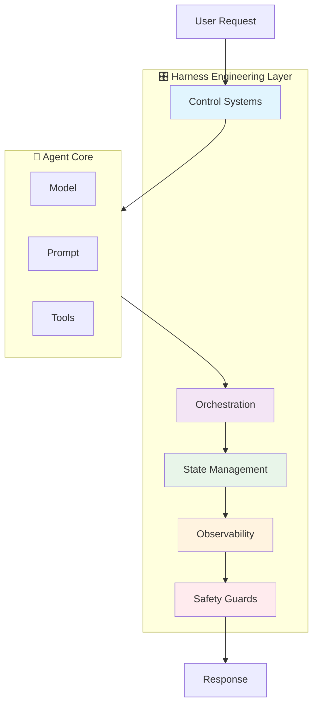
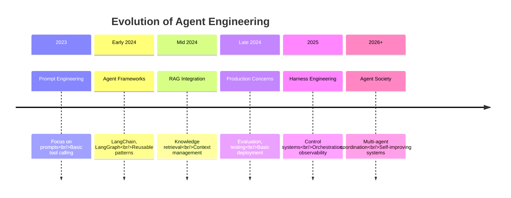

# AI Agent Harness Engineering

> **"The missing architectural layer that determines if AI agents work in production."**

Harness Engineering is an emerging discipline (2025-2026) focused on the **control systems, orchestration, and production infrastructure** that surrounds AI agents. While traditional agent development focuses on prompts and tools, harness engineering ensures agents operate reliably, safely, and observably at scale.

---

## What is Harness Engineering?

### The Definition

**Harness Engineering** encompasses the entire system around the agent:

| Component | Description | Example |
|-----------|-------------|---------|
| **Control Systems** | Feedback loops that guide agent behavior | Tool result validation, reflection cycles |
| **Tool Orchestration** | Managing tool execution at scale | Parallel execution, error recovery, retry logic |
| **State Management** | Handling agent state across workflows | Checkpointing, persistence, recovery |
| **Observability** | Monitoring and debugging agents | Tracing, logging, metrics |
| **Safety Guards** | Constraints and boundaries | Rate limits, permission checks, output validation |

### The Harness vs. The Agent



**The Agent** (Brain):
- Model reasoning
- Tool selection
- Plan generation

**The Harness** (Control System):
- Validates tool outputs
- Manages execution flow
- Handles errors and retries
- Tracks state and progress
- Enforces safety constraints
- Provides observability

---

## Why Harness Engineering Matters

### The Production Gap

| Aspect | Prototype | Production |
|--------|-----------|------------|
| **Reliability** | Works most of the time | Works 99.9%+ of the time |
| **Error Handling** | Basic try-catch | Comprehensive recovery strategies |
| **Observability** | Console logs | Full tracing and monitoring |
| **Safety** | Manual review | Automated guardrails |
| **State** | In-memory | Persistent and recoverable |
| **Scale** | Single user | Thousands of concurrent users |

### Real-World Impact

Without proper harness engineering, production agents face:

- **Cascading Failures**: One tool failure breaks the entire workflow
- **Infinite Loops**: Agents get stuck repeating the same actions
- **Silent Failures**: Errors occur but aren't logged or monitored
- **Security Breaches**: Lack of input validation and access control
- **High Costs**: Inefficient tool usage and lack of caching
- **Poor UX**: Long latencies and unclear error messages

With harness engineering:

- **Resilient Operations**: Automatic recovery from failures
- **Predictable Behavior**: Well-defined boundaries and constraints
- **Full Visibility**: Complete tracing of every decision
- **Safe Deployment**: Multiple layers of safety checks
- **Optimized Performance**: Efficient resource usage
- **Better UX**: Fast, reliable, clear interactions

---

## Evolution of Agent Engineering



### Key Milestones

**2023 - Prompt Engineering Era**
- Focus on crafting better prompts
- Simple function calling
- No systematic approach to errors

**2024 - Agent Frameworks Rise**
- LangChain, LangGraph, AutoGen emerge
- Reusable patterns and components
- Basic RAG integration

**Late 2024 - Production Concerns**
- Evaluation frameworks (LLM-as-a-Judge)
- Testing strategies
- Security awareness

**2025 - Harness Engineering Emerges**
- Control systems and feedback loops
- Sophisticated orchestration
- Comprehensive observability
- Safety guardrails

**2026+ - Agent Society**
- Multi-agent coordination
- Self-improving systems
- Autonomous organizations

---

## Core Components

### 1. Control Systems

The feedback mechanisms that guide agent behavior:

```
Observe → Orient → Decide → Act → Observe
```

**Key Patterns:**
- ReAct with validation
- Reflection and self-correction
- Human-in-the-loop feedback
- Environment-based feedback

### 2. Tool Orchestration

Managing tool execution at production scale:

| Pattern | Description | Use Case |
|---------|-------------|----------|
| **Sequential** | Tools execute one after another | Dependent operations |
| **Parallel** | Multiple tools execute simultaneously | Independent operations |
| **Conditional** | Tool selection based on conditions | Dynamic workflows |
| **Composed** | Tools chained together | Complex pipelines |

### 3. State Management

Handling agent state across long-running workflows:

**State Types:**
- Conversation state (dialogue history)
- Task state (current progress)
- Memory state (learned information)
- Environment state (external systems)

**Persistence Strategies:**
- Checkpointing (periodic saves)
- Event sourcing (event log)
- Snapshotting (full state dumps)

### 4. Observability

Complete visibility into agent operations:

```
Metrics → Monitoring → Alerting → Action
  ↓         ↓           ↓         ↓
Counters   Dashboards  Alarms   Remediation
Gauges     Queries     Notifs   Auto-fix
Histograms
```

**Key Metrics:**
- Success rate (task completion)
- Latency (response time)
- Cost (token usage)
- Tool performance (success/failure rates)

### 5. Safety Guards

Multiple layers of protection:

**Pre-execution:**
- Input validation
- Permission checks
- Resource availability

**Runtime:**
- Token limits
- Time limits
- Tool usage limits

**Post-execution:**
- Output sanitization
- Result verification
- Safety checks

---

## Harness Engineering vs. Traditional Engineering

| Aspect | Traditional Software | Agent Harness Engineering |
|--------|---------------------|---------------------------|
| **Determinism** | High - same input → same output | Low - LLMs are non-deterministic |
| **Testing** | Unit tests, integration tests | Evaluation frameworks, LLM-as-a-Judge |
| **Debugging** | Stack traces, breakpoints | Tracing, logging, replay |
| **Errors** | Exceptions, error codes | Tool failures, hallucinations, loops |
| **State** | Database, cache | Memory, context, tools |
| **Monitoring** | Metrics, logs | Agent traces, tool traces, LLM traces |
| **Security** | Authentication, authorization | Prompt injection, tool access control |

---

## When Do You Need Harness Engineering?

### Essential For:

- **Production Agents**: Agents that serve real users
- **Long-Running Tasks**: Workflows that take minutes to hours
- **Multi-Tool Workflows**: Agents using 3+ tools
- **High Volume**: Thousands of concurrent requests
- **Sensitive Operations**: Agents with access to critical systems
- **Compliance Requirements**: Auditing, logging, security

### Less Critical For:

- **Prototypes**: Early-stage exploration
- **Simple Tools**: Agents using 1-2 tools
- **Low Volume**: Testing with small user base
- **Internal Tools**: Limited risk exposure

---

## Key Technologies

| Technology | Role | Integration |
|------------|------|-------------|
| **Spring AI** | Java framework for agents | `spring-ai-openai-spring-boot-starter` |
| **MCP** | Standardized tool protocol | Model Context Protocol servers |
| **LangGraph** | Agent orchestration | Stateful workflows |
| **LangSmith** | Observability platform | Tracing and debugging |
| **Redis** | State persistence | Caching and session storage |
| **PostgreSQL** | Persistent storage | pgvector for embeddings |
| **Prometheus** | Metrics collection | Time-series data |
| **Grafana** | Monitoring dashboards | Visualization |

---

## Prerequisites

Before diving into harness engineering, ensure you understand:

1. **AI Agents Fundamentals** ([Module 04](/docs/ai/agents/))
   - Agent architecture and components
   - ReAct pattern
   - Tool integration
   - Design patterns

2. **MCP Protocol** ([Module 05](/docs/ai/mcp/))
   - Tool definition
   - Server implementation
   - Integration patterns

3. **Production Engineering** ([Module 09](/docs/ai/agents/09-engineering))
   - Evaluation strategies
   - Security considerations
   - Deployment patterns

---

## Learning Path

### For Java/Spring Boot Developers

**Path**: Overview → Core Concepts → Orchestration → State Management → Patterns

Focus on building production harnesses with Spring AI and MCP.

### For AI Engineers

**Path**: Overview → Core Concepts → Observability → Patterns → Safety Guards

Focus on control systems and monitoring.

### For DevOps Engineers

**Path**: Overview → Observability → Error Handling → Patterns

Focus on deployment, monitoring, and reliability.

---

## Common Challenges

| Challenge | Solution | Covered In |
|-----------|----------|------------|
| **Agents get stuck in loops** | Loop detection + iteration limits | Error Handling |
| **Tool failures cascade** | Circuit breakers + retries | Orchestration |
| **State is lost on restart** | Checkpointing + persistence | State Management |
| **Can't debug agent behavior** | Comprehensive tracing | Observability |
| **Agents exceed budgets** | Cost controls + limits | Safety Guards |
| **Security vulnerabilities** | Input validation + access control | Safety Guards |

---

## Production Checklist

Before deploying an agent with a production harness:

- [ ] Control loops implemented (observe → decide → act)
- [ ] Tool orchestration with error handling
- [ ] State persistence and recovery
- [ ] Comprehensive monitoring and tracing
- [ ] Safety guards at all layers
- [ ] Rate limits and cost controls
- [ ] Human-in-the-loop for sensitive operations
- [ ] Audit logging enabled
- [ ] Load testing completed
- [ ] Rollback plan documented

---

## Key Takeaways

### Core Concepts

1. **Harness ≠ Agent**
   - Agent: Model + Tools + Planning
   - Harness: Control + Orchestration + Observability + Safety

2. **Control Systems Are Fundamental**
   - Feedback loops guide agent behavior
   - Validation at every step
   - Self-correction through reflection

3. **Observability is Non-Negotiable**
   - You can't fix what you can't see
   - Trace every decision and action
   - Monitor metrics that matter

### Production Mindset

```
Prototype: "It works!"
Production: "It works, fails gracefully, and we know why it failed."
```

### The Harness Engineering Mantra

> **"Build the harness first, then scale the agent."**

---

:::tip Get Started
New to harness engineering? Start with **[1. Core Concepts](./core-concepts)** to understand control systems and feedback loops.
:::

:::info For Java Developers
If you're building with Spring Boot, pay special attention to **[2. Tool Orchestration](./orchestration)** and **[3. State Management](./state-management)** for Spring AI patterns.
:::

:::warning Production Readiness
Harness engineering is essential for production agents. Without it, agents will fail unpredictably, incur high costs, and create security risks.
:::
