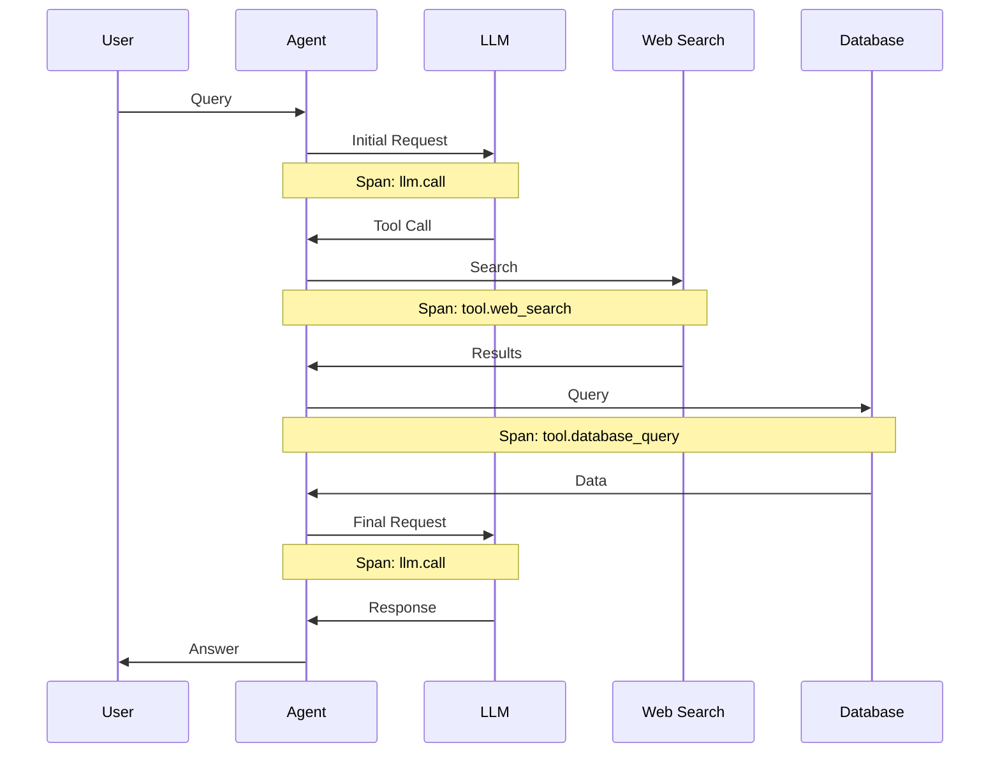

# 5. Observability

> **"You can't fix what you can't see. Observability is the foundation of reliable agent systems."**

Observability enables you to understand what's happening inside your agent systems. It's not just about logging—it's about tracing every decision, measuring every operation, and debugging complex workflows.

---

## 5.1 Monitoring

### Key Metrics

```mermaid
flowchart TB
    subgraph Metrics["Agent Metrics"]
        direction TB
        Perf[Performance]
        Rel[Reliability]
        Cost[Cost]
        Qual[Quality]
    end

    subgraph Performance["Performance Metrics"]
        Lat[Latency]
        Through[Throughput]
        Util[Resource Utilization]
    end

    subgraph Reliability["Reliability Metrics"]
        Success[Success Rate]
        Error[Error Rate]
        Avail[Availability]
    end

    subgraph Cost["Cost Metrics"]
        Token[Token Usage]
        Api[API Calls]
        Infra[Infrastructure]
    end

    subgraph Quality["Quality Metrics"]
        Acc[Accuracy]
        Sat[User Satisfaction]
        Halluc[Hallucination Rate]
    end

    Perf --> Lat
    Perf --> Through
    Perf --> Util

    Rel --> Success
    Rel --> Error
    Rel --> Avail

    Cost --> Token
    Cost --> Api
    Cost --> Infra

    Qual --> Acc
    Qual --> Sat
    Qual --> Halluc

    style Perf fill:#e1f5fe
    style Rel fill:#f3e5f5
    style Cost fill:#e8f5e9
    style Qual fill:#fff3e0
```



### Metrics Collection

```java
@Service
public class AgentMetricsService {

    @Autowired
    private MeterRegistry meterRegistry;

    // Performance metrics
    public void recordLatency(String operation, Duration latency) {
        meterRegistry.timer(
            "agent.latency",
            "operation", operation
        ).record(latency);
    }

    public void recordThroughput(String operation, int count) {
        meterRegistry.counter(
            "agent.throughput",
            "operation", operation
        ).increment(count);
    }

    // Reliability metrics
    public void recordSuccess(String operation) {
        meterRegistry.counter(
            "agent.success",
            "operation", operation
        ).increment();
    }

    public void recordError(String operation, String errorType) {
        meterRegistry.counter(
            "agent.errors",
            "operation", operation,
            "error_type", errorType
        ).increment();
    }

    // Cost metrics
    public void recordTokenUsage(
        String model,
        int promptTokens,
        int completionTokens
    ) {
        meterRegistry.counter(
            "agent.tokens.prompt",
            "model", model
        ).increment(promptTokens);

        meterRegistry.counter(
            "agent.tokens.completion",
            "model", model
        ).increment(completionTokens);
    }

    public void recordApiCall(String service) {
        meterRegistry.counter(
            "agent.api.calls",
            "service", service
        ).increment();
    }

    // Quality metrics
    public void recordAccuracy(String operation, double accuracy) {
        meterRegistry.gauge(
            "agent.quality.accuracy",
            Tags.of("operation", operation),
            accuracy
        );
    }

    public void recordUserSatisfaction(
        String agentId,
        double score
    ) {
        meterRegistry.gauge(
            "agent.quality.satisfaction",
            Tags.of("agent_id", agentId),
            score
        );
    }
}
```

### Metrics Dashboard (Grafana)

```json
{
  "dashboard": {
    "title": "Agent Observability",
    "panels": [
      {
        "title": "Success Rate",
        "targets": [
          {
            "expr": "rate(agent_success_total[5m]) / (rate(agent_success_total[5m]) + rate(agent_errors_total[5m]))"
          }
        ]
      },
      {
        "title": "P95 Latency",
        "targets": [
          {
            "expr": "histogram_quantile(0.95, rate(agent_latency_seconds_bucket[5m]))"
          }
        ]
      },
      {
        "title": "Token Usage",
        "targets": [
          {
            "expr": "rate(agent_tokens_prompt_total[1h])",
            "legendFormat": "Prompt Tokens"
          },
          {
            "expr": "rate(agent_tokens_completion_total[1h])",
            "legendFormat": "Completion Tokens"
          }
        ]
      },
      {
        "title": "Cost per Task",
        "targets": [
          {
            "expr": "agent_cost_total / agent_tasks_completed_total"
          }
        ]
      }
    ]
  }
}
```

---

## 5.2 Tracing

### Distributed Tracing

```java
@Service
public class AgentTracingService {

    @Autowired
    private Tracer tracer;

    public <T> T trace(
        String operationName,
        Supplier<T> operation
    ) {
        Span span = tracer.nextSpan()
            .name(operationName);

        try (Tracer.SpanInScope ws = tracer.withSpanInScope(span)) {
            return operation.get();

        } catch (Exception e) {
            span.recordException(e);
            throw e;

        } finally {
            span.end();
        }
    }

    public void traceToolCall(ToolCall call) {
        Span span = tracer.nextSpan()
            .name("tool." + call.getToolName());

        span.tag("tool.name", call.getToolName());
        span.tag("tool.input", truncate(call.getInput()));
        span.tag("agent.id", call.getAgentId());

        try (Tracer.SpanInScope ws = tracer.withSpanInScope(span)) {
            ToolResult result = toolExecutor.execute(call);

            span.tag("tool.status", result.getStatus());
            span.tag("tool.output", truncate(result.getData()));

            if (result.hasError()) {
                span.tag("tool.error", result.getErrorMessage());
            }

        } finally {
            span.end();
        }
    }

    public void traceLLMCall(LLMRequest request) {
        Span span = tracer.nextSpan()
            .name("llm.call");

        span.tag("llm.model", request.getModel());
        span.tag("llm.prompt_tokens", String.valueOf(request.getPromptTokens()));
        span.tag("llm.agent_id", request.getAgentId());

        try (Tracer.SpanInScope ws = tracer.withSpanInScope(span)) {
            LLMResponse response = llmClient.call(request);

            span.tag("llm.status", "success");
            span.tag("llm.completion_tokens",
                String.valueOf(response.getCompletionTokens()));

        } catch (Exception e) {
            span.recordException(e);
            throw e;

        } finally {
            span.end();
        }
    }

    private String truncate(Object value) {
        String str = String.valueOf(value);
        return str.length() > 1000 ?
            str.substring(0, 1000) + "..." :
            str;
    }
}
```

### Trace Visualization



---

## 5.3 Logging

### Structured Logging

```java
@Service
public class AgentLoggingService {

    private final Logger logger =
        LoggerFactory.getLogger(AgentLoggingService.class);

    private final ObjectMapper objectMapper;

    public void logAgentEvent(
        String agentId,
        String eventType,
        Map<String, Object> data
    ) {
        try {
            Map<String, Object> logEntry = new HashMap<>();
            logEntry.put("timestamp", Instant.now());
            logEntry.put("agent_id", agentId);
            logEntry.put("event_type", eventType);
            logEntry.put("data", data);

            String json = objectMapper.writeValueAsString(logEntry);

            // Use structured logging
            logger.info(json);

        } catch (JsonProcessingException e) {
            logger.error("Failed to create structured log", e);
        }
    }

    public void logToolCall(ToolCall call, ToolResult result) {
        Map<String, Object> data = new HashMap<>();
        data.put("tool_name", call.getToolName());
        data.put("status", result.getStatus());
        data.put("duration_ms", result.getDuration().toMillis());

        if (result.hasError()) {
            data.put("error", result.getErrorMessage());
        }

        logAgentEvent(
            call.getAgentId(),
            "tool_call",
            data
        );
    }

    public void logLLMCall(
        String agentId,
        String model,
        int promptTokens,
        int completionTokens,
        Duration duration
    ) {
        Map<String, Object> data = new HashMap<>();
        data.put("model", model);
        data.put("prompt_tokens", promptTokens);
        data.put("completion_tokens", completionTokens);
        data.put("total_tokens", promptTokens + completionTokens);
        data.put("duration_ms", duration.toMillis());

        // Calculate cost (example rates)
        double cost = calculateCost(model, promptTokens, completionTokens);
        data.put("estimated_cost_usd", cost);

        logAgentEvent(agentId, "llm_call", data);
    }

    public void logAgentError(
        String agentId,
        String errorType,
        String message,
        Throwable throwable
    ) {
        Map<String, Object> data = new HashMap<>();
        data.put("error_type", errorType);
        data.put("message", message);
        data.put("stack_trace", getStackTrace(throwable));

        logAgentEvent(agentId, "error", data);
    }

    private double calculateCost(
        String model,
        int promptTokens,
        int completionTokens
    ) {
        // Example pricing (adjust based on actual rates)
        Map<String, Double> promptPrice = Map.of(
            "gpt-4", 0.03 / 1000,
            "gpt-3.5-turbo", 0.0015 / 1000,
            "claude-3-opus", 0.015 / 1000
        );

        Map<String, Double> completionPrice = Map.of(
            "gpt-4", 0.06 / 1000,
            "gpt-3.5-turbo", 0.002 / 1000,
            "claude-3-opus", 0.075 / 1000
        );

        double promptCost = promptPrice.getOrDefault(model, 0.0) * promptTokens;
        double completionCost = completionPrice.getOrDefault(model, 0.0) * completionTokens;

        return promptCost + completionCost;
    }

    private String getStackTrace(Throwable throwable) {
        StringWriter sw = new StringWriter();
        throwable.printStackTrace(new PrintWriter(sw));
        return sw.toString();
    }
}
```

### Log Levels and What to Log

| Level | When to Use | Examples |
|-------|-------------|----------|
| **ERROR** | System failures | Tool failures, LLM errors, exceptions |
| **WARN** | Potential issues | High latency, approaching limits |
| **INFO** | Important events | Task started, task completed |
| **DEBUG** | Detailed flow | Tool calls, LLM requests |
| **TRACE** | Very detailed | Internal state changes |

```java
@Service
public class LogLevelExample {

    private final Logger logger =
        LoggerFactory.getLogger(LogLevelExample.class);

    public void demonstrateLogLevels() {
        // ERROR: System failure
        logger.error("Tool execution failed: {}", toolName, exception);

        // WARN: Potential issue
        logger.warn("Token usage approaching limit: {}/{}",
            used, limit);

        // INFO: Important event
        logger.info("Task completed: {} in {}ms",
            taskId, duration);

        // DEBUG: Detailed flow
        logger.debug("Executing tool call: {}", toolCall);

        // TRACE: Very detailed
        logger.trace("State updated: {} -> {}",
            oldState, newState);
    }
}
```

### PII Considerations

```java
@Service
public class PIISanitizationService {

    private final List<Pattern> piiPatterns = List.of(
        // Email addresses
        Pattern.compile("\\b[A-Za-z0-9._%+-]+@[A-Za-z0-9.-]+\\.[A-Z|a-z]{2,}\\b"),

        // Phone numbers
        Pattern.compile("\\b\\d{3}[-.]?\\d{3}[-.]?\\d{4}\\b"),

        // Credit card numbers
        Pattern.compile("\\b\\d{4}[ -]?\\d{4}[ -]?\\d{4}[ -]?\\d{4}\\b"),

        // SSN
        Pattern.compile("\\b\\d{3}-\\d{2}-\\d{4}\\b")
    );

    public String sanitize(String input) {
        String sanitized = input;

        for (Pattern pattern : piiPatterns) {
            sanitized = pattern.matcher(sanitized)
                .replaceAll("[REDACTED]");
        }

        return sanitized;
    }

    public Map<String, Object> sanitizeMap(
        Map<String, Object> data
    ) {
        Map<String, Object> sanitized = new HashMap<>();

        for (Map.Entry<String, Object> entry : data.entrySet()) {
            Object value = entry.getValue();

            if (value instanceof String) {
                sanitized.put(
                    entry.getKey(),
                    sanitize((String) value)
                );
            } else if (value instanceof Map) {
                sanitized.put(
                    entry.getKey(),
                    sanitizeMap((Map<String, Object>) value)
                );
            } else {
                sanitized.put(entry.getKey(), value);
            }
        }

        return sanitized;
    }
}
```

---

## 5.4 Debugging Tools

### LangSmith Integration

```java
@Service
public class LangSmithTracingService {

    @Value("${langsmith.api-key}")
    private String apiKey;

    @Value("${langsmith.project-name}")
    private String projectName;

    private final LangSmithClient client;

    @PostConstruct
    public void init() {
        this.client = LangSmithClient.builder()
            .apiKey(apiKey)
            .projectName(projectName)
            .build();
    }

    public void traceRun(
        String runId,
        String agentId,
        String input,
        String output,
        List<ToolCall> toolCalls,
        Duration duration
    ) {
        Run run = Run.builder()
            .id(runId)
            .name(agentId)
            .input(input)
            .output(output)
            .startTime(Instant.now().minus(duration))
            .endTime(Instant.now())
            .executionDuration(duration)
            .build();

        // Add tool calls as child runs
        for (ToolCall toolCall : toolCalls) {
            Run childRun = Run.builder()
                .name(toolCall.getToolName())
                .input(toolCall.getInput())
                .output(toolCall.getOutput())
                .build();

            run.addChildRun(childRun);
        }

        client.createRun(run);
    }
}
```

### Custom Debug Interface

```typescript
// Next.js: Debug Interface
interface AgentTrace {
  runId: string;
  agentId: string;
  startTime: string;
  duration: number;
  steps: TraceStep[];
}

interface TraceStep {
  stepId: string;
  type: "llm_call" | "tool_call" | "error";
  timestamp: string;
  duration: number;
  input: any;
  output: any;
  error?: string;
}

export function AgentDebugPanel({ runId }: { runId: string }) {
  const [trace, setTrace] = useState<AgentTrace | null>(null);
  const [loading, setLoading] = useState(true);

  useEffect(() => {
    fetch(`/api/agent/debug/${runId}`)
      .then(res => res.json())
      .then(data => {
        setTrace(data);
        setLoading(false);
      });
  }, [runId]);

  if (loading) return <div>Loading...</div>;

  return (
    <div className="debug-panel">
      <h3>Agent Trace: {trace.runId}</h3>

      <div className="trace-summary">
        <div>Agent: {trace.agentId}</div>
        <div>Duration: {trace.duration}ms</div>
        <div>Steps: {trace.steps.length}</div>
      </div>

      <div className="trace-steps">
        {trace.steps.map((step, index) => (
          <TraceStepComponent key={step.stepId} step={step} />
        ))}
      </div>

      <div className="trace-actions">
        <button onClick={() => exportTrace(trace)}>
          Export Trace
        </button>
        <button onClick={() => replayTrace(trace)}>
          Replay
        </button>
      </div>
    </div>
  );
}

function TraceStepComponent({ step }: { step: TraceStep }) {
  const [expanded, setExpanded] = useState(false);

  return (
    <div className={`trace-step trace-step-${step.type}`}>
      <div className="step-header" onClick={() => setExpanded(!expanded)}>
        <span className="step-type">{step.type}</span>
        <span className="step-time">{step.timestamp}</span>
        <span className="step-duration">{step.duration}ms</span>
      </div>

      {expanded && (
        <div className="step-details">
          <div className="step-input">
            <h4>Input</h4>
            <pre>{JSON.stringify(step.input, null, 2)}</pre>
          </div>

          <div className="step-output">
            <h4>Output</h4>
            <pre>{JSON.stringify(step.output, null, 2)}</pre>
          </div>

          {step.error && (
            <div className="step-error">
              <h4>Error</h4>
              <pre>{step.error}</pre>
            </div>
          )}
        </div>
      )}
    </div>
  );
}
```

---

## 5.5 Alerting

### Alert Configuration

```java
@Service
public class AlertingService {

    @Autowired
    private AlertNotifier alertNotifier;

    public void checkAlerts(MetricsSnapshot metrics) {
        // Success rate alert
        if (metrics.getSuccessRate() < 0.95) {
            alertNotifier.send(
                AlertSeverity.WARNING,
                "Low success rate",
                String.format(
                    "Success rate dropped to %.2f%% (threshold: 95%%)",
                    metrics.getSuccessRate() * 100
                )
            );
        }

        // Latency alert
        if (metrics.getP95Latency() > Duration.ofSeconds(15)) {
            alertNotifier.send(
                AlertSeverity.WARNING,
                "High latency",
                String.format(
                    "P95 latency is %dms (threshold: 15000ms)",
                    metrics.getP95Latency().toMillis()
                )
            );
        }

        // Error rate alert
        if (metrics.getErrorRate() > 0.05) {
            alertNotifier.send(
                AlertSeverity.CRITICAL,
                "High error rate",
                String.format(
                    "Error rate is %.2f%% (threshold: 5%%)",
                    metrics.getErrorRate() * 100
                )
            );
        }

        // Cost alert
        if (metrics.getCostPerTask() > 0.10) {
            alertNotifier.send(
                AlertSeverity.INFO,
                "High cost per task",
                String.format(
                    "Cost per task is $%.4f (threshold: $0.10)",
                    metrics.getCostPerTask()
                )
            );
        }
    }
}
```

### Alert Channels

```java
@Service
public class AlertNotifier {

    @Value("${alert.slack.webhook}")
    private String slackWebhook;

    @Value("${alert.email.to}")
    private String emailTo;

    public void send(
        AlertSeverity severity,
        String title,
        String message
    ) {
        // Send to Slack
        sendToSlack(severity, title, message);

        // Send email for critical alerts
        if (severity == AlertSeverity.CRITICAL) {
            sendEmail(title, message);
        }
    }

    private void sendToSlack(
        AlertSeverity severity,
        String title,
        String message
    ) {
        SlackMessage slackMessage = SlackMessage.builder()
            .text(formatMessage(severity, title, message))
            .color(getColor(severity))
            .build();

        RestTemplate restTemplate = new RestTemplate();
        restTemplate.postForObject(slackWebhook, slackMessage, String.class);
    }

    private void sendEmail(String title, String message) {
        // Email implementation
    }

    private String formatMessage(
        AlertSeverity severity,
        String title,
        String message
    ) {
        return String.format(
            "*[%s]* %s\n%s",
            severity,
            title,
            message
        );
    }

    private String getColor(AlertSeverity severity) {
        return switch (severity) {
            case CRITICAL -> "danger";
            case WARNING -> "warning";
            case INFO -> "good";
        };
    }
}
```

---

## 5.6 Key Takeaways

### Three Pillars of Observability

| Pillar | Purpose | Tools |
|--------|---------|-------|
| **Metrics** | Quantitative data | Prometheus, Grafana |
| **Tracing** | Request flow | OpenTelemetry, Jaeger |
| **Logging** | Event records | ELK, Loki |

### Key Metrics to Monitor

- **Performance**: Latency, throughput, resource usage
- **Reliability**: Success rate, error rate, availability
- **Cost**: Token usage, API calls, infrastructure
- **Quality**: Accuracy, satisfaction, hallucination rate

### Debugging Strategy

1. **Trace**: Follow the execution path
2. **Measure**: Identify bottlenecks
3. **Log**: Understand context
4. **Replay**: Reproduce issues

### Production Checklist

- [ ] Metrics collection for all operations
- [ ] Distributed tracing enabled
- [ ] Structured logging with proper levels
- [ ] PII sanitization
- [ ] Debug interface for trace inspection
- [ ] Alerting configured
- [ ] Dashboard for monitoring

---

## 5.7 Next Steps

**Continue your journey:**
- → **[6. Safety & Guardrails](../safety-guards)** - Constraints and validation
- → **[7. Production Patterns](../patterns)** - Real-world implementations

---

:::tip Start with Metrics
Implement metrics first. They're the foundation of all observability. Add tracing and logging as needed.
:::

:::warning Protect PII
Always sanitize logs and traces before storing them. PII in logs is a security risk.
:::

:::info Debug Interface Saves Time
A good debug interface can reduce debugging time from hours to minutes. Invest in building one.
:::
