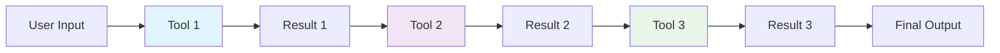
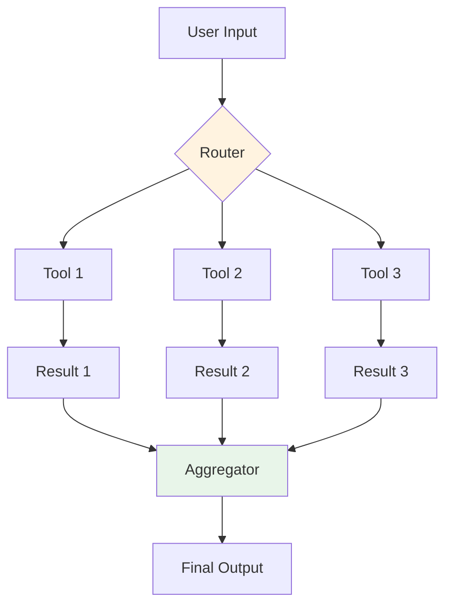
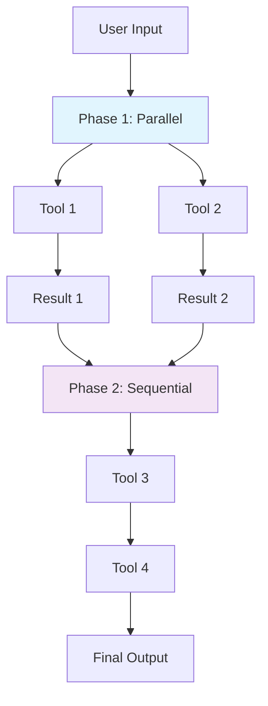

# 2. Tool Orchestration

> **"The quality of tool orchestration determines agent reliability more than the quality of the model."**

Tool orchestration is the art and science of managing tool execution in production agents. It's not just calling tools—it's managing failures, optimizing performance, handling errors, and composing complex workflows.

---

## 2.1 Tool Calling Patterns

### Sequential Execution

Tools execute one after another, with each tool's output informing the next.



**When to use:**
- Tools depend on each other's output
- Order of operations matters
- Early results inform later decisions

**Implementation:**

```java
@Service
public class SequentialOrchestrator {

    @Autowired
    private ToolExecutor toolExecutor;

    public List<ToolResult> execute(
        List<ToolCall> calls,
        AgentContext context
    ) {
        List<ToolResult> results = new ArrayList<>();

        for (ToolCall call : calls) {
            try {
                // Check if we should continue
                if (shouldStop(context, results)) {
                    break;
                }

                // Execute tool
                ToolResult result = toolExecutor.execute(call);
                results.add(result);

                // Update context with result
                context = context.update(result);

                // Check for errors
                if (result.hasError()) {
                    handleSequentialError(call, result, context);
                    if (context.isFatalError()) {
                        break;
                    }
                }

            } catch (ToolExecutionException e) {
                ToolResult errorResult = ToolResult.error(
                    call,
                    e.getMessage()
                );
                results.add(errorResult);

                if (shouldFailFast(e)) {
                    break;
                }
            }
        }

        return results;
    }

    private boolean shouldStop(
        AgentContext context,
        List<ToolResult> results
    ) {
        // Stop if goal achieved
        if (context.isGoalAchieved()) {
            return true;
        }

        // Stop if fatal error
        if (context.isFatalError()) {
            return true;
        }

        // Stop if resource limits exceeded
        if (context.hasExceededLimits()) {
            return true;
        }

        return false;
    }

    private void handleSequentialError(
        ToolCall call,
        ToolResult result,
        AgentContext context
    ) {
        // Log error
        log.error("Tool {} failed: {}",
            call.getToolName(),
            result.getErrorMessage()
        );

        // Decide whether to continue or fail
        if (call.isCritical()) {
            context.markFatalError(result.getErrorMessage());
        } else {
            context.markNonCriticalError(result.getErrorMessage());
        }
    }
}
```

### Parallel Execution

Multiple tools execute simultaneously, reducing latency.



**When to use:**
- Tools are independent
- Performance is critical
- Tools have similar latency

**Implementation:**

```java
@Service
public class ParallelOrchestrator {

    @Autowired
    private ToolExecutor toolExecutor;

    @Value("${agent.parallel.thread-pool-size:10}")
    private int threadPoolSize;

    private ExecutorService executorService;

    @PostConstruct
    public void init() {
        this.executorService = Executors.newFixedThreadPool(
            threadPoolSize
        );
    }

    public Map<String, ToolResult> executeParallel(
        List<ToolCall> calls,
        Duration timeout
    ) {
        // Create futures for all calls
        List<CompletableFuture<ToolResult>> futures = calls.stream()
            .map(call -> CompletableFuture.supplyAsync(
                () -> executeWithRetry(call),
                executorService
            ))
            .toList();

        // Wait for all to complete (with timeout)
        CompletableFuture<Void> allFutures = CompletableFuture.allOf(
            futures.toArray(new CompletableFuture[0])
        );

        try {
            allFutures.get(timeout.toMillis(), TimeUnit.MILLISECONDS);

        } catch (TimeoutException e) {
            log.warn("Parallel execution timed out");
            futures.forEach(future -> future.cancel(true));

        } catch (Exception e) {
            log.error("Parallel execution failed", e);
        }

        // Collect results
        return futures.stream()
            .filter(future -> future.isDone() && !future.isCompletedExceptionally())
            .map(CompletableFuture::join)
            .collect(Collectors.toMap(
                result -> result.getToolCall().getToolName(),
                result -> result
            ));
    }

    private ToolResult executeWithRetry(ToolCall call) {
        int maxRetries = 3;
        int retryDelay = 1000; // milliseconds

        for (int i = 0; i < maxRetries; i++) {
            try {
                return toolExecutor.execute(call);

            } catch (ToolExecutionException e) {
                if (i == maxRetries - 1) {
                    return ToolResult.error(call, e.getMessage());
                }

                try {
                    Thread.sleep(retryDelay * (i + 1));
                } catch (InterruptedException ex) {
                    Thread.currentThread().interrupt();
                    return ToolResult.error(call, "Interrupted");
                }
            }
        }

        return ToolResult.error(call, "Max retries exceeded");
    }
}
```

### Hybrid Orchestration

Combine sequential and parallel execution for optimal performance.



**Implementation:**

```java
@Service
public class HybridOrchestrator {

    @Autowired
    private SequentialOrchestrator sequentialOrchestrator;

    @Autowired
    private ParallelOrchestrator parallelOrchestrator;

    public List<ToolResult> executeHybrid(
        OrchestrationPlan plan,
        AgentContext context
    ) {
        List<ToolResult> allResults = new ArrayList<>();

        for (OrchestrationPhase phase : plan.getPhases()) {
            List<ToolResult> phaseResults;

            if (phase.getType() == PhaseType.PARALLEL) {
                Map<String, ToolResult> parallelResults =
                    parallelOrchestrator.executeParallel(
                        phase.getToolCalls(),
                        phase.getTimeout()
                    );
                phaseResults = new ArrayList<>(parallelResults.values());

            } else {
                phaseResults = sequentialOrchestrator.execute(
                    phase.getToolCalls(),
                    context
                );
            }

            allResults.addAll(phaseResults);

            // Check if we should stop
            if (shouldStopAfterPhase(phase, phaseResults, context)) {
                break;
            }

            // Update context
            context = context.update(phaseResults);
        }

        return allResults;
    }

    private boolean shouldStopAfterPhase(
        OrchestrationPhase phase,
        List<ToolResult> results,
        AgentContext context
    ) {
        // Stop if phase has fatal errors
        if (results.stream().anyMatch(ToolResult::hasFatalError)) {
            return true;
        }

        // Stop if goal achieved
        if (context.isGoalAchieved()) {
            return true;
        }

        // Check phase exit conditions
        if (phase.getExitCondition().isPresent()) {
            return phase.getExitCondition().get().test(results);
        }

        return false;
    }
}
```

---

## 2.2 Tool Result Processing

### Result Validation

Validate tool outputs before using them.

```java
@Service
public class ToolResultValidator {

    @Autowired
    private ChatClient chatClient;

    public ValidationResult validate(
        ToolCall call,
        ToolResult result
    ) {
        // Basic validation
        if (result == null) {
            return ValidationResult.failed("Result is null");
        }

        if (result.hasError()) {
            return ValidationResult.failed(
                "Tool returned error: " + result.getErrorMessage()
            );
        }

        // Schema validation (if defined)
        if (call.getOutputSchema().isPresent()) {
            JsonSchema schema = call.getOutputSchema().get();
            if (!schema.validate(result.getData())) {
                return ValidationResult.failed(
                    "Output doesn't match expected schema"
                );
            }
        }

        // Semantic validation (using LLM)
        if (call.requiresSemanticValidation()) {
            return semanticValidation(call, result);
        }

        return ValidationResult.success();
    }

    private ValidationResult semanticValidation(
        ToolCall call,
        ToolResult result
    ) {
        String validation = chatClient.prompt()
            .system("""
                You are a tool result validator.
                Check if the result makes sense for the tool call:
                1. Is the result relevant?
                2. Is the result complete?
                3. Are there any obvious errors?

                Return JSON:
                {
                    "valid": true/false,
                    "reason": "explanation"
                }
                """)
            .user("""
                Tool: {tool}
                Input: {input}
                Output: {output}
                """.formatted(
                    call.getToolName(),
                    call.getInput(),
                    result.getData()
                ))
            .call()
            .content();

        return parseValidation(validation);
    }
}
```

### Result Parsing

Parse and normalize tool outputs.

```java
@Service
public class ToolResultParser {

    public ParsedResult parse(ToolResult result) {
        Object data = result.getData();

        // JSON parsing
        if (data instanceof String) {
            try {
                return parseJson((String) data);
            } catch (JsonProcessingException e) {
                return ParsedResult.raw(data);
            }
        }

        // Already structured
        if (data instanceof Map || data instanceof List) {
            return ParsedResult.structured(data);
        }

        // Raw value
        return ParsedResult.raw(data);
    }

    private ParsedResult parseJson(String json) {
        ObjectMapper mapper = new ObjectMapper();
        Object parsed = mapper.readValue(json, Object.class);
        return ParsedResult.structured(parsed);
    }

    public <T> T parseAs(
        ToolResult result,
        Class<T> type
    ) {
        ParsedResult parsed = parse(result);

        if (parsed.isStructured()) {
            ObjectMapper mapper = new ObjectMapper();
            return mapper.convertValue(
                parsed.getData(),
                type
            );
        }

        throw new IllegalArgumentException(
            "Cannot convert result to type: " + type
        );
    }
}
```

### Error Handling per Tool

Different tools require different error handling strategies.

```java
@Service
public class ToolSpecificErrorHandler {

    private final Map<String, ErrorHandler> handlers;

    public ToolSpecificErrorHandler() {
        this.handlers = Map.of(
            "web_search", new WebSearchErrorHandler(),
            "database_query", new DatabaseQueryErrorHandler(),
            "file_operation", new FileOperationErrorHandler(),
            "api_call", new ApiCallErrorHandler()
        );
    }

    public ErrorHandlingResult handle(
        ToolCall call,
        ToolExecutionException error
    ) {
        ErrorHandler handler = handlers.get(call.getToolName());

        if (handler != null) {
            return handler.handle(call, error);
        }

        // Default handler
        return defaultHandler(call, error);
    }

    private ErrorHandlingResult defaultHandler(
        ToolCall call,
        ToolExecutionException error
    ) {
        return ErrorHandlingResult.builder()
            .action(ErrorAction.FAIL)
            .message("Tool execution failed: " + error.getMessage())
            .retryable(false)
            .build();
    }

    // Example: Web Search Error Handler
    private static class WebSearchErrorHandler implements ErrorHandler {
        @Override
        public ErrorHandlingResult handle(
            ToolCall call,
            ToolExecutionException error
        ) {
            if (error.isTimeout()) {
                return ErrorHandlingResult.builder()
                    .action(ErrorAction.RETRY)
                    .retryDelay(Duration.ofSeconds(5))
                    .message("Search timed out, retrying...")
                    .build();
            }

            if (error.isRateLimit()) {
                return ErrorHandlingResult.builder()
                    .action(ErrorAction.WAIT_AND_RETRY)
                    .retryDelay(Duration.ofMinutes(1))
                    .message("Rate limited, waiting...")
                    .build();
            }

            if (error.isNoResults()) {
                return ErrorHandlingResult.builder()
                    .action(ErrorAction.CONTINUE)
                    .message("No results found, continuing...")
                    .build();
            }

            return ErrorHandlingResult.builder()
                .action(ErrorAction.FAIL)
                .message("Search failed: " + error.getMessage())
                .build();
        }
    }
}
```

---

## 2.3 Retry Strategies

### Exponential Backoff

Gradually increase retry delay.

```java
@Service
public class ExponentialBackoffRetryService {

    public ToolResult executeWithRetry(
        ToolCall call,
        int maxRetries,
        Duration initialDelay
    ) {
        int attempt = 0;
        Duration delay = initialDelay;

        while (attempt < maxRetries) {
            try {
                return toolExecutor.execute(call);

            } catch (ToolExecutionException e) {
                attempt++;

                if (attempt >= maxRetries) {
                    return ToolResult.error(call, "Max retries exceeded");
                }

                log.warn(
                    "Tool execution failed (attempt {}/{}), retrying in {}",
                    attempt,
                    maxRetries,
                    delay
                );

                try {
                    Thread.sleep(delay.toMillis());
                } catch (InterruptedException ex) {
                    Thread.currentThread().interrupt();
                    return ToolResult.error(call, "Interrupted");
                }

                // Exponential backoff
                delay = delay.multipliedBy(2);
            }
        }

        return ToolResult.error(call, "Max retries exceeded");
    }
}
```

### Circuit Breaker Pattern

Stop calling failing tools temporarily.

```java
@Service
public class CircuitBreakerService {

    private final Map<String, CircuitBreaker> breakers = new ConcurrentHashMap<>();

    public ToolResult execute(ToolCall call) {
        CircuitBreaker breaker = getBreaker(call.getToolName());

        // Check if circuit is open
        if (breaker.isOpen()) {
            if (breaker.shouldAttemptReset()) {
                breaker.halfOpen();
            } else {
                return ToolResult.error(
                    call,
                    "Circuit breaker is open for tool: " +
                    call.getToolName()
                );
            }
        }

        try {
            ToolResult result = toolExecutor.execute(call);

            if (result.isSuccess()) {
                breaker.recordSuccess();
            } else {
                breaker.recordFailure();
            }

            return result;

        } catch (ToolExecutionException e) {
            breaker.recordFailure();
            return ToolResult.error(call, e.getMessage());
        }
    }

    private CircuitBreaker getBreaker(String toolName) {
        return breakers.computeIfAbsent(
            toolName,
            k -> new CircuitBreaker(
                threshold = 5,      // Open after 5 failures
                timeout = Duration.ofMinutes(1)  // Reset after 1 minute
            )
        );
    }

    private static class CircuitBreaker {
        private final int threshold;
        private final Duration timeout;
        private int failureCount = 0;
        private Instant lastFailureTime;
        private State state = State.CLOSED;

        public boolean isOpen() {
            return state == State.OPEN;
        }

        public boolean shouldAttemptReset() {
            if (state != State.OPEN) {
                return false;
            }

            return Duration.between(
                lastFailureTime,
                Instant.now()
            ).compareTo(timeout) > 0;
        }

        public void recordFailure() {
            failureCount++;
            lastFailureTime = Instant.now();

            if (failureCount >= threshold) {
                state = State.OPEN;
                log.warn("Circuit breaker opened after {} failures",
                    failureCount);
            }
        }

        public void recordSuccess() {
            failureCount = 0;
            state = State.CLOSED;
        }

        public void halfOpen() {
            state = State.HALF_OPEN;
        }

        enum State {
            CLOSED,   // Normal operation
            OPEN,     // Failing, not calling
            HALF_OPEN // Attempting reset
        }
    }
}
```

---

## 2.4 MCP Integration

### MCP Server Management

Manage MCP servers in production.

```java
@Service
public class MCPServerManager {

    private final Map<String, MCPServerClient> servers =
        new ConcurrentHashMap<>();

    @Autowired
    private MCPServerFactory serverFactory;

    @PostConstruct
    public void init() {
        // Initialize MCP servers from configuration
        List<MCPServerConfig> configs =
            mcpConfigLoader.loadConfigs();

        for (MCPServerConfig config : configs) {
            try {
                MCPServerClient client = serverFactory.create(config);
                servers.put(config.getName(), client);
                log.info("MCP server initialized: {}",
                    config.getName());

            } catch (Exception e) {
                log.error("Failed to initialize MCP server: {}",
                    config.getName(), e);
            }
        }
    }

    public MCPServerClient getServer(String serverName) {
        MCPServerClient client = servers.get(serverName);

        if (client == null) {
            throw new IllegalArgumentException(
                "MCP server not found: " + serverName
            );
        }

        return client;
    }

    public List<MCPServerClient> getAllServers() {
        return new ArrayList<>(servers.values());
    }

    public void checkHealth() {
        for (Map.Entry<String, MCPServerClient> entry :
             servers.entrySet()) {
            try {
                entry.getValue().ping();
                log.debug("MCP server healthy: {}",
                    entry.getKey());

            } catch (Exception e) {
                log.error("MCP server unhealthy: {}",
                    entry.getKey(), e);
            }
        }
    }

    @Scheduled(fixedRate = 60000) // Every minute
    public void scheduledHealthCheck() {
        checkHealth();
    }
}
```

### MCP Tool Invocation

Invoke MCP tools with proper error handling.

```java
@Service
public class MCPToolInvoker {

    @Autowired
    private MCPServerManager serverManager;

    public ToolResult invoke(MCPToolCall call) {
        try {
            // Get server
            MCPServerClient server = serverManager.getServer(
                call.getServerName()
            );

            // Check tool availability
            if (!server.hasTool(call.getToolName())) {
                return ToolResult.error(
                    call,
                    "Tool not available on server: " +
                    call.getToolName()
                );
            }

            // Invoke tool
            MCPResponse response = server.callTool(
                call.getToolName(),
                call.getArguments()
            );

            // Check response
            if (response.hasError()) {
                return ToolResult.error(
                    call,
                    response.getErrorMessage()
                );
            }

            return ToolResult.success(
                call,
                response.getResult()
            );

        } catch (MCPException e) {
            return ToolResult.error(
                call,
                "MCP invocation failed: " + e.getMessage()
            );
        }
    }

    public List<ToolDefinition> listTools(String serverName) {
        MCPServerClient server = serverManager.getServer(serverName);
        return server.listTools();
    }
}
```

---

## 2.5 Tool Composition

### Tool Chains

Chain tools together where each tool's output feeds into the next.

```java
@Service
public class ToolChainService {

    public ToolResult executeChain(
        ToolChain chain,
        Map<String, Object> initialInput
    ) {
        Map<String, Object> currentData = new HashMap<>(initialInput);
        ToolResult lastResult = null;

        for (ToolChainLink link : chain.getLinks()) {
            // Prepare input from current data
            ToolCall call = prepareCall(link, currentData);

            // Execute tool
            lastResult = toolExecutor.execute(call);

            if (lastResult.hasError()) {
                if (link.isStopOnError()) {
                    return lastResult;
                }
                continue;
            }

            // Update data with result
            currentData.put(
                link.getOutputKey(),
                lastResult.getData()
            );
        }

        return lastResult;
    }

    private ToolCall prepareCall(
        ToolChainLink link,
        Map<String, Object> data
    ) {
        // Substitute variables in tool arguments
        Map<String, Object> args = substituteVariables(
            link.getArguments(),
            data
        );

        return ToolCall.builder()
            .toolName(link.getToolName())
            .arguments(args)
            .build();
    }

    private Map<String, Object> substituteVariables(
        Map<String, Object> args,
        Map<String, Object> data
    ) {
        Map<String, Object> result = new HashMap<>();

        for (Map.Entry<String, Object> entry : args.entrySet()) {
            Object value = entry.getValue();

            if (value instanceof String) {
                // Replace ${variable} with actual value
                String strValue = (String) value;
                for (Map.Entry<String, Object> dataEntry :
                     data.entrySet()) {
                    strValue = strValue.replace(
                        "${" + dataEntry.getKey() + "}",
                        String.valueOf(dataEntry.getValue())
                    );
                }
                result.put(entry.getKey(), strValue);

            } else {
                result.put(entry.getKey(), value);
            }
        }

        return result;
    }
}
```

### Tool Pipelines

Create reusable tool pipelines.

```java
@Service
public class ToolPipelineRegistry {

    private final Map<String, ToolPipeline> pipelines =
        new ConcurrentHashMap<>();

    @PostConstruct
    public void init() {
        // Register common pipelines

        // Research pipeline
        registerPipeline("research", ToolPipeline.builder()
            .name("research")
            .addLink(ToolChainLink.builder()
                .toolName("web_search")
                .outputKey("search_results")
                .build())
            .addLink(ToolChainLink.builder()
                .toolName("extract_content")
                .outputKey("content")
                .build())
            .addLink(ToolChainLink.builder()
                .toolName("summarize")
                .outputKey("summary")
                .build())
            .build());

        // Data analysis pipeline
        registerPipeline("analyze_data", ToolPipeline.builder()
            .name("analyze_data")
            .addLink(ToolChainLink.builder()
                .toolName("database_query")
                .outputKey("query_results")
                .build())
            .addLink(ToolChainLink.builder()
                .toolName("transform_data")
                .outputKey("transformed_data")
                .build())
            .addLink(ToolChainLink.builder()
                .toolName("generate_report")
                .outputKey("report")
                .build())
            .build());
    }

    public void registerPipeline(
        String name,
        ToolPipeline pipeline
    ) {
        pipelines.put(name, pipeline);
    }

    public ToolResult executePipeline(
        String name,
        Map<String, Object> input
    ) {
        ToolPipeline pipeline = pipelines.get(name);

        if (pipeline == null) {
            throw new IllegalArgumentException(
                "Pipeline not found: " + name
            );
        }

        return toolChainService.executeChain(pipeline, input);
    }
}
```

---

## 2.6 Key Takeaways

### Orchestration Patterns

| Pattern | Latency | Complexity | Use Case |
|---------|---------|------------|----------|
| **Sequential** | High | Low | Dependent tools |
| **Parallel** | Low | Medium | Independent tools |
| **Hybrid** | Medium | High | Mixed dependencies |

### Error Handling

1. **Validate**: Check tool outputs before using
2. **Retry**: Use exponential backoff for transient errors
3. **Circuit Breaker**: Stop calling failing tools
4. **Fallback**: Provide alternative paths

### MCP Integration

- **Server Management**: Health checks and monitoring
- **Tool Discovery**: Dynamic tool listing
- **Error Handling**: MCP-specific error codes

### Production Checklist

- [ ] Sequential execution with early stopping
- [ ] Parallel execution with timeout
- [ ] Result validation and parsing
- [ ] Retry with exponential backoff
- [ ] Circuit breaker for failing tools
- [ ] MCP server health monitoring
- [ ] Tool chains and pipelines

---

## 2.7 Next Steps

**Continue your journey:**
- → **[3. State Management](../state-management)** - Persisting and recovering agent state
- → **[4. Error Handling & Recovery](../error-handling)** - Advanced error strategies

---

:::tip Start Simple
Begin with sequential orchestration. Add parallel execution once you have error handling working correctly.
:::

:::warning Monitor Tool Performance
Tools are the primary failure point in agents. Monitor their performance and set up alerts for degradation.
:::

:::info Circuit Breakers Save Resources
When a tool is failing, the circuit breaker prevents wasting resources on repeated failures. Always use circuit breakers in production.
:::
