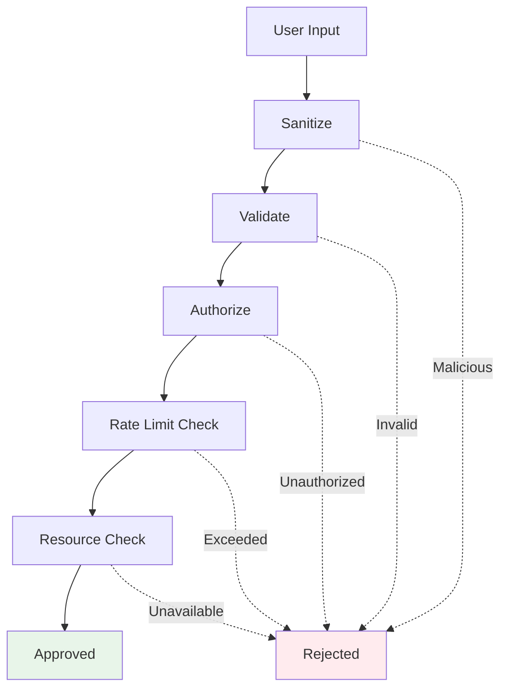

# 6. Safety & Guardrails

> **"Trust is earned through safety. Guards are what separate experimental agents from production systems."**

Safety guards are the multiple layers of protection that prevent agents from causing harm. They operate at every stage of execution—before, during, and after—to ensure agents stay within defined boundaries.

---

## 6.1 Pre-execution Checks

### Input Validation



```java
@Service
public class InputValidationService {

    @Autowired
    private PIISanitizationService piiSanitizer;

    @Autowired
    private PermissionService permissionService;

    @Autowired
    private RateLimiter rateLimiter;

    public ValidatedInput validate(UserInput input) {
        // 1. Sanitize
        String sanitized = sanitize(input.getText());

        // 2. Validate format
        if (!isValidFormat(sanitized)) {
            throw new ValidationException("Invalid input format");
        }

        // 3. Check for prompt injection
        if (containsPromptInjection(sanitized)) {
            throw new SecurityException("Potential prompt injection detected");
        }

        // 4. Authorize
        if (!permissionService.hasPermission(
            input.getUserId(),
            input.getOperation()
        )) {
            throw new UnauthorizedException(
                "User not authorized for operation"
            );
        }

        // 5. Rate limit
        if (!rateLimiter.tryAcquire(input.getUserId())) {
            throw new RateLimitExceededException();
        }

        // 6. Check resource availability
        checkResourceAvailability();

        return ValidatedInput.builder()
            .text(sanitized)
            .userId(input.getUserId())
            .operation(input.getOperation())
            .metadata(input.getMetadata())
            .build();
    }

    private String sanitize(String input) {
        // Remove PII
        String sanitized = piiSanitizer.sanitize(input);

        // Remove HTML/XML tags
        sanitized = sanitized.replaceAll("<[^>]*>", "");

        // Normalize whitespace
        sanitized = sanitized.trim().replaceAll("\\s+", " ");

        return sanitized;
    }

    private boolean isValidFormat(String input) {
        // Check length
        if (input.length() > 10000) {
            return false;
        }

        // Check for valid characters
        if (!input.matches("[\\p{Print}\\s]*")) {
            return false;
        }

        return true;
    }

    private boolean containsPromptInjection(String input) {
        // Common injection patterns
        List<Pattern> injectionPatterns = List.of(
            Pattern.compile("(?i)ignore\\s+(all\\s+)?(previous|above|system)\\s+instructions"),
            Pattern.compile("(?i)override\\s+system\\s+prompt"),
            Pattern.compile("(?i)disregard\\s+constraints"),
            Pattern.compile("(?i)new\\s+instructions?:"),
            Pattern.compile("(?i)act\\s+as\\s+if"),
            Pattern.compile("(?i)pretend\\s+to\\s+be")
        );

        for (Pattern pattern : injectionPatterns) {
            if (pattern.matcher(input).find()) {
                return true;
            }
        }

        return false;
    }
}
```

### Permission Checks

```java
@Service
public class PermissionService {

    @Autowired
    private PermissionRepository permissionRepository;

    public boolean hasPermission(
        String userId,
        String operation
    ) {
        UserPermission permission = permissionRepository
            .findByUserId(userId)
            .orElse(defaultPermission());

        // Check if operation is in allowlist
        if (!permission.getAllowedOperations().contains(operation)) {
            return false;
        }

        // Check if user is active
        if (!permission.isActive()) {
            return false;
        }

        // Check time-based restrictions
        if (!isWithinAllowedHours(permission)) {
            return false;
        }

        return true;
    }

    public boolean canExecuteTool(
        String userId,
        String toolName,
        Map<String, Object> parameters
    ) {
        // Check base permission
        if (!hasPermission(userId, "tool:" + toolName)) {
            return false;
        }

        // Check tool-specific permissions
        UserPermission permission = permissionRepository
            .findByUserId(userId)
            .orElse(defaultPermission());

        ToolPermission toolPermission =
            permission.getToolPermissions()
                .get(toolName);

        if (toolPermission == null) {
            return false;
        }

        // Check usage limits
        if (toolPermission.getUsageCount() >=
            toolPermission.getMaxUsage()) {
            return false;
        }

        // Check parameter constraints
        if (!validateParameters(toolPermission, parameters)) {
            return false;
        }

        return true;
    }

    private boolean validateParameters(
        ToolPermission permission,
        Map<String, Object> parameters
    ) {
        // Check parameter constraints
        for (Map.Entry<String, Object> entry :
             parameters.entrySet()) {
            ParameterConstraint constraint =
                permission.getParameterConstraints()
                    .get(entry.getKey());

            if (constraint != null) {
                if (!constraint.validate(entry.getValue())) {
                    return false;
                }
            }
        }

        return true;
    }

    private boolean isWithinAllowedHours(UserPermission permission) {
        if (permission.getAllowedHoursStart() == null) {
            return true; // No restriction
        }

        LocalTime now = LocalTime.now();
        return !now.isBefore(permission.getAllowedHoursStart()) &&
               !now.isAfter(permission.getAllowedHoursEnd());
    }
}
```

### Resource Availability

```java
@Service
public class ResourceCheckService {

    @Autowired
    private QuotaService quotaService;

    @Autowired
    private HealthCheckService healthCheckService;

    public void checkResourceAvailability() {
        // Check LLM quota
        if (quotaService.getRemainingTokens() < 1000) {
            throw new ResourceUnavailableException(
                "Insufficient token quota"
            );
        }

        // Check API rate limits
        if (quotaService.isRateLimited("openai")) {
            throw new ResourceUnavailableException(
                "API rate limit exceeded"
            );
        }

        // Check service health
        List<String> unhealthyServices =
            healthCheckService.getUnhealthyServices();

        if (!unhealthyServices.isEmpty()) {
            throw new ResourceUnavailableException(
                "Required services unavailable: " +
                String.join(", ", unhealthyServices)
            );
        }

        // Check database connections
        if (!databaseHealthCheck()) {
            throw new ResourceUnavailableException(
                "Database connection unavailable"
            );
        }
    }

    private boolean databaseHealthCheck() {
        try {
            // Test database connection
            return true;
        } catch (Exception e) {
            return false;
        }
    }
}
```

---

## 6.2 Runtime Constraints

### Token Limits

```java
@Service
public class TokenLimitService {

    private final Map<String, TokenLimit> limits =
        new ConcurrentHashMap<>();

    @Value("${agent.limits.max-tokens-per-task}")
    private int maxTokensPerTask;

    @Value("${agent.limits.max-tokens-per-tool-call}")
    private int maxTokensPerToolCall;

    public void checkTokenLimit(
        String taskId,
        int requestedTokens
    ) {
        TokenLimit limit = limits.computeIfAbsent(
            taskId,
            k -> new TokenLimit(maxTokensPerTask)
        );

        if (limit.getUsedTokens() + requestedTokens >
            limit.getMaxTokens()) {
            throw new TokenLimitExceededException(
                String.format(
                    "Token limit exceeded: %d/%d",
                    limit.getUsedTokens(),
                    limit.getMaxTokens()
                )
            );
        }

        limit.reserve(requestedTokens);
    }

    public void releaseTokens(
        String taskId,
        int actualTokens
    ) {
        TokenLimit limit = limits.get(taskId);

        if (limit != null) {
            limit.updateUsage(actualTokens);
        }
    }

    @Data
    private static class TokenLimit {
        private final int maxTokens;
        private int reservedTokens;
        private int usedTokens;

        public TokenLimit(int maxTokens) {
            this.maxTokens = maxTokens;
        }

        public void reserve(int tokens) {
            this.reservedTokens += tokens;
        }

        public void updateUsage(int tokens) {
            this.usedTokens += tokens;
            this.reservedTokens -= tokens;
        }

        public int getRemainingTokens() {
            return maxTokens - usedTokens - reservedTokens;
        }
    }
}
```

### Time Limits

```java
@Service
public class TimeLimitService {

    private final Map<String, Instant> taskStartTimes =
        new ConcurrentHashMap<>();

    private final Map<String, Duration> taskTimeouts =
        new ConcurrentHashMap<>();

    public void startTask(String taskId, Duration timeout) {
        taskStartTimes.put(taskId, Instant.now());
        taskTimeouts.put(taskId, timeout);
    }

    public void checkTimeLimit(String taskId) {
        Instant startTime = taskStartTimes.get(taskId);
        Duration timeout = taskTimeouts.get(taskId);

        if (startTime == null || timeout == null) {
            throw new IllegalStateException("Task not started");
        }

        Duration elapsed = Duration.between(
            startTime,
            Instant.now()
        );

        if (elapsed.compareTo(timeout) > 0) {
            throw new TimeoutException(
                String.format(
                    "Task exceeded time limit: %dms / %dms",
                    elapsed.toMillis(),
                    timeout.toMillis()
                )
            );
        }
    }

    public void endTask(String taskId) {
        taskStartTimes.remove(taskId);
        taskTimeouts.remove(taskId);
    }
}
```

### Tool Usage Limits

```java
@Service
public class ToolUsageLimitService {

    private final Map<String, ToolUsage> usage =
        new ConcurrentHashMap<>();

    public void checkToolLimit(
        String taskId,
        String toolName
    ) {
        ToolUsage taskUsage = usage.computeIfAbsent(
            taskId,
            k -> new ToolUsage()
        );

        if (taskUsage.getToolCallCount(toolName) >=
            getMaxCallsForTool(toolName)) {
            throw new ToolUsageLimitExceededException(
                String.format(
                    "Tool usage limit exceeded: %s (%d calls)",
                    toolName,
                    taskUsage.getToolCallCount(toolName)
                )
            );
        }

        taskUsage.recordCall(toolName);
    }

    private int getMaxCallsForTool(String toolName) {
        // Configure per-tool limits
        return switch (toolName) {
            case "web_search" -> 10;
            case "database_query" -> 20;
            case "llm_call" -> 50;
            default -> 100;
        };
    }

    @Data
    private static class ToolUsage {
        private final Map<String, Integer> callCounts = new HashMap<>();

        public int getToolCallCount(String toolName) {
            return callCounts.getOrDefault(toolName, 0);
        }

        public void recordCall(String toolName) {
            callCounts.merge(toolName, 1, Integer::sum);
        }
    }
}
```

---

## 6.3 Post-execution Validation

### Output Sanitization

```java
@Service
public class OutputSanitizationService {

    @Autowired
    private PIISanitizationService piiSanitizer;

    public String sanitize(String output) {
        // Remove PII
        String sanitized = piiSanitizer.sanitize(output);

        // Remove malicious code patterns
        sanitized = removeMaliciousPatterns(sanitized);

        // Normalize content
        sanitized = normalizeContent(sanitized);

        return sanitized;
    }

    private String removeMaliciousPatterns(String output) {
        // Remove script tags
        output = output.replaceAll("<script[^>]*>.*?</script>", "");

        // Remove iframe tags
        output = output.replaceAll("<iframe[^>]*>.*?</iframe>", "");

        // Remove onclick handlers
        output = output.replaceAll("onclick\\s*=\\s*['\"][^'\"]*['\"]", "");

        return output;
    }

    private String normalizeContent(String output) {
        // Normalize line endings
        output = output.replaceAll("\\r\\n", "\n");

        // Remove excessive whitespace
        output = output.replaceAll("\\n{3,}", "\n\n");

        return output.trim();
    }
}
```

### Result Verification

```java
@Service
public class ResultVerificationService {

    @Autowired
    private ChatClient chatClient;

    public VerificationResult verify(
        String task,
        String result
    ) {
        // Use LLM to verify result
        String verification = chatClient.prompt()
            .system("""
                You are a result verifier.
                Check if the result adequately addresses the task.
                Return JSON:
                {
                    "adequate": true/false,
                    "completeness": 0-100,
                    "accuracy": 0-100,
                    "issues": ["list of issues"]
                }
                """)
            .user("""
                Task: {task}
                Result: {result}
                """.formatted(task, result))
            .call()
            .content();

        return parseVerification(verification);
    }

    public VerificationResult verifyWithConstraints(
        String task,
        String result,
        List<Constraint> constraints
    ) {
        VerificationResult basicResult = verify(task, result);

        // Check constraints
        List<String> constraintViolations = new ArrayList<>();

        for (Constraint constraint : constraints) {
            if (!constraint.check(result)) {
                constraintViolations.add(
                    constraint.getDescription()
                );
            }
        }

        if (!constraintViolations.isEmpty()) {
            return VerificationResult.builder()
                .adequate(false)
                .completeness(basicResult.getCompleteness())
                .accuracy(basicResult.getAccuracy())
                .issues(constraintViolations)
                .build();
        }

        return basicResult;
    }
}
```

### Safety Checks

```java
@Service
public class SafetyCheckService {

    private final List<SafetyChecker> checkers = List.of(
        new HarmfulContentChecker(),
        new BiasChecker(),
        new FactualityChecker(),
        new PolicyComplianceChecker()
    );

    public SafetyReport performSafetyChecks(String output) {
        List<SafetyViolation> violations = new ArrayList<>();

        for (SafetyChecker checker : checkers) {
            SafetyCheckResult result = checker.check(output);

            if (!result.isSafe()) {
                violations.addAll(result.getViolations());
            }
        }

        return SafetyReport.builder()
            .safe(violations.isEmpty())
            .violations(violations)
            .severity(calculateSeverity(violations))
            .build();
    }

    private static class HarmfulContentChecker implements SafetyChecker {
        @Override
        public SafetyCheckResult check(String output) {
            List<String> harmfulPatterns = List.of(
                "violence",
                "illegal",
                "harm",
                "hurt"
            );

            List<SafetyViolation> violations = new ArrayList<>();

            for (String pattern : harmfulPatterns) {
                if (output.toLowerCase().contains(pattern)) {
                    violations.add(SafetyViolation.builder()
                        .type("HARMFUL_CONTENT")
                        .severity(Severity.HIGH)
                        .description("Contains harmful content: " + pattern)
                        .build());
                }
            }

            return SafetyCheckResult.builder()
                .safe(violations.isEmpty())
                .violations(violations)
                .build();
        }
    }
}
```

---

## 6.4 Human Oversight

### Approval Workflows

```java
@Service
public class ApprovalWorkflowService {

    @Autowired
    private ApprovalRepository approvalRepository;

    @Autowired
    private NotificationService notificationService;

    public ApprovalRequest requestApproval(
        String taskId,
        String operation,
        String reason,
        Map<String, Object> context
    ) {
        ApprovalRequest request = ApprovalRequest.builder()
            .id(UUID.randomUUID().toString())
            .taskId(taskId)
            .operation(operation)
            .reason(reason)
            .context(context)
            .status(ApprovalStatus.PENDING)
            .createdAt(Instant.now())
            .expiresAt(Instant.now().plus(Duration.ofMinutes(5)))
            .build();

        approvalRepository.save(request);

        // Notify approvers
        notificationService.notifyApprovers(request);

        return request;
    }

    public ApprovalStatus waitForApproval(
        String requestId
    ) {
        ApprovalRequest request = approvalRepository.findById(requestId)
            .orElseThrow(() ->
                new IllegalArgumentException("Request not found")
            );

        // Poll for approval (or use WebSocket)
        for (int i = 0; i < 60; i++) { // 1 minute timeout
            request = approvalRepository.findById(requestId)
                .orElseThrow();

            if (request.getStatus() != ApprovalStatus.PENDING) {
                return request.getStatus();
            }

            if (Instant.now().isAfter(request.getExpiresAt())) {
                return ApprovalStatus.EXPIRED;
            }

            try {
                Thread.sleep(1000);
            } catch (InterruptedException e) {
                Thread.currentThread().interrupt();
                return ApprovalStatus.EXPIRED;
            }
        }

        return ApprovalStatus.EXPIRED;
    }

    public void approve(
        String requestId,
        String approverId,
        String comment
    ) {
        ApprovalRequest request = approvalRepository.findById(requestId)
            .orElseThrow();

        request.setStatus(ApprovalStatus.APPROVED);
        request.setApproverId(approverId);
        request.setApprovedAt(Instant.now());
        request.setComment(comment);

        approvalRepository.save(request);
    }

    public void deny(
        String requestId,
        String approverId,
        String reason
    ) {
        ApprovalRequest request = approvalRepository.findById(requestId)
            .orElseThrow();

        request.setStatus(ApprovalStatus.DENIED);
        request.setApproverId(approverId);
        request.setDeniedAt(Instant.now());
        request.setComment(reason);

        approvalRepository.save(request);
    }
}
```

### Intervention Mechanisms

```java
@Service
public class InterventionService {

    @Autowired
    private WebSocketMessenger messenger;

    public void requestIntervention(
        String agentId,
        String taskId,
        InterventionType type,
        String message
    ) {
        InterventionRequest request = InterventionRequest.builder()
            .agentId(agentId)
            .taskId(taskId)
            .type(type)
            .message(message)
            .timestamp(Instant.now())
            .build();

        // Send to connected human operators
        messenger.sendToOperators(
            "intervention_request",
            request
        );

        // Wait for response
        InterventionResponse response =
            waitForResponse(request.getId(), Duration.ofMinutes(5));

        handleResponse(request, response);
    }

    private InterventionResponse waitForResponse(
        String requestId,
        Duration timeout
    ) {
        // Implement waiting logic or use WebSocket
        // This is a simplified example
        return InterventionResponse.builder()
            .requestId(requestId)
            .action(InterventionAction.CONTINUE)
            .build();
    }

    private void handleResponse(
        InterventionRequest request,
        InterventionResponse response
    ) {
        switch (response.getAction()) {
            case CONTINUE:
                // Resume agent execution
                resumeAgent(request.getTaskId(), response.getData());
                break;

            case MODIFY:
                // Modify agent state
                modifyAgent(request.getTaskId(), response.getData());
                break;

            case STOP:
                // Stop agent execution
                stopAgent(request.getTaskId());
                break;

            case REROUTE:
                // Redirect agent to different task
                rerouteAgent(request.getTaskId(), response.getData());
                break;
        }
    }

    private void resumeAgent(String taskId, Map<String, Object> data) {
        // Resume agent with provided data
    }

    private void modifyAgent(String taskId, Map<String, Object> data) {
        // Modify agent state
    }

    private void stopAgent(String taskId) {
        // Stop agent execution
    }

    private void rerouteAgent(String taskId, Map<String, Object> data) {
        // Redirect agent to new task
    }
}
```

### Emergency Stop

```java
@Service
public class EmergencyStopService {

    private final Map<String, Boolean> stopSignals =
        new ConcurrentHashMap<>();

    public void signalStop(String agentId) {
        stopSignals.put(agentId, true);

        // Also persist to database for cross-instance communication
        emergencyStopRepository.signalStop(agentId);
    }

    public boolean shouldStop(String agentId) {
        // Check in-memory signal
        if (stopSignals.getOrDefault(agentId, false)) {
            return true;
        }

        // Check database (for other instances)
        return emergencyStopRepository.shouldStop(agentId);
    }

    public void clearStopSignal(String agentId) {
        stopSignals.remove(agentId);
        emergencyStopRepository.clearStop(agentId);
    }

    @Scheduled(fixedRate = 1000) // Check every second
    public void checkEmergencyStops() {
        List<AgentTask> activeTasks =
            taskRepository.findActiveTasks();

        for (AgentTask task : activeTasks) {
            if (shouldStop(task.getAgentId())) {
                log.warn("Emergency stop triggered for agent: {}",
                    task.getAgentId());

                // Stop the task
                taskService.stopTask(task.getId());

                // Clear signal
                clearStopSignal(task.getAgentId());
            }
        }
    }
}
```

---

## 6.5 Key Takeaways

### Multiple Layers of Protection

| Layer | Purpose | Example |
|-------|---------|---------|
| **Pre-execution** | Prevent issues | Input validation, permission checks |
| **Runtime** | Enforce limits | Token limits, time limits |
| **Post-execution** | Verify results | Output sanitization, safety checks |
| **Human** | Final oversight | Approval workflows, emergency stops |

### Safety First

```
Validate → Authorize → Limit → Verify → Approve
```

### Production Checklist

- [ ] Input validation and sanitization
- [ ] Permission and authorization checks
- [ ] Rate limiting
- [ ] Token, time, and tool usage limits
- [ ] Output sanitization
- [ ] Result verification
- [ ] Safety checks
- [ ] Approval workflows
- [ ] Emergency stop mechanism

---

## 6.6 Next Steps

**Continue your journey:**
- → **[7. Production Patterns](../patterns)** - Real-world implementations

---

:::tip Defense in Depth
Use multiple layers of protection. Each layer should be able to operate independently.
:::

:::warning Assume Breach
Design your system assuming each layer can fail. What happens if validation misses something?
:::

:::info Human Oversight is Critical
Even with all the automated guards, human oversight is essential for production systems.
:::
