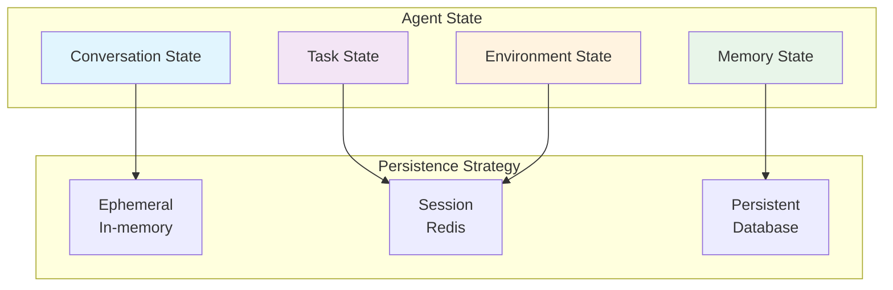
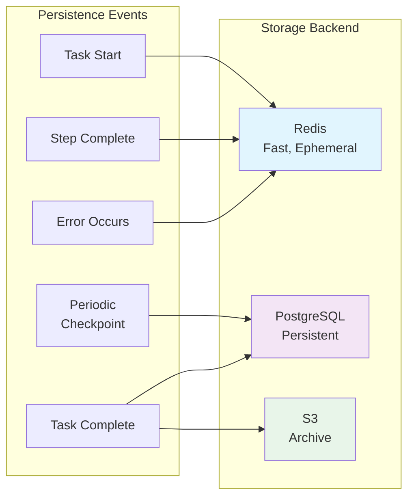

# 3. State Management

> **"State is the memory of an agent. Without proper state management, agents cannot learn, recover, or improve."**

State management is the practice of capturing, persisting, and restoring agent state across executions. It enables agents to resume from failures, maintain context over long-running workflows, and coordinate across multiple agent instances.

---

## 3.1 Agent State Types

### State Taxonomy



### Conversation State

Dialogue history and context.

```java
@Document(collection = "conversation_state")
public class ConversationState {
    @Id
    private String id;

    private String agentId;
    private String userId;
    private String sessionId;

    private List<Message> messages;
    private Map<String, Object> context;
    private Map<String, Object> metadata;

    private Instant createdAt;
    private Instant updatedAt;

    @Getter
    @Setter
    public static class Message {
        private String role;      // user, assistant, system, tool
        private String content;
        private Instant timestamp;
        private Map<String, Object> metadata;
    }
}

@Service
public class ConversationStateManager {

    @Autowired
    private MongoTemplate mongoTemplate;

    public ConversationState save(ConversationState state) {
        state.setUpdatedAt(Instant.now());
        return mongoTemplate.save(state);
    }

    public Optional<ConversationState> load(String sessionId) {
        return Optional.ofNullable(
            mongoTemplate.findById(
                sessionId,
                ConversationState.class
            )
        );
    }

    public void addMessage(
        String sessionId,
        Message message
    ) {
        ConversationState state = load(sessionId)
            .orElseGet(() -> createNew(sessionId));

        state.getMessages().add(message);
        save(state);
    }

    public List<Message> getRecentMessages(
        String sessionId,
        int limit
    ) {
        return load(sessionId)
            .map(ConversationState::getMessages)
            .map(messages -> messages.stream()
                .skip(Math.max(0, messages.size() - limit))
                .toList())
            .orElse(List.of());
    }
}
```

### Task State

Current progress and status of tasks.

```java
@Document(collection = "task_state")
public class TaskState {
    @Id
    private String id;

    private String agentId;
    private String taskId;
    private String userId;

    private TaskStatus status;
    private String currentStep;
    private List<String> completedSteps;

    private Map<String, Object> inputData;
    private Map<String, Object> outputData;
    private Map<String, Object> intermediateData;

    private ErrorInfo lastError;
    private int retryCount;

    private Instant createdAt;
    private Instant startedAt;
    private Instant completedAt;

    public enum TaskStatus {
        PENDING,
        IN_PROGRESS,
        BLOCKED,
        COMPLETED,
        FAILED,
        CANCELLED
    }

    @Getter
    @Setter
    public static class ErrorInfo {
        private String code;
        private String message;
        private String stackTrace;
        private Instant timestamp;
    }
}

@Service
public class TaskStateManager {

    @Autowired
    private MongoTemplate mongoTemplate;

    public TaskState create(TaskState state) {
        state.setCreatedAt(Instant.now());
        state.setStatus(TaskStatus.TaskStatus.PENDING);
        return mongoTemplate.save(state);
    }

    public TaskState update(
        String taskId,
        Consumer<TaskState> updater
    ) {
        TaskState state = load(taskId);
        updater.accept(state);
        state.setUpdatedAt(Instant.now());
        return mongoTemplate.save(state);
    }

    public void markInProgress(String taskId) {
        update(taskId, state -> {
            state.setStatus(TaskStatus.TaskStatus.IN_PROGRESS);
            if (state.getStartedAt() == null) {
                state.setStartedAt(Instant.now());
            }
        });
    }

    public void markCompleted(
        String taskId,
        Map<String, Object> output
    ) {
        update(taskId, state -> {
            state.setStatus(TaskStatus.TaskStatus.COMPLETED);
            state.setCompletedAt(Instant.now());
            state.setOutputData(output);
        });
    }

    public void markFailed(
        String taskId,
        String error,
        String stackTrace
    ) {
        update(taskId, state -> {
            state.setStatus(TaskStatus.TaskStatus.FAILED);
            state.setCompletedAt(Instant.now());

            TaskState.ErrorInfo errorInfo = new TaskState.ErrorInfo();
            errorInfo.setCode("TASK_FAILED");
            errorInfo.setMessage(error);
            errorInfo.setStackTrace(stackTrace);
            errorInfo.setTimestamp(Instant.now());
            state.setLastError(errorInfo);
        });
    }
}
```

### Memory State

Learned information and knowledge.

```java
@Document(collection = "memory_state")
public class MemoryState {
    @Id
    private String id;

    private String agentId;
    private String userId;

    private Map<String, Object> facts;           // Entity memories
    private List<Memory> episodicMemories;       // Past experiences
    private Map<String, Object> semanticMemory;  // Knowledge

    private Instant createdAt;
    private Instant updatedAt;

    @Getter
    @Setter
    public static class Memory {
        private String id;
        private String type;
        private String content;
        private Map<String, Object> metadata;
        private Instant timestamp;
        private double importance;  // 0-1
    }
}

@Service
public class MemoryStateManager {

    @Autowired
    private MongoTemplate mongoTemplate;

    public void storeFact(
        String agentId,
        String key,
        Object value
    ) {
        Query query = Query.query(
            Criteria.where("agentId").is(agentId)
        );
        Update update = new Update()
            .set("facts." + key, value)
            .set("updatedAt", Instant.now());

        mongoTemplate.upsert(query, update, MemoryState.class);
    }

    public Optional<Object> getFact(
        String agentId,
        String key
    ) {
        return Optional.ofNullable(
            mongoTemplate.findOne(
                Query.query(
                    Criteria.where("agentId").is(agentId)
                ),
                MemoryState.class
            )
        ).map(state -> state.getFacts().get(key));
    }

    public void addEpisodicMemory(
        String agentId,
        String content,
        double importance
    ) {
        Memory memory = new Memory();
        memory.setId(UUID.randomUUID().toString());
        memory.setType("episodic");
        memory.setContent(content);
        memory.setTimestamp(Instant.now());
        memory.setImportance(importance);

        Query query = Query.query(
            Criteria.where("agentId").is(agentId)
        );
        Update update = new Update()
            .push("episodicMemories", memory)
            .set("updatedAt", Instant.now());

        mongoTemplate.upsert(query, update, MemoryState.class);
    }

    public List<Memory> getImportantMemories(
        String agentId,
        double minImportance,
        int limit
    ) {
        return Optional.ofNullable(
            mongoTemplate.findOne(
                Query.query(
                    Criteria.where("agentId").is(agentId)
                ),
                MemoryState.class
            )
        )
            .map(MemoryState::getEpisodicMemories)
            .map(memories -> memories.stream()
                .filter(m -> m.getImportance() >= minImportance)
                .sorted(Comparator
                    .comparing(Memory::getTimestamp)
                    .reversed())
                .limit(limit)
                .toList())
            .orElse(List.of());
    }
}
```

---

## 3.2 Persistence Strategies

### When to Persist



### Redis Session Storage

Fast, ephemeral state for active sessions.

```java
@Service
public class RedisStateStore {

    @Autowired
    private RedisTemplate<String, Object> redisTemplate;

    private static final Duration SESSION_TTL = Duration.ofHours(24);

    public void saveSession(
        String sessionId,
        AgentState state
    ) {
        String key = "session:" + sessionId;
        redisTemplate.opsForValue().set(
            key,
            serialize(state),
            SESSION_TTL
        );
    }

    public Optional<AgentState> loadSession(String sessionId) {
        String key = "session:" + sessionId;
        Object data = redisTemplate.opsForValue().get(key);
        return Optional.ofNullable(data)
            .map(this::deserialize);
    }

    public void deleteSession(String sessionId) {
        String key = "session:" + sessionId;
        redisTemplate.delete(key);
    }

    public void updateSession(
        String sessionId,
        Consumer<AgentState> updater
    ) {
        AgentState state = loadSession(sessionId)
            .orElse(new AgentState());
        updater.accept(state);
        saveSession(sessionId, state);
    }

    private byte[] serialize(AgentState state) {
        // Serialize to JSON/MessagePack
        try {
            ObjectMapper mapper = new ObjectMapper();
            return mapper.writeValueAsBytes(state);
        } catch (Exception e) {
            throw new RuntimeException("Serialization failed", e);
        }
    }

    private AgentState deserialize(byte[] data) {
        try {
            ObjectMapper mapper = new ObjectMapper();
            return mapper.readValue(data, AgentState.class);
        } catch (Exception e) {
            throw new RuntimeException("Deserialization failed", e);
        }
    }
}
```

### PostgreSQL Persistent Storage

Durable state for long-term retention.

```java
@Service
public class PostgreSQLStateStore {

    @Autowired
    private JdbcTemplate jdbcTemplate;

    @Autowired
    private ObjectMapper objectMapper;

    public void saveState(AgentState state) {
        String sql = """
            INSERT INTO agent_state (
                id, agent_id, user_id, session_id,
                state_data, created_at, updated_at
            ) VALUES (?, ?, ?, ?, ?, ?, ?)
            ON CONFLICT (id) DO UPDATE SET
                state_data = EXCLUDED.state_data,
                updated_at = EXCLUDED.updated_at
            """;

        try {
            String stateJson = objectMapper.writeValueAsString(state);

            jdbcTemplate.update(sql,
                state.getId(),
                state.getAgentId(),
                state.getUserId(),
                state.getSessionId(),
                stateJson,
                state.getCreatedAt(),
                Instant.now()
            );

        } catch (JsonProcessingException e) {
            throw new RuntimeException("JSON serialization failed", e);
        }
    }

    public Optional<AgentState> loadState(String stateId) {
        String sql = "SELECT state_data FROM agent_state WHERE id = ?";

        return jdbcTemplate.query(sql,
            rs -> rs.next() ?
                Optional.of(deserializeState(rs.getString("state_data"))) :
                Optional.empty(),
            stateId
        );
    }

    public List<AgentState> loadStatesByAgent(String agentId) {
        String sql = """
            SELECT state_data FROM agent_state
            WHERE agent_id = ?
            ORDER BY updated_at DESC
            """;

        return jdbcTemplate.query(sql,
            (rs, rowNum) -> deserializeState(rs.getString("state_data")),
            agentId
        );
    }

    private AgentState deserializeState(String json) {
        try {
            return objectMapper.readValue(json, AgentState.class);
        } catch (JsonProcessingException e) {
            throw new RuntimeException("JSON deserialization failed", e);
        }
    }
}
```

---

## 3.3 State Recovery

### Checkpointing

Periodically save state during long-running tasks.

```java
@Service
public class CheckpointService {

    @Autowired
    private RedisStateStore redisStore;

    @Autowired
    private PostgreSQLStateStore postgresStore;

    private static final Duration CHECKPOINT_INTERVAL =
        Duration.ofMinutes(5);

    public void executeWithCheckpointing(
        String taskId,
        Consumer<CheckpointContext> task
    ) {
        CheckpointContext context = new CheckpointContext(taskId);

        // Load last checkpoint if exists
        loadCheckpoint(context).ifPresent(checkpoint -> {
            context.restore(checkpoint);
            log.info("Resumed from checkpoint: {}", taskId);
        });

        Instant lastCheckpoint = Instant.now();

        try {
            while (!context.isComplete()) {
                // Execute task step
                task.accept(context);

                // Check if we should checkpoint
                if (shouldCheckpoint(lastCheckpoint)) {
                    saveCheckpoint(context);
                    lastCheckpoint = Instant.now();
                }
            }

            // Final checkpoint
            saveCheckpoint(context);

        } catch (Exception e) {
            // Checkpoint on error
            saveCheckpoint(context);
            throw e;
        }
    }

    private boolean shouldCheckpoint(Instant lastCheckpoint) {
        return Duration.between(
            lastCheckpoint,
            Instant.now()
        ).compareTo(CHECKPOINT_INTERVAL) > 0;
    }

    private void saveCheckpoint(CheckpointContext context) {
        Checkpoint checkpoint = Checkpoint.builder()
            .taskId(context.getTaskId())
            .state(context.getState())
            .progress(context.getProgress())
            .timestamp(Instant.now())
            .build();

        // Save to Redis for fast recovery
        redisStore.saveCheckpoint(checkpoint);

        // Periodically save to PostgreSQL for durability
        if (context.getCheckpointCount() % 5 == 0) {
            postgresStore.saveCheckpoint(checkpoint);
        }

        context.incrementCheckpointCount();
    }

    private Optional<Checkpoint> loadCheckpoint(CheckpointContext context) {
        // Try Redis first (fast)
        Optional<Checkpoint> checkpoint =
            redisStore.loadCheckpoint(context.getTaskId());

        if (checkpoint.isEmpty()) {
            // Fall back to PostgreSQL (durable)
            checkpoint = postgresStore.loadCheckpoint(context.getTaskId());
        }

        return checkpoint;
    }
}
```

### Resume from Failure

Restore state and continue after failures.

```java
@Service
public class StateRecoveryService {

    @Autowired
    private TaskStateManager taskStateManager;

    @Autowired
    private CheckpointService checkpointService;

    public AgentResult resumeOrExecute(
        String taskId,
        Supplier<AgentResult> task
    ) {
        // Check if task exists
        Optional<TaskState> existingTask =
            taskStateManager.load(taskId);

        if (existingTask.isEmpty()) {
            // Execute new task
            return task.get();
        }

        TaskState taskState = existingTask.get();

        // Check status
        if (taskState.getStatus() == TaskStatus.TaskStatus.COMPLETED) {
            log.info("Task already completed: {}", taskId);
            return AgentResult.fromTaskState(taskState);
        }

        if (taskState.getStatus() == TaskStatus.TaskStatus.FAILED) {
            log.info("Resuming failed task: {}", taskId);

            // Increment retry count
            taskState.setRetryCount(
                taskState.getRetryCount() + 1
            );

            // Check if exceeded max retries
            if (taskState.getRetryCount() > 3) {
                log.error("Max retries exceeded for task: {}", taskId);
                return AgentResult.failed("Max retries exceeded");
            }

            // Restore checkpoint
            restoreCheckpoint(taskId);

            // Resume task
            return task.get();
        }

        // Task is in progress, resume
        log.info("Resuming in-progress task: {}", taskId);
        return task.get();
    }

    private void restoreCheckpoint(String taskId) {
        checkpointService.executeWithCheckpointing(taskId, context -> {
            // Task execution logic here
            // Context will be restored from checkpoint
        });
    }
}
```

---

## 3.4 Distributed State

### Multi-Agent Coordination

Share state across multiple agent instances.

```java
@Service
public class DistributedStateService {

    @Autowired
    private RedisTemplate<String, Object> redisTemplate;

    public void publishStateUpdate(
        String agentId,
        String key,
        Object value
    ) {
        String channel = "agent:" + agentId + ":state";

        StateUpdate update = StateUpdate.builder()
            .agentId(agentId)
            .key(key)
            .value(value)
            .timestamp(Instant.now())
            .build();

        redisTemplate.convertAndSend(channel, update);

        // Also store in shared state
        String stateKey = "shared:agent:" + agentId + ":" + key;
        redisTemplate.opsForValue().set(stateKey, value);
    }

    public void subscribeToStateUpdates(
        String agentId,
        Consumer<StateUpdate> handler
    ) {
        String channel = "agent:" + agentId + ":state";

        redisTemplate.getConnectionFactory()
            .getConnection()
            .subscribe(new MessageListener() {
                @Override
                public void onMessage(
                    Message message,
                    byte[] pattern
                ) {
                    try {
                        String body = new String(message.getBody());
                        StateUpdate update = objectMapper.readValue(
                            body,
                            StateUpdate.class
                        );
                        handler.accept(update);

                    } catch (Exception e) {
                        log.error("Failed to process state update", e);
                    }
                }
            }, channel);
    }

    public Object getSharedState(
        String agentId,
        String key
    ) {
        String stateKey = "shared:agent:" + agentId + ":" + key;
        return redisTemplate.opsForValue().get(stateKey);
    }
}
```

### Distributed Locks

Prevent race conditions in multi-agent scenarios.

```java
@Service
public class DistributedLockService {

    @Autowired
    private StringRedisTemplate redisTemplate;

    private static final Duration LOCK_TTL = Duration.ofSeconds(30);

    public Optional<Lock> acquireLock(
        String resourceId,
        Duration timeout
    ) {
        String lockKey = "lock:" + resourceId;
        String lockValue = UUID.randomUUID().toString();

        Boolean acquired = redisTemplate.opsForValue()
            .setIfAbsent(
                lockKey,
                lockValue,
                LOCK_TTL
            );

        if (Boolean.TRUE.equals(acquired)) {
            return Optional.of(new Lock(lockKey, lockValue));
        }

        return Optional.empty();
    }

    public void releaseLock(Lock lock) {
        // Lua script to ensure we only release our own lock
        String script = """
            if redis.call("get", KEYS[1]) == ARGV[1] then
                return redis.call("del", KEYS[1])
            else
                return 0
            end
            """;

        redisTemplate.execute(
            new DefaultRedisScript<>(script, Long.class),
            Collections.singletonList(lock.getKey()),
            lock.getValue()
        );
    }

    @Getter
    public static class Lock implements AutoCloseable {
        private final String key;
        private final String value;

        @Override
        public void close() {
            // Release lock automatically
            distributedLockService.releaseLock(this);
        }
    }
}

// Usage
@Service
public class AgentCoordinator {

    @Autowired
    private DistributedLockService lockService;

    public void executeWithLock(
        String resourceId,
        Runnable operation
    ) {
        Optional<Lock> lock = lockService.acquireLock(
            resourceId,
            Duration.ofSeconds(10)
        );

        if (lock.isEmpty()) {
            throw new ConcurrentExecutionException(
                "Resource is locked: " + resourceId
            );
        }

        try (Lock acquired = lock.get()) {
            operation.run();

        } catch (Exception e) {
            log.error("Operation failed", e);
            throw e;
        }
    }
}
```

---

## 3.5 State Migration

### Schema Evolution

Handle state schema changes over time.

```java
@Service
public class StateMigrationService {

    private final List<StateMigration> migrations = new ArrayList<>();

    @PostConstruct
    public void init() {
        // Register migrations in order
        registerMigration(new Migration_1_2());
        registerMigration(new Migration_2_3());
    }

    public AgentState migrate(AgentState oldState) {
        int currentVersion = oldState.getSchemaVersion();
        AgentState state = oldState;

        for (StateMigration migration : migrations) {
            if (migration.getFromVersion() == currentVersion) {
                state = migration.migrate(state);
                currentVersion = migration.getToVersion();
            }
        }

        return state;
    }

    private static class Migration_1_2 implements StateMigration {
        @Override
        public int getFromVersion() { return 1; }

        @Override
        public int getToVersion() { return 2; }

        @Override
        public AgentState migrate(AgentState state) {
            // Add new fields
            state.setMetadata(new HashMap<>());

            // Rename fields
            if (state.containsKey("old_field")) {
                state.put("new_field", state.get("old_field"));
                state.remove("old_field");
            }

            state.setSchemaVersion(2);
            return state;
        }
    }
}
```

---

## 3.6 Key Takeaways

### State Types

| Type | Purpose | Storage | Duration |
|------|---------|---------|----------|
| **Conversation** | Dialogue history | Redis | Hours |
| **Task** | Task progress | PostgreSQL | Days |
| **Memory** | Learned info | PostgreSQL | Permanent |

### Persistence Strategy

- **Redis**: Fast, ephemeral, session state
- **PostgreSQL**: Durable, long-term state
- **S3**: Archive, cold storage

### Recovery Pattern

```
Execute → Checkpoint → Error → Restore → Resume
```

### Distributed State

- **Pub/Sub**: Real-time updates
- **Shared State**: Common data
- **Distributed Locks**: Prevent conflicts

---

## 3.7 Next Steps

**Continue your journey:**
- → **[4. Error Handling & Recovery](../error-handling)** - Advanced error strategies
- → **[5. Observability](../observability)** - Monitoring and tracing

---

:::tip Checkpoint Frequently
The more frequently you checkpoint, the less work you lose on failure. Balance checkpoint frequency with overhead.
:::

:::warning Test Recovery
Don't assume state recovery works. Test it regularly by killing processes mid-execution.
:::

:::info Use TTL
Set TTL on ephemeral state to prevent memory leaks. Not all state needs to live forever.
:::
