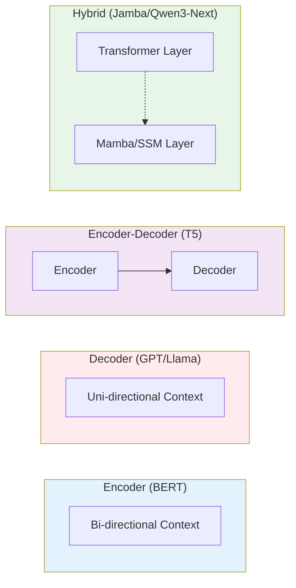

# Introduction to Large Language Models

> **"LLMs are not just text predictors; they are compressed representations of the world's knowledge, accessible through natural language."**

Large Language Models (LLMs) represent a paradigm shift in Artificial Intelligence, moving from task-specific models to general-purpose reasoning engines. For software engineers and AI practitioners, understanding LLMs requires looking beyond the hype and grasping the underlying statistical and architectural principles that drive them.

---

## What is an LLM?

At its core, an LLM is a probabilistic engine that predicts the next token based on previous context. While the mathematical formulation involves conditional probabilities, for engineers it's more useful to understand **what LLMs can do** rather than the underlying math.

### Modern LLM Capabilities

LLMs have evolved from simple text completion to sophisticated reasoning engines:

- **Code Generation**: Write, debug, and explain code across multiple languages
- **Document Analysis**: Extract insights from technical documentation, research papers, and contracts
- **Conversation Systems**: Maintain context across multi-turn dialogue with memory
- **Tool Use**: Interact with APIs, databases, and external systems
- **Multi-step Reasoning**: Break down complex problems into intermediate steps

### The Engineering Perspective

For production systems, think of LLMs as **text-to-text transformations**:

```java
// Conceptual view: LLM as text processor
Input: "Summarize this document: [content]"
Processing: Model traverses layers of attention and feed-forward networks
Output: "[summary]"
```

The key insight: LLMs learn patterns from training data and apply them during inference. They don't "know" facts in the human sense—they've seen statistical correlations that they can reproduce.

---

## Spring AI Integration Setup

Spring AI provides a unified abstraction layer for working with LLMs in Spring Boot applications. This simplifies switching between models and providers while maintaining consistent APIs.

### Basic ChatClient Configuration

```java
// application.properties (using Doppler for environment variables)
spring.ai.openai.api-key=${OPENAI_API_KEY}
spring.ai.anthropic.api-key=${ANTHROPIC_API_KEY}

// Or use the recommended Doppler injection pattern:
// spring.ai.openai.api-key=${doppler.OPENAI_API_KEY}
```

```java
// Service layer for LLM interactions
@Service
public class LLMChatService {
    private final ChatClient chatClient;

    public LLMChatService(ChatModel chatModel) {
        this.chatClient = ChatClient.builder(chatModel).build();
    }

    public String chat(String userMessage) {
        return chatClient.prompt()
            .user(userMessage)
            .call()
            .content();
    }

    // Streaming responses for real-time applications
    public Flux<String> chatStream(String userMessage) {
        return chatClient.prompt()
            .user(userMessage)
            .stream()
            .content();
    }
}
```

### Model Selection Guide

Choosing the right model depends on your use case, budget, and performance requirements:

| Use Case | Recommended Model | Why |
|----------|------------------|-----|
| **Code Generation & Debugging** | Claude 3.5/4 Sonnet | Highest SWE-Bench scores (72.5%), excels at refactoring |
| **General-Purpose Chat** | GPT-4o or Llama 3.1 405B | Balanced performance, good reasoning |
| **Long Document Analysis** | Gemini 2.5 Pro | 1M-2M token context window |
| **Cost-Sensitive Applications** | GPT-4o-mini or Llama 3.1 8B | 10-20x cheaper, sufficient for simple tasks |
| **On-Premise Deployment** | Llama 3.1 405B or Mixtral 8x22B | Open-source, parity with closed models |
| **Multilingual Applications** | Qwen2.5 72B | Strong non-English performance |
| **Complex Reasoning** | OpenAI o1 or Claude 3.5 Sonnet | Explicit reasoning chains, math/science tasks |

### Configuration Example

```java
@Configuration
public class LLMConfiguration {

    @Bean
    public ChatModel chatModel(OpenAiApi openAiApi) {
        return OpenAiChatModel.builder()
            .openAiApi(openAiApi)
            .options(OpenAiChatOptions.builder()
                .model("gpt-4")
                .temperature(0.7)
                .maxTokens(2000)
                // Understanding these parameters:
                // - temperature: Controls randomness (0.0 = deterministic, 1.0 = creative)
                // - maxTokens: Limits response length
                // - topP: Nucleus sampling (0.9 = keep 90% probability mass)
                // - presencePenalty: Reduces repetition
                .build())
            .build();
    }

    // For long-context use cases
    @Bean
    public ChatModel longContextModel() {
        return OpenAiChatModel.builder()
            .options(OpenAiChatOptions.builder()
                .model("gpt-4-turbo")  // 128K context
                .maxTokens(4000)
                .build())
            .build();
    }
}
```

---

## Model Architectures: The "Big Three" + Modern Evolutions

In 2017, the "Attention Is All You Need" paper introduced the Transformer. Since then, the architecture has branched into three distinct families and hybrid variants. You **must** know the difference between these for interviews.

### 1. Encoder-Only (Auto-Encoding)
- **Mechanism**: Corrupts input (masks words) and tries to reconstruct it using bidirectional context (looking at both left and right context).
- **Core Ability**: "Understanding" and classification. These models create rich vector representations of text.
- **Use Cases**: Sentiment analysis, Named Entity Recognition (NER), Search/Embeddings.
- **Examples**: BERT, RoBERTa, DistilBERT.

### 2. Decoder-Only (Auto-Regressive)
- **Mechanism**: Predicts the next token based *only* on previous tokens (causal masking). It cannot "see" the future.
- **Core Ability**: Generative tasks.
- **Use Cases**: Chatbots, Code Generation, Storytelling.
- **Examples**: GPT-3/4, Llama 3/4, Claude, Gemini.
- **Note**: This is the dominant architecture for modern "Generative AI" with the emergence of Mixture-of-Experts (MoE) variants.

### 3. Encoder-Decoder (Seq2Seq)
- **Mechanism**: An Encoder processes the input into a context vector, and a Decoder generates output.
- **Core Ability**: Transforming one sequence into another.
- **Use Cases**: Translation (English → French), Summarization (Long Article → Abstract).
- **Examples**: T5, BART.

### 4. Hybrid Architectures (2024+)
**The Latest Frontier**: Combining Transformer blocks with State Space Models (SSM) like Mamba.

- **Mechanism**: Interleaves Transformer attention layers with linear-complexity SSM layers.
- **Advantages**:
  - **O(n) complexity** instead of O(n²) for attention
  - **Better long-context modeling** without memory blowout
  - **Maintains strong performance** on benchmarks
- **Examples**:
  - **Jamba** (AI21 Labs): Transformer + Mamba hybrid
  - **RecurrentGemma** (Google): Griffin architecture mixing attention and linear recurrence
  - **Qwen3-Next**: Uses Gated DeltaNets for linear attention
  - **Nemotron 3** (NVIDIA): Incorporates Mamba-2 layers
- **Performance**: Research shows these hybrids often outperform pure Transformers or pure SSM models.



---

## State-of-the-Art Models (2025)

As of 2025, the LLM landscape has converged on a few key players with distinct strengths:

### Closed-Source Models

| Model | Parameters | Context Window | Key Strengths | Best For |
|-------|-----------|----------------|---------------|----------|
| **Claude 3.5/4 Sonnet** | ~175B | 200K tokens | Coding (72.5% SWE-Bench), complex reasoning, long-form autonomy | Software development, deep analysis, extended conversations |
| **GPT-4o** | ~200B (est.) | 128K tokens | General-purpose performance, multimodal (text/image/audio), creative writing | Everyday tasks, marketing content, multimodal applications |
| **Gemini 2.5 Pro** | ~500B (est.) | **1M-2M tokens** | Massive context, multimodal, Google ecosystem integration | Long-document analysis, enterprise workflows, complex reasoning |
| **OpenAI o1/o3 series** | Unknown | Moderate | **Explicit reasoning chains**, advanced math/problem-solving | Scientific reasoning, complex math, research tasks |

### Open-Source Models

| Model | Parameters | Context Window | Key Strengths | Best For |
|-------|-----------|----------------|---------------|----------|
| **Llama 3.1 405B** | 405B | 128K tokens | **Parity with closed models** (87.3% MMLU), excellent math/coding | Server-side deployment, cost-effective alternatives |
| **Llama 4** | TBD (MoE) | 128K tokens | Competitive with GPT-4/Gemini 2.0, improved reasoning | Open-source alternatives to frontier models |
| **Mixtral 8x22B** | 141B (MoE) | 32K-64K tokens | **Mixture-of-Experts efficiency**, fast inference | Efficient deployment, good performance-to-cost ratio |
| **Qwen2.5** | 72B | 32K tokens | Strong coding/math, multilingual support | Asian languages, technical tasks |

### Key Insights for 2025

1. **Mixture-of-Experts (MoE) is the new standard**: Instead of activating all parameters for every token, MoE models route tokens to specialized "expert" sub-networks. This allows models to be HUGE (405B+ parameters) while only activating a fraction (e.g., 8B) per forward pass.

2. **Context window arms race**:
   - Standard: 32K-128K tokens
   - Long-context: 200K-1M tokens (Claude, Gemini)
   - Cutting-edge: 2M+ tokens (Gemini 2.0 Pro)
   - **Technique**: Ring Attention, linear attention, and Forgetting Transformers (FoX)

3. **Reasoning capabilities**: Models like OpenAI's o1 and Anthropic's Claude 3.5 show "thinking" patterns, indicating a shift toward explicit reasoning rather than pure next-token prediction.

4. **The gap is closing**: Open models (Llama 3.1 405B) now match or exceed closed models on many benchmarks, making open-source viable for enterprise deployment.

---

## Key Terminology

### Parameters
The weights and biases of the neural network.
- **7B Parameters**: Capable of running on consumer hardware (MacBook M3, gaming PC with GPU).
- **13B-70B Parameters**: Requires decent GPU (A40/A100) for production use.
- **100B+ Parameters**: Requires enterprise GPUs (H100 cluster) or efficient MoE architecture.
- **Trillions**: Frontier models (presumed GPT-4, Gemini Ultra) use MoE to effectively achieve this scale.

### Context Window
The amount of text (in tokens) the model can "keep in mind" at once.
- **Standard**: 8k - 32k tokens (~30-120 pages).
- **Long Context**: 128k (GPT-4o, Llama 3.1), 200k (Claude).
- **Massive Context**: 1M-2M (Gemini 2.0 Pro) - equivalent to multiple books or entire codebases.
- **Trade-off**: Longer context traditionally required O(n²) compute during attention, but techniques like **Ring Attention**, **Linear Attention**, and **Forgetting Transformers** reduce this to O(n).

### Mixture-of-Experts (MoE)
A technique to scale model capacity without proportional compute increase.
- **How it works**: Each token is routed to a subset of "expert" sub-networks (e.g., 8 out of 224 experts).
- **Benefits**: Model can have huge total parameters (405B+) but only activate a small fraction per token (e.g., 21B active).
- **Examples**: Mixtral 8x22B, Llama 4, GPT-4 (rumored).

### Training Stages
1. **Pre-training**: The expensive part. Learning language patterns from internet-scale data (trillions of tokens).
   - **Result**: Base Model (can complete text but doesn't follow instructions)
   - **Cost**: Millions of dollars, thousands of GPUs, weeks of training

2. **Supervised Fine-Tuning (SFT)**: Teaching the model to follow instructions using high-quality Q&A datasets.
   - **Result**: Chat/Instruct Model (understands conversational intent)
   - **Data**: Millions of instruction-response pairs, often curated by humans

3. **Alignment (RLHF/DPO/GRPO)**: Refining behavior to be helpful, harmless, and honest.
   - **RLHF**: Reinforcement Learning from Human Feedback (GPT-style)
   - **DPO**: Direct Preference Optimization (simpler, more stable)
   - **GRPO**: Group Relative Policy Optimization (newer, more efficient; from DeepSeek R1)
   - **Result**: Aligned Model that refuses harmful requests and follows user intent

---

## Interview FAQ

<details>
<summary><strong>Q: Why did Transformers replace RNNs/LSTMs?</strong></summary>

**A:** Two main reasons:
1. **Parallelization**: RNNs process word-by-word sequentially ($t_1, t_2, ...$), making training on GPUs inefficient. Transformers process the whole sequence at once using matrix operations.
2. **Long-term Dependencies**: RNNs "forget" information over long sequences due to the vanishing gradient problem. The Attention mechanism connects *every* token to *every other* token directly, making the "distance" between any two words effectively 1.

**2025 Update**: However, Transformers have O(n²) complexity. New hybrid models (Transformer + Mamba/SSM) combine the best of both: parallel training and efficient O(n) inference for long contexts.
</details>

<details>
<summary><strong>Q: What is the difference between a Base Model and an Instruct Model?</strong></summary>

**A:** A **Base Model** (e.g., Llama-3-Base) is trained only to predict the next token. If you ask it "What is the capital of France?", it might reply "And what is the capital of Germany?" because it thinks it's completing a list of quiz questions.

An **Instruct Model** (e.g., Llama-3-Instruct) has undergone **SFT (Supervised Fine-Tuning)** on instruction-response pairs. It understands the *intent* of a query and knows how to act as an assistant.

**Key Insight**: Always use Instruct/Chat models for user-facing applications. Base models are only useful for continued pre-training or research.
</details>

<details>
<summary><strong>Q: Can an LLM learn new knowledge at inference time?</strong></summary>

**A:** No, the model's weights are frozen after training. It can learn *temporarily* through **In-Context Learning** (putting the info in the prompt), but once that context window is closed, the knowledge is gone.

To "teach" an LLM new knowledge, you have three options:
1. **Fine-tuning**: Update the model weights on new data (expensive, requires expertise)
2. **RAG (Retrieval Augmented Generation)**: Retrieve relevant documents and include them in the prompt (most common)
3. **Prompt Engineering**: Provide the knowledge directly in the system prompt or user message (for small, static knowledge)
</details>

<details>
<summary><strong>Q: What is Mixture-of-Experts (MoE) and why is it important?</strong></summary>

**A:** MoE is an architectural innovation that decouples model size from computational cost. Instead of activating all parameters for every token (as in dense models), MoE models route each token to a small subset of specialized "expert" sub-networks.

**Example**: Mixtral 8x22B has 141B total parameters but only activates ~39B per token (8 experts × ~5B each).

**Benefits**:
- **Scale**: Can build massive models (400B+) without proportional inference costs
- **Specialization**: Different experts can specialize in different domains (coding, math, creative writing)
- **Efficiency**: Faster inference and lower memory usage than equivalent dense models

**Trade-offs**:
- **Training complexity**: Requires careful load balancing to ensure all experts are utilized
- **Implementation complexity**: Need to implement routing logic and expert selection

**2025 State**: Most frontier models (GPT-4, Llama 4, Gemini) are believed to use MoE to achieve their scale.
</details>

<details>
<summary><strong>Q: How do long-context models (1M+ tokens) work without running out of memory?</strong></summary>

**A:** Traditional attention has O(n²) complexity, meaning a 1M-token context would require ~1 trillion operations per attention layer. Modern models use several techniques:

1. **Ring Attention**: Distribute the sequence across multiple GPUs, each computing attention for a subset. Pass "boundary" information between devices like a ring.

2. **Linear Attention**: Replace the quadratic softmax attention with linear-complexity alternatives (e.g., Mamba, Gated DeltaNets). These achieve O(n) complexity.

3. **Sliding Window / Local Attention**: Only attend to nearby tokens, using a global "cache" for distant important information.

4. **Forgetting Transformers (FoX)**: Selectively "forget" less relevant information, maintaining a bounded memory state.

**Trade-off**: Some of these methods sacrifice theoretical modeling power for practical efficiency. However, hybrid models (Transformer + SSM) often achieve 95%+ of Transformer quality at a fraction of the cost.
</details>

<details>
<summary><strong>Q: What's the difference between RLHF, DPO, and GRPO?</strong></summary>

**A:** These are three methods for aligning LLMs with human preferences:

**RLHF (Reinforcement Learning from Human Feedback)**:
- **Process**: Train a reward model on human preference data → Use PPO (Proximal Policy Optimization) to optimize the LLM
- **Pros**: Well-established, strong results
- **Cons**: Complex, requires training a separate reward model, unstable

**DPO (Direct Preference Optimization)**:
- **Process**: Directly optimize the policy using preference pairs without a reward model
- **Pros**: Simpler, more stable, easier to implement
- **Cons**: Can be less sample-efficient than RLHF

**GRPO (Group Relative Policy Optimization)**:
- **Process**: Newer method (from DeepSeek R1) that optimizes groups of outputs relative to each other
- **Pros**: More efficient than RLHF, better for reasoning tasks, includes improvements like active sampling and token-level loss
- **Cons**: Newer, less battle-tested

**2025 State**: GRPO and DPO are becoming preferred over traditional RLHF due to simplicity and stability. Many state-of-the-art models (DeepSeek, Llama 4) use these newer methods.
</details>

---

## Summary for Interviews

1. **LLMs are probabilistic next-token predictors** that exhibit emergent reasoning capabilities at scale.
2. **Transformer architecture** (2017) enabled parallel training and long-range dependencies, but **hybrid models** (2024+) are improving efficiency.
3. **Three main architectures**: Encoder-only (BERT), Decoder-only (GPT, Llama), Encoder-Decoder (T5). **Decoder-only dominates** generative AI.
4. **2025 state-of-the-art**: Claude 3.5/4 (coding/reasoning), GPT-4o (multimodal), Gemini 2.5 (1M+ context), Llama 3.1/4 (open-source parity).
5. **Mixture-of-Experts (MoE)** is key to scaling models beyond 100B parameters efficiently.
6. **Training pipeline**: Pre-training → SFT → Alignment (RLHF/DPO/GRPO).
7. **In-context learning ≠ learning**: Weights are frozen; use RAG for external knowledge.
8. **Long context is now mainstream**: 128K-1M tokens via Ring Attention, linear attention, and hybrid architectures.

:::tip Further Reading
- [The State of LLMs 2025](https://magazine.sebastianraschka.com/p/state-of-llms-2025) - Comprehensive analysis of 2024-2025 advances
- [Hybrid Architectures for Language Models](https://arxiv.org/html/2510.04800v1) - Systematic analysis of Transformer + SSM hybrids
- [Attention Is All You Need (2017)](https://arxiv.org/abs/1706.03762) - The original Transformer paper
:::
