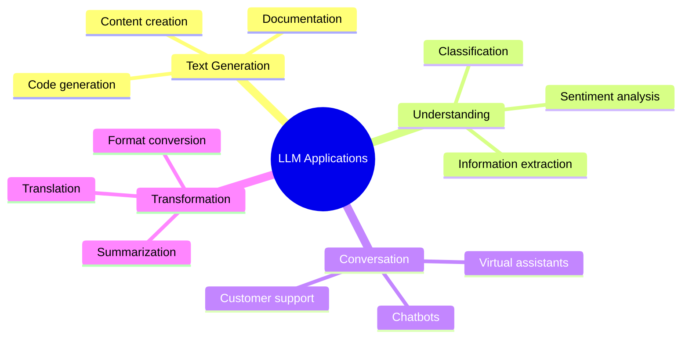

# LLM Fundamentals

Large Language Models (LLMs) represent a paradigm shift in how machines understand and generate human language. This section provides a comprehensive foundation in LLM architecture, training, and practical deployment.

## Overview

### What are LLMs?

**Large Language Models** are neural networks trained on vast amounts of text data to understand, generate, and manipulate human language. They are built on the **Transformer architecture**, which enables them to process sequences of text with remarkable efficiency and accuracy.

Key characteristics:
- **Scale**: Trained on billions to trillions of tokens
- **Generalization**: Can handle diverse tasks without task-specific training
- **Generation**: Produce coherent, contextually relevant text
- **Understanding**: Demonstrate emergent reasoning and comprehension abilities

### Why LLM Fundamentals Matter

| Aspect | Impact on Development |
|--------|----------------------|
| **Architecture Knowledge** | Understanding token limits, context windows, and model constraints |
| **Training Process** | Knowing how models learn helps with prompt engineering and fine-tuning |
| **Inference Behavior** | Anticipating model outputs, latency, and resource requirements |
| **Limitations Awareness** | Recognizing and mitigating hallucinations, biases, and failure modes |

## Core Components

### 1. Tokenization

Tokenization is the first step in LLM processing - breaking text into smaller units called **tokens**.

**Key Concepts:**
- Tokens can be words, subwords, or characters
- Different tokenization strategies (BPE, WordPiece, SentencePiece)
- Impact on model performance and multilingual support
- Token limits and context window constraints

**Why It Matters:**
```
Text: "Artificial Intelligence is transforming the world"
Tokens: ["Art", "ificial", " Int", "elligence", " is", " trans", "form", "ing", " the", " world"]

Token count influences:
- API costs (billed per token)
- Context capacity
- Processing speed
```

### 2. Embeddings

Embeddings convert tokens into dense **vector representations** that capture semantic meaning.

**Key Concepts:**
- High-dimensional vector spaces (768, 1024, 1536+ dimensions)
- Semantic similarity via cosine distance
- Contextual embeddings vs. static embeddings
- Vector databases for semantic search

**Applications:**
```java
// Spring AI: Embedding Generation
EmbeddingResponse response = embeddingModel.embed(
    List.of("Hello world", "Hi there")
);

// Compare similarity
double similarity = CosineSimilarity.between(
    response.getResults().get(0).getOutput(),
    response.getResults().get(1).getOutput()
);
```

### 3. Transformer Architecture

The **Transformer** is the neural network architecture powering modern LLMs.

**Key Components:**
- **Self-Attention**: Mechanism for understanding token relationships
- **Multi-Head Attention**: Parallel attention mechanisms
- **Positional Encoding**: Preserving sequence order
- **Feed-Forward Networks**: Processing attended information
- **Layer Normalization**: Stabilizing training

**Architecture Impact:**
```
Input Text → Tokenization → Embedding + Positional Encoding
    → Multiple Transformer Layers
        → Each Layer: Multi-Head Attention + Feed-Forward
    → Output Projection → Probability Distribution
```

### 4. Inference

Inference is the process of generating outputs from trained models.

**Key Concepts:**
- **Decoding Strategies**: Greedy, beam search, sampling
- **Temperature**: Controlling randomness
- **Top-k / Top-p**: Nucleus sampling
- **Token streaming**: Real-time response generation

**Practical Considerations:**
```java
// Spring AI: Inference Configuration
ChatResponse response = chatClient.prompt()
    .user("Explain quantum computing")
    .options(OpenAiChatOptions.builder()
        .temperature(0.7)        // Creativity
        .topP(0.9)              // Nucleus sampling
        .maxTokens(1000)         // Response length
        .build())
    .call()
    .chatResponse();
```

### 5. Training Pipeline

Understanding how LLMs are trained informs effective usage and fine-tuning strategies.

**Training Stages:**
1. **Pre-training**: Learning from unlabeled text data (self-supervised)
2. **Fine-tuning**: Adapting to specific tasks (supervised)
3. **Alignment**: Ensuring safe, helpful outputs (RLHF, DPO)

**Training Considerations:**
| Stage | Data | Objective | Compute |
|-------|------|-----------|---------|
| **Pre-training** | Internet text | Predict next token | Massive (1000s of GPUs) |
| **Fine-tuning** | Task-specific data | Learn task patterns | Moderate |
| **Alignment** | Human feedback | Match preferences | Variable |

### 6. Cognitive Limitations

LLMs have important limitations that developers must understand and mitigate.

**Key Limitations:**
- **Hallucinations**: Generating plausible but false information
- **Context Window**: Limited memory of conversation history
- **Temporal Blindness**: No knowledge of events after training
- **Reasoning Gaps**: Struggles with multi-step logical deduction
- **Math & Precision**: Not inherently good at calculation

**Mitigation Strategies:**
```
Hallucination → RAG (Retrieval-Augmented Generation)
Context Limits → Memory systems, summarization
Temporal Issues → Tool use (web search, APIs)
Reasoning → Chain-of-thought prompting
Math → Calculator tools, code interpretation
```

## Learning Path

### Recommended Sequence

1. **Introduction** → Understand what LLMs are and their evolution
2. **Tokenization** → Grasp how text becomes model input
3. **Embeddings** → Learn semantic representation
4. **Transformer Architecture** → Understand model internals
5. **Inference** → Learn how to use models effectively
6. **Training Pipeline** → See how models are created
7. **Limitations** → Recognize and work around constraints

### For Different Roles

| Role | Focus Areas |
|------|-------------|
| **ML Engineers** | Training Pipeline, Transformer Architecture |
| **Application Developers** | Tokenization, Inference, Limitations |
| **Data Scientists** | Embeddings, Training, Fine-tuning |
| **Product Managers** | Limitations, Capabilities, Use Cases |

## Practical Applications

### Common Use Cases



### Integration Patterns

**Spring Boot + LLM:**
```java
@Service
public class LLMService {

    @Autowired
    private ChatModel chatModel;

    public String analyzeSentiment(String text) {
        return chatClient.prompt()
            .user("Analyze sentiment: " + text)
            .call()
            .content();
    }
}
```

**Next.js + LLM:**
```typescript
import { OpenAI } from 'openai';

const openai = new OpenAI();

export async function analyzeSentiment(text: string) {
  const response = await openai.chat.completions.create({
    model: 'gpt-4',
    messages: [{ role: 'user', content: `Analyze sentiment: ${text}` }]
  });

  return response.choices[0].message.content;
}
```

## Key Takeaways

### Essential Knowledge

1. **Tokens are the currency**: Understand tokenization for cost and performance optimization
2. **Context windows constrain memory**: Plan for limited conversational context
3. **Embeddings enable semantic search**: Vector similarity drives RAG and retrieval
4. **Training determines capabilities**: Pre-training vs. fine-tuning vs. alignment
5. **Inference parameters control output**: Temperature, top-p, and max tokens shape responses
6. **Limitations require mitigation**: Use tools, RAG, and careful prompting

### Development Best Practices

1. **Start simple**: Use basic prompts before advanced techniques
2. **Measure tokens**: Track input/output costs and context usage
3. **Handle errors gracefully**: LLMs can fail or timeout
4. **Cache responses**: Reduce redundant API calls
5. **Use streaming**: Provide real-time feedback for long generations
6. **Validate outputs**: Don't assume LLM responses are correct

---

## Next Steps

**Continue your LLM journey:**

1. **→ [1. Introduction](./01-introduction)** - Evolution from GPT to current models
2. **→ [2. Tokenization](./02-tokenization)** - Understanding text processing
3. **→ [3. Embeddings](./03-embeddings)** - Semantic vector representations
4. **→ [4. Transformer Architecture](./04-transformer-architecture)** - Model internals
5. **→ [5. Inference](./05-inference)** - Generating outputs
6. **→ [6. Training Pipeline](./07-training-pipeline)** - How models learn
7. **→ [7. Cognitive Limitations](./06-limitations)** - Working with constraints

---

:::tip Start Here
New to LLMs? Begin with **[Introduction](./01-introduction)** to understand the evolution and core concepts before diving into technical details.
:::

:::info Practical Focus
Each section includes **Spring AI** and **Next.js** code examples showing how to apply concepts in real applications.
:::
