# 1. RAG Foundation (基础理论与核心架构)

This chapter establishes the foundational understanding of Retrieval-Augmented Generation (RAG) systems, focusing on core concepts, theoretical principles, and architectural intuition. We'll build from first principles to understand why RAG works, how it fits into the AI landscape, and what makes it an essential pattern for production AI systems.

---

## 1.1 RAG 的核心定义与直觉 (Definition & Intuition)

### 1.1.1 RAG 的标准定义

**Retrieval-Augmented Generation (RAG)** 是一种通过检索外部知识库来增强大语言模型生成能力的 AI 架构模式。该方法由 Facebook AI Research (现 Meta AI) 于 2020 年首次提出，核心思想是将**信息检索**与**文本生成**相结合，让 LLM 在生成答案时能够访问实时、准确的外部知识。

RAG 由三个核心组件构成：

1. **Retriever (检索器)**: 从知识库中检索与查询相关的内容
2. **Knowledge Source (知识源)**: 结构化或非结构化的外部数据存储
3. **Generator (生成器)**: 基于检索到的上下文生成最终答案

**标准工作流程**:
```
用户查询 → 检索相关文档 → 将文档注入 Prompt → LLM 生成答案
```

### 1.1.2 核心隐喻：从 LLM 的"闭卷考试"到"开卷考试"

要理解 RAG 的价值，最直观的方式是通过考试隐喻：

**LLM without RAG = 闭卷考试 (Closed-book Exam)**

想象你参加一场闭卷考试：
- 你只能依靠记忆中的知识来回答问题
- 如果考试包含你从未学过的内容，你只能猜测或胡编
- 你的知识截止于备考结束的那一天（训练数据截止）
- 对于超冷门的知识点，你可能完全没见过

**LLM with RAG = 开卷考试 (Open-book Exam)**

现在想象同一场考试，但允许你参考教科书：
- 你可以查找相关章节来准确回答问题
- 即使是新知识，只要在教科书中，你就能回答
- 你可以引用来源，展示答案的依据
- 压力大幅降低，答案更准确可靠

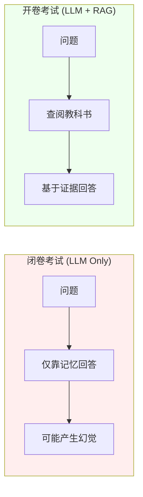

**关键洞察**: RAG 本质上给了 LLM 一个"参考书库"，让它从"闭卷"变成"开卷"，从而大幅提升答案的准确性和可信度。

### 1.1.3 第一性原理：RAG 不是学习，而是基于语义距离的信息搬运

从第一性原理看，RAG 解决的核心问题是：**如何在不改变模型参数的情况下，让 LLM 访问外部知识？**

**RAG 不是学习 (Learning)**:
- 微调 (Fine-tuning) 是学习：通过修改模型权重来内化知识
- RAG 不是学习：模型参数保持不变，知识通过 Prompt 临时注入

**RAG 是信息搬运 (Information Retrieval + Context Injection)**:

```
核心方程:

Answer = LLM(Context(Query) + Query)

其中:
- Context(Query) = 从知识库检索到的 Top-K 相关片段
- 语义距离通过向量相似度衡量
- 知识不存储在模型中，而是按需检索
```

**第一性原理拆解**:

1. **语义映射**: 文本 → 向量（将人类语言映射到数学空间）
2. **距离计算**: Query 向量与 Document 向量的相似度
3. **信息搬运**: 将最相关的文本片段注入 LLM 的上下文窗口
4. **生成合成**: LLM 基于注入的上下文生成答案

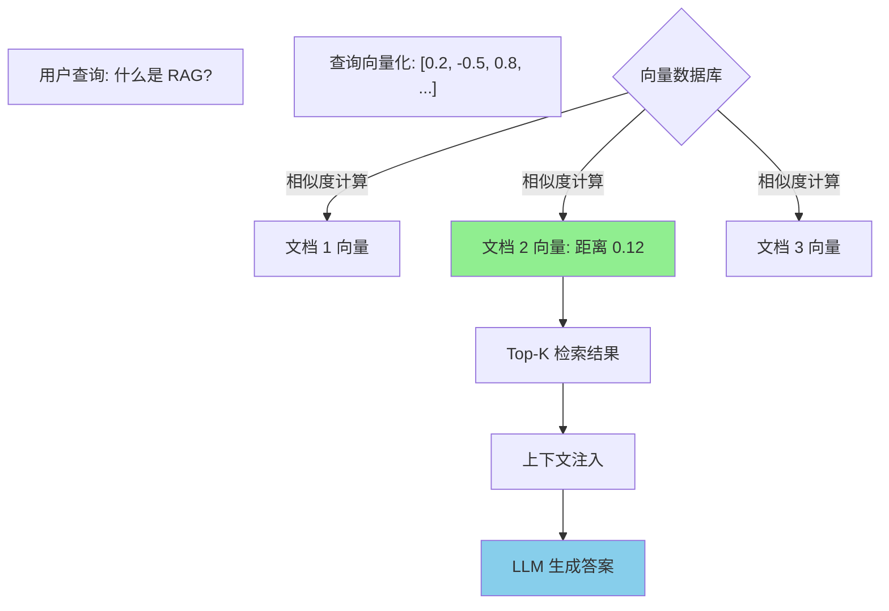

**与微调的本质区别**:

| 维度 | RAG | 微调 (Fine-tuning) |
|------|-----|-------------------|
| 知识存储 | 外部向量数据库 | 模型参数权重 |
| 更新方式 | 添加文档即可 | 需要重新训练 |
| 知识截止 | 无（实时更新） | 训练数据截止 |
| 成本 | 低（存储成本） | 高（计算成本） |
| 可解释性 | 高（可追溯来源） | 低（黑盒） |

---

## 1.2 为什么我们需要 RAG (Why RAG?)

### 1.2.1 LLM 的先天缺陷：幻觉、知识截止与长尾知识缺失

尽管 LLM 在生成文本方面表现出色，但它们存在几个根本性缺陷，这些缺陷限制了它们在生产环境中的直接应用。

**缺陷 1: 幻觉 (Hallucinations)**

**什么是幻觉？**
LLM 有时会"编造"听起来合理但完全错误的信息。这不是因为模型"撒谎"，而是因为它的训练目标是"生成 plausible text"，而非"保证事实正确"。

**幻觉的根源**:
- LLM 是概率模型，基于统计规律预测下一个词
- 当知识不足时，它会基于语言模式"补全"答案
- 模型无法区分"我记得的内容"和"我猜测的内容"

**幻觉的表现形式**:
```
用户: "请告诉我 2024 年诺贝尔物理学奖得主"
LLM: "2024 年诺贝尔物理学奖授予了 Dr. Smith，
      以表彰他在量子引力方面的贡献。"
      ← 完全编造（可能是 2023 年得主的混合）
```

**缺陷 2: 知识截止 (Knowledge Cutoff)**

**什么是知识截止？**
LLM 的知识局限于训练数据的时间范围。例如，GPT-4 的训练数据截止到 2023 年，它无法"知道"这之后发生的事件。

**为什么会有知识截止？**
- 训练数据快照：模型在某个时间点后不再更新
- 重新训练成本高昂：无法频繁更新知识
- 世界持续变化：新事件、新知识不断涌现

**知识截止的影响**:
```
用户: "最新的 TypeScript 版本是什么？"
LLM: "根据我的知识，TypeScript 5.0 于 2023 年发布。"
      ← 实际可能已经 5.4 或更高版本
```

**缺陷 3: 长尾知识缺失 (Long-tail Knowledge Missing)**

**什么是长尾知识？**
指那些在训练数据中出现频率极低的知识点：
- 企业内部文档
- 个人笔记
- 专业领域的小众知识
- 私有数据集

**为什么 LLM 无法获取长尾知识？**
- 训练数据采样偏差：互联网数据 ≠ 全部人类知识
- 数据不可得：私有数据未公开
- 频率惩罚：罕见知识在训练中被"稀释"

**缺陷 4: 无可追溯性 (No Attribution)**

LLM 无法告诉你答案的来源，这在需要引用的场景中是致命缺陷：
- 学术研究需要引用来源
- 企业应用需要证据支持
- 法律场景需要法规依据

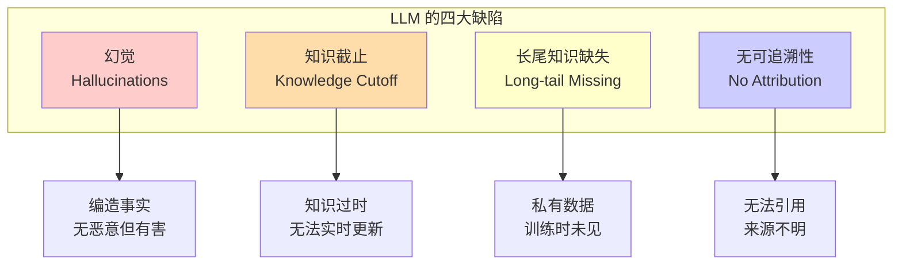

### 1.2.2 RAG 的核心价值：数据扎根、实时性与隐私保护

RAG 通过引入外部知识库，系统性解决了上述 LLM 的缺陷。

**价值 1: 数据扎根 (Data Grounding)**

**什么是扎根？**
让 LLM 的答案基于检索到的事实，而非"猜测"或"记忆"。

**扎根机制**:
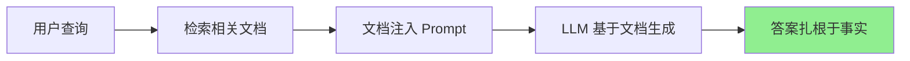

**扎根效果**:
- 事实性答案：基于检索到的文档
- 减少幻觉：模型"看到"了证据
- 可验证性：可以检查原文

**价值 2: 实时更新 (Real-time Updates)**

**无需重新训练**:
- 添加新文档到知识库 → 立即可检索
- 更新现有文档 → 下次查询生效
- 删除过期文档 → 停止检索

**与传统方法的对比**:

| 方法 | 知识更新方式 | 时间成本 | 货币成本 |
|------|------------|---------|---------|
| 微调模型 | 重新训练 | 天-周 | 高（GPU 时间） |
| Prompt Engineering | 手动更新 Prompt | 实时 | 低（但有限） |
| **RAG** | 添加/更新文档 | 实时 | 极低 |

**实时更新的场景**:
- 新闻网站：每日添加新闻文章
- 法律合规：法规更新后立即入库
- 产品文档：新功能发布后同步更新

**价值 3: 隐私保护 (Privacy Protection)**

**数据不离开你的控制**:
- 敏感文档存储在本地向量数据库
- 检索发生在你的基础设施上
- 只有查询片段发送给 LLM（可使用私有 LLM）

**隐私保护的优势**:
```
企业场景:
财务报表 + RAG → 答案基于真实数据
            ↓
文档不离开企业内网
            ↓
符合数据合规要求（GDPR, SOC2）
```

**价值 4: 成本效率 (Cost Efficiency)**

**RAG + 小模型 > 仅大模型**:

| 方案 | 模型大小 | 知识质量 | 成本 |
|------|---------|---------|------|
| 仅大模型 (GPT-4) | 1.8T 参数 | 依赖训练数据 | 高 |
| **RAG + 小模型** (Llama-3-8B) | 8B 参数 | 实时外部知识 | 低 |

**经济学原理**:
- 小模型 + RAG: 检索准确知识 + 便宜推理
- 大模型: 内化知识 → 昂贵训练 + 昂贵推理

**价值 5: 可追溯性 (Attribution)**

**来源引用**:
```
用户: "公司的退款政策是什么？"
RAG 回答:
"根据退款政策文档（来源: docs/refund-policy.pdf），
    我们的退款政策是..."

优势:
✓ 用户可以验证答案
✓ 可以进一步阅读原文
✓ 建立信任
```

### 1.2.3 关键技术决策：RAG vs. 模型微调的区别与适用边界

RAG 和微调是互补的技术，而非互斥。理解它们的适用边界是架构设计的关键。

**RAG vs. 微调的本质对比**:

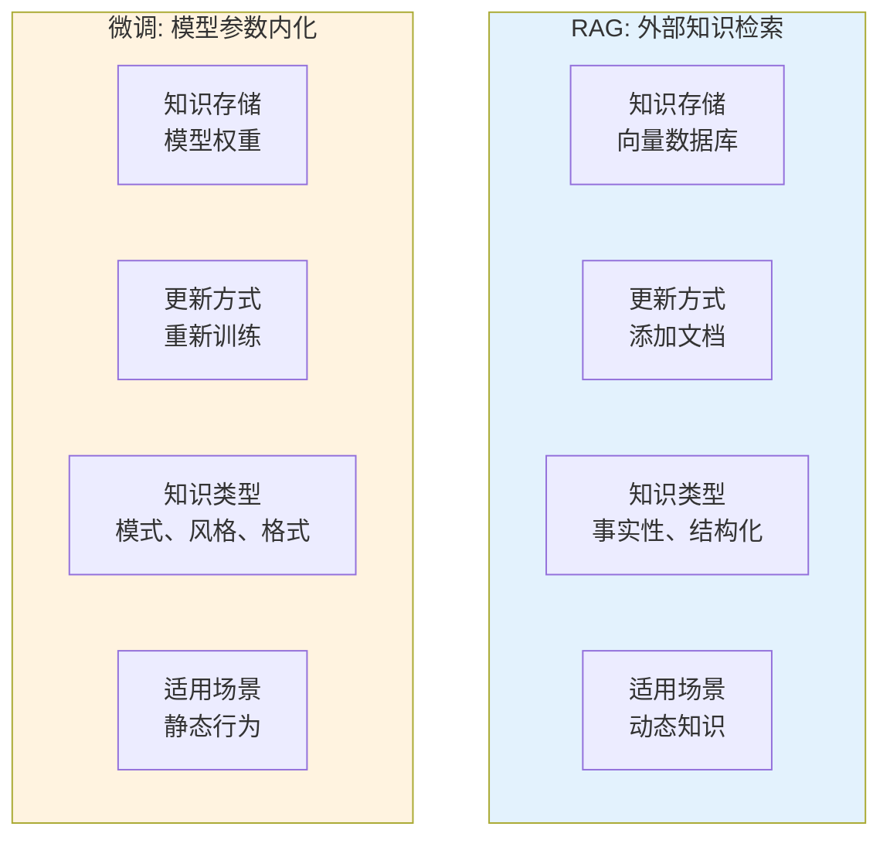

**决策矩阵: 何时使用哪种技术？**

| 场景 | 推荐方案 | 理由 |
|------|---------|------|
| 企业知识库（实时更新） | **RAG** | 文档频繁更新，需要实时性 |
| 医疗诊断（高度专业） | **RAG + 微调** | 微调学习诊断模式，RAG 提供最新研究 |
| 代码生成（特定框架） | **微调** | 需要内化框架的代码模式 |
| 客服助手（公司政策） | **RAG** | 政策频繁变化，需要可追溯 |
| 创意写作（特定风格） | **微调** | 需要学习风格模式，而非事实 |
| 法律合规（法规查询） | **RAG** | 必须准确引用原文 |
| 个性化推荐（用户偏好） | **微调 + RAG** | 微调学习偏好，RAG 提供实时内容 |

**RAG 的适用边界**:

**最适合 RAG 的场景**:
- 知识频繁变化（新闻、法规、文档）
- 需要准确性证明（法律、医疗、金融）
- 数据私密性要求高（企业内部数据）
- 成本敏感（需要高效推理）

**RAG 不是最佳选择**:
- 需要学习复杂模式（代码风格、写作风格）
- 知识极其稳定（历史事实、基础科学）
- 延迟敏感极低（检索需要 50-200ms）
- 知识已经是模型权重的一部分（常识）

**组合使用策略**:

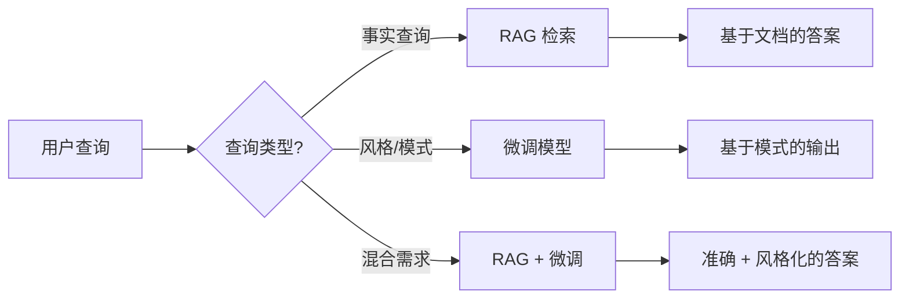

**实践建议**:
- 从 RAG 开始（低风险、低成本）
- 评估是否需要微调补充
- 优先考虑 RAG + 小模型，而非大模型
- 记录成本-效益比，指导未来决策

---

## 1.3 核心技术概念与原理 (Core Concepts & Principles)

### 1.3.1 向量空间模型：语义的高维几何表示

**什么是向量空间？**

从直觉上理解，向量空间就是一个多维坐标系，只是维度远超我们日常经验的 3D：
- 文本向量通常是 512、1024、2048 或 3072 维
- 每个维度代表一个"语义特征"
- 类似 RGB 颜色空间，只是维度更多

**高维几何的核心洞察**:

在向量空间中，**语义关系 = 几何关系**：
- **距离** = 语义差异度
- **方向** = 语义关系
- **聚类** = 主题相似性

**为什么需要高维？**

人类语言极其复杂：
- 词汇量：数万到数十万
- 语义关系：同义、反义、上下位、因果...
- 上下文依赖：同一词在不同句子有不同含义

**维度 vs. 表达能力**:

| 维度 | 表达能力 | 典型用途 |
|------|---------|---------|
| 128-256 | 基础语义 | 简单分类、去重 |
| 512-768 | 中等语义 | 文档检索、相似度计算 |
| 1024-1536 | 高级语义 | 复杂检索、语义搜索 |
| 2048-3072 | 细粒度语义 | 多语言、跨模态、专业领域 |

**向量空间的几何直觉**:

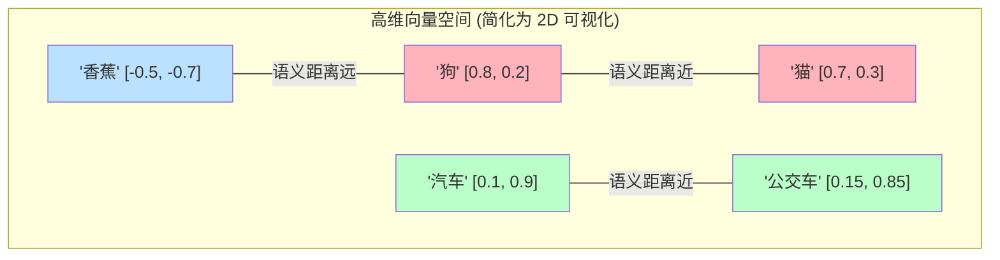

**在向量空间中**:
- "狗"和"猫"很近（都是宠物）
- "汽车"和"公交车"很近（都是交通工具）
- "香蕉"离它们都很远（不同类别）

**向量空间的聚类现象**:

语义相似的词汇会自动聚类：
```
动物簇:
  狗、猫、鸟、鱼... [语义密集区域]

交通工具簇:
  汽车、飞机、火车、船... [另一个语义区域]

科技簇:
  计算机、手机、AI、芯片... [独立区域]
```

**为什么聚类很重要？**

RAG 的核心原理：**查询会在向量空间中找到最近的语义簇，然后检索该簇的文档**。

```
查询: "如何训练机器学习模型？"
      ↓
向量化后落在"机器学习"语义簇附近
      ↓
检索该簇内的相关文档
      ↓
返回关于 ML 训练的文档
```

### 1.3.2 嵌入：将非结构化文本映射为数学向量

**什么是嵌入 (Embedding)？**

嵌入是将人类符号（文本、图像、音频）映射到数学空间（向量）的技术。嵌入模型的目标是：**让语义相似的内容在向量空间中距离更近**。

**嵌入的本质 = 意义到数字的翻译**:

```
文本 (人类可读)
    ↓ 嵌入模型
向量 (机器可计算)

例子:
"我很高兴"  → [0.5, -0.2, 0.8, 0.1, ...]
"I'm happy" → [0.48, -0.18, 0.82, 0.12, ...]
              ↑ 距离很近，因为语义相似
```

**好嵌入的核心属性**:

**属性 1: 语义相似度保持 (Semantic Similarity Preservation)**

语义相似的内容 → 向量距离近

```
例子:
"苹果" vs "橙子" → 距离 0.3 (都是水果)
"苹果" vs "汽车"  → 距离 1.2 (不同类别)
"苹果" vs "Apple" → 距离 0.15 (同一实体，不同语言)
```

**属性 2: 类比推理能力 (Analogical Reasoning)**

嵌入空间支持向量运算：

```
经典例子 (Word2Vec):
  king - man + woman = queen

直觉:
  "国王" - "男性" + "女性" = "女王"

工作原理:
  (king 的向量) - (man 的向量) + (woman 的向量)
  ≈ queen 的向量
```

**属性 3: 上下文感知 (Context Awareness)**

现代嵌入模型（如 BERT、GPT 嵌入）考虑上下文：

```
句子 1: "我去了银行存钱"
         ↓
      "银行" (金融机构) 的向量

句子 2: "我在河岸边散步"
         ↓
      "银行" (河岸) 的向量

结果: 同一个词，不同上下文 → 不同向量
```

**嵌入的训练目标（直觉理解）**:

现代嵌入模型使用**对比学习 (Contrastive Learning)**：

**核心思想**:
- 正样本对（相似文本）→ 距离更近
- 负样本对（不相似文本）→ 距离更远

**训练过程**:
```
查询: "什么是机器学习？"

正样本: "机器学习是 AI 的一个分支..."
        ↓ 拉近

负样本: "今天天气很好，适合散步..."
        ↓ 推远

目标: 查询向量与正样本的距离 << 查询向量与负样本的距离
```

**为什么这个目标有效？**

模型通过数百万次对比学习，逐渐掌握：
- 什么样的文本是相似的（语义、主题、意图）
- 什么样的文本是不相似的（无关内容）
- 如何将这种相似性编码到向量中

**嵌入模型的选择**:

| 模型 | 维度 | 特点 | 适用场景 |
|------|------|------|---------|
| text-embedding-3-small | 1536 | 速度快、成本低 | 一般检索 |
| text-embedding-3-large | 3072 | 质量高、多语言 | 复杂语义、跨语言 |
| bge-base-zh | 768 | 中文优化 | 中文为主的应用 |
| e5-large-v2 | 1024 | 开源、均衡 | 成本敏感场景 |
| bge-m3 | 1024 | 多语言、多功能 | 国际化应用 |

### 1.3.3 相似度度量：余弦相似度与距离计算

在向量空间中，我们需要数学方法来衡量两个向量的"相似度"。三种常用度量各有适用场景。

**余弦相似度 (Cosine Similarity)**

**定义**: 衡量两个向量之间的角度，而非绝对距离

**直观理解**:
- 只看方向，不看长度
- 相似度 ∈ [-1, 1]，1 表示完全相同方向，0 表示正交，-1 表示相反方向
- 对文本长度不敏感

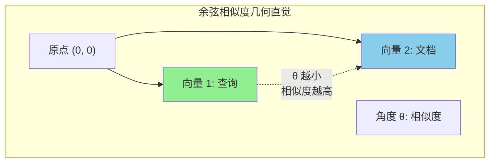

**为什么余弦相似度适合文本？**

```
例子:
文本 1: "机器学习"
      向量: [1.0, 2.0, 1.5]

文本 2: "机器学习是人工智能的一个分支"
      向量: [2.0, 4.0, 3.0] (长度加倍，但方向相同)

余弦相似度: 1.0 (完全相同方向，长度忽略)
直觉: 语义完全相同，尽管长度不同
```

**实际意义**:
- 长文档不会因为词汇多而"占优势"
- 专注于"是否在说同一件事"，而非"说了多少"

**欧几里得距离 (Euclidean Distance)**

**定义**: 两点之间的直线距离（我们日常理解的"距离"）

**公式直觉**:
```
distance = √[(x1-x2)² + (y1-y2)² + ...]

类比: 3D 空间中的直线距离
```

**何时使用欧几里得距离？**
- 需要考虑向量幅值（长度）的场景
- 图像嵌入（像素强度重要）
- 某些特定的专业嵌入模型

**点积 (Dot Product)**

**定义**: 对应元素相乘后求和

**与余弦相似度的关系**:
```
点积 = 余弦相似度 × 向量长度乘积

如果向量归一化（长度 = 1）:
  点积 = 余弦相似度
```

**为什么点积很快？**
- 现代硬件（GPU、TPU）对矩阵乘法优化极好
- 向量数据库常用点积来加速检索

**三种度量对比**:

| 度量 | 范围 | 关注点 | 速度 | 常用场景 |
|------|------|--------|------|---------|
| **余弦相似度** | [-1, 1] | 方向（语义） | 中等 | 文本检索（默认选择） |
| **欧几里得距离** | [0, ∞] | 绝对距离 | 慢 | 图像、需要考虑幅值 |
| **点积** | (-∞, ∞) | 方向 × 长度 | 快 | 向量归一化后等价于余弦 |

**相似度阈值选择**:

实践中如何判断"足够相似"？

```
余弦相似度阈值指南:

≥ 0.95: 几乎完全相同（重复文档、同义改写）
≥ 0.85: 高度相似（同一主题，不同表述）
≥ 0.70: 中等相关（相关但不完全匹配）
≥ 0.50: 弱相关（可能有用，需要人工判断)
< 0.50: 不相关（通常应该过滤掉）
```

**实际检索示例**:

```
查询: "如何训练机器学习模型？"

检索结果:
1. "机器学习模型训练指南"     → 相似度 0.92 ✓
2. "深度学习训练技巧"          → 相似度 0.88 ✓
3. "机器学习算法原理"          → 相似度 0.76 ✓
4. "如何训练宠物狗"            → 相似度 0.35 ✗
5. "今天的天气"               → 相似度 0.12 ✗

Top-3 选择: 前三个文档
```

---

## 1.4 标准架构与数据生命周期 (Architecture & Data Flow)

### 1.4.1 阶段一：索引构建 (Indexing Phase)

索引构建是 RAG 系统的"学习"阶段，将原始文档转换为可检索的向量表示。

**完整索引流程**:


**步骤 1: 文档解析 (Document Parsing)**

**支持的数据源**:
- 文本文件: Markdown, TXT, CSV
- 办公文档: PDF, DOCX, PPTX
- 网页: HTML, Markdown ( scraped)
- 代码: 各种编程语言的源码
- 结构化数据: JSON, XML, Database

**解析挑战**:
- PDF 解析: 处理多栏、表格、图像
- 网页清洗: 去除导航、广告、页脚
- 代码解析: 保留语法结构、注释

**步骤 2: 文本清洗 (Text Cleaning)**

**清洗操作**:
```
原始文本:
  "   Hello!!!   \n\n   Visit our site at https://example.com  "

清洗后:
  "Hello visit our site"

操作:
- 去除多余空白
- 移除特殊字符
- 处理 URL、邮箱（可选）
- 统一标点符号
- 转换为小写（视情况）
```

**为什么要清洗？**
- 减少噪音，提高检索质量
- 统一格式，避免重复
- 降低 token 使用量

**步骤 3: 分块策略 (Chunking Strategy)**

**为什么需要分块？**
- LLM 上下文窗口有限（4K-128K tokens）
- 嵌入模型有长度限制（512-8192 tokens）
- 细粒度检索更准确

**三种主要分块策略**:

**策略 1: 固定长度分块 (Fixed-size Chunking)**

```
原理: 按字符数或 token 数切分

例子:
chunk_size = 500
overlap = 50

文档: "这是一篇长文章..." (2000 字符)

分块:
Chunk 1: 字符 0-500
Chunk 2: 字符 450-950   (50 字符重叠)
Chunk 3: 字符 900-1400
Chunk 4: 字符 1350-1850

优点: 简单、快速、可预测
缺点: 可能切断语义单元
```

**策略 2: 语义分块 (Semantic Chunking)**

```
原理: 按语义边界切分（段落、章节）

例子:
文档: "第一章 介绍...\n\n第二章 方法...\n\n"

分块:
Chunk 1: "第一章 介绍..." (完整章节)
Chunk 2: "第二章 方法..."   (完整章节)

优点: 语义完整、上下文连贯
缺点: 需要文档结构、较慢
```

**策略 3: 递归分块 (Recursive Chunking)**

```
原理: 多级粒度，先粗后细

例子:
Level 1: 章节级分块
Level 2: 段落级分块
Level 3: 句子级分块

检索时:
  粗粒度检索 → 细粒度精炼

优点: 平衡速度和质量
缺点: 复杂度高
```

**分块选择指南**:

| 场景 | 推荐策略 | chunk_size | overlap |
|------|---------|-----------|---------|
| 通用文档 | 固定长度 | 500-1000 | 50-100 |
| 学术论文 | 语义分块 | N/A | N/A |
| 代码 | 语义分块（函数级） | N/A | N/A |
| 长文档 | 递归分块 | 多级 | 视级别 |
| FAQ/对话 | 固定长度 | 200-400 | 0-50 |

**步骤 4: 向量化 (Embedding)**

```
每个文本块 → 嵌入模型 → 向量

例子:
Chunk: "机器学习是 AI 的一个分支..."

嵌入模型: text-embedding-3-small

输出向量: [0.2, -0.5, 0.8, 0.1, ...] (1536 维)
```

**批量处理优化**:
- 批量向量化（如 100 个一批）
- GPU/TPU 加速
- 异步处理（大规模数据）

**步骤 5: 向量存储与索引 (Vector Storage & Indexing)**

**向量数据库选择**:

| 数据库 | 特点 | 适用场景 |
|--------|------|---------|
| Pinecone | 托管服务、易用 | 快速原型、小团队 |
| Weaviate | 开源、模块化 | 自托管、定制需求 |
| Qdrant | 高性能、Rust | 大规模、低延迟 |
| Chroma | 轻量级、嵌入式 | 本地开发、测试 |
| pgvector | PostgreSQL 扩展 | 已使用 PG 的场景 |

**索引算法 (ANN - Approximate Nearest Neighbor)**:

```
精确搜索 (Brute Force):
  计算查询与所有文档的距离
  复杂度: O(N) - N = 文档数

近似搜索 (ANN):
  使用索引结构快速找到近似最近邻
  复杂度: O(log N) 或更快
  牺牲少量精度换取速度
```

**常见 ANN 算法**:
- HNSW (Hierarchical Navigable Small World): 高精度、较快
- IVF (Inverted File Index): 平衡精度和速度
- PQ (Product Quantization): 压缩向量、节省内存

**索引构建完成后的状态**:

```
原始文档:
  ├── doc1.pdf
  ├── doc2.md
  └── doc3.html

          ↓ 索引构建完成

向量数据库:
  ├── [
  │    id: "chunk-1",
  │    vector: [0.2, -0.5, ...],
  │    metadata: {source: "doc1.pdf", page: 1}
  │  ],
  ├── [chunk-2, ...],
  └── [chunk-3, ...]

可检索状态 ✓
```

### 1.4.2 阶段二：检索召回 (Retrieval Phase)

检索是 RAG 的"查询"阶段，根据用户问题找到最相关的文档片段。

**检索流程**:

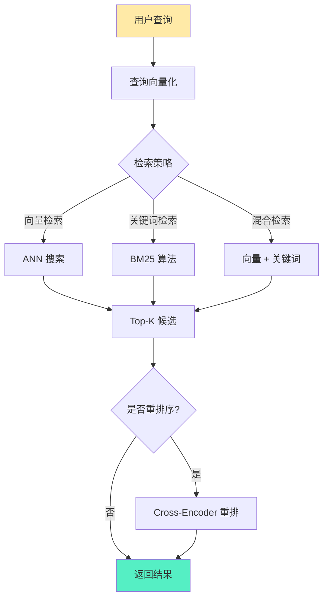

**步骤 1: 查询向量化 (Query Embedding)**

```
用户查询: "如何使用 Spring Boot 实现 REST API？"
            ↓
查询向量化: [0.3, -0.1, 0.9, ...] (与文档相同维度)
            ↓
用于相似度计算
```

**查询优化技巧**:

**查询扩展 (Query Expansion)**:
```
原始查询: "机器学习"

扩展后: "机器学习 OR 深度学习 OR 神经网络 OR ML OR DL"

提高: 召回率（覆盖更多相关文档）
```

**查询重写 (Query Rewriting)**:
```
用户: "怎么搞？"
     ↓ LLM 重写
"如何实现机器学习模型的训练？"

提高: 明确查询意图
```

**步骤 2: 向量检索 (Vector Retrieval)**

**ANN 搜索过程**:
```
1. 查询向量与索引中的所有向量计算相似度
2. 使用索引结构快速找到 Top-K 最近邻
3. 返回 K 个最相似的文档块

参数:
  - top_k: 返回多少个结果 (典型 5-20)
  - score_threshold: 相似度阈值 (如 0.7)
```

**检索结果示例**:
```
查询: "RAG 系统如何工作？"

Top-5 结果:
1. "RAG 系统包含检索和生成两个阶段..." (相似度: 0.92)
2. "检索增强生成 (RAG) 是一种..."     (相似度: 0.89)
3. "RAG 与微调的主要区别..."        (相似度: 0.76)
4. "向量数据库的选择..."            (相似度: 0.65)
5. "今天天气很好..."                (相似度: 0.12)

过滤后 (threshold=0.7):
  结果 1, 2, 3
```

**步骤 3: 混合检索 (Hybrid Retrieval)**

**为什么需要混合检索？**

向量检索的局限：
- 弱于精确匹配（专有名词、ID 号码）
- 可能遗漏关键词

关键词检索的优势：
- 精确匹配能力强
- 互补向量检索

**混合策略**:

```
向量检索: Top-20 结果
关键词检索: Top-20 结果
      ↓
合并并去重: Top-30 唯一结果
      ↓
重排序: 最终 Top-10
```

**打分融合**:
```
最终分数 = α × 向量分数 + (1-α) × 关键词分数

典型 α 值:
  0.5: 向量和关键词同等重要
  0.7: 向量为主，关键词为辅
  0.3: 关键词为主，向量为辅
```

**步骤 4: 重排序 (Reranking)**

**为什么需要重排序？**

检索阶段追求"快"，可能牺牲"准"。重排序使用更复杂的模型重新精排。

**Cross-Encoder 重排序**:
```
第一阶段 (检索):
  快速模型: Bi-Encoder
  返回: Top-20 候选

第二阶段 (重排):
  精确模型: Cross-Encoder
  输入: (查询, 文档) 对
  输出: 精确相似度分数
  返回: Top-5 最终结果

成本: 重排序 20 个 vs 检索 10000 个
收益: 显著提升精度
```

**重排序模型选择**:

| 模型 | 特点 | 速度 | 精度 |
|------|------|------|------|
| bge-reranker-large | 中文优化 | 中 | 高 |
| cohere-rerank-v3 | 多语言 | 快 | 高 |
| cross-encoder-ms-marco | 英文优化 | 慢 | 很高 |

### 1.4.3 阶段三：生成合成 (Generation Phase)

生成是 RAG 的"回答"阶段，LLM 基于检索到的上下文生成最终答案。

**生成流程**:

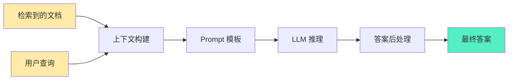

**步骤 1: 上下文构建 (Context Building)**

**上下文注入策略**:

**策略 1: 全部注入**
```
检索到 5 个文档，全部注入

优点: 信息全
缺点: 可能超出上下文窗口、成本高
```

**策略 2: 选择性注入**
```
只注入相似度 > 0.8 的文档

优点: 质量高、节省 token
缺点: 可能遗漏有用信息
```

**策略 3: 压缩注入**
```
文档: "这是一篇长文章..." (1000 tokens)
      ↓ LLM 压缩
摘要: "文章主要讨论 RAG 的原理..." (200 tokens)

优点: 保留关键信息、节省 token
缺点: 压缩可能丢失细节
```

**上下文长度管理**:
```
LLM 上下文窗口: 8K tokens
查询: 100 tokens
系统提示: 500 tokens
      ↓
可用空间: 7400 tokens

文档分配:
  文档 1: 2000 tokens
  文档 2: 1800 tokens
  文档 3: 1500 tokens
  文档 4: 2100 tokens ← 超出！
      ↓
截断或丢弃文档 4
```

**步骤 2: Prompt 模板 (Prompt Template)**

**标准 RAG Prompt 模板**:

```
你是一个有用的助手。请基于以下上下文回答用户的问题。

上下文:
{context}

问题: {question}

答案:
```

**填充后的实际 Prompt**:
```
你是一个有用的助手。请基于以下上下文回答用户的问题。

上下文:
[文档 1]: RAG 是检索增强生成的缩写，它结合了信息检索和文本生成...
[文档 2]: RAG 系统包含三个主要组件：检索器、知识源和生成器...
[文档 3]: RAG 的优势包括实时更新、数据扎根和隐私保护...

问题: RAG 系统由哪些组件组成？

答案:
```

**Prompt 优化技巧**:

**技巧 1: 明确指令**
```
❌ 差: "基于上下文回答问题"
✓ 好: "仅基于以下上下文回答问题。如果上下文中没有相关信息，
      请明确说明'上下文中未找到相关信息'，不要编造答案。"
```

**技巧 2: 来源引用**
```
上下文:
[文档 1 - 来源: rag-intro.pdf]: RAG 是检索增强生成...
[文档 2 - 来源: rag-components.md]: RAG 系统包含...

问题: RAG 的优势是什么？

答案: 根据 rag-intro.pdf，RAG 的优势包括...
      又根据 rag-components.md，RAG 的组件有...
```

**技巧 3: 多步骤推理**
```
上下文: {context}

问题: {question}

请按以下步骤回答:
1. 理解问题的核心意图
2. 从上下文中提取相关信息
3. 综合多个信息源
4. 给出清晰的答案
```

**步骤 3: LLM 推理 (LLM Inference)**

**模型选择**:

| 场景 | 推荐模型 | 理由 |
|------|---------|------|
| 简单问答 | GPT-3.5 / Llama-3-8B | 成本低、速度快 |
| 复杂推理 | GPT-4 / Claude-3.5 | 推理能力强 |
| 中文优化 | Qwen / Yi / DeepSeek | 中文效果好 |
| 私有部署 | Llama-3-70B / Mistral | 数据隐私 |

**推理参数调优**:

```
temperature = 0.0-0.2
  低温度: 更确定性、更忠实于上下文
  适用: 事实性问答

top_p = 0.9-1.0
  核采样: 控制多样性
  RAG 场景通常设为 1.0

max_tokens = 视需求
  短答案: 100-300
  长答案: 500-1000
  总结: 200-500
```

**步骤 4: 答案后处理 (Answer Post-processing)**

**后处理任务**:

**任务 1: 来源提取**
```
LLM 输出: "根据文档 1，RAG 是..."
         ↓
后处理: 提取来源引用
结果: "根据 rag-intro.pdf，RAG 是..."
```

**任务 2: 置信度评分**
```
方法 1: 基于 LLM 输出
  "我确定答案是..." → 高置信度

方法 2: 基于检索分数
  平均相似度 > 0.85 → 高置信度
  平均相似度 < 0.7 → 低置信度

方法 3: 专门的置信度模型
  额外的分类器判断答案质量
```

**任务 3: 格式化**
```
需求: JSON 输出、Markdown、纯文本...

转换:
  LLM 输出 → 目标格式

例子:
  "答案是: RAG 是..." → {"answer": "RAG 是..."}
```

**完整 RAG 管道示例**:

```
用户查询: "RAG 和微调有什么区别？"

阶段 1 - 检索:
  向量化: [0.1, -0.3, 0.8, ...]
  检索: Top-5 相关文档
  重排: 精选 Top-3

阶段 2 - 上下文构建:
  注入: 文档 1 (2000 tokens) + 文档 2 (1800 tokens)

阶段 3 - 生成:
  Prompt: "基于以下上下文回答..."
  LLM: GPT-4, temperature=0.1
  输出: "RAG 和微调的主要区别在于..."

最终答案:
  "RAG 和微调的主要区别在于知识存储方式。
   RAG 将知识存储在外部向量数据库中，支持实时更新；
   而微调将知识内化到模型权重中，需要重新训练。

   来源: rag-vs-finetune.md, rag-fundamentals.pdf"
```

---

## 1.5 RAG 的演进范式 (Evolutionary Paradigms)

### 1.5.1 Naive RAG：基础三段式链路及其局限性

**Naive RAG** 是 RAG 的最简单形式，直接按照"检索-生成"的线性流程工作。

**Naive RAG 架构**:


**标准工作流程**:

```
1. 用户输入问题
2. 问题向量化
3. 向量数据库检索 Top-K 文档
4. 将文档注入 Prompt
5. LLM 生成答案
```

**Naive RAG 的局限性**:

**局限 1: 查询质量问题**
```
用户查询: "怎么搞？"
问题: 模糊、缺乏上下文
结果: 检索不准确
```

**局限 2: 单一检索方法**
```
仅依赖向量检索:
  - 弱于精确匹配（专有名词）
  - 可能遗漏关键词
  - 无法处理结构化查询
```

**局限 3: 无重排序**
```
检索结果:
  文档 1: 相似度 0.75 (实际不相关)
  文档 2: 相似度 0.73 (实际高度相关)

Naive RAG: 直接使用文档 1
实际应该: 重排序后选择文档 2
```

**局限 4: 上下文窗口限制**
```
检索到 10 个文档，总计 15000 tokens
LLM 上下文窗口: 8000 tokens
      ↓
必须截断或丢弃文档
可能丢失关键信息
```

**局限 5: 检索失败无法恢复**
```
检索失败 → 上下文为空或无关
      ↓
LLM 仍然尝试回答 → 幻觉
Naive RAG 没有检测机制
```

**适用场景**:
- 简单问答（明确的问题）
- 文档库较小（< 10K 文档）
- 预算有限（简单实现）
- 原型验证（快速迭代）

### 1.5.2 Advanced RAG：查询重写、混合检索与重排序

**Advanced RAG** 在 Naive RAG 基础上增加了多层优化，显著提升检索质量和生成效果。

**Advanced RAG 架构**:

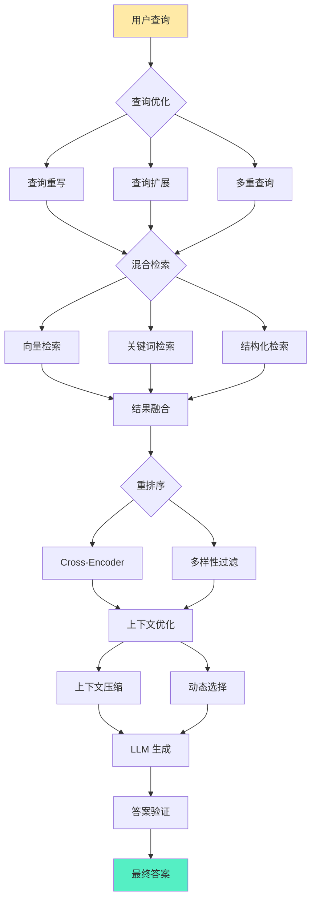

**优化 1: 查询重写 (Query Rewriting)**

**目标**: 将模糊、不完整的查询转换为清晰、可执行的查询。

**LLM 查询重写**:
```
原始查询: "怎么搞？"
      ↓ LLM 重写
优化查询: "如何在 Spring Boot 中实现 REST API？"
      ↓
检索质量显著提升
```

**查询重写技巧**:
```
1. 意图识别: 用户想要什么？
2. 上下文补充: 补充隐含信息
3. 专业术语转换: 口语 → 专业术语
4. 多语言统一: 中文 → 英文（如文档库主要是英文）
```

**优化 2: 查询扩展 (Query Expansion)**

**目标**: 生成多个相关查询，提高召回率。

**查询扩展方法**:

**方法 1: 同义词扩展**
```
原始: "机器学习"
扩展: "机器学习 OR 深度学习 OR 神经网络 OR ML OR DL"
```

**方法 2: LLM 生成子查询**
```
原始: "如何提高 RAG 系统的性能？"
      ↓ LLM 生成
子查询 1: "RAG 系统的索引优化方法"
子查询 2: "RAG 检索算法比较"
子查询 3: "RAG 生成阶段的优化技巧"
      ↓
并行检索多个子查询
```

**方法 3: 假设性文档扩展 (HyDE)**
```
查询: "RAG 系统的工作原理"
      ↓ LLM 生成假设答案
假设文档: "RAG 系统通过检索外部知识库来增强 LLM。
           它包含三个阶段：索引构建、检索召回和生成合成..."
      ↓ 对假设文档向量化
      ↓ 检索与假设文档相似的真实文档
```

**优化 3: 混合检索 (Hybrid Retrieval)**

**向量 + 关键词融合**:

```
向量检索 (Top-20):
  语义相似度高
  精确匹配弱

关键词检索 (Top-20):
  精确匹配强
  语义理解弱

融合:
  结果 = α × 向量分数 + (1-α) × 关键词分数
  典型 α = 0.7 (向量为主)

输出: Top-20 混合结果
```

**优化 4: 重排序 (Reranking)**

**两阶段检索策略**:
```
第一阶段 - 召回:
  快速检索: Bi-Encoder + ANN
  返回: Top-50 候选
  成本: 低

第二阶段 - 精排:
  精确重排: Cross-Encoder
  输入: (查询, 文档) 对
  返回: Top-10 最终结果
  成本: 中（但仅对 50 个文档）

总体: 快速 + 精确
```

**重排序优化**:
```
多样性过滤:
  Top-10 结果中，避免过于相似
  例如: 不选 5 个来自同一文档的片段

新颖性检测:
  惩罚与之前结果过于相似的文档

置信度阈值:
  过滤低置信度结果 (< 0.6)
```

**优化 5: 上下文压缩 (Context Compression)**

**问题**: 检索到的文档可能很长，浪费 tokens。

**解决方案**:

**方法 1: LLM 压缩**
```
原始文档: "这是一篇关于 RAG 的长文章，详细介绍了..." (2000 tokens)
          ↓ LLM 提取关键信息
压缩后: "RAG 包含三个阶段：索引、检索、生成。优势是实时更新..."
        (300 tokens)

节省: 1700 tokens
```

**方法 2: 只提取相关句子**
```
查询: "RAG 的索引阶段包含哪些步骤？"

文档: "RAG 是一种 AI 架构...
       索引阶段包括文档解析、文本清洗、分块和向量化...
       生成阶段是 LLM 基于上下文生成答案..."

提取: 只保留"索引阶段包括..."这个句子
丢弃: 其他不相关句子
```

**优化 6: 递归检索 (Recursive Retrieval)**

**问题**: 有时需要多次检索才能获得足够信息。

**递归检索流程**:
```
第一轮检索:
  查询: "什么是 RAG？"
  结果: "RAG 是检索增强生成..."

第二轮检索 (基于第一轮结果):
  查询: "RAG 的核心组件有哪些？"
  结果: "包含检索器、知识源和生成器..."

第三轮检索 (深入细节):
  查询: "检索器如何工作？"
  结果: "检索器使用向量相似度..."

最终: 综合多轮检索的信息
```

**Advanced RAG vs Naive RAG 对比**:

| 维度 | Naive RAG | Advanced RAG |
|------|-----------|--------------|
| 查询处理 | 直接使用 | 重写、扩展、多查询 |
| 检索方法 | 仅向量 | 混合检索（向量 + 关键词） |
| 重排序 | 无 | Cross-Encoder 精排 |
| 上下文优化 | 直接注入 | 压缩、选择、去重 |
| 检索轮数 | 单轮 | 支持多轮递归 |
| 准确率 | 中等 | 高 |
| 延迟 | 低 (50-200ms) | 中 (200-500ms) |
| 成本 | 低 | 中 |
| 适用场景 | 简单问答 | 复杂、专业问答 |

### 1.5.3 Modular RAG：动态路由、Agent 与多模态扩展趋势

**Modular RAG** 代表 RAG 的下一代架构，引入模块化、动态路由和 Agent 能力，实现更智能、更灵活的知识检索和生成。

**Modular RAG 核心理念**:

不再将 RAG 视为固定流程，而是可组合的模块集合，根据查询类型动态选择最优路径。

**Modular RAG 架构**:

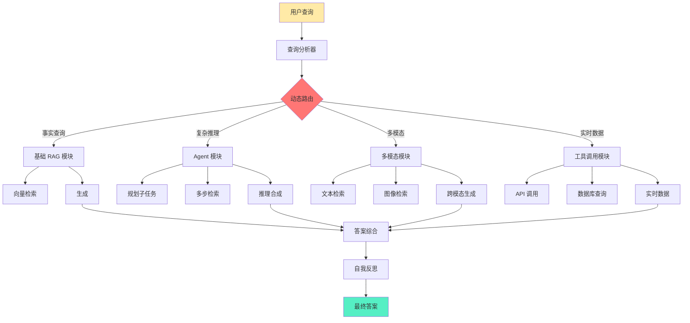

**模块 1: 动态路由 (Dynamic Routing)**

**核心思想**: 根据查询类型，自动选择最优的处理路径。

**路由策略**:

**策略 1: 基于查询分类**
```
查询分析器识别查询类型:

类型 1: 简单事实查询
  → 基础 RAG（向量检索 + 生成）

类型 2: 复杂推理查询
  → Agent RAG（多步检索 + 推理）

类型 3: 实时数据查询
  → 工具调用（API + 数据库查询）

类型 4: 多模态查询
  → 多模态模块（文本 + 图像）
```

**策略 2: 基于置信度**
```
第一轮 RAG:
  检索置信度高 (> 0.9)
    → 直接返回答案

  检索置信度中等 (0.7-0.9)
    → 查询扩展 + 重试

  检索置信度低 (< 0.7)
    → 切换到其他模块（如 Agent）
```

**模块 2: Agent RAG**

**核心思想**: 将 LLM 作为 Agent，主动规划检索策略，而非被动检索。

**Agent RAG 工作流程**:
```
用户查询: "比较 RAG 和微调在企业应用中的成本效益"

Agent 规划:
  步骤 1: 检索 RAG 的成本信息
  步骤 2: 检索微调的成本信息
  步骤 3: 检索企业应用场景案例
  步骤 4: 综合比较分析

执行:
  步骤 1 → 检索 → "RAG 的成本主要是向量数据库存储..."
  步骤 2 → 检索 → "微调需要 GPU 训练成本..."
  步骤 3 → 检索 → "企业案例..."
  步骤 4 → 推理 → "综合以上信息..."

最终答案:
  "基于检索到的信息，RAG 在企业应用中的成本优势包括..."
```

**Agent 能力**:

**能力 1: 工具使用 (Tool Use)**
```
可用工具:
  - 向量检索 (搜索文档库)
  - Web 搜索 (获取实时信息)
  - 计算器 (数值计算)
  - SQL 查询 (结构化数据)

Agent 自动选择工具:
  "查询成本数据" → 使用 SQL 查询
  "查询最新新闻" → 使用 Web 搜索
  "查询内部文档" → 使用向量检索
```

**能力 2: 多步推理 (Multi-step Reasoning)**
```
查询: "为什么 RAG 适合实时更新的场景？"

Agent 推理链:
  思考 1: 首先理解 RAG 的更新机制
    → 检索 "RAG 更新机制"
    → 获知: "添加文档即可"

  思考 2: 理解微调的更新机制
    → 检索 "微调更新流程"
    → 获知: "需要重新训练"

  思考 3: 比较两者的更新速度
    → 推理: "添加文档 << 重新训练"

  思考 4: 总结
    → "RAG 适合实时更新，因为更新成本低"
```

**模块 3: 多模态 RAG**

**核心思想**: 扩展 RAG 到文本之外，支持图像、音频、视频等多模态内容。

**多模态 RAG 架构**:
```
用户查询: "这张图中的架构是什么？"
      ↓
图像嵌入模型:
  图像 → 图像向量
      ↓
跨模态检索:
  查询向量与图像向量数据库匹配
      ↓
检索结果: 找到相似架构图
      ↓
多模态 LLM (如 GPT-4V):
  输入: 查询 + 图像
  输出: "这是一个典型的 RAG 架构图，包含..."
```

**多模态应用场景**:

**场景 1: 图文检索**
```
查询: "展示如何部署 Kubernetes 的架构图"
检索: 向量数据库中的架构图
生成: "这张图展示了 Kubernetes 的部署架构..."
```

**场景 2: 视频 RAG**
```
查询: "视频 15:30 处讲了什么？"
检索: 视频转录文本 + 时间戳
生成: "在 15:30，讲师介绍了 RAG 的索引阶段..."
```

**场景 3: 音频 RAG**
```
查询: "播客中关于 RAG 成本的部分"
检索: 播客转录文本
生成: "在播客的 23 分钟处，嘉宾提到..."
```

**模块 4: 自我反思 RAG**

**核心思想**: RAG 系统自我评估答案质量，必要时进行修正。

**自我反思循环**:
```
第一轮生成:
  查询: "RAG 的优势是什么？"
  检索: Top-3 文档
  生成: "RAG 的优势是实时更新..."
      ↓
自我评估:
  评估: 这个答案是否充分？
  检查:
    - 是否覆盖所有主要优势？
    - 是否有遗漏？
    - 是否准确？
      ↓
如果不充分:
  → 触发第二轮检索
  → 补充更多信息
      ↓
最终生成:
  "RAG 的优势包括：1. 实时更新 2. 数据扎根 3. 隐私保护..."
```

**自我反思技术**:

**技术 1: 答案验证**
```
LLM 检查:
  "这个答案是否基于检索到的上下文？
   是否没有编造信息？
   是否覆盖了所有相关点？"

如果发现幻觉:
  → 标记问题
  → 重新生成
```

**技术 2: 知识图谱验证**
```
生成答案后:
  → 提取关键事实
  → 与知识图谱对比
  → 检查一致性

如果发现矛盾:
  → 修正答案或标注不确定
```

**模块 5: 自适应 RAG**

**核心思想**: 根据用户反馈持续优化 RAG 系统。

**反馈循环**:
```
用户使用 RAG 系统
      ↓
收集反馈:
  - 点赞/点踩
  - 答案质量评分
  - 点击哪些来源
      ↓
分析反馈:
  - 哪些检索策略效果好？
  - 哪些类型的查询失败率高？
  - 哪些文档质量高？
      ↓
自动优化:
  - 调整检索参数
  - 重新加权文档
  - 优化 Prompt 模板
```

**RAG 演进时间线**:

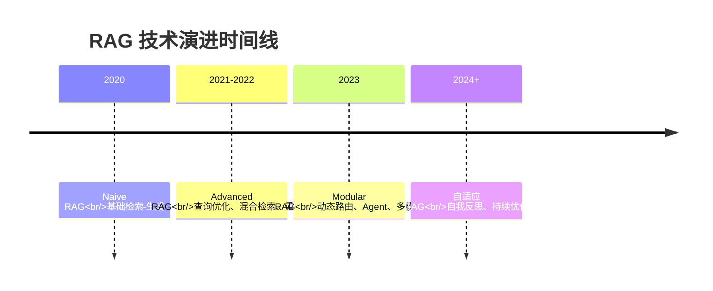

**三代 RAG 对比总结**:

| 维度 | Naive RAG | Advanced RAG | Modular RAG |
|------|-----------|--------------|-------------|
| **查询处理** | 直接使用 | 重写、扩展 | 动态路由 |
| **检索方法** | 单一向量 | 混合检索 | 工具调用、多模态 |
| **重排序** | 无 | Cross-Encoder | 自适应 |
| **推理能力** | 无 | 有限 | Agent 多步推理 |
| **模态支持** | 仅文本 | 仅文本 | 多模态 |
| **自我改进** | 无 | 无 | 自我反思、反馈优化 |
| **复杂度** | 低 | 中 | 高 |
| **成本** | 低 | 中 | 高 |
| **适用场景** | 简单问答 | 复杂问答 | 企业级智能系统 |

**未来趋势**:

**趋势 1: RAG + Agent 深度融合**
- Agent 作为 RAG 的"大脑"，主动规划检索策略
- RAG 作为 Agent 的"知识库"，提供实时信息

**趋势 2: 多模态 RAG 普及**
- 图像、视频、音频检索成为标准能力
- 跨模态理解和生成

**趋势 3: 自我进化的 RAG**
- 系统自动优化检索策略
- 根据用户反馈持续改进

**趋势 4: 领域专用的 RAG**
- 医疗 RAG（医学知识库）
- 法律 RAG（法规库）
- 金融 RAG（市场数据）

---

## 小结 (Summary)

本章建立了 RAG 系统的理论基础和架构理解，涵盖以下核心内容：

**核心概念**:
- RAG 是通过检索外部知识库来增强 LLM 的架构模式
- 本质是"开卷考试"，让 LLM 从"闭卷"变成"有参考书"
- 核心原理：基于语义距离的信息搬运，而非学习

**为什么需要 RAG**:
- LLM 的先天缺陷：幻觉、知识截止、长尾知识缺失、无可追溯性
- RAG 的核心价值：数据扎根、实时更新、隐私保护、成本效率、可追溯性
- RAG vs. 微调：互补技术，各有适用边界

**核心技术**:
- 向量空间模型：语义的高维几何表示
- 嵌入：文本到向量的映射，保持语义相似度
- 相似度度量：余弦相似度（默认）、欧几里得距离、点积

**标准架构**:
- 阶段一：索引构建（解析、清洗、分块、向量化、存储）
- 阶段二：检索召回（查询优化、向量检索、混合检索、重排序）
- 阶段三：生成合成（上下文构建、Prompt 模板、LLM 推理、后处理）

**演进范式**:
- Naive RAG：基础三段式，简单但有局限
- Advanced RAG：查询优化、混合检索、重排序，显著提升质量
- Modular RAG：动态路由、Agent、多模态、自我反思，下一代架构

**下一步**:
理解了 RAG 的基础理论和架构后，下一章将深入探讨**数据处理**的工程实现，包括如何高效解析、清洗、分块和向量化各种类型的文档。
