# 1. RAG Foundation

This chapter establishes the foundational understanding of Retrieval-Augmented Generation (RAG) systems, focusing on core concepts, theoretical principles, and architectural intuition. We'll build from first principles to understand why RAG works, how it fits into the AI landscape, and what makes it an essential pattern for production AI systems.

---

## 1.1 Definition and Intuition

### 1.1.1 Standard Definition

**Retrieval-Augmented Generation (RAG)** is an AI architectural pattern that enhances Large Language Model capabilities by retrieving relevant context from external knowledge bases. First introduced by Facebook AI Research (now Meta AI) in 2020, the core idea is to combine **information retrieval** with **text generation**, enabling LLMs to access real-time, accurate external knowledge when generating answers.

RAG consists of three core components:

1. **Retriever**: Retrieves content relevant to the query from the knowledge base
2. **Knowledge Source**: External data storage (structured or unstructured)
3. **Generator**: Generates the final answer based on retrieved context

**Standard Workflow**:
```
User Query → Retrieve Documents → Inject into Prompt → LLM Generates Answer
```

### 1.1.2 Core Metaphor: From "Closed-book" to "Open-book" Exam

The most intuitive way to understand RAG's value is through the exam metaphor:

**LLM without RAG = Closed-book Exam**

Imagine taking a closed-book exam:
- You can only rely on knowledge memorized in your mind
- If the exam covers content you've never learned, you can only guess or fabricate
- Your knowledge is frozen as of the day you finished studying (training data cutoff)
- You may have never seen obscure knowledge points

**LLM with RAG = Open-book Exam**

Now imagine the same exam, but allowing you to reference textbooks:
- You can look up relevant sections to answer questions accurately
- Even for new knowledge, as long as it's in the textbook, you can answer
- You can cite sources, showing the basis for your answers
- Much lower pressure, more accurate and reliable answers

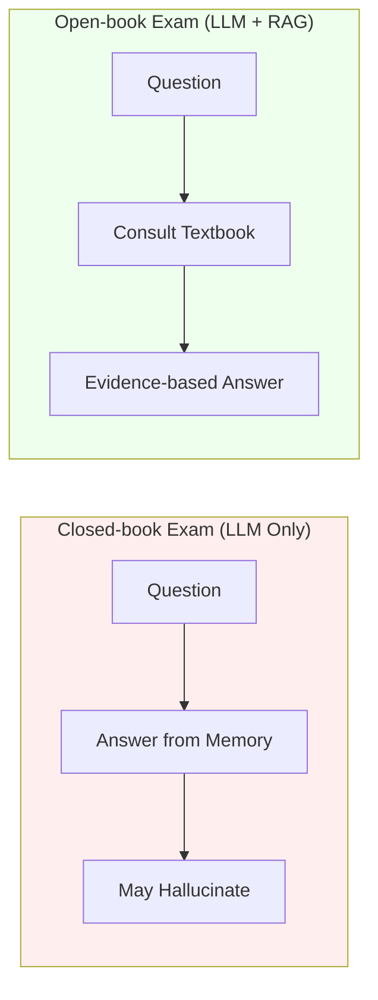

**Key Insight**: RAG essentially gives the LLM a "reference library", transforming it from "closed-book" to "open-book", significantly improving answer accuracy and credibility.

### 1.1.3 First Principles: RAG is Information Transfer, Not Learning

From a first-principles perspective, the core problem RAG solves is: **How to enable LLMs to access external knowledge without changing model parameters?**

**RAG is NOT Learning**:
- Fine-tuning is learning: internalizing knowledge by modifying model weights
- RAG is NOT learning: model parameters remain unchanged, knowledge is temporarily injected via Prompt

**RAG IS Information Transfer (Information Retrieval + Context Injection)**:

```
Core Equation:

Answer = LLM(Context(Query) + Query)

Where:
- Context(Query) = Top-K relevant fragments retrieved from knowledge base
- Semantic distance measured via vector similarity
- Knowledge not stored in model, but retrieved on-demand
```

**First-Principles Breakdown**:

1. **Semantic Mapping**: Text → Vector (mapping human language to mathematical space)
2. **Distance Calculation**: Similarity between Query vector and Document vectors
3. **Information Transfer**: Injecting most relevant text fragments into LLM's context window
4. **Generation Synthesis**: LLM generates answer based on injected context

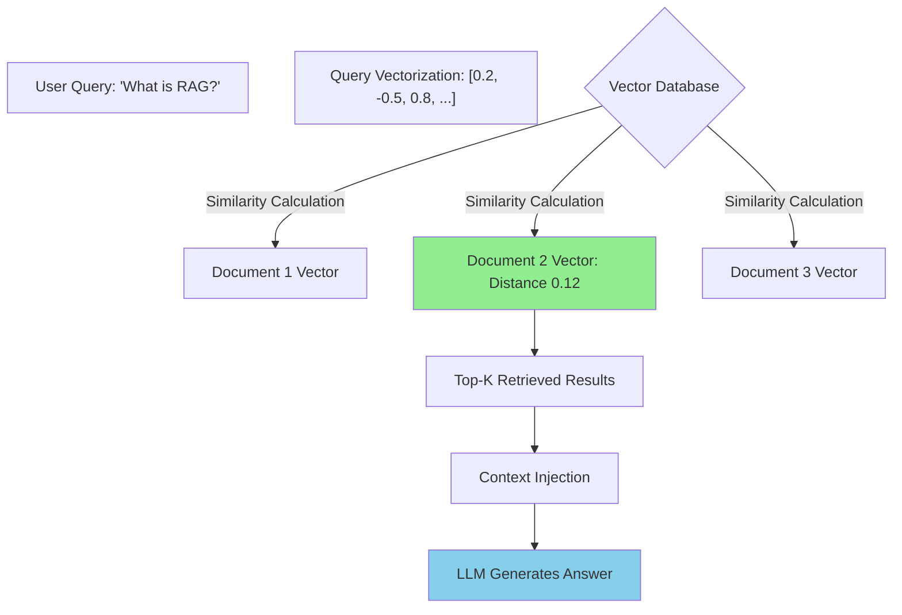

**Essential Difference from Fine-tuning**:

| Dimension | RAG | Fine-tuning |
|-----------|-----|-------------|
| Knowledge Storage | External vector database | Model parameter weights |
| Update Method | Add documents | Requires retraining |
| Knowledge Cutoff | None (real-time updates) | Training data cutoff |
| Cost | Low (storage cost) | High (computation cost) |
| Interpretability | High (traceable sources) | Low (black box) |

---

## 1.2 Why RAG?

### 1.2.1 LLM Limitations: Hallucinations, Knowledge Cutoff, and Long-tail Knowledge Gaps

Despite LLMs' excellence in text generation, they have several fundamental limitations that restrict their direct application in production environments.

**Limitation 1: Hallucinations**

**What are hallucinations?**
LLMs sometimes "fabricate" information that sounds plausible but is completely incorrect. This isn't because the model "lies", but because its training objective is "generate plausible text", not "guarantee factual correctness".

**Root Causes of Hallucinations**:
- LLMs are probabilistic models, predicting next tokens based on statistical patterns
- When knowledge is insufficient, they "complete" answers based on language patterns
- Models cannot distinguish between "what I remember" and "what I guess"

**Manifestations of Hallucinations**:
```
User: "Tell me the 2024 Nobel Prize winner in Physics"
LLM: "The 2024 Nobel Prize in Physics was awarded to Dr. Smith,
      for his contributions to quantum gravity."
      ← Completely fabricated (possibly a mix of 2023 winners)
```

**Limitation 2: Knowledge Cutoff**

**What is knowledge cutoff?**
LLM knowledge is limited to the time range of training data. For example, GPT-4's training data cuts off in 2023, so it cannot "know" events after that time.

**Why does knowledge cutoff exist?**
- Training data snapshot: model stops updating at a certain point
- Expensive retraining: cannot frequently update knowledge
- World constantly changing: new events and knowledge emerge

**Impact of Knowledge Cutoff**:
```
User: "What's the latest TypeScript version?"
LLM: "According to my knowledge, TypeScript 5.0 was released in 2023."
      ← Actually might be 5.4 or higher
```

**Limitation 3: Long-tail Knowledge Missing**

**What is long-tail knowledge?**
Knowledge points that appear extremely rarely in training data:
- Internal enterprise documents
- Personal notes
- Niche domain knowledge
- Private datasets

**Why can't LLMs access long-tail knowledge?**
- Training data sampling bias: internet data ≠ all human knowledge
- Data unavailable: private data not public
- Frequency penalty: rare knowledge "diluted" in training

**Limitation 4: No Attribution**

LLMs cannot tell you the source of answers, which is fatal in scenarios requiring citations:
- Academic research requires source citations
- Enterprise applications need evidence support
- Legal scenarios require regulatory basis

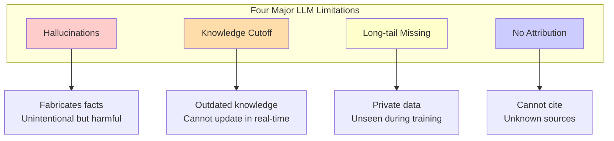

### 1.2.2 Core Value of RAG: Data Grounding, Real-time Updates, and Privacy Protection

RAG systematically addresses the above LLM limitations by introducing external knowledge bases.

**Value 1: Data Grounding**

**What is grounding?**
Making LLM answers based on retrieved facts, rather than "guessing" or "memory".

**Grounding Mechanism**:
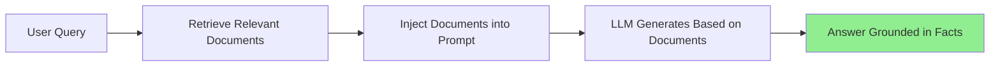

**Grounding Effects**:
- Factual answers: based on retrieved documents
- Reduced hallucinations: model "sees" evidence
- Verifiability: can check original text

**Value 2: Real-time Updates**

**No retraining needed**:
- Add new documents to knowledge base → immediately retrievable
- Update existing documents → effective on next query
- Delete outdated documents → stops retrieval

**Comparison with Traditional Methods**:

| Method | Knowledge Update | Time Cost | Monetary Cost |
|--------|-----------------|-----------|---------------|
| Fine-tuning | Retrain | Days-Weeks | High (GPU time) |
| Prompt Engineering | Manual prompt update | Real-time | Low (but limited) |
| **RAG** | Add/update documents | Real-time | Very low |

**Real-time Update Scenarios**:
- News sites: adding news articles daily
- Legal compliance: regulations added immediately after update
- Product docs: sync updates after new feature releases

**Value 3: Privacy Protection**

**Data stays under your control**:
- Sensitive documents stored in local vector database
- Retrieval happens on your infrastructure
- Only query fragments sent to LLM (can use private LLM)

**Privacy Protection Advantages**:
```
Enterprise Scenario:
Financial Reports + RAG → Answers based on real data
            ↓
Documents never leave enterprise network
            ↓
Compliant with data regulations (GDPR, SOC2)
```

**Value 4: Cost Efficiency**

**RAG + Small Model > Large Model Only**:

| Approach | Model Size | Knowledge Quality | Cost |
|----------|------------|-------------------|------|
| Large Model Only (GPT-4) | 1.8T parameters | Depends on training data | High |
| **RAG + Small Model** (Llama-3-8B) | 8B parameters | Real-time external knowledge | Low |

**Economic Principle**:
- Small model + RAG: retrieve accurate knowledge + cheap inference
- Large model: internalized knowledge → expensive training + expensive inference

**Value 5: Attribution**

**Source Citation**:
```
User: "What is the company's refund policy?"
RAG Answer:
"According to the refund policy document (source: docs/refund-policy.pdf),
    our refund policy is..."

Advantages:
✓ Users can verify answers
✓ Can read original text
✓ Builds trust
```

### 1.2.3 Key Technical Decision: RAG vs. Fine-tuning Differences and Boundaries

RAG and fine-tuning are complementary technologies, not mutually exclusive. Understanding their applicable boundaries is key to architectural design.

**RAG vs. Fine-tuning: Essential Comparison**:

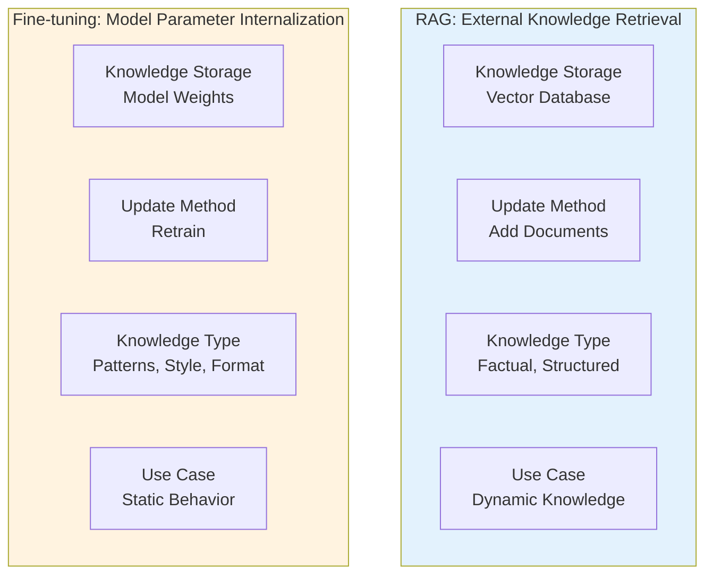

**Decision Matrix: When to Use Which Technology?**

| Scenario | Recommended Approach | Reason |
|----------|---------------------|--------|
| Enterprise knowledge base (real-time updates) | **RAG** | Documents frequently updated, need real-time |
| Medical diagnosis (highly specialized) | **RAG + Fine-tuning** | Fine-tuning learns diagnostic patterns, RAG provides latest research |
| Code generation (specific framework) | **Fine-tuning** | Need to internalize framework code patterns |
| Customer service assistant (company policies) | **RAG** | Policies frequently change, need traceability |
| Creative writing (specific style) | **Fine-tuning** | Need to learn style patterns, not facts |
| Legal compliance (regulation queries) | **RAG** | Must accurately cite original text |
| Personalized recommendations (user preferences) | **Fine-tuning + RAG** | Fine-tuning learns preferences, RAG provides real-time content |

**RAG Applicability Boundaries**:

**Best Scenarios for RAG**:
- Knowledge frequently changes (news, regulations, documents)
- Need accuracy proof (legal, medical, finance)
- High data privacy requirements (enterprise internal data)
- Cost-sensitive (need efficient inference)

**RAG NOT Optimal When**:
- Need to learn complex patterns (code style, writing style)
- Knowledge extremely stable (historical facts, basic science)
- Extremely latency-sensitive (retrieval takes 50-200ms)
- Knowledge already part of model weights (common sense)

**Combination Strategy**:

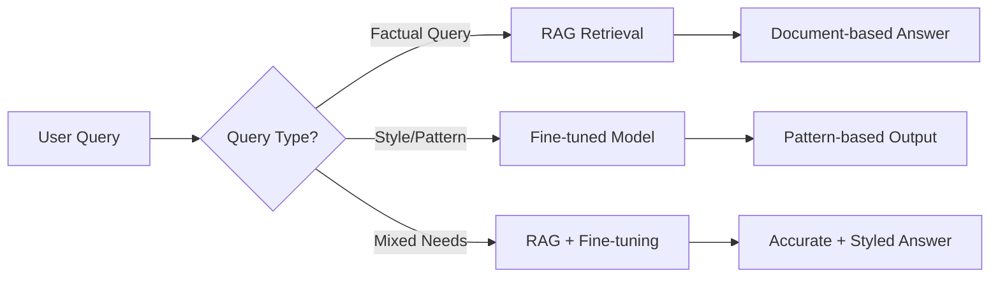

**Practice Recommendations**:
- Start with RAG (low risk, low cost)
- Evaluate if fine-tuning supplementation is needed
- Prioritize RAG + small model over large model
- Document cost-benefit ratio to guide future decisions

---

## 1.3 Core Technical Concepts and Principles

### 1.3.1 Vector Space Model: High-Dimensional Geometric Representation of Semantics

**What is a Vector Space?**

Intuitively, a vector space is a multi-dimensional coordinate system, but with far more dimensions than our everyday 3D experience:
- Text vectors typically have 512, 1024, 2048, or 3072 dimensions
- Each dimension represents a "semantic feature"
- Similar to RGB color space, but with many more dimensions

**Core Insight of High-Dimensional Geometry**:

In vector space, **semantic relationships = geometric relationships**:
- **Distance** = semantic difference
- **Direction** = semantic relationship
- **Clustering** = topic similarity

**Why High Dimensions?**

Human language is extremely complex:
- Vocabulary: tens to hundreds of thousands
- Semantic relationships: synonymy, antonymy, hypernymy, causality...
- Context dependence: same word has different meanings in different sentences

**Dimensions vs. Expressive Power**:

| Dimensions | Expressive Power | Typical Use |
|------------|-----------------|-------------|
| 128-256 | Basic semantics | Simple classification, deduplication |
| 512-768 | Medium semantics | Document retrieval, similarity calculation |
| 1024-1536 | Advanced semantics | Complex retrieval, semantic search |
| 2048-3072 | Fine-grained semantics | Multilingual, cross-modal, specialized domains |

**Geometric Intuition of Vector Space**:

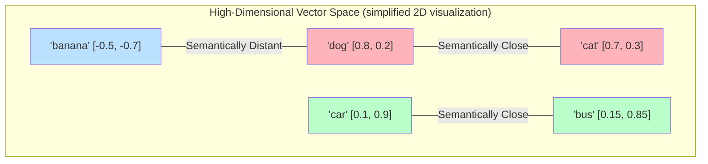

**In Vector Space**:
- "dog" and "cat" are close (both pets)
- "car" and "bus" are close (both vehicles)
- "banana" is distant from both (different category)

**Clustering Phenomenon in Vector Space**:

Semantically similar words automatically cluster:
```
Animal Cluster:
  dog, cat, bird, fish... [dense semantic region]

Vehicle Cluster:
  car, airplane, train, ship... [another semantic region]

Technology Cluster:
  computer, phone, AI, chip... [separate region]
```

**Why Clustering Matters?**

RAG's core principle: **queries find the nearest semantic clusters in vector space, then retrieve documents from those clusters**.

```
Query: "How to train machine learning models?"
      ↓
After vectorization, lands near "machine learning" semantic cluster
      ↓
Retrieve relevant documents from that cluster
      ↓
Return documents about ML training
```

### 1.3.2 Embeddings: Mapping Unstructured Text to Mathematical Vectors

**What are Embeddings?**

Embeddings are techniques for mapping human symbols (text, images, audio) to mathematical space (vectors). The goal of embedding models is: **make semantically similar content closer together in vector space**.

**Essence of Embeddings = Translation from Meaning to Numbers**:

```
Text (Human-readable)
    ↓ Embedding Model
Vector (Machine-computable)

Example:
"I'm very happy"  → [0.5, -0.2, 0.8, 0.1, ...]
"I'm happy" → [0.48, -0.18, 0.82, 0.12, ...]
              ↑ Close distance, because semantically similar
```

**Core Properties of Good Embeddings**:

**Property 1: Semantic Similarity Preservation**

Semantically similar content → closer vector distance

```
Example:
"apple" vs "orange" → distance 0.3 (both fruits)
"apple" vs "car"  → distance 1.2 (different categories)
"apple" vs "Apple" → distance 0.15 (same entity, different languages)
```

**Property 2: Analogical Reasoning**

Embedding space supports vector arithmetic:

```
Classic Example (Word2Vec):
  king - man + woman = queen

Intuition:
  "king" - "male" + "female" = "queen"

How it works:
  (king vector) - (man vector) + (woman vector)
  ≈ queen vector
```

**Property 3: Context Awareness**

Modern embedding models (like BERT, GPT embeddings) consider context:

```
Sentence 1: "I went to the bank to deposit money"
         ↓
      "bank" (financial institution) vector

Sentence 2: "I walked along the river bank"
         ↓
      "bank" (riverbank) vector

Result: same word, different contexts → different vectors
```

**Embedding Training Objective (Intuitive Understanding)**:

Modern embedding models use **Contrastive Learning**:

**Core Idea**:
- Positive pairs (similar text) → pull closer
- Negative pairs (dissimilar text) → push further apart

**Training Process**:
```
Query: "What is machine learning?"

Positive: "Machine learning is a branch of AI..."
        ↓ Pull closer

Negative: "The weather is nice today, good for walking..."
        ↓ Push further apart

Goal: Query-Positive distance << Query-Negative distance
```

**Why This Objective Works?**

Through millions of contrastive learning iterations, models gradually master:
- What makes text similar (semantics, topics, intent)
- What makes text dissimilar (irrelevant content)
- How to encode this similarity into vectors

**Embedding Model Selection**:

| Model | Dimensions | Characteristics | Use Case |
|-------|------------|------------------|----------|
| text-embedding-3-small | 1536 | Fast, low cost | General retrieval |
| text-embedding-3-large | 3072 | High quality, multilingual | Complex semantics, cross-language |
| bge-base-zh | 768 | Chinese optimized | Chinese-focused applications |
| e5-large-v2 | 1024 | Open-source, balanced | Cost-sensitive scenarios |
| bge-m3 | 1024 | Multilingual, multi-functional | International applications |

### 1.3.3 Similarity Metrics: Cosine Similarity and Distance Calculation

In vector space, we need mathematical methods to measure the "similarity" between two vectors. Three common metrics each have their use cases.

**Cosine Similarity**

**Definition**: Measures the angle between two vectors, not absolute distance

**Intuitive Understanding**:
- Focuses on direction, not length
- Similarity ∈ [-1, 1], 1 means identical direction, 0 means orthogonal, -1 means opposite
- Insensitive to text length

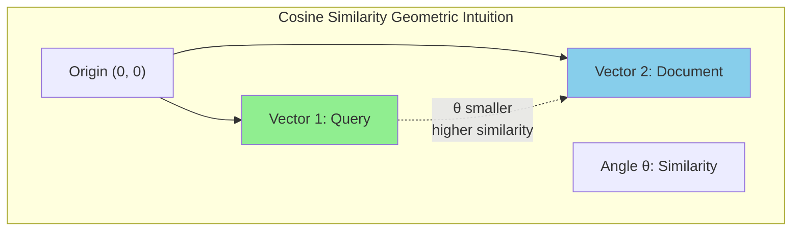

**Why Cosine Similarity for Text?**

```
Example:
Text 1: "machine learning"
      Vector: [1.0, 2.0, 1.5]

Text 2: "machine learning is a branch of artificial intelligence"
      Vector: [2.0, 4.0, 3.0] (doubled length, same direction)

Cosine Similarity: 1.0 (identical direction, length ignored)
Intuition: Semantically identical, despite different lengths
```

**Practical Significance**:
- Long documents don't "dominate" due to more words
- Focuses on "talking about the same thing", not "how much said"

**Euclidean Distance**

**Definition**: Straight-line distance between two points (our everyday understanding of "distance")

**Formula Intuition**:
```
distance = √[(x1-x2)² + (y1-y2)² + ...]

Analogy: Straight-line distance in 3D space
```

**When to Use Euclidean Distance?**
- Scenarios needing vector magnitude (length) consideration
- Image embeddings (pixel intensity matters)
- Certain specialized embedding models

**Dot Product**

**Definition**: Sum of element-wise multiplication

**Relationship to Cosine Similarity**:
```
Dot Product = Cosine Similarity × Vector Length Product

If vectors normalized (length = 1):
  Dot Product = Cosine Similarity
```

**Why Dot Product is Fast?**
- Modern hardware (GPU, TPU) highly optimized for matrix multiplication
- Vector databases commonly use dot product to accelerate retrieval

**Three Metrics Comparison**:

| Metric | Range | Focus | Speed | Common Use |
|--------|-------|-------|-------|------------|
| **Cosine Similarity** | [-1, 1] | Direction (semantics) | Medium | Text retrieval (default) |
| **Euclidean Distance** | [0, ∞] | Absolute distance | Slow | Images, magnitude-critical |
| **Dot Product** | (-∞, ∞) | Direction × Length | Fast | Equivalent to cosine when normalized |

**Similarity Threshold Selection**:

How to judge "similar enough" in practice?

```
Cosine Similarity Threshold Guide:

≥ 0.95: Almost identical (duplicate documents, paraphrasing)
≥ 0.85: Highly similar (same topic, different expression)
≥ 0.70: Moderately related (relevant but not perfect match)
≥ 0.50: Weakly related (potentially useful, needs human judgment)
< 0.50: Not relevant (should typically be filtered)
```

**Practical Retrieval Example**:

```
Query: "How to train machine learning models?"

Retrieval Results:
1. "Machine Learning Model Training Guide"     → Similarity 0.92 ✓
2. "Deep Learning Training Techniques"         → Similarity 0.88 ✓
3. "Machine Learning Algorithm Principles"     → Similarity 0.76 ✓
4. "How to Train Pet Dogs"                     → Similarity 0.35 ✗
5. "Today's Weather"                           → Similarity 0.12 ✗

Top-3 Selection: First three documents
```

---

## 1.4 Standard Architecture and Data Lifecycle

### 1.4.1 Phase 1: Indexing

Indexing is the "learning" phase of RAG systems, converting raw documents into retrievable vector representations.

**Complete Indexing Flow**:

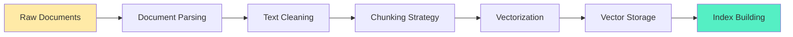

**Step 1: Document Parsing**

**Supported Data Sources**:
- Text files: Markdown, TXT, CSV
- Office documents: PDF, DOCX, PPTX
- Web pages: HTML, Markdown (scraped)
- Code: Source code in various programming languages
- Structured data: JSON, XML, Database

**Parsing Challenges**:
- PDF parsing: Handle multi-column, tables, images
- Web page cleaning: Remove navigation, ads, footers
- Code parsing: Preserve syntax structure, comments

**Step 2: Text Cleaning**

**Cleaning Operations**:
```
Original Text:
  "   Hello!!!   \n\n   Visit our site at https://example.com  "

Cleaned:
  "Hello visit our site"

Operations:
- Remove extra whitespace
- Remove special characters
- Handle URLs, emails (optional)
- Unify punctuation
- Convert to lowercase (situation-dependent)
```

**Why Clean?**
- Reduce noise, improve retrieval quality
- Unify format, avoid duplication
- Reduce token usage

**Step 3: Chunking Strategy**

**Why Chunk?**
- LLM context window limited (4K-128K tokens)
- Embedding models have length limits (512-8192 tokens)
- Fine-grained retrieval more accurate

**Three Main Chunking Strategies**:

**Strategy 1: Fixed-size Chunking**

```
Principle: Split by character count or token count

Example:
chunk_size = 500
overlap = 50

Document: "This is a long article..." (2000 characters)

Chunks:
Chunk 1: Characters 0-500
Chunk 2: Characters 450-950   (50 character overlap)
Chunk 3: Characters 900-1400
Chunk 4: Characters 1350-1850

Pros: Simple, fast, predictable
Cons: May break semantic units
```

**Strategy 2: Semantic Chunking**

```
Principle: Split by semantic boundaries (paragraphs, sections)

Example:
Document: "Chapter 1 Introduction...\n\nChapter 2 Methods...\n\n"

Chunks:
Chunk 1: "Chapter 1 Introduction..." (complete chapter)
Chunk 2: "Chapter 2 Methods..."   (complete chapter)

Pros: Semantic completeness, contextual coherence
Cons: Needs document structure, slower
```

**Strategy 3: Recursive Chunking**

```
Principle: Multi-level granularity, coarse to fine

Example:
Level 1: Chapter-level chunks
Level 2: Paragraph-level chunks
Level 3: Sentence-level chunks

Retrieval:
  Coarse-grained retrieval → Fine-grained refinement

Pros: Balance speed and quality
Cons: Higher complexity
```

**Chunking Selection Guide**:

| Scenario | Recommended Strategy | chunk_size | overlap |
|----------|---------------------|-----------|---------|
| General documents | Fixed-size | 500-1000 | 50-100 |
| Academic papers | Semantic | N/A | N/A |
| Code | Semantic (function-level) | N/A | N/A |
| Long documents | Recursive | Multi-level | Varies |
| FAQ/dialogue | Fixed-size | 200-400 | 0-50 |

**Step 4: Vectorization**

```
Each text chunk → Embedding model → Vector

Example:
Chunk: "Machine learning is a branch of AI..."

Embedding Model: text-embedding-3-small

Output Vector: [0.2, -0.5, 0.8, 0.1, ...] (1536 dimensions)
```

**Batch Processing Optimization**:
- Batch vectorization (e.g., 100 at a time)
- GPU/TPU acceleration
- Asynchronous processing (large-scale data)

**Step 5: Vector Storage & Indexing**

**Vector Database Selection**:

| Database | Characteristics | Use Case |
|----------|------------------|----------|
| Pinecone | Managed service, easy | Rapid prototypes, small teams |
| Weaviate | Open-source, modular | Self-hosted, customization needs |
| Qdrant | High-performance, Rust | Large-scale, low latency |
| Chroma | Lightweight, embedded | Local development, testing |
| pgvector | PostgreSQL extension | Existing PG infrastructure |

**Indexing Algorithms (ANN - Approximate Nearest Neighbor)**:

```
Exact Search (Brute Force):
  Calculate distance between query and all documents
  Complexity: O(N) - N = number of documents

Approximate Search (ANN):
  Use index structure to quickly find approximate nearest neighbors
  Complexity: O(log N) or faster
  Sacrifice small precision for speed
```

**Common ANN Algorithms**:
- HNSW (Hierarchical Navigable Small World): High precision, fast
- IVF (Inverted File Index): Balance precision and speed
- PQ (Product Quantization): Compress vectors, save memory

**Post-Indexing State**:

```
Original Documents:
  ├── doc1.pdf
  ├── doc2.md
  └── doc3.html

          ↓ Indexing Complete

Vector Database:
  ├── [
  │    id: "chunk-1",
  │    vector: [0.2, -0.5, ...],
  │    metadata: {source: "doc1.pdf", page: 1}
  │  ],
  ├── [chunk-2, ...],
  └── [chunk-3, ...]

Ready for Retrieval ✓
```

### 1.4.2 Phase 2: Retrieval

Retrieval is the "query" phase of RAG, finding the most relevant document fragments based on user questions.

**Retrieval Flow**:

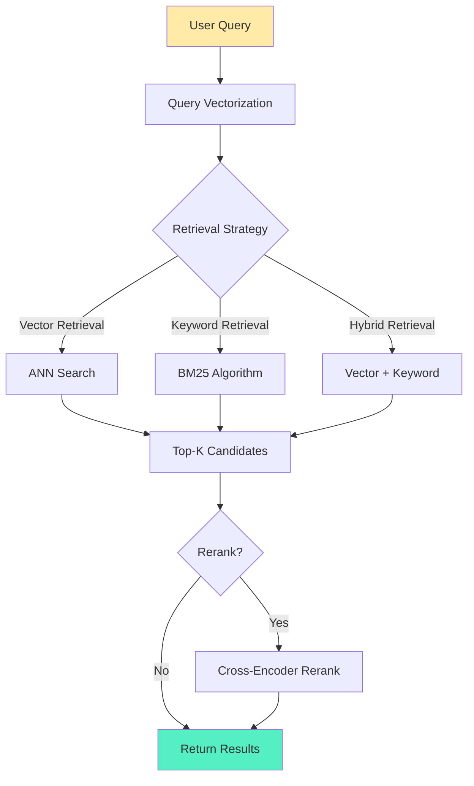

**Step 1: Query Vectorization**

```
User Query: "How to implement REST API with Spring Boot?"
            ↓
Query Vectorization: [0.3, -0.1, 0.9, ...] (same dimension as documents)
            ↓
Used for similarity calculation
```

**Query Optimization Techniques**:

**Query Expansion**:
```
Original Query: "machine learning"

Expanded: "machine learning OR deep learning OR neural networks OR ML OR DL"

Improvement: Recall (cover more relevant documents)
```

**Query Rewriting**:
```
User: "How to do?"
     ↓ LLM Rewriting
"How to implement machine learning model training?"

Improvement: Clarify query intent
```

**Step 2: Vector Retrieval**

**ANN Search Process**:
```
1. Calculate similarity between query vector and all vectors in index
2. Use index structure to quickly find Top-K nearest neighbors
3. Return K most similar document chunks

Parameters:
  - top_k: How many results to return (typically 5-20)
  - score_threshold: Similarity threshold (e.g., 0.7)
```

**Retrieval Result Example**:
```
Query: "How does RAG system work?"

Top-5 Results:
1. "RAG system consists of retrieval and generation phases..." (Similarity: 0.92)
2. "Retrieval-Augmented Generation (RAG) is a..."     (Similarity: 0.89)
3. "Main differences between RAG and fine-tuning..."        (Similarity: 0.76)
4. "Vector database selection..."            (Similarity: 0.65)
5. "Today's weather is great..."                (Similarity: 0.12)

Filtered (threshold=0.7):
  Results 1, 2, 3
```

**Step 3: Hybrid Retrieval**

**Why Hybrid Retrieval?**

Vector retrieval limitations:
- Weak at exact matching (proper nouns, ID numbers)
- May miss keywords

Keyword retrieval strengths:
- Strong exact matching
- Complementary to vector retrieval

**Hybrid Strategy**:

```
Vector Retrieval: Top-20 results
Keyword Retrieval: Top-20 results
      ↓
Merge and Deduplicate: Top-30 unique results
      ↓
Rerank: Final Top-10
```

**Score Fusion**:
```
Final Score = α × Vector Score + (1-α) × Keyword Score

Typical α values:
  0.5: Vector and keyword equally important
  0.7: Vector primary, keyword secondary
  0.3: Keyword primary, vector secondary
```

**Step 4: Reranking**

**Why Rerank?**

Retrieval phase prioritizes "fast", may sacrifice "accurate". Reranking uses more complex models to re-rank precisely.

**Cross-Encoder Reranking**:
```
First Phase (Retrieval):
  Fast Model: Bi-Encoder
  Return: Top-20 candidates

Second Phase (Rerank):
  Precise Model: Cross-Encoder
  Input: (query, document) pairs
  Output: Precise similarity scores
  Return: Top-5 final results

Cost: Reranking 20 vs retrieving 10000
Benefit: Significantly improved precision
```

**Reranking Model Selection**:

| Model | Characteristics | Speed | Precision |
|-------|----------------|-------|-----------|
| bge-reranker-large | Chinese optimized | Medium | High |
| cohere-rerank-v3 | Multilingual | Fast | High |
| cross-encoder-ms-marco | English optimized | Slow | Very High |

### 1.4.3 Phase 3: Generation

Generation is the "answer" phase of RAG, where LLM generates the final answer based on retrieved context.

**Generation Flow**:

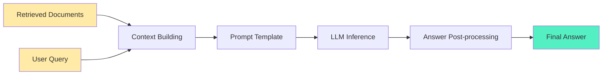

**Step 1: Context Building**

**Context Injection Strategies**:

**Strategy 1: Inject All**
```
Retrieve 5 documents, inject all

Pros: Complete information
Cons: May exceed context window, high cost
```

**Strategy 2: Selective Injection**
```
Only inject documents with similarity > 0.8

Pros: High quality, saves tokens
Cons: May miss useful information
```

**Strategy 3: Compressed Injection**
```
Document: "This is a long article..." (1000 tokens)
      ↓ LLM Compression
Summary: "Article mainly discusses RAG principles..." (200 tokens)

Pros: Preserve key information, save tokens
Cons: Compression may lose details
```

**Context Length Management**:
```
LLM Context Window: 8K tokens
Query: 100 tokens
System Prompt: 500 tokens
      ↓
Available Space: 7400 tokens

Document Allocation:
  Document 1: 2000 tokens
  Document 2: 1800 tokens
  Document 3: 1500 tokens
  Document 4: 2100 tokens ← Exceeds!
      ↓
Truncate or Drop Document 4
```

**Step 2: Prompt Template**

**Standard RAG Prompt Template**:

```
You are a helpful assistant. Please answer the user's question based on the following context.

Context:
{context}

Question: {question}

Answer:
```

**Filled Actual Prompt**:
```
You are a helpful assistant. Please answer the user's question based on the following context.

Context:
[Document 1]: RAG is short for Retrieval-Augmented Generation, combining information retrieval and text generation...
[Document 2]: RAG system consists of three main components: retriever, knowledge source, and generator...
[Document 3]: RAG advantages include real-time updates, data grounding, and privacy protection...

Question: What components does a RAG system consist of?

Answer:
```

**Prompt Optimization Techniques**:

**Technique 1: Clear Instructions**
```
❌ Poor: "Answer the question based on context"
✓ Good: "Answer the question ONLY based on the following context. If no relevant
         information is found in the context, clearly state 'No relevant information
         found in context', do not fabricate answers."
```

**Technique 2: Source Citation**
```
Context:
[Document 1 - Source: rag-intro.pdf]: RAG is short for Retrieval-Augmented...
[Document 2 - Source: rag-components.md]: RAG system consists of...

Question: What are RAG's advantages?

Answer: According to rag-intro.pdf, RAG's advantages include...
      Also according to rag-components.md, RAG components have...
```

**Technique 3: Multi-step Reasoning**
```
Context: {context}

Question: {question}

Please answer following these steps:
1. Understand the core intent of the question
2. Extract relevant information from context
3. Synthesize multiple information sources
4. Give a clear answer
```

**Step 3: LLM Inference**

**Model Selection**:

| Scenario | Recommended Model | Reason |
|----------|------------------|--------|
| Simple Q&A | GPT-3.5 / Llama-3-8B | Low cost, fast |
| Complex Reasoning | GPT-4 / Claude-3.5 | Strong reasoning |
| Chinese Optimized | Qwen / Yi / DeepSeek | Good Chinese performance |
| Private Deployment | Llama-3-70B / Mistral | Data privacy |

**Inference Parameter Tuning**:

```
temperature = 0.0-0.2
  Low temperature: More deterministic, more faithful to context
  Use case: Factual Q&A

top_p = 0.9-1.0
  Nucleus sampling: Control diversity
  RAG scenarios typically set to 1.0

max_tokens = as needed
  Short answers: 100-300
  Long answers: 500-1000
  Summaries: 200-500
```

**Step 4: Answer Post-processing**

**Post-processing Tasks**:

**Task 1: Source Extraction**
```
LLM Output: "According to document 1, RAG is..."
         ↓
Post-process: Extract source citation
Result: "According to rag-intro.pdf, RAG is..."
```

**Task 2: Confidence Scoring**
```
Method 1: Based on LLM output
  "I'm certain the answer is..." → High confidence

Method 2: Based on retrieval scores
  Average similarity > 0.85 → High confidence
  Average similarity < 0.7 → Low confidence

Method 3: Dedicated confidence model
  Additional classifier judges answer quality
```

**Task 3: Formatting**
```
Requirement: JSON output, Markdown, Plain text...

Conversion:
  LLM output → Target format

Example:
  "The answer is: RAG is..." → {"answer": "RAG is..."}
```

**Complete RAG Pipeline Example**:

```
User Query: "What's the difference between RAG and fine-tuning?"

Phase 1 - Retrieval:
  Vectorization: [0.1, -0.3, 0.8, ...]
  Retrieval: Top-5 relevant documents
  Rerank: Refined Top-3

Phase 2 - Context Building:
  Injection: Document 1 (2000 tokens) + Document 2 (1800 tokens)

Phase 3 - Generation:
  Prompt: "Answer based on the following context..."
  LLM: GPT-4, temperature=0.1
  Output: "The main difference between RAG and fine-tuning is..."

Final Answer:
  "The main difference between RAG and fine-tuning is knowledge storage.
   RAG stores knowledge in external vector databases, supporting real-time updates;
   Fine-tuning internalizes knowledge into model weights, requiring retraining.

   Source: rag-vs-finetune.md, rag-fundamentals.pdf"
```

---

## 1.5 Evolutionary Paradigms

### 1.5.1 Naive RAG: Basic Three-Stage Pipeline and Limitations

**Naive RAG** is the simplest form of RAG, working directly in a linear "retrieve-generate" flow.

**Naive RAG Architecture**:


**Standard Workflow**:

```
1. User enters question
2. Question vectorization
3. Vector database retrieves Top-K documents
4. Inject documents into Prompt
5. LLM generates answer
```

**Limitations of Naive RAG**:

**Limitation 1: Query Quality Issues**
```
User Query: "How to do?"
Problem: Vague, lacks context
Result: Inaccurate retrieval
```

**Limitation 2: Single Retrieval Method**
```
Only vector retrieval:
  - Weak at exact matching (proper nouns)
  - May miss keywords
  - Cannot handle structured queries
```

**Limitation 3: No Reranking**
```
Retrieval Results:
  Document 1: Similarity 0.75 (actually irrelevant)
  Document 2: Similarity 0.73 (actually highly relevant)

Naive RAG: Directly uses Document 1
Should be: Rerank then select Document 2
```

**Limitation 4: Context Window Limitation**
```
Retrieved 10 documents, total 15000 tokens
LLM context window: 8000 tokens
      ↓
Must truncate or drop documents
May lose key information
```

**Limitation 5: Retrieval Failure No Recovery**
```
Retrieval fails → Context empty or irrelevant
      ↓
LLM still attempts to answer → Hallucination
Naive RAG has no detection mechanism
```

**Applicable Scenarios**:
- Simple Q&A (clear questions)
- Small document base (< 10K documents)
- Limited budget (simple implementation)
- Prototype validation (rapid iteration)

### 1.5.2 Advanced RAG: Query Rewriting, Hybrid Retrieval, and Reranking

**Advanced RAG** adds multiple optimization layers on top of Naive RAG, significantly improving retrieval quality and generation effectiveness.

**Advanced RAG Architecture**:

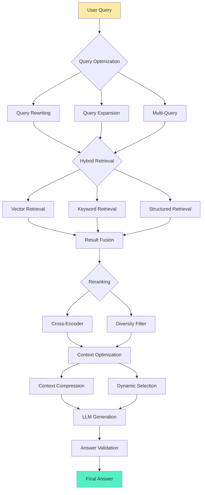

**Optimization 1: Query Rewriting**

**Goal**: Convert vague, incomplete queries into clear, executable queries.

**LLM Query Rewriting**:
```
Original Query: "How to do?"
      ↓ LLM Rewriting
Optimized Query: "How to implement REST API with Spring Boot?"
      ↓
Significantly improved retrieval quality
```

**Query Rewriting Techniques**:
```
1. Intent Recognition: What does the user want?
2. Context Supplementation: Supplement implicit information
3. Professional Term Conversion: Colloquial → Professional
4. Multilingual Unification: Chinese → English (if doc base is primarily English)
```

**Optimization 2: Query Expansion**

**Goal**: Generate multiple related queries to improve recall.

**Query Expansion Methods**:

**Method 1: Synonym Expansion**
```
Original: "machine learning"
Expanded: "machine learning OR deep learning OR neural networks OR ML OR DL"
```

**Method 2: LLM-Generated Sub-queries**
```
Original: "How to improve RAG system performance?"
      ↓ LLM Generation
Sub-query 1: "RAG system index optimization methods"
Sub-query 2: "RAG retrieval algorithm comparison"
Sub-query 3: "RAG generation phase optimization techniques"
      ↓
Parallel retrieval of multiple sub-queries
```

**Method 3: Hypothetical Document Expansion (HyDE)**
```
Query: "Working principle of RAG systems"
      ↓ LLM Generates Hypothetical Answer
Hypothetical Document: "RAG systems enhance LLMs by retrieving external knowledge bases.
           It consists of three phases: indexing, retrieval, and generation..."
      ↓ Vectorize hypothetical document
      ↓ Retrieve real documents similar to hypothetical document
```

**Optimization 3: Hybrid Retrieval**

**Vector + Keyword Fusion**:

```
Vector Retrieval (Top-20):
  High semantic similarity
  Weak exact matching

Keyword Retrieval (Top-20):
  Strong exact matching
  Weak semantic understanding

Fusion:
  Result = α × Vector Score + (1-α) × Keyword Score
  Typical α = 0.7 (vector primary)

Output: Top-20 hybrid results
```

**Optimization 4: Reranking**

**Two-Stage Retrieval Strategy**:
```
First Stage - Recall:
  Fast Retrieval: Bi-Encoder + ANN
  Return: Top-50 candidates
  Cost: Low

Second Stage - Precision:
  Precise Reranking: Cross-Encoder
  Input: (query, document) pairs
  Return: Top-10 final results
  Cost: Medium (but only for 50 documents)

Overall: Fast + Precise
```

**Reranking Optimization**:
```
Diversity Filtering:
  Among Top-10 results, avoid over-similarity
  Example: Don't select 5 fragments from same document

Novelty Detection:
  Penalize documents too similar to previous results

Confidence Threshold:
  Filter low-confidence results (< 0.6)
```

**Optimization 5: Context Compression**

**Problem**: Retrieved documents may be long, wasting tokens.

**Solutions**:

**Method 1: LLM Compression**
```
Original Document: "This is a long article about RAG, detailing..." (2000 tokens)
          ↓ LLM Extracts Key Information
Compressed: "RAG consists of three phases: indexing, retrieval, generation.
           Advantages are real-time updates..." (300 tokens)

Savings: 1700 tokens
```

**Method 2: Extract Only Relevant Sentences**
```
Query: "What steps does RAG indexing phase include?"

Document: "RAG is an AI architecture...
         Indexing phase includes document parsing, text cleaning, chunking, and vectorization...
         Generation phase is LLM generating answer based on context..."

Extract: Only keep "Indexing phase includes..." sentence
Discard: Other irrelevant sentences
```

**Optimization 6: Recursive Retrieval**

**Problem**: Sometimes multiple retrievals needed to gather sufficient information.

**Recursive Retrieval Flow**:
```
First Round Retrieval:
  Query: "What is RAG?"
  Result: "RAG is retrieval-augmented generation..."

Second Round Retrieval (based on first round):
  Query: "What are RAG's core components?"
  Result: "Includes retriever, knowledge source, and generator..."

Third Round Retrieval (deep dive):
  Query: "How does retriever work?"
  Result: "Retriever uses vector similarity..."

Final: Synthesize information from multiple rounds
```

**Advanced RAG vs Naive RAG Comparison**:

| Dimension | Naive RAG | Advanced RAG |
|-----------|-----------|--------------|
| Query Processing | Direct use | Rewriting, expansion, multi-query |
| Retrieval Method | Vector only | Hybrid retrieval (vector + keyword) |
| Reranking | None | Cross-Encoder precision |
| Context Optimization | Direct injection | Compression, selection, deduplication |
| Retrieval Rounds | Single | Support multi-round recursive |
| Accuracy | Medium | High |
| Latency | Low (50-200ms) | Medium (200-500ms) |
| Cost | Low | Medium |
| Use Cases | Simple Q&A | Complex, professional Q&A |

### 1.5.3 Modular RAG: Dynamic Routing, Agents, and Multimodal Trends

**Modular RAG** represents the next generation of RAG architecture, introducing modularity, dynamic routing, and agent capabilities for more intelligent, flexible knowledge retrieval and generation.

**Modular RAG Core Philosophy**:

Instead of viewing RAG as a fixed pipeline, treat it as a composable collection of modules that dynamically select optimal paths based on query type.

**Modular RAG Architecture**:

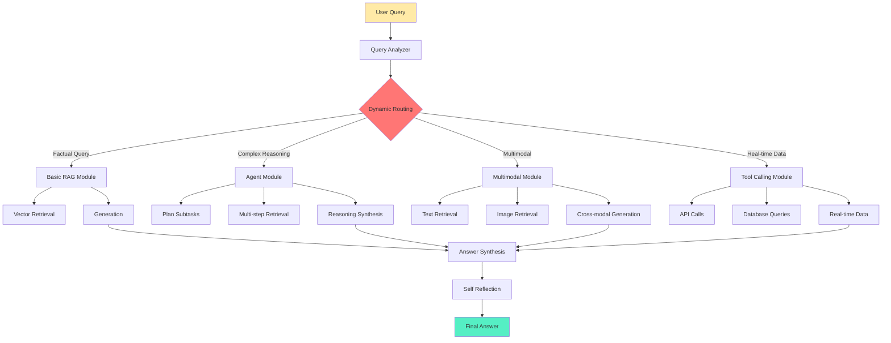

**Module 1: Dynamic Routing**

**Core Idea**: Automatically select optimal processing path based on query type.

**Routing Strategies**:

**Strategy 1: Query Classification-Based**
```
Query Analyzer Identifies Query Type:

Type 1: Simple Factual Query
  → Basic RAG (vector retrieval + generation)

Type 2: Complex Reasoning Query
  → Agent RAG (multi-step retrieval + reasoning)

Type 3: Real-time Data Query
  → Tool Calling (API + database queries)

Type 4: Multimodal Query
  → Multimodal Module (text + image)
```

**Strategy 2: Confidence-Based**
```
First Round RAG:
  High retrieval confidence (> 0.9)
    → Directly return answer

  Medium retrieval confidence (0.7-0.9)
    → Query expansion + retry

  Low retrieval confidence (< 0.7)
    → Switch to other modules (like Agent)
```

**Module 2: Agent RAG**

**Core Idea**: Use LLM as Agent, actively planning retrieval strategies rather than passive retrieval.

**Agent RAG Workflow**:
```
User Query: "Compare cost-effectiveness of RAG and fine-tuning in enterprise applications"

Agent Planning:
  Step 1: Retrieve RAG cost information
  Step 2: Retrieve fine-tuning cost information
  Step 3: Retrieve enterprise application case studies
  Step 4: Comprehensive comparative analysis

Execution:
  Step 1 → Retrieval → "RAG's costs mainly include vector database storage..."
  Step 2 → Retrieval → "Fine-tuning requires GPU training costs..."
  Step 3 → Retrieval → "Enterprise cases..."
  Step 4 → Reasoning → "Synthesizing above information..."

Final Answer:
  "Based on retrieved information, RAG's cost advantages in enterprise applications include..."
```

**Agent Capabilities**:

**Capability 1: Tool Use**
```
Available Tools:
  - Vector Retrieval (search document base)
  - Web Search (get real-time information)
  - Calculator (numerical calculation)
  - SQL Query (structured data)

Agent Automatically Selects Tools:
  "Query cost data" → Use SQL Query
  "Query latest news" → Use Web Search
  "Query internal documents" → Use Vector Retrieval
```

**Capability 2: Multi-step Reasoning**
```
Query: "Why is RAG suitable for real-time update scenarios?"

Agent Reasoning Chain:
  Thought 1: First understand RAG's update mechanism
    → Retrieve "RAG update mechanism"
    → Learn: "Just add documents"

  Thought 2: Understand fine-tuning's update mechanism
    → Retrieve "fine-tuning update process"
    → Learn: "Requires retraining"

  Thought 3: Compare both update speeds
    → Reason: "Adding documents << Retraining"

  Thought 4: Summarize
    → "RAG suitable for real-time updates because update cost is low"
```

**Module 3: Multimodal RAG**

**Core Idea**: Extend RAG beyond text to support images, audio, video, and other multimodal content.

**Multimodal RAG Architecture**:
```
User Query: "What architecture is shown in this image?"
      ↓
Image Embedding Model:
  Image → Image Vector
      ↓
Cross-modal Retrieval:
  Query vector matched against image vector database
      ↓
Retrieval Result: Find similar architecture diagrams
      ↓
Multimodal LLM (e.g., GPT-4V):
  Input: Query + Image
  Output: "This is a typical RAG architecture diagram, containing..."
```

**Multimodal Application Scenarios**:

**Scenario 1: Image-Text Retrieval**
```
Query: "Show architecture diagram of Kubernetes deployment"
Retrieval: Architecture diagrams in vector database
Generation: "This diagram shows Kubernetes deployment architecture..."
```

**Scenario 2: Video RAG**
```
Query: "What's discussed at video 15:30?"
Retrieval: Video transcript + timestamps
Generation: "At 15:30, the presenter introduces RAG's indexing phase..."
```

**Scenario 3: Audio RAG**
```
Query: "Part about RAG costs in the podcast"
Retrieval: Podcast transcript
Generation: "At 23 minutes of the podcast, the guest mentions..."
```

**Module 4: Self-Reflective RAG**

**Core Idea**: RAG system self-evaluates answer quality, makes corrections when necessary.

**Self-Reflection Loop**:
```
First Round Generation:
  Query: "What are RAG's advantages?"
  Retrieval: Top-3 documents
  Generation: "RAG's advantages include real-time updates..."
      ↓
Self Evaluation:
  Evaluation: Is this answer comprehensive?
  Checks:
    - Does it cover all main advantages?
    - Any omissions?
    - Is it accurate?
      ↓
If insufficient:
  → Trigger second round retrieval
  → Supplement more information
      ↓
Final Generation:
  "RAG's advantages include: 1. Real-time updates 2. Data grounding 3. Privacy protection..."
```

**Self-Reflection Techniques**:

**Technique 1: Answer Validation**
```
LLM Checks:
  "Is this answer based on retrieved context?
   Is there no fabricated information?
   Does it cover all relevant points?"

If hallucination found:
  → Mark issue
  → Regenerate
```

**Technique 2: Knowledge Graph Validation**
```
After generating answer:
  → Extract key facts
  → Compare with knowledge graph
  → Check consistency

If contradiction found:
  → Correct answer or mark as uncertain
```

**Module 5: Adaptive RAG**

**Core Idea**: Continuously optimize RAG system based on user feedback.

**Feedback Loop**:
```
User uses RAG system
      ↓
Collect Feedback:
  - Thumbs up/down
  - Answer quality ratings
  - Which sources clicked
      ↓
Analyze Feedback:
  - Which retrieval strategies work well?
  - Which query types have high failure rates?
  - Which documents have high quality?
      ↓
Auto Optimization:
  - Adjust retrieval parameters
  - Re-weight documents
  - Optimize prompt templates
```

**RAG Evolution Timeline**:

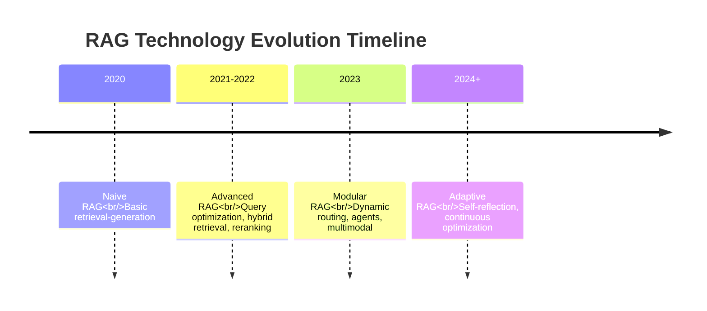

**Three-Generation RAG Comparison Summary**:

| Dimension | Naive RAG | Advanced RAG | Modular RAG |
|-----------|-----------|--------------|-------------|
| **Query Processing** | Direct use | Rewriting, expansion | Dynamic routing |
| **Retrieval Method** | Single vector | Hybrid retrieval | Tool calling, multimodal |
| **Reranking** | None | Cross-Encoder | Adaptive |
| **Reasoning Capability** | None | Limited | Agent multi-step reasoning |
| **Modality Support** | Text only | Text only | Multimodal |
| **Self-Improvement** | None | None | Self-reflection, feedback optimization |
| **Complexity** | Low | Medium | High |
| **Cost** | Low | Medium | High |
| **Use Cases** | Simple Q&A | Complex Q&A | Enterprise intelligent systems |

**Future Trends**:

**Trend 1: Deep RAG + Agent Integration**
- Agent as RAG's "brain", actively planning retrieval strategies
- RAG as Agent's "knowledge base", providing real-time information

**Trend 2: Multimodal RAG Proliferation**
- Image, video, audio retrieval become standard capabilities
- Cross-modal understanding and generation

**Trend 3: Self-Evolving RAG**
- System automatically optimizes retrieval strategies
- Continuous improvement based on user feedback

**Trend 4: Domain-Specific RAG**
- Medical RAG (medical knowledge bases)
- Legal RAG (regulation databases)
- Financial RAG (market data)

---

## Summary

This chapter established the theoretical foundation and architectural understanding of RAG systems, covering the following core content:

**Core Concepts**:
- RAG is an architectural pattern that enhances LLMs by retrieving external knowledge bases
- Essentially "open-book exam", transforming LLM from "closed-book" to "with reference books"
- Core principle: information transfer based on semantic distance, not learning

**Why RAG**:
- LLM limitations: hallucinations, knowledge cutoff, long-tail knowledge gaps, no attribution
- RAG's core value: data grounding, real-time updates, privacy protection, cost efficiency, attribution
- RAG vs. fine-tuning: complementary technologies, each with applicable boundaries

**Core Technologies**:
- Vector space model: high-dimensional geometric representation of semantics
- Embeddings: text-to-vector mapping, preserving semantic similarity
- Similarity metrics: cosine similarity (default), Euclidean distance, dot product

**Standard Architecture**:
- Phase 1: Indexing (parsing, cleaning, chunking, vectorization, storage)
- Phase 2: Retrieval (query optimization, vector retrieval, hybrid retrieval, reranking)
- Phase 3: Generation (context building, prompt templates, LLM inference, post-processing)

**Evolutionary Paradigms**:
- Naive RAG: Basic three-stage, simple but limited
- Advanced RAG: Query optimization, hybrid retrieval, reranking, significantly improved quality
- Modular RAG: Dynamic routing, agents, multimodal, self-reflection, next-generation architecture

**Next Steps**:
With understanding of RAG's foundational theory and architecture, the next chapter will dive deep into **data processing** engineering implementation, including how to efficiently parse, clean, chunk, and vectorize various types of documents.
