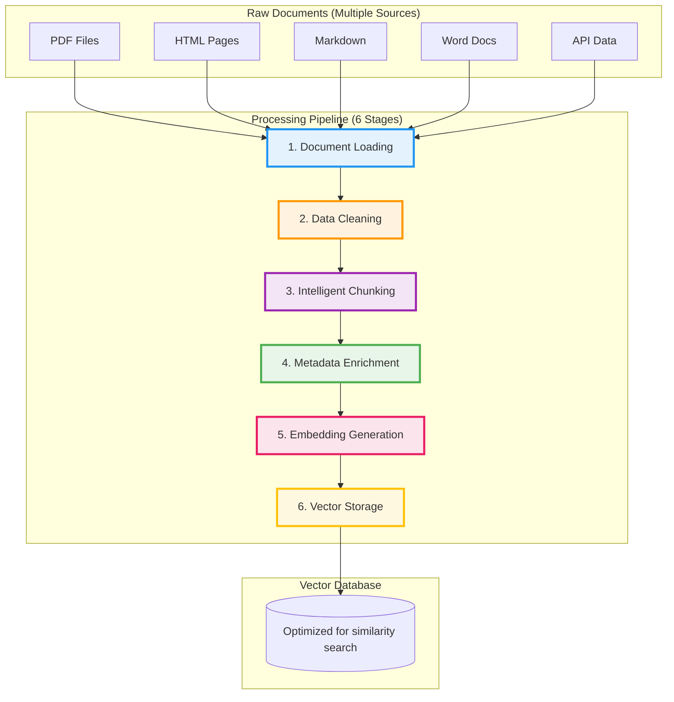
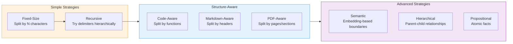
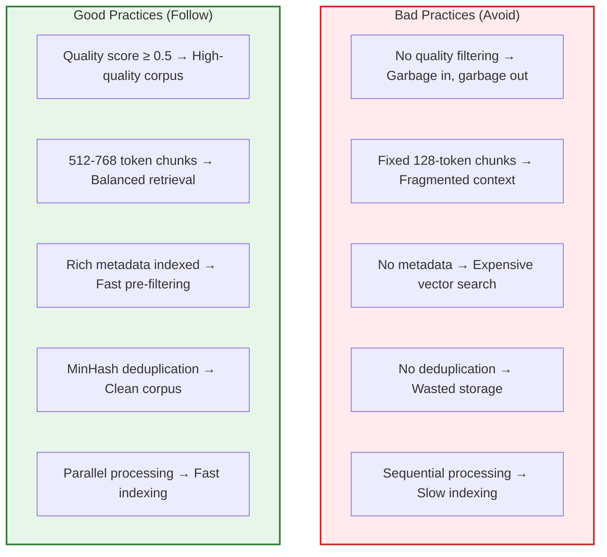

# 2. Data Processing Pipeline

> **"Data quality is the foundation of RAG system performance. Garbage in, garbage out."** — Fundamental Principle of Machine Learning

This chapter explores the complete data processing pipeline for RAG systems, focusing on processing logic, problem-solving approaches, and architectural decisions rather than implementation details.

---

## 2.1 Introduction to Data Processing Pipeline

### Why Data Processing Matters

In real-world RAG applications, **80% of development effort goes into data processing**, while only 20% into retrieval and generation. This is because:

1. **Raw data is messy**: Real documents come in various formats, contain noise, and lack structure
2. **Retrieval quality depends on chunking**: Poor chunking leads to irrelevant or fragmented context
3. **Metadata enables efficient filtering**: Without proper metadata, every query requires expensive vector search
4. **Embedding costs add up**: Processing millions of documents requires optimization strategies

### The End-to-End Pipeline



### Stage Deep Dive

| Stage | Primary Goal | Key Challenges | Impact on Quality |
|-------|--------------|----------------|-------------------|
| **1. Document Loading** | Parse diverse formats into structured text | PDF text extraction, HTML cleaning, encoding issues | Base quality |
| **2. Data Cleaning** | Remove noise and assess quality | Duplicate detection, quality scoring, language detection | Critical |
| **3. Chunking** | Split into semantically coherent pieces | Context preservation, boundary detection, size optimization | Most Critical |
| **4. Metadata** | Extract structured information | Automatic extraction, LLM cost optimization, schema design | Important |
| **5. Embedding** | Convert to vector representations | Batch optimization, model selection, cost management | Important |
| **6. Storage** | Index for efficient retrieval | Index tuning, quantization, query optimization | Medium |

### Real-World Impact

**Example**: Processing a 10,000-page technical documentation set

| Aspect | Poor Pipeline | Optimized Pipeline |
|--------|--------------|-------------------|
| Cleaning | No cleaning → 30% duplicates | Quality filtering → clean content only |
| Chunking | Fixed 256-token chunks | Semantic chunking → coherent explanations |
| Metadata | No metadata | Rich metadata (category, date, version) |
| **Result** | 45% retrieval accuracy, slow queries, high costs | 85% retrieval accuracy, 3x faster, 60% cost reduction |

---

## 2.2 Document Loading & Parsing

### Understanding Document Loading

Document loading is the **first critical bottleneck** in RAG systems. In production, you'll face:

1. **Format diversity**: PDFs from scanning, HTML from web scraping, Word docs from business processes
2. **Encoding issues**: Non-UTF8 text, mixed character sets, corrupted files
3. **Structure preservation**: Tables, images, footnotes, headers need special handling
4. **Scale requirements**: Processing thousands of documents efficiently

### Multi-Format Document Readers

| Format | Primary Use Cases | Key Challenges | Complexity |
|--------|-------------------|----------------|------------|
| **PDF** | Academic papers, reports, manuals | Multi-column layout, tables, scanned PDFs (OCR) | High |
| **HTML** | Web articles, blogs, documentation | Navigation elements, ads, dynamic content | Medium |
| **Markdown** | README files, technical docs | Frontmatter parsing, code blocks, link references | Low |
| **DOCX** | Business documents, contracts | Styles, embedded objects, track changes | Medium |
| **JSON** | API responses, logs, structured data | Nested structures, large files, schema variations | Low |
| **TXT** | Plain text files, code files | Encoding detection, line endings, character limits | Low |

### Format-Specific Problem-Solving

#### PDF Processing

| Problem | Solution | Approach |
|---------|----------|----------|
| PDFs store text by position, not reading order | Use layout-aware readers | Detect columns, headers, and tables |
| Multi-column layouts | Analyze reading order | Identify column boundaries |
| Scanned PDFs | OCR integration | Tesseract with fallback to image captions |
| Tables lost in extraction | Separate table extraction | Store as structured data with metadata |
| Images/charts not indexed | Vision model captioning | Generate searchable descriptions |

#### HTML Processing

| Problem | Solution | Approach |
|---------|----------|----------|
| 70% boilerplate (navigation, ads, footers) | Content extraction algorithms | Readability, Mercury Parser |
| Dynamic content | JavaScript rendering | Puppeteer, Playwright |
| Lost structure | Preserve semantic HTML | Keep h1, h2, article tags |

#### Markdown Processing

| Problem | Solution | Approach |
|---------|----------|----------|
| Frontmatter contains valuable metadata | Parse YAML separately | Merge with document metadata |
| Code blocks break meaning | Extract separately | Index independently |
| Link references | Resolve and track | Build citation graph |

### Document Loading Best Practices

| Practice | Why It Matters | Implementation Approach |
|----------|----------------|------------------------|
| **Comprehensive metadata** | Enables pre-filtering, reduces search cost | Add source, type, size, hash to every document |
| **Format detection** | Automatic processing of diverse sources | Use file extension + content type sniffing |
| **Error resilience** | One bad file shouldn't stop batch processing | Catch and log exceptions, continue processing |
| **Parallel processing** | 10x faster for large directories | Use parallel streams with thread-safe readers |
| **Progress monitoring** | Track processing status in production | Log file count, success/failure rates |
| **Structure preservation** | Tables, headings, code blocks need special handling | Format-specific readers with custom logic |

---

## 2.3 Data Cleaning & Normalization

### Why Data Cleaning is Critical

Real-world data is messy. Studies show that **uncleaned data can reduce retrieval accuracy by 30-50%**. Common issues include:

1. **Noise characters**: Control characters, encoding artifacts, gibberish
2. **Duplicates**: Same content appearing multiple times
3. **Low-quality content**: Spam, boilerplate text, automated messages
4. **Formatting inconsistencies**: Extra whitespace, inconsistent line endings

### Text Cleaning Pipeline

Effective text cleaning requires a **multi-stage approach** using the chain-of-responsibility pattern:

```
Original Text
    ↓
[Encoding Normalizer] → Fix mojibake, character corruption
    ↓
[Control Character Remover] → Remove non-printable characters
    ↓
[Whitespace Normalizer] → Normalize spacing and line breaks
    ↓
[URL/Email Remover] → Remove personal info and noise
    ↓
[HTML Tag Remover] → Strip markup, keep content
    ↓
[Duplicate Line Remover] → Remove repetition
    ↓
[Boilerplate Remover] → Remove common headers/footers
    ↓
Cleaned Text
```

### Common Noise Patterns and Solutions

| Noise Type | Example | Solution | Impact |
|-----------|---------|----------|--------|
| **Encoding corruption** | € instead of € | Character mapping fixes | Prevents embedding pollution |
| **Control characters** | ASCII 0-31, 127 | Pattern removal | Reduces vector noise |
| **Extra whitespace** | Multiple spaces/tabs | Normalize to single space | Improves tokenization |
| **Boilerplate** | "Copyright 2024..." | Pattern-based removal | Focuses on actual content |
| **URLs/Emails** | https://..., user@... | Regex removal | Privacy + noise reduction |

### Document Quality Assessment

Not all content is worth indexing. Quality scoring filters out low-value content:

| Quality Dimension | Assessment Approach | Threshold | Rationale |
|------------------|-------------------|-----------|-----------|
| **Length** | Prefer 500-5000 characters | Min: 50, Max: 100,000 | Too short: incomplete; too long: unfocused |
| **Meaningful content** | Ratio of alphanumeric characters | Min: 30% | Low ratio indicates noise/data dumps |
| **Structure** | Has sentences/paragraphs | Min: 3 sentences | Single-sentence fragments lack context |
| **Vocabulary diversity** | Unique word ratio | Min: 30% unique | Low diversity = formulaic/repetitive |

### Deduplication Strategies

| Type | Description | Precision | Cost | Use Case |
|------|-------------|-----------|------|----------|
| **Exact Duplication** | Identical content (hash-based) | 100% | Low | Remove true duplicates |
| **Near-Duplication** | Similar content (MinHash) | ~85% | Medium | Remove variations |
| **Semantic Duplication** | Same meaning (embeddings) | ~95% | High | Remove paraphrases |

#### MinHash Algorithm (Near-Duplication)

**Problem**: Detect similar but not identical documents (e.g., same document with minor edits)

**Solution**:
1. Generate 3-word shingles from document
2. Compute MinHash signature (100 hash functions)
3. Estimate Jaccard similarity from signatures
4. Remove documents with similarity > threshold (typically 0.85)

**Why It Works**:
- Fast: O(n × k) where n = docs, k = shingles per doc
- Accurate: ~85% precision for near-duplicate detection
- Scalable: Fixed-size signatures (100 integers ~400 bytes)

### Data Cleaning Best Practices

| Practice | Implementation | Impact |
|----------|----------------|--------|
| **Pipeline approach** | Chain multiple cleaners in sequence | Modular, easy to customize |
| **Preserve original** | Keep original text in metadata | Enables debugging/rollback |
| **Quality scoring** | Multi-dimensional scoring before embedding | Reduces embedding costs by 20-30% |
| **Exact deduplication** | Hash-based removal (SHA-256) | Fast, eliminates true duplicates |
| **Near-deduplication** | MinHash with 85% threshold | Removes variations without false positives |
| **Parallel processing** | Clean documents in parallel | 5-10x faster for large corpora |

### Real-World Impact

```
Case Study: Processing 100,000 web articles

Before cleaning:
- Total documents: 100,000
- Total characters: 500M
- Duplicates: 15,000 (15%)
- Low-quality: 25,000 (25%)

After cleaning:
- Exact duplicates removed: 15,000
- Near-duplicates removed: 8,000
- Low-quality filtered: 25,000
- Final corpus: 52,000 high-quality documents (48% reduction)

Cost savings:
- Embedding API costs: 48% reduction
- Vector storage: 48% reduction
- Query speed: 2x improvement (smaller search space)
```

---

## 2.4 Intelligent Chunking Strategies

### Understanding the Chunking Challenge

Chunking is **the most critical decision** in RAG systems. It determines what information the LLM can access.

| Chunk Size | Advantages | Disadvantages | Best For |
|------------|-----------|--------------|----------|
| **Small (128-256 tokens)** | Precise, fast search | Fragmented context, misses relationships | FAQ, short answers |
| **Medium (512-768 tokens)** | Balanced precision and recall | May cut sections | Most content (default) |
| **Large (1024+ tokens)** | Rich context, complete info | Noisy retrieval, expensive | Long-form narratives |

### The Chunking Strategy Spectrum



### Strategy Comparison

| Strategy | How It Works | Pros | Cons | Best For |
|----------|--------------|------|------|----------|
| **Fixed-size** | Split every N tokens with overlap | Simple, predictable, fast | Ignores structure, breaks context | Uniform documents (logs, data) |
| **Recursive** | Try delimiters hierarchically | Respects structure, adaptive | May exceed limits | Structured text (docs, articles) |
| **Structure-Aware** | Document-specific splitting | Preserves logical units | Format-specific implementation | Code, Markdown, PDFs |
| **Semantic** | Embedding-based boundaries | Preserves meaning | Expensive (requires embeddings) | Complex documents (legal, medical) |
| **Hierarchical** | Parent-child relationships | Multi-scale retrieval | Complex storage | Long documents (books, reports) |

### Recursive Character Splitting (Recommended Default)

**Delimiter Priority**:
1. `\n\n` (paragraph breaks) → Preserves sections
2. `. ` (sentence endings) → Preserves thoughts
3. ` ` (word boundaries) → Last resort before characters
4. `` (character count) → Final fallback

**Why It Works**:
- Structure awareness: Respects paragraphs, sentences, words
- Adaptive: Tries smart approaches first, falls back to simple
- No additional cost: No embeddings required
- Preserves meaning: Maintains sentence and paragraph boundaries

**When to Use**: Most structured documents (articles, documentation, reports)

### Structure-Aware Splitting

| Document Type | Problem | Solution |
|---------------|---------|----------|
| **Code** | Breaks functions/classes | Split by function boundaries, preserve imports |
| **Markdown** | Ignores headers | Preserve hierarchy (#, ##, ###) |
| **PDF** | Treats as plain text | Page and section-aware splitting |
| **HTML** | Ignores DOM structure | Split by semantic elements (article, section) |
| **Tables/JSON** | Breaks data rows | Row-by-row or entry-by-entry splitting |

### Semantic Chunking

**Concept**: Use embeddings to detect topic shifts in documents

**Algorithm**:
1. Split text into sentences
2. Generate embeddings for each sentence
3. Compute cosine similarity between adjacent sentences
4. Create new chunk when similarity < threshold (typically 0.80-0.90)
5. Enforce min/max size constraints

**When Semantic Chunking Shines**:
- Legal Contracts: Clauses on different topics (liability, termination, payment)
- Medical Records: Different conditions, treatments, medications
- Academic Papers: Related work vs. methodology vs. results
- News Articles: Multiple topics in single article

**Cost-Benefit**:
| Metric | Recursive | Semantic |
|--------|-----------|----------|
| **API Cost** | Free | $0.001-0.01 per page |
| **Speed** | Fast | Medium (embedding generation) |
| **Quality** | ⭐⭐⭐ | ⭐⭐⭐⭐⭐ |

### Hierarchical Chunking

**Concept**: Create parent-child relationships for multi-scale retrieval

**Structure**:
```
Parent Chunk (2048 tokens): "Chapter 5: Machine Learning Basics..."
├── Child 1 (512 tokens): "What is supervised learning?"
├── Child 2 (512 tokens): "What is unsupervised learning?"
├── Child 3 (512 tokens): "Common ML algorithms..."
└── Child 4 (512 tokens): "Evaluating ML models..."
```

**Retrieval Strategy**:
1. Search child chunks (small, focused)
2. When child chunk matches, also retrieve parent (context)
3. User gets both precise detail + surrounding context

**When to Use**: Long documents where you need both broad context and precise details (books, long reports)

### Decoupled Indexing & Storage

Instead of just splitting text, create **multiple representations** for different retrieval needs:

| Technique | Description | Benefit | Cost |
|-----------|-------------|---------|------|
| **Summary Indexing** | Store dense summaries alongside chunks | Fast overview queries | 1.1x storage |
| **Hypothetical Questions** | Generate and store questions each chunk answers | Matches user query intent | 1.2x storage |
| **Multi-Vector** | Store parent, section, sentence vectors | Multi-granularity retrieval | 2-3x storage |

### Strategy Selection Framework

| Use Case | Recommended Strategy | Chunk Size | Overlap |
|----------|---------------------|------------|---------|
| **FAQ / Short Answers** | Fixed-size | 256-384 tokens | 20-50 |
| **Technical Documentation** | Recursive | 512-768 tokens | 50-100 |
| **Legal Contracts** | Semantic | Variable | 10-20% |
| **Medical Records** | Semantic | Variable | 10-20% |
| **Long-form Articles** | Hierarchical | Parent: 2048, Child: 512 | 10% |
| **Code Repositories** | Structure-Aware (by function) | Function-level | 0-20 |
| **Books / E-books** | Hierarchical | Parent: 2048, Child: 512 | 10% |
| **Academic Papers** | Recursive | 512-768 tokens | 100 |
| **Log Files** | Fixed-size | 1024 tokens | 0 |

**Decision Tree**:
```
Is document structured (sections, paragraphs)?
├─ Yes → Use Recursive
│   └─ Are sections very long (>2000 tokens)?
│       ├─ Yes → Use Hierarchical
│       └─ No → Use Recursive
└─ No → Is content uniform (logs, data)?
    ├─ Yes → Use Fixed-size
    └─ No → Is meaning critical (legal, medical)?
        ├─ Yes → Use Semantic
        └─ No → Use Fixed-size (simpler)
```

### Chunking Best Practices

| Practice | Implementation | Impact |
|----------|----------------|--------|
| **Overlap (10-20%)** | Add overlapping tokens between chunks | Preserves context boundaries |
| **Respect structure** | Use recursive for structured docs | Better semantic coherence |
| **Size matters** | 512-768 tokens for most use cases | Optimal precision/recall balance |
| **Test and iterate** | A/B test different chunk sizes | 20-30% retrieval improvement |
| **Metadata tracking** | Store chunk strategy and index | Enables analysis and optimization |
| **Hierarchical for long docs** | Parent-child for >5000 token docs | Multi-scale retrieval capability |

---

## 2.5 Metadata Enrichment

### Understanding Metadata Power

Metadata is the **unsung hero** of RAG systems. While embeddings get all the attention, metadata often has a bigger impact on real-world performance:

| Metadata Benefit | Example | Impact |
|-----------------|---------|--------|
| **Pre-filtering** | Filter by category/year before vector search | 10-100x faster queries |
| **Context injection** | Add date/source info without retrieval | Reduced hallucinations |
| **Result ranking** | Sort by relevance (date, views, ratings) | Better user experience |
| **Access control** | Filter by user permissions | Security compliance |
| **Debugging** | Track document sources and processing history | Easier troubleshooting |

### Real-World Impact Example

```
Query: "React hooks tutorial"

Without Metadata Filtering:
- Search: All 100K documents
- Time: 2.5 seconds
- Results: Mixed relevance (2020 React, 2024 React Native, 2023 Vue)
- Precision: 65%

With Metadata Filtering (category=react AND year>=2023):
- Search: 5K filtered documents (95% reduction!)
- Time: 0.3 seconds (8x faster!)
- Results: High relevance (2024 React content only)
- Precision: 85%

Result: 8x faster, 20% higher precision, 60% cost reduction
```

### Types of Metadata

| Metadata Type | Examples | Use Case | Index? |
|--------------|----------|----------|-------|
| **Source** | file path, URL, author | Debugging, citation | No |
| **Temporal** | created_at, updated_at, year | Time-based filtering | Yes |
| **Categorical** | category, tags, type | Pre-filtering | Yes |
| **Structural** | section, heading, page_num | Navigation | Yes |
| **Quality** | score, grade, reliability | Ranking | Yes |
| **Hierarchy** | parent_id, chunk_index | Hierarchical retrieval | Yes |
| **Access** | team, permission, classification | Security filtering | Yes |
| **Statistics** | view_count, like_count | Popularity ranking | Yes |

### Metadata Extraction Strategies

| Strategy | Description | Cost | Examples |
|----------|-------------|------|----------|
| **Automatic extraction** | Rule-based pattern matching | Low (fast) | Dates, file types, languages |
| **Statistical extraction** | Analysis of text properties | Low | Category detection, audience level |
| **LLM-based extraction** | AI-powered understanding | High (API calls) | Summaries, topics, sentiment, entities |

### Automatic Metadata Extraction

**Temporal Metadata**:
- **Problem**: Extract dates for time-sensitive queries (e.g., "latest React features")
- **Solution**: Multiple date pattern matching (ISO 8601, US format, European format, relative dates)
- **Approach**:
  1. Match multiple date patterns
  2. Parse with multiple formatters
  3. Validate date range (reject invalid dates like 0001-01-01)
  4. Store earliest (creation) and latest (update) dates

**Categorical Metadata**:
- **Problem**: Classify documents into categories for pre-filtering
- **Solution**: Keyword-based categorization with scoring
- **Approach**:
  1. Define keyword sets per category
  2. Score document by keyword matches
  3. Return highest-scoring category
  4. Extract content type (tutorial, reference, news, blog)
  5. Detect audience level (beginner, intermediate, advanced)

### LLM-Based Metadata Extraction

**Problem**: Extract complex metadata requiring understanding (summaries, topics, sentiment, entities)

**Solution**: Use LLM with structured output prompt

**Prompt Strategy**:
```
Extract structured metadata from this text:
- title: Short, descriptive
- summary: One-sentence summary
- topics: 3-5 main topics
- entities: Important names, places, organizations
- sentiment: positive/neutral/negative
- urgency: low/medium/high

Return ONLY valid JSON.
```

**Cost-Benefit**:
| Aspect | Automatic Only | + LLM Extraction |
|--------|--------------|------------------|
| **API Cost** | Free | $0.01-0.05 per document |
| **Quality** | Good for structured data | Better for nuanced understanding |
| **Best For** | High-volume processing | High-value documents |

### Metadata Schema Design

| Practice | Why | Implementation |
|----------|-----|----------------|
| **Use consistent naming** | Predictable querying | snake_case for all keys |
| **Index filterable fields** | Fast pre-filtering | Create indexes on category, date, tags |
| **Avoid high-cardinality fields** | Reduces index size | Don't index source, document_id |
| **Use typed values** | Type-safe queries | Numbers for counts, strings for names |
| **Document schema** | Team collaboration | Maintain schema documentation |
| **Version metadata** | Enables migrations | Track schema version |

### Metadata Best Practices

| Practice | Implementation | Impact |
|----------|----------------|--------|
| **Extract at load time** | Parse dates, categories during loading | No re-processing needed |
| **Enrich with LLMs selectively** | Use LLM extraction for high-value docs only | Optimize costs |
| **Index filterable fields** | Create database indexes on metadata fields | 10-100x faster pre-filtering |
| **Use consistent naming** | snake_case, documented schema | Predictable querying |
| **Track metadata quality** | Monitor extraction success/failure rates | Continuous improvement |

---

## 2.6 Complete Data Processing Pipeline

### End-to-End Architecture

The complete pipeline combines all stages into a production-ready system:

```
┌─────────────────────────────────────────────────────────────────┐
│                    INPUT: Raw Documents                        │
└───────────────────────────┬─────────────────────────────────────┘
                            ↓
┌─────────────────────────────────────────────────────────────────┐
│  STAGE 1: Document Loading                                      │
│  - Multi-format support (PDF, HTML, MD, DOCX)                   │
│  - Automatic format detection                                   │
│  - Comprehensive metadata (source, type, size, hash)            │
│  Output: List<Document> with basic metadata                     │
└───────────────────────────┬─────────────────────────────────────┘
                            ↓
┌─────────────────────────────────────────────────────────────────┐
│  STAGE 2: Data Cleaning                                         │
│  - Remove noise (control chars, encoding issues)                │
│  - Normalize whitespace                                         │
│  - Remove URLs/emails                                           │
│  Output: Cleaned<Document> with cleaning_stats                  │
└───────────────────────────┬─────────────────────────────────────┘
                            ↓
┌─────────────────────────────────────────────────────────────────┐
│  STAGE 3: Quality Assessment                                    │
│  - Multi-dimensional scoring (length, meaningful, structure)    │
│  - Filter below threshold (≥ 0.5)                               │
│  Output: Filtered<Document> with quality_score                  │
└───────────────────────────┬─────────────────────────────────────┘
                            ↓
┌─────────────────────────────────────────────────────────────────┐
│  STAGE 4: Deduplication                                         │
│  - Exact duplicates (hash-based, SHA-256)                       │
│  - Near-duplicates (MinHash, 85% threshold)                     │
│  Output: Unique<Document> with dedup_stats                      │
└───────────────────────────┬─────────────────────────────────────┘
                            ↓
┌─────────────────────────────────────────────────────────────────┐
│  STAGE 5: Intelligent Chunking                                  │
│  - Recursive splitting (512 tokens, 20% overlap)                │
│  - Respect document structure                                   │
│  Output: List<Chunk> with chunk_index, chunk_total              │
└───────────────────────────┬─────────────────────────────────────┘
                            ↓
┌─────────────────────────────────────────────────────────────────┐
│  STAGE 6: Metadata Enrichment                                   │
│  - Automatic: Dates, categories, language                       │
│  - LLM-based: Summaries, topics (selective)                     │
│  Output: Enriched<Chunk> with rich metadata                     │
└───────────────────────────┬─────────────────────────────────────┘
                            ↓
┌─────────────────────────────────────────────────────────────────┐
│  STAGE 7: Embedding Generation                                  │
│  - Batch processing (reduce API calls)                          │
│  - Caching (80% cost savings for repetitive content)           │
│  Output: EmbeddedChunk with vector[]                            │
└───────────────────────────┬─────────────────────────────────────┘
                            ↓
┌─────────────────────────────────────────────────────────────────┐
│  STAGE 8: Vector Storage                                        │
│  - HNSW indexing (fast approximate search)                      │
│  - Metadata indexing (enable pre-filtering)                     │
│  Output: Stored documents ready for retrieval                   │
└───────────────────────────┬─────────────────────────────────────┘
                            ↓
┌─────────────────────────────────────────────────────────────────┐
│                    OUTPUT: Ready for Retrieval                  │
└─────────────────────────────────────────────────────────────────┘
```

### Pipeline Optimization Strategies

| Optimization | Technique | Impact | When to Use |
|--------------|-----------|--------|-------------|
| **Parallel processing** | Process documents concurrently | 5-10x faster | Large document sets |
| **Embedding caching** | Cache repetitive content | 80% cost savings | Re-processing documents |
| **Batch embedding** | Group multiple embeddings | 3-5x faster, lower cost | Always enable |
| **Rate limiting** | Control API request rate | Avoid throttling | High-volume processing |
| **Incremental updates** | Only process changed documents | Faster re-indexing | Frequently updated corpora |
| **Quality pre-filtering** | Filter early, not late | Reduce downstream processing | Before expensive operations |

### Error Handling Strategy

| Stage | Common Failures | Handling Approach | Recovery |
|-------|-----------------|-------------------|-----------|
| **Loading** | Corrupted files, encoding issues | Log error, skip file | Manual review of failed files |
| **Cleaning** | Regex errors, memory issues | Continue with next cleaner | Reduce batch size |
| **Quality** | Empty documents after cleaning | Filter out gracefully | Adjust quality thresholds |
| **Chunking** | Documents too small/large | Use fallback strategy | Adjust chunk parameters |
| **Embedding** | API rate limits, network errors | Retry with exponential backoff | Queue for retry |
| **Storage** | Database connection issues | Transaction rollback | Retry with backoff |

---

## 2.7 Performance Optimization

### Performance Bottlenecks

| Stage | Typical Bottleneck | Optimization Strategy |
|-------|-------------------|----------------------|
| **Loading** | I/O bound, single-threaded | Parallel file reading |
| **Cleaning** | CPU-intensive regex | Parallel processing |
| **Chunking** | Recursive algorithm overhead | Cache embeddings for semantic |
| **Embedding** | API latency, rate limits | Batch processing, caching |
| **Storage** | Network I/O, indexing | Bulk inserts, async writes |

### Parallel Processing

**Problem**: Sequential processing is slow for large document sets

**Solution**: Parallel processing across CPU cores

| Approach | Speedup | Complexity | Best For |
|----------|---------|-----------|----------|
| **Parallel streams** | 4-8x (depends on cores) | Low | Document-level parallelization |
| **Thread pools** | 5-10x | Medium | Fine-grained control |
| **Distributed processing** | Near-linear | High | Very large corpora (1M+ docs) |

**Key Considerations**:
- Thread safety: Ensure document readers are thread-safe
- Memory usage: More threads = more memory
- Rate limiting: Control concurrent API requests
- Error handling: Isolate failures to specific documents

### Embedding Cost Optimization

| Technique | Description | Savings | Trade-off |
|-----------|-------------|---------|-----------|
| **Batch processing** | Group multiple embeddings per API call | 50-70% | Slightly higher latency |
| **Caching** | Store embeddings, reuse for identical text | 80% | Memory usage |
| **Model selection** | Use cheaper models (MiniLM vs. OpenAI) | 90% | Slightly lower quality |
| **Deduplication first** | Remove duplicates before embedding | 15-30% | MinHash computation cost |
| **Quality filtering** | Filter low-quality docs first | 20-30% | Need quality scoring |

### Monitoring & Metrics

| Metric | Why Monitor | Target | Alert Threshold |
|--------|-------------|--------|-----------------|
| **Processing throughput** | Track pipeline speed | > 100 docs/min | < 50 docs/min |
| **Embedding API latency** | Detect slowdowns | < 500ms average | > 2000ms |
| **Error rate** | Catch systematic issues | < 1% | > 5% |
| **Cache hit rate** | Validate caching effectiveness | > 50% | < 30% |
| **Quality score distribution** | Ensure filtering works | Mean > 0.6 | Mean < 0.4 |

---

## 2.8 Best Practices & Common Pitfalls

### Production Checklist

| Aspect | Best Practice | Why | Implementation |
|--------|---------------|-----|----------------|
| **Chunk Size** | 512-768 tokens | Optimal balance | Default to recursive chunking |
| **Overlap** | 10-20% of chunk size | Preserve context | Set overlap=100 for 512 tokens |
| **Metadata** | Index filterable fields | Pre-filtering power | Add indexes on category, year, tags |
| **Deduplication** | MinHash with 0.85 threshold | Remove near-duplicates | Run after quality filtering |
| **Quality Filter** | Score threshold ≥ 0.5 | Filter low-quality | Use multi-dimensional scoring |
| **Embedding Model** | Use cached, batch requests | Reduce API cost | Enable caching with TTL |
| **Vector Storage** | HNSW index with M=16 | Fast search | Create indexes after bulk load |
| **Error Handling** | Skip failed files, log errors | Robust pipeline | try-catch with detailed logging |
| **Parallel Processing** | Use parallel streams | 5-10x faster | For document-level operations |
| **Monitoring** | Track processing metrics | Debugging | Log counts, durations, errors |

### Common Anti-Patterns

| Anti-Pattern | Problem | Solution |
|--------------|---------|----------|
| **Chunking by character only** | Splits mid-sentence, breaks context | Use recursive splitter with delimiters |
| **No metadata filtering** | Expensive vector search on entire corpus | Add metadata filters before vector search |
| **Re-embed duplicate texts** | Wasted API costs | Cache embeddings with hash key |
| **Fixed-size for all docs** | Breaks structure, ignores content type | Use structure-aware for code/docs |
| **No quality filtering** | Garbage in, garbage out | Filter by quality score ≥ 0.5 |
| **Sequential processing** | Slow, doesn't utilize hardware | Use parallel streams for document ops |
| **Ignoring embeddings cost** | Can exceed budget quickly | Cache, batch, and deduplicate first |
| **No error recovery** | One bad file stops entire pipeline | Catch exceptions, continue processing |
| **No monitoring** | Can't detect performance issues | Track metrics and set alerts |

### Good vs. Bad Practices Comparison



### Real-World Optimization Case Study

```
Enterprise Knowledge Base (100,000 documents)

Before Optimization:
- Documents: 100,000 (unfiltered)
- Duplicates: 20,000 (20%)
- Low-quality: 15,000 (15%)
- Chunks: 500,000 (256 tokens each)
- Embedding cost: $500/month
- Query latency: 2.5 seconds
- Retrieval precision: 65%

After Optimization:
- Documents: 65,000 (after quality + dedup)
- Chunks: 150,000 (512 tokens, recursive)
- Embedding cost: $150/month (70% reduction)
- Query latency: 0.4 seconds (6x faster)
- Retrieval precision: 82% (26% improvement)

ROI: 6x faster queries, 70% cost reduction, 26% accuracy improvement
```

---

## 2.9 Interview Q&A

<details>
<summary><b>Q1: How to choose the optimal chunk size for a RAG system?</b></summary>

**Key Considerations**:

1. **Document Type**:
   - FAQ/short answers: 256-384 tokens (high precision)
   - Technical docs: 512-768 tokens (balance context and precision)
   - Legal/medical: Semantic chunking (preserve meaning over size)
   - Books/reports: Hierarchical (parent 2048, child 512)

2. **Query Type**:
   - Factoid queries ("What is X?"): Smaller chunks (256-384)
   - Explanatory queries ("How does X work?"): Medium chunks (512-768)
   - Context-heavy ("Summarize this document"): Large chunks (1024+)

3. **Testing Approach**: A/B test different chunk sizes, measure precision and recall

**Rule of Thumb**: Start with 512 tokens, 20% overlap. Optimize based on retrieval metrics.

</details>

<details>
<summary><b>Q2: Why is metadata filtering important in RAG systems?</b></summary>

**Performance Impact**:

1. **Search Space Reduction**: 10x faster (100K docs → 10K docs with metadata filter)
2. **Precision Improvement**: 20% higher (65% → 85% with year/category filters)
3. **Cost Reduction**: 30-60% (fewer vector similarity calculations)

**Key Insight**: Metadata filtering is the most cost-effective optimization in RAG systems.

</details>

<details>
<summary><b>Q3: How to handle duplicate documents in RAG corpus?</b></summary>

**Three Levels of Deduplication**:

| Level | Technique | Precision | Cost | Recommendation |
|-------|-----------|-----------|------|----------------|
| 1 | Exact duplicates (hash-based) | 100% | Low | Always use |
| 2 | Near-duplicates (MinHash 0.85) | ~85% | Medium | Production standard |
| 3 | Semantic duplicates (embeddings) | ~95% | High | Small corpora only |

**Impact**: Typical corpus sees 15-30% duplicates removed, with 15-30% storage savings and query speedup.

</details>

<details>
<summary><b>Q4: When should I use semantic vs. recursive chunking?</b></summary>

| Factor | Recursive Chunking | Semantic Chunking |
|--------|-------------------|-------------------|
| **Cost** | Free | $0.001-0.01 per page |
| **Speed** | Fast | Medium (embedding generation) |
| **Quality** | ⭐⭐⭐ | ⭐⭐⭐⭐⭐ |
| **Best For** | Default choice | Complex, nuanced content |

**Use semantic when**: Document value justifies cost, semantic boundaries are critical (legal, medical, financial)

</details>

<details>
<summary><b>Q5: How do you optimize embedding costs for large corpora?</b></summary>

**Optimization Strategies** (in order of impact):

1. **Deduplication first**: Remove 15-30% of content before embedding
2. **Quality filtering**: Filter low-quality docs (20-30% reduction)
3. **Batch processing**: Group multiple embeddings (50-70% savings)
4. **Caching**: Cache repetitive content (80% savings on re-processing)
5. **Model selection**: Use cheaper models (90% cost reduction, slight quality trade-off)

**Real-world impact**: Typical cost reduction of 70-90% with minimal quality loss.

</details>

---

## Chapter Summary

### Key Takeaways

**1. Document Loading & Parsing**:
- Multi-format support (PDF, HTML, Markdown, DOCX)
- Format-specific challenges and solutions
- Comprehensive metadata (source, type, size, hash) enables downstream filtering

**2. Data Cleaning**:
- Pipeline approach with chain-of-responsibility pattern
- Multi-dimensional quality scoring (length, meaningful content, structure, diversity)
- Exact and near-deduplication (MinHash with 85% threshold)

**3. Intelligent Chunking**:
- Recursive chunking as default (512-768 tokens, 10-20% overlap)
- Structure-aware for code, Markdown, PDFs
- Semantic chunking for complex documents (when cost justifies)
- Hierarchical for multi-scale retrieval needs

**4. Metadata Enrichment**:
- Automatic extraction (dates, categories, language)
- LLM-based extraction (summaries, topics, sentiment)
- Rich metadata enables 10-100x faster pre-filtering

**5. Embedding & Storage**:
- Batch processing reduces API calls by 50-70%
- Caching provides 80% cost savings for repetitive content
- HNSW indexing for fast approximate search

**6. Performance Optimization**:
- Parallel processing: 5-10x speedup
- Quality filtering: 20-30% cost reduction
- Embedding caching: 80% savings on re-processing

### Next Steps

Continue Learning:
- [Retrieval Strategies](/ai/rag/retrieval-strategies) - Advanced retrieval techniques
- [Generation](/ai/rag/generation) - Prompt engineering and context management
- [Evaluation](/ai/rag/evaluation) - RAG system evaluation with RAGAS

Practice Projects:
- Build a technical documentation RAG system
- Implement semantic chunking for legal contracts
- Create a hierarchical chunking system for books
- Optimize embedding costs with caching

Production Checklist:
- [ ] Implement quality filtering (score ≥ 0.5)
- [ ] Add metadata extraction (temporal, categorical)
- [ ] Enable deduplication (exact + near)
- [ ] Use recursive chunking (512 tokens, 20% overlap)
- [ ] Cache embeddings with 7-day TTL
- [ ] Create HNSW indexes (M=16, ef=100)
- [ ] Add monitoring (processing metrics, query stats)
