# 2. Data Processing Pipeline

> **"Data quality is the foundation of RAG system performance. Garbage in, garbage out."** — Fundamental Principle of Machine Learning

This chapter provides a comprehensive, production-ready guide to building a robust data processing pipeline for RAG systems. We'll explore each stage in depth, from ingesting raw documents to storing optimized vector representations, with practical Spring AI implementations and real-world best practices.

---

## 2.1 Introduction to Data Processing Pipeline

### Why Data Processing Matters

In real-world RAG applications, **80% of development effort goes into data processing**, while only 20% into retrieval and generation. This is because:

1. **Raw data is messy**: Real documents come in various formats, contain noise, and lack structure
2. **Retrieval quality depends on chunking**: Poor chunking leads to irrelevant or fragmented context
3. **Metadata enables efficient filtering**: Without proper metadata, every query requires expensive vector search
4. **Embedding costs add up**: Processing millions of documents requires optimization strategies

### The End-to-End Pipeline

```mermaid
flowchart TB
    subgraph Input["📁 Raw Documents (Multiple Sources)"]
        PDF[PDF Files<br/>Academic papers,<br/>Reports, Manuals]
        HTML[HTML Pages<br/>Web articles,<br/>Blogs, Documentation]
        MD[Markdown<br/>Technical docs,<br/>README files]
        DOCX[Word Docs<br/>Business documents,<br/>Contracts]
        API[API Data<br/>JSON responses,<br/>Database exports]
    end

    subgraph Processing["⚙️ Processing Pipeline (6 Stages)"]
        direction TB
        Load[1️⃣ Document Loading<br/>Parse multi-format sources<br/>Extract text & structure]
        Clean[2️⃣ Data Cleaning<br/>Remove noise & duplicates<br/>Quality assessment]
        Chunk[3️⃣ Intelligent Chunking<br/>Strategy-based splitting<br/>Preserve semantics]
        Metadata[4️⃣ Metadata Enrichment<br/>Auto & LLM extraction<br/>Structured information]
        Embed[5️⃣ Embedding Generation<br/>Batch processing<br/>Vector conversion]
        Store[6️⃣ Vector Storage<br/>Index & optimize<br/>Enable fast search]
    end

    subgraph Output["🗄️ Vector Database"]
        Vector[(PgVector / Milvus / Pinecone<br/>Optimized for similarity search)]
    end

    PDF --> Load
    HTML --> Load
    MD --> Load
    DOCX --> Load
    API --> Load

    Load --> Clean
    Clean --> Chunk
    Chunk --> Metadata
    Metadata --> Embed
    Embed --> Store
    Store --> Vector

    style Load fill:#e3f2fd,stroke:#2196f3,stroke-width:3px
    style Clean fill:#fff3e0,stroke:#ff9800,stroke-width:3px
    style Chunk fill:#f3e5f5,stroke:#9c27b0,stroke-width:3px
    style Metadata fill:#e8f5e9,stroke:#4caf50,stroke-width:3px
    style Embed fill:#fce4ec,stroke:#e91e63,stroke-width:3px
    style Store fill:#fff8e1,stroke:#ffc107,stroke-width:3px
```



### Stage Deep Dive

Each stage in the pipeline serves a specific purpose:

| Stage | Primary Goal | Key Challenges | Impact on Quality |
|-------|--------------|----------------|-------------------|
| **1. Document Loading** | Parse diverse formats into structured text | - PDF text extraction<br/>- HTML cleaning<br/>- Encoding issues | ⭐⭐⭐⭐ Base quality |
| **2. Data Cleaning** | Remove noise and assess quality | - Duplicate detection<br/>- Quality scoring<br/>- Language detection | ⭐⭐⭐⭐⭐ Critical |
| **3. Chunking** | Split into semantically coherent pieces | - Context preservation<br/>- Boundary detection<br/>- Size optimization | ⭐⭐⭐⭐⭐ Most Critical |
| **4. Metadata** | Extract structured information | - Automatic extraction<br/>- LLM cost optimization<br/>- Schema design | ⭐⭐⭐⭐ Important |
| **5. Embedding** | Convert to vector representations | - Batch optimization<br/>- Model selection<br/>- Cost management | ⭐⭐⭐⭐ Important |
| **6. Storage** | Index for efficient retrieval | - Index tuning<br/>- Quantization<br/>- Query optimization | ⭐⭐⭐ Medium |

### Real-World Impact

**Example**: Processing a 10,000-page technical documentation set

❌ **Poor Pipeline**:
- No cleaning → 30% duplicates and low-quality content
- Fixed 256-token chunks → Fragmented explanations
- No metadata → Must search entire corpus for each query
- Result: 45% retrieval accuracy, slow queries, high costs

✅ **Optimized Pipeline**:
- Quality filtering → Clean, relevant content only
- Semantic chunking → Coherent explanations
- Rich metadata (category, date, version) → Pre-filtered search
- Result: 85% retrieval accuracy, 3x faster queries, 60% cost reduction

### Chapter Roadmap

We'll cover each pipeline stage in depth:

- **2.2**: Document loading strategies for real-world data sources
- **2.3**: Data cleaning and quality assessment techniques
- **2.4**: Advanced chunking strategies (when to use which)
- **2.5**: Metadata enrichment for powerful pre-filtering
- **2.6**: Complete pipeline and vector storage optimization
- **2.7**: Performance optimization comparison (Spring AI vs. alternatives)
- **2.8**: Best practices production pipeline implementation
- **2.9**: Interview Q- **2.9**: PerformanceA optimization strategies
- **2.10**: Production best practices and common pitfalls

---

## 2.2 Document Loading & Parsing

### Understanding Document Loading

Document loading is the **first critical bottleneck** in RAG systems. In production, you'll face:

1. **Format diversity**: PDFs from scanning, HTML from web scraping, Word docs from business processes
2. **Encoding issues**: Non-UTF8 text, mixed character sets, corrupted files
3. **Structure preservation**: Tables, images, footnotes, headers need special handling
4. **Scale requirements**: Processing thousands of documents efficiently

**Key Insight**: The loading stage determines what information is available to all downstream stages. Poor text extraction cannot be fixed later.

### 2.2.1 Multi-Format Document Readers

Modern RAG systems must handle diverse document sources. Let's explore the most common formats and their specific challenges:

#### Document Format Landscape

| Format | Spring AI Reader | Primary Use Cases | Key Challenges | Complexity |
|--------|-----------------|-------------------|----------------|------------|
| **PDF** | `PdfDocumentReader` | Academic papers, reports, manuals, contracts | - Multi-column layout<br/>- Tables & figures<br/>- Scanned PDFs (OCR) | 🔴 High |
| **HTML** | `HtmlDocumentReader` | Web articles, blogs, documentation pages | - Navigation elements<br/>- Ads & sidebars<br/>- Dynamic content | 🟡 Medium |
| **Markdown** | `MarkdownDocumentReader` | README files, technical docs, notes | - Frontmatter parsing<br/>- Code blocks<br/>- Link references | 🟢 Low |
| **DOCX** | `WordDocumentReader` | Business documents, contracts, reports | - Styles & formatting<br/>- Embedded objects<br/>- Track changes | 🟡 Medium |
| **JSON** | `JsonDocumentReader` | API responses, logs, structured data | - Nested structures<br/>- Large files<br/>- Schema variations | 🟢 Low |
| **TXT** | `TextReader` | Plain text files, code files | - Encoding detection<br/>- Line endings<br/>- Character limits | 🟢 Low |

#### Format-Specific Best Practices

**PDF Processing**:
- **Challenge**: PDFs store text by position, not by reading order
- **Solution**: Use layout-aware readers that detect columns, headers, and tables
- **Advanced**: For scanned PDFs, integrate OCR (Tesseract) with fallback to image captions

**HTML Processing**:
- **Challenge**: 70% of HTML is boilerplate (navigation, ads, footers)
- **Solution**: Use content extraction algorithms (Readability, Mercury Parser)
- **Best Practice**: Preserve semantic HTML structure (h1, h2, article tags)

**Markdown Processing**:
- **Challenge**: Frontmatter (YAML) contains valuable metadata
- **Solution**: Parse frontmatter separately and merge with document metadata
- **Bonus**: Extract code blocks for separate indexing

### 2.2.2 Production-Ready Document Loading Service

The following implementation demonstrates a robust, production-ready document loading service with automatic format detection, error handling, and metadata enrichment:

```java
@Service
public class DocumentLoadingService {

    private final Map<String, DocumentReader> readerRegistry;
    private final DocumentParser parser;

    public DocumentLoadingService() {
        this.readerRegistry = new ConcurrentHashMap<>();

        // Register readers for different formats
        // Thread-safe initialization for concurrent loading
        registerReaders();

        this.parser = new DocumentParser();
    }

    /**
     * Initialize document readers with error handling
     */
    private void registerReaders() {
        try {
            readerRegistry.put("pdf", new PdfDocumentReader());
            readerRegistry.put("html", new HtmlDocumentReader());
            readerRegistry.put("htm", new HtmlDocumentReader());
            readerRegistry.put("md", new MarkdownDocumentReader());
            readerRegistry.put("markdown", new MarkdownDocumentReader());
            readerRegistry.put("docx", new WordDocumentReader());
            readerRegistry.put("doc", new WordDocumentReader());
            readerRegistry.put("json", new JsonDocumentReader());
            readerRegistry.put("txt", new TextReader());

        } catch (Exception e) {
            throw new RuntimeException("Failed to initialize document readers", e);
        }
    }

    /**
     * Load documents from file path with automatic format detection
     *
     * Key Features:
     * - Automatic format detection from file extension
     * - Comprehensive metadata enrichment (source, type, size, timestamps)
     * - Thread-safe concurrent access
     *
     * @param filePath Path to the document file
     * @return List of documents (may contain multiple for multi-file formats like PDF)
     * @throws IOException if file cannot be read
     * @throws IllegalArgumentException if format is not supported
     */
    public List<Document> loadDocuments(Path filePath) throws IOException {
        // Validate file exists and is readable
        if (!Files.exists(filePath) || !Files.isReadable(filePath)) {
            throw new IOException("File not found or not readable: " + filePath);
        }

        String extension = getFileExtension(filePath);

        DocumentReader reader = readerRegistry.get(extension.toLowerCase());
        if (reader == null) {
            throw new IllegalArgumentException(
                "Unsupported file format: " + extension +
                ". Supported formats: " + String.join(", ", readerRegistry.keySet())
            );
        }

        long startTime = System.currentTimeMillis();

        try {
            List<Document> documents = reader.get(filePath.toFile());

            // Enrich with source metadata (critical for later filtering)
            documents.forEach(doc -> enrichDocumentMetadata(doc, filePath));

            long duration = System.currentTimeMillis() - startTime;
            System.out.printf("Loaded %d document(s) from %s in %d ms%n",
                documents.size(), filePath.getFileName(), duration);

            return documents;

        } catch (Exception e) {
            throw new IOException("Failed to load document: " + filePath, e);
        }
    }

    /**
     * Enrich document with comprehensive metadata
     * This metadata enables powerful pre-filtering in retrieval
     */
    private void enrichDocumentMetadata(Document doc, Path filePath) throws IOException {
        Map<String, Object> metadata = new HashMap<>(doc.getMetadata());

        // Core metadata (always include)
        metadata.put("source", filePath.toString());
        metadata.put("file_name", filePath.getFileName().toString());
        metadata.put("file_type", getFileExtension(filePath));
        metadata.put("loaded_at", Instant.now().toString());

        // File metadata (useful for filtering)
        metadata.put("file_size", Files.size(filePath));
        metadata.put("last_modified", Files.getLastModifiedTime(filePath).toInstant());

        // Hash-based identifiers (useful for deduplication)
        metadata.put("file_hash", calculateFileHash(filePath));

        doc.getMetadata().clear();
        doc.getMetadata().putAll(metadata);
    }

    /**
     * Batch load documents from directory with parallel processing
     *
     * Performance: Processes files in parallel using available CPU cores
     * Error Handling: Continues processing even if individual files fail
     */
    public List<Document> loadDirectory(Path directory, String... extensions) throws IOException {
        if (!Files.isDirectory(directory)) {
            throw new IllegalArgumentException("Not a directory: " + directory);
        }

        Set<String> allowedExtensions = Arrays.stream(extensions)
            .map(String::toLowerCase)
            .collect(Collectors.toSet());

        System.out.println("Scanning directory: " + directory);

        try (Stream<Path> paths = Files.walk(directory)) {
            List<Path> files = paths
                .filter(Files::isRegularFile)
                .filter(Files::isReadable)
                .filter(p -> allowedExtensions.contains(getFileExtension(p)))
                .toList();

            System.out.println("Found " + files.size() + " files to process");

            // Parallel processing for performance
            return files.parallelStream()
                .flatMap(p -> {
                    try {
                        return loadDocuments(p).stream();
                    } catch (IOException e) {
                        System.err.println("Failed to load: " + p + ", error: " + e.getMessage());
                        return Stream.empty();
                    }
                })
                .toList();

        } catch (Exception e) {
            throw new IOException("Failed to scan directory: " + directory, e);
        }
    }

    /**
     * Load documents from URL (HTML, Markdown, etc.)
     * Useful for ingesting web content into RAG systems
     */
    public List<Document> loadFromUrl(String url) throws IOException {
        HttpClient client = HttpClient.newBuilder()
            .connectTimeout(Duration.ofSeconds(10))
            .build();

        HttpRequest request = HttpRequest.newBuilder()
            .uri(URI.create(url))
            .timeout(Duration.ofSeconds(30))
            .header("User-Agent", "RAG-Document-Loader/1.0")  // Some sites require user agent
            .GET()
            .build();

        try {
            HttpResponse<String> response = client.send(
                request,
                HttpResponse.BodyHandlers.ofString()
            );

            if (response.statusCode() != 200) {
                throw new IOException("HTTP " + response.statusCode() + " for URL: " + url);
            }

            String contentType = response.headers()
                .firstValue("Content-Type")
                .orElse("text/html");

            return parseResponse(response.body(), contentType, url);

        } catch (InterruptedException e) {
            Thread.currentThread().interrupt();
            throw new IOException("Interrupted while loading URL: " + url, e);
        }
    }

    /**
     * Parse HTTP response based on content type
     */
    private List<Document> parseResponse(String content, String contentType, String url) {
        Map<String, Object> metadata = new HashMap<>();
        metadata.put("source", url);
        metadata.put("content_type", contentType);
        metadata.put("loaded_at", Instant.now().toString());

        if (contentType.contains("html")) {
            // HTML: Use reader that extracts main content
            // (excludes navigation, ads, etc.)
            return List.of(new Document(content, metadata));

        } else if (contentType.contains("json")) {
            JsonDocumentReader reader = new JsonDocumentReader();
            return reader.get(content);

        } else if (contentType.contains("markdown") || contentType.contains("md")) {
            MarkdownDocumentReader reader = new MarkdownDocumentReader();
            return reader.get(content);

        } else {
            // Default: treat as plain text
            return List.of(new Document(content, metadata));
        }
    }

    // ==================== Utility Methods ====================

    private String getFileExtension(Path path) {
        String fileName = path.getFileName().toString();
        int lastDot = fileName.lastIndexOf('.');
        return lastDot > 0 ? fileName.substring(lastDot + 1) : "";
    }

    private String calculateFileHash(Path filePath) {
        try {
            byte[] fileBytes = Files.readAllBytes(filePath);
            byte[] hashBytes = MessageDigest.getInstance("SHA-256").digest(fileBytes);
            return bytesToHex(hashBytes);
        } catch (Exception e) {
            return "";
        }
    }

    private String bytesToHex(byte[] bytes) {
        StringBuilder sb = new StringBuilder();
        for (byte b : bytes) {
            sb.append(String.format("%02x", b));
        }
        return sb.toString();
    }
}
```

**Key Features Explained**:

1. **Automatic Format Detection**: Uses file extension to select appropriate reader
2. **Comprehensive Metadata**: Every document gets source, type, size, timestamps, and hash
3. **Error Resilience**: Failed files don't stop batch processing
4. **Parallel Processing**: Directory loading uses parallel streams for performance
5. **URL Support**: Can load web content directly into RAG system

### 2.2.3 Custom Document Reader for Markdown

Markdown files are common in technical documentation. A custom reader can extract valuable metadata from frontmatter and preserve document structure:

```java
/**
 * Enhanced Markdown reader with frontmatter extraction
 * Preserves document structure (headings, code blocks, tables)
 */
public class CustomMarkdownDocumentReader implements DocumentReader {

    // YAML frontmatter pattern (between --- markers)
    private static final Pattern FRONT_MATTER_PATTERN =
        Pattern.compile("^---\\s*\\n([\\s\\S]*?)\\n---\\s*\\n", Pattern.MULTILINE);

    // Code blocks to preserve separately
    private static final Pattern CODE_BLOCK_PATTERN =
        Pattern.compile("```([\\s\\S]*?)```");

    // Heading pattern (extract structure)
    private static final Pattern HEADING_PATTERN =
        Pattern.compile("^(#{1,6})\\s+(.+)$", Pattern.MULTILINE);

    @Override
    public List<Document> get() {
        throw new UnsupportedOperationException(
            "Use get(Reader) or get(String) instead"
        );
    }

    @Override
    public List<Document> get(Reader reader) {
        try {
            String content = new String(reader.readAllBytes());
            return parse(content);
        } catch (IOException e) {
            throw new RuntimeException("Failed to read markdown", e);
        }
    }

    @Override
    public List<Document> get(String markdown) {
        return parse(markdown);
    }

    /**
     * Parse markdown with frontmatter and structure extraction
     *
     * Strategy:
     * 1. Extract YAML frontmatter as structured metadata
     * 2. Extract heading hierarchy for document structure
     * 3. Split into sections by major headings (##, ###)
     * 4. Preserve code blocks for separate indexing
     */
    private List<Document> parse(String markdown) {
        // Step 1: Extract frontmatter
        Map<String, Object> frontmatter = extractFrontmatter(markdown);
        String contentWithoutFrontmatter = FRONT_MATTER_PATTERN
            .matcher(markdown)
            .replaceFirst("");

        // Step 2: Extract document structure
        List<Heading> headings = extractHeadings(contentWithoutFrontmatter);

        // Step 3: Split into sections
        List<Section> sections = splitIntoSections(contentWithoutFrontmatter, headings);

        // Step 4: Create documents with enriched metadata
        List<Document> documents = new ArrayList<>();

        for (int i = 0; i < sections.size(); i++) {
            Section section = sections.get(i);

            Map<String, Object> metadata = new HashMap<>(frontmatter);

            // Add section-level metadata
            if (section.heading() != null) {
                metadata.put("heading", section.heading().text());
                metadata.put("heading_level", section.heading().level());
            }
            metadata.put("section_index", i);
            metadata.put("total_sections", sections.size());

            // Calculate position in document
            metadata.put("section_start", section.startOffset());
            metadata.put("section_end", section.endOffset());

            documents.add(new Document(section.content(), metadata));
        }

        // Step 5: Extract code blocks separately (better for code search)
        List<Document> codeDocuments = extractCodeBlocks(markdown, frontmatter);
        documents.addAll(codeDocuments);

        return documents;
    }

    /**
     * Extract YAML frontmatter as metadata map
     *
     * Example frontmatter:
     * ---
     * title: "Getting Started"
     * category: "tutorial"
     * tags: ["beginner", "setup"]
     * date: 2024-01-15
     * ---
     */
    private Map<String, Object> extractFrontmatter(String markdown) {
        Matcher matcher = FRONT_MATTER_PATTERN.matcher(markdown);
        if (!matcher.find()) {
            return new HashMap<>();
        }

        String yamlContent = matcher.group(1);
        return parseYamlFrontmatter(yamlContent);
    }

    /**
     * Simple YAML parser for frontmatter
     * For production, use a proper YAML library (SnakeYAML)
     */
    private Map<String, Object> parseYamlFrontmatter(String yaml) {
        Map<String, Object> metadata = new LinkedHashMap<>();
        String[] lines = yaml.split("\\n");

        for (String line : lines) {
            // Skip empty lines and comments
            if (line.trim().isEmpty() || line.trim().startsWith("#")) {
                continue;
            }

            // Parse key: value pairs
            String[] parts = line.split(":", 2);
            if (parts.length == 2) {
                String key = parts[0].trim();
                String value = parts[1].trim();

                // Handle arrays (simple case: ["item1", "item2"])
                if (value.startsWith("[") && value.endsWith("]")) {
                    value = value.substring(1, value.length() - 1);
                    String[] items = value.split(",\\s*");
                    List<String> list = Arrays.stream(items)
                        .map(s -> s.replaceAll("^\"|\"$", ""))
                        .toList();
                    metadata.put(key, list);
                } else {
                    // Remove quotes if present
                    value = value.replaceAll("^\"|\"$", "");
                    metadata.put(key, value);
                }
            }
        }

        return metadata;
    }

    /**
     * Extract heading hierarchy from markdown
     */
    private List<Heading> extractHeadings(String content) {
        List<Heading> headings = new ArrayList<>();
        Matcher matcher = HEADING_PATTERN.matcher(content);

        while (matcher.find()) {
            String markers = matcher.group(1);  // ### characters
            String text = matcher.group(2);     // Heading text

            int level = markers.length();
            headings.add(new Heading(text, level));
        }

        return headings;
    }

    /**
     * Split content into sections by major headings (## and ###)
     * Preserves section boundaries for better chunking
     */
    private List<Section> splitIntoSections(String content, List<Heading> headings) {
        List<Section> sections = new ArrayList<>();

        if (headings.isEmpty()) {
            // No headings, treat entire document as one section
            sections.add(new Section(null, content, 0, content.length()));
            return sections;
        }

        String[] lines = content.split("\\n");
        StringBuilder currentSection = new StringBuilder();
        int currentOffset = 0;

        Heading currentHeading = null;
        int sectionStart = 0;

        for (String line : lines) {
            // Check if this is a heading
            boolean isHeading = line.startsWith("##");

            if (isHeading && currentSection.length() > 0) {
                // Save previous section
                sections.add(new Section(
                    currentHeading,
                    currentSection.toString().trim(),
                    sectionStart,
                    currentOffset
                ));

                // Start new section
                currentSection = new StringBuilder();
                sectionStart = currentOffset;
            }

            // Update current heading if this is a heading line
            if (isHeading) {
                currentHeading = findHeading(line, headings);
            }

            currentSection.append(line).append("\n");
            currentOffset += line.length() + 1;  // +1 for newline
        }

        // Add final section
        if (currentSection.length() > 0) {
            sections.add(new Section(
                currentHeading,
                currentSection.toString().trim(),
                sectionStart,
                currentOffset
            ));
        }

        return sections;
    }

    private Heading findHeading(String line, List<Heading> headings) {
        String text = line.replaceFirst("^#+\\s+", "");
        for (Heading h : headings) {
            if (h.text().equals(text)) {
                return h;
            }
        }
        return null;
    }

    /**
     * Extract code blocks as separate documents
     * Code blocks benefit from separate indexing for code-specific queries
     */
    private List<Document> extractCodeBlocks(String markdown, Map<String, Object> baseMetadata) {
        List<Document> codeDocs = new ArrayList<>();
        Matcher matcher = CODE_BLOCK_PATTERN.matcher(markdown);

        int codeIndex = 0;
        while (matcher.find()) {
            String codeBlock = matcher.group(1);

            // Extract language identifier (```java, ```python, etc.)
            String language = extractCodeLanguage(codeBlock);
            String code = codeBlock.substring(language.length() + 1).trim();

            Map<String, Object> codeMetadata = new HashMap<>(baseMetadata);
            codeMetadata.put("type", "code");
            codeMetadata.put("language", language);
            codeMetadata.put("code_index", codeIndex);

            codeDocs.add(new Document(code, codeMetadata));
            codeIndex++;
        }

        return codeDocs;
    }

    private String extractCodeLanguage(String codeBlock) {
        String firstLine = codeBlock.split("\\n", 2)[0].trim();
        return firstLine.isEmpty() ? "unknown" : firstLine;
    }

    // ==================== Data Records ====================

    private record Heading(String text, int level) {}
    private record Section(Heading heading, String content, int startOffset, int endOffset) {}
}
```

**Why This Matters**:

1. **Frontmatter as Metadata**: Tags, categories, and dates from frontmatter enable powerful pre-filtering
2. **Section-Aware Chunking**: Respects document structure instead of arbitrary text splitting
3. **Code Block Separation**: Code is indexed separately for better code search
4. **Heading Hierarchy**: Preserves document organization for contextual retrieval

### 2.2.4 Advanced PDF Processing

PDFs are the most challenging format. Here's an enhanced service that handles tables, images, and multi-column layouts:

```java
@Service
public class AdvancedPdfProcessingService {

    private final PdfDocumentReader pdfReader;
    private final TableExtractor tableExtractor;
    private final Optional<OCRService> ocrService;  // For scanned PDFs

    /**
     * Process PDF with table and image extraction
     *
     * Challenge: PDFs store text by position, not reading order
     * Solution: Use layout-aware parsing with separate table/image handling
     */
    public List<Document> loadPdfWithAdvancedFeatures(Path pdfPath) throws IOException {
        System.out.println("Processing PDF: " + pdfPath.getFileName());

        // Step 1: Load raw text (handles multi-column layouts)
        List<Document> textDocuments = pdfReader.get(pdfPath.toFile());
        System.out.println("  Extracted " + textDocuments.size() + " text sections");

        // Step 2: Extract tables separately (better for tabular data queries)
        List<Table> tables = tableExtractor.extractTables(pdfPath);
        System.out.println("  Extracted " + tables.size() + " tables");

        // Step 3: Extract images (if OCR available)
        List<Document> imageDocuments = extractImages(pdfPath);

        // Step 4: Merge all document types
        List<Document> allDocuments = new ArrayList<>(textDocuments);

        // Add table documents with table-specific metadata
        for (Table table : tables) {
            Document tableDoc = createTableDocument(table, pdfPath);
            allDocuments.add(tableDoc);
        }

        // Add image caption documents
        allDocuments.addAll(imageDocuments);

        System.out.println("  Total: " + allDocuments.size() + " document chunks");

        return allDocuments;
    }

    /**
     * Create document from table with searchable text representation
     *
     * Key: Tables need special handling because:
     * - Raw table text loses structure
     * - Tabular queries require structured representation
     * - Table metadata (row count, headers) enables filtering
     */
    private Document createTableDocument(Table table, Path sourcePath) {
        // Convert table to readable text format
        String tableText = formatTableAsMarkdown(table);

        Map<String, Object> metadata = new HashMap<>();
        metadata.put("source", sourcePath.toString());
        metadata.put("type", "table");
        metadata.put("page", table.pageNumber());
        metadata.put("row_count", table.rows().size());
        metadata.put("col_count", table.columns().size());
        metadata.put("headers", table.columns());

        return new Document(tableText, metadata);
    }

    /**
     * Format table as Markdown for better readability
     * Example output:
     * | Product | Price | Stock |
     * |---------|-------|-------|
     * | Widget A | $10 | 100 |
     */
    private String formatTableAsMarkdown(Table table) {
        StringBuilder sb = new StringBuilder();
        sb.append("Table with ").append(table.rows().size())
          .append(" rows and ").append(table.columns().size()).append(" columns:\n\n");

        // Header row
        sb.append("| ");
        for (String col : table.columns()) {
            sb.append(col).append(" | ");
        }
        sb.append("\n| ");
        for (String col : table.columns()) {
            sb.append("---").append("| ");
        }
        sb.append("\n");

        // Data rows
        for (Map<String, String> row : table.rows()) {
            sb.append("| ");
            for (String col : table.columns()) {
                sb.append(row.getOrDefault(col, "")).append(" | ");
            }
            sb.append("\n");
        }

        return sb.toString();
    }

    /**
     * Extract images from PDF (requires OCR or vision model)
     *
     * Use Cases:
     * - Charts and graphs in reports
     * - Screenshots in documentation
     * - Scanned pages in legal documents
     */
    public List<Document> extractImages(Path pdfPath) {
        List<Document> imageDocuments = new ArrayList<>();

        if (ocrService.isEmpty()) {
            return imageDocuments;  // OCR not available
        }

        try {
            // Extract images page by page
            List<BufferedImage> images = ocrService.get().extractImages(pdfPath);

            for (int i = 0; i < images.size(); i++) {
                BufferedImage image = images.get(i);

                // Option 1: Generate caption using vision model
                String caption = generateImageCaption(image);

                // Option 2: Extract text using OCR
                String ocrText = ocrService.get().extractText(image);

                Map<String, Object> metadata = new HashMap<>();
                metadata.put("source", pdfPath.toString());
                metadata.put("type", "image");
                metadata.put("page", i + 1);
                metadata.put("caption", caption);

                String content = "Image on page " + (i + 1) + ": " + caption;
                if (!ocrText.isEmpty()) {
                    content += "\n\nExtracted text: " + ocrText;
                }

                imageDocuments.add(new Document(content, metadata));
            }

        } catch (Exception e) {
            System.err.println("Failed to extract images from PDF: " + e.getMessage());
        }

        return imageDocuments;
    }

    /**
     * Generate caption for image using vision model
     * Requires integration with GPT-4V or similar
     */
    private String generateImageCaption(BufferedImage image) {
        // Implementation depends on vision model API
        // Placeholder: return descriptive caption
        return "[Image: Charts and figures]";
    }

    /**
     * Detect if PDF is scanned (requires OCR)
     *
     * Heuristic: Low text extraction ratio indicates scanned PDF
     */
    public boolean isScannedPdf(Path pdfPath) throws IOException {
        List<Document> docs = pdfReader.get(pdfPath.toFile());
        long totalText = docs.stream()
            .mapToLong(doc -> doc.getContent().length())
            .sum();

        // Get file size
        long fileSize = Files.size(pdfPath);

        // If text is less than 10% of file size, likely scanned
        return totalText < fileSize * 0.1;
    }

    // ==================== Data Classes ====================

    private record Table(
        int pageNumber,
        List<String> columns,
        List<Map<String, String>> rows
    ) {}
}
```

**Advanced Features**:

1. **Table Extraction**: Tables are preserved as structured data for tabular queries
2. **Image Captioning**: Vision models generate searchable captions for charts/diagrams
3. **OCR Fallback**: Scanned PDFs are handled with text extraction
4. **Layout Awareness**: Multi-column layouts are parsed correctly

### 2.2.5 Document Loading Best Practices Summary

| Practice | Why It Matters | Implementation |
|----------|----------------|----------------|
| **Comprehensive metadata** | Enables pre-filtering, reduces search cost | Always add source, type, size, hash |
| **Format detection** | Automatic processing of diverse sources | Use file extension + content type sniffing |
| **Error resilience** | One bad file shouldn't stop batch processing | Catch and log exceptions, continue processing |
| **Parallel processing** | 10x faster for large directories | Use parallel streams with thread-safe readers |
| **Progress monitoring** | Track processing status in production | Log file count, success/failure rates |
| **Structure preservation** | Tables, headings, code blocks need special handling | Format-specific readers with custom logic |

---

## 2.3 Data Cleaning & Normalization

### Why Data Cleaning is Critical

Real-world data is messy. Studies show that **uncleaned data can reduce retrieval accuracy by 30-50%**. Common issues include:

1. **Noise characters**: Control characters, encoding artifacts, gibberish
2. **Duplicates**: Same content appearing multiple times
3. **Low-quality content**: Spam, boilerplate text, automated messages
4. **Formatting inconsistencies**: Extra whitespace, inconsistent line endings

**Impact**: Cleaning affects every downstream stage:
- Chunking works better with clean text
- Embeddings capture semantics, not noise
- Metadata extraction is more accurate
- Storage costs are reduced (no duplicates)

### 2.3.1 Text Cleaning Pipeline

Effective text cleaning is a multi-stage process. Here's a production-ready implementation using the **chain-of-responsibility pattern**:

```java
@Service
public class TextCleaningPipeline {

    private final List<TextCleaner> cleaners;

    public TextCleaningPipeline() {
        // Cleaners are applied in sequence
        // Order matters: general cleaning before specific cleaning
        this.cleaners = List.of(
            new EncodingNormalizer(),      // Fix encoding issues first
            new ControlCharacterRemover(),  // Remove control characters
            new WhitespaceNormalizer(),     // Normalize spacing
            new UrlRemover(),              // Remove URLs (usually noise)
            new EmailRemover(),            // Remove emails (privacy)
            new HtmlTagRemover(),          // Strip HTML tags
            new DuplicateLineRemover(),    // Remove repeated lines
            new BoilerplateRemover()       // Remove common boilerplate
        );
    }

    /**
     * Clean document text through all cleaners in sequence
     *
     * Each cleaner transforms the text, passing result to next cleaner
     * This pipeline approach allows easy addition/removal of cleaning steps
     */
    public Document clean(Document document) {
        String originalText = document.getContent();
        String cleanedText = originalText;

        // Track cleaning statistics
        Map<String, Integer> stats = new HashMap<>();

        for (TextCleaner cleaner : cleaners) {
            String before = cleanedText;
            cleanedText = cleaner.clean(cleanedText);

            // Record what each cleaner removed
            int removed = before.length() - cleanedText.length();
            if (removed > 0) {
                stats.put(cleaner.getClass().getSimpleName(), removed);
            }
        }

        // Only replace if text actually changed
        if (!cleanedText.equals(originalText)) {
            Map<String, Object> newMetadata = new HashMap<>(document.getMetadata());
            newMetadata.put("cleaned", true);
            newMetadata.put("original_length", originalText.length());
            newMetadata.put("cleaned_length", cleanedText.length());
            newMetadata.put("cleaning_stats", stats);
            newMetadata.put("cleaned_at", Instant.now().toString());

            return new Document(cleanedText, newMetadata);
        }

        // No cleaning needed, return original
        return document;
    }

    /**
     * Batch clean documents with parallel processing
     */
    public List<Document> cleanAll(List<Document> documents) {
        System.out.println("Cleaning " + documents.size() + " documents...");

        long startTime = System.currentTimeMillis();

        List<Document> cleaned = documents.parallelStream()
            .map(this::clean)
            .toList();

        long duration = System.currentTimeMillis() - startTime;

        long totalRemoved = documents.stream()
            .mapToLong(doc -> {
                Object origLen = doc.getMetadata().get("original_length");
                Object cleanLen = doc.getMetadata().get("cleaned_length");
                if (origLen != null && cleanLen != null) {
                    return (long)origLen - (long)cleanLen;
                }
                return 0L;
            })
            .sum();

        System.out.printf("Cleaning completed in %d ms, removed %d characters%n",
            duration, totalRemoved);

        return cleaned;
    }
}

// ==================== Text Cleaners ====================

/**
 * Cleaner interface: Each cleaner implements specific text transformation
 */
interface TextCleaner {
    String clean(String text);
}

/**
 * Fix common encoding issues (mojibake, character corruption)
 */
class EncodingNormalizer implements TextCleaner {
    // Common encoding errors
    private static final Map<String, String> ENCODING_FIXES = Map.of(
        "€", "€",    // Euro sign corruption
        "’", "'",    // Apostrophe corruption
        "“", "\"",   // Left quote corruption
        "”", "\"",   // Right quote corruption
        "…", "..."   // Ellipsis corruption
    );

    @Override
    public String clean(String text) {
        String result = text;

        for (Map.Entry<String, String> fix : ENCODING_FIXES.entrySet()) {
            result = result.replace(fix.getKey(), fix.getValue());
        }

        return result;
    }
}

/**
 * Remove control characters (except newlines and tabs)
 * Control characters are noise that corrupts embeddings
 */
class ControlCharacterRemover implements TextCleaner {
    private static final Pattern CONTROL_CHARS =
        Pattern.compile("[\\x00-\\x08\\x0B\\x0C\\x0E-\\x1F\\x7F]");

    @Override
    public String clean(String text) {
        return CONTROL_CHARS.matcher(text).replaceAll("");
    }
}

/**
 * Normalize whitespace: multiple spaces/tabs → single space
 * Improves embedding quality by removing spacing noise
 */
class WhitespaceNormalizer implements TextCleaner {
    @Override
    public String clean(String text) {
        return text
            // Replace multiple spaces with single space
            .replaceAll(" +", " ")
            // Replace tabs with space
            .replaceAll("\\t+", " ")
            // Normalize multiple newlines to max 2
            .replaceAll("\\n{3,}", "\\n\\n")
            // Trim leading/trailing whitespace
            .trim();
    }
}

/**
 * Remove URLs (usually noise in document content)
 * URLs take up embedding space without adding semantic value
 */
class UrlRemover implements TextCleaner {
    private static final Pattern URL_PATTERN =
        Pattern.compile("https?://\\S+|www\\\\.\\S+");

    @Override
    public String clean(String text) {
        return URL_PATTERN.matcher(text).replaceAll("");
    }
}

/**
 * Remove email addresses (privacy + noise reduction)
 */
class EmailRemover implements TextCleaner {
    private static final Pattern EMAIL_PATTERN =
        Pattern.compile("\\b[A-Za-z0-9._%+-]+@[A-Za-z0-9.-]+\\.[A-Z|a-z]{2,}\\b");

    @Override
    public String clean(String text) {
        return EMAIL_PATTERN.matcher(text).replaceAll("");
    }
}

/**
 * Strip HTML tags but keep text content
 */
class HtmlTagRemover implements TextCleaner {
    private static final Pattern HTML_TAG_PATTERN =
        Pattern.compile("<[^>]+>");

    @Override
    public String clean(String text) {
        return HTML_TAG_PATTERN.matcher(text).replaceAll("");
    }
}

/**
 * Remove duplicate consecutive lines
 * Reduces repetition that doesn't add semantic value
 */
class DuplicateLineRemover implements TextCleaner {
    @Override
    public String clean(String text) {
        String[] lines = text.split("\\n");
        LinkedHashSet<String> uniqueLines = new LinkedHashSet<>();

        for (String line : lines) {
            String trimmed = line.trim();
            if (!trimmed.isEmpty()) {
                uniqueLines.add(trimmed);
            }
        }

        return String.join("\n", uniqueLines);
    }
}

/**
 * Remove common boilerplate text
 * Boilerplate: repeated text that appears across documents (headers, footers, etc.)
 */
class BoilerplateRemover implements TextCleaner {
    private static final List<Pattern> BOILERPLATE_PATTERNS = List.of(
        Pattern.compile("Confidentiality Notice:.*?(?=\\n\\n|$)", Pattern.DOTALL),
        Pattern.compile("Disclaimer:.*?(?=\\n\\n|$)", Pattern.DOTALL),
        Pattern.compile("Copyright ©\\s*\\d{4}.*?(?=\\n\\n|$)", Pattern.DOTALL),
        Pattern.compile("All rights reserved.*?(?=\\n\\n|$)", Pattern.DOTALL)
    );

    @Override
    public String clean(String text) {
        String result = text;

        for (Pattern pattern : BOILERPLATE_PATTERNS) {
            result = pattern.matcher(result).replaceAll("");
        }

        return result;
    }
}
```

### 2.3.2 Document Quality Assessment

Not all content is worth indexing. Low-quality content wastes storage and degrades retrieval. Quality scoring filters out:

- Very short fragments (incomplete thoughts)
- Very long rambling (unfocused content)
- Low meaningful content ratio (mostly special characters)
- Low vocabulary diversity (repetitive content)

```java
@Service
public class DocumentQualityService {

    private static final int MIN_LENGTH = 50;          // Minimum characters
    private static final int MAX_LENGTH = 100_000;      // Maximum characters
    private static final double MIN_MEANINGFUL_RATIO = 0.3;  // 30% alphanumeric
    private static final double MIN_DIVERSITY = 0.3;   // 30% unique words

    /**
     * Calculate comprehensive quality score (0.0 to 1.0)
     *
     * Scoring combines multiple dimensions:
     * - Length: Prefer 500-5000 characters
     * - Meaningful content: Ratio of alphanumeric characters
     * - Structure: Has paragraphs, not all caps, not repetitive
     * - Diversity: Vocabulary richness
     */
    public QualityScore assessQuality(Document document) {
        String text = document.getContent();

        double lengthScore = assessLength(text);
        double meaningfulScore = assessMeaningfulContent(text);
        double structureScore = assessStructure(text);
        double diversityScore = assessVocabularyDiversity(text);

        // Weighted average (length and meaningful content are most important)
        double overallScore = (lengthScore * 0.30 +
                              meaningfulScore * 0.30 +
                              structureScore * 0.20 +
                              diversityScore * 0.20);

        return new QualityScore(
            overallScore,
            lengthScore,
            meaningfulScore,
            structureScore,
            diversityScore
        );
    }

    /**
     * Check if document meets minimum quality threshold
     * Use this to filter documents before expensive embedding generation
     */
    public boolean isAcceptable(Document document, double threshold) {
        QualityScore score = assessQuality(document);
        return score.overall() >= threshold;
    }

    /**
     * Filter documents by quality score
     */
    public List<Document> filterByQuality(List<Document> documents, double threshold) {
        System.out.println("Filtering " + documents.size() + " documents by quality (threshold: " + threshold + ")");

        List<Document> filtered = documents.stream()
            .filter(doc -> isAcceptable(doc, threshold))
            .toList();

        int rejected = documents.size() - filtered.size();
        System.out.println("  Accepted: " + filtered.size() + ", Rejected: " + rejected);

        return filtered;
    }

    // ==================== Scoring Methods ====================

    /**
     * Assess text length (prefer 500-5000 characters)
     *
     * Rationale:
     * - Too short: Incomplete thoughts, insufficient context
     * - Too long: Unfocused, may contain multiple topics
     * - Optimal: 500-5000 chars balances focus and context
     */
    private double assessLength(String text) {
        int length = text.length();

        if (length < MIN_LENGTH) return 0.0;          // Too short
        if (length > MAX_LENGTH) return 0.5;          // Too long (penalty)

        // Optimal ranges
        if (length >= 500 && length <= 5000) return 1.0;    // Perfect
        if (length >= 200 && length <= 10_000) return 0.8;  // Good
        if (length >= MIN_LENGTH && length <= 20_000) return 0.6;  // Acceptable

        return 0.4;  // Poor
    }

    /**
     * Assess ratio of meaningful content (alphanumeric characters)
     *
     * Rationale: Documents with lots of special characters/symbols
     * are likely low quality (e.g., logs, data dumps)
     */
    private double assessMeaningfulContent(String text) {
        long alphanumericCount = text.chars()
            .filter(Character::isLetterOrDigit)
            .count();

        double ratio = (double) alphanumericCount / text.length();

        // Normalize: 30% is minimum acceptable, 70% is excellent
        return Math.min(ratio / MIN_MEANINGFUL_RATIO, 1.0);
    }

    /**
     * Assess document structure
     *
     * Good structure indicators:
     * - Multiple sentences/paragraphs
     * - Section breaks
     * - Normal capitalization
     * - Low repetition
     */
    private double assessStructure(String text) {
        double score = 0.0;

        // Has multiple sentences
        long sentenceCount = Arrays.stream(text.split("[.!?]\\s+"))
            .filter(s -> s.trim().length() > 10)
            .count();
        if (sentenceCount >= 3) score += 0.3;

        // Has paragraphs (indicated by multiple line breaks)
        if (text.contains("\n\n")) score += 0.3;

        // Not all caps (likely spam/shouting)
        if (!text.equals(text.toUpperCase())) score += 0.2;

        // Not repetitive (check for repeated phrases)
        String[] words = text.toLowerCase().split("\\s+");
        long uniqueWords = Arrays.stream(words).distinct().count();
        if (words.length > 0 && uniqueWords > words.length * 0.5) {
            score += 0.2;
        }

        return score;
    }

    /**
     * Assess vocabulary diversity
     *
     * High diversity: Rich, varied vocabulary (good)
     * Low diversity: Repetitive, formulaic (may be low quality)
     */
    private double assessVocabularyDiversity(String text) {
        String[] words = text.toLowerCase()
            .replaceAll("[^a-z\\s]", "")
            .split("\\s+");

        if (words.length < 10) return 0.0;  // Too short to assess

        long uniqueWords = Arrays.stream(words).distinct().count();
        return (double) uniqueWords / words.length;
    }

    // ==================== Data Classes ====================

    public record QualityScore(
        double overall,      // Overall quality (0-1)
        double length,       // Length score (0-1)
        double meaningful,   // Meaningful content ratio (0-1)
        double structure,    // Structure score (0-1)
        double diversity     // Vocabulary diversity (0-1)
    ) {
        public String grade() {
            if (overall >= 0.8) return "A";
            if (overall >= 0.6) return "B";
            if (overall >= 0.4) return "C";
            return "D";
        }

        public String explanation() {
            return String.format("Quality: %.2f (%s) - Length: %.2f, Meaningful: %.2f, Structure: %.2f, Diversity: %.2f",
                overall, grade(), length, meaningful, structure, diversity);
        }
    }
}
```

**Usage Example**:

```java
// Filter documents before embedding (saves costs)
DocumentQualityService qualityService = new DocumentQualityService();

List<Document> cleanedDocs = cleaningPipeline.cleanAll(rawDocs);
List<Document> qualityDocs = qualityService.filterByQuality(
    cleanedDocs,
    0.5  // Accept B-grade and above
);

// Results:
// Original: 10,000 documents
// After cleaning: 9,500 documents (5% removed as noise)
// After quality filter: 7,500 documents (25% removed as low-quality)
// Final: 7,500 high-quality documents for embedding
```

### 2.3.3 Deduplication Strategies

Duplicates waste storage, increase search cost, and bias retrieval. RAG systems need two levels of deduplication:

| Type | Description | Precision | Cost | Use Case |
|------|-------------|-----------|------|----------|
| **Exact Duplication** | Identical content (hash-based) | 100% | Low | Remove true duplicates |
| **Near-Duplication** | Similar content (MinHash) | ~85% | Medium | Remove variations |
| **Semantic Duplication** | Same meaning (embeddings) | ~95% | High | Remove paraphrases |

#### Exact Deduplication

Fast, hash-based removal of identical documents:

```java
/**
 * Remove exact duplicates using content hashing
 *
 * Pros:
 * - Fast (O(n) time complexity)
 * - 100% accurate
 * - Low memory overhead
 *
 * Cons:
 * - Only catches exact duplicates
 * - Misses near-duplicates (slight variations)
 */
@Service
public class ExactDeduplicationService {

    /**
     * Remove exact duplicates from document list
     */
    public List<Document> removeExactDuplicates(List<Document> documents) {
        System.out.println("Removing exact duplicates from " + documents.size() + " documents...");

        // Use LinkedHashMap to preserve insertion order
        Map<String, Document> uniqueDocs = new LinkedHashMap<>();

        for (Document doc : documents) {
            String hash = hashContent(doc.getContent());
            uniqueDocs.putIfAbsent(hash, doc);
        }

        int duplicates = documents.size() - uniqueDocs.size();
        System.out.println("  Removed " + duplicates + " exact duplicates");

        return new ArrayList<>(uniqueDocs.values());
    }

    /**
     * Compute content hash for deduplication
     * Uses SHA-256 for collision resistance
     */
    private String hashContent(String content) {
        try {
            MessageDigest digest = MessageDigest.getInstance("SHA-256");
            byte[] hash = digest.digest(content.getBytes(StandardCharsets.UTF_8));
            return bytesToHex(hash);
        } catch (NoSuchAlgorithmException e) {
            throw new RuntimeException("SHA-256 not available", e);
        }
    }

    private String bytesToHex(byte[] bytes) {
        StringBuilder sb = new StringBuilder();
        for (byte b : bytes) {
            sb.append(String.format("%02x", b));
        }
        return sb.toString();
    }
}
```

#### Near-Duplication with MinHash

MinHash detects similar but not identical documents (e.g., same document with minor edits):

```java
/**
 * Remove near-duplicates using MinHash algorithm
 *
 * How it works:
 * 1. Generate 3-word shingles from document
 * 2. Compute MinHash signature (100 hash functions)
 * 3. Estimate Jaccard similarity from signatures
 * 4. Remove documents with similarity > threshold
 *
 * Time Complexity: O(n * k) where n = docs, k = shingles per doc
 * Space Complexity: O(n * h) where h = hash functions (100)
 */
@Service
public class NearDeduplicationService {

    private static final int NUM_HASH_FUNCTIONS = 100;
    private static final double JACCARD_THRESHOLD = 0.85;  // 85% similarity = duplicate

    /**
     * Remove near-duplicates using MinHash
     *
     * Trade-off:
     * - Higher threshold (0.9): Fewer false positives, more false negatives
     * - Lower threshold (0.8): More false positives, fewer false negatives
     */
    public List<Document> removeNearDuplicates(List<Document> documents) {
        System.out.println("Removing near-duplicates from " + documents.size() + " documents...");

        long startTime = System.currentTimeMillis();

        // Step 1: Compute MinHash signatures for all documents
        List<DocumentWithSignature> docSignatures = documents.stream()
            .map(doc -> new DocumentWithSignature(
                doc,
                computeMinHashSignature(doc.getContent())
            ))
            .toList();

        // Step 2: Filter out near-duplicates
        List<Document> deduplicated = new ArrayList<>();
        Set<String> seenSignatures = new HashSet<>();

        for (DocumentWithSignature docWithSig : docSignatures) {
            boolean isDuplicate = false;

            // Compare with all previously seen signatures
            for (String seenSig : seenSignatures) {
                double similarity = estimateJaccardSimilarity(
                    docWithSig.signature(),
                    seenSig
                );

                if (similarity > JACCARD_THRESHOLD) {
                    isDuplicate = true;
                    break;
                }
            }

            if (!isDuplicate) {
                deduplicated.add(docWithSig.document());
                seenSignatures.add(docWithSig.signature());
            }
        }

        long duration = System.currentTimeMillis() - startTime;
        int removed = documents.size() - deduplicated.size();

        System.out.printf("  Removed %d near-duplicates in %d ms%n", removed, duration);

        return deduplicated;
    }

    /**
     * Compute MinHash signature for document
     *
     * Algorithm:
     * 1. Generate shingles (3-word sequences)
     * 2. For each hash function, find minimum hash value
     * 3. Return array of minimum hashes as signature
     *
     * Signature size: 100 integers (~400 bytes)
     */
    private String computeMinHashSignature(String content) {
        // Step 1: Generate 3-word shingles
        Set<String> shingles = generateShingles(content.toLowerCase(), 3);

        if (shingles.isEmpty()) {
            return Arrays.toString(new int[NUM_HASH_FUNCTIONS]);
        }

        // Step 2: Compute MinHash signature
        int[] minHashes = new int[NUM_HASH_FUNCTIONS];

        for (int i = 0; i < NUM_HASH_FUNCTIONS; i++) {
            final int seed = i;

            // Find minimum hash value for this hash function
            minHashes[i] = shingles.stream()
                .mapToInt(shingle -> hashWithSeed(shingle, seed))
                .min()
                .orElse(Integer.MAX_VALUE);
        }

        return Arrays.toString(minHashes);
    }

    /**
     * Estimate Jaccard similarity from MinHash signatures
     *
     * Jaccard Similarity = |A ∩ B| / |A ∪ B|
     * MinHash Estimator = P[minhash_A == minhash_B]
     *
     * Accuracy improves with more hash functions (100 is standard)
     */
    private double estimateJaccardSimilarity(String sig1, String sig2) {
        int[] hash1 = parseSignature(sig1);
        int[] hash2 = parseSignature(sig2);

        // Count matching hash values
        int matches = 0;
        for (int i = 0; i < NUM_HASH_FUNCTIONS; i++) {
            if (hash1[i] == hash2[i]) {
                matches++;
            }
        }

        // Estimate Jaccard similarity
        return (double) matches / NUM_HASH_FUNCTIONS;
    }

    /**
     * Generate word shingles (n-word sequences)
     *
     * Example 3-word shingles for "The quick brown fox":
     * - "The quick brown"
     * - "quick brown fox"
     *
     * Shingles preserve local word order for better similarity detection
     */
    private Set<String> generateShingles(String text, int n) {
        String[] words = text.replaceAll("[^a-z\\s]", "")
            .split("\\s+");

        Set<String> shingles = new HashSet<>();

        for (int i = 0; i <= words.length - n; i++) {
            StringBuilder shingle = new StringBuilder();
            for (int j = 0; j < n; j++) {
                if (j > 0) shingle.append(" ");
                shingle.append(words[i + j]);
            }
            shingles.add(shingle.toString());
        }

        return shingles;
    }

    /**
     * Simple hash function with seed for MinHash
     */
    private int hashWithSeed(String input, int seed) {
        int hash = seed;
        for (char c : input.toCharArray()) {
            hash = 31 * hash + c;
        }
        return hash;
    }

    /**
     * Parse signature string to int array
     */
    private int[] parseSignature(String signature) {
        String cleaned = signature.substring(1, signature.length() - 1);
        if (cleaned.isEmpty()) {
            return new int[NUM_HASH_FUNCTIONS];
        }

        String[] parts = cleaned.split(", ");
        int[] array = new int[NUM_HASH_FUNCTIONS];
        Arrays.fill(array, Integer.MAX_VALUE);

        for (int i = 0; i < Math.min(parts.length, NUM_HASH_FUNCTIONS); i++) {
            try {
                array[i] = Integer.parseInt(parts[i]);
            } catch (NumberFormatException e) {
                // Keep MAX_VALUE
            }
        }

        return array;
    }

    // ==================== Data Classes ====================

    private record DocumentWithSignature(Document document, String signature) {}
}
```

### 2.3.4 Data Cleaning Best Practices

| Practice | Implementation | Impact |
|----------|----------------|--------|
| **Pipeline approach** | Chain multiple cleaners in sequence | Modular, easy to customize |
| **Preserve original** | Keep original text in metadata | Enables debugging/rollback |
| **Quality scoring** | Multi-dimensional scoring before embedding | Reduces embedding costs by 20-30% |
| **Exact deduplication** | Hash-based removal (SHA-256) | Fast, eliminates true duplicates |
| **Near-deduplication** | MinHash with 85% threshold | Removes variations without false positives |
| **Parallel processing** | Clean documents in parallel | 5-10x faster for large corpora |

**Real-World Impact**:

```
Case Study: Processing 100,000 web articles

Before cleaning:
- Total documents: 100,000
- Total characters: 500M
- Duplicates: 15,000 (15%)
- Low-quality: 25,000 (25%)

After cleaning:
- Exact duplicates removed: 15,000
- Near-duplicates removed: 8,000
- Low-quality filtered: 25,000
- Final corpus: 52,000 high-quality documents (48% reduction)

Cost savings:
- Embedding API costs: 48% reduction
- Vector storage: 48% reduction
- Query speed: 2x improvement (smaller search space)
```

---

## 2.4 Intelligent Chunking Strategies

### Understanding the Chunking Challenge

Chunking is **the most critical decision** in RAG systems. It determines what information the LLM can access. Poor chunking leads to:

❌ **Too small (128-256 tokens)**:
- Fragmented information (misses context)
- "Hello wo" → "rld" (breaks words/concepts)
- High precision but low recall

❌ **Too large (1024+ tokens)**:
- Noisy retrieval (too much irrelevant content)
- Expensive embeddings (larger vectors)
- Low precision but high recall

✅ **Optimal (512-768 tokens)**:
- Balanced context and focus
- Preserves sentence boundaries
- Best precision/recall trade-off

---

### 2.4.0 Fundamentals of Chunking

#### The Chunking Dilemma Visualized


#### Chunking Strategy Comparison

Different strategies suit different use cases. Understanding when to use each is key:

| Strategy | How It Works | Pros | Cons | Best For |
|----------|--------------|------|------|----------|
| **Fixed-size** | Split every N tokens with overlap | Simple, predictable, fast | Ignores structure, breaks context | Uniform documents (logs, data) |
| **Recursive** | Try delimiters hierarchically | Respects structure, adaptive | May exceed limits | Structured text (docs, articles) |
| **Semantic** | Embedding-based boundaries | Preserves meaning | Expensive (requires embeddings) | Complex documents (legal, medical) |
| **Hierarchical** | Parent-child relationships | Multi-scale retrieval | Complex storage | Long documents (books, reports) |

---

### 2.4.1 Fixed-Size & Recursive Strategies

#### 2.4.1.1 Character & Token Splitting

Fixed-size chunking is the simplest approach: split text every N characters or tokens. This mechanical method works best for uniform data like logs or CSV files.

**When to use**: Uniform documents like logs, data exports, or when simplicity is prioritized.

**Key insight**: Add overlap (10-20%) to preserve context boundaries:

```java
/**
 * Fixed-size token chunking with overlap
 *
 * Best for:
 * - Uniform documents (logs, CSV data)
 * - Rapid prototyping
 * - When document structure doesn't matter
 *
 * Not ideal for:
 * - Structured documents (breaks sections)
 * - Content needing context preservation
 */
@Service
public class TokenTextSplitter {

    private final int chunkSize;      // Target tokens per chunk
    private final int overlap;        // Overlapping tokens
    private final int minChunkSize;   // Minimum chunk size
    private final int maxChunkSize;   // Maximum chunk size

    /**
     * Default configuration: 512 tokens with 50 token overlap
     * This is a good starting point for most RAG applications
     */
    public TokenTextSplitter() {
        this(512, 50, 20, 1000);
    }

    public TokenTextSplitter(int chunkSize, int overlap,
                            int minChunkSize, int maxChunkSize) {
        this.chunkSize = chunkSize;
        this.overlap = overlap;
        this.minChunkSize = minChunkSize;
        this.maxChunkSize = maxChunkSize;

        // Validate configuration
        if (overlap >= chunkSize) {
            throw new IllegalArgumentException("Overlap must be < chunkSize");
        }
    }

    /**
     * Split document into fixed-size chunks with overlap
     *
     * Algorithm:
     * 1. Tokenize text into words
     * 2. Create chunks of chunkSize words
     * 3. Add overlap words between chunks
     * 4. Filter out chunks below min size
     */
    public List<Document> split(Document document) {
        String text = document.getContent();
        List<String> chunks = splitText(text);

        Map<String, Object> baseMetadata = document.getMetadata();

        return IntStream.range(0, chunks.size())
            .mapToObj(i -> createChunk(chunks.get(i), i, chunks.size(), baseMetadata))
            .toList();
    }

    /**
     * Split text into chunks
     *
     * Overlap strategy:
     * - Chunk 1: words [0, 512]
     * - Chunk 2: words [462, 974]  (50 word overlap)
     * - Chunk 3: words [924, 1436] (50 word overlap)
     */
    private List<String> splitText(String text) {
        List<String> chunks = new ArrayList<>();
        List<String> tokens = tokenize(text);

        int start = 0;
        int chunkIndex = 0;

        while (start < tokens.size()) {
            int end = Math.min(start + chunkSize, tokens.size());

            // Handle overlap (except for first chunk)
            if (chunkIndex > 0 && start > 0) {
                start = Math.max(0, start - overlap);
            }

            List<String> chunkTokens = tokens.subList(start, end);
            String chunkText = String.join(" ", chunkTokens);

            // Validate chunk size
            if (chunkText.length() >= minChunkSize) {
                chunks.add(chunkText);
            }

            // Move to next chunk
            start = end;
            chunkIndex++;
        }

        return chunks;
    }

    /**
     * Create chunk document with metadata
     *
     * Metadata includes:
     * - chunk_index: Position in sequence
     * - chunk_total: Total number of chunks
     * - chunk_size: Character length
     * - chunked_at: Timestamp
     */
    private Document createChunk(String chunkText, int index, int total,
                                 Map<String, Object> baseMetadata) {
        Map<String, Object> chunkMetadata = new HashMap<>(baseMetadata);
        chunkMetadata.put("chunk_index", index);
        chunkMetadata.put("chunk_total", total);
        chunkMetadata.put("chunk_size", chunkText.length());
        chunkMetadata.put("chunked_at", Instant.now().toString());
        chunkMetadata.put("chunk_strategy", "fixed-size");

        return new Document(chunkText, chunkMetadata);
    }

    /**
     * Simple tokenization (split by whitespace)
     *
     * Note: This is approximate. For accurate token counting,
     * use tiktoken (OpenAI) or transformer tokenizers
     */
    private List<String> tokenize(String text) {
        return Arrays.asList(text.split("\\s+"));
    }
}
```

#### 2.4.1.2 Recursive Character Splitting

Recursive character splitting uses a hierarchical delimiter strategy that respects natural document structure. Instead of mechanical splitting, it tries "smart" boundaries first and only falls back to character splitting when necessary.

**How It Works:**

**Delimiter Hierarchy:**

```
Document: "Introduction\n\nMachine learning is a subset of AI. It focuses on algorithms.\n\nDeep learning uses neural networks."

Delimiter Priority:
1. "\n\n" (paragraph breaks) → Preserves sections
2. ". " (sentence endings)  → Preserves thoughts
3. " " (word boundaries)     → Last resort before characters
4. "" (character count)     → Final fallback

Result: Chunks aligned with natural structure
```

**Why It Works:**

✅ **Structure Awareness**: Respects paragraphs, sentences, words
✅ **Adaptive**: Tries smart approaches first, falls back to simple
✅ **No Additional Cost**: No embeddings required (unlike Level 4)
✅ **Preserves Meaning**: Maintains sentence and paragraph boundaries

**Problems It Solves:**

| Problem | Level 2 Solution |
|---------|------------------|
| Broken sections | Paragraph delimiters keep sections together |
| Fragmented sentences | Sentence delimiters preserve complete thoughts |
| Hard breaks on any size | Hierarchical fallback adapts to content |
| Expensive chunking | No API calls, pure string manipulation |

**When It Works Best:**

✅ **Articles and Blog Posts**: Clear paragraph structure
✅ **Technical Documentation**: Organized with sections and headings
✅ **Reports**: Executive summary, body, conclusion
✅ **Most General-Purpose Text**: Default choice for RAG systems

**When It Fails:**

❌ **Inconsistent Structure**: Documents with irregular formatting
❌ **Very Long Sentences**: Academic text with 100+ word sentences
❌ **Semantic Meaning Spans Sections**: When a single concept spans multiple paragraphs
❌ **No Clear Boundaries**: Stream of consciousness writing

**Application Scenarios:**

```
Blog Post (1000 words):
- Level 2 creates 8-10 chunks
- Each chunk = 1-2 paragraphs
- Preserves narrative flow
- Retrieval precision: 78%

Research Paper (5000 words):
- Level 2 creates 40-50 chunks
- Mix of paragraph and sentence splits
- Some sections may be too large
- Consider Level 4 (Semantic) instead

Product Documentation (2000 words):
- Level 2 creates 15-20 chunks
- Aligned with doc sections
- Excellent for technical Q&A
- Retrieval precision: 85%
```

**Cost-Benefit Analysis:**

| Metric | Level 2 (Recursive) | Level 1 (Character) | Level 4 (Semantic) |
|--------|-------------------|-------------------|-------------------|
| **API Cost** | Free 🟢 | Free 🟢 | $0.001-0.01 per page 🟡 |
| **Speed** | Fast 🟢 | Fast 🟢 | Medium 🟡 |
| **Quality** | ⭐⭐⭐ | ⭐⭐ | ⭐⭐⭐⭐⭐ |
| **Best For** | Default choice | Uniform data | Complex topics |

**Key Insight:** Level 2 is the **default choice** for most RAG applications. It provides excellent quality without additional cost. Only upgrade to Level 4 when semantic boundaries are critical.

---

**Implementation:**

**When to use**: Most structured documents (articles, documentation, reports).

**Key insight**: Respects natural document structure (paragraphs, sentences):

```java
/**
 * Recursive character-based text splitter
 *
 * Best for:
 * - Structured documents (articles, docs)
 * - Content with clear sections
 * - When preserving meaning is important
 *
 * How it works:
 * 1. Try splitting by paragraph (\n\n)
 * 2. If chunks too small, try sentences (\. )
 * 3. If still too small, try words (space)
 * 4. Last resort: force split by character count
 *
 * This hierarchical approach preserves natural boundaries
 */
@Service
public class RecursiveCharacterTextSplitter {

    // Delimiters in priority order (most semantic first)
    private final List<String> separators;
    private final int chunkSize;
    private final int overlap;
    private final boolean keepSeparator;

    /**
     * Default configuration with common delimiters
     */
    public RecursiveCharacterTextSplitter() {
        this(
            List.of("\n\n", "\n", ". ", "! ", "? ", "; ", ", ", " "),
            1000,
            200,
            true
        );
    }

    public RecursiveCharacterTextSplitter(
        List<String> separators,
        int chunkSize,
        int overlap,
        boolean keepSeparator
    ) {
        this.separators = separators;
        this.chunkSize = chunkSize;
        this.overlap = overlap;
        this.keepSeparator = keepSeparator;
    }

    /**
     * Split document using recursive delimiter strategy
     *
     * Example:
     * Text: "Section 1\n\nContent here.\nSection 2\n\nMore content."
     *
     * Step 1: Try \n\n (paragraph)
     * Result: ["Section 1\n\nContent here.", "Section 2\n\nMore content."]
     *
     * If chunks too large:
     * Step 2: Try \.  (sentence)
     * Result: Smaller sentence-based chunks
     */
    public List<Document> split(Document document) {
        List<String> chunks = splitText(document.getContent(), 0);

        Map<String, Object> baseMetadata = document.getMetadata();

        return IntStream.range(0, chunks.size())
            .mapToObj(i -> createChunk(chunks.get(i), i, chunks.size(), baseMetadata))
            .toList();
    }

    /**
     * Recursively split text using delimiters
     *
     * Algorithm:
     * 1. If text small enough, return as single chunk
     * 2. Try current separator
     * 3. If too many pieces or pieces too large, try next separator
     * 4. If all separators fail, force split by chunk size
     */
    private List<String> splitText(String text, int separatorIndex) {
        // Base case: text is small enough
        if (text.length() <= chunkSize) {
            return List.of(text);
        }

        // Base case: tried all separators, force split
        if (separatorIndex >= separators.size()) {
            return forceSplit(text);
        }

        String separator = separators.get(separatorIndex);
        List<String> splits = splitBySeparator(text, separator);

        // If split resulted in too many small pieces, try next separator
        if (splits.size() > 20) {  // Threshold: 20 pieces
            return splitText(text, separatorIndex + 1);
        }

        // Check if pieces are reasonable size
        boolean allSmall = splits.stream()
            .allMatch(piece -> piece.length() <= chunkSize);

        if (allSmall) {
            return splits;
        }

        // Some pieces too large, try next separator
        return splitText(text, separatorIndex + 1);
    }

    /**
     * Split by specific separator
     */
    private List<String> splitBySeparator(String text, String separator) {
        String[] parts = text.split(Pattern.quote(separator));

        List<String> result = new ArrayList<>();
        for (int i = 0; i < parts.length; i++) {
            String part = parts[i].trim();
            if (!part.isEmpty()) {
                if (keepSeparator && i < parts.length - 1) {
                    result.add(part + separator);
                } else {
                    result.add(part);
                }
            }
        }

        return result;
    }

    /**
     * Force split by character count (last resort)
     *
     * This breaks natural boundaries but ensures chunk size limit
     */
    private List<String> forceSplit(String text) {
        List<String> chunks = new ArrayList<>();

        int start = 0;
        while (start < text.length()) {
            int end = Math.min(start + chunkSize, text.length());
            chunks.add(text.substring(start, end));
            start = end - overlap;  // Apply overlap
        }

        return chunks;
    }

    private Document createChunk(String chunkText, int index, int total,
                                 Map<String, Object> baseMetadata) {
        Map<String, Object> chunkMetadata = new HashMap<>(baseMetadata);
        chunkMetadata.put("chunk_index", index);
        chunkMetadata.put("chunk_total", total);
        chunkMetadata.put("chunk_strategy", "recursive");

        return new Document(chunkText, chunkMetadata);
    }
}
```

---

### 2.4.2 Structure-Aware Splitting

Document-specific splitting leverages document structure (code blocks, markdown headers, PDF pages, HTML elements) to create structure-aware chunks.

**Why It Matters:**

| Document Type | Recursive Problem | Structure-Aware Solution |
|---------------|----------------|------------------|
| **Code** | Breaks functions/classes | Split by function boundaries |
| **Markdown** | Ignores headers | Preserve hierarchy (#, ##, ###) |
| **PDF** | Treats as plain text | Page and section awareness |
| **HTML** | Ignores DOM structure | Split by semantic elements |
| **Tables/JSON** | Breaks data rows | Row/entry-level splitting |

---

#### 2.4.2.1 Code Splitting (AST-based)

**Problem:** Naive splitting breaks code structure:

```
Original Code (naive split at 500 chars):
```python
# Chunk 1
import numpy as np
from sklearn.model_selection import train_test_split

def process_data(X, y):
    X_train, X_test, y_train, y_test = train_test_split(...)
    return X_train, X_test, y_train, y_test

def train_mo

# Chunk 2 (BROKEN!)
del(X_train, y_train):
    model = RandomForestClassifier()
    model.fit(X_train, y_train)
    return model
```
```

**Solution:** Structure-aware splitting:

```
Code-Aware Split (by function):
Chunk 1: Imports + process_data()
Chunk 2: train_model()

Each chunk is self-contained and executable!
```

**Strategy:**

1. **Parse by structure**: Functions, classes, imports
2. **Preserve imports**: Include necessary imports in each chunk
3. **Respect boundaries**: Never split mid-function
4. **Track dependencies**: Note which functions call others

**Application Scenarios:**

| Scenario | Splitting Strategy |
|----------|-------------------|
| **GitHub repositories** | Function-level chunks with imports |
| **API documentation** | Method + docstring grouped together |
| **Code examples** | Complete executable snippets |
| **Configuration files** | Section-based (e.g., Nginx, Kubernetes) |

**Example:**

```python
# Chunk 1: Data Processing
import numpy as np
import pandas as pd
from sklearn.preprocessing import StandardScaler

def load_data(filepath):
    """Load and preprocess data."""
    data = pd.read_csv(filepath)
    return data

def normalize(data):
    """Normalize numerical features."""
    scaler = StandardScaler()
    return scaler.fit_transform(data)

# Chunk 2: Model Training
from sklearn.ensemble import RandomForestClassifier
from sklearn.model_selection import train_test_split

def train_model(X, y):
    """Train random forest classifier."""
    X_train, X_test, y_train, y_test = train_test_split(X, y)
    model = RandomForestClassifier(n_estimators=100)
    model.fit(X_train, y_train)
    return model

# Each chunk: self-contained, searchable, retrievable
```

---

#### 2.4.2.2 Markdown & Header Splitters

**Problem:** Markdown has hierarchical structure that generic splitters ignore:

```
# Machine Learning Guide

## Introduction
ML is...

## Supervised Learning
### Classification
...
### Regression
...

## Unsupervised Learning
...
```

**Solution:** Header-aware splitting:

```
Chunk 1: # Machine Learning Guide
         ## Introduction
         [Content]

Chunk 2: ## Supervised Learning
         ### Classification
         ### Regression
         [Content]

Chunk 3: ## Unsupervised Learning
         [Content]
```

**Strategy:**

1. **Parse headers**: Identify #, ##, ### levels
2. **Preserve hierarchy**: Include parent headers for context
3. **Contextual chunks**: Add breadcrumb trails ("Chapter 3 > Section 2")
4. **Metadata extraction**: Headers become metadata fields

**Example with Metadata:**

```markdown
# Chunk Content
## Supervised Learning: Classification

Classification algorithms predict categorical labels...

# Metadata (extracted from headers)
{
  "title": "Supervised Learning: Classification",
  "parent": "Supervised Learning",
  "level": "###",
  "path": ["Machine Learning Guide", "Supervised Learning", "Classification"]
}
```

---

#### 2.4.2.3 Table & PDF Extraction Strategies

**Problem:** PDFs have visual structure (pages, sections, headers) that plain text extraction loses:

```
Page 1: Title, Abstract, Introduction
Page 2-3: Methodology (continued)
Page 4: Results
Page 5: Conclusion
```

**Solution:** Page and section-aware splitting:

```
Chunk 1: Page 1 (Title, Abstract, Introduction)
Chunk 2: Pages 2-3 (Methodology - complete section)
Chunk 3: Page 4 (Results)
Chunk 4: Page 5 (Conclusion)
```

**Strategy:**

1. **Page detection**: Use PDF page breaks as natural boundaries
2. **Section detection**: Identify headers, footers, section titles
3. **Font analysis**: Larger fonts often indicate section headers
4. **Layout awareness**: Multi-column detection, tables, figures

**Application Scenarios:**

| Document Type | Splitting Strategy |
|---------------|-------------------|
| **Academic papers** | Abstract + Intro, Methods, Results, Discussion |
| **Legal contracts** | Clause-based splitting |
| **Financial reports** | Section-based (MD&A, Financial Statements) |
| **Books** | Chapter-level with sub-sections |

---

#### 2.4.2.4 HTML & DOM-Aware Splitting

**Problem:** HTML has semantic structure that plain text ignores:

```html
<html>
  <body>
    <article>
      <h1>Article Title</h1>
      <section class="intro">
        <p>Introduction...</p>
      </section>
      <section class="content">
        <h2>Main Content</h2>
        <p>Paragraph 1...</p>
        <p>Paragraph 2...</p>
      </section>
      <footer>Copyright...</footer>
    </article>
  </body>
</html>
```

**Solution:** DOM-aware splitting:

```
Chunk 1: <h1>Article Title</h1> + <section class="intro">
Chunk 2: <section class="content"> (without footer)
Footer: Separate chunk or excluded
```

**Strategy:**

1. **Parse DOM**: Use HTML parser (BeautifulSoup, jsoup)
2. **Semantic elements**: Split by `&lt;article&gt;`, `&lt;section&gt;`, `&lt;div&gt;`
3. **Filter noise**: Exclude `&lt;nav&gt;`, `&lt;footer&gt;`, `&lt;aside&gt;`
4. **Preserve links**: Keep hrefs for citation tracking

**Example:**

```java
// HTML-aware chunking pseudo-code
Document doc = Jsoup.parse(html);

// Select main content elements
Elements sections = doc.select("article > section");

for (Element section : sections) {
    String chunkHtml = section.outerHtml();
    String heading = section.select("h1, h2, h3").first().text();

    // Create chunk with metadata
    Document chunk = new Document(chunkHtml);
    chunk.addMetadata("section_title", heading);
    chunk.addMetadata("section_class", section.className());
}
```

---

**Note:** For tables and JSON data, use row-by-row or entry-by-entry splitting to preserve data integrity.

---

#### When to Use Structure-Aware Splitting

```
✅ Use structure-aware splitting when:
  - Document has clear structure (code, markdown, PDF)
  - Structure preservation improves retrieval
  - Generic splitting breaks content integrity
  - Domain-specific format (HTML, LaTeX, XML)

❌ Don't use when:
  - Plain text documents (use recursive splitting)
  - Structure is irrelevant to retrieval
  - Custom parser overhead is unjustified
```

**Cost-Benefit:**

| Strategy | Cost | Quality | Implementation Effort |
|----------|------|---------|----------------------|
| **Recursive** | Free 🟢 | ⭐⭐⭐ | Minimal |
| **Structure-Aware** | Free 🟢 | ⭐⭐⭐⭐ | Medium (format-specific parsers) |
| **Semantic** | Medium 🟡 | ⭐⭐⭐⭐⭐ | Low (embedding API) |

**Key Insight:** If your documents are structured (code, markdown, PDFs), structure-aware splitting provides significant quality improvements without API costs. Invest in format-specific parsers for your document types.

---

### 2.4.3 Semantic & Contextual Splitting

#### 2.4.3.1 Embedding-based Similarity Splitting

Semantic splitting uses embeddings to detect **topic shifts** in documents. Instead of relying on structure or format, it groups sentences by **meaning similarity**.

**How Similarity Detection Works:**

```
Sentences and their embeddings:

S1: "Machine learning is a subset of AI."          [0.2, 0.8, 0.1, ...]
S2: "It focuses on algorithms that learn."        [0.3, 0.7, 0.2, ...]
S3: "Deep learning uses neural networks."         [0.9, 0.1, 0.8, ...] ← Topic shift!
S4: "Neural networks have multiple layers."       [0.8, 0.2, 0.9, ...]
S5: "Convolutional nets are good for images."     [0.85, 0.15, 0.85, ...]

Cosine Similarity:
sim(S1, S2) = 0.95 (same topic: ML overview)
sim(S2, S3) = 0.35 (topic shift! new chunk)
sim(S3, S4) = 0.92 (same topic: deep learning)
sim(S4, S5) = 0.88 (same topic: deep learning)

Result:
Chunk 1: [S1, S2] - ML overview
Chunk 2: [S3, S4, S5] - Deep learning
```

**Why It's Powerful:**

✅ **Captures Meaning**: Groups by topic, not just structure
✅ **Adaptive Boundaries**: Detects topic changes regardless of format
✅ **Preserves Coherence**: Chunks are semantically related
✅ **Domain Agnostic**: Works on any text with clear topic boundaries

**Problems It Solves:**

| Problem | Fixed/Recursive Solution | Semantic Solution |
|---------|---------------------|------------------|
| Topics change within paragraphs | Breaks paragraphs | Detects topic shifts mid-paragraph |
| Structure doesn't align with meaning | Follows structure | Follows semantic flow |
| Complex documents with interwoven concepts | Mechanical splitting | Intelligent grouping |
| Gradual topic transitions | Hard boundaries | Similarity-based boundaries |

**Threshold Selection:**

| Threshold | Behavior | Best For |
|-----------|----------|----------|
| **0.90+** (Very strict) | Small, highly coherent chunks | Technical documentation, legal clauses |
| **0.80-0.90** (Balanced) | ⭐ Recommended | Most documents |
| **0.70-0.80** (Permissive) | Larger chunks, broader topics | General overview documents |
| **&lt;0.70** (Too loose) | Loses semantic grouping | Not recommended |

**Example Threshold Impact:**

```
Document: 500 words on climate change

Threshold 0.90:
- Chunk 1: "What is climate change?" (50 words)
- Chunk 2: "Causes of global warming" (80 words)
- Chunk 3: "Effects on ecosystems" (100 words)
- Chunk 4: "Mitigation strategies" (120 words)
- Chunk 5: "International agreements" (150 words)
- Result: Precise but may fragment related concepts

Threshold 0.80:
- Chunk 1: "What is climate change? + Causes" (130 words)
- Chunk 2: "Effects on ecosystems" (100 words)
- Chunk 3: "Mitigation + International agreements" (270 words)
- Result: Balanced coherence

Threshold 0.70:
- Chunk 1: "What is climate change? + Causes + Effects" (230 words)
- Chunk 2: "Mitigation + International agreements" (270 words)
- Result: May blend distinct topics
```

**When Semantic Chunking Shines:**

✅ **Legal Contracts**: Clauses on different topics (liability, termination, payment)
✅ **Medical Records**: Different conditions, treatments, medications
✅ **Academic Papers**: Related work vs. methodology vs. results
✅ **News Articles**: Multiple topics in single article
✅ **Meeting Transcripts**: Conversation topics shift naturally

**When It Fails:**

❌ **Very Short Documents**: Not enough sentences for meaningful similarity analysis
❌ **Highly Technical Content**: Consistent terminology masks topic shifts
❌ **Stream of Consciousness**: No clear topic boundaries
❌ **Cost-Sensitive Applications**: Embedding API costs add up

**Real-World Example:**

```
Legal Contract (10 pages, 5000 words)

Before (Level 2 - Recursive):
- Chunks: 50
- Issue: Clauses split mid-sentence
- Retrieval precision: 68%

After (Level 4 - Semantic, threshold 0.85):
- Chunks: 85 (smaller, more focused)
- Each chunk: Complete legal concept (e.g., entire termination clause)
- Retrieval precision: 91%
- Cost: $0.50 per contract (embedding API)

ROI: 23% precision improvement for $0.50 per document
```

**Cost-Benefit Analysis:**

| Metric | Level 2 (Recursive) | Level 4 (Semantic) |
|--------|-------------------|-------------------|
| **API Cost** | Free 🟢 | $0.001-0.01 per page 🟡 |
| **Speed** | Fast 🟢 | Medium 🟡 (embedding generation) |
| **Quality** | ⭐⭐⭐ | ⭐⭐⭐⭐⭐ |
| **Best For** | Default choice | Complex, nuanced content |

**Key Insight:** Level 4 provides the **best chunking quality** but has a cost. Use it when semantic boundaries matter more than cost (legal, medical, financial documents).

---

**Implementation:**

**When to use**: Complex documents where preserving meaning is critical (legal contracts, medical records).

**Key insight**: Uses embeddings to find natural semantic boundaries:

```java
/**
 * Semantic chunking using embeddings
 *
 * Best for:
 * - Legal documents (contracts, agreements)
 * - Medical records (patient histories)
 * - Technical documentation (complex concepts)
 *
 * How it works:
 * 1. Split text into sentences
 * 2. Generate embeddings for each sentence
 * 3. Group sentences with high cosine similarity
 * 4. Each group becomes a chunk
 *
 * Cost: Requires embedding generation (higher cost)
 * Benefit: Preserves semantic meaning (better retrieval)
 */
@Service
public class SemanticChunkingService {

    private final EmbeddingModel embeddingModel;
    private final double similarityThreshold;
    private final int minChunkSize;
    private final int maxChunkSize;

    /**
     * Default configuration
     * - 85% similarity threshold: High cohesion within chunks
     * - 100 char min: Avoid tiny fragments
     * - 2000 char max: Manageable chunk size
     */
    public SemanticChunkingService(
        EmbeddingModel embeddingModel,
        double similarityThreshold,
        int minChunkSize,
        int maxChunkSize
    ) {
        this.embeddingModel = embeddingModel;
        this.similarityThreshold = similarityThreshold;
        this.minChunkSize = minChunkSize;
        this.maxChunkSize = maxChunkSize;
    }

    /**
     * Split document based on semantic similarity
     *
     * Algorithm:
     * 1. Extract sentences
     * 2. Embed each sentence (vector representation)
     * 3. Compute similarity between adjacent sentences
     * 4. Create new chunk when similarity < threshold
     * 5. Enforce min/max size constraints
     */
    public List<Document> split(Document document) {
        String text = document.getContent();

        // Step 1: Split into sentences
        List<String> sentences = splitIntoSentences(text);
        System.out.println("  Extracted " + sentences.size() + " sentences");

        // Step 2: Generate embeddings for each sentence
        List<float[]> embeddings = generateEmbeddings(sentences);
        System.out.println("  Generated embeddings for " + embeddings.size() + " sentences");

        // Step 3: Group sentences by similarity
        List<List<String>> semanticGroups = groupBySimilarity(sentences, embeddings);
        System.out.println("  Created " + semanticGroups.size() + " semantic chunks");

        // Step 4: Create documents for each group
        Map<String, Object> baseMetadata = document.getMetadata();

        return IntStream.range(0, semanticGroups.size())
            .mapToObj(i -> {
                List<String> group = semanticGroups.get(i);
                String chunkText = String.join(" ", group);

                Map<String, Object> chunkMetadata = new HashMap<>(baseMetadata);
                chunkMetadata.put("chunk_index", i);
                chunkMetadata.put("chunk_strategy", "semantic");
                chunkMetadata.put("sentence_count", group.size());
                chunkMetadata.put("similarity_threshold", similarityThreshold);

                return new Document(chunkText, chunkMetadata);
            })
            .toList();
    }

    /**
     * Split text into sentences
     *
     * Simple approach: Split by punctuation (.!?)
     * Production: Use OpenNLP or Stanford NLP for accuracy
     */
    private List<String> splitIntoSentences(String text) {
        // Simple sentence splitting
        String[] sentences = text.split("(?<=[.!?])\\s+");
        return Arrays.stream(sentences)
            .filter(s -> s.trim().length() > 10)
            .toList();
    }

    /**
     * Generate embeddings for all sentences
     *
     * Optimization: Batch processing reduces API calls
     */
    private List<float[]> generateEmbeddings(List<String> sentences) {
        try {
            // Batch embedding (faster than individual calls)
            return embeddingModel.embedBatch(sentences);
        } catch (Exception e) {
            throw new RuntimeException("Embedding generation failed", e);
        }
    }

    /**
     * Group sentences by semantic similarity
     *
     * Algorithm:
     * 1. Start new group with first sentence
     * 2. For each subsequent sentence:
     *    a. Compute similarity with previous sentence
     *    b. If similarity >= threshold: add to current group
     *    c. If similarity < threshold: start new group
     * 3. Enforce size constraints (min/max)
     *
     * Result: Groups where sentences are semantically related
     */
    private List<List<String>> groupBySimilarity(
        List<String> sentences,
        List<float[]> embeddings
    ) {
        List<List<String>> groups = new ArrayList<>();
        List<String> currentGroup = new ArrayList<>();
        float[] prevEmbedding = null;

        for (int i = 0; i < sentences.size(); i++) {
            String sentence = sentences.get(i);
            float[] embedding = embeddings.get(i);

            // Determine if sentence should start new group
            boolean shouldSplit = false;

            if (prevEmbedding != null) {
                double similarity = cosineSimilarity(embedding, prevEmbedding);
                shouldSplit = similarity < similarityThreshold;
            }

            // Check size constraints
            int currentGroupSize = currentGroup.stream()
                .mapToInt(String::length)
                .sum();

            // Force split if group too large
            if (currentGroupSize >= maxChunkSize) {
                shouldSplit = true;
            }

            // Don't split if group too small (unless last sentence)
            if (shouldSplit && currentGroupSize < minChunkSize && i < sentences.size() - 1) {
                shouldSplit = false;
            }

            if (shouldSplit && !currentGroup.isEmpty()) {
                groups.add(new ArrayList<>(currentGroup));
                currentGroup = new ArrayList<>();
            }

            currentGroup.add(sentence);
            prevEmbedding = embedding;
        }

        // Add final group
        if (!currentGroup.isEmpty()) {
            groups.add(currentGroup);
        }

        return groups;
    }

    /**
     * Calculate cosine similarity between two embeddings
     *
     * Formula: cos(θ) = (A · B) / (||A|| × ||B||)
     * Range: [-1, 1], where 1 = identical, 0 = unrelated
     */
    private double cosineSimilarity(float[] vec1, float[] vec2) {
        if (vec1.length != vec2.length) {
            throw new IllegalArgumentException("Vector dimensions must match");
        }

        double dotProduct = 0.0;
        double norm1 = 0.0;
        double norm2 = 0.0;

        for (int i = 0; i < vec1.length; i++) {
            dotProduct += vec1[i] * vec2[i];
            norm1 += Math.pow(vec1[i], 2);
            norm2 += Math.pow(vec2[i], 2);
        }

        return dotProduct / (Math.sqrt(norm1) * Math.sqrt(norm2));
    }
}
```

#### 2.4.3.2 Hierarchical Chunking

**When to use**: Long documents where you need both broad context and precise details (books, long reports).

**Key insight**: Creates parent-child relationships for multi-scale retrieval:

```java
/**
 * Hierarchical chunking with parent-child relationships
 *
 * Best for:
 * - Long documents (books, comprehensive reports)
 * - Multi-scale retrieval needs (overview + details)
 * - When users need both context and precision
 *
 * How retrieval works:
 * 1. Search child chunks (small, focused)
 * 2. When child chunk matches, also retrieve parent (context)
 * 3. User gets both precise detail + surrounding context
 *
 * Example:
 * Parent (2048 tokens): "Chapter 5: Machine Learning Basics..."
 *   Child 1 (512 tokens): "What is supervised learning?"
 *   Child 2 (512 tokens): "What is unsupervised learning?"
 *   Child 3 (512 tokens): "Common ML algorithms..."
 *   Child 4 (512 tokens): "Evaluating ML models..."
 */
@Service
public class HierarchicalChunkingService {

    private final int parentChunkSize;
    private final int childChunkSize;
    private final int overlap;

    /**
     * Default configuration
     * - Parent: 2048 tokens (broad context)
     * - Child: 512 tokens (focused)
     * - Overlap: 10% (maintain continuity)
     */
    public HierarchicalChunkingService() {
        this(2048, 512, 200);
    }

    public HierarchicalChunkingService(
        int parentChunkSize,
        int childChunkSize,
        int overlap
    ) {
        this.parentChunkSize = parentChunkSize;
        this.childChunkSize = childChunkSize;
        this.overlap = overlap;

        if (childChunkSize >= parentChunkSize) {
            throw new IllegalArgumentException("Child size must be < parent size");
        }
    }

    /**
     * Create hierarchical parent-child chunks
     *
     * Process:
     * 1. Create parent chunks (large, context-rich)
     * 2. For each parent, create child chunks (small, focused)
     * 3. Maintain parent-child relationships via metadata
     *
     * Result: Hierarchical structure enabling multi-scale retrieval
     */
    public HierarchicalChunks split(Document document) {
        System.out.println("Creating hierarchical chunks for document...");

        // Step 1: Create parent chunks (large context)
        List<Document> parentChunks = createParentChunks(document);
        System.out.println("  Created " + parentChunks.size() + " parent chunks");

        // Step 2: Create child chunks from each parent
        List<Document> allChildChunks = new ArrayList<>();
        Map<String, String> childToParentMap = new HashMap<>();

        for (Document parent : parentChunks) {
            List<Document> childChunks = createChildChunks(parent);

            for (Document child : childChunks) {
                String childId = child.getId();
                String parentId = parent.getId();
                childToParentMap.put(childId, parentId);
            }

            allChildChunks.addAll(childChunks);
        }

        System.out.println("  Created " + allChildChunks.size() + " child chunks");

        return new HierarchicalChunks(
            parentChunks,
            allChildChunks,
            childToParentMap
        );
    }

    /**
     * Create large parent chunks
     *
     * Parent chunks provide:
     * - Broad context
     * - Complete sections
     * - Overview information
     */
    private List<Document> createParentChunks(Document document) {
        String text = document.getContent();
        List<String> chunks = splitBySize(text, parentChunkSize);

        Map<String, Object> baseMetadata = new HashMap<>(document.getMetadata());

        return IntStream.range(0, chunks.size())
            .mapToObj(i -> {
                String parentId = "parent_" + UUID.randomUUID().toString();

                Map<String, Object> parentMetadata = new HashMap<>(baseMetadata);
                parentMetadata.put("chunk_type", "parent");
                parentMetadata.put("chunk_id", parentId);
                parentMetadata.put("chunk_index", i);
                parentMetadata.put("chunk_size", chunks.get(i).length());

                return new Document(chunks.get(i), parentId, parentMetadata);
            })
            .toList();
    }

    /**
     * Create small child chunks from parent
     *
     * Child chunks provide:
     * - Focused content
     * - Precise retrieval
     * - Link to parent for context
     */
    private List<Document> createChildChunks(Document parent) {
        String text = parent.getContent();
        List<String> chunks = splitBySize(text, childChunkSize);

        String parentId = parent.getId();
        Map<String, Object> parentMetadata = parent.getMetadata();
        Integer parentIndex = (Integer) parentMetadata.get("chunk_index");

        return IntStream.range(0, chunks.size())
            .mapToObj(i -> {
                String childId = "child_" + UUID.randomUUID().toString();

                Map<String, Object> childMetadata = new HashMap<>(parentMetadata);
                childMetadata.put("chunk_type", "child");
                childMetadata.put("chunk_id", childId);
                childMetadata.put("parent_id", parentId);
                childMetadata.put("parent_index", parentIndex);
                childMetadata.put("chunk_index", i);
                childMetadata.put("chunk_size", chunks.get(i).length());

                return new Document(chunks.get(i), childId, childMetadata);
            })
            .toList();
    }

    /**
     * Split text by character size with overlap
     */
    private List<String> splitBySize(String text, int size) {
        List<String> chunks = new ArrayList<>();

        int start = 0;
        while (start < text.length()) {
            int end = Math.min(start + size, text.length());
            chunks.add(text.substring(start, end));
            start = end - overlap;
        }

        return chunks;
    }

    /**
     * Hierarchical chunks data structure
     */
    public record HierarchicalChunks(
        List<Document> parentChunks,
        List<Document> childChunks,
        Map<String, String> childToParentMap
    ) {
        /**
         * Get parent for a given child
         */
        public Document getParent(String childId) {
            String parentId = childToParentMap.get(childId);
            return parentChunks.stream()
                .filter(p -> p.getId().equals(parentId))
                .findFirst()
                .orElse(null);
        }

        /**
         * Get all children for a given parent
         */
        public List<Document> getChildren(String parentId) {
            return childChunks.stream()
                .filter(c -> c.getMetadata().get("parent_id").equals(parentId))
                .toList();
        }
    }
}
```

---

### 2.4.4 Agentic & Propositional Strategies

#### 2.4.4.1 Propositional Chunking

**Concept:**
Propositional chunking breaks documents into atomic, self-contained propositions (facts or claims). Instead of storing paragraphs or sentences, you store individual propositions that can be independently retrieved and recombined.

**Why Propositions Matter:**

Traditional chunking creates retrieval problems:
- **Sentence chunking**: "Tesla revenue grew 35% in 2023, driven by Model Y sales and expansion into new markets."
  - Problem: Multiple facts in one sentence
  - Query: "What was Tesla's 2023 revenue growth?" → Returns entire sentence (noisy)

- **Propositional chunking**: Break into atomic facts
  - P1: "Tesla revenue grew 35% in 2023"
  - P2: "Growth was driven by Model Y sales"
  - P3: "Growth was driven by expansion into new markets"
  - Benefit: Precise retrieval of individual facts

**How It Works:**

```
Original Text:
"Tesla's revenue increased by 35% year-over-year to $96.8 billion in 2023.
The company delivered 1.8 million vehicles, with Model Y accounting for 60% of sales.
Expansion into Southeast Asian markets contributed significantly to growth."

Proposition Extraction:
1. Tesla revenue increased 35% YoY to $96.8B in 2023
2. Tesla delivered 1.8M vehicles in 2023
3. Model Y accounted for 60% of Tesla sales in 2023
4. Tesla expanded into Southeast Asian markets in 2023
5. Southeast Asian expansion contributed to 2023 revenue growth

Coreference Resolution:
- "The company" → Tesla
- "60% of sales" → 60% of Tesla vehicle sales
```

**Implementation Strategy:**

```java
/**
 * Propositional chunking service
 *
 * Best for:
 * - Fact-based querying (medical, legal, financial)
 * - Multi-hop reasoning (retrieving and combining facts)
 * - Precise attribution (knowing exactly what was stated)
 *
 * Process:
 * 1. Extract sentences from document
 * 2. Decompose sentences into atomic propositions
 * 3. Resolve coreferences (it, they, the company → specific entities)
 * 4. Store propositions with metadata (source, confidence, entities)
 */
@Service
public class PropositionalChunkingService {

    private final ChatClient llmClient;

    /**
     * Extract propositions from document
     *
     * Output: List of atomic, self-contained facts
     */
    public List<Proposition> extractPropositions(Document document) {
        List<String> sentences = extractSentences(document.getContent());

        List<Proposition> propositions = new ArrayList<>();
        for (String sentence : sentences) {
            // Use LLM to decompose sentence into propositions
            List<Proposition> props = decomposeSentence(sentence);
            propositions.addAll(props);
        }

        // Resolve coreferences across propositions
        propositions = resolveCoreferences(propositions);

        return propositions;
    }

    /**
     * Decompose sentence into atomic propositions
     *
     * Example:
     * Input: "Tesla revenue grew 35% in 2023, driven by Model Y sales."
     * Output:
     *   - "Tesla revenue grew 35% in 2023"
     *   - "Tesla 2023 revenue growth was driven by Model Y sales"
     */
    private List<Proposition> decomposeSentence(String sentence) {
        String prompt = String.format("""
            Decompose this sentence into atomic propositions.

            Rules:
            1. Each proposition must be self-contained
            2. Resolve implied subjects (don't use pronouns)
            3. Split compound statements into separate propositions
            4. Preserve all facts, numbers, and entities

            Sentence: "%s"

            Return as JSON array of propositions.
            """, sentence);

        LLMResponse response = llmClient.prompt()
            .user(prompt)
            .call()
            .content(LLMResponse.class);

        return response.getPropositions().stream()
            .map(prop -> new Proposition(
                prop.getText(),
                sentence,  // source sentence
                prop.getConfidence()
            ))
            .toList();
    }

    /**
     * Resolve coreferences (it, they, company → specific entities)
     *
     * Example:
     * Before: "Apple reported revenue. It grew 15%."
     * After: "Apple reported revenue. Apple revenue grew 15%."
     */
    private List<Proposition> resolveCoreferences(List<Proposition> propositions) {
        // Join all propositions, resolve coreferences, re-split
        String fullText = propositions.stream()
            .map(Proposition::getText)
            .collect(Collectors.joining(" "));

        String prompt = String.format("""
            Resolve all coreferences in this text.

            Rules:
            1. Replace pronouns (it, they, he, she, the company) with specific entities
            2. Maintain factual accuracy
            3. Return the text with resolved coreferences only

            Text: "%s"
            """, fullText);

        String resolved = llmClient.prompt()
            .user(prompt)
            .call()
            .content();

        // Re-split into propositions (simplified)
        return Arrays.stream(resolved.split("\\. "))
            .map(Proposition::new)
            .toList();
    }

    /**
     * Store propositions with metadata
     */
    public void indexPropositions(List<Proposition> propositions) {
        for (Proposition prop : propositions) {
            // Create vector embedding of proposition
            float[] embedding = embeddingModel.embed(prop.getText());

            // Store with metadata
            Map<String, Object> metadata = new HashMap<>();
            metadata.put("source_sentence", prop.getSourceSentence());
            metadata.put("confidence", prop.getConfidence());
            metadata.put("entities", extractEntities(prop.getText()));
            metadata.put("chunk_strategy", "propositional");

            vectorStore.store(prop.getText(), embedding, metadata);
        }
    }

    record Proposition(String text, String sourceSentence, double confidence) {
        public Proposition(String text) {
            this(text, "", 1.0);
        }
    }
}
```

**Benefits:**

| Benefit | Explanation | Example |
|---------|-------------|---------|
| **Precise Retrieval** | Retrieve exactly the fact you need | Query: "What was Tesla's 2023 revenue?" → Returns single proposition |
| **Multi-hop Reasoning** | Combine multiple propositions to answer complex queries | Query: "Why did Tesla revenue grow?" → Combines P1, P2, P4 |
| **Attribution** | Know exactly where information came from | Each proposition links to source sentence |
| **Fine-grained** | Retrieve at the fact level, not document level | No noise from unrelated facts in same chunk |

**Limitations:**

| Limitation | Mitigation |
|------------|------------|
| **Higher cost** (LLM calls per document) | Cache extractions, batch processing |
| **Loss of context** (individual facts) | Store parent document reference |
| **Complexity** (coreference resolution) | Use specialized NLP libraries (spaCy, AllenNLP) |
| **Not suitable for narrative** (stories, opinions) | Use semantic splitting instead |

**When to Use Propositional Chunking:**

```
✅ Use when:
  - Fact-based queries (medical, legal, financial)
  - Multi-hop reasoning required
  - Precise attribution critical
  - Information extraction focus
  - Q&A systems

❌ Don't use when:
  - Narrative content (stories, essays)
  - Opinion-based content
  - Rapid prototyping (too complex)
  - Cost-sensitive applications
```

**Real-World Example:**

```
Medical Literature Search (50,000 research papers)

Before (semantic chunking):
- Query: "What are the side effects of Drug X?"
- Results: 3 paragraphs (200, 150, 180 tokens)
- Issue: Mixed information (side effects + dosage + efficacy)
- Precision: 71%

After (propositional chunking):
- Query: "What are the side effects of Drug X?"
- Results: 5 specific propositions:
  - "Drug X causes nausea in 15% of patients"
  - "Drug X causes headaches in 8% of patients"
  - "Drug X causes dizziness in 5% of patients"
  - "Drug X side effects are typically mild"
  - "Drug X side effects resolve within 3 days"
- Precision: 94%
- Cost: $2,500 ($0.05 per paper)

ROI: 23% precision improvement for $2,500
Break-even: When faster information retrieval saves 50+ hours of research time
```

**Key Insight:** Propositional chunking provides the finest-grained retrieval possible but at significant cost. Reserve for fact-heavy domains where precise answers matter more than narrative flow.

---

#### 2.4.4.2 LLM-based Boundary Detection (Agentic Splitting)

**Concept:**
Agentic splitting treats chunking as a **reasoning task**, not mechanical splitting. It uses LLMs to intelligently analyze document content and determine optimal chunk boundaries based on understanding, not rules.

**How It Works:**

```python
# Prompt LLM to determine optimal chunks
prompt = """
Analyze this document and identify the optimal chunks.

Each chunk should:
1. Be self-contained and coherent
2. Cover a single topic or concept
3. Be small enough for precise retrieval
4. Be large enough to provide context

Document:
[DOCUMENT TEXT]

Return chunk boundaries as [start, end] character indices with rationale.
"""

# LLM response example
{
  "chunks": [
    {
      "start": 0,
      "end": 850,
      "topic": "Introduction to distributed systems",
      "rationale": "Complete overview of CAP theorem and consistency models"
    },
    {
      "start": 851,
      "end": 1450,
      "topic": "Strong and eventual consistency",
      "rationale": "Detailed comparison of consistency approaches"
    },
    {
      "start": 1451,
      "end": 2100,
      "topic": "Consensus algorithms",
      "rationale": "Paxos and Raft explanation with examples"
    }
  ]
}
```

**Why It's Powerful:**

✅ **Highest Quality**: LLM understands content like a human would
✅ **Context-Aware**: Considers retrieval goals, query patterns
✅ **Handles Ambiguity**: Resolves unclear boundaries intelligently
✅ **Domain Expertise**: Can incorporate specialized knowledge

**Advantages Over Semantic Splitting:**

| Aspect | Semantic Splitting | Agentic Splitting |
|--------|-------------------|------------------|
| **Boundary Detection** | Similarity-based | Understanding-based |
| **Context** | Local (adjacent sentences) | Global (entire document) |
| **Ambiguity** | Fails on gradual shifts | Resolves intelligently |
| **Customization** | Fixed thresholds | Adapts to content |
| **Cost** | $0.001-0.01 per page | $0.01-0.10 per page |

**Disadvantages:**

❌ **Most Expensive**: LLM API costs (10-100x semantic splitting)
❌ **Slowest**: Requires LLM inference per document
❌ **Non-Deterministic**: May produce different results each time
❌ **Overkill for Simple Docs**: Wasteful for straightforward content

**Application Scenarios:**

```
✅ Use agentic splitting when:
  - Document value > $0.10 per page (high ROI on quality)
  - Retrieval accuracy is critical (legal, medical, financial)
  - Small document sets (< 10,000 docs)
  - Complex, nuanced content
  - Custom retrieval goals (e.g., optimize for specific query types)
  - Domain expertise required

❌ Don't use when:
  - Large-scale processing (> 10,000 docs) → Use recursive or semantic
  - Simple, uniform content → Use fixed-size or recursive
  - Rapid prototyping → Use recursive
  - Cost-sensitive applications → Use recursive or semantic
```

**Real-World Example:**

```
Medical Research Papers (500 papers, ~500K words)

Before (recursive splitting):
- Chunks: 8,500
- Issue: Methods and results sections mixed
- Retrieval precision: 72%

After (agentic splitting):
- Chunks: 6,200 (27% reduction)
- Each chunk: Complete concept (e.g., full methodology)
- LLM prompt: "Split by research phase: abstract, methods, results, discussion"
- Retrieval precision: 96%
- Cost: $50 total ($0.10 per paper)

ROI: 24% precision improvement for $50
Break-even: If improved retrieval saves 5 hours of research time
```

**Example Output from Agentic Chunking:**

```
Input: Technical documentation on distributed systems (2000 words)

LLM Analysis:
"Document covers:
1. CAP theorem (lines 1-50) → Keep together, introduces core concepts
2. Consistency models (lines 51-120) → Split into 2 chunks
   - Strong/eventual consistency (51-85)
   - Causal consistency (86-120)
   Rationale: Different consistency types deserve separate chunks
3. Consensus algorithms (121-200) → Keep together
   Rationale: Paxos and Raft are related concepts
4. Practical implementations (201-250) → Split by algorithm
   - Raft implementation (201-225)
   - ZooKeeper (226-250)
   Rationale: Different systems, separate queries

Final: 5 highly coherent chunks"

Result: Chunks aligned with how humans search and understand content
```

**Cost-Benefit Analysis:**

| Metric | Semantic Splitting | Agentic Splitting |
|--------|-------------------|------------------|
| **API Cost** | $0.001-0.01 per page 🟡 | $0.01-0.10 per page 🔴 |
| **Speed** | Medium 🟡 | Slow 🔴 (LLM inference) |
| **Quality** | ⭐⭐⭐⭐⭐ | ⭐⭐⭐⭐⭐ (slightly better) |
| **Deterministic** | Yes | No (temperature > 0) |
| **Best For** | Complex content | High-value, low-volume docs |

**When Agentic Splitting is Worth It:**

```
Scenario 1: Legal Contract Analysis
- 500 contracts, $10M at stake per contract
- Chunking cost: $50 ($0.10 per contract)
- Improved retrieval: Avoids 1 legal mistake worth $100K+
- ROI: 2000x

Scenario 2: Medical Records Search
- 5,000 patient records
- Chunking cost: $500 ($0.10 per record)
- Improved diagnosis: Saves 1 life per year
- ROI: Priceless

Scenario 3: Technical Documentation (Large Scale)
- 100,000 documentation pages
- Chunking cost: $10,000
- Improved developer productivity: 10,000 hours saved
- ROI: 500x (assuming $50/hour)

Scenario 4: Blog Archive (Low Value)
- 50,000 blog posts
- Chunking cost: $5,000
- Improved retrieval: Marginal benefit
- ROI: Negative → Use Level 2 instead
```

**Implementation Pattern:**

```java
/**
 * Agentic chunking using LLM reasoning
 *
 * Use when:
 * - Document value justifies LLM cost
 * - Complex, nuanced content
 * - Small corpus (< 10K documents)
 */
@Service
public class AgenticChunkingService {

    private final ChatClient chatClient;

    public List<Document> split(Document document) {
        String prompt = buildChunkingPrompt(document);

        LLMResponse response = chatClient.prompt()
            .user(prompt)
            .call()
            .content(LLMResponse.class);

        return createChunksFromResponse(document, response);
    }

    private String buildChunkingPrompt(Document doc) {
        return String.format("""
            Analyze this document and create optimal chunks for retrieval.

            Requirements:
            1. Each chunk must be self-contained
            2. Chunks should cover single topics
            3. Balance size: 200-800 tokens per chunk
            4. Preserve related concepts together

            Document:
            %s

            Return JSON with chunks:
            {
              "chunks": [
                {"start": 0, "end": 500, "rationale": "..."},
                {"start": 501, "end": 950, "rationale": "..."}
              ]
            }
            """, doc.getContent());
    }
}
```

**Key Insight:** Agentic splitting provides the **best possible chunking** but comes at a cost. Reserve it for high-value, low-volume scenarios where retrieval accuracy justifies the expense.

---

### 2.4.5 Decoupling Indexing & Storage

Instead of just splitting text, create **multiple representations** of the same content for different retrieval needs. This multi-vector approach stores different views of each document.

**Why Multiple Representations Matter:**

```
Query: "How does Netflix recommendation system work?"

Single Chunk (500 tokens):
"The Netflix recommendation system uses collaborative filtering...
[extensive technical details on matrix factorization, user vectors,
item vectors, cold start problem handling, A/B testing results,
deployment architecture, monitoring setup, rollback procedures]..."

Problem: Too much detail for overview query, hard to find specific info
```

**Solution:** Store multiple representations for different query types.

---

#### 2.4.5.1 Summary Indexing

**Concept:** Store dense summaries alongside original chunks.

**How It Works:**

```
Original Chunk (500 tokens):
"The Netflix recommendation system uses collaborative filtering...
[extensive technical details]..."

Summary Chunk (50 tokens):
"Netflix uses collaborative filtering with matrix factorization.
Key challenges: cold start, scalability.
Deployed with A/B testing and automated rollback."

Storage:
- Original vector: [0.2, 0.8, 0.1, ...] (from full text)
- Summary vector: [0.3, 0.7, 0.2, ...] (from summary)

Retrieval:
- Query: "How does Netflix recsys work?" → Match summary vector
- Query: "What's the cold start solution?" → Match original vector
```

**Benefits:**

✅ **Dense Information**: Summaries capture key points efficiently
✅ **Fast Matching**: Smaller embeddings, faster search
✅ **Dual Granularity**: Overview (summary) + details (original)
✅ **Cost Effective**: One-time summary generation

**Cost-Benefit:**

| Metric | Original Only | + Summaries |
|--------|--------------|-------------|
| **Storage Cost** | 1x | 1.1x |
| **Indexing Cost** | 1x | 1.1x |
| **Retrieval Quality** | ⭐⭐⭐ | ⭐⭐⭐⭐ |
| **Best For** | Simple queries | Overview + detail queries |

---

#### 2.4.5.2 Hypothetical Questions

**Concept:** Generate questions that each chunk answers, then store questions as searchable vectors.

**How It Works:**

```
Chunk: "PostgreSQL indexes use B-Trees for efficient lookups...
[details on B-tree structure, page splits, concurrency control]"

LLM generates 3-5 questions:
Q1: "How do PostgreSQL indexes work?"
Q2: "What data structure does PostgreSQL use for indexes?"
Q3: "Why are B-Trees used in PostgreSQL?"
Q4: "How does PostgreSQL handle index page splits?"
Q5: "What's the time complexity of PostgreSQL index lookups?"

Storage:
- Chunk vector: [0.1, 0.9, 0.3, ...]
- Question vectors: [0.2, 0.8, 0.1, ...], [0.15, 0.85, 0.25, ...], ...

Retrieval:
- User query: "PostgreSQL index structure"
- Matches Q2 vector → Retrieves chunk
- Result: Highly relevant because Q2 directly matches query intent
```

**Why It Works:**

✅ **Query Intent Matching**: Questions mirror user queries
✅ **Natural Language**: Users ask questions, not keywords
✅ **Better Embeddings**: Questions embed differently than answers
✅ **Improved Recall**: 5-10 vectors per chunk = 5-10x match opportunities

**Real-World Impact:**

```
FAQ System (10,000 articles)

Before (original chunks only):
- Queries: "How do I reset password?"
- Matches: "account management" chunk (weak match)
- Precision: 62%

After (+ hypothetical questions):
- Queries: "How do I reset password?"
- Matches: "How do I reset my account password?" (exact question)
- Precision: 94%

Cost: $0.05 per article (LLM question generation)
ROI: 52% precision improvement
```

---

#### 2.4.5.3 Multi-Vector Indexing

**Concept:** Store multiple vector representations at different granularities.

**How It Works:**

```
Document: 2000-word article on GraphQL

Vectors Stored:
1. Parent Vector: Full article embedding (1 vector)
   - Use: Broad queries ("What is GraphQL?")
   - Size: 2000 tokens

2. Section Vectors: 5 section embeddings (5 vectors)
   - Use: Topic-specific queries ("GraphQL vs REST?")
   - Size: 400 tokens each

3. Sentence Vectors: 50 sentence embeddings (50 vectors)
   - Use: Specific queries ("How to define mutations?")
   - Size: 40 tokens each

Total: 56 vectors per document

Retrieval Strategy:
- Broad query → Parent vector → Return full article
- Medium query → Section vector → Return relevant section
- Specific query → Sentence vector → Return relevant sentences

Result: Optimal precision at all query granularities
```

**Cost-Benefit:**

| Representation | Storage Cost | Indexing Cost | Retrieval Quality | Best For |
|---------------|--------------|---------------|-------------------|----------|
| **Original only** | 1x | 1x | ⭐⭐⭐ | Simple use cases |
| **+ Summaries** | 1.1x | 1.1x | ⭐⭐⭐⭐ | Overview queries |
| **+ Questions** | 1.2x | 1.2x | ⭐⭐⭐⭐⭐ | QA systems |
| **Multi-vector** | 2-3x | 2-3x | ⭐⭐⭐⭐⭐ | Complex queries |

---

#### 2.4.5.4 Parent Document Retriever

**Concept:** Summary of summaries pyramid for multi-level abstraction.

**How It Works:**

```
Level 1: Document Summary (50 words)
  "Paper describes BERT, a pre-trained language model that
  achieved SOTA on 11 NLP tasks by using bidirectional
  training and masked language modeling."

Level 2: Section Summaries (3 × 30 words)
  S1: "Introduction: BERT addresses unidirectionality limitation
       of previous models like GPT."
  S2: "Methodology: Uses masked LM and next sentence prediction
       for pre-training."
  S3: "Results: SOTA on GLUE, SQuAD, and other benchmarks."

Level 3: Paragraph Summaries (15 × 15 words)
  P1: "Context: NLP progress limited by unidirectional models."
  P2: "Previous work: GPT and ELMo had limitations."
  ...

Level 4: Original Text (full document)
  [Complete paper, 10,000 tokens]

Query: "What is BERT?" → Level 1 summary
Query: "How does BERT pre-train?" → Level 2 (S2) summary
Query: "What's the GLUE score?" → Level 3 or full text
```

**Why It Works:**

✅ **Multi-Level Abstraction**: Users can drill down from overview to details
✅ **Fast Exploration**: Start with summaries, expand as needed
✅ **Adaptive Context**: Match detail level to query complexity
✅ **Efficient Storage**: Hierarchical structure avoids redundancy

---

#### When to Use Decoupled Indexing & Storage

```
✅ Use when:
  - Users ask questions in natural language (hypothetical questions)
  - Need both overview and detail access (summaries)
  - Query patterns vary widely (multi-vector)
  - Document exploration interface (hierarchical summaries)

❌ Don't use when:
  - Storage cost is critical (2-3x increase)
  - Queries are simple keyword searches
  - Rapid prototyping (adds complexity)
```

**Key Insight:** Decoupled indexing & storage multiply storage and indexing costs but significantly improve retrieval quality for complex query patterns. Use them when retrieval accuracy justifies the expense.

---

### 2.4.6 Strategy Selection Framework

#### 2.4.6.1 Evaluation Metrics for Chunking

| Use Case | Recommended Strategy | Chunk Size | Overlap | Rationale |
|----------|---------------------|------------|---------|-----------|
| **FAQ / Short Answers** | Fixed-size | 256-384 tokens | 20-50 | High precision for focused answers |
| **Technical Documentation** | Recursive | 512-768 tokens | 50-100 | Respects section boundaries |
| **Legal Contracts** | Semantic | Variable | 10-20% | Preserves legal clauses |
| **Medical Records** | Semantic | Variable | 10-20% | Maintains medical context |
| **Long-form Articles** | Hierarchical | Parent: 2048<br/>Child: 512 | 10% | Overview + details |
| **Code Repositories** | Custom (by function) | Function-level | 0-20 | Preserve function boundaries |
| **Books / E-books** | Hierarchical | Parent: 2048<br/>Child: 512 | 10% | Chapter + section granularity |
| **Social Media Posts** | Fixed-size | 128-256 tokens | 0 | Short, self-contained |
| **Academic Papers** | Recursive | 512-768 tokens | 100 | Respects paper structure (abstract, sections) |
| **News Articles** | Recursive | 512 tokens | 50 | Article sections |
| **Log Files** | Fixed-size | 1024 tokens | 0 | Uniform entries, no overlap needed |
| **Meeting Transcripts** | Semantic | Variable | 10-20% | Conversation topics |

**Decision Tree**:

```
Is document structured (sections, paragraphs)?
├─ Yes → Use Recursive
│   └─ Are sections very long (>2000 tokens)?
│       ├─ Yes → Use Hierarchical
│       └─ No → Use Recursive
└─ No → Is content uniform (logs, data)?
    ├─ Yes → Use Fixed-size
    └─ No → Is meaning critical (legal, medical)?
        ├─ Yes → Use Semantic
        └─ No → Use Fixed-size (simpler)
```

#### 2.4.6.2 Decision Tree

**Decision Tree:**


**Quick Reference Table:**

| Strategy | Technique | Cost | Quality | Speed | Use Case |
|----------|-----------|------|---------|-------|----------|
| **Fixed-Size** | Character/Token Split | 🟢 Free | ⭐⭐ | 🟢 Fast | Logs, CSV, testing |
| **Recursive** | Recursive Split | 🟢 Free | ⭐⭐⭐ | 🟢 Fast | **Default choice** |
| **Structure-Aware** | Doc-Specific | 🟢 Free | ⭐⭐⭐⭐ | 🟢 Fast | Code, Markdown, PDF |
| **Semantic** | Embedding-based | 🟡 Medium | ⭐⭐⭐⭐⭐ | 🟡 Medium | Complex topics |
| **Agentic** | LLM-based | 🔴 High | ⭐⭐⭐⭐⭐ | 🔴 Slow | High-value docs |
| **Multi-Vector** | Decoupled Indexing | 🟠 High | ⭐⭐⭐⭐⭐ | 🟡 Medium | Advanced retrieval |

**Factor Considerations:**

| Factor | Questions | Impact |
|--------|-----------|--------|
| **Document Structure** | Does it have sections, paragraphs, code blocks? | Determines recursive vs. structure-aware |
| **Content Complexity** | Are topics distinct or interwoven? | Determines recursive vs. semantic |
| **Document Value** | What's the cost of poor retrieval? | Determines recursive vs. agentic |
| **Corpus Size** | How many documents? | Affects cost-benefit of semantic/agentic |
| **Query Patterns** | Overview questions or specific details? | Determines if decoupled indexing needed |
| **Budget** | API cost tolerance? | Eliminates semantic/agentic if tight |

**Common Workflows:**

**Workflow 1: Technical Documentation Site**
```
1. Start: Structure-aware (Markdown-aware)
2. Test retrieval quality
3. If precision < 75%: Add summary chunks (decoupled indexing)
4. If still low: Upgrade to semantic splitting
```

**Workflow 2: Legal Contract Analysis**
```
1. Start: Semantic splitting - high value justifies cost
2. Test retrieval quality
3. If precision < 85%: Upgrade to agentic splitting
4. Add hypothetical questions (decoupled indexing) for Q&A
```

**Workflow 3: Codebase Search**
```
1. Start: Structure-aware (Code-aware)
2. Add function-level metadata
3. If cross-function queries needed: Add multi-vector (decoupled indexing)
4. Rarely need semantic/agentic (code structure is usually enough)
```

**Workflow 4: Rapid Prototyping**
```
1. Start: Recursive splitting - fast, free
2. Iterate on chunk size and overlap
3. Once satisfied, test production scenarios
4. Upgrade based on specific needs
```

---

#### 2.4.6.3 Case Studies

**Case Study 1: Technical Documentation Site**

*Challenge*: 10,000+ Markdown docs with code examples mixed with text

*Solution*: Structure-aware (Markdown-aware) + Summary chunks

*Implementation*:
```java
// Markdown-aware splitter
MarkdownTextSplitter splitter = new MarkdownTextSplitter(
    chunkSize: 1000,
    overlap: 200,
    splitByHeaders: true
);

// Generate summaries for each chunk
Summarizer summarizer = new LLMSummarizer();
for (Document chunk : chunks) {
    String summary = summarizer.summarize(chunk, maxTokens: 50);
    chunk.addMetadata("summary", summary);
}
```

*Results*:
- Chunks: 8,500 (from 12,000 after header-aware splitting)
- Retrieval precision: 88% (from 62%)
- Cost: $200 (one-time summary generation)
- User satisfaction: +40%

*Key Learnings*:
- Header-aware splitting kept related content together
- Summaries improved overview queries significantly
- Code examples stayed intact (not split mid-function)

---

**Case Study 2: Legal Contract Analysis**

*Challenge*: 500+ contracts with complex clauses on different topics

*Solution*: Semantic splitting + Hypothetical Questions

*Implementation*:
```java
// Semantic chunking with high threshold
SemanticChunker chunker = new SemanticChunker(
    threshold: 0.88,  // High for precise clause boundaries
    minChunkSize: 200,
    maxChunkSize: 800
);

// Generate hypothetical questions for each chunk
QuestionGenerator qg = new QuestionGenerator();
for (Document chunk : chunks) {
    List<String> questions = qg.generate(chunk, numQuestions: 5);
    for (String question : questions) {
        // Embed and store question as separate vector
        storeEmbedding(question, chunkId: chunk.getId());
    }
}
```

*Results*:
- Chunks: 6,200 (average: 12 per contract)
- Retrieval precision: 94% (from 71%)
- Cost: $750 ($500 embeddings + $250 questions)
- ROI: Avoided 2 legal mistakes worth $250K+

*Key Learnings*:
- Semantic chunking kept legal clauses intact
- Hypothetical questions dramatically improved Q&A accuracy
- High threshold (0.88) prevented clause fragmentation
- Cost justified by high document value

---

**Case Study 3: Codebase Search**

*Challenge*: 100K+ functions across multiple programming languages

*Solution*: Structure-aware (Code-aware) + Multi-Vector

*Implementation*:
```java
// Code-aware splitter
CodeSplitter splitter = new CodeSplitter(
    splitByFunction: true,
    includeImports: true,
    preserveComments: true
);

// Multi-vector: function + class + file
for (Document codeFile : codeFiles) {
    // Function-level vectors
    List<Function> functions = parseFunctions(codeFile);
    for (Function func : functions) {
        storeEmbedding(func, level: "function");
    }

    // Class-level vectors
    List<Class> classes = parseClasses(codeFile);
    for (Class cls : classes) {
        storeEmbedding(cls, level: "class");
    }

    // File-level vector
    storeEmbedding(codeFile, level: "file");
}
```

*Results*:
- Function vectors: 120,000
- Class vectors: 15,000
- File vectors: 8,000
- Retrieval precision: 91% (from 34%)
- Storage: 3x baseline (acceptable for productivity gain)
- Developer productivity: 3x improvement in code search

*Key Learnings*:
- Function-level splitting kept code intact
- Multi-vector enabled granular search (function/class/file)
- 3x storage cost was worth 3x productivity improvement
- No need for Level 4/5 (code structure was sufficient)

---

**Case Study 4: Research Paper System**

*Challenge*: 50K academic papers, multi-section PDFs

*Solution*: Structure-aware (PDF-aware) + Hierarchical Summaries

*Implementation*:
```java
// PDF-aware splitter
PDFSplitter splitter = new PDFSplitter(
    splitByPage: true,
    splitBySection: true,
    mergeSections: true
);

// Hierarchical summaries
Summarizer summarizer = new Summarizer();
for (Document paper : papers) {
    // Level 1: Paper summary
    String paperSummary = summarizer.summarize(paper, maxTokens: 75);

    // Level 2: Section summaries
    List<Section> sections = paper.getSections();
    for (Section section : sections) {
        String sectionSummary = summarizer.summarize(section, maxTokens: 50);

        // Level 3: Paragraph summaries
        for (Paragraph para : section.getParagraphs()) {
            String paraSummary = summarizer.summarize(para, maxTokens: 20);
        }
    }
}
```

*Results*:
- Papers: 50,000
- Chunks: 850,000 (after PDF-aware splitting)
- Hierarchical summary levels: 3
- Retrieval precision: 89% (from 67%)
- Cost: $5,000 ($0.10 per paper)
- Research speed: 2x faster literature review

*Key Learnings*:
- PDF-aware splitting respected paper structure
- Hierarchical summaries enabled multi-level exploration
- Researchers could drill down from overview to details
- Cost justified by accelerated research workflows

**Summary Table:**

| Case Study | Strategy | Feature | Precision | Cost | ROI |
|------------|----------|---------|-----------|------|-----|
| **Tech Docs** | Structure-aware | Summaries | 88% | $200 | High |
| **Legal** | Semantic | Questions | 94% | $750 | Very High |
| **Codebase** | Structure-aware | Multi-vector | 91% | $0 (storage) | Very High |
| **Research** | Structure-aware | Hierarchical | 89% | $5,000 | High |

---

#### 2.4.6.4 Best Practices

| Practice | Implementation | Impact |
|----------|----------------|--------|
| **Overlap (10-20%)** | Add overlapping tokens between chunks | Preserves context boundaries |
| **Respect structure** | Use recursive for structured docs | Better semantic coherence |
| **Size matters** | 512-768 tokens for most use cases | Optimal precision/recall balance |
| **Test and iterate** | A/B test different chunk sizes | 20-30% retrieval improvement |
| **Metadata tracking** | Store chunk strategy and index | Enables analysis and optimization |
| **Hierarchical for long docs** | Parent-child for >5000 token docs | Multi-scale retrieval capability |

**Real-World Impact**:

```
Case Study: Technical Documentation (10,000 pages)

Before (Fixed-size, 256 tokens):
- Chunks: 150,000
- Avg retrieval precision: 65%
- User feedback: "Answers miss context"

After (Recursive, 512 tokens, 20% overlap):
- Chunks: 80,000 (47% reduction)
- Avg retrieval precision: 82%
- User feedback: "Much better context"

Result: 17% precision improvement + cost savings
```

**Production Checklist:**

- [ ] **Start with recursive splitting** as default baseline
- [ ] **Upgrade to structure-aware** for structured documents (code, markdown, PDF)
- [ ] **Use semantic splitting only** when semantic boundaries matter and cost is acceptable
- [ ] **Consider agentic splitting** for high-value, low-volume documents only
- [ ] **Always add 10-20% overlap** between chunks
- [ ] **Enrich chunks with source metadata** (file path, page number, timestamp)
- [ ] **Test with sample queries** before scaling to full corpus
- [ ] **Monitor retrieval metrics** (precision, recall, latency)
- [ ] **Document your chunking strategy** for team consistency

**Common Pitfalls:**

| Pitfall | Problem | Solution |
|---------|---------|----------|
| **Using fixed-size for non-uniform text** | Breaks words, fragments meaning | Use recursive splitting |
| **Skipping structure-aware** for code/docs | Breaks functions, ignores headers | Use format-aware splitters |
| **Overusing semantic splitting** | Unnecessary API costs | Start with recursive, upgrade only if needed |
| **Using agentic for large document sets** | Prohibitively expensive | Reserve for &lt; 10K high-value docs |
| **No overlap between chunks** | Lost context at boundaries | Add 10-20% overlap |
| **Chunking without understanding queries** | Suboptimal for actual use case | Analyze query patterns first |
| **One-size-fits-all approach** | Different docs need different strategies | Use decision framework per document type |
| **Ignoring chunk size limits** | Exceeds LLM context window | Test with your target LLM |
| **No metadata tracking** | Can't debug or optimize | Add source, strategy, index metadata |
| **Not testing retrieval quality** | Unknown performance | Measure precision/recall |

**Performance Optimization:**

| Optimization | When to Use | Impact |
|-------------|-------------|--------|
| **Cache embeddings for semantic splitting** | Re-processing documents | 50-70% faster re-chunking |
| **Batch LLM calls for agentic splitting** | Processing multiple docs | 3-5x faster, lower cost |
| **Use smaller models for summaries** | Generating alternative representations | 80% cost reduction |
| **Parallelize chunking across documents** | Large document sets | Near-linear speedup with cores |
| **Incremental chunking** | Frequently updated documents | Only chunk changed documents |
| **Pre-compute chunk statistics** | Monitoring and optimization | Catch issues early |
| **Embedding model selection** | Cost-sensitive applications | Use cheaper models (e.g., MiniLM vs. OpenAI) |

**Performance Optimization Example:**

```java
// Bad: Sequential processing
List<Document> chunks = new ArrayList<>();
for (Document doc : documents) {
    chunks.addAll(chunker.split(doc));  // Slow, 1 doc at a time
}

// Good: Parallel processing
List<Document> chunks = documents.parallelStream()
    .flatMap(doc -> chunker.split(doc).stream())
    .toList();  // 4-8x faster on multi-core

// Good: Caching for semantic splitting
EmbeddingCache cache = new EmbeddingCache();
for (Document doc : documents) {
    List<float[]> embeddings = cache.getOrCompute(
        doc.getId(),
        () -> embeddingModel.embed(doc.getSentences())
    );  // Reuse embeddings across re-chunking
}

// Good: Batching for agentic splitting
List<LLMRequest> requests = documents.stream()
    .map(this::buildChunkingPrompt)
    .toList();
List<LLMResponse> responses = llmClient.batch(requests);  // 5x cheaper
```

**Key Takeaways:**

1. **Start Simple**: Recursive splitting is the right default
2. **Iterate**: Test, measure, then upgrade based on actual needs
3. **Respect Structure**: Use structure-aware for code/docs/PDFs
4. **Beware Costs**: Semantic/agentic add API costs, use sparingly
5. **Add Overlap**: 10-20% prevents context loss
6. **Track Metadata**: Essential for debugging and optimization
7. **Measure Quality**: Precision, recall, latency matter more than chunk count
8. **Optimize Later**: Get it right first, optimize second

---

*(Continue to next sections...)*
## 2.5 Metadata Enrichment

### Understanding Metadata Power

Metadata is the **unsung hero** of RAG systems. While embeddings get all the attention, metadata often has a bigger impact on real-world performance:

**Why metadata matters**:

1. **Pre-filtering**: Filter documents before expensive vector search (10-100x faster)
2. **Context injection**: Add relevant info to prompts without retrieval
3. **Result ranking**: Sort results by relevance metadata (date, views, ratings)
4. **Access control**: Filter by user permissions (teams, departments, classification)
5. **Debugging**: Track document sources and processing history

### Real-World Impact Example


**Key metrics**:
- Without metadata: Search 100K documents, 2.5 seconds, 65% precision
- With metadata: Search 5K documents, 0.3 seconds, 85% precision
- **Result**: 8x faster, 20% higher precision, 60% cost reduction

### 2.5.1 Types of Metadata

| Metadata Type | Examples | Use Case | Index? |
|--------------|----------|----------|-------|
| **Source** | file path, URL, author | Debugging, citation | ❌ No |
| **Temporal** | created_at, updated_at, year | Time-based filtering | ✅ Yes |
| **Categorical** | category, tags, type | Pre-filtering | ✅ Yes |
| **Structural** | section, heading, page_num | Navigation | ✅ Yes |
| **Quality** | score, grade, reliability | Ranking | ✅ Yes |
| **Hierarchy** | parent_id, chunk_index | Hierarchical retrieval | ✅ Yes |
| **Access** | team, permission, classification | Security filtering | ✅ Yes |
| **Statistics** | view_count, like_count | Popularity ranking | ✅ Yes |

### 2.5.2 Metadata Enrichment Service

```java
/**
 * Metadata enrichment service
 * 
 * Strategy: Run multiple extractors in parallel, then merge results
 * - Automatic extractors: Fast, rule-based (dates, categories, authors)
 * - LLM extractors: Slower, but intelligent (summaries, topics, sentiment)
 */
@Service
public class MetadataEnrichmentService {

    private final List<MetadataExtractor> extractors;

    /**
     * Initialize with all extractors
     * Order matters: Fast extractors first, then LLM extractors
     */
    public MetadataEnrichmentService(ChatClient.Builder chatClientBuilder) {
        this.extractors = List.of(
            // Fast, rule-based extractors
            new TemporalMetadataExtractor(),
            new CategoricalMetadataExtractor(),
            new AuthorMetadataExtractor(),
            new StructuralMetadataExtractor(),
            
            // Slower, LLM-based extractors
            new LLMetadataExtractor(chatClientBuilder)
        );
    }

    /**
     * Enrich document with metadata from all extractors
     * 
     * Process:
     * 1. Run fast extractors in parallel
     * 2. Run LLM extractors sequentially (expensive)
     * 3. Merge all metadata (new doesn't override existing)
     */
    public Document enrich(Document document) {
        Map<String, Object> existingMetadata = new HashMap<>(document.getMetadata());
        Map<String, Object> newMetadata = new ConcurrentHashMap<>();

        // Split extractors into fast and LLM-based
        List<MetadataExtractor> fastExtractors = extractors.stream()
            .filter(e -> !(e instanceof LLMetadataExtractor))
            .toList();
        
        List<MetadataExtractor> llmExtractors = extractors.stream()
            .filter(e -> e instanceof LLMetadataExtractor)
            .toList();

        // Run fast extractors in parallel
        System.out.println("Running " + fastExtractors.size() + " fast extractors...");
        fastExtractors.parallelStream().forEach(extractor -> {
            Map<String, Object> extracted = extractor.extract(document);
            newMetadata.putAll(extracted);
        });

        // Run LLM extractors sequentially (rate limits)
        System.out.println("Running " + llmExtractors.size() + " LLM extractors...");
        for (MetadataExtractor extractor : llmExtractors) {
            Map<String, Object> extracted = extractor.extract(document);
            newMetadata.putAll(extracted);
        }

        // Merge: existing takes priority, then new metadata
        Map<String, Object> mergedMetadata = new HashMap<>(newMetadata);
        mergedMetadata.putAll(existingMetadata);

        return new Document(document.getContent(), mergedMetadata);
    }

    /**
     * Batch enrich documents with parallel processing
     */
    public List<Document> enrichAll(List<Document> documents) {
        System.out.println("Enriching " + documents.size() + " documents...");

        long startTime = System.currentTimeMillis();

        List<Document> enriched = documents.parallelStream()
            .map(this::enrich)
            .toList();

        long duration = System.currentTimeMillis() - startTime;
        System.out.println("Enrichment completed in " + duration + " ms");

        return enriched;
    }
}

// ==================== Metadata Extractors ====================

/**
 * Base interface for metadata extractors
 */
interface MetadataExtractor {
    Map<String, Object> extract(Document document);
}
```

### 2.5.3 Temporal Metadata Extractor

Dates and time information are crucial for time-sensitive queries (e.g., "latest React features"):

```java
/**
 * Extract temporal metadata from documents
 * 
 * Types of dates extracted:
 * - Explicit dates: "2024-01-15", "January 15, 2024"
 * - Relative dates: "last week", "yesterday", "2 days ago"
 * - Implicit dates: "in 2024", "this year"
 * - File dates: created_at, modified_at from filesystem
 */
public class TemporalMetadataExtractor implements MetadataExtractor {

    // Multiple date patterns for comprehensive extraction
    private static final Pattern[] DATE_PATTERNS = {
        // ISO 8601: 2024-01-15, 2024-01-15T10:30:00
        Pattern.compile("\\d{4}-\\d{2}-\\d{2}"),
        
        // US format: 01/15/2024, January 15, 2024
        Pattern.compile("(\\d{1,2}[/-]\\d{1,2}[/-]\\d{4}|(?:Jan|Feb|Mar|Apr|May|Jun|Jul|Aug|Sep|Oct|Nov|Dec)[a-z]* \\d{1,2},? \\d{4})"),
        
        // European format: 15.01.2024, 15 January 2024
        Pattern.compile("(\\d{1,2}\\.\\d{1,2}\\.\\d{4}|\\d{1,2} (?:Jan|Feb|Mar|Apr|May|Jun|Jul|Aug|Sep|Oct|Nov|Dec)[a-z]* \\d{4})"),
        
        // Relative dates: "last week", "yesterday", "3 days ago"
        Pattern.compile("(yesterday|today|tomorrow|last week|next week|last month|next month|\\d+ days? ago|\\d+ weeks? ago|\\d+ months? ago)"),
        
        // Years: "in 2024", "circa 2023"
        Pattern.compile("\\b(19|20)\\d{2}\\b")
    };

    private static final DateTimeFormatter[] FORMATTERS = {
        DateTimeFormatter.ISO_LOCAL_DATE,
        DateTimeFormatter.ofPattern("M/d/yyyy"),
        DateTimeFormatter.ofPattern("MMM d, yyyy"),
        DateTimeFormatter.ofPattern("d.M.yyyy"),
        DateTimeFormatter.ofPattern("d MMMM yyyy")
    };

    @Override
    public Map<String, Object> extract(Document document) {
        Map<String, Object> metadata = new HashMap<>();
        String text = document.getContent();

        // Extract all dates from text
        List<LocalDate> dates = extractDates(text);

        if (!dates.isEmpty()) {
            // Earliest date (usually creation/publication date)
            LocalDate earliest = dates.stream().min(LocalDate::compareTo).orElse(null);
            if (earliest != null) {
                metadata.put("date", earliest.toString());
                metadata.put("year", earliest.getYear());
                metadata.put("month", earliest.getMonthValue());
                metadata.put("date_day", earliest.getDayOfMonth());
            }

            // Latest date (usually update/revision date)
            LocalDate latest = dates.stream().max(LocalDate::compareTo).orElse(null);
            if (latest != null && !latest.equals(earliest)) {
                metadata.put("date_updated", latest.toString());
                metadata.put("year_updated", latest.getYear());
            }

            metadata.put("date_count", dates.size());
            metadata.put("date_range", formatDateRange(earliest, latest));
        }

        // Extract timestamp from existing metadata (loaded_at, indexed_at)
        Object indexedAt = document.getMetadata().get("indexed_at");
        if (indexedAt != null) {
            metadata.put("indexed_at", indexedAt);
        }

        Object lastModified = document.getMetadata().get("last_modified");
        if (lastModified != null) {
            metadata.put("last_modified", lastModified);
        }

        return metadata;
    }

    /**
     * Extract all dates from text using multiple patterns
     */
    private List<LocalDate> extractDates(String text) {
        List<LocalDate> dates = new ArrayList<>();

        for (Pattern pattern : DATE_PATTERNS) {
            Matcher matcher = pattern.matcher(text);

            while (matcher.find()) {
                String dateStr = matcher.group();

                try {
                    LocalDate date = parseDate(dateStr);
                    if (date != null && !isDateValid(date)) {
                        continue;  // Skip invalid dates (e.g., 0001-01-01)
                    }
                    if (date != null) {
                        dates.add(date);
                    }
                } catch (Exception e) {
                    // Skip unparseable dates
                }
            }
        }

        return dates;
    }

    /**
     * Parse date string using multiple formatters
     */
    private LocalDate parseDate(String dateStr) {
        for (DateTimeFormatter formatter : FORMATTERS) {
            try {
                return LocalDate.parse(dateStr, formatter);
            } catch (Exception e) {
                // Try next formatter
            }
        }

        // Try extracting year from pattern
        Pattern yearPattern = Pattern.compile("\\b(19|20)\\d{2}\\b");
        Matcher matcher = yearPattern.matcher(dateStr);
        if (matcher.find()) {
            int year = Integer.parseInt(matcher.group());
            return LocalDate.of(year, 1, 1);  // Default to Jan 1
        }

        return null;
    }

    /**
     * Check if date is valid (not too old or in future)
     */
    private boolean isDateValid(LocalDate date) {
        LocalDate now = LocalDate.now();
        LocalDate min = now.minusYears(100);  // 100 years ago
        LocalDate max = now.plusYears(1);     // 1 year in future

        return !date.isBefore(min) && !date.isAfter(max);
    }

    /**
     * Format date range as string
     */
    private String formatDateRange(LocalDate start, LocalDate end) {
        if (start == null || end == null) {
            return "";
        }
        if (start.equals(end)) {
            return start.toString();
        }
        return start + " to " + end;
    }
}
```

### 2.5.4 Categorical Metadata Extractor

Categories and tags enable powerful pre-filtering:

```java
/**
 * Extract categorical metadata from documents
 * 
 * Categories extracted:
 * - Domain: tech, business, health, science, etc.
 * - Content type: tutorial, reference, news, blog, etc.
 * - Audience: beginner, intermediate, advanced
 * - Language: en, zh, es, fr, etc.
 */
public class CategoricalMetadataExtractor implements MetadataExtractor {

    // Keyword-based categorization
    private static final Map<String, Set<String>> CATEGORY_KEYWORDS = Map.of(
        "tech", Set.of("programming", "software", "code", "api", "database", "algorithm", "framework"),
        "business", Set.of("marketing", "sales", "revenue", "profit", "strategy", "management"),
        "health", Set.of("medical", "health", "disease", "treatment", "symptom", "diagnosis"),
        "science", Set.of("research", "study", "experiment", "hypothesis", "theory", "physics"),
        "finance", Set.of("stock", "investment", "portfolio", "trading", "dividend", "market")
    );

    private static final Map<String, Set<String>> CONTENT_TYPE_KEYWORDS = Map.of(
        "tutorial", Set.of("how to", "guide", "step by step", "learn", "getting started"),
        "reference", Set.of("documentation", "api", "specification", "manual"),
        "news", Set.of("breaking", "announced", "released", "update", "report"),
        "blog", Set.of("opinion", "thoughts", "my experience", "story"),
        "research", Set.of("paper", "study", "analysis", "findings", "abstract")
    );

    @Override
    public Map<String, Object> extract(Document document) {
        Map<String, Object> metadata = new HashMap<>();
        String text = document.getContent().toLowerCase();

        // Extract category
        String category = extractCategory(text);
        if (category != null) {
            metadata.put("category", category);
        }

        // Extract content type
        String contentType = extractContentType(text);
        if (contentType != null) {
            metadata.put("content_type", contentType);
        }

        // Extract audience level
        String audience = extractAudience(text);
        if (audience != null) {
            metadata.put("audience", audience);
        }

        // Detect language
        String language = detectLanguage(text);
        metadata.put("language", language);

        return metadata;
    }

    /**
     * Extract document category based on keywords
     */
    private String extractCategory(String text) {
        Map<String, Integer> scores = new HashMap<>();

        for (Map.Entry<String, Set<String>> entry : CATEGORY_KEYWORDS.entrySet()) {
            String category = entry.getKey();
            Set<String> keywords = entry.getValue();

            int score = 0;
            for (String keyword : keywords) {
                if (text.contains(keyword)) {
                    score++;
                }
            }

            if (score > 0) {
                scores.put(category, score);
            }
        }

        // Return category with highest score
        return scores.entrySet().stream()
            .max(Map.Entry.comparingByValue())
            .map(Map.Entry::getKey)
            .orElse(null);
    }

    /**
     * Extract content type
     */
    private String extractContentType(String text) {
        for (Map.Entry<String, Set<String>> entry : CONTENT_TYPE_KEYWORDS.entrySet()) {
            String type = entry.getKey();
            Set<String> keywords = entry.getValue();

            for (String keyword : keywords) {
                if (text.contains(keyword)) {
                    return type;
                }
            }
        }
        return null;
    }

    /**
     * Extract target audience level
     */
    private String extractAudience(String text) {
        if (text.contains("beginner") || text.contains("intro") || text.contains("getting started")) {
            return "beginner";
        }
        if (text.contains("advanced") || text.contains("expert") || text.contains("deep dive")) {
            return "advanced";
        }
        if (text.contains("intermediate")) {
            return "intermediate";
        }
        return null;
    }

    /**
     * Detect document language
     * Simple heuristic: Check for common words in each language
     */
    private String detectLanguage(String text) {
        // Chinese detection (common characters)
        long chineseChars = text.chars()
            .filter(c -> c >= 0x4E00 && c <= 0x9FFF)
            .count();

        if (chineseChars > text.length() * 0.3) {
            return "zh";
        }

        // Default to English
        return "en";
    }
}
```

### 2.5.5 LLM-Based Metadata Extraction

For complex metadata that requires understanding, use LLMs:

```java
/**
 * LLM-based metadata extraction
 * 
 * Use cases:
 * - Summarization: Generate document summaries
 * - Topic extraction: Identify main topics
 * - Sentiment analysis: Positive/negative/neutral
 * - Entity extraction: People, places, organizations
 * 
 * Cost: Higher (requires LLM API call)
 * Benefit: More accurate and comprehensive
 */
@Service
public class LLMetadataExtractor implements MetadataExtractor {

    private final ChatClient chatClient;

    public LLMetadataExtractor(ChatClient.Builder chatClientBuilder) {
        this.chatClient = chatClientBuilder.build();
    }

    @Override
    public Map<String, Object> extract(Document document) {
        String text = document.getContent();

        // Truncate if too long for LLM context
        String truncatedText = truncate(text, 2000);

        String prompt = buildExtractionPrompt(truncatedText);

        try {
            String response = chatClient.prompt()
                .user(prompt)
                .call()
                .content();

            return parseJsonMetadata(response);

        } catch (Exception e) {
            System.err.println("LLM metadata extraction failed: " + e.getMessage());
            return Map.of();  // Return empty map on failure
        }
    }

    /**
     * Build prompt for metadata extraction
     */
    private String buildExtractionPrompt(String text) {
        return String.format("""
            Extract structured metadata from the following text.
            Return ONLY valid JSON, no explanation or formatting.

            Text:
            %s

            Extract these fields if present:
            - title: Document title (short, descriptive)
            - summary: One-sentence summary of the main content
            - topics: Array of 3-5 main topics
            - entities: Important names, places, organizations mentioned
            - sentiment: Overall sentiment (positive/neutral/negative)
            - urgency: Time sensitivity (low/medium/high)

            Response format (JSON only):
            {
              "title": "...",
              "summary": "...",
              "topics": ["topic1", "topic2", "topic3"],
              "entities": ["entity1", "entity2"],
              "sentiment": "positive|neutral|negative",
              "urgency": "low|medium|high"
            }
            """, truncate(text, 1500));
    }

    /**
     * Truncate text to max length
     */
    private String truncate(String text, int maxLength) {
        if (text.length() <= maxLength) {
            return text;
        }
        return text.substring(0, maxLength) + "...";
    }

    /**
     * Parse JSON metadata from LLM response
     */
    @SuppressWarnings("unchecked")
    private Map<String, Object> parseJsonMetadata(String json) {
        try {
            ObjectMapper mapper = new ObjectMapper();
            return mapper.readValue(json, Map.class);
        } catch (Exception e) {
            // Try to extract JSON from response
            Pattern jsonPattern = Pattern.compile("\\{[\\s\\S]*\\}");
            Matcher matcher = jsonPattern.matcher(json);

            if (matcher.find()) {
                try {
                    ObjectMapper mapper = new ObjectMapper();
                    return mapper.readValue(matcher.group(), Map.class);
                } catch (Exception ex) {
                    return Map.of();
                }
            }

            return Map.of();
        }
    }
}
```

### 2.5.6 Metadata Schema Design Best Practices

| Practice | Implementation | Why |
|----------|----------------|-----|
| **Use consistent naming** | snake_case for all keys | Predictable querying |
| **Index filterable fields** | Create indexes on category, date, tags | Fast pre-filtering |
| **Avoid high-cardinality fields** | Don't index source, document_id | Reduces index size |
| **Use typed values** | Numbers for counts, strings for names | Type-safe queries |
| **Document schema** | Maintain schema documentation | Team collaboration |
| **Version metadata** | Track schema version | Enables migrations |

**Example Schema**:

```java
/**
 * Standard metadata schema for RAG documents
 * 
 * Fields marked with [INDEX] should be indexed in vector database
 */
public class StandardMetadataSchema {
    
    // ==================== Core Metadata (Always Include) ====================
    public static final String SOURCE = "source";              // File path or URL
    public static final String FILE_TYPE = "file_type";        // pdf, html, md
    public static final String FILE_HASH = "file_hash";        // SHA-256 hash
    public static final String INDEXED_AT = "indexed_at";      // ISO timestamp [INDEX]
    public static final String CHUNK_ID = "chunk_id";          // Unique identifier [INDEX]
    
    // ==================== Temporal Metadata [INDEX] ====================
    public static final String DATE = "date";                  // Primary date
    public static final String DATE_UPDATED = "date_updated";  // Last updated
    public static final String YEAR = "year";                  // For year filtering [INDEX]
    public static final String MONTH = "month";                // For month filtering [INDEX]
    
    // ==================== Categorical Metadata [INDEX] ====================
    public static final String CATEGORY = "category";          // Primary category [INDEX]
    public static final String TAGS = "tags";                  // Array of tags [INDEX]
    public static final String CONTENT_TYPE = "content_type";  // tutorial, news, blog [INDEX]
    public static final String LANGUAGE = "language";          // en, zh, es [INDEX]
    public static final String AUDIENCE = "audience";          // beginner, intermediate, advanced [INDEX]
    
    // ==================== Structural Metadata [INDEX] ====================
    public static final String SECTION = "section";            // Document section
    public static final String HEADING = "heading";            // Section heading
    public static final String PAGE_NUMBER = "page_num";       // Page in document [INDEX]
    public static final String CHUNK_INDEX = "chunk_index";    // Position in document [INDEX]
    
    // ==================== Quality Metadata [INDEX] ====================
    public static final String QUALITY_SCORE = "quality_score"; // 0.0 to 1.0 [INDEX]
    public static final String VIEW_COUNT = "view_count";       // Popularity metric [INDEX]
    public static final String RATING = "rating";               // User rating [INDEX]
    
    // ==================== Hierarchical Metadata [INDEX] ====================
    public static final String CHUNK_TYPE = "chunk_type";      // parent, child [INDEX]
    public static final String PARENT_ID = "parent_id";        // Parent chunk ID [INDEX]
    public static final String CHILD_COUNT = "child_count";     // Number of children
    
    // ==================== Access Control [INDEX] ====================
    public static final String TEAM = "team";                  // Team ownership [INDEX]
    public static final String PERMISSION = "permission";       // public, internal, confidential [INDEX]
    public static final String CLASSIFICATION = "classification"; // Unclassified, Secret, Top Secret [INDEX]
}
```

---

## 2.6 Complete Data Processing Pipeline

### End-to-End Implementation

Now let's combine all components into a production-ready pipeline:

```java
/**
 * Complete RAG data processing pipeline
 * 
 * Pipeline stages:
 * 1. Load documents (multi-format)
 * 2. Clean text (remove noise)
 * 3. Assess quality (filter low-quality)
 * 4. Deduplicate (remove duplicates)
 * 5. Chunk (intelligent splitting)
 * 6. Enrich metadata (extract structured info)
 * 7. Generate embeddings (batch processing)
 * 8. Store to vector database (indexed)
 */
@Service
public class RAGDataProcessingPipeline {

    private final DocumentLoadingService loadingService;
    private final TextCleaningPipeline cleaningPipeline;
    private final DocumentQualityService qualityService;
    private final DocumentDeduplicationService deduplicationService;
    private final RecursiveCharacterTextSplitter chunker;
    private final MetadataEnrichmentService enrichmentService;
    private final EmbeddingGenerationService embeddingService;
    private final VectorStorageService storageService;

    /**
     * Complete pipeline: Load → Clean → Chunk → Enrich → Embed → Store
     * 
     * @param filePath Path to document file
     * @return Processing result with statistics
     */
    public ProcessingResult process(Path filePath) {
        System.out.println("=".repeat(60));
        System.out.println("Processing: " + filePath);
        System.out.println("=".repeat(60));

        long pipelineStartTime = System.currentTimeMillis();

        // Stage 1: Load documents
        System.out.println("\n[Stage 1/8] Loading documents...");
        List<Document> rawDocs = loadingService.loadDocuments(filePath);
        System.out.println("  Loaded: " + rawDocs.size() + " documents");

        // Stage 2: Clean text
        System.out.println("\n[Stage 2/8] Cleaning text...");
        List<Document> cleanedDocs = cleaningPipeline.cleanAll(rawDocs);
        System.out.println("  Cleaned: " + cleanedDocs.size() + " documents");

        // Stage 3: Quality assessment
        System.out.println("\n[Stage 3/8] Assessing quality...");
        List<Document> qualityDocs = qualityService.filterByQuality(
            cleanedDocs,
            0.5  // Minimum quality threshold
        );
        System.out.println("  After quality filter: " + qualityDocs.size() + " documents");

        // Stage 4: Deduplicate
        System.out.println("\n[Stage 4/8] Removing duplicates...");
        List<Document> uniqueDocs = deduplicationService.removeExactDuplicates(qualityDocs);
        System.out.println("  After exact dedup: " + uniqueDocs.size() + " documents");

        uniqueDocs = deduplicationService.removeNearDuplicates(uniqueDocs);
        System.out.println("  After near-dedup: " + uniqueDocs.size() + " documents");

        // Stage 5: Chunk
        System.out.println("\n[Stage 5/8] Chunking documents...");
        List<Document> chunks = uniqueDocs.stream()
            .flatMap(doc -> chunker.split(doc).stream())
            .toList();
        System.out.println("  Created: " + chunks.size() + " chunks");

        // Stage 6: Enrich metadata
        System.out.println("\n[Stage 6/8] Enriching metadata...");
        List<Document> enrichedChunks = enrichmentService.enrichAll(chunks);
        System.out.println("  Enriched: " + enrichedChunks.size() + " chunks");

        // Stage 7: Generate embeddings
        System.out.println("\n[Stage 7/8] Generating embeddings...");
        List<EmbeddedDocument> embeddedDocs = embeddingService.generateEmbeddings(
            enrichedChunks
        );
        System.out.println("  Generated: " + embeddedDocs.size() + " embeddings");

        // Stage 8: Store to vector database
        System.out.println("\n[Stage 8/8] Storing to vector database...");
        storageService.store(embeddedDocs);
        System.out.println("  Stored: " + embeddedDocs.size() + " documents");

        long pipelineDuration = System.currentTimeMillis() - pipelineStartTime;

        System.out.println("\n" + "=".repeat(60));
        System.out.println("Pipeline completed in " + pipelineDuration + " ms");
        System.out.println("=".repeat(60));

        return new ProcessingResult(
            rawDocs.size(),
            chunks.size(),
            embeddedDocs.size(),
            pipelineDuration
        );
    }

    /**
     * Batch process directory
     * 
     * @param directory Directory containing documents
     * @param extensions File extensions to process (e.g., "pdf", "md")
     * @return Batch processing result with statistics
     */
    public BatchProcessingResult processDirectory(Path directory, String... extensions) {
        System.out.println("Scanning directory: " + directory);

        List<Path> files;
        try {
            files = Files.walk(directory)
                .filter(Files::isRegularFile)
                .filter(p -> Arrays.asList(extensions).contains(
                    getFileExtension(p).toLowerCase()
                ))
                .toList();
        } catch (IOException e) {
            throw new RuntimeException("Failed to scan directory", e);
        }

        System.out.println("Found " + files.size() + " files to process");

        int successCount = 0;
        int failureCount = 0;
        List<String> errors = new ArrayList<>();
        long totalDuration = 0;

        for (Path file : files) {
            try {
                ProcessingResult result = process(file);
                successCount++;
                totalDuration += result.duration();
            } catch (Exception e) {
                failureCount++;
                errors.add(file + ": " + e.getMessage());
                System.err.println("Failed to process " + file + ": " + e.getMessage());
            }
        }

        return new BatchProcessingResult(
            files.size(),
            successCount,
            failureCount,
            errors,
            totalDuration
        );
    }

    private String getFileExtension(Path path) {
        String fileName = path.getFileName().toString();
        int lastDot = fileName.lastIndexOf('.');
        return lastDot > 0 ? fileName.substring(lastDot + 1) : "";
    }

    // ==================== Data Classes ====================

    public record ProcessingResult(
        int originalDocumentCount,
        int chunkCount,
        int storedDocumentCount,
        long duration  // milliseconds
    ) {}

    public record BatchProcessingResult(
        int totalFiles,
        int successCount,
        int failureCount,
        List<String> errors,
        long totalDuration
    ) {}
}
```

---

## 2.7 Performance Optimization

### Parallel Processing Strategies

Processing documents sequentially is slow. Parallel processing can provide 5-10x speedup:

```java
/**
 * Parallel processing service for high-throughput indexing
 * 
 * Benefits:
 * - 5-10x faster processing (utilizes all CPU cores)
 * - Better resource utilization
 * - Faster time-to-index for large corpora
 * 
 * Trade-offs:
 * - Higher memory usage
 * - More complex error handling
 * - Potential rate limit issues with embedding APIs
 */
@Service
public class ParallelProcessingService {

    private final ForkJoinPool forkJoinPool;
    private final DocumentLoadingService loadingService;
    private final TextCleaningPipeline cleaningPipeline;
    private final RecursiveCharacterTextSplitter chunker;
    private final EmbeddingGenerationService embeddingService;

    public ParallelProcessingService() {
        // Use custom thread pool with available processors
        int processors = Runtime.getRuntime().availableProcessors();
        this.forkJoinPool = new ForkJoinPool(processors);
        this.loadingService = new DocumentLoadingService();
        this.cleaningPipeline = new TextCleaningPipeline();
        this.chunker = new RecursiveCharacterTextSplitter();
        this.embeddingService = new EmbeddingGenerationService(null);
    }

    /**
     * Process documents in parallel
     * 
     * Strategy: Use parallel streams with ForkJoinPool
     * - Each file processed independently
     * - Automatic load balancing
     * - Exception handling per file
     */
    public CompletableFuture<List<EmbeddedDocument>> processParallel(List<Path> filePaths) {
        return CompletableFuture.supplyAsync(() -> {
            System.out.println("Processing " + filePaths.size() + " files in parallel...");

            long startTime = System.currentTimeMillis();

            List<EmbeddedDocument> results = filePaths.parallelStream()
                .map(this::processSingleFile)
                .flatMap(List::stream)
                .toList();

            long duration = System.currentTimeMillis() - startTime;

            System.out.println("Parallel processing completed in " + duration + " ms");
            System.out.println("Throughput: " + (filePaths.size() * 1000 / duration) + " files/second");

            return results;

        }, forkJoinPool);
    }

    /**
     * Process single file with all pipeline stages
     */
    private List<EmbeddedDocument> processSingleFile(Path filePath) {
        try {
            // Load
            List<Document> docs = loadingService.loadDocuments(filePath);

            // Clean
            List<Document> cleaned = cleaningPipeline.cleanAll(docs);

            // Chunk
            List<Document> chunks = cleaned.stream()
                .flatMap(doc -> chunker.split(doc).stream())
                .toList();

            // Embed
            return embeddingService.generateEmbeddings(chunks);

        } catch (Exception e) {
            System.err.println("Failed to process " + filePath + ": " + e.getMessage());
            return List.of();
        }
    }

    /**
     * Parallel embedding generation with rate limiting
     * 
     * Use case: Avoid rate limits when calling embedding APIs
     * 
     * Strategy: Use semaphore to limit concurrent requests
     */
    public List<float[]> generateEmbeddingsParallel(
        List<String> texts,
        int rateLimitPerSecond
    ) {
        Semaphore semaphore = new Semaphore(rateLimitPerSecond);
        ExecutorService executor = Executors.newFixedThreadPool(rateLimitPerSecond);

        List<CompletableFuture<float[]>> futures = texts.stream()
            .map(text -> CompletableFuture.supplyAsync(() -> {
                try {
                    semaphore.acquire();
                    
                    // Rate limiting: sleep between requests
                    Thread.sleep(1000 / rateLimitPerSecond);
                    
                    return embeddingService.generateEmbedding(text);
                    
                } catch (InterruptedException e) {
                    Thread.currentThread().interrupt();
                    throw new RuntimeException("Interrupted", e);
                } finally {
                    semaphore.release();
                }
            }, executor))
            .toList();

        return futures.stream()
            .map(CompletableFuture::join)
            .toList();
    }

    /**
     * Shutdown thread pool
     */
    public void shutdown() {
        forkJoinPool.shutdown();
        try {
            if (!forkJoinPool.awaitTermination(60, TimeUnit.SECONDS)) {
                forkJoinPool.shutdownNow();
            }
        } catch (InterruptedException e) {
            forkJoinPool.shutdownNow();
            Thread.currentThread().interrupt();
        }
    }
}
```

---

## 2.8 Best Practices & Common Pitfalls

### Production Checklist

Use this checklist before deploying to production:

| Aspect | Best Practice | Why | Implementation |
|--------|---------------|-----|----------------|
| **Chunk Size** | 512-768 tokens | Optimal balance | `TokenTextSplitter(512, 50, ...)` |
| **Overlap** | 10-20% of chunk size | Preserve context | `setOverlap(100)` for 512 tokens |
| **Metadata** | Index filterable fields | Pre-filtering power | Add indexes on category, year, tags |
| **Deduplication** | MinHash with 0.85 threshold | Remove near-duplicates | `removeNearDuplicates(docs, 0.85)` |
| **Quality Filter** | Score threshold ≥ 0.5 | Filter low-quality | `filterByQuality(docs, 0.5)` |
| **Embedding Model** | Use cached, batch requests | Reduce API cost | `CachedEmbeddingService` |
| **Vector Storage** | HNSW index with M=16 | Fast search | `createIndex(table, 1536)` |
| **Error Handling** | Skip failed files, log errors | Robust pipeline | try-catch with logging |
| **Parallel Processing** | Use parallel streams | 5-10x faster | `docs.parallelStream()` |
| **Monitoring** | Track processing metrics | Debugging | Log counts, durations |

### Common Anti-Patterns

❌ **Anti-Pattern 1: Chunking by character count only**
```java
// BAD: Splits mid-sentence, breaks context
String chunk = text.substring(0, 1000);  // May cut "Hello wo" → "rld"

// GOOD: Use recursive splitter with delimiters
RecursiveCharacterTextSplitter splitter = new RecursiveCharacterTextSplitter(
    List.of("\n\n", "\n", ". ", " "),  // Respect boundaries
    1000, 200, true
);
```

❌ **Anti-Pattern 2: No metadata filtering**
```java
// BAD: Vector search all documents (slow)
List<Document> results = vectorStore.similaritySearch(query);

// GOOD: Metadata filter first (10-100x faster)
SearchRequest request = SearchRequest.query(query)
    .withTopK(10)
    .withFilterExpression("category == 'tech' && year >= 2024");
List<Document> results = vectorStore.similaritySearch(request);
```

❌ **Anti-Pattern 3: Re-embed duplicate texts**
```java
// BAD: Generate new embedding for each request (expensive)
float[] embedding = embeddingModel.embed(text);

// GOOD: Cache embeddings
@Cacheable("embeddings")
public float[] generateEmbedding(String text) {
    return embeddingModel.embed(text);
}
```

### Good vs. Bad Practices Comparison

```mermaid
flowchart TB
    subgraph Bad["❌ Bad Practices (Avoid)"]
        B1["No quality filtering<br/>→ Garbage in, garbage out"]
        B2["Fixed 128-token chunks<br/>→ Fragmented context"]
        B3["No metadata<br/>→ Expensive vector search"]
        B4["No deduplication<br/>→ Wasted storage"]
        B5["Sequential processing<br/>→ Slow indexing"]
    end

    subgraph Good["✅ Good Practices (Follow)"]
        G1["Quality score ≥ 0.5<br/>→ High-quality corpus"]
        G2["512-768 token chunks<br/>→ Balanced retrieval"]
        G3["Rich metadata indexed<br/>→ Fast pre-filtering"]
        G4["MinHash deduplication<br/>→ Clean corpus"]
        G5["Parallel processing<br/>→ Fast indexing"]
    end

    style Bad fill:#ffebee,stroke:#c62828,stroke-width:2px
    style Good fill:#e8f5e9,stroke:#2e7d32,stroke-width:2px
```



---

## 2.9 Interview Q&A

<details>
<summary><b>1. How to choose the optimal chunk size for a RAG system?</b></summary>

**Key Considerations**:

1. **Document Type**:
   - FAQ/short answers: 256-384 tokens (high precision, focused answers)
   - Technical docs: 512-768 tokens (balance context and precision)
   - Legal/medical: Semantic chunking (preserve meaning over size)
   - Books/reports: Hierarchical (parent 2048, child 512)

2. **Query Type**:
   - Factoid queries ("What is X?"): Smaller chunks (256-384)
   - Explanatory queries ("How does X work?"): Medium chunks (512-768)
   - Context-heavy ("Summarize this document"): Large chunks (1024+)

3. **Embedding Model Context Window**:
   - OpenAI embeddings: Optimal 512-1024 tokens
   - BGE-M3: Handles up to 8192 but 512-1024 recommended
   - Cohere: Similar to OpenAI

4. **Testing Approach**:
```java
// A/B test different chunk sizes
for (int chunkSize : List.of(256, 512, 768, 1024)) {
    RAGEvaluationResult result = evaluate(chunkSize);
    System.out.println("Chunk: " + chunkSize + 
        ", Precision: " + result.precision() +
        ", Recall: " + result.recall());
}
```

**Rule of Thumb**: Start with 512 tokens, 20% overlap. Optimize based on retrieval metrics.

</details>

<details>
<summary><b>2. Why is metadata filtering important in RAG systems?</b></summary>

**Performance Impact**:

1. **Search Space Reduction**:
   - Without metadata: Search 1M documents (~2 seconds)
   - With metadata: Search 10K documents (~0.2 seconds) = **10x faster**

2. **Precision Improvement**:
```
Query: "React hooks tutorial"

Without filter:
- Retrieves React, React Native, Vue tutorials from 2020
- Mixed relevance (65% precision)

With filter (category=react, year>=2023):
- Only recent React content
- Higher relevance (85% precision)
```

3. **Cost Reduction**:
   - Fewer vector similarity calculations
   - Smaller embedding generation batches
   - **30-60% cost savings**

**Implementation**:
```java
// Pre-filter before vector search
SearchRequest request = SearchRequest.query(query)
    .withFilterExpression("category == 'tech' && year >= 2024")
    .withTopK(5);

List<Document> results = vectorStore.similaritySearch(request);
```

**Key Insight**: Metadata filtering is the most cost-effective optimization in RAG systems.

</details>

<details>
<summary><b>3. How to handle duplicate documents in RAG corpus?</b></summary>

**Three Levels of Deduplication**:

1. **Exact Duplicates** (Fast, 100% accurate):
```java
// Hash-based exact deduplication
Map<String, Document> uniqueDocs = new HashMap<>();
for (Document doc : documents) {
    String hash = hashContent(doc.getContent());  // SHA-256
    uniqueDocs.putIfAbsent(hash, doc);
}
```

2. **Near-Duplicates** (Medium speed, ~85% accuracy):
```java
// MinHash with Jaccard similarity threshold 0.85
List<Document> deduplicated = minHashDeduplication(
    documents,
    0.85  // 85% similarity threshold
);
```

3. **Semantic Duplicates** (Slow, ~95% accuracy):
```java
// Embedding-based clustering (expensive)
List<Document> deduplicated = semanticDeduplication(
    documents,
    0.95  // Cosine similarity threshold
);
```

**Recommendation**:
- **Production**: Use exact + near-duplicate (fast, effective)
- **High quality**: Add semantic deduplication for small corpora

**Impact**:
- Typical corpus: 15-30% duplicates removed
- Storage savings: 15-30%
- Query speedup: 15-30% (smaller search space)

</details>

<details>
<summary><b>4. When should I use Spring AI vs. LangChain for RAG?</b></summary>

**Choose Spring AI When**:
- ✅ Building on Spring Boot backend (common in enterprise)
- ✅ Enterprise Java environment (banks, insurance, etc.)
- ✅ Need type safety and compile-time checks
- ✅ Team specializes in Java/Kotlin
- ✅ Microservices architecture (Spring ecosystem)

**Choose LangChain When**:
- ✅ Python-first development team
- ✅ Rapid prototyping and experimentation
- ✅ Need extensive ecosystem (100+ document loaders)
- ✅ Research-oriented projects
- ✅ Integration with Python ML ecosystem

**Code Comparison**:

Spring AI (30 lines, production-ready):
```java
@Service
public class RAGService {
    private final ChatClient chatClient;

    public String query(String question) {
        return chatClient.prompt()
            .user(question)
            .advisors(new QuestionAnswerAdvisor(vectorStore))
            .call()
            .content();
    }
}
```

LangChain (50 lines, more boilerplate):
```python
from langchain.chains import RetrievalQA
from langchain.llms import OpenAI

qa = RetrievalQA.from_chain_type(
    llm=OpenAI(),
    chain_type="stuff",
    retriever=retriever
)
result = qa.run(query)
```

**Bottom Line**:
- **Enterprise production**: Spring AI (type-safe, maintainable)
- **Rapid prototyping**: LangChain (fast iteration, Python ecosystem)

</details>

---

## 🎯 Chapter Summary

### Key Takeaways

**1. Document Loading & Parsing**:
- ✅ Multi-format support (PDF, HTML, Markdown, DOCX)
- ✅ Custom readers for specialized formats
- ✅ Advanced PDF processing with table/image extraction
- ✅ Comprehensive metadata (source, type, size, hash)

**2. Data Cleaning**:
- ✅ Chain-of-responsibility pattern for modular cleaning
- ✅ Quality scoring (length, meaningful content, structure, diversity)
- ✅ Exact deduplication (hash-based, 100% accurate)
- ✅ Near-deduplication (MinHash, 85% similarity)

**3. Intelligent Chunking**:
- ✅ Fixed-size: Simple, fast, uniform documents
- ✅ Recursive: Respects structure, best for most docs
- ✅ Semantic: Preserves meaning, complex documents
- ✅ Hierarchical: Multi-scale parent-child relationships
- ✅ Optimal: 512-768 tokens, 10-20% overlap

**4. Metadata Enrichment**:
- ✅ Temporal: Dates, years, time ranges
- ✅ Categorical: Categories, tags, content types
- ✅ LLM-based: Summaries, topics, sentiment, entities
- ✅ Pre-filtering: 10-100x faster search

**5. Embedding & Storage**:
- ✅ Batch embedding generation (reduce API calls)
- ✅ Caching (80% cost savings for repetitive content)
- ✅ HNSW indexing (fast approximate search)
- ✅ Vector quantization (50% storage reduction)

**6. Performance Optimization**:
- ✅ Parallel processing (5-10x speedup)
- ✅ Embedding caching (Caffeine with TTL)
- ✅ Rate limiting (avoid API limits)

**7. Production Best Practices**:
- ✅ Quality filtering (remove 20-30% low-quality content)
- ✅ Metadata indexing (enable pre-filtering)
- ✅ Error handling (resilient pipeline)
- ✅ Monitoring (track metrics)

### Real-World Impact

```
Case Study: Enterprise Knowledge Base (100,000 documents)

Before Optimization:
- Documents: 100,000 (unfiltered)
- Duplicates: 20,000 (20%)
- Low-quality: 15,000 (15%)
- Chunks: 500,000 (256 tokens each)
- Embedding cost: $500/month
- Query latency: 2.5 seconds
- Retrieval precision: 65%

After Optimization:
- Documents: 65,000 (after quality + dedup)
- Chunks: 150,000 (512 tokens, recursive)
- Embedding cost: $150/month (70% reduction)
- Query latency: 0.4 seconds (6x faster)
- Retrieval precision: 82% (26% improvement)

ROI: 6x faster queries, 70% cost reduction, 26% accuracy improvement
```

### Next Steps

📖 **Continue Learning**:
- [Retrieval Strategies](/ai/rag/retrieval-strategies) - Advanced retrieval techniques
- [Generation](/ai/rag/generation) - Prompt engineering and context management
- [Evaluation](/ai/rag/evaluation) - RAG system evaluation with RAGAS

💻 **Practice Projects**:
- Build a technical documentation RAG system
- Implement semantic chunking for legal contracts
- Create a hierarchical chunking system for books
- Optimize embedding costs with caching

🔧 **Production Checklist**:
- [ ] Implement quality filtering (score ≥ 0.5)
- [ ] Add metadata extraction (temporal, categorical)
- [ ] Enable deduplication (exact + near)
- [ ] Use recursive chunking (512 tokens, 20% overlap)
- [ ] Cache embeddings (Caffeine with 7-day TTL)
- [ ] Create HNSW indexes (M=16, ef=100)
- [ ] Add monitoring (processing metrics, query stats)
- [ ] Implement error handling (skip failed files)
- [ ] Set up alerts (pipeline failures, cost thresholds)
