# 3. Vector Indexing & Storage

> **"Embeddings are the bridge between text and vector search. Storage optimization is the key to production RAG systems."** — RAG Infrastructure Principle

This chapter covers embedding model selection, batch generation strategies, caching techniques, index algorithm principles, advanced indexing strategies, vector database architecture, and production optimization for RAG systems.

---

## 3.1 Understanding Embeddings in RAG

### The Role of Embeddings

**Embeddings** are the bridge between text and vector search. They convert semantic meaning into numerical vectors that can be compared mathematically.

**Key concepts**:

1. **Vector Space**: Similar concepts are close together in high-dimensional space
2. **Dimensionality**: Higher dimensions capture more nuance but cost more
3. **Model Selection**: Different models optimized for different use cases
4. **Batch Processing**: Generate embeddings in batches to reduce API calls
5. **Caching**: Cache embeddings to avoid recomputation

### Why Vector Indexing Matters

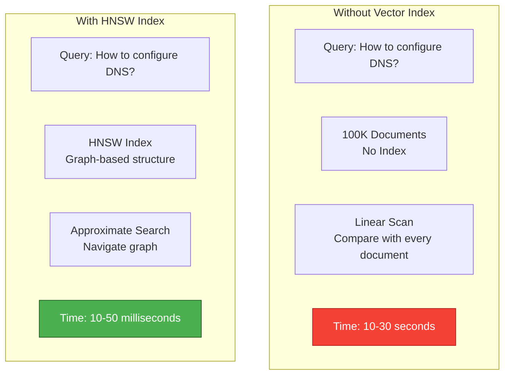

**The Indexing Advantage**:

| Approach | Search Time | Accuracy | Memory | Use Case |
|----------|-------------|----------|---------|----------|
| **Linear Scan** | 10-30s | 100% | Low | < 1K documents |
| **IVF (Inverted File)** | 100-500ms | 95% | Medium | 1K-100K docs |
| **HNSW (Hierarchical Small World)** | 10-50ms | 98% | High | 100K-10M docs |
| **Quantization** | 5-20ms | 90% | Very Low | 10M+ docs |

---

## 3.2 Index Fundamentals

### 3.2.1 What is an Index?

An **index** is a data structure that accelerates data retrieval by avoiding full table scans.

**Book Index Analogy**:
- **Without index**: Read every page to find "machine learning"
- **With index**: Look up "machine learning" in index → jump to pages 42, 87, 134
- **Result**: 100x faster lookup

**Database Index vs. Vector Index**:

| Aspect | Traditional Database (B-tree) | Vector Index (HNSW/IVF) |
|--------|------------------------------|-------------------------|
| **Query type** | Exact match (WHERE id = 42) | Similarity (closest vectors) |
| **Structure** | Balanced tree | Graph or clustering |
| **Complexity** | O(log n) lookup | O(log n) approximate search |
| **Use case** | Structured data | Unstructured semantic search |

### 3.2.2 The Vector Search Challenge

**The Curse of Dimensionality**:

As dimensions increase, distance metrics lose meaning and search becomes computationally intractable.

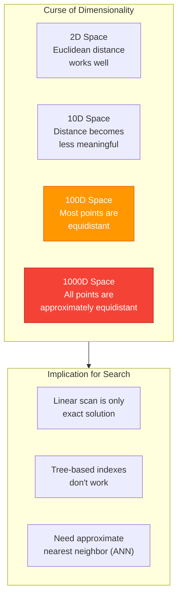

**Why Traditional Indexes Fail for Vectors**:

1. **B-tree doesn't support similarity search**: B-tree organizes data by sorted keys, not spatial proximity
2. **High-dimensional space is sparse**: Tree structures become inefficient as dimensionality increases
3. **Distance computation is expensive**: Calculating cosine similarity across 1536 dimensions is costly

**Solution**: Approximate Nearest Neighbor (ANN) algorithms trade small accuracy loss for massive speed improvement.

### 3.2.3 Index Types for Vectors

**Exact vs. Approximate Search**:

| Index Type | Search Method | Time Complexity | Accuracy | When to Use |
|------------|--------------|-----------------|----------|-------------|
| **Flat (Linear Scan)** | Compare query with every vector | O(n × d) | 100% | < 1K documents |
| **IVF (Inverted File)** | Search only relevant Voronoi cells | O(√n × d) | 92-95% | 1K-100K documents |
| **HNSW (Small World Graph)** | Navigate probabilistic graph | O(log n × d) | 97-99% | 100K-10M documents |
| **Quantized Index** | Compressed vectors + ANN | O(log n × d/4) | 90-95% | 10M+ documents |

**Accuracy vs. Speed Trade-offs**:

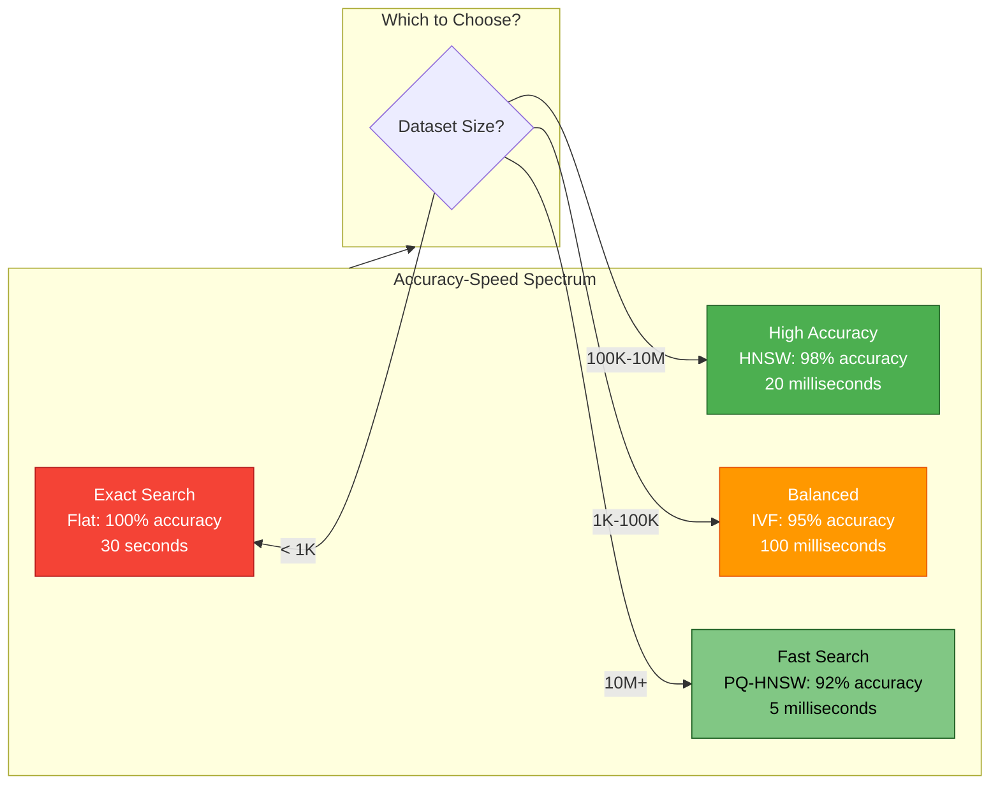

---

## 3.3 Index Algorithm Principles

### 3.3.1 Linear Scan (Flat Index)

**How It Works**:

Compare query vector with every vector in the dataset, return top-K closest.

```
For each document in database:
    distance = cosine_similarity(query, document.embedding)
    if distance < best_distance:
        add to results
Return top-K results
```

**Characteristics**:

| Property | Value |
|----------|-------|
| **Build time** | 0s (no index structure) |
| **Search time** | O(n × d) where n=docs, d=dimensions |
| **Memory overhead** | 0% (just store vectors) |
| **Accuracy** | 100% (exact search) |
| **Best for** | < 1K documents |

**When Linear Scan is Best**:

1. **Small datasets**: < 1K documents, index overhead isn't worth it
2. **Accuracy-critical applications**: Legal, medical, financial where 2% error is unacceptable
3. **Dynamic data**: Frequent updates make index maintenance expensive
4. **Batch processing**: Overnight indexing where speed isn't critical

**Performance Example**:

- 1K documents × 1536 dimensions
- Search time: ~10ms
- Memory: 6 MB for vectors only
- No build time

### 3.3.2 IVF (Inverted File)

**How IVF Works**:

IVF partitions vector space into **Voronoi cells** using clustering (typically k-means).

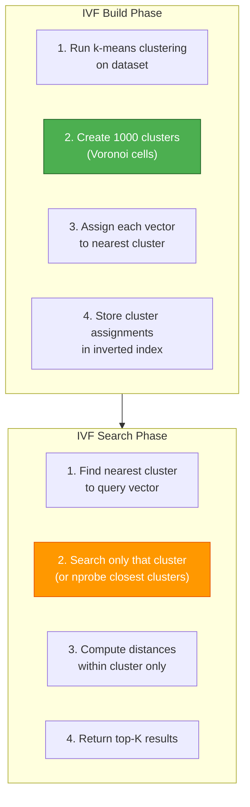

**Voronoi Cell Diagram**:

```
    Cluster 1       Cluster 2       Cluster 3
   (Centroid C1)   (Centroid C2)   (Centroid C3)

  *   *   *           *   *   *           *   *   *
    * * * *             * * * *             * * * *
  *   *   *           *   *   *           *   *   *

Query Q is closest to C2 → Search only Cluster 2
```

**IVF Parameters**:

| Parameter | Description | Default | Effect |
|-----------|-------------|---------|--------|
| **nlist** | Number of clusters | 1000 | Higher = better precision, slower search |
| **nprobe** | Clusters to search | 10 | Higher = better recall, slower search |

**Characteristics**:

| Property | Value |
|----------|-------|
| **Build time** | Minutes (requires clustering) |
| **Search time** | O(√n × d) with nprobe=10 |
| **Memory overhead** | Medium (cluster assignments) |
| **Accuracy** | 92-95% recall |
| **Best for** | 1K-100K documents |

**When IVF is Best**:

1. **Medium datasets**: 1K-100K documents
2. **Limited memory**: Lower memory overhead than HNSW
3. **Batch updates**: Can rebuild index periodically

**Limitations**:

1. **Requires training**: Need to run k-means before indexing
2. **Poor for dynamic data**: Updating index is expensive
3. **Cluster boundary issues**: Documents near cluster edges may be missed

### 3.3.3 HNSW (Hierarchical Navigable Small World)

**How HNSW Works**:

HNSW builds a **probabilistic skip list** (layered graph) for logarithmic-time search.

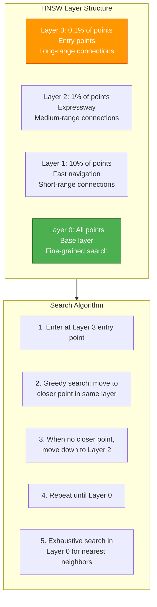

**Graph Construction Algorithm**:

```
For each new point:
    1. Determine point's level (probabilistic)
       - Level 0: 100% of points
       - Level 1: 10% of points
       - Level 2: 1% of points
       - Level 3+: 0.1% of points

    2. Find entry point (top-level point)

    3. For each level from top down:
        a. Greedy search for nearest neighbors in that level
        b. Select M neighbors based on ef_construction parameter
        c. Bidirectional connections between points

    4. In base layer (Level 0):
        a. Find M nearest neighbors
        b. Create bidirectional edges
```

**HNSW Parameters**:

| Parameter | Description | Default | Range | Effect |
|-----------|-------------|---------|-------|--------|
| **M** | Max connections per node | 16 | 8-64 | Higher = better recall, more memory |
| **ef_construction** | Index build quality | 100 | 50-200 | Higher = better index, slower build |
| **ef_search** | Search candidates | 50 | 10-100 | Higher = better recall, slower search |

**Characteristics**:

| Property | Value |
|----------|-------|
| **Build time** | Minutes (incremental) |
| **Search time** | O(log n × d) |
| **Memory overhead** | High (graph structure) |
| **Accuracy** | 97-99% recall |
| **Best for** | 100K-10M documents |

**When HNSW is Best**:

1. **Large datasets**: 100K-10M documents
2. **Real-time search**: Sub-50ms query latency
3. **Dynamic data**: Incremental updates supported
4. **High recall required**: 97-99% accuracy acceptable

**Why HNSW is Fast**:

1. **Logarithmic search**: Skip list structure enables O(log n) search
2. **Greedy navigation**: Always move closer to target
3. **Layered approach**: Coarse-to-fine search reduces distance computations
4. **Probabilistic sampling**: Only small fraction of points in higher layers

### 3.3.4 Algorithm Comparison

**Comprehensive Comparison Table**:

| Algorithm | Build Time | Search Time | Memory | Accuracy | Best For | Limitations |
|-----------|------------|-------------|---------|----------|----------|-------------|
| **Flat** | 0s | O(n×d) = 10-30s | Low | 100% | < 1K docs, accuracy-critical | Doesn't scale |
| **IVF** | Minutes | O(√n) = 100-500ms | Medium | 92-95% | 1K-100K docs | Poor for dynamic data |
| **HNSW** | Minutes | O(log n) = 10-50ms | High | 97-99% | 100K-10M docs | High memory overhead |
| **PQ-HNSW** | Hours | O(log n) = 5-20ms | Medium | 90-95% | 10M+ docs | Accuracy loss, complex setup |

**Decision Tree**:

```
Dataset size?
├─ < 1K → Flat (no index overhead, 100% accuracy)
├─ 1K-100K → IVF (balanced speed/accuracy, simpler than HNSW)
├─ 100K-10M → HNSW (best performance, industry standard)
└─ 10M+ → PQ-HNSW (quantization for memory efficiency)

Memory constrained?
├─ Yes → IVF or PQ-HNSW
└─ No → HNSW (best performance)

Dynamic data (frequent updates)?
├─ Yes → HNSW (supports incremental updates)
└─ No → IVF (simpler, good for batch workloads)

Accuracy critical (legal/medical)?
├─ Yes → Flat (100% accuracy) or high-ef HNSW
└─ No → IVF or HNSW (trade accuracy for speed)
```

---

## 3.4 Embedding Model Selection

### Model Comparison

| Model | Dimensions | Speed | Quality | Cost | Best For |
|-------|------------|-------|---------|------|----------|
| **OpenAI text-embedding-3-small** | 1536 | Fast | ⭐⭐⭐⭐⭐ | $0.02/1M tokens | General purpose, cost-sensitive |
| **OpenAI text-embedding-3-large** | 3072 | Medium | ⭐⭐⭐⭐⭐ | $0.13/1M tokens | High accuracy required |
| **BGE-M3** | 1024 | Fast | ⭐⭐⭐⭐ | Free (self-hosted) | Chinese, multilingual, cost-sensitive |
| **BGE-Large-EN** | 1024 | Fast | ⭐⭐⭐⭐ | Free (self-hosted) | English-only, cost-sensitive |
| **Cohere embed-v3** | 1024 | Fast | ⭐⭐⭐⭐⭐ | $0.10/1M tokens | Hybrid retrieval, reranking |

### Selection Guide

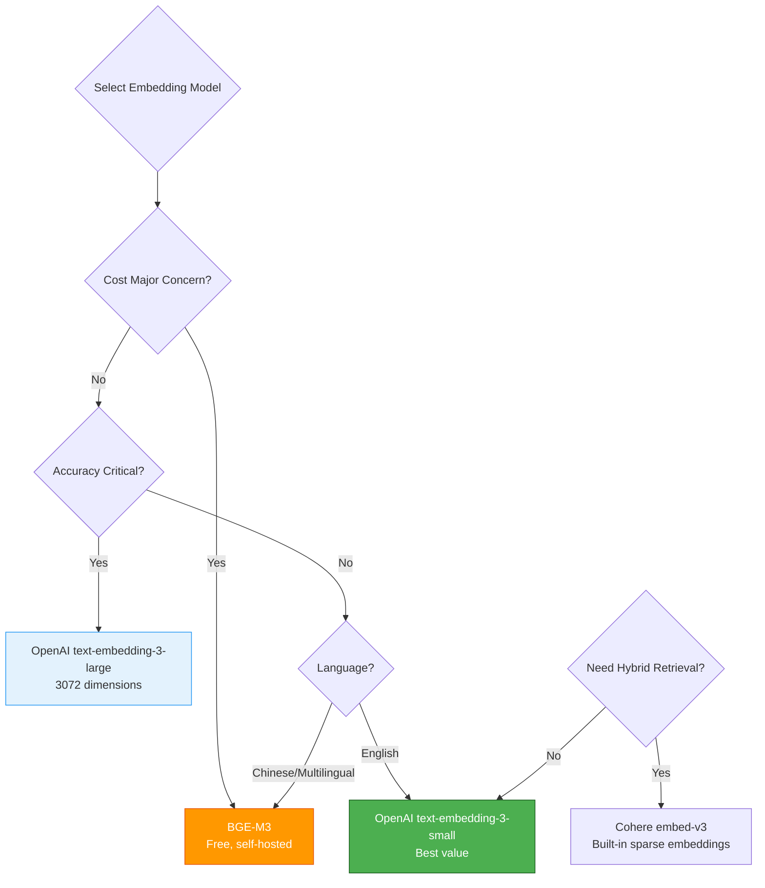

**Decision Tree**:

```
Is cost a major concern?
├─ Yes → Use BGE-M3 (free, self-hosted)
└─ No → Is accuracy critical?
    ├─ Yes → Use OpenAI text-embedding-3-large
    └─ No → Use OpenAI text-embedding-3-small (best value)

Is Chinese/multilingual content?
├─ Yes → Use BGE-M3 (optimized for multilingual)
└─ No → Use OpenAI models (better English performance)

Need hybrid retrieval (dense + sparse)?
├─ Yes → Use Cohere embed-v3 (built-in sparse embeddings)
└─ No → Use OpenAI or BGE models
```

### Dimensionality Trade-offs

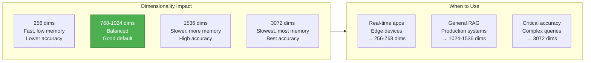

**Cost Analysis** (for 1M documents, 500 tokens each):

| Dimensions | Storage (GB) | Memory (GB) | Search Time | Cost |
|------------|--------------|-------------|-------------|------|
| **256** | 1 GB | 2 GB | ~5ms | $2.50 |
| **768** | 3 GB | 6 GB | ~10ms | $5.00 |
| **1536** | 6 GB | 12 GB | ~20ms | $10.00 |
| **3072** | 12 GB | 24 GB | ~40ms | $65.00 |

---

## 3.5 Advanced Indexing Strategies

### 3.5.1 Product Quantization (PQ)

**What is Product Quantization?**

PQ compresses high-dimensional vectors into short codes by partitioning dimensions and quantizing each partition separately.

**How PQ Works**:

```
1. Partition vector into sub-vectors (e.g., 1536 dims → 8 sub-vectors of 192 dims)

2. Train k-means on each sub-vector (typically 256 clusters per sub-vector)

3. For each vector:
   - Assign each sub-vector to nearest cluster center
   - Store cluster ID (8 bits) instead of full sub-vector

4. Result: 1536-dim vector (6 KB) → 8-byte code (99.9% compression)
```

**PQ Parameters**:

| Parameter | Description | Typical Value | Effect |
|-----------|-------------|---------------|--------|
| **M** | Number of sub-vectors | 8-64 | Higher = better accuracy, slower search |
| **nbits** | Bits per sub-vector | 8 | Higher = more clusters, better accuracy |

**Characteristics**:

| Property | Value |
|----------|-------|
| **Compression ratio** | 90-99% |
| **Memory savings** | 10-100x |
| **Accuracy loss** | 2-5% |
| **Build time** | Hours (requires training) |
| **Best for** | 10M+ documents, memory-constrained |

**When to Use PQ**:

1. **Very large datasets**: 10M+ documents where memory is limiting
2. **Memory-constrained environments**: Edge devices, small servers
3. **Cost-sensitive**: Reduce cloud storage costs

**Trade-offs**:

| Pro | Con |
|-----|-----|
| 10-100x memory reduction | 2-5% accuracy loss |
| Faster search (less data to load) | Complex training process |
| Lower storage costs | Longer build time |

### 3.5.2 DiskANN

**What is DiskANN?**

DiskANN enables vector search on datasets larger than memory by storing the index on disk and loading pages on-demand.

**How DiskANN Works**:

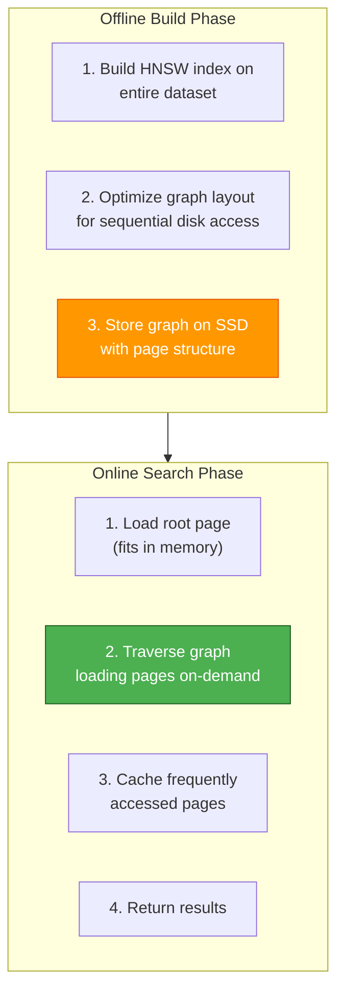

**Characteristics**:

| Property | Value |
|----------|-------|
| **Max dataset size** | Billions of vectors (limited by disk, not RAM) |
| **Search time** | 100-500ms (disk I/O bottleneck) |
| **Memory requirement** | 10-20% of dataset size (cache) |
| **Accuracy** | 90-95% |
| **Best for** | 100M+ document collections |

**When to Use DiskANN**:

1. **Massive datasets**: 100M+ documents that don't fit in memory
2. **Archival search**: Latency tolerance (100-500ms acceptable)
3. **Cost-sensitive**: SSD is cheaper than RAM

**Trade-offs**:

| Pro | Con |
|-----|-----|
| Scale to billions of vectors | 10-100x slower than in-memory |
| Lower hardware costs (SSD vs RAM) | Complex setup and optimization |
| Scales horizontally (distributed disk) | SSD wear and tear |

### 3.5.3 Composite Indexes

**What are Composite Indexes?**

Composite indexes combine multiple indexes for different aspects of documents (semantic, keyword, metadata).

**Architecture**:

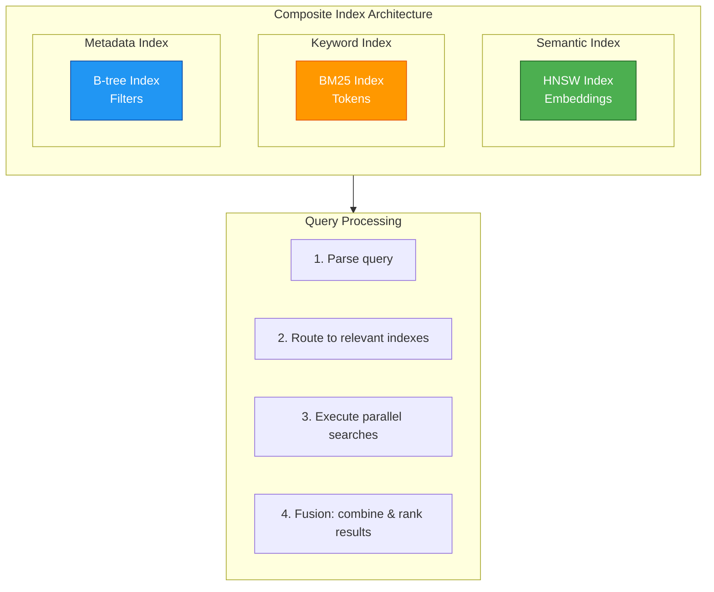

**Fusion Strategies**:

| Strategy | Description | When to Use |
|----------|-------------|-------------|
| **Reciprocal Rank Fusion (RRF)** | Combine ranked lists | General purpose |
| **Weighted fusion** | Weight semantic + keyword | Known optimal weights |
| **Cascade** | Keyword filter → semantic rerank | Keyword-heavy queries |
| **Learned fusion** | ML model to combine results | Large-scale production |

**Benefits**:

1. **Better recall**: Capture semantic and lexical matches
2. **Filtered search**: Metadata filtering with vector search
3. **Flexibility**: Optimize each index independently

**When to Use Composite Indexes**:

1. **Hybrid retrieval**: Need both semantic and keyword search
2. **Metadata filtering**: Category, date, author filters
3. **Multi-modal**: Text, image, audio search
4. **Reranking**: Cheap pre-filter → expensive rerank

### 3.5.4 Multi-Vector Indexing

**What is Multi-Vector Indexing?**

Store multiple vector representations per document for different query types.

**Example Architecture**:

```
Document: "Machine Learning with TensorFlow"

Vectors stored:
├─ Dense embedding (1536 dims): Semantic meaning
├─ Sparse embedding (10K dims): Keywords, entities
├─ Summary embedding (1536 dims): Document overview
├─ Title embedding (1536 dims): Title-specific
└─ Section embeddings (N × 1536): Per-section
```

**Query Processing**:

```
Query: "How to use TensorFlow for ML?"

1. Generate query embedding
2. Search all vector types in parallel
3. Fuse results:
   - Title match: 2.0× weight (high relevance)
   - Summary match: 1.5× weight (good overview)
   - Section match: 1.2× weight (specific detail)
   - Dense match: 1.0× weight (semantic)
   - Sparse match: 0.8× weight (keyword)
4. Return fused ranked results
```

**Benefits**:

| Benefit | Description |
|---------|-------------|
| **Better recall** | Capture different aspects of relevance |
| **Query-type awareness** | Optimize for different query patterns |
| **Granular search** | Title vs. content vs. section search |

**Trade-offs**:

| Pro | Con |
|-----|-----|
| 2-5x better recall | 2-5x storage cost |
| Flexible retrieval | Complex query orchestration |
| Better user experience | Slower queries (multiple indexes) |

**When to Use Multi-Vector Indexing**:

1. **Long documents**: Single embedding insufficient
2. **Structured documents**: Title, abstract, sections
3. **Multiple query types**: Navigational vs. informational
4. **High recall required**: Enterprise search, e-commerce

---

## 3.6 Index Optimization Techniques

### 3.6.1 Quantization Methods

**Scalar Quantization**

Convert float32 vectors to int8 by dividing each dimension by a constant.

```
Float32 vector: [0.234, -0.567, 0.891, ...]
Quantization factor: 0.01
Int8 vector: [23, -57, 89, ...]

Memory reduction: 75% (4 bytes → 1 byte per dimension)
Accuracy loss: 1-3%
```

**Scalar Quantization Parameters**:

| Parameter | Description | Effect |
|-----------|-------------|--------|
| **Quantization range** | Min/max values to quantize | Larger range = more precision loss |
| **Uniform vs. non-uniform** | Spacing of quantization levels | Non-uniform better for skewed data |

**Product Quantization (PQ)**

Compress vectors by partitioning and clustering each partition (see 3.5.1).

**Comparison**:

| Method | Memory Reduction | Accuracy Loss | Speed | Complexity |
|--------|-----------------|---------------|-------|------------|
| **Scalar (int8)** | 75% | 1-3% | 2x faster | Low |
| **Product (PQ)** | 90%+ | 2-5% | 4x faster | High |
| **Binary** | 97% | 5-10% | 10x faster | Medium |

**When to Use Each**:

```
Dataset size?
├─ < 10M → Scalar quantization (good balance)
├─ 10M-100M → Product quantization (memory savings)
└─ 100M+ → Binary + PQ (extreme compression)

Accuracy sensitivity?
├─ High → Scalar (minimal loss)
├─ Medium → PQ (acceptable loss)
└─ Low → Binary (max compression)
```

### 3.6.2 Index Partitioning Strategies

**Category-Based Partitioning**

Create separate indexes per document category.

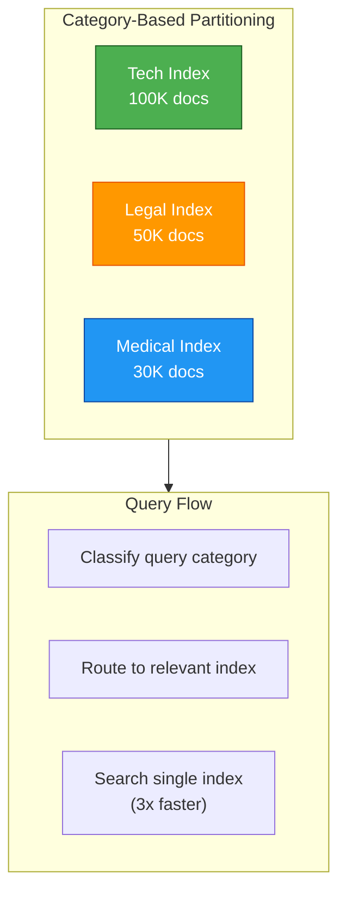

**Benefits**:

- 3-10x faster filtered search (search only relevant partition)
- Parallel indexing (build partitions independently)
- Easier maintenance (rebuild single partition)

**When to Use**:

1. **Clear category boundaries**: Tech, Legal, Medical, etc.
2. **Category filters in queries**: Most queries specify category
3. **Uneven query distribution**: 80% of queries target 20% of categories

**Time-Based Partitioning**

Create indexes per time period (day, week, month).

```
Index Structure:
├─ 2024-01 Index (Jan 2024 documents)
├─ 2024-02 Index (Feb 2024 documents)
├─ ...
└─ 2024-12 Index (Dec 2024 documents)

Query: "Recent news about AI"
→ Search only last 3 partitions (3x faster)
```

**Benefits**:

- Faster recent-document searches (most queries target recent content)
- Time travel queries (search specific time periods)
- Easier archival (delete old partitions)

**When to Use**:

1. **Temporal queries**: Most queries target recent documents
2. **Data retention policies**: Delete old data regularly
3. **Time-series analysis**: Trend detection over time

**Sharding**

Distribute index across multiple servers.

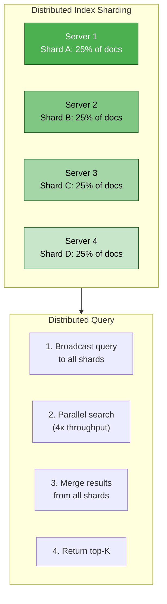

**Sharding Strategies**:

| Strategy | Description | Pros | Cons |
|----------|-------------|------|------|
| **Hash-based** | Hash document ID to shard | Even distribution | Cross-shard queries hard |
| **Range-based** | Document ID ranges to shard | Range queries easy | Uneven load |
| **Category-based** | Category to shard mapping | Targeted queries | Load imbalance |
| **Geographic** | User location to shard | Low latency | Complex routing |

**When to Use Sharding**:

1. **Single-server limit**: Dataset doesn't fit on one machine
2. **Query throughput**: Need to handle 1000+ QPS
3. **Fault tolerance**: Replicate shards across servers

### 3.6.3 Index Maintenance

**Incremental Updates**

Add new documents to existing index without full rebuild.

| Approach | Description | When to Use |
|----------|-------------|-------------|
| **HNSW incremental** | Add points to graph | Dynamic data, < 10% daily growth |
| **IVF append** | Add to clusters | Batch updates, < 5% daily growth |
| **Full rebuild** | Rebuild from scratch | High churn, > 10% daily growth |

**Trade-offs**:

| Approach | Speed | Accuracy | Complexity |
|----------|-------|----------|------------|
| **Incremental** | Fast (ms per doc) | Degrades over time | Medium |
| **Periodic rebuild** | Slow (hours) | Always optimal | Low |

**Index Rebuilding**

Periodic full rebuild to maintain index quality.

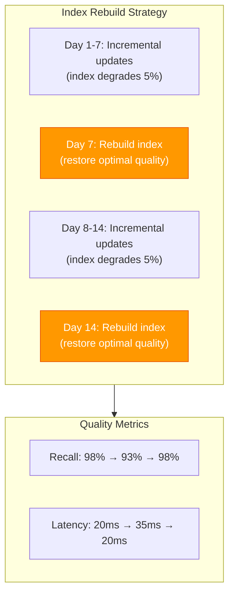

**Rebuild Frequency Guidelines**:

| Update Rate | Rebuild Frequency | Rationale |
|-------------|-------------------|-----------|
| **< 1% daily** | Monthly | Negligible degradation |
| **1-5% daily** | Weekly | Balance cost and quality |
| **5-10% daily** | Daily | Maintain optimal performance |
| **> 10% daily** | Continuous streaming | Real-time indexing |

**Deletion Strategies**

| Strategy | Description | Speed | Consistency | Best For |
|----------|-------------|-------|-------------|----------|
| **Lazy deletion** | Mark deleted, rebuild later | Fast | Eventually consistent | High-churn datasets |
| **Immediate deletion** | Remove from index | Slow | Strongly consistent | Low-churn datasets |
| **Soft deletion** | Keep tombstone, filter queries | Fast | Query-time filtering | Compliance, audit trails |

---

## 3.7 Vector Database Architecture

### 3.7.1 Core Components

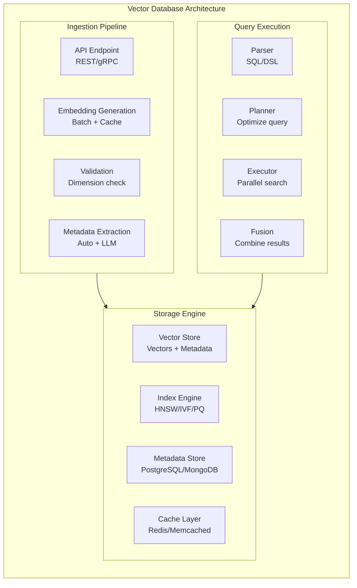

### 3.7.2 Storage Engine Comparison

| Database | Storage Engine | Index Support | ACID | Metadata | Best For |
|----------|---------------|--------------|------|----------|----------|
| **PgVector** | PostgreSQL | HNSW, IVF | ✅ | Native SQL | < 10M docs, SQL-heavy workloads |
| **Milvus** | etcdKV + MinIO/S3 | HNSW, IVF, DiskANN | ❌ | Built-in | 1M+ docs, scalable |
| **Pinecone** | Proprietary | HNSW, PQ | ❌ | Limited | Production, managed service |
| **Qdrant** | Rust + etcd | HNSW, hybrid | ✅ | Native | Hybrid search, real-time |
| **Weaviate** | Go + BoltDB | HNSW | ❌ | Graph-based | GraphQL APIs |

**PgVector Internals**:

```
Storage Format:
├─ Vectors stored as ARRAY[float] column type
├─ HNSW: Graph edges in separate table
└─ Metadata: Native PostgreSQL columns

Query Execution:
SELECT id, content, embedding <-> query_vector AS distance
FROM documents
WHERE category = 'tech'
ORDER BY distance
LIMIT 10;

Flow:
1. Filter by category (B-tree index)
2. Compute distance for filtered docs (HNSW index)
3. Sort by distance
4. Return top-10
```

**Milvus Internals**:

```
Storage Format:
├─ etcd: Metadata (schema, index stats)
├─ MinIO/S3: Vector data (persistent storage)
└─ Memory: Loaded index segments

Query Execution:
1. Proxy receives query
2. Query router identifies relevant shards
3. Query nodes search local index segments
4. Results aggregated and returned
```

### 3.7.3 Distributed Indexing

**Problem**: Single-server indexing doesn't scale

**Solution**: Distributed indexing across cluster

**Architecture Patterns**:

**1. Data Parallelism** (Most Common):

```
Documents split across nodes:
├─ Node 1: 25% of documents (independent index)
├─ Node 2: 25% of documents (independent index)
├─ Node 3: 25% of documents (independent index)
└─ Node 4: 25% of documents (independent index)

Query flow:
1. Broadcast query to all nodes
2. Each node searches its local index
3. Merge results from all nodes
4. Return global top-K

Trade-off: Network overhead, but scales horizontally
```

**2. Index Parallelism**:

```
All nodes see all documents:
├─ Node 1: HNSW index (all docs)
├─ Node 2: IVF index (all docs)
├─ Node 3: PQ index (all docs)
└─ Node 4: Flat index (all docs)

Query flow:
1. Route to appropriate node (by index type)
2. Search single index
3. Return results

Trade-off: Complex coordination, high memory per node
```

**3. Hybrid Approach** (Production Standard):

```
Shard by metadata category:
├─ Node 1: Tech category index (all tech docs)
├─ Node 2: Legal category index (all legal docs)
├─ Node 3: Medical category index (all medical docs)
└─ Node 4: Finance category index (all finance docs)

Query flow:
1. Classify query category
2. Route to relevant node(s)
3. Parallel search on targeted nodes
4. Merge results

Trade-off: Best balance, requires category classification
```

### 3.7.4 Query Execution Flow

```
User Query: "How do I configure Redis for production?"
    ↓
Query Parser: Parse DSL/SQL
    ├─ Extract: "configure", "Redis", "production"
    ├─ Classify: Tech category
    └─ Detect: Keyword-heavy query
    ↓
Query Planner: Optimize search strategy
    ├─ Metadata filtering: category=tech, year>=2023
    ├─ Index selection:
    │   ├─ Keyword index (BM25): "configure", "Redis"
    │   ├─ Semantic index (HNSW): Query embedding
    │   └─ Metadata index (B-tree): category=tech
    └─ Parallel execution plan:
        ├─ Thread 1: Search keyword index
        ├─ Thread 2: Search semantic index
        └─ Thread 3: Filter by metadata
    ↓
Executor: Parallel search
    ├─ Thread 1 (Keyword): Returns [doc42, doc87, doc153, ...]
    ├─ Thread 2 (Semantic): Returns [doc87, doc153, doc291, ...]
    └─ Thread 3 (Metadata): Filters to tech docs published 2023+
    ↓
Result Fusion: Reciprocal Rank Fusion (RRF)
    ├─ doc87: 1/1 + 1/1 + 1/1 = 3.0 (top rank)
    ├─ doc153: 1/2 + 1/2 + 1/2 = 1.5 (second rank)
    └─ doc291: 1/3 + 1/3 + 1/1 = 1.1 (third rank)
    ↓
Return Top-10 documents to user
```

### 3.7.5 Update Mechanisms

| Database | Insert | Update | Delete | Impact |
|----------|--------|-------|--------|--------|
| **PgVector** | Fast | Slow (rebuild needed) | Slow (mark dirty) | Best for append-only |
| **Milvus** | Fast | Fast (in-place) | Fast (in-place) | Best for dynamic data |
| **Pinecone** | Fast | Fast (upsert) | Fast (upsert) | Best for production |
| **Qdrant** | Fast | Fast (in-place) | Fast (in-place) | Best for real-time |

**Update Strategies**:

```
PgVector (Append-Only):
1. Insert new vectors: Fast (add to table, index incrementally)
2. Update existing: Slow (need to rebuild index)
3. Delete: Slow (mark deleted, rebuild later)

Milvus (Dynamic):
1. Insert new vectors: Fast (add to segment)
2. Update existing: Fast (in-place update in segment)
3. Delete: Fast (mark deleted in segment metadata)

Pinecone (Upsert-Optimized):
1. Insert/Upsert: Fast (upsert API)
2. Delete: Fast (upsert with deleted=true flag)
3. Background: Automatic index optimization
```

### 3.7.6 Consistency and ACID

| Database | ACID Support | Transaction Support | Implications |
|----------|-------------|------------------|-------------|
| **PgVector** | ✅ Full ACID | BEGIN/COMMIT | Strong consistency, slower writes |
| **Milvus** | ❌ No ACID | Batch operations | Eventually consistent, faster writes |
| **Pinecone** | ❌ No ACID | Atomic operations | Eventual consistency |
| **Qdrant** | ✅ Full ACID | Transactional API | Strong consistency with real-time features |

**When ACID Matters**:

```
Financial/Legal applications:
├─ Need strong consistency
├─ Use PgVector or Qdrant
└─ Accept slower writes for correctness

Real-time applications:
├─ Need fast writes, eventual consistency OK
├─ Use Milvus or Pinecone
└─ Accept brief inconsistency for speed
```

### 3.7.7 Scaling Strategies

**Horizontal Scaling** (Adding more nodes):

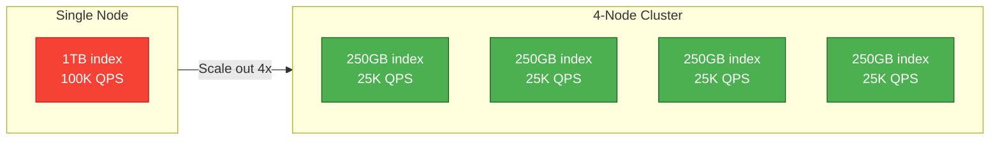

**Replication** (Copying data across nodes):

| Strategy | Description | Pros | Cons |
|----------|-------------|------|------|
| **Leader-follower** | One leader writes, followers read | Simple, consistent | Leader bottleneck |
| **Multi-leader** | Any node can write | No bottleneck | Conflict resolution |
| **Sharding + replica** | Each shard replicated | Balanced | Complex setup |

**Failover**:

```
Node failure detection:
1. Health check: Ping all nodes every 5 seconds
2. Failure detection: Node unresponsive for 15 seconds
3. Re-routing: Redirect queries to replica nodes
4. Recovery: Rebuild failed node from replica
5. Re-balance: Redistribute data across cluster
```

---

## 3.8 Batch Embedding Generation

### The Batch Processing Problem

**Problem**: Generating embeddings one-by-one is expensive and slow

| Approach | API Calls | Time | Cost (100K docs) |
|----------|-----------|------|-------------------|
| **Individual** | 100,000 | ~14 hours | $10.00 |
| **Batch (100)** | 1,000 | ~10 minutes | $10.00 |
| **Batch (1000)** | 100 | ~2 minutes | $10.00 |

**Key Insight**: Batch processing doesn't reduce cost (API pricing is per token), but provides 50-100x speed improvement.

### Batch Size Optimization

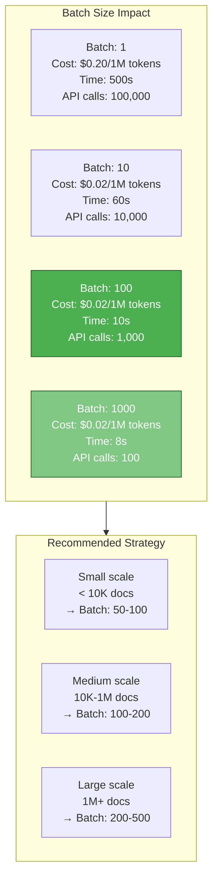

**Batch Size Guidelines**:

| Document Count | Optimal Batch | Reason | Speed Improvement |
|----------------|---------------|---------|-------------------|
| **< 1,000** | 50-100 | Balance efficiency vs memory | 50x |
| **1,000 - 10,000** | 100-200 | Maximize throughput | 100x |
| **10,000 - 100,000** | 200-500 | Minimize API overhead | 150x |
| **100,000+** | 500-1000 | Maximum efficiency | 200x |

### Batch Processing Best Practices

| Practice | Why | Implementation |
|----------|-----|----------------|
| **Automatic retry** | API failures are common | Exponential backoff (3-5 retries) |
| **Progress monitoring** | Track long-running jobs | Log batch progress, ETA calculation |
| **Cost tracking** | Avoid surprise bills | Estimate cost before processing |
| **Error resilience** | One bad batch shouldn't fail all | Skip failed documents, continue processing |
| **Rate limiting** | Avoid API throttling | Control concurrent requests |

---

## 3.9 Embedding Caching

### Cache Architecture

Cache embeddings to avoid recomputing for identical or similar text:

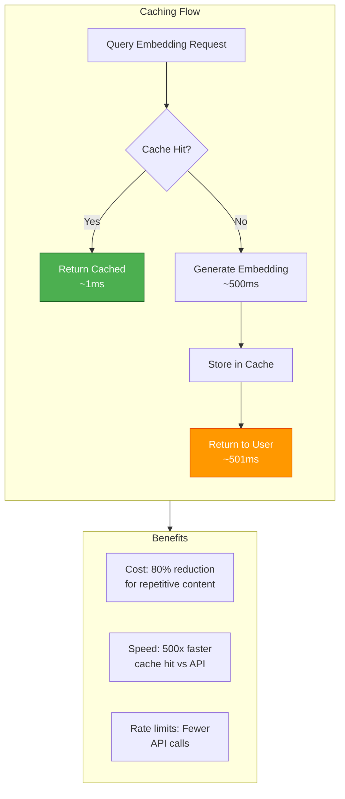

### Cache Strategy Comparison

| Strategy | Hit Rate | Memory | Complexity | Use Case |
|----------|----------|---------|------------|----------|
| **No Cache** | 0% | 0 MB | Low | One-time indexing |
| **LRU Cache (100K)** | 20-40% | 6 GB | Low | General purpose |
| **TTL Cache (7 days)** | 30-50% | 6 GB | Low | Time-sensitive content |
| **Persistent Cache** | 50-80% | Disk | High | Large-scale, repetitive |
| **Semantic Cache** | 40-60% | 8 GB | High | Similar queries |

### Cache Best Practices

| Practice | Implementation | Impact |
|----------|----------------|--------|
| **Cache query embeddings** | Hash query text, check cache first | 80% cost reduction for repeated queries |
| **Cache document embeddings** | Hash document content, check before generating | 20-40% cost reduction during re-indexing |
| **Monitor hit rate** | Track cache hits vs misses | Optimize cache size and TTL |
| **Set appropriate TTL** | 7 days for most content | Balance freshness and hit rate |
| **Persistent cache** | Store cache on disk for restarts | Avoid re-generation after restart |

---

## 3.10 Production Optimization

### Performance Benchmarks

**Index Size vs Document Count**:

| Documents | Dimensions | Index Size | Memory | Build Time | Search Time |
|-----------|------------|------------|---------|------------|-------------|
| **10K** | 1536 | 100 MB | 200 MB | 30s | 5ms |
| **100K** | 1536 | 1 GB | 2 GB | 5min | 10ms |
| **1M** | 1536 | 10 GB | 20 GB | 45min | 20ms |
| **10M** | 1536 | 100 GB | 200 GB | 6hr | 40ms |

### HNSW Parameter Tuning

**Parameter Impact Visualization**:

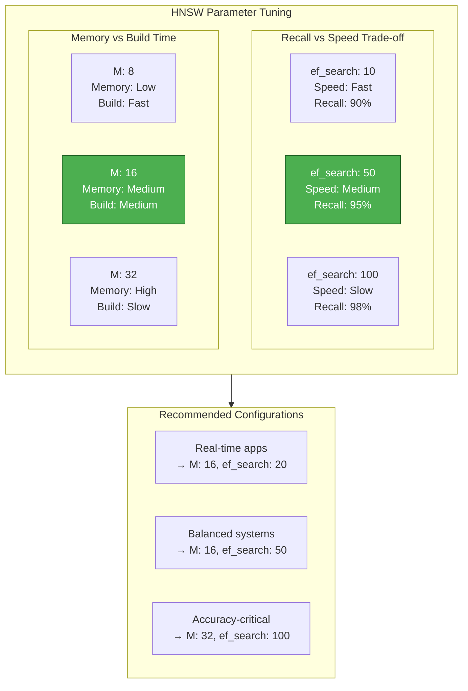

**Tuning Guidelines**:

| Use Case | M | ef_construction | ef_search | Expected Recall |
|----------|---|-----------------|-----------|-----------------|
| **Real-time** (fast queries) | 12 | 80 | 20 | 90-92% |
| **Balanced** (default) | 16 | 100 | 50 | 95-97% |
| **High accuracy** | 24 | 150 | 100 | 97-99% |
| **Maximum accuracy** | 32 | 200 | 150 | 99%+ |

### Cost Optimization Strategies

**Optimization Strategy Details**:

| Optimization | Description | When to Use | Trade-offs |
|--------------|-------------|-------------|-----------|
| **Quantization** | Float32 → INT8 vectors | Memory constrained | 2% accuracy loss, 75% memory savings |
| **Dimensionality reduction** | PCA to reduce dimensions | Very large corpora | 5% accuracy loss, 50% memory savings |
| **Index partitioning** | Separate indexes per category | Metadata-heavy queries | More complex queries |
| **Hybrid search** | Combine dense + sparse vectors | Keyword + semantic queries | 50% cost increase, 10% recall improvement |

### Monitoring & Alerting

**Key Metrics to Track**:

1. **Index Health**
   - Document count
   - Index size
   - Fragmentation level

2. **Query Performance**
   - P50, P95, P99 latency
   - Recall rate (vs ground truth)
   - Timeout rate

3. **Cost Tracking**
   - API call volume
   - Token usage
   - Cache hit rate

**Alert Thresholds**:

| Metric | Warning | Critical | Action |
|--------|---------|----------|--------|
| **Query latency (P95)** | > 100ms | > 500ms | Check ef_search, index health |
| **Recall rate** | < 90% | < 80% | Increase ef_search, check embedding quality |
| **Cache hit rate** | < 20% | < 10% | Review cache strategy, preload common queries |
| **API error rate** | > 5% | > 10% | Check rate limits, retry logic |
| **Index fragmentation** | > 50% overhead | > 100% overhead | Rebuild index, VACUUM ANALYZE |

---

## 3.11 Interview Q&A

<details>
<summary><strong>Q1: Explain the curse of dimensionality problem</strong></summary>

The curse of dimensionality refers to the phenomenon where distance metrics lose meaning in high-dimensional spaces.

**Key points**:

1. **Distance concentration**: In high dimensions, all points become approximately equidistant
2. **Empty space phenomenon**: Volume grows exponentially, data becomes sparse
3. **Implication for indexing**: Traditional tree-based indexes become ineffective
4. **Solution**: Approximate Nearest Neighbor (ANN) algorithms trade small accuracy loss for massive speed improvement

**Example**:
- 2D space: Euclidean distance works well, points have clear nearest neighbors
- 1000D space: Most points are roughly the same distance apart, making "nearest neighbor" less meaningful

</details>

<details>
<summary><strong>Q2: How does HNSW actually work?</strong></summary>

HNSW (Hierarchical Navigable Small World) builds a probabilistic skip list for logarithmic-time approximate search.

**How it works**:

1. **Layered structure**:
   - Layer 0: All points (base layer)
   - Layer 1: Top 10% of points
   - Layer 2: Top 1% of points
   - Layer 3+: Top 0.1% of points

2. **Graph construction**:
   - Each point connects to M nearest neighbors in its layer
   - Higher layers have fewer points but longer-range connections
   - Built incrementally, point by point

3. **Search algorithm**:
   - Start at entry point in top layer
   - Greedy search: Move to closer point in current layer
   - When no closer point, move down to next layer
   - In base layer, exhaustive search of nearest neighbors
   - Return top-K candidates

4. **Why it's fast**:
   - Logarithmic search: O(log n) due to layered structure
   - Coarse-to-fine: Higher layers navigate quickly, base layer refines
   - Probabilistic sampling: Only small fraction of points in higher layers

**Key parameters**:
- M: Connections per point (16 default)
- ef_construction: Candidates during build (100 default)
- ef_search: Candidates during search (50 default)

</details>

<details>
<summary><strong>Q3: When would you use IVF vs HNSW?</strong></summary>

**IVF (Inverted File)**:
- Use when: Dataset is 1K-100K documents
- Pros: Lower memory overhead, simpler implementation
- Cons: Poor for dynamic data, requires clustering
- Mechanism: Partitions space into Voronoi cells, searches only relevant cells

**HNSW (Hierarchical Small World)**:
- Use when: Dataset is 100K-10M documents
- Pros: Faster search, supports incremental updates, higher recall
- Cons: Higher memory overhead (graph structure)
- Mechanism: Layered graph structure, logarithmic search

**Decision factors**:
1. Dataset size: < 100K → IVF, > 100K → HNSW
2. Update frequency: High churn → HNSW (supports incremental updates)
3. Memory constraints: Limited memory → IVF
4. Query latency: Sub-50ms required → HNSW

</details>

<details>
<summary><strong>Q4: How do vector databases handle updates and deletions?</strong></summary>

**Update strategies vary by database**:

1. **PgVector**:
   - Insert: Fast (incremental)
   - Update: Slow (requires index rebuild)
   - Delete: Slow (mark deleted, rebuild later)
   - Best for: Append-only workloads

2. **Milvus**:
   - Insert: Fast (add to segment)
   - Update: Fast (in-place update)
   - Delete: Fast (mark deleted in segment metadata)
   - Best for: Dynamic data

3. **Pinecone**:
   - Insert/Upsert: Fast (upsert API)
   - Delete: Fast (upsert with deleted flag)
   - Best for: Production, real-time

**Why updates are challenging**:
- **HNSW**: Removing a point requires updating graph edges (expensive)
- **IVF**: Changing a point's cluster requires re-clustering
- **PQ**: Updating requires recomputing quantization codes

**Common strategies**:
- Lazy deletion: Mark deleted, rebuild periodically
- Soft deletion: Keep tombstone, filter at query time
- Immediate deletion: Remove and update graph (complex)

</details>

<details>
<summary><strong>Q5: What are the trade-offs between different vector databases?</strong></summary>

**PgVector**:
- Pros: SQL queries, ACID transactions, metadata filtering, open-source
- Cons: Slower than dedicated databases, limited scalability
- Best for: < 10M docs, SQL-heavy workloads, need metadata filtering

**Milvus**:
- Pros: Highly scalable, feature-rich, supports multiple indexes
- Cons: Complex setup, no ACID, eventually consistent
- Best for: 1M+ docs, self-hosted, scalable architectures

**Pinecone**:
- Pros: Fully managed, auto-scaling, simple API
- Cons: Expensive, vendor lock-in, limited metadata
- Best for: Production, no ops team, rapid development

**Qdrant**:
- Pros: Hybrid search, ACID transactions, fast
- Cons: Newer ecosystem, less mature
- Best for: Hybrid retrieval, real-time applications

**Decision factors**:
1. Team expertise: SQL skills → PgVector
2. Scalability needs: < 10M → PgVector, > 10M → Milvus/Pinecone
3. Consistency requirements: ACID needed → PgVector/Qdrant
4. Ops capacity: No ops → Pinecone, have ops → Milvus/Qdrant

</details>

<details>
<summary><strong>Q6: Explain product quantization and when to use it</strong></summary>

**Product Quantization (PQ)** compresses vectors by partitioning dimensions and quantizing each partition.

**How it works**:
1. Partition vector into M sub-vectors (e.g., 1536 dims → 8 sub-vectors of 192 dims)
2. Train k-means on each sub-vector (typically 256 clusters)
3. For each vector, assign each sub-vector to nearest cluster center
4. Store cluster IDs (8 bits each) instead of full vectors
5. Result: 1536-dim vector (6 KB) → 8-byte code (99.9% compression)

**When to use PQ**:
- Dataset size: 10M+ documents
- Memory constrained: Can't fit full vectors in RAM
- Cost-sensitive: Reduce cloud storage costs
- Accuracy tolerance: Accept 2-5% accuracy loss

**Trade-offs**:
- Pros: 10-100x memory reduction, faster search (less data to load)
- Cons: 2-5% accuracy loss, complex training (hours to days), longer build time

**Alternatives**:
- Scalar quantization: Simpler, less compression (75%), less accuracy loss (1-3%)
- Binary quantization: Extreme compression (97%), higher accuracy loss (5-10%)

</details>

<details>
<summary><strong>Q7: How do you optimize vector search performance?</strong></summary>

**Optimization strategies**:

1. **Index algorithm selection**:
   - < 1K docs: Flat (no index)
   - 1K-100K docs: IVF
   - 100K-10M docs: HNSW
   - 10M+ docs: PQ-HNSW

2. **Quantization**:
   - Scalar (int8): 75% memory reduction, 1-3% accuracy loss
   - Product (PQ): 90%+ memory reduction, 2-5% accuracy loss
   - Use when: Memory constrained or very large datasets

3. **HNSW parameter tuning**:
   - M (connections): Higher = better recall, more memory
   - ef_search (search candidates): Higher = better recall, slower search
   - Real-time: M=16, ef_search=20
   - Balanced: M=16, ef_search=50
   - Accuracy-critical: M=32, ef_search=100

4. **Index partitioning**:
   - Category-based: Separate indexes per category
   - Time-based: Partition by creation date
   - Sharding: Distribute across servers

5. **Caching**:
   - LRU cache for query embeddings: 20-40% hit rate
   - Preload common queries at startup
   - Persistent cache for restart resilience

6. **Batch processing**:
   - Batch size: 100-500 for optimal throughput
   - Reduces API overhead 50-200x

**Monitoring**:
- Track query latency (P50, P95, P99)
- Monitor recall rate vs ground truth
- Alert on degraded performance
- Rebuild index periodically (weekly to monthly)

</details>

---

## Summary

### Key Takeaways

**1. Index Fundamentals**:
- Indexes accelerate search by avoiding full scans
- Vector indexes differ from traditional database indexes (similarity vs. exact match)
- Curse of dimensionality makes high-dimensional search challenging
- ANN algorithms trade small accuracy loss for massive speed improvement

**2. Index Algorithms**:
- Flat (Linear Scan): 100% accuracy, < 1K docs
- IVF: 92-95% accuracy, 1K-100K docs
- HNSW: 97-99% accuracy, 100K-10M docs (industry standard)
- PQ-HNSW: 90-95% accuracy, 10M+ docs

**3. Advanced Strategies**:
- Product Quantization: 90%+ memory reduction, 2-5% accuracy loss
- DiskANN: Scale to billions of vectors (disk-based)
- Composite Indexes: Hybrid semantic + keyword + metadata
- Multi-Vector: Multiple embeddings per document

**4. Optimization Techniques**:
- Quantization: Scalar (75% reduction), Product (90%+ reduction)
- Partitioning: Category-based, time-based, sharding
- Maintenance: Incremental updates, periodic rebuilds
- Deletion: Lazy (eventual), immediate (strong consistency)

**5. Vector Database Architecture**:
- Components: Ingestion, storage, query execution
- Storage engines: PgVector (SQL), Milvus (scalable), Pinecone (managed)
- Distributed indexing: Data parallelism (most common)
- Consistency: ACID (PgVector, Qdrant) vs. eventual (Milvus, Pinecone)

**6. Production Best Practices**:
- HNSW tuning: M=16, ef_search=50 for balanced systems
- Batch size: 100-500 for optimal throughput
- Caching: LRU with 7-day TTL, 20-40% hit rate
- Monitoring: Latency, recall, cost metrics with alerting

### Best Practices Checklist

- [ ] Select index algorithm based on dataset size and query patterns
- [ ] Implement HNSW with optimized parameters (M=16, ef_search=50)
- [ ] Add caching layer for query embeddings (LRU, 100K entries, 7-day TTL)
- [ ] Implement batch generation with retry logic (batch size: 100-500)
- [ ] Set up monitoring for index health and query performance
- [ ] Implement alerting for degraded performance
- [ ] Consider quantization for memory-constrained environments
- [ ] Partition indexes by category or time for filtered searches
- [ ] Schedule periodic index rebuilds (weekly to monthly)
- [ ] Use composite indexes for hybrid retrieval needs

### Further Reading

**Research Papers**:
- [Efficient and Robust Approximate Nearest Neighbor Search Using Hierarchical Navigable Small World Graphs](https://arxiv.org/abs/1603.09320) (Malkov & Yashunin, 2016) - HNSW foundation
- [Product Quantization for Nearest Neighbor Search](https://lear.inrialpes.fr/pubs/2011/JDS11/jegou_searching_with_quantization.pdf) (Jegou et al., 2011) - PQ foundation
- [DiskANN: Fast Accurate Billion-point Nearest Neighbor Search on a Single Node](https://arxiv.org/abs/1901.06015) (Subramanya et al., 2019) - DiskANN foundation

**Tools & Documentation**:
- [PgVector Documentation](https://github.com/pgvector/pgvector)
- [Milvus Documentation](https://milvus.io/docs)
- [Pinecone Documentation](https://docs.pinecone.io)
- [Qdrant Documentation](https://qdrant.tech/documentation)
- [Spring AI VectorStore](https://docs.spring.io/spring-ai/reference/api/vectorstore.html)

**Benchmark Resources**:
- [ANN-Benchmarks](https://github.com/erikbern/ann-benchmarks) - Comprehensive algorithm comparison
- [Vector Database Comparison](https://thedataquarry.com/posts/vector-db-comparison/) - Performance benchmarks

---

**Next Steps**:
- 📖 Read [Retrieval Strategies](/ai/rag/retrieval) for search optimization
- 📖 Read [Data Processing](/ai/rag/data-processing) for chunking strategies
- 💻 Implement batch embedding generation with caching
- 🔧 Tune HNSW parameters for your use case
- 📊 Set up monitoring for your vector index
