# 3. Vector Indexing & Storage

> **"Embeddings are the bridge between text and vector search. Storage optimization is the key to production RAG systems."** — RAG Infrastructure Principle

This chapter covers embedding model selection, batch generation strategies, caching techniques, vector storage architectures, HNSW indexing, and production optimization for RAG systems.

---

## 3.1 Understanding Embeddings in RAG

### The Role of Embeddings

**Embeddings** are the bridge between text and vector search. They convert semantic meaning into numerical vectors that can be compared mathematically.

**Key concepts**:

1. **Vector Space**: Similar concepts are close together in high-dimensional space
2. **Dimensionality**: Higher dimensions capture more nuance but cost more
3. **Model Selection**: Different models optimized for different use cases
4. **Batch Processing**: Generate embeddings in batches to reduce API calls
5. **Caching**: Cache embeddings to avoid recomputation

### Why Vector Indexing Matters


**The Indexing Advantage**:

| Approach | Search Time | Accuracy | Memory | Use Case |
|----------|-------------|----------|---------|----------|
| **Linear Scan** | 10-30s | 100% | Low | < 1K documents |
| **IVF (Inverted File)** | 100-500ms | 95% | Medium | 1K-100K docs |
| **HNSW (Hierarchical Small World)** | 10-50ms | 98% | High | 100K-10M docs |
| **Quantization** | 5-20ms | 90% | Very Low | 10M+ docs |

---

## 3.2 Embedding Model Selection

### 3.2.1 Model Comparison

| Model | Dimensions | Speed | Quality | Cost | Best For |
|-------|------------|-------|---------|------|----------|
| **OpenAI text-embedding-3-small** | 1536 | 🟢 Fast | ⭐⭐⭐⭐⭐ | 💰 $0.02/1M tokens | General purpose, cost-sensitive |
| **OpenAI text-embedding-3-large** | 3072 | 🟡 Medium | ⭐⭐⭐⭐⭐ | 💰💰 $0.13/1M tokens | High accuracy required |
| **BGE-M3** | 1024 | 🟢 Fast | ⭐⭐⭐⭐ | 🆓 Free (self-hosted) | Chinese, multilingual, cost-sensitive |
| **BGE-Large-EN** | 1024 | 🟢 Fast | ⭐⭐⭐⭐ | 🆓 Free (self-hosted) | English-only, cost-sensitive |
| **Cohere embed-v3** | 1024 | 🟢 Fast | ⭐⭐⭐⭐⭐ | 💰💰 $0.10/1M tokens | Hybrid retrieval, reranking |

### 3.2.2 Selection Guide


**Decision Tree**:

```
Is cost a major concern?
├─ Yes → Use BGE-M3 (free, self-hosted)
└─ No → Is accuracy critical?
    ├─ Yes → Use OpenAI text-embedding-3-large
    └─ No → Use OpenAI text-embedding-3-small (best value)

Is Chinese/multilingual content?
├─ Yes → Use BGE-M3 (optimized for multilingual)
└─ No → Use OpenAI models (better English performance)

Need hybrid retrieval (dense + sparse)?
├─ Yes → Use Cohere embed-v3 (built-in sparse embeddings)
└─ No → Use OpenAI or BGE models
```

### 3.2.3 Dimensionality Trade-offs

```mermaid
flowchart LR
    subgraph Dimension["Dimensionality Impact"]
        D256["256 dims<br/>Fast, low memory<br/>Lower accuracy"]
        D768["768-1024 dims<br/>Balanced<br/>Good default"]
        D1536["1536 dims<br/>Slower, more memory<br/>High accuracy"]
        D3072["3072 dims<br/>Slowest, most memory<br/>Best accuracy"]
    end

    subgraph UseCases["When to Use"]
        U1["Real-time apps<br/>Edge devices<br/>→ 256-768 dims"]
        U2["General RAG<br/>Production systems<br/>→ 1024-1536 dims"]
        U3["Critical accuracy<br/>Complex queries<br/>→ 3072 dims"]
    end

    Dimension --> UseCases

    style D768 fill:#4caf50,stroke:#1b5e20,color:#fff
```



**Cost Analysis** (for 1M documents, 500 tokens each):

| Dimensions | Storage (GB) | Memory (GB) | Search Time | Cost |
|------------|--------------|-------------|-------------|------|
| **256** | 1 GB | 2 GB | ~5ms | $2.50 |
| **768** | 3 GB | 6 GB | ~10ms | $5.00 |
| **1536** | 6 GB | 12 GB | ~20ms | $10.00 |
| **3072** | 12 GB | 24 GB | ~40ms | $65.00 |

---

## 3.3 Batch Embedding Generation

### 3.3.1 Production-Ready Batch Service

Generating embeddings one-by-one is expensive. Batch processing reduces costs and improves speed:

```java
/**
 * Batch embedding generation service
 *
 * Key features:
 * - Batch processing (100 docs per batch)
 * - Automatic retry on failure
 * - Progress monitoring
 * - Cost tracking
 */
@Service
public class EmbeddingGenerationService {

    private final EmbeddingModel embeddingModel;
    private final int batchSize;
    private final int maxRetries;

    public EmbeddingGenerationService(EmbeddingModel embeddingModel) {
        this(embeddingModel, 100, 3);  // Default: 100 per batch, 3 retries
    }

    public EmbeddingGenerationService(
        EmbeddingModel embeddingModel,
        int batchSize,
        int maxRetries
    ) {
        this.embeddingModel = embeddingModel;
        this.batchSize = batchSize;
        this.maxRetries = maxRetries;
    }

    /**
     * Generate embeddings for documents in batches
     *
     * Algorithm:
     * 1. Split documents into batches
     * 2. For each batch:
     *    a. Extract text from documents
     *    b. Generate embeddings (with retry)
     *    c. Create embedded documents
     * 3. Return all embedded documents
     *
     * Cost: ~$0.02 per 1M tokens (text-embedding-3-small)
     */
    public List<EmbeddedDocument> generateEmbeddings(List<Document> documents) {
        System.out.println("Generating embeddings for " + documents.size() + " documents...");

        long startTime = System.currentTimeMillis();
        List<EmbeddedDocument> results = new ArrayList<>();

        // Process in batches
        for (int i = 0; i < documents.size(); i += batchSize) {
            int end = Math.min(i + batchSize, documents.size());
            List<Document> batch = documents.subList(i, end);

            System.out.println("Processing batch " + ((i / batchSize) + 1) +
                             " (documents " + i + " to " + end + ")...");

            List<EmbeddedDocument> batchResults = processBatchWithRetry(batch);
            results.addAll(batchResults);
        }

        long duration = System.currentTimeMillis() - startTime;
        System.out.println("Generated " + results.size() + " embeddings in " + duration + " ms");

        return results;
    }

    /**
     * Process batch with automatic retry on failure
     */
    private List<EmbeddedDocument> processBatchWithRetry(List<Document> batch) {
        int attempt = 0;

        while (attempt < maxRetries) {
            try {
                return processBatch(batch);
            } catch (Exception e) {
                attempt++;
                if (attempt >= maxRetries) {
                    throw new RuntimeException("Failed after " + maxRetries + " retries", e);
                }

                System.err.println("Batch failed, retrying (" + attempt + "/" + maxRetries + "): " +
                                 e.getMessage());

                // Exponential backoff
                try {
                    Thread.sleep(1000L * (1L << attempt));
                } catch (InterruptedException ie) {
                    Thread.currentThread().interrupt();
                    throw new RuntimeException("Interrupted during retry", ie);
                }
            }
        }

        throw new RuntimeException("Failed to process batch");
    }

    /**
     * Process a batch of documents
     */
    private List<EmbeddedDocument> processBatch(List<Document> batch) {
        // Extract text from documents
        List<String> texts = batch.stream()
            .map(Document::getContent)
            .toList();

        // Generate embeddings for batch
        List<float[]> embeddings;
        try {
            embeddings = embeddingModel.embedBatch(texts);
        } catch (Exception e) {
            throw new RuntimeException("Batch embedding generation failed", e);
        }

        // Validate embedding count
        if (embeddings.size() != batch.size()) {
            throw new RuntimeException("Embedding count mismatch: expected " +
                                     batch.size() + ", got " + embeddings.size());
        }

        // Create embedded documents
        List<EmbeddedDocument> results = new ArrayList<>();
        for (int i = 0; i < batch.size(); i++) {
            Document doc = batch.get(i);
            float[] embedding = embeddings.get(i);

            Map<String, Object> metadata = new HashMap<>(doc.getMetadata());
            metadata.put("embedding_model", embeddingModel.getClass().getSimpleName());
            metadata.put("embedding_dimension", embedding.length);
            metadata.put("embedded_at", Instant.now().toString());

            results.add(new EmbeddedDocument(
                doc.getContent(),
                embedding,
                metadata
            ));
        }

        return results;
    }

    /**
     * Generate single embedding (with caching opportunity)
     *
     * Use this for:
     * - Query embeddings
     * - Real-time document processing
     */
    public float[] generateEmbedding(String text) {
        try {
            return embeddingModel.embed(text);
        } catch (Exception e) {
            throw new RuntimeException("Embedding generation failed", e);
        }
    }

    /**
     * Estimate embedding cost for documents
     *
     * Pricing (OpenAI text-embedding-3-small):
     * - $0.02 per 1M tokens
     * - Approx: 1 token ≈ 4 characters (English)
     * - Approx: $0.00008 per 1000 characters
     */
    public double estimateCost(List<Document> documents) {
        long totalCharacters = documents.stream()
            .mapToLong(doc -> doc.getContent().length())
            .sum();

        // Rough estimate: 4 chars per token
        long estimatedTokens = totalCharacters / 4;

        // Cost: $0.02 per 1M tokens
        double cost = (estimatedTokens / 1_000_000.0) * 0.02;

        return cost;
    }

    /**
     * Get embedding statistics
     */
    public EmbeddingStats getStats(List<EmbeddedDocument> embeddedDocs) {
        long totalDimensions = embeddedDocs.stream()
            .mapToLong(doc -> doc.embedding().length)
            .sum();

        return new EmbeddingStats(
            embeddedDocs.size(),
            totalDimensions,
            totalDimensions / embeddedDocs.size()  // Average dimension
        );
    }

    // ==================== Data Classes ====================

    public record EmbeddedDocument(
        String content,
        float[] embedding,
        Map<String, Object> metadata
    ) {}

    public record EmbeddingStats(
        int documentCount,
        long totalDimensions,
        int averageDimension
    ) {}
}
```

### 3.3.2 Batch Size Optimization


**Batch Size Guidelines**:

| Document Count | Optimal Batch | Reason | API Cost Savings |
|----------------|---------------|---------|------------------|
| **< 1,000** | 50-100 | Balance efficiency vs memory | 50% |
| **1,000 - 10,000** | 100-200 | Maximize throughput | 75% |
| **10,000 - 100,000** | 200-500 | Minimize API overhead | 90% |
| **100,000+** | 500-1000 | Maximum efficiency | 95% |

---

## 3.4 Embedding Caching

### 3.4.1 Cache Architecture

Cache embeddings to avoid recomputing for identical or similar text:


### 3.4.2 Production Cache Implementation

```java
/**
 * Embedding caching service
 *
 * Benefits:
 * - Reduce API costs (up to 80% savings for repetitive content)
 * - Faster response time (cache hit: ~1ms vs API call: ~500ms)
 * - Rate limit protection (fewer API calls)
 */
@Service
public class CachedEmbeddingService {

    private final EmbeddingModel embeddingModel;
    private final Cache<String, float[]> cache;

    public CachedEmbeddingService(EmbeddingModel embeddingModel) {
        this.embeddingModel = embeddingModel;

        // Caffeine cache with TTL and size limit
        this.cache = Caffeine.newBuilder()
            .maximumSize(100_000)  // Cache up to 100K embeddings
            .expireAfterWrite(Duration.ofDays(7))  // 7-day TTL
            .recordStats()  // Enable statistics
            .build();
    }

    /**
     * Generate embedding with cache
     *
     * Process:
     * 1. Check cache (by text hash)
     * 2. If hit, return cached embedding
     * 3. If miss, generate new embedding and cache it
     */
    public float[] generateEmbedding(String text) {
        String cacheKey = generateCacheKey(text);

        // Check cache
        float[] cached = cache.getIfPresent(cacheKey);
        if (cached != null) {
            System.out.println("Cache hit for text (length: " + text.length() + ")");
            return cached;
        }

        // Cache miss: generate and store
        System.out.println("Cache miss for text (length: " + text.length() + "), generating...");
        try {
            float[] embedding = embeddingModel.embed(text);
            cache.put(cacheKey, embedding);
            return embedding;
        } catch (Exception e) {
            throw new RuntimeException("Embedding generation failed", e);
        }
    }

    /**
     * Batch generate embeddings with cache
     *
     * Optimization:
     * - Check cache for all texts
     * - Only generate embeddings for cache misses
     * - Reduces API calls significantly
     */
    public List<float[]> generateEmbeddings(List<String> texts) {
        List<float[]> embeddings = new ArrayList<>();
        List<String> missed = new ArrayList<>();
        List<Integer> missIndexes = new ArrayList<>();

        // Check cache for all texts
        for (int i = 0; i < texts.size(); i++) {
            String text = texts.get(i);
            String cacheKey = generateCacheKey(text);
            float[] cached = cache.getIfPresent(cacheKey);

            if (cached != null) {
                embeddings.add(cached);
            } else {
                embeddings.add(null);  // Placeholder
                missed.add(text);
                missIndexes.add(i);
            }
        }

        // Generate embeddings for missed texts
        if (!missed.isEmpty()) {
            System.out.println("Cache miss rate: " + missed.size() + "/" + texts.size() +
                             " (" + (missed.size() * 100 / texts.size()) + "%)");

            try {
                List<float[]> newEmbeddings = embeddingModel.embedBatch(missed);

                // Fill in placeholders and cache
                for (int i = 0; i < newEmbeddings.size(); i++) {
                    float[] newEmbedding = newEmbeddings.get(i);
                    int index = missIndexes.get(i);
                    embeddings.set(index, newEmbedding);
                    cache.put(generateCacheKey(missed.get(i)), newEmbedding);
                }

            } catch (Exception e) {
                throw new RuntimeException("Batch embedding failed", e);
            }
        }

        return embeddings;
    }

    /**
     * Preload cache with common queries
     *
     * Use case: Warm up cache at application startup
     */
    public void preloadCache(List<String> commonQueries) {
        System.out.println("Preloading cache with " + commonQueries.size() + " queries...");

        long startTime = System.currentTimeMillis();

        commonQueries.parallelStream()
            .forEach(query -> generateEmbedding(query));

        long duration = System.currentTimeMillis() - startTime;
        System.out.println("Cache preload completed in " + duration + " ms");
    }

    /**
     * Get cache statistics
     */
    public CacheStats getStats() {
        com.github.benmanes.caffeine.cache.stats.CacheStats stats = cache.stats();

        return new CacheStats(
            stats.hitCount(),
            stats.missCount(),
            stats.hitRate(),
            cache.estimatedSize()
        );
    }

    /**
     * Clear cache
     */
    public void clearCache() {
        cache.invalidateAll();
        System.out.println("Cache cleared");
    }

    /**
     * Generate cache key from text
     *
     * Strategy: Use SHA-256 hash of text
     * - Collision-resistant
     * - Fixed length (32 bytes)
     * - Fast to compute
     */
    private String generateCacheKey(String text) {
        try {
            MessageDigest digest = MessageDigest.getInstance("SHA-256");
            byte[] hash = digest.digest(text.getBytes(StandardCharsets.UTF_8));
            return bytesToHex(hash);
        } catch (NoSuchAlgorithmException e) {
            // Fallback: use simple hash
            return String.valueOf(text.hashCode());
        }
    }

    private String bytesToHex(byte[] bytes) {
        StringBuilder sb = new StringBuilder();
        for (byte b : bytes) {
            sb.append(String.format("%02x", b));
        }
        return sb.toString();
    }

    // ==================== Data Classes ====================

    public record CacheStats(
        long hitCount,
        long missCount,
        double hitRate,
        long size
    ) {
        public String toString() {
            return String.format("Cache[hits=%d, misses=%d, hitRate=%.2f%%, size=%d]",
                hitCount, missCount, hitRate * 100, size);
        }
    }
}
```

### 3.4.3 Cache Strategy Comparison

| Strategy | Hit Rate | Memory | Complexity | Use Case |
|----------|----------|---------|------------|----------|
| **No Cache** | 0% | 0 MB | Low | One-time indexing |
| **LRU Cache (100K)** | 20-40% | 6 GB | Low | General purpose |
| **TTL Cache (7 days)** | 30-50% | 6 GB | Low | Time-sensitive content |
| **Persistent Cache** | 50-80% | Disk | High | Large-scale, repetitive |
| **Semantic Cache** | 40-60% | 8 GB | High | Similar queries |

---

## 3.5 Vector Storage and Indexing

### 3.5.1 HNSW Index Architecture

**HNSW** (Hierarchical Navigable Small World) is the industry-standard algorithm for approximate nearest neighbor search.


**HNSW Parameters**:

| Parameter | Description | Default | Range | Effect |
|-----------|-------------|---------|-------|--------|
| **M** | Max connections per node | 16 | 8-64 | Higher = better recall, more memory |
| **ef_construction** | Index build quality | 100 | 50-200 | Higher = better index, slower build |
| **ef_search** | Search candidates | 50 | 10-100 | Higher = better recall, slower search |

### 3.5.2 Vector Storage Implementation

```java
/**
 * Vector storage service with indexing
 *
 * Features:
 * - Automatic table creation
 * - HNSW indexing for fast search
 * - Batch insertion
 * - Index optimization
 */
@Service
public class VectorStorageService {

    private final VectorStore vectorStore;
    private final JdbcTemplate jdbcTemplate;
    private final EmbeddingModel embeddingModel;

    public VectorStorageService(
        VectorStore vectorStore,
        JdbcTemplate jdbcTemplate,
        EmbeddingModel embeddingModel
    ) {
        this.vectorStore = vectorStore;
        this.jdbcTemplate = jdbcTemplate;
        this.embeddingModel = embeddingModel;
    }

    /**
     * Store documents with embeddings
     *
     * Process:
     * 1. Convert embedded documents to Spring AI Document format
     * 2. Batch insert into vector database
     * 3. Auto-generate embeddings if not present
     */
    public void store(List<EmbeddedDocument> embeddedDocuments) {
        if (embeddedDocuments.isEmpty()) {
            return;
        }

        System.out.println("Storing " + embeddedDocuments.size() + " documents...");

        long startTime = System.currentTimeMillis();

        // Convert to Spring AI Document format
        List<Document> documents = embeddedDocuments.stream()
            .map(this::convertToDocument)
            .toList();

        // Batch insert
        vectorStore.add(documents);

        long duration = System.currentTimeMillis() - startTime;
        System.out.println("Stored " + documents.size() + " documents in " + duration + " ms");
    }

    /**
     * Convert embedded document to Spring AI Document
     */
    private Document convertToDocument(EmbeddedDocument embeddedDoc) {
        return new Document(
            embeddedDoc.content(),
            embeddedDoc.metadata()
        );
    }

    /**
     * Create vector index with optimized configuration
     *
     * Index type: HNSW (Hierarchical Navigable Small World)
     * - Fast approximate search
     * - Good recall with tunable parameters
     *
     * Parameters:
     * - M: Max connections per node (16 = good balance)
     * - ef_construction: Index build quality (100 = good quality)
     */
    public void createIndex(String tableName, int dimension) {
        System.out.println("Creating HNSW index on table " + tableName + " (dimension: " + dimension + ")...");

        String indexSql = String.format("""
            CREATE INDEX IF NOT EXISTS %s_embedding_idx
            ON %s
            USING hnsw (embedding vector_cosine_ops)
            WITH (m = 16, ef_construction = 100);
            """, tableName, tableName);

        try {
            jdbcTemplate.execute(indexSql);
            System.out.println("Index created successfully");
        } catch (Exception e) {
            System.err.println("Failed to create index: " + e.getMessage());
        }
    }

    /**
     * Optimize index for query performance
     *
     * Operations:
     * - VACUUM ANALYZE: Update statistics
     * - Reindex: Rebuild corrupted indexes
     */
    public void optimizeIndex(String tableName) {
        System.out.println("Optimizing index on table " + tableName + "...");

        // Update index statistics
        String vacuumSql = "VACUUM ANALYZE " + tableName;

        try {
            jdbcTemplate.execute(vacuumSql);
            System.out.println("Index optimization completed");
        } catch (Exception e) {
            System.err.println("Failed to optimize index: " + e.getMessage());
        }
    }

    /**
     * Get storage statistics
     */
    public StorageStats getStats(String tableName) {
        String countSql = "SELECT COUNT(*) FROM " + tableName;
        String sizeSql = """
            SELECT pg_size_pretty(pg_total_relation_size('%s')) as size
            """.formatted(tableName);

        try {
            Long count = jdbcTemplate.queryForObject(countSql, Long.class);
            String size = jdbcTemplate.queryForObject(sizeSql, String.class);

            return new StorageStats(count, size);

        } catch (Exception e) {
            System.err.println("Failed to get stats: " + e.getMessage());
            return new StorageStats(0L, "Unknown");
        }
    }

    // ==================== Data Classes ====================

    public record StorageStats(
        long documentCount,
        String tableSize
    ) {}
}
```

### 3.5.3 Index Tuning Guidelines

**HNSW Parameter Tuning**:

```mermaid
flowchart TB
    subgraph Tuning["HNSW Parameter Tuning"]
        direction TB

        subgraph Recall["Recall vs Speed Trade-off"]
            R1["ef_search: 10<br/>Speed: Fast<br/>Recall: 90%"]
            R2["ef_search: 50<br/>Speed: Medium<br/>Recall: 95%"]
            R3["ef_search: 100<br/>Speed: Slow<br/>Recall: 98%"]
        end

        subgraph Memory["Memory vs Build Time"]
            M1["M: 8<br/>Memory: Low<br/>Build: Fast"]
            M2["M: 16<br/>Memory: Medium<br/>Build: Medium"]
            M3["M: 32<br/>Memory: High<br/>Build: Slow"]
        end
    end

    subgraph Recommendation["Recommended Configurations"]
        RC1["Real-time apps<br/>→ M: 16, ef_search: 20"]
        RC2["Balanced systems<br/>→ M: 16, ef_search: 50"]
        RC3["Accuracy-critical<br/>→ M: 32, ef_search: 100"]
    end

    Tuning --> Recommendation

    style R2 fill:#4caf50,stroke:#1b5e20,color:#fff
    style M2 fill:#4caf50,stroke:#1b5e20,color:#fff
```



| Use Case | M | ef_construction | ef_search | Expected Recall |
|----------|---|-----------------|-----------|-----------------|
| **Real-time** (fast queries) | 12 | 80 | 20 | 90-92% |
| **Balanced** (default) | 16 | 100 | 50 | 95-97% |
| **High accuracy** | 24 | 150 | 100 | 97-99% |
| **Maximum accuracy** | 32 | 200 | 150 | 99%+ |

---

## 3.6 Production Optimization

### 3.6.1 Performance Benchmarks

**Index Size vs Document Count**:

| Documents | Dimensions | Index Size | Memory | Build Time | Search Time |
|-----------|------------|------------|---------|------------|-------------|
| **10K** | 1536 | 100 MB | 200 MB | 30s | 5ms |
| **100K** | 1536 | 1 GB | 2 GB | 5min | 10ms |
| **1M** | 1536 | 10 GB | 20 GB | 45min | 20ms |
| **10M** | 1536 | 100 GB | 200 GB | 6hr | 40ms |

### 3.6.2 Cost Optimization Strategies


### 3.6.3 Monitoring & Alerting

**Key Metrics to Track**:

1. **Index Health**
   - Document count
   - Index size
   - Fragmentation level

2. **Query Performance**
   - P50, P95, P99 latency
   - Recall rate (vs ground truth)
   - Timeout rate

3. **Cost Tracking**
   - API call volume
   - Token usage
   - Cache hit rate

```java
/**
 * Index monitoring service
 */
@Service
public class IndexMonitoringService {

    private final VectorStorageService storageService;
    private final MeterRegistry meterRegistry;

    /**
     * Record index metrics
     */
    public void recordMetrics(String tableName) {
        StorageStats stats = storageService.getStats(tableName);

        // Document count
        Gauge.builder("vector.index.docs", stats, StorageStats::documentCount)
            .tag("table", tableName)
            .register(meterRegistry);

        // Index size
        Gauge.builder("vector.index.size", stats, s -> parseSizeBytes(s.tableSize()))
            .tag("table", tableName)
            .register(meterRegistry);
    }

    /**
     * Check index health and alert
     */
    public void healthCheck(String tableName) {
        StorageStats stats = storageService.getStats(tableName);

        if (stats.documentCount() == 0) {
            alert(AlertLevel.CRITICAL, "Empty index: " + tableName);
        }

        // Check for fragmentation (if doc count > threshold but size is too large)
        long expectedSize = stats.documentCount() * 1536 * 4;  // rough estimate
        long actualSize = parseSizeBytes(stats.tableSize());

        if (actualSize > expectedSize * 2) {
            alert(AlertLevel.WARNING, "Index fragmentation detected: " + tableName);
        }
    }

    private long parseSizeBytes(String size) {
        // Parse "100 MB", "1 GB", etc.
        // Implementation omitted
        return 0;
    }

    private void alert(AlertLevel level, String message) {
        // Send alert to monitoring system
        System.err.println("[" + level + "] " + message);
    }

    enum AlertLevel { INFO, WARNING, CRITICAL }
}
```

---

## Summary

### Key Takeaways

**1. Embedding Fundamentals**:
- ✅ Embeddings convert text to searchable vectors
- ✅ Dimensionality trade-offs: 768-1536 dims is typical sweet spot
- ✅ Model selection: OpenAI (quality) vs BGE (cost) vs Cohere (hybrid)

**2. Batch Processing**:
- ✅ Batch size: 100-500 for optimal throughput
- ✅ Automatic retry on failure
- ✅ Cost tracking and estimation

**3. Caching Strategies**:
- ✅ LRU cache: 20-40% hit rate, low complexity
- ✅ Semantic cache: 40-60% hit rate, higher complexity
- ✅ Cache preload for common queries

**4. HNSW Indexing**:
- ✅ Industry standard for approximate search
- ✅ M=16, ef_search=50 for balanced systems
- ✅ Tune based on recall vs speed requirements

**5. Production Optimization**:
- ✅ Quantization: 75% memory reduction, 2% accuracy loss
- ✅ Dimensionality reduction: 50% memory, 5% accuracy loss
- ✅ Monitor: latency, recall, cost metrics

### Best Practices Checklist

- [ ] Select embedding model based on cost/accuracy/latency requirements
- [ ] Implement batch generation with retry logic
- [ ] Add caching layer for query embeddings
- [ ] Create HNSW index with optimized parameters
- [ ] Set up monitoring for index health and query performance
- [ ] Implement alerting for degraded performance
- [ ] Regular VACUUM ANALYZE to maintain index statistics

### Further Reading

**Research Papers**:
- [Efficient and Robust Approximate Nearest Neighbor Search Using Hierarchical Navigable Small World Graphs](https://arxiv.org/abs/1603.09320) (Malkov & Yashunin, 2016)
- [OpenAI text-embedding-3](https://openai.com/blog/new-embedding-models-and-api-updates) (2024)

**Tools & Documentation**:
- [PgVector Documentation](https://github.com/pgvector/pgvector)
- [Spring AI VectorStore](https://docs.spring.io/spring-ai/reference/api/vectorstore.html)
- [Caffeine Cache](https://github.com/ben-manes/caffeine)

---

**Next Steps**:
- 📖 Read [Retrieval Strategies](/ai/rag/retrieval) for search optimization
- 📖 Read [Data Processing](/ai/rag/data-processing) for chunking strategies
- 💻 Implement batch embedding generation with caching
- 🔧 Tune HNSW parameters for your use case
- 📊 Set up monitoring for your vector index
