# 4. Retrieval Strategies

> **"Retrieval is the bridge between LLM knowledge and your private data."** — RAG Fundamental Principle

This chapter covers retrieval fundamentals, query transformation, routing strategies, and post-retrieval optimization techniques that transform raw vector search into production-ready RAG systems.

---

## 4.1 Background & Fundamentals

### 3.1.1 What is Retrieval?

**Retrieval** is the process of efficiently filtering relevant information from a large corpus based on a query's semantic intent. In RAG systems, retrieval serves as the critical bridge between the LLM's static training knowledge and your dynamic, private data.


**Key Insight**: Think of retrieval as an "external hard drive reader" for the LLM. The LLM generates the final answer, but retrieval supplies the relevant raw materials. Without retrieval, the LLM is limited to:
- Knowledge from its training cutoff date
- No access to private/internal information
- Hallucinations when answering beyond its knowledge

### 3.1.2 Why Do We Need Retrieval? The Context Window Problem

Even with modern LLMs supporting 128K+ token context windows, retrieval remains essential due to three fundamental constraints:

#### Constraint 1: Context Window Limits

While 128K tokens sounds large, enterprise knowledge bases often contain millions of documents:

```
Typical Enterprise Knowledge Base:
- 10,000 technical documents × 2,000 tokens each = 20M tokens
- Even 128K context < 1% of total knowledge
- Need retrieval to find that 1% relevant to current query
```

#### Constraint 2: Cost and Latency


**Economics**:
- GPT-4: ~$10-15 per 1M input tokens
- Sending 100K tokens per query = $1-1.50 per query
- Retrieval reduces to ~2K tokens = $0.02 per query
- **50-75x cost reduction**

#### Constraint 3: Signal-to-Noise Ratio (Lost in the Middle)

Research shows that LLMs struggle to use information buried in long contexts, a phenomenon called **"Lost in the Middle"**:


**Finding**: LLMs pay most attention to information at the **beginning and end** of context, with degraded performance in the middle.

**Solution**: Retrieval ensures only highly relevant documents (top 5-10) are included, maintaining high signal-to-noise ratio throughout the context.

### 3.1.3 Vector Space Model

The foundation of modern retrieval is the **Vector Space Model**, which maps all text to a high-dimensional geometric space.

#### Core Principle

```
Distance in vector space = Semantic similarity

If vector(A) is close to vector(B):
→ A and B have similar meanings
→ LLM embeddings learned this from training
→ Supports "analogical reasoning"
```

#### Mathematical Foundation

Given a query $q$ and documents $d_1, d_2, ..., d_n$:

1. **Embed**: Convert all text to vectors
   - $v_q = \text{embed}(q)$
   - $v_i = \text{embed}(d_i)$

2. **Compare**: Calculate similarity scores
   - $\text{sim}(q, d_i) = \text{cosine}(v_q, v_i)$

3. **Rank**: Sort by similarity, return top-K


**Key Property**: Vector distances capture semantic relationships that keyword search misses:
- "machine learning" ≈ "neural networks" (close vectors)
- "machine learning" ≈ "ML" (close vectors)
- "machine learning" ≈ "recipe" (distant vectors)

### 3.1.4 Dense vs Sparse Vectors

Retrieval systems use two fundamentally different vector representations:

#### Dense Vectors (Embeddings)

**Form**: Fixed-length arrays where **most dimensions are non-zero**

```python
# Example: 1024-dimensional embedding
dense_vector = [
    0.12, -0.98, 0.05, 0.33, -0.44,  # All positions have values
    0.67, -0.21, 0.88, 0.03, -0.56,
    # ... 1014 more dimensions
]
```

**Characteristics**:

| Aspect | Description |
|--------|-------------|
| **Dimensionality** | Fixed: 384-3072 dimensions |
| **Values** | All positions non-zero (dense) |
| **Meaning** | Each dimension = latent semantic feature |
| **Example** | Dimension 156 might encode "technical complexity" |
| **Storage** | 4 bytes per dimension (float32) |

**Advantages**:
- ✅ **Semantic understanding**: "苹果手机" matches "iPhone"
- ✅ **Cross-language**: English query finds Chinese docs
- ✅ **Conceptual matching**: "error" finds "issue", "bug", "problem"

**Disadvantages**:
- ❌ **Exact matching weakness**: Model numbers like "X1000" may not match precisely
- ❌ **Opaque**: Cannot explain why two documents are similar
- ❌ **Computation**: Requires expensive forward pass through embedding model

#### Sparse Vectors (Lexical)

**Form**: Very long arrays (vocabulary size) where **most dimensions are zero**

```python
# Example: 100K-dimensional sparse vector (vocabulary size)
sparse_vector = [
    0, 0, 0, 1, 0, ..., 0,  # Only "error" appears
    0, ..., 5, 0, ..., 0,  # "code" appears 5 times
    0, ..., 0, 2, 0        # "exception" appears 2 times
]
```

**Characteristics**:

| Aspect | Description |
|--------|-------------|
| **Dimensionality** | Vocabulary size: 50K-500K |
| **Values** | Mostly zero (sparse) |
| **Meaning** | Each dimension = specific word/token |
| **Storage** | Efficient sparse representation |

**Advantages**:
- ✅ **Exact matching**: "Error code E5001" matches precisely
- ✅ **Efficient**: TF-IDF/BM25 are fast to compute
- ✅ **Explainable**: Know exactly which terms caused the match

**Disadvantages**:
- ❌ **No synonym understanding**: "dog" won't find "puppy"
- ❌ **Language-specific**: English queries only find English docs
- ❌ **Vocabulary dependence**: Out-of-vocabulary terms not found

#### Dense vs Sparse Comparison

| Technique | Use Case | Example Match | Example Miss |
|-----------|----------|---------------|--------------|
| **Dense (Embedding)** | Semantic search | "car" → "automobile" | "X1000" → "X1000" |
| **Sparse (BM25)** | Keyword search | "E5001" → "Error E5001" | "car" → "automobile" |
| **Hybrid** | Production systems | Both semantic + exact | Neither works |

**Best Practice**: Production systems use **hybrid retrieval** (Dense + Sparse + Reranker) to combine strengths of both approaches.

### 3.1.5 The Evolution of Retrieval

Retrieval technology has evolved through three distinct generations:


#### First Generation: Keyword Search (Lexical)

**Technology**: Inverted index + BM25 ranking

```python
# Pseudocode: BM25 scoring
def bm25_score(query, document):
    score = 0
    for term in query:
        # Term frequency in document
        tf = count(term, document)

        # Inverse document frequency
        idf = log(total_docs / docs_containing(term))

        # Document length normalization
        length_norm = 1 + doc_length / avg_doc_length

        score += (tf * idf * (k1 + 1)) / (tf + k1 * length_norm)

    return score
```

**Strengths**:
- Fast, well-understood
- Excellent for exact term matching
- Explainable (know which terms matched)

**Weaknesses**:
- Vocabulary mismatch problem
- No semantic understanding
- Poor performance on synonyms

#### Second Generation: Semantic Search (Dense)

**Technology**: BERT/RoBERTa embeddings + Vector databases

```python
# Pseudocode: Dense retrieval
def semantic_search(query, documents, embedding_model):
    # 1. Embed query (expensive forward pass)
    query_vector = embedding_model.encode(query)

    # 2. Compare with pre-embedded documents
    similarities = {}
    for doc_id, doc_vector in documents.items():
        # Cosine similarity
        similarities[doc_id] = cosine(query_vector, doc_vector)

    # 3. Return top-K
    return sorted(similarities.items(), key=lambda x: x[1], reverse=True)[:top_k]
```

**Strengths**:
- Semantic understanding
- Cross-lingual capabilities
- Synonym matching

**Weaknesses**:
- Expensive embedding computation
- Poor exact term matching
- "Black box" similarity

#### Third Generation: Hybrid Search (Current Best Practice)

**Technology**: Dense + Sparse + Cross-Encoder reranker

```python
# Pseudocode: Hybrid retrieval pipeline
def hybrid_search(query, vector_db, keyword_index, reranker):
    # Stage 1: Parallel retrieval (high recall)
    vector_results = vector_db.search(query, top_k=20)  # Semantic
    keyword_results = keyword_index.search(query, top_k=20)  # Exact

    # Stage 2: Reciprocal Rank Fusion (RRF)
    combined = rrf_fusion([vector_results, keyword_results], k=60)

    # Stage 3: Cross-Encoder reranking (high precision)
    final_results = reranker.rerank(query, combined[:50], top_k=10)

    return final_results
```

**Strengths**:
- Combines semantic + exact matching
- High recall (Stage 1) + High precision (Stage 2)
- Handles diverse query types

**Why Hybrid?** Each technique covers the other's blind spots:

| Query Type | Dense Works? | Sparse Works? | Hybrid Works? |
|------------|--------------|---------------|---------------|
| "How do I fix error 5001?" | ❌ (exact code) | ✅ | ✅ |
| "troubleshooting guide" | ✅ (semantic) | ❌ (not exact) | ✅ |
| "iPhone配置指南" (Chinese) | ✅ (cross-lingual) | ❌ | ✅ |

---

## 4.2 Query Translation & Enhancement

**Goal**: Bridge the semantic gap between "how users express questions" and "how knowledge is written in documents."

Real-world problem: User queries are often:
- Too vague ("it doesn't work")
- Wrong terminology ("bug" vs "feature")
- Missing context ("the config file")
- Specific ("AdGuard Home v0.107.3 port 53 bind failed")

Query translation techniques transform raw queries into optimized search requests.

### 3.2.1 Multi-Query & RAG-Fusion

#### Concept

A single query is often insufficient to capture all relevant information. Multi-query generates multiple search variants and merges results.

```mermaid
flowchart TB
    subgraph Query["Query Processing"]
        Q["User Query:<br/>'AdGuard DNS issues'"]
    end

    subgraph LLM["Query Expansion (LLM)"]
        Q1["Q1: AdGuard DNS<br/>not resolving"]
        Q2["Q2: AdGuard upstream<br/>DNS configuration"]
        Q3["Q3: AdGuard port 53<br/>bind errors"]
    end

    subgraph Search["Parallel Vector Search"]
        S1["Search Q1 → 5 docs"]
        S2["Search Q2 → 5 docs"]
        S3["Search Q3 → 5 docs"]
    end

    subgraph Fusion["RRF Fusion"]
        F["Merge & Re-rank<br/>Boost repeated docs<br/>Final Top-10"]
    end

    Q --> LLM
    LLM --> Search
    Search --> Fusion

    style Fusion fill:#4caf50,stroke:#1b5e20,color:#fff
```



#### RRF (Reciprocal Rank Fusion) Algorithm

The key innovation in RAG-Fusion is **RRF**, which combines multiple ranked lists:

```python
# Pseudocode: RRF Fusion Algorithm
def rrf_fusion(query, result_lists, k=60):
    """
    Combine multiple search result lists using Reciprocal Rank Fusion

    Args:
        query: Original user query
        result_lists: List of search result lists from different queries
        k: Constant (typically 60-100) to prevent high-ranking docs from dominating

    Returns:
        Re-ranked and combined results
    """
    scores = {}

    # Process each result list
    for results in result_lists:
        for rank, doc in enumerate(results):
            # RRF score: 1 / (k + rank)
            # Rank 0: score = 1/60 ≈ 0.0167
            # Rank 1: score = 1/61 ≈ 0.0164
            score = 1 / (k + rank + 1)

            # Accumulate scores for same doc
            scores[doc.id] = scores.get(doc.id, 0) + score

    # Sort by combined score (highest first)
    sorted_results = sorted(scores.items(), key=lambda x: x[1], reverse=True)

    return sorted_results
```

**Why RRF Works**:


**Key Properties**:
- Document appearing in **multiple lists gets boosted** (Doc A: rank 1)
- Different ranking scales can be combined (vector + keyword)
- Robust to outliers (one bad query doesn't ruin results)

#### Implementation Considerations

**Prompt Template for Query Generation**:

```
Generate 3-4 different search queries to answer this question.
Original question: {user_query}

Requirements:
1. Each query should explore a different angle (technical, configuration, errors, troubleshooting)
2. Use relevant terminology from the domain
3. Keep queries concise (5-10 words)
4. Output as JSON array of strings

Output format:
["query 1", "query 2", "query 3", "query 4"]
```

**When to Use Multi-Query**:

| Scenario | Multi-Query Value |
|----------|-------------------|
| Vague user questions | ⭐⭐⭐⭐⭐ High - covers multiple interpretations |
| Exploratory queries | ⭐⭐⭐⭐⭐ High - discover related topics |
| Specific error codes | ⭐⭐ Low - single query sufficient |
| Simple factual queries | ⭐ Low - adds latency without benefit |

### 3.2.2 Decomposition

#### Concept

Break complex, multi-part questions into simple sub-queries, execute sequentially, and combine results.


#### Least-to-Most Prompting Strategy

Decomposition follows the **Least-to-Most** principle:

```python
# Pseudocode: Least-to-Most decomposition
def least_to_most_retrieval(complex_query):
    # Stage 1: Decompose
    sub_queries = decompose_query(complex_query)
    # Example: "Compare Kafka vs RabbitMQ"
    # → ["What is Kafka's architecture?",
    #     "What is RabbitMQ's architecture?",
    #     "Compare their performance"]

    context_accumulator = []

    # Stage 2: Sequential execution
    for i, sub_query in enumerate(sub_queries):
        # Retrieve with previous context
        docs = retrieve(sub_query, context=context_accumulator)

        # Generate intermediate answer
        answer = generate(sub_query, docs)

        # Accumulate context for next sub-query
        context_accumulator.append({
            "query": sub_query,
            "answer": answer,
            "docs": docs
        })

    # Stage 3: Synthesize final answer
    final_answer = synthesize(complex_query, context_accumulator)

    return final_answer
```

**Example: Multi-Hop Question**

```
User Query: "Who won the Nobel Prize in Physics in 2024 and what university are they from?"

Naive RAG:
- Search: "Nobel Prize Physics 2024"
- Result: John Hopfield and Geoffrey Hinton
- Missing: Which university?

Decomposition:
1. Q1: "Who won Nobel Prize Physics 2024?"
   → Answer: John Hopfield, Geoffrey Hinton

2. Q2: "What university is John Hopfield affiliated with?"
   → Answer: Princeton University

3. Q3: "What university is Geoffrey Hinton affiliated with?"
   → Answer: University of Toronto

4. Final: "John Hopfield (Princeton) and Geoffrey Hinton (University of Toronto) won the 2024 Nobel Prize in Physics."
```

**When to Use Decomposition**:

| Scenario | Decomposition Value |
|----------|---------------------|
| Multi-hop reasoning | ⭐⭐⭐⭐⭐ Required - answer depends on previous answers |
| "Compare X and Y" | ⭐⭐⭐⭐ High - need separate retrieval for each |
| Simple fact queries | ⭐ Low - unnecessary overhead |

### 3.2.3 Step-Back Prompting

#### Concept

Sometimes user questions are **too specific** and don't find good matches. Step-back prompting generates a more abstract question to retrieve broader context.

```mermaid
flowchart TB
    subgraph Original["Original Query (Too Specific)"]
        Q1["My AdGuard Home v0.107.3<br/>port 53 bind failed<br/>with error EADDRINUSE"]
    end

    subgraph StepBack["Step-Back (Abstract)"]
        Q2["General approach to<br/>port conflicts in<br/>DNS servers"]
    end

    subgraph Search["Dual Search"]
        S1["Search specific<br/>→ Few results"]
        S2["Search abstract<br/>→ Many results<br/>with principles"]
    end

    subgraph Combine["Context Combination"]
        C["Specific + Abstract<br/>→ Comprehensive answer"]
    end

    Original --> Search
    StepBack --> Search
    Search --> Combine

    style StepBack fill:#ff9800,stroke:#e65100,color:#fff
```



#### Before vs After Step-Back

| Aspect | Specific Query | Step-Back Query |
|--------|----------------|-----------------|
| **Query** | "AdGuard Home v0.107 port 53 bind failed" | "How to resolve DNS server port conflicts?" |
| **Matches** | Only exact version-specific docs | General troubleshooting principles |
| **Risk** | No exact match → zero results | Always finds relevant principles |
| **Use Case** | When specific docs exist | When specific information unavailable |

#### Implementation

```python
# Pseudocode: Step-Back prompting
def step_back_retrieval(specific_query):
    # Generate abstract question
    abstract_query = generate_abstract_question(specific_query)

    # Example transformation:
    # "AdGuard Home v0.107.3 port 53 bind failed"
    # → "Common causes and solutions for DNS server port binding issues"

    # Search both
    specific_docs = retrieve(specific_query, top_k=5)
    abstract_docs = retrieve(abstract_query, top_k=5)

    # Combine: prioritize specific, fallback to abstract
    combined_docs = specific_docs + abstract_docs

    return generate_answer(specific_query, combined_docs)
```

**When to Use Step-Back Prompting**:

| Scenario | Step-Back Value |
|----------|-----------------|
| Specific error messages | ⭐⭐⭐⭐ High - exact errors may not be documented |
| Version-specific questions | ⭐⭐⭐⭐ High - principles apply across versions |
| General concepts | ⭐ Low - abstraction unnecessary |

### 3.2.4 HyDE (Hypothetical Document Embeddings)

#### Concept

HyDE uses a **"fake answer"** to search for the **"real answer."** Counterintuitively, searching with a hypothetical answer vector yields better results than searching with the original query.


#### Why HyDE Works: Vector Space Intuition


**Key Insight**: Documents are long and detailed. A hypothetical answer is also long and detailed. Their vectors occupy similar regions of the embedding space.

#### Implementation

```python
# Pseudocode: HyDE retrieval
def hyde_retrieval(query, llm, embedding_model, vector_db):
    # Stage 1: Generate hypothetical document
    hypothetical = llm.generate(
        prompt=f"Write a detailed answer to: {query}\n\nInclude technical specifics, configurations, and examples.",
        max_tokens=256
    )

    # Example output:
    # "To fix AdGuard DNS issues, first check the upstream DNS configuration
    #  in /etc/adguard/config.yaml. Ensure the upstream_dns setting points to
    #  valid DNS servers like 1.1.1.1 or 8.8.8.8. If port 53 is already in use..."

    # Stage 2: Embed the hypothetical answer (not the original query)
    hypothetical_vector = embedding_model.embed(hypothetical)

    # Stage 3: Search with hypothetical vector
    results = vector_db.search(vector=hypothetical_vector, top_k=10)

    # Stage 4: Generate real answer using retrieved docs
    final_answer = llm.generate(
        prompt=f"Question: {query}\n\nContext: {results}\n\nAnswer:"
    )

    return final_answer
```

#### Use Cases

| Scenario | HyDE Value | Reason |
|----------|------------|--------|
| Cross-lingual retrieval | ⭐⭐⭐⭐⭐ | Hypothetical in same language as docs |
| Short queries | ⭐⭐⭐⭐ | Expands to detailed representation |
| Long-answer queries | ⭐⭐ | Already detailed, minimal benefit |

**Example: Cross-Lingual**

```
User Query (English): "How to configure DNS upstream?"

Hypothetical (English, LLM-generated):
"To configure DNS upstream in AdGuard Home, edit the config.yaml file
and set the upstream_dns parameter to your preferred DNS servers..."

Search (Chinese docs):
- Docs about "配置上游DNS" (configure upstream DNS)
- Match because hypothetical answer vectors similar to Chinese doc vectors
```

---

## 4.3 Routing & Construction

**Goal**: Precisely control "where to search" (which data sources) and "how to search" (query structure and filters).

### 3.3.1 Logical Routing

#### Concept

Not all queries should search the same data. A question about code should search the codebase, a question about pricing should search documentation. Routing directs queries to appropriate specialized indices.


#### Implementation

```python
# Pseudocode: Logical routing with LLM
def route_query(query, available_sources):
    """
    Use LLM to classify query and select appropriate data source

    Returns: Selected source name
    """
    # Build source descriptions for LLM
    source_descriptions = []
    for source in available_sources:
        source_descriptions.append(f"- {source['name']}: {source['description']}")

    prompt = f"""
    Given the following user query, select the most appropriate data source to search.

    Query: {query}

    Available sources:
    {chr(10).join(source_descriptions)}

    Output only the source name.
    """

    selected_source = llm.generate(prompt)

    return selected_source.strip()


# Example usage
available_sources = [
    {"name": "code_db", "description": "Code implementations, algorithms, functions"},
    {"name": "docs_db", "description": "Documentation, guides, tutorials"},
    {"name": "config_db", "description": "Configuration files, YAML examples"}
]

query = "How do I implement JWT authentication in Spring Boot?"
source = route_query(query, available_sources)
# LLM output: "code_db"

# Now search only in code_db
results = vector_stores[source].search(query, top_k=10)
```

#### Advanced: Multi-Source Routing


**When to Use Routing**:

| Scenario | Routing Value |
|----------|---------------|
| Multiple specialized knowledge bases | ⭐⭐⭐⭐⭐ Required - avoids searching irrelevant sources |
| Single monolithic index | ⭐ Low - no routing benefit |
| Performance-critical applications | ⭐⭐⭐⭐ High - reduce search scope |

### 3.3.2 Semantic Routing

#### Concept

**Semantic Routing** uses **query embedding similarity** to route queries, rather than LLM-based classification. It compares the query vector against pre-computed "route description" vectors to find the best match.


#### Logical vs Semantic Routing

| Aspect | Logical Routing | Semantic Routing |
|--------|----------------|------------------|
| **Mechanism** | LLM classifies query intent | Vector similarity to route descriptions |
| **Speed** | 🐌 Slower (requires LLM forward pass) | ⚡ Faster (just cosine similarity) |
| **Flexibility** | ✅ High - can use complex reasoning | 🟡 Medium - limited by route descriptions |
| **Accuracy** | ✅ High for complex queries | ✅ High for well-defined routes |
| **Cost** | 💰 Higher (LLM API calls) | 🆓 Lower (pre-computed vectors) |
| **Best For** | Multi-step reasoning, edge cases | High-volume, well-defined categories |

#### Implementation

```python
# Pseudocode: Semantic routing
class SemanticRouter:
    def __init__(self, embedding_model):
        self.embedding_model = embedding_model
        self.routes = []  # List of (name, description, vector) tuples

    def add_route(self, name, description):
        """
        Add a route with semantic description

        Args:
            name: Route identifier (e.g., "troubleshooting")
            description: Natural language description of what this route handles
        """
        vector = self.embedding_model.embed(description)
        self.routes.append({
            "name": name,
            "description": description,
            "vector": vector
        })

    def route(self, query, threshold=0.75):
        """
        Route query to best matching route

        Returns: Route name or None if below threshold
        """
        query_vector = self.embedding_model.embed(query)

        best_score = 0
        best_route = None

        for route in self.routes:
            # Calculate cosine similarity
            score = cosine_similarity(query_vector, route["vector"])

            if score > best_score:
                best_score = score
                best_route = route["name"]

        # Only route if confidence above threshold
        if best_score >= threshold:
            return best_route

        return None  # Fallback to default route


# Example usage
router = SemanticRouter(embedding_model)

# Define routes with semantic descriptions
router.add_route(
    name="troubleshooting",
    description="Errors, bugs, failures, crashes, exceptions, issues, problems, not working, broken"
)

router.add_route(
    name="configuration",
    description="Settings, config, setup, install, configure, YAML, properties, environment"
)

router.add_route(
    name="development",
    description="Code, programming, API, implementation, function, class, method, algorithm"
)

router.add_route(
    name="pricing",
    description="Cost, price, billing, payment, subscription, plan, free, tier"
)

# Route queries
query1 = "How do I fix port 53 binding error?"
route1 = router.route(query1)
# Returns: "troubleshooting" (similarity ≈ 0.92)

query2 = "What's the price for enterprise plan?"
route2 = router.route(query2)
# Returns: "pricing" (similarity ≈ 0.89)

query3 = "How do I implement JWT auth?"
route3 = router.route(query3)
# Returns: "development" (similarity ≈ 0.85)
```

#### Advanced: Hierarchical Semantic Routing

For complex systems, use **multi-level routing**:

```python
# Pseudocode: Hierarchical semantic routing
class HierarchicalRouter:
    def __init__(self):
        # Level 1: High-level categories
        self.primary_router = SemanticRouter(embedding_model)
        self.primary_router.add_route("technical", "Code, config, development, engineering")
        self.primary_router.add_route("business", "Pricing, sales, enterprise, support")
        self.primary_router.add_route("general", "Documentation, tutorials, guides")

        # Level 2: Technical sub-routes
        self.technical_router = SemanticRouter(embedding_model)
        self.technical_router.add_route("troubleshooting", "Errors, bugs, crashes")
        self.technical_router.add_route("configuration", "Setup, settings, install")
        self.technical_router.add_route("development", "API, implementation, code")

        # Level 2: Business sub-routes
        self.business_router = SemanticRouter(embedding_model)
        self.business_router.add_route("pricing", "Cost, price, billing")
        self.business_router.add_route("sales", "Enterprise, demo, trial")
        self.business_router.add_route("support", "Help, ticket, contact")

    def route(self, query):
        # Level 1: Primary category
        primary = self.primary_router.route(query)

        # Level 2: Sub-category
        if primary == "technical":
            return self.technical_router.route(query)
        elif primary == "business":
            return self.business_router.route(query)
        else:
            return "general"

# Example
query = "How much does enterprise support cost?"
# Level 1: "business"
# Level 2: "pricing"
# Final route: "business_pricing"
```

#### Hybrid Routing: Logical + Semantic

Combine both approaches for optimal results:

```python
# Pseudocode: Hybrid routing
class HybridRouter:
    def __init__(self, semantic_router, llm_client):
        self.semantic_router = semantic_router
        self.llm_client = llm_client

    def route(self, query):
        # Stage 1: Fast semantic routing
        semantic_route = self.semantic_router.route(query, threshold=0.85)

        if semantic_route:
            # High confidence: Use semantic route
            return semantic_route

        # Stage 2: Fallback to logical routing for ambiguous queries
        logical_route = self.llm_route(query)
        return logical_route

    def llm_route(self, query):
        prompt = f"""
        Classify this query into one of: troubleshooting, configuration, development, pricing

        Query: {query}

        Output only the category name.
        """
        return self.llm_client.generate(prompt).strip()


# Usage
hybrid_router = HybridRouter(semantic_router, llm_client)

# High confidence: Uses semantic routing (fast)
query1 = "Port 53 error"
route1 = hybrid_router.route(query1)  # "troubleshooting" via semantic

# Low confidence: Falls back to LLM (slower but accurate)
query2 = "I'm having issues with the system"
route2 = hybrid_router.route(query2)  # "troubleshooting" via LLM
```

#### Route Description Best Practices

Effective semantic routing requires well-crafted route descriptions:

| Do | Don't | Reason |
|----|-------|--------|
| **Use multiple synonyms** | Single term | Captures query variations |
| **Include common typos** | Perfect spelling only | Handles real-world queries |
| **Add related concepts** | Literal terms only | Semantic matching needs breadth |
| **Use domain language** | Generic terms | Aligns with user vocabulary |

**Example Route Descriptions**:

```python
# Good route descriptions
routes = {
    "troubleshooting": [
        "errors, bugs, issues, problems",
        "crash, failure, exception, not working",
        "broken, fix, repair, resolve, debug",
        "error code, exception message, stack trace"
    ],

    "configuration": [
        "settings, config, configuration",
        "setup, install, deployment",
        "YAML, JSON, properties, environment variables",
        "configure, customize, personalize"
    ],

    "authentication": [
        "login, logout, signin, signout",
        "auth, authentication, authorization",
        "JWT, OAuth, SAML, SSO",
        "password, credentials, token, session"
    ]
}
```

#### When to Use Semantic Routing

| Scenario | Semantic Routing Value |
|----------|------------------------|
| High-volume queries | ⭐⭐⭐⭐⭐ Excellent - fast, low cost |
| Well-defined categories | ⭐⭐⭐⭐⭐ High - clear route boundaries |
| Complex reasoning required | ⭐⭐ Low - use logical routing |
| Dynamic route addition | ⭐⭐⭐⭐ Good - just add new embeddings |
| Edge cases handling | ⭐⭐⭐ Medium - may miss nuanced queries |

### 3.3.3 Query Construction & Metadata Filtering

#### Concept: Self-Querying

Vector search is **semantic**, not **exact**. It struggles with:
- Numbers: "2024" might match "2023" (semantically similar years)
- Booleans: "enabled" ≈ "disabled" (both are config states)
- Dates: "last week" is fuzzy

**Solution**: Use **metadata filtering** to apply exact constraints before vector search.


#### Metadata Filtering Examples

**Example 1: Tag-based filtering**

```python
# Pseudocode: Metadata filtering
def search_with_filters(query, vector_store):
    # Step 1: Extract metadata using LLM
    metadata = extract_metadata(query)

    # Query: "Find my Linux notes from 2024"
    # Extracted: {"tag": "Linux", "year": 2024}

    # Step 2: Build filter expression (Milvus/PgVector syntax)
    filter_expression = "tag == 'Linux' && year == 2024"

    # Step 3: Search with filter
    results = vector_store.search(
        query_vector=embed(query),
        filter=filter_expression,  # Apply exact filter
        top_k=10
    )

    return results
```

**Example 2: Range queries**

```python
# Query: "Find errors with status code >= 500"
filter_expression = "status_code >= 500"

# Query: "Find documents created after 2024-01-01"
filter_expression = "created_at > '2024-01-01'"

# Query: "Find high-priority bugs"
filter_expression = "priority in ['P0', 'P1']"
```

#### Metadata Schema Design

Effective metadata filtering requires **careful schema design**:

```python
# Recommended metadata schema
metadata_schema = {
    # Temporal
    "created_at": "datetime",      # Range queries: after/before
    "updated_at": "datetime",
    "year": "integer",              # Exact match: 2024

    # Categorical
    "category": "string",           # Exact match: "tech", "business"
    "tags": "string[]",             # Array membership: "Linux"
    "author": "string",

    # Numerical
    "version": "float",             # Range: >= 2.0
    "priority": "integer",          # Comparison: >= 500

    # Boolean
    "is_public": "boolean",         # Exact: true/false
    "is_deleted": "boolean",

    # Identifiers
    "doc_id": "string",
    "file_path": "string"
}
```

#### Best Practices

| Practice | Do | Don't |
|----------|-----|-------|
| **Filter types** | Use exact matches for numbers, dates, booleans | Use vector search for "2024" (will match 2023) |
| **Filter before search** | Apply metadata filter first, then vector search | Vector search entire corpus, then filter |
| **Index filters** | Create inverted indexes on filter fields | Scan all documents to apply filters |

**Implementation Example (Milvus)**:

```python
# Pseudocode: Milvus metadata filtering
def milvus_filtered_search(query, filters):
    # Embed query
    query_vector = embedding_model.embed(query)

    # Build filter expression
    expr = build_filter_expression(filters)
    # Example: "tag in ['Linux', 'DevOps'] && year >= 2024"

    # Search
    results = milvus_client.search(
        data=[query_vector],
        anns_field="embedding",
        param={"metric_type": "COSINE", "params": {"nprobe": 10}},
        limit=10,
        expr=expr  # Metadata filter
    )

    return results
```

---

## 4.4 Post-Retrieval Optimization

**Goal**: Extract the most relevant information from coarse-ranked retrieval results and fix "semantic drift" issues.

### 3.4.1 Reranking Strategies

Reranking is the **precision optimization layer** of RAG systems. After initial retrieval produces a candidate set (50-100 documents), reranking refines the ranking to ensure the top-K results are truly relevant.


**Key Insight**: Reranking trades latency for accuracy. The two-stage approach (fast retrieval → accurate reranking) achieves both high recall and high precision.

#### Reranking Methods Overview

| Method | Type | Latency | Accuracy | Cost | Best For |
|--------|------|---------|----------|------|----------|
| **RRF** | Fusion | ~5ms | 🟡 Medium | 🆓 Low | Hybrid search, merging multiple lists |
| **RankLLM** | LLM-based | ~2-5s | 🟢 Very High | 💰💰 High | Complex queries, reasoning |
| **Cross-Encoder** | Neural | ~500ms | 🟢 High | 🟡 Medium | Production, balanced quality |
| **ColBERT** | Late Interaction | ~200ms | 🟢 Very High | 🟢 Low | Maximizing relevance |
| **FlashRank** | Neural (optimized) | ~50ms | 🟢 High | 🆓 Low | Edge deployment, real-time |

#### Method 1: Reciprocal Rank Fusion (RRF)

**Concept**: RRF is a **result fusion technique**, not a traditional reranker. It merges multiple ranked lists (e.g., from vector search and keyword search) without requiring document content.


**RRF Algorithm**:

```python
def rrf_fusion(result_lists, k=60):
    """
    Reciprocal Rank Fusion algorithm

    Formula: score(doc) = Σ 1 / (k + rank(doc))

    Args:
        result_lists: List of ranked document lists
        k: Constant (default 60) prevents high ranks from dominating

    Returns:
        Fused and re-ranked results
    """
    scores = {}

    for results in result_lists:
        for rank, doc in enumerate(results):
            # RRF scoring: 1 / (k + rank + 1)
            score = 1 / (k + rank + 1)

            if doc.id in scores:
                scores[doc.id] += score
            else:
                scores[doc.id] = score

    # Sort by combined score (highest first)
    return sorted(scores.items(), key=lambda x: x[1], reverse=True)


# Usage example: Merging vector and keyword search
vector_results = vector_store.search(query, top_k=20)
keyword_results = keyword_index.search(query, top_k=20)

# Fuse using RRF
fused = rrf_fusion([vector_results, keyword_results], k=60)
final_results = fused[:10]  # Keep top 10
```

**Key Properties**:
- ✅ **Scale-invariant**: Combines rankings regardless of absolute score values
- ✅ **Robust**: Different ranking scales can be merged
- ✅ **Fast**: O(N) complexity, no model inference required
- ✅ **Document boosting**: Documents appearing in multiple lists naturally boosted

**Use Cases**:
- Hybrid retrieval (vector + keyword)
- Multi-query retrieval (merge multiple query variants)
- Temporal fusion (merge results from different time periods)

---

#### Method 2: RankLLM

**Concept**: Use an LLM to **directly rank documents** by generating relevance scores. The LLM "reads" each document and assigns a relevance score to the query.

```mermaid
flowchart TB
    subgraph Input["Candidate Documents"]
        D1[Doc 1]
        D2[Doc 2]
        D3[Doc 3]
        D4[Doc 4]
        D5[Doc 5]
    end

    subgraph LLM["LLM Scoring"]
        Q[Query]
        Q --> P1["Rank Doc 1"]
        Q --> P2["Rank Doc 2"]
        Q --> P3["Rank Doc 3"]
        Q --> P4["Rank Doc 4"]
        Q --> P5["Rank Doc 5]
    end

    subgraph Output["Ranked Results"]
        R["Reordered by LLM scores"]
    end

    D1 --> P1
    D2 --> P2
    D3 --> P3
    D4 --> P4
    D5 --> P5

    P1 --> R
    P2 --> R
    P3 --> R
    P4 --> R
    P5 --> R

    style LLM fill:#ff9800,stroke:#e65100,color:#fff
```

**Implementation**:

```python
def rankllm_rerank(query, documents, llm, top_k=10):
    """
    Rank documents using LLM

    Advantages:
    - Understands complex query-document relationships
    - Can handle multi-hop reasoning
    - No training required (zero-shot)

    Disadvantages:
    - Slow (2-5 seconds for 50 candidates)
    - Expensive (LLM API costs)
    - Non-deterministic (scores vary by run)
    """
    # Build ranking prompt
    prompt = f"""
    Rank the following documents by relevance to the query.

    Query: {query}

    Documents:
    {format_documents(documents)}

    Return a JSON array of relevance scores (0-10) for each document.
    Format: [score_1, score_2, score_3, ...]

    Focus on:
    - Direct answer relevance
    - Information completeness
    - Trustworthiness of source
    """

    # Generate scores (requires LLM with JSON output)
    response = llm.generate(prompt)
    scores = parse_json(response)

    # Pair documents with scores
    doc_scores = list(zip(documents, scores))

    # Sort by score (descending)
    doc_scores.sort(key=lambda x: x[1], reverse=True)

    # Return top-K
    return [doc for doc, score in doc_scores[:top_k]]


def format_documents(documents):
    """Format documents for LLM consumption"""
    formatted = []
    for i, doc in enumerate(documents):
        formatted.append(f"Doc {i+1}: {doc.content[:500]}...")  # Truncate long content
    return "\n".join(formatted)
```

**Strengths**:
- ✅ **Reasoning capability**: Can understand "Compare A vs B" type queries
- ✅ **Multi-hop**: Can trace relationships across documents
- ✅ **Zero-shot**: No model training required
- ✅ **Explainable**: LLM can provide ranking rationale

**Weaknesses**:
- ❌ **Slow**: 2-5 seconds vs 50-500ms for other methods
- ❌ **Expensive**: $0.10-0.50 per query vs ~$0.001 for neural
- ❌ **Inconsistent**: Scores vary between runs
- ❌ **Context limit**: Limited to ~10-20 documents per ranking

**Best For**:
- Complex reasoning queries ("What are the trade-offs between X and Y?")
- Low-volume, high-value applications (legal research, medical diagnosis)
- When accuracy is more important than latency

---

#### Method 3: Cross-Encoder Reranking

**Concept**: Cross-encoders take **(query, document) pairs** as input and output a relevance score. Unlike bi-encoders, they see both query and document together.


**Architecture Difference**:

```python
# Bi-Encoder (independent encoding)
query_vector = bi_encoder.encode(query)  # Shape: [dim]
doc_vectors = bi_encoder.encode(docs)     # Shape: [N, dim]

# Similarity via cosine
scores = cosine(query_vector, doc_vectors)  # Fast, cached


# Cross-Encoder (joint encoding)
pairs = [(query, doc1), (query, doc2), ...]  # N pairs
scores = cross_encoder.score(pairs)  # Shape: [N]

# Each score considers query-document interaction
# Slower, but more accurate
```

**Implementation**:

```python
def cross_encoder_rerank(query, candidates, cross_encoder, top_k=10):
    """
    Rerank using cross-encoder model

    Process:
    1. Take top 50-100 candidates from bi-encoder retrieval
    2. Score each (query, document) pair
    3. Re-sort by cross-encoder scores
    4. Return top-K

    Args:
        query: User query
        candidates: List of documents from initial retrieval
        cross_encoder: Trained cross-encoder model
        top_k: Number of final results to return

    Returns:
        Re-ranked top-K documents
    """
    # Prepare (query, doc) pairs
    pairs = [(query, doc.content) for doc in candidates]

    # Score all pairs
    # Cross-encoder processes (query, doc) jointly
    scores = cross_encoder.score(pairs)  # Shape: [N]

    # Pair with documents
    doc_scores = list(zip(candidates, scores))

    # Sort by cross-encoder score (descending)
    doc_scores.sort(key=lambda x: x[1], reverse=True)

    # Return top-K
    return [doc for doc, score in doc_scores[:top_k]]
```

**Model Comparison**:

| Model | Dimensions | Training Data | Strength | Deployment |
|-------|------------|---------------|----------|------------|
| **BGE Reranker v2-m3** | 1024 | MS MARCO | Multilingual, cross-lingual | CPU/GPU |
| **Cohere Rerank 3** | 1024 | Web search | High accuracy | API |
| **BGE Reranker Large** | 1024 | English | English-optimized | CPU/GPU |
| **MiniLM-L6-v2** | 384 | MS MARCO | Very fast, decent quality | CPU/GPU |

**Strengths**:
- ✅ **High accuracy**: 20-30% nDCG improvement over bi-encoder
- ✅ **Fast**: ~500ms for 100 documents
- ✅ **Deterministic**: Consistent scores across runs
- ✅ **Production-ready**: Well-established technique

**Weaknesses**:
- ❌ **Two-stage**: Requires initial retrieval first
- ❌ **Limited context**: Usually sees only query + doc (no other docs for comparison)
- ❌ **Training required**: Must be trained on labeled relevance data

**Best For**:
- Production systems (balanced latency and accuracy)
- High-volume queries
- General domain relevance ranking

---

#### Method 4: ColBERT (Late Interaction)

**Concept**: ColBERT uses **contextualized embeddings** with **late interaction**. Instead of comparing single query and document vectors, it compares query tokens with all document tokens interactively.

```mermaid
flowchart TB
    subgraph Tokenization["Tokenization"]
        Q[Query: "How to fix DNS?"]
        D[Doc: "DNS configuration..."]

        Q --> QT["Query tokens:<br/>[How, to, fix, DNS, ?]"]
        D --> DT["Doc tokens:<br/>[DNS, config, ..., bind, error]"]
    end

    subgraph ColBERT["ColBERT Model"]
        QT --> E1[Token Embeddings]
        DT --> E2[Token Embeddings]

        E1 --> QL[Query Representations]
        E2 --> DL[Doc Representations]

        QL --> LI[Multi-Head Attention<br/>(Late Interaction)]
        DL --> LI

        LI --> S[Relevance Score]
    end

    Tokenization --> ColBERT
    ColBERT --> S

    style ColBERT fill:#4caf50,stroke:#1b5e20,color:#fff
```

**Key Innovation**: **Late Interaction**

Traditional bi-encoders compute similarity once at the document level. ColBERT computes token-level interactions and aggregates them.

**Algorithm**:

```python
def colbert_score(query, document):
    """
    ColBERT late interaction scoring

    Process:
    1. Embed all tokens (query and document)
    2. Compute contextualized embeddings (BERT-based)
    3. Compute token-to-token interactions
    4. Aggregate with MaxSim operator

    Returns:
    Relevance score (higher = more relevant)
    """
    # Tokenize
    q_tokens = tokenize(query)   # [T_q tokens]
    d_tokens = tokenize(document) # [T_d tokens]

    # Get contextualized embeddings (BERT)
    q_embeds = colbert_model(q_tokens)  # [T_q, dim]
    d_embeds = colbert_model(d_tokens)  # [T_d, dim]

    # Late interaction: Compute token-to-token similarity
    # Shape: [T_q, T_d]
    similarity_matrix = q_embeds @ d_embeds.T  # Matrix multiplication

    # MaxSim aggregation: For each query token, take max similarity
    # Shape: [T_q]
    max_sim_per_q_token = similarity_matrix.max(dim=1)

    # Average over all query tokens
    score = max_sim_per_q_token.mean()

    return score


# Usage: Rerank with ColBERT
def colbert_rerank(query, candidates, colbert_model, top_k=10):
    """
    Rerank using ColBERT late interaction
    """
    # Score each candidate
    scores = []
    for doc in candidates:
        score = colbert_score(query, doc.content)
        scores.append((doc, score))

    # Sort by score
    scores.sort(key=lambda x: x[1], reverse=True)

    return [doc for doc, score in scores[:top_k]]
```

**Strengths**:
- ✅ **Token-level precision**: Captures fine-grained relevance
- ✅ **Contextual understanding": Each token sees full document context
- ✅ **State-of-the-art accuracy**: Often outperforms cross-encoders
- ✅ **No training needed for specific domains**: Pre-trained models work well

**Weaknesses**:
- ❌ **Computationally expensive**: O(T_q × T_d) per document
- ❌ **Slower than cross-encoder**: ~200ms vs 50ms for 10 documents
- ❌ **Memory intensive**: Stores all token embeddings

**Best For**:
- Maximizing accuracy (latency acceptable)
- Short queries with long documents
- Precision-critical applications

---

#### Method 5: FlashRank (2024 State-of-the-Art)

**Concept**: FlashRank is a **lightweight, ultra-fast** reranker optimized for edge deployment. Uses distilled models with 4-bit quantization.

```python
# FlashRank implementation (conceptual)
def flashrank_rerank(query, candidates, top_k=10):
    """
    Ultra-fast reranking using FlashRank

    Key innovations:
    1. Model distillation: Compress large reranker to small model
    2. Quantization: 4-bit weights (4x smaller, 4x faster)
    3. ONNX optimization: Cross-platform deployment
    4. Batch processing: Score multiple docs in parallel

    Performance:
    - Latency: ~50ms for 100 documents
    - Model size: ~50MB (vs ~500MB for BGE reranker)
    - Accuracy: 95% of full BGE reranker
    """
    # Load quantized model
    model = FlashRankModel.load("flashrank-turbo.onnx")

    # Prepare batch (query + all candidates)
    queries = [query] * len(candidates)
    docs = [doc.content for doc in candidates]

    # Batch scoring (parallel)
    scores = model.score(queries, docs)  # ~50ms

    # Sort and return top-K
    ranked = sorted(zip(candidates, scores), key=lambda x: x[1], reverse=True)
    return [doc for doc, score in ranked[:top_k]]
```

**Strengths**:
- ✅ **Ultra-fast**: 10x faster than standard cross-encoder
- ✅ **Edge deployment**: Runs on CPU, quantized models
- ✅ **Low memory**: 50MB model fits in edge devices
- ✅ **Batch processing**: Score all documents in one pass

**Weaknesses**:
- ❌ **Newer technique**: Less battle-tested than BGE/Cohere
- ❌ **Fixed to training distribution**: Domain mismatch can hurt performance
- ❌ **Less accurate**: ~95% of full model quality

**Best For**:
- Edge deployment (mobile, IoT devices)
- Real-time applications (sub-100ms latency)
- High-volume queries with cost constraints

---

### Comparison: Reranking Methods

| Method | Latency (100 docs) | Accuracy (nDCG@10) | Cost | Complexity | Production Readiness |
|--------|---------------------|-------------------|------|------------|---------------------|
| **RRF** | ~5ms | 🟡 Medium | 🆓 Low | 🟢 Low | ⭐⭐⭐⭐⭐ Production-ready |
| **RankLLM** | ~2-5s | 🟢 Very High | 💰💰💰 High | 🟡 Medium | ⭐⭐⭐ Experimental |
| **Cross-Encoder** | ~500ms | 🟢 High | 🟡 Medium | 🟡 Medium | ⭐⭐⭐⭐⭐ Industry standard |
| **ColBERT** | ~200ms | 🟢 Very High | 🟢 Low | 🔴 High | ⭐⭐⭐⭐ Cutting-edge |
| **FlashRank** | ~50ms | 🟢 High | 🆓 Low | 🟢 Low | ⭐⭐⭐ Emerging |

---

### Decision Guide: Choosing the Right Reranking Method

```mermaid
flowchart TB
    Start{Reranking Decision}

    Q1{Query complexity?}

    Q1 -->|Simple, factual| Simple[Simple Strategy]
    Q1 -->|Complex, reasoning| Complex{Multi-hop?}

    Simple --> Q2{Volume?}
    Complex -->|No| Rank[RankLLM]
    Complex -->|Yes| Advanced[Advanced Strategy]

    Q2 -->|High (>1000/s)| RRF_Hybrid[RRF + Lightweight Reranker]
    Q2 -->|Low (<100/s)| Choice{Accuracy critical?}

    Choice -->|Yes| CE[Cross-Encoder]
    Choice -->|No| Simple[No Reranking]

    RankLLM --> Final[RankLLM]

    Advanced --> Q3{Latency constraint?}

    Q3 -->|< 100ms| Flash[FlashRank]
    Q3 -->|100-500ms| CE[Cross-Encoder]
    Q3 -->|> 500ms| ColBERT[ColBERT]

    RRF_Hybrid --> Hybrid[Hybrid RRF + Reranker]
    CE --> Final[Cross-Encoder]
    Flash --> Final[FlashRank]
    ColBERT --> Final[ColBERT]

    Simple --> Final[No Reranking]

    style Start fill:#e3f2fd,stroke:#2196f3
    style Final fill:#4caf50,stroke:#1b5e20,color:#fff
    style RRF fill:#ff9800,stroke:#e65100,color:#fff
    style Hybrid fill:#ff5722,stroke:#c62828,color:#fff

    classDef choiceStyle fill:#fff3e0,stroke:#ff9800,stroke-width:2px
    class Simple choiceStyle
    class Complex choiceStyle
```

**Decision Flow Explained**:

1. **Query Complexity**
   - Simple factual queries → Fast methods (RRF, Cross-Encoder)
   - Complex reasoning → RankLLM

2. **Query Volume**
   - High volume (>1000 QPS) → RRF + lightweight reranker
   - Low volume → Can afford expensive methods

3. **Latency Constraints**
   - < 100ms → FlashRank (edge deployment)
   - 100-500ms → Cross-Encoder (sweet spot)
   - > 500ms → ColBERT (batch processing)

4. **Accuracy Requirements**
   - Critical → RankLLM or ColBERT
   - Standard → Cross-Encoder or FlashRank

---

### Production Implementation: Hybrid Reranking Pipeline

```python
class HybridReranker:
    """
    Production-ready hybrid reranking system

    Combines multiple methods for optimal performance
    """

    def __init__(self, config):
        # Initialize rerankers
        self.cross_encoder = CrossEncoderModel("BAAI/bge-reranker-v2-m3")
        self.flashrank = FlashRankModel("flashrank-turbo")
        self.rankllm = LLM(model="gpt-4")  # Fallback

        # Select method based on query characteristics
        self.method_selector = QueryAnalyzer()

    def rerank(self, query, candidates, top_k=10):
        """
        Rerank candidates using optimal method

        Args:
            query: User query
            candidates: List of 50-100 documents from initial retrieval
            top_k: Number of final results

        Returns:
            Re-ranked top-K documents
        """
        # Step 1: Analyze query characteristics
        query_type = self.method_selector.analyze(query)
        # Output: "factual", "complex", "multi-hop", etc.

        # Step 2: Select reranking method
        if query_type == "factual" and len(candidates) > 50:
            return self._cross_encoder_rerank(query, candidates, top_k)

        elif query_type == "complex":
            return self._rankllm_rerank(query, candidates, top_k)

        elif query_type == "multi-hop":
            return self._colbert_rerank(query, candidates, top_k)

        elif query_type == "low_latency":
            return self._flashrank_rerank(query, candidates, top_k)

        else:  # Default
            return self._cross_encoder_rerank(query, candidates, top_k)

    def _cross_encoder_rerank(self, query, candidates, top_k):
        """Standard cross-encoder reranking"""
        return cross_encoder_rerank(query, candidates, self.cross_encoder, top_k)

    def _rankllm_rerank(self, query, candidates, top_k):
        """LLM-based reranking for complex queries"""
        return rankllm_rerank(query, candidates, self.rankllm, top_k)

    def _colbert_rerank(self, query, candidates, top_k):
        """ColBERT late interaction for multi-hop queries"""
        return colbert_rerank(query, candidates, self.colbert, top_k)

    def _flashrank_rerank(self, query, candidates, top_k):
        """FlashRank for low-latency applications"""
        return flashrank_rerank(query, candidates, self.flashrank, top_k)
```

---

### Key Takeaways

**1. No One-Size-Fits-All**
- Different use cases require different reranking strategies
- Consider query complexity, latency, and volume

**2. Two-Stage Approach is Standard**
- Stage 1: Fast bi-encoder retrieval (high recall)
- Stage 2: Accurate reranking (high precision)
- Achieves both 85-95% recall and 80-90% precision

**3. Trade-offs Matter**
- More accurate ≠ always better (consider latency cost)
- RankLLM provides highest quality but slowest
- FlashRank enables edge deployment of reranking

**4. Hybrid Approaches Win**
- Combine RRF (for fusion) with cross-encoder (for refinement)
- Use lightweight rerankers for high-volume systems
- Deploy multiple strategies and route intelligently

### 3.4.2 Context Selection & Compression

#### Problem: Context Window Budget

After retrieval, you have N relevant documents, but limited context window:

```mermaid
flowchart LR
    subgraph Retrieved["Retrieved Documents"]
        D1["Doc 1: 500 tokens"]
        D2["Doc 2: 800 tokens"]
        D3["Doc 3: 1200 tokens"]
        D4["Doc 4: 400 tokens"]
        D5["Doc 5: 600 tokens"]
    end

    subgraph Budget["Context Window Budget"]
        B["3000 tokens remaining"]
    end

    subgraph Selection["Selection Strategy"]
        S["Select docs fitting<br/>budget<br/>(D1, D2, D4, D5)"]
    end

    Retrieved --> Selection
    Budget --> Selection

    style S fill:#4caf50,stroke:#1b5e20,color:#fff
```

#### Strategy 1: Token Limit Truncation

```python
# Pseudocode: Token limit selection
def select_by_token_limit(docs, max_tokens):
    selected = []
    total_tokens = 0

    for doc in docs:
        doc_tokens = count_tokens(doc.content)

        if total_tokens + doc_tokens <= max_tokens:
            selected.append(doc)
            total_tokens += doc_tokens
        else:
            # Try to fit remaining space with truncated content
            remaining = max_tokens - total_tokens
            if remaining > 100:  # Minimum threshold
                truncated = truncate_tokens(doc.content, remaining)
                selected.append(doc.copy(content=truncated))
            break

    return selected
```

**Advantage**: Simple, deterministic
**Disadvantage**: May cut off important information

#### Strategy 2: LLM-Based Filtering

Use LLM to select most relevant documents:

```python
# Pseudocode: LLM-based context selection
def select_by_llm(query, docs, max_tokens):
    """
    Use LLM to intelligently select and rank documents
    """
    # Build document summaries
    summaries = [
        f"Doc {i+1}: {doc.metadata['title']}\n{doc.content[:200]}..."
        for i, doc in enumerate(docs)
    ]

    prompt = f"""
    Given the user query and available documents, select the most relevant documents.

    Query: {query}

    Available documents:
    {chr(10).join(summaries)}

    Select up to 5 most relevant documents. Output as JSON array of indices.
    Ensure total token count <= {max_tokens}.

    Output format: [0, 2, 4, 7, 9]
    """

    selected_indices = llm.generate_json(prompt)

    selected = [docs[i] for i in selected_indices]

    # Verify token budget
    if sum(count_tokens(d.content) for d in selected) > max_tokens:
        # Fallback to truncation
        return select_by_token_limit(selected, max_tokens)

    return selected
```

**Advantage**: Highest quality selection
**Disadvantage**: Slower, non-deterministic

#### Strategy 3: Win-Max (Maximum Marginal Relevance)

Balance **relevance** and **diversity**:

```python
# Pseudocode: Maximum Marginal Relevance (MMR)
def win_max_selection(query, docs, top_k, lambda_param=0.5):
    """
    Select documents maximizing:
    - Relevance to query
    - Diversity from already selected documents
    """
    selected = []
    remaining = docs.copy()

    query_vector = embed(query)

    for _ in range(min(top_k, len(docs))):
        best_score = -float('inf')
        best_doc = None
        best_idx = -1

        for i, doc in enumerate(remaining):
            doc_vector = doc.vector

            # Relevance: similarity to query
            relevance = cosine(query_vector, doc_vector)

            # Diversity: 1 - max similarity to selected
            if selected:
                max_sim_to_selected = max(
                    cosine(doc_vector, s.vector) for s in selected
                )
                diversity = 1 - max_sim_to_selected
            else:
                diversity = 0

            # MMR score
            score = lambda_param * relevance + (1 - lambda_param) * diversity

            if score > best_score:
                best_score = score
                best_doc = doc
                best_idx = i

        selected.append(best_doc)
        remaining.pop(best_idx)

    return selected
```

**Advantage**: Diverse, non-redundant context
**Disadvantage**: Higher computation

---

## 4.5 Hybrid Retrieval Architecture

### End-to-End Pipeline

Combining all techniques into a production-ready retrieval system:

```mermaid
flowchart TB
    subgraph Input["User Input"]
        Q["User Query:<br/>'AdGuard DNS issues<br/>in Docker'"]
    end

    subgraph Stage1["Stage 1: Query Translation"]
        direction TB
        MQ["Multi-Query Generation<br/>→ 3 query variants"]
        HYDE["HyDE<br/>→ Hypothetical answer"]
    end

    subgraph Stage2["Stage 2: Logical Routing"]
        R["Router<br/>→ Select data sources"]
    end

    subgraph Stage3["Stage 3: Parallel Retrieval"]
        VS["Vector Search<br/>(Dense)"]
        KS["Keyword Search<br/>(Sparse)"]
        MF["Metadata Filter<br/>tag: Docker"]
    end

    subgraph Stage4["Stage 4: Fusion & Rerank"]
        RRF["RRF Fusion<br/>Merge VS + KS"]
        CE["Cross-Encoder<br/>Rerank top 50"]
    end

    subgraph Stage5["Stage 5: Context Selection"]
        CS["Context Selection<br/>(Token budget)"]
    end

    subgraph Output["Final Output"]
        F["Top 5 documents<br/>Ready for LLM generation"]
    end

    Q --> Stage1
    Stage1 --> Stage2
    Stage2 --> Stage3
    Stage3 --> Stage4
    Stage4 --> Stage5
    Stage5 --> Output

    style Stage1 fill:#e3f2fd,stroke:#2196f3
    style Stage2 fill:#fff3e0,stroke:#ff9800
    style Stage3 fill:#f3e5f5,stroke:#9c27b0
    style Stage4 fill:#e8f5e9,stroke:#4caf50
    style Stage5 fill:#fce4ec,stroke:#e91e63
    style Output fill:#c8e6c9,stroke:#1b5e20,color:#fff
```

### Complete Implementation (Pseudocode)

```python
# Pseudocode: Complete hybrid retrieval system
class HybridRetrievalSystem:
    def __init__(self,
                 vector_store,
                 keyword_index,
                 reranker,
                 llm):
        self.vector_store = vector_store
        self.keyword_index = keyword_index
        self.reranker = reranker
        self.llm = llm

    def retrieve(self, query, top_k=10):
        """
        End-to-end retrieval pipeline
        """
        # Stage 1: Query Translation
        query_variants = self.multi_query_expansion(query)
        hypothetical_answer = self.hyde_expansion(query)

        all_queries = query_variants + [hypothetical_answer]

        # Stage 2: Logical Routing
        data_sources = self.route_query(query)

        # Stage 3: Parallel Retrieval (from each source)
        all_results = []

        for source in data_sources:
            # Metadata filter
            filters = self.extract_metadata(query)

            # Parallel dense + sparse search
            vector_results = self.vector_store.search(
                queries=all_queries,
                filters=filters,
                top_k=20 * len(all_queries)
            )

            keyword_results = self.keyword_index.search(
                query=query,
                filters=filters,
                top_k=20
            )

            # Stage 4: RRF Fusion
            fused = self.rrf_fusion([vector_results, keyword_results])

            all_results.extend(fused)

        # Stage 5: Cross-Encoder Reranking
        reranked = self.reranker.rerank(
            query=query,
            candidates=all_results,
            top_k=50
        )

        # Stage 6: Context Selection
        final = self.context_selection(
            docs=reranked,
            max_tokens=4000
        )

        return final[:top_k]


    def multi_query_expansion(self, query, n=3):
        """Generate multiple query variants"""
        prompt = f"""
        Generate {n} different search queries for: {query}

        Requirements:
        - Each query explores different angles
        - Use relevant terminology
        - Output as JSON array
        """
        response = self.llm.generate(prompt)
        return json.loads(response)


    def hyde_expansion(self, query):
        """Generate hypothetical document"""
        prompt = f"""
        Write a detailed technical answer to: {query}

        Include:
        - Specific configurations
        - Code examples
        - Common issues
        - Troubleshooting steps
        """
        return self.llm.generate(prompt)


    def route_query(self, query):
        """Route to appropriate data sources"""
        # Implement routing logic
        # Returns: ["docs_db", "config_db"]
        pass


    def extract_metadata(self, query):
        """Extract metadata filters from query"""
        # Implement self-querying
        # Returns: {"tag": "Docker", "year": 2024}
        pass


    def rrf_fusion(self, result_lists, k=60):
        """Reciprocal Rank Fusion"""
        scores = {}

        for results in result_lists:
            for rank, doc in enumerate(results):
                doc_id = doc.id
                score = 1 / (k + rank + 1)
                scores[doc_id] = scores.get(doc_id, 0) + score

        return sorted(scores.items(), key=lambda x: x[1], reverse=True)


    def context_selection(self, docs, max_tokens):
        """Select documents within token budget"""
        selected = []
        total = 0

        for doc in docs:
            tokens = count_tokens(doc.content)
            if total + tokens <= max_tokens:
                selected.append(doc)
                total += tokens
            else:
                break

        return selected
```

---

## Summary

### Key Takeaways

**1. Retrieval Fundamentals**:
- ✅ Retrieval bridges LLM knowledge and private data
- ✅ Context window, cost, and signal-to-noise constraints necessitate smart retrieval
- ✅ Vector space model enables semantic search (distance ≈ similarity)
- ✅ Dense vectors (embeddings) capture semantics, sparse vectors (BM25) capture exact matches
- ✅ Hybrid search (dense + sparse + reranker) is current best practice

**2. Query Translation**:
- ✅ **Multi-Query**: Generate variants, fuse with RRF (exploratory queries)
- ✅ **Decomposition**: Break complex queries into sequential sub-queries (multi-hop reasoning)
- ✅ **Step-Back**: Abstract over-specific queries (principles vs specifics)
- ✅ **HyDE**: Search with hypothetical answer vector (better matches than query vector)

**3. Routing & Construction**:
- ✅ **Logical Routing**: Direct queries to specialized indices (code vs docs)
- ✅ **Metadata Filtering**: Apply exact constraints before vector search (numbers, dates, booleans)
- ✅ **Self-Querying**: LLM extracts structured filters from natural language

**4. Post-Retrieval**:
- ✅ **Reranking**: Cross-Encoder refines Bi-Encoder results (accuracy vs latency trade-off)
- ✅ **Context Selection**: Manage token budget with truncation, LLM filtering, or MMR

### Production Checklist

| Component | Recommendation | Implementation Priority |
|-----------|----------------|--------------------------|
| **Vector Search** | Use dense embeddings (OpenAI/BGE) | ⭐⭐⭐⭐⭐ Required |
| **Keyword Search** | Add sparse retrieval (BM25) | ⭐⭐⭐⭐⭐ High priority |
| **Reranking** | Add Cross-Encoder (BGE Reranker) | ⭐⭐⭐⭐ High quality impact |
| **Metadata Filtering** | Implement for all numerical/date fields | ⭐⭐⭐⭐⭐ Required for precision |
| **Multi-Query** | Use for vague/exploratory queries | ⭐⭐⭐ Medium priority |
| **Routing** | Implement if multiple data sources | ⭐⭐⭐ Use case dependent |
| **HyDE** | Use for cross-lingual or short queries | ⭐⭐ Nice to have |
| **Decomposition** | Use for multi-hop reasoning | ⭐⭐⭐ Complex queries |
| **Step-Back** | Use for very specific queries | ⭐⭐ Low priority |

### Further Reading

**Research Papers**:
- [Reciprocal Rank Fusion outperforms Condorcet and individual Rank Learning Methods](https://plg.uwaterloo.ca/~gvcormac/cormacksigir09-rrf.pdf) (Cormack et al., 2009)
- [Hypothetical Document Embeddings (HyDE)](https://arxiv.org/abs/2212.10496) (Gao et al., 2022)
- [ConvEx: Conversational Search with Explanations](https://arxiv.org/abs/2203.16595) (Step-back prompting)

**Tools & Frameworks**:
- [BGE Reranker Models](https://github.com/FlagOpen/FlagEmbedding) - State-of-the-art rerankers
- [Milvus Metadata Filtering](https://milvus.io/docs/boolean.md) - Vector database with advanced filtering
- [LlamaIndex Routers](https://docs.llamaindex.ai/en/stable/module_guides/querying/router/) - Query routing implementations

---

**Next Steps**:
- 📖 Read [RAG Fundamentals](/ai/rag/introduction) for vector space mathematics
- 📖 Read [Data Processing](/ai/rag/data-processing) for document indexing strategies
- 💻 Implement hybrid retrieval: Start with vector + keyword, add reranker
- 🔧 Experiment with query translation techniques on your specific use cases
