# 5. Generation Strategies

> **"Generation is where retrieved knowledge becomes actionable intelligence."** — RAG Fundamental Principle

This chapter covers generation fundamentals, prompt construction strategies, context assembly optimization, generation control parameters, framework comparisons, and advanced patterns including Refine, Tree Summarize, and Agentic RAG.

---

## 5.1 Generation Fundamentals

### 4.1.1 What is Generation?

**Generation** in RAG systems is the process of synthesizing a coherent, natural language answer by combining a user's query with retrieved context documents. It is the critical bridge between raw retrieved information and actionable intelligence.


**The Generation Gap**: Retrieved documents are not the final answer. They are raw materials that must be:

- **Synthesized**: Multiple documents combined into coherent response
- **Explained**: Technical jargon translated to user's level
- **Contextualized**: Information framed within the user's specific situation
- **Validated**: Conflicting information reconciled or acknowledged

### 4.1.2 Why Generation Matters

Without effective generation, retrieval systems provide raw documents that users must manually parse and synthesize. Generation transforms information into intelligence:


**The Faithfulness Challenge**: The core challenge of RAG generation is balancing:

| Dimension | Goal | Tension |
|-----------|------|---------|
| **Faithfulness** | Answer grounded in retrieved context | LLM's pre-trained knowledge may conflict with context |
| **Helpfulness** | Answer addresses user's needs | Strict faithfulness may seem unhelpful |
| **Fluency** | Natural, coherent language | Over-polishing may introduce hallucinations |
| **Conciseness** | Efficient information delivery | Brevity may omit important nuances |

**2025 Insight: Context Engineering > Prompt Engineering**

Research shows that **prompt engineering peaked in 2023** and is declining in effectiveness. The emerging approach is **context engineering**:


**Context Engineering** focuses on:
- **How context is ordered**: Relevance-first vs chronological
- **How context is compressed**: Summarization vs raw chunks
- **How context is segmented**: Multi-part query handling
- **How context is enriched**: Metadata, summaries, relationships

---

## 5.2 Prompt Construction Strategies

### 4.2.1 Standard RAG Template

The foundation of effective RAG generation is a well-designed prompt template that structures the interaction between query, context, and LLM.

```python
# Pseudocode: Standard RAG prompt template
def build_rag_prompt(query, retrieved_docs, system_message=None):
    """
    Construct standard RAG prompt with query, context, and instructions

    Args:
        query: User's question
        retrieved_docs: List of retrieved document chunks
        system_message: Optional system-level instructions

    Returns:
        Formatted prompt string
    """
    # Default system message (faithfulness-focused)
    if system_message is None:
        system_message = """
        You are a helpful assistant that answers questions based on provided context.
        Follow these guidelines:
        - Answer ONLY using the provided context
        - If the context doesn't contain the answer, say "I don't have enough information to answer this"
        - Cite sources using [Doc N] notation
        - Do not hallucinate or make up information
        """

    # Format retrieved documents
    context_parts = []
    for i, doc in enumerate(retrieved_docs, start=1):
        context_parts.append(f"""
        [Doc {i}] Source: {doc.metadata['source']}
        {doc.content}
        """)

    context_str = "\n".join(context_parts)

    # Build final prompt
    prompt = f"""
    {system_message}

    Context:
    {context_str}

    Question: {query}

    Answer:
    """

    return prompt
```

**Template Components**:

1. **System Message**: Sets behavior and constraints
2. **Context Section**: Retrieved documents with clear delimiters
3. **Query Section**: User's original question
4. **Answer Section**: Where LLM generates response

**Best Practices**:

| Practice | Do | Don't | Reason |
|----------|-----|-------|--------|
| **Delimiters** | Use clear markers like `[Doc 1]` | Run documents together | Prevents context confusion |
| **Source Attribution** | Include metadata (source, date) | Omit provenance | Enables verification |
| **Query Position** | Place query after context | Place query first | Matches LLM's attention pattern |
| **Context Length** | Limit to 3-5 most relevant docs | Include all retrieved docs | Reduces "lost in the middle" |

### 4.2.2 Defensive Prompting (Anti-Hallucination)

**Defensive prompting** explicitly instructs the LLM to avoid hallucinations and prioritize faithfulness.

```python
# Pseudocode: Defensive RAG prompt
def build_defensive_prompt(query, retrieved_docs):
    """
    Construct prompt with anti-hallucination safeguards

    Key defensive elements:
    - "Don't know" instructions
    - Citation requirements
    - Confidence calibration
    - Explicit refusal triggers
    """
    system_message = """
    You are a factual assistant that answers questions STRICTLY based on provided context.

    CRITICAL RULES:
    1. Answer ONLY if the context contains relevant information
    2. If context is insufficient, respond: "Based on the available documents, I don't have enough information to fully answer this question. The documents cover [brief summary of what IS covered]."
    3. Cite EVERY claim with [Doc N]
    4. If documents conflict, acknowledge it: "Documents disagree on this point. Doc A states X, while Doc B states Y."
    5. Do NOT use your training knowledge beyond the context
    6. If uncertain, say "The context doesn't provide enough detail to determine this with confidence."

    Confidence levels:
    - High: Directly stated in multiple documents
    - Medium: Mentioned but limited detail
    - Low: Implied or requires inference
    """

    # Same context formatting as standard template
    context_str = format_context(retrieved_docs)

    prompt = f"""
    {system_message}

    Context:
    {context_str}

    Question: {query}

    Answer (with confidence level and citations):
    """

    return prompt
```

**Anti-Hallucination Techniques**:

| Technique | Implementation | Effectiveness |
|-----------|----------------|---------------|
| **"Don't Know" Instruction** | Explicitly tell LLM to refuse when context insufficient | ⭐⭐⭐⭐⭐ Highly effective |
| **Citation Requirements** | Require [Doc N] for every claim | ⭐⭐⭐⭐⭐ Highly effective |
| **Confidence Labels** | Ask LLM to state confidence (High/Medium/Low) | ⭐⭐⭐⭐ Very effective |
| **Conflict Acknowledgment** | Prompt to note when docs disagree | ⭐⭐⭐⭐ Effective |
| **Negative Constraints** | "Do not use outside knowledge" | ⭐⭐⭐ Moderately effective |

**Evaluation: Faithfulness Metrics**

2025 research emphasizes **faithfulness** as the primary RAG evaluation metric:

```python
# Pseudocode: Faithfulness evaluation
def evaluate_faithfulness(generated_answer, retrieved_docs):
    """
    Measure faithfulness: How well is answer grounded in context?

    Faithfulness criteria:
    1. All factual claims in answer appear in context
    2. No hallucinated entities or facts
    3. Citations accurately reference sources
    4. Conflicting information acknowledged

    Returns:
        Faithfulness score (0-1)
    """
    # Extract claims from answer
    claims = extract_claims(generated_answer)

    # Verify each claim against context
    verified_claims = 0
    for claim in claims:
        if claim_in_context(claim, retrieved_docs):
            verified_claims += 1
        elif has_citation(claim) and citation_correct(claim, retrieved_docs):
            verified_claims += 1
        # Otherwise: Unverified (hallucination or external knowledge)

    # Calculate faithfulness
    faithfulness = verified_claims / len(claims)

    return faithfulness

# Tools: Ragas, TruLens, DeepEval
```

### 4.2.3 Context Engineering Best Practices

**Context Ordering Strategies**

The order in which retrieved documents are presented to the LLM significantly impacts answer quality:


**Strategy 1: Relevance-First (Default)**

```python
# Pseudocode: Relevance-first ordering
def relevance_first_ordering(retrieved_docs):
    """
    Order documents by relevance score (highest first)

    Use case: Most queries (default strategy)
    Rationale: LLMs pay most attention to beginning and end of context
    """
    # Already sorted by retrieval system
    return retrieved_docs  # No reordering needed
```

**Strategy 2: U-Curve Positioning (Lost in the Middle)**

Research shows LLMs struggle with information in the middle of long contexts. U-Curve positioning places most relevant documents at both ends:

```python
# Pseudocode: U-Curve ordering
def u_curve_ordering(retrieved_docs, top_k=5):
    """
    Arrange most relevant documents at beginning and end

    Algorithm:
    1. Take top-k most relevant docs
    2. Split: half to beginning, half to end (reversed)
    3. Place less relevant docs in middle

    Example with 10 docs, top_k=4:
    Order: [1, 2, 3, 4, 8, 9, 10, 7, 6, 5]
           ^^^^ most relevant  ^^^^ most relevant (reversed)
                ___middle___
    """
    n = len(retrieved_docs)
    top_docs = retrieved_docs[:top_k]
    middle_docs = retrieved_docs[top_k:]

    # Split top docs: first half and second half
    split = top_k // 2
    first_half = top_docs[:split]
    second_half = top_docs[split:][::-1]  # Reverse

    # Combine: first_half + middle + second_half
    ordered = first_half + middle_docs + second_half

    return ordered
```

**Strategy 3: Chronological Ordering**

```python
# Pseudocode: Chronological ordering
def chronological_ordering(retrieved_docs):
    """
    Order documents by date (newest first)

    Use cases:
    - "What's the latest version?"
    - "Recent changes to..."
    - Temporal queries
    """
    return sorted(
        retrieved_docs,
        key=lambda doc: doc.metadata.get('date', ''),
        reverse=True  # Newest first
    )
```

**Context Compression**

Long documents consume token budget. Compression techniques preserve information while reducing tokens:

```python
# Pseudocode: Context compression strategies
def compress_context(docs, max_tokens, strategy='truncate'):
    """
    Reduce context size while preserving relevant information

    Strategies:
    - truncate: Simple token limit
    - summarize: LLM-summarize each doc
    - extractive: Extract most relevant sentences
    - hierarchical: Replace with summary + key excerpts
    """
    if strategy == 'truncate':
        return truncate_to_fit(docs, max_tokens)

    elif strategy == 'summarize':
        # Summarize each document
        compressed = []
        for doc in docs:
            summary = llm.summarize(doc.content, max_length=100)
            compressed.append(doc.copy(content=summary))
        return compressed

    elif strategy == 'extractive':
        # Extract most relevant sentences per document
        compressed = []
        for doc in docs:
            sentences = split_sentences(doc.content)
            # Score sentences by relevance to query
            scores = [sentence_relevance(s, query) for s in sentences]
            # Keep top 3 sentences
            top_sentences = top_k(sentences, scores, k=3)
            compressed.append(doc.copy(content='. '.join(top_sentences)))
        return compressed

    elif strategy == 'hierarchical':
        # Replace with summary + most relevant excerpt
        compressed = []
        for doc in docs:
            summary = llm.summarize(doc.content, max_length=50)
            excerpt = extract_most_relevant_excerpt(doc.content, query, length=150)
            compressed.append(doc.copy(content=f"{summary}\n\nKey excerpt: {excerpt}"))
        return compressed
```

**Context Deduplication**

Retrieved documents often contain redundant information. Deduplication improves signal-to-noise ratio:

```python
# Pseudocode: Context deduplication
def deduplicate_context(docs, similarity_threshold=0.9):
    """
    Remove redundant or highly similar documents

    Methods:
    1. Exact duplicate removal (same content)
    2. Near-duplicate removal (semantic similarity)
    3. Redundant sentence removal within docs
    """
    unique_docs = []

    for doc in docs:
        is_duplicate = False

        # Check against already-selected docs
        for selected in unique_docs:
            # Method 1: Exact duplicate
            if doc.content == selected.content:
                is_duplicate = True
                break

            # Method 2: Near-duplicate (embedding similarity)
            sim = cosine_similarity(embed(doc.content), embed(selected.content))
            if sim > similarity_threshold:
                is_duplicate = True
                break

        if not is_duplicate:
            unique_docs.append(doc)

    return unique_docs
```

---

## 5.3 Context Assembly & Optimization

### 4.3.1 Token Count Management

Effective RAG generation requires careful token budget management to balance context completeness with model constraints.

**Token Cost Calculation**

```python
# Pseudocode: Token budgeting
def calculate_token_costs(query, docs, model="gpt-4"):
    """
    Calculate total token costs for RAG generation

    Token costs:
    - Input tokens: System + Query + Context
    - Output tokens: Generated answer
    - Total: Input + Output
    """
    # Estimate tokens (rough approximation: 1 token ≈ 0.75 words)
    query_tokens = estimate_tokens(query)
    context_tokens = sum(estimate_tokens(doc.content) for doc in docs)

    # System prompt overhead
    system_tokens = 200  # Typical system message length

    # Input tokens
    input_tokens = system_tokens + query_tokens + context_tokens

    # Estimate output tokens (usually 20-30% of input)
    output_tokens_estimate = input_tokens * 0.25

    # Total
    total_tokens = input_tokens + output_tokens_estimate

    # Cost calculation (example: GPT-4)
    costs = {
        "gpt-4": {"input": 0.03 / 1000, "output": 0.06 / 1000},
        "gpt-4-turbo": {"input": 0.01 / 1000, "output": 0.03 / 1000},
        "gpt-3.5-turbo": {"input": 0.0015 / 1000, "output": 0.002 / 1000}
    }

    cost = (
        input_tokens * costs[model]["input"] +
        output_tokens_estimate * costs[model]["output"]
    )

    return {
        "input_tokens": input_tokens,
        "estimated_output_tokens": output_tokens_estimate,
        "total_tokens": total_tokens,
        "estimated_cost": cost
    }


# Example usage
result = calculate_token_costs(
    query="How do I configure AdGuard DNS?",
    docs=[doc1, doc2, doc3, doc4, doc5],
    model="gpt-4-turbo"
)

print(f"Input tokens: {result['input_tokens']}")
print(f"Estimated cost: ${result['estimated_cost']:.4f}")
```

**Dynamic Truncation Strategy**

```python
# Pseudocode: Dynamic context truncation
def dynamic_truncation(docs, max_context_tokens, query):
    """
    Intelligently truncate documents to fit token budget

    Strategy:
    1. Always include full query
    2. Prioritize most relevant docs
    3. Truncate less relevant docs to key excerpts
    4. Maintain citation integrity
    """
    budget = max_context_tokens
    selected = []

    # Sort by relevance
    sorted_docs = sorted(docs, key=lambda d: d.score, reverse=True)

    for doc in sorted_docs:
        doc_tokens = estimate_tokens(doc.content)

        if budget >= doc_tokens:
            # Full document fits
            selected.append(doc)
            budget -= doc_tokens
        elif budget > 100:  # Minimum threshold
            # Truncate to fit remaining budget
            excerpt = extract_key_excerpt(
                doc.content,
                query,
                max_tokens=budget
            )
            selected.append(doc.copy(
                content=f"[Excerpt] {excerpt}"
            ))
            budget = 0
        else:
            # Budget exhausted
            break

    return selected
```

### 4.3.2 Lost in the Middle Phenomenon

**Research Finding**: LLMs exhibit a **U-shaped performance curve** when retrieving information from context. Information at the beginning and end is recalled accurately, while information in the middle is often missed.


**Mitigation Strategies**

1. **Relevance-Based Ordering (U-Curve)**: Place most relevant docs at beginning and end
2. **Context Chunking**: Break long contexts into smaller, focused sets
3. **Reranking Before Assembly**: Ensure top docs are truly most relevant
4. **Repetition**: Repeat critical information at beginning and end

```python
# Pseudocode: Mitigate lost in the middle
def mitigate_lost_in_middle(docs, top_n=5):
    """
    Apply U-curve ordering to combat lost in the middle

    Places most relevant documents at both beginning and end of context
    """
    if len(docs) <= top_n * 2:
        # Fewer docs than threshold, standard ordering fine
        return docs

    # Get top-n most relevant
    top_docs = docs[:top_n]
    remaining = docs[top_n:]

    # Split top docs
    split_point = top_n // 2
    first_half = top_docs[:split_point]
    second_half = top_docs[split_point:][::-1]  # Reverse for end

    # U-Curve assembly
    return first_half + remaining + second_half
```

### 4.3.3 Context Window Optimization

**Chunking Strategy Comparison**

Different chunking approaches affect generation quality differently:

| Strategy | Description | Best For | Pros | Cons |
|----------|-------------|----------|------|------|
| **Fixed-Size** | Split every N tokens | General documents | Simple, predictable | May break semantic units |
| **Semantic** | Split at sentence/paragraph boundaries | Narrative text | Preserves meaning | Variable chunk sizes |
| **Sliding Window** | Overlapping chunks | Code, technical docs | Maintains context | Redundant storage |
| **Hierarchical** | Summary + detailed chunks | Long documents | Multi-scale retrieval | Complex indexing |

**Metadata Injection**

Enriching context with metadata improves generation quality:

```python
# Pseudocode: Metadata injection
def inject_metadata(doc, query):
    """
    Inject relevant metadata into document content

    Metadata to include:
    - Source (document title, URL)
    - Date (recency)
    - Author (credibility)
    - Tags (topic classification)
    """
    metadata = doc.metadata

    # Build metadata header
    header = f"""
    [Source: {metadata.get('title', 'Unknown')}]
    [Date: {metadata.get('date', 'Unknown')}]
    [Author: {metadata.get('author', 'Unknown')}]
    [Relevance Score: {doc.score:.2f}]
    """

    # Add to content
    enriched_content = f"{header}\n\n{doc.content}"

    return doc.copy(content=enriched_content)
```

**Hierarchical Context**

For long documents, provide summary first, then details:

```python
# Pseudocode: Hierarchical context assembly
def hierarchical_context(docs, query):
    """
    Build hierarchical context with summaries and details

    Structure:
    1. Global summary (all docs)
    2. Document summaries
    3. Relevant excerpts from top docs
    """
    # Level 1: Global summary
    global_summary = llm.summarize_collection(docs, max_length=200)

    # Level 2: Document summaries
    doc_summaries = []
    for doc in docs[:5]:  # Top 5 docs
        summary = llm.summarize(doc.content, max_length=50)
        doc_summaries.append(f"[Doc {doc.id}] {summary}")

    # Level 3: Detailed excerpts
    excerpts = []
    for doc in docs[:3]:  # Top 3 docs
        excerpt = extract_most_relevant(doc.content, query, max_length=300)
        excerpts.append(f"[Details: Doc {doc.id}] {excerpt}")

    # Assemble hierarchy
    context = f"""
    [Overview]
    {global_summary}

    [Document Summaries]
    {''.join(doc_summaries)}

    [Relevant Details]
    {''.join(excerpts)}
    """

    return context
```

---

## 5.4 Generation Control Parameters

### 4.4.1 Temperature Settings

**Temperature** controls the randomness of LLM generation. For RAG systems, lower temperatures are generally preferred to maximize faithfulness.

```mermaid
flowchart TB
    subgraph Temperature["Temperature Spectrum"]
        T0["Temperature = 0<br/>Deterministic<br/>Same input = same output<br/>RECOMMENDED FOR RAG"]
        T03["Temperature = 0.3<br/>Mostly deterministic<br/>Slight variation<br/>Good for explanations"]
        T07["Temperature = 0.7<br/>Balanced<br/>Creative + factual<br/>Good for synthesis"]
        T10["Temperature = 1.0+<br/>Highly creative<br/>Unpredictable<br/>AVOID FOR RAG"]
    end

    subgraph UseCases["RAG Use Cases"]
        U1["Factual queries<br/>→ Temp = 0"]
        U2["Technical explanations<br/>→ Temp = 0-0.3"]
        U3["Summarization<br/>→ Temp = 0.3-0.5"]
        U4["Brainstorming<br/>→ Temp = 0.7-1.0"]
    end

    Temperature --> UseCases

    style T0 fill:#4caf50,stroke:#1b5e20,color:#fff
    style T10 fill:#f44336,stroke:#b71c1c,color:#fff
```



**Recommended Settings for RAG**

| Use Case | Temperature | Rationale |
|----------|-------------|-----------|
| **Factual Q&A** | 0 | Maximizes faithfulness, minimizes hallucination |
| **Technical Documentation** | 0 - 0.2 | Precise, reproducible answers |
| **Summarization** | 0.3 - 0.5 | Allows minor paraphrasing while maintaining accuracy |
| **Multi-Document Synthesis** | 0 - 0.3 | Balances integration with faithfulness |
| **Creative/Exploratory** | 0.7 - 1.0 | When brainstorming is desired |

```python
# Pseudocode: Temperature selection based on query type
def select_temperature(query, query_type):
    """
    Select appropriate temperature based on query characteristics

    Query types:
    - factual: "What is...", "How do I..."
    - exploratory: "Explore...", "What are the implications..."
    - creative: "Brainstorm...", "Generate ideas for..."
    - comparative: "Compare X and Y..."
    """
    temperature_map = {
        "factual": 0.0,
        "technical": 0.0,
        "summarization": 0.3,
        "synthesis": 0.2,
        "comparative": 0.1,
        "exploratory": 0.5,
        "creative": 0.8
    }

    return temperature_map.get(query_type, 0.0)
```

**Trade-off: Accuracy vs Creativity**

```mermaid
flowchart LR
    subgraph Tradeoff["Temperature Trade-off"]
        A["Low Temperature 0<br/>Higher accuracy<br/>Lower creativity<br/>REPRODUCIBLE"]
        B["High Temperature 1.0<br/>Lower accuracy<br/>Higher creativity<br/>VARIABLE"]
    end

    subgraph RAG["RAG Priority"]
        P1["Faithfulness<br/>→ Low temp"]
        P2["Consistency<br/>→ Low temp"]
        P3["Verifiability<br/>→ Low temp"]
    end

    Tradeoff --> RAG

    style P1 fill:#4caf50,stroke:#1b5e20,color:#fff
```



### 4.4.2 Top-p (Nucleus Sampling) and Top-k

**Top-p (Nucleus Sampling)**: Limits generation to the smallest set of tokens whose cumulative probability exceeds p.

**Top-k**: Limits generation to the k most likely tokens.

```python
# Pseudocode: Sampling parameter configuration
def configure_sampling(mode='rag'):
    """
    Configure sampling parameters for different use cases

    Modes:
    - rag: Faithful generation (default)
    - balanced: Balanced creativity
    - creative: Maximum creativity
    """
    configs = {
        "rag": {
            "temperature": 0.0,
            "top_p": 0.9,      # Nucleus sampling
            "top_k": 50,       # Limit vocabulary
            "frequency_penalty": 0.0,  # No penalty
            "presence_penalty": 0.0    # No penalty
        },
        "balanced": {
            "temperature": 0.5,
            "top_p": 0.95,
            "top_k": 40,
            "frequency_penalty": 0.1,
            "presence_penalty": 0.1
        },
        "creative": {
            "temperature": 0.9,
            "top_p": 1.0,      # Full vocabulary
            "top_k": 0,        # No limit
            "frequency_penalty": 0.5,
            "presence_penalty": 0.3
        }
    }

    return configs[mode]
```

**Recommended Values for RAG**

| Parameter | RAG Recommended | Range | Effect |
|-----------|-----------------|-------|--------|
| **Temperature** | 0.0 | 0.0 - 1.0 | Controls randomness |
| **Top-p** | 0.9 - 0.95 | 0.1 - 1.0 | Nucleus sampling threshold |
| **Top-k** | 40 - 50 | 1 - 100 | Vocabulary limit |

### 4.4.3 Citations and Source Attribution

**Citation Formats**

Clear citations enable users to verify information and build trust:

```python
# Pseudocode: Citation generation
def format_with_citations(answer, docs, citation_style='inline'):
    """
    Add citations to generated answer

    Citation styles:
    - inline: [Doc 1], [Doc 3]
    - numeric: [1], [3]
    - footnote: Answer text [1], sources at bottom
    - link: [Source URL]
    """
    if citation_style == 'inline':
        # Example: "To configure DNS, edit config.yaml [Doc 2]. Set upstream to 1.1.1.1 [Doc 5]."
        # Citations already added by LLM via prompt instructions
        return answer

    elif citation_style == 'numeric':
        # Convert [Doc 1] to [1], [Doc 2] to [2], etc.
        for i in range(len(docs), 0, -1):
            answer = answer.replace(f"[Doc {i}]", f"[{i}]")
        return answer

    elif citation_style == 'footnote':
        # Extract citations and build reference list
        citations = extract_citations(answer)  # ["Doc 1", "Doc 3"]

        # Replace with numeric markers
        for i, cite in enumerate(citations, start=1):
            answer = answer.replace(f"[{cite}]", f"[{i}]")

        # Build reference list
        references = "\n\nReferences:\n"
        for i, doc_id in enumerate(citations, start=1):
            doc = docs[int(doc_id.split()[-1]) - 1]
            references += f"[{i}] {doc.metadata['source']}\n"

        return answer + references

    elif citation_style == 'link':
        # Convert citations to clickable links
        for i, doc in enumerate(docs, start=1):
            url = doc.metadata.get('url', '#')
            answer = answer.replace(
                f"[Doc {i}]",
                f'[[Doc {i}]({url})]'
            )
        return answer
```

**Post-Generation Citation Mapping**

```python
# Pseudocode: Verify and map citations
def verify_citations(answer, docs):
    """
    Verify that citations in answer correspond to actual sources

    Process:
    1. Extract all citations from answer
    2. For each citation, verify it exists in docs
    3. Check that cited content actually supports the claim
    4. Return verification report
    """
    citations = extract_citations(answer)  # ["Doc 1", "Doc 2", "Doc 5"]

    verification = {
        "valid": [],
        "invalid": [],
        "missing": []
    }

    for cite in citations:
        doc_num = int(cite.split()[-1])

        # Check if document exists
        if doc_num > len(docs):
            verification["missing"].append(cite)
            continue

        doc = docs[doc_num - 1]

        # Verify content supports claim
        claim = extract_claim_before_citation(answer, cite)

        if claim_supported_by_doc(claim, doc):
            verification["valid"].append(cite)
        else:
            verification["invalid"].append(cite)

    return verification
```

**Verifiability Design**

Make answers verifiable by design:

```python
# Pseudocode: Verifiable answer generation
def generate_verifiable_answer(query, docs):
    """
    Generate answer with built-in verifiability

    Verifiability elements:
    1. Inline citations for all claims
    2. Direct quotes for key facts
    3. Source links when available
    4. Confidence levels
    5. "Not specified" acknowledgments
    """
    prompt = f"""
    Answer the question using ONLY the provided context.

    Requirements:
    1. Cite EVERY claim with [Doc N]
    2. For key facts, include direct quotes: Doc N states: "quote"
    3. If information is not in context, say "The documents do not specify..."
    4. Provide source URLs when available
    5. Indicate confidence: [High/Medium/Low confidence]

    Context:
    {format_docs_with_urls(docs)}

    Question: {query}

    Answer:
    """

    answer = llm.generate(prompt, temperature=0.0)

    return answer
```

---

## 5.5 Framework Comparison

### 4.5.1 LangChain Generation Approach

**Design Philosophy**: **Fast prototyping** with flexible chains and templates.

```python
# Pseudocode: LangChain RAG generation
from langchain.prompts import PromptTemplate
from langchain.chains import RetrievalQA
from langchain.llms import OpenAI

# Define RAG prompt template
rag_prompt = PromptTemplate(
    template="""
    You are a helpful assistant. Answer the question using the context below.

    Context:
    {context}

    Question: {question}

    Answer (with citations):
    """,
    input_variables=["context", "question"]
)

# Create RAG chain
rag_chain = RetrievalQA.from_chain_type(
    llm=OpenAI(temperature=0),
    chain_type="stuff",  # Simple stuff all docs into context
    retriever=retriever,
    return_source_documents=True,
    chain_type_kwargs={"prompt": rag_prompt}
)

# Generate answer
result = rag_chain({"query": "How do I configure AdGuard DNS?"})
answer = result["result"]
source_docs = result["source_documents"]

print(answer)
print("Sources:", [doc.metadata for doc in source_docs])
```

**LangChain Strengths**:
- ⚡ **Rapid prototyping**: Simple chain setup
- 🔧 **Flexible**: Easy to customize prompts and chains
- 🌐 **Large community**: Extensive documentation and examples
- 🔌 **Many integrations**: Works with various vector stores and LLMs

**LangChain Weaknesses**:
- 🐌 **Not optimized for production**: Overhead from abstraction layers
- 📦 **Heavy dependencies**: Large package size
- 🎯 **Not RAG-specific**: General-purpose framework

### 4.5.2 LlamaIndex Generation Approach

**Design Philosophy**: **Production-optimized** RAG with efficient response synthesizers.

```python
# Pseudocode: LlamaIndex RAG generation
from llama_index import VectorStoreIndex, ServiceContext
from llama_index.response_synthesizers import get_response_synthesizer
from llama_index.node_parser import SentenceSplitter

# Configure response synthesizer
response_synthesizer = get_response_synthesizer(
    response_mode="compact",  # Efficient context packing
    text_qa_template=prompt_template,
    refine_template=refine_template,  # For refine mode
    use_async=True,  # Async processing
    streaming=True   # Stream responses
)

# Build RAG query engine
query_engine = index.as_query_engine(
    response_synthesizer=response_synthesizer,
    similarity_top_k=10,
    node_postprocessors=[  # Post-retrieval processing
        reranker_processor,
        keyword_filter_processor
    ],
    output_cls=OutputModel  # Structured output
)

# Generate with streaming
response = query_engine.query("How do I configure AdGuard DNS?")

# Streaming output
for token in response.response_gen:
    print(token, end="")

# Access sources
print("\n\nSources:")
for node in response.source_nodes:
    print(f"- {node.node.metadata['source']} (score: {node.score:.2f})")
```

**LlamaIndex Response Modes**

| Mode | Description | Use Case | Performance |
|------|-------------|----------|-------------|
| **compact** | Pack chunks optimally | General RAG | ⚡ Fast |
| **refine** | Iterative refinement | High accuracy needed | 🐌 Slower (N LLM calls) |
| **tree_summarize** | Hierarchical summarization | Many chunks | ⚖️ Balanced |
| **simple_summarize** | Single summarization pass | Quick overview | ⚡ Fastest |

**LlamaIndex Strengths**:
- 🚀 **Production-optimized**: Efficient pipelines
- 📊 **Analytics built-in**: Token usage, latency tracking
- 🎯 **RAG-focused**: Designed specifically for RAG
- 🔄 **Advanced modes**: Refine, tree summarize

**LlamaIndex Weaknesses**:
- 📚 **Steeper learning curve**: More concepts to learn
- 🔧 **Less flexible**: More opinionated structure

### 4.5.3 Haystack Generation Approach

**Design Philosophy**: **Enterprise-ready** with pipeline-based architecture.

```python
# Pseudocode: Haystack RAG generation
from haystack import Pipeline, Document
from haystack.components.retrievers import InMemoryEmbeddingRetriever
from haystack.components.generators import OpenAIGenerator
from haystack.components.builders import PromptBuilder

# Define RAG pipeline
pipeline = Pipeline()

# Add components
pipeline.add_component("retriever", InMemoryEmbeddingRetriever(document_store=doc_store))
pipeline.add_component("prompt_builder", PromptBuilder(template=prompt_template))
pipeline.add_component("llm", OpenAIGenerator(model="gpt-4", temperature=0))

# Connect components
pipeline.connect("retriever.documents", "prompt_builder.documents")
pipeline.connect("prompt_builder.prompt", "llm.prompt")

# Run pipeline
result = pipeline.run(
    data={
        "retriever": {"query": "How do I configure AdGuard DNS?", "top_k": 5},
        "prompt_builder": {"query": "How do I configure AdGuard DNS?"}
    }
)

answer = result["llm"]["replies"][0]
documents = result["retriever"]["documents"]
```

**Haystack Strengths**:
- 🏢 **Enterprise-focused**: Production reliability (99.9% uptime)
- 🔌 **Modular pipelines**: Mix and match components
- 📊 **Monitoring**: Built-in observability
- 🔒 **Security**: Secure by design

**Haystack Weaknesses**:
- 🐌 **More verbose**: Pipeline setup requires more code
- 📚 **Smaller community**: Fewer examples than LangChain

### 4.5.4 DSPy Generation Approach

**Design Philosophy**: **Programmatic prompting** with trainable, reproducible components.

```python
# Pseudocode: DSPy RAG generation
import dspy
from dspy.retrieve import Retrieve

# Configure LLM and retriever
turbo = dspy.OpenAI(model="gpt-4", temperature=0)
retriever = Retrieve(k=5)

# Define RAG program (declarative)
class RAGProgram(dspy.Module):
    def forward(self, question):
        # Retrieve context
        context = retriever(question)

        # Generate answer with signature
        answer = dspy.ChainOfThought(
            "context, question -> answer"
        )(
            context=context,
            question=question
        )

        return dspy.Prediction(context=context, answer=answer.answer)

# Compile and optimize
rag = RAGProgram()
teleprompter = dspy.BootstrapFewShot(max_labeled_demos=4)
optimized_rag = teleprompter.compile(rag, trainset=train_data)

# Run optimized program
result = optimized_rag(question="How do I configure AdGuard DNS?")
print(result.answer)
```

**DSPy Strengths**:
- 🎯 **Reproducible**: Same prompt = same output
- 🧠 **Trainable**: Optimize prompts on your data
- 🔬 **Research-friendly**: Excellent for experimentation
- 📐 **Programmatic**: Code-first approach

**DSPy Weaknesses**:
- 🆕 **Newer framework**: Less mature ecosystem
- 📚 **Learning curve**: Requires understanding of DSPy concepts

### 4.5.5 Framework Selection Guide

**Comprehensive Comparison**

| Framework | Generation Approach | Strengths | Weaknesses | Use Case | Production Readiness |
|-----------|---------------------|-----------|------------|----------|---------------------|
| **LangChain** | PromptTemplate + Chains | Fast prototyping, flexible | Not production-optimized | Research, PoC, rapid iteration | ⭐⭐⭐ Good |
| **LlamaIndex** | Response Synthesizers | Optimized pipelines, fast | Steeper learning curve | Production RAG, large-scale | ⭐⭐⭐⭐⭐ Excellent |
| **Haystack** | Pipeline-based | Reliable, enterprise | More verbose | Enterprise, mission-critical | ⭐⭐⭐⭐⭐ Excellent |
| **DSPy** | Programmatic prompting | Reproducible, trainable | Newer framework | Research, systematic optimization | ⭐⭐⭐ Emerging |

**Decision Flowchart**


---

## 5.6 Advanced Generation Patterns

### 4.6.1 Refine (Iterative Optimization)

**Concept**: Process retrieved chunks sequentially, refining the answer incrementally with each new chunk.


**Algorithm**:

```python
# Pseudocode: Refine pattern
def refine_generation(query, chunks, llm):
    """
    Generate answer by iteratively refining with each chunk

    Flow:
    1. Generate initial answer from chunk 1
    2. For each subsequent chunk:
       - Prompt: "Previous answer: {answer}\nNew context: {chunk}\nRefine answer using new context"
    3. Return final refined answer

    Pros:
    - Highest accuracy (sees all chunks sequentially)
    - Maintains coherence (builds on previous)

    Cons:
    - Slow (N LLM calls for N chunks)
    - Higher cost (N × API cost)
    """
    # Initial answer from first chunk
    prompt = f"""
    Answer this question based on the context:

    Question: {query}

    Context:
    {chunks[0].content}

    Answer:
    """

    answer = llm.generate(prompt, temperature=0.0)

    # Iteratively refine with remaining chunks
    for chunk in chunks[1:]:
        refine_prompt = f"""
        We are building an answer to: {query}

        Previous answer:
        {answer}

    We have new information:
        {chunk.content}

    Refine the previous answer to incorporate the new information.
    Keep what's still relevant, update what needs changing, and add new insights.
    """

        answer = llm.generate(refine_prompt, temperature=0.0)

    return answer
```

**When to Use Refine**:

| Scenario | Refine Value |
|----------|--------------|
| **Critical documents** (legal, medical) | ⭐⭐⭐⭐⭐ Required - highest accuracy |
| **Small chunk counts** (< 10) | ⭐⭐⭐⭐ High - acceptable latency |
| **Large chunk counts** (> 20) | ⭐ Low - too slow |
| **Real-time applications** | ⭐ Low - latency prohibitive |

### 4.6.2 Tree Summarize

**Concept**: Build hierarchical tree of summaries, then summarize the summaries.


**Algorithm**:

```python
# Pseudocode: Tree summarization
def tree_summarize(query, chunks, llm, group_size=4):
    """
    Hierarchical summarization for large context

    Flow:
    1. Group chunks into batches
    2. Summarize each batch → Level 1 summaries
    3. Group summaries
    4. Summarize summary groups → Level 2 summaries
    5. Repeat until single final summary

    Pros:
    - Scales to large contexts (100+ chunks)
    - Preserves hierarchy (global + local structure)
    - Parallelizable (can summarize groups concurrently)

    Cons:
    - May lose granular details
    - Multiple LLM calls (log N)
    """
    current_level = chunks

    while len(current_level) > 1:
        # Group into batches
        groups = [
            current_level[i:i + group_size]
            for i in range(0, len(current_level), group_size)
        ]

        # Summarize each group
        summaries = []
        for group in groups:
            combined_content = "\n\n".join(c.content for c in group)
            summary = llm.summarize(combined_content, max_length=300)
            summaries.append(summary)

        current_level = summaries

    return current_level[0]
```

**When to Use Tree Summarize**:

| Scenario | Tree Summarize Value |
|----------|---------------------|
| **Document collections** (reports, books) | ⭐⭐⭐⭐⭐ Excellent - scales well |
| **Broad exploratory queries** | ⭐⭐⭐⭐ High - captures themes |
| **Detail-critical queries** | ⭐⭐ Low - loses granularity |
| **Real-time applications** | ⭐⭐ Low - slower than simple |

### 4.6.3 Agentic RAG

**Concept**: LLM acts as an autonomous agent that decides: **Answer directly** OR **Retrieve more** OR **Refine query**.


**Algorithm**:

```python
# Pseudocode: Agentic RAG
class AgenticRAG:
    """
    Autonomous RAG agent with self-correction and tool use

    Components:
    - Agent: LLM that makes decisions
    - Tools: Search, Rerank, Generate
    - Memory: Conversation context, retrieval history
    - Loop: Observe → Decide → Act → Repeat
    """

    def __init__(self, llm, retriever, reranker, max_iterations=5):
        self.llm = llm
        self.retriever = retriever
        self.reranker = reranker
        self.max_iterations = max_iterations
        self.memory = {
            "retrievals": [],
            "queries": [],
            "failed_attempts": []
        }

    def run(self, query):
        """
        Run agentic RAG loop

        Returns:
            Final answer (when agent decides to answer)
        """
        current_query = query
        iteration = 0

        while iteration < self.max_iterations:
            iteration += 1

            # Agent decision
            decision = self._agent_decide(current_query)

            if decision["action"] == "answer":
                # Generate final answer
                answer = self._generate_answer(current_query)
                return answer

            elif decision["action"] == "retrieve":
                # Retrieve more documents
                new_query = decision.get("refined_query", current_query)
                docs = self.retriever.search(new_query, top_k=10)

                # Rerank and add to memory
                docs = self.reranker.rerank(new_query, docs, top_k=5)
                self.memory["retrievals"].extend(docs)

                # Continue with same or refined query
                current_query = decision.get("updated_query", current_query)

            elif decision["action"] == "refine_query":
                # Refine query for better retrieval
                refined_query = self._refine_query(current_query)
                self.memory["queries"].append(refined_query)
                current_query = refined_query

        # Max iterations reached, answer with current context
        return self._generate_answer(current_query)

    def _agent_decide(self, query):
        """
        Agent decides next action

        Decision options:
        - answer: Context sufficient, generate answer
        - retrieve: Need more information
        - refine_query: Query unclear, refine it
        """
        # Check memory
        has_retrievals = len(self.memory["retrievals"]) > 0
        retrieval_count = len(self.memory["retrievals"])

        # Build decision prompt
        prompt = f"""
        Current query: {query}
        Previous retrievals: {retrieval_count}
        Retrieved context available: {has_retrievals}

        Decide next action:
        1. "answer" - If we have sufficient information to answer
        2. "retrieve" - If we need more specific information
        3. "refine_query" - If the query is unclear or too broad

        Output as JSON: {{"action": "...", "reasoning": "...", "refined_query": "..."}}
        """

        decision = self.llm.generate_json(prompt, temperature=0.0)
        return decision

    def _generate_answer(self, query):
        """Generate final answer from retrieved context"""
        context = "\n\n".join(doc.content for doc in self.memory["retrievals"])

        prompt = f"""
        Answer the question using the retrieved context.

        Question: {query}

        Context:
        {context}

        Answer with citations:
        """

        return self.llm.generate(prompt, temperature=0.0)

    def _refine_query(self, query):
        """Refine query for better retrieval"""
        prompt = f"""
        Refine this query to improve retrieval results.

        Original query: {query}

        Consider:
        - Clarify ambiguity
        - Add domain terminology
        - Split into sub-queries if complex

        Output refined query:
        """

        return self.llm.generate(prompt, temperature=0.0)
```

**2025 Research Integration**: **Agentic RAG** is one of the most active research areas in 2025:

- **Self-Correction Loops**: Agents evaluate their own answers and re-retrieve if needed
- **Tool Use**: Agents can call external APIs (web search, databases)
- **Multi-Agent Systems**: Specialized agents collaborate (retriever + generator + evaluator)

**When to Use Agentic RAG**:

| Scenario | Agentic RAG Value |
|----------|-------------------|
| **Complex multi-step queries** | ⭐⭐⭐⭐⭐ Excellent - adaptive reasoning |
| **Research assistants** | ⭐⭐⭐⭐⭐ High - explores related topics |
| **Ambiguous user queries** | ⭐⭐⭐⭐ High - refines query automatically |
| **Simple factual queries** | ⭐ Low - overkill, adds latency |
| **Real-time applications** | ⭐⭐ Low - variable latency |

### 4.6.4 RAPTOR (Recursive Abstractive Processing)

**Concept**: Build hierarchical tree of summaries, enabling retrieval at multiple levels of abstraction.


**Algorithm**:

```python
# Pseudocode: RAPTOR hierarchical clustering
def build_raptor_tree(chunks, llm):
    """
    Build hierarchical tree of summaries (RAPTOR)

    Process:
    1. Embed all chunks
    2. Cluster chunks by similarity
    3. Summarize each cluster
    4. Repeat with summaries until single root

    Returns:
        Tree with multiple levels (chunk → cluster summary → root summary)
    """
    tree = {"level": 0, "nodes": chunks}

    current_level = chunks
    level = 0

    while len(current_level) > 1:
        level += 1

        # Embed current level
        embeddings = [embed(node.content) for node in current_level]

        # Cluster embeddings
        clusters = cluster_embeddings(embeddings, n_clusters=max(2, len(current_level) // 4))

        # Summarize each cluster
        next_level = []
        for cluster_id, cluster_indices in clusters.items():
            cluster_chunks = [current_level[i] for i in cluster_indices]
            combined = "\n\n".join(c.content for c in cluster_chunks)
            summary = llm.summarize(combined, max_length=400)
            next_level.append({
                "content": summary,
                "children": cluster_chunks,
                "level": level
            })

        current_level = next_level
        tree[f"level_{level}"] = current_level

    return tree


def raptor_retrieve(query, tree, embed_model, top_k=5):
    """
    Retrieve from multiple tree levels

    Strategy:
    - Search at chunk level (detailed)
    - Search at cluster summary level (thematic)
    - Search at root level (overview)
    - Combine and rerank
    """
    query_embedding = embed_model.embed(query)

    # Collect results from all levels
    all_results = []

    for level_name, nodes in tree.items():
        if level_name == "level":
            continue  # Skip metadata

        for node in nodes:
            node_embedding = embed_model.embed(node["content"])
            similarity = cosine_similarity(query_embedding, node_embedding)

            all_results.append({
                "content": node["content"],
                "similarity": similarity,
                "level": level_name,
                "node": node
            })

    # Rerank across levels
    all_results.sort(key=lambda x: x["similarity"], reverse=True)

    return all_results[:top_k]
```

**When to Use RAPTOR**:

| Scenario | RAPTOR Value |
|----------|-------------|
| **Long documents** (reports, books) | ⭐⭐⭐⭐⭐ Excellent - multi-scale understanding |
| **Thematic analysis** | ⭐⭐⭐⭐ High - captures themes |
| **Simple queries** | ⭐⭐ Medium - overhead may not be worth it |
| **Real-time applications** | ⭐⭐ Low - expensive preprocessing |

### 4.6.5 GraphRAG (Graph-Based Generation)

**Concept**: Build knowledge graph from entities, detect communities, generate summaries per community, enabling global context generation.


**Algorithm**:

```python
# Pseudocode: GraphRAG pipeline
class GraphRAG:
    """
    Graph-based RAG with knowledge graph and community detection

    Components:
    - Entity extraction: Identify entities and relationships
    - Graph construction: Build knowledge graph
    - Community detection: Find entity clusters
    - Community summarization: Generate summaries per community
    - Global generation: Use community summaries for global context
    """

    def __init__(self, llm, embed_model):
        self.llm = llm
        self.embed_model = embed_model
        self.graph = None
        self.communities = None
        self.community_summaries = None

    def build_graph(self, documents):
        """
        Build knowledge graph from documents
        """
        # Stage 1: Extract entities from each document
        all_entities = []
        for doc in documents:
            entities = self._extract_entities(doc.content)
            all_entities.extend(entities)

        # Stage 2: Build graph (entities = nodes, relationships = edges)
        self.graph = self._construct_graph(all_entities)

    def detect_communities(self):
        """
        Detect communities in knowledge graph
        """
        # Use community detection algorithm (e.g., Leiden, Louvain)
        self.communities = community_detection(self.graph)

    def generate_community_summaries(self):
        """
        Generate summary for each community
        """
        self.community_summaries = []

        for community_id, entity_ids in self.communities.items():
            # Get entities in this community
            community_entities = [self.graph.nodes[e_id] for e_id in entity_ids]

            # Get documents mentioning these entities
            relevant_docs = self._get_docs_for_entities(entity_ids)

            # Generate community summary
            summary = self.llm.summarize_collection(
                relevant_docs,
                context=f"This community covers: {', '.join(community_entities)}",
                max_length=500
            )

            self.community_summaries.append({
                "community_id": community_id,
                "entities": community_entities,
                "summary": summary
            })

    def generate(self, query, retrieved_docs):
        """
        Generate answer with global context (community summaries)
        """
        # Standard local context
        local_context = "\n\n".join(doc.content for doc in retrieved_docs)

        # Global context: relevant community summaries
        relevant_communities = self._find_relevant_communities(query)
        global_context = "\n\n".join(
            f"Community: {c['community_id']}\n{c['summary']}"
            for c in relevant_communities
        )

        # Generate with both local and global context
        prompt = f"""
        Answer the question using both local and global context.

        Local Context (specific documents):
        {local_context}

        Global Context (broader domain understanding):
        {global_context}

        Question: {query}

        Answer:
        """

        return self.llm.generate(prompt, temperature=0.0)

    def _extract_entities(self, text):
        """Extract entities from text"""
        prompt = f"""
        Extract entities and relationships from this text.

        Text: {text}

        Output as JSON: {{"entities": [...], "relationships": [...]}}
        """
        result = self.llm.generate_json(prompt, temperature=0.0)
        return result["entities"]

    def _construct_graph(self, entities):
        """Construct knowledge graph"""
        # Use networkx or similar
        import networkx as nx
        G = nx.Graph()

        for entity in entities:
            G.add_node(entity["id"], name=entity["name"], type=entity["type"])

        for rel in entities:
            if "relationships" in rel:
                for rel_data in rel["relationships"]:
                    G.add_edge(
                        rel["id"],
                        rel_data["target"],
                        relation=rel_data["type"]
                    )

        return G

    def _find_relevant_communities(self, query):
        """Find communities relevant to query"""
        query_embedding = self.embed_model.embed(query)

        relevant = []
        for community in self.community_summaries:
            summary_embedding = self.embed_model.embed(community["summary"])
            similarity = cosine_similarity(query_embedding, summary_embedding)

            if similarity > 0.7:  # Threshold
                relevant.append(community)

        return relevant
```

**When to Use GraphRAG**:

| Scenario | GraphRAG Value |
|----------|---------------|
| **Complex domains** (medical, legal) | ⭐⭐⭐⭐⭐ Excellent - captures relationships |
| **Multi-hop reasoning** queries | ⭐⭐⭐⭐⭐ Excellent - graph enables traversal |
| **Relationship-heavy content** | ⭐⭐⭐⭐⭐ High - graph is natural fit |
| **Simple fact retrieval** | ⭐ Low - overkill |
| **Real-time applications** | ⭐ Low - expensive preprocessing |

---

## 5.7 Generation Strategy Selection

### 4.7.1 Decision Framework

Choose the appropriate generation strategy based on query characteristics and constraints:


**Strategy Comparison Matrix**

| Strategy | Complexity | Latency | Accuracy | Context Size | Best For |
|----------|-----------|---------|----------|--------------|----------|
| **Standard RAG** | ⭐ Low | ⚡ < 1s | 🟡 Medium | < 5 docs | Simple factual queries |
| **Refine** | 🟡 Medium | 🐌 5-10s | 🟢 High | < 10 docs | Critical accuracy |
| **Tree Summarize** | 🟡 Medium | ⚖️ 3-5s | 🟢 High | 10-50 docs | Document collections |
| **Agentic RAG** | 🔴 High | 🐌 5-30s | 🟢 Very High | Unlimited | Complex reasoning |
| **RAPTOR** | 🔴 High | ⚖️ 2-5s | 🟢 High | 20-100 docs | Long documents |
| **GraphRAG** | 🔴 High | 🐌 10-30s | 🟢 Very High | Unlimited | Relationship-heavy |

### 4.7.2 Production Checklist

Use this checklist when implementing RAG generation in production:

**Phase 1: Basic Setup**

- [ ] Select framework (LangChain for prototyping, LlamaIndex for production)
- [ ] Implement standard RAG template with defensive prompting
- [ ] Set temperature = 0 for faithfulness
- [ ] Add inline citations `[Doc N]`
- [ ] Test with sample queries

**Phase 2: Context Optimization**

- [ ] Implement relevance-based context ordering
- [ ] Add context deduplication
- [ ] Configure dynamic truncation for token budget
- [ ] Implement U-curve positioning (lost in the middle mitigation)
- [ ] Add metadata injection (source, date, author)

**Phase 3: Advanced Features**

- [ ] Add reranker (Cross-Encoder) for precision
- [ ] Implement multi-query for vague questions
- [ ] Add metadata filtering for exact constraints
- [ ] Configure fallback strategies (no results, low confidence)
- [ ] Add monitoring (latency, token usage, faithfulness)

**Phase 4: Evaluation**

- [ ] Implement faithfulness evaluation (Ragas/TruLens)
- [ ] Measure answer relevance (nDCG, precision@k)
- [ ] Track citation accuracy
- [ ] A/B test different generation strategies
- [ ] Collect user feedback

**Phase 5: Production Hardening**

- [ ] Add error handling (LLM API failures, timeouts)
- [ ] Implement rate limiting
- [ ] Add caching for repeated queries
- [ ] Configure observability (logging, metrics)
- [ ] Set up alerts for quality degradation

---

## Summary

### Key Takeaways

**1. Generation Fundamentals**:
- ✅ Generation synthesizes retrieved context into coherent answers
- ✅ **Faithfulness** is the core challenge: balance groundedness with helpfulness
- ✅ **Context engineering > Prompt engineering** (2025 trend)
- ✅ The "generation gap": retrieved docs ≠ final answer

**2. Prompt Construction**:
- ✅ **Standard template**: System + Context + Query + Answer sections
- ✅ **Defensive prompting**: "Don't know" instructions, citation requirements
- ✅ **Context ordering**: Relevance-first, U-curve, chronological strategies
- ✅ **Context compression**: Truncation, summarization, extractive methods

**3. Context Optimization**:
- ✅ **Token budgeting**: Dynamic truncation, hierarchical context
- ✅ **Lost in the middle**: U-curve positioning combats attention drop-off
- ✅ **Metadata injection**: Source, date, author improve verifiability
- ✅ **Deduplication**: Remove redundant context to improve signal-to-noise

**4. Generation Control**:
- ✅ **Temperature = 0** for RAG (maximize faithfulness)
- ✅ **Top-p = 0.9-0.95** for nucleus sampling
- ✅ **Citations**: Inline `[Doc N]` for verifiability
- ✅ **Confidence levels**: High/Medium/Low indicators

**5. Framework Selection**:
- ✅ **LangChain**: Fast prototyping, flexible
- ✅ **LlamaIndex**: Production-optimized, advanced modes (refine, tree)
- ✅ **Haystack**: Enterprise, reliable pipelines
- ✅ **DSPy**: Reproducible, trainable, research-friendly

**6. Advanced Patterns**:
- ✅ **Refine**: Sequential chunk processing, highest accuracy, slow
- ✅ **Tree Summarize**: Hierarchical, scales to large contexts
- ✅ **Agentic RAG**: Autonomous agents, adaptive retrieval (2025 frontier)
- ✅ **RAPTOR**: Multi-level tree, thematic understanding
- ✅ **GraphRAG**: Knowledge graph + community summaries, global context

**7. Strategy Selection**:
- ✅ Simple queries → Standard RAG
- ✅ High accuracy → Refine pattern
- ✅ Large contexts → Tree Summarize or RAPTOR
- ✅ Complex reasoning → Agentic RAG
- ✅ Relationship-heavy → GraphRAG

### Further Reading

**Research Papers**:
- [Lost in the Middle: How Language Models Use Long Contexts](https://arxiv.org/abs/2307.03172) (Liu et al., 2023)
- [RAPTOR: Recursive Abstractive Processing for Tree-Organized Retrieval](https://arxiv.org/abs/2401.18059) (Sarthi et al., 2024)
- [From Local to Global: A Graph RAG Approach to Query-Focused Summarization](https://arxiv.org/abs/2404.16130) (Edge et al., 2024)
- [Agentic RAG: Survey on Autonomous Agents in RAG Systems](https://arxiv.org/abs/2501.09136) (2025)

**Tools & Frameworks**:
- [LlamaIndex Response Modes](https://docs.llamaindex.ai/en/stable/module_guides/querying/response_synthesizers/)
- [LangChain RAG Chains](https://python.langchain.com/docs/use_cases/question_answering/)
- [Haystack Pipelines](https://haystack.deepset.ai/)
- [DSPy Documentation](https://dspy-docs.vercel.app/)

**Evaluation**:
- [Ragas: RAG Evaluation Framework](https://docs.ragas.io/)
- [TruLens: LLM Application Evaluation](https://www.trulens.org/)
- [DeepEval: Testing Framework for LLMs](https://docs.confident-ai.com/)

---

**Next Steps**:
- 📖 Read [Retrieval Strategies](/ai/rag/retrieval) for retrieval optimization
- 📖 Read [Data Processing](/ai/rag/data-processing) for indexing strategies
- 💻 Implement Refine pattern for high-accuracy use cases
- 🔧 Experiment with Agentic RAG for complex reasoning queries
- 📊 Evaluate faithfulness using Ragas or TruLens
