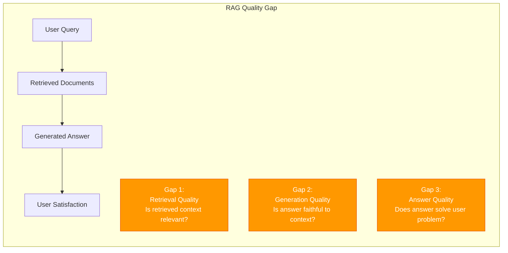
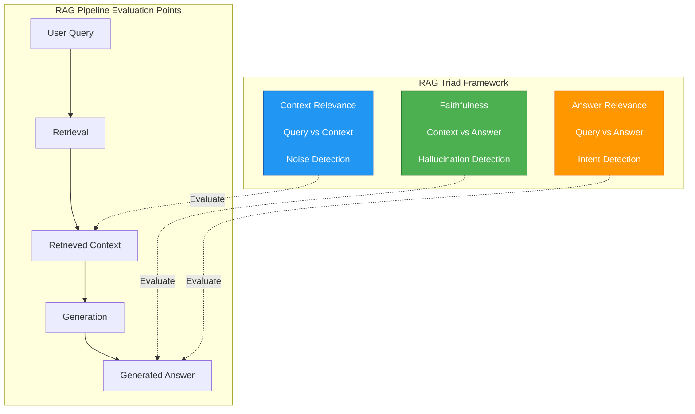
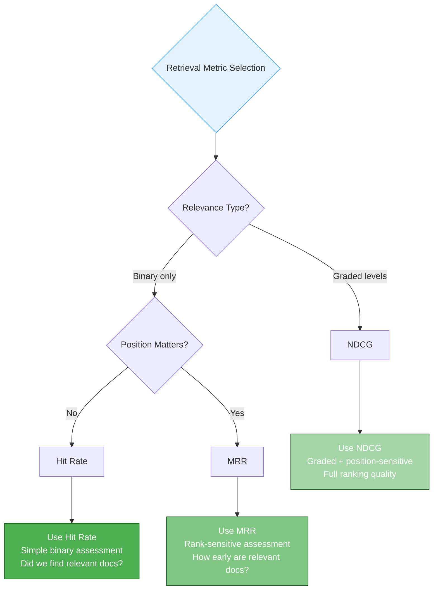
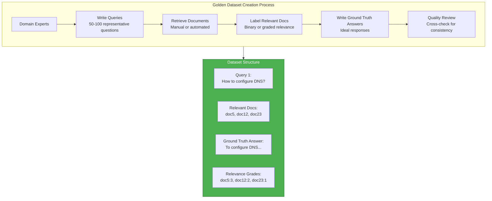
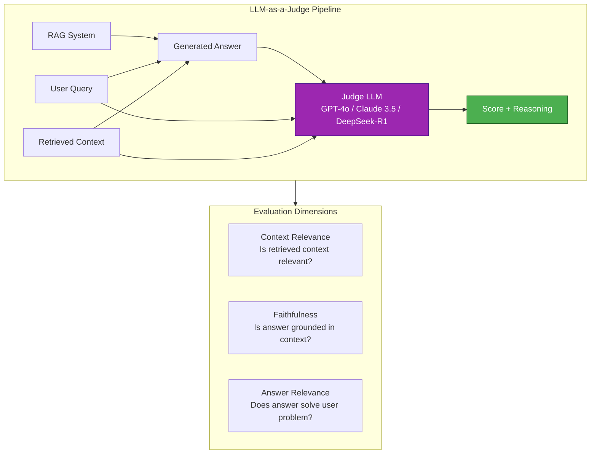
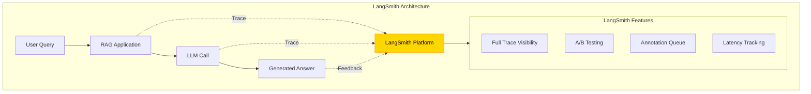
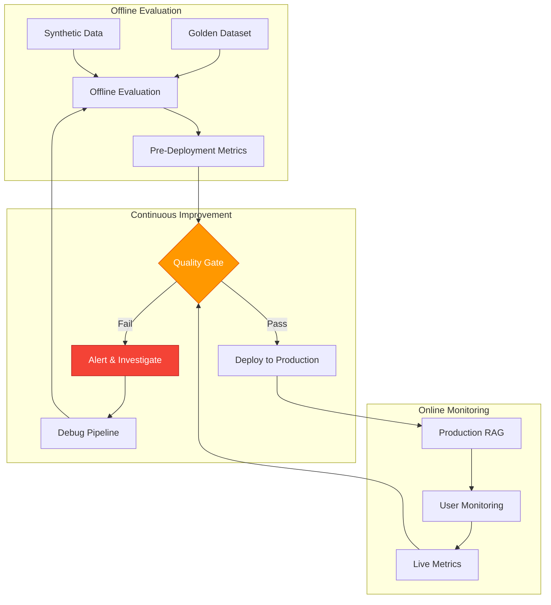

# 6. Evaluation Strategies

> **"Without evaluation, optimization is just guessing."** — RAG Evaluation Principle

This chapter covers the RAG Triad evaluation framework, retrieval and generation metrics, evaluation methodologies (golden datasets, synthetic data, LLM-as-a-judge), and production observability tools.

---

## 6.1 Why Evaluation Matters?

### 6.1.1 The RAG Quality Gap

**The Fundamental Problem**: Retrieved documents are not the final answer, and generated answers may not be faithful or relevant. Without evaluation, you cannot measure or improve RAG system quality.



**The Three Quality Gaps**:

1. **Context Relevance Gap**: Retrieved documents may contain irrelevant information
   - Symptom: LLM receives noisy context
   - Cause: Poor embedding similarity, weak query understanding
   - Impact: Garbage in, garbage out

2. **Faithfulness Gap**: Generated answer may hallucinate beyond retrieved context
   - Symptom: Answer contains facts not in source documents
   - Cause: LLM relies on pre-trained knowledge instead of context
   - Impact: Loss of trust, factual errors

3. **Answer Relevance Gap**: Answer may be faithful but miss the user's intent
   - Symptom: Technically correct but unhelpful answer
   - Cause: Query misunderstanding, incomplete retrieval
   - Impact: User dissatisfaction, system abandonment

### 6.1.2 Production vs Development

**RAG systems degrade over time**. A system that performs well in development often fails in production due to:

| Factor | Development | Production | Impact |
|--------|-------------|------------|--------|
| **Query Distribution** | Curated test queries | Wild, unpredictable queries | Unknown edge cases |
| **Data Freshness** | Static document set | Continuously updated | Stale embeddings |
| **Load** | Low concurrency | High concurrency | Latency-quality trade-offs |
| **User Feedback** | Manual testing | Real-user behavior | Unexpected patterns |

**Real-World Failure Cases**:

1. **Case: Chatbot Hallucination**
   - System: Customer support RAG
   - Issue: Answer invented refund policy not in documents
   - Cause: No faithfulness evaluation deployed
   - Impact: $50K in erroneous refunds

2. **Case: Irrelevant Retrieval**
   - System: Technical documentation Q&A
   - Issue: Retrieved docs for wrong product version
   - Cause: No metadata filtering, poor relevance evaluation
   - Impact: 40% user abandonment rate

3. **Case: Answer Misses Intent**
   - System: Legal document assistant
   - Issue: Faithful but unhelpful answers
   - Cause: No answer relevance evaluation
   - Impact: Lawyers reverted to manual search

**The Evaluation Imperative**:

> **You cannot optimize what you do not measure.**

Evaluation transforms subjective "seems good" assessments into quantifiable metrics that guide optimization.

---

## 6.2 The RAG Triad (Core Framework)

### 6.2.1 Context Relevance

**Definition**: Are retrieved chunks actually relevant to the user's query?

**The Challenge**:
- Retrieval systems return top-k documents by similarity
- Similarity ≠ Relevance (semantic vs pragmatic)
- Irrelevant context adds noise, degrades generation

**Evaluation Question**:
> Given a query and retrieved context, what proportion of the context is actually relevant to answering the query?

**Scoring** (0-1 scale):
```python
# Pseudocode: Context Relevance evaluation
def evaluate_context_relevance(query, retrieved_context):
    """
    Measure context relevance: What fraction of retrieved context is relevant?

    Method: LLM-as-a-judge extracts relevant sentences

    Process:
    1. Prompt LLM: "Extract sentences from context that are relevant to answering the query"
    2. Count relevant sentences vs total sentences
    3. Calculate relevance score

    Returns:
        Context Relevance Score (0-1)
    """
    prompt = f"""
    Query: {query}

    Retrieved Context:
    {retrieved_context}

    Task: Extract sentences from the context that contain information relevant to answering the query.

    Output format:
    - List each relevant sentence
    - Count total sentences in context
    - Calculate relevance fraction
    """

    result = llm_judge.evaluate(prompt)

    # Example output:
    # Relevant sentences: 3 out of 10
    # Context Relevance Score: 0.30

    return result["relevance_score"]
```

**Target Scores**:
- **< 0.5**: Poor - High noise, needs better retrieval/reranking
- **0.5 - 0.7**: Fair - Acceptable but improvable
- **0.7 - 0.9**: Good - Strong retrieval
- **> 0.9**: Excellent - Minimal noise

### 6.2.2 Faithfulness

**Definition**: Is the generated answer grounded in the retrieved context, or does it hallucinate?

**The Challenge**:
- LLMs have pre-trained knowledge that may conflict with context
- LLMs may "improvise" to provide helpful-sounding answers
- Hallucinations are difficult to detect without verification

**Evaluation Question**:
> Given retrieved context and a generated answer, what proportion of claims in the answer are supported by the context?

**Scoring** (0-1 scale):
```python
# Pseudocode: Faithfulness evaluation
def evaluate_faithfulness(generated_answer, retrieved_context):
    """
    Measure faithfulness: What fraction of answer claims are supported by context?

    Method: Claim extraction + verification

    Process:
    1. Extract atomic claims from answer
    2. For each claim, verify if supported in context
    3. Calculate faithfulness = verified_claims / total_claims

    Returns:
        Faithfulness Score (0-1)
    """
    # Step 1: Extract claims
    extract_prompt = f"""
    Generated Answer: {generated_answer}

    Task: Extract atomic factual claims from this answer.

    Example:
    Answer: "AdGuard DNS uses port 53 by default and requires upstream configuration."
    Claims:
    1. AdGuard DNS uses port 53 by default
    2. AdGuard DNS requires upstream configuration

    Output claims as a list.
    """

    claims = llm_judge.extract(extract_prompt)

    # Step 2: Verify each claim
    verified_count = 0
    for claim in claims:
        verify_prompt = f"""
        Claim: {claim}

        Retrieved Context:
        {retrieved_context}

        Task: Determine if this claim is supported by the context.

        Rules:
        - Support: Claim is explicitly stated or directly implied
    - No Support: Claim contradicts context or not mentioned
    - Partial: Claim partially supported but requires external knowledge

        Output: SUPPORTED or NOT_SUPPORTED
        """

        verification = llm_judge.verify(verify_prompt)
        if verification == "SUPPORTED":
            verified_count += 1

    # Step 3: Calculate faithfulness
    faithfulness = verified_count / len(claims)

    return faithfulness
```

**Target Scores**:
- **< 0.7**: Poor - High hallucination risk
- **0.7 - 0.85**: Fair - Some hallucinations
- **0.85 - 0.95**: Good - Mostly faithful
- **> 0.95**: Excellent - Highly faithful

**2025 Insight: Faithfulness is Critical**

Research shows that **faithfulness is the strongest predictor of user trust** in RAG systems. Users prefer "I don't know" over confident hallucinations.

### 6.2.3 Answer Relevance

**Definition**: Does the generated answer actually address the user's question and solve their problem?

**The Challenge**:
- An answer can be faithful (grounded in context) but irrelevant to user intent
- LLMs may answer a different question than what was asked
- Relevance requires understanding user intent, not just semantic similarity

**Evaluation Question**:
> Given the original query and the generated answer, how well does the answer address the user's information need?

**Scoring** (0-1 scale):
```python
# Pseudocode: Answer Relevance evaluation
def evaluate_answer_relevance(query, generated_answer):
    """
    Measure answer relevance: How well does answer address the query?

    Method: LLM-as-a-judge scores + reasoning

    Process:
    1. Prompt LLM judge to rate relevance (1-5 scale)
    2. Require reasoning for score
    3. Convert to 0-1 scale

    Returns:
        Answer Relevance Score (0-1)
    """
    prompt = f"""
    Query: {query}

    Generated Answer: {generated_answer}

    Task: Evaluate how well the answer addresses the query.

    Scoring criteria:
    1 (Poor): Answer does not address the query at all
    2 (Fair): Answer partially addresses but misses key aspects
    3 (Good): Answer adequately addresses the query
    4 (Very Good): Answer comprehensively addresses the query
    5 (Excellent): Answer perfectly addresses the query with complete information

    Output format:
    Score: [1-5]
    Reasoning: [Brief explanation for the score]
    """

    result = llm_judge.evaluate(prompt)

    # Convert 1-5 scale to 0-1
    relevance_score = (result["score"] - 1) / 4

    return relevance_score
```

**Target Scores**:
- **< 0.5**: Poor - Misses user intent
- **0.5 - 0.7**: Fair - Partially helpful
- **0.7 - 0.9**: Good - Addresses most needs
- **> 0.9**: Excellent - Fully satisfies user

### 6.2.4 Triad Integration

The RAG Triad provides a comprehensive view of system quality:



**Composite Score**:

```python
# Pseudocode: RAG Triad composite score
def rag_triad_score(context_relevance, faithfulness, answer_relevance, weights=None):
    """
    Calculate composite RAG quality score

    Default weights (adjustable):
    - Context Relevance: 0.25 (retrieval quality)
    - Faithfulness: 0.5 (most critical - hallucination prevention)
    - Answer Relevance: 0.25 (user satisfaction)
    """
    if weights is None:
        weights = {"context_relevance": 0.25, "faithfulness": 0.5, "answer_relevance": 0.25}

    composite = (
        context_relevance * weights["context_relevance"] +
        faithfulness * weights["faithfulness"] +
        answer_relevance * weights["answer_relevance"]
    )

    return composite
```

**Quality Thresholds**:
- **< 0.6**: Poor - Needs major improvements
- **0.6 - 0.75**: Fair - Functional but needs work
- **0.75 - 0.85**: Good - Production-acceptable
- **> 0.85**: Excellent - High-quality system

---

## 6.3 Retrieval Metrics

### 6.3.1 Hit Rate / Recall@K

**Definition**: In the top-K retrieved documents, does at least one relevant document appear?

**Formula**:
$$
\text{Hit Rate} = \frac{\text{Number of queries with at least one relevant doc in top-K}}{\text{Total number of queries}}
$$

**Use Case**: Binary assessment - did we find anything useful?

```python
# Pseudocode: Hit Rate calculation
def calculate_hit_rate(queries, ground_truth, retrieval_results, k=5):
    """
    Calculate Hit Rate @ K

    Args:
        queries: List of query strings
        ground_truth: Dict mapping query -> set of relevant document IDs
        retrieval_results: Dict mapping query -> list of retrieved doc IDs (ranked)
        k: Top-k to consider

    Returns:
        Hit Rate (0-1)
    """
    hits = 0

    for query in queries:
        retrieved_top_k = retrieval_results[query][:k]
        relevant_docs = ground_truth[query]

        # Check if any retrieved doc is relevant
        if any(doc in relevant_docs for doc in retrieved_top_k):
            hits += 1

    hit_rate = hits / len(queries)

    return hit_rate


# Example
queries = ["How to configure DNS?", "Docker troubleshooting"]
ground_truth = {
    "How to configure DNS?": {"doc1", "doc5", "doc12"},
    "Docker troubleshooting": {"doc3", "doc8"}
}
retrieval_results = {
    "How to configure DNS?": ["doc1", "doc3", "doc5", "doc7", "doc9"],  # Contains relevant doc1, doc5
    "Docker troubleshooting": ["doc2", "doc4", "doc6", "doc10", "doc11"]  # No relevant docs
}

hit_rate_5 = calculate_hit_rate(queries, ground_truth, retrieval_results, k=5)
# Result: 0.5 (1 out of 2 queries hit)
```

**Typical Values**:
- **< 0.6**: Poor - Many queries miss relevant docs
- **0.6 - 0.8**: Good - Most queries find relevant docs
- **> 0.9**: Excellent - Nearly all queries find relevant docs

**Advantages**:
- Simple to calculate and understand
- Binary metric (hit or miss)
- Good for high-level assessment

**Limitations**:
- Doesn't measure rank position (hit at position 1 = hit at position 5)
- Doesn't measure how many relevant docs found
- All-or-nothing (partial credit not given)

### 6.3.2 MRR (Mean Reciprocal Rank)

**Definition**: Average of the reciprocal ranks of the first relevant document.

**Formula**:
$$
\text{MRR} = \frac{1}{|Q|} \sum_{i=1}^{|Q|} \frac{1}{\text{rank}_i}
$$

Where $\text{rank}_i$ is the position of the first relevant document for query $i$.

**Intuition**: Measures "how early" relevant documents appear.

```python
# Pseudocode: MRR calculation
def calculate_mrr(queries, ground_truth, retrieval_results):
    """
    Calculate Mean Reciprocal Rank

    For each query:
    1. Find the rank of the first relevant document
    2. Calculate reciprocal (1/rank)
    3. Average across all queries

    Returns:
        MRR (0-1)
    """
    reciprocal_ranks = []

    for query in queries:
        retrieved = retrieval_results[query]
        relevant_docs = ground_truth[query]

        # Find rank of first relevant document
        for rank, doc in enumerate(retrieved, start=1):
            if doc in relevant_docs:
                reciprocal_ranks.append(1 / rank)
                break
        else:
            # No relevant document found
            reciprocal_ranks.append(0)

    mrr = sum(reciprocal_ranks) / len(reciprocal_ranks)

    return mrr


# Example
queries = ["Query 1", "Query 2", "Query 3"]
ground_truth = {
    "Query 1": {"doc5"},
    "Query 2": {"doc3", "doc8"},
    "Query 3": {"doc1", "doc2"}
}
retrieval_results = {
    "Query 1": ["doc1", "doc2", "doc3", "doc4", "doc5"],  # First relevant at rank 5
    "Query 2": ["doc8", "doc1", "doc2"],                  # First relevant at rank 1
    "Query 3": ["doc5", "doc4", "doc3", "doc2", "doc1"]   # First relevant at rank 4
}

mrr = calculate_mrr(queries, ground_truth, retrieval_results)
# Calculation:
# Query 1: 1/5 = 0.2
# Query 2: 1/1 = 1.0
# Query 3: 1/4 = 0.25
# MRR = (0.2 + 1.0 + 0.25) / 3 = 0.48
```

**Typical Values**:
- **< 0.5**: Poor - Relevant documents appear late
- **0.5 - 0.8**: Good - Relevant documents in top half
- **> 0.95**: Excellent - Relevant documents at rank 1-2

**Why MRR Matters for RAG**:

LLMs pay more attention to documents at the beginning of context. High MRR ensures the most relevant documents appear early, improving generation quality.

**Advantages**:
- Measures rank position (unlike Hit Rate)
- Rewards early relevant documents
- Industry-standard for web search, QA

**Limitations**:
- Only considers first relevant document
- Doesn't reward finding multiple relevant docs
- Sensitive to ranking errors

### 6.3.3 NDCG (Normalized Discounted Cumulative Gain)

**Definition**: Ranking quality assessment that considers:
1. **Relevance grades** (not just binary relevant/not relevant)
2. **Position discount** (early ranks weighted higher)

**Formula**:

**DCG (Discounted Cumulative Gain)**:
$$
\text{DCG}@k = \sum_{i=1}^{k} \frac{2^{\text{rel}_i} - 1}{\log_2(i + 1)}
$$

Where $\text{rel}_i$ is the relevance grade (0-3 or 0-5) for document at position $i$.

**NDCG (Normalized DCG)**:
$$
\text{NDCG}@k = \frac{\text{DCG}@k}{\text{IDCG}@k}
$$

Where IDCG is the DCG of ideal ranking (documents sorted by relevance).

```python
# Pseudocode: NDCG calculation
def calculate_ndcg(queries, ground_truth_relevance, retrieval_results, k=10):
    """
    Calculate NDCG @ K

    Args:
        queries: List of query strings
        ground_truth_relevance: Dict mapping query -> dict of {doc_id: relevance_grade}
                               Relevance grades: 0 (irrelevant), 1 (marginally), 2 (relevant), 3 (highly)
        retrieval_results: Dict mapping query -> list of retrieved doc IDs (ranked)
        k: Top-k to consider

    Returns:
        NDCG @ K (0-1)
    """
    ndcg_scores = []

    for query in queries:
        retrieved = retrieval_results[query][:k]
        relevance = ground_truth_relevance[query]

        # Calculate DCG
        dcg = 0
        for i, doc in enumerate(retrieved, start=1):
            rel = relevance.get(doc, 0)  # Default to 0 if not in ground truth
            dcg += (2**rel - 1) / math.log2(i + 1)

        # Calculate IDCG (ideal ranking)
        ideal_relevances = sorted(relevance.values(), reverse=True)[:k]
        idcg = 0
        for i, rel in enumerate(ideal_relevances, start=1):
            idcg += (2**rel - 1) / math.log2(i + 1)

        # Calculate NDCG
        if idcg > 0:
            ndcg = dcg / idcg
        else:
            ndcg = 0

        ndcg_scores.append(ndcg)

    return sum(ndcg_scores) / len(ndcg_scores)


# Example
ground_truth_relevance = {
    "Query 1": {
        "doc1": 3,  # Highly relevant
        "doc5": 2,  # Relevant
        "doc8": 1,  # Marginally relevant
        "doc3": 0   # Irrelevant
    }
}
retrieval_results = {
    "Query 1": ["doc5", "doc1", "doc8", "doc3", "doc2"]  # Ranked results
}

ndcg_5 = calculate_ndcg(["Query 1"], ground_truth_relevance, retrieval_results, k=5)

# DCG@5 calculation:
# Position 1 (doc5, rel=2): (2^2 - 1) / log2(2) = 3 / 1 = 3.0
# Position 2 (doc1, rel=3): (2^3 - 1) / log2(3) = 7 / 1.585 = 4.42
# Position 3 (doc8, rel=1): (2^1 - 1) / log2(4) = 1 / 2 = 0.5
# Position 4 (doc3, rel=0): (2^0 - 1) / log2(5) = 0 / 2.32 = 0
# Position 5 (doc2, rel=0): (2^0 - 1) / log2(6) = 0 / 2.58 = 0
# DCG@5 = 3.0 + 4.42 + 0.5 = 7.92

# IDCG@5 (ideal ranking: doc1, doc5, doc8, ...):
# Position 1 (rel=3): 7 / 1 = 7.0
# Position 2 (rel=2): 3 / 1.585 = 1.89
# Position 3 (rel=1): 1 / 2 = 0.5
# IDCG@5 = 7.0 + 1.89 + 0.5 = 9.39

# NDCG@5 = 7.92 / 9.39 = 0.84
```

**Typical Values**:
- **< 0.5**: Poor - Ranking needs improvement
- **0.7 - 0.9**: Good - Strong ranking
- **> 0.9**: Excellent - Near-ideal ranking

**When to Use NDCG**:

| Scenario | Use NDCG? | Reason |
|----------|-----------|--------|
| **Graded relevance** (documents have varying usefulness) | Yes | Captures relevance levels |
| **Binary relevance** (relevant/not relevant) | No | Hit Rate or MRR sufficient |
| **Ranking quality critical** (search engines) | Yes | Position-sensitive |
| **Simple RAG systems** | Maybe | Overkill for basic systems |

**Advantages**:
- Captures graded relevance (not just binary)
- Position-sensitive (rewards early relevant docs)
- Normalized (0-1 scale) for comparison

**Limitations**:
- More complex to calculate
- Requires relevance grades (harder to annotate)
- May be overkill for simple RAG systems

### 6.3.4 Metric Selection Guide

Choose the right retrieval metric based on your use case:



**Comparison Table**:

| Metric | Relevance | Position | Complexity | Use Case | RAG Recommendation |
|--------|-----------|----------|------------|----------|-------------------|
| **Hit Rate @ K** | Binary | No | Low | Quick assessment | Start here |
| **MRR** | Binary | Yes | Medium | Rank-sensitive | Default choice |
| **NDCG** | Graded | Yes | High | Full ranking quality | Advanced systems |

**Recommended Strategy**:

1. **Start with Hit Rate @ 5**: Quick assessment of retrieval quality
2. **Add MRR**: Measure rank quality (early documents matter for RAG)
3. **Consider NDCG**: If you have graded relevance data (e.g., user ratings)

**RAG-Specific Considerations**:

For RAG systems, **MRR is often the most practical metric** because:
- LLMs pay most attention to early context
- Binary relevance is easier to annotate than graded
- Captures the "top docs matter most" intuition

---

## 6.4 Generation Metrics

### 6.4.1 Hallucination Rate

**Definition**: Percentage of claims in the generated answer that are NOT supported by the retrieved context.

**The Problem**: Hallucinations are the #1 risk for RAG systems in production.

```python
# Pseudocode: Hallucination Rate calculation
def calculate_hallucination_rate(generated_answer, retrieved_context):
    """
    Calculate hallucination rate

    Hallucination = Claim NOT supported by context

    Returns:
        Hallucination Rate (0-1)
    """
    # Extract claims from answer
    claims = extract_claims(generated_answer)

    # Verify each claim
    hallucinations = 0
    for claim in claims:
        if not is_supported_in_context(claim, retrieved_context):
            hallucinations += 1

    # Calculate rate
    hallucination_rate = hallucinations / len(claims) if claims else 0

    return hallucination_rate


def extract_claims(answer):
    """Extract atomic factual claims from answer"""
    prompt = f"""
    Extract atomic factual claims from this answer.

    Answer: {answer}

    Output each claim as a separate line.
    """
    claims = llm.extract(prompt)
    return claims


def is_supported_in_context(claim, context):
    """Check if claim is supported by context"""
    prompt = f"""
    Claim: {claim}

    Context:
    {context}

    Task: Determine if the claim is supported by the context.

    Rules:
    - SUPPORTED: Claim explicitly stated or directly implied
    - NOT_SUPPORTED: Claim contradicts context or not mentioned

    Output: SUPPORTED or NOT_SUPPORTED
    """
    result = llm_judge.verify(prompt)
    return result == "SUPPORTED"
```

**Target Rates**:
- **> 10%**: Critical - High hallucination risk, not production-ready
- **5 - 10%**: Moderate - Acceptable for non-critical applications
- **< 5%**: Strict - Required for critical domains (medical, legal, financial)
- **< 1%**: Excellent - Near-perfect faithfulness

**Detection Methods**:

| Method | Accuracy | Cost | Speed | Best For |
|--------|----------|------|-------|----------|
| **LLM-as-a-Judge** | High | High ($0.01-0.05/eval) | Medium | Accuracy-critical |
| **NLI Models** (DeBERTa-v3) | Medium-High | Low | Fast | Cost-effective |
| **Rule-Based** (keyword matching) | Low | Very Low | Very Fast | Quick screening |

**Mitigation Strategies**:

1. **Defensive Prompting**: Explicitly instruct LLM to refuse when context insufficient
2. **Citation Requirements**: Require `[Doc N]` for every claim
3. **Post-Generation Verification**: Run faithfulness check before returning answer
4. **Confidence Thresholds**: Reject low-confidence answers

### 6.4.2 Correctness (Fact Accuracy)

**Definition**: Semantic similarity between generated answer and ground truth answer.

**Requires**: Golden dataset with standard answers for queries.

```python
# Pseudocode: Correctness evaluation
def evaluate_correctness(generated_answer, ground_truth_answer):
    """
    Evaluate correctness via semantic similarity

    Methods:
    1. BERTScore: Modern, semantic similarity
    2. Cosine Similarity: Embedding-based
    3. BLEU/ROUGE: Legacy n-gram overlap (not recommended)

    Returns:
        Correctness Score (0-1)
    """
    # Method 1: BERTScore (recommended)
    from bert_score import score

    P, R, F1 = score(
        [generated_answer],
        [ground_truth_answer],
        lang="en",
        model_type="microsoft/deberta-v3-large"
    )

    bertscore = F1.item()

    # Method 2: Cosine similarity (alternative)
    gen_embedding = embed(generated_answer)
    gt_embedding = embed(ground_truth_answer)
    cosine_sim = cosine_similarity(gen_embedding, gt_embedding)

    # Use BERTScore as primary
    return bertscore
```

**Metrics Comparison**:

| Metric | Type | Era | Pros | Cons | RAG Use |
|--------|------|-----|------|------|---------|
| **BERTScore** | Semantic similarity | Modern | Context-aware, accurate | Slower | Recommended |
| **Cosine Similarity** | Embedding-based | Modern | Fast, simple | Misses nuances | Good alternative |
| **BLEU** | N-gram overlap | Legacy | Fast, interpretable | Misses semantics | Not recommended |
| **ROUGE** | N-gram overlap | Legacy | Good for summaries | Misses semantics | Not recommended |

**Target Scores** (BERTScore):
- **< 0.7**: Poor - Low semantic overlap
- **0.7 - 0.85**: Good - Semantic similarity
- **> 0.85**: Excellent - High semantic match

**Limitations**:

**Correctness metrics require golden datasets**, which are expensive to create. For many RAG systems, **faithfulness (hallucination rate) is more practical** because it doesn't require ground truth answers.

### 6.4.3 Conciseness & Coherence

**Conciseness**: Information density - how much useful information per token.

**Coherence**: Logical flow and readability of the answer.

```python
# Pseudocode: Conciseness evaluation
def evaluate_conciseness(generated_answer, retrieved_context):
    """
    Evaluate conciseness: Information density

    Metrics:
    1. Answer length (token count)
    2. Information density (unique information / length)
    3. Redundancy (repeated information)

    Returns:
        Conciseness Score (0-1) + reasoning
    """
    prompt = f"""
    Generated Answer:
    {generated_answer}

    Retrieved Context:
    {retrieved_context}

    Task: Evaluate the conciseness of the answer.

    Criteria:
    1. Does the answer contain unnecessary information?
    2. Is the answer appropriately detailed or overly verbose?
    3. Does the answer repeat information?

    Score (1-5):
    1 - Extremely verbose, lots of filler
    2 - Verbose, some unnecessary content
    3 - Appropriate length
    4 - Concise, high information density
    5 - Extremely concise, no wasted words

    Output format:
    Score: [1-5]
    Reasoning: [Brief explanation]
    """

    result = llm_judge.evaluate(prompt)

    # Convert to 0-1 scale
    conciseness = (result["score"] - 1) / 4

    return conciseness


# Pseudocode: Coherence evaluation
def evaluate_coherence(generated_answer):
    """
    Evaluate coherence: Logical flow and readability

    Criteria:
    1. Logical structure (intro, body, conclusion)
    2. Sentence transitions
    3. Grammatical correctness
    4. Clarity

    Returns:
        Coherence Score (0-1)
    """
    prompt = f"""
    Generated Answer:
    {generated_answer}

    Task: Evaluate the coherence of the answer.

    Criteria:
    1. Logical flow and structure
    2. Clear sentence transitions
    3. Grammatical correctness
    4. Readability and clarity

    Score (1-5):
    1 - Incoherent, hard to follow
    2 - Poor structure, confusing
    3 - Acceptable structure
    4 - Well-structured, clear
    5 - Excellent flow, highly readable

    Output format:
    Score: [1-5]
    Reasoning: [Brief explanation]
    """

    result = llm_judge.evaluate(prompt)

    # Convert to 0-1 scale
    coherence = (result["score"] - 1) / 4

    return coherence
```

**Target Scores**:
- **Conciseness**: > 0.7 (appropriately detailed, not verbose)
- **Coherence**: > 0.8 (well-structured, readable)

**Quality Scorecard**:

```python
# Pseudocode: Generation quality scorecard
def generation_scorecard(generated_answer, retrieved_context, ground_truth=None):
    """
    Comprehensive generation quality assessment

    Metrics:
    1. Hallucination Rate (inverse: faithfulness)
    2. Correctness (if ground truth available)
    3. Conciseness
    4. Coherence
    """
    hallucination_rate = calculate_hallucination_rate(generated_answer, retrieved_context)
    faithfulness = 1 - hallucination_rate

    conciseness = evaluate_conciseness(generated_answer, retrieved_context)
    coherence = evaluate_coherence(generated_answer)

    scorecard = {
        "faithfulness": faithfulness,
        "conciseness": conciseness,
        "coherence": coherence,
        "overall": (faithfulness * 0.6 + conciseness * 0.2 + coherence * 0.2)
    }

    if ground_truth:
        correctness = evaluate_correctness(generated_answer, ground_truth)
        scorecard["correctness"] = correctness
        scorecard["overall"] = (
            faithfulness * 0.5 +
            correctness * 0.3 +
            conciseness * 0.1 +
            coherence * 0.1
        )

    return scorecard
```

---

## 6.5 Evaluation Methodologies

### 6.5.1 Golden Dataset

**What**: Curated set of high-quality query-context-answer triples created by domain experts.

**Components**:
1. **Queries**: Real user questions or representative queries
2. **Ground Truth Context**: Relevant document IDs for each query
3. **Ground Truth Answers**: Ideal answers (for correctness evaluation)
4. **Relevance Labels**: Document relevance grades (for NDCG)



**Process**:

```python
# Pseudocode: Golden dataset creation
def create_golden_dataset(documents, num_queries=100):
    """
    Create golden dataset for RAG evaluation

    Process:
    1. Expert curates diverse queries
    2. For each query, retrieve candidate documents
    3. Expert labels relevant documents
    4. Expert writes ground truth answer
    5. Store as evaluation dataset
    """
    golden_dataset = []

    for i in range(num_queries):
        # Step 1: Expert writes query
        query = expert.write_query(topic=select_topic(documents))

        # Step 2: Retrieve candidates
        candidates = retrieval_system.search(query, top_k=20)

        # Step 3: Expert labels relevance
        relevant_docs = []
        for doc in candidates:
            relevance = expert.label_relevance(query, doc)  # 0-3 scale
            if relevance > 0:
                relevant_docs.append({
                    "doc_id": doc.id,
                    "relevance": relevance
                })

        # Step 4: Expert writes ground truth answer
        ground_truth_answer = expert.write_answer(query, relevant_docs)

        # Step 5: Store
        golden_dataset.append({
            "query": query,
            "relevant_docs": relevant_docs,
            "ground_truth_answer": ground_truth_answer
        })

    return golden_dataset
```

**Pros**:
- Highest accuracy (gold standard)
- Enables correctness evaluation
- Reliable benchmark for optimization
- Domain expert knowledge captured

**Cons**:
- Expensive ($50-200 per query for expert time)
- Time-consuming (weeks to months)
- Requires domain experts
- May not cover all edge cases
- Static (doesn't evolve with data)

**Best For**:
- Critical systems (medical, legal, financial)
- Regulatory compliance (audit trails)
- Benchmark optimization (A/B testing)
- High-stakes applications

**Dataset Size Guidelines**:

| Application | Recommended Size | Reason |
|-------------|-----------------|--------|
| **Rapid Prototyping** | 20-50 queries | Quick feedback |
| **Development** | 50-100 queries | Balance coverage vs effort |
| **Production** | 100-500 queries | Comprehensive coverage |
| **Regulatory** | 500-1000+ queries | Extensive validation |

### 6.5.2 Synthetic Data Generation

**What**: Use LLMs to automatically generate query-context-answer triples from documents.

```python
# Pseudocode: Synthetic dataset generation
def generate_synthetic_dataset(documents, num_queries=100):
    """
    Generate synthetic evaluation dataset using LLM

    Tools:
    - LlamaIndex RagDatasetGenerator
    - Ragas Synthesizer
    - Custom LLM-based generation
    """
    from llama_index.evaluation import RagDatasetGenerator

    # Configure generator
    generator = RagDatasetGenerator(
        documents=documents,
        llm=llm_generator,
        num_questions_per_doc=5,  # Generate 5 questions per document
        question_types=[  # Diverse question types
            "factual",
            "comparative",
            "procedural",
            "troubleshooting"
        ]
    )

    # Generate dataset
    synthetic_dataset = generator.generate()

    return synthetic_dataset


# Pseudocode: Custom generation with quality control
def generate_synthetic_qa(doc_chunk, num_variants=3):
    """
    Generate question-answer pairs from a document chunk

    Generates diverse question types:
    1. Factual: What is X?
    2. Procedural: How do I do X?
    3. Comparative: What is the difference between X and Y?
    """
    prompt = f"""
    Document:
    {doc_chunk.content}

    Task: Generate {num_variants} diverse question-answer pairs based on this document.

    Question types to include:
    1. Factual question (What is...?)
    2. Procedural question (How do I...?)
    3. Troubleshooting question (Why does X...?)

    Output format:
    Q1: [question]
    A1: [answer based on document]

    Q2: ...
    A2: ...
    """

    result = llm.generate(prompt)

    # Parse Q&A pairs
    qa_pairs = parse_qa_pairs(result)

    # Quality control: verify answer uses document content
    verified_pairs = []
    for qa in qa_pairs:
        if verify_uses_document(qa["answer"], doc_chunk.content):
            verified_pairs.append(qa)

    return verified_pairs
```

**Tools**:

| Tool | Features | Pros | Cons |
|------|----------|------|------|
| **LlamaIndex RagDatasetGenerator** | Auto-generates diverse Q&A | Easy to use, integrated | Limited customization |
| **Ragas Synthesizer** | Evolving questions, multi-hop | Advanced patterns | Slower generation |
| **Custom LLM-based** | Full control | Tailored to domain | Requires engineering |

**Pros**:
- Fast (minutes to hours vs weeks)
- Scalable (generate 1000+ queries)
- Inexpensive (API costs only)
- Covers diverse patterns
- Easy to update as documents change

**Cons**:
- May miss edge cases (LLM has same biases)
- Quality varies (needs verification)
- Not truly representative of user queries
- May lack nuance of real questions

**Best Practices**:

1. **Hybrid Approach**: Combine synthetic data with smaller golden dataset
   - Synthetic: 80% of data (breadth)
   - Golden: 20% of data (depth, critical cases)

2. **Quality Control**:
   - Filter out low-quality generations
   - Verify answers are grounded in documents
   - Sample and review manually (10-20% spot check)

3. **Diversity**:
   - Generate multiple question types
   - Vary complexity (simple → multi-hop)
   - Cover different document sections

**Best For**:
- Rapid prototyping (quick feedback)
- Initial evaluation (before golden dataset)
- Regression testing (catching degradation)
- Complement to golden dataset (breadth)

### 6.5.3 LLM-as-a-Judge

**Concept**: Use a stronger LLM (GPT-4o, Claude 3.5, DeepSeek-R1) to evaluate the outputs of a RAG system.



**Prompt Engineering for Judges**:

```python
# Pseudocode: LLM-as-a-Judge prompt template
def judge_faithfulness(query, retrieved_context, generated_answer):
    """
    Use strong LLM to judge faithfulness

    Key prompt elements:
    1. Clear evaluation criteria
    2. Scoring rubric
    3. Required reasoning
    4. Output format
    """
    prompt = f"""
    You are an expert evaluator for RAG systems.

    Query: {query}

    Retrieved Context:
    {retrieved_context}

    Generated Answer:
    {generated_answer}

    Task: Evaluate the faithfulness of the generated answer.

    Faithfulness Definition: The answer should be grounded in the retrieved context.
    - All factual claims should be supported by context
    - No hallucinations or external knowledge
    - Conflicting information should be acknowledged

    Evaluation Criteria:
    1. Extract factual claims from the answer
    2. Verify each claim against the context
    3. Calculate faithfulness score

    Scoring Rubric:
    1 (Poor): More than 25% of claims are unsupported
    2 (Fair): 10-25% of claims are unsupported
    3 (Good): 5-10% of claims are unsupported
    4 (Very Good): 1-5% of claims are unsupported
    5 (Excellent): Less than 1% of claims are unsupported

    Output Format:
    Score: [1-5]
    Reasoning: [List each claim and whether it's supported. Calculate percentage and explain score.]
    Unsupported Claims: [List any hallucinations]
    """

    result = judge_llm.evaluate(prompt)

    # Parse and normalize score to 0-1
    score = (result["score"] - 1) / 4

    return {
        "score": score,
        "reasoning": result["reasoning"],
        "unsupported_claims": result["unsupported_claims"]
    }
```

**Judge LLM Selection**:

| Judge LLM | Quality | Cost | Speed | Best For |
|-----------|---------|------|-------|----------|
| **GPT-4o** | Very High | High ($0.01-0.05/eval) | Medium | Accuracy-critical |
| **Claude 3.5 Sonnet** | Very High | High | Medium | Nuanced reasoning |
| **DeepSeek-R1** | High | Low ($0.001-0.005/eval) | Fast | Cost-effective |
| **GPT-4o-mini** | Medium-High | Low | Fast | High-volume evaluation |

**Cost Calculation**:

```python
# Example: Evaluate 1000 queries with GPT-4o
num_queries = 1000
cost_per_eval = 0.02  # $0.02 per evaluation (faithfulness + relevance + answer relevance)

total_cost = num_queries * cost_per_eval
print(f"Total cost: ${total_cost}")
# Output: Total cost: $20

# For ongoing monitoring (1000 queries/day):
daily_cost = 1000 * 0.02
monthly_cost = daily_cost * 30
print(f"Monthly cost: ${monthly_cost}")
# Output: Monthly cost: $600
```

**Advantages**:
- Scalable (evaluate thousands of outputs)
- Consistent (same judge for all evaluations)
- Explainable (reasoning provided)
- Flexible (evaluate any dimension)

**Disadvantages**:
- Expensive for high-volume systems
- Judge bias (judge LLM's preferences)
- Not perfect (judge can make mistakes)
- Requires prompt engineering

**Best Practices**:

1. **Use Strong Judge**: GPT-4o or Claude 3.5 for accuracy
2. **Require Reasoning**: Forces judge to explain scores
3. **Calibrate**: Validate judge scores against human labels
4. **Batch Evaluation**: Process multiple queries in parallel
5. **Cache Results**: Don't re-evaluate identical queries

**Best For**:
- Continuous monitoring (production systems)
- A/B testing (compare retrieval strategies)
- Human-in-the-loop (assist human annotators)
- Automated regression testing

---

## 6.6 Tools & Observability

### 6.6.1 Ragas Framework

**Ragas** is the industry standard for RAG evaluation, implementing the RAG Triad metrics.

**Core Features**:
- RAG Triad evaluation (Context Relevance, Faithfulness, Answer Relevance)
- Synthetic data generation
- LLM-as-a-judge framework
- LangChain and LlamaIndex integration

```python
# Pseudocode: Ragas evaluation
from ragas import evaluate
from ragas.metrics import (
    context_relevance,
    faithfulness,
    answer_relevance
)

# Prepare evaluation dataset
eval_dataset = [
    {
        "question": "How do I configure AdGuard DNS?",
        "contexts": [["Doc 1 content", "Doc 2 content", "Doc 3 content"]],
        "answer": "To configure AdGuard DNS...",
        "ground_truth": "AdGuard DNS configuration requires..."  # Optional
    },
    # ... more samples
]

# Run evaluation
result = evaluate(
    eval_dataset,
    metrics=[
        context_relevance,
        faithfulness,
        answer_relevance
    ]
)

# Result:
# {
#     "context_relevance": 0.82,
#     "faithfulness": 0.91,
#     "answer_relevance": 0.78,
#     "ragas_score": 0.84  # Weighted average
# }

print(result)
```

**Synthetic Data Generation**:

```python
# Pseudocode: Ragas synthetic data
from ragas.testset import TestsetGenerator

generator = TestsetGenerator(
    documents=documents,
    llm=generator_llm,  # GPT-4o for generation
    embedding_model=embedding_model
)

# Generate diverse question types
testset = generator.generate(
    num_questions=100,
    question_types=[
        "factual",
        "procedural",
        "comparative",
        "multi-hop"
    ]
)

# Output: Dataset with queries, ground truth contexts, ground truth answers
testset.to_csv("ragas_testset.csv")
```

**Advantages**:
- Comprehensive RAG Triad implementation
- Active development and community
- Well-documented
- Framework integrations

**Best For**:
- Comprehensive RAG evaluation (all triad metrics)
- Teams starting with RAG evaluation
- Research and experimentation

### 6.6.2 DeepEval

**DeepEval** takes a PyTest-style approach to LLM testing, treating RAG evaluation like unit tests.

**Core Features**:
- PyTest-style assertions
- CI/CD integration
- Regression testing
- Pre-built metrics (RAG Triad, toxicity, bias)

```python
# Pseudocode: DeepEval testing
from deepeval import assert_test
from deepeval.metrics import FaithfulnessMetric, AnswerRelevancyMetric

def test_rag_faithfulness():
    # Define RAG input
    query = "How do I configure AdGuard DNS?"
    retrieved_context = ["Doc 1: AdGuard configuration...", "Doc 2: DNS settings..."]
    generated_answer = "To configure AdGuard DNS, edit the config file..."

    # Create metric
    faithfulness_metric = FaithfulnessMetric(
        threshold=0.85,  # Fail if below 0.85
        model="gpt-4o"
    )

    # Assert test passes
    assert_test(
        query=query,
        context=retrieved_context,
        answer=generated_answer,
        metric=faithfulness_metric
    )

# Run with pytest
# $ pytest test_rag.py
```

**CI/CD Integration**:

```yaml
# .github/workflows/rag_eval.yml
name: RAG Evaluation

on: [push, pull_request]

jobs:
  eval:
    runs-on: ubuntu-latest
    steps:
      - uses: actions/checkout@v2
      - name: Install dependencies
        run: pip install deepeval
      - name: Run RAG tests
        run: pytest tests/rag_tests/ --verbose
      - name: Upload results
        uses: actions/upload-artifact@v2
        with:
          name: eval-results
          path: deepeval-results.json
```

**Advantages**:
- Familiar testing workflow (PyTest)
- CI/CD integration
- Regression detection (fail on quality drop)
- Extensible (custom metrics)

**Best For**:
- Development workflow (test-driven RAG)
- CI/CD pipelines (quality gates)
- Teams familiar with unit testing
- Regression testing

### 6.6.3 TruLens

**TruLens** (by TruEra) focuses on trace-based evaluation with feedback functions.

**Core Features**:
- Feedback functions (custom evaluation logic)
- Trace exploration (inspect RAG pipeline)
- RAG Triad metrics
- Experiment tracking

```python
# Pseudocode: TruLens evaluation
from trulens_eval import Tru, Feedback, Select
from trulens_eval.feedback import Groundedness

# Initialize TruLens
tru = Tru()

# Define feedback functions
grounded = Groundedness(groundedness_provider=OpenAI())
context_relevance = Feedback(
    provider.openai.context_relevance,
    "Context Relevance"
)
answer_relevance = Feedback(
    provider.openai.relevance,
    "Answer Relevance"
)

# Wrap RAG application
from trulens_eval import TruLlama
tru_rag = TruLlama(
    rag_application,
    app_id="RAG v1.0",
    feedbacks=[grounded, context_relevance, answer_relevance]
)

# Run evaluation with queries
with tru_rag as recording:
    response = rag_application.query("How do I configure DNS?")

# Explore results
tru.run_dashboard()
```

**Advantages**:
- Trace exploration (debugging)
- Custom feedback functions
- Research-friendly
- Visual dashboard

**Best For**:
- Research and experimentation
- Debugging RAG pipelines
- Custom evaluation logic
- Teams needing trace inspection

### 6.6.4 Online Monitoring Tools

**LangSmith** (by LangChain):



**Features**:
- Full pipeline tracing (retrieval → generation)
- A/B testing (compare prompt versions)
- Annotation queue (human feedback)
- Latency and token usage tracking

```python
# Pseudocode: LangSmith integration
from langsmith import traceable

@traceable(name="rag_query")
def rag_application(query: str) -> str:
    # Retrieval
    docs = retriever.search(query, top_k=5)

    # Generation
    prompt = build_prompt(query, docs)
    answer = llm.generate(prompt)

    return answer

# All queries automatically traced in LangSmith
answer = rag_application("How do I configure DNS?")
```

**Arize Phoenix**:

**Features**:
- Open-source observability
- Trace explorer
- Vector visualization (embedding space)
- LLM tracing

```python
# Pseudocode: Phoenix integration
import phoenix as px

# Launch Phoenix UI
px.launch_app()

# Instrument LangChain or LlamaIndex
from phoenix.trace.langchain import LangchainInstrumentor

LangchainInstrumentor().instrument()

# Run RAG application
answer = rag_application("How do I configure DNS?")

# View traces in Phoenix UI
# http://localhost:6006
```

**Comparison**:

| Tool | Type | Strengths | Cost | Best For |
|------|------|-----------|------|----------|
| **LangSmith** | SaaS | LangChain integration, A/B testing | Paid | LangChain users |
| **Arize Phoenix** | Open-source | Free, vector visualization | Free | Open-source preference |
| **Weights & Biases** | SaaS | Experiment tracking, ML-focused | Paid | ML teams |
| **Helicone** | SaaS | LLM API proxy, simple setup | Paid | API monitoring |

### 6.6.5 Production Monitoring Strategy

**Comprehensive Monitoring Architecture**:



**Offline Evaluation** (Pre-Deployment):

```python
# Pseudocode: Offline evaluation pipeline
def offline_evaluation_pipeline(rag_system, test_dataset):
    """
    Comprehensive offline evaluation before deployment

    Metrics:
    1. Retrieval: Hit Rate, MRR, NDCG
    2. Generation: Faithfulness, Answer Relevance
    3. RAG Triad: Context Relevance, Faithfulness, Answer Relevance
    """
    results = {}

    # Retrieval metrics
    results["hit_rate_5"] = calculate_hit_rate(
        test_dataset["queries"],
        test_dataset["ground_truth_docs"],
        rag_system.retrieval_results,
        k=5
    )

    results["mrr"] = calculate_mrr(
        test_dataset["queries"],
        test_dataset["ground_truth_docs"],
        rag_system.retrieval_results
    )

    # Generation metrics
    results["faithfulness"] = evaluate_faithfulness_batch(
        test_dataset["answers"],
        test_dataset["contexts"]
    )

    results["answer_relevance"] = evaluate_answer_relevance_batch(
        test_dataset["queries"],
        test_dataset["answers"]
    )

    # RAG Triad (using Ragas)
    triad_results = ragas_evaluate(test_dataset)
    results.update(triad_results)

    # Quality gate
    quality_gate = {
        "hit_rate_5": 0.7,
        "mrr": 0.8,
        "faithfulness": 0.9,
        "answer_relevance": 0.8
    }

    passed = all(
        results.get(metric, 0) >= threshold
        for metric, threshold in quality_gate.items()
    )

    return {"results": results, "passed": passed}
```

**Online Monitoring** (Post-Deployment):

```python
# Pseudocode: Online monitoring
def online_monitoring(rag_system, production_queries):
    """
    Monitor production RAG system

    Metrics:
    1. User feedback (thumbs up/down)
    2. Latency (p50, p95, p99)
    3. Token usage (cost tracking)
    4. Error rates (LLM failures, retrieval failures)
    """
    metrics = {
        "user_satisfaction": [],
        "latency_ms": [],
        "token_usage": [],
        "errors": {"llm": 0, "retrieval": 0}
    }

    for query in production_queries:
        start_time = time.time()

        try:
            answer = rag_system.query(query)

            latency = (time.time() - start_time) * 1000
            metrics["latency_ms"].append(latency)

            # Collect user feedback
            if "user_feedback" in query:
                metrics["user_satisfaction"].append(query["user_feedback"])

        except LLMError:
            metrics["errors"]["llm"] += 1
        except RetrievalError:
            metrics["errors"]["retrieval"] += 1

    # Calculate aggregates
    report = {
        "avg_latency": np.mean(metrics["latency_ms"]),
        "p95_latency": np.percentile(metrics["latency_ms"], 95),
        "satisfaction_rate": np.mean(metrics["user_satisfaction"]),
        "error_rate": sum(metrics["errors"].values()) / len(production_queries)
    }

    return report
```

**Continuous Improvement Loop**:

1. **Offline Evaluation**: Test new features before deployment
2. **Online Monitoring**: Track production metrics
3. **Quality Gates**: Block deployment if quality drops
4. **Alerting**: Notify when metrics degrade
5. **A/B Testing**: Compare retrieval strategies
6. **Feedback Collection**: Gather user ratings
7. **Iteration**: Optimize based on insights

**Alerting Thresholds**:

```python
# Pseudocode: Quality alerting
def check_quality_alerts(online_metrics, baseline_metrics, threshold=0.1):
    """
    Check if production quality degraded

    Alert if:
    - Faithfulness dropped > 10% from baseline
    - Answer relevance dropped > 10%
    - User satisfaction dropped > 10%
    - Error rate increased > 2x
    """
    alerts = []

    # Check faithfulness
    if online_metrics["faithfulness"] < baseline_metrics["faithfulness"] * (1 - threshold):
        alerts.append({
            "severity": "HIGH",
            "metric": "faithfulness",
            "current": online_metrics["faithfulness"],
            "baseline": baseline_metrics["faithfulness"]
        })

    # Check error rate
    if online_metrics["error_rate"] > baseline_metrics["error_rate"] * 2:
        alerts.append({
            "severity": "CRITICAL",
            "metric": "error_rate",
            "current": online_metrics["error_rate"],
            "baseline": baseline_metrics["error_rate"]
        })

    # Send alerts
    for alert in alerts:
        send_alert(
            message=f"Quality degradation detected: {alert['metric']}",
            severity=alert["severity"],
            details=alert
        )

    return alerts
```

---

## Summary

### Key Takeaways

**1. The RAG Triad Framework**:
- ✅ **Context Relevance**: Retrieved context quality (noise detection)
- ✅ **Faithfulness**: Answer grounded in context (hallucination detection)
- ✅ **Answer Relevance**: Answer addresses user intent (satisfaction detection)
- ✅ Composite score guides optimization priorities

**2. Retrieval Metrics**:
- ✅ **Hit Rate @ K**: Binary assessment (found or not)
- ✅ **MRR**: Rank-sensitive (how early relevant docs appear)
- ✅ **NDCG**: Graded relevance (full ranking quality)
- ✅ MRR is most practical for RAG (early context matters)

**3. Generation Metrics**:
- ✅ **Hallucination Rate**: Claims not supported by context (< 5% target)
- ✅ **Correctness**: Semantic similarity with ground truth (BERTScore)
- ✅ **Conciseness & Coherence**: Information density and readability
- ✅ Faithfulness is critical for user trust

**4. Evaluation Methodologies**:
- ✅ **Golden Dataset**: High accuracy, expensive (critical systems)
- ✅ **Synthetic Data**: Fast, scalable, inexpensive (prototyping, breadth)
- ✅ **LLM-as-a-Judge**: Scalable, consistent, explainable (monitoring)
- ✅ Hybrid approach: Synthetic (80%) + Golden (20%)

**5. Tools & Observability**:
- ✅ **Ragas**: Industry standard, RAG Triad implementation
- ✅ **DeepEval**: PyTest-style, CI/CD integration
- ✅ **TruLens**: Trace-based, custom feedback functions
- ✅ **LangSmith/Phoenix**: Online monitoring, A/B testing
- ✅ **Production Strategy**: Offline eval → Online monitor → Continuous improvement

**6. Best Practices**:
- ✅ Start with Hit Rate and MRR for retrieval
- ✅ Prioritize faithfulness (hallucination prevention)
- ✅ Use hybrid dataset (synthetic + golden)
- ✅ Implement quality gates before deployment
- ✅ Monitor production metrics continuously
- ✅ Set up alerting for quality degradation

### Further Reading

**Research Papers**:
- [RAGAS: Automated Evaluation of RAG Systems](https://arxiv.org/abs/2309.15217) (2023)
- [Evaluation Frameworks for RAG Systems](https://arxiv.org/abs/2401.06532) (2024)
- [LLM-as-a-Judge: A Comprehensive Survey](https://arxiv.org/abs/2406.16762) (2024)

**Tools & Documentation**:
- [Ragas Documentation](https://docs.ragas.io/)
- [DeepEval Documentation](https://docs.confident-ai.com/)
- [TruLens Documentation](https://www.trulens.org/)
- [LangSmith Documentation](https://docs.smith.langchain.com/)
- [Arize Phoenix Documentation](https://docs.arize.com/phoenix)

**Implementation Guides**:
- [Building a RAG Evaluation Pipeline](https://www.anthropic.com/index/evaluating-rag)
- [RAG Evaluation Best Practices](https://www.llamaindex.ai/blog/evaluating-rag)

---

**Next Steps**:
- 📖 Review [RAG Fundamentals](/ai/rag/introduction) for system architecture
- 📖 Study [Retrieval Strategies](/ai/rag/retrieval) to improve retrieval quality
- 💻 Implement Ragas evaluation for your RAG system
- 🔧 Set up production monitoring with LangSmith or Phoenix
- 📊 Create a golden dataset for your domain (start with 50 queries)
