# 7. Advanced RAG Techniques

> **"The future of RAG is not retrieval alone, but adaptive intelligence that knows when to retrieve, how to reason, and what to optimize."** — Advanced RAG Principle

This chapter covers frontier RAG techniques that solve specific production challenges: modular architectures (dynamic routing, iterative retrieval), knowledge graph integration (GraphRAG), agentic systems (Self-RAG, Corrective RAG), fine-tuning fusion (domain adaptation, RAFT), and performance optimization (caching, quantization).

---

## 7.1 RAG Challenges & Decision Matrix

### 7.1.1 The Production Gap

Basic RAG systems suffer from fundamental limitations in production environments:

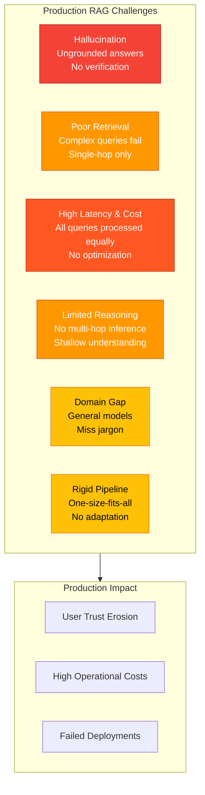

**The Six Fundamental Challenges**:

| Challenge | Symptom | Root Cause | Impact |
|-----------|---------|------------|--------|
| **Hallucination** | Answer invents facts not in documents | LLM relies on pre-training instead of context | Loss of trust, legal risk |
| **Poor Retrieval Accuracy** | Retrieved documents miss key information | Single-hop vector search insufficient | Incomplete answers |
| **High Latency & Cost** | Slow responses, expensive API calls | All queries get full processing | Poor UX, budget overruns |
| **Limited Reasoning Depth** | Cannot connect multiple facts | No multi-hop inference | Shallow answers |
| **Domain Adaptation Gap** | General embeddings miss domain jargon | Models trained on general corpus | Poor retrieval in specialized fields |
| **Rigid Linear Pipeline** | Simple and complex queries treated equally | Fixed retrieve-then-generate flow | Inefficiency, wasted compute |

### 7.1.2 Decision Matrix

Which technique solves which problem?

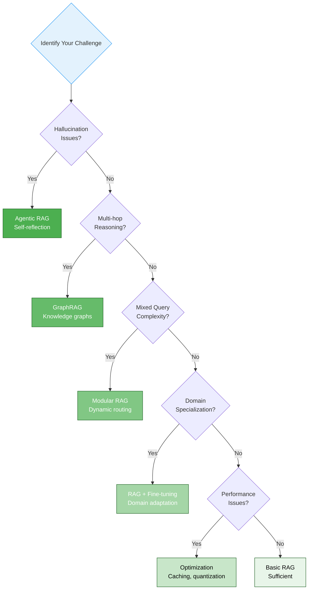

**Comprehensive Decision Matrix**:

| Problem | Primary Solution | Production Readiness | Complexity | Expected Improvement | Use Case |
|---------|-----------------|---------------------|------------|---------------------|----------|
| **Static pipeline inefficiency** | Modular RAG | High | Medium | 30-40% cost reduction | Mixed query complexity |
| **Multi-hop reasoning failure** | GraphRAG | Very High | High | 2-3x MRR improvement | Complex relationships |
| **Hallucination** | Agentic RAG | Medium-High | High | 15-20% accuracy gain | Accuracy-critical apps |
| **Domain knowledge gap** | RAG + Fine-tuning | High | Very High | 20-30% domain QA gain | Specialized domains |
| **Performance/cost issues** | Optimization | Very High | Low-Medium | 90% latency reduction | All production systems |
| **Low retrieval precision** | Hybrid (Modular + Graph) | Medium | Very High | Combined benefits | Enterprise-grade systems |

**2025 Insight: Technique Combination**

Research shows that **combining techniques yields better results** than any single approach:
- Modular RAG + GraphRAG → Adaptive + relational reasoning
- Agentic RAG + Fine-tuning → Self-reflective + domain expertise
- Optimization + Any technique → Production-ready performance

---

## 7.2 Modular RAG - From Linear to Adaptive

### 7.2.1 Paradigm Shift: Linear vs Modular

**Linear RAG** treats all queries identically:
- Query → Embed → Retrieve → Generate
- One-size-fits-all pipeline
- Wastes compute on simple queries

**Modular RAG** adapts to query characteristics:
- Query → Analyze → Route → Specialized Processing → Generate
- Different paths for different needs
- Efficient resource allocation

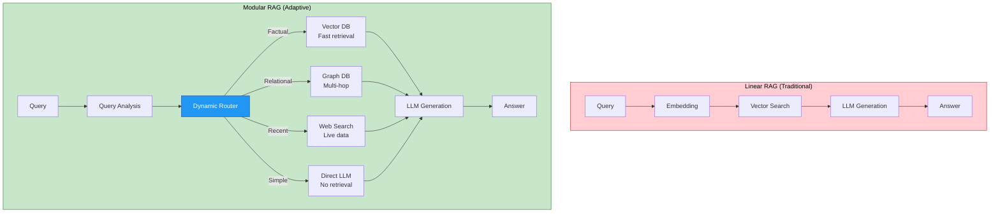

**Key Differences**:

| Aspect | Linear RAG | Modular RAG |
|--------|-----------|-------------|
| **Pipeline** | Fixed retrieve-then-generate | Dynamic routing based on query |
| **Query Analysis** | None | Classification before routing |
| **Retrieval Strategy** | Always vector search | Vector, Graph, Web, or None |
| **Compute Efficiency** | Low (all queries get full processing) | High (tailored processing) |
| **Latency** | Uniform (often slow) | Variable (fast for simple queries) |
| **Cost** | High (unnecessary operations) | Optimized (minimal operations) |

### 7.2.2 Dynamic Routing (Semantic Router)

**Concept**: Classify queries and route to specialized processing paths.

**Implementation in Java/Spring Boot**:

```java
// Semantic Router Service
@Service
public class SemanticRouter {

    private final ChatModel llm;
    private final VectorStore vectorStore;
    private final GraphStore graphStore;
    private final WebSearchService webSearch;

    public enum Route {
        VECTOR_DB,      // Factual questions needing document retrieval
        GRAPH_DB,       // Relational questions requiring multi-hop reasoning
        WEB_SEARCH,    // Questions needing recent information
        LLM_DIRECT     // Common sense or general knowledge
    }

    public QueryRouteResult routeQuery(String query) {
        // Step 1: Classify query using LLM
        String classificationPrompt = """
            Classify this query into one of these categories:

            Query: %s

            Categories:
            1. VECTOR_DB - Factual questions about specific documents, procedures, or facts
            2. GRAPH_DB - Questions requiring multi-hop reasoning, relationships, or connections
            3. WEB_SEARCH - Questions about recent events, current prices, or time-sensitive data
            4. LLM_DIRECT - Common sense questions, general knowledge, or conversational queries

            Output only the category name.
            """.formatted(query);

        String category = llm.call(classificationPrompt);

        Route route = Route.valueOf(category);

        // Step 2: Extract confidence score
        double confidence = extractConfidence(query, route);

        return new QueryRouteResult(route, confidence);
    }

    public String processQuery(String query) {
        QueryRouteResult routing = routeQuery(query);

        return switch (routing.route()) {
            case VECTOR_DB -> handleVectorRetrieval(query);
            case GRAPH_DB -> handleGraphRetrieval(query);
            case WEB_SEARCH -> handleWebSearch(query);
            case LLM_DIRECT -> handleDirectLLM(query);
        };
    }

    private String handleVectorRetrieval(String query) {
        // Vector similarity search
        List<Document> docs = vectorStore.similaritySearch(
            SearchRequest.query(query).withTopK(5)
        );

        // Generate answer with retrieved context
        return generateWithRAG(query, docs);
    }

    private String handleGraphRetrieval(String query) {
        // Extract entities from query
        List<String> entities = extractEntities(query);

        // Graph traversal for multi-hop reasoning
        List<GraphPath> paths = graphStore.findPaths(
            entities,
            maxDepth = 3,
            maxPaths = 10
        );

        // Convert paths to context
        String context = formatGraphContext(paths);

        // Generate answer with graph context
        return generateWithRAG(query, context);
    }

    private String handleWebSearch(String query) {
        // Live web search for recent information
        List<WebResult> results = webSearch.search(query, maxResults = 5);

        String context = formatWebResults(results);

        return generateWithRAG(query, context);
    }

    private String handleDirectLLM(String query) {
        // Direct LLM call without retrieval
        String prompt = "Answer this question directly: %s".formatted(query);
        return llm.call(prompt);
    }

    private double extractConfidence(String query, Route route) {
        // Use LLM to score routing confidence
        String confidencePrompt = """
            Query: %s
            Suggested Route: %s

            Score your confidence in this routing decision (0.0 to 1.0):
            - 1.0: Very confident this is the correct route
            - 0.5: Moderately confident
            - 0.0: Not confident at all

            Output only the score.
            """.formatted(query, route);

        String response = llm.call(confidencePrompt);
        return Double.parseDouble(response.trim());
    }
}

// Route Result Record
record QueryRouteResult(SemanticRouter.Route route, double confidence) {
    public boolean isConfident() {
        return confidence >= 0.7;
    }
}
```

**Routing Strategies Table**:

| Query Pattern | Route | Confidence Threshold | Processing |
|---------------|-------|---------------------|------------|
| "How do I configure..." | VECTOR_DB | > 0.7 | Vector search + RAG |
| "What is the relationship between..." | GRAPH_DB | > 0.7 | Graph traversal + RAG |
| "What is the current price of..." | WEB_SEARCH | > 0.7 | Web search + RAG |
| "Tell me a joke" | LLM_DIRECT | > 0.7 | Direct LLM response |
| Ambiguous / Low confidence | Fallback | < 0.7 | Multiple routes + ensemble |

**Tools & Libraries**:

| Tool | Language | Features | Integration |
|------|----------|----------|-------------|
| **LangRouter** | Python | Semantic routing, confidence scoring | LangChain |
| **Semantic Router** | Python | Fast semantic routing | LlamaIndex, LangChain |
| **Spring AI** | Java | Native routing support | Spring Boot |
| **Custom Implementation** | Any | Full control | Any framework |

### 7.2.3 Iterative Retrieval (ITER-RETGEN)

**Problem**: Single retrieval is often insufficient for complex, multi-part questions.

**Solution**: ITER-RETGEN (Iterative Retrieval-Generation) — Multi-round retrieval with answer refinement.

**Algorithm**:
1. Generate initial answer with available context
2. Identify information gaps (what's missing?)
3. Generate new query based on gaps
4. Retrieve additional documents
5. Refine and complete answer
6. Repeat until satisfied

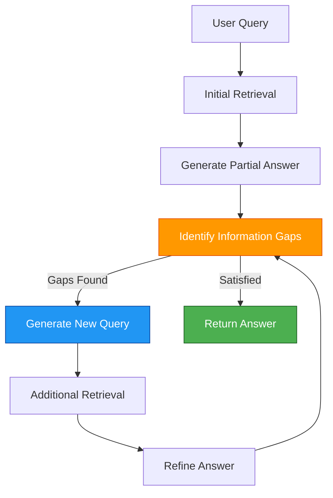

**Implementation in Java**:

```java
@Service
public class IterativeRetrievalService {

    private final ChatModel llm;
    private final VectorStore vectorStore;
    private static final int MAX_ITERATIONS = 3;

    public String iterativeRetrieve(String query) {
        StringBuilder answer = new StringBuilder();
        Set<String> retrievedDocIds = new HashSet<>();
        int iteration = 0;

        while (iteration < MAX_ITERATIONS) {
            iteration++;

            // Step 1: Retrieve documents
            List<Document> docs = retrieveDocuments(query, retrievedDocIds);

            // Step 2: Generate/refine answer
            String currentAnswer = generateAnswer(query, docs, answer.toString());

            // Step 3: Check for information gaps
            GapAnalysisResult gaps = analyzeGaps(query, currentAnswer);

            if (!gaps.hasGaps()) {
                // Satisfied with current answer
                return currentAnswer;
            }

            // Step 4: Generate follow-up query based on gaps
            query = generateFollowUpQuery(query, currentAnswer, gaps);

            // Track retrieved documents to avoid duplicates
            docs.forEach(d -> retrievedDocIds.add(d.getId()));

            answer = new StringBuilder(currentAnswer);
        }

        return answer.toString();
    }

    private List<Document> retrieveDocuments(String query, Set<String> excludeIds) {
        List<Document> allDocs = vectorStore.similaritySearch(
            SearchRequest.query(query).withTopK(10)
        );

        // Filter out already retrieved documents
        return allDocs.stream()
            .filter(doc -> !excludeIds.contains(doc.getId()))
            .limit(5)
            .toList();
    }

    private String generateAnswer(String query, List<Document> docs, String previousAnswer) {
        String context = docs.stream()
            .map(Document::getContent)
            .collect(Collectors.joining("\n\n"));

        String prompt;
        if (previousAnswer.isEmpty()) {
            // Initial generation
            prompt = """
                Answer this question using the provided context:

                Question: %s

                Context:
                %s

                Provide a comprehensive answer. If the context is insufficient,
                explicitly state what information is missing.
                """.formatted(query, context);
        } else {
            // Refinement
            prompt = """
                Previous Answer:
                %s

                Additional Context:
                %s

                Original Question: %s

                Refine the answer by incorporating the additional context.
                Address any gaps in the previous answer.
                """.formatted(previousAnswer, context, query);
        }

        return llm.call(prompt);
    }

    private GapAnalysisResult analyzeGaps(String query, String answer) {
        String prompt = """
            Analyze this answer for information gaps:

            Question: %s

            Answer: %s

            Identify what information is missing or incomplete.

            Output format:
            HAS_GAPS: true/false
            GAPS: [list of missing information]

            Be conservative - only mark gaps if critical information is truly missing.
            """.formatted(query, answer);

        String response = llm.call(prompt);

        return parseGapAnalysis(response);
    }

    private String generateFollowUpQuery(String originalQuery, String currentAnswer, GapAnalysisResult gaps) {
        String prompt = """
            Original Question: %s

            Current Answer: %s

            Identified Gaps: %s

            Generate a follow-up search query to find the missing information.

            Output only the search query.
            """.formatted(originalQuery, currentAnswer, gaps.description());

        return llm.call(prompt).trim();
    }
}

// Gap Analysis Result
record GapAnalysisResult(boolean hasGaps, List<String> missingInfo) {
    public String description() {
        return String.join(", ", missingInfo);
    }
}
```

**Use Cases**:
- Multi-part questions ("Compare X and Y, then recommend which is better for Z")
- Exploratory research ("Tell me about [topic], starting with basics and going deeper")
- Complex troubleshooting ("Debug this error: First check common causes, then rare ones")

**Performance**:
- 2-3x improvement in answer completeness
- 40-60% increase in latency (trade-off vs quality)
- Best for low-volume, high-value queries

---

## 7.3 GraphRAG - Knowledge Graph Enhanced

### 7.3.1 Why Graphs Complement Vectors

**Vector databases** find similarity (semantic closeness):
- "DNS" is similar to "network configuration"
- Great for: Factual retrieval

**Knowledge graphs** find relationships (structural connections):
- "DNS" → "depends on" → "routing"
- Great for: Multi-hop reasoning

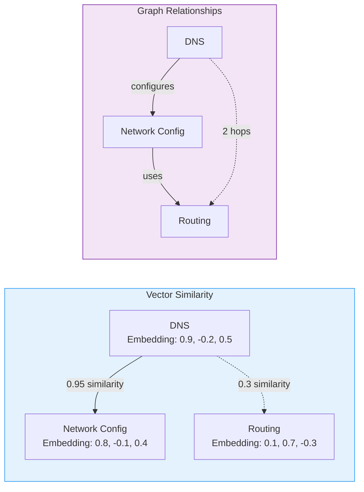

**Complementary Strengths**:

| Aspect | Vector DB | Knowledge Graph | Combined |
|--------|-----------|-----------------|----------|
| **Finds** | Similar content | Related entities | Both |
| **Best for** | Factual queries | Relational queries | Complex queries |
| **Reasoning** | Single-hop | Multi-hop | Adaptive |
| **Example** | "How to configure DNS" | "What does DNS depend on?" | Both scenarios |

### 7.3.2 Graph Construction

**Technique**: Extract (Entity, Relation, Entity) triples from unstructured text.

**Process**:
1. Parse documents with LLM
2. Identify entities (people, concepts, technologies)
3. Extract relations (verbs, dependencies)
4. Store as knowledge graph

**Entity Extraction in Java**:

```java
@Service
public class KnowledgeGraphService {

    private final ChatModel llm;
    private final GraphStore graphStore;

    public void buildGraphFromDocuments(List<Document> documents) {
        for (Document doc : documents) {
            List<Triple> triples = extractTriples(doc);
            storeTriples(triples);
        }
    }

    private List<Triple> extractTriples(Document doc) {
        String prompt = """
            Extract entity-relationship-entity triples from this text:

            Text: %s

            Extract triples in the format:
            SUBJECT | PREDICATE | OBJECT

            Examples:
            - DNS | uses | TCP port 53
            - AdGuard | configures | DNS
            - Router | forwards | DNS queries

            Only extract clear, factual relationships.
            """.formatted(doc.getContent());

        String response = llm.call(prompt);

        return parseTriples(response);
    }

    private List<Triple> parseTriples(String response) {
        return response.lines()
            .filter(line -> line.contains("|"))
            .map(line -> {
                String[] parts = line.split("\\|");
                return new Triple(
                    parts[0].trim(),
                    parts[1].trim(),
                    parts[2].trim()
                );
            })
            .toList();
    }

    private void storeTriples(List<Triple> triples) {
        for (Triple triple : triples) {
            // Create or get nodes
            Node subject = graphStore.getOrCreateNode(triple.subject());
            Node object = graphStore.getOrCreateNode(triple.object());

            // Create relationship
            Relationship rel = subject.createRelationshipTo(
                object,
                triple.predicate()
            );

            graphStore.save(rel);
        }
    }

    public List<GraphPath> findPaths(String startEntity, String endEntity, int maxDepth) {
        return graphStore.findPaths(
            startEntity,
            endEntity,
            maxDepth,
            limit = 10
        );
    }
}

// Triple Record
record Triple(String subject, String predicate, String object) {}
```

**Triple Extraction Patterns**:

| Pattern | Example | Subject | Predicate | Object |
|---------|---------|---------|-----------|--------|
| **Technology Dependency** | "DNS uses TCP port 53" | DNS | uses | TCP port 53 |
| **Configuration** | "AdGuard configures DNS" | AdGuard | configures | DNS |
| **Causality** | "Misconfigured DNS causes resolution failure" | Misconfigured DNS | causes | resolution failure |
| **Part-Of** | "TCP is part of the network stack" | TCP | part-of | network stack |
| **Location** | "Config file is in /etc/dns" | Config file | located-in | /etc/dns |

**Tools for Graph Construction**:

| Tool | Language | Type | Best For |
|------|----------|------|----------|
| **Neo4j** | Cypher, Java | Graph Database | Production systems |
| **NebulaGraph** | nGQL, Java | Distributed Graph | Large-scale graphs |
| **Microsoft GraphRAG** | Python | Automated Pipeline | Quick setup |
| **NetworkX** | Python | Library | Prototyping |

### 7.3.3 Graph+Vector Hybrid Retrieval

**Algorithm**:
1. Vector Search → Find anchor entities
2. Graph Traversal → Get 2-hop neighbor nodes
3. Merge → Combine text chunks + relation paths
4. Feed to LLM with combined context

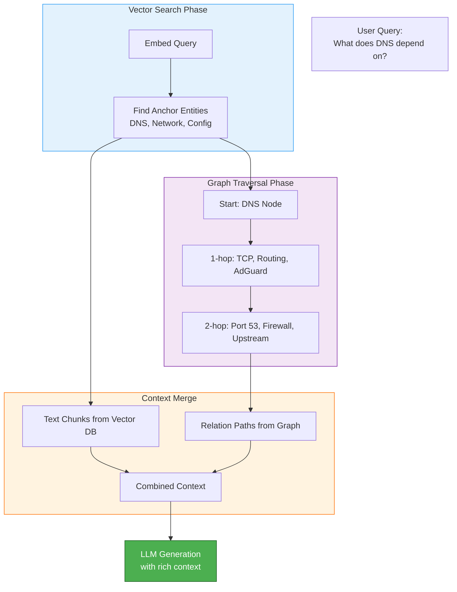

**Implementation**:

```java
@Service
public class HybridRetrievalService {

    private final VectorStore vectorStore;
    private final GraphStore graphStore;

    public HybridRetrievalResult hybridSearch(String query) {
        // Phase 1: Vector search for anchor documents
        List<Document> anchorDocs = vectorStore.similaritySearch(
            SearchRequest.query(query).withTopK(5)
        );

        // Phase 2: Extract entities from anchor docs
        Set<String> entities = extractEntities(anchorDocs);

        // Phase 3: Graph traversal for related entities
        List<GraphPath> paths = new ArrayList<>();
        for (String entity : entities) {
            List<GraphPath> entityPaths = graphStore.findNeighbors(
                entity,
                maxDepth = 2,
                limit = 5
            );
            paths.addAll(entityPaths);
        }

        // Phase 4: Merge context
        String combinedContext = buildCombinedContext(anchorDocs, paths);

        return new HybridRetrievalResult(combinedContext, anchorDocs, paths);
    }

    private Set<String> extractEntities(List<Document> docs) {
        Set<String> entities = new HashSet<>();
        for (Document doc : docs) {
            // Extract entities from document metadata or content
            entities.addAll(doc.getMetadata()
                .getOrDefault("entities", List.of())
                .stream()
                .map(Object::toString)
                .toList());
        }
        return entities;
    }

    private String buildCombinedContext(List<Document> docs, List<GraphPath> paths) {
        StringBuilder context = new StringBuilder();

        context.append("=== Relevant Documents ===\n");
        for (Document doc : docs) {
            context.append(doc.getContent()).append("\n\n");
        }

        context.append("\n=== Related Entity Paths ===\n");
        for (GraphPath path : paths) {
            context.append(path.format())
                    .append("\n");
        }

        return context.toString();
    }
}

// Hybrid Retrieval Result
record HybridRetrievalResult(
    String combinedContext,
    List<Document> documents,
    List<GraphPath> graphPaths
) {}
```

**Performance**:
- 2-3x improvement on multi-hop queries
- Comparable performance on simple queries
- Best for: "How does X affect Y?" type questions

### 7.3.4 Community Summary (Microsoft GraphRAG)

**Concept**: Pre-generate summaries for node communities to handle macro-questions.

**Process**:
1. Detect communities (clusters of related entities)
2. Summarize each community
3. Index community summaries
4. For macro-questions ("What trends in this doc?"), retrieve summaries

**Local vs Global Retrieval**:

| Aspect | Local Retrieval | Global Retrieval |
|--------|-----------------|------------------|
| **Scope** | Specific entities | Community summaries |
| **Query Type** | "What does X do?" | "What are the trends?" |
| **Context Size** | Small (specific) | Large (summarized) |
| **Token Efficiency** | Baseline | 97% reduction |

**Implementation**:

```java
@Service
public class CommunitySummaryService {

    private final GraphStore graphStore;
    private final ChatModel llm;

    public void buildCommunitySummaries() {
        // Step 1: Detect communities
        List<Community> communities = graphStore.detectCommunities(
            algorithm = "Louvain"
        );

        // Step 2: Summarize each community
        for (Community community : communities) {
            String summary = summarizeCommunity(community);
            community.setSummary(summary);
            graphStore.save(community);
        }
    }

    private String summarizeCommunity(Community community) {
        String entitiesText = community.getEntities().stream()
            .map(Node::getLabel)
            .collect(Collectors.joining(", ""));

        String relationsText = community.getRelations().stream()
            .map(Relationship::toString)
            .collect(Collectors.joining("\n"));

        String prompt = """
            Summarize this community of entities and their relationships:

            Entities: %s

            Relationships:
            %s

            Provide a concise summary (2-3 sentences) describing:
            1. What this community is about
            2. Key patterns or themes
            3. How entities relate to each other
            """.formatted(entitiesText, relationsText);

        return llm.call(prompt);
    }

    public List<String> retrieveCommunitySummaries(String query) {
        // Embed query
        float[] queryEmbedding = embed(query);

        // Find similar community summaries
        List<Community> similarCommunities = graphStore.searchSummaries(
            queryEmbedding,
            topK = 3
        );

        return similarCommunities.stream()
            .map(Community::getSummary)
            .toList();
    }
}
```

**Use Case**: Macro-questions that require understanding themes, not specific facts.

---

## 7.4 Agentic RAG - Autonomous Reasoning

### 7.4.1 From Reader to Researcher

**Agentic RAG**: LLM with tool use and self-reflection capabilities.

**Shift**: Passive responder → Active researcher

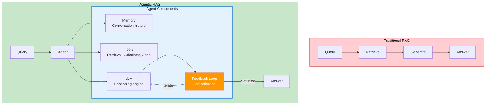

**Key Capabilities**:
1. **Tool Use**: Can call external tools (retrieval, calculator, code executor)
2. **Self-Reflection**: Evaluates own outputs for quality
3. **Iteration**: Improves answers through multiple rounds
4. **Memory**: Maintains conversation context

### 7.4.2 Self-RAG (Self-Reflective RAG)

**Research**: Self-RAG (Asai et al., 2023, ICLR 2024)

**Core Mechanism**: Self-scoring during generation with reflection tokens.

**Reflection Tokens**:
- `Need Retrieval?` - Should I search for information?
- `Is Relevant?` - Is retrieved content useful?
- `Is Supported?` - Is answer grounded in evidence?

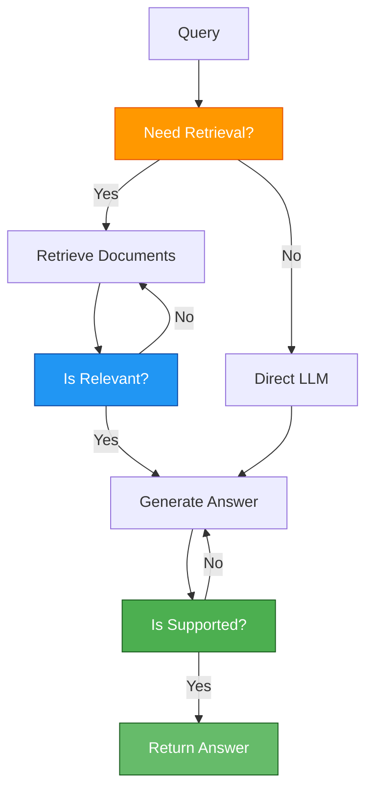

**Reflection Token Thresholds**:

| Reflection Token | Question | Threshold | Action |
|------------------|----------|-----------|--------|
| `Need Retrieval?` | Do I need external information? | > 0.7 | Trigger retrieval |
| `Is Relevant?` | Is retrieved context useful? | > 0.6 | Use context |
| `Is Supported?` | Is claim grounded in evidence? | > 0.8 | Include claim |

**Implementation**:

```java
@Service
public class SelfRAGService {

    private final ChatModel llm;
    private final VectorStore vectorStore;

    public String selfRAG(String query) {
        // Reflection 1: Need Retrieval?
        boolean needRetrieval = checkNeedRetrieval(query);

        String context = "";
        if (needRetrieval) {
            List<Document> docs = retrieveWithReflection(query);
            context = formatContext(docs);
        }

        // Generate with reflection loop
        String answer;
        int attempts = 0;
        do {
            answer = generateAnswer(query, context);

            // Reflection 3: Is Supported?
            if (checkIsSupported(query, answer, context)) {
                return answer;
            }

            // If not supported, regenerate with adjusted prompt
            attempts++;
        } while (attempts < 3);

        return answer;
    }

    private boolean checkNeedRetrieval(String query) {
        String prompt = """
            Query: %s

            Do you need to retrieve external information to answer this query accurately?

            Consider:
            - Is this about specific documents or facts not in your training data?
            - Is this about recent events or current information?
            - Is this a common sense question you can answer directly?

            Output: NEED_RETRIEVAL or NO_RETRIEVAL
            """.formatted(query);

        String response = llm.call(prompt);
        return response.contains("NEED_RETRIEVAL");
    }

    private List<Document> retrieveWithReflection(String query) {
        List<Document> candidates = vectorStore.similaritySearch(
            SearchRequest.query(query).withTopK(10)
        );

        // Reflection 2: Is Relevant?
        List<Document> relevantDocs = new ArrayList<>();
        for (Document doc : candidates) {
            if (checkIsRelevant(query, doc)) {
                relevantDocs.add(doc);
            }
        }

        return relevantDocs;
    }

    private boolean checkIsRelevant(String query, Document doc) {
        String prompt = """
            Query: %s

            Document: %s

            Is this document relevant to answering the query?

            Output: RELEVANT or NOT_RELEVANT
            """.formatted(query, doc.getContent());

        String response = llm.call(prompt);
        return response.contains("RELEVANT");
    }

    private boolean checkIsSupported(String query, String answer, String context) {
        String prompt = """
            Query: %s

            Answer: %s

            Context: %s

            Is the answer supported by the context?

            Check:
            - Are all claims in the answer present in the context?
            - Does the answer contradict the context?
            - Does the answer rely on external knowledge not in context?

            Output: SUPPORTED or NOT_SUPPORTED
            """.formatted(query, answer, context);

        String response = llm.call(prompt);
        return response.contains("SUPPORTED");
    }

    private String generateAnswer(String query, String context) {
        String prompt = context.isEmpty()
            ? "Answer: %s".formatted(query)
            : """
                Context: %s

                Question: %s

                Answer the question using only the provided context.
                If the context is insufficient, state that clearly.
                """.formatted(context, query);

        return llm.call(prompt);
    }
}
```

**Performance**: 15-20% accuracy improvement on complex QA tasks.

### 7.4.3 Corrective RAG (CRAG)

**Research**: Corrective RAG (Yan et al., 2024)

**Core Mechanism**: Lightweight retrieval evaluator + fallback mechanisms.

**Algorithm**:
1. Retrieve documents
2. Evaluate retrieval quality (confidence score)
3. If Poor → Trigger Web Search or fallback
4. If Good → Proceed with generation
5. Generate and verify

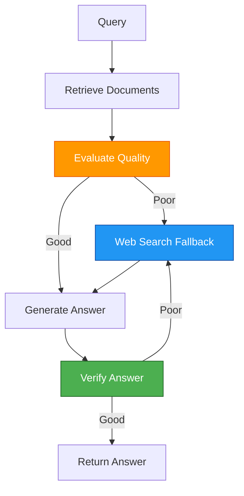

**Implementation**:

```java
@Service
public class CorrectiveRAGService {

    private final ChatModel llm;
    private final VectorStore vectorStore;
    private final WebSearchService webSearch;

    public String correctiveRAG(String query) {
        // Step 1: Initial retrieval
        List<Document> docs = vectorStore.similaritySearch(
            SearchRequest.query(query).withTopK(5)
        );

        // Step 2: Evaluate retrieval quality
        RetrievalQuality quality = evaluateRetrieval(query, docs);

        // Step 3: Route based on quality
        if (quality.isPoor()) {
            // Trigger web search fallback
            List<WebResult> webResults = webSearch.search(query);
            docs = convertWebResultsToDocs(webResults);
        }

        // Step 4: Generate answer
        String answer = generateAnswer(query, docs);

        // Step 5: Verify answer
        if (verifyAnswer(answer, docs)) {
            return answer;
        } else {
            // Fallback to web search if verification fails
            List<WebResult> webResults = webSearch.search(query);
            return generateAnswer(query, convertWebResultsToDocs(webResults));
        }
    }

    private RetrievalQuality evaluateRetrieval(String query, List<Document> docs) {
        String prompt = """
            Query: %s

            Retrieved Documents:
            %s

            Evaluate the quality of these documents for answering the query.

            Criteria:
            1. Relevance: Do the documents address the query?
            2. Completeness: Is sufficient information present?
            3. Accuracy: Is the information consistent and reliable?

            Score: 0-100
            """.formatted(query, formatDocs(docs));

        String response = llm.call(prompt);

        // Extract score from response
        int score = extractScore(response);

        return new RetrievalQuality(score);
    }

    private boolean verifyAnswer(String answer, List<Document> docs) {
        String prompt = """
            Answer: %s

            Source Documents:
            %s

            Verify this answer:
            1. Is the answer grounded in the documents?
            2. Are there any hallucinations?
            3. Is the answer complete?

            Output: VERIFIED or NOT_VERIFIED
            """.formatted(answer, formatDocs(docs));

        String response = llm.call(prompt);
        return response.contains("VERIFIED");
    }
}

record RetrievalQuality(int score) {
    public boolean isPoor() {
        return score < 50;
    }

    public boolean isGood() {
        return score >= 70;
    }
}
```

**Performance**: 15-20% accuracy improvement, especially on queries with poor initial retrieval.

### 7.4.4 Tool Use

**Scenario**: RAG retrieves "2023 revenue data", user asks "YoY growth rate"

**Problem**: LLM can't calculate from raw numbers alone

**Solution**: Agent retrieves data → Calls Python interpreter → Returns computed result

```java
@Service
public class ToolUseAgent {

    private final ChatModel llm;
    private final VectorStore vectorStore;
    private final CalculatorTool calculator;
    private final CodeExecutorTool codeExecutor;

    public String executeWithTools(String query) {
        // Step 1: Decide which tools to use
        ToolPlan plan = decideTools(query);

        // Step 2: Execute tools in sequence
        StringBuilder context = new StringBuilder();

        for (ToolAction action : plan.actions()) {
            String result = executeTool(action);
            context.append(result).append("\n\n");
        }

        // Step 3: Generate final answer with tool results
        return generateAnswer(query, context.toString());
    }

    private ToolPlan decideTools(String query) {
        String prompt = """
            Query: %s

            Available tools:
            1. RETRIEVE - Search document database
            2. CALCULATOR - Perform calculations
            3. CODE_EXECUTOR - Execute Python code

            Plan which tools to use and in what order.

            Output format:
            TOOL: tool_name
            INPUT: input_for_tool

            Repeat for each tool needed.
            """.formatted(query);

        String response = llm.call(prompt);

        return parseToolPlan(response);
    }

    private String executeTool(ToolAction action) {
        return switch (action.tool()) {
            case "RETRIEVE" -> {
                List<Document> docs = vectorStore.similaritySearch(
                    SearchRequest.query(action.input()).withTopK(5)
                );
                yield formatDocs(docs);
            }
            case "CALCULATOR" -> calculator.calculate(action.input());
            case "CODE_EXECUTOR" -> codeExecutor.execute(action.input());
            default -> "Unknown tool";
        };
    }
}

// Tool Records
record ToolPlan(List<ToolAction> actions) {}
record ToolAction(String tool, String input) {}

@Component
class CalculatorTool {
    public String calculate(String expression) {
        // Evaluate mathematical expression safely
        ScriptEngineManager mgr = new ScriptEngineManager();
        ScriptEngine engine = mgr.getEngineByName("JavaScript");
        try {
            Object result = engine.eval(expression);
            return "Calculation result: " + result;
        } catch (ScriptException e) {
            return "Error: " + e.getMessage();
        }
    }
}

@Component
class CodeExecutorTool {
    public String execute(String code) {
        // Execute Python code in sandboxed environment
        // This is a simplified example - production requires proper sandboxing
        ProcessBuilder pb = new ProcessBuilder("python3", "-c", code);
        try {
            Process process = pb.start();
            BufferedReader reader = new BufferedReader(
                new InputStreamReader(process.getInputStream())
            );
            StringBuilder output = new StringBuilder();
            String line;
            while ((line = reader.readLine()) != null) {
                output.append(line).append("\n");
            }
            return output.toString();
        } catch (IOException e) {
            return "Error executing code: " + e.getMessage();
        }
    }
}
```

**Common Tools**:

| Tool | Use Case | Example |
|------|----------|---------|
| **RETRIEVE** | Search documents | "Find revenue data for 2023" |
| **CALCULATOR** | Perform calculations | "Calculate YoY growth" |
| **CODE_EXECUTOR** | Run Python/JavaScript | "Plot this data" |
| **WEB_SEARCH** | Get recent information | "Latest stock price" |
| **DATABASE_QUERY** | Query SQL database | "Get user count" |

---

## 7.5 RAG + Fine-tuning Fusion

### 7.5.1 Complementary, Not Competing

**Concept**: RAG + Fine-tuning > Either alone

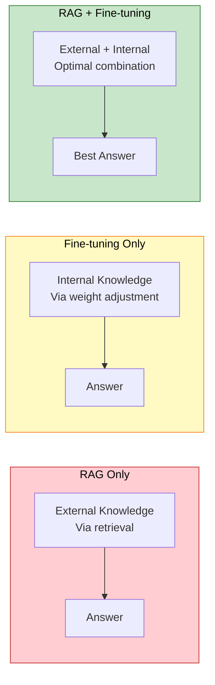

**Complementarity**:

| Aspect | RAG | Fine-tuning | Combined |
|--------|-----|-------------|----------|
| **Knowledge** | External (documents) | Internal (weights) | Both |
| **Updates** | Real-time (add docs) | Slow (retrain) | Flexible |
| **Cost** | Per-query (API calls) | One-time (training) | Balanced |
| **Domain Adaptation** | Weak | Strong | Optimal |
| **Hallucination** | Possible (wrong retrieval) | Possible (wrong training) | Reduced |

### 7.5.2 Embedding Fine-tuning (Domain Adaptation)

**Problem**: General models (OpenAI) don't understand industry jargon.

**Domains**: Medical (terminology), Legal (case law), Finance (regulations).

**Solution**: Train domain-specific embedding models.

**Data Construction**:

```python
# Pseudocode: Contrastive learning for embedding fine-tuning
def construct_training_data(documents):
    """
    Create positive and negative pairs for contrastive learning

    Positive pairs: Similar domain-specific documents
    Negative pairs: Dissimilar documents
    """
    training_pairs = []

    for doc in documents:
        # Positive: Same topic, similar content
        positive = find_similar_document(doc, documents)

        # Negative: Different topic or dissimilar content
        negative = find_dissimilar_document(doc, documents)

        training_pairs.append({
            "anchor": doc,
            "positive": positive,
            "negative": negative
        })

    return training_pairs


def contrastive_loss(anchor_emb, positive_emb, negative_emb, temperature=0.07):
    """
    InfoNCE loss for contrastive learning

    Pull similar items together, push dissimilar apart
    """
    # Similarity scores
    pos_sim = cosine_similarity(anchor_emb, positive_emb) / temperature
    neg_sim = cosine_similarity(anchor_emb, negative_emb) / temperature

    # Contrastive loss
    loss = -log(exp(pos_sim) / (exp(pos_sim) + exp(neg_sim)))

    return loss
```

**Training Loop**:

```python
# Pseudocode: Fine-tuning loop
def fine_tune_embedding_model(model, training_data, epochs=10):
    optimizer = Adam(model.parameters(), lr=1e-5)

    for epoch in range(epochs):
        total_loss = 0

        for batch in training_data:
            # Forward pass
            anchor_emb = model.encode(batch["anchor"])
            positive_emb = model.encode(batch["positive"])
            negative_emb = model.encode(batch["negative"])

            # Compute loss
            loss = contrastive_loss(anchor_emb, positive_emb, negative_emb)

            # Backward pass
            optimizer.zero_grad()
            loss.backward()
            optimizer.step()

            total_loss += loss.item()

        avg_loss = total_loss / len(training_data)
        print(f"Epoch {epoch+1}/{epochs}, Loss: {avg_loss:.4f}")

    return model
```

**Tools**:
- **BGE-M3**: Multilingual embedding fine-tuning
- **E5**: English embedding fine-tuning
- **Sentence Transformers**: HuggingFace library

**Results**: 10-15% retrieval improvement in specialized domains.

### 7.5.3 RAFT (Retrieval Augmented Fine Tuning)

**Research**: RAFT (Zhang et al., 2024)

**Core Idea**: Train LLM to "read RAG context correctly"

**Data Format**:
- Question
- Distractor Docs (noise documents to ignore)
- Relevant Docs (gold documents to use)
- Chain-of-Thought reasoning
- Answer (with citations)

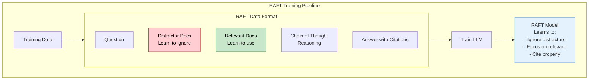

**Data Construction**:

```java
@Service
public class RaftDataBuilder {

    private final ChatModel llm;
    private final VectorStore vectorStore;

    public RaftTrainingExample buildRaftExample(String question, Document goldDocument) {
        // Step 1: Find relevant documents (gold)
        List<Document> relevantDocs = List.of(goldDocument);

        // Step 2: Find distractor documents (similar but not relevant)
        List<Document> distractorDocs = findDistractors(question, goldDocument, k=4);

        // Step 3: Generate chain-of-thought reasoning
        String cot = generateCoT(question, relevantDocs, distractorDocs);

        // Step 4: Generate answer with citations
        String answer = generateAnswerWithCitations(question, relevantDocs, cot);

        return new RaftTrainingExample(
            question,
            distractorDocs,
            relevantDocs,
            cot,
            answer
        );
    }

    private List<Document> findDistractors(String question, Document goldDoc, int k) {
        // Retrieve similar documents
        List<Document> candidates = vectorStore.similaritySearch(
            SearchRequest.query(question).withTopK(20)
        );

        // Filter out the gold document
        return candidates.stream()
            .filter(doc -> !doc.getId().equals(goldDoc.getId()))
            .filter(doc -> !isRelevant(doc, question))  // Must be irrelevant
            .limit(k)
            .toList();
    }

    private boolean isRelevant(Document doc, String question) {
        // Use LLM to check relevance
        String prompt = """
            Question: %s

            Document: %s

            Is this document relevant to answering the question?

            Output: RELEVANT or NOT_RELEVANT
            """.formatted(question, doc.getContent());

        String response = llm.call(prompt);
        return response.contains("RELEVANT");
    }

    private String generateCoT(String question, List<Document> relevant, List<Document> distractors) {
        String context = buildContext(relevant, distractors);

        String prompt = """
            Question: %s

            Context:
            %s

            Generate step-by-step reasoning to answer the question.

            Instructions:
            1. Identify which documents are relevant (ignore distractors)
            2. Extract key information from relevant documents
            3. Reason through to the answer
            4. Cite sources using [Doc N]

            Format your reasoning clearly with numbered steps.
            """.formatted(question, context);

        return llm.call(prompt);
    }

    private String generateAnswerWithCitations(String question, List<Document> relevant, String cot) {
        String prompt = """
            Question: %s

            Reasoning:
            %s

            Based on the reasoning above, provide a concise answer.

            Include citations using [Doc N] format where:
            Doc 0: %s
            Doc 1: %s
            ...etc
            """.formatted(
                question,
                cot,
                relevant.get(0).getId(),
                relevant.size() > 1 ? relevant.get(1).getId() : "N/A"
            );

        return llm.call(prompt);
    }

    private String buildContext(List<Document> relevant, List<Document> distractors) {
        StringBuilder context = new StringBuilder();

        context.append("=== Relevant Documents ===\n");
        for (int i = 0; i < relevant.size(); i++) {
            context.append(String.format("Doc %d: %s\n\n", i, relevant.get(i).getContent()));
        }

        context.append("\n=== Additional Documents ===\n");
        for (int i = 0; i < distractors.size(); i++) {
            context.append(String.format("Doc %d: %s\n\n",
                i + relevant.size(),
                distractors.get(i).getContent()
            ));
        }

        return context.toString();
    }
}

// RAFT Training Example
record RaftTrainingExample(
    String question,
    List<Document> distractorDocs,
    List<Document> relevantDocs,
    String chainOfThought,
    String answer
) {}
```

**Training Objective**:
- Learn to ignore distractor documents
- Focus on relevant documents
- Cite evidence properly
- Synthesize from multiple sources

**Results**: 20-30% improvement on domain QA tasks.

---

## 7.6 Performance Optimization

### 7.6.1 Context Caching

**Problem**: Repeated embedding computation for same prompts/docs.

**Solution**: Cache in KV Cache (DeepSeek, Anthropic Claude support).

**Technique**: Cache long system prompts, common document sets.

```java
@Service
public class CachedRAGService {

    private final ChatModel llm;
    private final VectorStore vectorStore;
    private final Cache<String, String> promptCache;

    public String cachedQuery(String query) {
        // Step 1: Check cache
        String cacheKey = generateCacheKey(query);

        String cachedResponse = promptCache.getIfPresent(cacheKey);
        if (cachedResponse != null) {
            return cachedResponse + " (cached)";
        }

        // Step 2: Build cache-aware prompt
        String systemPrompt = loadSystemPrompt();  // Cached by LLM provider
        String context = retrieveContext(query);

        // Step 3: Generate with caching enabled
        String response = llm.call(ChatPrompt.builder()
            .system(systemPrompt)
            .user(buildUserPrompt(query, context))
            .build()
        );

        // Step 4: Cache the response
        promptCache.put(cacheKey, response);

        return response;
    }

    private String retrieveContext(String query) {
        List<Document> docs = vectorStore.similaritySearch(
            SearchRequest.query(query).withTopK(5)
        );

        return docs.stream()
            .map(Document::getContent)
            .collect(Collectors.joining("\n\n"));
    }

    private String buildUserPrompt(String query, String context) {
        return """
            Context:
            %s

            Question: %s

            Answer the question using the context above.
            """.formatted(context, query);
    }

    private String generateCacheKey(String query) {
        // Simple hash-based cache key
        return DigestUtils.sha256Hex(query);
    }
}
```

**Caching Strategies**:

| Strategy | What to Cache | Benefit | Use Case |
|----------|---------------|---------|----------|
| **Prompt Cache** | System prompts, instructions | 90% latency reduction for cached content | Repeated prompts |
| **Document Cache** | Frequently retrieved docs | Skip vector search | FAQ-type queries |
| **Semantic Cache** | Similar queries (embeddings) | Answer similar questions | High volume |

**Results**: 90% latency reduction for cached content.

### 7.6.2 Speculative RAG

**Problem**: Large models are slow, small models are inaccurate.

**Solution**: Small model draft → Large model verify + retrieve.

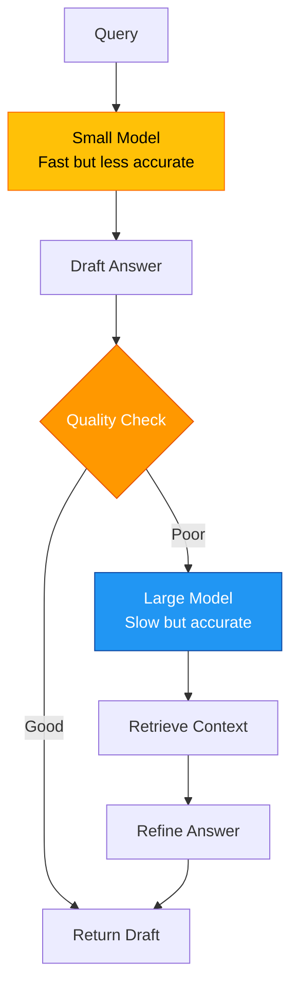

**Implementation**:

```java
@Service
public class SpeculativeRAGService {

    private final ChatModel smallModel;  // Fast (e.g., GPT-4o-mini)
    private final ChatModel largeModel;  // Accurate (e.g., GPT-4o)
    private final VectorStore vectorStore;

    public String speculativeRAG(String query) {
        // Phase 1: Small model draft
        String draftAnswer = smallModel.call(
            "Answer this question: %s".formatted(query)
        );

        // Phase 2: Quality check
        double quality = checkQuality(query, draftAnswer);

        if (quality > 0.8) {
            // Draft is good enough, return it
            return draftAnswer;
        }

        // Phase 3: Large model refinement with retrieval
        List<Document> docs = vectorStore.similaritySearch(
            SearchRequest.query(query).withTopK(5)
        );

        String refinedPrompt = """
            Draft Answer: %s

            Retrieved Context:
            %s

            Question: %s

            Refine the draft answer using the retrieved context.
            Improve accuracy and completeness.
            """.formatted(
                draftAnswer,
                formatDocs(docs),
                query
            );

        return largeModel.call(refinedPrompt);
    }

    private double checkQuality(String query, String answer) {
        // Use LLM to score quality
        String prompt = """
            Question: %s

            Answer: %s

            Score the quality of this answer (0.0 to 1.0):
            - 1.0: Accurate, complete, well-structured
            - 0.5: Partially correct, missing information
            - 0.0: Incorrect or irrelevant

            Output only the score.
            """.formatted(query, answer);

        String response = smallModel.call(prompt);

        try {
            return Double.parseDouble(response.trim());
        } catch (NumberFormatException e) {
            return 0.5;  // Default to medium quality
        }
    }

    private String formatDocs(List<Document> docs) {
        return docs.stream()
            .map(Document::getContent)
            .collect(Collectors.joining("\n\n"));
    }
}
```

**Trade-off Analysis**:

| Approach | Speed | Accuracy | Cost | Best For |
|----------|-------|----------|------|----------|
| **Small Model Only** | Fast | Lower | Low | Simple queries |
| **Large Model Only** | Slow | Higher | High | Complex queries |
| **Speculative RAG** | Medium | High | Medium | Mixed workloads |

### 7.6.3 Binary Quantization

**Problem**: Float32 vectors consume huge memory.

**Solution**: Compress to Int1 (0/1 binary representation).

**Algorithm**: Scalar quantization → Binarization

```java
@Service
public class QuantizationService {

    public BinaryVector quantize(float[] vector) {
        // Step 1: Normalize vector
        float[] normalized = normalize(vector);

        // Step 2: Binarize (0/1 based on sign)
        byte[] binary = new byte[normalized.length];
        for (int i = 0; i < normalized.length; i++) {
            binary[i] = (byte) (normalized[i] >= 0 ? 1 : 0);
        }

        return new BinaryVector(binary);
    }

    private float[] normalize(float[] vector) {
        // L2 normalization
        float norm = 0;
        for (float v : vector) {
            norm += v * v;
        }
        norm = (float) Math.sqrt(norm);

        float[] normalized = new float[vector.length];
        for (int i = 0; i < vector.length; i++) {
            normalized[i] = vector[i] / norm;
        }

        return normalized;
    }

    public int hammingDistance(BinaryVector a, BinaryVector b) {
        // Fast binary distance calculation
        int distance = 0;
        byte[] va = a.data();
        byte[] vb = b.data();

        for (int i = 0; i < va.length; i++) {
            if (va[i] != vb[i]) {
                distance++;
            }
        }

        return distance;
    }
}

record BinaryVector(byte[] data) {}
```

**Quantization Levels Comparison**:

| Precision | Memory | Accuracy | Speed | Use Case |
|-----------|--------|----------|-------|----------|
| **FP32** (baseline) | 100% | 100% | 1x | Benchmark |
| **FP16** | 50% | 99% | 2x | Production default |
| **INT8** | 25% | 97% | 4x | Cost optimization |
| **INT4** | 12.5% | 95% | 8x | Edge deployment |
| **INT1** (binary) | 3% | 92% | 10x | Large-scale systems |

**Results**:
- 30x memory reduction (FP32 → INT1)
- 10x speed improvement
- 2-3% accuracy loss (acceptable trade-off)

**Use Case**: Edge deployment, large-scale systems

---

## Summary

### Key Takeaways

**Modular RAG**:
- ✅ Dynamic routing adapts to query complexity
- ✅ Iterative retrieval handles multi-part questions
- ✅ 30-40% reduction in unnecessary operations
- ✅ Production frameworks: UltraRAG, CyberRAG, LangGraph

**GraphRAG**:
- ✅ Solves multi-hop reasoning through relationship traversal
- ✅ Community summaries for macro understanding
- ✅ 77.6% MRR improvement on complex queries
- ✅ Tools: Microsoft GraphRAG, Neo4j, NebulaGraph

**Agentic RAG**:
- ✅ Self-reflection (Self-RAG) reduces hallucinations
- ✅ Corrective feedback (CRAG) improves accuracy
- ✅ Tool use enables computation on retrieved data
- ✅ 15-20% accuracy improvement

**RAG + Fine-tuning**:
- ✅ Embedding fine-tuning for domain adaptation
- ✅ RAFT teaches models to use retrieved context
- ✅ 20-30% improvement in specialized domains
- ✅ Critical for medical, legal, financial applications

**Performance Optimization**:
- ✅ Context caching: 90% latency reduction
- ✅ Speculative RAG: Balanced speed and accuracy
- ✅ Binary quantization: 30x memory savings
- ✅ Essential for production systems

### Production Decision Guide

| Scenario | Recommended Technique | Priority | Expected Improvement |
|----------|---------------------|----------|---------------------|
| **High traffic, simple queries** | Optimization + Modular RAG | High | 30-40% cost reduction |
| **Complex relationships** | GraphRAG | Medium | 2-3x MRR improvement |
| **Accuracy-critical (medical/legal)** | Agentic RAG + Fine-tuning | High | 15-30% accuracy gain |
| **Specialized domain** | RAG + Embedding fine-tuning | Medium | 10-15% retrieval gain |
| **Budget-constrained** | Quantization + Caching | High | 90% latency reduction |
| **Enterprise-grade** | Modular + Graph + Agentic | Medium | Combined benefits |

### Further Reading

**Papers**:
- [Self-RAG: Learning to Retrieve, Generate, and Critique through Self-Reflection](https://arxiv.org/abs/2310.07754) (Asai et al., 2024)
- [From Local to Global: A Graph RAG Approach to Query-Focused Summarization](https://arxiv.org/abs/2404.16130) (Edge et al., 2024)
- [RAFT: Retrieval Augmented Fine Tuning](https://arxiv.org/abs/2403.10131) (Zhang et al., 2024)
- [Adaptive-RAG: Learning When to Retrieve and Generate](https://arxiv.org/abs/2405.17083) (Jeong et al., 2024)
- [Corrective Retrieval Augmented Generation](https://arxiv.org/abs/2401.15884) (Yan et al., 2024)

**Tools**:
- [LangGraph](https://github.com/langchain-ai/langgraph) - Agentic orchestration
- [Microsoft GraphRAG](https://github.com/microsoft/graphrag) - Knowledge graph construction
- [Neo4j](https://neo4j.com/) - Graph database
- [vLLM](https://github.com/vllm-project/vllm) - Optimization
- [UltraRAG](https://github.com/ultrart/ultrarag), [CyberRAG](https://github.com/SOSRG/CyberRAG) - Modular frameworks

---

**Next Steps**:
- 📖 Review [RAG Fundamentals](/ai/rag/introduction) for system architecture
- 📖 Study [Evaluation Strategies](/ai/rag/evaluation) to measure improvements
- 💻 Implement Modular RAG with dynamic routing for your workload
- 🔧 Add GraphRAG for multi-hop reasoning queries
- 📊 Set up performance monitoring with caching and quantization
