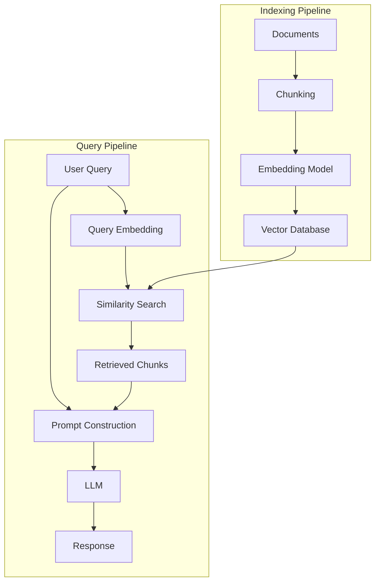

# RAG Systems

> **"RAG bridges the gap between static LLM knowledge and dynamic, domain-specific information."**

Retrieval-Augmented Generation (RAG) enhances LLM capabilities by providing relevant context from external knowledge bases.

---

## Why RAG?

| LLM Limitation | How RAG Solves It |
|----------------|-------------------|
| Knowledge cutoff | Provides current information |
| Hallucinations | Grounds responses in facts |
| No private data | Accesses internal documents |
| Expensive fine-tuning | No model training needed |

---

## RAG Architecture



---

## Core Concepts

### 1. Document Processing
- **Load**: Read documents from various sources (PDF, HTML, databases)
- **Chunk**: Split into smaller pieces (512-768 tokens)
- **Embed**: Convert to vector representations
- **Store**: Save to vector database

### 2. Retrieval Strategies
- **Similarity Search**: Find semantically similar documents
- **Hybrid Search**: Combine vector and keyword search
- **Re-ranking**: Refine results with cross-encoders

### 3. Generation
- Inject retrieved context into prompt
- LLM generates answer based on provided context
- Can include citations and references

---

## Quick Start with Spring AI

```java
@Service
public class RAGService {

    private final ChatClient chatClient;
    private final VectorStore vectorStore;

    public String query(String userQuestion) {
        return chatClient.prompt()
            .user(userQuestion)
            .advisors(new QuestionAnswerAdvisor(vectorStore))
            .call()
            .content();
    }
}
```

---

## Technology Stack

### Vector Databases

| Database | Type | Use Case |
|----------|------|----------|
| **PgVector** | PostgreSQL Extension | Medium scale, existing PostgreSQL |
| **Milvus** | Distributed | Large-scale production |
| **Pinecone** | Managed | Rapid prototyping |
| **Chroma** | Local | Development testing |

### Embedding Models

| Model | Dimensions | Quality | Cost |
|-------|------------|---------|------|
| **OpenAI text-embedding-3-small** | 1536 | Excellent | $0.02/1M tokens |
| **OpenAI text-embedding-3-large** | 3072 | Excellent | $0.13/1M tokens |
| **BGE-M3** | 1024 | Very Good | Free (self-hosted) |
| **Cohere embed-v3** | 1024 | Excellent | $0.10/1M tokens |

---

## Learning Path

1. **[RAG Fundamentals](/ai/rag/introduction)** ⭐ Start here
   - Vector space mathematics
   - RAG taxonomy (Naive, Advanced, Modular, GraphRAG)
   - Spring AI architecture
   - Complete implementation guide

2. **Data Processing** (Coming soon)
   - Document loaders
   - Text chunking strategies
   - Metadata extraction

3. **Index Building** (Coming soon)
   - Chunking strategies
   - Embedding model configuration
   - Vector index algorithms

4. **Retrieval Strategies** (Coming soon)
   - Similarity search
   - Hybrid retrieval
   - Query transformation

5. **Generation** (Coming soon)
   - Prompt engineering for RAG
   - Context window management
   - Citation generation

6. **Evaluation** (Coming soon)
   - RAGAS framework
   - Retrieval metrics
   - Generation quality assessment

7. **Advanced Topics** (Coming soon)
   - GraphRAG
   - Agentic RAG
   - Multi-modal RAG

8. **Production** (Coming soon)
   - Deployment architecture
   - Performance optimization
   - Monitoring and observability

9. **Best Practices** (Coming soon)
   - Design patterns
   - Common pitfalls
   - Testing strategies

---

## Production Considerations

:::tip Key considerations

1. **Chunk size matters** - Too small loses context, too large reduces precision
2. **Metadata filtering** - Use filters before vector search when possible
3. **Monitor retrieval quality** - Track relevance of retrieved chunks
4. **Cache embeddings** - Avoid re-computing for same queries
5. **Handle edge cases** - What if no relevant documents found?

:::

---

## Further Reading

**Research Papers**:
- [Retrieval-Augmented Generation for Knowledge-Intensive NLP Tasks](https://arxiv.org/abs/2005.11401) (Lewis et al., 2020)
- [GraphRAG: Knowledge-Augmented Generation](https://www.microsoft.com/en-us/research/project/graphrag/) (Microsoft Research, 2024)

**Documentation**:
- [Spring AI Reference](https://docs.spring.io/spring-ai/reference/)
- [RAGAS Evaluation Framework](https://docs.ragas.io/)
- [LangChain RAG Tutorial](https://python.langchain.com/docs/use_cases/question_answering/)

**Tutorials**:
- [DataWhale All-in-RAG](https://datawhalechina.github.io/all-in-rag/)
- [Pinecone Learning Center](https://www.pinecone.io/learn)
- [Weaviate Documentation](https://weaviate.io/developers/weaviate)
