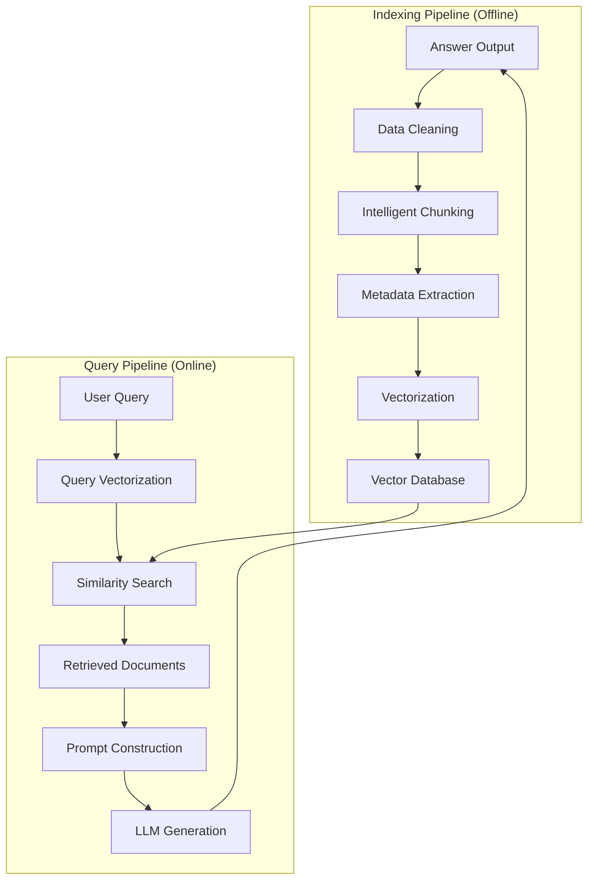

# RAG Systems: Complete Guide

> **"RAG bridges the gap between static LLM knowledge and dynamic, domain-specific information."**

Retrieval-Augmented Generation (RAG) enhances LLM capabilities by retrieving relevant context from external knowledge bases, enabling AI to access real-time, accurate enterprise private data.

---

## Why RAG?

| LLM Limitation | RAG Solution |
|----------------|--------------|
| Knowledge cutoff | Provides current information |
| Hallucinations | Grounds responses in facts |
| No private data access | Accesses internal documents |
| Expensive fine-tuning | No model training needed |

---

## RAG Architecture Overview



---

## Core Concepts Overview

### 1. Data Processing Pipeline
- **Document Loading**: Multi-format support (PDF, HTML, Markdown, DOCX)
- **Intelligent Chunking**: Semantic-based structured splitting
- **Metadata Extraction**: Automatic and LLM-enhanced metadata
- **Batch Vectorization**: Optimize API call costs

### 2. Vector Indexing
- **Embedding Models**: OpenAI, BGE, Cohere model selection
- **Indexing Algorithms**: HNSW graph indexing, IVF, PQ compression
- **Storage Optimization**: Caching strategies, batch operations
- **Performance Tuning**: Search speed vs recall trade-offs

### 3. Retrieval Strategies
- **Vector Search**: Semantic similarity matching
- **Hybrid Retrieval**: Combine keyword and vector search
- **Query Transformation**: Multi-Query, Decomposition, HyDE
- **Intelligent Routing**: Dynamic strategy selection based on query type
- **Re-ranking**: Cross-Encoder precision improvement

### 4. Generation Enhancement
- **Prompt Engineering**: Context injection strategies
- **Parameter Tuning**: Temperature, Top-P, Top-K
- **Generation Modes**: Refine, Tree Summarize, Multi-hop
- **Citation Generation**: Answer sourcing and trustworthiness

### 5. Evaluation Framework
- **RAG Triad**: Faithfulness, Answer Relevance, Context Precision
- **Retrieval Metrics**: Recall, Precision, MRR, NDCG
- **Generation Metrics**: BLEU, ROUGE, BERTScore
- **Evaluation Methods**: Golden Dataset, LLM-as-a-Judge

---

## Quick Start with Spring AI

```java
@Service
public class RAGService {

    private final ChatClient chatClient;
    private final VectorStore vectorStore;

    public String query(String userQuestion) {
        return chatClient.prompt()
            .user(userQuestion)
            .advisors(new QuestionAnswerAdvisor(vectorStore))
            .call()
            .content();
    }
}
```

---

## Technology Stack

### Vector Databases

| Database | Type | Use Case |
|----------|------|----------|
| **PgVector** | PostgreSQL Extension | Medium scale, existing PostgreSQL infrastructure |
| **Milvus** | Distributed | Large-scale production |
| **Pinecone** | Managed | Rapid prototyping |
| **Chroma** | Local | Development and testing |

### Embedding Models

| Model | Dimensions | Quality | Cost |
|-------|------------|---------|------|
| **OpenAI text-embedding-3-small** | 1536 | Excellent | $0.02/1M tokens |
| **OpenAI text-embedding-3-large** | 3072 | Excellent | $0.13/1M tokens |
| **BGE-M3** | 1024 | Very Good | Free (self-hosted) |
| **Cohere embed-v3** | 1024 | Excellent | $0.10/1M tokens |

---

## Learning Path (Complete 9-Chapter Tutorial)

### Phase 1: Foundation Building

**1. [RAG Foundation](/ai/rag/introduction)** - Start Here
- RAG core definitions and intuition
- Vector space mathematical foundations
- RAG taxonomy (Naive/Advanced/Modular/GraphRAG)
- Spring AI architecture deep dive
- Complete implementation guide

**2. [Data Processing Pipeline](/ai/rag/data-processing)**
- Multi-format document loading (PDF/HTML/MD/DOCX/API)
- Data cleaning and quality assessment
- Intelligent chunking strategies (Semantic/Recursive/Parent-Child)
- Automatic metadata extraction and LLM enhancement
- Spring AI Reader hands-on implementation

**3. [Vector Indexing & Storage](/ai/rag/vector-indexing)**
- Embedding model selection and comparison
- Batch generation optimization and caching
- HNSW indexing principles and tuning
- Vector storage architecture design
- Production environment optimization strategies

### Phase 2: Retrieval and Generation

**4. [Retrieval Strategies](/ai/rag/retrieval)**
- Similarity search fundamentals
- Query transformation (Multi-Query/HyDE/Decomposition)
- Intelligent routing and query classification
- Hybrid retrieval (BM25 + Vector)
- Re-ranking optimization (Cross-Encoder/Cohere Rerank)

**5. [Generation Strategies](/ai/rag/generation)**
- Prompt engineering best practices
- Context assembly and optimization
- Generation parameter control (Temperature/Top-P)
- Advanced modes (Refine/Tree Summarize)
- Agentic RAG introduction

**6. [Evaluation Strategies](/ai/rag/evaluation)**
- RAG Triad evaluation framework
- Retrieval metrics (Recall/Precision/MRR)
- Generation metrics (Faithfulness/Relevance)
- Evaluation methods (Golden Dataset/LLM-as-a-Judge)
- Observability tools (Arize/TruLens)

### Phase 3: Advanced Techniques

**7. [Advanced RAG Techniques](/ai/rag/advanced-rag)**
- Modular RAG architectures
- Knowledge graph integration (GraphRAG)
- Adaptive retrieval systems (Self-RAG/CRAG)
- Fine-tuning fusion (RAFT/Domain Adaptation)
- Performance optimization (Caching/Quantization)

### Phase 4: Production Practice

**8. [Production Engineering](/ai/rag/production)**
- Serving architecture design (Streaming/Concurrency)
- Performance optimization (Latency/Throughput)
- Security guardrails (Content filtering/Safety)
- Observability (Tracing/Metrics/Logging)
- Continuous improvement loops

**9. [Best Practices](/ai/rag/best-practices)**
- Complete workflow (16 steps × 4 phases)
- Tool selection decision tree
- Design patterns and anti-patterns
- Testing strategies
- Common pitfalls and solutions

---

## Production Considerations

:::tip Key Production Considerations

1. **Chunk size matters** - Too small loses context, too large reduces precision
2. **Metadata filtering first** - Use metadata filters before vector search when possible
3. **Monitor retrieval quality** - Track relevance of retrieved chunks
4. **Cache embeddings** - Avoid re-computing for same queries
5. **Handle edge cases** - Fallback strategy when no relevant documents found
6. **Streaming responses** - User experience for large context scenarios
7. **Security guardrails** - Prompt injection and sensitive information filtering
8. **Cost control** - Token usage and API call optimization

:::

---

## Recommended Learning Order

### Beginner Path (4 Days)
```
Day 1: Chapter 1-2 (Foundation + Data Processing)
Day 2: Chapter 3-4 (Vector Indexing + Retrieval)
Day 3: Chapter 5-6 (Generation + Evaluation)
Day 4: Chapter 9 (Best Practices)
```

### Advanced Path (3 Days)
```
Day 1: Chapter 7 (Advanced RAG)
Day 2: Chapter 8 (Production Engineering)
Day 3: Chapter 9 hands-on project
```

### Full-Stack Engineer Path (1 Week)
```
Complete all 9 chapters in sequence, each chapter includes:
- Theoretical foundations
- Spring AI code examples
- Production best practices
- Exercise projects
```

---

## Additional Resources

**Research Papers**:
- [Retrieval-Augmented Generation for Knowledge-Intensive NLP Tasks](https://arxiv.org/abs/2005.11401) (Lewis et al., 2020) - Original RAG paper
- [GraphRAG: Knowledge-Augmented Generation](https://www.microsoft.com/en-us/research/project/graphrag/) (Microsoft Research, 2024)
- [Modular RAG](https://arxiv.org/abs/2407.01319) (ACM 2024) - Modular architecture
- [RAFT: Adapting RAG](https://arxiv.org/abs/2403.10131) - Fine-tuning fusion method

**Official Documentation**:
- [Spring AI Reference](https://docs.spring.io/spring-ai/reference/)
- [LangChain RAG Tutorial](https://python.langchain.com/docs/use_cases/question_answering/)
- [LlamaIndex Documentation](https://docs.llamaindex.ai/)

**Evaluation Frameworks**:
- [RAGAS Evaluation Framework](https://docs.ragas.io/)
- [TruLens (TruEra)](https://www.trulens.org/trulens_eval)
- [Arize Phoenix](https://docs.arize.com/phoenix/)

**Tutorials and Courses**:
- [DataWhale All-in-RAG](https://datawhalechina.github.io/all-in-rag/) - Chinese RAG tutorial
- [Pinecone Learning Center](https://www.pinecone.io/learn)
- [DeepLearning.AI RAG Course](https://www.deeplearning.ai/short-courses/building-evaluating-advanced-rag/)

---

## Get Started

Choose your starting point:

- **Rapid Prototyping**: Start with [Chapter 2](/ai/rag/data-processing) and use off-the-shelf document loaders
- **Deep Understanding**: Start with [Chapter 1](/ai/rag/introduction) and learn theoretical foundations
- **Production-Ready**: Jump to [Chapter 8](/ai/rag/production) and [Chapter 9](/ai/rag/best-practices)

:::info Need Help?

This documentation site features an **AI Chat Assistant** - click the chat icon in the bottom right corner to ask any questions about RAG!

:::
