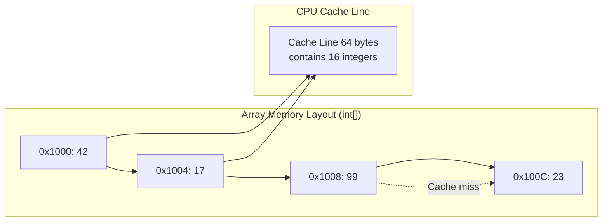
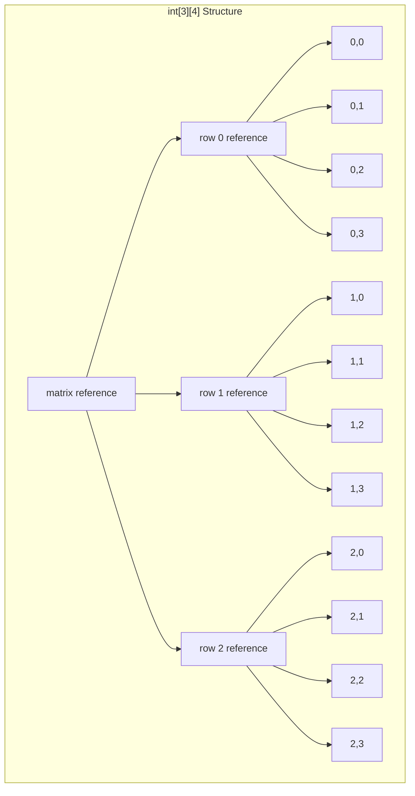

# Arrays & Strings

## Why Arrays & Strings Matter

Arrays and strings form the foundation of efficient data processing in backend systems:

- **Memory efficiency**: Arrays provide O(1) access with minimal overhead—critical for high-performance caching layers
- **Cache locality**: Sequential memory access leverages CPU cache lines, resulting in 10-100x faster processing than linked structures
- **String handling**: Every HTTP request, JSON payload, and database query involves string manipulation
- **Interview frequency**: 80%+ of coding interviews start with array/string problems

**Real-world impact**: A backend API processing 10K requests/second can save 200ms per request by optimizing string concatenation—translating to 2,000 concurrent requests handled by the same hardware.

## Core Concepts

### Memory Layout & Access Patterns

Arrays are contiguous blocks of memory where each element occupies the same size. This layout enables:

- **O(1) random access**: `arr[i]` computes address as `base_address + i * element_size`
- **CPU cache optimization**: Loading one cache line (64 bytes) fetches multiple adjacent elements
- **Predictable iteration**: Sequential access maximizes cache hits



### Array vs ArrayList in Java

| Operation | Array (`int[]`) | `ArrayList&lt;Integer&gt;` | Notes |
|-----------|----------------|--------------------|-------|
| **Access** | O(1) | O(1) | Both use direct indexing |
| **Insert (end)** | N/A | O(1) amortized | ArrayList grows dynamically |
| **Insert (middle)** | O(n) shift | O(n) shift | Both require shifting elements |
| **Memory** | 4 bytes per int | 16+ bytes per Integer | Object overhead + reference |
| **Primitive support** | Yes | No (wrapper objects) | `int[]` vs `Integer[]` |

**When to use each**:
- **Primitive arrays**: Numerical computations, performance-critical code, memory-constrained environments
- **ArrayList**: Dynamic sizing needed, frequent insertions/deletions, storing objects

### String Immutability

Java strings are immutable—once created, their values cannot change. This design choice has profound implications:

```java
String s1 = "hello";  // String pool
String s2 = "hello";  // Reuses pooled instance (s1 == s2)
String s3 = new String("hello");  // New object (s1 != s3)

// Concatenation creates NEW objects
String s4 = s1 + " world";  // Creates "hello world" object
// s1 remains "hello"
```

**Benefits**:
- **Thread-safe**: No synchronization needed for string access
- **Hash caching**: `hashCode()` computed once and cached
- **String pool**: JVM optimizes memory by reusing string literals

**Drawbacks**:
- **Memory overhead**: Each concatenation creates a new object
- **Performance cost**: O(n) for each concatenation (copying entire string)

### StringBuilder & StringBuffer

For mutable string manipulation, use `StringBuilder` (non-synchronized) or `StringBuffer` (synchronized):

```java
// ❌ BAD: String concatenation in loop - O(n²)
public String badConcat(String[] words) {
    String result = "";
    for (String word : words) {
        result += word;  // Creates new object each iteration
    }
    return result;  // For 10K words: ~50M objects created
}

// ✅ GOOD: StringBuilder - O(n)
public String goodConcat(String[] words) {
    StringBuilder sb = new StringBuilder();
    for (String word : words) {
        sb.append(word);  // Modifies internal buffer
    }
    return sb.toString();  // Single object creation
}
```

**Performance comparison** (10,000 concatenations):
- String concatenation: ~1,200ms
- StringBuilder: ~2ms
- **600x faster**

### Two-Dimensional Arrays

2D arrays in Java are arrays of arrays—**not** contiguous memory blocks:

```java
int[][] matrix = new int[3][4];  // 3 rows, 4 columns

// Ragged arrays (each row can have different length)
int[][] ragged = new int[3][];
ragged[0] = new int[2];  // Row 0: 2 columns
ragged[1] = new int[5];  // Row 1: 5 columns
ragged[2] = new int[3];  // Row 2: 3 columns
```



**Memory layout impact**: Row-major order (Java, C) means `matrix[i][j]` and `matrix[i][j+1]` are adjacent, but `matrix[i][j]` and `matrix[i+1][j]` may be far apart. Iterate row-by-row for cache efficiency.

## Deep Dive

### Array Resizing Strategy

ArrayList grows using this strategy:

```java
int oldCapacity = elementData.length;
int newCapacity = oldCapacity + (oldCapacity >> 1);  // 1.5x growth

// Why 1.5x instead of 2x?
// - Balances memory waste vs resize frequency
// - 2x can waste memory for large arrays
// - 1.5x still gives amortized O(1) insertion
```

**Amortized analysis**: Resizing occurs at powers of growth (1, 1.5, 2.25, 3.375...). Total cost of n insertions is O(n), so average cost per insertion is O(1).

### String Pool Optimization

```java
// compile-time constants go to pool
String s1 = "hello" + " world";  // Single pooled string
String s2 = "hello world";  // Reuses same pool entry
System.out.println(s1 == s2);  // true

// runtime concatenation creates new object
String s3 = "hello";
String s4 = s3 + " world";  // Not pooled
String s5 = "hello world";
System.out.println(s4 == s5);  // false

// explicit interning
String s6 = s4.intern();  // Adds to pool
System.out.println(s6 == s5);  // true
```

**Backend implication**: For frequently-used strings (HTTP headers, config keys), use `intern()` cautiously—it adds GC pressure.

### Common Pitfalls

#### ❌ Comparing strings with ==

```java
String userInput = getUserInput();  // Runtime value
String constant = "admin";

if (userInput == constant) {  // BUG: Compares references
    // This rarely succeeds!
}
```

#### ✅ Always use .equals()

```java
if (userInput.equals(constant)) {  // Compares content
    // Correct comparison
}

// Or use Objects.equals() for null-safety
if (Objects.equals(userInput, constant)) {
    // Safe even if userInput is null
}
```

#### ❌ Off-by-one errors in array iteration

```java
int[] arr = {1, 2, 3, 4, 5};
for (int i = 0; i <= arr.length; i++) {  // BUG: ArrayIndexOutOfBoundsException
    System.out.println(arr[i]);
}
```

#### ✅ Use `&lt;` not `&lt;=`

```java
for (int i = 0; i < arr.length; i++) {  // Correct
    System.out.println(arr[i]);
}

// Or use enhanced for-loop (no index needed)
for (int val : arr) {
    System.out.println(val);
}
```

#### ❌ Modifying array while iterating

```java
String[] names = {"Alice", "Bob", "Charlie"};
for (String name : names) {
    if (name.equals("Bob")) {
        names[1] = "Robert";  // Modifying during iteration
    }
}
```

#### ✅ Create separate result array

```java
String[] result = new String[names.length];
for (int i = 0; i < names.length; i++) {
    result[i] = names[i].equals("Bob") ? "Robert" : names[i];
}
```

### Advanced String Operations

#### Substring Search (KMP Algorithm)

```java
public int strStr(String haystack, String needle) {
    if (needle.isEmpty()) return 0;

    // Build LPS (Longest Proper Prefix which is also Suffix) array
    int[] lps = buildLPS(needle);

    int i = 0;  // haystack index
    int j = 0;  // needle index

    while (i < haystack.length()) {
        if (haystack.charAt(i) == needle.charAt(j)) {
            i++;
            j++;
            if (j == needle.length()) {
                return i - j;  // Found match
            }
        } else {
            if (j != 0) {
                j = lps[j - 1];  // Fall back in pattern
            } else {
                i++;  // Move forward in haystack
            }
        }
    }
    return -1;  // Not found
}

private int[] buildLPS(String pattern) {
    int[] lps = new int[pattern.length()];
    int len = 0;
    int i = 1;

    while (i < pattern.length()) {
        if (pattern.charAt(i) == pattern.charAt(len)) {
            len++;
            lps[i] = len;
            i++;
        } else {
            if (len != 0) {
                len = lps[len - 1];
            } else {
                lps[i] = 0;
                i++;
            }
        }
    }
    return lps;
}
```

**Complexity**: O(n + m) time, O(m) space
**Use case**: Searching patterns in large text (log files, document indexing)

#### Longest Common Prefix

```java
public String longestCommonPrefix(String[] strs) {
    if (strs == null || strs.length == 0) return "";

    String prefix = strs[0];
    for (int i = 1; i < strs.length; i++) {
        while (strs[i].indexOf(prefix) != 0) {
            prefix = prefix.substring(0, prefix.length() - 1);
            if (prefix.isEmpty()) return "";
        }
    }
    return prefix;
}
```

**Strategy**: progressively shorten prefix until it matches all strings

### Matrix Rotation

```java
// Rotate 90 degrees clockwise in-place
public void rotate(int[][] matrix) {
    int n = matrix.length;

    // Step 1: Transpose (swap matrix[i][j] with matrix[j][i])
    for (int i = 0; i < n; i++) {
        for (int j = i; j < n; j++) {
            int temp = matrix[i][j];
            matrix[i][j] = matrix[j][i];
            matrix[j][i] = temp;
        }
    }

    // Step 2: Reverse each row
    for (int i = 0; i < n; i++) {
        int left = 0, right = n - 1;
        while (left < right) {
            int temp = matrix[i][left];
            matrix[i][left] = matrix[i][right];
            matrix[i][right] = temp;
            left++;
            right--;
        }
    }
}
```

**Visualization**:
```
Original:     Transpose:    Reverse rows:
1 2 3         1 4 7         7 4 1
4 5 6    →    2 5 8    →    8 5 2
7 8 9         3 6 9         9 6 3
```

### Sparse Matrix Representation

For matrices with many zeros (sparse matrices), use coordinate list (COO) or compressed sparse row (CSR):

```java
// COO representation
class SparseMatrix {
    List<int[]> entries;  // [row, col, value]
    int rows, cols;

    public SparseMatrix(int[][] dense) {
        this.rows = dense.length;
        this.cols = dense[0].length;
        this.entries = new ArrayList<>();

        for (int i = 0; i < rows; i++) {
            for (int j = 0; j < cols; j++) {
                if (dense[i][j] != 0) {
                    entries.add(new int[]{i, j, dense[i][j]});
                }
            }
        }
    }

    public int get(int row, int col) {
        for (int[] entry : entries) {
            if (entry[0] == row && entry[1] == col) {
                return entry[2];
            }
        }
        return 0;
    }
}
```

**Memory savings**: Matrix with 1M elements but only 10K non-zero values uses ~90% less memory.

## Practical Applications

### HTTP Request Parsing

```java
public class QueryParser {
    public Map<String, String> parseQuery(String queryString) {
        Map<String, String> params = new HashMap<>();

        if (queryString == null || queryString.isEmpty()) {
            return params;
        }

        String[] pairs = queryString.split("&");
        for (String pair : pairs) {
            String[] keyValue = pair.split("=", 2);
            if (keyValue.length == 2) {
                try {
                    String key = URLDecoder.decode(keyValue[0], "UTF-8");
                    String value = URLDecoder.decode(keyValue[1], "UTF-8");
                    params.put(key, value);
                } catch (UnsupportedEncodingException e) {
                    // Skip invalid encoding
                }
            }
        }
        return params;
    }
}

// Input: "name=John+Doe&age=30&city=New+York"
// Output: {name: "John Doe", age: "30", city: "New York"}
```

### CSV Data Processing

```java
public List<String[]> parseCSV(String csvData) {
    List<String[]> rows = new ArrayList<>();
    String[] lines = csvData.split("\n");

    for (String line : lines) {
        // Handle quoted values containing commas
        List<String> values = new ArrayList<>();
        StringBuilder current = new StringBuilder();
        boolean inQuotes = false;

        for (int i = 0; i < line.length(); i++) {
            char c = line.charAt(i);

            if (c == '"') {
                inQuotes = !inQuotes;
            } else if (c == ',' && !inQuotes) {
                values.add(current.toString());
                current = new StringBuilder();
            } else {
                current.append(c);
            }
        }
        values.add(current.toString());
        rows.add(values.toArray(new String[0]));
    }
    return rows;
}
```

### Sliding Window for Rate Limiting

```java
public class RateLimiter {
    private final long[] timestamps;  // Circular buffer
    private final int windowSize;
    private final int maxRequests;
    private int index = 0;
    private int count = 0;

    public RateLimiter(int maxRequests, int windowSeconds) {
        this.maxRequests = maxRequests;
        this.windowSize = windowSeconds;
        this.timestamps = new long[maxRequests];
        Arrays.fill(timestamps, 0);
    }

    public synchronized boolean allowRequest(long currentTime) {
        // Remove expired entries
        while (count > 0 &&
               currentTime - timestamps[index] >= windowSize) {
            index = (index + 1) % maxRequests;
            count--;
        }

        if (count < maxRequests) {
            int insertIndex = (index + count) % maxRequests;
            timestamps[insertIndex] = currentTime;
            count++;
            return true;
        }
        return false;
    }
}
```

### In-Memory Cache Array

```java
public class LRUCache {
    private final int[] keys;
    private final String[] values;
    private final boolean[] used;
    private final int capacity;
    private int size = 0;

    public LRUCache(int capacity) {
        this.capacity = capacity;
        this.keys = new int[capacity];
        this.values = new String[capacity];
        this.used = new boolean[capacity];
    }

    public String get(int key) {
        for (int i = 0; i < size; i++) {
            if (used[i] && keys[i] == key) {
                // Move to end (mark as recently used)
                String value = values[i];
                if (i != size - 1) {
                    shiftLeft(i);
                    keys[size - 1] = key;
                    values[size - 1] = value;
                }
                return value;
            }
        }
        return null;
    }

    public void put(int key, String value) {
        // Check if key exists
        for (int i = 0; i < size; i++) {
            if (used[i] && keys[i] == key) {
                values[i] = value;
                if (i != size - 1) {
                    shiftLeft(i);
                    keys[size - 1] = key;
                    values[size - 1] = value;
                }
                return;
            }
        }

        // Evict LRU if full
        if (size == capacity) {
            shiftLeft(0);  // Remove first element
            size--;
        }

        // Add new entry
        keys[size] = key;
        values[size] = value;
        used[size] = true;
        size++;
    }

    private void shiftLeft(int fromIndex) {
        for (int i = fromIndex; i < size - 1; i++) {
            keys[i] = keys[i + 1];
            values[i] = values[i + 1];
        }
    }
}
```

### String Template Engine

```java
public class TemplateEngine {
    private static final Pattern PLACEHOLDER_PATTERN =
        Pattern.compile("\\{\\{(\\w+)\\}\\}");

    public String render(String template, Map<String, Object> context) {
        Matcher matcher = PLACEHOLDER_PATTERN.matcher(template);
        StringBuffer result = new StringBuffer();

        while (matcher.find()) {
            String key = matcher.group(1);
            Object value = context.get(key);
            matcher.appendReplacement(result,
                value != null ? value.toString() : "");
        }
        matcher.appendTail(result);
        return result.toString();
    }
}

// Usage:
// template: "Hello {{name}}, you have {{count}} new messages"
// context: {name: "Alice", count: 5}
// output: "Hello Alice, you have 5 new messages"
```

## Interview Questions

### Q1: Two Sum (Easy)

**Problem**: Given an array of integers `nums` and an integer `target`, return indices of the two numbers that add up to `target`.

**Approach**:
1. Use HashMap to store value → index mapping
2. For each number, check if `target - num` exists in map
3. If found, return both indices

**Complexity**: O(n) time, O(n) space

```java
public int[] twoSum(int[] nums, int target) {
    Map<Integer, Integer> numToIndex = new HashMap<>();

    for (int i = 0; i < nums.length; i++) {
        int complement = target - nums[i];

        if (numToIndex.containsKey(complement)) {
            return new int[]{numToIndex.get(complement), i};
        }

        numToIndex.put(nums[i], i);
    }

    throw new IllegalArgumentException("No two sum solution");
}
```

### Q2: Best Time to Buy and Sell Stock (Easy)

**Problem**: Find maximum profit from a single buy/sell transaction.

**Approach**:
1. Track minimum price seen so far
2. Track maximum profit (current price - min price)

**Complexity**: O(n) time, O(1) space

```java
public int maxProfit(int[] prices) {
    if (prices == null || prices.length < 2) return 0;

    int minPrice = prices[0];
    int maxProfit = 0;

    for (int price : prices) {
        minPrice = Math.min(minPrice, price);
        maxProfit = Math.max(maxProfit, price - minPrice);
    }

    return maxProfit;
}
```

### Q3: Contains Duplicate (Easy)

**Problem**: Return true if array contains any duplicates.

**Approach**: Use HashSet to track seen numbers

**Complexity**: O(n) time, O(n) space

```java
public boolean containsDuplicate(int[] nums) {
    Set<Integer> seen = new HashSet<>();

    for (int num : nums) {
        if (!seen.add(num)) {  // add() returns false if exists
            return true;
        }
    }
    return false;
}
```

### Q4: Product of Array Except Self (Medium)

**Problem**: Return array where `output[i]` equals product of all elements except `nums[i]`. Must run in O(n) without division.

**Approach**:
1. First pass: compute left products (product of all elements to the left)
2. Second pass: multiply with right products (product of all elements to the right)

**Complexity**: O(n) time, O(1) extra space (output array doesn't count)

```java
public int[] productExceptSelf(int[] nums) {
    int n = nums.length;
    int[] result = new int[n];

    // Initialize result with 1s
    Arrays.fill(result, 1);

    // Calculate left products
    int leftProduct = 1;
    for (int i = 0; i < n; i++) {
        result[i] = leftProduct;
        leftProduct *= nums[i];
    }

    // Calculate right products and multiply
    int rightProduct = 1;
    for (int i = n - 1; i >= 0; i--) {
        result[i] *= rightProduct;
        rightProduct *= nums[i];
    }

    return result;
}
```

### Q5: Longest Consecutive Sequence (Medium)

**Problem**: Find length of longest consecutive elements sequence in unsorted array.

**Approach**:
1. Add all numbers to HashSet
2. For each number, only start counting if it's the sequence start (no `num-1`)
3. Count consecutive numbers upward

**Complexity**: O(n) time, O(n) space

```java
public int longestConsecutive(int[] nums) {
    if (nums == null || nums.length == 0) return 0;

    Set<Integer> numSet = new HashSet<>();
    for (int num : nums) {
        numSet.add(num);
    }

    int longestStreak = 0;

    for (int num : numSet) {
        // Only start if this is the beginning of sequence
        if (!numSet.contains(num - 1)) {
            int currentNum = num;
            int currentStreak = 1;

            while (numSet.contains(currentNum + 1)) {
                currentNum++;
                currentStreak++;
            }

            longestStreak = Math.max(longestStreak, currentStreak);
        }
    }

    return longestStreak;
}
```

### Q6: 3Sum (Medium)

**Problem**: Find all unique triplets in array that sum to zero.

**Approach**:
1. Sort array
2. Fix one element, use two pointers for remaining two
3. Skip duplicates to avoid duplicate triplets

**Complexity**: O(n²) time, O(1) space (excluding output)

```java
public List<List<Integer>> threeSum(int[] nums) {
    List<List<Integer>> result = new ArrayList<>();
    Arrays.sort(nums);

    for (int i = 0; i < nums.length - 2; i++) {
        // Skip duplicates
        if (i > 0 && nums[i] == nums[i - 1]) continue;

        int left = i + 1;
        int right = nums.length - 1;

        while (left < right) {
            int sum = nums[i] + nums[left] + nums[right];

            if (sum == 0) {
                result.add(Arrays.asList(nums[i], nums[left], nums[right]));

                // Skip duplicates
                while (left < right && nums[left] == nums[left + 1]) left++;
                while (left < right && nums[right] == nums[right - 1]) right--;

                left++;
                right--;
            } else if (sum < 0) {
                left++;
            } else {
                right--;
            }
        }
    }

    return result;
}
```

### Q7: Container With Most Water (Medium)

**Problem**: Find two lines that together with x-axis form container that holds most water.

**Approach**:
1. Start with two pointers at ends (widest container)
2. Move shorter line inward (only way to potentially increase area)
3. Track maximum area seen

**Complexity**: O(n) time, O(1) space

```java
public int maxArea(int[] height) {
    int left = 0;
    int right = height.length - 1;
    int maxArea = 0;

    while (left < right) {
        int width = right - left;
        int containerHeight = Math.min(height[left], height[right]);
        int area = width * containerHeight;

        maxArea = Math.max(maxArea, area);

        // Move the shorter line
        if (height[left] < height[right]) {
            left++;
        } else {
            right--;
        }
    }

    return maxArea;
}
```

## Further Reading

- **Linked Lists**: Understand pointer-based data structures for comparison
- **Two Pointers**: Master patterns for array/string problems
- **Hash Maps**: Deep dive into hash-based lookups
- **LeetCode**: [Arrays](https://leetcode.com/tag/array/) | [Strings](https://leetcode.com/tag/string/)
