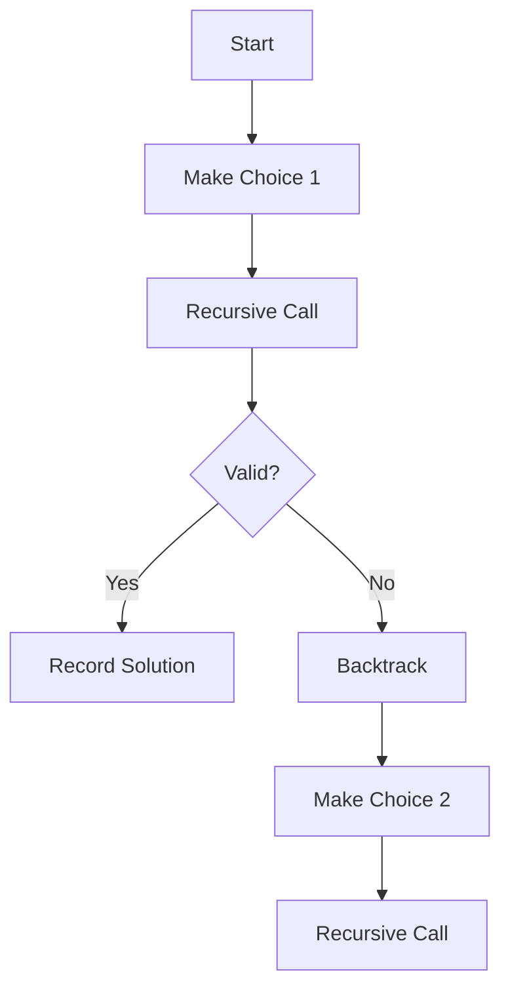

# Backtracking

## Why Backtracking Matters

Backtracking systematically explores all possibilities by building solutions incrementally and abandoning partial solutions that cannot possibly lead to valid solutions:

- **Combinatorial problems**: Generate all permutations/combinations
- **Constraint satisfaction**: Sudoku, N-Queens, crossword puzzles
- **Path finding**: Maze solving, graph traversal
- **Optimization**: Finding optimal solution among many possibilities

**Real-world impact**:
- N-Queens with backtracking: 2 seconds for N=8
- Brute force checking all positions: 4 hours for N=8
- **7,200x speedup**

## Core Concepts

### Backtracking Template

```java
void backtrack(state, parameters) {
    if (isSolution(state)) {
        recordSolution(state);
        return;
    }

    for (choice in generateChoices(state)) {
        if (isValid(choice)) {
            makeChoice(choice);
            backtrack(state, parameters);
            undoChoice(choice);  // Backtrack
        }
    }
}
```



### Backtracking vs Recursion

| Aspect | Backtracking | Recursion |
|--------|-------------|-----------|
| **Search space** | Systematic exploration | Divide and conquer |
| **Pruning** | Aggressive (early termination) | Usually no pruning |
| **Use case** | Constraint satisfaction | Problem decomposition |
| **State management** | Make/undo choices | No state rollback needed |

## Deep Dive

### Permutations

Generate all possible arrangements:

```java
public List<List<Integer>> permute(int[] nums) {
    List<List<Integer>> result = new ArrayList<>();
    backtrack(result, new ArrayList<>(), new boolean[nums.length], nums);
    return result;
}

private void backtrack(List<List<Integer>> result, List<Integer> current,
                      boolean[] used, int[] nums) {
    if (current.size() == nums.length) {
        result.add(new ArrayList<>(current));
        return;
    }

    for (int i = 0; i < nums.length; i++) {
        if (used[i]) continue;

        current.add(nums[i]);
        used[i] = true;

        backtrack(result, current, used, nums);

        current.remove(current.size() - 1);  // Backtrack
        used[i] = false;
    }
}
```

### Combinations

Generate all k-element combinations:

```java
public List<List<Integer>> combine(int n, int k) {
    List<List<Integer>> result = new ArrayList<>();
    backtrack(result, new ArrayList<>(), 1, n, k);
    return result;
}

private void backtrack(List<List<Integer>> result, List<Integer> current,
                      int start, int n, int k) {
    if (current.size() == k) {
        result.add(new ArrayList<>(current));
        return;
    }

    for (int i = start; i <= n; i++) {
        current.add(i);
        backtrack(result, current, i + 1, n, k);  // Note: i + 1 not start
        current.remove(current.size() - 1);  // Backtrack
    }
}
```

### Pruning Strategies

#### Remove duplicates in permutations

```java
public List<List<Integer>> permuteUnique(int[] nums) {
    List<List<Integer>> result = new ArrayList<>();
    Arrays.sort(nums);  // Sort to group duplicates
    backtrack(result, new ArrayList<>(), new boolean[nums.length], nums);
    return result;
}

private void backtrack(List<List<Integer>> result, List<Integer> current,
                      boolean[] used, int[] nums) {
    if (current.size() == nums.length) {
        result.add(new ArrayList<>(current));
        return;
    }

    for (int i = 0; i < nums.length; i++) {
        if (used[i]) continue;

        // Skip duplicates: use only first occurrence of repeated number
        if (i > 0 && nums[i] == nums[i - 1] && !used[i - 1]) continue;

        current.add(nums[i]);
        used[i] = true;

        backtrack(result, current, used, nums);

        current.remove(current.size() - 1);
        used[i] = false;
    }
}
```

### Common Pitfalls

#### ❌ Not copying solution before adding

```java
if (current.size() == k) {
    result.add(current);  // BUG: Adds reference!
}
```

#### ✅ Create new copy

```java
if (current.size() == k) {
    result.add(new ArrayList<>(current));  // Copy
}
```

#### ❌ Not undoing choice

```java
for (int i = 0; i < n; i++) {
    current.add(i);
    backtrack(current);
    // Forgot to remove!
}
```

#### ✅ Always backtrack

```java
for (int i = 0; i < n; i++) {
    current.add(i);
    backtrack(current);
    current.remove(current.size() - 1);  // Remove
}
```

## Practical Applications

### N-Queens

```java
public List<List<String>> solveNQueens(int n) {
    List<List<String>> result = new ArrayList<>();
    char[][] board = new char[n][n];

    for (int i = 0; i < n; i++) {
        Arrays.fill(board[i], '.');
    }

    backtrack(result, board, 0);
    return result;
}

private void backtrack(List<List<String>> result, char[][] board, int row) {
    int n = board.length;

    if (row == n) {
        result.add(constructBoard(board));
        return;
    }

    for (int col = 0; col < n; col++) {
        if (isValid(board, row, col)) {
            board[row][col] = 'Q';
            backtrack(result, board, row + 1);
            board[row][col] = '.';  // Backtrack
        }
    }
}

private boolean isValid(char[][] board, int row, int col) {
    int n = board.length;

    // Check column
    for (int i = 0; i < row; i++) {
        if (board[i][col] == 'Q') return false;
    }

    // Check upper-left diagonal
    for (int i = row - 1, j = col - 1; i >= 0 && j >= 0; i--, j--) {
        if (board[i][j] == 'Q') return false;
    }

    // Check upper-right diagonal
    for (int i = row - 1, j = col + 1; i >= 0 && j < n; i--, j++) {
        if (board[i][j] == 'Q') return false;
    }

    return true;
}
```

## Interview Questions

### Q1: Subsets (Medium)

**Problem**: Generate all subsets.

**Approach**: Include/exclude each element

**Complexity**: O(2ⁿ) time

```java
public List<List<Integer>> subsets(int[] nums) {
    List<List<Integer>> result = new ArrayList<>();
    backtrack(result, new ArrayList<>(), nums, 0);
    return result;
}

private void backtrack(List<List<Integer>> result, List<Integer> current,
                      int[] nums, int start) {
    result.add(new ArrayList<>(current));

    for (int i = start; i < nums.length; i++) {
        current.add(nums[i]);
        backtrack(result, current, nums, i + 1);
        current.remove(current.size() - 1);
    }
}
```

### Q2: Combination Sum (Medium)

**Problem**: Find all combinations summing to target (reuse allowed).

**Approach**: Backtrack with target reduction

**Complexity**: O(N^(T/M+1)) time

```java
public List<List<Integer>> combinationSum(int[] candidates, int target) {
    List<List<Integer>> result = new ArrayList<>();
    Arrays.sort(candidates);  // Enable early stopping
    backtrack(result, new ArrayList<>(), candidates, target, 0);
    return result;
}

private void backtrack(List<List<Integer>> result, List<Integer> current,
                      int[] nums, int remain, int start) {
    if (remain == 0) {
        result.add(new ArrayList<>(current));
        return;
    }

    for (int i = start; i < nums.length; i++) {
        if (nums[i] > remain) break;  // Early stop

        current.add(nums[i]);
        backtrack(result, current, nums, remain - nums[i], i);  // Not i+1 (reuse allowed)
        current.remove(current.size() - 1);
    }
}
```

## Further Reading

- **DP**: For optimization subproblems
- **Recursion**: Foundation of backtracking
- **DFS**: Graph exploration uses backtracking
- **LeetCode**: [Backtracking problems](https://leetcode.com/tag/backtracking/)
