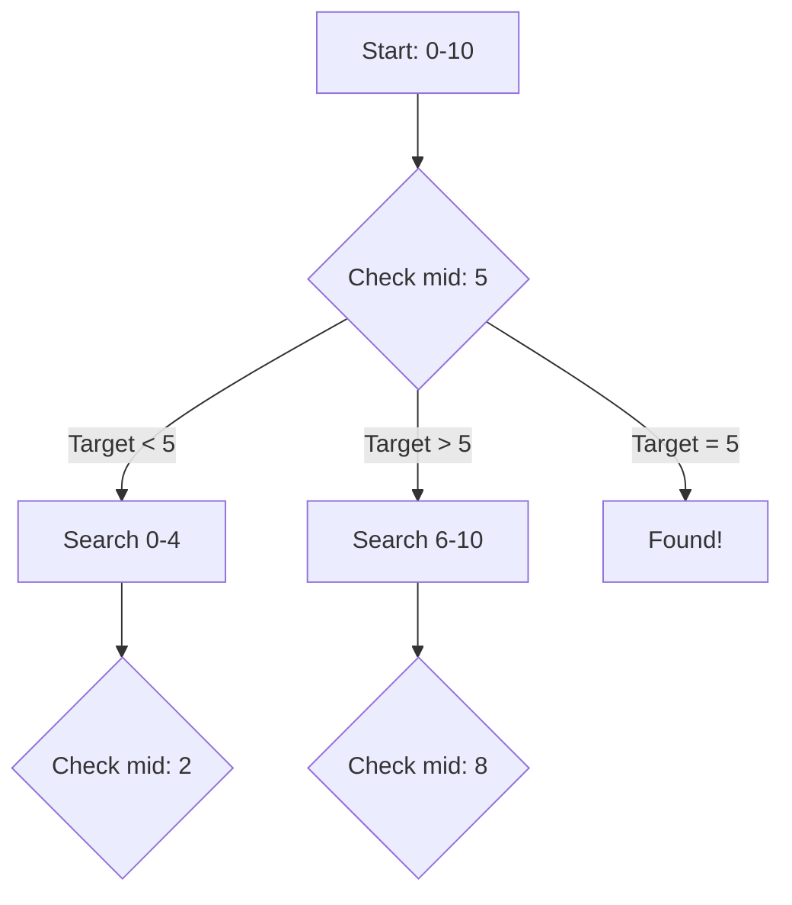

# Binary Search

## Why Binary Search Matters

Binary search reduces search time from O(n) to O(log n)—exponentially faster:

- **Database indexes**: B+ Tree uses binary search for key lookup
- **Version control systems**: Git bisect finds bugs in log time
- **API pagination**: Binary search through sorted result sets
- **Optimization problems**: Binary search on answer space

**Real-world impact**: Searching in 1 billion sorted elements:
- Linear search: ~500 million comparisons (5 seconds)
- Binary search: ~30 comparisons (0.000003 seconds)
- **1.6 billion times faster**

## Core Concepts

### Standard Binary Search



**Precondition**: Array must be sorted

```java
public int binarySearch(int[] nums, int target) {
    int left = 0;
    int right = nums.length - 1;

    while (left <= right) {
        int mid = left + (right - left) / 2;  // Prevent overflow

        if (nums[mid] == target) {
            return mid;  // Found
        } else if (nums[mid] < target) {
            left = mid + 1;  // Search right half
        } else {
            right = mid - 1;  // Search left half
        }
    }

    return -1;  // Not found
}
```

**Why `left + (right - left) / 2` instead of `(left + right) / 2`?**
- `(left + right)` can overflow for large values
- `left + (right - left) / 2` is equivalent but safe

**Complexity**: O(log n) time, O(1) space

### Template Patterns

#### Template 1: Standard (left ≤ right)

Use when searching for exact match:

```java
public int binarySearch(int[] nums, int target) {
    int left = 0, right = nums.length - 1;

    while (left <= right) {
        int mid = left + (right - left) / 2;

        if (nums[mid] == target) return mid;
        if (nums[mid] < target) left = mid + 1;
        else right = mid - 1;
    }

    return -1;  // Not found
}
```

**Post-condition**: `left = right + 1`, search space is empty

#### Template 2: Lower Bound (left &lt; right)

Use when finding first position meeting condition:

```java
public int lowerBound(int[] nums, int target) {
    int left = 0, right = nums.length;

    while (left < right) {
        int mid = left + (right - left) / 2;

        if (nums[mid] < target) {
            left = mid + 1;
        } else {
            right = mid;
        }
    }

    return left;  // First index where nums[index] >= target
}
```

**Post-condition**: `left == right`, points to first valid position

#### Template 3: Upper Bound (left &lt; right)

Use when finding first element > target:

```java
public int upperBound(int[] nums, int target) {
    int left = 0, right = nums.length;

    while (left < right) {
        int mid = left + (right - left) / 2;

        if (nums[mid] <= target) {
            left = mid + 1;
        } else {
            right = mid;
        }
    }

    return left;  // First index where nums[index] > target
}
```

## Deep Dive

### Binary Search on Answer

When the answer space is monotonic (if x works, all values > x also work):

```java
// Problem: Find minimum x such that f(x) is true
public int binarySearchOnAnswer(int min, int max) {
    int left = min, right = max;
    int result = -1;

    while (left <= right) {
        int mid = left + (right - left) / 2;

        if (check(mid)) {  // f(mid) is true
            result = mid;   // Save valid answer
            right = mid - 1;  // Try smaller
        } else {
            left = mid + 1;  // Need larger
        }
    }

    return result;
}

abstract boolean check(int x);  // Predicate function
```

**Use cases**:
- Finding minimum sufficient value
- Finding maximum feasible value
- Split array largest sum (LeetCode 410)
- Capacity to ship packages (LeetCode 1011)

### Search in Rotated Sorted Array

Array was sorted then rotated at unknown pivot:

```
Original: [0, 1, 2, 4, 5, 6, 7]
Rotated:  [4, 5, 6, 7, 0, 1, 2]
                  ↑
               pivot point
```

```java
public int searchRotated(int[] nums, int target) {
    int left = 0, right = nums.length - 1;

    while (left <= right) {
        int mid = left + (right - left) / 2;

        if (nums[mid] == target) return mid;

        // Left half is sorted
        if (nums[left] <= nums[mid]) {
            if (target >= nums[left] && target < nums[mid]) {
                right = mid - 1;  // Target in left half
            } else {
                left = mid + 1;  // Target in right half
            }
        }
        // Right half is sorted
        else {
            if (target > nums[mid] && target <= nums[right]) {
                left = mid + 1;  // Target in right half
            } else {
                right = mid - 1;  // Target in left half
            }
        }
    }

    return -1;  // Not found
}
```

**Key insight**: At least one half (left or right) is always sorted

### Find Minimum in Rotated Sorted Array

```java
public int findMin(int[] nums) {
    int left = 0, right = nums.length - 1;

    while (left < right) {
        int mid = left + (right - left) / 2;

        if (nums[mid] > nums[right]) {
            // Min is in right half
            left = mid + 1;
        } else {
            // Min is in left half (including mid)
            right = mid;
        }
    }

    return nums[left];
}
```

### Common Pitfalls

#### ❌ Off-by-one errors

```java
while (left < right) {  // BUG: misses last element
    int mid = left + (right - left) / 2;
    if (nums[mid] == target) return mid;
    if (nums[mid] < target) left = mid;  // Should be mid + 1
    else right = mid;  // Should be mid - 1
}
```

#### ✅ Use correct bounds

```java
while (left <= right) {
    int mid = left + (right - left) / 2;
    if (nums[mid] == target) return mid;
    if (nums[mid] < target) left = mid + 1;
    else right = mid - 1;
}
```

#### ❌ Integer overflow

```java
int mid = (left + right) / 2;  // Can overflow!
```

#### ✅ Safe calculation

```java
int mid = left + (right - left) / 2;  // No overflow
// Or Java 9+:
int mid = Math.addExact(left, right) / 2;
```

#### ❌ Infinite loop with wrong update

```java
while (left < right) {
    int mid = left + (right - left) / 2;
    if (condition(mid)) {
        right = mid;  // Might not progress!
    } else {
        left = mid;  // Might not progress!
    }
}
```

#### ✅ Ensure progress

```java
while (left < right) {
    int mid = left + (right - left) / 2;
    if (condition(mid)) {
        right = mid;  // Narrow to [left, mid]
    } else {
        left = mid + 1;  // Narrow to [mid+1, right]
    }
}
```

## Practical Applications

### First and Last Position of Element

```java
public int[] searchRange(int[] nums, int target) {
    int[] result = new int[]{-1, -1};

    // Find first occurrence
    result[0] = findFirst(nums, target);

    // Find last occurrence
    result[1] = findLast(nums, target);

    return result;
}

private int findFirst(int[] nums, int target) {
    int left = 0, right = nums.length - 1;
    int first = -1;

    while (left <= right) {
        int mid = left + (right - left) / 2;

        if (nums[mid] == target) {
            first = mid;
            right = mid - 1;  // Continue searching left
        } else if (nums[mid] < target) {
            left = mid + 1;
        } else {
            right = mid - 1;
        }
    }

    return first;
}

private int findLast(int[] nums, int target) {
    int left = 0, right = nums.length - 1;
    int last = -1;

    while (left <= right) {
        int mid = left + (right - left) / 2;

        if (nums[mid] == target) {
            last = mid;
            left = mid + 1;  // Continue searching right
        } else if (nums[mid] < target) {
            left = mid + 1;
        } else {
            right = mid - 1;
        }
    }

    return last;
}
```

### Search Insert Position

```java
public int searchInsert(int[] nums, int target) {
    int left = 0, right = nums.length;

    while (left < right) {
        int mid = left + (right - left) / 2;

        if (nums[mid] < target) {
            left = mid + 1;
        } else {
            right = mid;
        }
    }

    return left;
}
```

### Square Root (Binary Search on Answer)

```java
public int mySqrt(int x) {
    if (x < 2) return x;

    int left = 2, right = x / 2;
    int result = 0;

    while (left <= right) {
        int mid = left + (right - left) / 2;
        long square = (long) mid * mid;

        if (square == x) {
            return mid;
        } else if (square < x) {
            result = mid;
            left = mid + 1;
        } else {
            right = mid - 1;
        }
    }

    return result;
}
```

### Search in 2D Matrix

Matrix where each row is sorted and first element of each row > last element of previous row:

```java
public boolean searchMatrix(int[][] matrix, int target) {
    if (matrix == null || matrix.length == 0) return false;

    int m = matrix.length, n = matrix[0].length;
    int left = 0, right = m * n - 1;

    while (left <= right) {
        int mid = left + (right - left) / 2;
        int midValue = matrix[mid / n][mid % n];

        if (midValue == target) return true;
        if (midValue < target) {
            left = mid + 1;
        } else {
            right = mid - 1;
        }
    }

    return false;
}
```

**Optimization**: Treat 2D array as 1D array

## Interview Questions

### Q1: Binary Search (Easy)

**Problem**: Classic binary search in sorted array.

**Approach**: Standard template

**Complexity**: O(log n) time, O(1) space

```java
public int search(int[] nums, int target) {
    int left = 0, right = nums.length - 1;

    while (left <= right) {
        int mid = left + (right - left) / 2;

        if (nums[mid] == target) return mid;
        if (nums[mid] < target) left = mid + 1;
        else right = mid - 1;
    }

    return -1;
}
```

### Q2: Search Insert Position (Easy)

**Problem**: Find index where target should be inserted.

**Approach**: Lower bound

**Complexity**: O(log n) time, O(1) space

```java
public int searchInsert(int[] nums, int target) {
    int left = 0, right = nums.length;

    while (left < right) {
        int mid = left + (right - left) / 2;

        if (nums[mid] < target) {
            left = mid + 1;
        } else {
            right = mid;
        }
    }

    return left;
}
```

### Q3: First Bad Version (Easy)

**Problem**: Find first bad version (API call).

**Approach**: Binary search on answer

**Complexity**: O(log n) time, O(1) space

```java
public int firstBadVersion(int n) {
    int left = 1, right = n;

    while (left < right) {
        int mid = left + (right - left) / 2;

        if (isBadVersion(mid)) {
            right = mid;
        } else {
            left = mid + 1;
        }
    }

    return left;
}
```

### Q4: Search in Rotated Array (Medium)

**Problem**: Search in sorted array rotated at pivot.

**Approach**: Modified binary search checking sorted half

**Complexity**: O(log n) time, O(1) space

```java
public int search(int[] nums, int target) {
    int left = 0, right = nums.length - 1;

    while (left <= right) {
        int mid = left + (right - left) / 2;

        if (nums[mid] == target) return mid;

        if (nums[left] <= nums[mid]) {
            if (target >= nums[left] && target < nums[mid]) {
                right = mid - 1;
            } else {
                left = mid + 1;
            }
        } else {
            if (target > nums[mid] && target <= nums[right]) {
                left = mid + 1;
            } else {
                right = mid - 1;
            }
        }
    }

    return -1;
}
```

### Q5: Find Minimum in Rotated Array (Medium)

**Problem**: Find minimum element in rotated sorted array.

**Approach**: Binary search comparing mid with right

**Complexity**: O(log n) time, O(1) space

```java
public int findMin(int[] nums) {
    int left = 0, right = nums.length - 1;

    while (left < right) {
        int mid = left + (right - left) / 2;

        if (nums[mid] > nums[right]) {
            left = mid + 1;
        } else {
            right = mid;
        }
    }

    return nums[left];
}
```

### Q6: Search a 2D Matrix (Medium)

**Problem**: Search in 2D matrix with row-wise and column-wise sorting.

**Approach**: Start from top-right or bottom-left

**Complexity**: O(m + n) time, O(1) space

```java
public boolean searchMatrix(int[][] matrix, int target) {
    if (matrix == null || matrix.length == 0) return false;

    int m = matrix.length, n = matrix[0].length;
    int row = 0, col = n - 1;  // Start from top-right

    while (row < m && col >= 0) {
        if (matrix[row][col] == target) return true;
        if (matrix[row][col] > target) {
            col--;  // Move left
        } else {
            row++;  // Move down
        }
    }

    return false;
}
```

### Q7: Find Peak Element (Medium)

**Problem**: Find a peak element (greater than neighbors).

**Approach**: Binary search comparing mid with mid+1

**Complexity**: O(log n) time, O(1) space

```java
public int findPeakElement(int[] nums) {
    int left = 0, right = nums.length - 1;

    while (left < right) {
        int mid = left + (right - left) / 2;

        if (nums[mid] < nums[mid + 1]) {
            // Peak is on the right
            left = mid + 1;
        } else {
            // Peak is on the left (including mid)
            right = mid;
        }
    }

    return left;
}
```

## Further Reading

- **Two Pointers**: Often combined with binary search
- **Sliding Window**: For range queries
- **Sorting**: Prerequisite for binary search
- **LeetCode**: [Binary Search problems](https://leetcode.com/tag/binary-search/)
