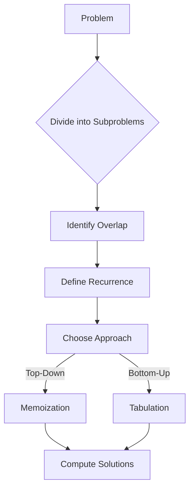

# Dynamic Programming

## Why Dynamic Programming Matters

DP solves optimization problems by breaking them into overlapping subproblems—avoiding redundant computation:

- **Optimization problems**: Find maximum/minimum value
- **Counting problems**: Count ways/arrangements
- **String matching**: Edit distance, LCS
- **Resource allocation**: Knapsack, partitioning

**Real-world impact**:
- Computing Fibonacci(50):
  - Naive recursion: 2⁵⁰ ≈ 10¹⁵ operations (hours)
  - DP memoization: 50 operations (instant)
  - **10 trillion times faster**
- Sequence alignment in bioinformatics (DNA comparison) uses DP

## Core Concepts

### DP Recipe

1. **Define subproblems**: What smaller problem builds solution?
2. **State definition**: What parameters identify subproblem?
3. **Recurrence relation**: How to combine subproblem solutions?
4. **Base cases**: Smallest solvable subproblems
5. **Order**: Bottom-up (tabulation) or top-down (memoization)?



### Top-Down vs Bottom-Up

| Aspect | Top-Down (Memoization) | Bottom-Up (Tabulation) |
|--------|------------------------|----------------------|
| **Approach** | Recursive with cache | Iterative, fill table |
| **Memory** | O(recursion depth) | O(table size) |
| **Speed** | Overhead of recursion | Often faster |
| **Easier** | Natural from recurrence | May need thinking about order |

### When to Use DP

**Characteristics**:
1. **Optimal substructure**: Optimal solution contains optimal sub-solutions
2. **Overlapping subproblems**: Same subproblems recur
3. **Choice**: Problem involves making decisions

**Red flags** (use other approaches):
- Input size > 200 (DP might be too slow)
- Need to output actual solutions, not just count
- Greedy choice property exists

## Deep Dive

### 1D DP Examples

#### Climbing Stairs

```java
public int climbStairs(int n) {
    if (n <= 2) return n;

    int prev2 = 1, prev1 = 2, current = 0;

    for (int i = 3; i <= n; i++) {
        current = prev1 + prev2;
        prev2 = prev1;
        prev1 = current;
    }

    return current;
}
```

**Recurrence**: `dp[i] = dp[i-1] + dp[i-2]` (ways to reach step i from i-1 or i-2)

#### House Robber

```java
public int rob(int[] nums) {
    if (nums.length == 0) return 0;
    if (nums.length == 1) return nums[0];

    int prev2 = 0, prev1 = 0, current = 0;

    for (int num : nums) {
        current = Math.max(prev1, prev2 + num);
        prev2 = prev1;
        prev1 = current;
    }

    return current;
}
```

**State**: `dp[i]` = max money from houses[0...i]
**Recurrence**: `dp[i] = max(dp[i-1], dp[i-2] + nums[i])`

### 2D DP Examples

#### Unique Paths

```java
public int uniquePaths(int m, int n) {
    int[][] dp = new int[m][n];

    // Only one way to reach cells in first row/col
    for (int i = 0; i < m; i++) dp[i][0] = 1;
    for (int j = 0; j < n; j++) dp[0][j] = 1;

    for (int i = 1; i < m; i++) {
        for (int j = 1; j < n; j++) {
            dp[i][j] = dp[i-1][j] + dp[i][j-1];
        }
    }

    return dp[m-1][n-1];
}
```

**Recurrence**: `dp[i][j] = dp[i-1][j] + dp[i][j-1]` (paths from above + paths from left)

#### Longest Common Subsequence

```java
public int longestCommonSubsequence(String text1, String text2) {
    int m = text1.length(), n = text2.length();
    int[][] dp = new int[m + 1][n + 1];

    for (int i = 1; i <= m; i++) {
        for (int j = 1; j <= n; j++) {
            if (text1.charAt(i - 1) == text2.charAt(j - 1)) {
                dp[i][j] = dp[i - 1][j - 1] + 1;
            } else {
                dp[i][j] = Math.max(dp[i - 1][j], dp[i][j - 1]);
            }
        }
    }

    return dp[m][n];
}
```

**Recurrence**:
- If chars match: `dp[i][j] = dp[i-1][j-1] + 1`
- Otherwise: `dp[i][j] = max(dp[i-1][j], dp[i][j-1])`

### Common Pitfalls

#### ❌ Not handling edge cases

```java
public int badRob(int[] nums) {
    int[] dp = new int[nums.length];
    // BUG: ArrayIndexOutOfBounds if nums.length < 2
    dp[1] = Math.max(nums[0], nums[1]);
}
```

#### ✅ Handle edge cases

```java
public int goodRob(int[] nums) {
    if (nums.length == 0) return 0;
    if (nums.length == 1) return nums[0];
    if (nums.length == 2) return Math.max(nums[0], nums[1]);

    // Now safe to use dp[i-2]
    int[] dp = new int[nums.length];
    dp[1] = Math.max(nums[0], nums[1]);
}
```

#### ❌ Using wrong recurrence

```java
// For coin change, trying greedy instead of DP
int coins = {1, 3, 4};
int amount = 6;
// Greedy: 4 + 1 + 1 = 3 coins
// Optimal: 3 + 3 = 2 coins
```

#### ✅ Use DP for optimization

```java
public int coinChange(int[] coins, int amount) {
    int[] dp = new int[amount + 1];
    Arrays.fill(dp, amount + 1);  // Initialize to "infinity"
    dp[0] = 0;

    for (int i = 1; i <= amount; i++) {
        for (int coin : coins) {
            if (coin <= i) {
                dp[i] = Math.min(dp[i], dp[i - coin] + 1);
            }
        }
    }

    return dp[amount] > amount ? -1 : dp[amount];
}
```

### Advanced: State Machine DP

#### Best Time to Buy and Sell Stock with Cooldown

```java
public int maxProfit(int[] prices) {
    if (prices.length <= 1) return 0;

    int n = prices.length;

    // hold[i]: max profit on day i with stock in hand
    // sold[i]: max profit on day i after selling stock
    // rest[i]: max profit on day i in cooldown (no stock, just sold)

    int hold = -prices[0], sold = 0, rest = 0;

    for (int i = 1; i < n; i++) {
        int prevHold = hold, prevSold = sold, prevRest = rest;

        hold = Math.max(prevHold, prevRest - prices[i]);
        sold = prevHold + prices[i];
        rest = Math.max(prevRest, prevSold);
    }

    return Math.max(sold, rest);
}
```

## Practical Applications

### Edit Distance (Levenshtein Distance)

```java
public int minDistance(String word1, String word2) {
    int m = word1.length(), n = word2.length();
    int[][] dp = new int[m + 1][n + 1];

    // Base cases
    for (int i = 0; i <= m; i++) dp[i][0] = i;  // Delete all
    for (int j = 0; j <= n; j++) dp[0][j] = j;  // Insert all

    for (int i = 1; i <= m; i++) {
        for (int j = 1; j <= n; j++) {
            if (word1.charAt(i - 1) == word2.charAt(j - 1)) {
                dp[i][j] = dp[i - 1][j - 1];  // No operation
            } else {
                int insert = dp[i][j - 1] + 1;
                int delete = dp[i - 1][j] + 1;
                int replace = dp[i - 1][j - 1] + 1;
                dp[i][j] = Math.min(insert, Math.min(delete, replace));
            }
        }
    }

    return dp[m][n];
}
```

**Use cases**:
- Spell checking (suggestions)
- DNA sequence alignment
- Plagiarism detection

### Palindromic Substrings

```java
public int countSubstrings(String s) {
    int n = s.length();
    boolean[][] dp = new boolean[n][n];
    int count = 0;

    // Single characters
    for (int i = 0; i < n; i++) {
        dp[i][i] = true;
        count++;
    }

    // Two characters
    for (int i = 0; i < n - 1; i++) {
        if (s.charAt(i) == s.charAt(i + 1)) {
            dp[i][i + 1] = true;
            count++;
        }
    }

    // Longer substrings
    for (int len = 3; len <= n; len++) {
        for (int i = 0; i <= n - len; i++) {
            int j = i + len - 1;

            if (s.charAt(i) == s.charAt(j) && dp[i + 1][j - 1]) {
                dp[i][j] = true;
                count++;
            }
        }
    }

    return count;
}
```

## Interview Questions

### Q1: Climbing Stairs (Easy)

**Problem**: Count ways to climb n stairs (1 or 2 steps at a time).

**Approach**: Fibonacci-like DP

**Complexity**: O(n) time, O(1) space

```java
public int climbStairs(int n) {
    if (n <= 2) return n;

    int prev2 = 1, prev1 = 2, current = 0;

    for (int i = 3; i <= n; i++) {
        current = prev1 + prev2;
        prev2 = prev1;
        prev1 = current;
    }

    return current;
}
```

### Q2: House Robber (Medium)

**Problem**: Max money from non-adjacent houses.

**Approach**: DP with state: max at i is max(skip i, rob i + dp[i-2])

**Complexity**: O(n) time, O(1) space

```java
public int rob(int[] nums) {
    int prev2 = 0, prev1 = 0;

    for (int num : nums) {
        int current = Math.max(prev1, prev2 + num);
        prev2 = prev1;
        prev1 = current;
    }

    return prev1;
}
```

### Q3: Coin Change (Medium)

**Problem**: Minimum coins to make amount.

**Approach**: 1D DP, try each coin

**Complexity**: O(n × amount) time

```java
public int coinChange(int[] coins, int amount) {
    int[] dp = new int[amount + 1];
    Arrays.fill(dp, amount + 1);
    dp[0] = 0;

    for (int i = 1; i <= amount; i++) {
        for (int coin : coins) {
            if (coin <= i) {
                dp[i] = Math.min(dp[i], dp[i - coin] + 1);
            }
        }
    }

    return dp[amount] > amount ? -1 : dp[amount];
}
```

### Q4: Longest Increasing Subsequence (Medium)

**Problem**: Find LIS length.

**Approach**: DP with binary search optimization

**Complexity**: O(n log n) time, O(n) space

```java
public int lengthOfLIS(int[] nums) {
    int[] tails = new int[nums.length];
    int size = 0;

    for (int num : nums) {
        int left = 0, right = size;

        while (left < right) {
            int mid = left + (right - left) / 2;
            if (tails[mid] < num) left = mid + 1;
            else right = mid;
        }

        tails[left] = num;
        if (left == size) size++;
    }

    return size;
}
```

### Q5: Longest Common Subsequence (Medium)

**Problem**: Find LCS length between two strings.

**Approach**: 2D DP

**Complexity**: O(m × n) time

```java
public int longestCommonSubsequence(String text1, String text2) {
    int m = text1.length(), n = text2.length();
    int[][] dp = new int[m + 1][n + 1];

    for (int i = 1; i <= m; i++) {
        for (int j = 1; j <= n; j++) {
            if (text1.charAt(i - 1) == text2.charAt(j - 1)) {
                dp[i][j] = dp[i - 1][j - 1] + 1;
            } else {
                dp[i][j] = Math.max(dp[i - 1][j], dp[i][j - 1]);
            }
        }
    }

    return dp[m][n];
}
```

### Q6: Edit Distance (Medium)

**Problem**: Minimum operations to convert word1 to word2.

**Approach**: 2D DP with insert/delete/replace

**Complexity**: O(m × n) time

```java
public int minDistance(String word1, String word2) {
    int m = word1.length(), n = word2.length();
    int[][] dp = new int[m + 1][n + 1];

    for (int i = 0; i <= m; i++) dp[i][0] = i;
    for (int j = 0; j <= n; j++) dp[0][j] = j;

    for (int i = 1; i <= m; i++) {
        for (int j = 1; j <= n; j++) {
            if (word1.charAt(i - 1) == word2.charAt(j - 1)) {
                dp[i][j] = dp[i - 1][j - 1];
            } else {
                dp[i][j] = Math.min(dp[i][j - 1], Math.min(dp[i - 1][j], dp[i - 1][j - 1])) + 1;
            }
        }
    }

    return dp[m][n];
}
```

### Q7: Partition Equal Subset Sum (Medium)

**Problem**: Can array be partitioned into two equal-sum subsets?

**Approach**: 0/1 Knapsack (subset sum to target)

**Complexity**: O(n × target) time

```java
public boolean canPartition(int[] nums) {
    int sum = 0;
    for (int num : nums) sum += num;

    if (sum % 2 != 0) return false;
    int target = sum / 2;

    boolean[] dp = new boolean[target + 1];
    dp[0] = true;

    for (int num : nums) {
        for (int i = target; i >= num; i--) {
            dp[i] = dp[i] || dp[i - num];
        }
    }

    return dp[target];
}
```

## Further Reading

- **Recursion**: Foundation of DP
- **Memoization**: Top-down DP
- **Greedy**: Simpler alternative when applicable
- **LeetCode**: [DP problems](https://leetcode.com/tag/dynamic-programming/)
