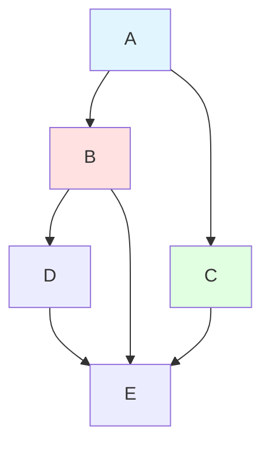
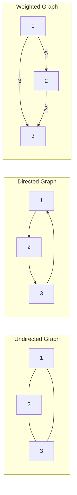
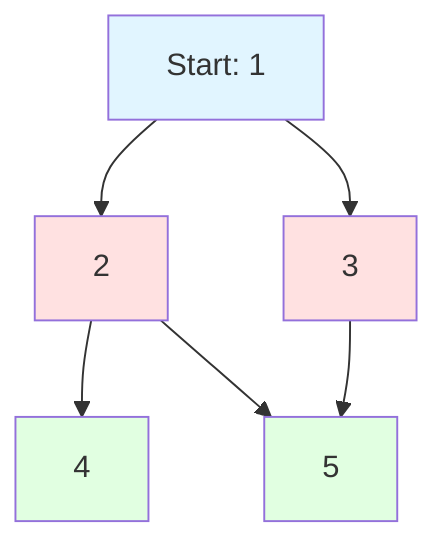
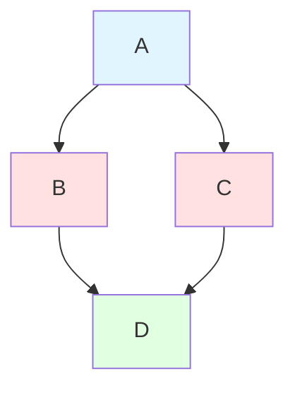

# Graphs

## Why Graphs Matter

Graphs model relationships between entities—fundamental to countless real-world systems:

- **Social networks**: Friends, followers, connections (Facebook, Twitter, LinkedIn)
- **Maps & navigation**: Roads, intersections, routes (Google Maps)
- **Network topology**: Computer networks, server connections
- **Dependency graphs**: Package managers, build systems, task scheduling
- **Knowledge graphs**: Wikipedia links, concept relationships

**Real-world impact**: Google's PageRank algorithm uses graph traversal to rank web pages. Dijkstra's algorithm powers GPS navigation systems finding optimal routes in milliseconds across millions of nodes.

## Core Concepts

### Graph Structure

Graph = (V, E) where V = vertices (nodes), E = edges



**Key terminology**:
- **Vertex (Node)**: Fundamental unit
- **Edge**: Connection between two vertices
- **Degree**: Number of edges incident to a vertex
- **Path**: Sequence of connected vertices
- **Cycle**: Path starting and ending at same vertex
- **Connected**: Every vertex reachable from every other

### Graph Types

| Type | Edges | Direction | Example |
|------|-------|-----------|---------|
| **Undirected** | No arrow | Bidirectional | Social network friendships |
| **Directed** | Arrow | One-way | Twitter followers |
| **Weighted** | Has weight/cost | Either | Road networks (distance) |
| **Unweighted** | No weight | Either | Web page links |



### Graph Representations

#### Adjacency Matrix

```java
int[][] graph = new int[V][V];  // V = number of vertices
graph[u][v] = weight;  // Edge from u to v with weight
```

| Pros | Cons |
|------|------|
| O(1) edge lookup | O(V²) space |
| Simple implementation | Wastes space for sparse graphs |
| Good for dense graphs | Slow iteration over neighbors |

#### Adjacency List

```java
List<List<int[]>> graph = new ArrayList<>();
for (int i = 0; i < V; i++) {
    graph.add(new ArrayList<>());
}
graph.get(u).add(new int[]{v, weight});  // Edge u→v
```

| Pros | Cons |
|------|------|
| O(V + E) space | O(degree) neighbor lookup |
| Efficient iteration | Slightly more complex |
| Good for sparse graphs | |

**Recommendation**: Use adjacency list for most cases (most real-world graphs are sparse).

## Deep Dive

### Graph Traversals

#### Breadth-First Search (BFS)

Explores level by level, uses queue:

```java
public void bfs(int start, int V, List<List<Integer>> graph) {
    boolean[] visited = new boolean[V];
    Queue<Integer> queue = new LinkedList<>();

    visited[start] = true;
    queue.offer(start);

    while (!queue.isEmpty()) {
        int node = queue.poll();
        System.out.print(node + " ");

        for (int neighbor : graph.get(node)) {
            if (!visited[neighbor]) {
                visited[neighbor] = true;
                queue.offer(neighbor);
            }
        }
    }
}
```



**BFS Order**: 1, 2, 3, 4, 5 (level by level)

**Use cases**:
- Shortest path in unweighted graph
- Level-order traversal
- Connected components

**Complexity**: O(V + E) time, O(V) space

#### Depth-First Search (DFS)

Explores as deep as possible first, uses stack/recursion:

```java
// Recursive DFS
public void dfs(int node, boolean[] visited, List<List<Integer>> graph) {
    visited[node] = true;
    System.out.print(node + " ");

    for (int neighbor : graph.get(node)) {
        if (!visited[neighbor]) {
            dfs(neighbor, visited, graph);
        }
    }
}

// Iterative DFS
public void dfsIterative(int start, int V, List<List<Integer>> graph) {
    boolean[] visited = new boolean[V];
    Deque<Integer> stack = new ArrayDeque<>();

    stack.push(start);

    while (!stack.isEmpty()) {
        int node = stack.pop();

        if (!visited[node]) {
            visited[node] = true;
            System.out.print(node + " ");

            // Push neighbors in reverse order
            for (int i = graph.get(node).size() - 1; i >= 0; i--) {
                int neighbor = graph.get(node).get(i);
                if (!visited[neighbor]) {
                    stack.push(neighbor);
                }
            }
        }
    }
}
```

**DFS Order**: 1, 2, 4, 5, 3 (depth first)

**Use cases**:
- Detecting cycles
- Topological sort
- Path finding
- Connected components

**Complexity**: O(V + E) time, O(V) space

### BFS vs DFS

| Aspect | BFS | DFS |
|--------|-----|-----|
| **Data structure** | Queue | Stack / Recursion |
| **Memory** | O(V) for wide graphs | O(h) for deep graphs |
| **Shortest path** | Yes (unweighted) | No |
| **Complete exploration** | Level by level | Branch by branch |
| **Implementation** | Iterative (natural) | Recursive (natural) |

### Cycle Detection

#### Undirected Graph

```java
public boolean hasCycleUndirected(int V, List<List<Integer>> graph) {
    boolean[] visited = new boolean[V];

    for (int i = 0; i < V; i++) {
        if (!visited[i]) {
            if (dfsCycle(i, -1, visited, graph)) {
                return true;
            }
        }
    }
    return false;
}

private boolean dfsCycle(int node, int parent, boolean[] visited,
                         List<List<Integer>> graph) {
    visited[node] = true;

    for (int neighbor : graph.get(node)) {
        if (!visited[neighbor]) {
            if (dfsCycle(neighbor, node, visited, graph)) {
                return true;
            }
        } else if (neighbor != parent) {
            return true;  // Back edge found (not parent)
        }
    }
    return false;
}
```

#### Directed Graph

```java
public boolean hasCycleDirected(int V, List<List<Integer>> graph) {
    int[] visited = new int[V];  // 0=unvisited, 1=visiting, 2=visited

    for (int i = 0; i < V; i++) {
        if (visited[i] == 0) {
            if (dfsCycleDirected(i, visited, graph)) {
                return true;
            }
        }
    }
    return false;
}

private boolean dfsCycleDirected(int node, int[] visited,
                                 List<List<Integer>> graph) {
    visited[node] = 1;  // Currently visiting

    for (int neighbor : graph.get(node)) {
        if (visited[neighbor] == 1) {
            return true;  // Back edge found (cycle)
        }
        if (visited[neighbor] == 0 &&
            dfsCycleDirected(neighbor, visited, graph)) {
            return true;
        }
    }

    visited[node] = 2;  // Fully visited
    return false;
}
```

### Topological Sort

Order vertices such that for every directed edge (u, v), u comes before v:

```java
public List<Integer> topologicalSort(int V, List<List<Integer>> graph) {
    int[] inDegree = new int[V];

    // Calculate in-degrees
    for (int u = 0; u < V; u++) {
        for (int v : graph.get(u)) {
            inDegree[v]++;
        }
    }

    // Add nodes with 0 in-degree to queue
    Queue<Integer> queue = new LinkedList<>();
    for (int i = 0; i < V; i++) {
        if (inDegree[i] == 0) {
            queue.offer(i);
        }
    }

    List<Integer> result = new ArrayList<>();

    while (!queue.isEmpty()) {
        int node = queue.poll();
        result.add(node);

        for (int neighbor : graph.get(node)) {
            inDegree[neighbor]--;
            if (inDegree[neighbor] == 0) {
                queue.offer(neighbor);
            }
        }
    }

    return result.size() == V ? result : Collections.emptyList();
    // Empty if cycle exists
}
```



**Topological Order**: A, C, B, D or A, B, C, D (both valid)

**Use cases**:
- Build systems (dependencies)
- Course scheduling
- Task scheduling with dependencies

### Shortest Path Algorithms

#### Dijkstra's Algorithm (Non-negative weights)

```java
public int[] dijkstra(int start, int V, List<List<int[]>> graph) {
    int[] dist = new int[V];
    Arrays.fill(dist, Integer.MAX_VALUE);
    dist[start] = 0;

    PriorityQueue<int[]> minHeap =
        new PriorityQueue<>((a, b) -> a[1] - b[1]);  // [node, distance]
    minHeap.offer(new int[]{start, 0});

    while (!minHeap.isEmpty()) {
        int[] current = minHeap.poll();
        int node = current[0];
        int distance = current[1];

        if (distance > dist[node]) continue;  // Skip outdated entries

        for (int[] edge : graph.get(node)) {
            int neighbor = edge[0];
            int weight = edge[1];
            int newDist = dist[node] + weight;

            if (newDist < dist[neighbor]) {
                dist[neighbor] = newDist;
                minHeap.offer(new int[]{neighbor, newDist});
            }
        }
    }

    return dist;
}
```

**Complexity**: O((V + E) log V) with binary heap

**Visualization**:
```
Initial:  dist[A]=0, others=∞
Step 1:   Process A, update B(5), C(3)
Step 2:   Process C, update D(6)
Step 3:   Process B, update D(5)
Step 4:   Process D
```

## Practical Applications

### Course Schedule (Topological Sort)

```java
public int[] findOrder(int numCourses, int[][] prerequisites) {
    List<List<Integer>> graph = new ArrayList<>();
    for (int i = 0; i < numCourses; i++) {
        graph.add(new ArrayList<>());
    }

    int[] inDegree = new int[numCourses];
    for (int[] prereq : prerequisites) {
        int course = prereq[0];
        int prereqCourse = prereq[1];
        graph.get(prereqCourse).add(course);
        inDegree[course]++;
    }

    Queue<Integer> queue = new LinkedList<>();
    for (int i = 0; i < numCourses; i++) {
        if (inDegree[i] == 0) {
            queue.offer(i);
        }
    }

    int[] result = new int[numCourses];
    int index = 0;

    while (!queue.isEmpty()) {
        int course = queue.poll();
        result[index++] = course;

        for (int next : graph.get(course)) {
            inDegree[next]--;
            if (inDegree[next] == 0) {
                queue.offer(next);
            }
        }
    }

    return index == numCourses ? result : new int[0];
}
```

### Word Ladder (BFS)

```java
public int ladderLength(String beginWord, String endWord, List<String> wordList) {
    Set<String> wordSet = new HashSet<>(wordList);
    if (!wordSet.contains(endWord)) return 0;

    Queue<String> queue = new LinkedList<>();
    Set<String> visited = new HashSet<>();

    queue.offer(beginWord);
    visited.add(beginWord);
    int level = 1;

    while (!queue.isEmpty()) {
        int size = queue.size();

        for (int i = 0; i < size; i++) {
            String word = queue.poll();

            if (word.equals(endWord)) return level;

            char[] chars = word.toCharArray();
            for (int j = 0; j < chars.length; j++) {
                char original = chars[j];

                for (char c = 'a'; c <= 'z'; c++) {
                    if (c == original) continue;
                    chars[j] = c;
                    String newWord = new String(chars);

                    if (wordSet.contains(newWord) && !visited.contains(newWord)) {
                        visited.add(newWord);
                        queue.offer(newWord);
                    }
                }
                chars[j] = original;
            }
        }
        level++;
    }

    return 0;
}
```

### Clone Graph (BFS/DFS)

```java
class Node {
    int val;
    List<Node> neighbors;
    Node(int val) {
        this.val = val;
        this.neighbors = new ArrayList<>();
    }
}

public Node cloneGraph(Node node) {
    if (node == null) return null;

    Map<Node, Node> cloned = new HashMap<>();
    Queue<Node> queue = new LinkedList<>();

    cloned.put(node, new Node(node.val));
    queue.offer(node);

    while (!queue.isEmpty()) {
        Node current = queue.poll();

        for (Node neighbor : current.neighbors) {
            if (!cloned.containsKey(neighbor)) {
                cloned.put(neighbor, new Node(neighbor.val));
                queue.offer(neighbor);
            }
            cloned.get(current).neighbors.add(cloned.get(neighbor));
        }
    }

    return cloned.get(node);
}
```

## Interview Questions

### Q1: Number of Islands (Medium)

**Problem**: Count islands (connected '1's) in 2D grid.

**Approach**: DFS/BFS to mark visited land

**Complexity**: O(m × n) time, O(m × n) space

```java
public int numIslands(char[][] grid) {
    if (grid == null || grid.length == 0) return 0;

    int count = 0;
    int m = grid.length, n = grid[0].length;

    for (int i = 0; i < m; i++) {
        for (int j = 0; j < n; j++) {
            if (grid[i][j] == '1') {
                count++;
                dfsIsland(grid, i, j, m, n);
            }
        }
    }

    return count;
}

private void dfsIsland(char[][] grid, int i, int j, int m, int n) {
    if (i < 0 || i >= m || j < 0 || j >= n || grid[i][j] != '1') {
        return;
    }

    grid[i][j] = '0';  // Mark as visited

    dfsIsland(grid, i + 1, j, m, n);
    dfsIsland(grid, i - 1, j, m, n);
    dfsIsland(grid, i, j + 1, m, n);
    dfsIsland(grid, i, j - 1, m, n);
}
```

### Q2: Course Schedule (Medium)

**Problem**: Detect if course completion is possible (cycle detection).

**Approach**: Topological sort using DFS

**Complexity**: O(V + E) time, O(V) space

```java
public boolean canFinish(int numCourses, int[][] prerequisites) {
    List<List<Integer>> graph = new ArrayList<>();
    for (int i = 0; i < numCourses; i++) {
        graph.add(new ArrayList<>());
    }

    for (int[] prereq : prerequisites) {
        graph.get(prereq[1]).add(prereq[0]);
    }

    int[] visited = new int[numCourses];  // 0=unvisited, 1=visiting, 2=visited

    for (int i = 0; i < numCourses; i++) {
        if (hasCycle(i, graph, visited)) {
            return false;  // Cycle detected
        }
    }

    return true;
}

private boolean hasCycle(int node, List<List<Integer>> graph, int[] visited) {
    if (visited[node] == 1) return true;  // Cycle
    if (visited[node] == 2) return false;  // Already processed

    visited[node] = 1;

    for (int neighbor : graph.get(node)) {
        if (hasCycle(neighbor, graph, visited)) {
            return true;
        }
    }

    visited[node] = 2;
    return false;
}
```

### Q3: Clone Graph (Medium)

**Problem**: Deep copy a connected undirected graph.

**Approach**: BFS with map of original → clone

**Complexity**: O(V + E) time, O(V) space

```java
public Node cloneGraph(Node node) {
    if (node == null) return null;

    Map<Node, Node> map = new HashMap<>();
    Queue<Node> queue = new LinkedList<>();

    map.put(node, new Node(node.val));
    queue.offer(node);

    while (!queue.isEmpty()) {
        Node current = queue.poll();

        for (Node neighbor : current.neighbors) {
            if (!map.containsKey(neighbor)) {
                map.put(neighbor, new Node(neighbor.val));
                queue.offer(neighbor);
            }
            map.get(current).neighbors.add(map.get(neighbor));
        }
    }

    return map.get(node);
}
```

### Q4: Pacific Atlantic Water Flow (Medium)

**Problem**: Find cells where water can flow to both oceans.

**Approach**: BFS/DFS from both coasts inward

**Complexity**: O(m × n) time, O(m × n) space

```java
public List<List<Integer>> pacificAtlantic(int[][] heights) {
    int m = heights.length, n = heights[0].length;
    boolean[][] pacific = new boolean[m][n];
    boolean[][] atlantic = new boolean[m][n];

    Queue<int[]> pacificQueue = new LinkedList<>();
    Queue<int[]> atlanticQueue = new LinkedList<>();

    // Add border cells
    for (int i = 0; i < m; i++) {
        pacificQueue.offer(new int[]{i, 0});
        atlanticQueue.offer(new int[]{i, n - 1});
        pacific[i][0] = true;
        atlantic[i][n - 1] = true;
    }

    for (int j = 0; j < n; j++) {
        pacificQueue.offer(new int[]{0, j});
        atlanticQueue.offer(new int[]{m - 1, j});
        pacific[0][j] = true;
        atlantic[m - 1][j] = true;
    }

    bfs(heights, pacificQueue, pacific);
    bfs(heights, atlanticQueue, atlantic);

    List<List<Integer>> result = new ArrayList<>();
    for (int i = 0; i < m; i++) {
        for (int j = 0; j < n; j++) {
            if (pacific[i][j] && atlantic[i][j]) {
                result.add(Arrays.asList(i, j));
            }
        }
    }

    return result;
}

private void bfs(int[][] heights, Queue<int[]> queue, boolean[][] visited) {
    int m = heights.length, n = heights[0].length;
    int[][] dirs = {{0, 1}, {0, -1}, {1, 0}, {-1, 0}};

    while (!queue.isEmpty()) {
        int[] cell = queue.poll();

        for (int[] dir : dirs) {
            int i = cell[0] + dir[0];
            int j = cell[1] + dir[1];

            if (i >= 0 && i < m && j >= 0 && j < n &&
                !visited[i][j] && heights[i][j] >= heights[cell[0]][cell[1]]) {
                visited[i][j] = true;
                queue.offer(new int[]{i, j});
            }
        }
    }
}
```

### Q5: Rotting Oranges (Medium)

**Problem**: Find minimum time until all oranges are rotten.

**Approach**: Multi-source BFS

**Complexity**: O(m × n) time, O(m × n) space

```java
public int orangesRotting(int[][] grid) {
    int m = grid.length, n = grid[0].length;
    Queue<int[]> queue = new LinkedList<>();
    int fresh = 0;

    for (int i = 0; i < m; i++) {
        for (int j = 0; j < n; j++) {
            if (grid[i][j] == 2) {
                queue.offer(new int[]{i, j, 0});  // [row, col, time]
            } else if (grid[i][j] == 1) {
                fresh++;
            }
        }
    }

    int[][] dirs = {{0, 1}, {0, -1}, {1, 0}, {-1, 0}};
    int maxTime = 0;

    while (!queue.isEmpty()) {
        int[] current = queue.poll();
        int row = current[0], col = current[1], time = current[2];

        maxTime = Math.max(maxTime, time);

        for (int[] dir : dirs) {
            int r = row + dir[0];
            int c = col + dir[1];

            if (r >= 0 && r < m && c >= 0 && c < n && grid[r][c] == 1) {
                grid[r][c] = 2;
                fresh--;
                queue.offer(new int[]{r, c, time + 1});
            }
        }
    }

    return fresh == 0 ? maxTime : -1;
}
```

### Q6: Network Delay Time (Medium)

**Problem**: Find time for signal to reach all nodes (Dijkstra).

**Approach**: Dijkstra's algorithm

**Complexity**: O((V + E) log V) time, O(V) space

```java
public int networkDelayTime(int[][] times, int n, int k) {
    List<List<int[]>> graph = new ArrayList<>();
    for (int i = 0; i <= n; i++) {
        graph.add(new ArrayList<>());
    }

    for (int[] edge : times) {
        graph.get(edge[0]).add(new int[]{edge[1], edge[2]});
    }

    int[] dist = new int[n + 1];
    Arrays.fill(dist, Integer.MAX_VALUE);
    dist[k] = 0;

    PriorityQueue<int[]> minHeap =
        new PriorityQueue<>((a, b) -> a[1] - b[1]);
    minHeap.offer(new int[]{k, 0});

    while (!minHeap.isEmpty()) {
        int[] current = minHeap.poll();
        int node = current[0], time = current[1];

        if (time > dist[node]) continue;

        for (int[] edge : graph.get(node)) {
            int neighbor = edge[0], weight = edge[1];
            int newTime = dist[node] + weight;

            if (newTime < dist[neighbor]) {
                dist[neighbor] = newTime;
                minHeap.offer(new int[]{neighbor, newTime});
            }
        }
    }

    int maxTime = 0;
    for (int i = 1; i <= n; i++) {
        maxTime = Math.max(maxTime, dist[i]);
        if (dist[i] == Integer.MAX_VALUE) return -1;
    }

    return maxTime;
}
```

### Q7: Cheapest Flights Within K Stops (Medium)

**Problem**: Find cheapest route with at most K stops.

**Approach**: Modified Dijkstra with stops constraint

**Complexity**: O(E × K) time, O(V) space

```java
public int findCheapestPrice(int n, int[][] flights, int src, int dst, int k) {
    List<List<int[]>> graph = new ArrayList<>();
    for (int i = 0; i < n; i++) {
        graph.add(new ArrayList<>());
    }

    for (int[] flight : flights) {
        graph.get(flight[0]).add(new int[]{flight[1], flight[2]});
    }

    PriorityQueue<int[]> minHeap =
        new PriorityQueue<>((a, b) -> a[1] - b[1]);  // [node, cost, stops]
    minHeap.offer(new int[]{src, 0, -1});

    while (!minHeap.isEmpty()) {
        int[] current = minHeap.poll();
        int node = current[0], cost = current[1], stops = current[2];

        if (node == dst) return cost;

        if (stops < k) {
            for (int[] flight : graph.get(node)) {
                int neighbor = flight[0], price = flight[1];
                minHeap.offer(new int[]{neighbor, cost + price, stops + 1});
            }
        }
    }

    return -1;
}
```

## Further Reading

- **Trees**: Special case of graphs
- **DFS**: Used in topological sort, cycle detection
- **BFS**: Shortest path in unweighted graphs
- **Dijkstra**: Weighted shortest path with priority queue
- **LeetCode**: [Graph problems](https://leetcode.com/tag/graph/)
