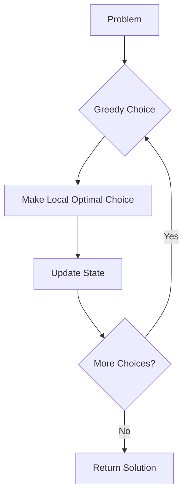

# Greedy Algorithms

## Why Greedy Algorithms Matter

Greedy algorithms make locally optimal choices at each step—often leading to globally optimal solutions:

- **Interval scheduling**: Maximize number of non-overlapping tasks
- **Huffman coding**: Optimal data compression
- **Shortest path**: Dijkstra's algorithm
- **Minimum spanning tree**: Prim's and Kruskal's algorithms

**Real-world impact**:
- Activity selection: Greedy picks earliest finishing time → O(n log n) vs O(2ⁿ) brute force
- Huffman coding: 20-50% compression for text files
- Change making: Optimal for US coins (greedy works), fails for some coin systems

**When greedy works**:
1. **Greedy choice property**: Local optimal leads to global optimal
2. **Optimal substructure**: Optimal solution contains optimal solutions to subproblems

## Core Concepts

### Greedy Strategy

At each step, make the choice that looks best at the moment:



### Classic Greedy Problems

| Problem | Greedy Choice | Time |
|---------|---------------|------|
| **Activity Selection** | Earliest finish time | O(n log n) |
| **Fractional Knapsack** | Highest value/weight | O(n log n) |
| **Huffman Coding** | Merge smallest frequencies | O(n log n) |
| **Minimum Spanning Tree** | Lightest edge | O(E log V) |

### Greedy vs Dynamic Programming

| Aspect | Greedy | DP |
|--------|--------|-----|
| **Decision** | Local optimal | Explore all options |
| **Speed** | Faster (usually O(n log n)) | Slower (polynomial) |
| **Optimality** | Not always guaranteed | Always guaranteed |
| **Backtracking** | No | Yes |

## Deep Dive

### Activity Selection

Select max number of non-overlapping activities:

```java
public int activitySelection(int[] start, int[] end) {
    int n = start.length;
    int[][] activities = new int[n][2];

    for (int i = 0; i < n; i++) {
        activities[i] = new int[]{start[i], end[i]};
    }

    // Sort by end time
    Arrays.sort(activities, (a, b) -> a[1] - b[1]);

    int count = 1;
    int lastEnd = activities[0][1];

    for (int i = 1; i < n; i++) {
        if (activities[i][0] >= lastEnd) {
            count++;
            lastEnd = activities[i][1];
        }
    }

    return count;
}
```

**Why it works**: Picking earliest finish time leaves maximum room for remaining activities

### Fractional Knapsack

```java
class Item {
    int value, weight;

    double getValuePerWeight() {
        return (double) value / weight;
    }
}

public double fractionalKnapsack(Item[] items, int capacity) {
    // Sort by value/weight descending
    Arrays.sort(items, (a, b) ->
        Double.compare(b.getValuePerWeight(), a.getValuePerWeight()));

    double totalValue = 0;

    for (Item item : items) {
        if (capacity >= item.weight) {
            // Take entire item
            totalValue += item.value;
            capacity -= item.weight;
        } else {
            // Take fraction of item
            totalValue += item.getValuePerWeight() * capacity;
            break;
        }
    }

    return totalValue;
}
```

**Greedy choice**: Take item with highest value/weight ratio

### Huffman Coding

Build optimal prefix code for compression:

```java
class HuffmanNode implements Comparable<HuffmanNode> {
    char character;
    int frequency;
    HuffmanNode left, right;

    boolean isLeaf() { return left == null && right == null; }

    @Override
    public int compareTo(HuffmanNode other) {
        return this.frequency - other.frequency;
    }
}

public Map<Character, String> huffmanCoding(String text) {
    // Count frequencies
    Map<Character, Integer> freq = new HashMap<>();
    for (char c : text.toCharArray()) {
        freq.merge(c, 1, Integer::sum);
    }

    // Build priority queue
    PriorityQueue<HuffmanNode> pq = new PriorityQueue<>();
    for (Map.Entry<Character, Integer> entry : freq.entrySet()) {
        HuffmanNode node = new HuffmanNode();
        node.character = entry.getKey();
        node.frequency = entry.getValue();
        pq.offer(node);
    }

    // Build tree
    while (pq.size() > 1) {
        HuffmanNode left = pq.poll();
        HuffmanNode right = pq.poll();

        HuffmanNode parent = new HuffmanNode();
        parent.frequency = left.frequency + right.frequency;
        parent.left = left;
        parent.right = right;
        pq.offer(parent);
    }

    // Generate codes
    Map<Character, String> codes = new HashMap<>();
    buildCodes(pq.peek(), "", codes);
    return codes;
}

private void buildCodes(HuffmanNode node, String code,
                       Map<Character, String> codes) {
    if (node.isLeaf()) {
        codes.put(node.character, code.isEmpty() ? "0" : code);
        return;
    }
    buildCodes(node.left, code + "0", codes);
    buildCodes(node.right, code + "1", codes);
}
```

## Practical Applications

### Minimum Coins for Change

```java
public int minCoins(int[] coins, int amount) {
    Arrays.sort(coins);
    int count = 0;

    for (int i = coins.length - 1; i >= 0; i--) {
        if (coins[i] <= amount) {
            int num = amount / coins[i];
            count += num;
            amount -= num * coins[i];
        }
        if (amount == 0) break;
    }

    return amount == 0 ? count : -1;
}
```

**Note**: Greedy doesn't work for all coin systems (e.g., coins = [1, 3, 4], amount = 6)

### Jump Game

```java
public boolean canJump(int[] nums) {
    int maxReach = 0;

    for (int i = 0; i < nums.length; i++) {
        if (i > maxReach) return false;
        maxReach = Math.max(maxReach, i + nums[i]);
    }

    return true;
}
```

## Interview Questions

### Q1: Assign Cookies (Easy)

**Problem**: Maximize children content with cookies.

**Approach**: Greedy match smallest cookie that satisfies each child

**Complexity**: O(n log n + m log m) time

```java
public int findContentChildren(int[] greed, int[] size) {
    Arrays.sort(greed);
    Arrays.sort(size);

    int child = 0, cookie = 0;

    while (child < greed.length && cookie < size.length) {
        if (size[cookie] >= greed[child]) {
            child++;
        }
        cookie++;
    }

    return child;
}
```

### Q2: Gas Station (Medium)

**Problem**: Find starting gas station to complete circuit.

**Approach**: Greedy with total gas check

**Complexity**: O(n) time

```java
public int canCompleteCircuit(int[] gas, int[] cost) {
    int totalGas = 0, totalCost = 0;
    int currentGas = 0, start = 0;

    for (int i = 0; i < gas.length; i++) {
        totalGas += gas[i];
        totalCost += cost[i];

        currentGas += gas[i] - cost[i];

        if (currentGas < 0) {
            start = i + 1;
            currentGas = 0;
        }
    }

    return totalGas >= totalCost ? start : -1;
}
```

## Further Reading

- **DP**: For problems where greedy fails
- **Heaps**: Used in greedy algorithms (Huffman)
- **Greedy**: Interval scheduling, MST
- **LeetCode**: [Greedy problems](https://leetcode.com/tag/greedy/)
