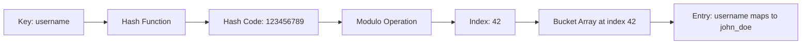
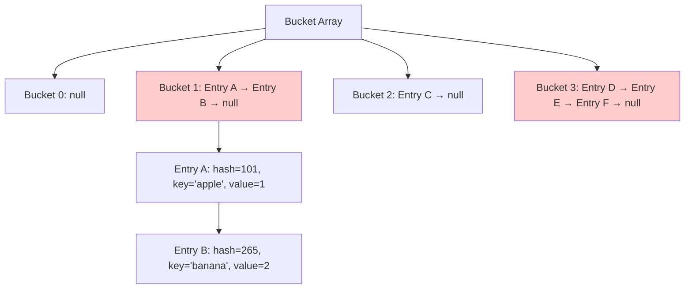
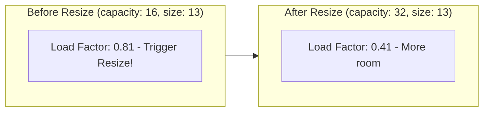
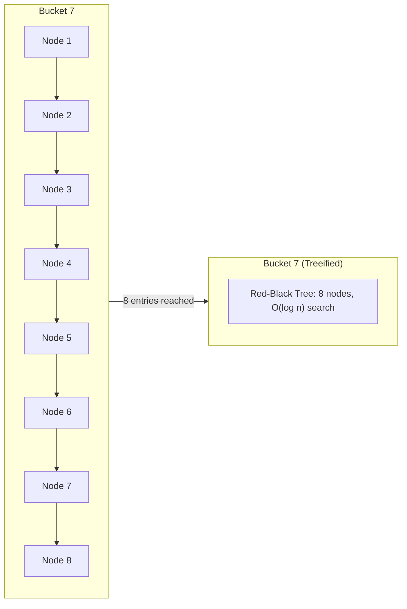

# HashMaps & HashSets

## Why HashMaps Matter

HashMaps provide O(1) average-case lookup—making them the most widely-used data structure in backend systems:

- **Caching**: Redis, Memcached use hash tables for key-value storage
- **Session management**: User sessions stored by session ID
- **Database indexes**: Hash indexes for exact-match queries
- **Counting/frequency**: Word counts, analytics, deduplication

**Real-world impact**: A HashMap with 1 million entries performs lookups in O(1) ~ 50ns, while a linear search through 1 million array elements takes ~5ms—**100,000x slower**.

## Core Concepts

### Hash Function

Transforms key into array index:

```java
int index = Math.abs(key.hashCode()) % array.length;
```

**Good hash function properties**:
- **Deterministic**: Same key always produces same hash
- **Uniform distribution**: Spreads keys evenly across buckets
- **Fast computation**: O(1) to compute



### Java's hashCode() Contract

```java
// String.hashCode() implementation
public int hashCode() {
    int h = hash;
    if (h == 0 && value.length > 0) {
        char val[] = value;
        for (int i = 0; i < value.length; i++) {
            h = 31 * h + val[i];  // 31 is prime (good distribution)
        }
        hash = h;
    }
    return h;
}
```

**Contract**:
1. If `equals()` returns true, `hashCode()` must return same value
2. If `equals()` returns false, `hashCode()` *should* return different values
3. Multiple calls must return same integer (consistent)

```java
// ❌ BAD: violates hashCode contract
class BadKey {
    private String id;

    @Override
    public boolean equals(Object obj) {
        if (!(obj instanceof BadKey)) return false;
        return id.equals(((BadKey) obj).id);
    }

    // Missing hashCode() override!
}

// ✅ GOOD: proper implementation
class GoodKey {
    private String id;

    @Override
    public boolean equals(Object obj) {
        if (!(obj instanceof GoodKey)) return false;
        return id.equals(((GoodKey) obj).id);
    }

    @Override
    public int hashCode() {
        return Objects.hash(id);  // Or just id.hashCode()
    }
}
```

### Collision Resolution

#### Chaining (Java's Approach)

Each bucket holds a linked list of entries:

```java
// HashMap internal structure (simplified)
static class Node<K,V> {
    final int hash;
    final K key;
    V value;
    Node<K,V> next;  // Linked list for chaining
}

transient Node<K,V>[] table;  // Bucket array
```



**Lookup process**:
1. Compute hash: `hash(key)`
2. Find bucket: `index = hash % table.length`
3. Traverse linked list: Compare keys using `equals()`
4. Return value or null

#### Open Addressing

All entries stored in array itself (no linked lists):

- **Linear probing**: Check `index`, `index+1`, `index+2`...
- **Quadratic probing**: Check `index`, `index+1²`, `index+2²`...
- **Double hashing**: Second hash function determines step size

**Pros**: Better cache locality, no pointer overhead
**Cons**: Clustering, deletion complexity, table must be < 70% full

### Load Factor & Resizing

```java
// HashMap defaults
static final int DEFAULT_INITIAL_CAPACITY = 16;
static final float DEFAULT_LOAD_FACTOR = 0.75f;
```

**Load factor** = `size / capacity`

When `size > capacity * loadFactor`:
1. Create new array 2x size
2. Rehash all entries (compute new indices)
3. Replace old array



**Why 0.75?**
- Higher → More collisions, slower lookups
- Lower → Wasted memory, more frequent resizing
- 0.75 is empirically optimal

### HashMap vs TreeMap vs LinkedHashMap

| Feature | HashMap | TreeMap | LinkedHashMap |
|---------|---------|---------|---------------|
| **Ordering** | None | Sorted by key | Insertion order |
| **Lookup** | O(1) avg | O(log n) | O(1) avg |
| **Insert/Delete** | O(1) avg | O(log n) | O(1) avg |
| **Null keys** | One allowed | Not allowed | One allowed |
| **Implementation** | Hash table | Red-Black tree | Hash table + linked list |
| **Use case** | General purpose | Sorted ranges | Order preservation |

```java
// HashMap: no ordering
Map<String, Integer> hashMap = new HashMap<>();
hashMap.put("banana", 2);
hashMap.put("apple", 1);
hashMap.put("cherry", 3);
System.out.println(hashMap);  // {banana=2, apple=1, cherry=3} (random)

// TreeMap: sorted by key
Map<String, Integer> treeMap = new TreeMap<>();
treeMap.put("banana", 2);
treeMap.put("apple", 1);
treeMap.put("cherry", 3);
System.out.println(treeMap);  // {apple=1, banana=2, cherry=3} (sorted)

// LinkedHashMap: insertion order
Map<String, Integer> linkedMap = new LinkedHashMap<>();
linkedMap.put("banana", 2);
linkedMap.put("apple", 1);
linkedMap.put("cherry", 3);
System.out.println(linkedMap);  // {banana=2, apple=1, cherry=3}
```

## Deep Dive

### HashMap Internal Implementation

#### Computing Index

```java
// Simplified HashMap.get()
public V get(Object key) {
    Node<K,V>[] tab; Node<K,V> first, e; int n, hash; K k;

    // Step 1: Compute hash
    hash = (key == null) ? 0 : (h = key.hashCode()) ^ (h >>> 16);

    // Step 2: Find bucket
    tab = table;
    n = tab.length;
    index = (n - 1) & hash;  // Same as hash % n (for power of 2)

    // Step 3: Check first node
    first = tab[index];
    if (first != null) {
        if (first.hash == hash &&
            ((k = first.key) == key || (key != null && key.equals(k)))) {
            return first.value;
        }

        // Step 4: Traverse linked list
        e = first.next;
        while (e != null) {
            if (e.hash == hash &&
                ((k = e.key) == key || (key != null && key.equals(k)))) {
                return e.value;
            }
            e = e.next;
        }
    }

    return null;  // Not found
}
```

**Why XOR with right-shifted 16 bits?**
- Spreads high bits into lower positions
- Improves distribution when table size is power of 2

#### Treeify Threshold (Java 8+)

When bucket linked list exceeds 8 entries, it converts to TreeMap:

```java
static final int TREEIFY_THRESHOLD = 8;
static final int UNTREEIFY_THRESHOLD = 6;
```

**Why?**
- Linked list: O(n) worst case
- Red-Black tree: O(log n) worst case
- Trade-off: Tree has more overhead, only worth it for long chains



### Common Pitfalls

#### ❌ Mutable keys

```java
List<Integer> key = new ArrayList<>(Arrays.asList(1, 2, 3));
Map<List<Integer>, String> map = new HashMap<>();
map.put(key, "value");

key.add(4);  // Mutating key!

String result = map.get(key);  // Returns null!
// hashCode() changed, so we're looking in wrong bucket
```

#### ✅ Use immutable keys

```java
// Strings are immutable (safe keys)
Map<String, Integer> map = new HashMap<>();
map.put("key", 1);

// Or create custom immutable key
class ImmutableKey {
    private final int id;
    private final String name;

    public ImmutableKey(int id, String name) {
        this.id = id;
        this.name = name;
    }

    @Override
    public boolean equals(Object o) {
        if (this == o) return true;
        if (!(o instanceof ImmutableKey)) return false;
        ImmutableKey that = (ImmutableKey) o;
        return id == that.id && Objects.equals(name, that.name);
    }

    @Override
    public int hashCode() {
        return Objects.hash(id, name);
    }
}
```

#### ❌ Resizing during iteration

```java
Map<String, Integer> map = new HashMap<>();
for (int i = 0; i < 1000; i++) {
    map.put("key" + i, i);
}

for (String key : map.keySet()) {
    if (map.size() > 500) {
        map.put("newKey", 999);  // ConcurrentModificationException
    }
}
```

#### ✅ Use ConcurrentHashMap or Iterator.remove

```java
// Option 1: ConcurrentHashMap
Map<String, Integer> map = new ConcurrentHashMap<>();

// Option 2: Iterator.remove()
Iterator<Map.Entry<String, Integer>> it = map.entrySet().iterator();
while (it.hasNext()) {
    Map.Entry<String, Integer> entry = it.next();
    if (entry.getValue() > 500) {
        it.remove();  // Safe
    }
}
```

#### ❌ hashCode() without equals()

```java
class BrokenKey {
    private int id;

    @Override
    public int hashCode() {
        return id;  // hashCode defined
    }

    // equals() missing - uses Object.equals() (reference equality)
}
```

#### ✅ Always override both

```java
class ProperKey {
    private int id;

    @Override
    public boolean equals(Object o) {
        if (this == o) return true;
        if (!(o instanceof ProperKey)) return false;
        return id == ((ProperKey) o).id;
    }

    @Override
    public int hashCode() {
        return Objects.hash(id);
    }
}
```

### HashSet Implementation

HashSet is **just** a HashMap with dummy values:

```java
public class HashSet<E> {
    private transient HashMap<E, Object> map;
    private static final Object PRESENT = new Object();

    public HashSet() {
        map = new HashMap<>();
    }

    public boolean add(E e) {
        return map.put(e, PRESENT) == null;  // PRESENT is dummy value
    }

    public boolean contains(Object o) {
        return map.containsKey(o);
    }
}
```

**Implication**: HashSet operations have same complexity as HashMap!

## Practical Applications

### Frequency Counter

```java
public class FrequencyCounter {
    public Map<String, Integer> countFrequencies(String[] words) {
        Map<String, Integer> freq = new HashMap<>();

        for (String word : words) {
            freq.merge(word, 1, Integer::sum);  // Java 8+
            // Or: freq.put(word, freq.getOrDefault(word, 0) + 1);
        }

        return freq;
    }

    public String mostCommon(String[] words) {
        Map<String, Integer> freq = countFrequencies(words);

        return freq.entrySet().stream()
            .max(Map.Entry.comparingByValue())
            .map(Map.Entry::getKey)
            .orElse(null);
    }
}
```

### GroupBy Operation

```java
public class GroupBy {
    public Map<String, List<Person>> groupByCity(List<Person> people) {
        Map<String, List<Person>> byCity = new HashMap<>();

        for (Person person : people) {
            byCity.computeIfAbsent(person.getCity(), k -> new ArrayList<>())
                  .add(person);
        }

        return byCity;
    }

    // Generic version
    public <K, V> Map<K, List<V>> groupBy(List<V> items,
                                          Function<V, K> classifier) {
        Map<K, List<V>> groups = new HashMap<>();

        for (V item : items) {
            K key = classifier.apply(item);
            groups.computeIfAbsent(key, k -> new ArrayList<>()).add(item);
        }

        return groups;
    }
}
```

### Memoization

```java
public class Fibonacci {
    private Map<Integer, Long> memo = new HashMap<>();

    public long fib(int n) {
        if (n <= 1) return n;

        // Check cache
        if (memo.containsKey(n)) {
            return memo.get(n);
        }

        // Compute and cache
        long result = fib(n - 1) + fib(n - 2);
        memo.put(n, result);

        return result;
    }
}
```

**Before memoization**: `fib(50)` takes ~60 seconds
**After memoization**: `fib(50)` takes ~0.0001 seconds

### Two Sum with HashMap

```java
public int[] twoSum(int[] nums, int target) {
    Map<Integer, Integer> numToIndex = new HashMap<>();

    for (int i = 0; i < nums.length; i++) {
        int complement = target - nums[i];

        if (numToIndex.containsKey(complement)) {
            return new int[]{numToIndex.get(complement), i};
        }

        numToIndex.put(nums[i], i);
    }

    throw new IllegalArgumentException("No two sum solution");
}
```

### LRU Cache (LinkedHashMap)

```java
public class LRUCache extends LinkedHashMap<Integer, Integer> {
    private final int capacity;

    public LRUCache(int capacity) {
        super(capacity, 0.75f, true);  // accessOrder = true
        this.capacity = capacity;
    }

    @Override
    protected boolean removeEldestEntry(Map.Entry<Integer, Integer> eldest) {
        return size() > capacity;
    }
}

// Usage
LRUCache cache = new LRUCache(2);
cache.put(1, 1);
cache.put(2, 2);
cache.get(1);    // Access 1 (makes it most recent)
cache.put(3, 3); // Evicts key 2
```

## Interview Questions

### Q1: Two Sum (Easy)

**Problem**: Find two numbers that add to target.

**Approach**: HashMap for O(1) complement lookup

**Complexity**: O(n) time, O(n) space

```java
public int[] twoSum(int[] nums, int target) {
    Map<Integer, Integer> map = new HashMap<>();

    for (int i = 0; i < nums.length; i++) {
        int complement = target - nums[i];
        if (map.containsKey(complement)) {
            return new int[]{map.get(complement), i};
        }
        map.put(nums[i], i);
    }

    throw new IllegalArgumentException("No solution");
}
```

### Q2: Contains Duplicate (Easy)

**Problem**: Check if array contains duplicates.

**Approach**: HashSet to track seen elements

**Complexity**: O(n) time, O(n) space

```java
public boolean containsDuplicate(int[] nums) {
    Set<Integer> seen = new HashSet<>();
    for (int num : nums) {
        if (!seen.add(num)) return true;
    }
    return false;
}
```

### Q3: Single Number (Easy)

**Problem**: Find element that appears once (others appear twice).

**Approach**: XOR (no extra space!)

**Complexity**: O(n) time, O(1) space

```java
public int singleNumber(int[] nums) {
    int result = 0;
    for (int num : nums) {
        result ^= num;  // a ^ a = 0, 0 ^ b = b
    }
    return result;
}
```

### Q4: Subarray Sum Equals K (Medium)

**Problem**: Count subarrays summing to k.

**Approach**: Prefix sums with HashMap

**Complexity**: O(n) time, O(n) space

```java
public int subarraySum(int[] nums, int k) {
    Map<Integer, Integer> count = new HashMap<>();
    count.put(0, 1);  // Empty prefix sum

    int sum = 0;
    int result = 0;

    for (int num : nums) {
        sum += num;
        result += count.getOrDefault(sum - k, 0);
        count.merge(sum, 1, Integer::sum);
    }

    return result;
}
```

### Q5: Group Anagrams (Medium)

**Problem**: Group words that are anagrams.

**Approach**: Sort characters to use as key

**Complexity**: O(n * k log k) time, O(n * k) space

```java
public List<List<String>> groupAnagrams(String[] strs) {
    Map<String, List<String>> groups = new HashMap<>();

    for (String s : strs) {
        char[] chars = s.toCharArray();
        Arrays.sort(chars);
        String key = new String(chars);

        groups.computeIfAbsent(key, k -> new ArrayList<>()).add(s);
    }

    return new ArrayList<>(groups.values());
}
```

### Q6: LRUCache (Medium)

**Problem**: Implement LRU cache with get/put operations.

**Approach**: HashMap + doubly-linked list

**Complexity**: O(1) time for both operations

```java
class LRUCache {
    private class Node {
        int key, value;
        Node prev, next;
        Node(int key, int value) {
            this.key = key;
            this.value = value;
        }
    }

    private final int capacity;
    private final Map<Integer, Node> cache;
    private Node head, tail;

    public LRUCache(int capacity) {
        this.capacity = capacity;
        this.cache = new HashMap<>();

        head = new Node(0, 0);
        tail = new Node(0, 0);
        head.next = tail;
        tail.prev = head;
    }

    public int get(int key) {
        if (!cache.containsKey(key)) return -1;

        Node node = cache.get(key);
        moveToHead(node);
        return node.value;
    }

    public void put(int key, int value) {
        if (cache.containsKey(key)) {
            Node node = cache.get(key);
            node.value = value;
            moveToHead(node);
        } else {
            Node newNode = new Node(key, value);
            cache.put(key, newNode);
            addToHead(newNode);

            if (cache.size() > capacity) {
                Node lru = removeTail();
                cache.remove(lru.key);
            }
        }
    }

    private void addToHead(Node node) {
        node.prev = head;
        node.next = head.next;
        head.next.prev = node;
        head.next = node;
    }

    private void removeNode(Node node) {
        node.prev.next = node.next;
        node.next.prev = node.prev;
    }

    private void moveToHead(Node node) {
        removeNode(node);
        addToHead(node);
    }

    private Node removeTail() {
        Node node = tail.prev;
        removeNode(node);
        return node;
    }
}
```

### Q7: Insert Delete GetRandom O(1) (Medium)

**Problem**: Design data structure supporting insert, delete, getRandom in O(1).

**Approach**: ArrayList + HashMap

**Complexity**: O(1) all operations

```java
class RandomizedSet {
    private List<Integer> nums;
    private Map<Integer, Integer> valToIndex;
    private Random rand;

    public RandomizedSet() {
        nums = new ArrayList<>();
        valToIndex = new HashMap<>();
        rand = new Random();
    }

    public boolean insert(int val) {
        if (valToIndex.containsKey(val)) return false;

        valToIndex.put(val, nums.size());
        nums.add(val);
        return true;
    }

    public boolean remove(int val) {
        if (!valToIndex.containsKey(val)) return false;

        int index = valToIndex.get(val);
        int lastVal = nums.get(nums.size() - 1);

        nums.set(index, lastVal);
        valToIndex.put(lastVal, index);

        nums.remove(nums.size() - 1);
        valToIndex.remove(val);

        return true;
    }

    public int getRandom() {
        return nums.get(rand.nextInt(nums.size()));
    }
}
```

## Further Reading

- **Arrays**: Understanding array internals helps understand HashMap bucket arrays
- **Trees**: TreeMap uses Red-Black tree
- **Heaps**: Can implement priority queues
- **LeetCode**: [Hash Table](https://leetcode.com/tag/hash-table/)
