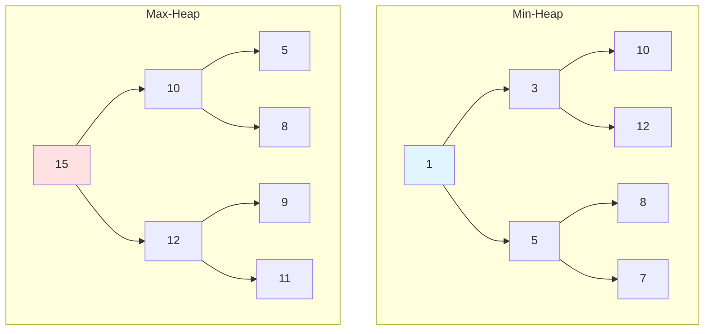
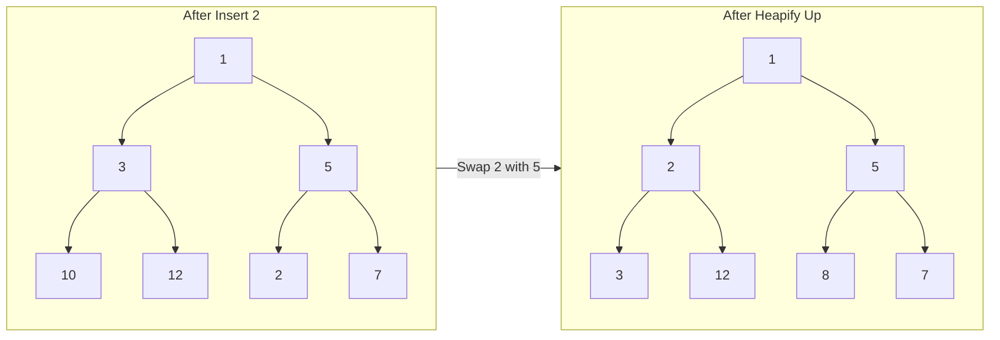

# Heaps & Priority Queues

## Why Heaps Matter

Heaps provide efficient access to the minimum or maximum element—essential for priority-based processing:

- **Task scheduling**: CPU process scheduling, job queues
- **Graph algorithms**: Dijkstra's shortest path, Prim's MST
- **Stream processing**: Find top K elements in data stream
- **Event simulation**: Process events in chronological order

**Real-world impact**: Java's `PriorityQueue` uses a binary heap to provide O(log n) insertion and O(1) access to the minimum element. Finding the top 10 items from 1 million elements takes only 20 heap operations (2 × 10 × log₂1,000,000) versus 10 million comparisons for sorting.

## Core Concepts

### Binary Heap Structure

A **complete binary tree** where every node is ≥ its parent (min-heap) or ≤ its parent (max-heap):



**Heap properties**:
- **Shape property**: Complete binary tree (all levels filled except possibly last, filled left to right)
- **Order property**: Min-heap: parent ≤ children | Max-heap: parent ≥ children
- **Array representation**: For node at index `i`:
  - Parent: `(i - 1) / 2`
  - Left child: `2i + 1`
  - Right child: `2i + 2`

### Array Representation

```
Index:  0   1   2   3   4   5   6
Array: [1,  3,  5, 10, 12,  8,  7]
        ↓   ↓   ↓
Tree:   1
       / \
      3   5
     /|   |\
   10 12 8  7
```

### Min-Heap vs Max-Heap vs BST

| Property | Min-Heap | Max-Heap | BST |
|----------|----------|----------|-----|
| **Min access** | O(1) | O(n) | O(log n) |
| **Max access** | O(n) | O(1) | O(log n) |
| **Insert** | O(log n) | O(log n) | O(log n) |
| **Delete min/max** | O(log n) | O(log n) | O(log n) |
| **Search arbitrary** | O(n) | O(n) | O(log n) |
| **Ordering** | Partial (parent-child) | Partial (parent-child) | Full (in-order) |

**When to use heaps**:
- Need quick access to min/max element
- Don't need full sorted order
- Frequent insertions/deletions
- Top K problems

**When to use BST**:
- Need full sorted traversal
- Need to search for arbitrary elements
- Need range queries

## Deep Dive

### Heap Operations

#### Heapify Up (Bubble Up)

Used after insertion to restore heap property:

```java
private void heapifyUp(int[] heap, int index) {
    while (index > 0) {
        int parent = (index - 1) / 2;

        if (heap[index] >= heap[parent]) break;  // Min-heap property satisfied

        // Swap with parent
        swap(heap, index, parent);
        index = parent;
    }
}

private void swap(int[] arr, int i, int j) {
    int temp = arr[i];
    arr[i] = arr[j];
    arr[j] = temp;
}
```



#### Heapify Down (Bubble Down)

Used after deletion to restore heap property:

```java
private void heapifyDown(int[] heap, int index, int size) {
    while (true) {
        int leftChild = 2 * index + 1;
        int rightChild = 2 * index + 2;
        int smallest = index;

        if (leftChild < size && heap[leftChild] < heap[smallest]) {
            smallest = leftChild;
        }

        if (rightChild < size && heap[rightChild] < heap[smallest]) {
            smallest = rightChild;
        }

        if (smallest == index) break;  // Heap property satisfied

        swap(heap, index, smallest);
        index = smallest;
    }
}
```

#### Build Heap

Convert arbitrary array to heap in O(n) time:

```java
public void buildHeap(int[] arr) {
    int n = arr.length;
    // Start from last non-leaf node
    for (int i = n / 2 - 1; i >= 0; i--) {
        heapifyDown(arr, i, n);
    }
}
```

**Why O(n) not O(n log n)?**
- Most nodes are near bottom (small height)
- Total work: Σ (nodes at level h) × h = O(n)
- Intuition: Only n/2 nodes need heapify, with decreasing height

### Java's PriorityQueue

```java
// Min-heap (default)
PriorityQueue<Integer> minHeap = new PriorityQueue<>();
minHeap.offer(5);
minHeap.offer(1);
minHeap.offer(3);
System.out.println(minHeap.poll());  // 1 (minimum)

// Max-heap (using reverse comparator)
PriorityQueue<Integer> maxHeap =
    new PriorityQueue<>(Collections.reverseOrder());
maxHeap.offer(5);
maxHeap.offer(1);
maxHeap.offer(3);
System.out.println(maxHeap.poll());  // 5 (maximum)

// Custom comparator
PriorityQueue<Task> taskQueue =
    new PriorityQueue<>(Comparator.comparingInt(Task::getPriority));
```

### Common Pitfalls

#### ❌ Using heap.size() after removing elements

```java
PriorityQueue<Integer> heap = new PriorityQueue<>();
heap.addAll(Arrays.asList(3, 1, 4, 1, 5));

for (int i = 0; i < heap.size(); i++) {  // BUG: size changes!
    System.out.println(heap.poll());
}
```

#### ✅ Store size or use isEmpty()

```java
int size = heap.size();
for (int i = 0; i < size; i++) {
    System.out.println(heap.poll());
}

// Or
while (!heap.isEmpty()) {
    System.out.println(heap.poll());
}
```

#### ❌ Forgetting to implement Comparable

```java
class Task {
    int priority;
    // Missing compareTo()!
}

PriorityQueue<Task> heap = new PriorityQueue<>();  // ClassCastException
```

#### ✅ Implement Comparable or provide Comparator

```java
class Task implements Comparable<Task> {
    int priority;

    @Override
    public int compareTo(Task other) {
        return Integer.compare(this.priority, other.priority);
    }
}

// Or use Comparator
PriorityQueue<Task> heap = new PriorityQueue<>(
    Comparator.comparingInt(t -> t.priority)
);
```

### Advanced Operations

#### Heap Sort

```java
public void heapSort(int[] arr) {
    int n = arr.length;

    // Build max heap
    for (int i = n / 2 - 1; i >= 0; i--) {
        heapifyDownMax(arr, i, n);
    }

    // Extract elements from heap
    for (int i = n - 1; i > 0; i--) {
        swap(arr, 0, i);  // Move max to end
        heapifyDownMax(arr, 0, i);  // Restore heap property
    }
}

private void heapifyDownMax(int[] arr, int index, int size) {
    while (true) {
        int left = 2 * index + 1;
        int right = 2 * index + 2;
        int largest = index;

        if (left < size && arr[left] > arr[largest]) {
            largest = left;
        }

        if (right < size && arr[right] > arr[largest]) {
            largest = right;
        }

        if (largest == index) break;

        swap(arr, index, largest);
        index = largest;
    }
}
```

**Complexity**: O(n log n) time, O(1) space (in-place)

#### Merge K Sorted Lists

```java
public ListNode mergeKLists(ListNode[] lists) {
    PriorityQueue<ListNode> minHeap =
        new PriorityQueue<>((a, b) -> a.val - b.val);

    // Add first node of each list
    for (ListNode head : lists) {
        if (head != null) {
            minHeap.offer(head);
        }
    }

    ListNode dummy = new ListNode(0);
    ListNode current = dummy;

    while (!minHeap.isEmpty()) {
        ListNode node = minHeap.poll();
        current.next = node;
        current = current.next;

        if (node.next != null) {
            minHeap.offer(node.next);
        }
    }

    return dummy.next;
}
```

**Complexity**: O(n log k) where n = total elements, k = number of lists

#### Sliding Window Median

```java
public double[] medianSlidingWindow(int[] nums, int k) {
    // Max heap for lower half
    PriorityQueue<Integer> low = new PriorityQueue<>(Collections.reverseOrder());
    // Min heap for upper half
    PriorityQueue<Integer> high = new PriorityQueue<>();

    double[] result = new double[nums.length - k + 1];

    for (int i = 0; i < nums.length; i++) {
        // Add current element
        if (low.isEmpty() || nums[i] <= low.peek()) {
            low.offer(nums[i]);
        } else {
            high.offer(nums[i]);
        }

        // Balance heaps (low can have at most 1 more than high)
        if (low.size() > high.size() + 1) {
            high.offer(low.poll());
        } else if (high.size() > low.size()) {
            low.offer(high.poll());
        }

        // Remove element leaving window
        if (i >= k) {
            int leaving = nums[i - k];
            if (leaving <= low.peek()) {
                low.remove(leaving);
            } else {
                high.remove(leaving);
            }

            // Rebalance
            if (low.size() > high.size() + 1) {
                high.offer(low.poll());
            } else if (high.size() > low.size()) {
                low.offer(high.poll());
            }
        }

        // Calculate median
        if (i >= k - 1) {
            if (k % 2 == 0) {
                result[i - k + 1] = (low.peek() / 2.0) + (high.peek() / 2.0);
            } else {
                result[i - k + 1] = low.peek();
            }
        }
    }

    return result;
}
```

## Practical Applications

### Task Scheduler with Priority

```java
public class PriorityScheduler {
    private final PriorityQueue<Task> queue;
    private final ExecutorService executor;

    public PriorityScheduler(int threads) {
        this.queue = new PriorityQueue<>(
            Comparator.comparingInt(Task::getPriority)
                      .reversed()  // Higher priority first
                      .thenComparingLong(Task::getCreatedAt)
        );
        this.executor = Executors.newFixedThreadPool(threads);
    }

    public void submit(Task task) {
        synchronized (queue) {
            queue.offer(task);
        }
    }

    public void start() {
        for (int i = 0; i < executor.getMaximumPoolSize(); i++) {
            executor.submit(() -> {
                while (!Thread.currentThread().isInterrupted()) {
                    try {
                        Task task;
                        synchronized (queue) {
                            while (queue.isEmpty()) {
                                queue.wait();
                            }
                            task = queue.poll();
                        }
                        task.execute();
                    } catch (InterruptedException e) {
                        Thread.currentThread().interrupt();
                        break;
                    }
                }
            });
        }
    }
}
```

### Top K Frequent Elements

```java
public List<Integer> topKFrequent(int[] nums, int k) {
    // Count frequencies
    Map<Integer, Integer> freq = new HashMap<>();
    for (int num : nums) {
        freq.merge(num, 1, Integer::sum);
    }

    // Min-heap of size k (stores least frequent at top)
    PriorityQueue<Integer> heap = new PriorityQueue<>(
        (a, b) -> freq.get(a) - freq.get(b)
    );

    for (int num : freq.keySet()) {
        heap.offer(num);
        if (heap.size() > k) {
            heap.poll();  // Remove least frequent
        }
    }

    return new ArrayList<>(heap);
}
```

### Find K Closest Elements

```java
public List<Integer> findClosestElements(int[] arr, int k, int x) {
    // Max heap based on distance from x
    PriorityQueue<Integer> heap = new PriorityQueue<>(
        (a, b) -> Math.abs(b - x) == Math.abs(a - x) ?
                 b - a :  // Tie-breaker: larger element first
                 Math.abs(b - x) - Math.abs(a - x)
    );

    for (int num : arr) {
        heap.offer(num);
        if (heap.size() > k) {
            heap.poll();
        }
    }

    List<Integer> result = new ArrayList<>(heap);
    Collections.sort(result);
    return result;
}
```

## Interview Questions

### Q1: Kth Largest Element in an Array (Medium)

**Problem**: Find kth largest element in unsorted array.

**Approach**: Min-heap of size k

**Complexity**: O(n log k) time, O(k) space

```java
public int findKthLargest(int[] nums, int k) {
    PriorityQueue<Integer> minHeap = new PriorityQueue<>();

    for (int num : nums) {
        minHeap.offer(num);
        if (minHeap.size() > k) {
            minHeap.poll();  // Remove smallest
        }
    }

    return minHeap.peek();  // kth largest
}
```

### Q2: Top K Frequent Elements (Medium)

**Problem**: Return k most frequent elements.

**Approach**: Frequency map + min-heap of size k

**Complexity**: O(n log k) time, O(n) space

```java
public List<Integer> topKFrequent(int[] nums, int k) {
    Map<Integer, Integer> freq = new HashMap<>();
    for (int num : nums) {
        freq.merge(num, 1, Integer::sum);
    }

    PriorityQueue<Integer> heap = new PriorityQueue<>(
        (a, b) -> freq.get(a) - freq.get(b)
    );

    for (int num : freq.keySet()) {
        heap.offer(num);
        if (heap.size() > k) {
            heap.poll();
        }
    }

    return new ArrayList<>(heap);
}
```

### Q3: Merge K Sorted Lists (Hard)

**Problem**: Merge k sorted linked lists.

**Approach**: Min-heap storing next node from each list

**Complexity**: O(n log k) time, O(k) space

```java
public ListNode mergeKLists(ListNode[] lists) {
    PriorityQueue<ListNode> heap =
        new PriorityQueue<>((a, b) -> a.val - b.val);

    for (ListNode head : lists) {
        if (head != null) heap.offer(head);
    }

    ListNode dummy = new ListNode(0);
    ListNode current = dummy;

    while (!heap.isEmpty()) {
        ListNode node = heap.poll();
        current.next = node;
        current = current.next;

        if (node.next != null) {
            heap.offer(node.next);
        }
    }

    return dummy.next;
}
```

### Q4: Find Median from Data Stream (Hard)

**Problem**: Design data structure to find median from data stream.

**Approach**: Two heaps (max-heap for lower half, min-heap for upper half)

**Complexity**: O(log n) addNum, O(1) findMedian

```java
class MedianFinder {
    private PriorityQueue<Integer> low;   // Max heap
    private PriorityQueue<Integer> high;  // Min heap

    public MedianFinder() {
        low = new PriorityQueue<>(Collections.reverseOrder());
        high = new PriorityQueue<>();
    }

    public void addNum(int num) {
        low.offer(num);  // Add to max heap
        high.offer(low.poll());  // Balance

        if (high.size() > low.size()) {
            low.offer(high.poll());  // Rebalance
        }
    }

    public double findMedian() {
        if (low.size() == high.size()) {
            return (low.peek() / 2.0) + (high.peek() / 2.0);
        }
        return low.peek();
    }
}
```

### Q5: Task Scheduler (Medium)

**Problem**: Schedule tasks with cooldown between same tasks.

**Approach**: Max heap based on frequency + queue for cooldown

**Complexity**: O(n log n) time, O(1) space (26 letters)

```java
public int leastInterval(char[] tasks, int cooldown) {
    Map<Character, Integer> freq = new HashMap<>();
    for (char task : tasks) {
        freq.merge(task, 1, Integer::sum);
    }

    PriorityQueue<Integer> maxHeap =
        new PriorityQueue<>(Collections.reverseOrder());
    maxHeap.addAll(freq.values());

    Queue<int[]> coolDown = new LinkedList<>();  // [task, availableTime]
    int time = 0;

    while (!maxHeap.isEmpty() || !coolDown.isEmpty()) {
        time++;

        if (!maxHeap.isEmpty()) {
            int count = maxHeap.poll() - 1;
            if (count > 0) {
                coolDown.offer(new int[]{count, time + cooldown});
            }
        }

        if (!coolDown.isEmpty() && coolDown.peek()[1] == time) {
            maxHeap.offer(coolDown.poll()[0]);
        }
    }

    return time;
}
```

### Q6: Reorganize String (Medium)

**Problem**: Rearrange string so no two adjacent are same.

**Approach**: Max heap, always take two most frequent

**Complexity**: O(n log k) time, O(k) space

```java
public String reorganizeString(String s) {
    Map<Character, Integer> freq = new HashMap<>();
    for (char c : s.toCharArray()) {
        freq.merge(c, 1, Integer::sum);
    }

    PriorityQueue<Character> maxHeap =
        new PriorityQueue<>((a, b) -> freq.get(b) - freq.get(a));
    maxHeap.addAll(freq.keySet());

    StringBuilder result = new StringBuilder();

    while (maxHeap.size() >= 2) {
        char first = maxHeap.poll();
        char second = maxHeap.poll();

        result.append(first).append(second);

        freq.put(first, freq.get(first) - 1);
        freq.put(second, freq.get(second) - 1);

        if (freq.get(first) > 0) maxHeap.offer(first);
        if (freq.get(second) > 0) maxHeap.offer(second);
    }

    if (!maxHeap.isEmpty()) {
        char last = maxHeap.poll();
        if (freq.get(last) > 1) return "";  // Impossible
        result.append(last);
    }

    return result.toString();
}
```

### Q7: K Closest Points to Origin (Medium)

**Problem**: Find k closest points to origin (0, 0).

**Approach**: Max heap of size k based on distance

**Complexity**: O(n log k) time, O(k) space

```java
public int[][] kClosest(int[][] points, int k) {
    PriorityQueue<int[]> maxHeap = new PriorityQueue<>(
        (a, b) -> Integer.compare(
            distanceSquared(b), distanceSquared(a)
        )
    );

    for (int[] point : points) {
        maxHeap.offer(point);
        if (maxHeap.size() > k) {
            maxHeap.poll();
        }
    }

    int[][] result = new int[k][2];
    for (int i = 0; i < k; i++) {
        result[i] = maxHeap.poll();
    }
    return result;
}

private int distanceSquared(int[] point) {
    return point[0] * point[0] + point[1] * point[1];
}
```

## Further Reading

- **Trees**: BST provides ordered access
- **Graphs**: Heaps used in Dijkstra, Prim
- **Greedy**: Heap selects optimal choice
- **LeetCode**: [Heap problems](https://leetcode.com/tag/heap/)
