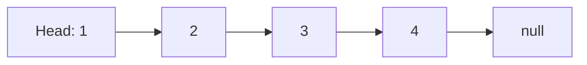
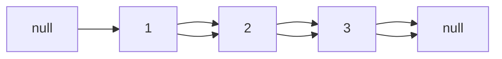
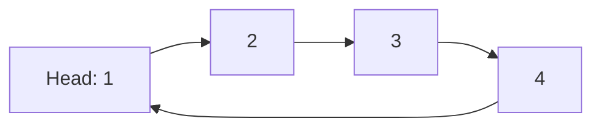
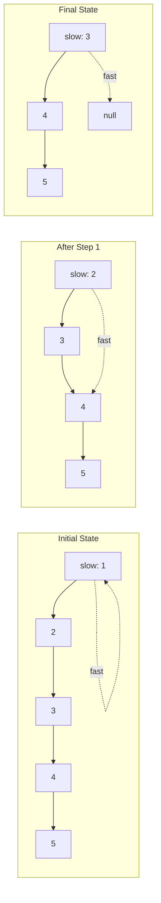
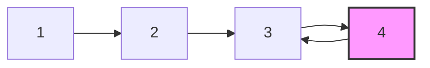

# Linked Lists

## Why Linked Lists Matter

Linked lists enable efficient insertion and deletion at arbitrary positions—operations that would require O(n) shifts in arrays:

- **Dynamic memory allocation**: Nodes scattered throughout memory, no need for contiguous allocation
- **Efficient insert/delete**: O(1) at known position (just update pointers)
- **Implementation foundation**: Stack, queue, hash map chaining, and graph adjacency lists
- **Interview patterns**: Fast/slow pointer, list reversal, and cycle detection appear in 30%+ of linked list problems

**Real-world impact**: LinkedHashMap uses a doubly-linked list for iteration order—making `entrySet()` traversal O(n) instead of potentially O(n²) with pure HashMap.

## Core Concepts

### Singly Linked List Structure

Each node contains data and a pointer to the next node:

```java
class ListNode {
    int val;
    ListNode next;
    ListNode(int val) { this.val = val; }
}
```



**Key characteristics**:
- **Head pointer**: Entry point to the list (losing it means losing the entire list)
- **Last node**: Points to `null` (end-of-list marker)
- **Access**: O(n) to reach i-th element (must traverse from head)

### Doubly Linked List

Nodes have both `next` and `prev` pointers:

```java
class DoublyListNode {
    int val;
    DoublyListNode prev;
    DoublyListNode next;
    DoublyListNode(int val) { this.val = val; }
}
```



**Advantages**:
- **Bidirectional traversal**: Can iterate forward or backward
- **O(1) deletion** when node reference is known (no need to find predecessor)
- **Supports operations**: Undo/redo, browser history back/forward

**Disadvantages**:
- **2x memory overhead**: Two pointers per node instead of one
- **Complexity**: More pointer operations to maintain

### Circular Linked List

Last node points back to head (no `null` terminator):



**Use cases**:
- **Round-robin scheduling**: CPU process scheduling
- **Buffer implementation**: Circular buffers for streaming data
- **Game loops**: Player turns cycling through players

### Linked List vs ArrayList

| Operation | Linked List | ArrayList | Winner |
|-----------|-------------|-----------|--------|
| **Access (index)** | O(n) | O(1) | ArrayList |
| **Insert (head)** | O(1) | O(n) shift | Linked List |
| **Insert (tail)** | O(1) with tail ptr | O(1) amortized | Tie |
| **Insert (middle)** | O(n) search + O(1) insert | O(n) shift | Tie |
| **Delete (known node)** | O(1) | O(n) shift | Linked List |
| **Delete (value)** | O(n) search | O(n) search | Tie |
| **Memory overhead** | 16+ bytes/element | 4+ bytes/element | ArrayList |

**When to use linked lists**:
- Frequent insertions/deletions at head (stacks, queues)
- Implementing other data structures (LRU cache, LinkedHashMap)
- Unknown/very large size (no resizing needed)

**When to use ArrayList**:
- Random access by index
- Mostly append operations
- Memory-constrained environments

## Deep Dive

### Traversal Patterns

#### Basic Traversal

```java
public void printList(ListNode head) {
    ListNode current = head;
    while (current != null) {
        System.out.print(current.val + " -> ");
        current = current.next;
    }
    System.out.println("null");
}
```

#### Sentinel Node Pattern

Use dummy head to simplify edge cases:

```java
public ListNode insertAtHead(ListNode head, int val) {
    ListNode dummy = new ListNode(0);  // Sentinel
    dummy.next = head;

    ListNode newNode = new ListNode(val);
    newNode.next = dummy.next;
    dummy.next = newNode;

    return dummy.next;  // New head
}
```

**Benefit**: No special case for empty list (sentinel always exists)

### Fast/Slow Pointer Pattern

Two pointers moving at different speeds to find middle element or detect cycles:

```java
public ListNode findMiddle(ListNode head) {
    ListNode slow = head;
    ListNode fast = head;

    while (fast != null && fast.next != null) {
        slow = slow.next;        // Move 1 step
        fast = fast.next.next;   // Move 2 steps
    }

    return slow;  // Middle node
}
```



**Applications**:
- Find middle element (above)
- Detect cycles (tortoise and hare)
- Find k-th element from end (fast pointer k steps ahead)

### List Reversal

#### Iterative Reversal

```java
public ListNode reverseList(ListNode head) {
    ListNode prev = null;
    ListNode current = head;

    while (current != null) {
        ListNode nextTemp = current.next;  // Save next
        current.next = prev;               // Reverse link
        prev = current;                    // Move prev forward
        current = nextTemp;                // Move current forward
    }

    return prev;  // New head
}
```

**Visualization**:
```
Initial:    1 -> 2 -> 3 -> null
Step 1:     null <- 1    2 -> 3 -> null
Step 2:     null <- 1 <- 2    3 -> null
Step 3:     null <- 1 <- 2 <- 3
Return:     3 (new head)
```

#### Recursive Reversal

```java
public ListNode reverseListRecursive(ListNode head) {
    if (head == null || head.next == null) {
        return head;  // Base case: empty or single node
    }

    ListNode newHead = reverseListRecursive(head.next);
    head.next.next = head;  // Reverse link
    head.next = null;       // Old tail points to null
    return newHead;
}
```

**Trade-off**: Recursive is more elegant but uses O(n) stack space

### Cycle Detection

```java
public boolean hasCycle(ListNode head) {
    if (head == null || head.next == null) {
        return false;
    }

    ListNode slow = head;
    ListNode fast = head;

    while (fast != null && fast.next != null) {
        slow = slow.next;
        fast = fast.next.next;

        if (slow == fast) {  // Cycle detected
            return true;
        }
    }

    return false;  // Fast reached null (no cycle)
}
```

**Why it works**: If cycle exists, fast pointer will eventually "lap" slow pointer (like runners on a track)



### Finding Cycle Start

```java
public ListNode detectCycle(ListNode head) {
    if (head == null) return null;

    ListNode slow = head;
    ListNode fast = head;

    // Phase 1: Detect cycle
    while (fast != null && fast.next != null) {
        slow = slow.next;
        fast = fast.next.next;

        if (slow == fast) {
            // Phase 2: Find cycle start
            ListNode ptr1 = head;
            ListNode ptr2 = slow;

            while (ptr1 != ptr2) {
                ptr1 = ptr1.next;
                ptr2 = ptr2.next;
            }

            return ptr1;  // Cycle start node
        }
    }

    return null;  // No cycle
}
```

**Mathematical proof**:
- Distance from head to cycle start: `a`
- Distance from cycle start to meeting point: `b`
- Cycle length: `c`
- When they meet: `slow = a + b`, `fast = 2(a + b) = a + b + nc`
- Therefore: `a = nc - b` (distance from meeting point to start = a)

### Merging Sorted Lists

```java
public ListNode mergeTwoLists(ListNode list1, ListNode list2) {
    ListNode dummy = new ListNode(0);  // Sentinel
    ListNode current = dummy;

    while (list1 != null && list2 != null) {
        if (list1.val <= list2.val) {
            current.next = list1;
            list1 = list1.next;
        } else {
            current.next = list2;
            list2 = list2.next;
        }
        current = current.next;
    }

    // Attach remaining nodes
    current.next = (list1 != null) ? list1 : list2;

    return dummy.next;
}
```

### Common Pitfalls

#### ❌ Losing head reference

```java
public void badTraverse(ListNode head) {
    while (head != null) {
        System.out.println(head.val);
        head = head.next;  // BUG: Modifies head parameter
    }
    // Can't access list anymore!
}
```

#### ✅ Use temporary pointer

```java
public void goodTraverse(ListNode head) {
    ListNode current = head;  // Temporary pointer
    while (current != null) {
        System.out.println(current.val);
        current = current.next;
    }
    // head still points to list start
}
```

#### ❌ NullPointerException when inserting

```java
public void badInsert(ListNode head, int val) {
    ListNode newNode = new ListNode(val);
    head.next = newNode;  // NPE if head is null
}
```

#### ✅ Check for null

```java
public ListNode goodInsert(ListNode head, int val) {
    if (head == null) {
        return new ListNode(val);  // New node becomes head
    }

    ListNode current = head;
    while (current.next != null) {
        current = current.next;
    }
    current.next = new ListNode(val);
    return head;
}
```

#### ❌ Infinite loop in cycle detection

```java
while (slow != fast) {  // BUG: Never enters if no cycle
    slow = slow.next;
    fast = fast.next.next;
}
```

#### ✅ Check fast pointer bounds

```java
while (fast != null && fast.next != null) {
    slow = slow.next;
    fast = fast.next.next;
    if (slow == fast) return true;
}
```

### Advanced Operations

#### Remove N-th Node From End

```java
public ListNode removeNthFromEnd(ListNode head, int n) {
    ListNode dummy = new ListNode(0);
    dummy.next = head;

    ListNode fast = dummy;
    ListNode slow = dummy;

    // Move fast n+1 steps ahead
    for (int i = 0; i <= n; i++) {
        fast = fast.next;
    }

    // Move both until fast reaches end
    while (fast != null) {
        slow = slow.next;
        fast = fast.next;
    }

    // Remove node after slow
    slow.next = slow.next.next;

    return dummy.next;
}
```

**Why n+1 steps**: Positions `slow` at node *before* the one to remove (needed for deletion)

#### Reorder List

**Problem**: Given `L0→L1→…→Ln-1→Ln`, reorder to `L0→Ln→L1→Ln-1→L2→Ln-2→…`

```java
public void reorderList(ListNode head) {
    if (head == null || head.next == null) return;

    // Step 1: Find middle
    ListNode slow = head, fast = head;
    while (fast.next != null && fast.next.next != null) {
        slow = slow.next;
        fast = fast.next.next;
    }

    // Step 2: Reverse second half
    ListNode secondHalf = reverseList(slow.next);
    slow.next = null;  // Split into two lists

    // Step 3: Merge two lists
    ListNode first = head;
    while (secondHalf != null) {
        ListNode temp1 = first.next;
        ListNode temp2 = secondHalf.next;

        first.next = secondHalf;
        secondHalf.next = temp1;

        first = temp1;
        secondHalf = temp2;
    }
}
```

#### Palindrome Detection

```java
public boolean isPalindrome(ListNode head) {
    if (head == null || head.next == null) return true;

    // Step 1: Find middle
    ListNode slow = head, fast = head;
    while (fast.next != null && fast.next.next != null) {
        slow = slow.next;
        fast = fast.next.next;
    }

    // Step 2: Reverse second half
    ListNode secondHalf = reverseList(slow.next);
    slow.next = null;

    // Step 3: Compare two halves
    ListNode first = head;
    ListNode second = secondHalf;
    boolean result = true;

    while (second != null) {
        if (first.val != second.val) {
            result = false;
            break;
        }
        first = first.next;
        second = second.next;
    }

    // Step 4: Restore (optional)
    reverseList(secondHalf);
    slow.next = secondHalf;

    return result;
}
```

**Time**: O(n) | **Space**: O(1) (reversing in-place)

## Practical Applications

### LRU Cache Implementation

```java
public class LRUCache {
    private class Node {
        int key, value;
        Node prev, next;
        Node(int key, int value) {
            this.key = key;
            this.value = value;
        }
    }

    private final int capacity;
    private final Map<Integer, Node> cache;
    private Node head, tail;  // Dummy head and tail

    public LRUCache(int capacity) {
        this.capacity = capacity;
        this.cache = new HashMap<>();

        // Initialize sentinel nodes
        head = new Node(0, 0);
        tail = new Node(0, 0);
        head.next = tail;
        tail.prev = head;
    }

    public int get(int key) {
        if (!cache.containsKey(key)) return -1;

        Node node = cache.get(key);
        moveToHead(node);  // Most recently used
        return node.value;
    }

    public void put(int key, int value) {
        if (cache.containsKey(key)) {
            Node node = cache.get(key);
            node.value = value;
            moveToHead(node);
        } else {
            Node newNode = new Node(key, value);
            cache.put(key, newNode);
            addToHead(newNode);

            if (cache.size() > capacity) {
                Node lru = removeTail();
                cache.remove(lru.key);
            }
        }
    }

    private void addToHead(Node node) {
        node.prev = head;
        node.next = head.next;
        head.next.prev = node;
        head.next = node;
    }

    private void removeNode(Node node) {
        node.prev.next = node.next;
        node.next.prev = node.prev;
    }

    private void moveToHead(Node node) {
        removeNode(node);
        addToHead(node);
    }

    private Node removeTail() {
        Node node = tail.prev;
        removeNode(node);
        return node;
    }
}
```

### Browser History (Doubly Linked List)

```java
public class BrowserHistory {
    private class Page {
        String url;
        Page prev, next;
        Page(String url) { this.url = url; }
    }

    private Page current;

    public BrowserHistory(String homepage) {
        current = new Page(homepage);
    }

    public void visit(String url) {
        Page newPage = new Page(url);
        newPage.prev = current;

        // Clear forward history
        current.next = null;

        current = newPage;
    }

    public String back(int steps) {
        while (steps > 0 && current.prev != null) {
            current = current.prev;
            steps--;
        }
        return current.url;
    }

    public String forward(int steps) {
        while (steps > 0 && current.next != null) {
            current = current.next;
            steps--;
        }
        return current.url;
    }
}
```

### Hash Map with Chaining

```java
public class MyHashMap {
    private class ListNode {
        int key, value;
        ListNode next;
        ListNode(int key, int value) {
            this.key = key;
            this.value = value;
        }
    }

    private final ListNode[] buckets;
    private static final int SIZE = 1000;

    public MyHashMap() {
        buckets = new ListNode[SIZE];
    }

    private int getIndex(int key) {
        return Math.abs(key) % SIZE;
    }

    public void put(int key, int value) {
        int index = getIndex(key);
        ListNode node = findNode(index, key);

        if (node == null) {
            // Insert new node at head
            ListNode newNode = new ListNode(key, value);
            newNode.next = buckets[index];
            buckets[index] = newNode;
        } else {
            node.value = value;  // Update existing
        }
    }

    public int get(int key) {
        int index = getIndex(key);
        ListNode node = findNode(index, key);
        return node == null ? -1 : node.value;
    }

    public void remove(int key) {
        int index = getIndex(key);

        if (buckets[index] == null) return;

        // Special case: head node
        if (buckets[index].key == key) {
            buckets[index] = buckets[index].next;
            return;
        }

        ListNode prev = buckets[index];
        while (prev.next != null) {
            if (prev.next.key == key) {
                prev.next = prev.next.next;
                return;
            }
            prev = prev.next;
        }
    }

    private ListNode findNode(int index, int key) {
        ListNode current = buckets[index];
        while (current != null) {
            if (current.key == key) return current;
            current = current.next;
        }
        return null;
    }
}
```

## Interview Questions

### Q1: Reverse Linked List (Easy)

**Problem**: Reverse a singly linked list.

**Approach**: Iterative reversal with three pointers (prev, current, next)

**Complexity**: O(n) time, O(1) space

```java
public ListNode reverseList(ListNode head) {
    ListNode prev = null;
    ListNode current = head;

    while (current != null) {
        ListNode nextTemp = current.next;
        current.next = prev;
        prev = current;
        current = nextTemp;
    }

    return prev;
}
```

### Q2: Merge Two Sorted Lists (Easy)

**Problem**: Merge two sorted linked lists into one sorted list.

**Approach**: Compare heads, append smaller, advance pointer

**Complexity**: O(n + m) time, O(1) space

```java
public ListNode mergeTwoLists(ListNode list1, ListNode list2) {
    ListNode dummy = new ListNode(0);
    ListNode current = dummy;

    while (list1 != null && list2 != null) {
        if (list1.val <= list2.val) {
            current.next = list1;
            list1 = list1.next;
        } else {
            current.next = list2;
            list2 = list2.next;
        }
        current = current.next;
    }

    current.next = (list1 != null) ? list1 : list2;
    return dummy.next;
}
```

### Q3: Linked List Cycle (Easy)

**Problem**: Determine if linked list has a cycle.

**Approach**: Fast/slow pointer (tortoise and hare)

**Complexity**: O(n) time, O(1) space

```java
public boolean hasCycle(ListNode head) {
    if (head == null || head.next == null) return false;

    ListNode slow = head, fast = head;

    while (fast != null && fast.next != null) {
        slow = slow.next;
        fast = fast.next.next;

        if (slow == fast) return true;
    }

    return false;
}
```

### Q4: Remove Nth Node From End (Medium)

**Problem**: Remove n-th node from end of list.

**Approach**: Two pointers separated by n steps

**Complexity**: O(n) time, O(1) space

```java
public ListNode removeNthFromEnd(ListNode head, int n) {
    ListNode dummy = new ListNode(0);
    dummy.next = head;

    ListNode fast = dummy, slow = dummy;

    // Move fast n+1 steps ahead
    for (int i = 0; i <= n; i++) {
        fast = fast.next;
    }

    while (fast != null) {
        slow = slow.next;
        fast = fast.next;
    }

    slow.next = slow.next.next;
    return dummy.next;
}
```

### Q5: Reorder List (Medium)

**Problem**: Reorder list to L0→Ln→L1→Ln-1→L2→Ln-2→...

**Approach**: Find middle → Reverse second half → Merge alternately

**Complexity**: O(n) time, O(1) space

```java
public void reorderList(ListNode head) {
    if (head == null || head.next == null) return;

    // Find middle
    ListNode slow = head, fast = head;
    while (fast.next != null && fast.next.next != null) {
        slow = slow.next;
        fast = fast.next.next;
    }

    // Reverse second half
    ListNode secondHalf = reverseList(slow.next);
    slow.next = null;

    // Merge alternately
    ListNode first = head;
    while (secondHalf != null) {
        ListNode temp1 = first.next;
        ListNode temp2 = secondHalf.next;

        first.next = secondHalf;
        secondHalf.next = temp1;

        first = temp1;
        secondHalf = temp2;
    }
}
```

### Q6: Add Two Numbers (Medium)

**Problem**: Add two numbers represented by reversed linked lists.

**Approach**: Digit-by-digit addition with carry

**Complexity**: O(max(n, m)) time, O(max(n, m)) space

```java
public ListNode addTwoNumbers(ListNode l1, ListNode l2) {
    ListNode dummy = new ListNode(0);
    ListNode current = dummy;
    int carry = 0;

    while (l1 != null || l2 != null || carry != 0) {
        int sum = carry;

        if (l1 != null) {
            sum += l1.val;
            l1 = l1.next;
        }

        if (l2 != null) {
            sum += l2.val;
            l2 = l2.next;
        }

        carry = sum / 10;
        current.next = new ListNode(sum % 10);
        current = current.next;
    }

    return dummy.next;
}
```

### Q7: Copy List with Random Pointer (Medium)

**Problem**: Deep copy linked list where each node has a random pointer.

**Approach**: Create copy nodes → Map original to copy → Link random pointers

**Complexity**: O(n) time, O(n) space

```java
class Node {
    int val;
    Node next, random;
    Node(int val) { this.val = val; }
}

public Node copyRandomList(Node head) {
    if (head == null) return null;

    Map<Node, Node> map = new HashMap<>();

    // First pass: create copy nodes
    Node current = head;
    while (current != null) {
        map.put(current, new Node(current.val));
        current = current.next;
    }

    // Second pass: link next and random
    current = head;
    while (current != null) {
        Node copy = map.get(current);
        copy.next = map.get(current.next);
        copy.random = map.get(current.random);
        current = current.next;
    }

    return map.get(head);
}
```

## Further Reading

- **Stacks & Queues**: Built on linked list principles
- **Two Pointers**: Fast/slow pattern used extensively
- **Hash Maps**: Chaining uses linked lists
- **LeetCode**: [Linked List problems](https://leetcode.com/tag/linked-list/)
