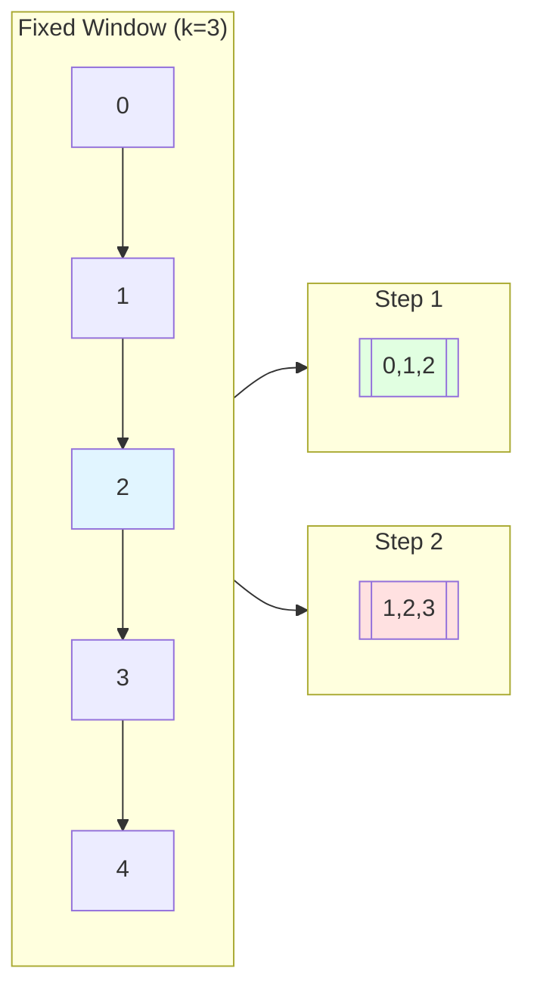
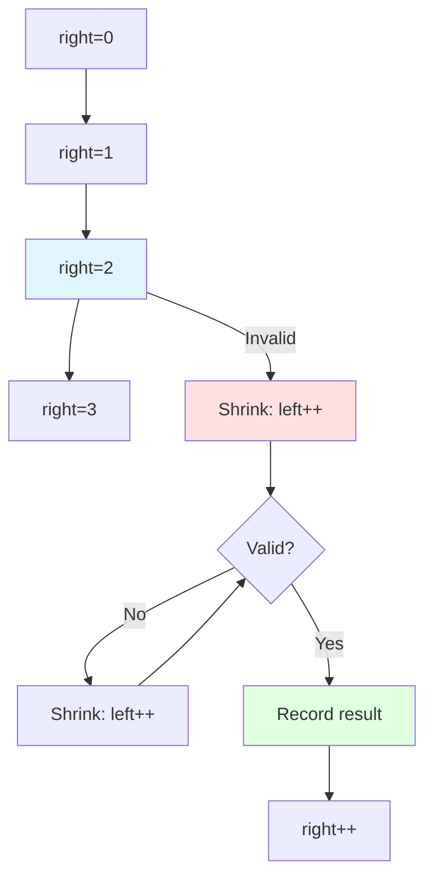
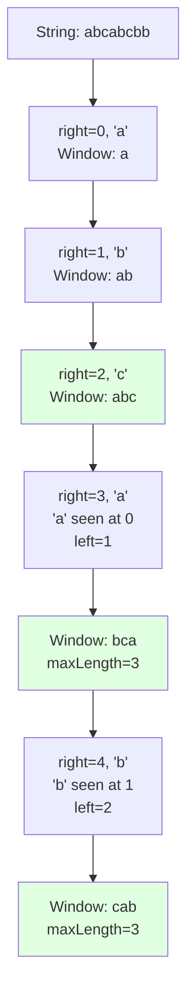

# Sliding Window Pattern

## Why Sliding Window Matters

Sliding window optimizes problems involving subarrays or substrings—reducing O(n²) to O(n):

- **Substring search**: Find longest/shortest substring with property
- **Subarray problems**: Maximum sum subarray, longest subarray with constraint
- **Rate limiting**: Track requests in time window
- **Stream processing**: Compute aggregates over sliding time windows

**Real-world impact**:
- Finding longest substring without repeating characters:
  - Brute force: O(n²) checking all substrings
  - Sliding window: O(n) single pass—**100,000x faster for 100K character string**
- Network traffic analysis: Monitor bandwidth usage in rolling windows

## Core Concepts

### Fixed-Size Window

Window size is constant, slide through array:

```java
int windowSize = k;
for (int i = 0; i < arr.length - k + 1; i++) {
    // Process window [i, i + k)
}
```



**Use cases**:
- Maximum sum of k consecutive elements
- Average of subarrays of size k
- Count occurrences in fixed window

### Dynamic-Size Window

Window grows and shrinks based on condition:

```java
int left = 0;
for (int right = 0; right < arr.length; right++) {
    // Add arr[right] to window

    // Shrink window while invalid
    while (windowInvalid()) {
        // Remove arr[left] from window
        left++;
    }

    // Window [left, right] is valid
}
```



**Use cases**:
- Longest substring with constraint
- Shortest substring with all characters
- Maximum subarray with sum constraint

## Deep Dive

### Fixed Window: Maximum Average Subarray

Find maximum average of any contiguous subarray of length k:

```java
public double findMaxAverage(int[] nums, int k) {
    // Compute sum of first window
    int sum = 0;
    for (int i = 0; i < k; i++) {
        sum += nums[i];
    }

    int maxSum = sum;

    // Slide window
    for (int i = k; i < nums.length; i++) {
        sum += nums[i] - nums[i - k];  // Add new, remove old
        maxSum = Math.max(maxSum, sum);
    }

    return (double) maxSum / k;
}
```

**Key insight**: Update sum in O(1) by adding new element and removing element leaving window

### Dynamic Window: Longest Substring Without Repeating Characters

```java
public int lengthOfLongestSubstring(String s) {
    Map<Character, Integer> lastIndex = new HashMap<>();
    int left = 0, maxLength = 0;

    for (int right = 0; right < s.length(); right++) {
        char c = s.charAt(right);

        // If character seen and in current window
        if (lastIndex.containsKey(c) && lastIndex.get(c) >= left) {
            // Move left past previous occurrence
            left = lastIndex.get(c) + 1;
        }

        // Update last seen index
        lastIndex.put(c, right);

        // Update max length
        maxLength = Math.max(maxLength, right - left + 1);
    }

    return maxLength;
}
```



### Minimum Window Substring

Find minimum window in s containing all characters of t:

```java
public String minWindow(String s, String t) {
    if (s.length() < t.length()) return "";

    // Count characters in t
    Map<Character, Integer> need = new HashMap<>();
    for (char c : t.toCharArray()) {
        need.merge(c, 1, Integer::sum);
    }

    // Track how many characters we need to match
    int required = need.size();
    int formed = 0;

    // Window character counts
    Map<Character, Integer> window = new HashMap<>();

    int left = 0, right = 0;
    int[] result = {-1, 0, 0};  // {length, left, right}

    while (right < s.length()) {
        // Add character from right
        char c = s.charAt(right);
        window.merge(c, 1, Integer::sum);

        // Check if we have enough of this character
        if (need.containsKey(c) && window.get(c).intValue() == need.get(c).intValue()) {
            formed++;
        }

        // Try to shrink window while valid
        while (left <= right && formed == required) {
            c = s.charAt(left);

            // Update result if smaller window
            if (result[0] == -1 || right - left + 1 < result[0]) {
                result[0] = right - left + 1;
                result[1] = left;
                result[2] = right;
            }

            // Remove character from left
            window.merge(c, -1, Integer::sum);
            if (need.containsKey(c) && window.get(c) < need.get(c)) {
                formed--;
            }

            left++;
        }

        right++;
    }

    return result[0] == -1 ? "" : s.substring(result[1], result[2] + 1);
}
```

**Two pointers** with expansion and shrinking:
1. **Expand**: Move right, add characters
2. **Check**: If window valid (contains all chars), try to shrink
3. **Shrink**: Move left while window remains valid
4. **Record**: Update minimum window

### Common Pitfalls

#### ❌ Not shrinking window when invalid

```java
for (int right = 0; right < nums.length; right++) {
    sum += nums[right];

    if (sum >= target) {  // BUG: Only checks once
        minLength = Math.min(minLength, right - left + 1);
    }
}
```

#### ✅ Use while loop for shrinking

```java
for (int right = 0; right < nums.length; right++) {
    sum += nums[right];

    while (sum >= target) {  // Shrink until invalid
        minLength = Math.min(minLength, right - left + 1);
        sum -= nums[left];
        left++;
    }
}
```

#### ❌ Off-by-one in window calculation

```java
int windowSize = right - left;  // BUG: Should be right - left + 1
```

#### ✅ Include both boundaries

```java
int windowSize = right - left + 1;  // Correct
```

#### ❌ Forgetting to remove left element when shrinking

```java
while (invalid) {
    left++;  // BUG: Didn't remove nums[left] from sum
}
```

#### ✅ Remove before moving left

```java
while (invalid) {
    sum -= nums[left];  // Remove first
    left++;             // Then move
}
```

### Advanced Patterns

#### Longest Subarray with Sum ≤ K

```java
public int longestSubarray(int[] nums, int k) {
    int left = 0, sum = 0, maxLength = 0;

    for (int right = 0; right < nums.length; right++) {
        sum += nums[right];

        // Shrink while sum exceeds k
        while (sum > k && left <= right) {
            sum -= nums[left];
            left++;
        }

        maxLength = Math.max(maxLength, right - left + 1);
    }

    return maxLength;
}
```

#### Count Subarrays with Exactly K Ones

```java
public int numSubarraysWithK(int[] nums, int k) {
    // Subarrays with at most K ones - subarrays with at most K-1 ones
    return atMostK(nums, k) - atMostK(nums, k - 1);
}

private int atMostK(int[] nums, int k) {
    int left = 0, count = 0, sum = 0;

    for (int right = 0; right < nums.length; right++) {
        sum += nums[right];

        while (sum > k) {
            sum -= nums[left];
            left++;
        }

        count += right - left + 1;
    }

    return count;
}
```

**Inclusion-exclusion principle**: Exactly K = At most K - At most (K-1)

#### Permutation in String

Check if s2 contains permutation of s1:

```java
public boolean checkInclusion(String s1, String s2) {
    if (s1.length() > s2.length()) return false;

    int[] count = new int[26];

    // Count characters in s1
    for (char c : s1.toCharArray()) {
        count[c - 'a']++;
    }

    // Sliding window
    for (int i = 0; i < s2.length(); i++) {
        // Add new character
        count[s2.charAt(i) - 'a']--;

        // Remove character leaving window
        if (i >= s1.length()) {
            count[s2.charAt(i - s1.length()) - 'a']++;
        }

        // Check if all counts are zero
        if (i >= s1.length() - 1) {
            boolean allZero = true;
            for (int j = 0; j < 26; j++) {
                if (count[j] != 0) {
                    allZero = false;
                    break;
                }
            }
            if (allZero) return true;
        }
    }

    return false;
}
```

## Practical Applications

### Rate Limiter with Sliding Window

```java
public class SlidingWindowRateLimiter {
    private final Queue<Long> timestamps;
    private final int maxRequests;
    private final long windowSizeMs;

    public SlidingWindowRateLimiter(int maxRequests, long windowSizeMs) {
        this.timestamps = new LinkedList<>();
        this.maxRequests = maxRequests;
        this.windowSizeMs = windowSizeMs;
    }

    public synchronized boolean allowRequest(long currentTime) {
        // Remove expired timestamps
        while (!timestamps.isEmpty() &&
               currentTime - timestamps.peek() > windowSizeMs) {
            timestamps.poll();
        }

        if (timestamps.size() < maxRequests) {
            timestamps.offer(currentTime);
            return true;
        }

        return false;
    }

    public long getWaitTimeMs(long currentTime) {
        if (timestamps.size() < maxRequests) return 0;

        long oldestTimestamp = timestamps.peek();
        long elapsed = currentTime - oldestTimestamp;
        return Math.max(0, windowSizeMs - elapsed + 1);
    }
}
```

### Moving Average for Data Stream

```java
public class MovingAverage {
    private final Queue<Integer> window;
    private final int size;
    private double sum;

    public MovingAverage(int size) {
        this.window = new LinkedList<>();
        this.size = size;
        this.sum = 0;
    }

    public double next(int val) {
        window.offer(val);
        sum += val;

        if (window.size() > size) {
            sum -= window.poll();
        }

        return sum / window.size();
    }
}
```

### Longest Substring with At Most K Distinct Characters

```java
public int lengthOfLongestSubstringKDistinct(String s, int k) {
    if (k == 0) return 0;

    Map<Character, Integer> count = new HashMap<>();
    int left = 0, maxLength = 0;

    for (int right = 0; right < s.length(); right++) {
        char c = s.charAt(right);
        count.merge(c, 1, Integer::sum);

        // Shrink if more than K distinct characters
        while (count.size() > k) {
            char leftChar = s.charAt(left);
            count.merge(leftChar, -1, Integer::sum);
            if (count.get(leftChar) == 0) {
                count.remove(leftChar);
            }
            left++;
        }

        maxLength = Math.max(maxLength, right - left + 1);
    }

    return maxLength;
}
```

## Interview Questions

### Q1: Maximum Average Subarray I (Easy)

**Problem**: Find maximum average of subarray of length k.

**Approach**: Fixed sliding window

**Complexity**: O(n) time, O(1) space

```java
public double findMaxAverage(int[] nums, int k) {
    int sum = 0;
    for (int i = 0; i < k; i++) {
        sum += nums[i];
    }

    int maxSum = sum;
    for (int i = k; i < nums.length; i++) {
        sum += nums[i] - nums[i - k];
        maxSum = Math.max(maxSum, sum);
    }

    return (double) maxSum / k;
}
```

### Q2: Maximum Number of Vowels in Substring (Easy)

**Problem**: Find max vowels in any substring of length k.

**Approach**: Fixed window with vowel check

**Complexity**: O(n) time, O(1) space

```java
public int maxVowels(String s, int k) {
    Set<Character> vowels = Set.of('a', 'e', 'i', 'o', 'u');
    int count = 0, maxCount = 0;

    // First window
    for (int i = 0; i < k; i++) {
        if (vowels.contains(s.charAt(i))) count++;
    }
    maxCount = count;

    // Slide window
    for (int i = k; i < s.length(); i++) {
        if (vowels.contains(s.charAt(i))) count++;
        if (vowels.contains(s.charAt(i - k))) count--;
        maxCount = Math.max(maxCount, count);
    }

    return maxCount;
}
```

### Q3: Longest Substring Without Repeating Characters (Medium)

**Problem**: Find longest substring with all unique characters.

**Approach**: Dynamic window with character map

**Complexity**: O(n) time, O(min(m, n)) space (m = charset size)

```java
public int lengthOfLongestSubstring(String s) {
    Map<Character, Integer> lastIndex = new HashMap<>();
    int left = 0, maxLength = 0;

    for (int right = 0; right < s.length(); right++) {
        char c = s.charAt(right);

        if (lastIndex.containsKey(c) && lastIndex.get(c) >= left) {
            left = lastIndex.get(c) + 1;
        }

        lastIndex.put(c, right);
        maxLength = Math.max(maxLength, right - left + 1);
    }

    return maxLength;
}
```

### Q4: Permutation in String (Medium)

**Problem**: Check if s2 contains permutation of s1.

**Approach**: Fixed window with character counts

**Complexity**: O(n) time, O(1) space (26 letters)

```java
public boolean checkInclusion(String s1, String s2) {
    if (s1.length() > s2.length()) return false;

    int[] count = new int[26];

    for (char c : s1.toCharArray()) {
        count[c - 'a']++;
    }

    for (int i = 0; i < s2.length(); i++) {
        count[s2.charAt(i) - 'a']--;

        if (i >= s1.length()) {
            count[s2.charAt(i - s1.length()) - 'a']++;
        }

        if (i >= s1.length() - 1 && allZero(count)) {
            return true;
        }
    }

    return false;
}

private boolean allZero(int[] count) {
    for (int c : count) {
        if (c != 0) return false;
    }
    return true;
}
```

### Q5: Minimum Size Subarray Sum (Medium)

**Problem**: Find minimal length subarray with sum ≥ target.

**Approach**: Dynamic window, shrink when valid

**Complexity**: O(n) time, O(1) space

```java
public int minSubArrayLen(int target, int[] nums) {
    int left = 0, sum = 0, minLength = Integer.MAX_VALUE;

    for (int right = 0; right < nums.length; right++) {
        sum += nums[right];

        while (sum >= target) {
            minLength = Math.min(minLength, right - left + 1);
            sum -= nums[left];
            left++;
        }
    }

    return minLength == Integer.MAX_VALUE ? 0 : minLength;
}
```

### Q6: Longest Substring with At Most K Distinct Characters (Medium)

**Problem**: Find longest substring with ≤ K distinct characters.

**Approach**: Dynamic window with character count

**Complexity**: O(n) time, O(k) space

```java
public int lengthOfLongestSubstringKDistinct(String s, int k) {
    if (k == 0) return 0;

    Map<Character, Integer> count = new HashMap<>();
    int left = 0, maxLength = 0;

    for (int right = 0; right < s.length(); right++) {
        count.merge(s.charAt(right), 1, Integer::sum);

        while (count.size() > k) {
            char leftChar = s.charAt(left);
            count.merge(leftChar, -1, Integer::sum);
            if (count.get(leftChar) == 0) {
                count.remove(leftChar);
            }
            left++;
        }

        maxLength = Math.max(maxLength, right - left + 1);
    }

    return maxLength;
}
```

### Q7: Sliding Window Maximum (Hard)

**Problem**: Find max in each sliding window of size k.

**Approach**: Monotonic deque (decreasing order)

**Complexity**: O(n) time, O(k) space

```java
public int[] maxSlidingWindow(int[] nums, int k) {
    int n = nums.length;
    int[] result = new int[n - k + 1];
    Deque<Integer> deque = new ArrayDeque<>();  // Stores indices

    for (int i = 0; i < n; i++) {
        // Remove indices outside window
        while (!deque.isEmpty() && deque.peekFirst() < i - k + 1) {
            deque.pollFirst();
        }

        // Remove smaller elements
        while (!deque.isEmpty() && nums[deque.peekLast()] < nums[i]) {
            deque.pollLast();
        }

        deque.offerLast(i);

        if (i >= k - 1) {
            result[i - k + 1] = nums[deque.peekFirst()];
        }
    }

    return result;
}
```

## Further Reading

- **Two Pointers**: Often implements sliding window
- **Hash Maps**: Track character/element frequencies
- **Deque**: Monotonic deque for sliding window max
- **LeetCode**: [Sliding Window problems](https://leetcode.com/tag/sliding-window/)
