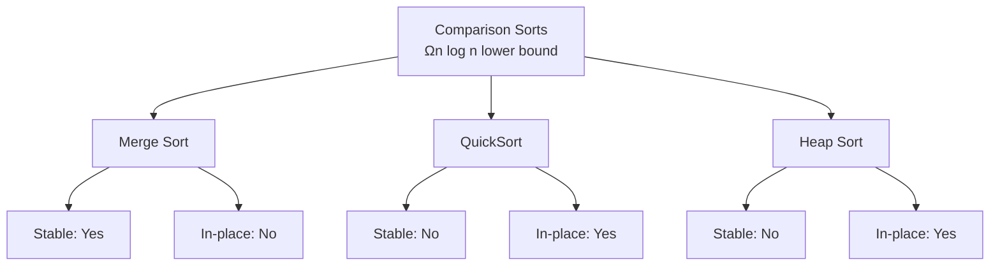

# Sorting Algorithms

## Why Sorting Matters

Sorting is fundamental to efficient data processing—enabling binary search, duplicate detection, and data analysis:

- **Database queries**: ORDER BY uses optimized sort
- **Search optimization**: Binary search requires sorted data
- **Data analysis**: Finding median, percentiles, outliers
- **Efficiency**: Many algorithms assume sorted input

**Real-world impact**:
- Sorting 1 million integers:
  - Bubble sort: ~1 hour (O(n²))
  - QuickSort: ~50ms (O(n log n))—**70,000x faster**
- Java's `Arrays.sort()` uses hybrid TimSort for optimal performance

## Core Concepts

### Comparison-Based Sorting

All comparison sorts have lower bound of **O(n log n)**:



### Non-Comparison Sorting

Can achieve **O(n)** by exploiting data properties:

| Algorithm | Time | Space | Stable | Constraints |
|-----------|------|-------|--------|------------|
| **Counting Sort** | O(n + k) | O(k) | Yes | Small integer range |
| **Radix Sort** | O(d × n) | O(n + k) | Yes | Integer/string keys |
| **Bucket Sort** | O(n + k) | O(n) | Yes | Uniform distribution |

Where:
- `k` = range of values (for counting/bucket)
- `d` = number of digits (for radix)

### Stability

**Stable sort** preserves relative order of equal elements:

```
Before: [(Alice, 25), (Bob, 20), (Charlie, 25)]
After stable sort by age:
        [(Bob, 20), (Alice, 25), (Charlie, 25)]
                                ↑
                    Alice before Charlie (stable)
```

**Why stability matters**:
- Sort by multiple criteria (e.g., department, then salary)
- Maintain meaningful relative ordering

## Deep Dive

### Merge Sort

Divide array in half, recursively sort, merge sorted halves:

```java
public void mergeSort(int[] arr, int left, int right) {
    if (left < right) {
        int mid = left + (right - left) / 2;

        mergeSort(arr, left, mid);      // Sort left half
        mergeSort(arr, mid + 1, right);  // Sort right half

        merge(arr, left, mid, right);    // Merge
    }
}

private void merge(int[] arr, int left, int mid, int right) {
    // Create temp arrays
    int[] leftArr = Arrays.copyOfRange(arr, left, mid + 1);
    int[] rightArr = Arrays.copyOfRange(arr, mid + 1, right + 1);

    int i = 0, j = 0, k = left;

    while (i < leftArr.length && j < rightArr.length) {
        if (leftArr[i] <= rightArr[j]) {
            arr[k++] = leftArr[i++];
        } else {
            arr[k++] = rightArr[j++];
        }
    }

    // Copy remaining elements
    while (i < leftArr.length) arr[k++] = leftArr[i++];
    while (j < rightArr.length) arr[k++] = rightArr[j++];
}
```

**Complexity**: O(n log n) time, O(n) space
**Stable**: Yes (due to `<=` comparison)

**Advantages**:
- Guaranteed O(n log n) performance
- Stable
- Excellent for linked lists (O(1) extra space)

**Disadvantages**:
- Not in-place (requires O(n) extra space)
- Slower than QuickSort in practice due to copying

### QuickSort

Partition array around pivot, recursively sort partitions:

```java
public void quickSort(int[] arr, int low, int high) {
    if (low < high) {
        int pivotIndex = partition(arr, low, high);

        quickSort(arr, low, pivotIndex - 1);
        quickSort(arr, pivotIndex + 1, high);
    }
}

private int partition(int[] arr, int low, int high) {
    int pivot = arr[high];  // Choose last element as pivot
    int i = low - 1;  // Index of smaller element

    for (int j = low; j < high; j++) {
        if (arr[j] <= pivot) {
            i++;
            swap(arr, i, j);
        }
    }

    swap(arr, i + 1, high);
    return i + 1;
}

private void swap(int[] arr, int i, int j) {
    int temp = arr[i];
    arr[i] = arr[j];
    arr[j] = temp;
}
```

**Complexity**: Average O(n log n), Worst O(n²) time, O(log n) space
**Stable**: No (due to partitioning)

**Advantages**:
- In-place (O(log n) stack space for recursion)
- Fast in practice (cache-friendly)
- Can be optimized with randomized pivot

**Disadvantages**:
- Worst case O(n²) on already sorted array
- Not stable
- Vulnerable to poor pivot selection

### Heap Sort

Build max heap, repeatedly extract maximum:

```java
public void heapSort(int[] arr) {
    int n = arr.length;

    // Build max heap
    for (int i = n / 2 - 1; i >= 0; i--) {
        heapify(arr, n, i);
    }

    // Extract elements from heap
    for (int i = n - 1; i > 0; i--) {
        swap(arr, 0, i);  // Move current max to end
        heapify(arr, i, 0);  // Heapify reduced heap
    }
}

private void heapify(int[] arr, int n, int i) {
    int largest = i;  // Initialize largest as root
    int left = 2 * i + 1;
    int right = 2 * i + 2;

    if (left < n && arr[left] > arr[largest]) {
        largest = left;
    }

    if (right < n && arr[right] > arr[largest]) {
        largest = right;
    }

    if (largest != i) {
        swap(arr, i, largest);
        heapify(arr, n, largest);
    }
}
```

**Complexity**: O(n log n) time, O(1) space
**Stable**: No

**Advantages**:
- Guaranteed O(n log n) performance
- In-place
- No additional memory needed

**Disadvantages**:
- Not stable
- Slower than QuickSort in practice
- Poor cache locality

### Non-Comparison Sorts

#### Counting Sort

Count occurrences, reconstruct sorted array:

```java
public void countingSort(int[] arr) {
    int max = Arrays.stream(arr).max().getAsInt();
    int min = Arrays.stream(arr).min().getAsInt();
    int range = max - min + 1;

    int[] count = new int[range];
    int[] output = new int[arr.length];

    // Count occurrences
    for (int num : arr) {
        count[num - min]++;
    }

    // Calculate cumulative count
    for (int i = 1; i < range; i++) {
        count[i] += count[i - 1];
    }

    // Build output array (stable)
    for (int i = arr.length - 1; i >= 0; i--) {
        output[count[arr[i] - min] - 1] = arr[i];
        count[arr[i] - min]--;
    }

    System.arraycopy(output, 0, arr, 0, arr.length);
}
```

**Complexity**: O(n + k) time, O(k) space

**Use when**: Range `k` is O(n)

#### Radix Sort

Sort by each digit, least significant to most:

```java
public void radixSort(int[] arr) {
    int max = Arrays.stream(arr).max().getAsInt();

    // Sort by each digit
    for (int exp = 1; max / exp > 0; exp *= 10) {
        countingSortByDigit(arr, exp);
    }
}

private void countingSortByDigit(int[] arr, int exp) {
    int[] output = new int[arr.length];
    int[] count = new int[10];

    // Count occurrences
    for (int num : arr) {
        count[(num / exp) % 10]++;
    }

    // Cumulative count
    for (int i = 1; i < 10; i++) {
        count[i] += count[i - 1];
    }

    // Build output (stable)
    for (int i = arr.length - 1; i >= 0; i--) {
        output[count[(arr[i] / exp) % 10] - 1] = arr[i];
        count[(arr[i] / exp) % 10]--;
    }

    System.arraycopy(output, 0, arr, 0, arr.length);
}
```

**Complexity**: O(d × (n + k)) time, O(n + k) space

### Java's Sorting Algorithms

#### Arrays.sort() for primitives

Uses **Dual-Pivot Quicksort**:
- Two pivots instead of one
- Better cache locality
- Faster on average than standard QuickSort

#### Arrays.sort() for objects

Uses **TimSort** (hybrid of Merge Sort and Insertion Sort):
- Divide array into runs
- Sort small runs with Insertion Sort
- Merge runs adaptively
- Stable sort
- Optimized for real-world (partially sorted) data

## Practical Applications

### Custom Object Sorting

```java
class Person {
    String name;
    int age;
    int salary;
}

// Sort by age
Arrays.sort(people, Comparator.comparingInt(p -> p.age));

// Sort by name, then age (stable for equals names)
Arrays.sort(people, Comparator
    .comparing((Person p) -> p.name)
    .thenComparingInt(p -> p.age));

// Reverse order
Arrays.sort(people, Comparator.comparingInt(Person::getAge).reversed());
```

### Sort Binary Array

```java
public void sortBinary(int[] arr) {
    int left = 0, right = arr.length - 1;

    while (left < right) {
        while (left < right && arr[left] == 0) left++;
        while (left < right && arr[right] == 1) right--;

        if (left < right) {
            arr[left] = 0;
            arr[right] = 1;
            left++;
            right--;
        }
    }
}
```

### Sort by Frequency

```java
public int[] frequencySort(int[] nums) {
    Map<Integer, Integer> freq = new HashMap<>();
    for (int num : nums) {
        freq.merge(num, 1, Integer::sum);
    }

    return Arrays.stream(nums)
        .boxed()
        .sorted((a, b) -> {
            int freqCompare = freq.get(b) - freq.get(a);
            return freqCompare != 0 ? freqCompare : b - a;
        })
        .mapToInt(Integer::intValue)
        .toArray();
}
```

## Interview Questions

### Q1: Merge Sorted Array (Easy)

**Problem**: Merge two sorted arrays in-place.

**Approach**: Merge from end

**Complexity**: O(n + m) time, O(1) space

```java
public void merge(int[] nums1, int m, int[] nums2, int n) {
    int p1 = m - 1, p2 = n - 1, p = m + n - 1;

    while (p1 >= 0 && p2 >= 0) {
        if (nums1[p1] > nums2[p2]) {
            nums1[p--] = nums1[p1--];
        } else {
            nums1[p--] = nums2[p2--];
        }
    }

    while (p2 >= 0) {
        nums1[p--] = nums2[p2--];
    }
}
```

### Q2: Sort an Array (Medium)

**Problem**: Implement QuickSort.

**Approach**: Partition around pivot

**Complexity**: Average O(n log n), worst O(n²)

```java
public int[] sortArray(int[] nums) {
    quickSort(nums, 0, nums.length - 1);
    return nums;
}

private void quickSort(int[] nums, int low, int high) {
    if (low < high) {
        int pivot = partition(nums, low, high);
        quickSort(nums, low, pivot - 1);
        quickSort(nums, pivot + 1, high);
    }
}

private int partition(int[] nums, int low, int high) {
    int pivot = nums[high];
    int i = low;
    for (int j = low; j < high; j++) {
        if (nums[j] < pivot) {
            swap(nums, i++, j);
        }
    }
    swap(nums, i, high);
    return i;
}
```

### Q3: Sort Colors (Medium)

**Problem**: Sort array of 0s, 1s, 2s (Dutch National Flag).

**Approach**: Three-way partition

**Complexity**: O(n) time, O(1) space

```java
public void sortColors(int[] nums) {
    int low = 0, mid = 0, high = nums.length - 1;

    while (mid <= high) {
        if (nums[mid] == 0) {
            swap(nums, low++, mid++);
        } else if (nums[mid] == 1) {
            mid++;
        } else {
            swap(nums, mid, high--);
        }
    }
}
```

## Further Reading

- **Binary Search**: Requires sorted input
- **Heaps**: Heap sort uses priority queues
- **Divide & Conquer**: Merge sort strategy
- **LeetCode**: [Sorting problems](https://leetcode.com/tag/sort/)
