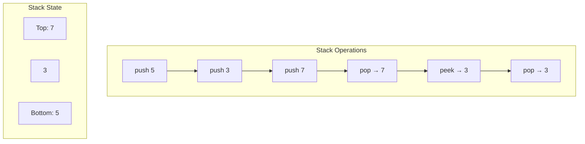
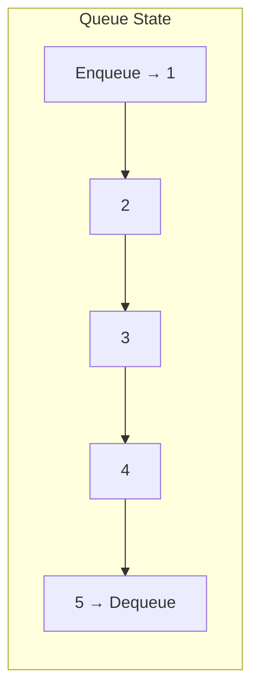
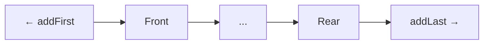

# Stacks & Queues

## Why Stacks & Queues Matter

Stacks and queues provide disciplined access patterns essential for managing data flow:

- **Stacks (LIFO)**: Function calls, undo operations, expression evaluation, backtracking
- **Queues (FIFO)**: Task scheduling, message queues, request handling, breadth-first search
- **Deques**: Double-ended operations (sliding windows, palindrome checking)
- **Priority Queues**: Task scheduling, Dijkstra's algorithm, event simulation

**Real-world impact**: Every web server uses a request queue. A poorly-sized queue can cause 503 errors under load, while proper sizing with backpressure handles 10x more requests.

## Core Concepts

### Stack (Last-In-First-Out)



**Java implementation**:
```java
// Array-based stack
Deque<Integer> stack = new ArrayDeque<>();

stack.push(1);   // O(1)
stack.push(2);
stack.pop();     // Returns 2, O(1)
stack.peek();    // Returns 1, O(1)
stack.isEmpty(); // O(1)
```

**Key operations**:
- `push(E e)`: Add to top - O(1)
- `pop()`: Remove and return top - O(1)
- `peek()`: Return top without removing - O(1)
- `isEmpty()`: Check if empty - O(1)

### Queue (First-In-First-Out)



**Java implementation**:
```java
Queue<Integer> queue = new LinkedList<>();
// Or faster: Queue<Integer> queue = new ArrayDeque<>();

queue.offer(1);  // Enqueue, O(1)
queue.offer(2);
queue.poll();    // Dequeue returns 1, O(1)
queue.peek();    // Returns 2, O(1)
```

**Key operations**:
- `offer(E e)`: Add to rear - O(1)
- `poll()`: Remove and return front - O(1)
- `peek()`: Return front without removing - O(1)

### Deque (Double-Ended Queue)

Supports insertion and removal at both ends:

```java
Deque<Integer> deque = new ArrayDeque<>();

// Stack operations
deque.push(1);      // Add to front
deque.pop();        // Remove from front

// Queue operations
deque.offer(1);     // Add to rear
deque.poll();       // Remove from front

// Deque-specific
deque.addFirst(1);  // Add to front
deque.addLast(2);   // Add to rear
deque.removeFirst();
deque.removeLast();
```



### Implementation Comparison

| Implementation | Stack Push/Pop | Queue Offer/Poll | Random Access | Memory Overhead | Best For |
|----------------|----------------|------------------|----------------|-----------------|----------|
| **ArrayDeque** | O(1) | O(1) | No | Low | General purpose (fastest) |
| **LinkedList** | O(1) | O(1) | No | High (node objects) | Frequent middle insertions |
| **ArrayList as Stack** | O(1) amortized | O(n) shift | Yes | Low | Random access needed |
| **PriorityQueue** | O(log n) | O(log n) | No | Low | Priority-based ordering |

**Recommendation**: Always use `ArrayDeque` unless you need specific features from other implementations.

## Deep Dive

### ArrayDeque Implementation

ArrayDeque uses a circular buffer to avoid resizing overhead:

```java
public class ArrayDeque<E> {
    transient Object[] elements;
    transient int head;
    transient int tail;

    public void addFirst(E e) {
        elements[head = (head - 1) & (elements.length - 1)] = e;
        if (head == tail) doubleCapacity();
    }

    public void addLast(E e) {
        elements[tail] = e;
        if ((tail = (tail + 1) & (elements.length - 1)) == head) {
            doubleCapacity();
        }
    }
}
```

**Circular buffer visualization**:
```
Size 8 array: [_, _, _, _, _, _, _, _]
              h
              t

addFirst(1):   [1, _, _, _, _, _, _, _]
              ht

addLast(2):    [1, _, _, _, _, _, _, 2]
              h                   t

addFirst(3):   [1, _, _, _, _, _, _, 2]
           h   t                  (wraps)
```

**Benefits**:
- No shifting when adding/removing from ends
- Better cache locality than linked list
- No per-element overhead (no node objects)

### Monotonic Stack

Maintains elements in increasing/decreasing order:

```java
public int[] nextGreaterElement(int[] nums) {
    int n = nums.length;
    int[] result = new int[n];
    Arrays.fill(result, -1);
    Deque<Integer> stack = new ArrayDeque<>();  // Stores indices

    for (int i = 0; i < n; i++) {
        while (!stack.isEmpty() && nums[stack.peek()] < nums[i]) {
            int idx = stack.pop();
            result[idx] = nums[i];  // i is next greater for idx
        }
        stack.push(i);
    }

    return result;
}
```

**Example**: `[73, 74, 75, 71, 69, 72, 76, 73]`
- 73 → 74 (next greater)
- 74 → 75
- 75 → 76
- 71 → 72
- 69 → 72
- 72 → 76
- 76 → -1 (no greater)
- 73 → -1

**Use cases**:
- Next greater/smaller element
- Largest rectangle in histogram
- Daily temperatures
- Stock span problem

### Valid Parentheses

```java
public boolean isValid(String s) {
    Deque<Character> stack = new ArrayDeque<>();

    for (char c : s.toCharArray()) {
        if (c == '(' || c == '{' || c == '[') {
            stack.push(c);
        } else {
            if (stack.isEmpty()) return false;

            char open = stack.pop();
            if (!isMatchingPair(open, c)) {
                return false;
            }
        }
    }

    return stack.isEmpty();
}

private boolean isMatchingPair(char open, char close) {
    return (open == '(' && close == ')') ||
           (open == '{' && close == '}') ||
           (open == '[' && close == ']');
}
```

### Common Pitfalls

#### ❌ Using Stack class (legacy)

```java
Stack<Integer> stack = new Stack<>();  // Synchronized, slow
```

#### ✅ Use ArrayDeque

```java
Deque<Integer> stack = new ArrayDeque<>();  // Unsynchronized, fast
```

#### ❌ Forgetting to check empty

```java
while (true) {
    int val = stack.pop();  // EmptyStackException if empty
}
```

#### ✅ Check before polling

```java
while (!stack.isEmpty()) {
    int val = stack.pop();
}
```

Or use `poll()` which returns `null` instead of throwing exception:
```java
Integer val = stack.poll();  // Returns null if empty
if (val != null) {
    // Process val
}
```

#### ❌ Queue capacity issues

```java
// LinkedBlockingQueue with no capacity limit
BlockingQueue<Task> queue = new LinkedBlockingQueue<>();
// Can grow indefinitely → OOM
```

#### ✅ Bounded queue with backpressure

```java
BlockingQueue<Task> queue = new ArrayBlockingQueue<>(1000);

// Producer: handle rejection
public void submit(Task task) {
    if (!queue.offer(task)) {  // Returns false if full
        // Apply backpressure: wait, reject, or drop
        throw new RejectedExecutionException("Queue full");
    }
}

// Or use timeout
try {
    boolean success = queue.offer(task, 1, TimeUnit.SECONDS);
    if (!success) {
        // Handle timeout
    }
} catch (InterruptedException e) {
    Thread.currentThread().interrupt();
}
```

### Advanced Operations

#### Implement Queue using Stacks

```java
class MyQueue {
    private Deque<Integer> inStack = new ArrayDeque<>();
    private Deque<Integer> outStack = new ArrayDeque<>();

    public void push(int x) {
        inStack.push(x);
    }

    public int pop() {
        if (outStack.isEmpty()) {
            while (!inStack.isEmpty()) {
                outStack.push(inStack.pop());
            }
        }
        return outStack.pop();
    }

    public int peek() {
        if (outStack.isEmpty()) {
            while (!inStack.isEmpty()) {
                outStack.push(inStack.pop());
            }
        }
        return outStack.peek();
    }

    public boolean empty() {
        return inStack.isEmpty() && outStack.isEmpty();
    }
}
```

**Amortized O(1)**: Each element moved twice max (in → out, then popped)

#### Implement Stack using Queues

```java
class MyStack {
    private Queue<Integer> queue = new LinkedList<>();

    public void push(int x) {
        queue.offer(x);
        // Rotate to keep newest at front
        int size = queue.size();
        for (int i = 0; i < size - 1; i++) {
            queue.offer(queue.poll());
        }
    }

    public int pop() {
        return queue.poll();
    }

    public int top() {
        return queue.peek();
    }

    public boolean empty() {
        return queue.isEmpty();
    }
}
```

#### Min Stack

```java
class MinStack {
    private Deque<int[]> stack = new ArrayDeque<>();  // [value, currentMin]

    public void push(int val) {
        int min = stack.isEmpty() ? val : Math.min(stack.peek()[1], val);
        stack.push(new int[]{val, min});
    }

    public void pop() {
        stack.pop();
    }

    public int top() {
        return stack.peek()[0];
    }

    public int getMin() {
        return stack.peek()[1];
    }
}
```

**Alternative approach** with two stacks:
```java
class MinStack {
    private Deque<Integer> stack = new ArrayDeque<>();
    private Deque<Integer> minStack = new ArrayDeque<>();

    public void push(int val) {
        stack.push(val);
        minStack.push(minStack.isEmpty() ? val :
                      Math.min(minStack.peek(), val));
    }

    public void pop() {
        stack.pop();
        minStack.pop();
    }

    public int top() {
        return stack.peek();
    }

    public int getMin() {
        return minStack.peek();
    }
}
```

### Sliding Window Maximum

```java
public int[] maxSlidingWindow(int[] nums, int k) {
    if (nums == null || nums.length == 0) return new int[0];

    int n = nums.length;
    int[] result = new int[n - k + 1];
    Deque<Integer> deque = new ArrayDeque<>();  // Stores indices

    for (int i = 0; i < n; i++) {
        // Remove indices outside window
        while (!deque.isEmpty() && deque.peekFirst() < i - k + 1) {
            deque.pollFirst();
        }

        // Remove smaller elements (they can't be max)
        while (!deque.isEmpty() && nums[deque.peekLast()] < nums[i]) {
            deque.pollLast();
        }

        deque.offerLast(i);

        // Record max for window ending at i
        if (i >= k - 1) {
            result[i - k + 1] = nums[deque.peekFirst()];
        }
    }

    return result;
}
```

**Example**: `nums = [1,3,-1,-3,5,3,6,7], k = 3`
- Window [1,3,-1] → max 3
- Window [3,-1,-3] → max 3
- Window [-1,-3,5] → max 5
- Window [-3,5,3] → max 5
- Window [5,3,6] → max 6
- Window [3,6,7] → max 7

## Practical Applications

### Request Queue with Backpressure

```java
public class RequestQueue {
    private final BlockingQueue<Request> queue;
    private final ExecutorService workers;
    private final int maxQueueSize;

    public RequestQueue(int queueSize, int workerThreads) {
        this.queue = new ArrayBlockingQueue<>(queueSize);
        this.maxQueueSize = queueSize;
        this.workers = Executors.newFixedThreadPool(workerThreads);

        // Start worker threads
        for (int i = 0; i < workerThreads; i++) {
            workers.submit(this::processRequests);
        }
    }

    public boolean submit(Request request) {
        try {
            // Non-blocking offer
            boolean accepted = queue.offer(request, 100, TimeUnit.MILLISECONDS);

            if (!accepted) {
                // Apply backpressure
                Metrics.recordRejection();
                return false;
            }

            Metrics.recordQueued();
            return true;
        } catch (InterruptedException e) {
            Thread.currentThread().interrupt();
            return false;
        }
    }

    private void processRequests() {
        while (!Thread.currentThread().isInterrupted()) {
            try {
                Request request = queue.take();  // Blocking wait
                handleRequest(request);
            } catch (InterruptedException e) {
                Thread.currentThread().interrupt();
                break;
            }
        }
    }

    private void handleRequest(Request request) {
        long start = System.nanoTime();
        try {
            // Process request
            request.execute();
            Metrics.recordSuccess(System.nanoTime() - start);
        } catch (Exception e) {
            Metrics.recordFailure(e);
        }
    }

    public int getQueueSize() {
        return queue.size();
    }

    public double getLoadFactor() {
        return (double) queue.size() / maxQueueSize;
    }

    public void shutdown() {
        workers.shutdown();
        try {
            if (!workers.awaitTermination(10, TimeUnit.SECONDS)) {
                workers.shutdownNow();
            }
        } catch (InterruptedException e) {
            workers.shutdownNow();
        }
    }
}
```

### Expression Evaluation

```java
public class Calculator {
    public int calculate(String expression) {
        Deque<Integer> values = new ArrayDeque<>();
        Deque<Character> ops = new ArrayDeque<>();

        for (int i = 0; i < expression.length(); i++) {
            char c = expression.charAt(i);

            if (Character.isWhitespace(c)) continue;

            if (Character.isDigit(c)) {
                StringBuilder sb = new StringBuilder();
                while (i < expression.length() &&
                       Character.isDigit(expression.charAt(i))) {
                    sb.append(expression.charAt(i++));
                }
                values.push(Integer.parseInt(sb.toString()));
                i--;
            } else if (c == '(') {
                ops.push(c);
            } else if (c == ')') {
                while (ops.peek() != '(') {
                    values.push(applyOp(ops.pop(), values.pop(), values.pop()));
                }
                ops.pop();  // Remove '('
            } else if (isOperator(c)) {
                while (!ops.isEmpty() && hasPrecedence(c, ops.peek())) {
                    values.push(applyOp(ops.pop(), values.pop(), values.pop()));
                }
                ops.push(c);
            }
        }

        while (!ops.isEmpty()) {
            values.push(applyOp(ops.pop(), values.pop(), values.pop()));
        }

        return values.pop();
    }

    private boolean isOperator(char c) {
        return c == '+' || c == '-' || c == '*' || c == '/';
    }

    private boolean hasPrecedence(char op1, char op2) {
        if (op2 == '(' || op2 == ')') return false;
        return (op1 != '*' && op1 != '/') || (op2 != '+' && op2 != '-');
    }

    private int applyOp(char op, int b, int a) {
        switch (op) {
            case '+': return a + b;
            case '-': return a - b;
            case '*': return a * b;
            case '/':
                if (b == 0) throw new ArithmeticException("Division by zero");
                return a / b;
        }
        return 0;
    }
}
```

### Task Scheduler with Cooldown

```java
public class TaskScheduler {
    public int leastInterval(char[] tasks, int cooldown) {
        Map<Character, Integer> freq = new HashMap<>();
        for (char task : tasks) {
            freq.merge(task, 1, Integer::sum);
        }

        // Max heap based on frequency
        PriorityQueue<Integer> maxHeap =
            new PriorityQueue<>((a, b) -> b - a);
        maxHeap.addAll(freq.values());

        int time = 0;
        Deque<int[]> cooldownQueue = new ArrayDeque<>();  // [task, availableTime]

        while (!maxHeap.isEmpty() || !cooldownQueue.isEmpty()) {
            time++;

            if (!maxHeap.isEmpty()) {
                int count = maxHeap.poll();
                if (count > 1) {
                    cooldownQueue.offer(new int[]{count - 1, time + cooldown});
                }
            }

            if (!cooldownQueue.isEmpty() && cooldownQueue.peek()[1] == time) {
                maxHeap.offer(cooldownQueue.poll()[0]);
            }
        }

        return time;
    }
}
```

### Rate Limiter with Queue

```java
public class SlidingWindowRateLimiter {
    private final Deque<Long> timestamps = new ArrayDeque<>();
    private final int maxRequests;
    private final long windowSizeMs;

    public SlidingWindowRateLimiter(int maxRequests, long windowSizeMs) {
        this.maxRequests = maxRequests;
        this.windowSizeMs = windowSizeMs;
    }

    public synchronized boolean allowRequest() {
        long now = System.currentTimeMillis();

        // Remove expired timestamps
        while (!timestamps.isEmpty() &&
               now - timestamps.peekFirst() > windowSizeMs) {
            timestamps.pollFirst();
        }

        if (timestamps.size() < maxRequests) {
            timestamps.offerLast(now);
            return true;
        }

        return false;
    }

    public long getWaitTimeMs() {
        if (timestamps.size() < maxRequests) return 0;

        long oldestTimestamp = timestamps.peekFirst();
        long now = System.currentTimeMillis();
        long elapsed = now - oldestTimestamp;

        return Math.max(0, windowSizeMs - elapsed + 1);
    }
}
```

## Interview Questions

### Q1: Valid Parentheses (Easy)

**Problem**: Determine if string with brackets is valid.

**Approach**: Stack to match opening/closing brackets

**Complexity**: O(n) time, O(n) space

```java
public boolean isValid(String s) {
    Deque<Character> stack = new ArrayDeque<>();

    for (char c : s.toCharArray()) {
        if (c == '(') stack.push(')');
        else if (c == '{') stack.push('}');
        else if (c == '[') stack.push(']');
        else {
            if (stack.isEmpty() || stack.pop() != c) return false;
        }
    }

    return stack.isEmpty();
}
```

### Q2: Min Stack (Easy)

**Problem**: Stack with O(1) getMin operation.

**Approach**: Track minimum at each stack level

**Complexity**: O(1) all operations

```java
class MinStack {
    private Deque<int[]> stack = new ArrayDeque<>();

    public void push(int val) {
        int min = stack.isEmpty() ? val :
                  Math.min(stack.peek()[1], val);
        stack.push(new int[]{val, min});
    }

    public void pop() { stack.pop(); }
    public int top() { return stack.peek()[0]; }
    public int getMin() { return stack.peek()[1]; }
}
```

### Q3: Implement Queue using Stacks (Easy)

**Problem**: Implement FIFO queue using two stacks.

**Approach**: One for input, one for output (lazy transfer)

**Complexity**: Amortized O(1) for all operations

```java
class MyQueue {
    private Deque<Integer> in = new ArrayDeque<>();
    private Deque<Integer> out = new ArrayDeque<>();

    public void push(int x) { in.push(x); }

    public int pop() {
        if (out.isEmpty()) transfer();
        return out.pop();
    }

    public int peek() {
        if (out.isEmpty()) transfer();
        return out.peek();
    }

    private void transfer() {
        while (!in.isEmpty()) out.push(in.pop());
    }

    public boolean empty() { return in.isEmpty() && out.isEmpty(); }
}
```

### Q4: Daily Temperatures (Medium)

**Problem**: For each day, find days until warmer temperature.

**Approach**: Monotonic decreasing stack

**Complexity**: O(n) time, O(n) space

```java
public int[] dailyTemperatures(int[] temps) {
    int n = temps.length;
    int[] result = new int[n];
    Deque<Integer> stack = new ArrayDeque<>();  // Indices

    for (int i = 0; i < n; i++) {
        while (!stack.isEmpty() && temps[i] > temps[stack.peek()]) {
            int idx = stack.pop();
            result[idx] = i - idx;
        }
        stack.push(i);
    }

    return result;
}
```

### Q5: Evaluate Reverse Polish Notation (Medium)

**Problem**: Evaluate expression in postfix notation.

**Approach**: Stack to evaluate operators

**Complexity**: O(n) time, O(n) space

```java
public int evalRPN(String[] tokens) {
    Deque<Integer> stack = new ArrayDeque<>();

    for (String token : tokens) {
        if (isOperator(token)) {
            int b = stack.pop();
            int a = stack.pop();
            stack.push(apply(token, a, b));
        } else {
            stack.push(Integer.parseInt(token));
        }
    }

    return stack.pop();
}

private boolean isOperator(String s) {
    return s.length() == 1 && "+-*/".contains(s);
}

private int apply(String op, int a, int b) {
    switch (op) {
        case "+": return a + b;
        case "-": return a - b;
        case "*": return a * b;
        case "/": return a / b;
    }
    return 0;
}
```

### Q6: Sliding Window Maximum (Hard)

**Problem**: Find max in each sliding window of size k.

**Approach**: Monotonic deque storing candidates in decreasing order

**Complexity**: O(n) time, O(k) space

```java
public int[] maxSlidingWindow(int[] nums, int k) {
    int n = nums.length;
    int[] result = new int[n - k + 1];
    Deque<Integer> deque = new ArrayDeque<>();

    for (int i = 0; i < n; i++) {
        // Remove out-of-window indices
        while (!deque.isEmpty() && deque.peekFirst() < i - k + 1) {
            deque.pollFirst();
        }

        // Remove smaller elements
        while (!deque.isEmpty() && nums[deque.peekLast()] < nums[i]) {
            deque.pollLast();
        }

        deque.offerLast(i);

        if (i >= k - 1) {
            result[i - k + 1] = nums[deque.peekFirst()];
        }
    }

    return result;
}
```

### Q7: Largest Rectangle in Histogram (Hard)

**Problem**: Find largest rectangular area in histogram.

**Approach**: Monotonic stack tracking increasing heights

**Complexity**: O(n) time, O(n) space

```java
public int largestRectangleArea(int[] heights) {
    Deque<Integer> stack = new ArrayDeque<>();
    int maxArea = 0;
    int n = heights.length;

    for (int i = 0; i <= n; i++) {
        int currentHeight = (i == n) ? 0 : heights[i];

        while (!stack.isEmpty() && currentHeight < heights[stack.peek()]) {
            int height = heights[stack.pop()];
            int width = stack.isEmpty() ? i : i - stack.peek() - 1;
            maxArea = Math.max(maxArea, height * width);
        }

        stack.push(i);
    }

    return maxArea;
}
```

## Further Reading

- **Hash Maps**: HashMap uses bucket chains (linked lists)
- **Trees**: BST can implement priority queues
- **Heaps**: More efficient priority queue implementation
- **LeetCode**: [Stack](https://leetcode.com/tag/stack/) | [Queue](https://leetcode.com/tag/queue/)
