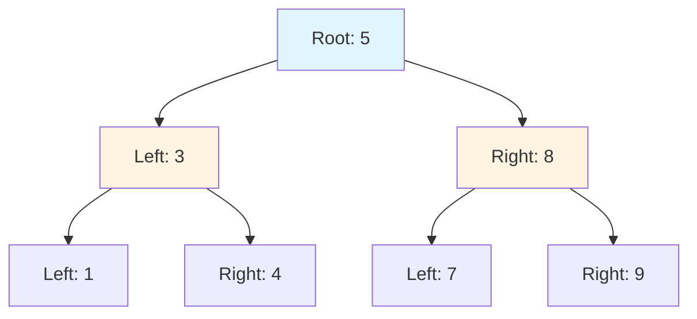
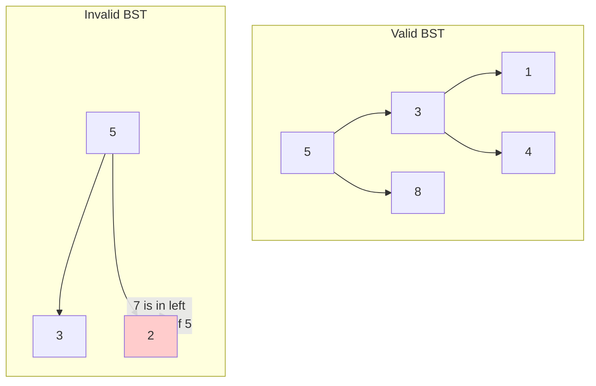
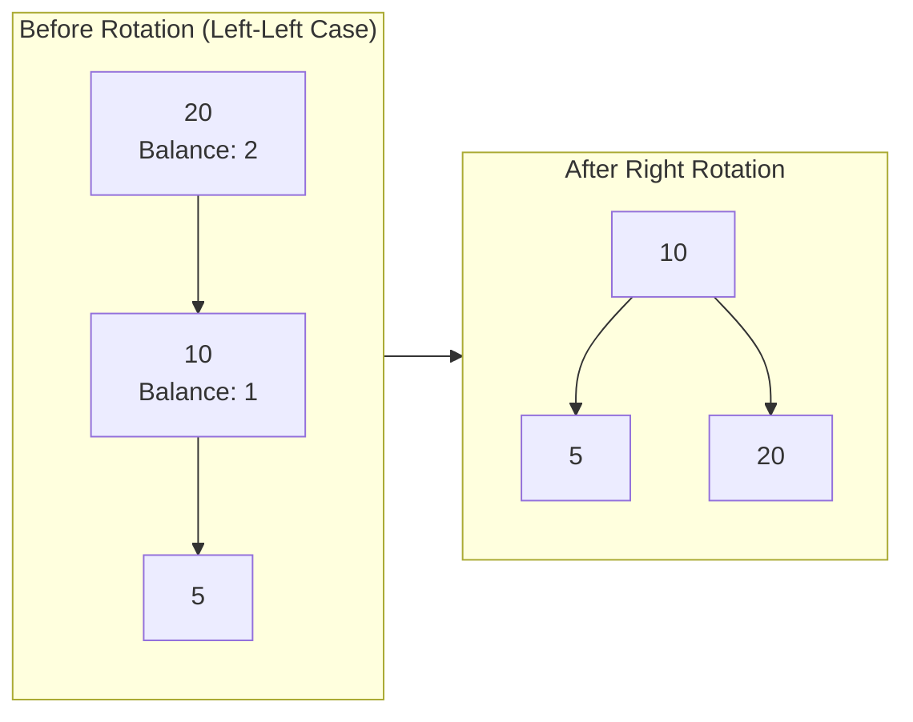
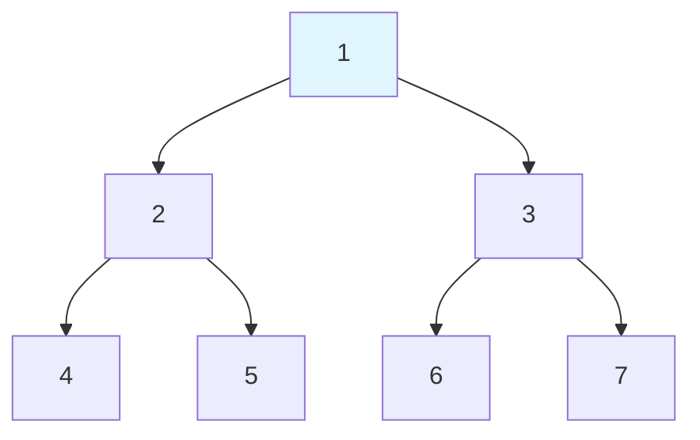
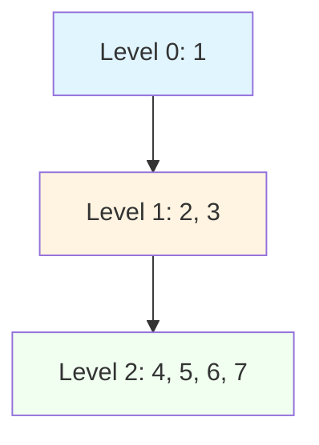

# Trees

## Why Trees Matter

Trees enable efficient hierarchical data organization with O(log n) operations:

- **Database indexes**: B+ Trees power MySQL/PostgreSQL indexes (1000x faster lookups)
- **File systems**: Directory structures are trees
- **DOM/JSON**: HTML/XML documents, JSON objects
- **Autocomplete**: Trie-based search suggestions
- **Routing**: IP routing tables use tree structures (tries, prefix trees)

**Real-world impact**: A balanced BST with 1 billion nodes requires only 30 comparisons (log₂1,000,000,000) to find any element—versus 500 million comparisons on average for linear search. This 10 millionx speedup is why every database index uses trees.

## Core Concepts

### Binary Tree Structure

```java
class TreeNode {
    int val;
    TreeNode left;
    TreeNode right;
    TreeNode(int val) { this.val = val; }
}
```



**Key terminology**:
- **Root**: Top node (no parent)
- **Leaf**: Node with no children
- **Internal node**: Node with at least one child
- **Height**: Longest path from node to leaf
- **Depth**: Distance from root

### Binary Tree vs Binary Search Tree

| Property | Binary Tree | Binary Search Tree (BST) |
|----------|-------------|--------------------------|
| **Ordering** | None | Left &lt; Root &lt; Right |
| **Search** | O(n) must check all | O(log n) use BST property |
| **Insert** | Anywhere | Maintain BST property |
| **Use case** | Heaps, expression trees | Dictionaries, sets |

**BST property**: For every node, all values in left subtree are smaller, all in right subtree are larger.



### Balanced Trees

#### AVL Tree

Self-balancing BST where **height difference** between subtrees is at most 1:

```java
class AVLNode {
    int val, height;
    AVLNode left, right;
    AVLNode(int val) {
        this.val = val;
        this.height = 1;
    }
}
```

**Rotations** to maintain balance:
- **Left rotation**: Right-heavy subtree
- **Right rotation**: Left-heavy subtree
- **Left-Right rotation**: Left child is right-heavy
- **Right-Left rotation**: Right child is left-heavy



#### Red-Black Tree

Balanced BST with **color properties**:
1. Every node is red or black
2. Root is black
3. Red nodes cannot have red children (no double red)
4. Every path from node to leaves has same number of black nodes

**Java's TreeMap uses Red-Black trees**:
- Guarantees O(log n) operations
- Fewer rotations than AVL (faster insert/delete)
- Slightly taller than AVL (still O(log n))

## Deep Dive

### Tree Traversals

#### Depth-First Traversals



**Preorder** (Root, Left, Right): `1, 2, 4, 5, 3, 6, 7`
- Use case: Copy tree, prefix expression evaluation

**Inorder** (Left, Root, Right): `4, 2, 5, 1, 6, 3, 7`
- Use case: BST yields sorted order

**Postorder** (Left, Right, Root): `4, 5, 2, 6, 7, 3, 1`
- Use case: Delete tree (delete children first), postfix evaluation

#### Recursive Implementation

```java
// Preorder traversal
public void preorder(TreeNode root) {
    if (root == null) return;

    System.out.print(root.val + " ");  // Visit root
    preorder(root.left);                // Traverse left
    preorder(root.right);               // Traverse right
}

// Inorder traversal
public void inorder(TreeNode root) {
    if (root == null) return;

    inorder(root.left);
    System.out.print(root.val + " ");
    inorder(root.right);
}

// Postorder traversal
public void postorder(TreeNode root) {
    if (root == null) return;

    postorder(root.left);
    postorder(root.right);
    System.out.print(root.val + " ");
}
```

#### Iterative Implementation

```java
// Preorder (iterative)
public List<Integer> preorderIterative(TreeNode root) {
    List<Integer> result = new ArrayList<>();
    if (root == null) return result;

    Deque<TreeNode> stack = new ArrayDeque<>();
    stack.push(root);

    while (!stack.isEmpty()) {
        TreeNode node = stack.pop();
        result.add(node.val);

        // Push right first (so left is processed first)
        if (node.right != null) stack.push(node.right);
        if (node.left != null) stack.push(node.left);
    }

    return result;
}

// Inorder (iterative)
public List<Integer> inorderIterative(TreeNode root) {
    List<Integer> result = new ArrayList<>();
    Deque<TreeNode> stack = new ArrayDeque<>();
    TreeNode current = root;

    while (current != null || !stack.isEmpty()) {
        // Reach leftmost node
        while (current != null) {
            stack.push(current);
            current = current.left;
        }

        current = stack.pop();
        result.add(current.val);
        current = current.right;
    }

    return result;
}
```

#### Breadth-First Traversal (Level Order)

```java
public List<List<Integer>> levelOrder(TreeNode root) {
    List<List<Integer>> result = new ArrayList<>();
    if (root == null) return result;

    Queue<TreeNode> queue = new LinkedList<>();
    queue.offer(root);

    while (!queue.isEmpty()) {
        int levelSize = queue.size();
        List<Integer> level = new ArrayList<>();

        for (int i = 0; i < levelSize; i++) {
            TreeNode node = queue.poll();
            level.add(node.val);

            if (node.left != null) queue.offer(node.left);
            if (node.right != null) queue.offer(node.right);
        }

        result.add(level);
    }

    return result;
}
```



### BST Operations

#### Search

```java
public TreeNode search(TreeNode root, int target) {
    while (root != null && root.val != target) {
        if (target < root.val) {
            root = root.left;
        } else {
            root = root.right;
        }
    }
    return root;  // Found or null
}
```

#### Insert

```java
public TreeNode insert(TreeNode root, int val) {
    if (root == null) return new TreeNode(val);

    if (val < root.val) {
        root.left = insert(root.left, val);
    } else if (val > root.val) {
        root.right = insert(root.right, val);
    }

    return root;
}
```

#### Delete

```java
public TreeNode delete(TreeNode root, int key) {
    if (root == null) return null;

    if (key < root.val) {
        root.left = delete(root.left, key);
    } else if (key > root.val) {
        root.right = delete(root.right, key);
    } else {
        // Found node to delete

        // Case 1: No children (leaf)
        if (root.left == null && root.right == null) {
            return null;
        }

        // Case 2: One child
        if (root.left == null) return root.right;
        if (root.right == null) return root.left;

        // Case 3: Two children
        // Find inorder successor (smallest in right subtree)
        TreeNode minNode = findMin(root.right);
        root.val = minNode.val;  // Copy value
        root.right = delete(root.right, minNode.val);  // Delete duplicate
    }

    return root;
}

private TreeNode findMin(TreeNode node) {
    while (node.left != null) {
        node = node.left;
    }
    return node;
}
```

### Common Pitfalls

#### ❌ Not checking null

```java
public int badSum(TreeNode root) {
    return root.val + badSum(root.left) + badSum(root.right);
    // NPE if root is null!
}
```

#### ✅ Always check null first

```java
public int goodSum(TreeNode root) {
    if (root == null) return 0;
    return root.val + goodSum(root.left) + goodSum(root.right);
}
```

#### ❌ Modifying tree during traversal

```java
public void badDelete(TreeNode root, int val) {
    if (root == null) return;
    if (root.val == val) {
        root = null;  // Only sets local reference to null!
    }
    badDelete(root.left, val);
    badDelete(root.right, val);
}
```

#### ✅ Return modified root

```java
public TreeNode goodDelete(TreeNode root, int val) {
    if (root == null) return null;
    if (root.val == val) return null;  // Return to parent
    root.left = goodDelete(root.left, val);
    root.right = goodDelete(root.right, val);
    return root;
}
```

#### ❌ Assuming BST property

```java
public boolean isBSTBad(TreeNode root) {
    if (root == null) return true;
    if (root.left != null && root.left.val >= root.val) return false;
    if (root.right != null && root.right.val <= root.val) return false;
    return isBSTBad(root.left) && isBSTBad(root.right);
    // BUG: Doesn't check subtree bounds!
}
```

#### ✅ Track valid range

```java
public boolean isValidBST(TreeNode root) {
    return validate(root, Long.MIN_VALUE, Long.MAX_VALUE);
}

private boolean validate(TreeNode node, long min, long max) {
    if (node == null) return true;

    if (node.val <= min || node.val >= max) return false;

    return validate(node.left, min, node.val) &&
           validate(node.right, node.val, max);
}
```

### Advanced Algorithms

#### Lowest Common Ancestor (LCA)

```java
public TreeNode lowestCommonAncestor(TreeNode root, TreeNode p, TreeNode q) {
    if (root == null || root == p || root == q) return root;

    TreeNode left = lowestCommonAncestor(root.left, p, q);
    TreeNode right = lowestCommonAncestor(root.right, p, q);

    if (left != null && right != null) return root;  // Split point
    return left != null ? left : right;  // One side found
}
```

#### Tree Serialization/Deserialization

```java
// Serialize to "1,2,null,null,3,4,null,null,5,null,null"
public String serialize(TreeNode root) {
    StringBuilder sb = new StringBuilder();
    serializeHelper(root, sb);
    return sb.toString();
}

private void serializeHelper(TreeNode node, StringBuilder sb) {
    if (node == null) {
        sb.append("null,");
        return;
    }

    sb.append(node.val).append(",");
    serializeHelper(node.left, sb);
    serializeHelper(node.right, sb);
}

// Deserialize from string
public TreeNode deserialize(String data) {
    Queue<String> nodes = new LinkedList<>(Arrays.asList(data.split(",")));
    return deserializeHelper(nodes);
}

private TreeNode deserializeHelper(Queue<String> nodes) {
    String val = nodes.poll();
    if (val.equals("null")) return null;

    TreeNode node = new TreeNode(Integer.parseInt(val));
    node.left = deserializeHelper(nodes);
    node.right = deserializeHelper(nodes);
    return node;
}
```

#### Maximum Depth

```java
public int maxDepth(TreeNode root) {
    if (root == null) return 0;
    return 1 + Math.max(maxDepth(root.left), maxDepth(root.right));
}

// Iterative (level-order)
public int maxDepthIterative(TreeNode root) {
    if (root == null) return 0;

    Queue<TreeNode> queue = new LinkedList<>();
    queue.offer(root);
    int depth = 0;

    while (!queue.isEmpty()) {
        int levelSize = queue.size();
        depth++;

        for (int i = 0; i < levelSize; i++) {
            TreeNode node = queue.poll();
            if (node.left != null) queue.offer(node.left);
            if (node.right != null) queue.offer(node.right);
        }
    }

    return depth;
}
```

## Practical Applications

### File System Tree

```java
class FileNode {
    String name;
    boolean isFile;
    List<FileNode> children;

    public int totalSize() {
        if (isFile) return getSizeOfFile();
        return children.stream()
            .mapToInt(FileNode::totalSize)
            .sum();
    }
}
```

### HTML DOM Tree

```java
class DomNode {
    String tagName;
    String id;
    String className;
    List<DomNode> children;

    public List<DomNode> querySelector(String selector) {
        List<DomNode> result = new ArrayList<>();
        search(this, selector, result);
        return result;
    }

    private void search(DomNode node, String selector, List<DomNode> result) {
        if (node == null) return;

        if (matches(node, selector)) {
            result.add(node);
        }

        for (DomNode child : node.children) {
            search(child, selector, result);
        }
    }
}
```

### Expression Tree

```java
class ExprNode {
    String value;
    ExprNode left, right;

    public int evaluate() {
        if (left == null && right == null) {
            return Integer.parseInt(value);  // Leaf node
        }

        int leftVal = left.evaluate();
        int rightVal = right.evaluate();

        switch (value) {
            case "+": return leftVal + rightVal;
            case "-": return leftVal - rightVal;
            case "*": return leftVal * rightVal;
            case "/": return leftVal / rightVal;
        }
        throw new IllegalArgumentException("Unknown operator");
    }
}
```

## Interview Questions

### Q1: Maximum Depth of Binary Tree (Easy)

**Problem**: Find maximum depth (number of nodes along longest path).

**Approach**: Recursive depth = 1 + max(left, right)

**Complexity**: O(n) time, O(h) space

```java
public int maxDepth(TreeNode root) {
    if (root == null) return 0;
    return 1 + Math.max(maxDepth(root.left), maxDepth(root.right));
}
```

### Q2: Invert Binary Tree (Easy)

**Problem**: Mirror the binary tree (swap left and right children).

**Approach**: Recursive swap

**Complexity**: O(n) time, O(h) space

```java
public TreeNode invertTree(TreeNode root) {
    if (root == null) return null;

    TreeNode temp = root.left;
    root.left = root.right;
    root.right = temp;

    invertTree(root.left);
    invertTree(root.right);

    return root;
}
```

### Q3: Same Tree (Easy)

**Problem**: Check if two trees are identical.

**Approach**: Recursive comparison

**Complexity**: O(n) time, O(h) space

```java
public boolean isSameTree(TreeNode p, TreeNode q) {
    if (p == null && q == null) return true;
    if (p == null || q == null) return false;

    return p.val == q.val &&
           isSameTree(p.left, q.left) &&
           isSameTree(p.right, q.right);
}
```

### Q4: Subtree of Another Tree (Easy)

**Problem**: Check if tree `subRoot` is subtree of `root`.

**Approach**: Check every node as potential subtree root

**Complexity**: O(m * n) time where m = size(subRoot), n = size(root)

```java
public boolean isSubtree(TreeNode root, TreeNode subRoot) {
    if (subRoot == null) return true;
    if (root == null) return false;

    if (isSameTree(root, subRoot)) return true;

    return isSubtree(root.left, subRoot) ||
           isSubtree(root.right, subRoot);
}
```

### Q5: Lowest Common Ancestor of BST (Medium)

**Problem**: Find LCA in BST (both nodes exist).

**Approach**: Use BST property to navigate

**Complexity**: O(h) time, O(1) space

```java
public TreeNode lowestCommonAncestor(TreeNode root, TreeNode p, TreeNode q) {
    TreeNode current = root;

    while (current != null) {
        if (p.val < current.val && q.val < current.val) {
            current = current.left;
        } else if (p.val > current.val && q.val > current.val) {
            current = current.right;
        } else {
            return current;  // Split point
        }
    }

    return null;
}
```

### Q6: Binary Tree Level Order Traversal (Medium)

**Problem**: Return level-by-level node values.

**Approach**: BFS with queue

**Complexity**: O(n) time, O(n) space

```java
public List<List<Integer>> levelOrder(TreeNode root) {
    List<List<Integer>> result = new ArrayList<>();
    if (root == null) return result;

    Queue<TreeNode> queue = new LinkedList<>();
    queue.offer(root);

    while (!queue.isEmpty()) {
        int levelSize = queue.size();
        List<Integer> level = new ArrayList<>();

        for (int i = 0; i < levelSize; i++) {
            TreeNode node = queue.poll();
            level.add(node.val);

            if (node.left != null) queue.offer(node.left);
            if (node.right != null) queue.offer(node.right);
        }

        result.add(level);
    }

    return result;
}
```

### Q7: Validate Binary Search Tree (Medium)

**Problem**: Check if tree is valid BST.

**Approach**: Track valid (min, max) range

**Complexity**: O(n) time, O(h) space

```java
public boolean isValidBST(TreeNode root) {
    return validate(root, Long.MIN_VALUE, Long.MAX_VALUE);
}

private boolean validate(TreeNode node, long min, long max) {
    if (node == null) return true;

    if (node.val <= min || node.val >= max) return false;

    return validate(node.left, min, node.val) &&
           validate(node.right, node.val, max);
}
```

## Further Reading

- **Heaps**: Specialized binary tree
- **Graphs**: Generalization of trees
- **Tries**: Tree-like structure for strings
- **LeetCode**: [Tree problems](https://leetcode.com/tag/tree/)
