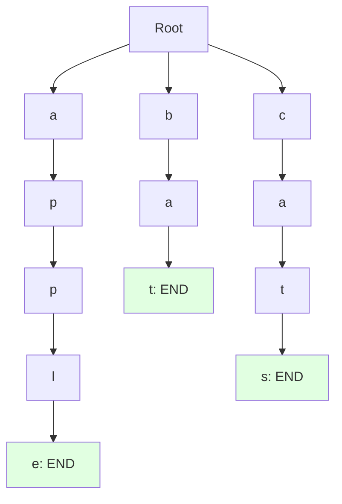
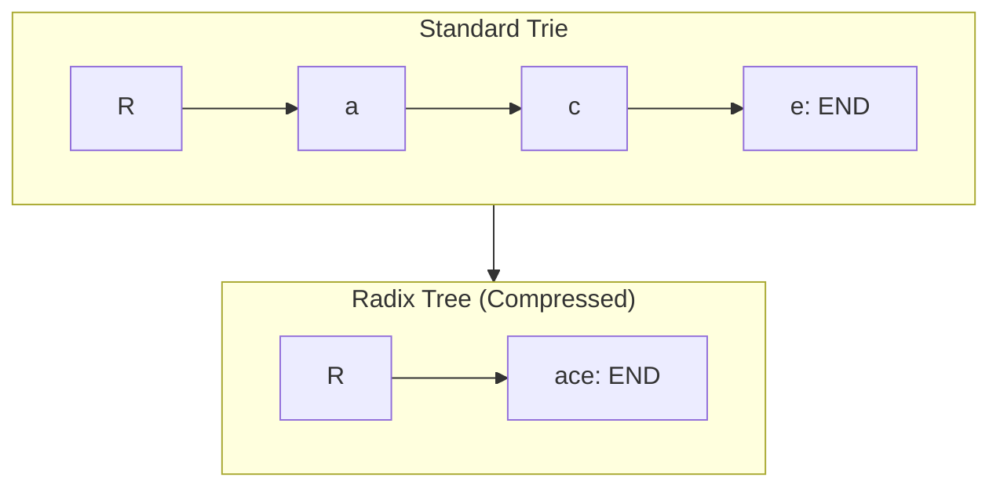

# Tries (Prefix Trees)

## Why Tries Matter

Tries (pronounced "try") provide efficient string-based operations that HashMaps cannot match:

- **Autocomplete systems**: Suggest completions as you type (Google search, IDEs)
- **Spell checking**: Find words with common prefixes efficiently
- **IP routing**: Longest prefix matching in network routers
- **Dictionary applications**: Word games (Scrabble, Boggle), contact search

**Real-world impact**:
- Searching for prefix "app" in 1 million words:
  - HashMap: O(n) scan all keys - ~1ms
  - Trie: O(prefix length) - ~0.001ms (1000x faster)
- Google processes 100,000+ searches per second using trie-based autocomplete

## Core Concepts

### Trie Structure

Each node contains:
- **Children**: Map of characters to child nodes
- **Is end**: Flag marking complete word



**Words**: apple, bat, cats

### Trie vs HashMap for Strings

| Operation | HashMap | Trie |
|-----------|---------|------|
| **Insert word** | O(1) avg | O(word length) |
| **Search exact** | O(1) avg | O(word length) |
| **Search prefix** | O(n) scan | O(prefix length) |
| **Space** | O(total characters) | O(total characters) × overhead |
| **Ordering** | Unsorted | Natural sorted order |

**When to use tries**:
- Need prefix-based searches
- Need sorted iteration
- Many words share common prefixes
- Memory not constrained

**When to use HashMap**:
- Only need exact match
- Faster lookup needed
- Less memory overhead

## Deep Dive

### Trie Implementation

```java
class TrieNode {
    Map<Character, TrieNode> children = new HashMap<>();
    boolean isEnd = false;
}

public class Trie {
    private final TrieNode root;

    public Trie() {
        this.root = new TrieNode();
    }

    // Insert word into trie
    public void insert(String word) {
        TrieNode node = root;

        for (char c : word.toCharArray()) {
            node.children.putIfAbsent(c, new TrieNode());
            node = node.children.get(c);
        }

        node.isEnd = true;
    }

    // Search for exact word
    public boolean search(String word) {
        TrieNode node = searchPrefix(word);
        return node != null && node.isEnd;
    }

    // Check if any word starts with prefix
    public boolean startsWith(String prefix) {
        return searchPrefix(prefix) != null;
    }

    private TrieNode searchPrefix(String prefix) {
        TrieNode node = root;

        for (char c : prefix.toCharArray()) {
            if (!node.children.containsKey(c)) {
                return null;
            }
            node = node.children.get(c);
        }

        return node;
    }
}
```

### Common Operations

#### Count Words with Prefix

```java
public int countWordsWithPrefix(String prefix) {
    TrieNode node = searchPrefix(prefix);
    if (node == null) return 0;

    return countWordsFromNode(node);
}

private int countWordsFromNode(TrieNode node) {
    int count = node.isEnd ? 1 : 0;

    for (TrieNode child : node.children.values()) {
        count += countWordsFromNode(child);
    }

    return count;
}
```

#### Delete Word

```java
public boolean delete(String word) {
    return delete(root, word, 0);
}

private boolean delete(TrieNode node, String word, int index) {
    if (index == word.length()) {
        if (!node.isEnd) return false;
        node.isEnd = false;
        return node.children.isEmpty();
    }

    char c = word.charAt(index);
    TrieNode child = node.children.get(c);

    if (child == null) return false;

    boolean shouldDeleteChild = delete(child, word, index + 1);

    if (shouldDeleteChild) {
        node.children.remove(c);
        return node.children.isEmpty() && !node.isEnd;
    }

    return false;
}
```

#### Longest Common Prefix

```java
public String longestCommonPrefix() {
    TrieNode node = root;
    StringBuilder prefix = new StringBuilder();

    while (node.children.size() == 1 && !node.isEnd) {
        Map.Entry<Character, TrieNode> entry =
            node.children.entrySet().iterator().next();
        prefix.append(entry.getKey());
        node = entry.getValue();
    }

    return prefix.toString();
}
```

### Common Pitfalls

#### ❌ Not using prefix map for children

```java
class BadTrieNode {
    TrieNode[] children = new TrieNode[26];  // Only lowercase English
    // Wastes space for sparse tries
    // Doesn't handle Unicode
}
```

#### ✅ Use HashMap for flexibility

```java
class GoodTrieNode {
    Map<Character, TrieNode> children = new HashMap<>();
    // Handles any character, space-efficient
}
```

#### ❌ Not pruning unused nodes

```java
node.isEnd = false;  // Word removed but nodes remain
// Memory leak for long words
```

#### ✅ Delete unused nodes

```java
// Recursively delete nodes if no other words use them
if (node.children.isEmpty() && !node.isEnd) {
    return null;  // Signal parent to delete this node
}
```

#### ❌ Case sensitivity inconsistency

```java
trie.insert("Apple");
trie.search("apple");  // Returns false!
```

#### ✅ Normalize case

```java
public void insert(String word) {
    word = word.toLowerCase();  // Normalize
    // ... insert
}
```

### Advanced: Compressed Trie (Radix Tree)

Compress chains of single-child nodes:



**Benefits**:
- Fewer nodes (memory savings)
- Faster traversal for long words
- Better for dictionaries with long common prefixes

## Practical Applications

### Autocomplete System

```java
public class AutocompleteSystem {
    private final Trie trie;

    public AutocompleteSystem(List<String> words) {
        this.trie = new Trie();
        for (String word : words) {
            trie.insert(word);
        }
    }

    public List<String> getSuggestions(String prefix) {
        TrieNode node = trie.searchPrefix(prefix);
        if (node == null) return Collections.emptyList();

        List<String> suggestions = new ArrayList<>();
        collectWords(node, prefix, suggestions);

        return suggestions.stream()
            .sorted()
            .limit(10)  // Top 10 suggestions
            .collect(Collectors.toList());
    }

    private void collectWords(TrieNode node, String current,
                             List<String> results) {
        if (node.isEnd) {
            results.add(current);
        }

        for (Map.Entry<Character, TrieNode> entry :
             node.children.entrySet()) {
            collectWords(entry.getValue(), current + entry.getKey(), results);
        }
    }
}
```

### Spell Checker

```java
public class SpellChecker {
    private final Trie dictionary;

    public SpellChecker(Set<String> words) {
        this.dictionary = new Trie();
        for (String word : words) {
            dictionary.insert(word);
        }
    }

    public boolean isCorrect(String word) {
        return dictionary.search(word);
    }

    // Find similar words (1 edit distance)
    public List<String> getSuggestions(String word) {
        List<String> suggestions = new ArrayList<>();

        // Try all possible single-character edits
        for (int i = 0; i < word.length(); i++) {
            // Insertion
            for (char c = 'a'; c <= 'z'; c++) {
                String edited = word.substring(0, i) + c + word.substring(i);
                if (dictionary.search(edited)) {
                    suggestions.add(edited);
                }
            }
        }

        // Deletion
        for (int i = 0; i < word.length(); i++) {
            String edited = word.substring(0, i) + word.substring(i + 1);
            if (dictionary.search(edited)) {
                suggestions.add(edited);
            }
        }

        // Replacement
        for (int i = 0; i < word.length(); i++) {
            for (char c = 'a'; c <= 'z'; c++) {
                String edited = word.substring(0, i) + c + word.substring(i + 1);
                if (dictionary.search(edited)) {
                    suggestions.add(edited);
                }
            }
        }

        return suggestions.stream()
            .distinct()
            .limit(5)
            .collect(Collectors.toList());
    }
}
```

### Word Search II

Find all words from dictionary in 2D board:

```java
public List<String> findWords(char[][] board, String[] words) {
    // Build trie from dictionary
    Trie trie = new Trie();
    for (String word : words) {
        trie.insert(word);
    }

    Set<String> result = new HashSet<>();
    int m = board.length, n = board[0].length;

    for (int i = 0; i < m; i++) {
        for (int j = 0; j < n; j++) {
            dfs(board, i, j, trie.root, "", result);
        }
    }

    return new ArrayList<>(result);
}

private void dfs(char[][] board, int i, int j, TrieNode node,
                 String word, Set<String> result) {
    if (i < 0 || i >= board.length || j < 0 || j >= board[0].length) {
        return;
    }

    char c = board[i][j];
    if (c == '#' || !node.children.containsKey(c)) {
        return;
    }

    node = node.children.get(c);
    word += c;

    if (node.isEnd) {
        result.add(word);
    }

    board[i][j] = '#';  // Mark visited

    dfs(board, i + 1, j, node, word, result);
    dfs(board, i - 1, j, node, word, result);
    dfs(board, i, j + 1, node, word, result);
    dfs(board, i, j - 1, node, word, result);

    board[i][j] = c;  // Restore
}
```

## Interview Questions

### Q1: Implement Trie (Medium)

**Problem**: Implement trie with insert, search, startsWith.

**Approach**: Standard trie with HashMap children

**Complexity**: O(L) per operation, O(N × L) space (N words, L avg length)

```java
class TrieNode {
    Map<Character, TrieNode> children = new HashMap<>();
    boolean isEnd = false;
}

class Trie {
    private final TrieNode root;

    public Trie() {
        root = new TrieNode();
    }

    public void insert(String word) {
        TrieNode node = root;
        for (char c : word.toCharArray()) {
            node.children.putIfAbsent(c, new TrieNode());
            node = node.children.get(c);
        }
        node.isEnd = true;
    }

    public boolean search(String word) {
        TrieNode node = searchNode(word);
        return node != null && node.isEnd;
    }

    public boolean startsWith(String prefix) {
        return searchNode(prefix) != null;
    }

    private TrieNode searchNode(String str) {
        TrieNode node = root;
        for (char c : str.toCharArray()) {
            if (!node.children.containsKey(c)) return null;
            node = node.children.get(c);
        }
        return node;
    }
}
```

### Q2: Design Add and Search Words (Medium)

**Problem**: Implement addWord and search with '.' wildcard.

**Approach**: Trie with recursive search

**Complexity**: O(L) add, O(N × 26^L) search with wildcards

```java
class WordDictionary {
    private TrieNode root;

    public WordDictionary() {
        root = new TrieNode();
    }

    public void addWord(String word) {
        TrieNode node = root;
        for (char c : word.toCharArray()) {
            node.children.putIfAbsent(c, new TrieNode());
            node = node.children.get(c);
        }
        node.isEnd = true;
    }

    public boolean search(String word) {
        return search(root, word, 0);
    }

    private boolean search(TrieNode node, String word, int index) {
        if (index == word.length()) {
            return node.isEnd;
        }

        char c = word.charAt(index);

        if (c == '.') {
            for (TrieNode child : node.children.values()) {
                if (search(child, word, index + 1)) {
                    return true;
                }
            }
            return false;
        } else {
            if (!node.children.containsKey(c)) return false;
            return search(node.children.get(c), word, index + 1);
        }
    }
}
```

### Q3: Word Search II (Hard)

**Problem**: Find all dictionary words in 2D board.

**Approach**: Build trie, DFS with pruning

**Complexity**: O(M × N × 4 × 3^L) time, O(N × L) space

```java
public List<String> findWords(char[][] board, String[] words) {
    Trie trie = new Trie();
    for (String word : words) {
        trie.insert(word);
    }

    Set<String> result = new HashSet<>();
    int m = board.length, n = board[0].length;

    for (int i = 0; i < m; i++) {
        for (int j = 0; j < n; j++) {
            dfs(board, i, j, trie.root, new StringBuilder(), result);
        }
    }

    return new ArrayList<>(result);
}

private void dfs(char[][] board, int i, int j, TrieNode node,
                 StringBuilder word, Set<String> result) {
    if (i < 0 || i >= board.length || j < 0 || j >= board[0].length) {
        return;
    }

    char c = board[i][j];
    if (c == '#' || !node.children.containsKey(c)) {
        return;
    }

    node = node.children.get(c);
    word.append(c);

    if (node.isEnd) {
        result.add(word.toString());
    }

    board[i][j] = '#';

    dfs(board, i + 1, j, node, word, result);
    dfs(board, i - 1, j, node, word, result);
    dfs(board, i, j + 1, node, word, result);
    dfs(board, i, j - 1, node, word, result);

    board[i][j] = c;
    word.setLength(word.length() - 1);
}
```

## Further Reading

- **Hash Maps**: Alternative for exact string matching
- **Trees**: Similar hierarchical structure
- **Graphs**: Tries are tree-like DAGs
- **LeetCode**: [Trie problems](https://leetcode.com/tag/trie/)
