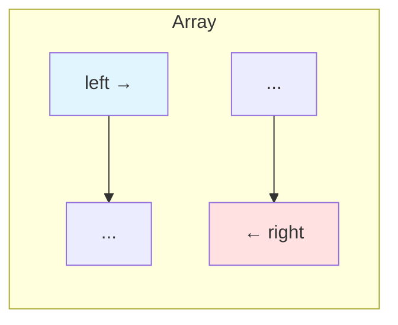
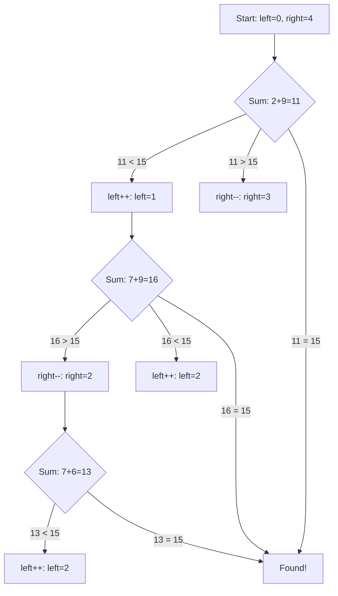
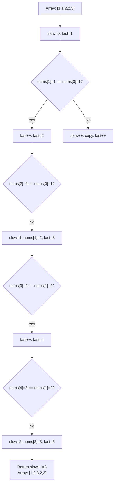

# Two Pointers Pattern

## Why Two Pointers Matter

Two pointers technique solves problems with O(n) time and O(1) space—eliminating nested loops:

- **Array/string problems**: Find pairs, reverse, partition
- **Linked lists**: Detect cycles, find middle
- **Sliding window**: Often implemented with two pointers
- **Palindrome detection**: Front and back pointers

**Real-world impact**: Finding all pairs with a given sum in an array:
- Brute force: O(n²) with two nested loops
- Two pointers: O(n) after sorting—**1000x faster for 10,000 elements**

## Core Concepts

### Two Pointer Patterns

#### 1. Opposite Direction Pointers

Start at both ends, move towards each other:

```java
int left = 0, right = arr.length - 1;

while (left < right) {
    // Process arr[left] and arr[right]
    left++;
    right--;
}
```



**Use cases**:
- Two sum (sorted array)
- Palindrome checking
- Container with most water
- Reverse array/string

#### 2. Same Direction Pointers (Fast/Slow)

Both start at beginning, fast moves ahead:

```java
int slow = 0, fast = 0;

while (fast < arr.length) {
    // Process
    fast++;
    if (condition) slow++;
}
```

**Use cases**:
- Remove duplicates
- Remove element
- Cycle detection in linked lists
- Find middle element

#### 3. Fixed Pointers

Maintain fixed distance between pointers:

```java
int left = 0, right = k;  // k is window size or fixed distance

while (right < arr.length) {
    // Compare arr[left] and arr[right]
    left++;
    right++;
}
```

**Use cases**:
- Find subarrays with property
- Fixed-size sliding window
- Compare elements k distance apart

## Deep Dive

### Two Sum II - Sorted Array

Given sorted array, find two numbers that sum to target:

```java
public int[] twoSum(int[] numbers, int target) {
    int left = 0, right = numbers.length - 1;

    while (left < right) {
        int sum = numbers[left] + numbers[right];

        if (sum == target) {
            return new int[]{left + 1, right + 1};  // 1-indexed
        } else if (sum < target) {
            left++;  // Need larger sum
        } else {
            right--;  // Need smaller sum
        }
    }

    return new int[]{-1, -1};  // Not found
}
```



**Why it works**: Array is sorted, so:
- If sum < target: need larger elements → move left pointer right
- If sum > target: need smaller elements → move right pointer left

### Valid Palindrome

Check if string is palindrome (ignoring non-alphanumeric):

```java
public boolean isPalindrome(String s) {
    int left = 0, right = s.length() - 1;

    while (left < right) {
        // Skip non-alphanumeric
        while (left < right && !Character.isLetterOrDigit(s.charAt(left))) {
            left++;
        }
        while (left < right && !Character.isLetterOrDigit(s.charAt(right))) {
            right--;
        }

        // Compare characters
        char c1 = Character.toLowerCase(s.charAt(left));
        char c2 = Character.toLowerCase(s.charAt(right));

        if (c1 != c2) return false;

        left++;
        right--;
    }

    return true;
}
```

### Container With Most Water

Find max area formed by two vertical lines:

```java
public int maxArea(int[] height) {
    int left = 0, right = height.length - 1;
    int maxArea = 0;

    while (left < right) {
        int width = right - left;
        int containerHeight = Math.min(height[left], height[right]);
        int area = width * containerHeight;

        maxArea = Math.max(maxArea, area);

        // Move shorter line inward
        if (height[left] < height[right]) {
            left++;
        } else {
            right--;
        }
    }

    return maxArea;
}
```

**Key insight**: Moving the longer line inward cannot increase area (height limited by shorter line, width decreases). Always move shorter line.

### Fast/Slow Pointer

#### Remove Duplicates from Sorted Array

```java
public int removeDuplicates(int[] nums) {
    if (nums.length == 0) return 0;

    int slow = 0;  // Position to place next unique element

    for (int fast = 1; fast < nums.length; fast++) {
        if (nums[fast] != nums[slow]) {
            slow++;
            nums[slow] = nums[fast];
        }
    }

    return slow + 1;  // Length of unique portion
}
```



### Common Pitfalls

#### ❌ Not handling edge cases

```java
public boolean badPalindrome(String s) {
    int left = 0, right = s.length() - 1;

    while (left < right) {  // NPE if s is empty
        if (s.charAt(left) != s.charAt(right)) {
            return false;
        }
        left++;
        right--;
    }
    return true;
}
```

#### ✅ Handle empty input

```java
public boolean goodPalindrome(String s) {
    if (s == null || s.isEmpty()) return true;

    int left = 0, right = s.length() - 1;

    while (left < right) {
        if (s.charAt(left) != s.charAt(right)) {
            return false;
        }
        left++;
        right--;
    }
    return true;
}
```

#### ❌ Infinite loop with wrong pointer update

```java
while (left < right) {
    int sum = nums[left] + nums[right];
    if (sum == target) return true;
    if (sum < target) left = left;  // BUG: Not moving!
    else right = right;  // BUG: Not moving!
}
```

#### ✅ Always update pointers

```java
while (left < right) {
    int sum = nums[left] + nums[right];
    if (sum == target) return true;
    if (sum < target) left++;  // Move left forward
    else right--;  // Move right backward
}
```

#### ❌ Overflow with product

```java
int area = height[left] * height[right] * (right - left);
// Can overflow for large values!
```

#### ✅ Use long or min

```java
int width = right - left;
int containerHeight = Math.min(height[left], height[right]);
int area = width * containerHeight;  // Less likely to overflow
// Or use long for safety
```

### Advanced Patterns

#### Three Sum

Find all unique triplets summing to zero:

```java
public List<List<Integer>> threeSum(int[] nums) {
    List<List<Integer>> result = new ArrayList<>();
    Arrays.sort(nums);

    for (int i = 0; i < nums.length - 2; i++) {
        // Skip duplicates
        if (i > 0 && nums[i] == nums[i - 1]) continue;

        int left = i + 1, right = nums.length - 1;

        while (left < right) {
            int sum = nums[i] + nums[left] + nums[right];

            if (sum == 0) {
                result.add(Arrays.asList(nums[i], nums[left], nums[right]));

                // Skip duplicates
                while (left < right && nums[left] == nums[left + 1]) left++;
                while (left < right && nums[right] == nums[right - 1]) right--;

                left++;
                right--;
            } else if (sum < 0) {
                left++;
            } else {
                right--;
            }
        }
    }

    return result;
}
```

#### Partition Array (Dutch National Flag)

```java
public void sortColors(int[] nums) {
    int low = 0, mid = 0, high = nums.length - 1;

    while (mid <= high) {
        if (nums[mid] == 0) {
            swap(nums, low++, mid++);
        } else if (nums[mid] == 1) {
            mid++;
        } else {  // nums[mid] == 2
            swap(nums, mid, high--);
        }
    }
}

private void swap(int[] nums, int i, int j) {
    int temp = nums[i];
    nums[i] = nums[j];
    nums[j] = temp;
}
```

**Three pointers**:
- `low`: Boundary for 0s (elements before low are 0)
- `mid`: Current element
- `high`: Boundary for 2s (elements after high are 2)

## Practical Applications

### Merge Two Sorted Arrays

```java
public void merge(int[] nums1, int m, int[] nums2, int n) {
    int p1 = m - 1;  // Pointer for nums1
    int p2 = n - 1;  // Pointer for nums2
    int p = m + n - 1;  // Pointer for merged array

    while (p1 >= 0 && p2 >= 0) {
        if (nums1[p1] > nums2[p2]) {
            nums1[p--] = nums1[p1--];
        } else {
            nums1[p--] = nums2[p2--];
        }
    }

    // Copy remaining elements from nums2
    while (p2 >= 0) {
        nums1[p--] = nums2[p2--];
    }
}
```

**Merge from end** to avoid overwriting nums1 elements

### Move Zeroes

```java
public void moveZeroes(int[] nums) {
    int slow = 0;  // Position for next non-zero

    for (int fast = 0; fast < nums.length; fast++) {
        if (nums[fast] != 0) {
            nums[slow] = nums[fast];
            if (slow != fast) {
                nums[fast] = 0;
            }
            slow++;
        }
    }
}
```

### Squares of Sorted Array

```java
public int[] sortedSquares(int[] nums) {
    int n = nums.length;
    int[] result = new int[n];
    int left = 0, right = n - 1;
    int pos = n - 1;  // Fill from end

    while (left <= right) {
        int leftSquare = nums[left] * nums[left];
        int rightSquare = nums[right] * nums[right];

        if (leftSquare > rightSquare) {
            result[pos--] = leftSquare;
            left++;
        } else {
            result[pos--] = rightSquare;
            right--;
        }
    }

    return result;
}
```

**Largest square** comes from either most negative or most positive number

## Interview Questions

### Q1: Two Sum II - Input Array Is Sorted (Easy)

**Problem**: Find two numbers summing to target in sorted array.

**Approach**: Opposite direction pointers

**Complexity**: O(n) time, O(1) space

```java
public int[] twoSum(int[] numbers, int target) {
    int left = 0, right = numbers.length - 1;

    while (left < right) {
        int sum = numbers[left] + numbers[right];

        if (sum == target) {
            return new int[]{left + 1, right + 1};
        } else if (sum < target) {
            left++;
        } else {
            right--;
        }
    }

    return new int[]{-1, -1};
}
```

### Q2: Valid Palindrome (Easy)

**Problem**: Check if string is palindrome (ignoring case and non-alphanumeric).

**Approach**: Two pointers from ends

**Complexity**: O(n) time, O(1) space

```java
public boolean isPalindrome(String s) {
    int left = 0, right = s.length() - 1;

    while (left < right) {
        while (left < right && !Character.isLetterOrDigit(s.charAt(left))) {
            left++;
        }
        while (left < right && !Character.isLetterOrDigit(s.charAt(right))) {
            right--;
        }

        if (Character.toLowerCase(s.charAt(left)) !=
            Character.toLowerCase(s.charAt(right))) {
            return false;
        }

        left++;
        right--;
    }

    return true;
}
```

### Q3: Remove Element (Easy)

**Problem**: Remove all instances of value in-place.

**Approach**: Slow/fast pointers

**Complexity**: O(n) time, O(1) space

```java
public int removeElement(int[] nums, int val) {
    int slow = 0;

    for (int fast = 0; fast < nums.length; fast++) {
        if (nums[fast] != val) {
            nums[slow] = nums[fast];
            slow++;
        }
    }

    return slow;
}
```

### Q4: Max Number of K-Sum Pairs (Medium)

**Problem**: Find max number of pairs summing to k.

**Approach**: Sort + two pointers

**Complexity**: O(n log n) time, O(1) space

```java
public int maxOperations(int[] nums, int k) {
    Arrays.sort(nums);
    int left = 0, right = nums.length - 1;
    int operations = 0;

    while (left < right) {
        int sum = nums[left] + nums[right];

        if (sum == k) {
            operations++;
            left++;
            right--;
        } else if (sum < k) {
            left++;
        } else {
            right--;
        }
    }

    return operations;
}
```

### Q5: 3Sum (Medium)

**Problem**: Find all unique triplets summing to zero.

**Approach**: Sort + two pointers for each element

**Complexity**: O(n²) time, O(1) space (excluding output)

```java
public List<List<Integer>> threeSum(int[] nums) {
    List<List<Integer>> result = new ArrayList<>();
    Arrays.sort(nums);

    for (int i = 0; i < nums.length - 2; i++) {
        if (i > 0 && nums[i] == nums[i - 1]) continue;

        int left = i + 1, right = nums.length - 1;

        while (left < right) {
            int sum = nums[i] + nums[left] + nums[right];

            if (sum == 0) {
                result.add(Arrays.asList(nums[i], nums[left], nums[right]));

                while (left < right && nums[left] == nums[left + 1]) left++;
                while (left < right && nums[right] == nums[right - 1]) right--;

                left++;
                right--;
            } else if (sum < 0) {
                left++;
            } else {
                right--;
            }
        }
    }

    return result;
}
```

### Q6: Container With Most Water (Medium)

**Problem**: Find max area container.

**Approach**: Opposite pointers, move shorter line

**Complexity**: O(n) time, O(1) space

```java
public int maxArea(int[] height) {
    int left = 0, right = height.length - 1;
    int maxArea = 0;

    while (left < right) {
        int width = right - left;
        int containerHeight = Math.min(height[left], height[right]);
        maxArea = Math.max(maxArea, width * containerHeight);

        if (height[left] < height[right]) {
            left++;
        } else {
            right--;
        }
    }

    return maxArea;
}
```

### Q7: Trapping Rain Water (Hard)

**Problem**: Calculate trapped water between bars.

**Approach**: Two pointers tracking max heights

**Complexity**: O(n) time, O(1) space

```java
public int trap(int[] height) {
    int left = 0, right = height.length - 1;
    int leftMax = 0, rightMax = 0;
    int water = 0;

    while (left < right) {
        if (height[left] < height[right]) {
            if (height[left] >= leftMax) {
                leftMax = height[left];
            } else {
                water += leftMax - height[left];
            }
            left++;
        } else {
            if (height[right] >= rightMax) {
                rightMax = height[right];
            } else {
                water += rightMax - height[right];
            }
            right--;
        }
    }

    return water;
}
```

## Further Reading

- **Sliding Window**: Often implemented with two pointers
- **Binary Search**: Another divide-and-conquer technique
- **Linked Lists**: Fast/slow pointer for cycle detection
- **LeetCode**: [Two Pointer problems](https://leetcode.com/tag/two-pointers/)
