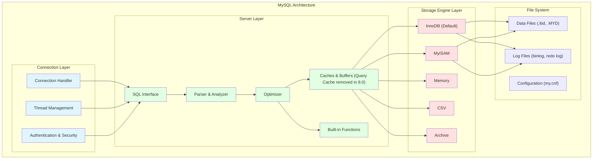
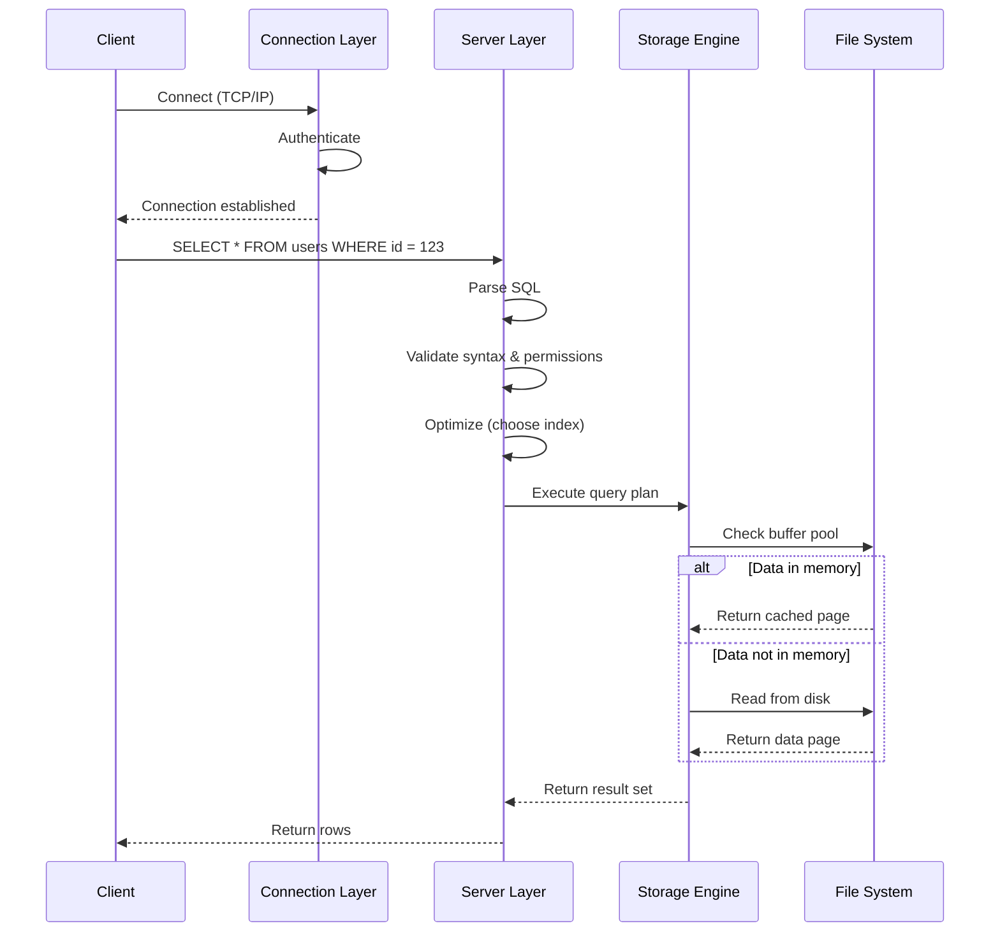
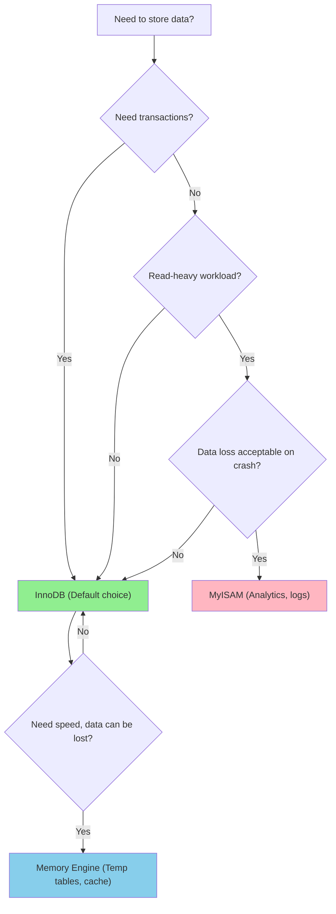

# Architecture & Storage Engines

## Why Architecture Matters

Understanding MySQL's architecture helps you:

- **Diagnose performance issues**: Know which layer is causing the bottleneck
- **Choose the right storage engine**: InnoDB for transactions, MyISAM for analytics
- **Optimize queries**: Understand how queries flow through the system
- **Configure MySQL effectively**: Tune buffers and caches appropriately

**Real-world impact**:
- A poorly chosen storage engine can lead to table-level locks blocking all writes
- Misconfigured buffers can cause excessive disk I/O
- Not understanding the query cache (removed in 8.0) leads to wasted memory

## MySQL Architecture Overview

MySQL has a **layered architecture** with three main layers:



### Layer 1: Connection Layer

**Responsibilities**:
- **Connection handling**: Accept client connections (TCP/IP, socket)
- **Thread management**: One thread per connection (thread pooling in MySQL 8.0)
- **Authentication**: Verify user credentials, permissions
- **Security**: SSL/TLS encryption, password validation

**Configuration**:
```ini
max_connections = 151              # Maximum concurrent connections
thread_cache_size = 10             # Cache threads for reuse
connect_timeout = 10               # Connection timeout in seconds
```

**Key point**: Each connection uses a thread, consuming memory (~256KB per thread). Too many connections can cause OOM.

### Layer 2: Server Layer

**Responsibilities**:

#### 1. SQL Interface
- Accepts SQL queries from clients
- Returns result sets to clients

#### 2. Parser & Analyzer


**Example**:
```sql
SELECT name, age FROM users WHERE id = 123;
```

**Parser steps**:
1. **Tokenizer**: `SELECT`, `name`, `,`, `age`, `FROM`, `users`, `WHERE`, `id`, `=`, `123`
2. **Parser**: Build abstract syntax tree (AST)
3. **Preprocessor**: Check table/column existence, permissions
4. **Optimizer**: Choose index vs full table scan

#### 3. Optimizer
- **Query optimization**: Choose the best execution plan
- **Index selection**: Decide which index to use
- **Join order**: Determine optimal join sequence
- **Cost-based**: Estimates cost of different plans

**Example**:
```sql
-- Optimizer chooses:
-- - Index scan if selective (id = 123)
-- - Full table scan if not selective (status = 'pending' with 90% rows)
EXPLAIN SELECT * FROM users WHERE id = 123;
```

#### 4. Caches & Buffers

**Query Cache** (removed in MySQL 8.0):
- Cached result sets of SELECT queries
- Invalidated on any table modification
- **Why removed?**:
  - High contention in write-heavy workloads
  - Complexity and bugs
  - Limited benefit in most applications

**Buffer Pool** (InnoDB-specific):
- Caches data pages and index pages
- Reduces disk I/O
- **Configuration**:
  ```ini
  innodb_buffer_pool_size = 2G      # 70-80% of RAM on dedicated DB server
  innodb_buffer_pool_instances = 8  # Reduce contention
  ```

#### 5. Built-in Functions
- Mathematical functions (`ABS`, `ROUND`)
- String functions (`CONCAT`, `SUBSTRING`)
- Date/time functions (`NOW`, `DATE_FORMAT`)
- Aggregate functions (`COUNT`, `SUM`, `AVG`)

### Layer 3: Storage Engine Layer

**Key feature**: **Pluggable storage engines**

MySQL's storage engine architecture allows you to choose the best engine for your workload:

- **InnoDB**: Default since MySQL 5.5, ACID-compliant
- **MyISAM**: Read-optimized, no transactions
- **Memory**: In-memory tables, fast but volatile
- **CSV**: CSV file storage
- **Archive**: Compressed storage for historical data

**Specify engine**:
```sql
CREATE TABLE users (
    id INT PRIMARY KEY,
    name VARCHAR(100)
) ENGINE=InnoDB;  -- or MyISAM, Memory, etc.
```

## Query Execution Flow



**Step-by-step**:
1. **Connect**: Client establishes TCP connection
2. **Authenticate**: Server verifies credentials
3. **Send query**: Client sends SQL statement
4. **Parse**: Server checks syntax, builds AST
5. **Optimize**: Server chooses execution plan
6. **Execute**: Storage engine retrieves data
7. **Return**: Server sends result set to client

## Storage Engine Comparison

### InnoDB vs MyISAM

| Feature | InnoDB | MyISAM |
|---------|--------|--------|
| **Transactions** | ✅ ACID compliant | ❌ No transactions |
| **Locking Granularity** | Row-level locks | Table-level locks |
| **Foreign Keys** | ✅ Supported | ❌ Not supported |
| **Crash Recovery** | ✅ Redo log recovery | ❌ Corrupt on crash |
| **Full-text Search** | ✅ (MySQL 5.6+) | ✅ |
| **Concurrency** | High (row locks) | Low (table locks) |
| **Space Requirements** | Higher (undo/redo logs) | Lower |
| **Count Performance** | Slower (scans rows) | Faster (cached counter) |
| **Use Case** | OLTP, high concurrency | Read-heavy, analytics |

### When to Use InnoDB

**Default choice for most applications**:
- E-commerce (orders, payments, inventory)
- Banking (transactions, accounts)
- Social media (posts, comments, likes)
- Any application requiring ACID properties

**Example**:
```sql
CREATE TABLE orders (
    id INT PRIMARY KEY AUTO_INCREMENT,
    user_id INT NOT NULL,
    total DECIMAL(10, 2) NOT NULL,
    status ENUM('pending', 'paid', 'shipped') DEFAULT 'pending',
    created_at TIMESTAMP DEFAULT CURRENT_TIMESTAMP,
    FOREIGN KEY (user_id) REFERENCES users(id)
) ENGINE=InnoDB;

BEGIN;
UPDATE inventory SET quantity = quantity - 1 WHERE product_id = 123;
INSERT INTO orders (user_id, total) VALUES (456, 99.99);
COMMIT;  -- Both succeed or both fail
```

### When to Use MyISAM

**Rare cases where read performance is critical**:
- Data warehousing (read-heavy analytics)
- Full-text search (before MySQL 5.6)
- Batch inserts (no concurrent writes)
- Temporary tables

**Example**:
```sql
CREATE TABLE access_logs (
    id BIGINT PRIMARY KEY AUTO_INCREMENT,
    ip VARCHAR(45) NOT NULL,
    path VARCHAR(255) NOT NULL,
    timestamp TIMESTAMP DEFAULT CURRENT_TIMESTAMP,
    FULLTEXT (path)
) ENGINE=MyISAM;

-- Fast bulk insert
LOAD DATA INFILE '/var/log/access.log' INTO TABLE access_logs;
```

**Why avoid MyISAM?**:
- Table-level locks block all writes during reads
- No crash recovery (corruption on crash)
- No transactions (data inconsistency risk)
- No foreign keys (manual integrity enforcement)

### Other Storage Engines

#### Memory Engine
- **Storage**: In-memory (RAM)
- **Speed**: Fastest (no disk I/O)
- **Volatility**: Data lost on restart
- **Use case**: Temporary tables, cache, session storage

```sql
CREATE TEMPORARY TABLE temp_sessions (
    session_id VARCHAR(128) PRIMARY KEY,
    user_id INT NOT NULL,
    expires_at DATETIME NOT NULL
) ENGINE=Memory;
```

#### CSV Engine
- **Storage**: CSV files
- **Use case**: Data interchange, external tools
- **Limitations**: No indexes, slow queries

```sql
CREATE TABLE products_csv (
    id INT NOT NULL,
    name VARCHAR(100) NOT NULL,
    price DECIMAL(10, 2)
) ENGINE=CSV;
```

#### Archive Engine
- **Storage**: Compressed (zlib)
- **Use case**: Historical data, log archiving
- **Limitations**: No indexes, only INSERT and SELECT

```sql
CREATE TABLE old_orders (
    id INT PRIMARY KEY,
    order_data TEXT
) ENGINE=ARCHIVE;
```

## Storage Engine Decision Tree



## Configuration Examples

### Dedicated Database Server

**Scenario**: 8GB RAM, MySQL only service

```ini
[mysqld]
# Connection settings
max_connections = 500
thread_cache_size = 50

# InnoDB buffer pool (70-80% of RAM)
innodb_buffer_pool_size = 6G
innodb_buffer_pool_instances = 8
innodb_log_file_size = 512M

# Query cache (MySQL 5.7 only)
# query_cache_type = 1
# query_cache_size = 0  # Disabled, use Redis instead

# Log settings
slow_query_log = 1
long_query_time = 1
log_error = /var/log/mysql/error.log
```

### Shared Server

**Scenario**: 2GB RAM, MySQL + web server

```ini
[mysqld]
# Conservative settings
max_connections = 100
innodb_buffer_pool_size = 1G
innodb_log_buffer_size = 8M
```

## Common Interview Questions

### Q1: Why is InnoDB the default storage engine?

**Answer**: InnoDB provides:
- **ACID compliance**: Transactions, foreign keys, crash recovery
- **Row-level locking**: Higher concurrency than MyISAM's table-level locks
- **Crash recovery**: Redo log ensures durability
- **Reliability**: No data corruption on crash (unlike MyISAM)

MyISAM is only suitable for read-heavy, non-critical data where crash recovery is not required.

### Q2: What's the difference between InnoDB and MyISAM?

**Answer**:
- **Transactions**: InnoDB supports ACID, MyISAM doesn't
- **Locking**: InnoDB uses row-level locks, MyISAM uses table-level locks
- **Foreign keys**: InnoDB supports them, MyISAM doesn't
- **Crash recovery**: InnoDB recovers via redo log, MyISAM corrupts
- **Performance**: MyISAM faster for full table scans, InnoDB better for concurrent OLTP

### Q3: When would you use MyISAM over InnoDB?

**Answer**: Rare cases:
- **Read-heavy analytics**: Data warehouse with batch loads
- **Full-text search** (before MySQL 5.6): Better performance
- **No transaction requirement**: Logs, historical data
- **Simplicity**: Easier to backup (just copy files)

**In practice**: Use InnoDB for 99% of applications. MyISAM's limitations (no transactions, table locks) usually outweigh its benefits.

### Q4: Explain MySQL's pluggable storage engine architecture

**Answer**:
- **Separation of concerns**: Server layer handles SQL, storage engine handles data
- **API**: Server calls storage engine API (read, write, commit)
- **Flexibility**: Choose engine per table based on workload
- **Transparency**: SQL queries work the same regardless of engine

**Example**:
```sql
-- Different engines in same database
CREATE TABLE users (...) ENGINE=InnoDB;      -- Transactional
CREATE TABLE logs (...) ENGINE=MyISAM;       -- Read-heavy logs
CREATE TABLE temp (...) ENGINE=Memory;       -- Temporary cache
```

### Q5: What happens at the connection layer?

**Answer**:
1. **Accept connection**: Connection handler listens on port 3306
2. **Authenticate**: Verify username/password, SSL/TLS negotiation
3. **Allocate thread**: One thread per connection (or thread pool)
4. **Maintain state**: Connection state, user privileges, temporary tables

**Configuration**:
- `max_connections`: Maximum concurrent connections
- `thread_cache_size`: Cache threads to avoid creation overhead

### Q6: What's in the query cache and why was it removed?

**Answer**:
- **What**: Cached result sets of SELECT queries, keyed by query text
- **Invalidation**: Cache invalidated on any INSERT/UPDATE/DELETE to the table
- **Why removed in MySQL 8.0**:
  - **High contention**: Global cache lock in write-heavy workloads
  - **Limited benefit**: Cache invalidation too frequent in OLTP
  - **Complexity**: Bugs and edge cases
  - **Better alternatives**: Redis, Memcached, application-level caching

## Further Reading

- **[Indexes](../indexes)** - Learn how InnoDB organizes data with B+ Trees
- **[Transactions](../transactions)** - Deep dive into InnoDB's ACID implementation
- **[Locking](../locking)** - Understand InnoDB's row-level locking mechanisms
- **[Logging & Replication](../logging-replication)** - InnoDB's redo log and undo log
