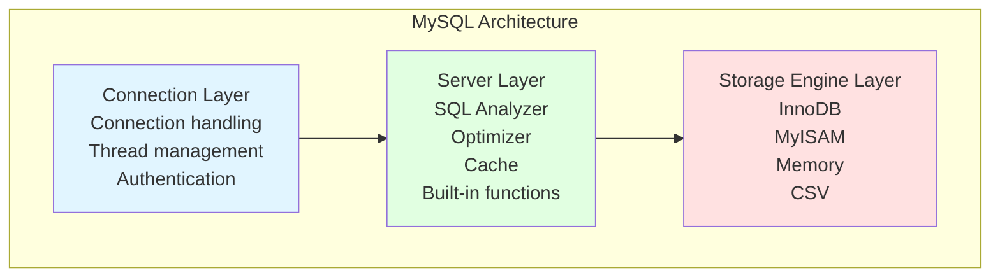

# MySQL Overview

## Why MySQL Matters

MySQL is the backbone of countless production systems. Understanding MySQL internals is critical for:

- **Performance optimization**: A single unoptimized query can degrade your entire application
- **Data integrity**: Proper transaction handling prevents financial discrepancies
- **System reliability**: Understanding replication prevents data loss
- **Interview success**: Database internals are a core topic in backend interviews

**Real-world impact**:
- A missing index can cause a query to take 10 seconds instead of 10 milliseconds
- Incorrect isolation level can cause phantom reads in financial transactions
- Not understanding deadlocks can lead to production outages

## MySQL at a Glance



**Key characteristics**:
- **Pluggable storage engines**: Switch between InnoDB, MyISAM, etc.
- **Client-server architecture**: Network connections, thread-per-connection
- **SQL standard compliant**: ACID transactions, foreign keys, views
- **Open source**: Widely supported, community-driven

## Quick Reference

### Storage Engines

| Feature | InnoDB | MyISAM |
|---------|--------|--------|
| **Transactions** | ✅ ACID | ❌ |
| **Locking** | Row-level | Table-level |
| **Foreign Keys** | ✅ | ❌ |
| **Crash Recovery** | ✅ | ❌ |
| **Default Since** | MySQL 5.5 | Before 5.5 |

### Transaction Isolation Levels

| Level | Dirty Read | Non-Repeatable | Phantom | Use Case |
|-------|------------|----------------|---------|----------|
| **Read Uncommitted** | ✅ | ✅ | ✅ | Rarely used |
| **Read Committed (RC)** | ❌ | ✅ | ✅ | Default in many DBs |
| **Repeatable Read (RR)** | ❌ | ❌ | ⚠️* | MySQL default |
| **Serializable** | ❌ | ❌ | ❌ | Strict consistency |

*MySQL InnoDB prevents phantom reads with Gap Locks

### Index Types

| Type | Description | Example |
|------|-------------|---------|
| **Primary** | Clustered, data stored with index | `PRIMARY KEY (id)` |
| **Secondary** | Non-clustered, stores PK value | `INDEX (email)` |
| **Unique** | Enforces uniqueness | `UNIQUE (username)` |
| **Composite** | Multi-column | `INDEX (name, age)` |
| **Full-text** | Text search | `FULLTEXT (content)` |

### Key Logs

| Log | Layer | Purpose |
|-----|-------|---------|
| **Binlog** | Server | Replication, recovery |
| **Redo Log** | InnoDB | Crash recovery (WAL) |
| **Undo Log** | InnoDB | Rollback, MVCC |

## Documentation Structure

This MySQL documentation is organized into 6 comprehensive sections:

### 1. [Architecture & Storage Engines](./architecture)

**What you'll learn**:
- MySQL's three-layer architecture
- InnoDB vs MyISAM comparison
- Query execution flow
- When to use different storage engines

**Why it matters**:
Choosing the wrong storage engine can lead to data corruption, poor concurrency, and inability to recover from crashes.

### 2. [Indexes](./indexes)

**What you'll learn**:
- B+ Tree structure and why MySQL uses it
- Clustered vs secondary indexes
- Leftmost prefix rule
- Covering indexes
- Index optimization techniques

**Why it matters**:
A single index can improve query performance by 1000x. Over-indexing can slow down writes.

### 3. [Transactions](./transactions)

**What you'll learn**:
- ACID properties with real-world examples
- Isolation levels and their trade-offs
- MVCC (Multi-Version Concurrency Control)
- Undo log and redo log roles

**Why it matters**:
Understanding isolation levels prevents phantom reads in financial systems. MVCC enables high concurrency without locking.

### 4. [Locking](./locking)

**What you'll learn**:
- Lock granularity (global, table, row)
- Lock modes (shared vs exclusive)
- Gap locks and next-key locks
- Deadlock detection and prevention

**Why it matters**:
Deadlocks can cause production outages. Understanding lock types helps diagnose performance issues.

### 5. [Logging & Replication](./logging-replication)

**What you'll learn**:
- Binlog, redo log, undo log differences
- Write-Ahead Logging (WAL)
- Master-slave replication process
- Replication lag monitoring

**Why it matters**:
Replication enables read scaling and disaster recovery. Proper log configuration ensures data durability.

### 6. [SQL Optimization](./optimization)

**What you'll learn**:
- EXPLAIN analysis
- Query optimization techniques
- Deep pagination optimization
- Schema design best practices

**Why it matters**:
Optimized queries reduce database load, improve response times, and lower infrastructure costs.

## Interview Question Checklist

Use this checklist to verify your MySQL knowledge:

### Architecture
- [ ] Explain MySQL's three-layer architecture
- [ ] Compare InnoDB and MyISAM
- [ ] When would you use MyISAM over InnoDB?
- [ ] What's the query cache and why was it removed in MySQL 8.0?

### Indexes
- [ ] Why does MySQL use B+ Tree instead of B Tree?
- [ ] What's the difference between clustered and secondary indexes?
- [ ] Explain the leftmost prefix rule with examples
- [ ] What is a covering index?
- [ ] Why does `WHERE YEAR(date) = 2024` not use an index?
- [ ] How do you optimize deep pagination (`LIMIT 1000000, 10`)?

### Transactions
- [ ] Explain ACID with real-world examples
- [ ] How does the undo log ensure atomicity?
- [ ] How does the redo log ensure durability?
- [ ] What's the difference between RC and RR isolation levels?
- [ ] How does MVCC work in InnoDB?

### Locking
- [ ] What's the difference between table locks and row locks?
- [ ] Explain S lock vs X lock
- [ ] What are intention locks used for?
- [ ] What's a gap lock and when is it used?
- [ ] How does InnoDB detect deadlocks?
- [ ] What's the difference between Record Lock, Gap Lock, and Next-Key Lock?

### Logging & Replication
- [ ] What's the difference between binlog, redo log, and undo log?
- [ ] How does WAL (Write-Ahead Logging) work?
- [ ] Explain MySQL master-slave replication process
- [ ] What's semi-synchronous replication?
- [ ] How do you monitor replication lag?

### Optimization
- [ ] How do you analyze a slow query?
- [ ] What's the difference between `ref` and `eq_ref` in EXPLAIN?
- [ ] Why does `WHERE LOWER(name) = 'alice'` not use an index?
- [ ] When should you denormalize your schema?
- [ ] How do you optimize `COUNT(*)` queries?

## Common Interview Questions

### Q1: Why is InnoDB the default storage engine?

**Answer**: InnoDB provides ACID compliance, row-level locking (better concurrency), crash recovery via redo log, and foreign key support. MyISAM lacks transactions and has table-level locking, making it unsuitable for high-concurrency OLTP workloads.

### Q2: What's the difference between clustered and secondary indexes?

**Answer**: A clustered index stores the actual data rows in the leaf nodes. In InnoDB, the primary key is the clustered index. Secondary indexes store the primary key value in their leaf nodes, requiring a second lookup to retrieve the full row.

### Q3: Explain MVCC in InnoDB

**Answer**: MVCC (Multi-Version Concurrency Control) allows multiple transactions to access the database concurrently without locking. InnoDB implements MVCC using undo logs, which store previous versions of rows. Each transaction sees a snapshot of data based on its read view, preventing dirty reads and enabling non-blocking reads.

### Q4: What's the difference between binlog and redo log?

**Answer**: The binlog is a server-level logical log recording SQL statements or row changes, used for replication and point-in-time recovery. The redo log is an InnoDB-specific physical log recording page modifications, used for crash recovery via WAL. The binlog is written after the transaction commits, while the redo log is written before.

### Q5: How do you optimize deep pagination?

**Answer**: Use delayed association (subquery with only primary key) or remember the last ID from the previous page. For example:
```sql
-- Slow: Scans 1,000,010 rows
SELECT * FROM orders ORDER BY id LIMIT 1000000, 10;

-- Fast: Subquery scans only primary key
SELECT o.* FROM orders o
INNER JOIN (SELECT id FROM orders ORDER BY id LIMIT 1000000, 10) tmp
ON o.id = tmp.id;
```

## Learning Path

**For interviews**:
1. Start with Architecture → understand the big picture
2. Indexes → most common interview topic
3. Transactions → ACID and isolation levels
4. Locking → deadlock scenarios
5. Logging & Replication → advanced topic
6. Optimization → practical applications

**For production work**:
1. Architecture → choose the right storage engine
2. Indexes → optimize your queries
3. Optimization → EXPLAIN and tuning
4. Transactions → choose the right isolation level
5. Locking → diagnose and prevent deadlocks
6. Logging & Replication → ensure data durability and availability

## Next Steps

Dive into the details by exploring each section:

- **[Architecture & Storage Engines](./architecture)** - Start here to understand MySQL's foundation
- **[Indexes](./indexes)** - Most critical for query performance
- **[Transactions](./transactions)** - Essential for data consistency
- **[Locking](./locking)** - Prevent and diagnose deadlocks
- **[Logging & Replication](./logging-replication)** - Ensure data durability
- **[SQL Optimization](./optimization)** - Make your queries fly
